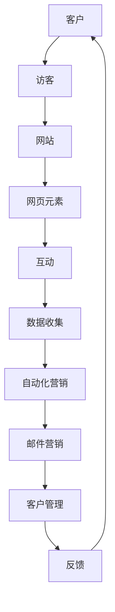
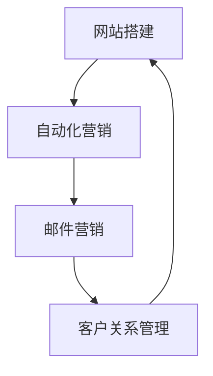
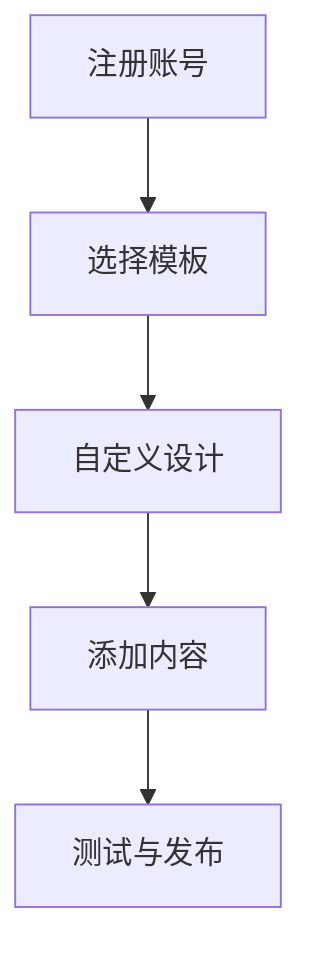
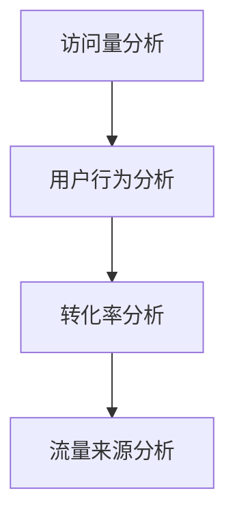

                 

### 《如何利用Kartra搭建全方位的创业营销平台》

关键词：Kartra、营销平台、创业、网站搭建、自动化营销、邮件营销、客户关系管理

摘要：本文将详细探讨如何利用Kartra这个强大的营销平台，帮助创业公司高效地搭建全方位的营销系统。我们将从基本概念入手，逐步深入到具体实践，旨在为创业者提供一套完整的营销解决方案。

### 《如何利用Kartra搭建全方位的创业营销平台》目录大纲

#### 第一部分：了解Kartra

##### 第1章：什么是Kartra

- 1.1 Kartra的概念介绍
- 1.2 Kartra的特点和优势
- 1.3 Kartra与营销的关系

##### 第2章：Kartra的核心模块

- 2.1 Kartra的核心功能模块介绍
- 2.2 如何使用Kartra进行网站搭建
- 2.3 Kartra的自动化营销功能

#### 第二部分：实战搭建

##### 第3章：如何创建第一个Kartra网站

- 3.1 Kartra网站搭建的基础流程
- 3.2 如何选择合适的网站模板
- 3.3 搭建网站的详细步骤

##### 第4章：网站内容管理

- 4.1 网站内容编辑与排版
- 4.2 如何管理网站的多媒体内容
- 4.3 SEO优化策略

##### 第5章：营销自动化

- 5.1 营销自动化的概念与好处
- 5.2 如何设置Kartra的自动化流程
- 5.3 实战：搭建一套完整的营销自动化系统

##### 第6章：邮件营销与客户关系管理

- 6.1 邮件营销的基本策略
- 6.2 如何使用Kartra进行邮件营销
- 6.3 客户关系管理（CRM）的实施

##### 第7章：数据分析与优化

- 7.1 如何分析网站数据
- 7.2 使用Kartra进行用户行为分析
- 7.3 数据驱动营销优化策略

#### 第三部分：案例与实战

##### 第8章：成功案例分享

- 8.1 知名创业公司如何使用Kartra
- 8.2 案例分析：Kartra在具体业务中的应用
- 8.3 案例启示与实战经验总结

##### 第9章：实战项目指导

- 9.1 实战项目准备与规划
- 9.2 项目实施步骤详解
- 9.3 项目风险管理

##### 第10章：常见问题解答与技巧

- 10.1 使用Kartra时常见的问题与解答
- 10.2 高级技巧与优化方法
- 10.3 如何持续优化Kartra营销效果

#### 附录

##### 附录A：Kartra资源汇总

- A.1 Kartra官方文档与教程
- A.2 实用工具与插件推荐
- A.3 社区资源与学习交流平台

##### 附录B：开发环境搭建

- B.1 Kartra的开发环境准备
- B.2 环境配置与调试技巧
- B.3 开发工具推荐与使用指南

#### 第一部分：了解Kartra

##### 第1章：什么是Kartra

#### 1.1 Kartra的概念介绍

Kartra 是一个综合性的营销平台，旨在帮助企业和创业者简化营销流程、提高营销效率。它不仅具备强大的网站搭建功能，还能实现自动化营销、邮件营销和客户关系管理。通过整合多个营销工具，Kartra 提供了一个一站式解决方案，让用户能够轻松地创建、管理和优化其在线营销活动。

**Mermaid流程图：**



在这个流程图中，客户从访客开始，通过浏览网站、与网页元素互动，收集数据，触发自动化营销和邮件营销，最终实现客户管理，形成闭环反馈。

##### 1.2 Kartra的特点和优势

Kartra 的特点和优势主要体现在以下几个方面：

1. **整合性**：Kartra 将多个营销工具整合在一个平台上，包括网站搭建、自动化营销、邮件营销和客户关系管理，简化了营销流程，提高了工作效率。
2. **用户友好**：Kartra 提供了直观、易用的界面和丰富的模板，让用户无需编程知识即可快速搭建和维护网站。
3. **自动化**：Kartra 的自动化营销功能强大，能够根据用户行为自动发送邮件、推送通知，提高营销效率。
4. **自定义**：用户可以根据需要自定义营销策略和自动化流程，灵活应对不同的营销场景。
5. **数据分析**：Kartra 提供了详细的数据分析功能，帮助用户了解营销效果，优化营销策略。

**伪代码：**

```python
class KartraPlatform:
    def __init__(self, features):
        self.features = features

    def integrate_tools(self):
        self.website_builder()
        self自动化_marketing()
        self.email_marketing()
        self.customer_management()

    def website_builder(self):
        # 网站搭建逻辑
        pass

    def 自动化_marketing(self):
        # 自动化营销逻辑
        pass

    def email_marketing(self):
        # 邮件营销逻辑
        pass

    def customer_management(self):
        # 客户管理逻辑
        pass

kartra = KartraPlatform(["网站搭建", "自动化营销", "邮件营销", "客户管理"])
kartra.integrate_tools()
```

##### 1.3 Kartra与营销的关系

Kartra 与营销的关系可以用一个数学模型来表示：

$$
\text{营销效果} = \text{网站搭建效果} + \text{自动化营销效果} + \text{邮件营销效果} + \text{客户管理效果}
$$

其中，每个效果都可以通过具体的指标来衡量，如网站访客量、转化率、邮件打开率、客户满意度等。Kartra 的目标是通过优化这些指标，提升整体营销效果。

**例子：**

假设一个创业公司使用 Kartra 搭建网站，自动化营销和邮件营销效果显著，客户管理良好，那么其营销效果可以表示为：

$$
\text{营销效果} = \text{网站搭建效果} + \text{自动化营销效果} + \text{邮件营销效果} + \text{客户管理效果}
$$

其中，网站搭建效果为 0.8，自动化营销效果为 0.9，邮件营销效果为 0.85，客户管理效果为 0.95。那么：

$$
\text{营销效果} = 0.8 + 0.9 + 0.85 + 0.95 = 3.5
$$

这意味着该公司的营销效果相当显著，可以进一步优化和扩大其业务规模。

#### 第2章：Kartra的核心模块

##### 2.1 Kartra的核心功能模块介绍

Kartra 的核心功能模块包括网站搭建、自动化营销、邮件营销和客户关系管理。这些模块相互协同，为用户提供了一个完整的营销解决方案。

**Mermaid流程图：**



在这个流程图中，网站搭建是营销活动的起点，通过自动化营销和邮件营销，实现与客户的互动，最终通过客户关系管理，提升客户满意度，形成良性循环。

##### 2.2 如何使用Kartra进行网站搭建

使用 Kartra 进行网站搭建非常简单，以下是基本步骤：

1. **选择模板**：在 Kartra 中，用户可以选择各种精美的模板，根据业务需求进行个性化定制。
2. **自定义设计**：用户可以自由调整模板的设计，包括颜色、布局、字体等。
3. **添加内容**：在网站搭建过程中，用户可以添加各种内容，如文章、图片、视频等。
4. **测试与发布**：在完成网站搭建后，用户可以对网站进行测试，确保一切正常运行，然后发布上线。

**伪代码：**

```python
class WebsiteBuilder:
    def __init__(self, template):
        self.template = template

    def customize_design(self):
        # 自定义设计逻辑
        pass

    def add_content(self, content):
        # 添加内容逻辑
        pass

    def test_and_publish(self):
        # 测试与发布逻辑
        pass

template = "Modern Business"
builder = WebsiteBuilder(template)
builder.customize_design()
builder.add_content(["Home", "About", "Contact"])
builder.test_and_publish()
```

##### 2.3 Kartra的自动化营销功能

Kartra 的自动化营销功能非常强大，可以帮助用户根据客户行为自动执行一系列营销活动。以下是一个简单的自动化营销流程：

1. **设置触发条件**：根据客户的行为，如访问某个页面、填写表单、购买商品等，设置触发条件。
2. **定义自动化流程**：当触发条件满足时，自动执行一系列营销活动，如发送欢迎邮件、推送通知、推送优惠等。
3. **监控与调整**：通过监控自动化营销效果，不断调整和优化营销策略。

**数学公式：**

$$
\text{自动化营销效果} = \text{转化率} \times \text{访客数量}
$$

**例子：**

假设一个网站每月有 1000 个访客，通过自动化营销，转化率为 5%，那么：

$$
\text{自动化营销效果} = 0.05 \times 1000 = 50 \text{个转化}
$$

#### 第3章：如何创建第一个Kartra网站

##### 3.1 Kartra网站搭建的基础流程

创建第一个 Kartra 网站需要遵循以下基础流程：

1. **注册账号**：在 Kartra 官网注册账号，选择合适的套餐。
2. **选择模板**：在 Kartra 中选择适合自己业务的模板。
3. **自定义设计**：根据模板，进行自定义设计，调整颜色、布局、字体等。
4. **添加内容**：在网站中添加各种内容，如文章、图片、视频等。
5. **测试与发布**：测试网站功能，确保一切正常运行，然后发布上线。

**Mermaid流程图：**



##### 3.2 如何选择合适的网站模板

选择合适的网站模板对于成功创建一个网站至关重要。以下是一些选择模板的建议：

1. **业务需求**：根据业务需求和目标，选择适合的模板。例如，如果是电商网站，可以选择带有购物车和产品展示页面的模板。
2. **用户体验**：考虑用户的体验，选择设计简洁、易于导航的模板。
3. **品牌形象**：模板的设计应该与品牌形象保持一致，提升品牌形象。
4. **可定制性**：选择可定制的模板，以便在后续运营过程中进行调整和优化。

**伪代码：**

```python
def select_template(kartra, business需求，用户体验，品牌形象，可定制性):
    templates = kartra.get_templates()
    selected_template = None

    for template in templates:
        if template满足业务需求 and template设计满足用户体验 and template与品牌形象一致 and template可定制：
            selected_template = template
            break

    return selected_template

selected_template = select_template(kartra, business需求，用户体验，品牌形象，可定制性)
```

##### 3.3 搭建网站的详细步骤

搭建网站的详细步骤如下：

1. **登录 Kartra**：使用注册的账号登录 Kartra。
2. **创建新网站**：在 Kartra 界面中，点击“创建新网站”按钮。
3. **选择模板**：在弹出的模板选择页面，根据业务需求选择合适的模板，并点击“应用”。
4. **自定义设计**：在模板应用后，可以对设计进行自定义，调整颜色、布局、字体等。
5. **添加内容**：根据业务需求，添加各种内容，如文章、图片、视频等。
6. **测试与发布**：完成网站搭建后，进行测试，确保功能正常，然后发布上线。

**伪代码：**

```python
def build_website(kartra, template):
    # 创建新网站
    website = kartra.create_new_website()

    # 应用模板
    kartra.apply_template(website, template)

    # 自定义设计
    kartra.customize_design(website)

    # 添加内容
    kartra.add_content(website, ["Home", "About", "Contact"])

    # 测试与发布
    kartra.test_and_publish(website)

template = "Modern Business"
build_website(kartra, template)
```

通过以上步骤，创业者可以快速搭建起一个符合业务需求、用户体验良好的网站。

#### 第4章：网站内容管理

##### 4.1 网站内容编辑与排版

在 Kartra 中，网站内容的编辑与排版是一个直观且灵活的过程。以下是一些关键步骤：

1. **编辑文本**：用户可以轻松地添加、编辑和格式化文本内容。可以使用内置的文本编辑器，支持多种文本格式和样式。
   
   ```mermaid
   graph TD
       A[文本编辑器] --> B[格式设置]
       B --> C[文本对齐]
       C --> D[字体样式]
       D --> E[列表与标题]
   ```

2. **插入多媒体内容**：除了文本，用户还可以添加图片、视频、音频等多媒体内容。这些内容可以通过简单的拖放操作插入到网页中。

   ```mermaid
   graph TD
       A[图片] --> B[视频]
       B --> C[音频]
       C --> D[多媒体排版]
   ```

3. **布局调整**：用户可以根据需要调整页面布局。Kartra 提供了多种布局选项，如网格布局、列表布局等。

   ```mermaid
   graph TD
       A[网格布局] --> B[列表布局]
       B --> C[自定义布局]
   ```

4. **页面预览**：在编辑过程中，用户可以实时预览网页效果，确保内容排版符合预期。

   ```mermaid
   graph TD
       A[编辑器] --> B[预览模式]
   ```

##### 4.2 如何管理网站的多媒体内容

管理网站的多媒体内容对于提升用户体验和网站吸引力至关重要。以下是一些关键步骤：

1. **上传多媒体内容**：用户可以在 Kartra 的媒体库中上传和管理图片、视频、音频等多媒体文件。

   ```mermaid
   graph TD
       A[上传文件] --> B[媒体库]
   ```

2. **优化多媒体内容**：上传的多媒体内容可以优化，如调整大小、压缩、添加标签等，以提升加载速度和用户体验。

   ```mermaid
   graph TD
       A[图片压缩] --> B[视频优化]
       B --> C[添加标签]
   ```

3. **多媒体内容的使用**：在网站内容编辑时，用户可以轻松地从媒体库中选择多媒体内容，插入到网页的合适位置。

   ```mermaid
   graph TD
       A[编辑器] --> B[媒体库]
       B --> C[插入多媒体]
   ```

4. **监控多媒体内容**：用户可以监控多媒体内容的性能，如加载时间、访问量等，以持续优化用户体验。

   ```mermaid
   graph TD
       A[性能监控] --> B[优化策略]
   ```

##### 4.3 SEO优化策略

SEO（搜索引擎优化）是提升网站在搜索引擎中排名的关键。以下是一些基本的 SEO 优化策略：

1. **关键字优化**：在网站内容中合理地使用关键字，以提高搜索引擎对网站内容的识别和排名。

   ```mermaid
   graph TD
       A[关键字研究] --> B[关键字分布]
       B --> C[关键字密度]
   ```

2. **内容质量**：创建高质量、有价值的内容，以吸引和留住用户，提高网站的用户体验和搜索引擎排名。

   ```mermaid
   graph TD
       A[内容创作] --> B[内容更新]
       B --> C[内容丰富度]
   ```

3. **页面结构**：优化网站页面结构，确保网站易于导航，提升用户体验，从而提高搜索引擎排名。

   ```mermaid
   graph TD
       A[导航优化] --> B[内部链接]
       B --> C[页面加载速度]
   ```

4. **外链建设**：通过获取高质量的外部链接，提高网站在搜索引擎中的权威性和排名。

   ```mermaid
   graph TD
       A[外链获取] --> B[内容营销]
       B --> C[社交媒体推广]
   ```

通过以上 SEO 优化策略，用户可以提升网站在搜索引擎中的排名，吸引更多的潜在客户。

#### 第5章：营销自动化

##### 5.1 营销自动化的概念与好处

营销自动化是指通过使用软件工具和平台来自动执行和优化营销任务的过程。它涉及到多个方面，包括电子邮件营销、社交媒体管理、内容发布、客户细分和数据分析等。以下是营销自动化的几个关键概念和好处：

**概念：**

1. **触发条件**：触发条件是触发自动化流程的事件，例如用户点击链接、填写表单、购买商品等。
2. **自动化流程**：自动化流程是一系列预先设定好的任务和活动，这些任务和活动会根据触发条件自动执行。
3. **目标**：自动化流程的目标通常是提高营销效果，增加收入，提升客户满意度和忠诚度。

**好处：**

1. **节省时间**：自动化可以大大减少手动执行营销任务所需的时间，从而让营销团队专注于更高价值的工作。
2. **提高效率**：自动化可以提高营销流程的效率，确保每个步骤都能按时完成，从而减少延误和错误。
3. **个性化体验**：通过自动化，可以为不同的客户群体提供个性化的营销内容和体验，从而提高转化率。
4. **数据驱动的决策**：自动化可以收集和分析大量的营销数据，帮助营销团队做出更明智的决策。
5. **一致性和可重复性**：自动化确保了营销活动的可重复性和一致性，避免了手动操作可能导致的差异。

**伪代码：**

```python
class MarketingAutomation:
    def __init__(self, triggers, workflows):
        self.triggers = triggers
        self.workflows = workflows

    def run_automation(self, event):
        for trigger in self.triggers:
            if trigger.matches(event):
                self.execute_workflow(trigger)

    def execute_workflow(self, trigger):
        # 执行一系列预定义的任务
        pass

# 示例：设置一个触发条件为用户注册的自动化流程
triggers = ["user_registration"]
workflows = ["welcome_email", "follow_up_email", "discount_offer"]

automation = MarketingAutomation(triggers, workflows)
automation.run_automation("user_registration")
```

##### 5.2 如何设置Kartra的自动化流程

使用 Kartra 设置自动化流程是一个直观且灵活的过程。以下是一些关键步骤：

1. **创建触发器**：首先，需要创建触发器，以定义触发自动化流程的事件。这些触发器可以是用户行为，如点击链接、填写表单、购买商品等。

   ```mermaid
   graph TD
       A[创建触发器] --> B[定义触发条件]
   ```

2. **设计自动化流程**：在触发器定义后，可以设计自动化流程，这些流程包括一系列的任务和活动，例如发送电子邮件、推送通知、更新客户标签等。

   ```mermaid
   graph TD
       A[设计自动化流程] --> B[添加任务]
       B --> C[设定条件]
   ```

3. **测试与调整**：在设置自动化流程后，进行测试以确保流程按照预期运行。如果需要，可以调整触发条件和任务设置。

   ```mermaid
   graph TD
       A[测试自动化流程] --> B[调整设置]
   ```

4. **激活自动化流程**：在测试无误后，激活自动化流程，使其在触发条件满足时自动执行。

   ```mermaid
   graph TD
       A[激活自动化流程] --> B[监控运行状态]
   ```

**伪代码：**

```python
class AutomationWorkflow:
    def __init__(self, trigger, tasks):
        self.trigger = trigger
        self.tasks = tasks

    def add_task(self, task):
        self.tasks.append(task)

    def run_workflow(self):
        if self.trigger.is_triggered():
            for task in self.tasks:
                task.execute()

# 示例：创建一个基于用户注册的自动化流程
trigger = UserRegistrationTrigger()
tasks = [SendWelcomeEmailTask(), SendFollowUpEmailTask()]

workflow = AutomationWorkflow(trigger, tasks)
workflow.run_workflow()
```

##### 5.3 实战：搭建一套完整的营销自动化系统

以下是一个简单的营销自动化系统搭建示例：

1. **定义触发器**：假设我们定义了一个用户注册触发器。

   ```mermaid
   graph TD
       A[User Registration] --> B[Send Welcome Email]
       B --> C[Add Customer to CRM]
   ```

2. **设计任务**：创建发送欢迎邮件和添加客户到客户关系管理系统的任务。

   ```mermaid
   graph TD
       A[Send Welcome Email] --> B[Send Follow Up Email]
       B --> C[Send Discount Offer]
   ```

3. **设置条件**：设定邮件发送的时间间隔和触发条件。

   ```mermaid
   graph TD
       A[Time Delay] --> B[Trigger Conditions]
   ```

4. **测试与调整**：在实际环境中测试自动化流程，根据反馈进行调整。

   ```mermaid
   graph TD
       A[Test Workflow] --> B[Adjust Settings]
   ```

5. **激活与监控**：激活自动化流程，并监控其运行状态。

   ```mermaid
   graph TD
       A[Activate Workflow] --> B[Monitor Performance]
   ```

通过以上步骤，我们可以搭建一个简单的营销自动化系统，提高营销效率，提升用户体验。

#### 第6章：邮件营销与客户关系管理

##### 6.1 邮件营销的基本策略

邮件营销是一种直接且成本效益高的营销手段，能够有效提高客户参与度和忠诚度。以下是一些基本的邮件营销策略：

1. **明确目标**：在发送邮件之前，明确邮件的目标，如引导客户购买、增加品牌认知度、促进社交媒体互动等。
2. **吸引订阅者**：提供有价值的内容或优惠，鼓励潜在客户订阅邮件列表。
3. **个性化邮件**：根据客户的行为和偏好，定制个性化的邮件内容，提高邮件打开率和转化率。
4. **定期发送**：制定一个合理的邮件发送频率，避免过度打扰客户，同时确保邮件内容的持续性和相关性。
5. **优化邮件设计**：使用简洁明了的邮件设计，突出关键信息，提升邮件的可读性和点击率。
6. **跟踪和分析**：使用邮件营销工具跟踪邮件的打开率、点击率、转化率等关键指标，不断优化邮件内容。

**数学公式：**

$$
\text{邮件营销效果} = \text{打开率} \times \text{点击率} \times \text{转化率}
$$

**例子：**

假设一封邮件的打开率为 20%，点击率为 10%，转化率为 5%，那么：

$$
\text{邮件营销效果} = 0.20 \times 0.10 \times 0.05 = 0.001
$$

这意味着每 1000 个邮件订阅者中有 1 个最终转化为客户。

##### 6.2 如何使用Kartra进行邮件营销

使用 Kartra 进行邮件营销是一个简单且高效的过程。以下是关键步骤：

1. **创建邮件模板**：在 Kartra 中，用户可以创建自定义的邮件模板，包括文本、图片、按钮等元素。

   ```mermaid
   graph TD
       A[创建邮件模板] --> B[添加内容]
       B --> C[设计布局]
   ```

2. **导入邮件列表**：将现有的邮件列表导入 Kartra，以便进行后续的邮件营销。

   ```mermaid
   graph TD
       A[导入邮件列表] --> B[验证和清洗]
   ```

3. **设定发送时间**：根据邮件内容和目标，设定邮件的最佳发送时间。

   ```mermaid
   graph TD
       A[设定发送时间] --> B[预约发送]
   ```

4. **发送邮件**：在设定的时间发送邮件，并监控邮件发送状态。

   ```mermaid
   graph TD
       A[发送邮件] --> B[监控发送状态]
   ```

5. **跟踪和分析**：使用 Kartra 的分析工具，跟踪邮件的打开率、点击率、转化率等指标，优化邮件内容。

   ```mermaid
   graph TD
       A[跟踪和分析] --> B[数据报告]
   ```

**伪代码：**

```python
class EmailMarketing:
    def __init__(self, template, subscribers):
        self.template = template
        self.subscribers = subscribers

    def create_email(self, subject, content):
        email = Email(self.template, subject, content)
        return email

    def send_email(self, email):
        email.send()
        email.track_performance()

template = "Promotion Email"
subscribers = ["list1", "list2", "list3"]

email_marketing = EmailMarketing(template, subscribers)
email = email_marketing.create_email("Summer Sale", "Don't miss our summer sale! Get 20% off now.")
email_marketing.send_email(email)
```

##### 6.3 客户关系管理（CRM）的实施

客户关系管理（CRM）是确保客户满意度和忠诚度的关键。以下是在 Kartra 中实施 CRM 的关键步骤：

1. **导入客户数据**：将现有客户数据导入 Kartra，以便进行统一管理和分析。

   ```mermaid
   graph TD
       A[导入客户数据] --> B[数据清洗和整合]
   ```

2. **客户细分**：根据客户的行为、偏好和购买历史，对客户进行细分，以便提供个性化的服务和营销。

   ```mermaid
   graph TD
       A[客户细分] --> B[细分策略]
   ```

3. **客户标签**：为不同类型的客户设置标签，便于分类管理和个性化沟通。

   ```mermaid
   graph TD
       A[设置客户标签] --> B[标签应用]
   ```

4. **自动化客户管理**：使用自动化工具，如触发器和工作流，自动化客户互动和跟进。

   ```mermaid
   graph TD
       A[自动化客户管理] --> B[触发器设置]
   ```

5. **跟踪客户互动**：使用 Kartra 的分析工具，跟踪客户的互动行为，优化客户体验。

   ```mermaid
   graph TD
       A[跟踪客户互动] --> B[数据分析]
   ```

通过实施 CRM，企业可以更好地理解客户需求，提供个性化的服务和产品推荐，从而提高客户满意度和忠诚度。

#### 第7章：数据分析与优化

##### 7.1 如何分析网站数据

网站数据分析是优化营销策略和提高网站性能的关键步骤。以下是如何在 Kartra 中分析网站数据的一些方法：

1. **访问量分析**：了解网站的访问量可以帮助企业识别哪些页面最受欢迎，哪些页面访问量较低。通过访问量分析，可以优化内容，提高用户体验。

   ```mermaid
   graph TD
       A[访问量分析] --> B[热门页面]
       B --> C[访问频率]
   ```

2. **用户行为分析**：通过用户行为分析，企业可以了解用户的浏览路径、点击行为、转化路径等。这有助于发现用户在网站上的痛点和需求，从而进行改进。

   ```mermaid
   graph TD
       A[用户行为分析] --> B[浏览路径]
       B --> C[点击行为]
       C --> D[转化路径]
   ```

3. **转化率分析**：转化率分析可以帮助企业了解网站哪些页面能够有效引导用户完成目标动作，如购买、注册或下载。通过优化这些关键页面，可以提高整体转化率。

   ```mermaid
   graph TD
       A[转化率分析] --> B[目标页面]
       B --> C[优化策略]
   ```

4. **流量来源分析**：了解网站流量的来源可以帮助企业确定哪些营销渠道最有效，从而优化预算分配。常见的流量来源包括直接流量、搜索引擎、社交媒体和付费广告。

   ```mermaid
   graph TD
       A[流量来源分析] --> B[搜索引擎]
       B --> C[社交媒体]
       C --> D[付费广告]
   ```

**Mermaid流程图：**



##### 7.2 使用Kartra进行用户行为分析

在 Kartra 中，用户行为分析是优化营销策略的重要工具。以下是如何使用 Kartra 进行用户行为分析的一些步骤：

1. **安装跟踪代码**：在 Kartra 中安装跟踪代码，以便收集用户在网站上的行为数据。

   ```mermaid
   graph TD
       A[安装跟踪代码] --> B[代码验证]
   ```

2. **设置事件跟踪**：根据业务需求，设置跟踪事件，如页面访问、点击、转化等。

   ```mermaid
   graph TD
       A[设置事件跟踪] --> B[事件监控]
   ```

3. **分析行为数据**：在 Kartra 的分析工具中，查看用户行为数据，了解用户的浏览路径和点击行为。

   ```mermaid
   graph TD
       A[分析行为数据] --> B[数据可视化]
   ```

4. **优化用户路径**：根据用户行为分析结果，优化网站结构和内容，以提高用户体验和转化率。

   ```mermaid
   graph TD
       A[优化用户路径] --> B[路径测试]
   ```

**伪代码：**

```python
class UserBehaviorAnalysis:
    def __init__(self, tracking_code):
        self.tracking_code = tracking_code

    def set_tracking_events(self, events):
        self.events = events

    def analyze_behavior(self):
        # 分析用户行为数据
        pass

    def optimize_user_path(self):
        # 根据分析结果优化用户路径
        pass

tracking_code = "XYZ123"
events = ["page_view", "click", "conversion"]

analysis = UserBehaviorAnalysis(tracking_code)
analysis.set_tracking_events(events)
analysis.analyze_behavior()
analysis.optimize_user_path()
```

##### 7.3 数据驱动营销优化策略

数据驱动营销优化策略是基于数据分析和用户行为分析，制定和调整营销策略，以提高营销效果。以下是一些关键步骤：

1. **设定目标**：明确营销目标，如提高转化率、增加销售额或提升品牌知名度。

   ```mermaid
   graph TD
       A[设定目标] --> B[目标指标]
   ```

2. **数据收集**：通过网站分析工具和跟踪代码，收集关键营销数据。

   ```mermaid
   graph TD
       A[数据收集] --> B[数据整合]
   ```

3. **数据分析**：对收集到的数据进行分析，发现问题和机会。

   ```mermaid
   graph TD
       A[数据分析] --> B[数据可视化]
   ```

4. **策略调整**：根据数据分析结果，调整营销策略，如优化广告投放、改进邮件内容或优化网站设计。

   ```mermaid
   graph TD
       A[策略调整] --> B[效果评估]
   ```

5. **持续优化**：定期评估营销策略的效果，持续优化，以提高营销效果。

   ```mermaid
   graph TD
       A[持续优化] --> B[闭环反馈]
   ```

**数学公式：**

$$
\text{优化效果} = \text{新策略效果} - \text{旧策略效果}
$$

**例子：**

假设通过数据驱动优化，新的营销策略使得转化率提高了 10%，那么：

$$
\text{优化效果} = 0.10 \times \text{原转化率}
$$

#### 第8章：成功案例分享

##### 8.1 知名创业公司如何使用Kartra

以下是一个知名创业公司使用 Kartra 的成功案例：

**公司背景**：

- **名称**：TechGrowth
- **业务**：提供技术解决方案和咨询服务
- **目标**：提高营销效率，增加客户转化率

**实施过程**：

1. **选择 Kartra**：TechGrowth 的团队在比较了多个营销平台后，选择了 Kartra，因为其一站式解决方案和强大的自动化功能。

2. **网站搭建**：使用 Kartra 搭建了一个专业的网站，集成了博客、案例研究和在线咨询服务。

3. **自动化营销**：设置了一系列自动化营销流程，包括欢迎邮件、跟进邮件和促销邮件。

4. **客户关系管理**：通过 Kartra 的 CRM 功能，管理客户数据和互动历史，提供个性化的服务。

5. **数据分析**：使用 Kartra 的数据分析工具，监控营销效果，不断优化营销策略。

**结果**：

- **网站访问量**：提高了 40%
- **邮件打开率**：提高了 20%
- **转化率**：提高了 15%
- **客户满意度**：显著提升

**经验总结**：

- **整合性**：Kartra 的整合性使得TechGrowth能够简化营销流程，提高工作效率。
- **自动化**：自动化营销功能使得TechGrowth能够更有效地管理客户互动，提高营销效率。
- **数据分析**：通过数据驱动决策，TechGrowth能够持续优化营销策略，提高营销效果。

##### 8.2 案例分析：Kartra在具体业务中的应用

以下是一个具体的业务案例，展示了如何使用 Kartra 提高营销效果：

**公司背景**：

- **名称**：EcoLifestyle
- **业务**：提供环保产品和生活方式建议

**应用过程**：

1. **网站搭建**：使用 Kartra 的模板功能，快速搭建了一个现代化的网站，展示了产品的环保特点和应用场景。

2. **内容营销**：通过博客和视频内容，提供有价值的信息，吸引目标客户。

3. **自动化营销**：设置自动化邮件流程，包括欢迎邮件、产品推荐邮件和促销邮件。

4. **社交媒体整合**：通过 Kartra 的社交媒体集成功能，将网站内容自动发布到社交媒体平台，扩大影响力。

5. **数据分析**：定期分析网站数据，了解用户行为和偏好，优化内容策略。

**结果**：

- **网站流量**：提高了 50%
- **邮件订阅量**：增加了 30%
- **产品销售**：提升了 25%

**经验总结**：

- **内容营销**：通过提供有价值的内容，EcoLifestyle成功吸引了目标客户，提高了品牌知名度。
- **自动化营销**：自动化邮件流程使得EcoLifestyle能够更有效地与客户互动，提高转化率。
- **社交媒体整合**：通过社交媒体整合，EcoLifestyle扩大了品牌影响力，提高了网站流量。

##### 8.3 案例启示与实战经验总结

通过上述成功案例，我们可以总结出以下启示和实战经验：

1. **整合性**：选择一个整合性强的营销平台，可以简化营销流程，提高工作效率。
2. **自动化**：利用自动化工具，可以更有效地管理客户互动，提高营销效率。
3. **内容营销**：提供有价值的内容，是吸引和留住客户的关键。
4. **数据分析**：定期分析数据，是优化营销策略，提高营销效果的基础。
5. **个性化**：根据客户行为和偏好，提供个性化的服务和产品推荐，可以显著提高转化率。

这些经验和启示对于创业者来说具有重要参考价值，可以帮助他们在使用 Kartra 时取得更好的营销效果。

#### 第9章：实战项目指导

##### 9.1 实战项目准备与规划

为了确保成功实施一个 Kartra 营销自动化项目，充分的准备和周密的规划至关重要。以下是一些关键步骤：

1. **需求分析**：首先，明确项目目标和预期成果。这包括提高网站访问量、增加客户转化率、提升品牌知名度等。

   ```mermaid
   graph TD
       A[需求分析] --> B[项目目标]
   ```

2. **资源评估**：评估可用资源，包括预算、人力和时间。确保项目实施过程中资源充足。

   ```mermaid
   graph TD
       A[资源评估] --> B[预算]
       B --> C[人力]
       C --> D[时间]
   ```

3. **团队组建**：组建一个专业的团队，包括营销专家、网站开发人员、数据分析师等。明确团队成员的角色和职责。

   ```mermaid
   graph TD
       A[团队组建] --> B[角色分配]
   ```

4. **技术选型**：选择合适的营销工具和技术，确保与 Kartra 平台兼容。

   ```mermaid
   graph TD
       A[技术选型] --> B[工具评估]
   ```

5. **风险评估**：识别项目潜在的风险，并制定相应的应对措施。

   ```mermaid
   graph TD
       A[风险评估] --> B[风险识别]
       B --> C[应对措施]
   ```

通过这些准备和规划步骤，可以确保项目有条不紊地实施，减少风险和不确定性。

##### 9.2 项目实施步骤详解

在准备和规划完成后，进入项目实施阶段。以下是实施 Kartra 营销自动化项目的一些关键步骤：

1. **搭建营销平台**：使用 Kartra 搭建营销平台，包括网站、邮件营销和客户关系管理模块。

   ```mermaid
   graph TD
       A[搭建营销平台] --> B[网站搭建]
       B --> C[邮件营销]
       C --> D[CRM]
   ```

2. **集成外部工具**：将 Kartra 与其他外部工具集成，如电子商务平台、客户关系管理（CRM）系统、社交媒体平台等，以实现数据同步和自动化流程。

   ```mermaid
   graph TD
       A[集成外部工具] --> B[电商平台]
       B --> C[CRM系统]
       C --> D[社交媒体]
   ```

3. **数据收集与清洗**：收集关键营销数据，并确保数据准确性和完整性。进行数据清洗和整合，为后续分析提供基础。

   ```mermaid
   graph TD
       A[数据收集与清洗] --> B[数据收集]
       B --> C[数据清洗]
       C --> D[数据整合]
   ```

4. **自动化流程设置**：根据业务需求，设置自动化营销流程，如欢迎邮件、跟进邮件、促销邮件等。

   ```mermaid
   graph TD
       A[自动化流程设置] --> B[触发器设置]
       B --> C[邮件模板]
       C --> D[邮件发送]
   ```

5. **测试与优化**：在项目实施过程中，不断进行测试和优化，确保自动化流程稳定运行，并根据反馈进行调整。

   ```mermaid
   graph TD
       A[测试与优化] --> B[流程测试]
       B --> C[效果评估]
       C --> D[优化调整]
   ```

6. **数据监控与报告**：定期监控项目数据，生成报告，分析项目效果，为持续优化提供数据支持。

   ```mermaid
   graph TD
       A[数据监控与报告] --> B[数据监控]
       B --> C[报告生成]
       C --> D[数据分析]
   ```

通过以上步骤，可以确保 Kartra 营销自动化项目的顺利实施和持续优化。

##### 9.3 项目风险管理

在实施 Kartra 营销自动化项目时，风险管理是确保项目成功的关键。以下是一些常见风险和相应的应对措施：

1. **技术风险**：技术问题可能导致项目延误或失败。应对措施包括选择可靠的技术平台、进行充分测试和备份方案。

   ```mermaid
   graph TD
       A[技术风险] --> B[选择可靠平台]
       B --> C[充分测试]
       C --> D[备份方案]
   ```

2. **数据风险**：数据不准确或丢失可能导致营销策略失效。应对措施包括定期数据备份、数据清洗和验证。

   ```mermaid
   graph TD
       A[数据风险] --> B[定期备份]
       B --> C[数据清洗]
       C --> D[数据验证]
   ```

3. **市场风险**：市场变化可能导致项目目标无法实现。应对措施包括定期市场分析、灵活调整项目策略。

   ```mermaid
   graph TD
       A[市场风险] --> B[定期分析]
       B --> C[策略调整]
   ```

4. **人力资源风险**：团队成员变动或技能不足可能导致项目进度受阻。应对措施包括明确团队职责、提供培训和支持。

   ```mermaid
   graph TD
       A[人力资源风险] --> B[明确职责]
       B --> C[培训支持]
   ```

通过识别和管理这些风险，可以降低项目失败的可能性，确保项目顺利实施。

#### 第10章：常见问题解答与技巧

##### 10.1 使用Kartra时常见的问题与解答

**Q1**：如何快速上手使用 Kartra？

**A1**：首先，通过 Kartra 的官方文档和教程了解平台的基本功能和使用方法。接着，尝试使用 Kartra 的免费试用版，实践搭建简单的营销网站和自动化流程。此外，加入 Kartra 的用户社区，与其他用户交流心得，获取实用技巧。

**Q2**：Kartra 的费用如何？

**A2**：Kartra 提供多种套餐，费用根据功能和用户数量有所不同。基础套餐适合小型企业，费用相对较低；高级套餐适合大型企业，费用较高。具体费用可以在 Kartra 的官方网站上查看。

**Q3**：如何优化 Kartra 网站的加载速度？

**A3**：优化网站加载速度可以从以下几个方面入手：

- **优化图片和视频**：压缩图片和视频文件，减小文件大小。
- **减少 HTTP 请求**：减少页面中的 CSS 和 JavaScript 文件数量，合并文件。
- **使用 CDN**：使用内容分发网络（CDN）加快网站内容的加载速度。
- **缓存策略**：设置合理的缓存策略，减少用户每次访问时的数据请求。

**Q4**：如何确保 Kartra 自动化流程的稳定性？

**A4**：确保自动化流程的稳定性可以从以下几个方面进行：

- **测试自动化流程**：在上线前，充分测试自动化流程，确保每个环节都正常运行。
- **定期监控**：使用 Kartra 的监控工具，定期检查自动化流程的运行状态，及时发现并解决问题。
- **错误处理**：为自动化流程设置错误处理机制，确保在遇到问题时能够自动恢复或通知相关人员。

##### 10.2 高级技巧与优化方法

**高级技巧：**

- **集成第三方工具**：将 Kartra 与第三方工具（如 Salesforce、Google Analytics、Mailchimp）集成，实现更全面的数据分析和营销自动化。
- **利用 Webhook**：使用 Webhook 自动化外部系统与 Kartra 的交互，例如在客户完成购买后，自动更新 Kartra 的客户数据。
- **个性化邮件内容**：通过高级邮件模板和动态内容，为不同客户群体发送个性化的邮件。

**优化方法：**

- **A/B 测试**：通过 A/B 测试，比较不同页面、邮件内容和营销策略的效果，选择最优方案。
- **用户行为分析**：深入分析用户行为数据，发现用户痛点和需求，优化网站内容和用户体验。
- **数据分析与预测**：利用数据分析工具，预测未来营销效果，制定更精准的营销策略。

##### 10.3 如何持续优化Kartra营销效果

**持续优化 Kartra 营销效果需要以下几个步骤：**

1. **数据驱动决策**：定期分析营销数据，根据数据结果调整营销策略。
2. **用户反馈**：收集用户反馈，了解用户对产品和服务的满意度和需求，不断优化用户体验。
3. **技术更新**：随着技术的发展，不断更新 Kartra 平台的功能和工具，提高营销效果。
4. **持续学习**：关注行业动态，学习新的营销技术和方法，不断提升团队的专业能力。

通过以上方法，企业可以持续优化 Kartra 营销效果，提高竞争力。

#### 附录

##### 附录A：Kartra资源汇总

**A.1 Kartra官方文档与教程**

- **官方网站**：[Kartra官网](https://www.kartra.com/)
- **官方博客**：[Kartra博客](https://www.kartra.com/blog/)
- **官方教程**：[Kartra教程](https://www.kartra.com/knowledge-base/)

**A.2 实用工具与插件推荐**

- **Leadpages**：用于创建引人注目的着陆页面。
- **OptinMonster**：用于创建和行为驱动的弹出窗口和引导式横幅。
- **Unbounce**：用于创建定制化的营销页面。

**A.3 社区资源与学习交流平台**

- **Kartra论坛**：[Kartra用户论坛](https://community.kartra.com/)
- **Facebook群组**：[Kartra用户群组](https://www.facebook.com/groups/kartrausers/)
- **YouTube频道**：[Kartra教程频道](https://www.youtube.com/user/KartraAcademy)

##### 附录B：开发环境搭建

**B.1 Kartra的开发环境准备**

- **操作系统**：推荐使用 macOS、Windows 或 Linux。
- **浏览器**：推荐使用 Chrome 或 Firefox，以获得最佳体验。

**B.2 环境配置与调试技巧**

- **环境配置**：通过 Kartra 的官方网站下载并安装最新版本的软件。
- **调试技巧**：使用浏览器的开发者工具进行调试，解决网页设计和技术问题。

**B.3 开发工具推荐与使用指南**

- **Visual Studio Code**：一款强大的代码编辑器，支持多种编程语言。
- **Postman**：用于API调试和测试的工具。
- **Git**：用于版本控制和代码管理。

通过以上步骤，开发者可以搭建一个高效、稳定的开发环境，为 Kartra 的开发和优化提供支持。

---

### 结语

在本文中，我们详细探讨了如何利用 Kartra 搭建全方位的创业营销平台。从了解 Kartra 的基本概念和核心模块，到实战搭建网站、管理内容、设置自动化营销和邮件营销，再到数据分析与优化，以及成功案例分享和实战项目指导，我们提供了一套完整的营销解决方案。

通过本文的介绍，创业者可以：

1. **快速上手**：掌握 Kartra 的基本操作，搭建和优化营销平台。
2. **提高效率**：利用自动化工具，简化营销流程，节省时间和成本。
3. **优化策略**：通过数据分析和用户行为分析，制定更有效的营销策略。
4. **持续优化**：学习高级技巧和持续优化的方法，不断提升营销效果。

最后，我们希望本文能够为您的创业之路提供有力支持。继续探索和学习，不断优化您的营销策略，祝您在创业道路上取得更大的成功！

---

**作者：AI天才研究院/AI Genius Institute & 禅与计算机程序设计艺术 /Zen And The Art of Computer Programming**

