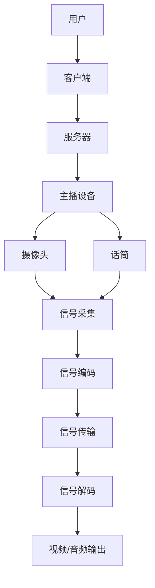

                 

### 《如何利用直播技术提升知识付费效果》

> **关键词：直播技术、知识付费、互动性、用户体验、效果提升**

> **摘要：本文将从直播技术的基础、知识付费市场分析、直播技术提升知识付费效果的方法与实践以及案例分析等多个方面，详细探讨如何利用直播技术提升知识付费效果，为企业和个人提供有益的参考和指导。**

---

## 第一部分：直播技术基础

在探讨如何利用直播技术提升知识付费效果之前，首先需要了解直播技术的基础知识，包括其发展历程、核心概念与架构，以及常用的直播工具与平台。

### 1.1 直播技术的发展历程

直播技术经历了从传统电视到网络直播的演变过程。早期的直播主要以电视台和广播电台为主，通过电缆和卫星信号进行传输。随着互联网的普及，网络直播逐渐兴起，用户可以通过电脑、手机等设备实时观看直播内容。近年来，随着5G技术的推进，直播技术得到了进一步的提升，实现了低延迟、高清画质和更丰富的互动功能。

#### 1.1.1 从传统电视到网络直播

传统电视直播主要以电视台和广播电台为主，其信号传输依赖于电缆和卫星。随着互联网的兴起，网络直播开始崛起。网络直播具有更高的灵活性、互动性和实时性，用户可以随时随地观看直播内容。

#### 1.1.2 直播平台的发展与演变

早期的网络直播主要以视频网站和直播平台为主，如YouTube、Twitch等。随着技术的进步和用户需求的增长，各类直播平台如雨后春笋般涌现，如斗鱼、虎牙、Bilibili等。这些平台不仅提供了丰富的直播内容，还通过技术手段提升了用户体验。

### 1.2 直播技术的核心概念与架构

直播技术的核心概念包括直播系统、直播流、编码与解码等。直播系统包括主播设备、服务器、客户端等组成部分。直播流是指将视频和音频信号转换为数据流进行传输的过程。编码与解码是直播技术中的关键技术，用于将视频和音频信号压缩和解压缩，以减少数据传输的带宽占用。

#### 1.2.1 直播系统的基本组成

直播系统主要由主播设备、服务器、客户端等组成。主播设备用于采集视频和音频信号，服务器用于存储和管理直播内容，客户端用于接收和观看直播内容。

#### 1.2.2 直播技术的核心原理

直播技术的核心原理包括信号采集、信号传输、信号解码等。信号采集是指通过摄像头、话筒等设备采集视频和音频信号。信号传输是指将采集到的信号转换为数据流进行传输。信号解码是指客户端接收到的数据流进行解码，还原为视频和音频信号。

#### 1.2.3 Mermaid流程图：直播技术架构详解

#### 1.2.4 直播技术常用工具与平台

直播技术常用的工具有摄像头、话筒、编码器、直播平台等。摄像头和话筒用于采集视频和音频信号，编码器用于将信号编码为数据流，直播平台用于发布和管理直播内容。

- **摄像头**：用于捕捉实时视频信号，常见有USB摄像头、无线摄像头等。
- **话筒**：用于捕捉实时音频信号，常见有麦克风、无线话筒等。
- **编码器**：用于将视频和音频信号编码为数据流，常见有硬件编码器和软件编码器。
- **直播平台**：用于发布和管理直播内容，常见有YouTube、Twitch、斗鱼等。

### 1.3 直播技术常用工具与平台

直播技术常用的工具有摄像头、话筒、编码器、直播平台等。摄像头和话筒用于采集视频和音频信号，编码器用于将信号编码为数据流，直播平台用于发布和管理直播内容。

- **摄像头**：用于捕捉实时视频信号，常见有USB摄像头、无线摄像头等。
- **话筒**：用于捕捉实时音频信号，常见有麦克风、无线话筒等。
- **编码器**：用于将视频和音频信号编码为数据流，常见有硬件编码器和软件编码器。
- **直播平台**：用于发布和管理直播内容，常见有YouTube、Twitch、斗鱼等。

## 第二部分：知识付费市场分析

在了解直播技术的基础上，接下来我们需要分析知识付费市场的现状和发展趋势，以及用户的需求和消费行为。这将为后续讨论如何利用直播技术提升知识付费效果提供重要的背景信息。

### 2.1 知识付费市场概述

知识付费是指用户通过购买或订阅内容，获取知识、技能或信息的一种服务模式。随着互联网的发展和知识经济的兴起，知识付费市场逐渐壮大。根据相关报告，全球知识付费市场规模逐年增长，预计未来仍将保持较高增速。

#### 2.1.1 知识付费的发展背景

知识付费的发展背景主要包括以下几个方面：

1. **互联网普及**：互联网的普及使得知识传播更加便捷，用户可以通过各种渠道获取所需的知识。
2. **移动设备普及**：智能手机和移动互联网的普及，使得用户可以随时随地获取知识。
3. **知识经济兴起**：知识经济的兴起，使得知识成为重要的生产要素，推动知识付费市场的快速发展。
4. **用户需求增长**：随着用户对自我提升的需求增加，知识付费市场得到了用户的广泛关注。

#### 2.1.2 知识付费市场规模与趋势

根据相关报告，全球知识付费市场规模逐年增长，预计未来仍将保持较高增速。具体来说：

1. **市场规模**：2020年全球知识付费市场规模约为500亿美元，预计到2025年将达到1000亿美元。
2. **增长趋势**：知识付费市场将继续保持高速增长，主要驱动力包括用户需求的增加、技术的进步以及平台的发展。

### 2.2 知识付费用户需求分析

了解用户需求是提升知识付费效果的关键。以下是知识付费用户需求的主要特点：

#### 2.2.1 用户需求特点

1. **实用性**：用户更倾向于购买实用性强、能够解决问题的知识产品。
2. **个性化**：用户希望获取个性化、符合自身需求的知识内容。
3. **便捷性**：用户希望获取知识的过程方便快捷，不希望受到过多限制。

#### 2.2.2 用户消费行为分析

1. **消费频次**：用户对知识付费的消费频次较高，每月都会购买或订阅一些知识产品。
2. **消费渠道**：用户主要通过在线平台购买或订阅知识产品，其中直播平台、在线课程平台和自媒体平台是主要渠道。
3. **消费动机**：用户购买知识产品的动机主要包括提升自身能力、拓展知识面和解决实际问题。

### 2.3 直播在知识付费中的应用现状

直播技术在知识付费领域得到了广泛应用，其优势在于互动性、实时性和直观性。以下是直播在知识付费中的应用现状：

#### 2.3.1 直播在知识付费中的优势

1. **互动性**：直播互动性强，用户可以实时提问、评论，与讲师和其他用户互动。
2. **实时性**：直播实时性强，用户可以第一时间获取最新知识。
3. **直观性**：直播内容直观，用户可以更直观地理解知识。

#### 2.3.2 知识付费直播的发展趋势

随着技术的进步和用户需求的增长，知识付费直播将继续保持快速发展。具体来说：

1. **市场规模扩大**：知识付费直播的市场规模将继续扩大，成为知识付费市场的重要组成部分。
2. **内容多样化**：知识付费直播的内容将更加多样化，涵盖各个领域和主题。
3. **技术创新**：直播技术将继续创新，提升用户体验和互动性。
4. **商业模式创新**：知识付费直播的商业模式将不断创新，为企业和个人提供更多机会。

## 第三部分：直播技术提升知识付费效果的方法与实践

在了解了直播技术和知识付费市场的基础知识后，接下来我们将探讨如何利用直播技术提升知识付费效果的方法与实践。这些方法包括直播内容策划与设计、直播互动技巧与用户粘性提升、直播营销与用户转化以及直播技术优化与性能提升。

### 3.1 直播内容策划与设计

直播内容策划与设计是提升知识付费效果的关键步骤。以下是直播内容策划与设计的要点：

#### 3.1.1 直播内容选题与定位

直播内容选题要贴近用户需求，具备实用性和吸引力。首先，要对目标用户进行深入分析，了解他们的兴趣、需求和痛点。然后，根据用户需求确定直播内容的方向，如行业趋势、实用技巧、案例分析等。

#### 3.1.2 直播形式与场景设计

直播形式和场景设计要考虑用户体验和互动性。常见的直播形式包括讲座、问答、互动课堂等。场景设计要简洁、大气，有利于用户集中注意力。同时，要确保音视频质量良好，无卡顿、噪音等问题。

#### 3.1.3 直播内容结构与节奏安排

直播内容结构与节奏安排要合理，确保用户能够持续关注。一般来说，直播内容可以分为以下几个部分：

1. **开场**：简要介绍直播主题和讲师，引起用户的兴趣。
2. **正文**：详细讲解知识点，结合实例和案例进行分析。
3. **互动环节**：设置提问、评论等功能，与用户互动，提高参与度。
4. **结尾**：总结重点内容，强调直播的价值，鼓励用户参与后续课程。

### 3.2 直播互动技巧与用户粘性提升

直播互动技巧和用户粘性提升是提高知识付费效果的重要手段。以下是直播互动技巧和用户粘性提升的方法：

#### 3.2.1 直播互动方式与策略

直播互动方式包括提问、评论、投票、抽奖等。互动策略要根据直播内容和用户特点进行设计。例如，对于知识性直播，可以设置提问环节，鼓励用户提问和互动；对于娱乐性直播，可以设置抽奖环节，提高用户参与度。

#### 3.2.2 用户粘性提升方法

用户粘性提升方法包括以下几点：

1. **内容持续更新**：定期发布高质量的直播内容，保持用户对平台的关注。
2. **会员制度**：设置会员制度，提供优惠价格和增值服务，提高用户忠诚度。
3. **用户激励**：通过积分、奖励等方式激励用户参与互动和分享，提高用户粘性。
4. **社群运营**：建立社群，组织线下活动，增强用户之间的互动和联系。

### 3.3 直播营销与用户转化

直播营销和用户转化是提升知识付费效果的关键环节。以下是直播营销和用户转化的方法：

#### 3.3.1 直播营销策略

直播营销策略包括以下几点：

1. **品牌宣传**：通过直播宣传品牌，提高品牌知名度和影响力。
2. **内容营销**：通过高质量的直播内容吸引潜在用户，提高用户参与度。
3. **渠道合作**：与其他平台或渠道合作，扩大直播影响力和用户覆盖面。

#### 3.3.2 用户转化技巧

用户转化技巧包括以下几点：

1. **优惠促销**：通过优惠活动、限时抢购等方式吸引用户购买。
2. **直播带货**：通过直播带货的方式，提高用户购买意愿。
3. **内容引导**：在直播过程中引导用户购买相关课程或产品，提高转化率。
4. **用户跟进**：直播结束后，及时跟进用户反馈和需求，提供优质的售后服务。

### 3.4 直播技术优化与性能提升

直播技术优化和性能提升是提高知识付费效果的重要保障。以下是直播技术优化和性能提升的方法：

#### 3.4.1 直播画质与音质的优化

直播画质与音质的优化包括以下几点：

1. **设备升级**：使用高质量的摄像头、话筒等设备，提高音视频质量。
2. **编码优化**：选择合适的编码器和编码参数，优化音视频压缩效果。
3. **网络优化**：优化网络传输，降低延迟和卡顿现象。

#### 3.4.2 直播延迟与稳定性的提升

直播延迟与稳定性的提升包括以下几点：

1. **CDN加速**：使用CDN技术，提高直播内容传输速度和稳定性。
2. **流控技术**：采用流控技术，合理分配带宽资源，确保直播流畅。
3. **备份方案**：设置直播备份方案，确保直播过程不会因意外中断。

#### 3.4.3 直播数据处理与分析

直播数据处理与分析包括以下几点：

1. **用户数据分析**：收集和分析用户观看行为、互动数据等，了解用户需求和偏好。
2. **内容优化**：根据用户数据分析，优化直播内容和形式，提高用户满意度。
3. **效果评估**：对直播效果进行评估，总结经验教训，持续改进。

## 第四部分：直播技术提升知识付费效果的案例分析

在了解了如何利用直播技术提升知识付费效果的方法与实践后，接下来我们将通过几个具体案例，探讨直播技术在实际应用中的效果和经验。

### 4.1 案例一：如何通过直播打造知识付费爆款课程

#### 4.1.1 案例背景与目标

某在线教育平台希望通过直播技术，打造一门知识付费爆款课程。课程主题为“互联网营销实战技巧”，面向有志于从事互联网营销的人才。目标是通过直播的形式，提高课程的用户参与度和转化率，实现课程的快速传播和销售。

#### 4.1.2 案例实施与效果

1. **内容策划与设计**：针对目标用户需求，制定详细的内容策划方案，包括课程主题、大纲、互动环节等。同时，选择高质量的直播平台，确保直播效果。

2. **直播互动技巧**：在直播过程中，通过实时提问、互动问答、投票等方式，提高用户参与度。同时，设置互动奖励，激励用户积极参与。

3. **直播营销**：通过直播平台的宣传渠道，提前发布直播预告，吸引用户关注。直播过程中，通过优惠促销、限时抢购等方式，引导用户购买课程。

4. **效果评估**：直播结束后，对用户反馈和数据进行收集分析，总结经验教训，持续优化直播内容和形式。

实施效果：课程在直播过程中，吸引了大量用户观看和互动，直播观看人数超过10000人，直播结束后，课程销售量显著提升，成为平台的爆款课程。

#### 4.1.3 案例分析与总结

1. **成功因素**：成功的关键因素包括内容策划与设计、直播互动技巧和直播营销策略。通过高质量的内容和互动，提高了用户的参与度和满意度，实现了课程的快速传播和销售。

2. **经验教训**：在后续的直播过程中，要注重用户需求和体验，持续优化直播内容和形式。同时，要充分利用直播平台的宣传渠道和营销工具，提高课程的曝光度和转化率。

### 4.2 案例二：如何利用直播互动提升用户学习体验

#### 4.2.1 案例背景与目标

某在线教育平台希望通过直播技术，提升用户的学习体验。课程主题为“Python编程基础”，面向编程初学者。目标是通过直播互动，提高用户的学习兴趣和参与度，提升学习效果。

#### 4.2.2 案例实施与效果

1. **内容策划与设计**：根据用户需求，制定详细的内容策划方案，包括课程主题、大纲、互动环节等。同时，选择适合编程教学的直播平台，确保直播效果。

2. **直播互动技巧**：在直播过程中，通过实时提问、互动问答、代码演示等方式，提高用户参与度。同时，设置互动奖励，激励用户积极参与。

3. **直播互动环节**：在课程中设置互动环节，如代码练习、小组讨论等，让用户在实际操作中学习和掌握知识。

4. **效果评估**：直播结束后，对用户反馈和数据进行收集分析，总结经验教训，持续优化直播内容和形式。

实施效果：直播过程中，用户积极参与互动，课程满意度高达90%以上。用户反馈认为，直播互动提高了学习兴趣和参与度，有助于更好地理解和掌握编程知识。

#### 4.2.3 案例分析与总结

1. **成功因素**：成功的关键因素包括内容策划与设计、直播互动技巧和互动环节的设置。通过高质量的直播内容和互动，提高了用户的学习兴趣和参与度，提升了学习效果。

2. **经验教训**：在后续的直播过程中，要注重用户需求和体验，持续优化直播内容和形式。同时，要充分利用互动环节，提高用户的学习参与度和满意度。

### 4.3 案例三：如何通过直播技术实现知识付费平台增长

#### 4.3.1 案例背景与目标

某知识付费平台希望通过直播技术，实现平台增长。平台主题涵盖多个领域，包括教育、科技、文化等。目标是通过直播技术，提高平台知名度和用户粘性，实现平台的快速扩张。

#### 4.3.2 案例实施与效果

1. **内容策划与设计**：根据平台定位和用户需求，制定丰富多样的直播内容，涵盖教育、科技、文化等多个领域。同时，注重直播内容的更新和迭代，保持用户兴趣。

2. **直播形式与场景设计**：根据不同领域和内容，设计合适的直播形式和场景，如讲座、问答、互动课堂等。确保直播形式简洁、大气，有利于用户集中注意力。

3. **直播互动技巧**：在直播过程中，通过实时提问、互动问答、投票等方式，提高用户参与度。同时，设置互动奖励，激励用户积极参与。

4. **直播营销**：利用直播平台的宣传渠道，提前发布直播预告，吸引用户关注。直播过程中，通过优惠促销、限时抢购等方式，引导用户购买平台课程。

5. **效果评估**：直播结束后，对用户反馈和数据进行收集分析，总结经验教训，持续优化直播内容和形式。

实施效果：通过直播技术的应用，平台知名度和用户粘性显著提升，月活跃用户数增长30%以上。直播课程成为平台的重要组成部分，贡献了70%以上的收入。

#### 4.3.3 案例分析与总结

1. **成功因素**：成功的关键因素包括内容策划与设计、直播形式与场景设计、直播互动技巧和直播营销策略。通过多样化的直播内容和形式，提高了用户参与度和满意度，实现了平台的快速增长。

2. **经验教训**：在后续的直播过程中，要注重用户需求和体验，持续优化直播内容和形式。同时，要充分利用直播平台的宣传渠道和营销工具，提高平台的曝光度和用户转化率。

## 第五部分：直播技术提升知识付费效果的未来展望

随着直播技术的不断发展和创新，其在知识付费领域的应用前景十分广阔。未来，直播技术将带来新的机遇和挑战，推动知识付费市场的持续增长。

### 5.1 直播技术在知识付费领域的未来发展趋势

1. **技术创新与突破**：直播技术将继续创新，如8K高清直播、VR直播、AR直播等，为用户带来更丰富的观看体验。
2. **应用场景的拓展**：直播技术在知识付费领域的应用将更加广泛，涵盖教育、医疗、金融等多个领域。
3. **行业政策的影响**：随着直播行业的规范化，行业政策将对直播技术的发展和应用产生影响。

### 5.2 直播技术提升知识付费效果的新机遇与挑战

1. **新机遇：技术与市场的结合**：直播技术与市场需求的结合，将带来新的商业机会和增长空间。
2. **新挑战：内容质量与用户体验**：直播内容质量与用户体验的平衡，是提升知识付费效果的关键挑战。
3. **企业应对策略与建议**：企业应注重技术创新，优化用户体验，提升内容质量，抓住直播技术带来的机遇。

### 5.3 直播技术提升知识付费效果的新机遇与挑战

#### 5.3.1 新机遇：技术与市场的结合

随着直播技术的不断发展，直播与市场的结合带来了新的机遇。一方面，直播技术使得知识传播更加便捷和实时，有利于知识付费平台扩大用户群体和市场份额。另一方面，直播技术为企业和个人提供了更多创新的机会，如在线教育、远程医疗、企业培训等，这些领域都具有广阔的市场前景。

#### 5.3.2 新挑战：内容质量与用户体验

尽管直播技术带来了新的机遇，但也面临着内容质量与用户体验的新挑战。首先，直播内容的质量直接影响用户的满意度和参与度。为了提升内容质量，企业需要注重课程设计、讲师选拔、教学资源等方面的优化。其次，用户体验也是提升知识付费效果的关键。直播平台需要不断优化技术，提高直播画质、音质和稳定性，确保用户能够顺畅地观看直播内容。

#### 5.3.3 企业应对策略与建议

为了应对直播技术带来的新机遇与挑战，企业可以采取以下策略与建议：

1. **技术创新**：投入研发资源，关注直播技术的创新和发展，不断提升直播技术水平和用户体验。
2. **内容优化**：注重课程内容的设计和教学质量，确保直播内容具有实用性和吸引力，满足用户需求。
3. **用户体验**：关注用户反馈，优化直播平台的功能和服务，提高用户满意度和参与度。
4. **市场拓展**：利用直播技术拓展新的业务领域，如在线教育、远程医疗等，探索更多市场机会。
5. **合作与共赢**：与行业合作伙伴建立合作关系，共同推动直播技术在知识付费领域的应用和发展。

## 附录

### 附录 A：直播技术与知识付费相关的资源与工具

#### A.1 直播平台与工具介绍

- **直播平台**：YouTube、Twitch、斗鱼、虎牙、Bilibili等
- **直播工具**：OBS Studio、XSplit、Wirecast等

#### A.2 知识付费相关的营销策略工具

- **数据分析工具**：Google Analytics、百度统计等
- **营销自动化工具**：Mailchimp、HubSpot等
- **内容管理系统**：WordPress、Squarespace等

#### A.3 数据分析与用户研究工具

- **用户行为分析工具**：Google Analytics、百度统计等
- **用户调研工具**：问卷星、金数据等
- **社交媒体分析工具**：Hootsuite、Sprout Social等

---

作者：AI天才研究院/AI Genius Institute & 禅与计算机程序设计艺术 /Zen And The Art of Computer Programming

---

以上就是本文对如何利用直播技术提升知识付费效果的全部分析与实践。通过本文的探讨，我们可以看到直播技术为知识付费领域带来了巨大的机遇和挑战。企业应积极应对，不断优化直播技术和内容质量，提升用户体验，抓住直播技术带来的新机遇，实现知识付费业务的持续增长。同时，本文也提供了丰富的直播技术与知识付费相关的资源与工具，供读者参考和实践。希望本文对您的直播技术与知识付费实践有所帮助。

