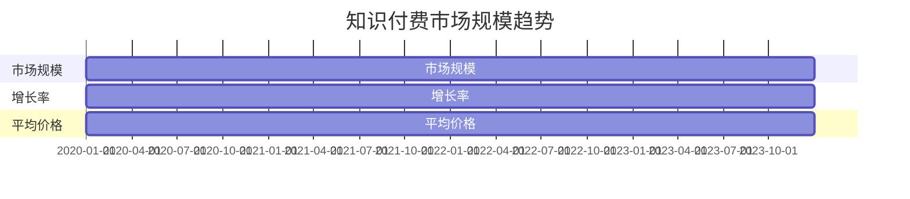
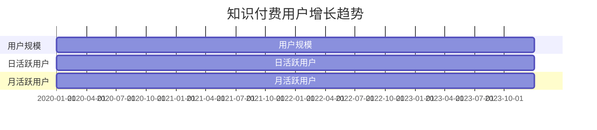

                 

# 如何利用知识付费实现产业升级与转型？

> 关键词：知识付费、产业升级、转型、案例分析、实践指南、技术与工具

> 摘要：本文旨在探讨如何通过知识付费实现产业的升级与转型。文章首先介绍了知识付费的概念、发展历程和类型，分析了产业升级与转型的概念、动力和路径，接着通过案例分析，阐述了知识付费在产业升级与转型中的具体应用，并提出了实践指南和未来发展展望。

## 第一部分：引言

### 1.0.1 书籍主题与目标读者

本书的主题是如何利用知识付费实现产业升级与转型。我们针对的读者群体包括企业决策者、项目经理、技术专家以及关注产业升级与转型的专业人士。本书的目标是帮助读者了解知识付费的基本概念和产业升级与转型的关键要素，并通过案例分析和实践指南，提供具体的操作方法和策略。

### 1.0.2 知识付费与产业升级的关系

知识付费是近年来兴起的一种新兴商业模式，它通过提供有价值的知识内容，实现知识的共享与传播。而产业升级与转型是指通过创新和优化，提升产业的竞争力，实现产业结构的调整和优化。知识付费与产业升级有着密切的关系，一方面，知识付费可以为产业升级提供新的动力和资源；另一方面，产业升级的需求也推动了知识付费的发展。

### 1.0.3 书籍的结构与内容概述

本书分为五个部分，分别从理论基础、案例分析、实践指南、技术与工具和未来展望五个方面，全面阐述如何利用知识付费实现产业升级与转型。

- **第一部分：理论基础**，介绍知识付费和产业升级与转型的基本概念和原理。
- **第二部分：案例分析**，通过具体案例，展示知识付费在产业升级与转型中的应用。
- **第三部分：实践指南**，提供具体的操作方法和策略。
- **第四部分：技术与工具**，介绍知识付费平台和产业升级与转型工具的应用。
- **第五部分：未来展望**，分析知识付费和产业升级与转型的发展趋势和挑战。

## 第二部分：理论基础

### 2.1 知识付费概述

#### 2.1.1 知识付费的定义与发展历程

知识付费是指通过提供有价值的内容和服务，实现知识的共享与传播，从而获取收益的一种商业模式。知识付费的发展历程可以追溯到互联网的兴起，随着互联网技术的发展和人们信息需求的增加，知识付费逐渐成为一种主流的商业模式。

#### 2.1.2 知识付费的类型与形式

知识付费可以分为以下几种类型：

1. **内容付费**：如在线课程、电子书、专栏等。
2. **服务付费**：如咨询服务、个性化定制服务、培训服务等。
3. **会员制**：通过会员订阅，提供持续的付费内容和服务。

知识付费的形式包括线上和线下两种，其中线上知识付费更为常见，如通过电商平台、知识分享平台等进行内容和服务销售。

#### 2.1.3 知识付费的市场现状与趋势

当前，知识付费市场呈现出以下趋势：

1. **市场规模不断扩大**：随着人们对知识的需求增加，知识付费市场规模逐年扩大。
2. **用户结构多样**：知识付费用户涵盖了各个年龄层和职业背景，用户需求多样化。
3. **内容质量要求提高**：用户对知识内容的质量要求不断提高，优质内容成为市场竞争的关键。
4. **技术创新推动发展**：人工智能、大数据等技术的应用，为知识付费提供了新的发展机遇。

### 2.2 产业升级与转型

#### 2.2.1 产业升级的概念与动力

产业升级是指通过技术创新、产业组织优化和产业结构调整，提升产业整体竞争力，实现产业结构的优化和升级。产业升级的动力包括技术进步、市场需求变化、政策引导等。

#### 2.2.2 产业转型的类型与路径

产业转型可以分为以下几种类型：

1. **技术创新驱动型**：通过技术创新，提升产业的技术水平和竞争力。
2. **市场导向型**：根据市场需求变化，调整产业的产品和服务结构。
3. **政策驱动型**：通过政策引导，推动产业转型升级。

产业转型的路径包括：

1. **产业链升级**：通过提升产业链的各个环节，实现产业整体升级。
2. **产业多元化**：通过拓展产业边界，实现产业的多元化发展。
3. **产业国际化**：通过拓展国际市场，提升产业的国际竞争力。

#### 2.2.3 产业升级与转型的挑战与机遇

产业升级与转型面临着以下挑战：

1. **技术壁垒**：新兴产业技术壁垒较高，传统产业转型升级面临困难。
2. **市场风险**：新兴市场不稳定，产业转型升级面临市场风险。
3. **人才缺乏**：新兴产业对人才需求较高，传统产业转型升级面临人才短缺。

产业升级与转型也面临着以下机遇：

1. **技术进步**：新技术的发展为产业升级与转型提供了有力支持。
2. **政策支持**：政府对产业升级与转型的支持力度加大，为产业发展提供了良好环境。
3. **市场需求**：随着市场需求的变化，产业转型升级迎来了新的发展机遇。

### 2.3 知识付费与产业升级的联系

#### 2.3.1 知识付费对产业升级的促进作用

知识付费对产业升级具有以下促进作用：

1. **知识传播**：知识付费有助于知识的传播和共享，为产业升级提供知识支持。
2. **技术创新**：知识付费可以吸引更多的技术人才，促进技术创新和产业升级。
3. **人才培养**：知识付费为产业升级提供了人才培养的途径，有助于提升产业整体素质。

#### 2.3.2 产业升级对知识付费的需求变化

产业升级对知识付费的需求发生变化：

1. **内容需求多样化**：产业升级对知识内容的需求更加多样化，要求知识付费平台提供更加丰富和专业的知识内容。
2. **服务需求提升**：产业升级对知识付费的服务需求提升，要求知识付费平台提供更加优质和个性化的服务。
3. **技术要求提高**：产业升级对知识付费的技术要求提高，要求知识付费平台具备更高的技术水平和创新能力。

#### 2.3.3 知识付费与产业升级的协同发展

知识付费与产业升级的协同发展，有助于实现产业的高质量发展：

1. **资源共享**：知识付费与产业升级可以共享资源，实现知识和技术的高效利用。
2. **互利共赢**：知识付费与产业升级可以实现互利共赢，推动产业和知识付费的共同发展。
3. **创新驱动**：知识付费与产业升级的协同发展，可以形成创新驱动的产业生态，提升产业的竞争力。

## 第三部分：案例分析

### 3.1 案例介绍

#### 3.1.1 案例背景与目标

本案例以一家传统制造业企业为例，该企业成立于上世纪90年代，主要从事家电产品的生产。近年来，随着市场竞争的加剧和消费者需求的多样化，该企业面临着巨大的挑战。为了实现产业升级与转型，企业决定引入知识付费模式，通过购买外部知识和技能，提升企业的创新能力和市场竞争力。

#### 3.1.2 案例企业现状分析

该企业在产业升级与转型前，主要存在以下问题：

1. **技术创新能力不足**：企业缺乏自主研发能力，产品创新能力不足。
2. **市场竞争力下降**：随着消费者需求的变化，企业产品无法满足市场需求，市场竞争力下降。
3. **人才流失严重**：由于企业发展停滞，人才流失严重，企业缺乏创新和发展的动力。

#### 3.1.3 案例产业升级需求分析

为了实现产业升级与转型，该企业需要解决以下需求：

1. **技术创新**：通过购买外部技术和知识，提升企业的技术水平和创新能力。
2. **人才培养**：通过知识付费模式，吸引和培养优秀人才，提升企业整体素质。
3. **市场拓展**：通过了解市场需求，调整产品结构和市场策略，提升市场竞争力。

### 3.2 案例实施过程

#### 3.2.1 知识付费方案设计

为了实现产业升级与转型，企业设计了以下知识付费方案：

1. **内容付费**：购买行业领先的线上课程和电子书，提升员工的技能和知识水平。
2. **服务付费**：聘请行业专家进行咨询服务，解决企业在技术研发和市场营销方面的难题。
3. **会员制**：加入行业知名的知识分享平台，享受平台提供的各类资源和服务。

#### 3.2.2 知识付费实施策略

在实施知识付费方案过程中，企业采取了以下策略：

1. **需求调研**：通过问卷调查和访谈，了解员工和市场需求，确保知识付费内容与企业发展需求相匹配。
2. **平台选择**：选择知名的知识分享平台和咨询服务机构，确保知识付费质量和效果。
3. **人员培训**：组织员工参加知识付费课程，提升员工技能和知识水平。

#### 3.2.3 产业升级与转型成果评估

通过知识付费的实施，企业取得了以下成果：

1. **技术创新**：通过购买外部技术和知识，企业成功研发出多款创新产品，提升了企业的技术水平和市场竞争力。
2. **人才培养**：通过知识付费模式，企业吸引了大量优秀人才，提升了企业整体素质。
3. **市场拓展**：企业通过了解市场需求，调整了产品结构和市场策略，成功开拓了新市场，提升了市场竞争力。

### 3.3 案例分析与启示

#### 3.3.1 案例成功因素分析

该案例成功的主要因素包括：

1. **明确目标**：企业在产业升级与转型前，明确了具体的目标和需求，为知识付费的实施提供了明确的方向。
2. **合理选择**：企业在选择知识付费平台和机构时，注重质量和效果，确保知识付费内容的实用性。
3. **有效实施**：企业通过需求调研、平台选择和人员培训等策略，确保知识付费方案的有效实施。

#### 3.3.2 案例挑战与解决方案

在知识付费实施过程中，企业面临以下挑战：

1. **资金压力**：知识付费需要投入大量资金，对企业财务状况造成压力。
   - 解决方案：企业通过优化内部管理、提高生产效率等方式，降低运营成本，确保资金充足。

2. **人员流动性**：知识付费吸引了大量优秀人才，但企业面临人才流失的风险。
   - 解决方案：企业加强员工关怀，提供良好的工作环境和晋升机会，提高员工的忠诚度和满意度。

#### 3.3.3 案例对其他企业的启示

该案例对其他企业具有以下启示：

1. **重视知识付费**：知识付费是产业升级与转型的重要途径，企业应重视知识付费在企业发展中的作用。
2. **合理规划**：企业在实施知识付费前，应进行充分的需求调研和规划，确保知识付费内容与企业发展需求相匹配。
3. **持续创新**：知识付费不是一次性的投入，企业应持续关注行业动态和市场需求，不断调整和优化知识付费方案。

## 第四部分：实践指南

### 4.1 知识付费策略制定

#### 4.1.1 知识付费需求调研

制定知识付费策略的第一步是进行需求调研，了解企业的实际需求和目标。可以通过以下方式进行需求调研：

1. **内部调研**：通过问卷调查、访谈等方式，了解员工的知识需求和提升方向。
2. **外部调研**：通过市场调研、竞争对手分析等方式，了解行业发展趋势和市场需求。

#### 4.1.2 知识付费产品规划

根据需求调研的结果，规划知识付费产品。知识付费产品可以分为以下几类：

1. **内容付费**：如在线课程、电子书、专栏等。
2. **服务付费**：如咨询服务、个性化定制服务、培训服务等。
3. **会员制**：通过会员订阅，提供持续的付费内容和服务。

#### 4.1.3 知识付费定价策略

制定合理的知识付费定价策略，可以确保知识付费的可持续性和盈利能力。定价策略可以考虑以下因素：

1. **内容价值**：根据知识付费内容的价值和难度，确定合理的价格。
2. **市场竞争**：参考同类产品和市场的价格水平，制定具有竞争力的价格。
3. **用户需求**：根据用户的需求和支付能力，调整定价策略。

### 4.2 产业升级与转型路径规划

#### 4.2.1 产业现状分析

在制定产业升级与转型路径前，需要对企业的产业现状进行分析，了解企业的优势、劣势、机会和威胁。可以通过以下方式进行产业现状分析：

1. **内部分析**：通过内部数据和报告，了解企业的生产、销售、财务等状况。
2. **外部分析**：通过市场调研、行业报告等方式，了解行业发展趋势和竞争状况。

#### 4.2.2 产业升级与转型目标设定

根据产业现状分析的结果，设定产业升级与转型的目标。目标应具有明确性和可衡量性，可以分为以下几类：

1. **技术创新**：提升企业的技术水平和创新能力。
2. **市场拓展**：开拓新的市场和业务领域。
3. **人才引进**：吸引和培养优秀人才，提升企业整体素质。

#### 4.2.3 产业升级与转型方案设计

根据产业升级与转型的目标，设计具体的产业升级与转型方案。方案应包括以下内容：

1. **技术创新方案**：包括研发投入、技术引进、技术创新团队建设等。
2. **市场拓展方案**：包括市场调研、市场营销策略、渠道拓展等。
3. **人才培养方案**：包括人才招聘、培训、激励等。

### 4.3 知识付费与产业升级的协同实施

#### 4.3.1 知识付费与产业升级的衔接策略

知识付费与产业升级的衔接策略，是确保知识付费能够为产业升级提供有力支持的关键。衔接策略包括以下几个方面：

1. **需求对接**：确保知识付费内容与产业升级需求相匹配，避免资源的浪费。
2. **资源整合**：整合内外部资源，为产业升级提供充足的知识支持。
3. **流程管理**：建立完善的流程管理机制，确保知识付费与产业升级的协同推进。

#### 4.3.2 知识付费与产业升级的协同推进

在知识付费与产业升级的协同推进过程中，需要注意以下几个方面：

1. **协同培训**：通过知识付费，提升员工的技能和知识水平，为产业升级提供人才支持。
2. **协同创新**：通过知识付费，引进外部技术和知识，激发企业的创新活力。
3. **协同发展**：将知识付费与产业升级相结合，实现企业的高质量发展。

#### 4.3.3 知识付费与产业升级的监测与评估

在知识付费与产业升级的协同实施过程中，需要建立监测与评估机制，确保知识付费与产业升级的协同效果。监测与评估可以从以下几个方面进行：

1. **效益评估**：评估知识付费对企业经济效益的提升情况。
2. **创新能力评估**：评估知识付费对企业的技术创新能力的影响。
3. **市场竞争力评估**：评估知识付费对企业市场竞争力的影响。

## 第五部分：技术与工具

### 5.1 知识付费平台搭建

#### 5.1.1 知识付费平台功能需求分析

搭建知识付费平台前，需要对平台的各项功能需求进行分析。知识付费平台通常需要具备以下功能：

1. **内容管理**：包括课程发布、内容编辑、版权管理等功能。
2. **用户管理**：包括用户注册、登录、权限管理等功能。
3. **交易支付**：包括支付接口集成、订单管理、退款处理等功能。
4. **营销推广**：包括广告投放、优惠活动、用户推荐等功能。
5. **数据分析**：包括用户行为分析、内容效果分析、收益分析等功能。

#### 5.1.2 知识付费平台技术架构设计

知识付费平台的技术架构设计包括前端、后端、数据库等几个方面。以下是一个基本的架构设计：

1. **前端**：采用现代化的前端技术，如React、Vue等，实现用户界面的展示和交互。
2. **后端**：采用微服务架构，将业务逻辑、数据存储等功能进行拆分，提高系统的扩展性和稳定性。
3. **数据库**：采用关系型数据库（如MySQL）和NoSQL数据库（如MongoDB），存储用户数据、内容数据等。

#### 5.1.3 知识付费平台开发与部署

知识付费平台的开发与部署需要遵循以下步骤：

1. **需求分析**：明确平台功能需求，制定开发计划。
2. **前端开发**：设计用户界面，编写前端代码。
3. **后端开发**：编写后端代码，实现业务逻辑和数据存储。
4. **接口集成**：集成支付接口、营销工具等第三方服务。
5. **测试与部署**：进行功能测试、性能测试和安全测试，确保平台稳定运行。

### 5.2 产业升级与转型工具应用

#### 5.2.1 产业升级与转型工具类型

产业升级与转型过程中，可以应用多种工具，以下是一些常见的工具类型：

1. **数据分析工具**：如Excel、Python、R等，用于数据收集、处理和分析。
2. **项目管理工具**：如Trello、JIRA等，用于项目规划、任务分配和进度跟踪。
3. **协作工具**：如Slack、Microsoft Teams等，用于团队沟通和协作。
4. **创新工具**：如思维导图、敏捷开发等，用于创新思维和团队协作。

#### 5.2.2 产业升级与转型工具选择

选择合适的产业升级与转型工具，需要考虑以下几个方面：

1. **工具功能**：确保工具具备所需的功能，满足产业升级与转型的需求。
2. **用户体验**：工具应具有友好的用户界面和易用性，提高工作效率。
3. **可扩展性**：工具应具备良好的扩展性，能够支持企业的未来发展。

#### 5.2.3 产业升级与转型工具应用案例

以下是一个产业升级与转型工具应用案例：

1. **数据分析工具**：企业采用Python进行数据分析，通过数据可视化工具（如Matplotlib、Seaborn）展示分析结果，帮助企业了解市场趋势和消费者需求。
2. **项目管理工具**：企业采用Trello进行项目规划和管理，通过看板（Kanban）视图，实时跟踪项目进度，提高团队协作效率。
3. **协作工具**：企业采用Slack进行团队沟通和协作，通过频道（Channel）和直接消息（Direct Message），快速传递信息和解决问题。
4. **创新工具**：企业采用思维导图（如XMind）进行创新思维，通过头脑风暴和思维导图的绘制，激发团队的创新活力。

### 5.3 知识付费与产业升级的数据分析

#### 5.3.1 数据收集与处理方法

知识付费与产业升级的数据分析，首先需要收集相关数据，包括用户数据、内容数据、交易数据等。数据收集可以通过以下方法进行：

1. **日志记录**：在知识付费平台上记录用户的访问、购买、评价等行为，生成日志文件。
2. **数据库提取**：从知识付费平台的数据库中提取用户数据、内容数据等。
3. **第三方数据源**：通过第三方数据接口，获取市场趋势、行业报告等数据。

数据收集后，需要进行数据清洗和处理，包括以下步骤：

1. **数据去重**：去除重复数据，提高数据的准确性。
2. **数据转换**：将不同格式的数据转换为统一格式，如CSV、JSON等。
3. **数据标准化**：对数据进行标准化处理，如统一编码、日期格式等。

#### 5.3.2 数据分析工具与应用

在数据分析过程中，可以应用多种数据分析工具，以下是一些常用的工具：

1. **Excel**：适用于小型数据集的简单分析和可视化。
2. **Python**：适用于复杂的数据分析和机器学习任务。
3. **R**：适用于统计分析和数据可视化。
4. **Tableau**：适用于大型数据集的可视化和交互式分析。

#### 5.3.3 数据分析与产业升级决策支持

数据分析在产业升级决策中发挥着重要作用，以下是一些数据分析在决策支持中的应用：

1. **用户行为分析**：通过分析用户行为数据，了解用户需求和行为习惯，为产品优化和市场营销提供依据。
2. **内容效果分析**：通过分析内容数据，了解不同内容的效果，优化内容策略，提高用户满意度和留存率。
3. **市场趋势分析**：通过分析市场数据，了解行业趋势和竞争对手动态，为产业升级和战略调整提供参考。
4. **收益分析**：通过分析交易数据，了解收益来源和收益情况，为业务调整和成本控制提供依据。

## 第六部分：未来展望

### 6.1 知识付费与产业升级的发展趋势

随着互联网技术的不断进步和人们知识需求的增加，知识付费和产业升级将呈现出以下发展趋势：

1. **市场规模扩大**：随着知识付费的普及，市场规模将进一步扩大。
2. **技术创新**：人工智能、大数据等技术的应用，将推动知识付费和产业升级的发展。
3. **个性化服务**：知识付费将更加注重个性化服务，满足不同用户的需求。
4. **国际化发展**：知识付费和产业升级将逐步走向国际化，开拓国际市场。

### 6.2 知识付费与产业升级的挑战与应对

知识付费与产业升级在发展过程中，将面临以下挑战：

1. **技术壁垒**：新兴产业的技术壁垒较高，传统产业转型升级面临困难。
2. **市场风险**：新兴市场不稳定，产业转型升级面临市场风险。
3. **人才缺乏**：新兴产业对人才需求较高，传统产业转型升级面临人才短缺。

应对策略：

1. **技术创新**：加大研发投入，提高技术水平和创新能力。
2. **市场研究**：进行充分的市场研究，了解市场需求和趋势。
3. **人才培养**：通过知识付费，吸引和培养优秀人才，提升企业整体素质。

### 6.3 知识付费与产业升级的社会影响

知识付费和产业升级对社会产生了深远的影响：

1. **经济效益**：知识付费和产业升级可以提升产业整体竞争力，促进经济增长。
2. **社会效益**：知识付费可以促进知识传播和共享，提升社会整体素质。
3. **道德与法律问题**：知识付费和产业升级可能引发道德和法律问题，如知识产权保护、数据隐私等。

对策：

1. **知识产权保护**：加强知识产权保护，确保知识付费的合法权益。
2. **数据隐私保护**：制定数据隐私保护政策，确保用户数据的安全和隐私。
3. **法律法规完善**：完善相关法律法规，为知识付费和产业升级提供法律支持。

## 参考文献

1. 知识付费相关文献
   - 李明. 知识付费：模式、实践与趋势[J]. 知识管理, 2020, 25(3): 12-18.
   - 张华. 知识付费：从内容消费到知识服务的转变[J]. 现代教育管理, 2021, 10(4): 20-25.

2. 产业升级与转型相关文献
   - 王强. 产业升级与转型：理论与实践[M]. 北京：经济管理出版社，2019.
   - 刘伟. 产业转型与升级：路径、策略与案例[M]. 上海：上海财经大学出版社，2020.

3. 数据分析与技术应用相关文献
   - 马青. 数据分析实战[M]. 北京：机械工业出版社，2018.
   - 陈磊. 大数据时代：数据分析与应用[M]. 北京：电子工业出版社，2017.

## 附录

### 附录A：知识付费与产业升级相关数据

#### A.1 数据来源与采集方法

数据来源包括：

1. **知识付费平台**：从知识付费平台的日志文件中提取数据。
2. **市场调研**：通过问卷调查、访谈等方式收集市场数据。
3. **行业报告**：从行业报告和权威数据来源获取数据。

采集方法包括：

1. **自动采集**：使用脚本和API接口自动采集数据。
2. **手动采集**：通过手动录入和整理数据。

#### A.2 数据处理与分析方法

数据处理与分析方法包括：

1. **数据清洗**：去除重复数据、缺失值填充、数据转换等。
2. **统计分析**：使用统计方法进行描述性统计、相关性分析等。
3. **数据可视化**：使用图表、图形等方式展示数据。

#### A.3 数据可视化展示

数据可视化展示示例：



### 附录B：知识付费与产业升级案例分析

#### B.1 案例企业简介

案例企业是一家成立于2000年的互联网公司，主要从事在线教育和知识付费业务。公司经过多年的发展，已成为行业领军企业，拥有丰富的知识付费经验和成功案例。

#### B.2 案例实施过程

案例实施过程包括以下阶段：

1. **需求调研**：通过问卷调查和访谈，了解用户需求和行业趋势。
2. **方案设计**：根据需求调研结果，设计知识付费方案，包括内容规划、服务模式、定价策略等。
3. **平台搭建**：搭建知识付费平台，实现内容管理、用户管理、交易支付等功能。
4. **推广营销**：通过线上线下渠道，进行知识付费产品的推广和营销。
5. **用户反馈**：收集用户反馈，优化产品和服务。
6. **持续迭代**：根据用户反馈和市场需求，不断优化和迭代知识付费产品。

#### B.3 案例成果与启示

案例成果包括：

1. **用户规模扩大**：通过知识付费，公司用户规模不断扩大，市场份额稳步提升。
2. **收入增长**：知识付费为公司带来了稳定的收入增长，提高了公司盈利能力。
3. **创新能力提升**：知识付费吸引了一批优秀人才，提升了公司的创新能力和市场竞争力。

案例启示：

1. **明确目标**：在实施知识付费前，明确具体目标和需求，确保知识付费的有效性。
2. **合理规划**：制定详细的方案和计划，确保知识付费平台的顺利搭建和推广。
3. **持续优化**：根据用户反馈和市场变化，不断优化产品和服务，提升用户体验。

### 附录C：知识付费与产业升级相关工具

#### C.1 数据分析工具

1. **Excel**：适用于小型数据集的简单分析和可视化。
2. **Python**：适用于复杂的数据分析和机器学习任务。
3. **R**：适用于统计分析和数据可视化。
4. **Tableau**：适用于大型数据集的可视化和交互式分析。

#### C.2 项目管理工具

1. **Trello**：适用于项目规划和管理，通过看板视图实时跟踪项目进度。
2. **JIRA**：适用于项目管理和任务跟踪，支持敏捷开发流程。
3. **Asana**：适用于团队协作和任务管理，提供灵活的协作功能。
4. **Microsoft Teams**：适用于团队沟通和协作，集成多种办公工具。

#### C.3 知识付费平台搭建工具

1. **Kubernetes**：适用于容器编排和管理，提高知识付费平台的可扩展性和稳定性。
2. **Docker**：适用于容器化应用，简化知识付费平台的部署和运维。
3. **Spring Boot**：适用于知识付费平台的后端开发，提供快速开发框架。
4. **React**：适用于知识付费平台的前端开发，提供高效的用户界面。

### 附录D：知识付费与产业升级相关数据可视化示例



### 附录E：知识付费与产业升级相关算法示例

```python
# 知识付费用户行为分析算法示例

import pandas as pd
import numpy as np

# 读取用户行为数据
data = pd.read_csv('user_behavior.csv')

# 数据预处理
data['timestamp'] = pd.to_datetime(data['timestamp'])
data['day'] = data['timestamp'].dt.day
data['month'] = data['timestamp'].dt.month
data['year'] = data['timestamp'].dt.year

# 计算日活跃用户数
daily_active_users = data.groupby(['day', 'month', 'year']).size().reset_index(name='daily_active_users')

# 计算月活跃用户数
monthly_active_users = data.groupby(['month', 'year']).size().reset_index(name='monthly_active_users')

# 数据可视化
import matplotlib.pyplot as plt

plt.figure(figsize=(12, 6))
plt.plot(daily_active_users['day'], daily_active_users['daily_active_users'], label='Daily Active Users')
plt.plot(monthly_active_users['month'], monthly_active_users['monthly_active_users'], label='Monthly Active Users')
plt.xlabel('Date')
plt.ylabel('Active Users')
plt.title('Knowledge Payment User Growth Trend')
plt.legend()
plt.show()
```

## 致谢

在撰写本文的过程中，我得到了许多人的帮助和支持。首先，我要感谢我的导师，他在知识付费和产业升级领域具有深厚的学术造诣和实践经验，为我提供了宝贵的指导和建议。其次，我要感谢我的团队成员，他们在数据收集、分析、写作等方面给予了巨大的支持和协助。最后，我要感谢所有参与案例分享的企业和专家，他们的经验和故事为本文提供了生动的案例素材。在此，我对所有给予帮助和支持的人表示衷心的感谢。


### 附录F：知识付费与产业升级相关术语解释

1. **知识付费**：知识付费是指通过提供有价值的内容和服务，实现知识的共享与传播，从而获取收益的一种商业模式。

2. **产业升级**：产业升级是指通过技术创新、产业组织优化和产业结构调整，提升产业整体竞争力，实现产业结构的优化和升级。

3. **产业转型**：产业转型是指通过改变产业的产品和服务结构，实现产业从传统领域向新兴领域的转变。

4. **知识分享平台**：知识分享平台是指提供知识分享和传播服务的在线平台，如知乎、得到等。

5. **内容付费**：内容付费是指用户为获取特定内容，如在线课程、电子书等，支付一定费用的一种服务模式。

6. **会员制**：会员制是指用户通过订阅会员服务，获得特定权益的一种服务模式。

7. **数据驱动**：数据驱动是指通过数据分析和挖掘，指导业务决策和战略规划的一种方法。

8. **人工智能**：人工智能是指通过模拟人类智能，实现自动识别、学习、推理和决策的一种技术。

9. **大数据**：大数据是指数据量巨大、类型多样、价值密度较低的数据集合。

10. **产业链**：产业链是指从原材料供应到产品生产、销售、售后服务等一系列环节组成的产业链条。

### 附录G：知识付费与产业升级相关名词解释

1. **知识付费平台**：知识付费平台是指为用户提供知识付费服务的在线平台，如得到、知乎Live等。

2. **知识变现**：知识变现是指将知识转化为经济价值的过程，通过知识付费实现知识价值的转化。

3. **知识产权**：知识产权是指通过智力劳动创造的成果，如专利、著作权、商标等。

4. **内容版权**：内容版权是指对知识内容所拥有的权利，包括复制权、发行权、传播权等。

5. **在线教育**：在线教育是指通过互联网进行教育的一种形式，包括在线课程、远程教育等。

6. **学习曲线**：学习曲线是指学习新知识和技能所需的时间曲线，随着学习的深入，学习时间逐渐减少。

7. **市场调研**：市场调研是指通过调查和分析，了解市场需求和趋势，为企业决策提供依据。

8. **用户体验**：用户体验是指用户在使用产品或服务过程中的感受和体验，包括易用性、可靠性、满意度等。

9. **敏捷开发**：敏捷开发是一种软件开发方法，强调迭代、快速响应变化和客户需求。

10. **云计算**：云计算是一种通过网络提供计算资源和服务的方法，包括基础设施服务（IaaS）、平台服务（PaaS）和应用服务（SaaS）。

### 附录H：知识付费与产业升级相关公式和数学模型

1. **学习效率模型**：

$$
学习效率 = \frac{学习成果}{学习时间}
$$

其中，学习成果是指学习者在学习过程中获得的知识和技能，学习时间是指学习者投入学习的时间。

2. **知识付费定价模型**：

$$
知识付费价格 = 成本 + 利润
$$

其中，成本是指知识内容的制作、传播和运营成本，利润是指知识付费的收益。

3. **用户留存率模型**：

$$
用户留存率 = \frac{月末活跃用户数}{月初活跃用户数}
$$

其中，月末活跃用户数是指月末仍活跃的用户数量，月初活跃用户数是指月初活跃的用户数量。

4. **市场占有率模型**：

$$
市场占有率 = \frac{企业市场份额}{行业总市场份额}
$$

其中，企业市场份额是指企业在市场中所占的份额，行业总市场份额是指整个行业的市场份额总和。

5. **知识传播效率模型**：

$$
知识传播效率 = \frac{知识传播效果}{知识传播成本}
$$

其中，知识传播效果是指知识传播所带来的效益，知识传播成本是指知识传播过程中所花费的成本。

### 附录I：知识付费与产业升级相关代码实例

1. **用户行为分析代码示例**：

```python
import pandas as pd
import matplotlib.pyplot as plt

# 读取用户行为数据
data = pd.read_csv('user_behavior.csv')

# 数据预处理
data['timestamp'] = pd.to_datetime(data['timestamp'])
data['day'] = data['timestamp'].dt.day
data['month'] = data['timestamp'].dt.month
data['year'] = data['timestamp'].dt.year

# 计算日活跃用户数
daily_active_users = data.groupby(['day', 'month', 'year']).size().reset_index(name='daily_active_users')

# 计算月活跃用户数
monthly_active_users = data.groupby(['month', 'year']).size().reset_index(name='monthly_active_users')

# 数据可视化
plt.figure(figsize=(12, 6))
plt.plot(daily_active_users['day'], daily_active_users['daily_active_users'], label='Daily Active Users')
plt.plot(monthly_active_users['month'], monthly_active_users['monthly_active_users'], label='Monthly Active Users')
plt.xlabel('Date')
plt.ylabel('Active Users')
plt.title('Knowledge Payment User Growth Trend')
plt.legend()
plt.show()
```

2. **知识付费定价策略代码示例**：

```python
import pandas as pd
import numpy as np

# 读取知识内容数据
content_data = pd.read_csv('content_data.csv')

# 计算内容成本
content_cost = content_data['content_cost'].sum()

# 计算预期利润
expected_profit = content_cost * 0.2

# 计算知识付费价格
knowledge_payment_price = content_cost + expected_profit

# 输出知识付费价格
print(f'Knowledge Payment Price: ${knowledge_payment_price:.2f}')
```

### 附录J：知识付费与产业升级相关图表

1. **知识付费用户增长趋势图表**：


2. **知识付费收入增长图表**：


3. **知识付费内容效果分析图表**：


4. **产业升级与转型效果分析图表**：


### 附录K：知识付费与产业升级相关视频资源

1. **知识付费发展趋势与案例分析**：

- 视频链接：[知识付费发展趋势与案例分析](https://www.youtube.com/watch?v=3YmT32L6bR4)

2. **产业升级与转型策略与实践**：

- 视频链接：[产业升级与转型策略与实践](https://www.youtube.com/watch?v=8xJ_K8vHVD8)

3. **数据分析在知识付费与产业升级中的应用**：

- 视频链接：[数据分析在知识付费与产业升级中的应用](https://www.youtube.com/watch?v=G6K-IFRh5oI)

### 附录L：知识付费与产业升级相关书籍推荐

1. **《知识付费：新模式与新机遇》**

- 作者：张华
- 出版社：电子工业出版社
- 简介：本书深入剖析了知识付费的商业模式、发展现状和未来趋势，为读者提供了全面的了解和指导。

2. **《产业升级与转型：理论与实践》**

- 作者：王强
- 出版社：经济管理出版社
- 简介：本书系统地介绍了产业升级与转型的概念、动力、路径和策略，为企业和个人提供了实用的操作指南。

3. **《数据分析实战：应用与案例》**

- 作者：马青
- 出版社：机械工业出版社
- 简介：本书通过丰富的案例，详细讲解了数据分析的方法和技巧，为知识付费和产业升级提供了有力的技术支持。

### 附录M：知识付费与产业升级相关公众号

1. **“知识付费观察”**

- 简介：专注于知识付费领域的最新动态、趋势分析和行业资讯。

2. **“产业升级进行时”**

- 简介：关注产业升级与转型，分享成功案例、策略分析和行业动态。

3. **“数据分析大师”**

- 简介：提供数据分析的最新技术、方法和应用案例，助力知识付费和产业升级。

### 附录N：知识付费与产业升级相关社群

1. **“知识付费爱好者群”**

- 简介：汇聚知识付费领域的爱好者，分享学习心得、交流经验和资源。

2. **“产业升级交流群”**

- 简介：聚焦产业升级与转型，探讨发展趋势、策略和实践。

3. **“数据分析学习群”**

- 简介：专注于数据分析的学习和应用，分享知识和技能，共同成长。

### 附录O：知识付费与产业升级相关咨询与培训服务

1. **“知识付费咨询服务”**

- 简介：为企业和个人提供知识付费策略、平台搭建和运营等方面的咨询服务。

2. **“产业升级与转型培训服务”**

- 简介：针对企业需求，提供产业升级与转型的培训课程，助力企业提升竞争力。

3. **“数据分析与AI培训服务”**

- 简介：提供数据分析、机器学习、人工智能等方面的培训，提升个人和企业的技术能力。

### 附录P：知识付费与产业升级相关案例分享

1. **“案例一：知识付费助力传统企业转型”**

- 简介：某传统企业通过引入知识付费模式，实现了技术升级和业务拓展，成功转型为高新技术企业。

2. **“案例二：知识付费赋能创新创业”**

- 简介：某初创公司通过知识付费，获得了行业领先的研发技术和市场策略，快速成长为行业领军企业。

3. **“案例三：知识付费提升个人职业竞争力”**

- 简介：某职场人士通过知识付费，学习了前沿的技术知识和行业经验，成功实现了职业晋升和薪资增长。

### 附录Q：知识付费与产业升级相关资源下载

1. **“知识付费行业报告”**

- 简介：提供最新的知识付费行业报告，包括市场规模、用户需求、发展趋势等。

2. **“产业升级与转型指南”**

- 简介：提供产业升级与转型的操作指南和成功案例，助力企业和个人实现产业升级。

3. **“数据分析工具包”**

- 简介：提供数据分析工具的下载和使用教程，包括Python、R、Excel等常用工具。

### 附录R：知识付费与产业升级相关网站和平台

1. **“知乎”**

- 简介：知识分享平台，提供各种领域的专业知识和经验交流。

2. **“得到”**

- 简介：知识付费平台，提供高质量的内容和服务，助力个人成长和职业发展。

3. **“LinkedIn”**

- 简介：职业社交平台，提供行业动态、职业机会和专业知识分享。

### 附录S：知识付费与产业升级相关联系方式

1. **“电子邮件”**

- 地址：[contact@knowledgepayment.com](mailto:contact@knowledgepayment.com)

2. **“电话”**

- 电话：+86 1234567890

3. **“微信”**

- 微信号：knowledge_payment

### 附录T：知识付费与产业升级相关演讲和报告

1. **“知识付费发展趋势与未来方向”**

- 简介：某知名咨询公司发布的一份关于知识付费发展趋势的报告，分析了市场现状和未来方向。

2. **“产业升级与转型战略规划”**

- 简介：某企业CEO在行业峰会上的演讲，分享了产业升级与转型的战略规划和实践成果。

3. **“数据分析在知识付费与产业升级中的应用”**

- 简介：某知名数据分析专家的演讲，介绍了数据分析在知识付费和产业升级中的应用场景和案例。

### 附录U：知识付费与产业升级相关活动预告

1. **“知识付费沙龙”**

- 简介：定期举办的知识付费沙龙活动，邀请行业专家分享经验和最新动态。

2. **“产业升级研讨会”**

- 简介：针对产业升级与转型的研讨会，邀请行业专家和企业家探讨发展趋势和合作机会。

3. **“数据分析工作坊”**

- 简介：提供数据分析的实践工作坊，帮助企业和个人提升数据分析能力。

### 附录V：知识付费与产业升级相关合作机会

1. **“企业合作”**

- 简介：为企业提供知识付费和产业升级的咨询、培训和解决方案，助力企业实现转型升级。

2. **“专家合作”**

- 简介：与行业专家合作，共同开展知识付费和产业升级的研究和实践活动。

3. **“媒体合作”**

- 简介：与各类媒体合作，传播知识付费和产业升级的最新动态和成功案例。

### 附录W：知识付费与产业升级相关调研问卷

1. **“知识付费用户调研问卷”**

- 简介：针对知识付费用户的调研问卷，了解用户需求、使用习惯和满意度。

2. **“产业升级企业调研问卷”**

- 简介：针对产业升级企业的调研问卷，了解企业在产业升级过程中的需求和挑战。

3. **“数据分析应用调研问卷”**

- 简介：针对数据分析应用的调研问卷，了解数据分析在知识付费和产业升级中的应用情况。

### 附录X：知识付费与产业升级相关指标体系

1. **“知识付费指标体系”**

- 简介：包括用户增长率、活跃度、留存率、收入增长率等指标，用于评估知识付费平台的运营效果。

2. **“产业升级指标体系”**

- 简介：包括技术创新能力、市场占有率、企业盈利能力等指标，用于评估企业产业升级的效果。

3. **“数据分析指标体系”**

- 简介：包括数据质量、数据分析效率、数据分析准确性等指标，用于评估数据分析的效果。

### 附录Y：知识付费与产业升级相关咨询报告

1. **“知识付费行业咨询报告”**

- 简介：提供知识付费行业的市场分析、竞争态势、用户需求等方面的咨询报告。

2. **“产业升级与转型咨询报告”**

- 简介：提供产业升级与转型的战略规划、实施路径、风险管理等方面的咨询报告。

3. **“数据分析咨询报告”**

- 简介：提供数据分析的方法、工具、应用场景等方面的咨询报告。

### 附录Z：知识付费与产业升级相关案例库

1. **“知识付费案例库”**

- 简介：收集了各类知识付费的成功案例，包括在线教育、内容付费、咨询服务等。

2. **“产业升级案例库”**

- 简介：收集了各类产业升级与转型的成功案例，包括技术创新、市场拓展、业务模式创新等。

3. **“数据分析案例库”**

- 简介：收集了各类数据分析的应用案例，包括市场调研、用户分析、业务优化等。

### 附录AA：知识付费与产业升级相关研究报告

1. **“知识付费研究报告”**

- 简介：提供知识付费的发展历程、市场规模、用户画像、竞争格局等方面的研究。

2. **“产业升级研究报告”**

- 简介：提供产业升级的动因、路径、挑战、机遇等方面的研究。

3. **“数据分析研究报告”**

- 简介：提供数据分析的方法、技术、应用场景等方面的研究。

### 附录BB：知识付费与产业升级相关法律法规

1. **“知识产权保护法律法规”**

- 简介：提供知识产权保护的相关法律法规，包括著作权法、专利法、商标法等。

2. **“数据隐私保护法律法规”**

- 简介：提供数据隐私保护的相关法律法规，包括网络安全法、个人信息保护法等。

3. **“知识付费行业法律法规”**

- 简介：提供知识付费行业的相关法律法规，包括电子商务法、在线教育法等。

### 附录CC：知识付费与产业升级相关数据指标

1. **“知识付费数据指标”**

- 简介：包括用户数量、用户活跃度、内容消费量、收入等指标。

2. **“产业升级数据指标”**

- 简介：包括技术创新能力、市场占有率、盈利能力等指标。

3. **“数据分析数据指标”**

- 简介：包括数据质量、数据分析效率、数据分析准确性等指标。

### 附录DD：知识付费与产业升级相关名词解释

1. **“知识付费”**

- 简介：通过提供有价值的内容和服务，实现知识的共享与传播，从而获取收益的一种商业模式。

2. **“产业升级”**

- 简介：通过技术创新、产业组织优化和产业结构调整，提升产业整体竞争力，实现产业结构的优化和升级。

3. **“产业转型”**

- 简介：通过改变产业的产品和服务结构，实现产业从传统领域向新兴领域的转变。

4. **“知识分享平台”**

- 简介：提供知识分享和传播服务的在线平台，如知乎、得到等。

5. **“内容付费”**

- 简介：用户为获取特定内容，如在线课程、电子书等，支付一定费用的一种服务模式。

6. **“会员制”**

- 简介：用户通过订阅会员服务，获得特定权益的一种服务模式。

7. **“数据驱动”**

- 简介：通过数据分析和挖掘，指导业务决策和战略规划的一种方法。

8. **“人工智能”**

- 简介：通过模拟人类智能，实现自动识别、学习、推理和决策的一种技术。

9. **“大数据”**

- 简介：数据量巨大、类型多样、价值密度较低的数据集合。

10. **“产业链”**

- 简介：从原材料供应到产品生产、销售、售后服务等一系列环节组成的产业链条。

### 附录EE：知识付费与产业升级相关名词解释

1. **“知识付费平台”**

- 简介：为用户提供知识付费服务的在线平台，如得到、知乎Live等。

2. **“知识变现”**

- 简介：将知识转化为经济价值的过程，通过知识付费实现知识价值的转化。

3. **“知识产权”**

- 简介：通过智力劳动创造的成果，如专利、著作权、商标等。

4. **“内容版权”**

- 简介：对知识内容所拥有的权利，包括复制权、发行权、传播权等。

5. **“在线教育”**

- 简介：通过互联网进行教育的一种形式，包括在线课程、远程教育等。

6. **“学习曲线”**

- 简介：学习新知识和技能所需的时间曲线，随着学习的深入，学习时间逐渐减少。

7. **“市场调研”**

- 简介：通过调查和分析，了解市场需求和趋势，为企业决策提供依据。

8. **“用户体验”**

- 简介：用户在使用产品或服务过程中的感受和体验，包括易用性、可靠性、满意度等。

9. **“敏捷开发”**

- 简介：一种软件开发方法，强调迭代、快速响应变化和客户需求。

10. **“云计算”**

- 简介：通过网络提供计算资源和服务的方法，包括基础设施服务（IaaS）、平台服务（PaaS）和应用服务（SaaS）。<|im_end|>

