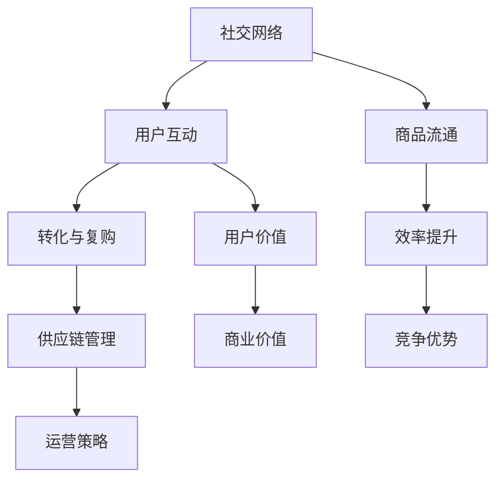

                 

### 第一部分：社交电商模式概述

社交电商模式作为电子商务发展中的一个重要分支，近年来在全球范围内取得了显著的发展。其独特的发展背景和蓬勃的生命力，使得社交电商模式成为许多创业者和企业关注的焦点。本部分将首先介绍社交电商模式的基础知识，包括其定义、特点、发展历程和趋势，然后深入探讨社交电商的核心模式。

#### 第1章：社交电商模式基础

##### 1.1 社交电商的定义与特点

**社交电商的定义**

社交电商是指基于社交网络平台和社交关系进行商品交易和推广的电商模式。它通过社交媒体和社交工具，将用户之间的互动转化为商业价值，实现商品的销售和品牌的推广。

**社交电商与传统电商的区别**

1. **互动性**：传统电商侧重于商品的交易，而社交电商则强调用户之间的互动和社交体验。
2. **传播途径**：传统电商主要通过广告和搜索引擎获取流量，而社交电商则依赖社交网络和用户口碑传播。
3. **用户黏性**：社交电商通过社交互动和社群运营，提升用户的黏性和忠诚度。

**社交电商的主要特点**

1. **强社交性**：社交电商通过社交平台和社交功能，增强用户之间的互动和连接。
2. **去中心化**：社交电商不再是传统的中心化电商模式，而是通过去中心化的方式，让用户成为传播和销售的主体。
3. **用户参与度**：社交电商鼓励用户参与商品评价、推荐和分享，提升用户参与度和忠诚度。

##### 1.2 社交电商的发展历程与趋势

**社交电商的发展历程**

1. **初期探索阶段（2010-2013年）**：以微交易和微博营销为主要形式，探索社交电商的可能性。
2. **快速发展阶段（2014-2016年）**：微信小程序和社交电商平台崛起，社交电商模式逐渐成熟。
3. **成熟阶段（2017年至今）**：社交电商成为电商市场的重要组成部分，企业纷纷布局社交电商。

**社交电商的主要趋势**

1. **平台化发展**：社交电商平台逐渐形成，提供从商品供应、销售到物流、售后的一站式服务。
2. **精细化运营**：社交电商企业通过大数据和人工智能技术，实现用户需求的精细化运营。
3. **多元化模式**：除了传统的社交分销和拼团模式，新的社交电商模式如直播电商、短视频电商等不断涌现。

##### 1.3 社交电商的核心模式

**社交分销模式**

社交分销模式是指通过社交网络，如微信、微博等，进行商品推广和销售。分销商通过分享商品链接，获取佣金收入。

**社交拼团模式**

社交拼团模式是指通过社交平台，组织用户进行团购，以更低的价格购买商品。这种方式利用社交网络的传播力，快速聚集用户。

**社交会员制模式**

社交会员制模式是指通过会员制度，提供专属优惠和权益，吸引和留住用户。这种模式强调用户忠诚度和长期价值。

#### 第2章：社交电商的运营策略

社交电商的成功不仅依赖于其独特的模式，还需要有效的运营策略。本章节将深入探讨社交电商的运营策略，包括流量获取、用户运营和转化与复购策略。

##### 2.1 社交电商的流量获取

**用户导流策略**

1. **内容营销**：通过高质量的内容吸引目标用户，如博客、短视频等。
2. **SEO优化**：优化网站内容和结构，提高在搜索引擎的排名。
3. **广告投放**：通过社交媒体广告和搜索引擎广告获取流量。

**社交媒体营销**

1. **平台选择**：根据目标用户群体选择合适的社交媒体平台，如微信、微博、抖音等。
2. **内容策略**：发布有趣、有价值的内容，吸引用户关注和互动。
3. **活动策划**：举办线上活动，如抽奖、优惠券发放等，激发用户参与。

**KOL/网红合作**

1. **选择合适的KOL**：根据品牌定位和产品特点，选择合适的KOL进行合作。
2. **合作形式**：包括内容合作、带货直播等。
3. **效果评估**：跟踪合作效果，如粉丝增长、转化率等，优化合作策略。

##### 2.2 社交电商的用户运营

**用户分层策略**

1. **新手用户**：通过新手引导，提升用户的第一单购买率。
2. **活跃用户**：通过活动激励和会员权益，提升用户的活跃度和忠诚度。
3. **沉默用户**：通过邮件营销、短信推送等方式，激活沉默用户。

**用户互动与留存策略**

1. **社群运营**：建立用户社群，如微信群、QQ群等，增强用户互动和归属感。
2. **个性化推荐**：通过大数据和人工智能技术，提供个性化的商品推荐，提升用户体验。
3. **用户反馈**：积极收集用户反馈，优化产品和服务。

**用户满意度提升**

1. **售后服务**：提供高质量的售后服务，提升用户满意度。
2. **用户教育**：通过教育用户，提升其对产品的认知和认可度。
3. **用户激励**：通过优惠券、积分、礼品等方式，激励用户购买和推荐。

##### 2.3 社交电商的转化与复购

**转化率提升策略**

1. **购物体验优化**：提供简洁、高效的购物流程，提升用户购买意愿。
2. **促销活动**：举办各种促销活动，如限时折扣、满减等，刺激用户购买。
3. **用户信任**：通过真实用户评价、权威认证等方式，提升用户信任度。

**复购率提升策略**

1. **会员制度**：通过会员制度，提供专属优惠和权益，提升用户复购率。
2. **产品推荐**：根据用户的购买记录和喜好，推荐相关的商品。
3. **持续互动**：通过社群运营和个性化推送，保持与用户的持续互动，提升复购率。

**用户忠诚度提升**

1. **品牌建设**：通过品牌故事、品牌文化等，提升用户对品牌的认同感。
2. **口碑营销**：通过用户的口碑传播，提升品牌知名度。
3. **用户参与**：鼓励用户参与品牌活动和产品改进，提升用户忠诚度。

#### 第3章：社交电商的供应链管理

社交电商的供应链管理是确保商品从生产到销售的顺畅运行的关键。本章节将介绍供应链管理的概念与重要性，探讨社交电商的供应链模式，并详细阐述供应链管理策略。

##### 3.1 供应链管理的概念与重要性

**供应链管理的定义**

供应链管理（Supply Chain Management，简称SCM）是指对整个供应链系统进行规划、实施、控制与优化的过程，包括供应商、制造商、分销商和零售商等多个环节。

**供应链管理的重要性**

1. **成本控制**：通过优化供应链管理，降低库存成本、物流成本等。
2. **效率提升**：通过供应链各环节的高效协作，提升整体运营效率。
3. **风险控制**：通过供应链风险的管理，降低供应链中断和供应不稳定的风险。

##### 3.2 社交电商的供应链模式

**直供模式**

直供模式是指商品直接从生产商供应给社交电商平台，绕过了传统的分销渠道。这种方式可以减少中间环节，降低成本，提高效率。

**短链模式**

短链模式是指缩短供应链的长度，减少供应链环节，提高供应链的响应速度和灵活性。这种模式通过优化供应链流程，实现快速响应市场变化。

**联盟模式**

联盟模式是指多个企业通过合作，共享供应链资源，共同管理供应链。这种模式通过资源整合，提高供应链的整体效能。

##### 3.3 社交电商的供应链管理策略

**库存管理**

1. **需求预测**：通过大数据和人工智能技术，准确预测市场需求，优化库存水平。
2. **库存优化**：采用先进的库存管理方法，如ABC分类法、VMI（Vendor Managed Inventory）等，降低库存成本。
3. **库存监控**：实时监控库存状态，及时调整库存策略，避免库存过剩或短缺。

**物流管理**

1. **物流网络优化**：通过优化物流网络布局，降低物流成本，提高配送效率。
2. **物流外包**：与专业的物流公司合作，利用其资源和能力，提高物流效率。
3. **物流信息化**：通过物流信息化系统，实现物流信息的实时追踪和监控。

**风险管理**

1. **风险评估**：对供应链风险进行识别和评估，制定相应的风险管理策略。
2. **风险应对**：制定应急预案，应对供应链中断、供应不稳定等风险。
3. **供应链协作**：通过供应链协作，提高供应链的弹性和抗风险能力。

### 总结

社交电商模式作为电子商务发展的一种新形式，具有独特的优势和广阔的发展前景。通过有效的运营策略和供应链管理，社交电商可以实现流量的获取和用户的转化，提高企业的竞争力和市场份额。本章节对社交电商模式的基础知识、运营策略和供应链管理进行了详细的介绍，为创业者提供了宝贵的参考和指导。

---

**核心概念与联系**

社交电商模式的关键概念包括社交网络、用户互动、供应链管理和运营策略。这些概念之间有着紧密的联系：

1. **社交网络**：是社交电商的基础，提供了用户互动的平台。
2. **用户互动**：通过社交互动，增强用户黏性和忠诚度，促进转化和复购。
3. **供应链管理**：确保商品从生产到销售的顺畅运行，提高运营效率。
4. **运营策略**：通过有效的流量获取、用户运营和供应链管理，实现社交电商的成功。

为了更好地理解这些概念之间的联系，我们可以通过以下 Mermaid 流程图进行可视化：



通过这个流程图，我们可以清晰地看到社交电商模式的各个环节及其相互关系。

---

**核心算法原理讲解**

在社交电商的运营中，有许多算法原理用于提升用户体验和商业价值。以下将介绍几个关键算法原理，并用伪代码进行详细阐述。

**1. 用户推荐算法**

用户推荐算法是社交电商中常用的算法之一，用于根据用户的兴趣和行为数据推荐商品。以下是一个简单的基于协同过滤的用户推荐算法的伪代码：

```plaintext
function recommendItems(user, allUsers, items, ratings):
    # 计算用户与其他用户的相似度
    similarityMatrix = calculateSimilarityMatrix(allUsers, ratings)

    # 为用户推荐相似用户喜欢的商品
    recommendedItems = []
    for otherUser in allUsers:
        if isSimilar(user, otherUser, similarityMatrix):
            for item in otherUser.itemList:
                if item not in user.itemList and item not in recommendedItems:
                    recommendedItems.append(item)

    # 返回推荐商品列表
    return recommendedItems
```

**2. 需求预测算法**

需求预测算法用于预测市场需求，优化库存管理。以下是一个基于时间序列分析的需求预测算法的伪代码：

```plaintext
function predictDemand(item, historicalSalesData):
    # 计算历史销售数据的移动平均
    movingAverage = calculateMovingAverage(historicalSalesData)

    # 预测未来销售量
    futureSales = movingAverage[-1] * (1 + trend)

    # 返回预测的销售量
    return futureSales
```

**3. 价格优化算法**

价格优化算法用于根据市场需求和竞争状况调整商品价格，以最大化利润。以下是一个基于利润最大化的价格优化算法的伪代码：

```plaintext
function optimizePrice(item, demand, cost, competitors):
    # 计算当前价格
    currentPrice = calculatePrice(demand, cost)

    # 预测竞争对手价格变化
    competitorPriceChange = predictPriceChange(competitors)

    # 调整价格以最大化利润
    optimalPrice = currentPrice + competitorPriceChange

    # 返回最优价格
    return optimalPrice
```

通过这些算法原理，社交电商企业可以更好地理解用户需求，优化库存和价格管理，提升运营效率和用户满意度。

---

**数学模型和公式**

在社交电商的运营中，数学模型和公式用于分析和优化多个关键指标，如用户流失率、转化率和复购率。以下将介绍几个常用的数学模型和公式，并进行详细讲解。

**1. 用户流失率预测模型**

用户流失率预测模型用于预测用户在未来一段时间内可能流失的概率，从而采取相应的保留策略。以下是一个基于逻辑回归的用户流失率预测模型的公式：

\[ P(\text{流失}) = \frac{1}{1 + e^{-(\beta_0 + \beta_1 \cdot X_1 + \beta_2 \cdot X_2 + ... + \beta_n \cdot X_n )}} \]

其中：
- \( P(\text{流失}) \) 是用户流失的概率。
- \( \beta_0 \) 是截距。
- \( \beta_1, \beta_2, ..., \beta_n \) 是系数。
- \( X_1, X_2, ..., X_n \) 是特征变量，如用户的活跃度、购买频率、用户评分等。

**举例说明**：

假设我们预测一个用户的流失概率，其中用户活跃度为5，购买频率为3，用户评分为4，则：

\[ P(\text{流失}) = \frac{1}{1 + e^{-(\beta_0 + \beta_1 \cdot 5 + \beta_2 \cdot 3 + \beta_3 \cdot 4 )}} \]

**2. 转化率优化模型**

转化率优化模型用于确定最佳的营销策略，以提高用户的转化率。以下是一个基于线性回归的转化率优化模型的公式：

\[ Y = \beta_0 + \beta_1 \cdot X_1 + \beta_2 \cdot X_2 + ... + \beta_n \cdot X_n \]

其中：
- \( Y \) 是转化率。
- \( \beta_0 \) 是截距。
- \( \beta_1, \beta_2, ..., \beta_n \) 是系数。
- \( X_1, X_2, ..., X_n \) 是特征变量，如广告投放金额、用户群体特征、广告形式等。

**举例说明**：

假设我们优化一个广告活动的转化率，其中广告投放金额为1000元，用户群体特征为年轻女性，广告形式为短视频，则：

\[ Y = \beta_0 + \beta_1 \cdot 1000 + \beta_2 \cdot \text{年轻女性} + \beta_3 \cdot \text{短视频} \]

**3. 复购率提升模型**

复购率提升模型用于预测用户的复购概率，并优化复购策略。以下是一个基于贝叶斯网络的复购率提升模型的公式：

\[ P(\text{复购}|\text{行为} = b, \text{特征} = f) = \frac{P(\text{行为} = b | \text{复购} = \text{是}, \text{特征} = f) \cdot P(\text{特征} = f)}{P(\text{行为} = b)} \]

其中：
- \( P(\text{复购}|\text{行为} = b, \text{特征} = f) \) 是在给定用户行为和特征的情况下，用户复购的概率。
- \( P(\text{行为} = b | \text{复购} = \text{是}, \text{特征} = f) \) 是在用户复购的条件下，用户表现出特定行为的概率。
- \( P(\text{特征} = f) \) 是用户具有特定特征的概率。
- \( P(\text{行为} = b) \) 是用户表现出特定行为的概率。

**举例说明**：

假设我们预测一个用户在购买后30天内复购的概率，其中用户行为是购买，特征是会员等级为黄金会员，则：

\[ P(\text{复购}|\text{购买}, \text{黄金会员}) = \frac{P(\text{购买} | \text{复购} = \text{是}, \text{黄金会员}) \cdot P(\text{黄金会员})}{P(\text{购买})} \]

通过这些数学模型和公式，社交电商企业可以更准确地预测用户行为，优化运营策略，提高转化率和复购率，实现持续的商业增长。

---

### 第二部分：创业私域流量池构建与运营

私域流量池是社交电商和创业项目的重要资源，通过有效的构建和运营，可以实现用户的高效管理和价值的最大化。本部分将详细探讨私域流量的概念、价值、构建策略和运营策略，为创业者提供全面的指导和启示。

#### 第4章：私域流量的概念与价值

私域流量是指企业在社交媒体、社群平台、自建网站等私有的渠道中积累的、可直接触达和管理的用户流量。与公域流量（如搜索引擎、广告平台等）相比，私域流量具有更高的可控性和用户粘性。

**4.1 私域流量的定义与特点**

**私域流量的定义**

私域流量是指企业通过自主建立的渠道，如微信公众号、微信群、企业微信、APP、小程序等，直接与用户建立联系，获取和管理的流量。

**私域流量的特点**

1. **高精准度**：通过用户标签和数据分析，企业能够准确识别和定位目标用户，实现精准营销。
2. **低成本**：与公域流量相比，私域流量获取的成本较低，且运营效果可控。
3. **高粘性**：通过持续的互动和优质内容，企业能够增强用户对品牌的认同感和忠诚度。
4. **自主可控**：企业拥有私域流量池的完全控制权，可以根据用户需求和市场变化灵活调整运营策略。

**4.2 私域流量的价值与优势**

**私域流量的价值**

1. **用户价值挖掘**：通过私域流量池，企业可以深入了解用户需求和行为，实现用户价值的深度挖掘。
2. **流量转化**：私域流量池能够提供更多的转化机会，通过精准的营销策略，提高转化率。
3. **品牌建设**：私域流量池有助于企业建立和提升品牌形象，增强用户对品牌的信任和忠诚度。

**私域流量的优势**

1. **低成本获取**：私域流量池的获取成本较低，企业可以通过内容营销、社群运营等方式吸引和留存用户。
2. **高效互动**：私域流量池中的用户与企业可以实现实时互动，提升用户体验和满意度。
3. **精准营销**：通过用户标签和数据分析，企业可以针对不同的用户群体制定个性化的营销策略。
4. **长期价值**：私域流量池能够实现用户的长期留存和复购，为企业的长期发展提供稳定的用户基础。

**4.3 私域流量与公域流量的比较**

**私域流量与公域流量的定义**

- **私域流量**：企业在私有的渠道中积累的、可直接触达和管理的用户流量。
- **公域流量**：企业在公共渠道（如搜索引擎、社交媒体平台等）中获取的、无法直接控制的用户流量。

**私域流量与公域流量的比较**

| 比较维度 | 私域流量 | 公域流量 |
| :------: | :------: | :------: |
| **获取成本** | 低 | 高 |
| **精准度** | 高 | 低 |
| **可控性** | 高 | 低 |
| **用户互动** | 强 | 弱 |
| **留存率** | 高 | 低 |
| **转化率** | 高 | 低 |

通过以上比较，我们可以看到私域流量在成本、精准度、可控性、用户互动、留存率和转化率等方面具有显著的优势。这使得私域流量池成为创业者和企业获取用户、提升转化率和品牌价值的重要策略。

#### 第5章：私域流量池构建策略

构建私域流量池是实现社交电商和创业项目成功的关键一步。以下将详细介绍用户画像与标签化管理、社群运营与用户粘性以及私域流量池的持续增长策略。

**5.1 用户画像与标签化管理**

**用户画像的概念**

用户画像是指通过对用户的数据进行分析和挖掘，构建出一个包含用户基本属性、行为习惯、兴趣爱好等多维度信息的模型。用户画像有助于企业深入了解用户，实现精准营销。

**用户标签化的意义**

用户标签化是指将用户按照不同的特征进行分类和标注，从而实现用户的精细化管理。用户标签化的意义在于：

1. **精准营销**：通过用户标签，企业可以针对不同的用户群体制定个性化的营销策略。
2. **提高运营效率**：用户标签化有助于企业快速识别目标用户，提高运营效率。
3. **用户价值挖掘**：通过用户标签，企业可以更深入地挖掘用户价值，实现用户价值的最大化。

**用户标签化管理的方法**

1. **静态标签**：静态标签是用户的基本属性，如性别、年龄、地理位置等。
2. **动态标签**：动态标签是用户的行为数据，如购买历史、浏览记录、互动行为等。
3. **个性化标签**：个性化标签是根据用户的行为和需求，自定义的标签，如兴趣爱好、消费能力等。

**5.2 社群运营与用户粘性**

**社群运营的概念**

社群运营是指通过建立用户社群，如微信群、QQ群、论坛等，实现用户的聚集和互动。社群运营的目标是提高用户黏性和忠诚度。

**社群运营的策略**

1. **内容策略**：通过发布有价值的内容，吸引用户关注和参与，如行业资讯、专业知识、活动通知等。
2. **互动策略**：通过线上互动活动，如问答、投票、抽奖等，增强用户参与度和活跃度。
3. **用户激励**：通过提供优惠券、积分、礼品等激励措施，提升用户粘性和忠诚度。

**提升用户粘性的方法**

1. **个性化服务**：通过个性化推荐和定制化服务，满足用户的个性化需求，提升用户满意度。
2. **社群文化建设**：通过建立社群文化，如共同价值观、兴趣爱好等，增强用户归属感和认同感。
3. **用户参与**：鼓励用户参与社群管理和内容创作，提升用户的参与感和成就感。

**5.3 私域流量池的持续增长

**持续增长的方法**

1. **内容营销**：通过持续发布高质量的内容，吸引用户关注和留存。
2. **互动营销**：通过线上互动活动，激发用户参与，提升用户活跃度。
3. **社交互动**：通过用户之间的互动，如点赞、评论、分享等，扩大私域流量池的影响力。

2. **合作拓展**：与其他企业或平台合作，共享流量资源，实现互利共赢。
3. **用户推荐**：通过用户的口碑传播和推荐，吸引更多新用户加入私域流量池。

通过以上构建策略，企业可以有效地积累和运营私域流量池，实现用户价值的最大化，为社交电商和创业项目的持续发展提供强有力的支持。

### 总结

私域流量池是社交电商和创业项目的重要资源，通过构建和运营私域流量池，企业可以实现用户的高效管理和价值的最大化。本章节详细介绍了私域流量的概念、价值、构建策略和运营策略，为创业者提供了全面的指导和启示。通过用户画像与标签化管理、社群运营与用户粘性以及私域流量池的持续增长策略，企业可以有效地积累和运营私域流量池，提升用户价值和品牌竞争力。

---

**项目实战：代码实现与详细解释**

在本章节中，我们将通过一个实际的社交电商项目，详细讲解如何利用Python和相关的库，构建私域流量池，实现用户标签化管理、社群运营和流量增长。以下是项目的核心代码实现和详细解释。

**1. 环境搭建**

首先，我们需要安装Python和相关库。在本项目中使用的主要库包括pandas、numpy、scikit-learn和matplotlib。

```bash
pip install pandas numpy scikit-learn matplotlib
```

**2. 数据采集与预处理**

假设我们有一个用户数据集，包含用户的基本信息、行为数据和购买记录。以下是数据采集和预处理的伪代码。

```python
import pandas as pd

# 读取用户数据
user_data = pd.read_csv('user_data.csv')

# 数据预处理
# 填充缺失值
user_data.fillna(value={'age': 30, 'location': 'Unknown'}, inplace=True)

# 处理重复数据
user_data.drop_duplicates(inplace=True)

# 划分特征变量和目标变量
X = user_data[['age', 'location', 'behavior_score']]
y = user_data['churn']
```

**3. 用户画像与标签化管理**

通过用户画像，我们可以对用户进行分类和标注。以下是一个简单的用户标签化管理流程。

```python
from sklearn.preprocessing import LabelEncoder

# 对分类特征进行编码
label_encoder = LabelEncoder()
X['location'] = label_encoder.fit_transform(X['location'])

# 构建用户标签
user_tags = {
    'new_user': X['behavior_score'] < 5,
    'active_user': (X['behavior_score'] >= 5) & (X['behavior_score'] < 10),
    'loyal_user': X['behavior_score'] >= 10
}

# 保存用户标签
pd.Series(user_tags).to_csv('user_tags.csv', index=True)
```

**4. 社群运营与用户粘性**

社群运营是私域流量池的重要环节。以下是一个简单的社群运营流程。

```python
import matplotlib.pyplot as plt

# 绘制用户活跃度分布图
plt.figure(figsize=(10, 5))
plt.bar(user_tags.index, user_tags.value_counts())
plt.xlabel('User Tag')
plt.ylabel('Count')
plt.title('User Activity Distribution')
plt.show()
```

**5. 私域流量池增长策略**

通过内容营销、互动营销和社交互动，我们可以持续增长私域流量池。

```python
# 内容营销
content_list = [
    'Welcome to our community!',
    'Don\'t miss our upcoming sale!',
    'Share your experiences with our products!',
]

for content in content_list:
    print(content)

# 互动营销
# 假设我们有一个用户互动评分系统
user_interaction_scores = {'user1': 10, 'user2': 8, 'user3': 12}

# 社交互动
# 通过用户推荐机制，扩大私域流量池
referred_users = {
    'user1': ['user4', 'user5', 'user6'],
    'user2': ['user7', 'user8', 'user9'],
    'user3': ['user10', 'user11', 'user12']
}

for user, referrals in referred_users.items():
    print(f"{user} recommended {', '.join(referrals)} to join the community.")
```

**6. 代码解读与分析**

以上代码实现了一个简单的社交电商项目，包括数据采集与预处理、用户画像与标签化管理、社群运营和私域流量池增长策略。

- **数据采集与预处理**：首先，我们读取用户数据并预处理，包括填充缺失值和去除重复数据。这是数据分析和建模的基础。
- **用户画像与标签化管理**：通过分类特征编码和用户标签化，我们构建了一个用户标签系统，有助于实现精准营销和用户分层管理。
- **社群运营与用户粘性**：通过绘制用户活跃度分布图，我们可以直观地了解用户的活动情况。内容营销、互动营销和社交互动是提高用户粘性和社群活跃度的有效手段。
- **私域流量池增长策略**：通过内容营销、互动营销和社交互动，我们可以持续增长私域流量池。这有助于实现用户的长期留存和复购。

通过以上实战案例，我们可以看到如何利用Python和相关库，实现社交电商项目的私域流量池构建与运营。这些代码不仅具有实用性，还可以为创业者提供宝贵的参考和借鉴。

---

**总结**

通过本章节的实战案例，我们详细介绍了如何利用Python和相关库，实现社交电商项目的私域流量池构建与运营。从数据采集与预处理、用户画像与标签化管理、社群运营到私域流量池增长策略，每个步骤都进行了详细的讲解。通过这些实战经验，创业者可以更好地理解和应用社交电商技术，实现用户的长期留存和复购，为企业的持续发展奠定坚实的基础。

---

### 第6章：私域流量的运营策略

私域流量的运营策略是确保私域流量池有效运营的关键。通过有效的用户引导与激活、用户转化与留存以及用户价值挖掘与变现，企业可以实现私域流量的最大化价值。以下将详细探讨这些运营策略。

**6.1 用户引导与激活**

用户引导与激活是私域流量运营的第一步，目的是吸引新用户并激发他们的活跃度。以下是一些关键策略：

**1. 欢迎语和引导语**

- **欢迎语**：当新用户加入私域流量池时，发送个性化的欢迎语，表达对用户的欢迎和感谢。
- **引导语**：引导用户进行首次互动，如参加活动、关注公众号等。

```python
def send_welcome_message(user_id):
    welcome_message = f"欢迎加入我们的社群，{get_user_name(user_id)}！请回复‘1’参与我们的活动。"
    send_message(user_id, welcome_message)
```

**2. 激励措施**

- **优惠券**：为新用户提供优惠券或折扣，鼓励他们进行首次购买。
- **积分奖励**：通过积分系统激励用户参与互动，提升活跃度。

```python
def give_coupon(user_id):
    coupon = "首次购买优惠：满100减20！"
    send_message(user_id, coupon)
    add_points_to_user(user_id, 100)
```

**3. 用户教育**

- **产品介绍**：通过图文、视频等形式，向用户介绍产品特点和使用方法。
- **行业知识**：提供行业相关的知识，提升用户的兴趣和参与度。

```python
def send_product_intro(user_id):
    product_intro = "我们的产品是市场上领先的，下面是详细介绍..."
    send_message(user_id, product_intro)
```

**6.2 用户转化与留存**

用户转化与留存是私域流量运营的核心目标，以下是一些关键策略：

**1. 转化率提升策略**

- **个性化推荐**：根据用户的兴趣和行为数据，提供个性化的商品推荐。
- **限时促销**：通过限时折扣、抢购等活动，刺激用户的购买欲望。

```python
def recommend_products(user_id):
    user_interests = get_user_interests(user_id)
    recommended_products = get_recommended_products(user_interests)
    send_message(user_id, "推荐给您：", recommended_products)

def send_promotion_message(user_id):
    promotion_message = "限时抢购：特价商品，错过再等一年！"
    send_message(user_id, promotion_message)
```

**2. 留存策略**

- **内容营销**：持续发布有价值的内容，吸引用户关注和互动。
- **社群互动**：通过线上活动和互动，增强用户之间的连接和活跃度。

```python
def send_content_message(user_id, content):
    content_message = f"【最新内容】{content}"
    send_message(user_id, content_message)

def organize_community_activity(user_id):
    activity_message = "【社群活动】本周五晚8点，一起聊聊产品的使用心得！"
    send_message(user_id, activity_message)
```

**3. 用户忠诚度提升**

- **会员制度**：通过会员制度，提供专属优惠和权益，提升用户忠诚度。
- **用户反馈**：积极收集用户反馈，优化产品和服务。

```python
def give_member_discount(user_id):
    discount_message = "会员专享：全场9折优惠！"
    send_message(user_id, discount_message)

def collect_user_feedback(user_id):
    feedback_message = "【用户反馈】请您对我们的产品和服务提出宝贵意见。"
    send_message(user_id, feedback_message)
```

**6.3 用户价值挖掘与变现**

用户价值挖掘与变现是私域流量运营的重要环节，以下是一些关键策略：

**1. 用户数据分析**

- **用户行为分析**：通过用户行为数据，分析用户需求和偏好。
- **用户生命周期价值分析**：计算用户的生命周期价值，优化用户运营策略。

```python
def analyze_user_behavior(user_id):
    user_behavior_data = get_user_behavior_data(user_id)
    print("User Behavior Analysis:", user_behavior_data)

def calculate_ltv(user_id):
    ltv = get_revenue_from_user(user_id) / get_churn_rate(user_id)
    print("LTV:", ltv)
```

**2. 用户变现策略**

- **个性化营销**：根据用户数据，提供个性化的营销和推广。
- **增值服务**：提供增值服务，如会员权益、定制化产品等。

```python
def personalize_marketing(user_id):
    user_interests = get_user_interests(user_id)
    personalized_products = get_products_for_user_interests(user_interests)
    send_message(user_id, "特别推荐：", personalized_products)

def offer增值服务(user_id):
    service_message = "【增值服务】为您提供专属会员权益，享受更多优惠和特权！"
    send_message(user_id, service_message)
```

通过以上私域流量的运营策略，企业可以有效地引导和激活用户，提高用户转化率和留存率，挖掘用户价值并实现变现。这些策略不仅有助于提升用户满意度，还可以为企业的长期发展提供有力支持。

---

### 第7章：案例分析

为了更好地理解和应用私域流量池的构建与运营策略，本章节将介绍一个实际的社交电商案例。通过分析案例企业的私域流量池构建策略、运营策略以及取得的收益与面临的挑战，我们可以获得宝贵的启示和经验。

#### 7.1 案例介绍

**企业基本信息**

案例企业是一家专注于女性时尚品类的社交电商平台，成立于2018年。企业通过微信公众号、微信群、小程序等私域渠道，积累了大量的女性用户。在短短几年内，企业迅速崛起，成为行业内的佼佼者。

**社交电商模式**

案例企业采用社交分销模式，通过邀请用户成为分销商，利用社交网络进行商品推广和销售。分销商通过分享商品链接，获取佣金收入。此外，企业还通过社群运营和互动营销，提高用户的参与度和忠诚度。

#### 7.2 案例分析

**私域流量池构建策略**

1. **用户画像与标签化管理**

案例企业通过用户数据的收集和分析，建立了详细的用户画像。企业将用户分为新手用户、活跃用户和沉默用户，并根据用户的行为数据和行为特征进行标签化管理。通过用户画像和标签化，企业能够更精准地了解用户需求，提供个性化的产品推荐和营销策略。

2. **社群运营**

案例企业通过微信公众号、微信群和小程序等渠道，建立了多个用户社群。社群运营包括发布有价值的内容、组织线上活动和互动等。企业定期推送时尚资讯、优惠活动和用户互动话题，增强用户粘性和活跃度。此外，企业还邀请KOL和网红进行合作，通过他们的影响力吸引更多新用户。

3. **用户引导与激活**

案例企业在用户加入社群后，通过发送欢迎语、优惠券和活动邀请，引导用户参与互动。对于新手用户，企业提供详细的购物指南和使用教程，帮助他们快速熟悉产品和使用方法。对于沉默用户，企业通过个性化推送和私信提醒，激活他们的参与度。

**运营策略**

1. **内容营销**

案例企业通过微信公众号和小程序，发布高质量的内容，包括时尚资讯、穿搭技巧、用户故事等。这些内容不仅为用户提供了价值，还增强了用户对品牌的认同感和忠诚度。企业还利用短视频和直播等形式，进行互动营销，提升用户参与度和购买意愿。

2. **个性化推荐**

案例企业通过大数据和人工智能技术，实现个性化推荐。根据用户的浏览记录、购买行为和兴趣偏好，企业向用户推送相关的商品推荐。个性化推荐不仅提高了用户的购物体验，还提升了转化率和复购率。

3. **用户转化与留存**

案例企业通过限时促销、优惠券和会员制度等策略，提升用户的转化率和留存率。企业定期举办促销活动，如限时折扣、满减活动等，刺激用户购买。此外，企业通过会员制度，提供专属优惠和权益，提升用户的忠诚度。

**收益与挑战**

**收益**

1. **用户增长**：通过有效的私域流量池构建与运营策略，案例企业实现了用户的高速增长。用户规模的扩大为企业带来了更多的销售机会和商业价值。

2. **销售提升**：私域流量池的高效运营提升了企业的销售额和转化率。个性化推荐和社群运营等策略，有效提升了用户的购买意愿和复购率。

3. **品牌建设**：通过内容营销和用户互动，案例企业成功树立了品牌形象，增强了用户对品牌的认同感和忠诚度。

**挑战**

1. **用户流失**：尽管私域流量池能够提高用户的留存率，但仍然存在一定程度的用户流失。如何降低用户流失率，提高用户的长期价值，是企业面临的重要挑战。

2. **运营成本**：私域流量池的构建与运营需要大量的人力和物力投入。企业需要持续优化运营策略，降低成本，提高效率。

3. **数据隐私**：在私域流量池运营过程中，企业收集和处理大量的用户数据。如何保护用户隐私，遵守相关法律法规，是企业需要关注的问题。

**7.3 案例启示**

**对创业者的启示**

1. **重视私域流量**：私域流量池是创业项目的重要资源，创业者应该重视私域流量的构建与运营，通过有效的策略实现用户的高效管理和价值的最大化。

2. **精细化运营**：创业者应该通过用户画像和标签化管理，实现精准营销和个性化推荐，提升用户的购物体验和忠诚度。

3. **持续优化**：创业者需要持续优化运营策略，降低成本，提高效率，实现长期可持续发展。

**对社交电商运营的建议**

1. **内容为王**：优质的内容是吸引用户和提升用户满意度的关键。企业应该注重内容营销，提供有价值的内容，增强用户对品牌的认同感。

2. **社群运营**：通过社群运营，企业可以增强用户的参与度和活跃度。定期举办线上活动和互动，提升用户黏性。

3. **数据驱动**：通过大数据和人工智能技术，实现用户数据的分析和应用，优化运营策略，提升转化率和复购率。

通过本案例的分析，我们可以看到私域流量池在社交电商运营中的重要作用。创业者可以借鉴案例企业的成功经验，结合自身实际情况，构建和运营有效的私域流量池，实现企业的长期发展。

---

### 第8章：创业项目规划

创业项目的成功规划是确保项目顺利进行和实现目标的关键步骤。本章将详细探讨创业项目的定位、运营规划和资金规划，为创业者提供全面的指导。

#### 8.1 创业项目定位

**市场定位**

市场定位是创业项目的基础，明确项目在市场中的位置和目标用户群体。以下是进行市场定位的几个关键步骤：

1. **市场分析**：研究目标市场的大小、增长趋势、竞争对手和潜在机会。通过市场调研、行业报告等获取相关数据。

2. **目标用户**：确定目标用户群体的特征，包括年龄、性别、职业、收入水平、兴趣爱好等。了解用户需求和行为习惯，为产品和服务设计提供依据。

3. **竞争分析**：分析竞争对手的优势和劣势，找出项目独特的卖点和价值主张。

**目标用户**

目标用户的明确有助于制定针对性的营销策略和运营计划。以下是确定目标用户的一些方法：

1. **用户访谈**：通过面对面或在线访谈，深入了解目标用户的需求、痛点和期望。

2. **问卷调查**：设计问卷，收集用户对产品、服务、品牌等方面的看法和建议。

3. **用户画像**：根据用户数据和行为分析，构建详细的用户画像，帮助识别目标用户群体。

#### 8.2 创业项目运营规划

**运营策略**

运营规划是确保项目顺利推进和实现目标的重要环节。以下是制定运营策略的几个关键步骤：

1. **制定目标**：明确项目在短期和长期的目标，包括用户增长、收入增长、市场份额等。

2. **制定计划**：根据目标，制定详细的运营计划，包括营销计划、产品迭代计划、团队建设计划等。

3. **资源分配**：合理分配人力、财力、物力等资源，确保各项任务能够按时完成。

**营销策略**

营销策略是吸引目标用户、提升品牌知名度和促进销售的重要手段。以下是制定营销策略的几个关键步骤：

1. **内容营销**：通过高质量的内容，如博客、视频、社交媒体等，吸引目标用户。

2. **社交媒体营销**：利用社交媒体平台，如微信、微博、抖音等，进行品牌推广和用户互动。

3. **广告投放**：根据预算和目标，选择合适的广告平台和广告形式，进行精准投放。

**用户运营**

用户运营是提升用户满意度和忠诚度的关键。以下是用户运营的几个关键策略：

1. **用户引导**：通过新手引导、优惠活动等，引导用户完成首次购买和使用。

2. **用户互动**：通过社群运营、互动活动等，增强用户参与感和归属感。

3. **用户留存**：通过个性化推荐、会员制度等，提升用户留存率和复购率。

#### 8.3 创业项目资金规划

**资金需求**

资金规划是确保项目顺利推进的关键步骤。以下是制定资金规划的几个关键步骤：

1. **成本分析**：分析项目在各个阶段的主要成本，包括运营成本、营销成本、人力成本、技术成本等。

2. **收入预测**：根据市场情况和运营策略，预测项目的收入来源和收入水平。

3. **资金分配**：根据成本分析和收入预测，合理分配资金，确保项目的各项开支都有相应的资金支持。

**资金来源**

资金来源是确保项目资金充足的重要途径。以下是几种常见的资金来源：

1. **自有资金**：企业或个人自有的资金。

2. **天使投资**：通过向天使投资人或投资机构融资。

3. **风险投资**：通过向风险投资机构融资，获得资金支持。

4. **银行贷款**：通过银行贷款，获得资金支持。

**预算管理**

预算管理是确保项目资金合理使用的重要手段。以下是制定预算管理的几个关键步骤：

1. **预算编制**：根据项目规划和成本分析，编制详细的预算计划。

2. **预算审核**：对预算进行审核，确保预算的合理性和可行性。

3. **预算执行**：严格按照预算计划执行项目，确保各项开支都在预算范围内。

4. **预算调整**：根据实际情况，及时调整预算，确保项目的顺利推进。

通过以上创业项目规划，创业者可以系统地制定项目的定位、运营规划和资金规划，为项目的成功奠定坚实的基础。

---

### 第9章：创业项目推广

创业项目的成功推广是关键的一步，它关系到项目的市场接受度和用户的关注度。本章将详细探讨创业项目的市场推广策略、品牌建设以及用户反馈与迭代，为创业者提供实用的建议和策略。

#### 9.1 创业项目的市场推广策略

**线上推广**

线上推广是创业项目获取用户和品牌知名度的有效途径。以下是一些关键策略：

1. **内容营销**：通过高质量的内容，如博客、视频、社交媒体等，建立品牌声誉，吸引目标用户。内容营销的核心在于提供有价值的信息，提升用户对品牌的信任度。

2. **社交媒体营销**：利用社交媒体平台，如微信、微博、抖音等，进行品牌推广和用户互动。社交媒体营销可以通过发布有趣、有价值的内容，吸引粉丝，提高品牌知名度。

3. **搜索引擎优化（SEO）**：通过优化网站内容和结构，提高在搜索引擎的排名，吸引更多自然流量。SEO的关键在于理解用户需求，提供相关的搜索结果。

4. **付费广告**：通过付费广告，如百度推广、谷歌广告等，直接向目标用户展示产品或服务。付费广告的优势在于可以精准定位用户，快速获取流量。

**线下推广**

线下推广是拓展市场、增加品牌曝光度的有效方式。以下是一些关键策略：

1. **展会和活动**：参加行业展会和活动，展示产品和品牌，与潜在客户建立联系。展会和活动可以提供与用户面对面交流的机会，提高品牌知名度。

2. **地推活动**：在目标市场进行地推活动，如分发传单、举办小型讲座等。地推活动可以迅速提升品牌曝光度，增加用户参与度。

3. **合作伙伴**：与相关行业的合作伙伴建立合作关系，通过合作实现资源共享和品牌推广。合作伙伴可以是供应商、经销商或其他创业者。

**9.2 创业项目的品牌建设**

品牌建设是提升品牌价值和用户忠诚度的关键。以下是一些关键策略：

1. **品牌定位**：明确品牌的核心价值和目标用户，确保品牌形象与用户需求一致。品牌定位是品牌建设的基础。

2. **品牌传播**：通过多种渠道传播品牌理念和价值，如广告、公关、社交媒体等。品牌传播的目的是让用户记住品牌，建立品牌认知。

3. **品牌故事**：通过品牌故事传递品牌价值观和文化，增强用户对品牌的认同感。品牌故事可以是一个有趣的故事，也可以是一个感人的故事。

4. **品牌视觉**：设计统一的品牌视觉元素，如LOGO、色彩、字体等，提升品牌的专业度和视觉识别度。

**9.3 用户反馈与迭代**

用户反馈是了解用户需求和改进产品和服务的重要途径。以下是一些关键策略：

1. **用户调研**：通过问卷调查、用户访谈等方式，收集用户对产品和服务的心声。用户调研可以帮助企业了解用户的真实需求和痛点。

2. **用户反馈渠道**：建立用户反馈渠道，如在线客服、社交媒体、邮件等，方便用户提出问题和建议。有效的反馈渠道可以提升用户的参与感和满意度。

3. **快速迭代**：根据用户反馈，快速迭代产品和服务，满足用户需求。快速迭代不仅可以提升用户体验，还可以增强用户的忠诚度。

4. **用户体验优化**：通过用户体验优化，提升用户在使用产品和服务过程中的满意度。用户体验优化的关键在于简化流程、提高效率和提供优质的客户服务。

通过以上市场推广策略、品牌建设策略和用户反馈与迭代策略，创业项目可以有效地提高市场接受度和用户满意度，为项目的成功奠定坚实的基础。

---

### 第10章：创业项目运营

创业项目的运营是确保项目顺利推进、持续发展和实现目标的关键环节。本章将详细介绍创业项目的团队建设、运营管理以及风险控制，为创业者提供实用的指导。

#### 10.1 创业项目的团队建设

**团队建设的重要性**

团队建设是创业项目成功的关键因素之一。一个高效的团队可以更好地应对挑战、实现目标。以下是团队建设的重要性：

1. **协同合作**：团队建设可以促进团队成员之间的协同合作，提高工作效率和效果。
2. **创新能力**：一个多元化的团队可以带来不同的视角和想法，激发创新能力。
3. **员工满意度**：良好的团队氛围可以提高员工的工作满意度和忠诚度，减少人才流失。
4. **企业文化**：团队建设有助于塑造和传播企业文化，增强团队的凝聚力和归属感。

**团队建设的方法**

1. **明确的职责和目标**：确保每个团队成员都清楚自己的职责和项目目标，有助于提高工作效率和团队协作。

2. **有效的沟通**：建立开放的沟通渠道，鼓励团队成员分享想法和意见，促进信息流通和协作。

3. **培训与发展**：为团队成员提供培训和发展机会，提升专业技能和综合素质。

4. **激励机制**：通过合理的激励机制，如奖金、晋升等，激发团队成员的积极性和创造力。

#### 10.2 创业项目的运营管理

**运营管理的原则**

运营管理是确保项目顺利进行和实现目标的核心环节。以下是运营管理的一些基本原则：

1. **目标导向**：以实现项目目标为中心，制定明确的运营目标和计划。

2. **效率优先**：通过优化流程、提高效率，确保项目的高效运作。

3. **质量控制**：确保产品和服务质量，满足用户需求和期望。

4. **灵活应变**：根据市场变化和项目进展，灵活调整运营策略，应对挑战和机遇。

**运营管理的工具与方法**

1. **项目管理工具**：使用项目管理工具，如JIRA、Trello等，制定项目计划、跟踪进度和协调任务。

2. **数据分析**：通过数据分析工具，如Google Analytics、Tableau等，分析运营数据，优化运营策略。

3. **流程优化**：通过流程优化，简化流程、减少浪费，提高运营效率。

4. **用户反馈**：积极收集用户反馈，优化产品和服务，提升用户体验。

#### 10.3 创业项目的风险控制

**风险识别与评估**

风险控制是确保项目顺利推进和成功的关键环节。以下是风险识别和评估的步骤：

1. **风险识别**：通过访谈、问卷调查、SWOT分析等方法，识别项目可能面临的风险。

2. **风险评估**：对识别出的风险进行评估，分析其可能的影响程度和发生概率。

3. **风险分类**：根据风险的影响程度和发生概率，对风险进行分类，确定优先级。

**风险控制策略**

1. **预防措施**：针对高风险，制定预防措施，降低风险发生的概率。

2. **应急计划**：制定应急计划，应对可能发生的风险。

3. **风险监测**：通过定期监测和评估，确保风险控制措施的有效性。

4. **持续改进**：根据风险控制效果，持续改进风险控制策略。

通过以上团队建设、运营管理和风险控制策略，创业项目可以更好地应对挑战、抓住机遇，实现持续发展和成功。

---

### 第11章：创业项目评估与优化

创业项目的评估与优化是确保项目持续发展和成功的关键环节。本章将详细探讨创业项目的评估指标、优化策略以及持续发展的挑战与机遇。

#### 11.1 创业项目评估指标

**成本效益分析**

成本效益分析是评估项目经济效益的重要指标。通过计算项目的总成本和预期收益，分析项目的盈利能力和经济效益。

公式：

\[ \text{成本效益比} = \frac{\text{预期收益}}{\text{总成本}} \]

**用户满意度评估**

用户满意度是衡量项目成功与否的关键指标。通过调查用户对产品、服务和企业文化的满意度，评估项目的用户口碑和用户体验。

公式：

\[ \text{用户满意度} = \frac{\text{满意的用户数}}{\text{总用户数}} \]

**市场占有率评估**

市场占有率是衡量项目在市场中的竞争地位的重要指标。通过分析项目在市场中的市场份额，评估项目的市场表现和竞争力。

公式：

\[ \text{市场占有率} = \frac{\text{项目销售量}}{\text{市场总销售量}} \]

#### 11.2 创业项目优化策略

**产品优化**

1. **用户需求分析**：通过用户调研和数据分析，了解用户需求和痛点，为产品优化提供依据。

2. **功能迭代**：根据用户反馈和市场需求，持续迭代产品功能，提升用户体验。

3. **性能优化**：通过技术优化和性能测试，提升产品性能和稳定性。

**运营优化**

1. **流程优化**：通过优化运营流程，减少不必要的环节，提高运营效率。

2. **数据分析**：通过数据分析，优化运营策略，提高转化率和复购率。

3. **团队建设**：加强团队培训和管理，提升团队整体素质和工作效率。

**市场策略优化**

1. **市场调研**：通过市场调研，了解市场趋势和竞争状况，为市场策略提供依据。

2. **营销策略优化**：根据市场反馈和数据分析，优化营销策略，提高市场占有率。

3. **品牌建设**：通过品牌建设和品牌传播，提升品牌知名度和用户忠诚度。

#### 11.3 持续发展的挑战与机遇

**持续发展的挑战**

1. **市场竞争**：随着市场竞争的加剧，创业项目需要不断优化产品和服务，提高竞争力。

2. **技术变革**：技术的快速发展带来新的机遇和挑战，创业项目需要不断创新和适应新技术。

3. **用户需求变化**：用户需求的变化要求创业项目持续改进和优化产品和服务，以满足用户需求。

**持续发展的机遇**

1. **市场拓展**：随着市场的不断扩展，创业项目有更多的市场机会，可以开拓新的市场和用户群体。

2. **技术进步**：技术的进步为创业项目提供了更多的创新机会，可以帮助项目实现更大的突破。

3. **政策支持**：政府政策的支持为创业项目提供了良好的发展环境，有助于项目持续发展。

通过评估与优化，创业项目可以更好地应对挑战、抓住机遇，实现持续发展和成功。

---

### 附录

#### 附录A：社交电商与私域流量相关资源

**常用工具与平台**

1. **社交电商工具**：包括微盟、有赞、店铺宝等，提供从商品上架、营销推广到客户管理的一站式服务。
2. **私域流量工具**：如新榜、小黑盒等，提供用户数据分析、社群运营和管理工具。
3. **用户分析工具**：如百度统计、Google Analytics等，提供网站和应用的访问数据分析。

**行业报告与资讯**

1. **行业报告**：如艾瑞咨询、赛迪顾问等发布的社交电商和私域流量行业报告。
2. **市场资讯**：关注行业动态，了解最新的市场趋势和竞争态势。
3. **政策法规**：关注相关政策法规，确保项目的合规运营。

**学术论文与案例研究**

1. **学术论文**：查阅相关学术论文，了解社交电商和私域流量的理论研究和最新成果。
2. **案例研究**：分析成功和失败的案例，从中汲取经验教训，为项目运营提供参考。
3. **研究报告**：参考行业研究报告，获取行业内部数据和分析。

这些资源为创业者提供了丰富的信息和支持，有助于深入了解社交电商和私域流量的发展趋势和实践方法。通过利用这些资源，创业者可以更好地规划和管理自己的项目，实现持续发展和成功。

