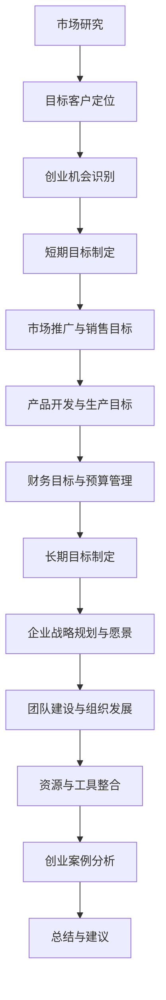

                 

## 《如何制定创业的短期和长期目标》

### 关键词：创业、目标制定、短期目标、长期目标、市场研究、客户定位、战略规划、财务目标

### 摘要：
创业是一个充满挑战和机遇的过程。本文旨在为创业者提供一套系统化的方法，帮助他们在创业初期制定明确的短期和长期目标。文章将详细探讨创业的概念与动机、市场研究与目标客户定位、创业机会的识别与评估、短期目标的制定原则与方法、长期目标的制定原则与方法、以及企业战略规划与团队建设等内容。通过本文的阅读，创业者将能够更好地把握创业方向，实现持续成长和成功。

---

### 引言

创业，作为一个充满激情与冒险的词汇，不仅代表着一种经济活动，更是一种生活方式和价值观的体现。随着全球经济的不断发展和创新浪潮的涌现，创业已经成为了推动经济增长和社会进步的重要力量。然而，创业并非一帆风顺，其中充满了不确定性、风险与挑战。因此，如何制定科学、合理的短期和长期目标，成为创业者必须面对的首要问题。

短期目标是指在创业初期设定的一系列具体、可行的目标，旨在快速实现业务突破和市场占有。短期目标往往具有时间限定性，如一个月、一个季度或一年。它们是创业者实现长期目标的关键步骤，通过不断实现短期目标，企业可以积累资源、提高竞争力，为未来的发展奠定基础。

长期目标则是指企业在较长时期内（通常为数年或更长时间）设定的宏伟愿景和战略规划。长期目标具有指导性和方向性，能够帮助创业者明确企业的愿景、使命和价值观，从而在复杂多变的市场环境中保持战略定力。长期目标的实现需要短期目标的支撑和驱动，二者相辅相成，共同推动企业不断前进。

本文将围绕短期和长期目标的制定展开讨论，旨在为创业者提供一套系统化的方法和思路。首先，我们将探讨创业的概念与动机，帮助创业者明确自己的创业方向和目标；接着，我们将深入市场研究和目标客户定位，分析如何发现和评估创业机会；然后，我们将详细介绍短期目标的制定原则与方法，以及市场推广、销售、产品开发、生产、财务等具体领域的目标设定；最后，我们将讨论长期目标的制定原则与方法，包括企业战略规划与愿景、团队建设与组织发展等关键内容。通过本文的阅读，创业者将能够更好地把握创业方向，实现持续成长和成功。

### 第一部分：创业前的准备

#### 第1章：创业的概念与动机

##### 1.1 创业的定义与类型

创业，从广义上讲，是指通过创新和创造性的方式，将资源整合、优化和重新配置，以实现商业目标的过程。创业可以包括新企业的创建、现有企业的转型或扩展，甚至是对商业模式的创新和改进。具体来说，创业通常涉及以下几个核心要素：

1. **机会识别**：创业者需要具备敏锐的市场洞察力和创新思维，发现并捕捉市场中的潜在机会。
2. **资源整合**：创业者需要将人、财、物等各种资源进行有效的整合和配置，以支持创业活动。
3. **团队构建**：创业者需要组建一支具有互补技能和共同目标的团队，共同实现创业目标。
4. **商业模式**：创业者需要设计并实施一个可持续、有竞争力的商业模式，以实现商业价值。

创业可以分为几种不同类型：

1. **初创企业**：这是最常见的创业类型，指从零开始创建的新企业，通常需要较大的创新和风险承受能力。
2. **转型企业**：这是指对现有企业进行重大改革和转型，以适应市场变化和客户需求。这种创业方式往往需要对现有资源进行重新配置和优化。
3. **扩展企业**：这是指在现有业务基础上进行扩展，如增加新业务、进入新市场或推出新产品。
4. **社会企业**：这是指以解决社会问题为目标的企业，如环保、教育、医疗等领域的创业项目。

##### 1.2 创业的动机与愿景

创业的动机多种多样，不同的创业者可能有不同的动机，但以下是一些常见的创业动机：

1. **实现个人理想**：许多创业者希望通过创业实现自己的梦想和理想，发挥自己的才能和潜力。
2. **追求经济独立**：创业者希望通过创业获得经济上的自由和独立，摆脱传统职业的束缚。
3. **创造价值**：创业者希望通过创新和创造，为社会带来实际的价值和改变，如解决社会问题、提高生活质量等。
4. **探索未知**：创业者往往对未知和挑战充满好奇心，希望通过创业探索新的领域和市场。
5. **改变世界**：一些创业者怀有远大的理想，希望通过创业改变世界，实现重大的社会变革。

创业愿景是创业者的目标和追求，是对未来的一种美好设想。一个明确的愿景能够为创业者提供方向和动力，使他们始终保持激情和决心。创业愿景通常包括以下几个方面：

1. **使命**：明确企业存在的意义和目标，如解决什么问题、满足什么需求等。
2. **愿景**：描述企业在未来几年的宏伟蓝图和目标，如市场地位、产品规模等。
3. **价值观**：企业所秉承的信念和原则，如客户至上、创新、诚信等。
4. **策略**：为实现愿景和目标所采取的具体行动和策略。

##### 1.3 创业的风险与回报

创业虽然充满机遇，但也伴随着高风险。以下是一些常见的创业风险：

1. **市场风险**：市场变化快速，创业者可能无法及时调整策略，导致市场定位不准确或产品不符合市场需求。
2. **财务风险**：创业初期资金紧张，创业者可能面临资金不足、现金流断裂等问题。
3. **技术风险**：技术更新换代迅速，创业者可能无法跟上技术发展的步伐，导致产品落后。
4. **管理风险**：团队管理不善、沟通不畅、人力资源管理问题等可能导致企业运营困难。
5. **法律风险**：创业者可能因不了解相关法律法规而面临法律纠纷和罚款。

然而，与风险相对应的是创业带来的巨大回报。成功的创业项目不仅能够带来经济上的收益，还能提升创业者的个人成就感和社会地位。以下是一些常见的创业回报：

1. **经济回报**：成功的创业项目能够为企业带来可观的收入和利润，实现财务自由。
2. **个人成就**：创业者通过实现创业目标，证明自己的才能和能力，获得成就感和社会认可。
3. **社会影响**：成功的创业项目往往能够解决社会问题，提高社会福祉，产生积极的社会影响。
4. **职业发展**：创业经历能够为创业者提供丰富的经验和技能，为未来的职业发展奠定基础。

总的来说，创业是一个充满挑战和机遇的过程。创业者需要明确自己的创业动机和愿景，充分了解创业风险和回报，制定科学、合理的创业计划，才能在激烈的市场竞争中脱颖而出，实现创业梦想。

---

#### 第2章：市场研究与目标客户定位

##### 2.1 市场研究的方法与工具

市场研究是创业过程中至关重要的一环，它能够帮助创业者深入了解市场环境、竞争对手、目标客户需求等信息，为创业决策提供有力支持。以下是一些常用的市场研究方法和工具：

1. **问卷调查**：问卷调查是一种直接获取消费者意见和需求的方法，可以通过在线问卷、纸质问卷等方式进行。问卷设计应注重问题清晰、简洁，同时确保样本具有代表性和多样性。

2. **访谈**：访谈法包括面对面访谈、电话访谈和在线访谈等，能够深入了解目标客户的真实需求和想法。访谈过程中，应保持开放、客观的态度，避免引导性问题。

3. **市场分析报告**：市场分析报告通过收集、整理和分析市场数据，为创业者提供全面的行业和市场信息。常见的市场分析报告包括行业报告、市场趋势分析报告等。

4. **竞争分析**：竞争分析是了解竞争对手的重要方法，包括产品对比、市场份额分析、价格策略分析等。通过竞争分析，创业者可以找到自己的竞争优势和不足，制定相应的市场策略。

5. **用户行为分析**：用户行为分析通过分析用户在网站、移动应用等平台上的行为数据，了解用户的兴趣、需求和痛点。常用的工具包括Google Analytics、热图分析工具等。

6. **实地考察**：实地考察是通过亲自到市场、店铺、展会等地点观察和调研，获取第一手市场信息。这种方法适用于了解市场的具体状况和竞争对手的情况。

7. **行业报告**：行业报告是专业机构发布的关于某个行业的详细研究报告，包括行业规模、市场趋势、竞争格局等。行业报告能够为创业者提供全面的行业背景和趋势分析。

##### 2.2 目标客户的需求分析

了解目标客户的需求是创业成功的关键，以下是一些分析目标客户需求的方法：

1. **痛点分析**：通过了解目标客户面临的问题和挑战，找出他们的痛点。例如，对于一款智能家居产品，客户可能担心设备的安全性和兼容性。

2. **需求分类**：将目标客户的需求进行分类，如基本需求、期望需求和兴奋需求。基本需求是客户最基本的需求，期望需求是客户希望得到的需求，兴奋需求是客户惊喜的需求。

3. **用户画像**：通过用户画像，描绘目标客户的基本特征、行为习惯、消费习惯等。用户画像有助于创业者更好地了解目标客户，制定有针对性的市场策略。

4. **SWOT分析**：通过对目标客户的优势、劣势、机会和威胁进行分析，找出他们的需求和痛点。例如，对于一款新兴科技产品，客户可能希望产品具有更好的性能和更低的成本。

5. **问卷调查**：通过问卷调查，收集目标客户的具体需求和反馈。问卷调查可以设计开放性问题，以便深入了解客户的真实想法。

6. **用户访谈**：通过用户访谈，深入了解目标客户的需求和痛点。访谈过程中，应关注客户的真实感受和具体建议。

##### 2.3 竞争对手分析

竞争对手分析是市场研究中的重要一环，以下是一些分析竞争对手的方法：

1. **产品对比**：通过对竞争对手的产品进行详细对比，找出它们的特点、优势和不足。例如，在智能手机市场上，可以比较不同品牌手机在性能、价格、功能等方面的差异。

2. **市场份额分析**：通过分析竞争对手的市场份额，了解它们在市场中的地位和影响力。市场份额分析可以帮助创业者找到市场空缺和机会。

3. **价格策略分析**：通过分析竞争对手的价格策略，了解它们的定价策略、价格区间等。创业者可以根据竞争对手的价格策略，制定自己的定价策略。

4. **营销策略分析**：通过对竞争对手的营销策略进行分析，了解它们的营销渠道、推广方式等。创业者可以借鉴竞争对手的成功经验，优化自己的营销策略。

5. **技术优势分析**：通过对竞争对手的技术优势进行分析，了解它们在技术领域的领先地位。例如，在人工智能领域，可以分析竞争对手在算法、数据集等方面的优势。

6. **团队背景分析**：通过分析竞争对手的团队背景，了解他们的核心团队成员、教育背景、工作经验等。创业者可以通过分析竞争对手的团队背景，了解他们在行业中的地位和影响力。

7. **用户反馈分析**：通过收集和分析竞争对手的用户反馈，了解用户的满意度和不满意度。创业者可以借鉴用户反馈，优化自己的产品和服务。

通过市场研究和竞争对手分析，创业者可以深入了解市场环境和目标客户，制定科学、合理的创业策略，从而提高创业成功率。

---

#### 第3章：创业机会的识别与评估

##### 3.1 创业机会的类型与来源

在创业过程中，识别和抓住机会是成功的关键。创业机会可以分为以下几种类型：

1. **市场需求**：这是最常见的创业机会类型，指在市场中存在的未被满足或未被完全满足的需求。例如，随着人们对健康生活需求的增加，市场出现了各种健康食品、健身器材等创业机会。

2. **技术创新**：技术创新可以带来新的产品和业务模式，从而创造市场机会。例如，移动互联网的发展催生了众多基于移动互联网的创业项目，如在线购物、社交平台等。

3. **商业模式创新**：商业模式创新可以改变传统的商业模式，创造出新的商业价值。例如，共享经济的兴起改变了人们的出行方式，为创业者提供了新的机会。

4. **市场细分**：市场细分是将一个大的市场划分为多个具有相似需求和特征的小市场。通过市场细分，创业者可以更精准地定位目标客户，提供更有针对性的产品和服务。

5. **政策变化**：政策变化可以带来新的市场机会，例如政府支持的新兴产业、绿色能源政策等。

创业机会的来源多种多样，以下是一些常见的创业机会来源：

1. **行业趋势**：通过关注行业趋势，创业者可以及时发现新兴领域和市场机会。例如，随着人工智能技术的发展，人工智能相关的创业机会不断涌现。

2. **客户反馈**：客户的反馈和需求是创业机会的重要来源。创业者可以通过与客户的互动，了解他们的需求和痛点，从而发现市场机会。

3. **竞争对手**：分析竞争对手的不足和失败案例，创业者可以找到市场上的空缺和机会。例如，通过了解竞争对手的产品缺陷和客户投诉，创业者可以开发出更符合市场需求的产品。

4. **个人兴趣和专长**：创业者可以结合自己的兴趣和专长，发现和创造市场机会。例如，对某个领域的热爱和深入了解，可以激发创业者在该领域创业的灵感。

5. **社会问题**：社会问题往往蕴含着巨大的市场机会。创业者可以通过解决社会问题，为社会带来实际的价值和改变。例如，环保问题催生了绿色能源、环保科技等创业机会。

##### 3.2 创业机会的评估方法

评估创业机会是创业过程中的重要环节，以下是一些常用的创业机会评估方法：

1. **SWOT分析**：SWOT分析是一种常用的评估方法，通过分析创业机会的优势（Strengths）、劣势（Weaknesses）、机会（Opportunities）和威胁（Threats），评估创业机会的可行性和潜力。

   - 优势：包括创业者在资源、能力、经验等方面的优势。
   - 劣势：包括创业者在技术、资金、团队等方面的不足。
   - 机会：包括市场趋势、政策变化、竞争对手的不足等。
   - 威胁：包括市场竞争、技术风险、法律风险等。

2. **PEST分析**：PEST分析是一种宏观环境分析工具，通过分析政治（Political）、经济（Economic）、社会（Societal）和技术（Technological）等外部因素，评估创业机会的可行性和市场环境。

   - 政治因素：包括政策、法规、政治稳定性等。
   - 经济因素：包括经济增长、消费水平、市场潜力等。
   - 社会因素：包括人口结构、生活方式、文化传统等。
   - 技术因素：包括技术进步、技术创新、技术普及等。

3. **机会成本分析**：机会成本分析是通过计算创业机会的潜在收益和潜在成本，评估创业机会的可行性和收益。具体计算方法为：潜在收益 - 潜在成本 = 机会成本。

4. **风险评估**：风险评估是评估创业机会可能面临的风险和挑战。常见的方法包括定性分析和定量分析。定性分析包括风险识别、风险分类、风险评估等；定量分析包括风险概率分析、风险影响分析等。

5. **市场调研**：市场调研是通过收集和分析市场数据，评估创业机会的可行性和市场潜力。市场调研包括问卷调查、访谈、实地考察等。

##### 3.3 创业机会的筛选与决策

在评估多个创业机会后，创业者需要筛选和决策最具有潜力和可行性的机会。以下是一些筛选和决策的方法：

1. **优先级排序**：根据评估结果，对创业机会进行优先级排序，选择最具有潜力和可行性的机会。

2. **成本效益分析**：计算每个创业机会的潜在收益和成本，选择成本效益最高的机会。

3. **团队共识**：通过团队讨论和共识，选择最符合团队能力和资源的机会。

4. **风险调整**：考虑创业机会可能面临的风险，对机会进行风险调整，选择风险最小的机会。

5. **决策模型**：使用决策模型，如决策树、多因素决策模型等，对创业机会进行综合评估和决策。

通过以上方法，创业者可以科学、合理地筛选和决策最具有潜力和可行性的创业机会，从而提高创业成功率。

---

### 第二部分：短期目标制定

#### 第4章：短期目标的制定原则与方法

##### 4.1 短期目标的重要性

在创业过程中，短期目标具有重要的意义。短期目标是指创业者在一定时间内（通常为一个月、一个季度或一年）设定的具体、可行的目标，它们是创业者在实现长期目标过程中必须完成的关键步骤。以下是从几个方面阐述短期目标的重要性：

1. **指导创业行动**：短期目标为创业者的行动提供了明确的方向和指南。通过设定短期目标，创业者可以明确自己的工作重点和优先级，确保资源投入得到最有效的利用。

2. **衡量创业进展**：短期目标可以作为衡量创业进展的重要指标。通过定期回顾和评估短期目标的完成情况，创业者可以及时了解创业项目的进展，发现和解决问题，确保创业项目按计划推进。

3. **激励团队动力**：短期目标的实现可以为团队成员带来成就感和动力。明确的目标和成功的实现可以激发团队成员的工作热情和积极性，提高团队整体的工作效率。

4. **调整创业策略**：通过实现短期目标，创业者可以收集到关于市场、客户、产品等方面的宝贵数据和信息。这些数据和信息有助于创业者调整和优化创业策略，提高创业项目的成功概率。

##### 4.2 短期目标的制定原则

为了确保短期目标的有效性和可操作性，创业者需要遵循以下原则：

1. **具体明确**：短期目标应具体、明确，避免模糊和抽象。例如，而不是“提高销售额”，而是“通过增加广告投放，使月销售额达到100万元”。

2. **可行性**：短期目标应具有可行性，即在现有资源和条件下能够实现。创业者需要根据实际情况，设定合理的短期目标，避免过于理想化。

3. **时间限定**：短期目标应有明确的时间限定，例如一个月、一个季度或一年。时间限定有助于创业者集中精力，确保目标的实现。

4. **量化可测**：短期目标应具备可量化、可测量的指标，以便创业者能够准确评估目标的完成情况。例如，而不是“提升客户满意度”，而是“通过改进售后服务，使客户满意度评分达到90分”。

5. **可分解性**：短期目标应具有可分解性，即将总目标分解为若干个具体的子目标，便于创业者和团队成员逐一实现。例如，将“推出新产品”分解为“完成产品设计”、“进行产品测试”、“制定市场推广方案”等。

6. **灵活性**：短期目标应具备一定的灵活性，以便在市场环境变化或资源调整时，能够迅速调整目标。灵活性有助于创业者应对不确定性，提高创业成功率。

##### 4.3 短期目标的制定方法

制定短期目标需要系统地分析和规划，以下是一些具体的方法：

1. **SMART原则**：SMART原则是一种常用的目标设定方法，即目标应具有具体性（Specific）、可衡量性（Measurable）、可实现性（Achievable）、相关性（Relevant）和时限性（Time-bound）。例如，设定一个目标为“在一个月内，通过增加广告投放，使月销售额达到100万元”。

2. **关键绩效指标（KPI）**：关键绩效指标是衡量短期目标完成情况的重要工具。创业者可以根据业务需求和目标，设定相应的KPI，如销售额、客户满意度、产品上线时间等。

3. **目标分解法**：将总目标分解为若干个具体的子目标，逐一实现。目标分解法有助于创业者明确每个阶段的工作重点，确保目标的实现。

4. **团队协作**：短期目标的制定和实现需要团队协作。创业者应与团队成员充分沟通，了解他们的意见和建议，确保目标符合团队的整体能力和资源。

5. **定期回顾**：定期回顾和评估短期目标的完成情况，及时调整和优化目标。定期回顾有助于创业者及时发现和解决问题，确保创业项目按计划推进。

6. **数据驱动**：利用数据和分析工具，如数据分析平台、市场调研报告等，制定和调整短期目标。数据驱动有助于创业者做出科学、合理的决策。

通过以上方法，创业者可以制定出科学、合理、具体的短期目标，为创业项目的成功奠定基础。

---

#### 第5章：市场推广与销售目标

##### 5.1 市场推广策略的选择

市场推广策略是创业过程中至关重要的环节，它直接影响着企业的市场占有率和品牌知名度。以下是几种常见的市场推广策略及其优缺点：

1. **广告推广**：广告推广是通过各种媒体渠道（如电视、报纸、网络等）投放广告，提高品牌曝光度和知名度。广告推广的优点包括覆盖面广、传播速度快、记忆度高，但缺点是成本较高、效果难以衡量。

2. **公关推广**：公关推广是通过新闻发布、媒体采访、活动赞助等方式，塑造企业良好的社会形象和品牌形象。公关推广的优点包括低成本、高影响力、持续性强，但缺点是效果较难量化、操作复杂。

3. **社交媒体推广**：社交媒体推广是通过社交媒体平台（如微信、微博、抖音等）进行内容营销、互动推广等，吸引目标客户关注和参与。社交媒体推广的优点包括成本低、互动性强、传播速度快，但缺点是受众定位较难、效果难以衡量。

4. **线上线下结合推广**：线上线下结合推广是将线上和线下的推广手段相结合，如线上广告投放、社交媒体互动、线下活动举办等，实现全方位的市场覆盖。线上线下结合推广的优点包括覆盖面广、互动性强、效果可衡量，但缺点是操作复杂、成本较高。

5. **口碑营销**：口碑营销是通过客户口碑、用户评价等方式，提高品牌知名度和美誉度。口碑营销的优点包括成本低、可信度高、传播速度快，但缺点是效果较难控制、操作难度大。

创业者应根据自身产品特点、目标市场、资源和预算等因素，选择合适的市场推广策略。以下是选择市场推广策略时需要考虑的几个因素：

- **产品特点**：不同类型的产品适合不同的推广策略。例如，科技产品更适合广告推广，而生活用品更适合社交媒体推广和口碑营销。

- **目标市场**：了解目标市场的需求和偏好，选择适合的推广渠道和方式。例如，年轻人群更适合社交媒体推广，中老年人群更适合电视广告和报纸广告。

- **资源预算**：根据自身的资源和预算，选择能够承受的市场推广策略。例如，初创企业可以选择低成本、高回报的社交媒体推广和口碑营销。

- **竞争环境**：分析竞争对手的市场推广策略，避免与他们直接竞争，寻找差异化的推广策略。

- **效果评估**：选择能够有效衡量和评估推广效果的市场推广策略，以便及时调整和优化推广策略。

##### 5.2 销售目标的设计与实现

销售目标是企业在一定时间内（通常为一个月、一个季度或一年）设定的销售目标，它反映了企业的销售预期和市场占有率。以下是设计销售目标时需要考虑的几个方面：

1. **市场容量**：了解目标市场的总容量和潜在客户数量，为销售目标的设定提供基础数据。市场容量可以通过市场调研、行业报告等途径获取。

2. **竞争态势**：分析竞争对手的销售业绩和市场占有率，设定合理的销售目标。如果市场竞争激烈，可以设定略低于竞争对手的目标，以保持竞争优势。

3. **历史数据**：参考企业过去一段时间内的销售数据，分析销售趋势和波动原因，为销售目标的设定提供参考。

4. **增长预期**：根据市场趋势、企业发展战略和产品竞争力，设定合理的目标增长率。例如，如果市场处于快速发展阶段，可以设定较高的增长率。

5. **资源限制**：考虑企业现有的资源（如人力、资金、产品库存等），设定能够实现的销售目标。

销售目标的设计完成后，需要通过以下步骤实现：

1. **分解目标**：将总体销售目标分解为若干个具体的子目标，如按产品、按地区、按渠道等。分解目标有助于明确各个部门的工作重点和责任。

2. **制定销售策略**：根据销售目标，制定具体的销售策略和行动计划。销售策略包括产品定价、销售渠道、促销活动、客户关系管理等。

3. **执行与监控**：按照销售策略和行动计划，开展销售工作，并定期监控销售进度。监控指标包括销售额、客户满意度、销售转化率等。

4. **调整与优化**：根据销售进度和反馈，及时调整销售策略和目标。例如，如果销售进度滞后，可以加大促销力度或调整销售渠道。

5. **团队协作**：销售目标的实现需要团队的共同努力。创业者应与销售团队保持密切沟通，确保目标的实现。

通过科学的设计和有效的执行，创业者可以实现销售目标，提高企业的市场占有率和竞争力。

##### 5.3 销售渠道的选择与管理

销售渠道是产品从企业到客户之间的流通路径，选择和管理合适的销售渠道对于创业企业至关重要。以下是几种常见的销售渠道及其优缺点：

1. **直销**：直销是指企业直接与客户建立联系，进行产品销售和服务。直销的优点包括控制力强、客户关系稳定、销售利润高，但缺点是成本较高、销售范围有限。

2. **分销**：分销是指企业通过中间商（如代理商、分销商等）将产品销售给最终客户。分销的优点包括销售范围广、成本低、快速覆盖市场，但缺点是控制力弱、利润较低。

3. **在线销售**：在线销售是指通过电子商务平台、社交媒体、自建网站等在线渠道进行产品销售。在线销售的优点包括成本低、覆盖面广、灵活性强，但缺点是依赖互联网、安全性问题。

4. **线下销售**：线下销售是指通过实体店铺、商场、专卖店等进行产品销售。线下销售的优点包括直观性强、客户信任度高、体验感好，但缺点是成本较高、销售范围有限。

创业者应根据自身产品特点、市场需求、资源和预算等因素，选择合适的销售渠道。以下是一些选择和管理销售渠道的方法：

1. **市场调研**：通过市场调研，了解目标市场的消费习惯、购买行为和渠道偏好，为选择销售渠道提供依据。

2. **渠道评估**：评估各个销售渠道的优缺点、成本和收益，选择最适合企业的销售渠道。

3. **渠道管理**：建立完善的渠道管理体系，包括渠道招募、培训、支持、监控等，确保渠道的稳定运行。

4. **渠道优化**：根据市场反馈和销售数据，及时调整和优化销售渠道，提高销售效率。

5. **渠道整合**：将不同的销售渠道进行整合，实现渠道协同效应，提高整体销售业绩。

通过科学的选择和管理，创业者可以构建高效的销售渠道体系，提高企业的市场占有率和竞争力。

---

#### 第6章：产品开发与生产目标

##### 6.1 产品开发的目标与步骤

产品开发是创业过程中至关重要的一环，它关系到企业的核心竞争力、市场占有率和客户满意度。以下是从几个方面阐述产品开发的目标与步骤：

1. **明确产品目标**：产品开发的目标应与企业的整体战略和愿景保持一致。具体来说，产品开发目标应包括以下几个方面：

   - **满足市场需求**：通过市场调研和用户反馈，了解目标客户的需求和痛点，开发出能够满足市场需求的产品。
   - **技术创新**：通过技术创新，提升产品的竞争力，实现差异化竞争优势。
   - **提升用户体验**：注重用户体验，提供优质的客户服务，提高客户满意度和忠诚度。
   - **实现商业价值**：确保产品能够实现商业价值，为企业带来可观的收入和利润。

2. **制定产品开发计划**：在明确产品目标后，创业者需要制定详细的开发计划。产品开发计划应包括以下几个方面：

   - **项目范围**：明确产品的功能、性能、技术要求等。
   - **时间进度**：制定项目的时间表，包括各个阶段的工作内容和时间节点。
   - **资源分配**：确定项目所需的资源，包括人力、资金、设备等。
   - **风险评估**：识别项目可能面临的风险，并制定相应的风险应对策略。

3. **项目执行**：按照产品开发计划，进行项目的具体执行。项目执行包括以下几个阶段：

   - **需求分析**：深入了解目标客户的需求，明确产品的功能需求和用户体验。
   - **设计阶段**：根据需求分析，进行产品的设计和开发。设计阶段包括系统设计、界面设计、功能设计等。
   - **开发阶段**：进行编码和测试，确保产品的功能和质量符合要求。
   - **测试阶段**：对产品进行全面测试，包括功能测试、性能测试、用户体验测试等，确保产品稳定、可靠、易用。
   - **上线阶段**：将产品上线，并进行市场推广和销售。

4. **项目回顾与优化**：在项目结束后，进行项目回顾和总结。项目回顾应包括以下几个方面：

   - **项目成果**：总结项目取得的成果，包括产品的功能、性能、用户反馈等。
   - **项目经验**：总结项目过程中的经验教训，包括成功经验和失败教训，为后续项目提供参考。
   - **项目优化**：根据项目回顾的结果，对项目过程和产品进行优化，提高项目执行效率和产品质量。

##### 6.2 生产目标的制定与监控

生产目标是企业在一定时间内（通常为一个月、一个季度或一年）设定的生产目标，它反映了企业的生产能力、生产效率和产品质量。以下是从几个方面阐述生产目标的制定与监控：

1. **制定生产目标**：制定生产目标需要考虑以下几个方面：

   - **生产计划**：根据企业的销售预测和市场订单，制定生产计划，确定生产数量、生产时间和生产批次。
   - **生产效率**：设定生产效率目标，如单位时间内完成的生产量、生产周期等。
   - **质量目标**：设定产品质量目标，如合格率、不良品率、客户满意度等。
   - **成本目标**：设定生产成本目标，如单位成本、成本控制率等。

2. **生产目标的监控**：生产目标的监控是确保生产目标实现的重要环节。以下是一些监控方法：

   - **实时监控**：通过信息化手段，如ERP系统、MES系统等，实时监控生产进度、生产效率、产品质量等关键指标。
   - **定期检查**：定期对生产过程进行检查，包括设备运行状况、生产效率、产品质量等，及时发现和解决生产问题。
   - **数据分析**：通过数据分析，如生产数据、质量数据等，评估生产目标的完成情况，发现生产过程中的问题，为改进提供依据。

3. **生产目标的调整与优化**：根据生产目标的监控结果，对生产目标进行及时的调整和优化。以下是一些调整与优化的方法：

   - **生产计划调整**：根据市场需求和订单情况，调整生产计划，确保生产目标的实现。
   - **生产效率提升**：通过优化生产流程、提高设备利用率、培训员工等手段，提高生产效率。
   - **质量控制**：通过改进生产工艺、提高设备精度、加强员工培训等手段，提高产品质量。
   - **成本控制**：通过优化采购流程、降低原材料成本、提高生产效率等手段，降低生产成本。

通过制定科学、合理的产品开发目标和生产目标，并对其进行有效的监控和调整，企业可以确保产品的质量和生产效率，提高市场竞争力。

---

#### 第7章：财务目标与预算管理

##### 7.1 财务目标的设计与实现

财务目标是指企业在一定时间内（通常为一个月、一个季度或一年）设定的财务目标，它反映了企业的经营成果、盈利能力和财务健康状况。以下是从几个方面阐述财务目标的设计与实现：

1. **收入目标**：收入目标是企业财务目标的核心，它反映了企业的市场占有率和销售能力。设计收入目标需要考虑以下几个方面：

   - **市场趋势**：分析市场趋势和行业动态，预测未来市场的增长潜力。
   - **竞争态势**：了解竞争对手的销售情况，设定合理的市场份额目标。
   - **历史数据**：参考企业过去的销售数据，结合市场预测，设定合理的目标。

2. **成本控制目标**：成本控制目标是确保企业在实现收入目标的同时，实现盈利能力的提升。设计成本控制目标需要考虑以下几个方面：

   - **直接成本**：包括原材料、人工、设备等直接与生产相关的成本，通过优化采购流程、提高生产效率等方式，降低直接成本。
   - **间接成本**：包括管理费用、销售费用、财务费用等间接与生产相关的成本，通过优化管理流程、提高运营效率等方式，降低间接成本。

3. **利润目标**：利润目标是企业在实现收入目标和成本控制目标的基础上，实现盈利能力的提升。设计利润目标需要考虑以下几个方面：

   - **毛利率**：通过提高产品附加值、优化产品结构等方式，提高毛利率。
   - **费用率**：通过优化管理流程、提高运营效率等方式，降低费用率。
   - **净利润率**：通过提高毛利率、降低费用率等方式，提高净利润率。

4. **资金管理目标**：资金管理目标是确保企业有足够的资金支持经营发展，同时降低融资成本。设计资金管理目标需要考虑以下几个方面：

   - **现金流管理**：通过优化收款和付款流程，确保现金流的稳定性。
   - **融资策略**：根据企业的资金需求，制定合理的融资策略，降低融资成本。
   - **投资收益**：通过投资理财，提高资金收益。

实现财务目标的关键在于：

- **制定详细的财务计划**：根据财务目标，制定详细的财务计划，包括收入计划、成本控制计划、利润计划等。
- **监控财务指标**：通过财务报表、财务分析等手段，实时监控财务指标的完成情况，及时发现和解决财务问题。
- **优化财务管理流程**：通过信息化手段，优化财务管理流程，提高财务管理效率。
- **团队合作**：财务目标的实现需要企业各部门的协同配合，包括销售、生产、采购、人力资源等。

通过科学、合理地设计财务目标，并对其进行有效的监控和调整，企业可以实现稳健的财务发展，提高市场竞争力。

##### 7.2 预算管理的方法与技巧

预算管理是企业财务管理的重要环节，它关系到企业的资源分配、成本控制和财务目标的实现。以下是从几个方面阐述预算管理的方法与技巧：

1. **预算编制**：

   - **收入预算**：根据市场预测和销售计划，编制收入预算。收入预算应包括主营业务收入、其他业务收入等。
   - **成本预算**：根据生产计划、采购计划等，编制成本预算。成本预算应包括直接成本、间接成本等。
   - **费用预算**：根据企业管理需求，编制费用预算。费用预算应包括管理费用、销售费用、财务费用等。
   - **利润预算**：根据收入预算和成本预算，编制利润预算。利润预算应包括毛利率、费用率等。

2. **预算调整**：

   - **定期调整**：根据市场变化、经营状况等，定期对预算进行调整。预算调整应确保财务目标的实现。
   - **动态调整**：在预算执行过程中，根据实际情况，动态调整预算。动态调整有助于应对不确定性和风险。

3. **预算执行与监控**：

   - **执行环节**：制定详细的执行计划，明确各部门的职责和任务，确保预算的顺利执行。
   - **监控环节**：通过财务报表、财务分析等手段，实时监控预算的执行情况。监控应包括收入、成本、费用等关键指标。

4. **成本控制技巧**：

   - **标准化作业**：通过标准化作业，提高生产效率，降低直接成本。
   - **优化采购流程**：通过优化采购流程，降低采购成本，提高采购效率。
   - **压缩非生产性开支**：通过压缩非生产性开支，降低间接成本，提高运营效率。

5. **预算沟通与反馈**：

   - **内部沟通**：定期召开预算沟通会议，各部门负责人共同参与，确保预算目标的明确和执行。
   - **反馈机制**：建立预算反馈机制，及时收集各部门的预算执行情况和问题，为调整和优化预算提供依据。

通过科学、合理的预算管理，企业可以确保资源的合理配置、成本的有效控制，实现财务目标的顺利实现。

##### 7.3 成本控制与收益分析

成本控制与收益分析是财务管理的重要环节，它关系到企业的盈利能力和市场竞争能力。以下是从几个方面阐述成本控制与收益分析的方法：

1. **成本控制方法**：

   - **标准成本法**：通过制定标准成本，比较实际成本与标准成本的差异，找出成本控制的关键点。
   - **目标成本法**：通过设定目标成本，优化生产过程，实现成本的降低。
   - **作业成本法**：通过将成本分配到各个作业活动，分析每个作业活动的成本效益，优化资源配置。

2. **收益分析方法**：

   - **盈利能力分析**：通过计算毛利率、净利润率等指标，分析企业的盈利能力。
   - **成本效益分析**：通过计算成本与收益的比率，分析项目的成本效益。
   - **投资回报率分析**：通过计算投资回报率（ROI），评估项目的投资回报情况。

3. **成本控制与收益分析的关系**：

   - **成本控制与收益分析相辅相成**：成本控制是提高收益的基础，而收益分析是评估成本控制效果的重要手段。
   - **成本控制与收益分析相互促进**：通过成本控制，提高企业的盈利能力，进而增加收益；通过收益分析，优化成本控制策略，提高成本效益。

通过科学、合理的成本控制与收益分析，企业可以确保资源的高效利用、成本的合理控制，实现持续、稳健的盈利增长。

---

### 第三部分：长期目标制定

#### 第8章：长期目标的制定原则与方法

##### 8.1 长期目标的重要性

长期目标是指企业在较长时期内（通常为数年或更长时间）设定的宏伟愿景和战略规划。它是企业发展的指南针，为企业的可持续发展提供了方向和动力。以下是长期目标在企业中的重要性：

1. **明确企业愿景和使命**：长期目标能够帮助企业明确自身的愿景和使命，即企业存在的意义和要实现的目标。这有助于企业聚焦核心竞争力，持续为社会创造价值。

2. **指导战略规划**：长期目标为企业的战略规划提供了明确的指引，使企业在面对复杂多变的市场环境时能够保持战略定力，确保企业发展的方向与市场趋势相符。

3. **统一员工共识**：长期目标能够统一员工对企业发展的共识，使员工能够明确自己的工作方向和目标，提高工作积极性和团队凝聚力。

4. **激励员工斗志**：长期目标往往设定了企业宏伟的愿景和目标，这能够激发员工的斗志和激情，使员工为了实现企业的目标而努力奋斗。

5. **提升企业竞争力**：长期目标通过战略规划和持续创新，能够提升企业的核心竞争力，使企业在激烈的市场竞争中立于不败之地。

##### 8.2 长期目标的制定原则

为了确保长期目标的科学性和可行性，企业在制定长期目标时需要遵循以下原则：

1. **符合企业使命和愿景**：长期目标应与企业的使命和愿景保持一致，确保企业的发展方向与企业的核心价值相符。

2. **具有挑战性**：长期目标应具有挑战性，既能够激励员工的斗志，又能够促使企业不断突破自我，实现持续成长。

3. **具体明确**：长期目标应具体、明确，避免模糊和抽象。例如，而不是“成为行业的领导者”，而是“在五年内实现市场份额的翻倍”。

4. **可量化**：长期目标应具备可量化、可测量的指标，以便企业能够准确评估目标的实现情况。

5. **实现性**：长期目标应具有实现性，即企业现有的资源和能力能够支持目标的实现。避免设定过于理想化或不切实际的目标。

6. **适应性**：长期目标应具备一定的适应性，能够根据市场环境和企业内部变化进行及时调整。

7. **公开透明**：长期目标应公开透明，使企业内外部都能够了解企业的愿景和目标，提高企业的公信力和凝聚力。

##### 8.3 长期目标的制定方法

制定长期目标需要系统性的分析和规划，以下是几种常用的制定方法：

1. **愿景陈述法**：愿景陈述法是指通过描述企业的长期愿景，引导企业制定长期目标。这种方法有助于企业明确自身的使命和愿景，从而制定出具有前瞻性和战略性的长期目标。

2. **SWOT分析法**：SWOT分析法是一种常用的战略规划工具，通过分析企业的优势、劣势、机会和威胁，制定出符合企业实际情况的长期目标。这种方法能够帮助企业全面了解自身的优劣势，以及市场环境中的机会和威胁，从而制定出科学的长期目标。

3. **战略规划法**：战略规划法是指通过制定企业的长期战略规划，明确企业的发展方向和重点领域，从而制定出具体的长期目标。这种方法需要企业进行深入的内部和外部分析，确保长期目标的可行性和科学性。

4. **目标分解法**：目标分解法是指将长期目标分解为若干个短期目标，通过实现短期目标，逐步实现长期目标。这种方法有助于企业明确各个阶段的工作重点和任务，确保长期目标的顺利实现。

5. **数据驱动法**：数据驱动法是指通过收集和分析企业的数据，制定出基于数据的长期目标。这种方法能够帮助企业更加准确地了解市场环境和客户需求，从而制定出符合实际情况的长期目标。

6. **团队协作法**：团队协作法是指通过团队讨论和共识，制定出企业的长期目标。这种方法能够充分发挥团队的力量，确保长期目标的科学性和可行性。

通过以上方法，企业可以制定出科学、合理、具体的长期目标，为企业的可持续发展奠定坚实的基础。

---

#### 第9章：企业战略规划与愿景

##### 9.1 企业战略规划的意义

企业战略规划是指企业在一定时期内，根据外部环境和企业内部条件，制定出具体的战略目标和行动方案，以实现企业的长远发展。企业战略规划的意义主要体现在以下几个方面：

1. **明确企业发展方向**：战略规划能够帮助企业明确未来的发展方向，确保企业在复杂多变的市场环境中始终保持清晰的目标和方向。

2. **优化资源配置**：战略规划有助于企业合理配置资源，确保资源能够得到最有效的利用，从而提高企业的竞争力。

3. **提高决策效率**：战略规划提供了明确的决策框架和指导原则，有助于企业快速做出正确的决策，提高决策效率。

4. **增强企业凝聚力**：战略规划能够统一员工对企业发展的共识，提高员工的积极性和凝聚力，形成共同的努力方向。

5. **应对市场变化**：战略规划能够帮助企业预见市场变化，提前布局，从而在市场变化中占据有利位置，保持竞争优势。

##### 9.2 长期战略目标的制定

长期战略目标的制定是企业战略规划的核心，它决定了企业未来几年的发展方向和重点。以下是制定长期战略目标的步骤：

1. **环境分析**：通过对外部环境和内部条件的分析，了解企业的优势、劣势、机会和威胁。外部环境分析包括市场趋势、行业动态、竞争态势等；内部条件分析包括企业资源、能力、文化等。

2. **目标设定**：根据环境分析的结果，设定企业的长期战略目标。目标应具体、明确，并具备可量化、可测量的指标。例如，“在未来五年内，实现营业收入增长50%”。

3. **策略规划**：制定实现长期战略目标的策略规划，明确企业将在哪些领域进行重点突破，采取哪些具体措施。策略规划应包括市场拓展、技术创新、组织优化等方面。

4. **资源分配**：根据长期战略目标，分配企业资源，确保资源能够支持战略目标的实现。资源分配应包括人力、资金、技术等。

5. **实施与监控**：制定详细的实施计划，明确各个阶段的工作任务和时间节点，并建立监控机制，确保战略目标的顺利实施。

6. **评估与调整**：定期对战略目标的实现情况进行评估，分析原因，及时调整战略规划，确保目标的实现。

##### 9.3 愿景与使命的制定

愿景和使命是企业价值观的集中体现，它们为企业的发展提供了方向和动力。以下是制定愿景与使命的步骤：

1. **明确愿景**：愿景应描述企业的长远目标和理想状态，具有鼓舞人心的力量。例如，“成为行业领先的创新者，为世界带来可持续的科技解决方案”。

2. **明确使命**：使命应描述企业的核心价值观和存在的意义，回答企业为什么要存在的问题。例如，“通过技术创新，为客户提供卓越的产品和服务，推动社会的进步和发展”。

3. **整合愿景与使命**：确保愿景和使命相互一致，共同构成企业的核心价值体系。

4. **内部沟通**：通过内部沟通，使员工充分理解愿景和使命，形成共同的价值观和目标。

5. **外部宣传**：通过外部宣传，使公众了解企业的愿景和使命，提升企业的社会形象和品牌价值。

通过制定科学、合理的战略规划、愿景和使命，企业能够明确发展方向，优化资源配置，提高决策效率，增强企业凝聚力，实现持续、稳健的发展。

---

#### 第10章：团队建设与组织发展

##### 10.1 团队建设的目标与方法

团队建设是企业发展过程中至关重要的一环，一个高效的团队能够显著提升企业的竞争力。以下是团队建设的目标和方法：

1. **团队建设的目标**：

   - **提高团队协作效率**：通过优化团队结构和工作流程，提高团队成员之间的协作效率，实现资源的最大化利用。
   - **提升团队凝聚力**：通过团队建设活动，增强团队成员之间的信任和沟通，提高团队整体的凝聚力和向心力。
   - **培养团队成员能力**：通过培训和发展计划，提升团队成员的专业技能和综合素质，为企业的长远发展储备人才。
   - **激发团队创新力**：通过营造开放、包容的工作氛围，鼓励团队成员发挥创意，推动企业的创新和发展。

2. **团队建设的方法**：

   - **团队建设活动**：组织定期的团队建设活动，如团队拓展、团队旅行、团队竞赛等，增强团队成员之间的交流和互动，提高团队凝聚力。
   - **培训与发展计划**：根据团队成员的需求和企业的战略目标，制定个性化的培训和发展计划，提升团队成员的专业技能和职业素养。
   - **沟通机制**：建立有效的沟通机制，如定期会议、工作汇报、员工反馈等，确保信息畅通，减少误解和冲突。
   - **团队文化建设**：通过制定企业价值观、团队口号、团队精神等，塑造积极的团队文化，增强团队成员的归属感和认同感。

##### 10.2 组织发展的关键因素

组织发展是指企业在不断发展过程中，通过优化内部结构、流程和文化，提升企业整体效率和竞争力。以下是组织发展的关键因素：

1. **领导力**：领导力是组织发展的核心，一个优秀的领导者能够激发团队成员的潜能，引领团队实现共同目标。领导者应具备远见、决策力、执行力、沟通力等能力。

2. **组织结构**：合理的组织结构能够确保企业高效运转，提高决策效率和执行能力。常见的组织结构包括职能型、事业部型、矩阵型等，企业应根据自身特点和需求选择合适的组织结构。

3. **流程优化**：通过优化工作流程，减少冗余环节，提高工作效率和执行力。流程优化应从业务流程、管理流程、支持流程等多个方面进行。

4. **企业文化**：企业文化是组织发展的精神支柱，是员工共同价值观和行为规范的体现。一个积极、包容、创新的企业文化能够激发员工的创造力和归属感，促进企业的发展。

5. **人才发展**：人才是企业发展的关键，企业应注重人才培养和激励，建立完善的人才管理体系，确保人才的合理配置和持续发展。

6. **激励机制**：合理的激励机制能够激发员工的积极性和创造力，提高员工的满意度和忠诚度。激励机制应包括薪酬、晋升、荣誉等多个方面。

7. **外部合作**：通过建立广泛的合作伙伴关系，共享资源、优势互补，提升企业的竞争力。外部合作包括供应商合作、客户合作、同行合作等。

通过关注以上关键因素，企业可以持续优化内部管理，提升组织效率，实现持续发展。

##### 10.3 长期目标与团队发展的结合

长期目标和团队发展是相辅相成的，一个明确、科学的长期目标能够为团队发展提供方向和动力，而团队的发展又能够为实现长期目标提供强有力的支撑。以下是长期目标与团队发展的结合方法：

1. **目标一致**：确保团队的长期目标和企业的长期目标保持一致，使团队在实现企业目标的过程中，感受到自己的价值和使命。

2. **分解目标**：将企业的长期目标分解为具体的、可执行的团队目标，使每个团队成员都能明确自己的职责和任务。

3. **培训与发展**：根据团队目标，制定个性化的培训和发展计划，提升团队成员的专业技能和综合素质，为团队目标的实现提供人才保障。

4. **激励机制**：建立与团队目标相匹配的激励机制，激励团队成员为实现目标而努力。

5. **沟通与反馈**：建立有效的沟通机制，及时了解团队目标实现的情况，对团队成员的工作进行反馈和指导，确保目标的顺利实现。

6. **评估与调整**：定期对团队目标的实现情况进行评估，分析原因，及时调整团队目标和策略，确保团队目标的实现。

通过以上方法，企业可以确保长期目标与团队发展的有机结合，实现企业与团队的共同成长和进步。

---

### 附录

#### 附录A：创业资源与工具

在创业过程中，利用各种资源与工具可以有效提升创业效率和成功率。以下是一些常用的创业资源与工具：

1. **创业相关网站与平台**：

   - **创业孵化器**：如Y Combinator、Techstars等，提供创业培训、资金支持和导师指导。
   - **天使投资平台**：如AngelList、OurCrowd等，帮助创业者寻找天使投资。
   - **众筹平台**：如Kickstarter、Indiegogo等，用于产品推广和资金筹集。
   - **创业社区**：如GitHub、Stack Overflow等，为创业者提供技术支持和交流平台。

2. **创业工具与软件推荐**：

   - **项目管理工具**：如Trello、Asana等，帮助创业者管理项目进度和团队协作。
   - **客户关系管理（CRM）系统**：如Salesforce、HubSpot等，用于客户管理和销售跟进。
   - **数据分析工具**：如Google Analytics、Tableau等，帮助创业者分析市场和用户数据。
   - **财务管理系统**：如Xero、QuickBooks等，帮助创业者管理财务和预算。

3. **创业法律法规概述**：

   - **公司注册**：了解当地的公司注册流程和法律法规，如美国的小企业局（SBA）和各州的商业注册局。
   - **税务法规**：了解创业企业的税务规定和优惠政策，如美国的税收减免政策。
   - **知识产权保护**：了解专利、商标和版权等方面的法律法规，保护企业的创新成果。
   - **劳动法规**：了解雇佣法规和员工福利政策，确保企业的合法合规运营。

通过充分利用这些创业资源与工具，创业者可以更好地规划和管理创业过程，提高创业成功率。

#### 附录B：创业案例分析与启示

1. **成功创业案例介绍**：

   - **案例1：Facebook**：扎克伯格在哈佛大学宿舍创办了Facebook，通过提供免费的网络社交平台，迅速吸引了大量用户。Facebook的成功得益于其对用户需求的精准把握、不断优化的产品功能和强大的品牌影响力。

   - **案例2：Airbnb**：Airbnb成立于2008年，通过提供一个在线平台，连接房主和租客，实现了房屋分享服务。Airbnb的成功在于其对市场需求的敏锐洞察、创新性的商业模式和全球化的扩张战略。

2. **创业失败案例分析**：

   - **案例1：Pandora**：Pandora曾是美国最受欢迎的在线音乐服务之一，但因其商业模式过于依赖广告收入，在数字音乐市场变革中未能及时调整，导致市场份额不断下滑，最终被迫出售。

   - **案例2：Foursquare**：Foursquare曾是一款广受欢迎的基于位置的社交应用，但在市场竞争中未能有效拓展业务，最终在2016年关闭了其社交功能，专注于本地商家服务和营销解决方案。

3. **创业成功与失败的启示**：

   - **成功启示**：成功创业案例表明，敏锐的市场洞察力、创新性的商业模式和强大的执行力是创业成功的关键。此外，持续的产品迭代和用户反馈机制也有助于企业在激烈的市场竞争中保持优势。

   - **失败启示**：创业失败案例提醒创业者要警惕市场变化和商业模式的风险。在创业过程中，及时调整策略、关注用户需求和保持创新是确保企业长期发展的关键。此外，合理的资金管理和规避法律风险也是创业成功的重要因素。

通过分析成功和失败的创业案例，创业者可以从中汲取经验教训，提高创业成功率。

---

### 结语

创业是一个充满挑战和机遇的过程，制定科学、合理的短期和长期目标对于创业者的成功至关重要。本文从创业的概念与动机、市场研究与目标客户定位、创业机会的识别与评估、短期目标的制定原则与方法、市场推广与销售目标、产品开发与生产目标、财务目标与预算管理、长期目标的制定原则与方法、企业战略规划与愿景、团队建设与组织发展等多个方面，为创业者提供了系统化的指导。

通过本文的阅读，创业者可以更好地了解创业的全过程，掌握制定短期和长期目标的科学方法，从而提高创业成功率。同时，创业者还应保持灵活应变的能力，根据市场环境和自身实际情况，及时调整和优化目标与策略。

创业之路漫漫，唯有坚持不懈、勇于创新，才能在竞争激烈的市场中脱颖而出，实现创业梦想。希望本文能为您的创业之路提供有力支持，祝您创业成功！作者：AI天才研究院/AI Genius Institute & 禅与计算机程序设计艺术/Zen And The Art of Computer Programming。

---

### 附录：技术概念、算法原理、数学模型和项目实战

#### 附录A：技术概念与架构的Mermaid流程图

以下是使用Mermaid绘制的创业过程中的核心概念和架构流程图：



该流程图展示了创业过程中的各个关键环节及其相互关系，有助于创业者全面了解创业的全过程。

#### 附录B：核心算法原理讲解与伪代码

以下是一个简单的线性回归算法的伪代码示例，用于数据分析中的目标制定与预测：

```plaintext
算法：线性回归
输入：训练数据集 X, Y
输出：回归系数 w

初始化：w = [0, 0, ..., 0]

对于每个训练样本 (x_i, y_i)：
    计算预测值 y_i' = w * x_i
    计算误差 e_i = y_i - y_i'
    更新 w = w - 学习率 * (w * x_i).T * e_i

返回：回归系数 w
```

该算法通过最小化预测值与实际值之间的误差，迭代更新回归系数，从而实现数据的线性拟合。

#### 附录C：数学模型和公式讲解

以下是用于财务分析中的利润最大化模型的一个例子，使用LaTeX格式书写：

$$
\text{最大化利润} = R(x) - C(x)
$$

其中，\( R(x) \) 表示收入函数，\( C(x) \) 表示成本函数。

收入函数可以表示为：

$$
R(x) = p \cdot x
$$

其中，\( p \) 表示产品的单位价格，\( x \) 表示产品的销售数量。

成本函数可以表示为：

$$
C(x) = c_0 + c_1 \cdot x
$$

其中，\( c_0 \) 表示固定成本，\( c_1 \) 表示单位变动成本。

通过求解上述优化问题，可以确定最优的销售数量 \( x \) 以实现利润最大化。

#### 附录D：项目实战：代码实际案例与解读

以下是一个简单的Python代码示例，用于市场推广效果分析。该代码实现了用户行为数据的读取、数据处理和可视化。

```python
import pandas as pd
import matplotlib.pyplot as plt

# 读取数据
data = pd.read_csv('user_behavior_data.csv')

# 数据处理
data['days_since_signup'] = (pd.to_datetime(data['signup_date']) - pd.to_datetime(data['current_date'])).dt.days
data['engagement_score'] = data['daily_active_users'] / data['days_since_signup']

# 可视化
plt.figure(figsize=(10, 6))
plt.scatter(data['days_since_signup'], data['engagement_score'])
plt.xlabel('Days Since Signup')
plt.ylabel('Engagement Score')
plt.title('User Engagement Score Over Time')
plt.show()
```

代码解读：

1. **数据读取**：使用pandas库读取用户行为数据，包括用户的注册日期、当前日期、每日活跃用户数等。
2. **数据处理**：计算用户注册以来的天数和每日活跃用户的平均数，定义一个“参与度分数”指标。
3. **可视化**：使用matplotlib库绘制散点图，展示用户参与度分数随时间的变化趋势。

通过以上实战案例，创业者可以实际操作数据分析和可视化，为市场推广策略提供数据支持。

---

通过本文的附录部分，读者可以更深入地理解创业过程中的技术概念、算法原理、数学模型和项目实战，从而为实际创业提供更有力的支持。希望这些内容能够帮助读者更好地应对创业挑战，实现创业目标。作者：AI天才研究院/AI Genius Institute & 禅与计算机程序设计艺术/Zen And The Art of Computer Programming。

