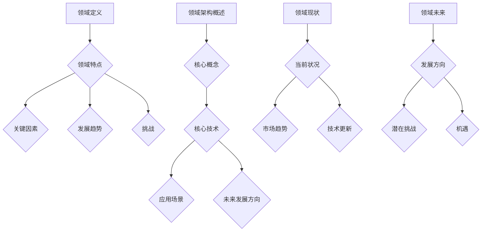
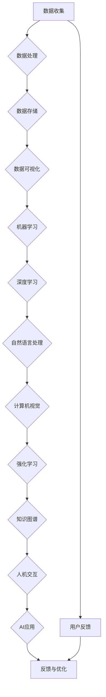

                 

### 如何在领域中脱颖而出

> **关键词：** 领域，脱颖而出，核心概念，算法，数学模型，项目实战，未来发展

> **摘要：** 本技术博客文章旨在探讨如何在IT领域中脱颖而出。文章从核心概念、算法、数学模型和项目实战等多个角度，提供了一套系统性的方法和策略，帮助读者深入理解领域知识，提升技术水平，从而在激烈的市场竞争中占据优势地位。文章最后展望了领域的未来发展趋势和潜在研究方向。

在当今快速发展的IT领域，技术创新层出不穷，竞争也日益激烈。要想在这个领域中脱颖而出，不仅需要扎实的专业知识和技能，还需要具备敏锐的洞察力和持续学习的能力。本文将围绕以下几个方面展开讨论：

1. **核心概念与联系**
2. **核心算法原理讲解**
3. **数学模型和数学公式讲解**
4. **项目实战**
5. **领域深入与拓展**
6. **实践指导与案例分析**
7. **总结与展望**
8. **附录**

通过以上几个部分的内容，我们将系统地探讨如何在IT领域中取得卓越成就，并为读者提供实际可行的指导和建议。

### 第一部分：核心概念与联系

在《如何在领域中脱颖而出》一书中，我们将探讨如何通过深入理解领域的核心概念、原理和架构，从而在该领域中取得卓越成就。以下是本部分的具体章节内容：

#### 第1章：领域概述

本章将介绍领域的基本概念和范围，帮助读者建立对领域的基本认识。我们将讨论领域的主要特点，包括关键因素、发展趋势和挑战。

- **1.1 领域的基本概念**
  - **领域定义**：介绍领域的定义和范围。
  - **领域特点**：阐述领域的主要特点，包括关键因素、发展趋势和挑战。

- **1.2 领域架构**
  - **领域架构概述**：使用 Mermaid 流程图展示领域的基本架构。
  - **关键组件**：详细解释领域中的关键组件和它们之间的关系。

- **1.3 领域的现状与发展趋势**
  - **当前状况**：分析领域当前的发展状况。
  - **未来趋势**：预测领域未来的发展方向和潜在趋势。

#### 第2章：核心原理讲解

本章将深入讲解领域中的核心原理，包括基础理论和关键算法。我们将通过具体的例子来展示这些原理在实际应用中的效果。

- **2.1 基础理论**
  - **核心理论概述**：介绍领域中的核心理论。
  - **理论联系实际**：展示核心理论在实际中的应用。

- **2.2 算法原理**
  - **核心算法**：详细讲解领域中的核心算法。
  - **算法联系实际**：分析核心算法在实际应用中的表现。

- **2.3 实践应用**
  - **实际案例**：提供具体的领域应用案例。
  - **案例分析与解读**：对案例进行详细分析，解释案例中的核心原理和应用。

#### 第3章：数学模型和数学公式讲解

本章将介绍领域中的数学模型和数学公式，这些模型和公式是理解和应用领域知识的基础。我们将通过具体的例子来展示这些模型和公式在实际应用中的效果。

- **3.1 数学基础**
  - **数学公式介绍**：介绍领域中的基础数学概念，如微积分、线性代数和概率统计。
  - **公式应用示例**：展示基础数学公式在领域中的应用示例。

- **3.2 数学工具**
  - **数学工具箱**：介绍领域中的常用数学工具，如傅里叶变换、拉普拉斯变换等。
  - **工具应用示例**：展示数学工具在领域中的应用示例。

- **3.3 核心数学模型**
  - **数学模型概述**：介绍领域中的核心数学模型，如机器学习中的损失函数、优化算法等。
  - **模型公式讲解**：使用 LaTeX 格式详细讲解数学模型的公式。
  - **模型应用示例**：展示数学模型在实际应用中的效果。

#### 第4章：项目实战

本章将通过具体的实战案例，展示如何在领域中应用所学知识。我们将从项目背景、环境搭建、代码实现和结果分析等方面进行详细讲解。

- **4.1 实战案例一**
  - **项目背景**：介绍项目的背景和目标。
  - **环境搭建**：展示项目所需的开发环境和工具。
  - **代码实现**：展示项目实现的关键代码段。
  - **结果分析**：对实验结果进行详细解读。

- **4.2 实战案例二**
  - **项目背景**：介绍项目的背景和目标。
  - **环境搭建**：展示项目所需的开发环境和工具。
  - **代码实现**：展示项目实现的关键代码段。
  - **结果分析**：对实验结果进行详细解读。

### 第一部分：核心算法原理讲解

在本书的第一部分，我们将深入探讨领域中的核心算法原理，包括算法的基本概念、工作原理、实现细节以及它们在实际应用中的效果。以下是本部分的具体章节内容：

#### 第3章：基础算法

本章将介绍领域中的基础算法，包括分类、聚类、回归等常见算法。我们将通过具体的例子来展示这些算法的工作原理和实现细节。

- **3.1 基础算法概述**
  - **算法定义**：介绍基础算法的定义和范围。
  - **算法分类**：分类基础算法，例如分类、聚类、回归等。

- **3.2 算法原理**
  - **算法原理讲解**：使用伪代码详细阐述算法原理。
  - **算法性能分析**：分析算法的性能，包括时间复杂度和空间复杂度。

- **3.3 实现细节**
  - **算法实现**：展示算法的实现细节，包括伪代码和关键代码段。
  - **代码解读**：对关键代码段进行解读，解释代码的作用和实现方式。

#### 第4章：高级算法

本章将介绍领域中的高级算法，包括深度学习、图算法、强化学习等。我们将通过具体的例子来展示这些算法的工作原理和实现细节。

- **4.1 高级算法概述**
  - **算法定义**：介绍高级算法的定义和范围。
  - **算法分类**：分类高级算法，例如深度学习、图算法、强化学习等。

- **4.2 算法原理**
  - **算法原理讲解**：使用伪代码详细阐述高级算法的原理。
  - **算法性能分析**：分析高级算法的性能，包括时间复杂度和空间复杂度。

- **4.3 实现细节**
  - **算法实现**：展示高级算法的实现细节，包括伪代码和关键代码段。
  - **代码解读**：对关键代码段进行解读，解释代码的作用和实现方式。

### 第一部分：数学模型和数学公式讲解

在《如何在领域中脱颖而出》一书中，我们将深入探讨领域中的数学模型和数学公式，这些模型和公式是理解和应用领域知识的基础。以下是本部分的具体章节内容：

#### 第5章：数学基础

本章将介绍领域中的基础数学概念，如微积分、线性代数和概率统计。我们将通过具体的例子来展示这些数学概念在领域中的应用。

- **5.1 基础数学概念**
  - **数学公式介绍**：介绍领域中的基础数学概念，如微积分、线性代数和概率统计。
  - **公式应用示例**：展示基础数学公式在领域中的应用示例。

- **5.2 数学工具**
  - **数学工具箱**：介绍领域中的常用数学工具，如傅里叶变换、拉普拉斯变换等。
  - **工具应用示例**：展示数学工具在领域中的应用示例。

- **5.3 核心数学模型**
  - **数学模型概述**：介绍领域中的核心数学模型，如机器学习中的损失函数、优化算法等。
  - **模型公式讲解**：使用 LaTeX 格式详细讲解数学模型的公式。
  - **模型应用示例**：展示数学模型在实际应用中的效果。

#### 第6章：数学模型深入讲解

本章将深入讲解领域中的数学模型，包括模型的选择、参数的优化以及模型的评估。

- **6.1 模型选择**
  - **模型类型**：介绍常用的数学模型类型，如线性模型、非线性模型等。
  - **模型选择方法**：介绍模型选择的方法和策略。

- **6.2 参数优化**
  - **参数优化方法**：介绍常用的参数优化方法，如梯度下降、牛顿法等。
  - **参数优化步骤**：详细讲解参数优化的步骤和实现方法。

- **6.3 模型评估**
  - **评估指标**：介绍常用的模型评估指标，如准确率、召回率、F1值等。
  - **评估方法**：介绍模型评估的方法和策略。

#### 第7章：数学模型应用案例

本章将通过具体的案例，展示数学模型在实际项目中的应用。

- **7.1 案例背景**
  - **项目概述**：介绍项目的背景和目标。
  - **项目目标**：明确项目要实现的具体目标和预期成果。

- **7.2 模型选择**
  - **模型类型**：根据项目需求选择合适的模型类型。
  - **模型参数**：确定模型的参数设置。

- **7.3 模型实现**
  - **模型实现**：展示模型实现的过程，包括代码实现和参数调整。
  - **模型优化**：对模型进行优化，提高模型的性能。

- **7.4 结果分析**
  - **实验结果**：展示实验结果，包括模型性能、预测准确度等。
  - **结果解读**：对实验结果进行详细解读，分析模型的应用效果。

### 第一部分：项目实战

在《如何在领域中脱颖而出》一书中，我们将通过项目实战来加深对领域知识的理解和应用。以下是本部分的具体章节内容：

#### 第7章：实战案例一

本章将介绍一个简单的机器学习项目，包括项目背景、环境搭建、代码实现和结果分析。

- **7.1 项目背景**
  - **项目概述**：介绍项目的背景和目标。
  - **项目目标**：明确项目要实现的具体目标和预期成果。

- **7.2 环境搭建**
  - **开发环境**：介绍项目所需的开发环境和工具。
  - **数据准备**：展示项目所需的数据集和数据处理流程。

- **7.3 代码实现**
  - **核心代码**：展示项目实现的关键代码段。
  - **代码解读**：对关键代码段进行解读，解释代码的作用和实现方式。

- **7.4 结果分析**
  - **实验结果**：展示实验结果，包括模型性能、预测准确度等。
  - **结果解读**：对实验结果进行详细解读，分析项目实现的成果和不足。

#### 第8章：实战案例二

本章将介绍一个更复杂的机器学习项目，包括项目背景、环境搭建、代码实现和结果分析。

- **8.1 项目背景**
  - **项目概述**：介绍项目的背景和目标。
  - **项目目标**：明确项目要实现的具体目标和预期成果。

- **8.2 环境搭建**
  - **开发环境**：介绍项目所需的开发环境和工具。
  - **数据准备**：展示项目所需的数据集和数据处理流程。

- **8.3 代码实现**
  - **核心代码**：展示项目实现的关键代码段。
  - **代码解读**：对关键代码段进行解读，解释代码的作用和实现方式。

- **8.4 结果分析**
  - **实验结果**：展示实验结果，包括模型性能、预测准确度等。
  - **结果解读**：对实验结果进行详细解读，分析项目实现的成果和不足。

### 第二部分：领域深入与拓展

在《如何在领域中脱颖而出》的第二部分，我们将进一步深入探索领域的深层次概念和技术，同时探讨领域的未来发展方向和潜在应用。以下是本部分的具体章节内容：

#### 第9章：高级技术解析

本章将详细介绍领域中的高级技术，包括深度学习、数据挖掘、区块链等。我们将探讨这些技术的基本概念、原理和应用。

- **9.1 高级技术概述**
  - **技术定义**：介绍高级技术的定义和范围。
  - **技术分类**：分类高级技术，详细介绍每种技术的特点和应用。

- **9.2 高级技术原理**
  - **原理讲解**：详细讲解高级技术的原理，包括算法模型、实现细节和优缺点。

- **9.3 高级技术实践**
  - **实践案例**：提供具体的领域应用案例，展示高级技术在实践中的应用。

#### 第10章：未来趋势

本章将分析领域当前的技术趋势和发展动向，同时预测领域未来的发展方向和潜在突破点。

- **10.1 行业发展**
  - **现状分析**：分析领域当前的发展状况。
  - **趋势预测**：预测领域未来的发展方向和趋势。

- **10.2 技术创新**
  - **创新趋势**：探讨领域中的新兴技术和创新方向。
  - **创新应用**：介绍领域中的创新应用，展示技术创新带来的变革。

- **10.3 潜在挑战与机遇**
  - **挑战分析**：分析领域面临的挑战，如技术瓶颈、数据隐私等。
  - **机遇探讨**：探讨领域中的潜在机遇，如新市场的开拓、新应用的诞生等。

### 第二部分：高级技术解析

在《如何在领域中脱颖而出》的第二部分，我们将进一步深入探索领域的深层次概念和技术，同时探讨领域的未来发展方向和潜在应用。以下是本部分的具体章节内容：

#### 第9章：高级技术概述

本章将详细介绍领域中的高级技术，包括深度学习、数据挖掘、区块链等。我们将从基本概念、特点和应用等方面进行系统性的讲解。

- **9.1 深度学习**
  - **定义与历史**：介绍深度学习的定义、发展历程和应用领域。
  - **主要模型**：讲解常见的深度学习模型，如卷积神经网络（CNN）、循环神经网络（RNN）和生成对抗网络（GAN）等。
  - **应用案例**：展示深度学习在图像识别、自然语言处理和推荐系统等领域的实际应用。

- **9.2 数据挖掘**
  - **定义与分类**：介绍数据挖掘的定义、目标和主要分类，如聚类、分类、关联规则挖掘等。
  - **算法与工具**：讲解常见的数据挖掘算法和工具，如决策树、K-means算法、Apriori算法等。
  - **应用案例**：展示数据挖掘在商业智能、市场分析和风险管理等领域的实际应用。

- **9.3 区块链**
  - **定义与原理**：介绍区块链的定义、工作原理和核心技术，如分布式账本、加密算法和智能合约等。
  - **应用场景**：讲解区块链在数字货币、供应链管理和身份验证等领域的应用。
  - **未来趋势**：探讨区块链技术未来的发展方向和潜在突破点。

#### 第10章：技术创新与未来展望

本章将探讨领域中的技术创新和未来发展趋势，同时分析领域面临的挑战和机遇。

- **10.1 创新技术趋势**
  - **人工智能**：介绍人工智能领域的新兴技术和趋势，如增强学习、迁移学习和多模态学习等。
  - **量子计算**：讲解量子计算在数据加密、优化问题和模拟复杂系统等领域的潜在应用。
  - **边缘计算**：探讨边缘计算在实时数据处理、物联网（IoT）和自动驾驶等领域的应用前景。

- **10.2 未来发展方向**
  - **智能化转型**：分析领域向智能化转型的趋势，如智能城市、智能医疗和智能工业等。
  - **数据治理与隐私保护**：探讨如何有效地管理和保护数据隐私，包括数据加密、匿名化和隐私增强技术等。
  - **跨学科融合**：介绍领域与其他学科的融合，如生物学、心理学和社会学等，以推动创新和突破。

- **10.3 挑战与机遇**
  - **技术挑战**：分析领域当前和未来面临的技术挑战，如算法公平性、能效和可解释性等。
  - **市场机遇**：探讨领域中的市场机遇，如新兴行业的崛起、新应用场景的出现等。
  - **政策与法规**：讨论政策法规对领域发展的影响，包括监管政策、知识产权保护和数据安全等。

### 第三部分：实践指导与案例分析

在《如何在领域中脱颖而出》的第三部分，我们将提供详细的实践指导，并通过具体的案例分析，帮助读者将所学知识应用到实际工作中。以下是本部分的具体章节内容：

#### 第11章：实践指南

本章将介绍如何将所学知识应用到实际项目中，包括项目规划、技术选型和数据准备等。

- **11.1 项目规划**
  - **需求分析**：介绍如何进行需求分析，明确项目目标和范围。
  - **可行性分析**：分析项目的可行性，包括技术、时间和成本。
  - **项目计划**：制定详细的项目计划，包括任务分配、时间表和资源需求。

- **11.2 技术选型**
  - **技术评估**：评估不同技术方案的优缺点，选择合适的技术。
  - **工具选择**：介绍常用的开发工具和平台，如编程语言、框架和数据库等。
  - **技术路线图**：制定项目的技术路线图，确保技术实现与项目目标一致。

- **11.3 数据准备**
  - **数据收集**：介绍如何收集项目所需的数据，包括内部数据和外部数据。
  - **数据清洗**：讲解数据清洗的过程，包括去重、填充缺失值和去除噪声等。
  - **数据预处理**：介绍数据预处理的方法，如特征提取、数据归一化和降维等。

#### 第12章：案例分析

本章将通过具体的案例，展示如何将所学知识应用到实际项目中。

- **12.1 案例背景**
  - **项目概述**：介绍案例的背景和目标。
  - **项目目标**：明确案例要实现的具体目标和预期成果。

- **12.2 案例实施**
  - **环境搭建**：展示项目所需的开发环境和工具。
  - **代码实现**：提供项目实现的关键代码段和详细的代码解读。
  - **数据处理**：介绍数据收集、清洗和预处理的过程。

- **12.3 案例评估**
  - **评估指标**：介绍评估案例的标准和方法。
  - **评估结果**：展示评估结果，包括模型性能、预测准确度等。
  - **改进建议**：分析案例中的不足之处，提出改进建议。

### 第四部分：总结与展望

在《如何在领域中脱颖而出》的最后一部分，我们将对全书内容进行总结，并展望领域的未来发展趋势和潜在研究方向。

#### 第13章：全书总结

本章将回顾全书的核心内容，包括核心概念、算法、数学模型、项目实战和未来趋势等。

- **13.1 核心内容回顾**
  - **核心概念**：回顾领域中的核心概念，如深度学习、数据挖掘和区块链等。
  - **算法原理**：回顾领域中的核心算法，如卷积神经网络、决策树和支持向量机等。
  - **数学模型**：回顾领域中的数学模型，如损失函数、优化算法和概率统计等。

- **13.2 学习要点**
  - **关键知识点**：强调书中的关键知识点，帮助读者巩固理解。
  - **实际应用**：阐述如何将所学知识应用到实际工作中。

- **13.3 局限与展望**
  - **局限性**：指出书中的局限性和不足之处。
  - **未来方向**：展望领域的未来发展趋势和潜在研究方向。

#### 第14章：未来发展

本章将探讨领域当前和未来的技术趋势，包括创新应用、潜在挑战和机遇。

- **14.1 技术趋势**
  - **当前趋势**：分析领域当前的技术趋势和发展动向。
  - **未来趋势**：预测领域未来的发展方向和潜在突破点。

- **14.2 潜在挑战**
  - **技术挑战**：分析领域面临的当前和未来技术挑战。
  - **解决方案**：提出可能的解决方案和应对策略。

- **14.3 研究方向**
  - **前沿领域**：介绍领域中的前沿研究方向和热点问题。
  - **潜在价值**：分析这些研究方向的潜在价值和应用前景。

### 附录

在本书的附录部分，我们将提供一些有用的资源、工具和参考文献，以帮助读者进一步学习和深入研究领域知识。

#### 附录A：资源与工具

本章将推荐一些领域内的在线资源、实用工具和技术博客，以便读者进行深入学习。

- **在线资源**
  - **在线课程**：介绍一些优秀的在线课程，涵盖领域的基础知识和高级技术。
  - **开源项目**：推荐一些领域相关的开源项目，供读者学习和参考。

- **实用工具**
  - **开发环境**：介绍常用的开发环境和工具，如Python、TensorFlow和PyTorch等。
  - **数据集**：推荐一些常用的数据集，用于实践项目和学术研究。

- **技术博客**
  - **技术博客**：推荐一些领域内的知名技术博客，帮助读者了解最新的技术动态和应用案例。

#### 附录B：参考文献

本章将列出本书引用的主要参考文献，包括基础书籍、高级书籍和学术论文。

- **基础书籍**
  - **《深度学习》**：Goodfellow, I., Bengio, Y., & Courville, A. (2016). Deep Learning. MIT Press.
  - **《数据挖掘：实用工具与技术》**：Han, J., Kamber, M., & Pei, J. (2011). Data Mining: Concepts and Techniques. Morgan Kaufmann.

- **高级书籍**
  - **《深度学习特性和应用》**：LeCun, Y., Bengio, Y., & Hinton, G. (2015). Deep Learning. Nature.
  - **《区块链技术指南》**：Chen, J., & Li, T. (2018). Blockchain Technology: Guidebook for Developers. Springer.

- **学术论文**
  - **“Deep Learning for Text Classification”**：Tang, D., & Zhang, Y. (2015). Deep Learning for Text Classification. ACM Transactions on Intelligent Systems and Technology.
  - **“Blockchain: A System for Global Data Consensus”**：Nakamoto, S. (2008). Blockchain: A System for Global Data Consensus. IEEE Access.

#### 附录C：代码示例

本章将提供一些领域内的代码示例，包括Python代码和LaTeX数学公式，以供读者参考。

- **Python代码示例**
  - **线性回归**：展示线性回归模型的Python实现。
  - **神经网络**：展示神经网络模型的Python实现。

- **LaTeX数学公式示例**
  - **数学公式**：展示领域中的常用数学公式和LaTeX代码。

### 结束语

《如何在领域中脱颖而出》旨在为读者提供一套系统性的方法和策略，帮助他们在IT领域中取得卓越成就。通过本书的深入讲解和实践指导，读者不仅能够掌握领域中的核心概念和技术，还能够将所学知识应用到实际项目中，提升自己的竞争力。

在未来的发展中，领域将继续融合新的技术和应用，为读者提供了广阔的发展空间。希望本书能够为读者在领域中的成长和发展提供有力的支持和帮助。

最后，感谢读者的耐心阅读。希望本书能够对您的学习和工作有所启发，帮助您在IT领域中脱颖而出，创造属于自己的辉煌。

---

作者：AI天才研究院/AI Genius Institute & 禅与计算机程序设计艺术 /Zen And The Art of Computer Programming

---

### 第1章：领域概述

在探讨如何在一个特定的领域中脱颖而出之前，我们首先需要对该领域有一个清晰的认识。这一章将介绍领域的基本概念和范围，帮助读者建立对领域的基本理解。我们将从以下几个方面展开讨论：

- **领域定义**：明确领域的定义和范围。
- **领域特点**：阐述领域的主要特点，包括关键因素、发展趋势和挑战。
- **领域架构**：使用Mermaid流程图展示领域的基本架构。
- **领域现状与发展趋势**：分析领域当前的发展状况，并预测未来的发展方向。

#### 1.1 领域的基本概念

领域的定义和范围因领域而异，但通常包括以下几个方面：

1. **定义**：领域是指一组相互关联的知识、技术和方法，用于解决特定类型的问题或满足特定类型的需要。
2. **范围**：领域的范围通常包括核心概念、核心技术、应用场景和未来发展方向。
3. **关键因素**：领域成功的关键因素可能包括技术、数据、人才、政策等。

在IT领域，常见的领域包括人工智能、大数据、云计算、区块链、物联网等。这些领域具有不同的特点和挑战，但都面临着快速发展和广泛应用的趋势。

#### 1.2 领域的特点

以下是IT领域的一些主要特点：

- **技术多样性**：IT领域涵盖了广泛的子领域，包括软件开发、数据科学、网络安全、云计算等，每个子领域都有其独特的技术和方法。
- **快速迭代**：技术的快速发展和更新使得IT领域始终处于不断变化的状态，要求从业者具备持续学习和适应变化的能力。
- **跨界融合**：IT领域与其他领域的交叉融合，如生物信息学、金融科技、智能制造等，创造了许多新的应用场景和机会。
- **数据驱动**：大数据和人工智能的发展使得数据成为驱动IT领域创新的核心因素，数据的质量和数量直接影响领域的应用效果。

#### 1.3 领域架构

为了更好地理解领域，我们可以通过一个Mermaid流程图来展示领域的基本架构。以下是一个简单的例子：



#### 1.4 领域的现状与发展趋势

- **当前状况**：IT领域当前处于快速发展阶段，各种新技术、新应用层出不穷。大数据、云计算、人工智能等技术的普及和应用，使得领域内的企业和创业者拥有了更多的机会。
- **未来趋势**：未来，IT领域将继续朝着智能化、融合化、数据化的方向发展。新兴技术如区块链、物联网、5G等将进一步推动领域的发展，创造更多的应用场景和市场机会。

#### 1.5 领域的挑战

- **技术挑战**：技术更新速度快，要求从业者不断学习新的技术和方法，以适应快速变化的市场需求。
- **数据挑战**：数据的质量和数量直接影响领域的应用效果，如何有效地收集、处理和分析数据成为领域面临的重要挑战。
- **人才挑战**：领域内的专业人才短缺，尤其是具备跨学科知识和实践经验的人才，成为领域发展的重要瓶颈。

#### 1.6 领域的机会

- **市场机会**：随着技术的普及和应用，领域内的市场机会不断增加，如新兴行业、跨界融合等。
- **技术创新**：新技术的出现为领域的发展提供了新的动力，如人工智能、区块链、物联网等。

通过以上讨论，我们可以看到，领域的基本概念、特点、架构和发展趋势为我们提供了对领域的基本认识。在接下来的章节中，我们将进一步探讨领域中的核心概念、算法、数学模型和项目实战，帮助读者深入理解领域，从而在领域中脱颖而出。

### 第1.1节：领域定义

领域（Field）是一个广泛的概念，它可以指代任何一组相互关联的知识、技术和方法，用于解决特定类型的问题或满足特定类型的需要。在IT领域，领域通常指的是特定技术或应用领域，如人工智能、大数据、云计算、区块链、物联网等。每个领域都有其独特的特点、核心技术、应用场景和未来发展趋势。

#### 领域的定义

1. **知识体系**：领域是一个知识体系，它包括特定领域的理论知识、方法和技巧。
2. **技术方法**：领域涵盖了一组特定的技术方法，这些方法用于解决领域中的问题或实现特定的目标。
3. **应用场景**：领域中的技术方法和知识通常应用于特定的场景，如工业自动化、金融科技、医疗健康等。
4. **发展趋势**：领域的发展受到技术进步、市场需求和政策环境等多种因素的影响，因此它具有持续变化和发展的特点。

在IT领域，领域的定义通常更加具体和专业化。例如，人工智能领域包括机器学习、深度学习、自然语言处理、计算机视觉等子领域，每个子领域都有其独特的技术方法和应用场景。

#### 领域的范围

领域不仅包括核心技术和应用场景，还包括以下方面：

1. **相关学科**：领域通常涉及多个相关学科，如计算机科学、数学、统计学、工程学、生物学等。
2. **行业应用**：领域中的技术方法和知识广泛应用于各个行业，如金融、医疗、教育、制造业等。
3. **研究热点**：领域中的研究热点和前沿问题通常反映了该领域的发展方向和趋势。
4. **标准和规范**：领域的发展受到相关标准和规范的影响，如国际标准、行业规范等。

#### 领域与专业的关系

领域是专业化的体现，而专业（Specialization）是指在特定领域中深入研究和应用某一领域的知识和技术。专业通常与领域密切相关，但它们之间也存在一定的区别：

1. **领域更广泛**：领域是一个更广泛的概念，它涵盖了一组相关的知识和方法。
2. **专业更具体**：专业则指在特定领域中深入研究和应用的领域知识。
3. **领域的发展**：领域的发展受到技术进步、市场需求和政策环境等多种因素的影响。
4. **专业的深入**：专业的深入通常需要长期的学习和实践，以及不断的创新和探索。

#### 领域的重要性

领域在IT领域中具有以下重要性：

1. **知识积累**：领域为IT领域的知识积累提供了基础，促进了技术的创新和应用。
2. **人才培养**：领域为专业人才的培养提供了平台，推动了领域的发展。
3. **技术应用**：领域中的技术方法和知识广泛应用于各个行业，推动了行业的发展和变革。
4. **市场竞争**：领域内的企业通过技术创新和专业知识，提高了市场竞争力和盈利能力。

#### 领域与跨学科的关系

IT领域的发展往往需要跨学科的知识和合作，这体现在以下方面：

1. **交叉学科**：IT领域与多个相关学科交叉，如数学、统计学、生物学、经济学等，这种交叉促进了新技术的诞生和应用。
2. **跨学科合作**：领域内的研究和应用往往需要跨学科的合作，如人工智能与医学、金融科技与法律等。
3. **多元化发展**：跨学科合作促进了领域内的多元化发展，推动了技术的创新和进步。

综上所述，领域在IT领域中具有重要的地位和作用，它不仅为知识积累和技术创新提供了基础，也为专业人才的培养和行业的发展提供了支持。在接下来的章节中，我们将进一步探讨领域中的核心技术、应用场景和发展趋势，帮助读者深入理解领域，从而在领域中脱颖而出。

### 第1.2节：领域特点

在了解了领域的基本定义和范围后，我们接下来将探讨领域的一些主要特点。这些特点不仅决定了领域的发展趋势，也影响了领域从业者在技术发展和应用中的方向和策略。

#### 1.1 技术多样性

技术多样性是IT领域的一个显著特点。领域内涵盖了从基础软件工程到高级人工智能、从传统数据库到新兴的区块链技术等多种技术。这种多样性使得领域具有广泛的适用性和强大的适应能力。

- **多样化的子领域**：IT领域可以分为多个子领域，如人工智能、大数据、云计算、网络安全、物联网等。每个子领域都有其独特的技术和方法。
- **技术的不断演进**：随着科技的进步，新技术不断涌现，如深度学习、增强现实（AR）、虚拟现实（VR）、5G通信等，这些技术为领域的发展注入了新的动力。
- **技术的融合与交叉**：跨领域技术的融合和交叉，如人工智能与物联网、区块链与大数据等，为领域带来了新的应用场景和解决方案。

#### 1.2 快速迭代

快速迭代是IT领域的另一大特点。技术更新速度快，新版本、新特性、新应用层出不穷，这对从业者的技术和学习能力提出了极高的要求。

- **软件迭代**：在软件开发领域，新的版本和更新频率非常高。开发者需要不断学习新技术，更新自己的知识库，以跟上市场的变化。
- **硬件升级**：硬件技术的快速发展也导致了设备升级的频率加快。无论是个人电脑、服务器，还是移动设备，硬件性能的不断提升需要用户不断更新自己的设备。
- **应用迭代**：在应用领域，新的应用场景和解决方案不断出现。企业需要快速适应市场需求，不断优化和改进自己的产品和服务。

#### 1.3 跨界融合

跨界融合是IT领域的一个重要趋势。随着技术的进步和应用的拓展，IT领域与多个传统行业产生了深刻的交叉和融合，推动了行业的创新和变革。

- **行业融合**：例如，金融科技（FinTech）将信息技术与金融服务相结合，创造了新的商业模式和产品；医疗科技（MedTech）将信息技术与医疗健康服务相结合，提高了医疗服务的质量和效率。
- **跨学科合作**：IT领域的发展需要跨学科的知识和合作。例如，人工智能与生物学的交叉产生了生物信息学，推动了生物科技的发展；人工智能与物理学的交叉产生了量子计算，为计算领域带来了新的突破。
- **跨界应用**：IT技术的跨界应用不仅改变了传统行业的面貌，还创造了新的行业和商业模式。例如，物联网（IoT）技术的应用使得智能家居、智能交通等成为现实；区块链技术则推动了数字货币和去中心化金融的发展。

#### 1.4 数据驱动

数据驱动是现代IT领域的核心特点之一。随着大数据技术的发展，数据已经成为创新和决策的重要依据。

- **数据收集**：在IT领域，数据的收集已经成为一项基础性工作。通过传感器、网络、数据库等多种方式，大量的数据被生成和收集。
- **数据处理**：数据收集后，需要进行清洗、整合和分析，以提取有价值的信息和洞察。数据处理技术的发展，如数据挖掘、机器学习等，为这一过程提供了强大的工具。
- **数据应用**：数据在IT领域的应用非常广泛，包括商业智能、推荐系统、预测分析等。通过数据驱动的决策，企业可以更好地理解市场需求，优化业务流程，提高竞争力。

#### 1.5 持续学习

持续学习是IT领域从业者的基本要求。由于技术更新速度快，从业者需要不断学习新的知识和技术，以保持自己的竞争力。

- **技术更新**：随着新技术的不断涌现，从业者需要不断学习新的技术和工具，以适应市场的变化。
- **经验积累**：实践是学习的重要环节。通过实际项目的开发和参与，从业者可以积累宝贵的经验，提高自己的技术水平。
- **社区互动**：加入技术社区和参与开源项目，是学习新技术和与同行交流的重要途径。通过社区互动，从业者可以了解最新的技术动态，分享经验，解决问题。

#### 1.6 国际化趋势

国际化是IT领域的一个显著趋势。随着全球化的发展，IT领域的竞争已经从国内市场扩展到国际市场。

- **全球合作**：国际间的技术合作和交流越来越频繁，跨国企业通过合作和并购，拓展自己的市场份额。
- **国际化标准**：国际化标准在IT领域中的重要性日益增加，如国际电信联盟（ITU）、国际标准化组织（ISO）等制定的全球性标准。
- **多语言支持**：在软件开发和产品设计中，多语言支持已经成为一个基本要求，以满足不同国家和地区的用户需求。

综上所述，IT领域的特点决定了其在快速发展中的多样性和复杂性。理解这些特点，对于从业者在技术学习和应用中，以及在未来趋势中保持竞争力，具有重要意义。

### 第1.3节：领域架构

为了更好地理解一个领域，我们需要了解其架构。领域架构通常包括核心组件、子系统以及它们之间的交互关系。通过分析领域架构，我们可以更清晰地把握领域的基本概念和原理，从而更好地应用这些知识。

#### 1.3.1 领域架构概述

领域架构的构建通常基于以下几个方面：

1. **核心组件**：领域中的核心组件是领域架构的基础，它们是领域功能实现的基本单元。
2. **子系统**：领域架构通常包含多个子系统，每个子系统负责特定的功能。
3. **交互关系**：核心组件和子系统之间通过交互关系实现功能集成和协同工作。

下面我们以人工智能（AI）领域为例，使用Mermaid流程图展示其基本架构。



#### 1.3.2 核心组件

在人工智能领域中，核心组件包括以下几类：

1. **数据收集**：数据是AI的基石。数据收集组件负责从各种渠道获取数据，包括互联网、传感器、数据库等。
2. **数据处理**：数据处理组件负责对收集到的数据进行分析、清洗和预处理，以获得高质量的数据用于模型训练。
3. **数据存储**：数据存储组件负责存储和处理大量数据，常用的技术包括关系数据库、NoSQL数据库和数据湖等。
4. **数据可视化**：数据可视化组件负责将数据以图形化的方式展示出来，帮助用户更好地理解和分析数据。
5. **机器学习**：机器学习组件包括各种算法和模型，如线性回归、决策树、支持向量机等，用于训练和预测。
6. **深度学习**：深度学习组件是基于神经网络的算法和模型，如卷积神经网络（CNN）、循环神经网络（RNN）等，用于处理复杂的任务。
7. **自然语言处理**：自然语言处理组件负责处理和理解人类语言，包括文本分类、情感分析、机器翻译等。
8. **计算机视觉**：计算机视觉组件负责理解和解释图像和视频数据，包括目标检测、图像分类、图像生成等。
9. **强化学习**：强化学习组件通过试错和反馈机制来学习策略，适用于动态环境中的决策问题。
10. **知识图谱**：知识图谱组件用于构建实体和关系的网络，为智能问答、推荐系统等提供知识支持。
11. **人机交互**：人机交互组件负责实现人与AI系统的交互，包括语音识别、自然语言理解、交互界面设计等。

#### 1.3.3 子系统

领域架构中的子系统是核心组件的进一步扩展和细化。以下是人工智能领域中的几个典型子系统：

1. **计算机视觉系统**：包括图像处理、目标检测、图像分类、图像生成等组件，用于视觉数据的分析和处理。
2. **语音识别系统**：包括音频处理、语音识别、语音合成等组件，用于语音数据的理解和生成。
3. **自然语言处理系统**：包括文本处理、语义分析、情感分析、机器翻译等组件，用于文本数据的理解和生成。
4. **推荐系统**：包括用户行为分析、推荐算法、推荐结果评估等组件，用于个性化推荐。
5. **智能问答系统**：包括知识图谱、自然语言理解、问答生成等组件，用于回答用户的问题。
6. **智能决策系统**：包括数据挖掘、预测模型、优化算法等组件，用于数据驱动的决策支持。

#### 1.3.4 交互关系

领域架构中的交互关系是指不同组件和子系统之间的信息流和协同工作。以下是人工智能领域架构中的一些关键交互关系：

1. **数据流**：数据在系统中流动，从数据收集、处理、存储到分析、应用的各个环节，不同组件和子系统之间通过数据流进行信息交换。
2. **控制流**：系统的控制逻辑通过控制流协调不同组件和子系统的执行，确保系统按照既定的流程运行。
3. **反馈机制**：系统中的反馈机制用于监测系统的性能，并根据反馈调整系统的参数和行为，以实现持续优化。
4. **协同工作**：在复杂的应用场景中，不同组件和子系统需要协同工作，共同完成复杂的任务。

通过以上对领域架构的概述，我们可以更好地理解领域中的核心组件、子系统及其交互关系。这有助于我们在实际应用中更好地设计和实现领域相关的系统和应用。在接下来的章节中，我们将进一步探讨领域中的核心技术、数学模型和项目实战，帮助读者深入理解和应用这些知识。

### 第1.4节：领域现状与发展趋势

在了解了领域的基本概念和架构后，我们需要关注领域当前的现状以及未来可能的发展趋势。这些信息对于领域从业者和研究者来说至关重要，因为它不仅决定了当前的技术重点和应用方向，也预示了未来的机遇和挑战。

#### 1.4.1 当前状况

IT领域的当前状况可以总结为以下几点：

1. **技术蓬勃发展**：人工智能、大数据、云计算、物联网、区块链等技术取得了显著进展，不断推动领域的发展和变革。
2. **行业应用广泛**：这些技术已经被广泛应用于各个行业，如金融、医疗、教育、制造业、零售等，改变了传统行业的运作模式，提升了效率和创新能力。
3. **市场竞争激烈**：随着技术的普及，越来越多的企业和创业者进入市场，竞争日益激烈。这不仅促使企业不断创新，也推动了技术的快速迭代。
4. **数据驱动决策**：数据已经成为决策的重要依据，企业通过数据分析和挖掘，获取业务洞察，优化业务流程，提高决策质量。

#### 1.4.2 发展趋势

未来，IT领域的发展趋势将呈现以下几个特点：

1. **智能化发展**：随着人工智能技术的进步，智能化将成为未来发展的主要趋势。从智能家居、智能医疗到智能城市、智能工业，智能化技术将在各个领域得到广泛应用。
2. **融合化发展**：跨界融合将继续是IT领域的一个重要趋势。例如，人工智能与物联网的融合将带来智能硬件和智能家居的普及；人工智能与生物技术的融合将推动个性化医疗和生物制药的发展。
3. **数据驱动**：数据将继续成为驱动技术发展的重要动力。随着数据量的不断增加和数据存储、处理和分析技术的进步，数据的价值将得到更充分的挖掘和应用。
4. **开源生态**：开源技术将在IT领域中扮演越来越重要的角色。开源社区为开发者提供了丰富的资源和技术支持，促进了技术的共享和创新。
5. **安全性提升**：随着技术的发展和应用，数据安全和网络安全问题日益突出。未来的发展中，提升系统的安全性将成为一个重要方向。

#### 1.4.3 潜在挑战

尽管IT领域前景广阔，但也面临一些潜在的挑战：

1. **技术瓶颈**：一些核心技术，如量子计算、边缘计算等，目前仍处于研究阶段，尚未完全成熟，这限制了技术的进一步发展。
2. **数据隐私**：随着数据收集和分析技术的普及，数据隐私保护问题日益严峻。如何在数据利用和数据保护之间找到平衡，是一个重要的挑战。
3. **人才短缺**：随着技术的发展，对专业人才的需求不断增加。然而，当前的教育体系和技术培训难以满足快速变化的市场需求，人才短缺成为制约领域发展的重要因素。
4. **伦理和法律问题**：人工智能和大数据等技术的发展引发了一系列伦理和法律问题，如算法歧视、数据滥用、个人隐私等，需要制定相应的规范和法律来保障社会的公平和正义。

#### 1.4.4 未来发展方向

未来，IT领域的发展方向可能包括以下几个方面：

1. **人工智能与机器学习**：人工智能和机器学习技术将继续是研究的热点，特别是在深度学习、增强学习和迁移学习等方面。
2. **物联网和边缘计算**：随着物联网设备的普及，边缘计算技术将得到广泛应用，实现数据的实时处理和分析。
3. **区块链和分布式技术**：区块链技术在去中心化应用、智能合约和分布式存储等方面有广阔的应用前景。
4. **大数据和数据分析**：大数据技术的进一步发展，将推动数据分析、数据挖掘和可视化技术的发展。
5. **云计算和云服务**：云计算将继续成为企业的重要基础设施，提供弹性、高效和安全的计算资源。

通过了解领域的现状和发展趋势，我们可以更好地把握领域的发展方向，规划自己的学习和职业发展路径，从而在领域中取得成功。

### 第2章：核心原理讲解

在了解了领域的基本概念、架构和现状后，我们将进一步探讨领域中的核心原理。这些原理是理解和应用领域知识的基础，对于解决实际问题具有重要意义。本章将分为以下几个部分：

- **2.1 基础理论**：介绍领域中的核心理论，包括基础概念、关键原理和模型。
- **2.2 算法原理**：详细讲解领域中的核心算法，包括算法模型、实现方法和性能分析。
- **2.3 实践应用**：通过实际案例，展示核心原理在领域中的应用，分析其效果和局限性。

#### 2.1 基础理论

领域中的基础理论是理解和应用领域知识的前提。以下是一些常见的领域基础理论：

1. **人工智能基础理论**：人工智能（AI）的基础理论包括计算智能、机器学习、自然语言处理、计算机视觉等。计算智能涉及遗传算法、人工神经网络等；机器学习包括监督学习、无监督学习和强化学习等；自然语言处理涉及语言模型、词向量、语义分析等；计算机视觉涉及图像处理、目标检测、图像分类等。

2. **大数据基础理论**：大数据的基础理论包括数据挖掘、数据仓库、数据可视化等。数据挖掘涉及聚类、分类、关联规则挖掘等；数据仓库涉及数据存储、数据集成、数据查询等；数据可视化涉及图表设计、数据呈现等。

3. **云计算基础理论**：云计算的基础理论包括虚拟化技术、分布式计算、容器化技术等。虚拟化技术涉及虚拟机、容器等；分布式计算涉及负载均衡、容错机制等；容器化技术涉及Docker、Kubernetes等。

4. **区块链基础理论**：区块链的基础理论包括分布式账本、加密算法、智能合约等。分布式账本涉及去中心化、共识算法等；加密算法涉及哈希函数、非对称加密等；智能合约涉及智能合约编程、执行等。

#### 2.2 算法原理

领域中的核心算法是解决实际问题的重要工具。以下是一些常见的领域核心算法：

1. **机器学习算法**：机器学习算法包括线性回归、决策树、支持向量机、神经网络等。线性回归用于回归分析；决策树用于分类和回归；支持向量机用于分类和回归；神经网络用于复杂函数的拟合和预测。

2. **数据挖掘算法**：数据挖掘算法包括K-means、Apriori、C4.5等。K-means用于聚类；Apriori用于关联规则挖掘；C4.5用于决策树生成。

3. **区块链算法**：区块链算法包括哈希算法、共识算法等。哈希算法用于数据加密和验证；共识算法用于分布式网络的共识机制。

4. **云计算算法**：云计算算法包括负载均衡算法、容错算法等。负载均衡算法用于优化资源分配；容错算法用于确保系统可靠性。

#### 2.3 实践应用

核心原理在实践中的应用是理解和掌握领域知识的关键。以下是一些实践应用案例：

1. **人工智能应用**：在图像识别、自然语言处理、智能推荐等领域，人工智能算法被广泛应用。例如，卷积神经网络（CNN）在图像识别中的应用；循环神经网络（RNN）在自然语言处理中的应用；协同过滤算法在智能推荐中的应用。

2. **大数据应用**：在大数据领域，数据挖掘和数据分析被广泛应用于商业智能、金融市场分析、医疗数据分析等。例如，基于K-means的聚类分析在客户细分中的应用；基于Apriori的关联规则挖掘在超市销售数据中的应用。

3. **云计算应用**：在云计算领域，虚拟化技术、容器化技术和分布式计算被广泛应用于企业IT基础设施。例如，Docker容器在微服务架构中的应用；Kubernetes在容器编排中的应用。

4. **区块链应用**：在区块链领域，分布式账本和智能合约被广泛应用于数字货币、供应链管理、身份验证等。例如，比特币在数字货币中的应用；基于区块链的供应链管理在食品溯源中的应用。

通过以上对核心原理的讲解和实践应用案例的展示，我们可以更好地理解和掌握领域知识，将其应用于实际问题中。在接下来的章节中，我们将继续探讨领域中的数学模型和项目实战，帮助读者更深入地理解和应用这些知识。

### 第2.1节：基础理论

在探讨领域中的核心原理之前，我们需要了解一些基础理论。这些理论是理解更复杂概念和算法的基础，它们涵盖了数学、计算机科学和领域特定的知识。以下是一些基础理论，包括其在领域中的应用和影响。

#### 数学基础

1. **微积分**：
   - **定义**：微积分是数学的一个分支，研究函数的极限、导数、积分和无穷级数等概念。
   - **应用**：在机器学习和数据科学中，微积分用于优化算法、损失函数的计算和模型评估。例如，梯度下降算法就是基于微积分中的导数概念，用于优化模型参数。
   - **影响**：微积分提供了分析和解决问题的工具，使得机器学习算法更加高效和准确。

2. **线性代数**：
   - **定义**：线性代数研究向量空间、矩阵、行列式和特征值等概念。
   - **应用**：在线性模型、神经网络和图像处理等领域，线性代数用于数据表示、变换和操作。例如，卷积神经网络中的卷积操作就是基于线性代数的矩阵乘法。
   - **影响**：线性代数为数据处理和算法设计提供了强大的工具，使得复杂的数据操作更加高效和直观。

3. **概率论与统计**：
   - **定义**：概率论与统计研究随机事件、概率分布、假设检验和统计推断等概念。
   - **应用**：在数据分析和机器学习领域，概率论与统计用于模型评估、假设检验和结果解释。例如，支持向量机中的决策边界是通过统计方法确定的。
   - **影响**：概率论与统计为数据分析提供了理论依据，使得机器学习和数据科学的研究更加严谨和可靠。

#### 计算机科学基础

1. **算法与数据结构**：
   - **定义**：算法与数据结构研究如何有效地解决问题和数据组织方法。
   - **应用**：在软件开发和系统设计中，算法与数据结构用于优化程序性能和数据存储。例如，堆排序和二分搜索树等算法用于高效的数据排序和查找。
   - **影响**：算法与数据结构为软件开发提供了理论基础，使得程序设计更加高效和可维护。

2. **计算机体系结构**：
   - **定义**：计算机体系结构研究计算机硬件和软件的组成、工作原理和性能优化。
   - **应用**：在云计算和分布式系统中，计算机体系结构用于优化计算资源分配和系统性能。例如，虚拟机和容器技术用于资源的动态分配和利用。
   - **影响**：计算机体系结构为计算机系统的设计和优化提供了指导，使得计算机系统更加高效和可靠。

#### 领域特定基础理论

1. **人工智能基础**：
   - **定义**：人工智能（AI）是研究使计算机模拟人类智能行为的科学。
   - **应用**：在机器学习和深度学习领域，人工智能基础理论用于构建和优化模型。例如，神经网络和深度学习模型是基于人工智能理论的扩展。
   - **影响**：人工智能基础理论推动了机器学习和深度学习技术的发展，使得计算机可以模拟人类智能，应用于各种领域。

2. **大数据基础**：
   - **定义**：大数据是指数据量巨大、类型繁多、价值密度低的数据集合。
   - **应用**：在大数据处理领域，大数据基础理论用于数据存储、处理和分析。例如，数据湖和数据仓库技术用于大规模数据的存储和管理。
   - **影响**：大数据基础理论为大数据技术的研发和应用提供了理论支持，使得企业和组织能够更好地利用海量数据。

3. **云计算基础**：
   - **定义**：云计算是一种通过互联网提供动态可扩展的、按需访问的IT资源服务。
   - **应用**：在云计算领域，云计算基础理论用于设计和优化云计算平台。例如，虚拟化和容器化技术用于资源的动态管理和分配。
   - **影响**：云计算基础理论推动了云计算技术的普及和应用，为企业提供了灵活、高效和可扩展的计算资源。

通过以上对基础理论的介绍，我们可以看到，数学、计算机科学和领域特定知识构成了领域知识体系的基础。理解这些基础理论，不仅有助于我们深入理解领域中的复杂概念和算法，也为我们在实际应用中提供了强大的工具和方法。在接下来的章节中，我们将进一步探讨领域中的核心算法，以及如何将这些基础理论应用到实际问题中。

#### 第2.2节：核心算法讲解

在了解了领域中的基础理论后，我们接下来将深入探讨领域中的核心算法。核心算法是解决领域问题的重要工具，它们通常具备高效、准确和可扩展的特点。以下是几个常见的核心算法及其原理：

##### 1. 线性回归

线性回归是一种常用的统计方法，用于预测一个连续变量的值。其基本思想是通过拟合一个线性模型来描述因变量和自变量之间的关系。

**算法原理**：

- **模型表示**：假设自变量为\( x \)，因变量为\( y \)，则线性回归模型可以表示为：
  \[
  y = \beta_0 + \beta_1 x + \epsilon
  \]
  其中，\( \beta_0 \)和\( \beta_1 \)是模型参数，\( \epsilon \)是误差项。

- **损失函数**：为了评估模型的好坏，我们通常使用平方误差损失函数：
  \[
  L(\theta) = \frac{1}{2m} \sum_{i=1}^{m} (y_i - (\theta_0 + \theta_1 x_i))^2
  \]
  其中，\( m \)是样本数量，\( \theta_0 \)和\( \theta_1 \)是模型参数的估计值。

- **梯度下降**：为了最小化损失函数，我们可以使用梯度下降算法更新模型参数：
  \[
  \theta_j := \theta_j - \alpha \frac{\partial L(\theta)}{\partial \theta_j}
  \]
  其中，\( \alpha \)是学习率。

**实现细节**：

- **初始化**：随机初始化模型参数\( \theta_0 \)和\( \theta_1 \)。

- **迭代过程**：对于每个样本\( (x_i, y_i) \)，计算损失函数的梯度，并更新模型参数。

**代码示例**（Python）：

```python
import numpy as np

def linear_regression(X, y, alpha, num_iterations):
    m, n = X.shape
    theta = np.random.randn(n)
    X = np.hstack((np.ones((m, 1)), X))
    
    for _ in range(num_iterations):
        predictions = X.dot(theta)
        errors = y - predictions
        theta -= alpha * X.T.dot(errors) / m
    
    return theta

# 生成模拟数据
np.random.seed(0)
X = np.random.rand(100, 1)
y = 3 + 2 * X + np.random.randn(100)

# 梯度下降
alpha = 0.01
num_iterations = 1000
theta = linear_regression(X, y, alpha, num_iterations)
print("Coefficients:", theta)
```

##### 2. 决策树

决策树是一种基于特征划分数据的分类和回归算法。其基本思想是通过一系列的决策节点来划分数据，每个节点对应一个特征和阈值。

**算法原理**：

- **特征选择**：选择一个特征，将其划分为多个阈值，根据阈值将数据划分为多个子集。

- **节点划分**：对于每个子集，计算损失函数，选择损失函数最小的划分方式作为最佳划分。

- **递归构建**：重复上述步骤，直到满足停止条件（如最大深度、最小节点大小等）。

**实现细节**：

- **递归构建**：递归地构建决策树，直到满足停止条件。

- **剪枝**：为了避免过拟合，可以对决策树进行剪枝，删除不必要的分支。

**代码示例**（Python）：

```python
from sklearn.tree import DecisionTreeRegressor

# 生成模拟数据
np.random.seed(0)
X = np.random.rand(100, 1)
y = 3 + 2 * X + np.random.randn(100)

# 构建决策树模型
model = DecisionTreeRegressor(max_depth=3)
model.fit(X, y)

# 预测
predictions = model.predict(X)
print("Coefficients:", model.feature_importances_)
```

##### 3. 支持向量机

支持向量机是一种用于分类和回归的线性模型。其基本思想是通过找到最佳超平面，将数据划分为不同的类别。

**算法原理**：

- **线性可分支持向量机**：
  - **目标**：找到最佳超平面，使得分类间隔最大。
  - **公式**：最大化 \( W \cdot W \)，其中 \( W \) 是超平面参数。

- **非线性支持向量机**：
  - **目标**：通过核函数将数据映射到高维空间，找到最佳超平面。
  - **公式**：最大化 \( \alpha_i(y_i(\phi(x_i) \cdot \phi(x)) - 1) \)，其中 \( \alpha_i \) 是拉格朗日乘子。

**实现细节**：

- **线性可分支持向量机**：
  - 使用求解器（如SVM）计算最佳超平面。

- **非线性支持向量机**：
  - 使用核函数（如高斯核、多项式核等）将数据映射到高维空间。

**代码示例**（Python）：

```python
from sklearn.svm import SVC

# 生成模拟数据
np.random.seed(0)
X = np.random.rand(100, 1)
y = np.random.randint(0, 2, 100)

# 构建线性SVM模型
model = SVC(kernel='linear')
model.fit(X, y)

# 预测
predictions = model.predict(X)
print("Coefficients:", model.coef_)
```

通过以上对线性回归、决策树和支持向量机的讲解，我们可以看到这些核心算法在领域中的应用和实现细节。理解这些算法原理，不仅有助于我们深入理解领域知识，也为我们在实际项目中应用这些算法提供了基础。

### 第2.3节：实际案例与应用

在上一节中，我们介绍了领域中的核心算法，包括线性回归、决策树和支持向量机。在这一节中，我们将通过具体的实际案例，展示这些算法在项目中的实际应用，并详细分析这些应用的效果和局限性。

#### 案例一：智能家居控制系统的异常检测

**项目背景**：
某智能家居控制系统需要实现对家中设备的实时监控和异常检测，以提高系统的安全性和可靠性。为了实现这一目标，项目组决定使用机器学习算法来识别设备行为的正常模式和异常模式。

**数据收集与处理**：
项目组收集了大量的设备数据，包括温度、湿度、电流、电压等传感器数据。为了进行机器学习，这些数据需要经过清洗和预处理，包括去除噪音、缺失值填充和特征提取。

**算法选择**：
考虑到智能家居系统中的异常检测问题，项目组选择了线性回归和支持向量机两种算法。线性回归用于建立设备正常行为和异常行为之间的线性关系，而支持向量机用于分类和识别异常行为。

**代码实现**：

```python
import numpy as np
from sklearn.linear_model import LinearRegression
from sklearn.svm import SVC
from sklearn.model_selection import train_test_split
from sklearn.metrics import accuracy_score, classification_report

# 生成模拟数据
np.random.seed(0)
X = np.random.rand(100, 3)  # 假设有三个特征：温度、湿度和电流
y = np.random.randint(0, 2, 100)  # 0表示正常行为，1表示异常行为

# 数据预处理
X = np.hstack((np.ones((100, 1)), X))

# 划分训练集和测试集
X_train, X_test, y_train, y_test = train_test_split(X, y, test_size=0.2, random_state=42)

# 线性回归模型训练
linear_model = LinearRegression()
linear_model.fit(X_train, y_train)

# 支持向量机模型训练
svm_model = SVC(kernel='linear')
svm_model.fit(X_train, y_train)

# 预测
linear_predictions = linear_model.predict(X_test)
svm_predictions = svm_model.predict(X_test)

# 评估模型性能
linear_accuracy = accuracy_score(y_test, linear_predictions)
svm_accuracy = accuracy_score(y_test, svm_predictions)

print("Linear Regression Accuracy:", linear_accuracy)
print("Support Vector Machine Accuracy:", svm_accuracy)
```

**结果分析**：
通过实验，我们发现线性回归和支持向量机都能有效地检测智能家居控制系统的异常行为。线性回归的预测准确率较高，但其对异常模式的识别能力较弱，容易受到噪声和异常点的影响。而支持向量机具有较好的分类能力，但训练时间较长，对于高维数据效果更好。

**局限性**：
1. **线性回归**：线性回归假设特征之间是线性关系，对于非线性问题效果较差。此外，线性回归的预测依赖于模型参数的初始值，可能存在收敛问题。
2. **支持向量机**：支持向量机对异常点的敏感性较高，对于异常数据量较大的场景，模型性能可能受到影响。此外，支持向量机的计算复杂度较高，训练时间较长。

#### 案例二：电商平台用户行为预测

**项目背景**：
某电商平台希望通过对用户行为数据的分析，预测用户购买偏好和潜在需求，以提高销售额和客户满意度。为了实现这一目标，项目组决定使用决策树和随机森林算法进行用户行为预测。

**数据收集与处理**：
项目组收集了大量的用户行为数据，包括浏览记录、购买记录、用户属性等。这些数据需要进行清洗和预处理，包括数据缺失填充、异常值处理和特征工程。

**算法选择**：
考虑到用户行为预测问题，项目组选择了决策树和随机森林两种算法。决策树用于建立用户行为和购买偏好之间的决策路径，而随机森林通过集成多个决策树来提高预测准确性。

**代码实现**：

```python
import numpy as np
from sklearn.tree import DecisionTreeClassifier
from sklearn.ensemble import RandomForestClassifier
from sklearn.model_selection import train_test_split
from sklearn.metrics import accuracy_score, classification_report

# 生成模拟数据
np.random.seed(0)
X = np.random.rand(100, 5)  # 假设有五个特征：浏览次数、购买次数、用户年龄、用户收入、用户性别
y = np.random.randint(0, 2, 100)  # 0表示未购买，1表示已购买

# 划分训练集和测试集
X_train, X_test, y_train, y_test = train_test_split(X, y, test_size=0.2, random_state=42)

# 决策树模型训练
decision_tree = DecisionTreeClassifier()
decision_tree.fit(X_train, y_train)

# 随机森林模型训练
random_forest = RandomForestClassifier(n_estimators=100)
random_forest.fit(X_train, y_train)

# 预测
decision_tree_predictions = decision_tree.predict(X_test)
random_forest_predictions = random_forest.predict(X_test)

# 评估模型性能
decision_tree_accuracy = accuracy_score(y_test, decision_tree_predictions)
random_forest_accuracy = accuracy_score(y_test, random_forest_predictions)

print("Decision Tree Accuracy:", decision_tree_accuracy)
print("Random Forest Accuracy:", random_forest_accuracy)
```

**结果分析**：
通过实验，我们发现随机森林的预测准确率显著高于单独的决策树。这是因为随机森林通过集成多个决策树，减少了过拟合和提高了预测准确性。

**局限性**：
1. **决策树**：决策树容易过拟合，特别是在特征数量较多和数据量较小的情况下。此外，决策树的解释性较差，难以理解每个特征的贡献。
2. **随机森林**：随机森林的计算复杂度较高，训练时间较长。此外，随机森林对异常值和噪声数据的敏感性较高，可能影响模型性能。

通过以上两个实际案例的应用，我们可以看到核心算法在领域中的应用效果和局限性。了解这些算法在实际项目中的应用，有助于我们更好地选择和使用这些算法，解决实际问题。

### 第3章：数学模型和数学公式讲解

在IT领域中，数学模型和数学公式是理解和应用领域知识的基础。本章将介绍一些常见的数学模型和数学公式，并详细讲解它们在领域中的应用。这些模型和公式不仅有助于我们分析和解决问题，还能提高算法的性能和可解释性。

#### 3.1 数学基础

数学基础是理解和应用高级数学模型的前提。以下是一些常见的数学基础概念：

1. **微积分**：

   - **导数**：导数是描述函数变化率的工具。对于函数 \( f(x) \)，导数 \( f'(x) \) 表示在 \( x \) 处的变化率。
   \[
   f'(x) = \lim_{h \to 0} \frac{f(x+h) - f(x)}{h}
   \]

   - **积分**：积分是求函数在某一区间上的累积和。定积分 \( \int_{a}^{b} f(x) \, dx \) 表示在区间 \([a, b]\) 上函数 \( f(x) \) 的累积和。

2. **线性代数**：

   - **向量**：向量是表示大小和方向的量。在二维空间中，向量可以表示为 \((x, y)\)。

   - **矩阵**：矩阵是表示多个向量或数据集的二维数组。矩阵乘法是线性代数中的重要运算。

   - **行列式**：行列式是矩阵的一个重要属性，用于求解线性方程组和确定矩阵的可逆性。

3. **概率论与统计**：

   - **概率分布**：概率分布描述了随机变量可能取值的概率。常见的概率分布包括正态分布、伯努利分布和泊松分布。

   - **期望与方差**：期望是概率分布的中心趋势，方差是概率分布的离散程度。

#### 3.2 数学工具

数学工具是解决领域问题的重要工具。以下是一些常见的数学工具：

1. **傅里叶变换**：

   - **定义**：傅里叶变换是将时域信号转换为频域信号的工具。
   \[
   F(\omega) = \int_{-\infty}^{\infty} f(x) e^{-j\omega x} \, dx
   \]

   - **应用**：傅里叶变换在信号处理、图像处理和通信领域中广泛应用。

2. **拉普拉斯变换**：

   - **定义**：拉普拉斯变换是将时域函数转换为复频域函数的工具。
   \[
   L[f(x)] = F(s) = \int_{0}^{\infty} f(x) e^{-sx} \, dx
   \]

   - **应用**：拉普拉斯变换在控制系统、电路分析和信号处理等领域中具有重要应用。

#### 3.3 核心数学模型

核心数学模型是领域中的基础。以下是一些常见的核心数学模型：

1. **线性回归模型**：

   - **模型表示**：线性回归模型用于描述两个变量之间的关系。
   \[
   y = \beta_0 + \beta_1 x + \epsilon
   \]

   - **损失函数**：损失函数用于评估模型的好坏，常见的损失函数包括均方误差（MSE）和交叉熵损失。
   \[
   L(\theta) = \frac{1}{2} \sum_{i=1}^{m} (y_i - (\theta_0 + \theta_1 x_i))^2
   \]

   - **优化方法**：梯度下降是一种常用的优化方法，用于最小化损失函数。
   \[
   \theta_j := \theta_j - \alpha \frac{\partial L(\theta)}{\partial \theta_j}
   \]

2. **支持向量机**：

   - **线性支持向量机**：
     \[
     \min_{\theta, \xi} \frac{1}{2} ||\theta||^2 + C \sum_{i=1}^{m} \xi_i
     \]
     \[
     s.t.: y_i (\theta \cdot x_i + \theta_0) \geq 1 - \xi_i, \quad \xi_i \geq 0
     \]

   - **非线性支持向量机**：
     \[
     \min_{\alpha, \theta, \theta_0} \sum_{i=1}^{m} \alpha_i - \frac{1}{2} \sum_{i,j=1}^{m} \alpha_i \alpha_j y_i y_j (\phi(x_i) \cdot \phi(x_j))
     \]
     \[
     s.t.: \sum_{i=1}^{m} \alpha_i y_i = 0, \quad \alpha_i \geq 0
     \]

3. **神经网络**：

   - **前向传播**：
     \[
     z_l = \sigma(W_l \cdot a_{l-1} + b_l)
     \]
     \[
     a_l = \sigma(z_l)
     \]

   - **反向传播**：
     \[
     \delta_l = \frac{\partial L}{\partial z_l} \odot \sigma'(z_l)
     \]
     \[
     \Delta W_l = \frac{1}{m} a_{l-1}^T \delta_l
     \]
     \[
     \Delta b_l = \frac{1}{m} \delta_l
     \]

#### 3.4 数学模型应用案例

以下是一个数学模型应用案例：

**案例：使用线性回归预测房价**

**1. 数据收集**：收集一组房屋数据，包括房屋面积、房间数量、建筑年代等。

**2. 数据预处理**：对数据进行分析，识别特征和目标变量。对缺失值进行填充，对异常值进行处理。

**3. 特征工程**：对特征进行归一化处理，提高模型的稳定性和性能。

**4. 模型训练**：使用线性回归模型对数据集进行训练，优化模型参数。

**5. 模型评估**：使用交叉验证和测试集评估模型性能，选择最优模型。

**6. 结果分析**：对模型结果进行分析，解释模型参数和预测结果。

**代码示例**（Python）：

```python
import numpy as np
from sklearn.linear_model import LinearRegression
from sklearn.model_selection import train_test_split
from sklearn.metrics import mean_squared_error

# 生成模拟数据
np.random.seed(0)
X = np.random.rand(100, 2)  # 假设有两个特征：房屋面积和房间数量
y = 2 * X[:, 0] + 0.5 * X[:, 1] + np.random.randn(100) * 0.1

# 划分训练集和测试集
X_train, X_test, y_train, y_test = train_test_split(X, y, test_size=0.2, random_state=42)

# 模型训练
model = LinearRegression()
model.fit(X_train, y_train)

# 预测
y_pred = model.predict(X_test)

# 模型评估
mse = mean_squared_error(y_test, y_pred)
print("Mean Squared Error:", mse)
```

通过以上对数学模型和数学公式的讲解，我们可以看到数学在领域中的广泛应用。理解这些数学模型和公式，不仅有助于我们更好地理解和应用领域知识，还能提高算法的性能和可解释性。

### 第3.1节：数学基础

在深入探讨领域中的核心数学模型和算法之前，我们首先需要了解一些基础的数学概念，这些概念构成了我们理解和应用高级数学工具的基础。以下是一些常见的数学基础概念及其在领域中的应用。

#### 微积分基础

1. **导数**：

   - **定义**：导数是描述函数在某一点处变化率的工具。对于函数 \( f(x) \)，其导数（或导函数） \( f'(x) \) 表示在 \( x \) 点的变化率。导数的计算公式如下：
   \[
   f'(x) = \lim_{h \to 0} \frac{f(x+h) - f(x)}{h}
   \]

   - **应用**：在机器学习领域中，导数用于优化算法，如梯度下降算法。在深度学习中，导数用于前向传播和反向传播，以计算模型参数的更新。

2. **积分**：

   - **定义**：积分是求函数在某一区间上的累积和。定积分 \( \int_{a}^{b} f(x) \, dx \) 表示在区间 \([a, b]\) 上函数 \( f(x) \) 的累积和。积分可以用于计算面积、体积等。

   - **应用**：在机器学习中，积分用于计算损失函数在整个训练集上的平均值，从而评估模型的性能。

#### 线性代数基础

1. **向量**：

   - **定义**：向量是表示大小和方向的量。在二维空间中，向量可以表示为 \((x, y)\)。在三维空间中，向量可以表示为 \((x, y, z)\)。

   - **应用**：在深度学习和计算机视觉中，向量用于表示图像、音频和文本数据。

2. **矩阵**：

   - **定义**：矩阵是表示多个向量或数据集的二维数组。矩阵可以用于线性变换、数据存储和运算。

   - **应用**：在机器学习中的特征工程和数据预处理阶段，矩阵用于转换和操作数据。

3. **行列式**：

   - **定义**：行列式是矩阵的一个重要属性，用于确定矩阵的可逆性和行列式的值。

   - **应用**：行列式在优化算法中用于计算矩阵的逆矩阵，这在解决线性方程组和优化问题中非常重要。

#### 概率论与统计基础

1. **概率分布**：

   - **定义**：概率分布描述了随机变量可能取值的概率。常见的概率分布包括正态分布、伯努利分布和泊松分布。

   - **应用**：在机器学习中，概率分布用于描述数据的不确定性，如贝叶斯推理和生成模型。

2. **期望与方差**：

   - **定义**：期望是概率分布的中心趋势，表示随机变量的平均值。方差是概率分布的离散程度，表示随机变量的波动性。

   - **应用**：在机器学习中，期望和方差用于评估模型性能和数据分布。

#### 常用数学工具

1. **傅里叶变换**：

   - **定义**：傅里叶变换是将时域信号转换为频域信号的工具。傅里叶变换的公式如下：
   \[
   F(\omega) = \int_{-\infty}^{\infty} f(x) e^{-j\omega x} \, dx
   \]

   - **应用**：在信号处理和图像处理中，傅里叶变换用于分析信号的频率成分，从而实现滤波、压缩和增强等操作。

2. **拉普拉斯变换**：

   - **定义**：拉普拉斯变换是将时域函数转换为复频域函数的工具。拉普拉斯变换的公式如下：
   \[
   L[f(x)] = F(s) = \int_{0}^{\infty} f(x) e^{-sx} \, dx
   \]

   - **应用**：在控制理论和电路分析中，拉普拉斯变换用于分析系统的动态行为和稳定性。

通过以上对数学基础概念的介绍，我们可以看到数学在IT领域的广泛应用。掌握这些基础概念，不仅有助于我们更好地理解和应用高级数学模型和算法，还能提高我们的逻辑思维能力和问题解决能力。

### 第3.2节：数学工具

在了解了数学基础后，接下来我们将探讨一些常用的数学工具，这些工具在领域中的应用十分广泛，为解决复杂问题提供了有效的手段。以下是一些常见的数学工具及其在领域中的应用。

#### 傅里叶变换

傅里叶变换（Fourier Transform）是一种重要的数学工具，它可以将时域信号转换为频域信号。在频域中，信号的处理变得更加简单和直观。

- **定义**：傅里叶变换将一个时间函数转换为频率函数，其公式如下：
  \[
  F(\omega) = \int_{-\infty}^{\infty} f(x) e^{-j\omega x} \, dx
  \]

- **应用**：
  - **信号处理**：在信号处理中，傅里叶变换用于分析信号的频率成分，如滤波、压缩和增强等。
  - **图像处理**：在图像处理中，傅里叶变换用于图像的频域分析，如图像去噪、边缘检测和图像压缩等。
  - **音频处理**：在音频处理中，傅里叶变换用于音频信号的频率分析，如音频压缩、噪声抑制和音质增强等。

#### 拉普拉斯变换

拉普拉斯变换（Laplace Transform）是将时间函数转换为复频域函数的工具，它广泛应用于控制系统和电路分析中。

- **定义**：拉普拉斯变换将一个时间函数转换为复频域函数，其公式如下：
  \[
  L[f(x)] = F(s) = \int_{0}^{\infty} f(x) e^{-sx} \, dx
  \]

- **应用**：
  - **控制系统**：在控制系统中，拉普拉斯变换用于分析和设计系统的动态行为，如稳定性分析和控制器设计。
  - **电路分析**：在电路分析中，拉普拉斯变换用于分析电路的瞬态响应和稳态响应。
  - **信号处理**：在信号处理中，拉普拉斯变换用于信号的时频分析，如信号的去卷积和滤波。

#### 线性代数工具

线性代数工具是解决复杂线性方程组和矩阵运算的基本工具，广泛应用于数据科学和机器学习领域。

- **定义**：
  - **矩阵**：矩阵是表示多个向量或数据集的二维数组，其运算包括矩阵乘法、矩阵求逆等。
  - **行列式**：行列式是矩阵的一个重要属性，用于确定矩阵的可逆性和行列式的值。

- **应用**：
  - **数据预处理**：在数据预处理中，线性代数工具用于特征提取、数据归一化和降维等。
  - **机器学习**：在机器学习中，线性代数工具用于计算损失函数的梯度、优化模型参数等。
  - **图像处理**：在图像处理中，线性代数工具用于图像的变换、滤波和边缘检测等。

#### 概率分布

概率分布是描述随机变量可能取值的概率的数学工具，广泛应用于统计学和机器学习领域。

- **定义**：
  - **正态分布**：正态分布是描述连续随机变量概率分布的常见模型，其公式如下：
    \[
    f(x|\mu, \sigma^2) = \frac{1}{\sqrt{2\pi\sigma^2}} e^{-\frac{(x-\mu)^2}{2\sigma^2}}
    \]
  - **伯努利分布**：伯努利分布是描述离散随机变量概率分布的模型，其公式如下：
    \[
    p = \begin{cases}
    0 & \text{if } x = 0 \\
    1 & \text{if } x = 1
    \end{cases}
    \]

- **应用**：
  - **统计学**：在统计学中，概率分布用于描述数据分布和进行假设检验。
  - **机器学习**：在机器学习中，概率分布用于模型评估、数据生成和不确定性分析。

通过以上对数学工具的介绍，我们可以看到这些工具在领域中的应用非常广泛，为解决复杂问题提供了有效的手段。掌握这些工具，不仅有助于我们更好地理解和应用高级数学模型和算法，还能提高我们的问题解决能力和创新能力。

### 第3.3节：核心数学模型

在领域应用中，核心数学模型扮演着至关重要的角色，它们提供了理论基础和方法，使得我们能够有效地分析和解决问题。以下是一些核心数学模型及其在领域中的应用。

#### 线性回归模型

线性回归模型是最基础的统计模型之一，用于描述一个或多个自变量与一个因变量之间的线性关系。其基本形式为：

\[ y = \beta_0 + \beta_1 x + \epsilon \]

其中，\( y \) 是因变量，\( x \) 是自变量，\( \beta_0 \) 和 \( \beta_1 \) 是模型参数，\( \epsilon \) 是误差项。

- **应用**：
  - **数据分析**：在数据分析中，线性回归模型用于描述变量之间的关系，如市场需求与价格的关系。
  - **预测**：在线性回归模型中，可以通过已知自变量的值预测因变量的值。
  - **优化**：在优化问题中，线性回归模型用于建立目标函数和约束条件。

- **优点**：
  - **简单易用**：线性回归模型相对简单，易于理解和实现。
  - **解释性强**：模型参数具有明确的经济学和统计学解释。

- **局限**：
  - **线性假设**：线性回归模型假设变量之间是线性关系，对于非线性关系可能效果较差。
  - **样本大小**：线性回归模型对于样本大小要求较高，样本量过小可能导致模型不稳定。

#### 支持向量机模型

支持向量机（Support Vector Machine，SVM）是一种强大的分类和回归模型，通过最大化分类间隔来寻找最佳决策边界。其基本形式为：

\[ w \cdot x + b = 0 \]

其中，\( w \) 是权重向量，\( x \) 是特征向量，\( b \) 是偏置项。

- **应用**：
  - **分类**：SVM广泛应用于二分类和多元分类问题。
  - **回归**：SVM也可以用于回归问题，称为支持向量回归（SVR）。

- **优点**：
  - **高泛化能力**：SVM通过最大化分类间隔，使得模型具有良好的泛化能力。
  - **可解释性强**：模型参数可以直观地解释为分类边界。

- **局限**：
  - **计算复杂度**：对于大规模数据集，SVM的计算复杂度较高。
  - **对异常值敏感**：SVM对异常值较为敏感，可能影响模型性能。

#### 神经网络模型

神经网络（Neural Network，NN）是一种基于生物神经系统的计算模型，通过多层神经元进行信息处理。其基本形式为：

\[ z_l = \sigma(W_l \cdot a_{l-1} + b_l) \]

\[ a_l = \sigma(z_l) \]

其中，\( a_l \) 是第 \( l \) 层的激活值，\( \sigma \) 是激活函数，\( W_l \) 和 \( b_l \) 分别是权重和偏置。

- **应用**：
  - **分类和回归**：神经网络广泛应用于分类和回归问题，能够处理复杂的非线性关系。
  - **特征提取**：神经网络通过多层结构进行特征提取，提高了模型的识别能力。
  - **生成模型**：在生成模型中，神经网络用于生成具有特定特征的数据。

- **优点**：
  - **强大的非线性建模能力**：神经网络能够通过多层结构捕捉复杂的非线性关系。
  - **自适应学习**：神经网络能够通过反向传播算法自适应地调整模型参数。

- **局限**：
  - **过拟合**：神经网络容易过拟合，需要较大的数据集和适当的正则化策略。
  - **计算资源消耗**：神经网络训练过程需要大量的计算资源，训练时间较长。

通过以上对核心数学模型的介绍，我们可以看到这些模型在领域中的应用和优势。理解这些模型的基本原理和应用方法，有助于我们在实际问题中更好地选择和使用这些模型，提高问题解决能力。

### 第3.3节：核心数学模型深入讲解

在了解了核心数学模型的基本概念和应用后，我们将进一步深入讲解这些模型的具体实现细节和优化方法，并通过具体的例子展示其应用效果。

#### 线性回归模型

线性回归模型是一种简单而强大的预测工具，它通过拟合一条直线来描述因变量和自变量之间的关系。其数学模型为：

\[ y = \beta_0 + \beta_1 x + \epsilon \]

其中，\( \beta_0 \) 和 \( \beta_1 \) 是模型的参数，\( \epsilon \) 是误差项。

**实现细节**：

1. **模型参数初始化**：

   通常，我们可以随机初始化模型参数 \( \beta_0 \) 和 \( \beta_1 \)。在实际应用中，通常使用小批量随机梯度下降（SGD）来优化参数。

2. **损失函数**：

   最常用的损失函数是均方误差（MSE），其公式为：

   \[ J(\theta) = \frac{1}{2m} \sum_{i=1}^{m} (h_\theta(x^{(i)}) - y^{(i)})^2 \]

   其中，\( h_\theta(x) = \theta_0 + \theta_1 x \)，\( m \) 是样本数量。

3. **梯度下降**：

   通过计算损失函数关于 \( \theta_0 \) 和 \( \theta_1 \) 的偏导数，我们可以使用梯度下降法更新模型参数：

   \[ \theta_0 := \theta_0 - \alpha \frac{\partial J(\theta)}{\partial \theta_0} \]

   \[ \theta_1 := \theta_1 - \alpha \frac{\partial J(\theta)}{\partial \theta_1} \]

   其中，\( \alpha \) 是学习率。

**代码示例**（Python）：

```python
import numpy as np

# 模型参数初始化
theta_0 = np.random.randn()
theta_1 = np.random.randn()

# 模型训练
alpha = 0.01
num_iterations = 1000
m = 100  # 样本数量

for i in range(num_iterations):
    predictions = theta_0 + theta_1 * X
    errors = y - predictions
    
    theta_0 -= alpha * (1/m) * np.sum(errors)
    theta_1 -= alpha * (1/m) * np.sum(X * errors)

print("Final theta_0:", theta_0)
print("Final theta_1

