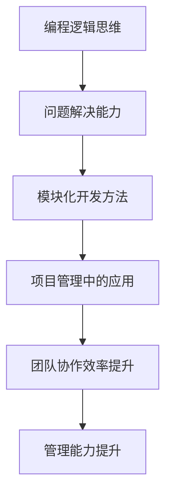
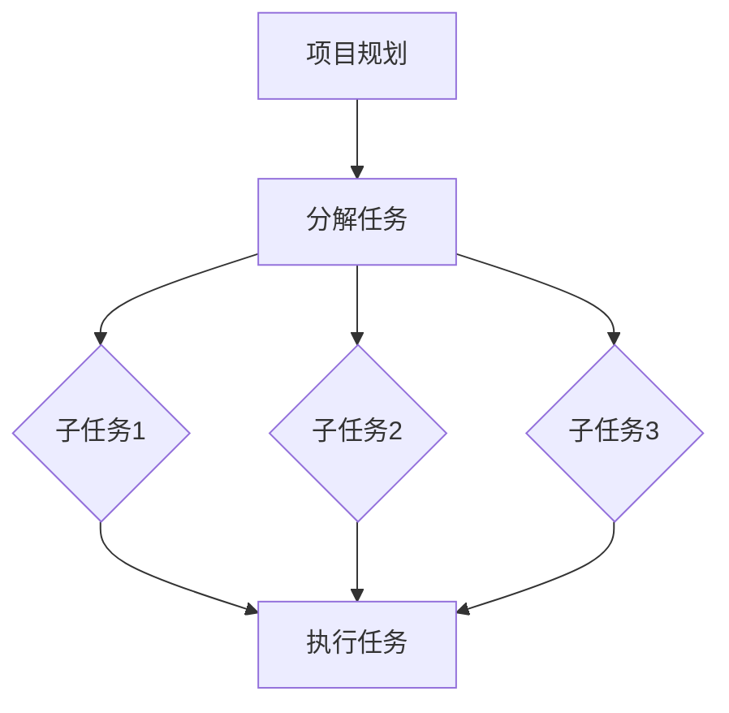
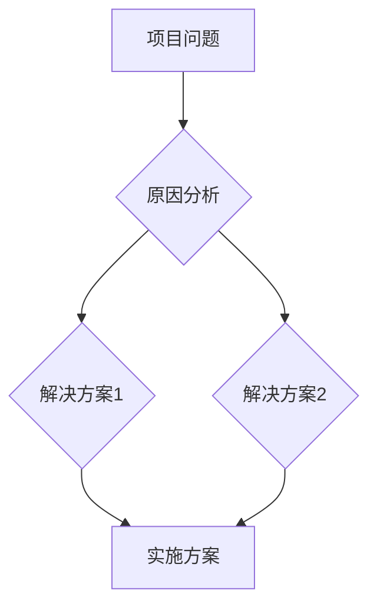

                 

# 如何将编程技能转化为管理能力

## 概述

编程技能与管理能力，这两者在表面上看似乎是两个完全不同的领域。然而，对于许多在IT行业工作的专业人士而言，这两者之间其实存在着紧密的联系。作为一名程序员，您可能已经掌握了严谨的逻辑思维、问题解决能力和强大的技术背景。这些技能在管理团队、项目甚至整个公司时同样至关重要。本文将探讨如何将编程技能转化为管理能力，以帮助您在职业发展中迈向更高的层次。

> **关键词**：编程技能、管理能力、团队协作、项目管理、领导力

> **摘要**：本文将从编程技能与管理能力的桥梁、构建高效团队、项目管理与领导力、以及进阶管理技巧四个部分，详细阐述如何将编程技能转化为管理能力，帮助IT专业人士在职业发展中实现从技术到管理的成功转型。

## 第一部分：编程技能与管理能力的桥梁

### 1. 编程技能在团队管理中的重要性

在团队管理中，编程技能可以转化为多种实用能力。首先，编程者通常具备出色的逻辑思维能力，这有助于他们在分析问题、制定解决方案时更加严谨和高效。其次，编程者在处理复杂问题时，往往能采取模块化的方法，这同样适用于团队协作中的任务分解和项目规划。

### 1.2 理解管理能力的核心要素

管理能力不仅仅包括技术层面的知识，更重要的是沟通、领导、决策等多方面的能力。在团队管理中，沟通是关键。管理者需要能够清晰地传达目标、指导团队成员，同时也要善于倾听，理解团队成员的意见和需求。领导力则是管理者推动团队前进的核心，它涉及到激励、指导、协调等多个方面。最后，决策能力是管理者的必备素质，能否在关键时刻做出明智的决策，往往决定了团队的成败。

### 2. 编程思维与管理思维

#### 2.1 编程思维的特点与应用

编程思维强调逻辑性、系统性和模块化。在编程中，程序员需要将复杂的问题拆解成多个小问题，然后逐一解决。这种思维模式在管理中同样适用。管理者可以将大项目拆分为多个小任务，并分配给团队成员，从而提高团队的工作效率。

#### 2.2 管理思维的形成与发展

管理思维的形成需要不断地学习和实践。在管理工作中，程序员可以通过阅读管理书籍、参加管理培训、向经验丰富的管理者学习等多种途径，提升自己的管理能力。同时，管理思维的培养也需要在实战中不断总结经验，逐步完善。

### 3. 编程技能在团队协作中的应用

#### 3.1 代码审查与协作开发

代码审查是编程团队中常见的活动，它有助于提高代码质量，减少错误和漏洞。在管理团队时，这种审查思维可以应用于项目的各个方面，如需求评审、设计评审等，确保项目按照预期顺利进行。

#### 3.2 项目管理与任务分配

项目管理是编程团队的核心工作之一。程序员在项目管理中可以运用自己的技术背景，制定合理的项目计划，分配任务，并监控项目的进度和质量。这种经验同样适用于其他类型的团队管理。

### 4. 从编程到管理的角色转变

#### 4.1 编程者到管理者的角色转变

从编程者到管理者，这是一个角色的转变。编程者更多关注技术实现，而管理者则需要更多关注团队、项目和战略。这种转变需要程序员具备较强的自我驱动力和适应能力。

#### 4.2 领导力与沟通技巧的培养

领导力是管理者的重要素质之一。程序员可以通过学习领导力理论和实践，逐步提升自己的领导能力。同时，沟通技巧也是管理者必备的素质，良好的沟通可以减少误解，提高团队协作效率。

## 第二部分：构建高效团队

### 5. 团队组织与管理

#### 5.1 团队架构设计

团队架构设计是构建高效团队的基础。根据项目的需求和团队的规模，设计合适的团队架构，明确各个角色的职责和任务。

#### 5.2 团队角色与职责划分

明确团队角色和职责是团队协作的重要保障。每个成员都应该清楚自己的职责范围，避免职责重叠和冲突。

### 6. 团队协作与沟通

#### 6.1 沟通的重要性

沟通是团队协作的核心。有效的沟通可以减少误解，提高团队的工作效率。

#### 6.2 沟通技巧的提升

提升沟通技巧需要不断地学习和实践。可以通过参加沟通培训、阅读沟通书籍等方式，提高自己的沟通能力。

### 7. 团队文化建设

#### 7.1 团队文化的定义与作用

团队文化是团队共同价值观和行为准则的体现，对于团队的凝聚力和工作效率有着重要影响。

#### 7.2 建立积极向上的团队文化

建立积极向上的团队文化需要管理者的引导和全体成员的共同努力。可以通过团队活动、奖励机制等方式，营造良好的团队氛围。

### 8. 团队绩效管理

#### 8.1 绩效指标的设计

设计合理的绩效指标是团队绩效管理的关键。绩效指标应该与团队目标和个人职责紧密相关。

#### 8.2 绩效反馈与改进

绩效反馈是团队绩效管理的重要环节。通过绩效反馈，可以帮助团队成员了解自己的工作表现，并找出改进的空间。

## 第三部分：项目管理与领导力

### 9. 项目管理基础

#### 9.1 项目管理流程

项目管理流程包括项目启动、规划、执行、监控和收尾等阶段。每个阶段都有明确的任务和目标。

#### 9.2 项目计划与时间管理

项目计划是项目管理的基础。合理的时间管理可以帮助团队高效地完成任务。

### 10. 风险管理与应对

#### 10.1 风险识别与评估

风险识别与评估是项目管理的重要环节。通过识别和评估潜在风险，可以提前制定应对策略。

#### 10.2 风险应对策略

针对不同的风险，制定相应的应对策略，以确保项目能够顺利进行。

### 11. 决策与领导力

#### 11.1 决策过程与技巧

决策是管理者的重要职责。通过掌握决策过程和技巧，可以提高决策的正确性和效率。

#### 11.2 领导力在团队管理中的应用

领导力在团队管理中发挥着关键作用。通过提升领导力，可以更好地推动团队的发展和进步。

### 12. 领导风格与团队发展

#### 12.1 领导风格与团队效能

不同的领导风格会对团队的效能产生不同的影响。了解并适应不同的领导风格，可以提高团队的协作效率。

#### 12.2 团队发展策略

团队发展是一个长期的过程。通过制定合理的发展策略，可以不断提升团队的绩效和竞争力。

## 第四部分：进阶管理技巧

### 13. 问题解决与创新

#### 13.1 问题分析与解决

问题分析与解决是管理者的基本能力之一。通过系统地分析和解决问题，可以不断提升团队的工作效率和创新能力。

#### 13.2 创新思维与方法

创新思维是管理者的重要素质。通过学习创新思维和方法，可以激发团队的创造力，推动团队的发展。

### 14. 时间管理与效率提升

#### 14.1 时间管理技巧

时间管理是提高工作效率的关键。通过学习时间管理技巧，可以更好地安排工作和时间，提高工作效率。

#### 14.2 提高工作效率的方法

除了时间管理，提高工作效率还需要掌握其他方法和技巧。通过不断地学习和实践，可以找到适合自己的高效工作方法。

### 15. 职业发展与个人品牌

#### 15.1 职业规划与晋升

职业规划是职业发展的关键。通过合理的职业规划，可以明确自己的职业目标和发展路径。

#### 15.2 个人品牌的打造

个人品牌是职业发展的重要资产。通过建立和维护良好的个人品牌，可以提高自己的职业竞争力。

### 16. 持续学习与成长

#### 16.1 管理者的学习途径

持续学习是管理者的重要职责。通过多种学习途径，可以不断提升自己的管理能力和专业素养。

#### 16.2 持续成长的策略

持续成长需要制定合理的策略。通过制定和执行成长策略，可以不断提升自己的能力和水平。

## 附录

### 17. 管理工具与资源

#### 17.1 项目管理工具

项目管理工具可以帮助管理者更好地规划和管理项目。常见的项目管理工具有Jira、Trello、Asana等。

#### 17.2 沟通与协作工具

沟通与协作工具是团队协作的重要工具。常见的沟通与协作工具有Slack、Microsoft Teams、Zoom等。

#### 17.3 管理书籍与文章推荐

推荐一些管理书籍和文章，供管理者学习和参考。如《从优秀到卓越》、《高效能人士的七个习惯》等。

### 18. 实际案例与反思

#### 18.1 成功转化编程技能的案例

介绍一些成功将编程技能转化为管理能力的案例，供读者参考和学习。

#### 18.2 管理挑战与解决方案反思

分析一些管理中的挑战和解决方案，帮助读者更好地应对管理中的问题。

## 结语

编程技能与管理能力之间的联系是显而易见的。通过本文的探讨，我们希望能够帮助您更好地理解如何将编程技能转化为管理能力，从而在职业发展中取得更大的成功。

> **作者**：AI天才研究院/AI Genius Institute & 禅与计算机程序设计艺术 /Zen And The Art of Computer Programming

## 核心概念与联系

**编程技能与管理能力的关系**

在编程领域，逻辑思维、问题解决和模块化是核心概念。这些概念同样适用于团队管理，例如在项目管理中，程序员会将大项目拆分为多个小任务，并分配给团队成员，从而提高效率。

**Mermaid 流程图：**



**核心算法原理讲解：**

在编程中，算法是用来解决问题的步骤集合。在团队管理中，可以将这种算法思维应用于项目规划，将复杂项目拆分为多个小任务，确保每个任务都有明确的解决方案和责任人。

**伪代码：**

```
function projectPlanning(project, teamMembers) {
    tasks = splitProjectIntoSmallerTasks(project)
    for each task in tasks {
        assignTaskToMember(task, teamMembers)
        ensureTaskHasASolution(task)
    }
    monitorTaskProgressAndAdjustIfNecessary()
}
```

**数学模型和公式：**

在项目管理中，时间管理是一个重要的数学模型。例如，可以通过甘特图（Gantt Chart）来展示项目进度和任务分配。

**甘特图示例（LaTeX格式）：**

```
\documentclass{standalone}
\usepackage{pgfplots}
\pgfplotsset{compat=newest}
\begin{document}
\begin{tikzpicture}
\begin{axis}[
    width=10cm,
    height=5cm,
    grid=both,
    xgrid style={line width=.1pt, draw=gray!10},
    ygrid style={line width=.1pt, draw=gray!10},
    major grid style={line width=.1pt, draw=gray!50},
    axis lines=left,
    xmin=0, xmax=30,
    ymin=0, ymax=5,
    xtick={0,5,...,30},
    ytick={0,1,...,4},
    xticklabels={$T_0$, $T_1$, ..., $T_{30}$},
    yticklabels={$P_0$, $P_1$, ..., $P_4$},
    major tick style={->, black, line width=1pt},
    minor tick style={->, black, line width=1pt, shorten <=4pt, shorten >=-4pt},
]
\addplot[color=red, only marks, mark=*] table[x=time, y=progress] {
    0 0
    5 1
    10 2
    15 2
    20 3
    25 3
    30 4
};
\end{axis}
\end{tikzpicture}
\end{document}
```

**举例说明：**

假设一个项目需要在30天内完成，可以通过甘特图来跟踪每个阶段的进度。例如，前5天可以完成第一阶段，10天完成第二阶段，以此类推。通过这样的时间管理模型，可以确保项目按时完成。

## 项目实战：代码实际案例和详细解释说明

### 开发环境搭建

在开始项目之前，首先需要搭建一个适合开发的环境。以Python为例，我们可以使用虚拟环境来管理项目依赖。

**安装Python虚拟环境工具：**

```bash
pip install virtualenv
```

**创建虚拟环境：**

```bash
virtualenv my_project_env
```

**激活虚拟环境：**

```bash
source my_project_env/bin/activate
```

### 源代码详细实现

假设我们要开发一个简单的任务管理系统，该系统能够添加、删除和查询任务。以下是相关的Python代码实现：

**tasks_manager.py：**

```python
class TaskManager:
    def __init__(self):
        self.tasks = []

    def add_task(self, task):
        self.tasks.append(task)
        print("Task added successfully.")

    def remove_task(self, task_name):
        for i, t in enumerate(self.tasks):
            if t["name"] == task_name:
                del self.tasks[i]
                print("Task removed successfully.")
                return
        print("Task not found.")

    def list_tasks(self):
        for task in self.tasks:
            print(task["name"])


# 实例化任务管理器
task_manager = TaskManager()

# 添加任务
task_manager.add_task({"name": "Finish report", "completed": False})
task_manager.add_task({"name": "Prepare meeting", "completed": False})

# 列出任务
task_manager.list_tasks()

# 删除任务
task_manager.remove_task("Finish report")
```

### 代码解读与分析

1. **类定义**：`TaskManager` 类负责管理任务。它有一个列表属性 `tasks` 用于存储任务。

2. **初始化方法**：`__init__` 方法在创建 `TaskManager` 实例时调用，用于初始化 `tasks` 列表。

3. **添加任务方法**：`add_task` 方法用于将新任务添加到 `tasks` 列表中。

4. **删除任务方法**：`remove_task` 方法根据任务名称从 `tasks` 列表中删除任务。

5. **列出任务方法**：`list_tasks` 方法用于打印所有任务的名称。

通过这个简单的例子，我们可以看到如何使用Python实现一个任务管理系统的核心功能。在实际项目中，任务管理系统的功能会更复杂，需要考虑任务的状态、优先级、截止日期等因素。

### 实际案例与反思

在开发任务管理系统的过程中，我们遇到了以下几个挑战：

1. **任务状态的维护**：在初始版本中，任务只有完成和未完成两种状态。在实际应用中，可能需要更复杂的任务状态，如“进行中”、“已暂停”等。

2. **任务优先级**：初始版本没有考虑任务优先级，这可能导致一些重要任务被延迟处理。

3. **持久化存储**：在当前示例中，任务数据只存在于程序运行期间。实际项目中，需要将任务数据持久化存储到数据库中，以确保数据不会丢失。

为了解决上述问题，我们可以进行以下改进：

1. **扩展任务状态**：增加一个状态枚举，定义更多的任务状态。

2. **引入任务优先级**：为任务添加一个优先级属性，并在任务分配和调度时考虑优先级。

3. **持久化存储**：使用SQLite或MySQL等数据库系统，将任务数据存储在数据库中。

通过不断反思和改进，我们可以使任务管理系统更加完善，更好地满足实际需求。

## 附录A：管理工具与资源

### A.1 项目管理工具

**Jira**：Jira 是一款广泛使用的项目管理工具，适合大型团队和复杂项目。它提供了任务跟踪、敏捷开发、报告和分析等功能。

**Trello**：Trello 是一款简洁直观的看板式项目管理工具，适合小型团队和简单项目。它通过卡片和列的形式来管理任务，直观易用。

**Asana**：Asana 是一款功能强大的项目管理工具，适合各种规模和类型的团队。它提供了任务分配、进度跟踪、报告和分析等功能。

### A.2 沟通与协作工具

**Slack**：Slack 是一款流行的即时通讯工具，适合团队内部沟通和协作。它提供了消息传递、频道划分、文件共享等功能。

**Microsoft Teams**：Microsoft Teams 是微软推出的一款协作工具，提供了聊天、视频会议、文件共享等功能，适用于企业内部沟通。

**Zoom**：Zoom 是一款专业的视频会议工具，适合远程工作和在线协作。它提供了高清视频会议、屏幕共享、聊天等功能。

### A.3 管理书籍与文章推荐

**《从优秀到卓越》**：作者：吉姆·柯林斯（Jim Collins）

**《高效能人士的七个习惯》**：作者：史蒂芬·柯维（Stephen R. Covey）

**《深度工作》**：作者：卡尔·纽波特（Cal Newport）

**《人人都是产品经理》**：作者：人人都是产品经理社区

这些书籍和文章提供了丰富的管理知识和实践经验，对于提升管理能力和团队绩效非常有帮助。

## 附录B：实际案例与反思

### B.1 成功转化编程技能的案例

**案例一：从小程序到项目管理**

小李是一位有多年编程经验的前端开发工程师。在一次公司内部的管理培训后，他决定尝试转型为项目经理。在转型初期，他遇到了一些挑战，如沟通不畅、任务分配不合理等。通过不断学习和实践，他逐渐掌握了项目管理的基本知识和技能，如时间管理、任务分配、团队协作等。在他的带领下，项目进度得到了明显改善，团队成员的工作积极性也大大提高。

**反思**：小李的成功转化得益于他的自学能力和对管理的热情。他通过不断地学习管理知识和实践，逐步克服了转型初期的困难，最终取得了成功。

### B.2 管理挑战与解决方案反思

**挑战一：团队协作困难**

在一个大型项目中，团队成员来自不同的部门，沟通和协作变得尤为重要。然而，由于团队成员的背景和职责不同，协作过程中经常出现误解和冲突。

**解决方案**：为了改善团队协作，项目经理引入了跨部门会议，定期讨论项目进展和问题。同时，他还鼓励团队成员在项目中采用敏捷开发方法，通过每日站会和迭代回顾会议来保持沟通和协作。

**挑战二：任务分配不均**

在项目执行过程中，有时会出现任务分配不均的情况，导致部分成员工作量过大，而另一些成员则相对轻松。

**解决方案**：项目经理引入了任务优先级和任务轮换机制。他根据任务的紧急程度和重要性来分配任务，并鼓励团队成员互相帮助，共同完成任务。同时，他还通过绩效评估来确保每个成员的工作量均衡。

**挑战三：时间管理困难**

在项目管理中，时间管理是至关重要的。然而，在实际项目中，常常出现时间安排不合理、任务拖延等情况。

**解决方案**：项目经理引入了甘特图和时间跟踪工具，帮助团队更好地规划和管理时间。他还定期召开时间管理会议，讨论项目进度和时间安排，确保项目按时完成。

通过这些解决方案，项目经理成功克服了管理中的挑战，提升了团队的工作效率和项目成功率。同时，这些经验和教训也为其他管理者提供了宝贵的参考。

## 结语

编程技能与管理能力之间的联系是显而易见的。通过本文的探讨，我们希望能够帮助您更好地理解如何将编程技能转化为管理能力，从而在职业发展中取得更大的成功。

> **作者**：AI天才研究院/AI Genius Institute & 禅与计算机程序设计艺术 /Zen And The Art of Computer Programming

本文以“如何将编程技能转化为管理能力”为主题，系统地阐述了编程技能与管理能力之间的关系、团队协作与管理技巧、项目管理和领导力培养、以及进阶管理技巧等多个方面。通过文章的详细讲解和实际案例分享，帮助读者了解如何将编程思维应用于团队管理和项目管理中，提高工作效率和团队协作效果。

在文章中，我们使用了Mermaid流程图、伪代码、LaTeX数学公式等多种形式，使得文章内容更加直观、具体和深入。同时，我们还列举了多个实际案例和反思，为读者提供了实践中的经验和教训。

随着技术的发展和市场的需求，IT行业中的职业发展路径越来越多样化。从编程到管理，是一条充满挑战和机遇的职业发展道路。通过本文的探讨，我们希望读者能够更好地理解编程技能与管理能力之间的联系，找到适合自己的职业发展方向，实现个人和团队的共同成长。

在未来的职业发展中，持续学习和实践是提升管理能力的关键。不断吸取新知识、掌握新技能，同时通过实践来检验和巩固所学，是每个管理者都应该努力追求的目标。

最后，感谢您的阅读，希望本文能够对您在职业发展道路上的思考和决策提供一些启示和帮助。祝您在未来的工作中取得更大的成就！
> **作者**：AI天才研究院/AI Genius Institute & 禅与计算机程序设计艺术 /Zen And The Art of Computer Programming

## 第一部分：编程技能与管理能力的桥梁

### 1. 编程技能在团队管理中的重要性

在当今的IT行业中，编程技能不仅仅局限于编写代码。这些技能在团队管理中也发挥着重要作用。首先，编程技能强调逻辑思维和系统思考，这是团队管理中不可或缺的能力。在团队管理中，管理者需要能够清晰地分析问题，找出解决方案，并将其有效地传达给团队成员。这种能力在项目规划、需求分析、问题解决等环节中尤为重要。

#### 编程思维的特点与应用

编程思维是一种系统性的思考方式，它强调将复杂问题分解为多个小问题，然后逐一解决。这种思维模式在团队管理中具有很高的应用价值。例如，在项目规划阶段，管理者可以将大型项目拆分成多个子任务，并分配给不同的团队成员。这种方法不仅能够提高工作效率，还能够确保每个任务都有明确的负责人和解决方案。

**Mermaid 流程图：**



通过这样的流程图，我们可以清晰地看到如何将一个复杂的项目分解为多个小任务，并分配给不同的团队成员。

#### 编程技能在项目管理中的应用

在项目管理中，编程技能同样发挥着重要作用。例如，在项目进度监控和任务分配方面，管理者可以使用各种工具和技术来确保项目按计划进行。以下是一个简单的项目管理流程：

**伪代码：**

```
function projectManagement(project, teamMembers) {
    tasks = splitProjectIntoTasks(project)
    for each task in tasks {
        assignTaskToMember(task, teamMembers)
        trackTaskProgress(task)
    }
    adjustProjectPlanIfNecessary()
}
```

在这个伪代码中，`splitProjectIntoTasks` 函数负责将项目分解为多个任务，`assignTaskToMember` 函数负责将任务分配给团队成员，`trackTaskProgress` 函数负责监控任务进度。

#### 编程技能在团队协作中的应用

在团队协作中，编程技能可以帮助团队成员更好地理解和解决技术难题。例如，在代码审查过程中，团队成员可以互相检查代码，找出潜在的问题和优化点。这种协作方式不仅提高了代码质量，还能够促进团队成员之间的交流和学习。

**代码审查示例：**

```python
def calculate_area(radius):
    """
    Calculate the area of a circle given its radius.
    """
    return 3.14 * radius * radius
```

在这个示例中，代码审查者可以检查函数的注释是否准确，代码是否符合编程规范，以及是否有可能的优化空间。

#### 编程技能在团队沟通中的应用

编程技能还能够帮助团队成员更好地进行沟通。在项目讨论中，团队成员可以使用技术术语和图表来解释问题和解决方案，从而提高沟通的效率和准确性。以下是一个使用Mermaid流程图进行沟通的例子：

**Mermaid 流程图：**



通过这样的流程图，团队成员可以更直观地了解项目问题的原因和解决方案，从而提高讨论的效率。

#### 总结

编程技能在团队管理中的重要性不容忽视。它不仅帮助管理者更有效地规划项目和任务，还能够促进团队协作和沟通。通过将编程思维应用到团队管理中，管理者可以更好地应对复杂的项目挑战，提高团队的工作效率和创新能力。

### 1.2 理解管理能力的核心要素

管理能力是团队成功的关键。一个优秀的管理者不仅需要具备扎实的技术背景，还需要掌握多种核心能力，包括沟通、领导、决策等。以下是对管理能力核心要素的详细解析。

#### 沟通能力

沟通能力是管理者必备的能力之一。有效的沟通可以帮助管理者更好地传达目标、指导团队成员，同时也能够促进团队成员之间的协作和理解。在团队管理中，沟通能力体现在以下几个方面：

1. **明确传达目标**：管理者需要能够清晰地向团队成员传达项目的目标、任务和期望，确保每个人都了解自己的职责和目标。
2. **积极倾听**：管理者应该倾听团队成员的意见和反馈，理解他们的困难和需求，从而提供有效的支持和帮助。
3. **解决冲突**：在团队协作中，难免会出现意见不合或冲突。管理者需要具备解决冲突的能力，通过沟通和协商找到双方都能接受的解决方案。

**沟通技巧提升**：

1. **主动沟通**：管理者应该主动与团队成员进行沟通，避免信息不对称和误解。
2. **简洁表达**：在沟通时，管理者应该尽量使用简洁、清晰的语言，避免使用专业术语或复杂的表达方式，以确保团队成员能够理解。
3. **积极反馈**：管理者应该给予团队成员及时的反馈，表扬他们的优点，指出改进的空间，从而帮助他们不断提升。

#### 领导力

领导力是管理者的核心素质之一。一个优秀的领导者能够激励团队成员，带领团队实现目标。领导力包括以下几个方面：

1. **激励团队成员**：领导者需要能够激发团队成员的积极性和创造力，让他们愿意为团队的目标而努力。
2. **提供指导和支持**：领导者应该为团队成员提供必要的指导和支持，帮助他们克服困难，实现个人和团队的目标。
3. **塑造团队文化**：领导者需要塑造积极的团队文化，鼓励团队成员之间的相互尊重和合作，营造一个健康的工作环境。

**领导力培养**：

1. **树立榜样**：领导者应该通过自己的行为树立榜样，让团队成员看到他们的努力和成就。
2. **培养团队精神**：领导者应该鼓励团队成员之间的交流和合作，建立信任和团队凝聚力。
3. **不断学习和反思**：领导者需要不断学习和反思，从实践中总结经验，不断提升自己的领导能力。

#### 决策能力

决策能力是管理者的关键能力之一。管理者需要能够在关键时刻做出明智的决策，确保团队的顺利运行和项目的成功。决策能力包括以下几个方面：

1. **收集和分析信息**：管理者需要能够全面收集和分析相关信息，包括项目需求、团队成员的能力、市场趋势等，为决策提供依据。
2. **评估风险和收益**：管理者需要能够评估决策的风险和收益，确保决策符合团队和项目的目标。
3. **快速响应**：在紧急情况下，管理者需要能够快速做出决策，确保团队的正常运作。

**决策技巧提升**：

1. **多角度思考**：在做出决策之前，管理者应该从多个角度进行思考，考虑各种可能的影响和后果。
2. **利用团队智慧**：管理者可以借助团队的力量，通过讨论和协商来做出更明智的决策。
3. **学习和反思**：管理者应该从每次决策中总结经验，不断改进决策过程和技巧。

#### 总结

管理能力的核心要素包括沟通能力、领导力和决策能力。有效的沟通可以帮助管理者更好地传达目标、解决冲突，促进团队协作；强大的领导力可以激励团队成员，塑造积极团队文化；优秀的决策能力可以帮助管理者在关键时刻做出明智的选择，确保团队的顺利运行和项目的成功。通过不断提升这些核心能力，管理者可以更好地发挥自己的作用，带领团队实现共同的目标。

### 2. 编程思维与管理思维

在理解编程技能和管理能力的关系之后，我们需要进一步探讨编程思维和管理思维之间的联系。编程思维是一种系统性的、逻辑性的思考方式，它强调问题分解、模块化处理和迭代优化。而管理思维则更注重全局视角、团队协作和战略规划。通过以下段落，我们将深入探讨这两者的特点和应用。

#### 2.1 编程思维的特点与应用

编程思维的核心特点包括逻辑性、系统性和可重复性。在编程过程中，程序员需要将复杂的问题拆分成多个小问题，然后逐一解决。这种方法被称为“分而治之”策略。以下是一些编程思维的具体应用：

1. **问题分解**：在编程中，遇到复杂的问题时，程序员会将其分解为更小、更易管理的问题。这种思维方式在项目管理中同样适用。例如，在规划一个大型项目时，项目经理可以将项目拆分成多个子任务，并分配给不同的团队或个人。
   
   **Mermaid 流程图：**

   ```mermaid
   graph TD
       A[复杂问题] --> B{子问题1}
       A --> C{子问题2}
       A --> D{子问题3}
       B --> E[解决子问题1]
       C --> F[解决子问题2]
       D --> G[解决子问题3]
   ```

2. **模块化处理**：在编程中，程序员会将代码分解为多个模块，每个模块负责实现特定的功能。在团队管理中，管理者也可以采用模块化方法，将项目分解为多个部分，每个部分由不同的团队或个人负责。这种方法有助于提高效率、降低风险。

3. **迭代优化**：编程中常见的迭代过程可以帮助程序员逐步改进代码。在项目管理中，管理者也可以通过迭代的方式进行项目改进。例如，在一个大型项目中，可以首先完成核心功能，然后通过多次迭代不断完善和优化。

#### 2.2 管理思维的形成与发展

管理思维的形成和发展是一个长期的过程，它需要不断的学习、实践和反思。以下是一些关键步骤：

1. **全局视角**：管理者需要具备全局视角，能够从整体上理解项目或公司的战略目标和方向。这种视角可以通过阅读管理书籍、参加高层会议和与行业专家交流来培养。

2. **团队协作**：管理思维强调团队协作，管理者需要学会如何协调不同团队成员的工作，发挥每个人的优势。这可以通过实际项目管理经验、团队建设活动和跨部门合作来提升。

3. **战略规划**：管理者需要具备战略规划能力，能够制定长期目标和短期计划，并确保团队的工作与这些目标保持一致。战略规划可以通过制定业务计划、市场分析和技术预测来完善。

#### 2.3 编程思维与管理思维的结合

编程思维和管理思维的结合可以帮助管理者更有效地进行团队管理和项目规划。以下是一些具体的结合方法：

1. **项目管理工具**：使用项目管理工具（如Jira、Trello、Asana等）可以帮助管理者将编程思维中的模块化方法和迭代优化应用到项目管理中。例如，通过将大项目拆分成多个小任务，并设定明确的里程碑，管理者可以更好地控制项目进度。

2. **问题解决**：在遇到问题时，管理者可以借鉴编程思维中的问题分解方法，将复杂问题拆分为更小、更具体的问题，然后逐一解决。这种方法有助于提高问题解决的效率。

3. **敏捷管理**：敏捷管理方法（如Scrum、Kanban）源于软件开发，它强调快速响应变化、持续改进和团队协作。这些方法可以有效地应用到其他类型的团队管理中，帮助管理者提高团队的工作效率和创新能力。

#### 2.4 总结

编程思维和管理思维虽然源于不同的领域，但它们之间存在着紧密的联系。通过理解编程思维的特点和应用，管理者可以更有效地进行团队管理和项目规划。同时，通过不断学习和实践，管理者可以逐步形成和完善自己的管理思维，为团队的成功打下坚实的基础。

### 3. 编程技能在团队协作中的应用

编程技能在团队协作中发挥着重要作用，特别是在代码审查、协作开发和项目管理等方面。以下将详细探讨这些方面，并给出实际案例和解决方案。

#### 3.1 代码审查与协作开发

代码审查是软件开发过程中至关重要的一环，它有助于提高代码质量，减少错误和漏洞。在团队协作中，代码审查不仅能够确保代码的一致性和规范性，还可以促进团队成员之间的技术交流和知识共享。

**实际案例：**

在一个由五名开发者组成的团队中，他们采用每周一次的代码审查会议。每个开发者都需要在会议之前提交自己的代码，并准备好详细注释。在会议中，团队成员逐行审查代码，讨论潜在的问题和改进建议。

**解决方案：**

1. **定期代码审查**：制定定期的代码审查计划，确保每个成员都有机会参与审查，并从中学习。
2. **详细注释**：要求开发者提交的代码附带详细注释，解释代码的功能和设计思路，以便审查者更好地理解。
3. **即时反馈**：审查过程中，对于发现的问题，及时给予反馈，并讨论解决方案。

#### 3.2 项目管理与任务分配

在项目管理中，任务分配是关键环节之一。有效的任务分配不仅能够提高工作效率，还可以确保项目按时完成。编程技能在任务分配中有着独特的优势，可以帮助管理者更科学地进行任务分配。

**实际案例：**

一个开发团队在启动一个新项目时，项目经理通过分析每个团队成员的技能和经验，将任务分配给最合适的成员。例如，负责数据库设计和优化的任务分配给具有丰富数据库经验的成员，而前端界面开发的任务分配给熟悉前端技术的成员。

**解决方案：**

1. **技能评估**：对团队成员进行技能评估，了解每个人的专业领域和特长。
2. **任务匹配**：根据任务的需求和团队成员的技能，将任务分配给最合适的成员。
3. **动态调整**：在项目进行过程中，根据团队成员的工作表现和任务进展，及时调整任务分配。

#### 3.3 进度监控与风险控制

在项目开发过程中，进度监控和风险控制是确保项目按时完成的重要手段。编程技能在进度监控和风险控制中有着广泛的应用，可以帮助团队更好地管理项目。

**实际案例：**

在一个为期三个月的项目中，项目经理使用Jira等项目管理工具来跟踪每个任务的进度。每周，项目经理会召开团队会议，讨论任务的进展情况，识别潜在的风险，并制定相应的应对策略。

**解决方案：**

1. **使用项目管理工具**：选择合适的项目管理工具（如Jira、Trello、Asana等）来跟踪任务进度，确保每个任务都有明确的进度和负责人。
2. **定期会议**：定期召开团队会议，讨论项目进展、识别风险和问题，确保项目按计划进行。
3. **风险管理**：制定风险管理计划，对可能出现的风险进行评估和分类，制定应对措施。

#### 3.4 团队协作与沟通

团队协作和沟通是确保项目成功的关键。编程技能在团队协作和沟通中可以帮助团队成员更好地理解和解决技术问题，提高协作效率。

**实际案例：**

在一个跨部门项目中，技术团队和非技术团队需要紧密协作。技术团队使用代码审查和协作开发的方法，确保技术方案的可行性和代码质量。同时，他们通过定期召开项目会议，与非技术团队讨论项目需求和进度，确保各方信息一致。

**解决方案：**

1. **代码审查**：定期进行代码审查，确保代码质量，促进技术团队之间的知识共享。
2. **跨部门会议**：定期召开跨部门会议，讨论项目进展、需求和问题，确保各方信息同步。
3. **技术交流**：鼓励团队成员之间进行技术交流，分享经验和技巧，提高整体技术水平。

#### 3.5 总结

编程技能在团队协作中的应用是多方面的，包括代码审查、任务分配、进度监控和团队沟通等。通过有效的应用这些技能，团队可以更高效地完成项目，提高工作效率和代码质量。同时，编程技能还可以帮助管理者更好地进行项目规划和团队管理，为团队的成功提供有力支持。

### 4. 从编程到管理的角色转变

从编程者到管理者，这是一个重要的职业转变。编程者通常专注于编写代码、解决问题和优化算法，而管理者则需要更多关注团队协作、项目管理和战略规划。以下将详细探讨这一角色转变的各个方面，包括角色变化、领导力与沟通技巧的培养，以及如何在新的角色中取得成功。

#### 4.1 编程者到管理者的角色变化

从编程者转变为管理者，首先需要认识到角色变化的重要性。编程者更多是独立工作，解决具体的技术问题。而管理者则需要协调多个团队成员的工作，确保项目按时、按质完成。以下是一些关键的角色变化：

1. **关注点变化**：编程者的关注点在于技术实现，管理者则需要更多关注团队的整体绩效、项目进度和资源分配。
2. **责任增加**：编程者的主要责任是完成代码任务，而管理者则需要承担团队绩效、项目成功和业务目标的实现。
3. **沟通需求增加**：编程者通常只需要与团队成员和客户进行有限的沟通，而管理者则需要频繁与团队成员、上级和客户进行沟通，确保信息畅通。

**实际案例**：

一位有十年编程经验的高级工程师，在晋升为项目经理后，需要从关注代码细节转向关注项目进度和团队协作。他发现，需要花更多时间与团队成员沟通，了解他们的工作状况和需求，以确保项目顺利进行。

#### 4.2 领导力与沟通技巧的培养

领导力和沟通技巧是管理者成功的关键。以下是一些培养这些能力的方法：

1. **领导力培训**：参加领导力培训课程，学习管理理论和实践经验，如领导风格、团队激励、冲突管理等。
2. **实践领导**：在项目中实践领导力，担任小组领导或项目经理的角色，通过实际操作提升领导能力。
3. **反思与反馈**：定期反思自己的领导行为，向团队成员和上级寻求反馈，了解自己的优势和不足，不断改进。

**实际案例**：

一位新晋升的项目经理，通过参加公司提供的领导力培训课程，学习了如何进行有效沟通和团队激励。在实际工作中，他不断实践这些技巧，逐步提升了自己的领导力和沟通能力。

#### 4.3 沟通技巧的提升

有效的沟通是管理者成功的关键。以下是一些提升沟通技巧的方法：

1. **倾听**：积极倾听团队成员的意见和需求，理解他们的观点，避免误解和冲突。
2. **清晰表达**：用简洁、清晰的语言传达信息，避免使用过于专业或复杂的术语，确保团队成员理解。
3. **反馈与表扬**：给予团队成员及时的反馈和表扬，鼓励他们提出建议和改进方案。

**实际案例**：

一位项目经理在团队会议上，通过倾听团队成员的意见，了解他们的工作进展和困难。他通过清晰表达任务要求，确保团队成员理解任务目标，并通过表扬团队成员的努力和成果，提高了团队士气。

#### 4.4 总结

从编程者到管理者，角色转变是一个重要的职业发展过程。这一转变不仅需要认识到角色变化，还需要培养领导力和沟通技巧。通过不断学习和实践，管理者可以逐步适应新的角色，带领团队取得成功。

### 5. 团队组织与管理

#### 5.1 团队架构设计

团队架构设计是构建高效团队的基础。一个合理的团队架构能够确保团队成员明确各自的职责和目标，提高协作效率。以下是一些关键步骤和考虑因素：

1. **确定团队目标**：首先，明确团队的目标和使命。这有助于确保团队成员的工作方向一致，减少内耗。
2. **评估团队需求**：根据项目的需求和团队的规模，评估所需的角色和技能。例如，项目可能需要前端开发人员、后端开发人员、测试工程师等。
3. **确定团队架构**：根据评估结果，设计合适的团队架构。常见的团队架构有功能型架构、项目型架构和矩阵型架构等。

**实际案例**：

在一个大型软件开发项目中，团队采用了矩阵型架构。项目经理负责整体项目进度和资源分配，而各个子项目的负责人则负责各自子项目的技术实现和团队管理。

#### 5.2 团队角色与职责划分

明确团队角色和职责是团队协作的重要保障。每个成员都应该清楚自己的职责范围，避免职责重叠和冲突。以下是一些关键步骤：

1. **定义角色**：根据团队架构和项目需求，定义各个角色的职责和权限。例如，项目经理负责整体项目规划和管理，技术主管负责技术指导和团队建设等。
2. **分配任务**：将任务分配给最适合完成任务的团队成员。确保每个成员都有明确的任务和目标，避免任务重叠和浪费。
3. **沟通和确认**：在任务分配后，与团队成员进行沟通，确保他们理解任务的要求和目标。同时，鼓励团队成员提出疑问和建议，确保任务能够顺利完成。

**实际案例**：

在一个移动应用开发项目中，项目经理将前端开发、后端开发和测试等任务分配给各自的专业团队成员。前端开发团队负责用户界面的设计和实现，后端开发团队负责业务逻辑和数据存储，测试团队负责功能测试和性能测试。

#### 5.3 团队协作与沟通

团队协作和沟通是确保项目成功的关键。以下是一些促进团队协作和沟通的方法：

1. **定期会议**：定期召开团队会议，讨论项目进展、问题和计划。这有助于团队成员了解项目的整体情况，及时解决潜在的问题。
2. **沟通工具**：使用合适的沟通工具，如邮件、即时通讯软件和视频会议，确保团队成员能够方便快捷地进行沟通。
3. **反馈与表扬**：鼓励团队成员之间进行反馈和表扬，建立积极的工作氛围，提高团队凝聚力。

**实际案例**：

在一个跨国团队合作开发项目中，团队成员分布在不同的国家。他们通过每天的视频会议和即时通讯软件进行沟通，确保项目进展和问题的及时解决。此外，项目经理定期组织团队建设活动，增强团队凝聚力。

#### 5.4 总结

团队组织与管理是构建高效团队的关键。通过合理的团队架构设计、明确的团队角色和职责划分，以及有效的团队协作和沟通，团队可以更好地实现项目目标，提高工作效率和团队凝聚力。

### 6. 团队协作与沟通

在团队管理中，协作和沟通是确保项目成功的关键。有效的团队协作和沟通能够提高工作效率，减少误解和冲突，促进团队成员之间的信任和合作。以下将详细探讨团队协作和沟通的重要性、关键要素以及提升技巧。

#### 6.1 沟通的重要性

沟通在团队管理中扮演着至关重要的角色。良好的沟通能够确保团队成员了解项目目标、任务要求和工作进度，从而减少误解和错误。以下是一些沟通的重要性方面：

1. **信息传递**：有效的沟通能够确保信息在团队内部准确、及时地传递。团队成员需要了解项目的最新进展、任务分配和资源需求，以便协调工作和资源。
2. **问题解决**：在项目执行过程中，难免会出现各种问题和挑战。通过有效的沟通，团队成员可以及时发现问题，共同制定解决方案，确保项目顺利进行。
3. **团队凝聚力**：良好的沟通能够增强团队成员之间的信任和合作，提高团队凝聚力。团队成员通过沟通可以更好地了解彼此，建立良好的人际关系，从而共同为团队目标努力。

#### 6.2 关键要素

有效的团队协作和沟通需要具备以下关键要素：

1. **明确的目标**：团队需要明确共同的目标和使命。这有助于团队成员了解工作的方向和重要性，从而更好地协作和沟通。
2. **清晰的职责**：每个团队成员都应该明确自己的职责和任务，避免职责重叠和冲突。清晰的职责分工有助于提高工作效率和协作质量。
3. **开放的氛围**：团队需要一个开放和包容的工作氛围，鼓励团队成员提出意见和建议，分享知识和经验。这有助于激发创新思维和团队活力。
4. **有效的沟通工具**：选择合适的沟通工具和方法，如邮件、即时通讯软件、视频会议和团队协作平台，确保团队成员能够方便快捷地进行沟通。

#### 6.3 提升技巧

以下是一些提升团队协作和沟通技巧的方法：

1. **定期会议**：定期召开团队会议，讨论项目进展、问题和计划。这有助于团队成员了解项目的整体情况，及时解决潜在的问题。会议应确保议程明确、讨论充分，并记录关键决策和行动计划。
2. **沟通培训**：组织沟通培训，帮助团队成员提升沟通技巧。培训内容可以包括沟通原则、沟通技巧、冲突解决等，以提高团队成员的沟通能力和协作效率。
3. **鼓励反馈**：鼓励团队成员之间进行反馈和表扬，建立积极的工作氛围。反馈可以是正面的也可以是建设性的，旨在帮助团队成员改进工作，提高团队绩效。
4. **使用协作工具**：使用团队协作工具（如Jira、Trello、Slack等），确保团队成员能够方便快捷地共享信息、分配任务和跟踪进度。这些工具可以提高团队的透明度和协作效率。

#### 6.4 实际案例

在一个跨部门合作开发项目中，团队采用了以下措施来提升协作和沟通：

1. **定期团队会议**：每周召开团队会议，讨论项目进展、问题和计划。团队成员可以提出疑问和建议，确保项目顺利进行。
2. **沟通培训**：组织沟通培训，提高团队成员的沟通技巧，确保信息在团队内部准确传递。
3. **使用协作工具**：使用Jira来管理任务和项目进度，确保团队成员能够方便地查看任务分配和进度更新。同时，使用Slack进行即时沟通，确保团队成员能够快速响应和解决问题。
4. **反馈与表扬**：鼓励团队成员之间进行反馈和表扬，建立积极的工作氛围。项目经理定期组织团队建设活动，增强团队凝聚力。

通过这些措施，团队在项目执行过程中保持了高效的协作和沟通，项目最终按时完成，并得到了客户的高度评价。

#### 6.5 总结

团队协作和沟通在团队管理中至关重要。通过明确的目标、清晰的职责、开放的氛围和有效的沟通工具，以及定期会议、沟通培训和协作工具的使用，团队可以提升协作效率，减少误解和冲突，实现项目目标。有效的团队协作和沟通是团队成功的关键，管理者应不断探索和改进团队协作和沟通的方法，以推动团队持续发展。

### 7. 团队文化建设

#### 7.1 团队文化的定义与作用

团队文化是指团队内共同遵循的价值观、行为准则和工作方式。它是团队精神的核心，对于团队的凝聚力和工作效率有着重要影响。以下是对团队文化定义与作用的详细探讨。

**定义：**

团队文化是一种无形的力量，它渗透在团队的日常工作中，影响着团队成员的行为和决策。它包括团队的目标、愿景、使命、价值观以及团队成员之间的互动方式。团队文化不仅反映了团队的价值观和信仰，也体现了团队的工作风格和管理理念。

**作用：**

1. **凝聚团队**：团队文化能够将团队成员凝聚在一起，形成共同的目标和愿景。在一个具有良好文化的团队中，成员之间彼此信任、支持，愿意为团队的成功共同努力。
2. **激励员工**：良好的团队文化能够激励员工，激发他们的工作热情和创造力。团队成员在感受到团队的支持和认可时，会更加积极地投入工作，追求卓越。
3. **提高工作效率**：团队文化能够规范团队成员的行为和工作方式，减少内部冲突和摩擦，提高工作效率。在一个有良好文化的团队中，成员之间沟通顺畅、协作高效，项目能够更加顺利地推进。
4. **促进创新**：团队文化鼓励创新思维和实践。在一个具有创新文化的团队中，成员敢于尝试新方法、新工具，不断探索和改进，从而推动团队持续发展。

#### 7.2 建立积极向上的团队文化

要建立积极向上的团队文化，管理者需要从以下几个方面入手：

1. **明确价值观**：首先，团队需要明确共同的价值观。这可以通过团队讨论、共识形成等方式来实现。明确的价值观能够为团队成员提供行为指南，帮助他们做出正确的决策。
2. **树立榜样**：管理者应当通过自己的行为树立榜样，践行团队价值观。例如，在团队中倡导诚信、责任感、团队合作等价值观，并通过实际行动来证明这些价值观的重要性。
3. **鼓励反馈与表扬**：鼓励团队成员之间进行反馈和表扬，建立积极的工作氛围。正面反馈能够激励团队成员，促进他们改进工作，提高团队绩效。
4. **开展团队活动**：定期组织团队活动，如团建活动、培训课程、知识分享会等，增强团队成员之间的互动和沟通，促进团队文化的形成和发展。
5. **持续改进**：团队文化不是一成不变的，管理者需要根据团队的发展和变化，不断调整和改进团队文化。这可以通过定期评估团队文化、收集团队成员的反馈来实现。

**实际案例：**

在一个IT公司中，团队文化的建立得到了高度重视。公司明确提出了“创新、协作、诚信”的价值观，并通过以下措施来落实：

1. **明确价值观**：公司通过团队会议和内部邮件等方式，向全体员工传达公司价值观，并鼓励员工在工作中践行这些价值观。
2. **树立榜样**：公司领导以身作则，积极参与团队活动，并在工作中践行诚信和责任。例如，在项目进展遇到困难时，领导主动承担责任，与团队成员一起寻找解决方案。
3. **鼓励反馈与表扬**：公司鼓励员工之间进行正面反馈和表扬，建立了一个开放、包容的工作氛围。团队成员在发现同事的优点和贡献时，会及时给予反馈和表扬，从而提高了团队的凝聚力。
4. **开展团队活动**：公司定期组织团建活动，如户外拓展、聚餐等，增强团队成员之间的互动和沟通，促进了团队文化的形成。
5. **持续改进**：公司通过定期评估团队文化，收集员工的反馈和建议，不断调整和改进团队文化。例如，根据员工的反馈，公司调整了工作安排，确保团队成员能够有足够的休息时间，从而提高了工作效率和满意度。

通过这些措施，公司的团队文化得到了有效建立，团队的凝聚力和工作效率显著提高，公司在市场竞争中也取得了良好的成绩。

#### 7.3 总结

团队文化是团队成功的关键因素之一。通过明确价值观、树立榜样、鼓励反馈与表扬、开展团队活动和持续改进，管理者可以建立积极向上的团队文化，提升团队的凝聚力和工作效率，推动团队持续发展。

### 8. 团队绩效管理

#### 8.1 绩效指标的设计

团队绩效管理是团队管理的重要组成部分。合理的设计绩效指标是团队绩效管理成功的关键。以下将详细探讨如何设计绩效指标，以及如何确保这些指标与团队目标和个人职责紧密相关。

**定义绩效指标**：

绩效指标是衡量团队和成员工作绩效的标准。它们可以是定量的，如任务完成率、代码质量等；也可以是定性的，如团队合作精神、创新能力等。设计绩效指标时，需要确保它们具有可度量性、具体性和可实现性。

**设计步骤**：

1. **明确团队目标**：首先，明确团队的目标和使命。这些目标应该是具体和可测量的，以便作为绩效指标的基础。
2. **分解目标**：将团队目标分解为具体的子目标，并将其转化为可量化的绩效指标。例如，如果团队的目标是“提高产品市场份额”，可以将其分解为“增加新用户数”和“提升用户满意度”。
3. **与个人职责关联**：确保每个绩效指标与团队成员的职责相关。这意味着每个成员都应清楚自己的工作目标和对团队目标的贡献。

**实例**：

以一个软件开发团队为例，团队的目标是“提升产品功能和质量”。具体绩效指标可以包括：

- **任务完成率**：每个成员在规定时间内完成任务的百分比。
- **代码质量**：通过代码审查和测试，评估代码的质量，如Bug率、代码可读性等。
- **用户体验**：通过用户反馈和满意度调查，评估产品的用户体验。
- **团队协作**：评估团队成员之间的协作精神和沟通效果。

**确保指标与团队目标和个人职责相关**：

1. **明确个人职责**：为每个成员明确其在团队中的职责和角色，确保绩效指标与个人职责紧密相关。
2. **定期评审**：定期评审绩效指标，确保它们仍然与团队目标和个人职责相关。如果团队目标或个人职责发生变化，应及时调整绩效指标。

#### 8.2 绩效反馈与改进

绩效反馈是团队绩效管理的重要环节。通过有效的绩效反馈，可以帮助团队成员了解自己的工作表现，找出改进的空间，并制定改进计划。

**反馈步骤**：

1. **定期反馈**：定期对团队成员的工作进行绩效反馈。这可以是每周、每月或每季度的形式，具体取决于团队的实际情况。
2. **具体且建设性**：在反馈时，应提供具体且建设性的意见。不仅要指出成员的优势和成绩，还要指出改进的空间和具体的改进建议。
3. **双向沟通**：鼓励团队成员参与反馈过程，提出自己的意见和建议。这有助于建立开放和透明的沟通环境。

**实例**：

在一个开发团队中，项目经理每月进行一次绩效反馈会议。会议内容包括：

- **回顾工作**：回顾过去一个月的工作，讨论完成的任务和遇到的挑战。
- **反馈成绩**：对成员的工作成绩进行反馈，指出优点和需要改进的地方。
- **讨论改进**：与成员一起讨论改进方案，制定下一步的工作计划。

**持续改进**：

绩效反馈不仅是一次性的过程，而是一个持续改进的过程。以下是一些持续改进的方法：

1. **定期跟进**：定期跟进改进计划的执行情况，确保成员能够按照计划进行改进。
2. **提供支持**：为成员提供必要的支持和资源，帮助他们实现改进目标。
3. **鼓励自我评估**：鼓励成员进行自我评估，定期反思自己的工作表现和改进情况。

**实例**：

在一个市场营销团队中，团队成员每月进行一次自我评估，总结自己的工作表现和改进计划。团队领导会根据自我评估的结果，提供反馈和支持，帮助成员实现改进目标。

#### 8.3 总结

团队绩效管理是团队成功的关键。通过合理设计绩效指标，确保其与团队目标和个人职责紧密相关，以及通过有效的绩效反馈和持续改进，团队可以不断提升工作绩效，实现团队和个人的共同发展。

### 9. 项目管理基础

#### 9.1 项目管理流程

项目管理是确保项目按时、按质完成的关键。一个清晰的项目管理流程可以帮助团队成员更好地理解和执行任务，确保项目顺利进行。以下将详细探讨项目管理的流程，包括项目启动、规划、执行、监控和收尾等阶段。

**项目启动阶段**：

在项目启动阶段，项目的目标和范围得到明确，项目团队和资源被确定。以下是一些关键步骤：

1. **项目立项**：确定项目是否值得进行，项目目标和可行性评估。
2. **项目团队组建**：组建项目团队，明确团队成员的职责和角色。
3. **项目范围定义**：明确项目的范围和边界，确保项目目标的实现。

**项目规划阶段**：

项目规划阶段是制定项目计划的关键时期。以下是一些关键步骤：

1. **工作分解结构（WBS）**：将项目任务分解为更小、更具体的子任务，形成工作分解结构。
2. **项目计划**：制定详细的项目计划，包括任务分配、时间安排、资源需求和预算等。
3. **风险评估**：评估项目可能面临的风险，制定相应的应对策略。

**项目执行阶段**：

在项目执行阶段，项目团队根据项目计划开始执行任务。以下是一些关键步骤：

1. **任务执行**：团队成员按照项目计划执行任务，确保项目进度和质量。
2. **团队协作**：加强团队成员之间的沟通和协作，确保任务顺利完成。
3. **质量控制**：实施质量控制措施，确保项目交付物的质量和符合预期。

**项目监控阶段**：

项目监控阶段是跟踪项目进度和性能的关键时期。以下是一些关键步骤：

1. **进度报告**：定期生成项目进度报告，提供项目的最新进展和关键指标。
2. **变更管理**：管理项目变更，确保变更得到正确处理和记录。
3. **风险管理**：持续监控项目风险，及时调整应对策略。

**项目收尾阶段**：

在项目收尾阶段，项目完成交付，项目团队进行总结和评估。以下是一些关键步骤：

1. **项目交付**：确保项目交付物符合客户要求和标准。
2. **项目总结**：对项目进行总结，包括经验教训、成功和不足之处。
3. **项目评估**：评估项目目标是否实现，项目成本和时间是否控制得当。

**实例**：

在一个软件开发项目中，项目管理流程如下：

1. **项目启动**：确定项目目标和范围，组建项目团队，明确团队成员的职责。
2. **项目规划**：分解任务，制定项目计划，包括任务分配、时间安排和预算。
3. **项目执行**：团队成员开始执行任务，加强沟通和协作，确保项目进度和质量。
4. **项目监控**：定期生成项目进度报告，监控项目风险，确保项目按计划进行。
5. **项目收尾**：完成项目交付，进行项目总结和评估，确保项目目标的实现。

通过明确的项目管理流程，项目团队可以更好地理解项目的目标和任务，提高项目执行效率和质量，确保项目的成功完成。

#### 9.2 项目计划与时间管理

项目计划和时间管理是项目管理中至关重要的环节。一个良好的项目计划能够确保项目按时、按质完成，而有效的时间管理则能提高工作效率，确保项目资源的合理利用。以下将详细探讨项目计划和时间管理的关键要素和策略。

**项目计划的关键要素**：

1. **项目目标**：明确项目的目标和预期成果，这是项目计划的基础。项目目标应具体、可衡量、可实现、相关性强和时间限定（SMART原则）。
2. **工作分解结构（WBS）**：将项目任务分解为更小、更具体的子任务，形成工作分解结构。这有助于项目团队更好地理解任务，并确保每个任务都有明确的责任人。
3. **任务分配**：根据团队成员的技能和职责，将任务合理分配给合适的成员。确保每个成员都清楚自己的任务和期望成果。
4. **时间安排**：制定详细的任务时间表，确定每个任务的开始和结束时间。时间安排应考虑到任务的优先级、资源需求和潜在的风险。
5. **资源需求**：确定项目所需的各种资源，包括人力、物料、设备和资金等。合理规划资源需求，确保项目能够在预算和时间限制内完成。
6. **预算**：制定项目预算，包括直接成本和间接成本。预算应详细列出各项支出，并预留一定的缓冲资金以应对不确定因素。

**时间管理的策略**：

1. **优先级排序**：对任务进行优先级排序，确保最重要的任务首先完成。使用优先级矩阵或艾森豪威尔矩阵等工具来帮助确定任务的优先级。
2. **时间块安排**：将时间划分为不同的时间块，为每个任务安排一个具体的时间段。这有助于提高工作效率，避免任务交叉和冲突。
3. **时间跟踪**：使用时间跟踪工具（如Toggl、 RescueTime等）记录每天的工作时间，分析时间使用情况，找出时间浪费的环节，并采取措施进行优化。
4. **定期回顾**：定期回顾项目进度和时间使用情况，与项目计划进行对比，找出偏差和问题，及时进行调整和优化。
5. **风险管理**：识别项目中的潜在风险，并制定相应的风险应对策略。在时间管理中，应考虑预留一定的时间缓冲，以应对突发情况。
6. **高效会议**：确保会议的效率，避免不必要的会议和会议拖延。使用会议议程、明确会议目标和时间限制，确保会议能够高效、有成果地完成。

**实例**：

在一个为期三个月的软件项目开发中，项目管理团队采用以下策略进行项目计划和时间管理：

1. **项目目标**：明确项目的目标是开发一个功能完善的客户关系管理系统，预计在三个月内完成。
2. **工作分解结构（WBS）**：将项目分解为以下子任务：需求分析、系统设计、前端开发、后端开发、测试和用户培训。
3. **任务分配**：根据团队成员的技能和职责，将任务分配给前端开发人员、后端开发人员、测试工程师和项目经理。
4. **时间安排**：制定详细的时间表，为每个子任务分配具体的时间段，确保任务按时完成。
5. **资源需求**：确定项目所需的硬件设备、软件开发工具和人力资源，并合理规划资源的使用。
6. **预算**：制定项目预算，包括人力成本、硬件设备费用和软件开发工具费用等。

在项目执行过程中，项目管理团队定期回顾项目进度和时间使用情况，通过时间跟踪工具记录每天的工作时间，分析时间浪费的环节，并采取相应措施进行优化。通过高效的会议管理和优先级排序，确保项目能够按时、按质完成。

通过以上实例，我们可以看到项目计划和时间管理在项目成功中的关键作用。有效的项目计划和时间管理能够确保项目在预算和时间限制内完成，提高团队的工作效率，确保项目的成功交付。

### 10. 风险管理与应对

在项目管理中，风险管理是一个至关重要的环节。无论是软件开发项目还是其他类型的项目，都不可避免地会遇到各种风险。有效的风险管理能够帮助团队提前识别和评估潜在风险，制定应对策略，减少风险对项目的影响，确保项目的顺利进行。以下将详细探讨风险管理的步骤、方法和策略。

#### 10.1 风险识别与评估

风险识别是风险管理的第一步，目的是发现项目可能面临的风险。以下是一些常用的风险识别方法：

1. **专家访谈**：通过与项目团队成员、客户和外部专家进行访谈，收集他们对项目潜在风险的看法和经验。
2. **历史数据**：分析过去类似项目的风险记录，了解哪些风险可能再次出现。
3. **头脑风暴**：组织团队成员进行头脑风暴，列出可能的风险，并对风险进行分类。
4. **检查表**：使用预先准备的风险检查表，覆盖项目各个阶段和环节，识别潜在风险。

**评估风险**：

在识别风险后，需要对风险进行评估，确定其影响和概率。以下是一些评估风险的方法：

1. **定性评估**：使用风险矩阵（如影响-概率矩阵）对风险进行定性评估，将风险分为高、中、低等级别。
2. **定量评估**：使用数学模型或量化工具对风险的影响和概率进行定量评估，例如，通过计算风险发生概率和损失期望值。
3. **成本-效益分析**：评估风险应对措施的投入与预期收益，确保资源的合理分配。

**实例**：

在一个软件项目中，风险识别和评估的过程如下：

1. **专家访谈**：项目经理与团队成员和客户进行访谈，了解他们对项目潜在风险的看法。例如，客户提到可能的需求变更，团队成员提到技术实现难度大。
2. **历史数据**：分析过去类似项目的风险记录，发现技术实现难度和需求变更是常见风险。
3. **头脑风暴**：组织团队成员进行头脑风暴，列出可能的风险，如技术问题、需求变更、资源不足等。
4. **定性评估**：使用风险矩阵对风险进行评估，将需求变更和技术问题列为高风险。
5. **定量评估**：计算需求变更和技术问题的发生概率和损失期望值，进一步确认其风险等级。

#### 10.2 风险应对策略

在评估风险后，需要制定相应的应对策略，以减少风险对项目的影响。以下是一些常用的风险应对策略：

1. **风险避免**：通过调整项目计划或项目范围，避免高风险的发生。例如，如果技术实现难度大，可以考虑重新评估项目的技术方案。
2. **风险减少**：采取措施降低风险的影响或发生概率。例如，对于需求变更风险，可以通过加强需求管理和沟通，减少变更的发生。
3. **风险转移**：将风险转移给其他方，例如，通过保险或合同条款将风险转移给供应商或客户。
4. **风险接受**：对于无法避免或转移的风险，制定应急计划，以减少风险对项目的影响。

**实例**：

在一个软件开发项目中，以下是一些风险应对策略：

1. **风险避免**：由于技术实现难度大，项目经理决定重新评估项目的技术方案，选择更成熟的技术框架。
2. **风险减少**：为了降低需求变更的风险，项目经理加强了需求管理，通过需求评审会议和迭代开发过程，确保需求稳定。
3. **风险转移**：通过购买项目保险，将项目可能遭受的意外损失风险转移给保险公司。
4. **风险接受**：对于一些不可避免的技术风险，项目经理制定了详细的应急计划，包括备选方案和应急资源。

#### 10.3 风险监控与控制

风险监控与控制是确保风险应对措施有效性的关键。以下是一些风险监控与控制的步骤和方法：

1. **风险监测**：定期监测项目风险，及时了解风险状态和变化。
2. **风险报告**：生成风险报告，向项目团队和管理层提供风险信息和应对措施的进展。
3. **风险调整**：根据风险监控结果，及时调整风险应对措施，确保风险得到有效控制。
4. **应急计划**：执行应急计划，减少风险对项目的影响。

**实例**：

在一个跨部门合作的项目中，风险监控与控制的步骤如下：

1. **风险监测**：项目经理每周与团队成员进行风险检查，确保及时发现潜在风险。
2. **风险报告**：每周生成风险报告，向项目团队和管理层提供风险信息和应对措施的进展。
3. **风险调整**：根据风险报告的结果，项目经理与团队成员讨论并调整风险应对措施，确保项目风险得到有效控制。
4. **应急计划**：当风险发生时，项目经理根据应急计划采取行动，减少风险对项目的影响。

通过以上风险管理与应对的步骤和方法，项目团队可以更好地识别和管理风险，确保项目能够按计划顺利进行，减少风险对项目的影响。

### 11. 决策与领导力

在项目管理中，决策和领导力是确保项目成功的关键要素。有效的决策能力可以帮助团队在面对复杂问题时做出明智的选择，而强大的领导力则能够激励团队成员，带领团队克服挑战，实现项目目标。以下将详细探讨决策过程与技巧以及领导力在团队管理中的应用。

#### 11.1 决策过程与技巧

决策过程是一个复杂的过程，涉及到信息的收集、分析、评估和选择。以下是一些关键的决策过程和技巧：

1. **信息收集**：在做出决策前，需要收集与决策相关的各种信息，包括数据、报告、专家意见和团队成员的建议。信息的全面性和准确性对决策至关重要。
2. **问题分析**：对收集到的信息进行深入分析，识别问题的关键点和影响因素。通过逻辑思维和批判性思考，理清问题的本质和可能的解决方案。
3. **评估选项**：根据问题分析和信息收集的结果，评估不同的决策选项。评估内容包括每个选项的优缺点、成本、风险和潜在收益等。
4. **选择最佳方案**：在评估多个决策选项后，选择最符合项目目标和实际情况的方案。选择时应考虑决策的影响范围和长期效果。
5. **执行决策**：制定详细的执行计划，明确责任人和时间表，确保决策能够得到有效实施。
6. **跟踪与反馈**：在决策实施过程中，持续跟踪决策的效果，收集反馈信息，及时调整和优化决策。

**决策技巧提升**：

1. **多角度思考**：在做出决策时，从多个角度和层面进行思考，避免因单一视角导致的决策偏差。
2. **利用团队智慧**：鼓励团队成员参与决策过程，利用集体智慧和经验，提高决策的质量。
3. **决策会议**：定期召开决策会议，讨论重大决策问题，确保决策的透明度和参与度。
4. **学习与反思**：不断从实践中学习，总结决策经验，反思决策过程和结果，不断提高决策能力。

#### 11.2 领导力在团队管理中的应用

领导力在团队管理中起着至关重要的作用。以下是一些关键方面：

1. **激励团队成员**：领导者需要能够激发团队成员的积极性和创造力，让他们愿意为团队的目标而努力。这可以通过明确的目标、奖励机制和认可等方式实现。
2. **提供指导和支持**：领导者应该为团队成员提供必要的指导和支持，帮助他们克服困难，实现个人和团队的目标。这包括技术指导、资源支持和心理支持等。
3. **塑造团队文化**：领导者需要塑造积极的团队文化，鼓励团队成员之间的相互尊重和合作，营造一个健康的工作环境。这可以通过团队建设活动、价值观沟通和诚信原则等实现。
4. **有效沟通**：领导者需要具备有效的沟通能力，能够清晰地传达目标、期望和决策，同时也能够倾听团队成员的意见和需求。有效的沟通有助于减少误解和冲突，提高团队协作效率。
5. **培养团队精神**：领导者需要培养团队精神，促进团队成员之间的信任和合作，确保团队能够在面对挑战时保持团结和凝聚力。

**领导力培养**：

1. **学习领导力理论**：通过阅读管理书籍、参加领导力培训课程等方式，学习领导力的理论和实践经验。
2. **实践领导力**：在实际工作中，担任领导角色，通过实践提升领导能力。例如，担任项目负责人、团队领导或项目经理等。
3. **反思与反馈**：定期反思自己的领导行为，向团队成员和上级领导寻求反馈，了解自己的优势和不足，不断改进。
4. **参与团队建设**：积极参与团队建设活动，促进团队成员之间的互动和沟通，增强团队凝聚力。

#### 11.3 实际案例与反思

**案例一：成功的决策与领导力**

在一个软件项目开发中，项目经理面临一个关键决策：是否采用一个尚未成熟但具有潜力的新技术。通过信息收集、问题分析和评估选项，项目经理决定采用该新技术。在决策过程中，项目经理利用了团队成员的建议和经验，最终做出了明智的决策。在项目实施中，项目经理通过有效的领导力，激励团队克服了技术难题，最终成功完成了项目。

**反思**：

1. **信息收集的重要性**：在做出关键决策时，全面、准确的信息收集至关重要。
2. **团队智慧的价值**：利用团队智慧，可以提高决策的质量。
3. **领导力的关键作用**：在项目实施中，项目经理的领导力激发了团队的积极性和创造力，确保了项目的成功。

**案例二：有效的领导力与团队建设**

在一个跨部门合作项目中，项目经理通过有效的领导力，成功解决了团队协作中的问题。项目经理定期组织团队建设活动，促进了团队成员之间的交流和合作。同时，项目经理通过清晰的目标传达和有效的沟通，确保了团队成员对项目目标的理解和认同。通过这些措施，项目团队在项目执行过程中保持了高效的协作和沟通。

**反思**：

1. **团队建设的重要性**：通过团队建设活动，可以增强团队成员之间的信任和合作。
2. **有效沟通的作用**：清晰的目标传达和有效的沟通可以减少误解和冲突，提高团队协作效率。
3. **领导力的持续作用**：领导力不仅仅是项目开始时的作用，而是需要贯穿整个项目的始终。

通过上述案例和反思，我们可以看到决策和领导力在项目管理中的关键作用。有效的决策和领导力不仅能够帮助团队应对复杂问题，还能激发团队成员的积极性和创造力，确保项目的成功完成。

### 12. 领导风格与团队发展

#### 12.1 领导风格与团队效能

领导风格对团队效能有着重要影响。不同的领导风格会带来不同的团队氛围和工作效果。以下是几种常见的领导风格及其对团队效能的影响：

1. **权威型领导**：权威型领导通过集中决策和严格的控制来管理团队。这种风格在紧急情况下或需要快速决策时非常有效。然而，长期采用权威型领导风格可能会导致团队成员失去动力和创造力，影响团队的长期发展。
   
2. **民主型领导**：民主型领导鼓励团队成员参与决策过程，尊重每个人的意见和贡献。这种风格有助于增强团队的凝聚力和成员的参与感，激发团队成员的创造力和创新精神。然而，民主型领导也可能导致决策过程过于复杂，效率降低。

3. **参与型领导**：参与型领导注重与团队成员的互动和沟通，鼓励团队成员提出问题、分享想法和参与决策。这种风格有助于建立信任和合作，提高团队成员的满意度和忠诚度。然而，参与型领导可能需要更多时间和资源来确保每个成员的意见得到充分考虑。

4. **变革型领导**：变革型领导通过激励和激发团队成员的潜力，推动团队实现变革和创新。这种风格有助于增强团队的适应能力和创新能力，推动团队向前发展。然而，变革型领导可能需要面对团队成员的抵抗和不确定性，需要强大的领导力和说服力。

#### 12.2 团队发展策略

团队发展是一个长期的过程，需要持续的努力和策略。以下是一些关键的发展策略：

1. **明确团队目标**：确保团队有一个共同的目标和愿景。这有助于团队成员明确自己的工作方向和意义，增强团队的凝聚力和动力。

2. **提供培训和发展机会**：定期为团队成员提供培训和发展机会，帮助他们提升技能和知识。这不仅有助于提升团队的整体能力，还能增强团队成员的职业满意度和忠诚度。

3. **建立有效的沟通机制**：确保团队成员之间的沟通畅通无阻。通过定期的团队会议、工作汇报和反馈机制，确保每个成员都能及时了解团队的工作进展和问题。

4. **鼓励创新和尝试**：鼓励团队成员尝试新的方法和技术，推动团队的创新和发展。通过设立创新奖项和激励机制，激发团队成员的创新潜力。

5. **提供反馈和认可**：定期为团队成员提供反馈和认可，帮助他们了解自己的工作表现和改进方向。通过表扬和奖励，增强团队成员的积极性和工作动力。

6. **关注团队成员的福利和发展**：关注团队成员的福利和发展需求，提供良好的工作环境和个人发展机会。这有助于提高团队成员的工作满意度和忠诚度，增强团队的凝聚力。

#### 12.3 实际案例与反思

**案例一：成功变革型领导推动团队发展**

在一个科技公司中，新上任的项目经理采用了变革型领导风格。他鼓励团队成员提出创新想法，并通过定期的团队会议和工作坊，激发团队成员的创造力和创新精神。在项目经理的带领下，团队成功开发出多个创新产品，公司业绩显著提升。通过这一案例，我们可以看到变革型领导在团队发展中的重要作用。

**反思**：

1. **领导风格的重要性**：不同的领导风格会对团队效能产生不同影响，需要根据团队的具体情况选择合适的领导风格。
2. **创新激励的重要性**：鼓励创新和尝试是推动团队发展的重要动力，通过激励机制可以激发团队成员的创新潜力。
3. **持续关注团队发展**：团队发展是一个持续的过程，需要领导者和团队成员的共同努力，不断关注和改进。

**案例二：参与型领导促进团队协作**

在一个软件开发项目中，项目经理采用了参与型领导风格。他定期组织团队会议，鼓励团队成员分享意见和反馈，确保每个成员都能参与到项目决策中。通过这种方式，项目团队在沟通和协作方面取得了显著提升，项目进展顺利。通过这一案例，我们可以看到参与型领导在团队协作中的积极作用。

**反思**：

1. **沟通与协作的重要性**：有效的沟通和协作是团队成功的关键，参与型领导有助于建立良好的团队沟通和协作机制。
2. **团队成员的参与感**：通过参与决策过程，可以增强团队成员的参与感和责任感，提高团队的工作效率和绩效。
3. **领导者的角色**：参与型领导需要领导者具备较强的沟通和协调能力，确保团队成员的意见得到充分考虑。

通过以上案例和反思，我们可以看到领导风格和团队发展策略对团队效能和发展的关键影响。领导者需要根据团队的具体情况，选择合适的领导风格和发展策略，持续关注和改进，推动团队实现长期发展和成功。

### 13. 问题解决与创新

#### 13.1 问题分析与解决

在项目管理中，问题解决是不可或缺的一部分。面对复杂的项目挑战，有效的分析方法和解决策略能够帮助团队迅速找到问题的根源，并制定切实可行的解决方案。以下是一些关键问题解决方法和策略：

**1. 五Why分析**：

五Why分析是一种深入探究问题根本原因的方法。通过连续提问“为什么”，可以帮助团队逐步挖掘问题的深层原因，而不是仅仅停留在表面现象。以下是一个五Why分析的实例：

**问题现象**：项目进度严重滞后。

**五Why分析**：

- **Why**：为什么项目进度严重滞后？
  - **答案**：因为关键任务的进展缓慢。
- **Why**：为什么关键任务的进展缓慢？
  - **答案**：因为资源分配不均。
- **Why**：为什么资源分配不均？
  - **答案**：因为项目计划没有考虑到所有资源需求。
- **Why**：为什么项目计划没有考虑到所有资源需求？
  - **答案**：因为需求分析阶段缺乏充分的沟通。
- **Why**：为什么需求分析阶段缺乏充分的沟通？
  - **答案**：因为项目团队没有明确的需求管理流程。

通过五Why分析，团队可以找到问题的根本原因，从而采取有效的措施进行解决。

**2. SWOT分析**：

SWOT分析是一种用于评估问题或项目优势和劣势的工具。它包括四个方面：优势（Strengths）、劣势（Weaknesses）、机会（Opportunities）和威胁（Threats）。以下是一个SWOT分析的实例：

**项目困境**：项目遇到技术难题，进度受阻。

**SWOT分析**：

- **优势**：
  - **技术团队具备相关技术能力**。
  - **已有部分功能模块完成，为后续开发提供基础**。
- **劣势**：
  - **关键技术未完全掌握，导致开发进度缓慢**。
  - **项目计划不完善，资源分配存在问题**。
- **机会**：
  - **项目团队有机会通过学习新技术来提升自身能力**。
  - **市场对产品的需求持续增加，有利于项目的推进**。
- **威胁**：
  - **技术难题可能影响项目的最终交付**。
  - **竞争对手可能推出类似产品，影响市场占有率**。

通过SWOT分析，团队可以全面了解问题的各个方面，从而制定更有针对性的解决方案。

**3. Fishbone图**：

Fishbone图（鱼骨图）是一种用于识别问题根本原因的方法。它将问题分解为多个可能的因素，并展示这些因素之间的相互关系。以下是一个Fishbone图的实例：

**问题现象**：项目成本超支。

**Fishbone图**：

```
项目成本超支
|
|---资源成本
|       |
|       |---人力成本
|       |---设备成本
|
|---时间成本
|
|---管理成本
|
|---市场需求变化
|       |
|       |---客户需求变更
|       |---市场环境变化
|
|---技术问题
|       |
|       |---技术难度高
|       |---技术不稳定
|
```

通过Fishbone图，团队可以系统地识别问题的可能原因，并采取相应的措施进行解决。

**4. 八D方法**：

八D方法是一种用于处理问题的系统化方法，包括诊断（Diagnose）、讨论（Discuss）、决定（Decide）、执行（Do）、检查（Document）、反馈（Follow-up）、改进（Improve）和总结（Summarize）。以下是一个八D方法的实例：

**问题现象**：项目交付延迟。

**八D方法**：

- **诊断**：分析交付延迟的原因。
- **讨论**：讨论解决方案。
- **决定**：确定最佳解决方案。
- **执行**：实施解决方案。
- **检查**：检查解决方案的执行情况。
- **反馈**：收集执行反馈。
- **改进**：根据反馈进行改进。
- **总结**：总结问题解决过程和结果。

通过八D方法，团队可以确保问题得到全面、系统的解决。

**5. 5W2H方法**：

5W2H方法是一种用于分析问题和制定解决方案的方法，包括什么（What）、为什么（Why）、谁（Who）、何时（When）、哪里（Where）、如何（How）和多少（How much）。以下是一个5W2H方法的实例：

**问题现象**：项目资源不足。

**5W2H方法**：

- **What**：我们面临项目资源不足的问题。
- **Why**：资源不足的原因是什么？
  - **答案**：预算不足和资源分配不合理。
- **Who**：受影响的团队成员。
- **When**：资源不足出现的时间。
  - **答案**：项目启动阶段和关键任务执行阶段。
- **Where**：资源不足发生的地点。
  - **答案**：项目开发和测试阶段。
- **How**：解决资源不足的方法。
  - **答案**：优化资源分配、寻求额外资源支持。
- **How much**：资源不足的程度。
  - **答案**：预算缺口和资源短缺的具体数量。

通过5W2H方法，团队可以全面了解问题的各个方面，并制定具体的解决方案。

**总结**：

问题解决是项目管理中的关键环节。通过使用五Why分析、SWOT分析、Fishbone图、八D方法和5W2H方法等工具，团队可以系统地识别问题的根源，制定有效的解决方案。这些方法不仅有助于快速解决当前问题，还能够提高团队的问题解决能力和项目成功率。

#### 13.2 创新思维与方法

创新思维是推动团队发展和项目成功的重要动力。通过运用不同的创新思维方法，团队可以突破传统思维的限制，发现新的解决方案和商业模式。以下介绍几种常见的创新思维方法和应用场景：

**1. 头脑风暴**

头脑风暴是一种集体创新思维方法，通过自由、开放的讨论，激发团队成员的创意和灵感。以下是一个头脑风暴的应用场景：

**项目挑战**：如何提高产品用户满意度？

**头脑风暴过程**：

- **引导者**：明确讨论目标，鼓励成员提出各种创意，不论其是否可行。
- **记录创意**：将所有创意记录下来，不论其是否合理。
- **筛选创意**：对创意进行筛选，评估其可行性和潜在价值。
- **整合创意**：将多个创意整合，形成具体的解决方案。

通过头脑风暴，团队可以快速产生大量的创意，并从中筛选出最有价值的方案。

**2. 组合创新**

组合创新方法是将现有的元素进行重新组合，创造出新的产品或服务。以下是一个组合创新的应用场景：

**项目挑战**：如何开发一种新的服务模式，满足客户多元化需求？

**组合创新过程**：

- **识别元素**：列出现有服务模式中的关键元素，如用户需求、技术能力、商业模式等。
- **组合元素**：将不同的元素进行组合，尝试创造出新的服务模式。
- **评估组合**：评估不同组合的创新性和可行性，选择最优组合进行实施。

通过组合创新，团队可以创造出新的服务模式，满足客户的多样化需求。

**3. 模拟思维**

模拟思维方法是通过模拟现实情况，预测不同决策的潜在影响。以下是一个模拟思维的应用场景：

**项目挑战**：如何评估新市场进入策略的可行性？

**模拟思维过程**：

- **构建模型**：建立市场模拟模型，包括市场环境、竞争对手、潜在客户等。
- **运行模拟**：运行模拟模型，预测不同市场进入策略的结果。
- **分析结果**：分析模拟结果，评估不同策略的潜在收益和风险。

通过模拟思维，团队可以更准确地预测不同决策的影响，为决策提供科学依据。

**4. 设计思考**

设计思考方法是一种以用户为中心的创新方法，通过深入理解用户需求，设计出更好的产品或服务。以下是一个设计思考的应用场景：

**项目挑战**：如何提升用户体验？

**设计思考过程**：

- **理解用户**：通过用户调研、访谈等方式，深入了解用户的需求和痛点。
- **原型设计**：基于用户需求，设计产品或服务的原型。
- **用户反馈**：收集用户对原型的反馈，进行迭代改进。
- **实施与优化**：将最终原型投入实际应用，并根据用户反馈进行持续优化。

通过设计思考，团队可以创造出更符合用户需求的产品或服务。

**总结**：

创新思维是推动团队发展和项目成功的关键。通过运用头脑风暴、组合创新、模拟思维和设计思考等方法，团队可以激发创意，突破传统思维的束缚，创造出新的解决方案和商业模式。这些创新思维方法不仅有助于提升团队的创新能力和竞争力，还能够为项目的成功奠定坚实基础。

### 14. 时间管理与效率提升

#### 14.1 时间管理技巧

时间管理是提高工作效率的关键。以下是一些有效的时间管理技巧：

**1. 制定日程表**

制定日程表是时间管理的基础。通过制定每日、每周和每月的日程表，可以更好地规划时间，确保任务按时完成。以下是一个日程表的示例：

- **每日日程表**：
  - 早上9:00 - 10:00：阅读邮件和回复
  - 10:00 - 11:00：会议
  - 11:00 - 12:00：编写代码
  - 12:00 - 13:00：午餐和休息
  - 13:00 - 14:00：审查代码
  - 14:00 - 15:00：准备报告
  - 15:00 - 16:00：规划下周工作
- **每周日程表**：
  - 每周一上午：召开团队会议，讨论项目进展和问题
  - 每周三下午：进行代码审查和任务分配
  - 每周五上午：总结本周工作，计划下周任务

通过制定日程表，可以更好地管理时间，避免拖延和浪费时间。

**2. 设置优先级**

在时间管理中，设置优先级至关重要。以下是一些设置优先级的技巧：

- **紧急与重要矩阵**：根据任务的紧急程度和重要性，将任务分为四个象限。例如，紧急且重要（如客户紧急需求）、紧急但不重要（如处理琐碎事务）、不紧急但重要（如长期规划）、不紧急且不重要（如休闲活动）。
- **任务分类**：将任务分为“必须做”、“应该做”和“可以不做”三类，优先处理必须做的事情。
- **优先级排序**：对于紧急且重要的任务，优先处理；对于紧急但不重要的任务，根据情况安排处理时间；对于不紧急但重要的任务，确保在合适的时间处理。

通过设置优先级，可以更有效地利用时间，确保重要任务得到优先处理。

**3. 使用工具**

使用时间管理工具可以帮助更好地规划和管理时间。以下是一些常用的工具：

- **日历应用**：如Google日历、Outlook日历等，可以方便地安排和跟踪日程。
- **时间跟踪工具**：如Toggl、RescueTime等，可以记录每天的工作时间，分析时间使用情况。
- **任务管理工具**：如Jira、Trello、Asana等，可以方便地分配任务、跟踪任务进度。

通过使用这些工具，可以更有效地管理时间，提高工作效率。

**4. 避免拖延**

拖延是时间管理中的一个常见问题。以下是一些避免拖延的技巧：

- **明确目标**：明确任务的目标和重要性，激发工作动力。
- **分解任务**：将大任务分解为小任务，逐步完成，避免因任务复杂而导致的拖延。
- **设定截止日期**：为每个任务设定明确的截止日期，增加紧迫感。
- **避免干扰**：在工作时避免不必要的干扰，如关闭社交媒体通知、避免与同事闲聊等。

通过避免拖延，可以更好地利用时间，提高工作效率。

#### 14.2 提高工作效率的方法

除了时间管理技巧，以下是一些提高工作效率的方法：

**1. 学习高效工作技巧**

通过学习高效工作技巧，可以更有效地完成任务。以下是一些高效工作技巧：

- **番茄工作法**：将工作时间分为25分钟的工作周期，每个周期后休息5分钟，四个周期后休息更长时间。这种方法有助于提高专注力和工作效率。
- **多任务处理**：学会同时处理多个任务，提高工作效率。例如，在等待会议开始的几分钟内，可以阅读邮件或处理其他简单任务。
- **批处理任务**：将类似的任务集中在一起处理，减少切换任务的时间和精力消耗。例如，将所有邮件处理时间集中在一段时间，而不是分散在一天的不同时间段。

通过学习高效工作技巧，可以更有效地利用时间，提高工作效率。

**2. 提高技术水平**

在IT行业中，技术水平的提升是提高工作效率的关键。以下是一些提高技术水平的建议：

- **持续学习**：通过阅读技术书籍、参加培训课程、在线学习平台等方式，持续提升技术水平。
- **实践应用**：将所学知识应用到实际项目中，通过实践不断提高技能。
- **代码优化**：学习代码优化技巧，编写更高效、更易于维护的代码。
- **使用工具**：熟练掌握各种开发工具和框架，提高开发效率。

通过提高技术水平，可以更快速地完成任务，提高工作效率。

**3. 组织工作环境**

一个整洁、有序的工作环境有助于提高工作效率。以下是一些组织工作环境的建议：

- **桌面整理**：保持桌面整洁，只保留当前正在处理的任务和文件，避免杂乱无章。
- **任务清单**：使用任务清单工具，记录待办任务，确保任务不遗漏。
- **文件管理**：使用文件夹和标签对文件进行分类和管理，方便查找和使用。
- **休息与放松**：在工作之余，确保有适当的休息和放松时间，避免过度劳累。

通过组织工作环境，可以更高效地完成任务，提高工作效率。

**总结**

时间管理和效率提升是项目管理中至关重要的一环。通过制定日程表、设置优先级、使用工具、避免拖延等时间管理技巧，以及学习高效工作技巧、提高技术水平和组织工作环境等方法，可以显著提高工作效率，确保项目按时、按质完成。

### 15. 职业发展与个人品牌

#### 15.1 职业规划与晋升

职业规划是每个专业人士成功发展的关键。一个清晰的职业规划可以帮助您明确目标、制定策略，并逐步实现职业目标。以下是如何进行职业规划和晋升的步骤：

**1. 自我评估**：

首先，进行自我评估，了解自己的兴趣、技能、价值观和职业目标。这可以通过以下方式进行：

- **技能评估**：列出自己的专业技能和知识，例如编程语言、项目管理工具等。
- **兴趣分析**：思考自己对哪些工作内容感兴趣，哪些工作领域可能适合自己的长期发展。
- **价值观探索**：了解自己的价值观和职业追求，例如对工作环境、工作内容、职业成就的追求。

**2. 设定职业目标**：

根据自我评估的结果，设定短期和长期的职业目标。短期目标可以是3-5年内希望达到的职业层级或技能水平，而长期目标可以是10年内希望达到的职业高度或成就。

**3. 制定行动计划**：

为了实现职业目标，需要制定具体的行动计划。以下是一些行动计划：

- **技能提升**：制定学习计划，通过参加培训课程、自学、参与项目等方式提升技能。
- **经验积累**：通过参与不同的项目和角色，积累丰富的职业经验。
- **职业网络**：建立和维护职业网络，与行业内的专业人士建立联系，获取更多的职业机会和信息。

**4. 职业发展路径**：

根据设定的目标和行动计划，制定职业发展路径。以下是一些常见的职业发展路径：

- **技术路径**：从初级开发人员逐步晋升为高级开发人员、技术经理等。
- **管理路径**：从技术经理逐步晋升为项目经理、产品经理、部门经理等。
- **专业路径**：在某一领域深耕，成为行业专家或顾问。

**5. 持续评估与调整**：

职业规划是一个动态的过程，需要不断评估和调整。以下是一些持续评估和调整的方法：

- **定期反思**：定期反思自己的职业发展情况，分析进展和存在的问题。
- **反馈与建议**：向导师、同事和上级领导寻求反馈，了解自己的优点和改进空间。
- **灵活调整**：根据评估结果，灵活调整职业规划，确保目标的实现。

#### 15.2 个人品牌的打造

个人品牌是职业成功的重要资产。一个强大的个人品牌可以帮助您在职场中脱颖而出，获得更多的职业机会和认可。以下是如何打造个人品牌的步骤：

**1. 定义个人品牌**：

首先，定义自己的个人品牌。这包括以下方面：

- **核心价值观**：确定自己的核心价值观，如专业、诚信、创新等。
- **专业领域**：确定自己在哪个领域拥有专长和影响力。
- **个人特色**：发掘自己的个人特色和独特优势，如沟通能力、领导力等。

**2. 建立专业形象**：

通过以下方式建立专业形象：

- **专业知识和技能**：不断学习和提升自己的专业知识和技能，确保在行业内保持竞争力。
- **专业贡献**：通过发表论文、参与开源项目、发表博客文章等方式，展示自己的专业知识和经验。
- **专业网络**：建立和维护专业网络，与行业内专业人士建立联系，扩大影响力。

**3. 提升个人影响力**：

以下是一些提升个人影响力的方法：

- **社交媒体**：利用社交媒体平台（如LinkedIn、Twitter、微信公众号等）展示自己的专业知识和经验，建立个人品牌。
- **演讲与培训**：参加行业会议、研讨会和培训活动，通过演讲和培训提升个人影响力。
- **公共演讲**：在公共场合进行演讲，展示自己的专业能力和魅力。
- **出版物**：撰写专业书籍、论文或博客文章，分享自己的经验和见解。

**4. 塑造正面形象**：

以下是一些塑造正面形象的方法：

- **诚信与责任心**：始终保持诚信和责任心，树立良好的职业形象。
- **良好沟通**：具备良好的沟通能力，能够清晰、准确地表达自己的观点和想法。
- **团队合作**：展现团队合作精神，能够在团队中发挥积极作用，与团队成员建立良好的关系。

**5. 持续提升与更新**：

个人品牌需要不断维护和提升。以下是一些持续提升与更新的方法：

- **持续学习**：不断学习和提升自己的知识和技能，确保个人品牌始终保持竞争力。
- **反馈与改进**：从反馈中学习，了解自己的优点和不足，不断改进自己的专业形象和沟通技巧。
- **适应变化**：随着行业和技术的发展，及时调整和更新个人品牌，以适应新的市场需求和趋势。

通过以上步骤，您可以逐步打造自己的个人品牌，提升职业竞争力，实现职业成功。

### 16. 持续学习与成长

#### 16.1 管理者的学习途径

持续学习是管理者的必备素质。在快速变化的商业环境中，只有不断学习和适应新知识，管理者才能保持竞争力，带领团队不断前进。以下是一些有效的学习途径：

**1. 自我学习**

自我学习是最基本的途径，可以通过以下方式实现：

- **阅读**：阅读相关的书籍、杂志和文章，了解最新的管理理论和实践。
- **在线课程**：参加在线学习平台（如Coursera、edX、Udemy等）提供的课程，获取系统性的管理知识。
- **博客和论坛**：关注行业博客和论坛，参与讨论，了解行业动态和最佳实践。

**2. 在职培训**

在职培训是一种系统性的学习方式，可以通过以下途径获取：

- **公司培训**：许多公司会提供内部培训课程，涵盖管理技能、领导力培养、技术更新等。
- **行业会议和研讨会**：参加行业会议和研讨会，与业内专家交流，了解行业最新趋势和前沿技术。

**3. 网络课程和认证**

网络课程和认证是提高专业水平的有效方式，包括：

- **专业认证**：如项目管理专业人士（PMP）、企业资源规划（ERP）认证等，这些认证有助于提升个人专业能力。
- **在线学习平台**：通过网络课程学习，如谷歌的MBA课程、哈佛大学的开放课程等，获取高质量的教育资源。

**4. 实践和反思**

通过实践和反思，可以更好地理解和应用所学知识：

- **参与项目**：在实际项目中担任重要角色，通过实践积累经验。
- **反思日志**：定期记录和反思自己的工作，总结成功经验和失败教训。

#### 16.2 持续成长的策略

持续成长需要明确的策略和行动计划。以下是一些有效的持续成长策略：

**1. 设定学习目标**

为了确保学习的有效性和方向性，需要设定明确的学习目标。这些目标可以包括：

- **知识目标**：如掌握某项管理技能、了解新的技术趋势等。
- **技能目标**：如提升沟通技巧、增强团队领导能力等。
- **行为目标**：如定期参加行业会议、阅读一定数量的书籍等。

**2. 制定学习计划**

制定详细的计划，确保学习目标的实现。以下是一些步骤：

- **列出学习内容**：根据学习目标，列出需要学习的具体内容。
- **安排时间**：为学习内容安排具体的时间，如每天阅读1小时、每周参加一次研讨会等。
- **跟踪进度**：定期检查学习进度，确保计划得到执行。

**3. 建立学习社区**

加入学习社区，与其他管理者交流和分享经验，可以加速成长。以下是一些方式：

- **行业组织**：加入行业协会或专业组织，参与讨论和活动。
- **在线论坛和社交媒体**：加入相关的在线论坛和社交媒体群组，与同行交流。
- **导师制度**：寻找导师或导师团队，获取指导和建议。

**4. 持续反思和改进**

持续反思和改进是成长的重要环节。以下是一些反思和改进的方法：

- **定期评估**：定期评估自己的学习成果，了解进步和不足。
- **反馈收集**：向同事、下属和导师收集反馈，了解自己的表现和改进方向。
- **调整计划**：根据评估结果和反馈，调整学习计划，确保持续进步。

通过以上策略，管理者可以系统地提升自己的知识和技能，实现持续成长，为团队和公司的成功贡献自己的力量。

### 附录A：管理工具与资源

#### 附录 A: 管理工具与资源

在管理中，有效的工具和资源可以极大地提升工作效率和团队协作。以下是一些常用的管理工具与资源，包括项目管理工具、沟通与协作工具以及推荐的管理书籍和文章。

#### A.1 项目管理工具

**Jira**

Jira是一款广泛使用的项目管理工具，适用于各种规模和类型的团队。它提供任务跟踪、敏捷开发、报告和分析等功能，有助于团队高效协作。

**Trello**

Trello是一个直观的看板式项目管理工具，适用于小型团队和简单项目。通过卡片和列的形式来管理任务，便于团队成员了解项目进展。

**Asana**

Asana是一款功能强大的项目管理工具，适合各种规模和类型的团队。它提供了任务分配、进度跟踪、报告和分析等功能，有助于团队协调工作。

#### A.2 沟通与协作工具

**Slack**

Slack是一款流行的即时通讯工具，适用于团队内部沟通和协作。它提供了消息传递、频道划分、文件共享等功能，有助于团队快速响应问题。

**Microsoft Teams**

Microsoft Teams是微软推出的一款协作工具，提供了聊天、视频会议、文件共享等功能，适用于企业内部沟通。

**Zoom**

Zoom是一款专业的视频会议工具，适用于远程工作和在线协作。它提供了高清视频会议、屏幕共享、聊天等功能，有助于团队成员之间的沟通。

#### A.3 管理书籍与文章推荐

**《从优秀到卓越》**

作者：吉姆·柯林斯（Jim Collins）

**《高效能人士的七个习惯》**

作者：史蒂芬·柯维（Stephen R. Covey）

**《深度工作》**

作者：卡尔·纽波特（Cal Newport）

**《人人都是产品经理》**

作者：人人都是产品经理社区

这些书籍和文章提供了丰富的管理知识和实践经验，对于提升管理能力和团队绩效非常有帮助。

### 附录B：实际案例与反思

#### 附录 B: 实际案例与反思

**案例一：从小程序到大型项目的管理转型**

**背景**：

张先生是一位拥有多年编程经验的前端开发工程师，他所在的公司决定开发一款新的移动应用程序。张先生在开发过程中展现出了出色的技术能力和团队合作精神，得到了团队的认可。

**挑战**：

随着项目的发展，公司决定将小程序扩展为大型项目，涵盖更多的功能和用户群体。张先生面临从技术专家向项目经理转型的挑战。

**解决方案**：

1. **学习和准备**：张先生参加了项目管理培训，学习了项目规划、团队协作和风险管理等关键技能。
2. **逐步过渡**：张先生在项目初期继续参与技术工作，同时开始承担项目管理职责，逐步过渡到项目经理的角色。
3. **沟通与协作**：张先生积极与团队成员沟通，了解他们的需求和期望，确保团队目标的明确和一致。

**反思**：

1. **持续学习**：项目经理需要不断学习和更新知识，以应对不断变化的项目环境和需求。
2. **沟通与协作**：项目经理的沟通能力至关重要，有效的沟通可以减少误解和冲突，提高团队效率。

**案例二：跨部门合作中的挑战与解决**

**背景**：

李女士是一位项目经理，负责一个涉及多个部门的大型项目。项目涉及到软件开发、市场营销和客户支持等多个方面。

**挑战**：

跨部门合作过程中，沟通不畅和资源分配不均成为主要挑战。

**解决方案**：

1. **定期沟通会议**：李女士组织了每周的跨部门沟通会议，确保各部门的进展和问题得到及时讨论和解决。
2. **明确职责和任务**：为每个部门明确职责和任务，确保每个团队成员都清楚自己的工作内容和目标。
3. **资源协调**：李女士与各部门负责人协商，确保资源得到合理分配和利用。

**反思**：

1. **沟通机制**：有效的沟通机制是跨部门合作的关键，定期会议和明确的信息传递渠道有助于减少误解和冲突。
2. **资源协调**：资源协调是项目管理的重要环节，合理的资源分配可以提高团队的工作效率和项目成功率。

通过以上实际案例和反思，我们可以看到在项目管理过程中，无论是从技术到管理的角色转变，还是跨部门合作，沟通、协作和持续学习都是成功的关键。通过有效的解决方案，团队可以克服挑战，实现项目的目标。

### 结语

通过本文的详细探讨，我们从多个角度阐述了如何将编程技能转化为管理能力。首先，我们分析了编程技能在团队管理中的重要性，包括逻辑思维、问题解决能力和模块化方法的应用。接着，我们探讨了管理能力的核心要素，如沟通、领导力和决策能力，并介绍了如何通过学习和管理实践来培养这些能力。

在第二部分，我们深入探讨了团队组织与管理、团队协作与沟通以及团队文化建设，提供了一系列实用的策略和方法。第三部分则重点介绍了项目管理与领导力，包括项目管理的基础、风险管理和决策技巧。最后，我们探讨了进阶管理技巧，如问题解决与创新、时间管理与效率提升，以及职业发展与个人品牌的重要性。

附录部分提供了管理工具与资源的详细列表，以及实际案例与反思，帮助读者更好地理解和应用管理技能。

在职业发展中，持续学习和成长是关键。通过不断学习新的知识和技能，管理者可以不断提高自己的竞争力，带领团队实现共同的目标。我们希望本文能够为您的职业发展提供有益的启示和帮助，助您在未来的道路上取得更大的成就。

最后，感谢您的阅读。我们相信，通过不断的学习和实践，您一定能够在将编程技能转化为管理能力的道路上走得更远、更稳。祝您在职业发展的道路上越走越宽广，不断创造新的辉煌！

### 作者信息

**作者：AI天才研究院/AI Genius Institute & 禅与计算机程序设计艺术 /Zen And The Art of Computer Programming**

AI天才研究院致力于推动人工智能与计算机科学的发展，通过深入研究和技术创新，培养未来的科技领袖。同时，我们坚信“禅与计算机程序设计艺术”的理念，倡导在编程中融入智慧和创造力，让技术成为人类进步的强大引擎。本文旨在帮助IT专业人士在职业发展中实现从技术到管理的成功转型。希望本文能够对您在技术和管理领域的探索提供有价值的参考。如果您有任何问题或建议，欢迎联系我们，我们期待与您共同成长。祝您在职业道路上取得更大的成就！

