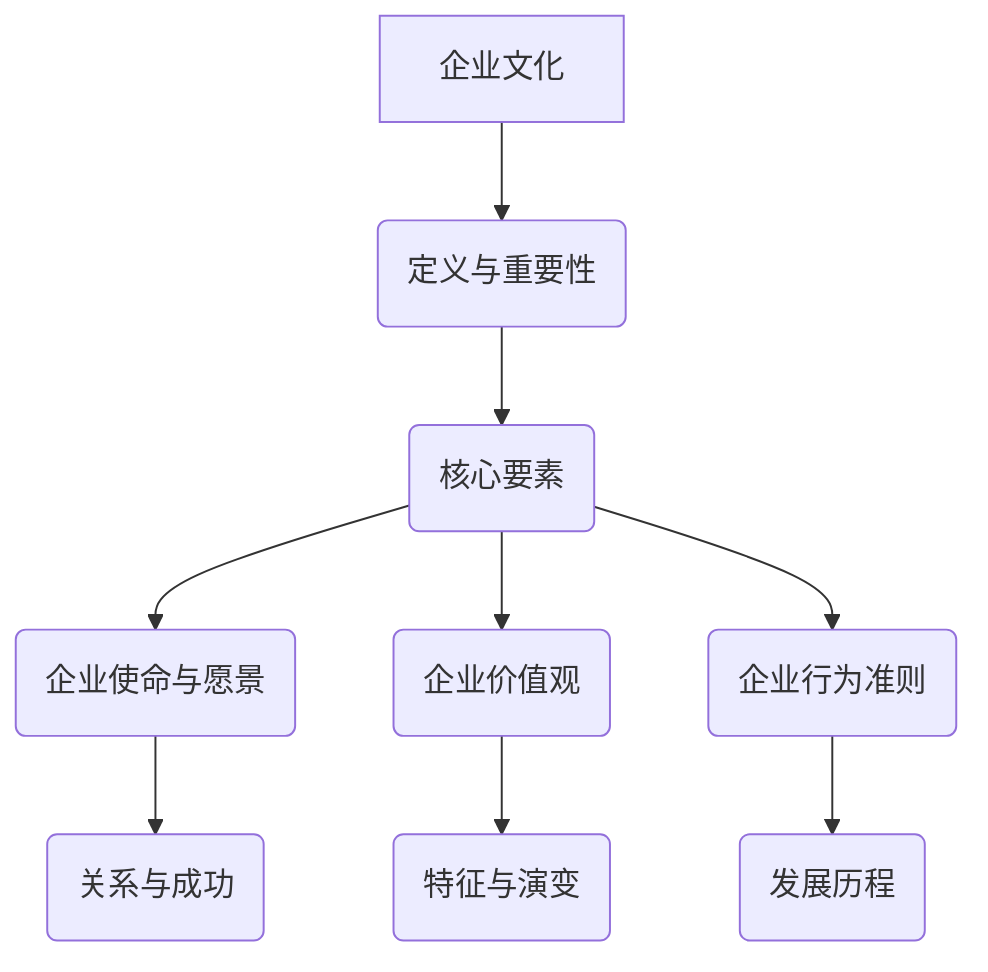

                 

# 《如何建立创业公司的企业文化》

## 关键词：
创业公司、企业文化、核心价值观、企业使命与愿景、文化建设方法、成功案例

## 摘要：
本文旨在深入探讨如何建立创业公司的企业文化。通过分析企业文化的基础理论、建设步骤、工具与方法，以及企业文化与创业公司发展的关系，本文提供了系统化的指导，帮助创业公司在快速发展的同时，培育出具有凝聚力和创新力的企业文化。

### 目录大纲

- 第一部分：企业文化的基础理论
  - 1.1 企业文化的定义与重要性
  - 1.2 企业文化的核心要素
  - 1.3 企业文化理论的发展与演变
  - 1.4 企业文化架构的Mermaid流程图

- 第二部分：建立企业文化的步骤
  - 2.1 企业文化建设的准备
  - 2.2 核心价值观的确立
  - 2.3 企业使命与愿景的制定
  - 2.4 企业文化的落地实施

- 第三部分：企业文化建设的工具与方法
  - 3.1 企业文化建设的方法
  - 3.2 企业文化建设工具的应用
  - 3.3 企业文化建设的成功案例

- 第四部分：企业文化与创业公司发展
  - 4.1 企业文化与创业公司的关系
  - 4.2 创业公司在不同发展阶段的挑战与应对策略

### 第一部分：企业文化的基础理论

#### 1.1 企业文化的定义与重要性

##### 1.1.1 企业文化的定义

企业文化是指企业在长期经营过程中，逐步形成的具有独特性和内在一致性的价值观、信仰、规范和行为模式。它不仅体现在企业的日常运营中，还渗透到企业的战略决策、组织管理、员工行为和客户关系等多个方面。

##### 1.1.2 企业文化与组织成功的关系

企业文化对企业的成功具有深远的影响。首先，它能够提高员工的凝聚力和忠诚度，促进团队合作和创新；其次，企业文化有助于建立良好的企业形象和品牌价值，提升企业的市场竞争力和吸引力；最后，企业文化能够引导企业在面对外部挑战和内部变革时，保持稳定和持续的发展。

##### 1.1.3 企业文化的类型

企业文化可以按照不同的维度进行分类，常见的类型包括：
- 强型文化（Strong Culture）：企业内部有明确的价值观和行为准则，员工普遍认同并遵循；
- 弱型文化（Weak Culture）：企业内部的价值观和行为准则相对模糊，员工更多地依赖个人经验和判断；
- 集权文化（Authoritative Culture）：企业决策高度集中，权力和资源集中在高层管理者手中；
- 民主文化（Democratic Culture）：企业决策更注重集体讨论和共识，员工有更多的参与和决策权。

#### 1.2 企业文化的核心要素

##### 1.2.1 企业使命与愿景

企业使命是企业存在的根本原因和目的，它回答了“企业为什么要存在”的问题。企业愿景则是企业未来想要实现的长期目标和理想状态，它描绘了企业未来的发展前景和方向。

##### 1.2.2 企业价值观

企业价值观是企业员工共同遵循的行为准则和信念，它体现了企业的核心价值观和理念。企业价值观包括诚信、创新、客户至上、团队合作等多个方面。

##### 1.2.3 企业行为准则

企业行为准则是企业对员工行为的具体规范和要求，它明确了员工在工作中的行为规范和道德标准。企业行为准则有助于维护企业的稳定和秩序，提升企业的整体形象。

#### 1.3 企业文化理论的发展与演变

##### 1.3.1 西方企业文化理论的发展

西方企业文化理论起源于20世纪60年代，早期的企业文化理论主要关注企业的内部管理。随着管理学和心理学的发展，企业文化理论逐渐形成了一套完整的体系，涵盖了企业使命、愿景、价值观、行为准则等多个方面。

##### 1.3.2 东方企业文化理论的演进

东方企业文化理论在近年来得到了广泛的关注和研究。与西方企业文化理论相比，东方企业文化理论更强调人际关系和人文关怀，注重企业的社会责任和可持续发展。

##### 1.3.3 新时代企业文化的特征

新时代企业文化的特征主要体现在以下几个方面：
- 全球化：企业文化越来越具有全球化特征，企业需要适应不同国家和地区的文化差异；
- 科技驱动：科技进步对企业文化产生了深远的影响，企业需要不断创新和适应新的技术环境；
- 创新导向：企业文化越来越注重创新，企业鼓励员工勇于尝试和探索，推动企业持续发展。

#### 1.4 企业文化架构的Mermaid流程图

在下一部分中，我们将详细探讨建立企业文化的步骤，包括企业文化建设准备、核心价值观的确立、企业使命与愿景的制定，以及企业文化的落地实施。让我们继续深入探讨这一重要话题。|>

