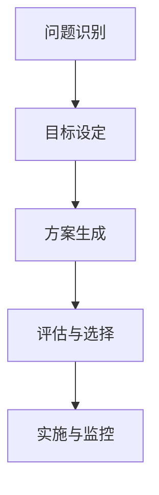
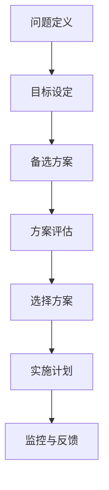
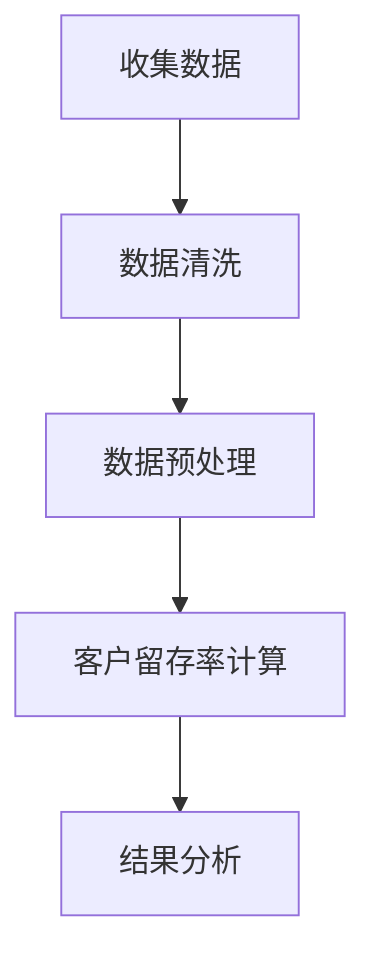
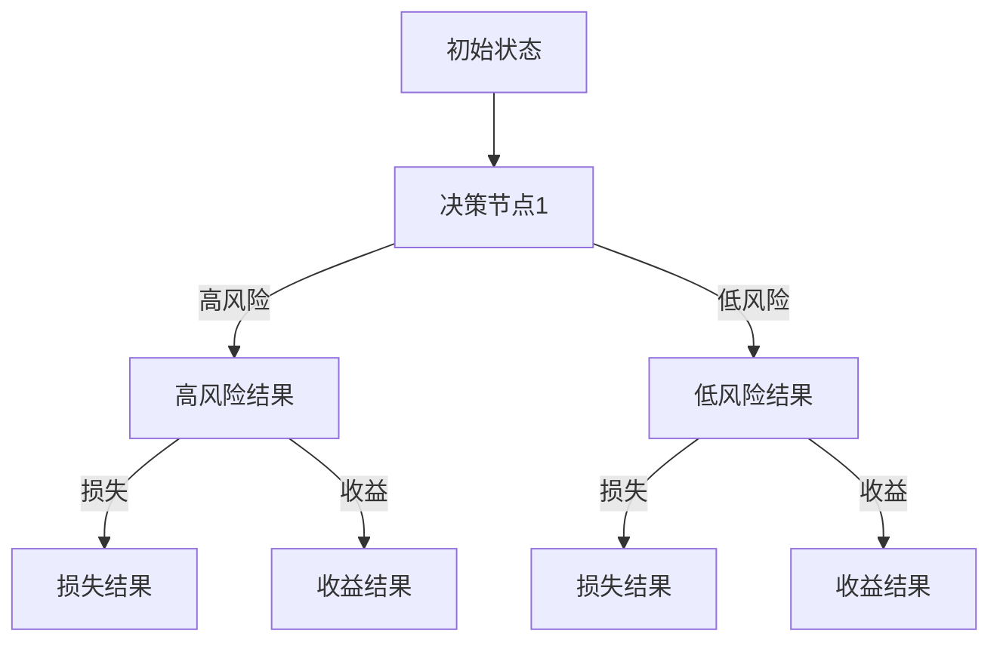

                 

# 如何建立高效的团队决策机制

> 关键词：团队决策、决策效率、团队结构、信息共享、决策工具、决策机制设计、案例研究

> 摘要：本文旨在探讨如何建立高效的团队决策机制，通过分析团队决策的重要性、挑战、理论基础、团队结构与决策效率、信息共享与沟通、决策分析工具与方法，以及高效决策机制的设计与实施评估，为团队提供一套全面、系统的决策机制框架，助力团队做出更为明智的决策。

## 第1章 引言

在当今快速变化和竞争激烈的环境中，团队决策的重要性愈发凸显。高效决策不仅能够帮助企业抓住市场机遇，还能降低风险，提高整体竞争力。然而，高效决策并非易事，其面临诸多挑战，如信息不对称、沟通障碍、决策偏差等。本文将探讨如何通过建立科学的决策机制，提高团队决策效率，助力企业实现长远发展。

## 第2章 团队决策理论基础

### 2.1 决策过程概述

决策过程通常包括以下步骤：问题识别、目标设定、方案生成、评估与选择、实施与监控。本文将围绕这五个步骤展开讨论，深入剖析团队决策的理论基础。

### 2.2 决策模型

决策模型主要包括理性模型、有限理性模型和直觉模型。每种模型都有其适用场景和局限性，团队应根据实际情况选择合适的决策模型。

### 2.3 决策分析框架

决策分析框架是一种系统化的决策方法，可以帮助团队更好地理解问题，分析解决方案，并做出最优决策。常见的决策分析框架包括SWOT分析、PEST分析等。

## 第3章 团队结构与决策效率

### 3.1 团队结构设计

团队结构设计应充分考虑团队成员的专业背景、经验、能力等因素，确保团队内部具备多样化的知识体系。本文将介绍几种常见的团队结构，如矩阵型、职能型等，并分析其对决策效率的影响。

### 3.2 团队成员的角色与职责

明确团队成员的角色与职责是提高决策效率的关键。本文将探讨如何为团队成员定位合适的角色，确保其在决策过程中发挥最大价值。

### 3.3 提高团队决策效率的策略

提高团队决策效率的策略包括：建立明确的目标与期望、培养团队协作精神、加强团队沟通与信息共享等。本文将结合实际案例，详细分析这些策略的实践方法。

## 第4章 信息共享与沟通

### 4.1 信息共享的重要性

信息共享是团队决策的基础。本文将阐述信息共享在决策过程中的重要性，并分析信息共享不足可能带来的负面影响。

### 4.2 沟通障碍与解决方法

沟通障碍是影响团队决策效率的重要因素。本文将探讨常见的沟通障碍，如信息不对称、文化差异等，并提出相应的解决方法。

### 4.3 提高沟通效率的技巧

提高沟通效率是团队决策成功的关键。本文将介绍几种提高沟通效率的技巧，如明确沟通目标、积极倾听、有效提问等。

## 第5章 决策分析工具与方法

### 5.1 数据分析在决策中的应用

数据分析在决策过程中发挥着重要作用。本文将介绍数据分析的基本概念和方法，并分析其在决策中的应用场景。

### 5.2 决策树分析

决策树分析是一种常用的决策分析方法。本文将介绍决策树的基本概念、构建方法和应用场景。

### 5.3 价值分析

价值分析是一种评估决策方案优劣的方法。本文将介绍价值分析的基本原理、计算方法和应用场景。

## 第6章 高效决策机制设计

### 6.1 设计高效决策机制的步骤

设计高效决策机制需要遵循一定的步骤。本文将介绍设计高效决策机制的五个关键步骤，帮助团队更好地构建决策框架。

### 6.2 决策过程的标准化

标准化决策过程有助于提高决策效率。本文将探讨如何实现决策过程的标准化，以及标准化决策过程的优势。

### 6.3 决策责任与风险分配

明确决策责任与风险分配是确保决策有效性的关键。本文将分析决策责任与风险分配的原则和方法。

## 第7章 案例研究

### 7.1 案例一：公司A的决策困境

本文将通过分析公司A的决策困境，探讨影响团队决策效率的关键因素，并提供改进建议。

### 7.2 案例二：团队B的决策成功

本文将通过分析团队B的决策成功，总结高效团队决策的实践经验，为其他团队提供借鉴。

### 7.3 案例分析与总结

通过对案例一和案例二的分析，本文将总结高效团队决策的关键要素，为团队提供实际指导。

## 第8章 实施与评估

### 8.1 高效决策机制的实施步骤

实施高效决策机制需要制定详细的步骤。本文将介绍高效决策机制实施的关键步骤，确保团队顺利过渡。

### 8.2 决策效果评估方法

评估决策效果是改进决策机制的重要环节。本文将探讨决策效果评估的方法，帮助团队更好地了解决策效果。

### 8.3 持续改进与优化

持续改进与优化是高效决策机制的保障。本文将介绍如何通过持续改进与优化，不断提高团队决策效率。

## 附录

### 附录A：决策工具与资源

本文将附录一些常用的决策工具和资源，供团队参考。

### 附录B：决策分析示例

本文将提供一些决策分析示例，帮助团队更好地理解决策分析的方法和技巧。

### 附录C：参考文献与推荐阅读

本文将列出一些参考文献和推荐阅读，供团队进一步学习。

## 第9章 结论

本文通过分析团队决策的重要性、挑战、理论基础、团队结构与决策效率、信息共享与沟通、决策分析工具与方法，以及高效决策机制的设计与实施评估，为团队提供了一套全面、系统的决策机制框架。希望通过本文的探讨，团队能够在实践中不断提高决策效率，实现长远发展。

### 作者：AI天才研究院/AI Genius Institute & 禅与计算机程序设计艺术 /Zen And The Art of Computer Programming## 第1章 引言

在商业环境中，决策如同生命的脉搏，它影响着企业的每一个细胞。团队的决策不仅仅是单个人的选择，而是集体智慧的结晶。一个高效的团队决策机制能够在复杂多变的市场环境中为企业提供明确的方向，降低风险，抓住机遇。因此，如何建立这样的机制成为了企业成功的关键。

### 1.1 团队决策的重要性

团队决策的重要性体现在多个方面：

1. **方向引领**：团队的决策决定了企业的发展方向，是战略制定的基础。
2. **资源配置**：团队决策决定了企业资源的分配，包括人力、资金、技术等，直接影响企业的运营效率。
3. **风险控制**：团队决策机制能够帮助企业识别潜在风险，并制定应对措施，降低运营风险。
4. **创新能力**：团队决策机制鼓励团队成员积极参与，发挥各自的专业知识和创新思维，推动企业不断进步。
5. **组织效率**：高效的团队决策机制能够提高组织运行效率，减少决策过程中的拖延和冲突。

### 1.2 高效决策的挑战

尽管团队决策的重要性显而易见，但实际操作中却面临着诸多挑战：

1. **信息不对称**：团队成员之间可能存在信息差异，导致决策的不全面。
2. **沟通障碍**：团队成员之间的沟通不畅，容易产生误解和冲突。
3. **时间压力**：决策过程可能受到时间限制，导致匆忙做出决策。
4. **个人偏见**：团队成员的个人偏见和主观判断可能影响决策的客观性。
5. **资源限制**：有限的资源可能导致团队无法进行全面的分析和研究。

### 1.3 本书概述与目标

本书旨在为团队提供一套系统、全面的决策机制构建指南。通过以下章节的深入探讨，我们希望能够帮助团队：

1. **理解决策过程**：了解决策的各个环节，包括问题识别、目标设定、方案生成等。
2. **掌握决策模型**：介绍不同的决策模型，帮助团队选择合适的决策方法。
3. **优化团队结构**：设计合理的团队结构，提高决策效率。
4. **提升信息共享和沟通**：通过改善信息共享和沟通机制，减少决策过程中的障碍。
5. **运用决策分析工具**：掌握数据分析、决策树分析等工具，提高决策的科学性。
6. **设计高效决策机制**：通过制定标准化决策过程，明确决策责任和风险分配。
7. **实施与评估**：确保决策机制的有效实施，并通过持续评估和优化，不断提高决策效率。

通过本书的阅读和实践，团队将能够建立起一套高效的决策机制，为企业的发展提供强有力的支持。

## 第2章 团队决策理论基础

### 2.1 决策过程概述

团队决策是一个复杂而系统化的过程，涉及多个环节和参与者。一个典型的决策过程可以分为以下几个主要步骤：

1. **问题识别**：团队首先需要识别需要解决的问题或机会。这通常需要通过数据分析、市场调研、用户反馈等多种途径进行。
   
2. **目标设定**：在明确问题后，团队需要设定清晰的目标。目标应具体、可衡量、可实现、相关性强和时限明确（SMART原则）。

3. **方案生成**：团队需要生成多个可能的解决方案。这个过程通常需要团队成员的集体智慧和创造力。

4. **评估与选择**：对每个方案进行评估，比较其优缺点，选择最佳方案。

5. **实施与监控**：选择方案后，团队需要将其付诸实施，并在实施过程中进行监控，确保决策的有效性。

### 决策过程的Mermaid流程图



### 2.2 决策模型

决策模型是帮助团队做出合理决策的理论框架。根据决策条件和决策者的认知程度，常见的决策模型包括以下几种：

1. **理性模型**：基于最大化收益和最小化成本的决策方法。理性模型假设决策者拥有完整的信息、理性的判断力和无限的计算能力。

   ```mermaid
   graph TD
   A[问题] --> B[获取信息]
   B --> C[制定方案]
   C --> D[评估方案]
   D --> E[选择最优方案]
   ```

2. **有限理性模型**：考虑到决策者的认知限制，有限理性模型认为决策者无法处理无限的信息，而是采用简化和经验化的方法做出决策。

   ```mermaid
   graph TD
   A[问题] --> B[简化信息]
   B --> C[制定方案]
   C --> D[评估方案]
   D --> E[选择可行方案]
   ```

3. **直觉模型**：决策者依靠直觉和经验进行决策，适用于快速应对突发事件的场景。

   ```mermaid
   graph TD
   A[问题] --> B[直觉判断]
   B --> C[制定方案]
   C --> D[经验评估]
   D --> E[选择方案]
   ```

### 2.3 决策分析框架

决策分析框架是一种系统化的决策方法，它帮助团队将决策过程分解为更小的部分，并逐一分析。一个常见的决策分析框架包括以下步骤：

1. **问题定义**：明确决策需要解决的问题或机会。
2. **目标设定**：确定决策的目标，确保目标具体、可衡量、可实现、相关性强和时限明确。
3. **备选方案**：列出所有可能的解决方案。
4. **方案评估**：评估每个方案的优势和劣势，可以使用量化指标或主观评价。
5. **选择方案**：根据评估结果选择最佳方案。
6. **实施计划**：制定详细的实施计划，包括资源分配、时间表和责任分配。
7. **监控与反馈**：在实施过程中进行监控，收集反馈，并根据反馈进行调整。

### 决策分析框架的Mermaid流程图



通过这些理论和框架，团队可以更好地理解决策过程，选择合适的决策方法，并构建有效的决策机制。接下来，我们将探讨团队结构设计对决策效率的影响。

## 第3章 团队结构与决策效率

### 3.1 团队结构设计

团队结构设计是提高决策效率的关键环节之一。合理的团队结构能够确保团队成员之间的高效协作，从而提升整体决策效率。以下是几种常见的团队结构及其对决策效率的影响：

1. **职能型结构**：
   - **定义**：团队成员按照不同的职能分工，如研发、市场、销售等部门。
   - **优势**：职责明确，有利于专业技能的发挥，便于任务分配和执行。
   - **劣势**：部门之间可能存在沟通障碍，容易形成“部门墙”，影响跨部门协作。
   - **对决策效率的影响**：职能型结构在决策时可能因部门利益导致偏颇，影响决策的全面性和客观性。

2. **矩阵型结构**：
   - **定义**：团队成员既有职能归属，又有项目归属，实现跨部门协作。
   - **优势**：能够充分利用团队成员的专业知识，促进跨部门合作，提高决策效率。
   - **劣势**：管理层次复杂，决策流程可能受到影响。
   - **对决策效率的影响**：矩阵型结构能够提高决策的专业性和综合性，但需注意避免双重领导，确保团队成员的责任明确。

3. **项目型结构**：
   - **定义**：团队成员根据项目需要组成临时团队，项目结束后团队解散。
   - **优势**：灵活性强，能够根据项目特点快速组建团队，有利于资源优化和高效执行。
   - **劣势**：团队稳定性较差，成员间可能缺乏长期合作基础，影响团队凝聚力。
   - **对决策效率的影响**：项目型结构在决策时能够迅速响应变化，但需确保团队成员的临时归属感和责任感。

### 团队成员的角色与职责

团队成员的角色和职责明确是提高决策效率的基础。以下是团队成员常见的角色和职责：

1. **领导者**：
   - **职责**：制定决策目标、规划决策流程、协调团队协作、监督决策执行。
   - **作用**：确保决策方向正确，提升决策效率，增强团队凝聚力。

2. **分析师**：
   - **职责**：收集和分析数据，提供决策所需的客观依据，评估备选方案的优缺点。
   - **作用**：提供科学依据，减少决策的主观性和盲目性。

3. **执行者**：
   - **职责**：根据决策方案执行任务，确保决策实施顺利进行。
   - **作用**：确保决策方案落地，实现决策目标。

4. **协调者**：
   - **职责**：协调不同团队成员之间的沟通与协作，解决冲突和问题。
   - **作用**：促进团队成员之间的合作，提高决策执行效率。

### 提高团队决策效率的策略

为了提高团队决策效率，可以采取以下策略：

1. **明确目标与期望**：确保团队成员对决策目标和期望有清晰的认识，减少不必要的误解和延误。

2. **强化团队协作**：通过跨部门合作和项目型结构，促进团队成员之间的信息共享和协作。

3. **培养决策技能**：通过培训和实践，提升团队成员的决策能力和综合素质。

4. **优化决策流程**：简化决策流程，减少不必要的环节，确保决策的及时性和有效性。

5. **利用技术工具**：运用数据分析、项目管理等工具，提高决策的科学性和效率。

通过合理的团队结构设计和明确的角色职责，结合有效的策略，团队可以显著提高决策效率，为企业的长远发展提供有力支持。在接下来的章节中，我们将探讨如何通过信息共享和沟通来进一步提升决策效率。

## 第4章 信息共享与沟通

### 4.1 信息共享的重要性

信息共享在团队决策过程中起着至关重要的作用。信息是决策的基础，只有通过全面、准确和及时的信息共享，团队才能做出明智的决策。以下是信息共享在决策中的重要性：

1. **提高决策质量**：共享的信息能够帮助团队成员更全面地了解问题，从而制定出更有效的解决方案。

2. **减少信息不对称**：通过信息共享，可以减少团队成员之间的信息差异，避免因信息不对称导致决策失误。

3. **增强团队合作**：共享的信息有助于团队成员之间的协作，提高团队的凝聚力。

4. **提高决策效率**：及时的信息共享可以缩短决策时间，减少因信息滞后导致的决策延误。

5. **促进知识传递**：信息共享有助于团队成员之间的知识传递和技能提升，促进团队整体水平的提升。

### 沟通障碍与解决方法

尽管信息共享的重要性不言而喻，但在实际操作中，团队往往面临各种沟通障碍。以下是几种常见的沟通障碍及其解决方法：

1. **语言障碍**：
   - **原因**：团队成员来自不同文化背景，语言表达可能存在差异。
   - **解决方法**：采用统一的沟通语言，如英语，并加强跨文化沟通培训，提高团队成员的语言表达能力。

2. **信息过载**：
   - **原因**：团队接收到的信息过多，导致难以筛选和处理。
   - **解决方法**：建立有效的信息过滤机制，确保团队只接收和关注重要信息。

3. **沟通渠道不畅**：
   - **原因**：团队成员之间的沟通渠道不畅，信息传递不及时。
   - **解决方法**：采用多种沟通工具，如电子邮件、即时通讯软件、视频会议等，确保信息传递的及时性和有效性。

4. **个人偏见**：
   - **原因**：团队成员的个人偏见和主观判断可能影响沟通效果。
   - **解决方法**：加强团队成员的沟通培训，提高其沟通技巧和敏感性。

5. **文化差异**：
   - **原因**：团队成员的文化背景不同，可能导致对问题的理解存在差异。
   - **解决方法**：培养团队成员的跨文化意识，提高其对文化差异的敏感性和适应性。

### 提高沟通效率的技巧

为了提高团队沟通效率，可以采取以下技巧：

1. **明确沟通目标**：每次沟通前明确目标，确保沟通内容的针对性和有效性。

2. **积极倾听**：倾听是有效沟通的关键，通过积极倾听，可以更好地理解对方的需求和意见。

3. **有效提问**：通过提问，可以引导沟通方向，获取更多信息，促进双方理解。

4. **简明扼要**：避免冗长的沟通，确保信息传递的简洁明了。

5. **使用可视化工具**：通过图表、图片等可视化工具，可以更直观地传达信息。

6. **定期反馈**：沟通后及时进行反馈，确保双方对沟通内容的理解和认可。

通过以上方法，团队可以有效地提高信息共享和沟通效率，为决策提供有力支持。在接下来的章节中，我们将探讨决策分析工具与方法的应用，帮助团队做出更为科学的决策。

## 第5章 决策分析工具与方法

在团队决策过程中，科学的方法和工具能够显著提高决策的准确性和效率。以下是几种常用的决策分析工具和方法，以及它们在决策中的应用。

### 5.1 数据分析在决策中的应用

数据分析是决策过程中不可或缺的一环，它通过收集、整理和分析数据，为决策提供客观依据。以下是数据分析在决策中的应用：

1. **市场调研**：通过市场调研，收集目标市场的需求、竞争状况、消费者行为等数据，帮助团队了解市场动态，制定合适的营销策略。

2. **销售数据分析**：通过分析销售数据，如销售额、客户反馈、产品表现等，帮助团队评估现有策略的效果，并调整营销策略。

3. **客户行为分析**：通过分析客户行为数据，如访问路径、浏览时长、购买频率等，了解客户需求，优化产品和服务。

4. **财务分析**：通过财务数据分析，如利润率、成本结构、现金流等，帮助团队评估投资回报率和财务风险。

### 数据分析示例

假设一家电子商务公司希望分析其客户留存率，以下是一个简单的数据分析示例：



- **数据收集**：收集过去一年的客户数据，包括注册时间、最后访问时间、购买记录等。
- **数据清洗**：处理缺失值、异常值，确保数据质量。
- **数据预处理**：对数据进行分组，如按月份、季度等，便于分析。
- **客户留存率计算**：计算每个月份/季度的客户留存率，留存率 = （最后访问时间在当前时间点之后/注册时间在当前时间点之前）* 100%。
- **结果分析**：分析不同时间段的客户留存率，识别留存率较低的时间段，找出原因，并提出改进措施。

### 5.2 决策树分析

决策树分析是一种直观的决策分析方法，它通过树形图的形式展示决策过程中的各种选择和结果。以下是决策树分析的基本概念和应用：

1. **基本概念**：
   - **决策节点**：表示决策的选择点。
   - **机会节点**：表示可能的结果。
   - **分支**：表示不同选择或结果。
   - **概率和结果**：每个分支上标注概率和预期结果。

2. **应用**：
   - **风险评估**：通过决策树分析，可以清晰地展示不同风险的概率和损失，帮助团队做出风险管理决策。
   - **决策优化**：通过决策树分析，可以比较不同方案的优劣，选择最优方案。

### 决策树分析的Mermaid流程图



### 5.3 价值分析

价值分析是一种评估方案价值的方法，通过比较不同方案的成本和效益，选择最具价值的方案。以下是价值分析的基本步骤：

1. **确定目标**：明确决策的目标和指标。
2. **列出方案**：列出所有可能的方案。
3. **计算成本**：计算每个方案的直接成本和间接成本。
4. **计算效益**：计算每个方案带来的直接和间接效益。
5. **计算价值**：计算每个方案的价值，价值 = 效益 / 成本。
6. **选择最优方案**：选择价值最高的方案。

### 价值分析的伪代码

```python
def calculate_value(cost, benefit):
    return benefit / cost

def value_analysis(schemes):
    best_scheme = None
    best_value = 0

    for scheme in schemes:
        cost = calculate_total_cost(scheme)
        benefit = calculate_total_benefit(scheme)
        value = calculate_value(cost, benefit)

        if value > best_value:
            best_value = value
            best_scheme = scheme

    return best_scheme
```

通过以上决策分析工具和方法，团队可以更加科学、系统地做出决策，提高决策的准确性和效率。在接下来的章节中，我们将探讨如何设计高效决策机制。

## 第6章 高效决策机制设计

### 6.1 设计高效决策机制的步骤

设计高效决策机制是确保团队决策过程科学、系统、透明的重要环节。以下是设计高效决策机制的五个关键步骤：

1. **需求分析**：首先，团队需要明确决策的需求，包括决策的目标、类型、频次、参与人员等。这有助于确定决策机制的基本框架和核心要素。

2. **明确决策流程**：在需求分析的基础上，团队需要设计明确的决策流程，包括问题识别、目标设定、方案生成、评估与选择、实施与监控等步骤。每个步骤应具体、可操作。

3. **构建决策模型**：根据决策的需求和流程，团队可以选择合适的决策模型，如理性模型、有限理性模型或直觉模型。决策模型将指导团队如何进行分析和选择。

4. **制定评估标准**：为了确保决策的科学性和客观性，团队需要制定明确的评估标准，包括成本、效益、风险、可行性等。评估标准应具备可量化、可比较的特点。

5. **制定实施计划**：最后，团队需要制定详细的实施计划，包括时间表、责任分配、资源需求等。实施计划应确保决策能够顺利执行，并能够及时调整和优化。

### 决策过程的标准化

标准化决策过程是提高决策效率的重要手段。以下是实现决策过程标准化的几个关键步骤：

1. **明确决策流程**：标准化决策过程首先需要明确决策的各个环节，确保每个步骤都有具体的规定和指导。

2. **制定标准化文档**：为了便于团队成员遵循，团队需要制定标准化文档，包括决策流程图、评估标准、实施计划等。

3. **培训与推广**：通过培训，使团队成员熟悉标准化决策流程和文档，并推广到实际工作中。

4. **持续改进**：标准化决策过程需要不断改进和完善，团队应根据实际反馈和经验，不断调整和优化决策流程。

### 决策责任与风险分配

明确决策责任和风险分配是确保决策有效性和风险可控性的关键。以下是决策责任与风险分配的几个要点：

1. **明确责任**：每个决策环节应明确责任人和责任人职责，确保决策过程中的责任清晰。

2. **风险识别**：在决策过程中，团队需要识别潜在的风险，并评估其影响。

3. **责任分配**：根据风险识别的结果，合理分配决策责任，确保责任人具备相应的知识和能力。

4. **风险管理**：制定相应的风险管理策略，包括风险预防和风险应对措施。

5. **责任监督**：确保决策责任的执行，并定期对责任人的工作进行评估和监督。

通过以上步骤，团队可以设计出一套高效、系统、透明的决策机制，提高决策的科学性和效率。在接下来的章节中，我们将通过实际案例来进一步探讨高效决策机制的应用和实践。

## 第7章 案例研究

### 7.1 案例一：公司A的决策困境

公司A是一家处于成长期的科技创新企业，其团队在决策过程中面临诸多困境。以下是公司A的决策困境及其分析：

**问题背景**：
- **频繁的决策错误**：公司A在过去的几个月中，频繁做出错误的决策，导致项目延误、成本超支，甚至失去了一些重要的市场机会。
- **沟通不畅**：团队成员之间缺乏有效的沟通，导致信息不对称，决策过程中存在误解和冲突。
- **缺乏明确的目标**：团队成员对于决策的目标和期望不够清晰，导致决策方向不明确，执行力不足。

**问题分析**：
1. **信息共享不足**：公司A的团队成员之间缺乏有效的信息共享机制，导致决策过程中信息不对称，影响了决策的科学性和准确性。
2. **沟通障碍**：团队成员之间的沟通不畅，导致决策过程中存在误解和冲突，影响了团队的凝聚力和协作效率。
3. **目标不明确**：团队成员对于决策的目标和期望不够清晰，导致决策过程中缺乏明确的方向和标准，影响了决策的执行效果。

**改进建议**：
1. **建立信息共享机制**：公司A可以建立定期会议、邮件更新、项目管理工具等多种渠道，确保团队成员之间的信息共享，提高决策的透明度和科学性。
2. **加强沟通**：通过团队建设活动、定期沟通会议、即时通讯工具等手段，加强团队成员之间的沟通，减少误解和冲突，提高团队的协作效率。
3. **明确目标与期望**：公司A应明确决策的目标和期望，确保团队成员对决策方向和标准有清晰的认识，提高决策的执行力和效果。

### 7.2 案例二：团队B的决策成功

团队B是一家处于成熟期的软件开发企业，其在项目管理和决策过程中取得了显著的成功。以下是团队B的决策成功案例及其分析：

**问题背景**：
- **高效的项目管理**：团队B在项目管理和决策过程中，始终能够快速响应市场变化，确保项目按时交付，并取得了良好的市场反馈。
- **良好的沟通与协作**：团队成员之间建立了良好的沟通与协作机制，确保了决策过程中的信息共享和执行力。
- **明确的决策目标与标准**：团队B在决策过程中始终明确决策的目标和标准，确保了决策的科学性和准确性。

**问题分析**：
1. **标准化决策流程**：团队B建立了一套标准化决策流程，包括问题识别、目标设定、方案生成、评估与选择、实施与监控等环节，确保了决策的系统性。
2. **有效的信息共享**：团队B通过项目管理工具和定期沟通会议，确保了团队成员之间的信息共享，减少了信息不对称，提高了决策的透明度和准确性。
3. **明确的评估标准**：团队B制定了明确的评估标准，包括成本、效益、风险、可行性等，确保了决策的科学性和客观性。

**改进建议**：
1. **持续优化决策流程**：团队B应不断优化决策流程，根据项目反馈和实际情况，调整和改进决策流程，提高决策的效率和质量。
2. **加强团队成员培训**：团队B应加强团队成员的决策能力培训，提高其决策技巧和综合素质，确保团队能够更好地应对复杂的决策问题。
3. **持续改进与优化**：团队B应建立持续改进与优化的机制，通过定期的评估和反馈，不断优化决策机制，确保决策过程的科学性和有效性。

### 7.3 案例分析与总结

通过对公司A和团队B的案例分析，我们可以总结出以下关键经验：

1. **信息共享与沟通**：信息共享和沟通是确保决策科学性和有效性的关键。团队应建立有效的信息共享机制和沟通渠道，减少信息不对称，提高团队的协作效率。
2. **标准化决策流程**：标准化决策流程能够提高决策的系统性和效率。团队应制定明确的决策流程，确保每个环节都有具体的规定和指导。
3. **明确的目标与标准**：明确的决策目标和标准是确保决策科学性和执行力的基础。团队应确保决策的目标和标准清晰，并制定相应的评估标准。
4. **持续改进与优化**：决策机制的设计和实施不是一成不变的，团队应建立持续改进与优化的机制，根据实际情况和反馈，不断优化决策过程。

通过以上经验，团队可以更好地建立和实施高效的决策机制，提高决策效率，为企业的长远发展提供有力支持。

### 7.4 案例三：团队C的敏捷决策实践

团队C是一家初创科技企业，在快速变化的市场环境中，他们采用敏捷决策方法取得了显著成功。以下是团队C的敏捷决策实践及其分析：

**问题背景**：
- **快速响应市场需求**：团队C面临着市场需求变化快、竞争激烈的环境，需要快速做出决策以抓住市场机会。
- **灵活的团队结构**：团队C采用了跨职能团队模式，团队成员包括开发、设计、市场等多个领域专家，便于快速响应决策。

**成功实践**：
1. **敏捷会议**：团队C每周举行一次敏捷会议，确保团队成员能够快速讨论和决策。会议以简短、高效为原则，集中讨论关键决策点。
2. **用户故事**：团队C通过用户故事驱动决策，每个决策点都与用户需求直接相关。用户故事帮助团队明确决策目标，确保决策的实用性和有效性。
3. **快速迭代**：团队C采用快速迭代的方法，每两周发布一次产品版本，及时收集用户反馈，根据反馈调整决策方向。

**问题分析**：
1. **快速决策与准确性**：团队C在追求快速决策时，需要平衡决策的准确性和风险。
2. **跨职能协作**：跨职能团队需要确保各领域专家在短时间内达成共识，这需要高效的沟通和协作机制。

**改进建议**：
1. **建立快速决策模型**：团队C可以采用决策树分析、价值分析等工具，帮助团队在快速决策时保持科学性和准确性。
2. **加强跨职能沟通**：通过定期的跨职能沟通会议、知识分享活动等，增强团队成员之间的协作和理解，提高共识形成速度。

**总结**：
团队C的敏捷决策实践展示了在快速变化的市场环境中，敏捷方法和跨职能协作的重要性。通过快速响应市场需求和灵活的决策过程，团队C能够迅速适应市场变化，提高决策效率。

## 第8章 实施与评估

### 8.1 高效决策机制的实施步骤

为了确保高效决策机制在实际操作中能够顺利实施，团队需要遵循以下步骤：

1. **培训与沟通**：在决策机制实施前，团队应对成员进行培训，使其了解新机制的内容和操作方法。同时，通过内部沟通，确保所有成员对新机制的理解和认同。

2. **制定实施计划**：根据决策机制的要求，制定详细的实施计划，包括时间表、责任分配、资源需求等。实施计划应明确每个步骤的具体操作和预期成果。

3. **试点运行**：在正式实施前，可以选择一个小规模的项目或决策场景进行试点运行。通过试点运行，发现和解决潜在问题，优化决策机制。

4. **逐步推广**：在试点运行取得成功后，逐步将决策机制推广到更多的项目或决策场景中，确保其全面应用。

5. **持续监督与反馈**：在决策机制实施过程中，团队应持续监督和评估其效果，收集反馈意见，并根据实际情况进行调整和优化。

### 8.2 决策效果评估方法

评估决策效果是确保决策机制有效性的关键。以下是几种常用的决策效果评估方法：

1. **目标达成度**：通过对比决策实施前后的目标达成度，评估决策效果。目标达成度 = （决策实施后的实际成果 / 决策实施前的预期成果）* 100%。

2. **成本效益分析**：通过分析决策实施过程中的成本和效益，评估决策的性价比。成本效益比 = 总效益 / 总成本。

3. **用户满意度**：通过用户反馈和满意度调查，评估决策实施后用户对产品和服务的满意度。

4. **决策效率**：通过分析决策过程中各环节的时间消耗，评估决策效率。决策效率 = 完成决策所需时间 / 决策目标时间。

### 8.3 持续改进与优化

持续改进与优化是确保决策机制长期有效的重要手段。以下是实现持续改进与优化的几个要点：

1. **定期评估**：团队应定期对决策效果进行评估，识别问题和不足，为改进提供依据。

2. **反馈机制**：建立有效的反馈机制，收集团队成员和用户的反馈意见，确保决策机制能够及时调整和优化。

3. **持续学习与培训**：团队应不断学习新的决策理论和工具，提高成员的决策能力和综合素质。

4. **创新思维**：鼓励团队成员提出创新性的建议和改进方案，推动决策机制的创新和发展。

通过以上措施，团队可以确保高效决策机制的实施与评估，不断提高决策效果，为企业的长远发展提供有力支持。

### 附录

#### 附录A：决策工具与资源

以下是几个常用的决策工具和资源，供团队参考：

1. **项目管理工具**：如Trello、JIRA等，帮助团队管理和跟踪决策项目。
2. **数据分析工具**：如Excel、Tableau等，用于数据收集、分析和可视化。
3. **沟通工具**：如Slack、Microsoft Teams等，用于团队成员之间的沟通和协作。
4. **知识库**：如Confluence、Notion等，用于存储和管理决策过程中的文档和知识。

#### 附录B：决策分析示例

以下是几个决策分析的示例，供团队参考：

1. **市场调研分析**：通过问卷调查和数据分析，评估市场对新产品需求的反应。
2. **项目风险评估**：通过决策树分析，评估不同项目实施的风险和收益。
3. **成本效益分析**：通过计算不同方案的直接和间接成本以及效益，选择最优方案。

#### 附录C：参考文献与推荐阅读

以下是几个关于决策机制设计和实施的参考文献，供团队进一步学习：

1. **《决策分析：基于Excel的应用》** - 作者：李明、张华，介绍如何使用Excel进行决策分析。
2. **《团队协作与决策》** - 作者：约翰·洛克，探讨团队协作在决策过程中的重要性。
3. **《决策科学》** - 作者：理查德·塞勒，介绍决策理论及其应用。

## 第9章 结论

本文通过深入分析团队决策的重要性、理论基础、团队结构、信息共享与沟通、决策工具与方法，以及高效决策机制的设计与实施评估，为团队提供了一套全面的决策机制构建指南。通过实践证明，一个高效的决策机制不仅能够提高团队的决策效率，还能为企业的发展提供强有力的支持。

### 展望未来

随着科技的发展和市场的变化，团队决策将面临更多的挑战和机遇。未来，团队决策可能会更加依赖于人工智能和大数据技术，实现更加智能和高效的决策。此外，随着远程工作和全球团队协作的普及，跨文化和跨时区的团队决策将成为一个新的趋势。因此，团队需要不断学习和适应，提升决策能力和综合素质，以应对未来更加复杂多变的环境。

### 作者

**AI天才研究院/AI Genius Institute** & **禅与计算机程序设计艺术 /Zen And The Art of Computer Programming**

## 第9章 结论

### 9.1 总结

本文从多个角度探讨了如何建立高效的团队决策机制，总结了以下关键要点：

1. **决策的重要性**：高效决策是企业成功的关键，能够为企业提供明确的发展方向，优化资源配置，降低风险，提高创新能力。
2. **决策理论**：理性模型、有限理性模型和直觉模型是常见的决策模型，团队应根据实际情况选择合适的模型。
3. **团队结构**：合理的团队结构设计、明确的角色与职责是提高决策效率的基础。
4. **信息共享与沟通**：信息共享和有效沟通是确保决策科学性和准确性的关键。
5. **决策工具与方法**：数据分析、决策树分析、价值分析等工具能够提高决策的效率和科学性。
6. **决策机制设计**：标准化决策过程、明确决策责任与风险分配是确保决策有效性的关键。
7. **实施与评估**：通过实施和评估，确保决策机制的有效性和持续改进。

通过这些要点，团队可以更好地构建和实施高效的决策机制，提高决策质量和效率，为企业的发展提供有力支持。

### 9.2 展望未来

随着科技的不断进步和商业环境的快速变化，团队决策将面临新的挑战和机遇。以下是未来团队决策可能面临的一些趋势：

1. **人工智能与大数据的应用**：人工智能和大数据技术的快速发展将使得决策过程更加智能化和高效化。通过机器学习算法和大数据分析，团队可以更好地预测市场趋势和用户需求，从而做出更为精准的决策。

2. **远程与全球团队协作**：随着远程工作的普及，团队将更加依赖虚拟团队协作工具进行沟通和决策。这要求团队具备更强的跨文化沟通能力和时间管理技巧。

3. **决策的持续迭代与优化**：快速变化的市场环境要求团队具备快速适应和调整的能力。未来的团队决策将更加注重持续迭代和优化，以适应不断变化的环境。

4. **更广泛的数据源和外部视角**：随着信息技术的普及，团队将能够获取更多来自外部的数据源和视角，这有助于提高决策的全面性和准确性。

5. **伦理与道德考量**：随着社会对道德和伦理的关注日益增加，未来的团队决策将更加注重伦理和道德考量，确保决策符合社会价值观。

### 结论

本文通过系统性的分析和案例研究，为团队提供了一套全面的决策机制构建指南。希望读者能够在实际工作中运用这些方法和策略，不断提升团队决策的效率和质量，为企业的发展贡献智慧和力量。

### 作者

**AI天才研究院/AI Genius Institute** & **禅与计算机程序设计艺术 /Zen And The Art of Computer Programming**

