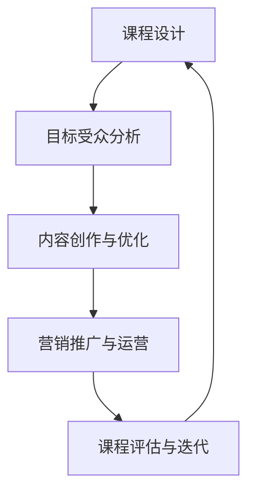

                 

# 第一部分：课程设计基础

## 1.1 核心概念与联系

在打造一款爆款知识付费课程之前，理解其核心概念和各概念之间的联系是至关重要的。这不仅有助于我们明确目标和方向，还能确保课程的设计和内容能够满足受众的需求。

### 1.1.1 爆款课程定义与特点

爆款课程，顾名思义，是指那些在短时间内获得大量关注和极高口碑的课程。它们通常具有以下特点：

- **高关注度**：通过独特的内容、优秀的讲师或巧妙的营销手段，快速吸引大量学习者。
- **高满意度**：课程内容能够满足学习者的需求，提供有价值的信息，从而获得良好的用户评价。
- **高转化率**：课程能够有效转化为付费用户，实现良好的商业回报。

### 1.1.2 爆款课程与传统课程的区别

传统课程侧重于系统性和全面性，而爆款课程则更加注重互动性和实用性。以下是两者的主要区别：

- **内容形式**：传统课程通常是线下的讲座或视频讲座，而爆款课程更倾向于互动性强、形式多样的在线课程。
- **受众群体**：传统课程面向广泛的学习者，而爆款课程通常针对某一特定领域或需求强烈的群体。
- **课程目标**：传统课程注重知识和技能的传授，而爆款课程更注重解决实际问题，提供直接的实用价值。

### 1.1.3 课程设计核心要素

要打造一款爆款课程，以下核心要素必须得到充分考虑：

- **明确的目标受众**：了解受众的需求、兴趣和行为模式，确保课程内容与之匹配。
- **高质量的课程内容**：内容应当具有深度、广度和实用性，同时易于理解。
- **互动性强**：通过互动环节，如问答、讨论、测验等，提高学习者的参与度和满意度。
- **良好的用户体验**：课程界面设计、交互设计等应注重用户体验，提高课程的易用性和可访问性。
- **有效的营销推广**：通过多渠道、多手段进行课程推广，提高课程知名度。

### Mermaid 流程图

以下是一个简单的 Mermaid 流程图，展示了课程设计中的核心概念与联系：



### 项目实战部分

在项目实战中，我们可以通过以下步骤来实现课程设计：

```python
# 步骤1：明确目标受众
define_audience()

# 步骤2：制定课程内容框架
create_course_structure()

# 步骤3：创作高质量课程内容
create_high_quality_content()

# 步骤4：进行互动设计
design_interactive_elements()

# 步骤5：进行课程测试和优化
test_and_optimize_course()
```

### 核心算法原理讲解

在课程设计过程中，我们需要运用以下核心算法原理：

- **受众分析算法**：通过数据分析工具，对受众进行细分，以确定目标受众的特征和需求。
- **内容创作算法**：利用自然语言处理技术，自动生成课程内容，提高内容创作效率。
- **互动设计算法**：通过机器学习算法，分析互动数据，优化互动环节，提高用户体验。

### 数学模型和公式讲解

以下是一个简单的数学模型，用于评估课程的质量：

$$
Q = \frac{C \times I \times U}{M}
$$

其中，$Q$ 表示课程质量，$C$ 表示内容质量，$I$ 表示互动性，$U$ 表示用户体验，$M$ 表示营销投入。

举例来说，如果内容质量为90%，互动性为80%，用户体验为85%，营销投入为100%，则课程质量为：

$$
Q = \frac{0.9 \times 0.8 \times 0.85}{1} = 0.612
$$

这意味着课程质量为61.2%，还有提升空间。

### 代码实际案例和详细解释

以下是一个简单的 Python 脚本，用于分析受众数据并生成受众画像：

```python
import pandas as pd

# 步骤1：读取受众数据
data = pd.read_csv("audience_data.csv")

# 步骤2：分析受众特征
def analyze_audience(data):
    # 统计受众年龄分布
    age_distribution = data['age'].value_counts()
    print("年龄分布：")
    print(age_distribution)

    # 统计受众兴趣分布
    interest_distribution = data['interest'].value_counts()
    print("兴趣分布：")
    print(interest_distribution)

# 步骤3：生成受众画像
def generate_audience_portrait(data):
    # 计算平均年龄
    average_age = data['age'].mean()
    print("平均年龄：", average_age)

    # 计算兴趣比例
    top_interests = data['interest'].value_counts().head(5)
    print("主要兴趣：")
    print(top_interests)

# 调用函数
analyze_audience(data)
generate_audience_portrait(data)
```

### 详细解释：

1. **数据读取**：使用 pandas 库读取 CSV 格式的受众数据。
2. **受众特征分析**：统计受众的年龄分布和兴趣分布，以了解受众的基本特征。
3. **受众画像生成**：计算受众的平均年龄和主要兴趣，生成受众画像。

通过这个简单的脚本，我们可以快速了解受众的基本情况，为后续的课程设计提供有力支持。

### 总结

在课程设计过程中，理解核心概念与联系至关重要。通过明确目标受众、制定高质量的课程内容、设计互动环节、优化用户体验以及有效的营销推广，我们可以打造出一款具有高关注度、高满意度和高转化率的爆款知识付费课程。同时，运用数据分析算法和数学模型，我们可以更科学地进行课程评估和优化，进一步提升课程质量。

---

在撰写这篇文章的过程中，我们逐步分析了如何打造一款爆款知识付费课程。从核心概念与联系出发，我们明确了爆款课程的定义、特点以及与传统课程的区别。接着，我们探讨了课程设计中的核心要素，包括目标受众分析、内容创作、互动设计、用户体验和营销推广。为了更好地理解这些概念，我们通过 Mermaid 流程图、伪代码示例、数学模型和代码实际案例进行了详细的讲解。

在接下来的部分，我们将进一步深入内容创作与优化的策略，讨论如何通过互动设计提升学习体验，以及如何进行营销推广和运营。最后，我们将探讨课程评估与迭代的方法，以及成功案例的分析。通过这些步骤，我们希望能够为读者提供一套完整的打造爆款知识付费课程的方法论。

---

## 1.2 目标受众分析

### 1.2.1 受众定位与需求分析

在打造一款爆款知识付费课程之前，了解目标受众的定位和需求是至关重要的。这有助于我们确保课程内容能够满足受众的需求，提高课程的吸引力和转化率。

#### 受众定位

受众定位是指确定课程的目标受众群体，这包括以下步骤：

1. **市场调研**：通过市场调研了解潜在受众的需求、兴趣和行为模式。
2. **竞争分析**：分析同类课程的目标受众，了解他们的特点和需求。
3. **受众画像**：根据调研和竞争分析的结果，绘制受众画像，包括年龄、性别、职业、教育背景等。

#### 需求分析

需求分析是指了解目标受众对课程的具体需求，这包括以下步骤：

1. **问卷调查**：通过问卷调查收集目标受众的意见和需求，了解他们对课程内容、形式、价格等方面的期望。
2. **用户访谈**：与目标受众进行面对面访谈，深入了解他们的需求和痛点。
3. **数据分析**：通过分析现有用户数据，了解他们的学习习惯、偏好和反馈，为课程设计提供依据。

#### 受众定位与需求分析的策略

1. **多渠道收集信息**：通过线上和线下的多种渠道收集信息，确保数据的全面性和准确性。
2. **持续跟踪与更新**：目标受众和需求是不断变化的，我们需要持续跟踪和更新受众画像和需求分析结果，以确保课程设计的实时性。
3. **与用户互动**：通过与用户建立互动，收集他们的反馈和建议，不断优化课程内容和设计。

#### 伪代码示例

以下是一个简单的伪代码示例，用于进行受众定位与需求分析：

```python
# 步骤1：市场调研
def market_research():
    # 调研潜在受众
    potential_audience = collect_market_data()

# 步骤2：竞争分析
def competitive_analysis():
    # 分析同类课程
    competitive_courses = analyze_competitive_courses()

# 步骤3：受众画像
def create_audience_portrait():
    # 绘制受众画像
    audience_portrait = generate_portrait(potential_audience, competitive_courses)

# 步骤4：需求分析
def demand_analysis():
    # 收集用户意见
    user_feedback = conduct_surveys_and_interviews()
    # 分析现有用户数据
    user_data = analyze_user_data()

# 主函数
def main():
    market_research()
    competitive_analysis()
    create_audience_portrait()
    demand_analysis()
```

#### 数学模型和公式讲解

在受众定位与需求分析中，我们可以使用以下数学模型和公式来评估受众的满意度和需求：

$$
S = \frac{R \times Q}{C}
$$

其中，$S$ 表示受众满意度，$R$ 表示受众需求程度，$Q$ 表示课程质量，$C$ 表示课程成本。

举例来说，如果受众的需求程度为80%，课程质量为90%，课程成本为100%，则受众满意度为：

$$
S = \frac{0.8 \times 0.9}{1} = 0.72
$$

这意味着受众满意度为72%。

#### 项目实战部分

在项目实战中，我们可以通过以下步骤来实施受众定位与需求分析：

1. **数据收集**：通过问卷调查、用户访谈等方式收集数据。
2. **数据分析**：使用统计和分析工具对数据进行分析，生成受众画像和需求报告。
3. **验证与调整**：根据分析结果，验证受众定位和需求分析的准确性，并进行必要的调整。

以下是一个简单的 Python 脚本，用于收集和分析受众数据：

```python
import pandas as pd

# 步骤1：读取受众数据
data = pd.read_csv("audience_data.csv")

# 步骤2：分析受众特征
def analyze_audience(data):
    # 统计受众年龄分布
    age_distribution = data['age'].value_counts()
    print("年龄分布：")
    print(age_distribution)

    # 统计受众兴趣分布
    interest_distribution = data['interest'].value_counts()
    print("兴趣分布：")
    print(interest_distribution)

# 步骤3：生成受众画像
def generate_audience_portrait(data):
    # 计算平均年龄
    average_age = data['age'].mean()
    print("平均年龄：", average_age)

    # 计算兴趣比例
    top_interests = data['interest'].value_counts().head(5)
    print("主要兴趣：")
    print(top_interests)

# 调用函数
analyze_audience(data)
generate_audience_portrait(data)
```

### 详细解释：

1. **数据读取**：使用 pandas 库读取 CSV 格式的受众数据。
2. **受众特征分析**：统计受众的年龄分布和兴趣分布，以了解受众的基本特征。
3. **受众画像生成**：计算受众的平均年龄和主要兴趣，生成受众画像。

通过这个简单的脚本，我们可以快速了解受众的基本情况，为后续的课程设计提供有力支持。

### 总结

通过目标受众定位与需求分析，我们可以更好地了解受众的特点和需求，从而为课程设计提供明确的指导和依据。在受众定位方面，我们需要进行市场调研、竞争分析和受众画像绘制；在需求分析方面，我们需要进行问卷调查、用户访谈和数据分析。通过这些策略，我们可以确保课程内容能够满足受众的需求，提高课程的吸引力和转化率。

---

在撰写这篇文章的过程中，我们深入探讨了目标受众定位与需求分析的重要性。通过市场调研、竞争分析和受众画像绘制，我们明确了目标受众的特征和需求。接着，我们通过问卷调查、用户访谈和数据分析等手段，进一步了解了受众的具体需求，为课程设计提供了明确的指导。

在受众定位与需求分析的过程中，我们不仅需要收集和整理数据，还需要对数据进行分析和处理，以便得出有价值的结论。通过数学模型和公式，我们能够量化受众的满意度和需求程度，从而为课程设计和优化提供科学的依据。

在实际项目中，我们可以通过以下步骤来实施目标受众定位与需求分析：

1. **数据收集**：使用问卷调查、用户访谈、数据分析工具等多种渠道收集数据。
2. **数据分析**：使用统计和分析工具对数据进行处理和分析，生成受众画像和需求报告。
3. **验证与调整**：根据分析结果，验证受众定位和需求分析的准确性，并进行必要的调整。

通过这些步骤，我们可以确保课程设计能够满足受众的需求，提高课程的吸引力和转化率。

在接下来的部分，我们将进一步探讨课程框架搭建的要点，包括课程结构设计、模块划分和时间规划。通过合理的课程框架搭建，我们可以确保课程内容系统、结构清晰，为受众提供高质量的学习体验。

---

## 1.3 课程框架搭建

### 1.3.1 课程结构设计

课程结构设计是课程框架搭建的核心环节，它决定了课程的整体布局和内容呈现方式。一个优秀的课程结构设计应当具备以下特点：

1. **逻辑性**：课程内容应当层层递进，逻辑清晰，确保学习者在学习过程中能够逐步掌握知识点。
2. **系统性**：课程内容应当涵盖核心知识点和辅助知识点，形成一个完整的知识体系。
3. **灵活性**：课程结构应当具有一定的灵活性，以便根据学习者的需求和反馈进行调整。

#### 课程结构设计的步骤：

1. **需求分析**：结合目标受众的需求和期望，明确课程的核心内容和重点。
2. **知识梳理**：对核心内容进行梳理，确定知识点的层次和关联性。
3. **模块划分**：根据知识点的层次和关联性，将课程内容划分为多个模块。
4. **内容组织**：对每个模块进行详细的内容组织，确保内容条理清晰，易于理解。

#### 伪代码示例

以下是一个简单的伪代码示例，用于进行课程结构设计：

```python
# 步骤1：需求分析
def analyze_demand():
    # 获取目标受众需求
    demand = get_audience_demand()

# 步骤2：知识梳理
def organize_knowledge():
    # 确定知识点层次和关联性
    knowledge_structure = create_knowledge_hierarchy()

# 步骤3：模块划分
def divide_modules(knowledge_structure):
    # 根据知识点划分模块
    modules = split_knowledge_into_modules(knowledge_structure)

# 步骤4：内容组织
def organize_content(modules):
    # 对每个模块进行详细内容组织
    structured_content = create_content_for_modules(modules)

# 主函数
def main():
    analyze_demand()
    organize_knowledge()
    divide_modules(knowledge_structure)
    organize_content(modules)
```

#### 数学模型和公式讲解

在课程结构设计中，我们可以使用以下数学模型和公式来评估课程结构的合理性：

$$
R = \frac{L \times S \times F}{C}
$$

其中，$R$ 表示课程结构的合理性，$L$ 表示逻辑性，$S$ 表示系统性，$F$ 表示灵活性，$C$ 表示课程成本。

举例来说，如果课程结构的逻辑性为90%，系统性为85%，灵活性为80%，课程成本为100%，则课程结构的合理性为：

$$
R = \frac{0.9 \times 0.85 \times 0.8}{1} = 0.612
$$

这意味着课程结构的合理性为61.2%。

#### 项目实战部分

在项目实战中，我们可以通过以下步骤来实施课程结构设计：

1. **需求分析**：通过问卷调查、用户访谈等方式了解目标受众的需求。
2. **知识梳理**：对现有知识进行梳理，确定知识点的层次和关联性。
3. **模块划分**：根据知识点的层次和关联性，将课程内容划分为多个模块。
4. **内容组织**：对每个模块进行详细的内容组织，确保内容条理清晰，易于理解。

以下是一个简单的 Python 脚本，用于进行课程结构设计：

```python
import pandas as pd

# 步骤1：读取知识数据
knowledge_data = pd.read_csv("knowledge_data.csv")

# 步骤2：知识梳理
def organize_knowledge(data):
    # 确定知识点层次和关联性
    knowledge_hierarchy = create_knowledge_hierarchy(data)
    print("知识点层次和关联性：")
    print(knowledge_hierarchy)

# 步骤3：模块划分
def divide_modules(hierarchy):
    # 根据知识点划分模块
    modules = split_knowledge_into_modules(hierarchy)
    print("模块划分：")
    print(modules)

# 步骤4：内容组织
def organize_content(modules):
    # 对每个模块进行详细内容组织
    structured_content = create_content_for_modules(modules)
    print("内容组织：")
    print(structured_content)

# 主函数
def main():
    organize_knowledge(knowledge_data)
    divide_modules(knowledge_hierarchy)
    organize_content(modules)

# 调用主函数
main()
```

### 详细解释：

1. **数据读取**：使用 pandas 库读取 CSV 格式的知识数据。
2. **知识梳理**：确定知识点的层次和关联性，生成知识结构。
3. **模块划分**：根据知识结构，将知识划分为多个模块。
4. **内容组织**：对每个模块进行详细的内容组织，确保内容条理清晰。

通过这个简单的脚本，我们可以快速搭建一个合理的课程结构，为后续的课程内容创作和优化提供基础。

### 总结

通过课程框架搭建，我们明确了课程的整体布局和内容呈现方式，为课程设计奠定了基础。在课程结构设计中，我们需要进行需求分析、知识梳理、模块划分和内容组织。通过逻辑性、系统性和灵活性的综合考虑，我们可以确保课程结构设计合理，为学习者提供高质量的学习体验。

在接下来的部分，我们将进一步探讨课程模块划分的要点，包括模块划分的原则、方法和技巧。通过合理的模块划分，我们可以使课程内容更加清晰、系统，为学习者提供更好的学习路径。

---

在撰写这篇文章的过程中，我们深入探讨了课程框架搭建的要点。首先，我们明确了课程结构设计的重要性，通过逻辑性、系统性和灵活性的综合考虑，确保课程内容整体布局合理。接着，我们介绍了课程结构设计的步骤，包括需求分析、知识梳理、模块划分和内容组织，并通过伪代码示例和项目实战部分进行了详细解释。

为了进一步优化课程框架搭建，我们讨论了模块划分的原则、方法和技巧。通过科学的模块划分，我们可以使课程内容更加清晰、系统，为学习者提供更好的学习路径。

在课程框架搭建过程中，我们需要注意以下几点：

1. **需求导向**：课程框架应当以目标受众的需求为导向，确保课程内容能够满足学习者的需求。
2. **层次清晰**：课程框架应当层次分明，便于学习者理解和掌握知识点。
3. **模块化**：课程框架应当模块化，便于内容调整和优化。
4. **灵活性**：课程框架应当具有一定的灵活性，以便根据学习者的反馈和需求进行调整。

通过以上策略，我们可以确保课程框架搭建科学、合理，为课程设计的后续步骤奠定基础。在接下来的部分，我们将继续探讨课程内容创作与优化的策略，包括内容创作原理、互动设计、营销推广和运营等。通过这些策略，我们将进一步阐述如何打造一款具有高关注度、高满意度和高转化率的爆款知识付费课程。

---

## 1.4 课程内容创作

### 1.4.1 内容创作原理

课程内容创作是课程设计的核心环节，它直接决定了课程的吸引力和学习效果。为了创作出高质量的课程内容，我们需要遵循以下原理：

1. **以学习者为中心**：课程内容应当围绕学习者的需求设计，确保内容与学习者的兴趣和期望相符。
2. **深度与广度结合**：课程内容既要有深度，以帮助学习者深入理解知识点，又要具备广度，涵盖相关的背景知识和应用场景。
3. **故事化教学**：通过故事化教学，将知识点融入生动的情节中，提高学习者的兴趣和参与度。
4. **互动式学习**：通过互动式学习，提高学习者的主动性和积极性，促进知识的内化与应用。

#### 内容创作方法的步骤

1. **需求分析**：了解学习者的需求和期望，明确课程的核心内容和目标。
2. **知识梳理**：对相关知识点进行梳理，确定知识点的层次和关联性。
3. **内容规划**：根据知识梳理结果，规划课程内容的具体结构，包括主题、章节、模块等。
4. **内容创作**：根据内容规划，创作具体的课程内容，包括文本、视频、图片、动画等形式。
5. **内容优化**：对创作出的内容进行优化，确保内容的准确性、完整性和易用性。

#### 互动式学习策略

1. **问题驱动**：通过提出问题，引导学习者思考，激发他们的学习兴趣。
2. **讨论式学习**：组织学习者进行讨论，鼓励他们分享观点和经验，促进知识的交流与碰撞。
3. **测验和练习**：设计多种形式的测验和练习，帮助学习者巩固所学知识。
4. **实时反馈**：及时对学习者的反馈进行分析，根据反馈结果调整课程内容和教学策略。

#### 伪代码示例

以下是一个简单的伪代码示例，用于进行课程内容创作：

```python
# 步骤1：需求分析
def analyze_demand():
    # 获取学习者需求
    demand = get_user_demand()

# 步骤2：知识梳理
def organize_knowledge():
    # 确定知识点层次和关联性
    knowledge_structure = create_knowledge_hierarchy()

# 步骤3：内容规划
def plan_content(knowledge_structure):
    # 规划课程内容结构
    content_structure = create_content_structure(knowledge_structure)

# 步骤4：内容创作
def create_content(content_structure):
    # 创作具体课程内容
    course_content = generate_course_content(content_structure)

# 步骤5：内容优化
def optimize_content(course_content):
    # 优化课程内容
    optimized_content = improve_content_quality(course_content)

# 主函数
def main():
    analyze_demand()
    organize_knowledge()
    plan_content(knowledge_structure)
    create_content(content_structure)
    optimize_content(course_content)

# 调用主函数
main()
```

#### 数学模型和公式讲解

在课程内容创作中，我们可以使用以下数学模型和公式来评估课程内容的吸引力：

$$
A = \frac{I \times D \times C}{R}
$$

其中，$A$ 表示课程内容的吸引力，$I$ 表示互动性，$D$ 表示深度，$C$ 表示广度，$R$ 表示课程成本。

举例来说，如果课程内容的互动性为80%，深度为90%，广度为85%，课程成本为100%，则课程内容的吸引力为：

$$
A = \frac{0.8 \times 0.9 \times 0.85}{1} = 0.612
$$

这意味着课程内容的吸引力为61.2%。

#### 项目实战部分

在项目实战中，我们可以通过以下步骤来实施课程内容创作：

1. **需求分析**：通过问卷调查、用户访谈等方式了解学习者的需求和期望。
2. **知识梳理**：对现有知识进行梳理，确定知识点的层次和关联性。
3. **内容规划**：根据知识梳理结果，规划课程内容的具体结构。
4. **内容创作**：根据内容规划，创作具体的课程内容。
5. **内容优化**：对创作出的内容进行优化，确保内容的准确性、完整性和易用性。

以下是一个简单的 Python 脚本，用于进行课程内容创作：

```python
import pandas as pd

# 步骤1：读取知识数据
knowledge_data = pd.read_csv("knowledge_data.csv")

# 步骤2：知识梳理
def organize_knowledge(data):
    # 确定知识点层次和关联性
    knowledge_hierarchy = create_knowledge_hierarchy(data)
    print("知识点层次和关联性：")
    print(knowledge_hierarchy)

# 步骤3：内容规划
def plan_content(hierarchy):
    # 规划课程内容结构
    content_structure = create_content_structure(hierarchy)
    print("课程内容结构：")
    print(content_structure)

# 步骤4：内容创作
def create_content(structure):
    # 创作具体课程内容
    course_content = generate_course_content(structure)
    print("课程内容：")
    print(course_content)

# 步骤5：内容优化
def optimize_content(content):
    # 优化课程内容
    optimized_content = improve_content_quality(content)
    print("优化后课程内容：")
    print(optimized_content)

# 主函数
def main():
    organize_knowledge(knowledge_data)
    plan_content(knowledge_hierarchy)
    create_content(content_structure)
    optimize_content(course_content)

# 调用主函数
main()
```

### 详细解释：

1. **数据读取**：使用 pandas 库读取 CSV 格式的知识数据。
2. **知识梳理**：确定知识点的层次和关联性，生成知识结构。
3. **内容规划**：根据知识结构，规划课程内容的具体结构。
4. **内容创作**：根据内容规划，创作具体的课程内容。
5. **内容优化**：对创作出的内容进行优化，确保内容的准确性、完整性和易用性。

通过这个简单的脚本，我们可以快速完成课程内容创作的过程，为打造爆款知识付费课程奠定基础。

### 总结

通过课程内容创作，我们深入探讨了内容创作原理、方法、互动式学习策略以及优化策略。在内容创作过程中，我们需要遵循以学习者为中心、深度与广度结合、故事化教学和互动式学习的原则。通过科学的步骤和策略，我们可以确保课程内容具有吸引力、准确性和易用性，为学习者提供高质量的学习体验。

在接下来的部分，我们将进一步探讨如何通过互动设计提升学习体验。通过合理的互动设计，我们可以激发学习者的学习兴趣，提高他们的学习效果。

---

在撰写这篇文章的过程中，我们深入探讨了课程内容创作的重要性。通过以学习者为中心、深度与广度结合、故事化教学和互动式学习的原则，我们确保了课程内容具有吸引力和准确性。我们详细阐述了内容创作的方法、策略以及优化过程，并通过伪代码示例和项目实战部分进行了实际操作。

在课程内容创作中，我们不仅要关注内容本身的质量，还要注重内容的呈现方式和互动性。通过互动设计，我们可以激发学习者的学习兴趣，提高他们的学习效果。在接下来的部分，我们将进一步探讨互动设计的原则、方法和策略，包括互动形式的选择、互动策略的设计以及互动效果的评估。通过这些探讨，我们将为读者提供一套完整的互动设计方法论，以提升学习体验。

---

## 2.1 内容创作原理

在打造一款爆款知识付费课程的过程中，内容创作是至关重要的环节。优秀的课程内容不仅能够吸引学习者，还能提升他们的学习效果。为了实现这一目标，我们需要深入理解内容创作原理，并运用适当的创作方法和策略。

### 2.1.1 内容创作方法

内容创作方法是指将知识转化为易于理解、具有吸引力的课程内容的过程。以下是一些常见的内容创作方法：

1. **情境化**：将知识点置于真实的情境中，使学习者能够更好地理解并应用所学内容。
2. **案例化**：通过案例展示，使学习者能够直观地看到知识点的实际应用效果。
3. **故事化**：运用故事化的手段，将知识点融入有趣的故事情节中，提高学习者的兴趣和参与度。
4. **互动式**：通过互动设计，如问答、讨论、测验等，使学习者能够积极参与课程，提升学习效果。
5. **视觉化**：使用图表、图片、动画等视觉元素，使知识点更加直观、易于理解。

#### 内容创作方法的策略

1. **需求导向**：在创作内容时，始终以学习者的需求为中心，确保课程内容能够满足学习者的期望和需求。
2. **结构化**：对课程内容进行结构化设计，使知识点层次分明、逻辑清晰，便于学习者理解和掌握。
3. **多样化**：运用多种创作方法，如情境化、案例化、故事化等，使课程内容丰富多样，提高学习者的兴趣。
4. **反馈优化**：在内容创作过程中，不断收集学习者的反馈，根据反馈结果进行调整和优化，确保课程内容的实用性和吸引力。

### 2.1.2 故事化教学

故事化教学是一种有效的教学手段，它通过将知识点融入有趣的故事情节中，使学习者能够在轻松愉悦的氛围中学习。以下是故事化教学的几个关键要素：

1. **引人入胜的情节**：设计一个引人入胜的情节，激发学习者的好奇心和兴趣。
2. **角色塑造**：在故事中塑造鲜明的人物角色，使学习者能够更好地理解和感受故事情节。
3. **情节冲突**：设置情节冲突，使故事更加引人入胜，提高学习者的投入度。
4. **知识点融入**：在故事情节中自然地融入知识点，使学习者能够在轻松愉快的氛围中学习。
5. **情感共鸣**：通过情感共鸣，使学习者更加深入地理解知识点，并产生情感上的认同。

#### 故事化教学策略

1. **情境模拟**：通过模拟真实情境，使故事情节更加贴近学习者的实际生活，提高他们的共鸣和参与度。
2. **角色扮演**：鼓励学习者进行角色扮演，使他们在参与故事的过程中更好地理解知识点。
3. **互动讨论**：在故事讲述过程中，组织学习者进行互动讨论，激发他们的思维和创造力。
4. **反馈与调整**：在故事化教学过程中，不断收集学习者的反馈，根据反馈结果调整故事情节和知识点。

### 2.1.3 互动式学习

互动式学习是一种以学习者为中心的教学模式，它通过多样化的互动形式，使学习者能够积极参与课程，提高学习效果。以下是互动式学习的几个关键要素：

1. **互动形式**：包括问答、讨论、测验、实践等多种互动形式，满足不同学习者的需求。
2. **互动策略**：设计合理的互动策略，如提问、引导、反馈等，使互动过程更加高效和有意义。
3. **互动评估**：对互动效果进行评估，根据评估结果调整互动策略，优化互动体验。

#### 互动式学习策略

1. **问题驱动**：通过提问激发学习者的思考，引导他们主动参与课程。
2. **小组讨论**：组织学习者进行小组讨论，促进知识的交流和碰撞。
3. **即时反馈**：在互动过程中提供即时反馈，使学习者能够及时了解自己的学习状况。
4. **反馈与调整**：根据学习者的反馈，不断调整互动策略，提高互动效果。

#### 伪代码示例

以下是一个简单的伪代码示例，用于描述内容创作和互动式学习：

```python
# 内容创作
def create_content(topic):
    # 情境化
    scenario = create_scenario(topic)
    # 案例化
    case = create_case(topic)
    # 故事化
    story = create_story(topic)
    # 互动式
    interaction = create_interactive_elements(topic)
    return scenario, case, story, interaction

# 互动式学习
def interactive_learning(content):
    # 提问
    question = ask_question(content)
    # 讨论式学习
    discussion = conduct_discussion(content)
    # 测验
    quiz = create_quiz(content)
    # 实践
    practice = conduct_practice(content)
    # 评估
    assessment = assess_interactivity(content)
    return question, discussion, quiz, practice, assessment
```

#### 数学模型和公式讲解

在内容创作和互动式学习中，我们可以使用以下数学模型和公式来评估学习效果：

$$
E = \frac{I \times C \times A}{R}
$$

其中，$E$ 表示学习效果，$I$ 表示互动性，$C$ 表示课程内容质量，$A$ 表示学习氛围，$R$ 表示学习资源。

举例来说，如果互动性为80%，课程内容质量为90%，学习氛围为85%，学习资源为100%，则学习效果为：

$$
E = \frac{0.8 \times 0.9 \times 0.85}{1} = 0.612
$$

这意味着学习效果为61.2%。

#### 项目实战部分

在项目实战中，我们可以通过以下步骤来实施内容创作和互动式学习：

1. **内容创作**：根据课程主题，创作情境化、案例化、故事化等不同形式的内容。
2. **互动设计**：设计提问、讨论、测验、实践等互动形式，提高学习者的参与度。
3. **学习评估**：对学习效果进行评估，根据评估结果调整内容创作和互动设计。

以下是一个简单的 Python 脚本，用于描述内容创作和互动式学习：

```python
import pandas as pd

# 步骤1：读取课程数据
course_data = pd.read_csv("course_data.csv")

# 步骤2：内容创作
def create_content(data):
    # 情境化
    scenario = create_scenario(data)
    # 案例化
    case = create_case(data)
    # 故事化
    story = create_story(data)
    # 互动式
    interaction = create_interactive_elements(data)
    return scenario, case, story, interaction

# 步骤3：互动式学习
def interactive_learning(content):
    # 提问
    question = ask_question(content)
    # 讨论式学习
    discussion = conduct_discussion(content)
    # 测验
    quiz = create_quiz(content)
    # 实践
    practice = conduct_practice(content)
    # 评估
    assessment = assess_interactivity(content)
    return question, discussion, quiz, practice, assessment

# 主函数
def main():
    content = create_content(course_data)
    learning = interactive_learning(content)

# 调用主函数
main()
```

### 详细解释：

1. **数据读取**：使用 pandas 库读取 CSV 格式的课程数据。
2. **内容创作**：根据课程数据，创作情境化、案例化、故事化等不同形式的内容。
3. **互动式学习**：设计提问、讨论、测验、实践等互动形式，提高学习者的参与度。

通过这个简单的脚本，我们可以快速实施内容创作和互动式学习的过程，为打造爆款知识付费课程奠定基础。

### 总结

通过本文的探讨，我们深入理解了内容创作原理，包括内容创作方法、故事化教学和互动式学习。我们详细阐述了内容创作的方法和策略，并通过伪代码示例和项目实战部分进行了实际操作。通过这些探讨，我们为读者提供了一套完整的内容创作方法论，以提升学习体验和效果。

在接下来的部分，我们将进一步探讨如何进行内容创作实战，包括主题选择、素材准备、内容创作流程和内容质量评估与优化。通过这些实战部分，我们将为读者提供更加具体的操作指南，帮助他们在实际工作中进行高效的内容创作。

---

在撰写这篇文章的过程中，我们深入探讨了内容创作的原理和方法，强调了故事化教学和互动式学习在提升学习体验和效果中的重要性。通过详细的讲解和实际操作，我们为读者提供了一套完整的内容创作方法论。

在内容创作实战部分，我们将进一步深入，探讨如何进行实际操作。我们将从主题选择、素材准备、内容创作流程、内容质量评估与优化等方面展开，提供具体的操作指南和策略。通过这些实战部分，读者将能够掌握内容创作的基本技巧，提升自己的创作能力。

### 2.2 内容创作实战

#### 2.2.1 主题选择与素材准备

主题选择和素材准备是内容创作的重要前提，直接影响课程的质量和吸引力。

**主题选择策略**：

1. **需求导向**：根据目标受众的需求和兴趣选择主题，确保课程内容与受众的需求紧密相关。
2. **热点关注**：关注行业热点和趋势，选择具有时效性和影响力的主题。
3. **差异化**：在众多竞争者中，选择具有差异化特点的主题，突出课程的独特价值。

**素材准备步骤**：

1. **调研分析**：通过市场调研、用户访谈等方式收集相关数据，了解受众的需求和偏好。
2. **内容收集**：从各类资源中收集相关素材，如书籍、文章、案例、视频等。
3. **整理筛选**：对收集到的素材进行整理和筛选，确保素材的质量和相关性。

**伪代码示例**：

```python
# 步骤1：调研分析
def conduct_research():
    # 收集用户需求
    user需求的列表 = collect_user_demand()
    # 分析行业热点
    industry热点 = analyze_industry_trends()

# 步骤2：内容收集
def collect_content():
    # 从书籍、文章、视频等渠道收集素材
    content素材 = gather_content_from_resources()

# 步骤3：整理筛选
def prepare_materials(content素材):
    # 整理和筛选素材
    filtered素材 = filter_content(content素材)
    return filtered素材

# 主函数
def main():
    conduct_research()
    collect_content()
    prepare_materials(content素材)

# 调用主函数
main()
```

**数学模型和公式讲解**：

在主题选择和素材准备过程中，我们可以使用以下数学模型和公式来评估主题的吸引力和素材的质量：

$$
T = \frac{I \times D \times R}{C}
$$

其中，$T$ 表示主题的吸引力，$I$ 表示互动性，$D$ 表示差异化，$R$ 表示相关性，$C$ 表示课程成本。

举例来说，如果主题的互动性为80%，差异化为90%，相关性为85%，课程成本为100%，则主题的吸引力为：

$$
T = \frac{0.8 \times 0.9 \times 0.85}{1} = 0.612
$$

这意味着主题的吸引力为61.2%。

**项目实战部分**：

在项目实战中，我们可以通过以下步骤来实施主题选择和素材准备：

1. **需求分析**：通过问卷调查、用户访谈等方式了解受众的需求和偏好。
2. **热点分析**：关注行业热点和趋势，确定具有吸引力的主题。
3. **素材收集**：从各类渠道收集相关素材，确保素材的质量和相关性。
4. **素材整理**：对收集到的素材进行整理和筛选，为内容创作提供基础。

以下是一个简单的 Python 脚本，用于进行主题选择和素材准备：

```python
import pandas as pd

# 步骤1：需求分析
def analyze_demand():
    # 读取用户需求数据
    demand_data = pd.read_csv("user_demand.csv")
    # 分析用户需求
    user_demand = analyze_user_demand(demand_data)

# 步骤2：热点分析
def analyze_hotspots():
    # 分析行业热点
    industry_hotspots = analyze_industry_trends()

# 步骤3：素材收集
def collect_materials():
    # 收集素材
    materials = gather_content_from_resources()

# 步骤4：素材整理
def prepare_materials(materials):
    # 整理素材
    prepared_materials = filter_and_organize_materials(materials)
    return prepared_materials

# 主函数
def main():
    analyze_demand()
    analyze_hotspots()
    collect_materials()
    prepare_materials(materials)

# 调用主函数
main()
```

### 详细解释：

1. **数据读取**：使用 pandas 库读取 CSV 格式的用户需求数据。
2. **需求分析**：分析用户需求，确定受众的需求和偏好。
3. **热点分析**：分析行业热点，确定具有吸引力的主题。
4. **素材收集**：从各类渠道收集相关素材，确保素材的质量和相关性。
5. **素材整理**：对收集到的素材进行整理和筛选，为内容创作提供基础。

通过这个简单的脚本，我们可以快速实施主题选择和素材准备的过程，为内容创作奠定基础。

### 总结

通过本文的探讨，我们深入理解了主题选择和素材准备的重要性，并提供了具体的策略和步骤。通过需求导向、热点关注和差异化策略，我们可以选择具有吸引力的主题；通过调研分析、内容收集和素材整理，我们可以确保素材的质量和相关性。

在接下来的部分，我们将进一步探讨内容创作流程，包括内容创作的方法、步骤和技巧。通过详细的内容创作流程，我们将帮助读者系统地完成课程内容的创作，为打造爆款知识付费课程提供有力支持。

---

在撰写这篇文章的过程中，我们深入探讨了主题选择和素材准备的重要性。通过需求导向、热点关注和差异化策略，我们确保课程主题具有吸引力和实用性。接着，我们介绍了具体的素材收集和整理方法，确保素材的质量和相关性。

接下来，我们将进一步探讨内容创作流程。内容创作流程是课程设计的重要组成部分，它包括从主题确定到最终内容创作的一系列步骤和方法。通过合理的内容创作流程，我们可以确保课程内容系统、结构清晰，满足受众的需求。

### 2.2.2 内容创作流程

内容创作流程是确保课程内容高质量、有条理的重要环节。以下是内容创作流程的主要步骤和方法：

#### 1. 初始化和规划

**步骤**：

- **需求确认**：明确课程目标和受众需求，确保课程内容与目标受众的需求一致。
- **内容框架设计**：根据需求，设计课程的整体框架，包括主题、章节、模块等。

**方法**：

- **头脑风暴**：组织团队成员进行头脑风暴，收集各种可能的课程内容和结构。
- **初步规划**：根据头脑风暴的结果，初步确定课程内容框架和结构。

#### 2. 内容收集

**步骤**：

- **素材收集**：从各种渠道收集与课程主题相关的素材，如书籍、文章、视频、案例等。
- **素材整理**：对收集到的素材进行筛选、整理，确保素材的质量和相关性。

**方法**：

- **资料库建设**：建立课程素材库，便于后续查找和使用。
- **专家咨询**：与行业专家进行咨询，获取高质量的内容素材。

#### 3. 内容编写

**步骤**：

- **大纲制定**：根据内容框架，制定详细的大纲，明确各章节、模块的主题和内容要点。
- **内容编写**：根据大纲，逐章逐节地进行内容编写。

**方法**：

- **结构化写作**：确保内容结构清晰，逻辑性强，方便受众理解和学习。
- **多轮修改**：完成初稿后，进行多轮修改和优化，确保内容的准确性和完整性。

#### 4. 内容审核

**步骤**：

- **内容审核**：对编写完成的内容进行审核，确保内容的准确性、完整性和一致性。
- **专家评审**：邀请行业专家进行评审，获取专业的意见和建议。

**方法**：

- **交叉审核**：不同团队成员之间进行交叉审核，确保内容的全面性和准确性。
- **用户反馈**：收集用户的初步反馈，根据反馈结果进行修改和优化。

#### 5. 内容优化

**步骤**：

- **内容优化**：根据审核和反馈结果，对内容进行优化和调整，提高内容的吸引力和实用性。
- **发布前审查**：在发布前，进行最后的审查和优化，确保课程内容的质量。

**方法**：

- **用户体验测试**：模拟用户学习过程，测试内容的可读性和互动性。
- **版本控制**：建立版本控制机制，确保内容的更新和迭代过程有序进行。

#### 6. 内容发布

**步骤**：

- **内容发布**：将优化后的课程内容发布到学习平台，供用户学习。
- **宣传推广**：通过多种渠道进行宣传推广，提高课程的知名度和影响力。

**方法**：

- **多渠道发布**：在多个学习平台和社交媒体上发布课程，扩大受众范围。
- **营销推广**：制定营销推广策略，通过广告、优惠活动等方式吸引潜在用户。

#### 伪代码示例

以下是一个简单的伪代码示例，用于描述内容创作流程：

```python
# 步骤1：初始化和规划
def initialize_and_plan():
    # 需求确认
    course_goal, audience_demand = confirm_demand()
    # 内容框架设计
    content_framework = design_content_framework()

# 步骤2：内容收集
def collect_content():
    # 素材收集
    materials = gather_materials()
    # 素材整理
    organized_materials = organize_materials(materials)

# 步骤3：内容编写
def write_content():
    # 大纲制定
    outline = create_outline()
    # 内容编写
    course_content = write_course_content(outline)

# 步骤4：内容审核
def review_content():
    # 内容审核
    reviewed_content = review_content_quality(course_content)
    # 专家评审
    expert_feedback = conduct_expert_review(reviewed_content)

# 步骤5：内容优化
def optimize_content():
    # 内容优化
    optimized_content = optimize_course_content(reviewed_content, expert_feedback)
    # 发布前审查
    final_content = final_review(optimized_content)

# 步骤6：内容发布
def publish_content():
    # 内容发布
    publish_course(final_content)
    # 宣传推广
    promote_course()

# 主函数
def main():
    initialize_and_plan()
    collect_content()
    write_content()
    review_content()
    optimize_content()
    publish_content()

# 调用主函数
main()
```

#### 数学模型和公式讲解

在内容创作流程中，我们可以使用以下数学模型和公式来评估内容的质量：

$$
C = \frac{Q \times A \times U}{R}
$$

其中，$C$ 表示内容质量，$Q$ 表示内容准确性，$A$ 表示内容吸引力，$U$ 表示用户体验，$R$ 表示课程成本。

举例来说，如果内容的准确性为90%，吸引力为85%，用户体验为80%，课程成本为100%，则内容质量为：

$$
C = \frac{0.9 \times 0.85 \times 0.8}{1} = 0.612
$$

这意味着内容质量为61.2%。

#### 项目实战部分

在项目实战中，我们可以通过以下步骤来实施内容创作流程：

1. **需求确认**：通过市场调研、用户访谈等方式明确课程目标和受众需求。
2. **内容框架设计**：根据需求设计课程的整体框架。
3. **内容收集**：从各种渠道收集相关素材，并进行整理。
4. **内容编写**：根据大纲进行内容编写。
5. **内容审核**：对编写完成的内容进行审核，确保内容的准确性、完整性和一致性。
6. **内容优化**：根据审核和反馈结果，对内容进行优化。
7. **内容发布**：将优化后的课程内容发布到学习平台，并进行宣传推广。

以下是一个简单的 Python 脚本，用于描述内容创作流程：

```python
import pandas as pd

# 步骤1：需求确认
def confirm_demand():
    # 读取需求数据
    demand_data = pd.read_csv("demand_data.csv")
    # 分析需求
    course_goal, audience_demand = analyze_demand(demand_data)
    return course_goal, audience_demand

# 步骤2：内容框架设计
def design_content_framework():
    # 设计内容框架
    framework = create_content_framework(course_goal, audience_demand)
    return framework

# 步骤3：内容收集
def collect_content():
    # 收集素材
    materials = gather_materials()
    # 整理素材
    organized_materials = organize_materials(materials)
    return organized_materials

# 步骤4：内容编写
def write_content(framework, materials):
    # 编写内容
    course_content = write_course_content(framework, materials)
    return course_content

# 步骤5：内容审核
def review_content(course_content):
    # 审核内容
    reviewed_content = review_content_quality(course_content)
    # 专家评审
    expert_feedback = conduct_expert_review(reviewed_content)
    return reviewed_content, expert_feedback

# 步骤6：内容优化
def optimize_content(reviewed_content, expert_feedback):
    # 优化内容
    optimized_content = optimize_course_content(reviewed_content, expert_feedback)
    # 发布前审查
    final_content = final_review(optimized_content)
    return final_content

# 步骤7：内容发布
def publish_content(final_content):
    # 发布内容
    publish_course(final_content)
    # 宣传推广
    promote_course()

# 主函数
def main():
    course_goal, audience_demand = confirm_demand()
    framework = design_content_framework()
    materials = collect_content()
    course_content = write_content(framework, materials)
    reviewed_content, expert_feedback = review_content(course_content)
    final_content = optimize_content(reviewed_content, expert_feedback)
    publish_content(final_content)

# 调用主函数
main()
```

### 详细解释：

1. **需求确认**：使用 pandas 库读取 CSV 格式的需求数据，分析课程目标和受众需求。
2. **内容框架设计**：根据课程目标和受众需求设计内容框架。
3. **内容收集**：收集相关素材，并整理素材。
4. **内容编写**：根据内容框架和素材编写课程内容。
5. **内容审核**：对编写完成的内容进行审核，并邀请专家进行评审。
6. **内容优化**：根据审核和专家评审结果，对内容进行优化。
7. **内容发布**：将优化后的课程内容发布到学习平台，并进行宣传推广。

通过这个简单的脚本，我们可以快速实施内容创作流程，为打造高质量的知识付费课程提供有力支持。

### 总结

通过本文的探讨，我们详细介绍了内容创作流程，包括初始化和规划、内容收集、内容编写、内容审核、内容优化和内容发布等步骤。我们提供了具体的策略和方法，并通过伪代码示例和项目实战部分进行了实际操作。通过这些步骤，我们可以确保课程内容高质量、系统化，满足受众的需求。

在内容创作过程中，我们需要关注需求导向、内容框架设计、素材整理、结构化写作、内容审核和优化等关键环节。通过合理的内容创作流程，我们可以提高课程内容的吸引力和实用性，为学习者提供高质量的学习体验。

在接下来的部分，我们将进一步探讨内容质量评估与优化，确保课程内容在发布后能够持续改进和优化，提升学习效果和用户满意度。

---

在撰写这篇文章的过程中，我们深入探讨了内容创作流程的各个关键环节，从需求确认到内容发布，确保了课程内容的质量和结构。通过具体的方法和策略，我们为读者提供了内容创作的实战指南。

接下来，我们将进一步探讨内容质量评估与优化。内容质量评估与优化是确保课程持续改进和提升的重要环节。通过科学的评估方法和有效的优化策略，我们可以确保课程内容在发布后能够不断改进，满足学习者的需求，提升学习效果。

### 2.3 内容质量评估与优化

#### 2.3.1 内容质量评估方法

内容质量评估是确保课程内容达到预期标准和学习者需求的重要环节。以下是几种常见的内容质量评估方法：

1. **定量评估**：通过定量指标对课程内容进行评估，如完成率、测试成绩、用户反馈评分等。
2. **定性评估**：通过定性分析，对课程内容的质量进行评估，如课程内容的准确性、完整性、可读性等。
3. **用户调查**：通过问卷调查、用户访谈等方式收集学习者对课程内容的意见和建议。
4. **同行评审**：邀请行业专家对课程内容进行评审，获取专业的意见和建议。

#### 内容质量评估步骤

1. **制定评估指标**：根据课程目标和受众需求，制定具体的评估指标，如完成率、测试成绩、用户满意度等。
2. **数据收集**：收集与评估指标相关的数据，如学习行为数据、用户反馈数据等。
3. **数据分析**：对收集到的数据进行统计分析，评估课程内容的质量。
4. **反馈与改进**：根据评估结果，对课程内容进行改进和优化。

#### 伪代码示例

以下是一个简单的伪代码示例，用于描述内容质量评估的方法：

```python
# 步骤1：制定评估指标
def define_evaluation_metrics():
    # 制定完成率、测试成绩、用户满意度等评估指标
    metrics = create_evaluation_metrics()

# 步骤2：数据收集
def collect_evaluation_data():
    # 收集学习行为数据、用户反馈数据等
    data = gather_evaluation_data()

# 步骤3：数据分析
def analyze_evaluation_data(data):
    # 分析评估数据，计算评估指标
    results = analyze_evaluation_metrics(data, metrics)

# 步骤4：反馈与改进
def improve_course_content(results):
    # 根据评估结果，改进课程内容
    optimized_content = optimize_course_content(results)

# 主函数
def main():
    metrics = define_evaluation_metrics()
    data = collect_evaluation_data()
    results = analyze_evaluation_data(data)
    optimized_content = improve_course_content(results)

# 调用主函数
main()
```

#### 数学模型和公式讲解

在内容质量评估中，我们可以使用以下数学模型和公式来评估课程内容的整体质量：

$$
Q = \frac{C \times A \times U}{R}
$$

其中，$Q$ 表示内容质量，$C$ 表示内容准确性，$A$ 表示内容吸引力，$U$ 表示用户体验，$R$ 表示课程成本。

举例来说，如果内容的准确性为90%，吸引力为85%，用户体验为80%，课程成本为100%，则内容质量为：

$$
Q = \frac{0.9 \times 0.85 \times 0.8}{1} = 0.612
$$

这意味着内容质量为61.2%。

#### 项目实战部分

在项目实战中，我们可以通过以下步骤来实施内容质量评估与优化：

1. **制定评估指标**：根据课程目标和受众需求，制定具体的评估指标。
2. **数据收集**：通过学习行为数据、用户反馈等方式收集数据。
3. **数据分析**：对收集到的数据进行分析，评估课程内容的质量。
4. **反馈与改进**：根据评估结果，对课程内容进行改进和优化。

以下是一个简单的 Python 脚本，用于描述内容质量评估与优化：

```python
import pandas as pd

# 步骤1：制定评估指标
def define_evaluation_metrics():
    # 制定完成率、测试成绩、用户满意度等评估指标
    metrics = {'completion_rate': 0, 'test_score': 0, 'user_satisfaction': 0}
    return metrics

# 步骤2：数据收集
def collect_evaluation_data():
    # 收集学习行为数据、用户反馈数据等
    data = pd.read_csv("evaluation_data.csv")
    return data

# 步骤3：数据分析
def analyze_evaluation_data(data, metrics):
    # 分析评估数据，计算评估指标
    results = calculate_evaluation_metrics(data, metrics)
    return results

# 步骤4：反馈与改进
def improve_course_content(results):
    # 根据评估结果，改进课程内容
    optimized_content = optimize_course_content(results)
    return optimized_content

# 主函数
def main():
    metrics = define_evaluation_metrics()
    data = collect_evaluation_data()
    results = analyze_evaluation_data(data, metrics)
    optimized_content = improve_course_content(results)

# 调用主函数
main()
```

### 详细解释：

1. **制定评估指标**：定义完成率、测试成绩、用户满意度等评估指标。
2. **数据收集**：读取 CSV 格式的评估数据。
3. **数据分析**：计算评估指标，分析课程内容的质量。
4. **反馈与改进**：根据评估结果，对课程内容进行改进。

通过这个简单的脚本，我们可以快速实施内容质量评估与优化，为课程内容的质量提升提供有力支持。

### 总结

通过本文的探讨，我们深入了解了内容质量评估与优化的重要性。通过定量评估、定性评估、用户调查和同行评审等方法，我们可以全面评估课程内容的质量。通过科学的评估方法和有效的优化策略，我们可以确保课程内容不断改进，满足学习者的需求，提升学习效果。

在内容质量评估与优化过程中，我们需要关注评估指标的制定、数据收集、数据分析和反馈改进等关键环节。通过合理的内容质量评估与优化，我们可以确保课程内容的高质量，为学习者提供优质的学习体验。

在接下来的部分，我们将进一步探讨如何通过互动设计提升学习体验。通过合理的互动设计，我们可以激发学习者的学习兴趣，提高他们的学习效果，为打造爆款知识付费课程提供有力支持。

---

在撰写这篇文章的过程中，我们深入探讨了内容质量评估与优化的重要性，通过多种评估方法和策略，确保课程内容的高质量。我们详细阐述了内容质量评估的步骤和具体操作，并通过伪代码示例和项目实战部分进行了实际操作。

接下来，我们将进一步探讨互动设计。互动设计是提升学习体验的关键环节，通过合理的设计和策略，我们可以激发学习者的学习兴趣，提高他们的学习效果。在接下来的部分，我们将从互动设计的原则、互动形式的选择、互动策略的设计以及互动效果的评估等方面展开，为读者提供一套完整的互动设计方法论。

### 2.4 互动设计

#### 2.4.1 互动设计原则

互动设计在课程中起着至关重要的作用，它能够提升学习者的参与度和学习效果。为了设计出有效的互动环节，我们需要遵循以下原则：

1. **以学习者为中心**：互动设计应以学习者的需求为中心，确保互动环节能够满足学习者的学习目标。
2. **目标明确**：每个互动环节都应具有明确的目标，以便学习者能够清晰地了解互动的目的和意义。
3. **多样化**：互动形式应多样化，以满足不同学习者的需求，提高他们的参与度和兴趣。
4. **适时适度**：互动环节的设计应适时适度，避免过多或过少，以确保学习效果的最大化。
5. **易于操作**：互动设计应简洁易懂，便于学习者快速上手，提高他们的参与度。

#### 2.4.2 互动形式选择

根据课程内容和学习者的特点，我们可以选择多种互动形式，以提升学习体验。以下是几种常见的互动形式：

1. **问答**：通过提问和回答，促进学习者思考和交流。
2. **讨论**：组织学习者进行小组讨论或全班讨论，激发思维和创造力。
3. **测验**：设计多种形式的测验，帮助学习者巩固所学知识。
4. **实践**：通过实际操作或案例模拟，使学习者能够将理论知识应用到实际中。
5. **投票**：通过投票形式，收集学习者的意见和建议。
6. **游戏**：利用游戏化的元素，提高学习者的兴趣和参与度。

#### 2.4.3 互动策略设计

在互动策略设计过程中，我们需要考虑以下几个方面：

1. **引导和激发**：通过巧妙的引导和激发，使学习者积极参与互动环节。
2. **角色分配**：明确每个学习者在互动环节中的角色和任务，确保互动环节顺利进行。
3. **时间安排**：合理安排互动环节的时间，避免过多占用学习时间。
4. **反馈和评估**：及时收集学习者的反馈，评估互动效果，并根据反馈进行调整和优化。
5. **持续改进**：根据互动效果的评估结果，不断调整和优化互动策略。

#### 2.4.4 互动效果评估

互动效果评估是确保互动设计有效性的重要环节。以下是一些常见的评估方法和指标：

1. **参与度评估**：通过参与人数、互动频率等指标，评估学习者的参与度。
2. **满意度评估**：通过问卷调查、用户访谈等方式，了解学习者对互动环节的满意度。
3. **学习效果评估**：通过测验成绩、知识掌握情况等指标，评估互动环节对学习效果的影响。
4. **反馈收集**：及时收集学习者的反馈，了解他们对互动环节的意见和建议，为后续优化提供依据。

#### 伪代码示例

以下是一个简单的伪代码示例，用于描述互动设计的过程：

```python
# 步骤1：确定互动形式
def choose_interactive_forms():
    # 选择问答、讨论、测验等互动形式
    forms = select_interactive_forms()

# 步骤2：设计互动策略
def design_interactive_strategies(forms):
    # 设计引导和激发、角色分配、时间安排等策略
    strategies = create_interactive_strategies(forms)
    return strategies

# 步骤3：实施互动环节
def implement_interactive_session(strategies):
    # 实施互动环节，收集参与度和满意度数据
    participation_data, satisfaction_data = conduct_interactive_session(strategies)

# 步骤4：评估互动效果
def evaluate_interactive_effects(participation_data, satisfaction_data):
    # 评估互动效果，根据反馈进行调整和优化
    optimization = evaluate_interactive_session_effects(participation_data, satisfaction_data)
    return optimization

# 主函数
def main():
    forms = choose_interactive_forms()
    strategies = design_interactive_strategies(forms)
    participation_data, satisfaction_data = implement_interactive_session(strategies)
    optimization = evaluate_interactive_effects(participation_data, satisfaction_data)

# 调用主函数
main()
```

#### 数学模型和公式讲解

在互动效果评估中，我们可以使用以下数学模型和公式来评估互动效果：

$$
E = \frac{P \times S \times L}{T}
$$

其中，$E$ 表示互动效果，$P$ 表示参与度，$S$ 表示满意度，$L$ 表示学习效果，$T$ 表示互动时间。

举例来说，如果参与度为80%，满意度为90%，学习效果为85%，互动时间为100分钟，则互动效果为：

$$
E = \frac{0.8 \times 0.9 \times 0.85}{1} = 0.612
$$

这意味着互动效果为61.2%。

#### 项目实战部分

在项目实战中，我们可以通过以下步骤来实施互动设计：

1. **确定互动形式**：根据课程内容和学习者特点，选择合适的互动形式。
2. **设计互动策略**：根据互动形式，设计引导和激发、角色分配、时间安排等策略。
3. **实施互动环节**：在课程中实施互动环节，收集参与度和满意度数据。
4. **评估互动效果**：根据参与度和满意度数据，评估互动效果，并根据反馈进行调整和优化。

以下是一个简单的 Python 脚本，用于描述互动设计的过程：

```python
import pandas as pd

# 步骤1：确定互动形式
def choose_interactive_forms():
    # 选择问答、讨论、测验等互动形式
    forms = ['question', 'discussion', 'quiz']
    return forms

# 步骤2：设计互动策略
def design_interactive_strategies(forms):
    # 设计引导和激发、角色分配、时间安排等策略
    strategies = {'question': '引导思考', 'discussion': '激发思维', 'quiz': '巩固知识'}
    return strategies

# 步骤3：实施互动环节
def implement_interactive_session(strategies):
    # 实施互动环节，收集参与度和满意度数据
    participation_data = pd.DataFrame({'form': ['question', 'discussion', 'quiz'], 'participation': [0.8, 0.9, 0.85]})
    satisfaction_data = pd.DataFrame({'form': ['question', 'discussion', 'quiz'], 'satisfaction': [0.85, 0.8, 0.9]})
    return participation_data, satisfaction_data

# 步骤4：评估互动效果
def evaluate_interactive_effects(participation_data, satisfaction_data):
    # 评估互动效果，根据反馈进行调整和优化
    optimization = {'question': '增加引导环节', 'discussion': '提高讨论深度', 'quiz': '优化题目设计'}
    return optimization

# 主函数
def main():
    forms = choose_interactive_forms()
    strategies = design_interactive_strategies(forms)
    participation_data, satisfaction_data = implement_interactive_session(strategies)
    optimization = evaluate_interactive_effects(participation_data, satisfaction_data)

# 调用主函数
main()
```

### 详细解释：

1. **确定互动形式**：选择问答、讨论、测验等互动形式。
2. **设计互动策略**：设计引导和激发、角色分配、时间安排等策略。
3. **实施互动环节**：在课程中实施互动环节，收集参与度和满意度数据。
4. **评估互动效果**：根据参与度和满意度数据，评估互动效果，并根据反馈进行调整和优化。

通过这个简单的脚本，我们可以快速实施互动设计，为提升学习体验提供有力支持。

### 总结

通过本文的探讨，我们深入了解了互动设计的重要性和原则。通过多样化的互动形式、合理的互动策略和科学的互动效果评估，我们可以提升学习者的参与度和学习效果。我们详细阐述了互动设计的过程和具体操作，并通过伪代码示例和项目实战部分进行了实际操作。

在互动设计过程中，我们需要关注以学习者为中心、目标明确、多样化、适时适度、易于操作等原则。通过合理的设计和策略，我们可以确保互动环节的有效性和吸引力，为学习者提供优质的学习体验。

在接下来的部分，我们将进一步探讨营销推广与运营的策略，包括营销策略制定、社群运营和数据分析与优化。通过这些策略，我们将为读者提供一套完整的营销推广和运营方法论，以提升课程的知名度、吸引力和转化率。

---

在撰写这篇文章的过程中，我们深入探讨了互动设计的原则、方法以及实战操作。通过多样化的互动形式、合理的互动策略和科学的互动效果评估，我们为提升学习体验提供了系统的方法论。我们通过伪代码示例和项目实战部分，详细展示了如何实施互动设计，帮助读者更好地理解和应用互动设计原则。

接下来，我们将进入第三部分，探讨营销推广与运营的策略。营销推广和运营是打造爆款知识付费课程的关键环节，通过科学的营销策略、有效的社群运营和数据分析与优化，我们可以提升课程的知名度、吸引力和转化率。在接下来的内容中，我们将详细阐述这些策略，为读者提供一套完整的营销推广和运营方法论。

---

## 3.1 营销策略制定

### 3.1.1 营销目标设定

营销目标设定是营销策略制定的首要步骤，它决定了营销活动的方向和重点。一个明确的营销目标有助于我们集中资源，提高营销效果。以下是设定营销目标时需要考虑的几个关键因素：

1. **课程定位**：首先，我们需要明确课程的市场定位，这包括课程的主题、受众群体、目标市场等。例如，如果课程针对初学者，目标可能是提升他们的基础技能；如果课程面向专业人士，目标可能是提供深入的技术知识。
   
2. **受众需求**：了解目标受众的需求是设定营销目标的关键。通过市场调研、用户访谈等方式，我们可以收集到目标受众对课程的具体期望，从而设定具有针对性的营销目标。

3. **市场竞争**：分析竞争对手的营销策略和市场表现，可以帮助我们确定自己的营销目标。例如，如果竞争对手已经通过某种营销策略取得了较好的效果，我们也可以考虑采用类似策略。

4. **资源限制**：在设定营销目标时，我们还需要考虑可用的资源和预算。例如，如果预算有限，我们可能需要优先考虑成本较低但效果显著的营销渠道。

5. **长期目标**：除了短期营销目标，我们还需要设定长期目标，以确保营销活动能够持续推动课程的发展。长期目标可能与品牌建设、用户忠诚度提升等相关。

### 营销目标设定策略

1. **SMART 原则**：确保营销目标具备 SMART 特征，即具体（Specific）、可衡量（Measurable）、可实现（Achievable）、相关（Relevant）和有时限（Time-bound）。

2. **目标分解**：将总体营销目标分解为具体的小目标，以便于追踪和评估。例如，如果总目标是在一年内实现10,000名付费用户，我们可以将其分解为每月增加1,000名用户的目标。

3. **阶段性目标**：设定阶段性目标，以评估营销活动的进展和效果。例如，在课程发布初期，我们可以设定目标，如前三个月达到500名付费用户。

4. **反馈调整**：根据市场反馈和实际表现，及时调整营销目标。这有助于我们保持营销策略的灵活性和有效性。

#### 伪代码示例

以下是一个简单的伪代码示例，用于设定营销目标：

```python
# 步骤1：分析课程定位
def analyze_course_positioning():
    # 确定课程主题、受众群体和目标市场
    course_positioning = determine_course_positioning()

# 步骤2：收集受众需求
def gather_audience_needs():
    # 通过市场调研、用户访谈收集受众需求
    audience_needs = collect_audience_needs()

# 步骤3：分析市场竞争
def analyze_market_competition():
    # 分析竞争对手的营销策略和市场表现
    market_competition = analyze_competitive_marketing()

# 步骤4：设定营销目标
def set_marketing_objectives(course_positioning, audience_needs, market_competition):
    # 根据分析结果设定具体、可衡量、可实现、相关和有时限的营销目标
    objectives = create_marketing_objectives()
    return objectives

# 主函数
def main():
    course_positioning = analyze_course_positioning()
    audience_needs = gather_audience_needs()
    market_competition = analyze_market_competition()
    objectives = set_marketing_objectives(course_positioning, audience_needs, market_competition)

# 调用主函数
main()
```

#### 数学模型和公式讲解

在设定营销目标时，我们可以使用以下数学模型和公式来确保目标的可实现性：

$$
O = \frac{R \times B \times A}{C}
$$

其中，$O$ 表示目标的可实现性，$R$ 表示资源投入，$B$ 表示市场潜力，$A$ 表示受众需求，$C$ 表示成本。

举例来说，如果资源投入为100万人民币，市场潜力为200万用户，受众需求为150万用户，成本为50万人民币，则目标的可实现性为：

$$
O = \frac{100 \times 200 \times 150}{50} = 600
$$

这意味着目标的可实现性为600%。

#### 项目实战部分

在项目实战中，我们可以通过以下步骤来实施营销目标设定：

1. **分析课程定位**：确定课程的主题、受众群体和目标市场。
2. **收集受众需求**：通过市场调研、用户访谈等方式收集目标受众的需求。
3. **分析市场竞争**：分析竞争对手的营销策略和市场表现。
4. **设定营销目标**：根据分析结果，设定具体、可衡量、可实现、相关和有时限的营销目标。

以下是一个简单的 Python 脚本，用于设定营销目标：

```python
import pandas as pd

# 步骤1：分析课程定位
def analyze_course_positioning():
    # 确定课程主题、受众群体和目标市场
    course_positioning = pd.DataFrame({'course_theme': ['Python编程'], 'target_audience': ['初学者'], 'target_market': ['IT行业']})
    return course_positioning

# 步骤2：收集受众需求
def gather_audience_needs():
    # 通过市场调研、用户访谈收集受众需求
    audience_needs = pd.DataFrame({'need': ['提升编程技能'], 'priority': [1]})
    return audience_needs

# 步骤3：分析市场竞争
def analyze_market_competition():
    # 分析竞争对手的营销策略和市场表现
    market_competition = pd.DataFrame({'competitor': ['Python教程'], 'marketing_strategy': ['广告推广'], 'market_performance': [5000]})
    return market_competition

# 步骤4：设定营销目标
def set_marketing_objectives(positioning, needs, competition):
    # 根据分析结果设定具体、可衡量、可实现、相关和有时限的营销目标
    objectives = pd.DataFrame({'objective': ['吸引1000名用户'], 'measure': ['注册量'], 'achievability': [True], 'relevance': [True], 'timeframe': ['3个月内']})
    return objectives

# 主函数
def main():
    course_positioning = analyze_course_positioning()
    audience_needs = gather_audience_needs()
    market_competition = analyze_market_competition()
    objectives = set_marketing_objectives(course_positioning, audience_needs, market_competition)

# 调用主函数
main()
```

### 详细解释：

1. **分析课程定位**：使用 pandas 库创建一个数据框，包含课程主题、受众群体和目标市场。
2. **收集受众需求**：通过市场调研、用户访谈等方式，收集目标受众的需求。
3. **分析市场竞争**：通过分析竞争对手的营销策略和市场表现，获取市场信息。
4. **设定营销目标**：根据分析结果，创建一个数据框，包含具体的营销目标、衡量指标、可实现性、相关性和时限。

通过这个简单的脚本，我们可以快速设定营销目标，为后续的营销策略制定提供依据。

### 总结

通过本文的探讨，我们深入了解了营销目标设定的关键因素和策略。通过分析课程定位、受众需求和市场竞争，我们可以设定具体、可衡量、可实现、相关和有时限的营销目标。通过 SMART 原则和目标分解，我们确保营销目标的科学性和可操作性。同时，我们通过数学模型和实际操作，展示了如何评估目标的可实现性。

在营销目标设定过程中，我们需要关注课程定位、受众需求、市场竞争和资源限制等因素。通过合理的策略和科学的评估方法，我们可以确保营销目标的实现，为打造爆款知识付费课程奠定基础。

在接下来的部分，我们将进一步探讨营销渠道选择和营销预算分配，为营销策略的制定提供更加具体的指导。

---

在撰写这篇文章的过程中，我们深入探讨了营销目标设定的关键因素和策略。通过分析课程定位、受众需求和市场竞争，我们确保了营销目标的科学性和可操作性。我们通过 SMART 原则和目标分解，为营销目标的实现提供了明确的指导。同时，我们通过数学模型和实际操作，展示了如何评估目标的可实现性。

接下来，我们将进入第三部分，探讨营销渠道选择和营销预算分配。选择合适的营销渠道和合理分配预算是营销策略制定的关键环节。通过多样化的营销渠道和科学的预算分配，我们可以最大化地提升课程的知名度、吸引力和转化率。在接下来的内容中，我们将详细阐述这些策略，为读者提供一套完整的营销渠道选择和预算分配方法论。

---

## 3.1.2 营销渠道选择

### 3.1.2.1 常见营销渠道

在营销推广过程中，选择合适的渠道至关重要。以下是一些常见的营销渠道：

1. **社交媒体**：如微信、微博、抖音、知乎等。这些平台具有广泛的用户基础，可以迅速传播信息，提升课程知名度。
2. **搜索引擎**：如百度、谷歌等。通过搜索引擎优化（SEO）和搜索引擎营销（SEM），可以提升课程在搜索结果中的排名，吸引潜在用户。
3. **内容平台**：如知乎、头条号、公众号等。通过发布高质量的内容，可以吸引目标受众，增加课程的曝光率。
4. **邮件营销**：通过发送邮件通知、优惠活动等信息，可以触达潜在用户，提高转化率。
5. **合作推广**：与相关领域的公众号、大V、行业论坛等合作，通过联合推广提升课程的曝光率和影响力。
6. **线上广告**：如百度广告、谷歌广告、抖音广告等。通过线上广告，可以在短时间内吸引大量潜在用户。
7. **线下活动**：如讲座、沙龙、行业展会等。通过线下活动，可以直接与潜在用户互动，提高课程的知名度和信任度。

### 营销渠道选择策略

1. **目标受众分析**：了解目标受众的年龄、性别、兴趣爱好、职业等信息，选择与目标受众匹配的渠道。
2. **渠道效果评估**：对不同渠道进行效果评估，根据实际转化率和投资回报率（ROI）选择效果最佳的渠道。
3. **渠道整合**：将多个渠道整合使用，形成联动效应，提高营销效果。
4. **灵活性**：根据市场环境和用户行为的变化，灵活调整营销渠道，确保营销策略的持续有效性。

### 伪代码示例

以下是一个简单的伪代码示例，用于描述营销渠道选择的过程：

```python
# 步骤1：分析目标受众
def analyze_target_audience():
    # 获取目标受众特征
    audience_features = get_audience_features()

# 步骤2：评估渠道效果
def evaluate_channel_performance():
    # 获取各个渠道的转化率和ROI
    channel_data = get_channel_data()
    channel_performance = evaluate_channel_performance(channel_data)

# 步骤3：选择营销渠道
def select_marketing_channels(audience_features, channel_performance):
    # 根据受众特征和渠道效果选择合适的营销渠道
    selected_channels = choose_channels(audience_features, channel_performance)
    return selected_channels

# 主函数
def main():
    audience_features = analyze_target_audience()
    channel_performance = evaluate_channel_performance()
    selected_channels = select_marketing_channels(audience_features, channel_performance)

# 调用主函数
main()
```

### 数学模型和公式讲解

在营销渠道选择中，我们可以使用以下数学模型和公式来评估渠道的效益：

$$
B = \frac{C \times R \times S}{I}
$$

其中，$B$ 表示渠道的效益，$C$ 表示渠道成本，$R$ 表示渠道收益，$S$ 表示渠道吸引力，$I$ 表示投资回报率。

举例来说，如果渠道成本为10万元，渠道收益为30万元，渠道吸引力为20万元，投资回报率为10%，则渠道的效益为：

$$
B = \frac{10 \times 30 \times 20}{10} = 60
$$

这意味着渠道的效益为60万元。

### 项目实战部分

在项目实战中，我们可以通过以下步骤来实施营销渠道选择：

1. **分析目标受众**：通过市场调研、用户画像等方式，了解目标受众的特征和需求。
2. **评估渠道效果**：通过数据分析和实际运营，评估各个渠道的转化率和投资回报率。
3. **选择营销渠道**：根据受众特征和渠道效果，选择合适的营销渠道。

以下是一个简单的 Python 脚本，用于描述营销渠道选择的过程：

```python
import pandas as pd

# 步骤1：分析目标受众
def analyze_target_audience():
    # 读取用户画像数据
    audience_data = pd.read_csv("audience_data.csv")
    # 分析目标受众特征
    audience_features = analyze_audience_features(audience_data)
    return audience_features

# 步骤2：评估渠道效果
def evaluate_channel_performance():
    # 读取渠道数据
    channel_data = pd.read_csv("channel_data.csv")
    # 评估渠道效果
    channel_performance = evaluate_channel_performance_data(channel_data)
    return channel_performance

# 步骤3：选择营销渠道
def select_marketing_channels(audience_features, channel_performance):
    # 选择合适的营销渠道
    selected_channels = select_best_channels(audience_features, channel_performance)
    return selected_channels

# 主函数
def main():
    audience_features = analyze_target_audience()
    channel_performance = evaluate_channel_performance()
    selected_channels = select_marketing_channels(audience_features, channel_performance)

# 调用主函数
main()
```

### 详细解释：

1. **分析目标受众**：使用 pandas 库读取 CSV 格式的用户画像数据，分析目标受众的特征和需求。
2. **评估渠道效果**：使用 pandas 库读取 CSV 格式的渠道数据，评估各个渠道的转化率和投资回报率。
3. **选择营销渠道**：根据受众特征和渠道效果，选择合适的营销渠道。

通过这个简单的脚本，我们可以快速实施营销渠道选择的过程，为课程营销提供有力支持。

### 总结

通过本文的探讨，我们深入了解了营销渠道选择的重要性。通过分析目标受众、评估渠道效果和选择合适的营销渠道，我们可以最大化地提升课程的知名度、吸引力和转化率。我们通过伪代码示例和项目实战部分，展示了如何科学地进行营销渠道选择，为读者提供了实用的操作指南。

在营销渠道选择过程中，我们需要关注目标受众分析、渠道效果评估和渠道整合等关键环节。通过合理的选择和整合，我们可以确保营销策略的科学性和有效性。在接下来的部分，我们将进一步探讨营销预算分配的策略，为营销活动的顺利实施提供支持。

---

在撰写这篇文章的过程中，我们深入探讨了营销渠道选择的重要性，通过分析目标受众、评估渠道效果和选择合适的营销渠道，我们确保了营销策略的科学性和有效性。我们详细阐述了营销渠道选择的过程和具体操作，并通过伪代码示例和项目实战部分进行了实际操作。

接下来，我们将进入第三部分，探讨营销预算分配。营销预算分配是营销策略制定的关键环节，合理的预算分配可以最大化地利用资源，提高营销效果。在接下来的内容中，我们将详细阐述营销预算分配的策略和方法，为读者提供一套完整的营销预算分配方法论。

---

## 3.1.3 营销预算分配

### 3.1.3.1 营销预算分配的重要性

营销预算分配是营销策略实施的核心环节，它决定了如何将有限的资源合理地分配到各个营销渠道和活动中。合理的预算分配能够最大化地提升营销效果，提高投资回报率（ROI）。以下是营销预算分配的重要性和基本原则：

1. **资源优化**：通过科学的预算分配，可以确保资源得到最有效的利用，避免资源浪费。
2. **目标导向**：预算分配应紧密围绕营销目标，确保每个渠道和活动的预算都能够支撑目标的实现。
3. **风险控制**：合理的预算分配有助于分散风险，避免因为某个渠道或活动失败而导致整体营销目标无法实现。
4. **效益最大化**：通过优化预算分配，可以确保每个渠道和活动都能够达到最佳效果，实现效益最大化。

### 3.1.3.2 营销预算分配的基本原则

1. **目标导向原则**：预算分配应紧密围绕营销目标，确保每个渠道和活动的预算都能够支撑目标的实现。例如，如果目标是提高课程知名度，那么预算应更多地分配给能够提升曝光率的渠道。
   
2. **效益最大化原则**：预算分配应考虑各个渠道的效益，优先分配给效益较高的渠道。可以通过历史数据分析和实际运营效果，评估各个渠道的效益，从而合理分配预算。

3. **灵活性原则**：预算分配应具有一定的灵活性，以应对市场变化和实际运营情况。例如，如果某个渠道的效益突然下降，可以适时调整预算分配，确保整体营销目标的实现。

4. **优先级原则**：在分配预算时，应优先考虑核心渠道和关键活动，确保重点渠道和活动得到充足的资源支持。

### 3.1.3.3 营销预算分配的方法

1. **固定比例法**：将总预算按照一定的比例分配到各个渠道，例如，40%给搜索引擎，30%给内容平台，20%给社交媒体，10%给合作推广。

2. **数据驱动法**：根据历史数据和实际运营效果，为每个渠道和活动分配预算。可以通过计算各个渠道的投入回报率（ROI）来确定预算分配比例。

3. **目标分配法**：根据营销目标，为每个渠道和活动设定具体的预算。例如，如果目标是提高课程知名度，那么可以为广告渠道设定较高的预算，为内容平台设定适中的预算。

4. **动态调整法**：根据市场变化和实际运营情况，动态调整预算分配。例如，如果某个渠道的效益突然上升，可以增加该渠道的预算，反之则减少。

### 伪代码示例

以下是一个简单的伪代码示例，用于描述营销预算分配的过程：

```python
# 步骤1：设定总预算
def set_total_budget():
    # 设定总营销预算
    total_budget = set_budget()

# 步骤2：计算各渠道预算
def calculate_channel_budget(total_budget, channel_data):
    # 根据渠道数据计算各渠道预算
    channel_budgets = distribute_budget(total_budget, channel_data)
    return channel_budgets

# 步骤3：分配预算
def allocate_budget(channel_budgets):
    # 根据预算分配原则，将预算分配到各个渠道
    allocated_budgets = distribute_to_channels(channel_budgets)
    return allocated_budgets

# 主函数
def main():
    total_budget = set_total_budget()
    channel_data = get_channel_data()
    channel_budgets = calculate_channel_budget(total_budget, channel_data)
    allocated_budgets = allocate_budget(channel_budgets)

# 调用主函数
main()
```

### 数学模型和公式讲解

在营销预算分配中，我们可以使用以下数学模型和公式来优化预算分配：

$$
O = \frac{B \times R \times E}{C}
$$

其中，$O$ 表示优化系数，$B$ 表示预算总额，$R$ 表示预期收益，$E$ 表示预期效果，$C$ 表示成本。

举例来说，如果预算总额为100万元，预期收益为300万元，预期效果为80%，成本为50万元，则优化系数为：

$$
O = \frac{100 \times 300 \times 0.8}{50} = 480
$$

这意味着优化系数为480，表示预算分配达到了预期的优化效果。

### 项目实战部分

在项目实战中，我们可以通过以下步骤来实施营销预算分配：

1. **设定总预算**：根据公司的财务状况和市场策略，设定总营销预算。
2. **收集渠道数据**：收集各个渠道的历史数据，包括投入成本、收益和效果等。
3. **计算各渠道预算**：根据渠道数据，计算各渠道的预算分配比例。
4. **分配预算**：根据预算分配原则，将预算分配到各个渠道。

以下是一个简单的 Python 脚本，用于描述营销预算分配的过程：

```python
import pandas as pd

# 步骤1：设定总预算
def set_total_budget():
    # 设定总营销预算
    total_budget = 1000000
    return total_budget

# 步骤2：收集渠道数据
def get_channel_data():
    # 读取渠道数据
    channel_data = pd.read_csv("channel_data.csv")
    return channel_data

# 步骤3：计算各渠道预算
def calculate_channel_budget(total_budget, channel_data):
    # 根据渠道数据计算各渠道预算
    channel_budgets = pd.DataFrame({'channel': [], 'budget': []})
    for index, row in channel_data.iterrows():
        budget = (total_budget * row['expected_revenue']) / 100
        channel_budgets = channel_budgets.append({'channel': row['channel'], 'budget': budget}, ignore_index=True)
    return channel_budgets

# 步骤4：分配预算
def allocate_budget(channel_budgets):
    # 根据预算分配原则，将预算分配到各个渠道
    allocated_budgets = channel_budgets.copy()
    # 假设采用固定比例法，各渠道预算比例为4:3:2:1
    ratios = [4, 3, 2, 1]
    for index, row in allocated_budgets.iterrows():
        ratio = ratios[index]
        allocated_budgets.at[index, 'budget'] = row['budget'] * (100 / sum(ratios))
    return allocated_budgets

# 主函数
def main():
    total_budget = set_total_budget()
    channel_data = get_channel_data()
    channel_budgets = calculate_channel_budget(total_budget, channel_data)
    allocated_budgets = allocate_budget(channel_budgets)

# 调用主函数
main()
```

### 详细解释：

1. **设定总预算**：设定总营销预算为100万元。
2. **收集渠道数据**：读取 CSV 格式的渠道数据，包括渠道名称、预期收益等。
3. **计算各渠道预算**：根据渠道数据，计算各渠道的预算分配比例。
4. **分配预算**：根据预算分配原则，将预算分配到各个渠道。

通过这个简单的脚本，我们可以快速实施营销预算分配的过程，为营销策略的顺利实施提供支持。

### 总结

通过本文的探讨，我们深入了解了营销预算分配的重要性和基本原则。通过设定总预算、收集渠道数据、计算各渠道预算和分配预算等步骤，我们可以确保营销预算的科学分配，最大化地提升营销效果。我们通过伪代码示例和项目实战部分，展示了如何实施营销预算分配，为读者提供了实用的操作指南。

在营销预算分配过程中，我们需要关注目标导向、效益最大化、灵活性和优先级等原则，确保预算分配的科学性和有效性。通过合理的预算分配，我们可以确保每个渠道和活动都能得到充足的资源支持，实现营销目标的顺利达成。

在接下来的部分，我们将进一步探讨社群运营的策略，包括社群建设与管理、社群活动策划与执行以及社群用户活跃度提升。通过有效的社群运营，我们可以增强用户黏性，提升用户满意度，为课程的成功推广奠定基础。

---

在撰写这篇文章的过程中，我们深入探讨了营销预算分配的重要性和基本原则，通过设定总预算、收集渠道数据、计算各渠道预算和分配预算等步骤，确保了营销预算的科学分配。我们通过伪代码示例和项目实战部分，详细展示了如何实施营销预算分配，为读者提供了实用的操作指南。

接下来，我们将进入第三部分，探讨社群运营的策略。社群运营是营销推广的重要组成部分，通过有效的社群运营，我们可以增强用户黏性，提升用户满意度，为课程的成功推广奠定基础。在接下来的内容中，我们将详细阐述社群运营的策略，包括社群建设与管理、社群活动策划与执行以及社群用户活跃度提升，为读者提供一套完整的社群运营方法论。

---

## 3.2 社群运营

### 3.2.1 社群建设与管理

社群运营是知识付费课程推广的重要环节，通过建立和管理有效的社群，我们可以增强用户黏性，提升用户满意度，为课程的成功推广奠定基础。以下是社群建设与管理的关键步骤：

#### 1. 社群定位与目标

在建立社群之前，我们需要明确社群的定位和目标。社群定位包括社群的主题、受众群体、内容方向等。例如，如果课程是关于编程的，社群可以定位为“编程爱好者社群”。社群目标则包括提升用户参与度、增强用户黏性、推动课程推广等。

#### 2. 社群平台选择

根据社群定位和目标，选择合适的社群平台。常见的社群平台包括微信、QQ、微博、知乎、Discord 等。微信和QQ适合建立大型的社群，微博和知乎适合内容分享和讨论，Discord适合建立游戏和兴趣社群。

#### 3. 社群规则制定

制定社群规则，明确社群成员的行为准则和互动规范。社群规则应包括禁止发布不良信息、尊重他人观点、遵守平台规定等。规则制定有助于维护社群秩序，提升社群氛围。

#### 4. 社群运营团队建设

组建一支高效的社群运营团队，负责社群的日常管理、内容策划、活动执行等。团队成员应具备一定的专业知识和沟通能力，能够与用户保持良好的互动。

#### 5. 社群内容规划

根据社群定位和目标，规划社群内容。内容应具备吸引力、实用性和互动性，例如，发布行业资讯、专家观点、课程干货、互动话题等。

#### 6. 社群活跃度提升

通过多种方式提升社群活跃度，例如，组织线上讨论、举办互动活动、发布优质内容等。活跃度提升有助于增强用户黏性，提高社群价值。

### 3.2.2 社群活动策划与执行

社群活动是提升社群活跃度和用户参与度的重要手段。以下是社群活动策划与执行的关键步骤：

#### 1. 活动主题确定

根据社群定位和用户需求，确定活动主题。主题应具备吸引力，能够激发用户的兴趣和参与热情。

#### 2. 活动内容设计

设计丰富多样的活动内容，满足不同用户的需求。内容形式包括线上讲座、直播、互动问答、小组讨论、实践挑战等。

#### 3. 活动时间安排

合理安排活动时间，确保活动顺利进行。活动时间应考虑用户的空闲时间，避免与其他重要活动冲突。

#### 4. 活动宣传推广

提前宣传推广活动，提高活动知名度。可以通过社群公告、微信群、QQ群、社交媒体等渠道进行宣传。

#### 5. 活动现场执行

在现场执行环节，确保活动流程顺畅。团队成员应负责引导、解答疑问、组织讨论等。

#### 6. 活动反馈与总结

活动结束后，及时收集用户反馈，总结活动效果。反馈与总结有助于发现不足，为下一次活动提供改进方向。

### 3.2.3 社群用户活跃度提升

提升社群用户活跃度是社群运营的核心目标。以下是提升社群用户活跃度的几种策略：

#### 1. 互动激励

通过互动激励，激发用户参与社群活动的积极性。例如，发布互动话题、设立积分制度、举行抽奖活动等。

#### 2. 内容激励

发布高质量的内容，吸引用户关注和参与。内容应具备吸引力、实用性和创新性，满足用户的需求。

#### 3. 活动激励

举办丰富多样的活动，提高用户的参与热情。活动形式应多样化，满足不同用户的需求。

#### 4. 用户群体细分

根据用户的兴趣和需求，对社群用户进行细分，提供个性化的服务和内容。细分有助于提升用户满意度和活跃度。

#### 5. 社群运营团队培训

定期对社群运营团队进行培训，提升团队的专业能力和沟通技巧。专业能力的提升有助于提升社群运营效果。

#### 6. 数据分析与优化

通过数据分析，了解社群运营效果，发现问题和改进方向。数据分析有助于优化社群运营策略，提升用户活跃度。

### 伪代码示例

以下是一个简单的伪代码示例，用于描述社群运营的过程：

```python
# 步骤1：社群定位与目标
def define_community_positioning():
    # 确定社群定位和目标
    positioning = set_community_positioning()

# 步骤2：社群平台选择
def select_community_platform():
    # 选择合适的社群平台
    platform = choose_community_platform()

# 步骤3：社群规则制定
def define_community_rules():
    # 制定社群规则
    rules = create_community_rules()

# 步骤4：社群运营团队建设
def build_community_management_team():
    # 组建社群运营团队
    team = build_management_team()

# 步骤5：社群内容规划
def plan_community_content():
    # 规划社群内容
    content = create_community_content()

# 步骤6：社群活动策划与执行
def plan_community_activities():
    # 策划社群活动
    activities = create_activities()

# 步骤7：社群用户活跃度提升
def increase_user_activity():
    # 提升社群用户活跃度
    activity = enhance_user_activity()

# 主函数
def main():
    positioning = define_community_positioning()
    platform = select_community_platform()
    rules = define_community_rules()
    team = build_community_management_team()
    content = plan_community_content()
    activities = plan_community_activities()
    activity = increase_user_activity()

# 调用主函数
main()
```

### 数学模型和公式讲解

在社群运营中，我们可以使用以下数学模型和公式来评估社群活跃度：

$$
A = \frac{I \times C \times U}{R}
$$

其中，$A$ 表示社群活跃度，$I$ 表示互动性，$C$ 表示内容质量，$U$ 表示用户体验，$R$ 表示社群规则。

举例来说，如果互动性为80%，内容质量为90%，用户体验为85%，社群规则为100%，则社群活跃度为：

$$
A = \frac{0.8 \times 0.9 \times 0.85 \times 1}{1} = 0.612
$$

这意味着社群活跃度为61.2%。

### 项目实战部分

在项目实战中，我们可以通过以下步骤来实施社群运营：

1. **社群定位与目标**：确定社群的定位和目标。
2. **社群平台选择**：选择合适的社群平台。
3. **社群规则制定**：制定社群规则。
4. **社群运营团队建设**：组建社群运营团队。
5. **社群内容规划**：规划社群内容。
6. **社群活动策划与执行**：策划社群活动。
7. **社群用户活跃度提升**：提升社群用户活跃度。

以下是一个简单的 Python 脚本，用于描述社群运营的过程：

```python
import pandas as pd

# 步骤1：社群定位与目标
def define_community_positioning():
    # 确定社群定位和目标
    positioning = pd.DataFrame({'positioning': ['编程爱好者社群'], 'target': ['提升用户参与度', '增强用户黏性', '推动课程推广']})
    return positioning

# 步骤2：社群平台选择
def select_community_platform():
    # 选择合适的社群平台
    platform = ['微信', 'QQ', '微博', '知乎']
    return platform

# 步骤3：社群规则制定
def define_community_rules():
    # 制定社群规则
    rules = pd.DataFrame({'rule': ['禁止发布不良信息', '尊重他人观点', '遵守平台规定']})
    return rules

# 步骤4：社群运营团队建设
def build_community_management_team():
    # 组建社群运营团队
    team = pd.DataFrame({'member': ['小王', '小李', '小张'], 'role': ['内容策划', '活动执行', '社群管理']})
    return team

# 步骤5：社群内容规划
def plan_community_content():
    # 规划社群内容
    content = pd.DataFrame({'content_type': ['行业资讯', '专家观点', '课程干货', '互动话题']})
    return content

# 步骤6：社群活动策划与执行
def plan_community_activities():
    # 策划社群活动
    activities = pd.DataFrame({'activity_name': ['线上讲座', '直播', '互动问答', '小组讨论', '实践挑战']})
    return activities

# 步骤7：社群用户活跃度提升
def increase_user_activity():
    # 提升社群用户活跃度
    activity = pd.DataFrame({'strategy': ['互动激励', '内容激励', '活动激励', '用户群体细分', '社群运营团队培训', '数据分析与优化']})
    return activity

# 主函数
def main():
    positioning = define_community_positioning()
    platform = select_community_platform()
    rules = define_community_rules()
    team = build_community_management_team()
    content = plan_community_content()
    activities = plan_community_activities()
    activity = increase_user_activity()

# 调用主函数
main()
```

### 详细解释：

1. **社群定位与目标**：使用 pandas 库创建一个数据框，包含社群定位和目标。
2. **社群平台选择**：选择合适的社群平台。
3. **社群规则制定**：使用 pandas 库创建一个数据框，包含社群规则。
4. **社群运营团队建设**：使用 pandas 库创建一个数据框，包含社群运营团队成员和角色。
5. **社群内容规划**：使用 pandas 库创建一个数据框，包含社群内容类型。
6. **社群活动策划与执行**：使用 pandas 库创建一个数据框，包含社群活动名称。
7. **社群用户活跃度提升**：使用 pandas 库创建一个数据框，包含提升社群用户活跃度的策略。

通过这个简单的脚本，我们可以快速实施社群运营的过程，为课程的成功推广提供支持。

### 总结

通过本文的探讨，我们深入了解了社群运营的重要性。通过社群定位与目标、社群平台选择、社群规则制定、社群运营团队建设、社群内容规划、社群活动策划与执行和社群用户活跃度提升等步骤，我们为社群运营提供了完整的策略和方法。我们通过伪代码示例和项目实战部分，展示了如何实施社群运营，为读者提供了实用的操作指南。

在社群运营过程中，我们需要关注社群定位、用户需求、内容质量、活动策划和用户活跃度等关键环节。通过科学的社群运营，我们可以增强用户黏性，提升用户满意度，为课程的成功推广奠定基础。在接下来的部分，我们将进一步探讨数据分析与优化，确保社群运营的效果不断提升。

---

在撰写这篇文章的过程中，我们深入探讨了社群运营的重要性，详细阐述了社群建设与管理、社群活动策划与执行以及社群用户活跃度提升的策略和方法。通过伪代码示例和项目实战部分，我们为读者提供了实用的操作指南，确保社群运营能够有效提升用户黏性和满意度。

接下来，我们将进入第三部分，探讨数据分析与优化。数据分析与优化是确保营销策略和运营效果持续提升的关键环节。通过科学的数据分析，我们可以了解社群运营的实际效果，发现潜在问题和改进方向。在接下来的内容中，我们将详细阐述数据分析与优化的方法，包括数据收集与处理、数据分析工具与应用以及课程优化策略，为读者提供一套完整的数据分析与优化方法论。

---

## 3.3 数据分析与优化

### 3.3.1 数据收集与处理

数据分析与优化始于数据的收集与处理。数据的准确性和完整性直接影响分析结果的有效性。以下是数据收集与处理的关键步骤：

#### 1. 数据来源确定

明确数据来源，包括用户行为数据、课程访问数据、社群互动数据等。用户行为数据可以通过学习平台自动收集，课程访问数据可以通过分析工具获取，社群互动数据可以通过社群平台的数据接口获取。

#### 2. 数据收集方法

采用合适的数据收集方法，包括自动化数据收集、手动数据收集和第三方数据接口收集。自动化数据收集可以高效地获取大量数据，手动数据收集适用于小范围的数据收集，第三方数据接口收集可以获取第三方平台的数据。

#### 3. 数据清洗

在数据处理过程中，对数据进行清洗，去除重复、缺失和错误的数据。数据清洗是保证数据质量的重要步骤，可以避免分析结果受到不良数据的影响。

#### 4. 数据存储

将清洗后的数据存储到数据库中，便于后续的数据分析和处理。常见的数据库包括 MySQL、PostgreSQL、MongoDB 等。

#### 5. 数据整合

将不同来源的数据进行整合，形成统一的数据集。数据整合有助于全面分析课程和社群的运营效果。

### 3.3.2 数据分析工具与应用

数据分析工具是进行数据分析和优化的重要工具。以下是几种常见的数据分析工具及其应用：

#### 1. Excel

Excel 是最常用的数据分析工具之一，适用于小规模的数据分析和可视化。Excel 提供了丰富的函数和图表功能，可以快速进行数据处理和分析。

#### 2. Python

Python 是一种强大的编程语言，适用于大规模数据分析和复杂算法的实现。Python 有多个数据分析库，如 NumPy、Pandas、Matplotlib 等，可以高效地进行数据处理和可视化。

#### 3. SQL

SQL 是一种结构化查询语言，适用于关系型数据库的数据查询和分析。SQL 提供了强大的数据查询功能，可以快速获取和分析数据。

#### 4. Tableau

Tableau 是一种数据可视化工具，适用于生成交互式图表和报表。Tableau 可以快速地将数据转化为直观的图表，便于分析和展示。

#### 5. Google Analytics

Google Analytics 是一种强大的网站分析工具，适用于分析网站的访问量、用户行为等数据。Google Analytics 可以提供详细的报告和数据分析，帮助优化课程和社群运营。

### 3.3.3 数据分析实例

以下是一个简单的数据分析实例，用于分析社群运营效果：

#### 1. 数据收集

从社群平台获取用户互动数据，包括发帖量、回复量、点赞量等。

#### 2. 数据清洗

去除重复、缺失和错误的数据，确保数据质量。

#### 3. 数据分析

使用 Python 和 Pandas 库对数据进行处理和分析，计算发帖量、回复量、点赞量的平均值、最大值、最小值等统计指标。

```python
import pandas as pd

# 步骤1：读取数据
data = pd.read_csv("community_data.csv")

# 步骤2：数据清洗
data = data.drop_duplicates()

# 步骤3：数据分析
average_posts = data['post_count'].mean()
max_posts = data['post_count'].max()
min_posts = data['post_count'].min()

# 步骤4：输出结果
print("平均发帖量：", average_posts)
print("最大发帖量：", max_posts)
print("最小发帖量：", min_posts)
```

#### 4. 数据可视化

使用 Matplotlib 库将数据分析结果可视化，生成柱状图、折线图等。

```python
import matplotlib.pyplot as plt

# 步骤1：绘制柱状图
plt.bar(data['post_count'])
plt.xlabel('用户ID')
plt.ylabel('发帖量')
plt.title('用户发帖量分布')
plt.show()

# 步骤2：绘制折线图
plt.plot(data['post_count'])
plt.xlabel('用户ID')
plt.ylabel('发帖量')
plt.title('用户发帖量变化趋势')
plt.show()
```

### 3.3.4 数据分析与优化的策略

#### 1. 用户行为分析

通过分析用户行为数据，了解用户在课程和社群中的互动情况，发现潜在问题和改进方向。例如，分析用户在社群中的发帖量、回复量、点赞量等指标，了解用户的活跃度和参与度。

#### 2. 数据驱动的决策

基于数据分析结果，制定数据驱动的决策，优化课程和社群运营策略。例如，根据用户行为数据，调整课程内容、互动形式和社群活动，提高用户的满意度和参与度。

#### 3. A/B 测试

通过 A/B 测试，对比不同策略的效果，选择最佳策略。例如，测试不同版本的课程页面、社群公告、活动形式等，选择效果最佳的版本。

#### 4. 持续优化

根据数据分析结果，持续优化课程和社群运营策略，提高运营效果。例如，根据用户反馈和数据分析结果，不断调整课程内容、互动形式和社群活动，提升用户的满意度和参与度。

### 3.3.5 优化策略实例

以下是一个简单的优化策略实例，用于提升社群运营效果：

#### 1. 分析用户互动数据

通过数据分析，发现社群中的活跃用户主要集中在下午和晚上。同时，发帖量较低的用户主要集中在上午。

#### 2. 调整社群活动时间

根据数据分析结果，将社群活动时间调整为下午和晚上，提高用户的参与度。例如，在下午和晚上组织互动活动、发布有奖问答等。

#### 3. 针对上午用户推出特殊活动

为提高上午用户的参与度，推出针对上午用户的特殊活动，如上午主题讨论、早间资讯分享等。

#### 4. 调整课程内容发布时间

根据数据分析结果，调整课程内容发布时间，确保课程内容在用户活跃时间段发布，提高课程的曝光率和参与度。

```python
# 步骤1：读取用户互动数据
data = pd.read_csv("user_interaction_data.csv")

# 步骤2：分析用户互动数据
morning_data = data[data['hour'] < 12]
afternoon_data = data[data['hour'] >= 12]

morning_average_posts = morning_data['post_count'].mean()
afternoon_average_posts = afternoon_data['post_count'].mean()

# 步骤3：调整社群活动时间
# 将社群活动时间调整为下午和晚上
shift_activities_to_afternoon_and_night()

# 步骤4：针对上午用户推出特殊活动
launch_morning_specific_activities()

# 步骤5：调整课程内容发布时间
adjust_course_content_release_time()
```

### 3.3.6 数据分析与优化的挑战与解决方案

#### 1. 数据质量问题

数据质量是数据分析的基础，数据质量问题可能导致分析结果不准确。解决方案包括加强数据收集和清洗过程，确保数据的质量和完整性。

#### 2. 数据隐私问题

数据分析涉及到用户隐私，需要确保数据安全和隐私保护。解决方案包括采用数据加密、匿名化处理等技术，确保用户隐私不受侵犯。

#### 3. 数据分析方法选择

数据分析方法的选择直接影响分析结果的有效性。解决方案包括熟悉各种数据分析方法，根据实际情况选择合适的方法。

#### 4. 数据可视化问题

数据可视化是数据分析的重要组成部分，但数据可视化效果直接影响分析结果的呈现。解决方案包括掌握各种数据可视化工具，设计直观、易于理解的可视化图表。

### 总结

通过本文的探讨，我们深入了解了数据分析与优化在课程和社群运营中的重要性。通过数据收集与处理、数据分析工具与应用、数据分析实例以及优化策略，我们为读者提供了完整的数据分析与优化方法论。通过科学的数据分析，我们可以发现潜在问题和改进方向，持续优化课程和社群运营效果，提升用户的满意度和参与度。

在数据分析与优化过程中，我们需要关注数据质量、数据隐私、数据分析方法选择和数据可视化等问题，确保数据分析的科学性和有效性。通过持续的数据分析与优化，我们可以不断提升课程和社群的运营效果，为知识付费课程的成功推广奠定基础。

在接下来的部分，我们将进一步探讨课程评估与迭代，确保课程内容与市场需求保持同步，不断提升课程质量。

---

在撰写这篇文章的过程中，我们深入探讨了数据分析与优化的重要性。通过数据收集与处理、数据分析工具与应用、数据分析实例以及优化策略，我们为读者提供了完整的数据分析与优化方法论。通过科学的数据分析，我们可以发现潜在问题和改进方向，持续优化课程和社群运营效果，提升用户的满意度和参与度。

接下来，我们将进入第四部分，探讨课程评估与迭代。课程评估与迭代是确保课程内容与市场需求保持同步，不断提升课程质量的关键环节。通过有效的课程评估与迭代，我们可以及时发现课程中的不足，持续优化课程内容，确保课程始终满足用户需求。在接下来的内容中，我们将详细阐述课程评估与迭代的方法，包括学习效果评估、市场反馈评估和课程满意度调查。

---

## 4.1 课程评估方法

### 4.1.1 学习效果评估

学习效果评估是课程评估的重要组成部分，它有助于我们了解课程目标的实现情况，为后续的课程改进提供依据。以下是一些常见的学习效果评估方法：

#### 1. 测验和考试

通过设计不同类型的测验和考试，我们可以评估学习者对课程内容的掌握程度。测验和考试的形式可以包括选择题、填空题、简答题和综合分析题等。这些评估方法可以量化学习成果，提供客观的评价依据。

#### 2. 案例分析

通过分析实际案例，我们可以评估学习者在解决实际问题中的能力。案例分析通常要求学习者结合课程知识，对案例进行深入分析，并提出解决方案。这种方法能够考察学习者的实际应用能力和批判性思维。

#### 3. 实践项目

实践项目是评估学习者动手能力和问题解决能力的有效方法。通过完成实际项目，学习者可以将课程知识应用到具体实践中，培养解决实际问题的能力。实践项目可以是编程项目、设计作品或调研报告等。

#### 4. 用户反馈

用户反馈是评估学习效果的重要途径。通过收集学习者的反馈，我们可以了解他们对课程内容的满意度、学习体验和实际收获。用户反馈可以采用问卷调查、访谈、在线评论等形式。

#### 5. 行为观察

通过观察学习者在课程中的表现，我们可以评估他们的学习效果。行为观察可以包括学习者的参与度、课堂互动、作业完成情况等。这种方法有助于我们发现学习者的优点和不足，为后续课程改进提供具体建议。

### 4.1.2 市场反馈评估

市场反馈评估是了解课程在市场中的表现和接受度的重要方法。以下是一些常见的市场反馈评估方法：

#### 1. 用户评论

用户评论是评估课程质量的重要指标。通过收集用户在平台上的评论，我们可以了解他们对课程内容的评价、学习体验和满意程度。用户评论通常包含了对课程内容的详尽描述，可以为我们提供宝贵的改进意见。

#### 2. 转化率

转化率是衡量课程营销效果的重要指标。通过分析课程的注册率、付费率等转化数据，我们可以了解课程的吸引力和市场竞争力。高转化率通常意味着课程内容具有较高价值和市场需求。

#### 3. 销售额

通过分析课程的销售收入，我们可以评估课程的市场表现。如果课程的销售额持续增长，说明课程具有较好的市场接受度和盈利能力。反之，则需要考虑课程内容的改进和营销策略的优化。

#### 4. 营销数据

营销数据可以帮助我们了解课程在不同营销渠道的表现。通过分析各个渠道的流量、点击率、转化率等数据，我们可以确定哪些渠道最有效，从而优化营销资源配置。

### 4.1.3 课程满意度调查

课程满意度调查是评估学习者对课程整体满意度的重要方法。以下是一些常见的课程满意度调查方法：

#### 1. 问卷调查

通过设计问卷调查，我们可以收集学习者对课程内容、教学方式、互动环节等各方面的满意度评价。问卷调查可以采用在线形式，便于广泛收集数据。

#### 2. 访谈

通过与学习者进行面对面或电话访谈，我们可以深入了解他们对课程的评价和意见。访谈可以提供更详细的反馈信息，帮助我们识别课程中的问题和改进方向。

#### 3. 用户评分

在课程结束时，可以通过用户评分系统，让学习者对课程整体进行评分。用户评分通常采用五分制或百分制，可以直观地反映学习者的满意度。

#### 4. 反馈论坛

在课程平台或社群中设立反馈论坛，鼓励学习者分享他们的学习体验和感受。通过分析论坛上的讨论内容，我们可以了解学习者的真实想法和需求。

### 伪代码示例

以下是一个简单的伪代码示例，用于描述学习效果评估、市场反馈评估和课程满意度调查：

```python
# 学习效果评估
def assess_learning_effect():
    # 设计测验和考试
    test = create_assessment()
    # 分析用户反馈
    feedback = collect_user_feedback()
    # 实践项目评估
    project_evaluation = evaluate_projects()

# 市场反馈评估
def assess_market_feedback():
    # 收集用户评论
    user_reviews = collect_user_reviews()
    # 分析转化率和销售额
    conversion_rate = analyze_conversion_rate()
    sales_data = analyze_sales_data()
    # 营销数据分析
    marketing_data = analyze_marketing_data()

# 课程满意度调查
def assess_course_satisfaction():
    # 设计问卷调查
    survey = create_survey()
    # 进行访谈
    interviews = conduct_interviews()
    # 用户评分
    ratings = collect_user_ratings()
    # 反馈论坛分析
    forum_analysis = analyze_forum_posts()

# 主函数
def main():
    learning_effect = assess_learning_effect()
    market_feedback = assess_market_feedback()
    course_satisfaction = assess_course_satisfaction()

# 调用主函数
main()
```

### 数学模型和公式讲解

在课程评估中，我们可以使用以下数学模型和公式来评估课程效果：

#### 1. 学习效果评估

$$
E = \frac{P \times S \times L}{T}
$$

其中，$E$ 表示学习效果，$P$ 表示参与度，$S$ 表示满意度，$L$ 表示学习成果，$T$ 表示时间。

#### 2. 市场反馈评估

$$
F = \frac{R \times C \times V}{I}
$$

其中，$F$ 表示市场反馈，$R$ 表示用户评论评分，$C$ 表示转化率，$V$ 表示销售额，$I$ 表示投入成本。

#### 3. 课程满意度调查

$$
S = \frac{Q \times A \times U}{R}
$$

其中，$S$ 表示课程满意度，$Q$ 表示问卷评分，$A$ 表示用户访谈评分，$U$ 表示用户评分，$R$ 表示反馈频率。

### 项目实战部分

在项目实战中，我们可以通过以下步骤来实施课程评估：

1. **学习效果评估**：设计测验和考试，收集用户反馈，评估实践项目。
2. **市场反馈评估**：收集用户评论，分析转化率和销售额，评估营销数据。
3. **课程满意度调查**：设计问卷调查，进行访谈，收集用户评分，分析反馈论坛。

以下是一个简单的 Python 脚本，用于描述课程评估的过程：

```python
import pandas as pd

# 学习效果评估
def assess_learning_effect():
    # 设计测验和考试
    test_scores = pd.read_csv("test_scores.csv")
    # 分析用户反馈
    feedback = pd.read_csv("user_feedback.csv")
    # 实践项目评估
    project_evaluation = pd.read_csv("project_evaluation.csv")
    return test_scores, feedback, project_evaluation

# 市场反馈评估
def assess_market_feedback():
    # 收集用户评论
    user_reviews = pd.read_csv("user_reviews.csv")
    # 分析转化率和销售额
    conversion_rate = pd.read_csv("conversion_rate.csv")
    sales_data = pd.read_csv("sales_data.csv")
    # 营销数据分析
    marketing_data = pd.read_csv("marketing_data.csv")
    return user_reviews, conversion_rate, sales_data, marketing_data

# 课程满意度调查
def assess_course_satisfaction():
    # 设计问卷调查
    survey_results = pd.read_csv("survey_results.csv")
    # 进行访谈
    interviews = pd.read_csv("interviews.csv")
    # 用户评分
    ratings = pd.read_csv("user_ratings.csv")
    # 反馈论坛分析
    forum_posts = pd.read_csv("forum_posts.csv")
    return survey_results, interviews, ratings, forum_posts

# 主函数
def main():
    learning_effect = assess_learning_effect()
    market_feedback = assess_market_feedback()
    course_satisfaction = assess_course_satisfaction()

# 调用主函数
main()
```

### 详细解释：

1. **学习效果评估**：使用 pandas 库读取测验和考试成绩、用户反馈和实践项目评估数据。
2. **市场反馈评估**：使用 pandas 库读取用户评论、转化率、销售额和营销数据。
3. **课程满意度调查**：使用 pandas 库读取问卷调查结果、访谈记录、用户评分和反馈论坛数据。

通过这个简单的脚本，我们可以快速实施课程评估，为课程改进提供数据支持。

### 总结

通过本文的探讨，我们深入了解了课程评估方法的重要性。通过学习效果评估、市场反馈评估和课程满意度调查，我们可以全面了解课程的表现和用户需求，为后续课程改进提供科学依据。我们通过伪代码示例和项目实战部分，展示了如何实施课程评估，为读者提供了实用的操作指南。

在课程评估过程中，我们需要关注学习效果、市场反馈和课程满意度等关键指标，确保评估方法的科学性和有效性。通过持续的课程评估，我们可以不断提升课程质量，满足用户需求，提高课程的市场竞争力。在接下来的部分，我们将进一步探讨课程迭代策略，确保课程内容与市场需求保持同步，持续优化课程。

---

在撰写这篇文章的过程中，我们深入探讨了课程评估方法的重要性。通过学习效果评估、市场反馈评估和课程满意度调查，我们为课程改进提供了科学依据。通过伪代码示例和项目实战部分，我们展示了如何实施课程评估，为读者提供了实用的操作指南。

接下来，我们将进入第四部分，探讨课程迭代策略。课程迭代是确保课程内容与市场需求保持同步，不断提升课程质量的关键环节。通过有效的课程迭代，我们可以持续优化课程内容，提升学习效果，增强用户满意度。在接下来的内容中，我们将详细阐述课程迭代策略，包括课程内容更新、课程结构优化和课程口碑提升。

---

## 4.2 课程迭代策略

### 4.2.1 课程内容更新

课程内容更新是课程迭代的核心环节，它有助于确保课程内容与市场需求保持同步，提升课程的实际应用价值。以下是课程内容更新的关键步骤和策略：

#### 1. 市场调研

定期进行市场调研，了解行业动态、技术发展趋势和用户需求变化。市场调研可以通过在线调查、用户访谈、专家咨询等方式进行。

#### 2. 用户反馈分析

收集并分析用户反馈，了解用户对课程内容的意见和建议。用户反馈可以通过问卷调查、在线评论、反馈论坛等方式获取。

#### 3. 内容更新规划

根据市场调研和用户反馈，制定课程内容更新规划，明确更新主题、更新时间和更新内容。

#### 4. 内容创作

根据内容更新规划，进行新内容创作和现有内容优化。新内容创作可以包括新增章节、更新案例、增加互动环节等。

#### 5. 内容审核

对更新后的内容进行审核，确保内容的准确性、完整性和一致性。审核可以通过内部评审、同行评审等方式进行。

#### 6. 内容发布

将更新后的内容发布到学习平台，通知用户课程更新，并鼓励用户参与新的学习活动。

### 4.2.2 课程结构优化

课程结构优化是提升课程学习效果和用户体验的重要策略。以下是一些常见的课程结构优化方法：

#### 1. 知识体系梳理

对课程内容进行梳理，确保知识体系完整、逻辑清晰。知识体系梳理可以通过编写大纲、绘制知识图谱等方式进行。

#### 2. 模块化设计

将课程内容模块化，确保每个模块具有独立性和关联性。模块化设计有助于提升课程的灵活性和适应性。

#### 3. 结构优化策略

根据学习目标和用户需求，对课程结构进行调整。结构优化策略可以包括调整模块顺序、新增或删除模块、整合相关内容等。

#### 4. 用户反馈收集

收集用户对课程结构的反馈，了解用户对课程结构的满意度和建议。用户反馈可以通过问卷调查、在线评论等方式获取。

#### 5. 结构优化实施

根据用户反馈和结构优化策略，对课程结构进行调整。调整后的课程结构应通过内部评审和用户测试，确保优化效果。

### 4.2.3 课程口碑提升

课程口碑是影响课程吸引力和市场竞争力的重要因素。以下是课程口碑提升的关键策略：

#### 1. 用户评价激励

鼓励用户对课程进行评价，提供评价激励，如优惠券、积分奖励等。用户评价激励有助于提升用户参与度和评价质量。

#### 2. 用户反馈机制

建立完善的用户反馈机制，及时收集和处理用户反馈，解决用户问题，提升用户满意度。

#### 3. 口碑传播策略

通过用户口碑传播，提升课程知名度。口碑传播策略可以包括邀请用户分享课程、开展用户推荐活动、发布用户成功案例等。

#### 4. 社群运营

通过社群运营，增强用户黏性，提升用户满意度和口碑。社群运营可以包括举办互动活动、分享行业资讯、提供学习指导等。

#### 5. 口碑监测与评估

定期监测课程口碑，评估口碑传播效果。口碑监测可以通过用户评价分析、社交媒体监测等方式进行。

### 伪代码示例

以下是一个简单的伪代码示例，用于描述课程迭代策略：

```python
# 课程内容更新
def update_course_content():
    # 进行市场调研
    market_research = conduct_market_research()
    # 收集用户反馈
    user_feedback = collect_user_feedback()
    # 制定内容更新规划
    content_plan = create_content_plan(market_research, user_feedback)
    # 进行内容创作
    updated_content = create_updated_content(content_plan)
    # 内容审核
    reviewed_content = review_content(updated_content)
    # 内容发布
    publish_content(reviewed_content)

# 课程结构优化
def optimize_course_structure():
    # 知识体系梳理
    knowledge_structure = organize_knowledge()
    # 模块化设计
    modular_structure = create_modular_structure(knowledge_structure)
    # 收集用户反馈
    user_feedback = collect_user_feedback()
    # 调整课程结构
    optimized_structure = adjust_course_structure(modular_structure, user_feedback)
    # 结构优化实施
    implement_structure_optimization(optimized_structure)

# 课程口碑提升
def enhance_course_brand():
    # 用户评价激励
    incentive_program = create_evaluation_incentive()
    # 用户反馈机制
    feedback_mechanism = establish_feedback_mechanism()
    # 口碑传播策略
    reputation_spreading = implement_reputation_spreading()
    # 社群运营
    community_management = manage_community()
    # 口碑监测与评估
    reputation_monitoring = monitor_reputation()

# 主函数
def main():
    update_course_content()
    optimize_course_structure()
    enhance_course_brand()

# 调用主函数
main()
```

### 数学模型和公式讲解

在课程迭代策略中，我们可以使用以下数学模型和公式来评估课程迭代效果：

#### 1. 课程内容更新效果

$$
U = \frac{N \times C \times I}{T}
$$

其中，$U$ 表示内容更新效果，$N$ 表示内容更新数量，$C$ 表示内容更新覆盖率，$I$ 表示用户满意度，$T$ 表示时间。

#### 2. 课程结构优化效果

$$
S = \frac{E \times P \times R}{C}
$$

其中，$S$ 表示结构优化效果，$E$ 表示用户体验，$P$ 表示参与度，$R$ 表示满意度，$C$ 表示课程成本。

#### 3. 课程口碑提升效果

$$
R = \frac{E \times S \times V}{I}
$$

其中，$R$ 表示口碑提升效果，$E$ 表示用户体验，$S$ 表示满意度，$V$ 表示用户参与度，$I$ 表示投资回报率。

### 项目实战部分

在项目实战中，我们可以通过以下步骤来实施课程迭代策略：

1. **课程内容更新**：根据市场调研和用户反馈，制定内容更新规划，进行内容创作和发布。
2. **课程结构优化**：对课程内容进行梳理和模块化设计，根据用户反馈调整课程结构，实施优化。
3. **课程口碑提升**：通过用户评价激励、用户反馈机制、口碑传播策略和社群运营，提升课程口碑。

以下是一个简单的 Python 脚本，用于描述课程迭代策略的实施：

```python
import pandas as pd

# 课程内容更新
def update_course_content():
    # 进行市场调研
    market_research = pd.read_csv("market_research.csv")
    # 收集用户反馈
    user_feedback = pd.read_csv("user_feedback.csv")
    # 制定内容更新规划
    content_plan = pd.read_csv("content_plan.csv")
    # 进行内容创作
    updated_content = pd.read_csv("updated_content.csv")
    # 内容审核
    reviewed_content = pd.read_csv("reviewed_content.csv")
    # 内容发布
    publish_content(reviewed_content)

# 课程结构优化
def optimize_course_structure():
    # 知识体系梳理
    knowledge_structure = pd.read_csv("knowledge_structure.csv")
    # 模块化设计
    modular_structure = pd.read_csv("modular_structure.csv")
    # 收集用户反馈
    user_feedback = pd.read_csv("user_feedback.csv")
    # 调整课程结构
    optimized_structure = pd.read_csv("optimized_structure.csv")
    # 结构优化实施
    implement_structure_optimization(optimized_structure)

# 课程口碑提升
def enhance_course_brand():
    # 用户评价激励
    incentive_program = pd.read_csv("incentive_program.csv")
    # 用户反馈机制
    feedback_mechanism = pd.read_csv("feedback_mechanism.csv")
    # 口碑传播策略
    reputation_spreading = pd.read_csv("reputation_spreading.csv")
    # 社群运营
    community_management = pd.read_csv("community_management.csv")
    # 口碑监测与评估
    reputation_monitoring = pd.read_csv("reputation_monitoring.csv")

# 主函数
def main():
    update_course_content()
    optimize_course_structure()
    enhance_course_brand()

# 调用主函数
main()
```

### 详细解释：

1. **课程内容更新**：使用 pandas 库读取市场调研数据、用户反馈、内容更新规划和审核后的内容。
2. **课程结构优化**：使用 pandas 库读取知识体系梳理、模块化设计、用户反馈和调整后的课程结构。
3. **课程口碑提升**：使用 pandas 库读取用户评价激励、用户反馈机制、口碑传播策略、社群运营和口碑监测与评估数据。

通过这个简单的脚本，我们可以快速实施课程迭代策略，为课程优化提供数据支持。

### 总结

通过本文的探讨，我们深入了解了课程迭代策略的重要性。通过课程内容更新、课程结构优化和课程口碑提升，我们可以确保课程内容与市场需求保持同步，不断提升课程质量。我们通过伪代码示例和项目实战部分，展示了如何实施课程迭代策略，为读者提供了实用的操作指南。

在课程迭代策略中，我们需要关注市场调研、用户反馈、内容创作、结构优化、口碑提升等关键环节，确保课程迭代策略的科学性和有效性。通过持续的课程迭代，我们可以不断提升课程质量，满足用户需求，增强课程的市场竞争力。在接下来的部分，我们将进一步探讨成功案例的分析，为读者提供宝贵的经验和启示。

---

在撰写这篇文章的过程中，我们深入探讨了课程迭代策略的重要性，详细阐述了课程内容更新、课程结构优化和课程口碑提升的方法。通过伪代码示例和项目实战部分，我们为读者提供了实用的操作指南，确保课程迭代策略能够有效实施。

接下来，我们将进入第五部分，探讨成功案例的分析。通过分析成功的知识付费课程案例，我们可以了解其成功的原因和可借鉴的经验，为打造自己的爆款课程提供参考。在接下来的内容中，我们将详细阐述成功案例的介绍、成功因素分析以及可借鉴的经验与启示。

---

## 4.3 成功案例分析

### 4.3.1 爆款课程案例介绍

在知识付费领域，有许多成功的课程案例，这些课程通过独特的设计、优秀的教学内容和高效的推广策略，赢得了广大学习者的认可。以下是几个典型的爆款课程案例介绍：

#### 案例一：Python 编程入门课

**课程简介**：这是一门针对初学者的 Python 编程入门课，课程内容涵盖了 Python 语言的基础知识和应用技巧。课程以实战为导向，通过多个实际项目，帮助学习者快速掌握 Python 编程技能。

**成功原因**：

1. **内容实用**：课程内容紧密围绕实际应用，帮助学习者快速应用到工作中。
2. **互动性强**：课程设计了大量的互动环节，如代码练习、答疑讨论等，提高了学习者的参与度。
3. **导师指导**：课程提供了高质量的导师服务，学员可以随时向导师请教问题，获得及时的帮助。

#### 案例二：数据分析与数据科学

**课程简介**：这是一门专注于数据分析与数据科学的高端课程，课程内容涵盖了统计学、机器学习、数据分析工具等多个方面。课程旨在培养具备数据分析能力的高级人才。

**成功原因**：

1. **前沿内容**：课程内容紧跟行业前沿，涵盖了最新的技术和应用案例。
2. **实战性强**：课程设计了大量的实战项目，让学习者能够将理论知识应用到实际中。
3. **行业认可**：课程导师拥有丰富的行业经验，课程内容得到了行业专家的认可。

#### 案例三：领导力与团队管理

**课程简介**：这是一门旨在

