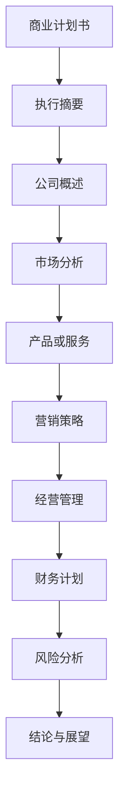

                 

### 第一部分：商业计划书概述

#### 核心概念与联系

在撰写一篇商业计划书之前，我们需要理解一些核心概念和它们之间的关系。为了更好地阐述这些概念，我们可以使用Mermaid流程图来展示它们之间的联系。



通过这个流程图，我们可以看到商业计划书的整体结构和各个部分之间的逻辑关系。接下来，我们将逐步深入探讨这些核心概念。

#### 1. 商业计划书的定义

商业计划书是一份详细的文档，用于描述企业的商业理念、市场策略、运营计划、财务预测以及风险评估等关键信息。它通常是一份正式的文件，用于向投资者、合作伙伴或内部管理层介绍企业的运营情况和未来规划。

商业计划书的定义可以从以下几个方面进行解读：

- **商业理念**：企业旨在解决的问题或提供的解决方案。
- **市场策略**：如何进入市场、吸引客户以及保持竞争力。
- **运营计划**：企业的日常运营流程、组织结构和人员配置。
- **财务预测**：预计的财务表现，包括收入、支出和盈利能力。
- **风险评估**：潜在的风险因素以及应对策略。

#### 1.2 商业计划书的重要性

商业计划书在企业的成长过程中扮演着至关重要的角色。以下是几个关键点，说明了商业计划书的重要性：

- **资源分配**：商业计划书可以帮助企业明确资源分配的优先级，确保资金、人力和物资等资源得到有效利用。
- **投资吸引**：一份详尽的商业计划书可以吸引投资者的兴趣，增加融资成功的可能性。
- **战略规划**：商业计划书为企业的战略发展提供了清晰的方向，有助于企业持续成长。
- **风险识别**：通过对市场、财务和运营等方面的分析，商业计划书可以帮助企业识别潜在的风险，并制定相应的应对措施。

#### 1.3 商业计划书的目标与作用

商业计划书的主要目标是：

- **明确企业的商业理念**：通过描述企业的使命、愿景和核心价值观，使所有相关人员对企业的目标和方向有清晰的认识。
- **制定战略规划**：商业计划书为企业的长期和短期目标提供了具体的行动计划。
- **促进内部沟通**：商业计划书是企业内部沟通的重要工具，有助于协调不同部门的工作。
- **评估与调整**：通过定期审查和更新商业计划书，企业可以及时调整战略和运营计划，以适应市场变化。

商业计划书的作用包括：

- **指导企业运营**：为企业的日常运营提供指导，确保企业按照既定的目标和策略运行。
- **衡量绩效**：通过商业计划书中的关键绩效指标（KPIs），企业可以评估自身的绩效，并制定改进措施。
- **增强信心**：对于投资者和管理团队来说，商业计划书是一份重要的信心保障，证明了企业的可行性和潜在价值。

在接下来的章节中，我们将详细探讨商业计划书的各个部分，包括执行摘要、公司概述、市场分析、产品或服务、营销策略、经营管理、财务计划和风险分析。通过逐步分析这些部分，我们将了解到如何撰写一份有说服力的商业计划书。

#### 2. 商业计划书的结构

商业计划书是一个复杂而详尽的文档，它需要系统地展示企业的各个方面，以便投资者、合作伙伴或内部管理层能够全面了解企业的运营状况和未来发展计划。一个标准的商业计划书通常包括以下几个主要部分：

##### 2.1 执行摘要

执行摘要位于商业计划书的最前面，是对整个计划书的简洁概括。它通常包括以下几个核心要素：

- **企业简介**：简短介绍企业的背景、使命和愿景。
- **市场机会**：描述企业所在的市场现状、市场趋势以及企业如何抓住这些机会。
- **产品或服务**：简要介绍企业的产品或服务，包括其特点、优势和创新点。
- **市场定位**：阐述企业的市场定位，如何满足特定客户群体的需求。
- **营销策略**：概述企业的营销策略，包括目标市场、定价策略、销售渠道等。
- **经营管理**：简要介绍企业的组织结构、管理团队及其职责。
- **财务计划**：提供关键的财务数据，如预期收入、成本、利润以及资金需求。
- **风险评估**：概述可能面临的风险，以及企业如何应对这些风险。

执行摘要的作用是吸引读者的兴趣，让他们在短时间内了解企业的核心内容和亮点。一个优秀的执行摘要应该简明扼要，但又能够充分展示企业的潜力。

##### 2.2 公司概述

公司概述部分详细介绍了企业的历史、使命、愿景和价值观。以下是公司概述的主要组成部分：

- **企业历史**：描述企业的成立过程、发展阶段和里程碑事件。
- **企业使命**：阐述企业的宗旨，即企业存在的理由和目标。
- **企业愿景**：描绘企业的长期目标和愿景，说明企业希望成为什么样的企业。
- **企业价值观**：阐述企业的核心价值观，这些价值观将指导企业的日常运营和决策。

公司概述部分旨在帮助读者了解企业的背景和文化，从而对企业的未来有更清晰的预期。

##### 2.3 市场分析

市场分析是商业计划书的核心部分之一，它详细介绍了企业所在的市场环境、目标市场和竞争对手。以下是市场分析的主要组成部分：

- **市场概述**：描述市场的总体规模、增长趋势和市场动态。
- **目标市场**：确定企业的目标市场，包括目标客户群体、市场规模和增长潜力。
- **市场需求**：分析市场需求，描述客户对产品或服务的需求以及如何满足这些需求。
- **竞争分析**：分析竞争对手的优势和劣势，了解企业在市场中的竞争地位。
- **市场机会和威胁**：识别市场中的机会和威胁，说明企业如何利用机会和应对威胁。

市场分析部分帮助读者了解企业的市场环境和竞争情况，从而评估企业的市场潜力和发展空间。

##### 2.4 产品或服务

产品或服务部分详细介绍了企业的产品或服务，包括其特点、优势、创新点和未来发展计划。以下是产品或服务的主要组成部分：

- **产品或服务描述**：详细描述产品或服务的特性、功能和应用场景。
- **产品或服务优势**：阐述产品或服务的独特优势，如何与竞争对手区分开来。
- **产品或服务创新点**：介绍产品或服务的创新之处，如何满足市场需求。
- **产品或服务发展计划**：描述产品或服务的未来发展方向和改进计划。

产品或服务部分旨在展示企业的核心竞争力，吸引潜在客户的兴趣。

##### 2.5 营销策略

营销策略部分详细介绍了企业的市场营销计划，包括目标市场、定价策略、销售渠道、推广计划和营销预算。以下是营销策略的主要组成部分：

- **目标市场**：明确企业的目标市场，包括目标客户群体的特点和需求。
- **定价策略**：描述企业的定价策略，如何根据市场情况和竞争对手定价。
- **销售渠道**：介绍企业的销售渠道，如何将产品或服务推向市场。
- **推广计划**：阐述企业的推广计划，包括广告、促销活动和公关活动等。
- **营销预算**：提供详细的营销预算分配，确保营销活动的顺利进行。

营销策略部分帮助读者了解企业的市场推广策略，从而评估企业的市场竞争力。

##### 2.6 经营管理

经营管理部分详细介绍了企业的日常运营管理，包括组织结构、管理团队、人力资源计划和生产流程。以下是经营管理的主要组成部分：

- **组织结构**：描述企业的组织架构，包括各部门的职责和汇报关系。
- **管理团队**：介绍企业的管理团队，包括团队成员的背景、经验和职责。
- **人力资源计划**：描述企业的人力资源管理策略，包括招聘、培训和绩效考核等。
- **生产流程**：介绍企业的生产流程，包括原材料采购、生产过程和产品质量控制等。

经营管理部分旨在展示企业的运营效率和稳定性，增强读者的信心。

##### 2.7 财务计划

财务计划部分详细介绍了企业的财务状况，包括财务预测、资金需求和筹集计划。以下是财务计划的主要组成部分：

- **财务预测**：提供详细的财务预测数据，包括收入、成本、利润和现金流等。
- **资金需求**：描述企业的资金需求，包括初始投资、运营资金和扩展资金等。
- **筹集计划**：阐述企业的资金筹集策略，包括融资渠道、融资额度和还款计划等。

财务计划部分帮助读者了解企业的财务状况和资金需求，从而评估企业的可持续性和盈利能力。

##### 2.8 风险分析

风险分析部分详细介绍了企业可能面临的风险和应对策略。以下是风险分析的主要组成部分：

- **风险识别**：识别企业可能面临的各种风险，包括市场风险、财务风险和运营风险等。
- **风险评估**：评估每种风险的严重程度和可能性，确定优先级。
- **风险管理策略**：描述企业如何管理和减轻各种风险，包括风险规避、风险转移和风险接受等。
- **风险应对计划**：制定详细的应对计划，确保企业在面对风险时能够迅速采取行动。

风险分析部分旨在帮助企业识别潜在风险，并制定有效的应对措施。

##### 2.9 结论与展望

结论与展望部分是对整个商业计划书的总结，包括企业的主要成就、面临的挑战和未来发展的方向。以下是结论与展望的主要组成部分：

- **主要成就**：总结企业在过去一段时间内取得的主要成就和成功经验。
- **面临挑战**：阐述企业当前和未来可能面临的主要挑战，以及企业如何应对。
- **未来展望**：描述企业的长期发展目标和规划，展示企业的愿景和潜力。

结论与展望部分旨在向读者展示企业的信心和决心，增强他们对企业的信任和支持。

通过以上对各部分结构的详细解读，我们可以了解到商业计划书是如何系统性地展示企业的各个方面，从而帮助读者全面了解企业的运营状况和未来发展计划。在接下来的章节中，我们将深入探讨每个部分的具体内容和撰写技巧。

#### 3. 执行摘要的撰写

执行摘要作为商业计划书的开篇，其重要性不容忽视。一个优秀的执行摘要不仅能够吸引读者的注意力，还能在短时间内传达企业的重要信息。因此，如何撰写一份具有说服力的执行摘要，成为商业计划书成功的关键。

##### 3.1 执行摘要的结构

一个标准的执行摘要通常包括以下几个部分：

- **企业简介**：简要介绍企业的背景、使命和愿景。
- **市场机会**：描述企业所在市场的现状、趋势以及企业如何抓住这些机会。
- **产品或服务**：概述企业的产品或服务，包括其特点、优势和创新点。
- **市场定位**：阐述企业的市场定位，如何满足特定客户群体的需求。
- **营销策略**：介绍企业的营销策略，包括目标市场、定价策略、销售渠道等。
- **经营管理**：简要介绍企业的组织结构、管理团队及其职责。
- **财务计划**：提供关键的财务数据，如预期收入、成本、利润以及资金需求。
- **风险评估**：概述可能面临的风险，以及企业如何应对这些风险。
- **结论与展望**：总结企业的主要成就、面临的挑战和未来发展的方向。

##### 3.2 如何突出亮点

在撰写执行摘要时，突出企业的亮点至关重要。以下是一些策略，可以帮助您在执行摘要中突出企业的亮点：

- **关键数据**：使用具体的数字和统计数据来展示企业的业绩和市场潜力。例如，描述企业的市场份额、客户增长率、收入增长等。
- **成功案例**：通过成功的案例来展示企业的实力和效果。例如，介绍某个项目或产品的成功案例，以及其对企业的积极影响。
- **创新点**：强调企业的创新之处，如何通过技术创新或商业模式创新来满足市场需求。
- **竞争优势**：明确企业的竞争优势，如独特的产品特性、专业的团队、强大的品牌等。
- **市场机会**：突出企业如何抓住市场机会，以及这些机会对企业发展的潜在影响。

##### 3.3 执行摘要的写作技巧

撰写执行摘要时，需要注意以下技巧：

- **简洁明了**：执行摘要应尽量简洁，避免冗长的叙述。每部分内容应简明扼要，突出重点。
- **逻辑清晰**：执行摘要的结构应逻辑清晰，各个部分之间应紧密联系，形成一个连贯的整体。
- **引人入胜**：使用引人入胜的语言和句子，吸引读者的兴趣。例如，使用生动的描述、引人注目的标题等。
- **专业术语**：在适当的情况下使用专业术语，以展示企业的专业性和权威性。
- **修订与反馈**：撰写完成后，多次修订和征求他人意见，以确保执行摘要的质量和效果。

通过以上技巧，我们可以撰写出一份具有说服力的执行摘要，从而为商业计划书的成功奠定基础。

### 4. 公司概述的撰写

在商业计划书中，公司概述部分起着至关重要的作用。它不仅是企业背景的详细介绍，更是向读者展示企业文化、愿景和使命的关键窗口。撰写这一部分时，我们需要确保信息的准确性和完整性，同时突出企业的独特优势。

#### 4.1 公司的背景与成立原因

公司背景部分应包括以下信息：

- **成立时间**：详细说明企业的成立时间，以及当时的市场环境和经济形势。
- **成立原因**：阐述企业成立的初衷，即企业旨在解决什么问题或满足什么需求。
- **发展历程**：介绍企业的发展历程，包括重要的里程碑事件和阶段性成就。

例如：

```
公司成立于2010年，当时正值互联网经济的快速崛起期。企业成立的初衷是为了解决中小企业在数字化转型过程中面临的技术难题，提供高效、可靠的技术解决方案。
```

通过描述公司的成立背景，读者可以了解企业的历史和发展脉络，从而对企业的价值观和目标有更深入的认识。

#### 4.2 公司的使命、愿景与价值观

公司的使命、愿景和价值观是企业的精神支柱，它们共同构成了企业的文化基础。以下是这些内容的撰写要点：

- **使命**：简明扼要地阐述企业的宗旨和目的。使命应反映企业存在的核心价值，并指导企业的日常运营。
- **愿景**：描述企业的长远目标和理想状态，它应具有激励性和前瞻性，激发员工的积极性和创造力。
- **价值观**：列举企业的核心价值观，这些价值观应贯穿于企业的各个方面，成为员工行为的指南。

例如：

```
我们的使命是推动全球中小企业数字化转型，帮助它们实现业务增长和可持续发展。

我们的愿景是成为全球领先的企业数字化解决方案提供商，为客户创造卓越价值。

我们的核心价值观包括客户至上、创新驱动、团队合作、诚信守信和持续成长。
```

通过阐述公司的使命、愿景和价值观，读者可以感受到企业的文化氛围，了解企业的发展方向和目标。

#### 4.3 公司的组织结构与管理团队

公司概述部分还应介绍公司的组织结构和管理团队。这有助于读者了解企业的运营模式和决策流程。

- **组织结构**：简述公司的组织架构，包括各部门的职责和关系。例如，可以描述公司分为研发部、市场部、销售部、运营部和财务部等。
- **管理团队**：介绍主要的管理团队成员，包括他们的背景、经验和在公司的职责。例如，可以描述CEO拥有多年的创业经验，CTO曾担任知名科技公司的技术总监等。

例如：

```
公司的组织结构包括研发部、市场部、销售部、运营部和财务部。每个部门都有明确的职责和目标，确保公司的各项工作高效运行。

我们的管理团队由经验丰富的专业人士组成。CEO张三拥有超过15年的创业经验，曾成功创办多家科技公司；CTO李四曾在知名科技公司担任技术总监，拥有丰富的技术背景和项目管理经验。
```

通过介绍组织结构和管理团队，读者可以了解企业的运营效率和决策能力。

#### 4.4 案例分析与优化建议

在实际撰写公司概述时，可以通过案例分析来增强说服力。以下是一个案例及其优化建议：

**案例**：

```
公司成立于2010年，当时正值互联网经济的快速崛起期。企业成立的初衷是为了解决中小企业在数字化转型过程中面临的技术难题，提供高效、可靠的技术解决方案。

我们的使命是推动全球中小企业数字化转型，帮助它们实现业务增长和可持续发展。

我们的愿景是成为全球领先的企业数字化解决方案提供商，为客户创造卓越价值。

我们的核心价值观包括客户至上、创新驱动、团队合作、诚信守信和持续成长。

公司的组织结构包括研发部、市场部、销售部、运营部和财务部。每个部门都有明确的职责和目标，确保公司的各项工作高效运行。

我们的管理团队由经验丰富的专业人士组成。CEO张三拥有超过15年的创业经验，曾成功创办多家科技公司；CTO李四曾在知名科技公司担任技术总监，拥有丰富的技术背景和项目管理经验。
```

**优化建议**：

- **增加具体成就**：在描述公司背景时，可以列举具体的技术突破或市场成就，以展示企业的实力。
- **强调团队优势**：在介绍管理团队时，可以强调团队成员的专业技能和成功案例，以增强企业的可信度。
- **使用可视化元素**：在适当的地方使用图表或图片，如组织结构图或团队合影，使公司概述部分更加生动和直观。

通过以上优化建议，公司概述部分可以更加丰富和有说服力，从而更好地吸引读者的关注。

#### 4.5 撰写总结

公司概述部分需要准确、详细地介绍企业的背景、使命、愿景、价值观和组织结构。通过明确企业的历史、文化和团队，读者可以更好地理解企业的定位和发展方向。在撰写时，注意使用具体的数据和案例来增强说服力，同时保持简洁和逻辑性。一个优秀的公司概述将有助于树立企业的良好形象，为商业计划书的整体成功奠定基础。

### 5. 市场分析的撰写

市场分析是商业计划书中的一个关键部分，它帮助读者了解企业所在的市场环境、目标市场、竞争情况以及市场机会。一个详细、准确的市场分析不仅能够展示企业的市场洞察力，还能为企业的战略决策提供有力的支持。

#### 5.1 市场概述

市场概述部分需要提供一个宏观的市场环境分析，包括市场的规模、增长趋势、市场动态等。以下是撰写市场概述的要点：

- **市场规模**：描述市场的总体规模，包括市场容量、市场份额和增长速度。可以使用具体的数据来支持描述，例如“根据市场调研数据，该市场预计在未来五年内将以每年10%的速度增长，市场规模将达到100亿元。”
- **增长趋势**：分析市场的增长趋势，包括推动市场增长的主要因素和可能的挑战。例如，“市场的快速增长得益于消费者对高效、便捷产品和服务需求的增加，同时，技术的发展也为市场提供了新的机遇。”
- **市场动态**：描述市场的最新动态和变化，例如新兴的消费者行为、技术进步、政策变化等。例如，“随着数字化转型的推进，越来越多的企业开始重视数据分析和技术应用，这为市场带来了新的增长点。”

#### 5.2 目标市场定位

在市场概述的基础上，需要明确企业的目标市场定位。以下是目标市场定位的关键步骤：

- **确定目标市场**：根据市场需求和企业的资源能力，确定企业的目标市场。例如，“我们的目标市场是中小型零售企业，这些企业在数字化转型过程中面临诸多挑战，需要高效、可靠的技术解决方案。”
- **描述目标市场特点**：详细描述目标市场的特点，包括目标客户群体的规模、行为特征、需求等。例如，“中小型零售企业的老板通常年龄在30-50岁之间，他们关注成本效益，重视产品质量和用户体验。”
- **分析目标市场潜力**：评估目标市场的潜力，包括市场规模、增长速度和竞争情况。例如，“根据市场调研，中小型零售企业的数字化转型市场预计在未来三年内将以20%的年增长率扩大，这为我们的产品和服务提供了巨大的市场空间。”

#### 5.3 市场需求分析

市场需求分析是市场分析的核心部分，它帮助企业了解客户需求，从而制定有效的市场策略。以下是撰写市场需求分析的要点：

- **分析需求**：详细分析目标市场的需求，包括客户的痛点、需求特点等。例如，“中小型零售企业的老板在数字化转型过程中，主要面临的痛点包括数据安全、系统兼容性和成本控制等问题。”
- **描述需求特点**：描述目标市场的需求特点，例如需求的多样性、紧迫性和变化性等。例如，“中小型零售企业的需求具有多样性，不同企业在不同的阶段有不同的需求，这要求我们的产品和服务能够灵活适应。”
- **识别关键需求**：识别目标市场的关键需求，即客户最为关注的需求点。例如，“对于中小型零售企业来说，数据安全和系统兼容性是他们的关键需求，这些需求将直接影响他们的决策。”

#### 5.4 竞争分析

竞争分析部分需要详细描述企业在市场中的竞争情况，包括主要竞争对手、市场份额和竞争策略等。以下是撰写竞争分析的要点：

- **识别主要竞争对手**：列出企业在市场中的主要竞争对手，包括他们的市场份额、产品和服务特点等。例如，“在中小型零售企业的数字化转型市场中，我们的主要竞争对手包括XX公司、YY公司和ZZ公司，这些公司都在市场上占据了一定的份额。”
- **分析竞争策略**：分析主要竞争对手的市场策略，包括定价策略、营销策略、产品策略等。例如，“我们的竞争对手通常采用低价策略来吸引客户，他们通过大规模生产和销售来降低成本，提高市场竞争力。”
- **评估竞争优势**：评估企业在市场中的竞争优势，包括产品特点、服务优势、品牌优势等。例如，“我们的产品在数据安全性和系统兼容性方面具有明显优势，同时，我们的服务团队提供全天候的技术支持，这使我们在市场上具有竞争优势。”

#### 5.5 市场机会与威胁

在市场分析的最后部分，需要识别市场中的机会和威胁，并描述企业如何应对。以下是撰写市场机会与威胁的要点：

- **识别市场机会**：识别市场中的机会，包括新兴的市场需求、政策变化、技术创新等。例如，“随着消费者对数字化转型需求的增加，我们看到了在智能零售解决方案方面的巨大机会。”
- **分析市场威胁**：分析市场中的威胁，包括竞争加剧、市场饱和、政策限制等。例如，“市场的竞争日益激烈，新进入者不断增多，这对我们构成了一定的威胁。”
- **制定应对策略**：描述企业如何应对市场机会和威胁。例如，“为了抓住市场机会，我们将加大研发投入，推出更多具有创新性和竞争力的产品；为了应对市场竞争，我们将加强品牌建设和客户服务，提高客户满意度。”

通过以上步骤，我们可以撰写出一份详细、全面的市场分析，为企业的战略决策提供有力支持。

### 6. 产品或服务的撰写

产品或服务是商业计划书的核心部分之一，它直接关系到企业的市场定位和竞争优势。在撰写这一部分时，我们需要详细描述产品的特点、优势、创新点和未来发展计划，以便让读者全面了解企业的产品或服务。

#### 6.1 产品或服务描述

产品或服务描述部分需要详细介绍企业的产品或服务，包括其功能、用途和特点。以下是撰写产品或服务描述的要点：

- **功能**：描述产品或服务的核心功能，即它能够解决什么问题或满足什么需求。例如，“我们的智能零售解决方案能够帮助中小型零售企业实现数据化管理，提高销售效率和客户满意度。”
- **用途**：说明产品或服务的用途和应用场景。例如，“我们的智能零售解决方案适用于中小型零售企业的门店管理、库存管理、销售分析和客户关系管理等方面。”
- **特点**：列举产品或服务的独特特点，这些特点可以区分企业产品与其他竞争对手的产品。例如，“我们的解决方案具有数据安全性强、系统兼容性好、用户体验优秀等特点。”

#### 6.2 产品或服务的优势

产品或服务的优势是其在市场竞争中的核心竞争力，以下是撰写产品或服务优势的要点：

- **创新性**：描述产品的创新之处，即它如何通过技术创新来满足市场需求。例如，“我们的解决方案采用了最新的数据分析和人工智能技术，能够实现精准的销售预测和客户行为分析。”
- **成本效益**：说明产品或服务如何提供更高的成本效益，即它如何帮助客户节省成本或创造更大的价值。例如，“我们的解决方案不仅功能强大，而且价格合理，相比其他同类产品具有更高的性价比。”
- **用户体验**：强调产品或服务的用户体验，即它如何提升客户的满意度和忠诚度。例如，“我们的解决方案提供简洁直观的操作界面，客户可以轻松上手，快速实现业务优化。”

#### 6.3 产品或服务的定位

产品或服务的定位决定了其在市场中的位置和目标客户群体。以下是撰写产品或服务定位的要点：

- **目标市场**：确定产品的目标市场，即产品的目标客户群体。例如，“我们的目标市场是中小型零售企业，这些企业在数字化转型过程中面临诸多挑战，需要高效、可靠的技术解决方案。”
- **市场定位**：描述产品在市场中的定位，即产品如何满足目标市场的需求。例如，“我们的智能零售解决方案在市场中定位为高端产品，专注于提供优质的数据管理和分析服务，帮助客户实现业务增长。”
- **差异化**：强调产品的差异化优势，即产品如何与竞争对手区分开来。例如，“我们的解决方案在数据安全性和系统兼容性方面具有明显优势，这使我们在市场上具有独特的竞争力。”

#### 6.4 产品或服务的创新点

创新点是产品或服务的独特卖点和核心竞争力，以下是撰写产品或服务创新点的要点：

- **技术突破**：描述产品在技术上实现的突破，例如采用了最新的技术或开发出了独特的技术方案。例如，“我们的解决方案采用了区块链技术，确保数据的安全性和隐私性，这在市场上是独一无二的。”
- **用户体验**：强调产品在用户体验方面的创新，例如提供了新的交互方式或操作流程。例如，“我们的解决方案引入了语音助手功能，客户可以通过语音命令轻松操作系统，提高了使用便利性。”
- **商业模式**：描述产品在商业模式上的创新，例如如何通过创新的服务模式或合作模式来满足市场需求。例如，“我们的解决方案采用订阅制，客户可以按月支付费用，避免了高额的初期投资，这为中小企业提供了灵活的支付方式。”

#### 6.5 产品或服务的发展规划

产品或服务的发展规划部分需要描述产品的未来发展方向和改进计划，以下是撰写产品或服务发展规划的要点：

- **短期目标**：描述产品在短期内的目标和改进方向，例如新功能的开发、市场的扩大等。例如，“在未来一年内，我们将推出新的销售预测功能，帮助客户更精准地预测销售趋势。”
- **长期目标**：描述产品在长期内的目标和改进方向，例如产品的升级、市场的拓展等。例如，“在未来三年内，我们计划将解决方案推广到更多行业，帮助更多的企业实现数字化转型。”
- **研发计划**：详细描述产品的研发计划，包括研发团队的构成、研发资金的投入和研发进度等。例如，“我们将组建一个由数据科学家、软件工程师和产品经理组成的研发团队，确保产品的持续创新和优化。”

通过以上步骤，我们可以撰写出一份详细、全面的产品或服务描述，展示企业的产品或服务的独特优势和市场竞争力，为企业的市场推广和业务发展奠定坚实基础。

### 7. 营销策略的撰写

营销策略是商业计划书中至关重要的部分，它决定了企业如何进入市场、吸引和保留客户。一个有效的营销策略不仅能提高企业的知名度，还能提升产品的市场占有率。以下是撰写营销策略的详细步骤和要点。

#### 7.1 营销目标

营销目标部分需要明确企业在市场推广中希望达到的具体目标。以下是制定营销目标的要点：

- **短期目标**：描述在短期内希望实现的目标，如增加销售额、提高品牌知名度、扩大市场份额等。例如，“在接下来的六个月内，我们的目标是实现销售额增长20%。”
- **长期目标**：描述在长期内希望实现的目标，如建立品牌形象、进入新市场、扩大客户群体等。例如，“在未来两年内，我们希望将市场份额提升至10%。”
- **具体指标**：为每个目标设定具体的指标，如销售额、客户数量、市场份额等。例如，“我们的目标是下季度实现销售额达到1000万元，客户数量增加300人。”

#### 7.2 营销渠道选择

营销渠道选择部分需要详细描述企业将使用的营销渠道，包括线上和线下渠道。以下是选择营销渠道的要点：

- **线上渠道**：描述企业将使用的线上渠道，如社交媒体、电商平台、网站广告等。例如，“我们将通过微信公众号、微博和抖音等社交媒体平台，发布产品信息、客户案例和营销活动，以增加品牌曝光度。”
- **线下渠道**：描述企业将使用的线下渠道，如线下活动、展会、经销商等。例如，“我们将参加行业展会，与潜在客户面对面交流，展示我们的产品和服务，同时与经销商建立合作关系，共同推广产品。”

#### 7.3 营销策略执行

营销策略执行部分需要详细描述企业如何实施营销策略，包括具体的市场推广活动、广告投放、促销活动等。以下是执行营销策略的要点：

- **市场推广活动**：描述企业将开展的市场推广活动，如产品发布会、品牌代言、公益活动等。例如，“我们计划在下个月举办一场产品发布会，邀请行业专家和潜在客户参加，展示我们的新产品和解决方案。”
- **广告投放**：描述企业将投放的广告类型和投放渠道，如搜索引擎广告、社交媒体广告、传统媒体广告等。例如，“我们将投放搜索引擎广告，通过关键词竞价吸引潜在客户；同时，我们将在社交媒体平台投放品牌广告，提高品牌知名度。”
- **促销活动**：描述企业将开展的促销活动，如打折、赠品、会员优惠等。例如，“我们将推出限时折扣活动，针对新客户提供优惠券和赠品，以吸引更多客户尝试我们的产品。”

#### 7.4 营销预算分配

营销预算分配部分需要详细描述企业将如何分配营销预算，以确保每个营销活动都有充足的资金支持。以下是分配营销预算的要点：

- **预算总额**：确定总的营销预算，并根据营销目标分配到各个营销渠道和活动。例如，“我们的总营销预算为500万元，其中线上渠道占60%，线下渠道占40%。”
- **预算分配**：详细描述每个渠道和活动的预算分配情况，如广告投放、市场推广活动、促销活动等。例如，“线上渠道预算为300万元，用于搜索引擎广告、社交媒体广告和网站广告；线下渠道预算为200万元，用于展会参展、线下活动和经销商合作。”
- **预算调整**：根据营销活动的效果，适时调整预算分配，以优化营销资源配置。例如，“如果线上渠道的ROI（投资回报率）高于预期，我们可以增加线上渠道的预算，减少线下渠道的预算。”

通过以上步骤，企业可以撰写出一份详细、全面的营销策略，为市场推广提供清晰的指导，确保营销活动的高效执行。一个成功的营销策略不仅能帮助企业实现营销目标，还能提升品牌形象，促进企业持续增长。

### 8. 经营管理的撰写

经营管理是商业计划书中的关键部分，它详细描述了企业的日常运营管理，包括组织结构、管理团队、人力资源计划和生产流程等。一个完善的经营管理部分不仅有助于读者了解企业的运作方式，还能为企业的稳定发展和高效运营提供支持。

#### 8.1 经营管理策略

经营管理策略部分需要阐述企业如何通过有效的管理策略来实现业务目标。以下是制定经营管理策略的要点：

- **战略目标**：明确企业的长期和短期战略目标，并确保这些目标与企业的使命和愿景相符。例如，“我们的长期战略目标是成为行业领导者，实现全球市场拓展；短期目标是在下一年内实现市场份额提升至10%。”
- **管理原则**：描述企业遵循的管理原则，如客户至上、团队合作、创新驱动等。这些原则应贯穿于企业的各个部门，指导企业的日常运营。例如，“我们坚持以客户需求为导向，通过团队合作和持续创新，提供卓越的产品和服务。”
- **运营优化**：阐述企业如何通过流程优化、技术创新和管理提升来提高运营效率。例如，“我们计划通过引入先进的管理系统，优化生产流程，降低运营成本，提高生产效率。”

#### 8.2 人力资源管理

人力资源管理是企业经营管理的重要组成部分，它关系到企业的活力和竞争力。以下是撰写人力资源管理部分的要点：

- **团队结构**：描述企业的组织架构，包括各部门的职责、权限和汇报关系。例如，“我们的组织结构包括研发部、市场部、销售部、运营部和财务部，每个部门都有明确的职责和目标。”
- **员工招聘**：描述企业的招聘策略，包括招聘渠道、招聘流程和人才标准。例如，“我们通过多种渠道招聘人才，包括校园招聘、社会招聘和内部推荐，确保招聘到具有专业能力和敬业精神的员工。”
- **员工培训**：阐述企业的培训计划，包括新员工培训、在职培训和领导力培训等。例如，“我们为新员工提供系统的入职培训，帮助其快速融入企业；同时，我们为在职员工提供持续的专业技能培训，提升其职业素养。”
- **激励机制**：描述企业的激励机制，如绩效奖励、晋升机会和员工福利等。例如，“我们根据员工的表现和业绩提供绩效奖励，鼓励员工积极工作；同时，我们为优秀员工提供晋升机会和良好的职业发展路径。”

#### 8.3 生产管理

生产管理是企业运营的核心环节，它决定了产品的质量和交付效率。以下是撰写生产管理部分的要点：

- **生产流程**：描述企业的生产流程，包括原材料采购、生产制造、质量控制和产品交付等。例如，“我们的生产流程包括原材料采购、生产制造、质量检验和产品交付，每个环节都严格按照标准操作程序进行。”
- **质量控制**：描述企业的质量控制体系，包括质量标准、检验流程和改进措施。例如，“我们采用严格的质量控制体系，确保每个生产环节都符合质量标准；同时，我们定期对生产流程进行审查和优化，提高产品质量。”
- **生产效率**：描述企业如何通过技术创新和管理优化来提高生产效率。例如，“我们引入了自动化生产线和智能设备，提高生产效率；同时，我们通过精细化管理，优化生产流程，减少浪费，提高资源利用率。”

#### 8.4 财务管理

财务管理是企业运营的基础，它关系到企业的资金流动和财务状况。以下是撰写财务管理部分的要点：

- **财务计划**：描述企业的财务计划，包括预算编制、资金管理和成本控制等。例如，“我们根据年度经营计划编制财务预算，确保各项资金支出的合理性；同时，我们通过严格的成本控制措施，降低运营成本。”
- **资金流动**：描述企业的资金流动情况，包括现金流管理、应收账款管理和应付账款管理等。例如，“我们通过优化现金流管理，确保企业的资金流动性；同时，我们通过有效的应收账款管理和应付账款管理，降低财务风险。”
- **财务分析**：描述企业的财务分析，包括财务报表分析、盈利能力分析和风险管理等。例如，“我们定期进行财务报表分析，评估企业的财务状况和盈利能力；同时，我们通过风险分析，制定相应的风险管理策略，确保企业的财务稳定。”

通过以上步骤，企业可以撰写出一份详细、全面的经营管理部分，为企业的日常运营提供明确的指导，确保企业的高效、稳定发展。

### 9. 财务计划的撰写

财务计划是商业计划书中的核心部分，它不仅为企业的发展提供了资金支持，还帮助企业评估财务状况和制定长期战略。在撰写财务计划时，我们需要详细阐述财务预测与预算、资金需求与筹集、财务分析以及财务报表等内容。

#### 9.1 财务预测与预算

财务预测与预算是企业财务计划的重要组成部分，它包括对未来一段时间内收入、成本和利润的预测，以及相应的预算编制。以下是财务预测与预算的要点：

- **收入预测**：根据市场分析、销售策略和历史数据，预测未来一段时间内的收入。例如，“根据市场调研和销售计划，我们预计在未来三年内，每年的收入增长率将保持在20%以上。”
- **成本预测**：预测未来一段时间内的主要成本，包括生产成本、运营成本、人力资源成本等。例如，“我们预计生产成本将随着规模效应的显现而降低，运营成本和人力资源成本将保持稳定增长。”
- **利润预测**：基于收入和成本预测，计算出未来一段时间内的利润。例如，“根据收入和成本的预测，我们预计在未来三年内，每年的净利润率将维持在15%左右。”
- **预算编制**：根据财务预测，编制详细的预算，包括各项收入和支出的具体金额。例如，“我们将按照年度预算进行资金安排，确保各项业务活动的顺利进行。”

#### 9.2 资金需求与筹集

资金需求与筹集是企业财务计划中的关键环节，它决定了企业是否有足够的资金支持运营和发展。以下是资金需求与筹集的要点：

- **资金需求分析**：分析企业在未来一段时间内的资金需求，包括初始投资、运营资金和扩展资金等。例如，“根据市场拓展计划，我们预计在未来一年内需要500万元的扩展资金，用于市场推广和设备采购。”
- **资金筹集策略**：制定资金筹集策略，选择合适的融资渠道和方式。例如，“我们将通过股权融资、债务融资和内部融资等多种方式筹集资金，确保资金需求的满足。”
- **融资计划**：详细描述资金筹集的步骤和时间表，包括融资额度和还款计划。例如，“我们计划在未来六个月内通过股权融资筹集300万元，三年内通过债务融资筹集200万元，并制定详细的还款计划。”

#### 9.3 财务分析

财务分析是评估企业财务状况和经营绩效的重要手段，它包括对财务报表的分析、盈利能力分析和风险管理等。以下是财务分析的要点：

- **财务报表分析**：分析企业的财务报表，包括资产负债表、利润表和现金流量表等。例如，“通过分析财务报表，我们发现公司的资产负债率相对较低，流动性较好，但盈利能力还有待提高。”
- **盈利能力分析**：评估企业的盈利能力，包括净利润率、毛利率和资产回报率等。例如，“我们的净利润率在过去三年中保持在15%左右，但毛利率有所下降，这需要我们进一步优化成本结构。”
- **风险管理**：评估企业面临的风险，包括市场风险、财务风险和运营风险等，并提出相应的风险管理措施。例如，“我们面临的市场风险包括市场需求波动和竞争加剧，我们将通过市场调研和竞争分析来应对这些风险。”

#### 9.4 财务报表

财务报表是企业财务状况的直观反映，它包括资产负债表、利润表和现金流量表等。以下是撰写财务报表的要点：

- **资产负债表**：展示企业在某一特定时点的资产、负债和股东权益状况。例如，“截至2023年12月31日，我们的资产总额为2000万元，负债总额为800万元，股东权益为1200万元。”
- **利润表**：展示企业在一定时期内的收入、成本和利润情况。例如，“截至2023年12月31日，我们的总收入为1500万元，总成本为1000万元，净利润为500万元。”
- **现金流量表**：展示企业在一定时期内的现金流入和流出情况，包括经营现金流、投资现金流和筹资现金流。例如，“截至2023年12月31日，我们的经营现金流为300万元，投资现金流为-200万元，筹资现金流为100万元。”

通过以上步骤，企业可以撰写出一份详细、全面的财务计划，为企业的财务管理和未来发展提供明确的指导和数据支持。

### 10. 风险分析的撰写

在商业计划书中，风险分析是一个至关重要的部分，它帮助企业识别、评估和管理可能面临的风险。一个全面的风险分析不仅有助于企业制定应对策略，还能增强投资者的信心。以下是撰写风险分析的具体步骤和要点。

#### 10.1 风险识别

风险识别是风险分析的第一步，旨在找出企业可能面临的各种风险。以下是风险识别的要点：

- **市场风险**：识别市场变化带来的风险，如市场需求波动、竞争加剧、政策变化等。例如，“市场需求的不确定性可能导致销售下降，我们需要密切关注市场动态，及时调整销售策略。”
- **财务风险**：识别财务管理方面可能遇到的风险，如资金短缺、融资困难、成本超支等。例如，“资金短缺可能会影响我们的运营和扩张计划，我们需要确保有足够的流动资金和融资渠道。”
- **运营风险**：识别运营管理方面可能遇到的风险，如生产中断、供应链问题、员工流失等。例如，“供应链的可靠性直接影响我们的生产效率，我们需要与供应商建立稳定的合作关系，确保供应链的稳定。”
- **法律风险**：识别法律和合规方面可能遇到的风险，如法律诉讼、合同纠纷、知识产权侵犯等。例如，“我们需要确保所有业务活动符合相关法律法规，避免因法律问题而面临罚款或诉讼风险。”

#### 10.2 风险评估

风险评估是风险分析的下一步，旨在评估每种风险的严重程度和可能性。以下是风险评估的要点：

- **严重程度评估**：评估每种风险可能对企业造成的损失或影响。例如，“如果市场需求下降，可能会导致销售额减少30%，这将对我们的财务状况产生较大影响。”
- **可能性评估**：评估每种风险发生的概率。例如，“市场波动可能性较高，但通过及时的市场调研和数据分析，我们可以减少这种风险的发生概率。”
- **风险评级**：根据严重程度和可能性，对每种风险进行评级，确定优先级。例如，“市场风险和财务风险具有较高的严重程度和可能性，应作为优先管理的风险。”

#### 10.3 风险管理策略

风险管理策略是风险分析的核心部分，旨在制定具体的应对措施来减轻风险。以下是风险管理策略的要点：

- **风险规避**：通过调整业务策略，避免高风险的业务活动。例如，“我们可能需要减少对某些高风险市场的依赖，专注于具有稳定需求的领域。”
- **风险转移**：通过保险、合同条款等方式将风险转移给第三方。例如，“我们可以购买相应的保险来转移财务风险，确保企业的运营不受影响。”
- **风险接受**：对于不可避免的风险，企业需要接受并制定相应的应对措施。例如，“对于市场需求波动，我们可能需要建立灵活的供应链体系，以应对突发情况。”
- **风险缓解**：采取具体的措施来降低风险发生的概率或减轻风险的影响。例如，“我们可能需要加强市场调研，了解客户需求，提前预测市场变化，调整销售策略。”

#### 10.4 风险应对计划

风险应对计划是具体实施风险管理策略的行动方案，它包括风险监测、评估和调整。以下是风险应对计划的要点：

- **风险监测**：建立风险监测机制，定期评估风险状况。例如，“我们每月进行一次财务风险评估，及时发现问题并采取应对措施。”
- **风险评估**：定期评估风险应对措施的有效性，根据实际情况进行调整。例如，“如果发现某个风险应对措施效果不佳，我们需要重新评估风险，制定新的应对策略。”
- **风险调整**：根据市场环境和内部情况的变化，调整风险管理策略。例如，“如果市场形势恶化，我们需要加强市场监控，及时调整销售策略，以应对市场变化。”

通过以上步骤，企业可以撰写出一份详细、全面的风险分析报告，为企业的风险管理和持续发展提供有力支持。

### 11. 商业计划书的审查与修改

商业计划书的审查与修改是确保其质量和可行性的关键环节。通过系统的审查和精心的修改，企业可以优化商业计划书的内容，提升其说服力和吸引力。

#### 11.1 审查的目的与意义

审查商业计划书的目的是：

- **确保内容的准确性**：检查商业计划书中的数据、信息和预测是否准确无误。
- **评估可行性**：评估商业计划书中的战略、策略和实施方案是否切实可行。
- **提高说服力**：通过审查和修改，增强商业计划书的逻辑性和说服力，使其更具吸引力。
- **识别潜在问题**：提前发现并解决可能影响计划书成功实施的问题。

审查商业计划书的重大意义在于：

- **增强可信度**：一个经过审查和修改的商业计划书能够提高企业的可信度，增强投资者的信心。
- **优化决策**：审查过程有助于企业发现潜在风险和机会，为战略决策提供依据。
- **提高成功率**：完善的审查和修改有助于提升商业计划书的实施成功率。

#### 11.2 审查的重点内容

审查商业计划书应重点关注以下内容：

- **数据准确性**：检查所有数据和统计信息的来源和准确性，确保没有错误或误导信息。
- **逻辑性**：评估商业计划书的结构是否合理，各个部分之间是否紧密联系，逻辑是否清晰。
- **可行性**：评估商业计划书中的市场分析、产品描述、营销策略等部分是否具有可行性。
- **一致性**：检查商业计划书中的假设、预测和目标是否一致，确保内部逻辑一致。
- **说服力**：评估商业计划书是否能够有效吸引投资者和合作伙伴的注意力，是否能够清晰传达企业的价值。

#### 11.3 修改的技巧与方法

为了提高商业计划书的质量，以下是一些修改技巧：

- **简化内容**：删减冗余内容，突出关键信息，使商业计划书更加简洁明了。
- **优化语言**：使用生动、有力、简练的语言，增强商业计划书的表达效果。
- **强化逻辑**：确保各个部分之间逻辑连贯，避免逻辑错误或矛盾。
- **增加案例**：引入具体的案例和实例，增强说服力，使商业计划书更具真实性和可信度。
- **更新数据**：根据最新的市场信息和数据，更新商业计划书中的相关内容。
- **专业审阅**：邀请专业人士或顾问审阅商业计划书，提供反馈和建议。

#### 11.4 修改步骤

修改商业计划书可以按照以下步骤进行：

1. **初步审查**：通读商业计划书，检查整体结构是否合理，逻辑是否连贯，找出需要修改的方面。
2. **内容精简**：删除冗余内容，简化表述，使商业计划书更加精炼。
3. **专业审阅**：邀请专业人士或顾问审阅，收集反馈意见，根据反馈进行修改。
4. **逻辑验证**：对商业计划书中的逻辑进行验证，确保各个部分之间逻辑一致，避免错误或矛盾。
5. **数据更新**：更新最新的市场数据和预测，确保商业计划书中的信息准确有效。
6. **最终审查**：再次通读商业计划书，确保所有修改内容已经实施，整体质量得到提升。

通过以上步骤，企业可以撰写出一份高质量、有说服力的商业计划书，为企业的融资、发展提供坚实支持。

### 12. 商业计划书的呈现与交付

商业计划书的呈现与交付是成功吸引投资者和合作伙伴的重要环节。一个专业的呈现方式和详细的交付流程不仅能够提升企业的形象，还能增强商业计划书的说服力。

#### 12.1 呈现形式的选择

选择合适的呈现形式是商业计划书成功的关键。以下是几种常见的商业计划书呈现形式：

- **纸质文档**：纸质文档具有正式和专业的特点，适合需要签字或文件保存的场景。但在电子化时代，纸质文档的传递和分发相对不便。
- **PPT演示**：PPT演示能够直观地展示商业计划书的关键内容，通过图片、图表和动画增强信息的可读性和吸引力。PPT演示适合在会议、演讲和路演等场合使用。
- **电子文档**：电子文档便于传递和分享，可以通过电子邮件、云存储平台等工具快速分发。常见的电子文档格式包括Word、PDF和Excel等。

#### 12.2 交付的准备

在准备商业计划书交付时，需要做好以下准备工作：

- **内容审核**：确保商业计划书的内容完整、准确、逻辑清晰，没有遗漏或错误。
- **格式调整**：根据选择的呈现形式，调整文档格式，使其符合专业标准。例如，对于纸质文档，确保排版整齐、字体清晰；对于PPT演示，设计简洁美观的幻灯片。
- **附件准备**：准备必要的附件，如财务报表、市场调研报告、技术文档等，以支持商业计划书的内容。
- **演示稿准备**：如果采用PPT演示，需要准备详细的演示稿，确保每个幻灯片的内容简明扼要，逻辑清晰。

#### 12.3 互动与反馈

在商业计划书交付后，与投资者和合作伙伴的互动和反馈至关重要。以下是几个关键点：

- **主动沟通**：及时与投资者和合作伙伴沟通，了解他们的需求和意见，回答他们的问题。
- **听取反馈**：认真听取反馈意见，分析其合理性，并根据反馈进行必要的调整和改进。
- **持续改进**：商业计划书是一个持续改进的过程，根据市场环境和实际情况，定期更新和优化内容。
- **建立联系**：通过互动与反馈，建立良好的关系网络，为未来的合作奠定基础。

#### 12.4 呈现与交付案例

以下是商业计划书呈现与交付的几个成功案例：

- **案例1**：一家初创公司在融资路演中使用了PPT演示。通过精心设计的幻灯片，展示了公司的核心技术、市场前景、团队优势和财务预测，成功吸引了多家投资者的关注，获得了数百万美元的投资。
- **案例2**：一家中小型企业在向银行申请贷款时，提交了详细的纸质商业计划书。商业计划书中的准确数据、详细的市场分析和可行的经营策略，使银行对其业务前景充满信心，最终成功获得了贷款。
- **案例3**：一家互联网公司通过电子邮件向潜在客户和合作伙伴发送了电子版商业计划书。电子文档的便捷性和快速响应，使客户和合作伙伴能够随时查阅，提升了企业的信誉和形象。

通过以上案例，我们可以看到，选择合适的呈现形式、充分的准备工作以及有效的互动与反馈，是商业计划书成功交付的关键。

### 附录

#### 附录 A：商业计划书模板

以下是一个基本的商业计划书模板，您可以根据自己的需求进行修改和补充。

```markdown
# 商业计划书

## 执行摘要

- **企业简介**：
- **市场机会**：
- **产品或服务**：
- **市场定位**：
- **营销策略**：
- **经营管理**：
- **财务计划**：
- **风险评估**：

## 公司概述

- **企业历史**：
- **企业使命**：
- **企业愿景**：
- **企业价值观**：

## 市场分析

- **市场概述**：
- **目标市场**：
- **市场需求**：
- **竞争分析**：
- **市场机会和威胁**：

## 产品或服务

- **产品或服务描述**：
- **产品或服务优势**：
- **产品或服务创新点**：
- **产品或服务发展计划**：

## 营销策略

- **营销目标**：
- **营销渠道选择**：
- **营销策略执行**：
- **营销预算分配**：

## 经营管理

- **组织结构**：
- **管理团队**：
- **人力资源计划**：
- **生产流程**：

## 财务计划

- **财务预测**：
- **资金需求**：
- **筹集计划**：
- **财务分析**：

## 风险分析

- **风险识别**：
- **风险评估**：
- **风险管理策略**：
- **风险应对计划**：

## 结论与展望

- **主要成就**：
- **面临挑战**：
- **未来展望**：

```

#### 附录 B：常用商业计划书写作工具与资源

以下是常用的商业计划书写作工具与资源，帮助您更高效地撰写和优化商业计划书。

- **工具**：
  - **Google文档**：适用于多人协作编辑，便于实时更新和修改。
  - **Microsoft Word**：适用于专业排版和格式调整，提供丰富的模板和格式选项。
  - **Tableau**：用于数据可视化，帮助您制作精美的图表和报表。
  - **PowerPoint**：适用于制作PPT演示，增强商业计划书的直观性和吸引力。

- **资源**：
  - **Entrepreneur**：提供详细的商业计划书撰写指南和模板。
  - **Startup Edition**：为初创企业提供的商业计划书模板和指导。
  - **Harvard Business Review**：发表了许多关于商业计划书撰写的优秀文章。

#### 附录 C：商业计划书撰写指南与案例

以下是几个商业计划书撰写指南和案例，供您参考和学习。

- **指南**：
  - **商业计划书撰写教程**：详细介绍了商业计划书的结构、内容撰写技巧和注意事项。
  - **商业计划书撰写技巧**：提供了一些实用的撰写技巧，如如何突出亮点、如何优化内容等。

- **案例**：
  - **Airbnb的商业计划书**：分析了Airbnb早期商业计划书中的市场分析、营销策略和财务预测，展示了成功的商业计划书是如何撰写的。
  - **Uber的商业计划书**：通过Uber的商业计划书，我们可以看到其在市场分析、产品描述和竞争策略等方面的详细阐述，对初创企业具有重要的借鉴意义。

通过以上附录内容，您将能够更好地了解商业计划书的撰写方法和技巧，从而撰写出高质量的商业计划书，为企业的融资和发展提供有力支持。

### 作者信息

作者：AI天才研究院/AI Genius Institute & 禅与计算机程序设计艺术 /Zen And The Art of Computer Programming

