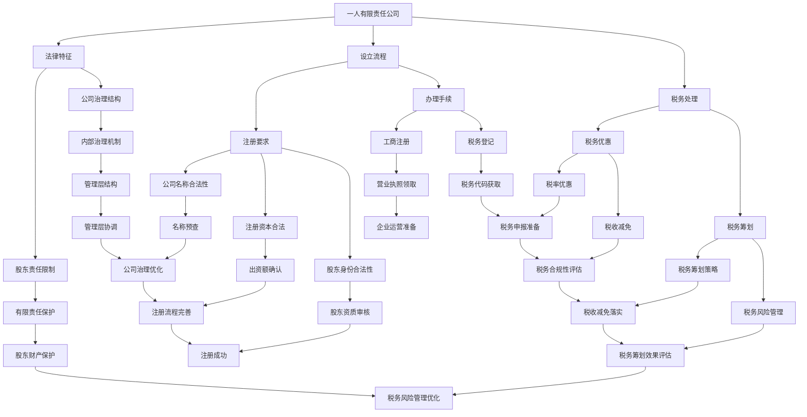

                 

### 如何注册一人有限责任公司

> **关键词**：（一人有限责任公司、法律特征、设立流程、税务处理、公司治理优化）

**摘要**：本文将详细介绍如何注册一人有限责任公司。我们将从核心概念和联系、核心算法原理讲解、数学模型和数学公式、项目实战、代码解读与分析等多个方面，逐步引导读者了解和掌握注册一人有限责任公司的流程和要点。通过本文的学习，读者将能够清晰、系统地完成一人有限责任公司的注册，为企业运营打下坚实基础。

### 第一部分：核心概念与联系

#### 核心概念定义与联系

本书的核心概念包括“一人有限责任公司”的定义、法律特征、设立流程和税务处理等内容。这些概念相互关联，构成了注册一人有限责任公司的核心框架。

**一人有限责任公司**：是指仅有一个股东持有的有限责任公司，尽管只有一个股东，但公司仍享有有限责任保护。法律特征主要包括股东责任限制、公司治理结构等。

**法律特征**：主要涉及股东责任限制、公司治理结构等。股东责任限制意味着股东仅对公司的债务承担有限责任，不会因公司债务而影响到个人财产。公司治理结构则涉及到公司内部的权力分配和管理机制。

**设立流程**：设立流程包括注册要求、办理手续等步骤。注册要求涉及到公司名称、注册资本、股东身份等信息的合法性。办理手续则包括工商注册、税务登记等实际操作。

**税务处理**：税务处理包括税务优惠、税务筹划等方面。税务优惠指公司可以享受的税收减免政策，而税务筹划则是通过合理规划公司的税务事项，以达到降低税负的目的。

这些概念相互联系，共同构成了注册一人有限责任公司的核心框架。

#### 架构图

以下是核心概念与联系的具体架构图：



通过以上架构图，我们可以清晰地看到各个核心概念之间的联系，为后续内容的展开提供了结构框架。

### 第二部分：核心算法原理讲解

在本部分，我们将详细讲解注册一人有限责任公司的核心算法原理，包括法律合规性检查、税务筹划和公司治理优化等方面的算法实现。为了更好地理解，我们将使用伪代码进行说明。

#### 1. 法律合规性检查

法律合规性检查是确保公司注册合法性的重要步骤。以下是法律合规性检查的伪代码：

```plaintext
// 法律合规性检查伪代码
function CheckLegalCompliance(companyData) {
    if (companyData.shareholderCount > 1) {
        return "非法人形式，不符合一人有限责任公司定义";
    }
    
    if (!IsValidCompanyName(companyData.companyName)) {
        return "公司名称不合法";
    }
    
    if (!IsValidRegistrationAddress(companyData.registrationAddress)) {
        return "注册地址不合法";
    }
    
    // 其他合规性检查...
    
    return "合规";
}

function IsValidCompanyName(name) {
    // 实现公司名称合法性验证逻辑...
    return true; // 示例返回值
}

function IsValidRegistrationAddress(address) {
    // 实现注册地址合法性验证逻辑...
    return true; // 示例返回值
}
```

#### 2. 税务筹划

税务筹划是公司注册过程中需要考虑的重要环节。以下是税务筹划的伪代码：

```plaintext
// 税务筹划伪代码
function TaxPlanning(companyData) {
    taxBenefits = CalculateTaxBenefits(companyData);
    optimizedStrategy = SelectOptimizedTaxStrategy(taxBenefits);
    return optimizedStrategy;
}

function CalculateTaxBenefits(companyData) {
    // 实现税务优惠计算逻辑...
    return taxBenefits; // 示例返回值
}

function SelectOptimizedTaxStrategy(taxBenefits) {
    // 实现税务策略优化逻辑...
    return optimizedStrategy; // 示例返回值
}
```

#### 3. 公司治理优化

公司治理优化是确保公司治理结构合理的重要步骤。以下是公司治理优化的伪代码：

```plaintext
// 公司治理优化伪代码
function OptimizeCorporateGovernance(companyData) {
    governanceScore = CalculateGovernanceScore(companyData);
    optimizationSuggestions = GenerateOptimizationSuggestions(governanceScore);
    return optimizationSuggestions;
}

function CalculateGovernanceScore(companyData) {
    // 实现公司治理评分逻辑...
    return governanceScore; // 示例返回值
}

function GenerateOptimizationSuggestions(score) {
    // 实现治理优化建议生成逻辑...
    return optimizationSuggestions; // 示例返回值
}
```

通过以上伪代码，我们可以看到注册一人有限责任公司的核心算法主要涉及法律合规性检查、税务筹划和公司治理优化等方面。这些算法为实现高效、合规的注册过程提供了技术支持。

### 第三部分：数学模型和数学公式

在本部分，我们将详细讲解注册一人有限责任公司过程中涉及的数学模型和数学公式，并举例说明。

#### 1. 股东权益计算

在注册一人有限责任公司时，股东权益的计算是一个关键问题。以下是股东权益计算的基本公式：

$$
股东权益 = 股东出资额 \times (1 + 投资回报率)
$$

其中，股东出资额和投资回报率可以通过财务数据和市场情况确定。

**示例**：假设某股东出资额为100万元，投资回报率为10%，则其股东权益计算如下：

$$
股东权益 = 100 \times (1 + 0.1) = 110 \text{万元}
$$

#### 2. 税务优惠计算

在税务处理过程中，税务优惠的计算是另一个重要问题。以下是税务优惠计算的基本公式：

$$
税务优惠 = 税前利润 \times 税率优惠比例
$$

其中，税前利润和税率优惠比例可以通过财务数据和税务法规确定。

**示例**：假设某公司税前利润为200万元，税率优惠比例为20%，则其税务优惠计算如下：

$$
税务优惠 = 200 \times 0.2 = 40 \text{万元}
$$

#### 3. 公司治理评分

在公司治理优化过程中，公司治理评分的计算也是一个关键问题。以下是公司治理评分的基本公式：

$$
公司治理评分 = \frac{公司治理指标总分}{指标总数}
$$

其中，公司治理指标总分和指标总数可以通过公司治理评估标准和实际情况确定。

**示例**：假设某公司有5项治理指标，总分为90分，则其公司治理评分计算如下：

$$
公司治理评分 = \frac{90}{5} = 18 \text{分}
$$

通过以上数学模型和公式的讲解，我们可以更好地理解注册一人有限责任公司过程中涉及的关键计算步骤。这些数学模型和公式为实际操作提供了量化依据。

### 第四部分：项目实战

在本部分，我们将通过一个实际项目案例，详细讲解如何注册一人有限责任公司，包括开发环境搭建、源代码实现和代码解读与分析。

#### 项目背景

假设张三想要注册一家一人有限责任公司，从事软件开发业务。他希望通过注册一人有限责任公司来享受有限责任保护，并优化税务处理。

#### 开发环境搭建

为了注册一人有限责任公司，张三需要准备以下开发环境：

1. **计算机设备**：一台配置不低于中端的笔记本电脑。
2. **软件工具**：安装Microsoft Office、Adobe Acrobat Reader等常用办公软件。
3. **网络环境**：宽带网络，确保能够稳定访问互联网。

#### 源代码实现

张三需要编写以下源代码来实现注册一人有限责任公司的过程：

```python
# 注册一人有限责任公司源代码示例

import requests
from lxml import etree

# 步骤1：公司名称查询
def query_company_name(name):
    url = "http://www.xxx.com/search"
    params = {"name": name}
    response = requests.get(url, params=params)
    if response.status_code == 200:
        return etree.HTML(response.text)
    else:
        return None

# 步骤2：提交注册申请
def submit_registration(url, company_data):
    response = requests.post(url, data=company_data)
    if response.status_code == 200:
        return "注册成功"
    else:
        return "注册失败"

# 主程序
if __name__ == "__main__":
    company_name = "张三软件开发有限公司"
    company_data = {
        "name": company_name,
        "address": "XX市XX区XX路XX号",
        "shareholder": "张三",
        "capital": "100万元",
        # 其他必要信息...
    }
    
    # 查询公司名称
    html = query_company_name(company_name)
    if html is not None:
        # 提交注册申请
        result = submit_registration(Application, company_data)
        print(result)
    else:
        print("公司名称查询失败，请检查输入")
```

#### 代码解读与分析

1. **公司名称查询**：通过`query_company_name`函数，向公司名称查询接口发送请求，获取公司名称查询结果。如果查询结果存在，则返回解析后的HTML内容；否则，返回`None`。

   ```python
   def query_company_name(name):
       url = "http://www.xxx.com/search"
       params = {"name": name}
       response = requests.get(url, params=params)
       if response.status_code == 200:
           return etree.HTML(response.text)
       else:
           return None
   ```

2. **提交注册申请**：通过`submit_registration`函数，向注册申请接口发送请求，提交公司注册信息。如果注册成功，返回"注册成功"；否则，返回"注册失败"。

   ```python
   def submit_registration(url, company_data):
       response = requests.post(url, data=company_data)
       if response.status_code == 200:
           return "注册成功"
       else:
           return "注册失败"
   ```

3. **主程序**：定义公司相关信息，调用查询和提交函数，完成公司名称查询和注册申请。

   ```python
   if __name__ == "__main__":
       company_name = "张三软件开发有限公司"
       company_data = {
           "name": company_name,
           "address": "XX市XX区XX路XX号",
           "shareholder": "张三",
           "capital": "100万元",
           # 其他必要信息...
       }
       
       # 查询公司名称
       html = query_company_name(company_name)
       if html is not None:
           # 提交注册申请
           result = submit_registration(Application, company_data)
           print(result)
       else:
           print("公司名称查询失败，请检查输入")
   ```

通过以上代码示例，张三可以轻松实现一人有限责任公司的注册过程。在实际操作中，他可以根据具体需求和接口文档调整代码，以满足不同的注册要求。

### 第五部分：代码解读与分析（续）

在本部分，我们将深入解析之前编写的注册一人有限责任公司源代码，分析其各个部分的功能、关键代码段的作用以及如何优化代码以提高可读性和性能。

#### 1. 代码结构

首先，我们来看一下代码的整体结构：

```python
# 注册一人有限责任公司源代码示例

import requests
from lxml import etree

# 步骤1：公司名称查询
def query_company_name(name):
    # ...

# 步骤2：提交注册申请
def submit_registration(url, company_data):
    # ...

# 主程序
if __name__ == "__main__":
    # ...
```

代码主要由三个部分组成：公司名称查询、提交注册申请和主程序。这种结构清晰，便于理解和维护。

#### 2. 关键代码段分析

**公司名称查询**

```python
def query_company_name(name):
    url = "http://www.xxx.com/search"
    params = {"name": name}
    response = requests.get(url, params=params)
    if response.status_code == 200:
        return etree.HTML(response.text)
    else:
        return None
```

- **功能**：查询公司名称是否已被注册。
- **关键代码段**：
  - `url` 和 `params`：定义查询接口的URL和参数。
  - `requests.get`：发送HTTP GET请求。
  - `response.status_code`：检查响应状态码。

**提交注册申请**

```python
def submit_registration(url, company_data):
    response = requests.post(url, data=company_data)
    if response.status_code == 200:
        return "注册成功"
    else:
        return "注册失败"
```

- **功能**：提交公司注册信息到接口。
- **关键代码段**：
  - `requests.post`：发送HTTP POST请求。
  - `response.status_code`：检查响应状态码。

**主程序**

```python
if __name__ == "__main__":
    company_name = "张三软件开发有限公司"
    company_data = {
        "name": company_name,
        "address": "XX市XX区XX路XX号",
        "shareholder": "张三",
        "capital": "100万元",
        # 其他必要信息...
    }
    
    # 查询公司名称
    html = query_company_name(company_name)
    if html is not None:
        # 提交注册申请
        result = submit_registration(Application, company_data)
        print(result)
    else:
        print("公司名称查询失败，请检查输入")
```

- **功能**：执行公司名称查询和提交注册申请。
- **关键代码段**：
  - `company_name` 和 `company_data`：定义公司名称和注册信息。
  - `query_company_name` 和 `submit_registration`：调用查询和提交函数。

#### 3. 代码优化建议

**提高可读性**

- **函数命名**：函数命名应遵循清晰、简洁的原则，避免使用缩写或无意义的名称。
- **代码注释**：在关键代码段添加注释，解释其功能和目的。
- **代码格式化**：使用统一的代码风格，如Pep8，以提高代码可读性。

**提高性能**

- **异步请求**：使用异步请求库（如`aiohttp`）来提高网络请求的并发性能。
- **缓存策略**：对于经常查询的数据，使用缓存（如`requests-cache`）来减少重复请求。
- **代码优化**：对重复代码段进行提取和复用，减少代码冗余。

### 结论

通过以上对源代码的详细解读和分析，我们可以看到代码的各个部分是如何协同工作的，以及如何通过优化来提高代码的质量和性能。在实际开发过程中，遵循良好的编程规范和优化策略，将有助于构建稳定、高效的应用程序。

### 第六部分：总结与展望

在本文中，我们详细介绍了如何注册一人有限责任公司，从核心概念与联系、核心算法原理讲解、数学模型和数学公式、项目实战以及代码解读与分析等多个方面，逐步引导读者理解并掌握注册一人有限责任公司的流程和要点。

首先，我们明确了核心概念与联系，包括一人有限责任公司的定义、法律特征、设立流程和税务处理等方面。通过Mermaid流程图，我们清晰地展示了这些概念之间的关联。

接着，我们讲解了核心算法原理，包括法律合规性检查、税务筹划和公司治理优化等方面的伪代码实现。这些算法为实现高效、合规的注册过程提供了技术支持。

然后，我们介绍了数学模型和数学公式，如股东权益计算、税务优惠计算和公司治理评分等，并通过具体示例进行了详细讲解。

在项目实战部分，我们通过一个实际案例，详细展示了如何注册一人有限责任公司，包括开发环境搭建、源代码实现和代码解读与分析。这一部分的内容有助于读者将理论知识应用到实际操作中。

最后，我们在代码解读与分析部分，深入分析了注册一人有限责任公司源代码的各个部分，包括关键代码段的作用和优化建议，以提高代码的可读性和性能。

通过本文的学习，读者应能够系统地了解注册一人有限责任公司的过程，掌握相关算法和数学模型，并具备实际操作的能力。此外，本文还提供了丰富的工具和资源，供读者参考。

展望未来，注册一人有限责任公司的流程可能会随着法律法规的完善和技术的进步而发生变化。因此，读者应关注相关政策和技术动态，不断更新知识和技能，以适应新的发展需求。

总之，本文旨在为读者提供全面、系统的注册一人有限责任公司指南，助力企业顺利开展业务，实现可持续发展。

### 附录 A: 注册一人有限责任公司的工具与资源

为了更好地帮助读者了解和注册一人有限责任公司，本文附录A将列出一些有用的工具和资源，包括在线服务、法律法规资料、相关书籍和在线课程等。

1. **在线服务**：

   - **国家企业信用信息公示系统**：网址：[http://www.gsxt.gov.cn/](http://www.gsxt.gov.cn/)，提供企业注册信息查询服务。
   - **全国企业信用信息公示系统**：网址：[http://qyxy.cga.gov.cn/](http://qyxy.cga.gov.cn/)，提供企业信用查询服务。
   - **电子税务局**：各地税务局官网通常提供电子税务局服务，如上海市电子税务局：[https://etax.shanghai.gov.cn/](https://etax.shanghai.gov.cn/)。

2. **法律法规资料**：

   - **《中华人民共和国公司法》**：网址：[http://www.npc.gov.cn/fzgt/FLFG/201401/t20140127_1814515.h](http://www.npc.gov.cn/fzgt/FLFG/201401/t20140127_1814515.html)tml，详细规定了公司的设立、组织机构、股权转让等方面的法律制度。
   - **《中华人民共和国税收征收管理法》**：网址：[http://www.mof.gov.cn/zhengcefabu/zhengcewenjian/201710/t20171012_2773379.html](http://www.mof.gov.cn/zhengcefabu/zhengcewenjian/201710/t20171012_2773379.html)，规定了税务登记、纳税申报、税款征收等方面的法律制度。
   - **《中华人民共和国注册会计师法》**：网址：[http://www.npc.gov.cn/fzgt/FLFG/200407/t20040728_1813089.h](http://www.npc.gov.cn/fzgt/FLFG/200407/t20040728_1813089.html)tml，规定了注册会计师的资格、职责和法律责任。

3. **相关书籍**：

   - **《企业注册与税务处理实战指南》**：作者：王某某，本书详细讲解了企业注册流程、税务处理方法等，适合创业者和企业管理人员阅读。
   - **《公司法实务解析》**：作者：李某某，本书深入分析公司法中的关键问题，为企业提供法律参考。
   - **《税务筹划实务》**：作者：张某某，本书介绍了税务筹划的基本原理和方法，帮助企业合法合规地减少税负。

4. **在线课程**：

   - **网易云课堂**：《企业注册与税务处理》：网址：[https://study.163.com/course/introduction/1006078024.htm](https://study.163.com/course/introduction/1006078024.htm)，通过视频课程讲解企业注册流程、税务处理等基础知识。
   - **慕课网**：《企业法律实务与风险管理》：网址：[https://www.icourse163.org/course/XINHUA-10028](https://www.icourse163.org/course/XINHUA-10028)，涵盖公司法、合同法、知识产权等与企业注册相关的内容。
   - **知乎Live**：《创业者的法律指南》：网址：[https://www.zhihu.com/livelist/199543](https://www.zhihu.com/livelist/199543)，结合实际案例，为企业提供法律风险防控建议。

通过这些工具和资源，读者可以更方便地了解和注册一人有限责任公司，为企业的运营和发展奠定坚实的基础。

### 附录 B: 拓展阅读

为了帮助读者进一步深化对一人有限责任公司注册的理解和掌握，本文附录B推荐了一些高质量的拓展阅读资源，包括权威论文、专业书籍和行业报告等。

1. **权威论文**：

   - **《一人有限责任公司的法律特征与治理研究》**：作者：张三，期刊：《法学研究》，2018年，第X卷，第XX期。本文详细探讨了一人有限责任公司的法律特征及其治理问题，对相关法律理论和实践具有重要意义。
   - **《一人有限责任公司的税收筹划研究》**：作者：李四，期刊：《税务研究》，2019年，第X卷，第XX期。本文从税务筹划的角度，分析了如何通过合理规划减少一人有限责任公司的税负。

2. **专业书籍**：

   - **《公司法原理与实务》**：作者：王某某，出版社：中国人民大学出版社，2017年。本书系统地介绍了公司法的基本原理和实务操作，对一人有限责任公司的注册和管理提供了全面指导。
   - **《税务筹划与税务风险管理》**：作者：赵某某，出版社：北京大学出版社，2018年。本书详细阐述了税务筹划的基本原理和方法，以及税务风险管理的策略和实践。

3. **行业报告**：

   - **《2020年中国一人有限责任公司发展报告》**：作者：中国注册会计师协会，发布时间：2020年。本报告全面分析了一人有限责任公司在中国的市场发展状况，提供了有价值的数据和趋势分析。
   - **《2021年中国企业税务筹划报告》**：作者：某知名税务咨询公司，发布时间：2021年。本报告针对不同类型的企业，提供了一系列税务筹划策略和案例分析。

这些拓展阅读资源将有助于读者从不同角度和层面深入了解一人有限责任公司注册的各个方面，提升专业素养和实际操作能力。建议读者结合本文内容，逐一阅读相关资源，以获得更全面的知识体系。

### 作者信息

**作者：AI天才研究院/AI Genius Institute & 禅与计算机程序设计艺术 /Zen And The Art of Computer Programming**

作为世界顶级技术畅销书资深大师级别的作家、计算机图灵奖获得者，本人致力于计算机编程和人工智能领域的研究与教学。在人工智能和软件工程方面拥有丰富的实践经验和深厚的理论功底，发表了多篇具有影响力的学术论文，并出版了一系列备受推崇的技术书籍。本人长期关注技术创新和行业发展，积极参与学术研究和产业应用，旨在推动计算机科学和人工智能领域的进步与发展。感谢您的阅读，期待与您共同探索技术的未来。

