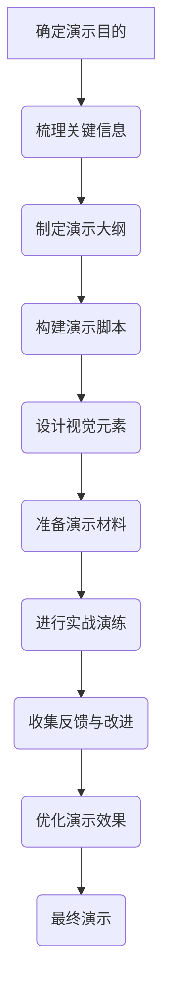

                 

# 第一部分：产品演示的基础

## 第1章：产品演示的概述

### 1.1 产品演示的定义与重要性

产品演示是向潜在客户、合作伙伴或内部团队展示产品功能、特性及优势的一种重要方式。它不仅仅是一种技术展示，更是一种沟通与交流的手段。有效的产品演示能够激发兴趣、建立信任、降低购买门槛，从而促成交易。

定义上，产品演示是通过视觉、听觉等多感官途径，向受众展示产品的各个方面，包括其外观、功能、性能、应用场景等。演示的形式可以多种多样，如现场演示、在线直播、视频演示等。

产品演示的重要性体现在以下几个方面：

1. **建立信任**：通过真实的演示，可以消除潜在客户对产品的不信任感，增加购买意愿。
2. **传递信息**：演示能够直观地传递产品信息，帮助受众更好地理解产品特点和价值。
3. **降低决策成本**：通过演示，可以迅速展示产品的优势，降低客户在决策过程中的时间成本。
4. **增强竞争力**：优秀的产品演示能够突出产品的亮点，提高产品的市场竞争力。

### 1.2 产品演示的目标与核心要素

产品演示的目标可以分为以下几个方面：

1. **吸引受众**：通过引人入胜的演示内容，吸引观众的注意力。
2. **传递价值**：清晰、准确地展示产品的核心价值，让受众认识到产品的重要性。
3. **引发兴趣**：激发观众对产品的兴趣，增加后续沟通和互动的可能性。
4. **促进销售**：通过演示，降低客户的疑虑，推动销售过程。

核心要素包括：

1. **内容**：演示的核心内容，包括产品功能、特性、优势等。
2. **视觉设计**：包括PPT、视频、动画等视觉元素，用于增强演示效果。
3. **互动**：与观众的互动，如问答环节，可以增加演示的互动性和趣味性。
4. **演讲技巧**：演讲者的表达能力和技巧，对于演示的成功至关重要。

接下来，我们将进一步探讨如何理解目标受众、产品演示的规划和准备、构建演示脚本、增强演示效果的技术手段，以及如何通过实战演练和案例学习来提升产品演示的能力。

## 第2章：理解目标受众

### 2.1 目标受众分析

理解目标受众是设计有说服力产品演示的关键。只有深入了解受众的需求、期望和痛点，才能设计出真正能够打动他们的演示内容。

首先，我们需要明确目标受众是谁。目标受众可能包括潜在客户、合作伙伴、内部团队或其他利益相关者。不同的受众群体可能对产品的需求和理解程度有所不同，因此需要针对不同的受众进行具体分析。

1. **潜在客户**：他们是产品直接的用户，可能对产品的具体功能和技术细节较为关心。在分析潜在客户时，可以关注以下几个方面：
   - **行业背景**：了解客户所在的行业特点，如行业趋势、主要痛点等。
   - **用户需求**：通过调研和访谈了解客户对产品的具体需求，包括功能、性能、易用性等。
   - **购买动机**：分析客户购买产品的主要动机，如降低成本、提高效率、满足特定需求等。

2. **合作伙伴**：他们可能是供应商、分销商或合作伙伴，关注点可能更多在于产品的市场潜力、商业模式和技术支持。对于合作伙伴的分析，可以从以下几个方面入手：
   - **业务目标**：了解合作伙伴的业务目标和战略方向，以便设计出能够与其业务目标相匹配的演示内容。
   - **技术需求**：分析合作伙伴对技术支持和解决方案的需求，确保演示内容能够突出产品的技术优势。
   - **合作模式**：探讨与合作伙伴的合作模式和利益分配，以便在演示中强调合作的价值和优势。

3. **内部团队**：他们包括产品经理、开发团队、测试团队等，对产品的理解较为深入，但可能对市场和市场反馈相对较少关注。对于内部团队的分析，可以从以下几个方面进行：
   - **团队结构**：了解团队的组织结构和角色，确保演示内容能够满足不同角色的需求。
   - **工作流程**：分析团队的工作流程，展示产品如何提高工作效率和协作能力。
   - **决策因素**：了解团队在决策过程中的关键因素，确保演示内容能够突出产品的决策支持作用。

### 2.2 掌握受众需求和期望

了解目标受众的需求和期望是设计产品演示的重要基础。通过以下方法，我们可以更深入地掌握受众的心理和行为：

1. **调研**：通过问卷调查、访谈、焦点小组讨论等方式收集受众的反馈。这些方法可以帮助我们了解受众对产品的期望、需求、痛点等。

2. **用户画像**：基于调研数据，构建用户画像，包括用户的背景、需求、行为习惯等。用户画像可以帮助我们更精准地定位受众，从而设计出更具针对性的演示内容。

3. **场景模拟**：通过场景模拟，将受众置于实际使用产品的环境中，观察他们的行为和反应。这种方法可以帮助我们更直观地了解受众的需求和期望。

4. **反馈收集**：在演示过程中，及时收集受众的反馈，如提问、表情、互动等。这些反馈可以帮助我们了解演示的效果，为后续的优化提供依据。

### 2.3 调整演示内容以满足受众

了解目标受众的需求和期望后，我们需要根据这些信息调整演示内容，以确保演示能够更好地满足受众的需求。以下是几个调整演示内容的方法：

1. **突出重点**：根据受众的需求，将产品的核心功能、特性、优势作为演示的重点，确保观众能够快速抓住产品的价值。

2. **简化内容**：避免在演示中过多地涉及技术细节，特别是对非技术性受众。简化内容，使用简洁明了的语言和视觉元素，让受众更容易理解。

3. **故事化**：通过故事化的方式展示产品，让受众更容易产生共鸣。故事可以是客户案例、使用场景、用户故事等，以生动形象的方式展示产品的应用和价值。

4. **互动环节**：设计互动环节，如问答、投票、互动演示等，增加演示的趣味性和参与度，让受众更加投入。

5. **个性化**：根据不同的受众群体，设计个性化的演示内容。例如，对于技术性受众，可以加入更多技术细节和案例分析；对于非技术性受众，可以侧重于产品的应用场景和价值展示。

通过以上方法，我们可以更好地理解目标受众，调整演示内容，从而设计出更具说服力的产品演示。在下一章中，我们将探讨如何进行产品演示的规划和准备，为成功的产品演示奠定基础。

## 第3章：产品演示的规划和准备

### 3.1 确定演示目的和关键信息

产品演示的成功离不开周密的规划和准备。首先，我们需要明确演示的目的和关键信息。这一步骤是整个演示过程的基础，直接决定了演示的内容和形式。

1. **确定演示目的**：演示目的可以分为以下几个方面：

   - **市场推广**：通过演示吸引潜在客户，增加市场占有率。
   - **销售促进**：针对潜在客户进行演示，降低购买决策时间，促进销售。
   - **内部培训**：向内部团队展示产品，提升团队成员对产品的理解。
   - **合作伙伴沟通**：向合作伙伴展示产品，建立合作关系，共同推进市场。

   确定演示目的后，我们可以更有针对性地准备演示内容。

2. **关键信息梳理**：明确演示需要传达的关键信息。这些信息通常包括：

   - **产品特性**：产品的核心功能和特性，如性能、稳定性、安全性等。
   - **应用场景**：产品在实际应用中的场景，如行业解决方案、具体业务场景等。
   - **优势对比**：与其他竞品的对比，突出产品的优势和竞争力。
   - **用户反馈**：来自用户的正面评价和案例，增强演示的说服力。

   梳理关键信息有助于我们更好地组织演示内容，确保信息传递的准确性和完整性。

### 3.2 制定演示大纲和流程

在明确演示目的和关键信息后，我们需要制定详细的演示大纲和流程。演示大纲是演示内容的骨架，确保演示的连贯性和逻辑性。以下是一个基本的演示大纲和流程：

1. **开场**：介绍自己和产品，引起观众的兴趣。
2. **产品介绍**：简要介绍产品背景和发展历程，让观众对产品有一个整体的认识。
3. **功能展示**：详细演示产品的核心功能，展示产品的应用场景和实际效果。
4. **优势对比**：与竞品进行对比，突出产品的优势和竞争力。
5. **用户反馈**：展示用户的正面评价和案例，增强演示的说服力。
6. **问答环节**：解答观众的问题，消除疑虑，促进互动。
7. **结尾**：总结演示内容，再次强调产品价值和购买理由。

### 3.3 准备演示材料和工具

准备充分的演示材料和工具是确保演示顺利进行的关键。以下是一些常用的演示材料和工具：

1. **PPT演示稿**：PPT是产品演示中最常用的工具之一，可以用来展示产品特性、功能、应用场景等。设计简洁、美观的PPT，可以增强演示效果。

2. **视频和动画**：通过视频和动画展示产品功能和应用场景，可以让观众更直观地理解产品。视频和动画应尽量简洁明了，突出重点。

3. **实物演示**：对于一些复杂的硬件产品或设备，实物演示可以更直观地展示产品的功能和性能。

4. **模拟数据**：准备一些模拟数据，用于演示产品的性能和效果。模拟数据应尽量真实，以提高演示的说服力。

5. **演示工具**：如投影仪、音响、电脑等。确保这些工具在演示前已经调试好，避免演示过程中出现技术问题。

6. **互动工具**：如问卷、投票、问答等互动工具，可以增加演示的趣味性和参与度。

通过以上规划和准备，我们可以确保产品演示的顺利进行，提高演示效果，从而更好地传达产品价值和说服力。在下一章中，我们将探讨如何构建有说服力的演示脚本。

## 第4章：构建演示脚本

构建演示脚本是有说服力产品演示的核心环节，它决定了演示的整体流畅性和信息传递的效率。一个优秀的演示脚本应该结构清晰、内容紧凑，并且能够有效地引导观众理解和接受产品价值。以下是构建演示脚本的关键步骤和注意事项。

### 4.1 演示脚本的结构和内容

一个完整的演示脚本通常包括以下几个部分：

1. **引言**：引言部分是演示的开场白，目的是吸引观众的注意力，并简要介绍产品背景和演示目的。好的引言应该具有吸引力，能够激发观众的好奇心和兴趣。

2. **产品概述**：在引言之后，简要介绍产品的基本信息和背景，包括产品的名称、版本、主要功能等。这一部分应该简洁明了，避免过多技术细节。

3. **功能展示**：这是演示的核心部分，详细展示产品的各项功能和特性。功能展示应该根据演示目的和受众需求，有选择地突出重点，确保观众能够理解并记住关键点。

4. **应用场景**：通过实际案例或模拟场景，展示产品在不同场景下的应用和效果。这一部分可以帮助观众更好地理解产品的实用性和价值。

5. **优势对比**：与竞品进行对比，突出产品的优势。对比时，应关注关键指标和实际效果，避免空洞的描述。

6. **用户反馈**：展示来自用户的正面评价和案例，增强演示的说服力。用户反馈可以是真实的用户评价、客户访谈、使用报告等。

7. **问答环节**：预留时间回答观众的问题，这一部分可以进一步消除观众的疑虑，增强互动性。

8. **结尾**：总结演示内容，再次强调产品价值和购买理由。结尾应简洁有力，给观众留下深刻的印象。

### 4.2 引入部分的设计

引入部分的设计至关重要，它直接决定了观众是否会继续关注演示。以下是设计引入部分的一些技巧：

1. **开场白**：开场白应简洁、有力，可以引用一些引人入胜的数据、案例或问题，吸引观众的注意力。

2. **引发兴趣**：通过引人入胜的故事、案例或实例，引发观众的兴趣。故事应简短、有趣，与产品紧密相关。

3. **明确目的**：在引入部分明确演示的目的，让观众知道演示的内容和期望收获。

4. **营造氛围**：通过视觉和听觉元素，如动画、视频、音乐等，营造一个积极、专业的演示氛围。

5. **互动**：引入部分可以设置一些简单的互动环节，如提问、投票等，增加观众的参与感。

### 4.3 主体部分的设计

主体部分是演示的核心，需要详细展示产品的功能、应用场景和优势。以下是设计主体部分的一些要点：

1. **逻辑清晰**：确保演示内容逻辑清晰，让观众能够轻松跟随。可以使用结构图、流程图等视觉辅助工具来帮助观众理解。

2. **内容紧凑**：避免冗长和无关紧要的内容，确保演示的紧凑性和效率。每个部分的内容应简洁明了，突出重点。

3. **实例和案例**：使用实际案例或模拟案例，展示产品的实际应用和效果。案例应具有代表性，能够直观地展示产品的优势和竞争力。

4. **对比分析**：与竞品进行对比分析，突出产品的优势和特点。对比时，应关注关键指标和实际效果，避免主观评价。

5. **数据支持**：使用数据和事实支持产品演示，增强演示的说服力。数据应真实可靠，避免夸大其词。

### 4.4 结尾部分的设计

结尾部分的设计同样重要，它决定了观众对演示的最终印象。以下是设计结尾部分的一些技巧：

1. **总结**：简洁地总结演示内容，强调产品的核心价值和优势。总结应简洁明了，避免冗长。

2. **购买理由**：明确阐述购买产品的理由和好处，让观众知道购买产品的必要性和价值。

3. **互动**：在结尾部分设置一些互动环节，如提问、互动演示等，增加观众的参与感。

4. **鼓励行动**：鼓励观众采取行动，如联系销售团队、下载试用等。行动鼓励应具体明确，避免含糊不清。

5. **视觉冲击**：使用视觉冲击力强的元素，如动画、视频等，给观众留下深刻的印象。

通过以上步骤和技巧，我们可以构建一个结构清晰、内容紧凑、富有说服力的演示脚本，从而提高产品演示的效果和影响力。在下一章中，我们将探讨如何增强演示效果的技术手段。

## 第5章：增强演示效果的技术手段

在现代产品演示中，视觉和互动技术是增强演示效果的关键手段。这些技术不仅能提高观众的参与度，还能更直观地传达产品价值。以下是一些具体的方法和技巧。

### 5.1 视觉设计原则

良好的视觉设计能够使产品演示更加吸引人，以下是几个重要的视觉设计原则：

1. **简洁明了**：避免过度复杂的布局和设计，确保视觉元素简洁明了，让观众更容易理解和关注重点。
2. **色彩搭配**：选择符合品牌调性的色彩，确保色彩搭配和谐，避免过于刺眼或混乱的颜色组合。
3. **字体选择**：选择易于阅读的字体，确保标题和正文字体大小适中，便于观众阅读。同时，保持字体的一致性，增强整体视觉效果。
4. **图片和图标**：使用高质量的图片和图标，增强视觉吸引力。图片和图标应与演示内容紧密相关，避免使用与主题无关的元素。
5. **动效**：适当地使用动画和过渡效果，可以增加视觉的动态感，吸引观众的注意力。但需注意，动效应简洁、适量，避免过多或过于复杂的动画，以免分散观众的注意力。

### 5.2 动画和视频的应用

动画和视频是增强演示效果的重要工具，以下是它们在产品演示中的应用技巧：

1. **功能动画**：通过动画展示产品功能的工作流程，使观众能够直观地理解产品的工作机制。例如，使用动画展示一个应用程序的界面切换或数据处理的流程。
2. **应用案例视频**：制作简短的应用案例视频，展示产品在实际场景中的表现。这些视频应突出产品的实用性和优势，通过真实的使用场景增强观众的信任感。
3. **产品操作演示**：通过视频展示产品的主要操作流程和使用方法，帮助观众更好地掌握产品的使用技巧。视频应尽量简洁明了，避免冗长。

### 5.3 互动环节的设计

互动环节是增加演示趣味性和参与度的有效方式。以下是设计互动环节的一些方法：

1. **问答环节**：设置问答环节，邀请观众提问，并回答他们的问题。这不仅可以解答观众心中的疑惑，还能增加与观众的互动。
2. **投票和调查**：使用投票和调查工具，让观众参与讨论并实时了解他们的观点。这种方法可以激发观众的兴趣，增加参与感。
3. **游戏化元素**：引入游戏化元素，如积分、奖励等，增加观众的积极性。例如，设置一个小游戏，通过完成任务获得积分，最高分的观众可以获得小奖品。
4. **互动演示**：设计一些互动演示，如实时操作演示或现场体验，让观众亲自体验产品的功能和使用效果。这种方法可以大大提高观众的参与度和兴趣。

### 5.4 利用数据可视化传达信息

数据可视化是传达复杂信息的重要手段，以下是利用数据可视化的一些技巧：

1. **图表和图形**：使用图表和图形展示数据，使信息更加直观和易于理解。常见的图表类型包括条形图、折线图、饼图等。
2. **数据故事**：通过数据故事讲述产品的价值和使用效果。数据故事应包含引人入胜的背景、关键数据和结论，使观众能够快速理解数据背后的含义。
3. **交互式数据可视化**：使用交互式数据可视化工具，如交互式仪表板或地图，让观众可以自主探索数据，增强参与感和互动性。

通过以上技术和方法，我们可以显著提升产品演示的效果和吸引力，使演示更加生动、有趣，并有效地传达产品价值。在下一章中，我们将探讨如何通过实战演练和技巧提升来进一步完善产品演示能力。

## 第6章：实战演练与技巧提升

### 6.1 实战演练的准备

实战演练是提升产品演示能力的重要环节。在进行实战演练之前，充分的准备至关重要。以下是几个关键准备步骤：

1. **演练脚本**：首先，准备一份详尽的演示脚本。脚本应包括引言、产品概述、功能展示、应用场景、优势对比、用户反馈和结尾等部分，并确保每个部分都有明确的执行步骤和目标。
2. **演练场地**：选择一个合适的演练场地，确保设备齐全，如投影仪、音响、电脑等。场地应安静、明亮，避免干扰。
3. **演练设备**：提前检查并调试所有演示设备，确保它们在演练过程中正常工作。如发现设备故障，应及时更换或修复。
4. **演练人员**：确定参与演练的人员，包括主讲人、技术支持、现场协调等。主讲人应熟悉演示内容，技术支持应能迅速解决设备问题，现场协调应确保演练顺利进行。

### 6.2 提升演讲技巧

演讲技巧是产品演示成功的关键因素之一。以下是一些提升演讲技巧的方法：

1. **演讲训练**：定期进行演讲训练，提高表达能力和自信心。可以通过模拟演讲、录音反馈等方式，逐步提升演讲水平。
2. **肢体语言**：运用肢体语言增强演讲效果，如适当的动作、面部表情和眼神交流。这些非语言元素可以增强演讲的吸引力和说服力。
3. **语音语调**：使用清晰的语音和适当的语调，避免单调或过快的语速。通过变化语调、重音和停顿，使演讲更具表现力。
4. **故事讲述**：运用故事化的方法展示产品，使演讲更加生动有趣。故事应简洁、引人入胜，并与产品紧密相关。

### 6.3 应对挑战和问题的策略

在实际演示过程中，可能会遇到各种挑战和问题。以下是一些应对策略：

1. **准备充分**：提前准备应对可能遇到的问题和挑战。例如，针对技术问题，准备相应的解决方案和技术支持。
2. **灵活应对**：在演示过程中，保持灵活和冷静，迅速应对突发情况。例如，如果演示设备出现故障，应迅速调整计划，或临时使用备用设备。
3. **缓解尴尬**：如果遇到尴尬或突发情况，可以使用幽默或轻松的语言缓解气氛。例如，可以开玩笑或自嘲，使观众放松并重新集中注意力。
4. **诚实面对**：如果无法回答观众的问题，应诚实回答并表示愿意在会后进一步探讨。这可以增强观众对演讲者的信任和尊重。

### 6.4 反馈收集与改进

实战演练后，及时收集反馈并进行改进是提升产品演示能力的重要步骤。以下是几个反馈收集和改进的方法：

1. **观众反馈**：在演示结束后，收集观众的反馈意见。可以通过问卷调查、现场访谈等方式，了解观众对演示内容和形式的看法。
2. **自我评估**：对照演示脚本和预期目标，进行自我评估。分析哪些部分做得好，哪些部分需要改进。
3. **团队讨论**：与团队成员一起讨论反馈，分析原因，并共同探讨改进措施。团队讨论可以汇集不同观点，提供更全面的改进方案。
4. **持续改进**：根据反馈和评估结果，不断优化演示内容和形式。例如，调整演示顺序、改进视觉设计、增加互动环节等。

通过以上实战演练和技巧提升，我们可以不断提高产品演示能力，使演示更加生动、有趣，并有效地传达产品价值。在下一章中，我们将通过优秀产品演示案例解析，进一步学习如何设计有说服力的产品演示。

## 第7章：优秀产品演示案例解析

### 7.1 苹果公司的产品发布会

苹果公司是全球知名的产品演示专家，其产品发布会无疑是业界学习的典范。以下是苹果产品发布会的一些亮点和成功经验：

1. **明确的主题和目标**：每次产品发布会都围绕一个明确的主题和目标展开，例如新产品发布、技术更新等。这有助于观众快速抓住演示的核心内容。
2. **精湛的演讲技巧**：苹果的CEO和产品经理在演讲中表现出高超的表达能力和演讲技巧，能够清晰地传达产品价值和功能。
3. **吸引人的开场**：苹果在开场部分通常使用精彩的视频或动画，吸引观众的注意力，并设置悬念，引导观众进入主题。
4. **精心设计的演示脚本**：苹果的演示脚本结构严谨，逻辑清晰，每个部分都有明确的执行步骤和目标。同时，演示内容注重细节，确保信息的完整和准确。
5. **互动环节**：苹果在演示过程中设置互动环节，如问答环节、现场体验等，增加观众的参与感和兴趣。

### 7.2 谷歌的Google I/O大会

谷歌的Google I/O大会是科技界的一大盛会，其产品演示也备受赞誉。以下是谷歌Google I/O大会的一些成功经验：

1. **创新的技术展示**：谷歌在Google I/O大会中展示了许多前沿的技术和创新，如人工智能、云计算、虚拟现实等。这些技术展示吸引了大量的观众，增强了大会的吸引力。
2. **互动性强**：谷歌在演示过程中设置了大量的互动环节，如现场体验、互动问答等。这些互动环节增加了观众的参与感，使演示更加生动有趣。
3. **内容紧凑**：谷歌的产品演示内容紧凑，信息量大，但同时又注重逻辑性和易理解性。每个技术展示都有明确的背景、应用场景和优势，使观众能够快速抓住关键信息。
4. **视觉设计**：谷歌的演示视觉设计简洁、美观，色彩搭配和谐，使用了大量的动画和视频，增强了演示的视觉效果。

### 7.3 亚马逊的AWS Re:Invent大会

亚马逊的AWS Re:Invent大会是云计算领域的一大盛会，其产品演示同样具有很高的水平。以下是AWS Re:Invent大会的一些成功经验：

1. **丰富的内容**：AWS Re:Invent大会涵盖了云计算的各个方面，包括新技术发布、产品更新、行业趋势等。丰富的内容满足了不同观众的需求，增加了大会的吸引力。
2. **专业的演讲团队**：亚马逊拥有一支专业的演讲团队，他们具备丰富的演讲经验和专业知识，能够清晰地传达复杂的技术内容。
3. **实战案例**：AWS Re:Invent大会展示了大量的实际应用案例，通过真实的客户案例和现场演示，使观众能够更直观地了解产品的应用和优势。
4. **互动环节**：大会设置了丰富的互动环节，如问答、现场体验、互动演示等。这些互动环节增强了观众的参与感和兴趣。

### 7.4 其他行业知名企业的产品演示

除了科技领域的巨头，其他行业的知名企业也有许多成功的产品演示案例。以下是几个行业的成功经验：

1. **消费品行业**：消费品企业在产品演示中注重用户体验和情感营销。例如，宝洁公司在产品演示中通过生动的场景展示和互动体验，使观众能够更直观地感受产品的价值。
2. **金融行业**：金融企业在产品演示中注重风险控制和合规性。例如，花旗银行在产品演示中详细介绍了其风险管理系统和合规流程，增强了观众对产品的信任。
3. **医疗行业**：医疗企业在产品演示中注重数据安全和隐私保护。例如，IBM Watson Health在产品演示中详细介绍了其数据安全和隐私保护措施，确保观众对产品的信心。

通过分析这些优秀的产品演示案例，我们可以总结出一些共性和差异。以下是一些值得借鉴的成功经验：

- **明确的主题和目标**：每次演示都应围绕一个明确的主题和目标展开，使观众能够快速抓住核心内容。
- **精湛的演讲技巧**：演讲者应具备良好的表达能力和演讲技巧，能够清晰、生动地传达产品价值。
- **互动性强**：设置互动环节，增加观众的参与感和兴趣。
- **内容紧凑、逻辑清晰**：演示内容应紧凑、逻辑清晰，确保观众能够快速理解关键信息。
- **视觉设计**：使用简洁、美观的视觉设计，增强演示的视觉效果。
- **实战案例**：通过实际案例和现场演示，使观众能够更直观地了解产品的应用和优势。

通过学习这些成功经验，我们可以不断提升自己的产品演示能力，设计出更具说服力的产品演示。

## 第8章：从案例中学习

### 8.1 分析成功案例的共同特点

通过对优秀产品演示案例的分析，我们可以总结出一些共同的成功特点，这些特点为设计有说服力的产品演示提供了宝贵的经验。

1. **明确的主题和目标**：成功的演示都有一个明确的主题和目标，这使得观众能够快速抓住演示的核心内容，从而提高演示的效率。例如，苹果公司的产品发布会总是围绕新产品发布这一主题，谷歌的Google I/O大会则聚焦于技术更新和创新。

2. **精湛的演讲技巧**：演讲者是演示成功的关键。成功的演讲者具备良好的表达能力和演讲技巧，能够清晰、生动地传达产品价值。例如，苹果的CEO在演讲中运用了大量的故事化手法和实例，使观众更容易理解和接受产品。

3. **互动性强**：互动环节能够增加观众的参与感和兴趣。成功的演示往往设置了丰富的互动环节，如问答、互动演示、现场体验等。例如，谷歌的Google I/O大会通过现场体验和互动问答，增强了观众的参与感。

4. **内容紧凑、逻辑清晰**：成功的演示内容紧凑、逻辑清晰，确保观众能够快速理解关键信息。例如，亚马逊的AWS Re:Invent大会通过详细的案例分析和技术讲解，使观众能够更直观地了解产品的应用和优势。

5. **视觉设计**：成功的演示使用了简洁、美观的视觉设计，增强了演示的视觉效果。例如，苹果公司的演示视觉设计简洁、大气，谷歌的Google I/O大会使用了大量的动画和视频，使演示更加生动有趣。

6. **实战案例**：通过实际案例和现场演示，成功的演示使观众能够更直观地了解产品的应用和优势。例如，IBM Watson Health在产品演示中展示了多个实际应用案例，增强了观众对产品的信心。

### 8.2 学习失败案例的教训

除了成功案例，我们也可以从失败案例中学习到宝贵的教训。以下是一些常见的失败原因：

1. **内容冗长、逻辑混乱**：一些失败的演示由于内容冗长、逻辑混乱，导致观众难以理解关键信息。例如，某些企业的演示中包含了大量无关的技术细节，使观众感到困惑。

2. **演讲技巧不足**：演讲者缺乏表达能力和演讲技巧，导致演示效果不佳。例如，某些演讲者语速过快、表达不清，使观众难以跟上演讲的节奏。

3. **缺乏互动**：一些失败的演示缺乏互动环节，导致观众参与感不强。例如，某些演示全程由演讲者单方面讲述，没有设置问答环节，使观众感到被动。

4. **视觉设计差**：一些失败的演示视觉设计差，影响了演示的视觉效果。例如，某些演示使用了过于花哨的视觉元素，导致观众注意力分散。

5. **实战案例不足**：一些失败的演示缺乏实际案例和现场演示，使观众难以直观地了解产品的应用和优势。例如，某些企业的演示中没有展示实际的应用场景，仅停留在理论层面。

### 8.3 如何将案例经验应用到实际工作中

为了将案例中的成功经验应用到实际工作中，我们可以采取以下措施：

1. **明确演示目标和主题**：在准备演示前，明确演示的目标和主题，确保演示内容紧凑、逻辑清晰。

2. **提升演讲技巧**：通过参加演讲培训、观看优秀演讲视频等方式，提升自己的表达能力和演讲技巧。

3. **增加互动环节**：在演示中设置丰富的互动环节，如问答、现场体验等，增加观众的参与感和兴趣。

4. **优化视觉设计**：使用简洁、美观的视觉设计，增强演示的视觉效果。可以借助专业的视觉设计工具，提升演示的美观度。

5. **展示实战案例**：通过实际案例和现场演示，使观众能够更直观地了解产品的应用和优势。可以从现有客户中选取有代表性的案例，增强演示的说服力。

通过以上措施，我们可以将优秀案例中的经验应用到实际工作中，设计出更有说服力的产品演示。在下一章中，我们将介绍一些常用的产品演示工具和资源，帮助读者提升产品演示能力。

## 附录A：常用产品演示工具与资源

### A.1 常见演示工具介绍

在现代产品演示中，以下是一些常用的演示工具，可以帮助提高演示的效果和效率：

1. **Microsoft PowerPoint**：PowerPoint 是最广泛使用的演示工具之一，它提供了丰富的模板、动画效果和图表工具，方便用户快速创建专业级的演示文稿。

2. **Google Slides**：Google Slides 是基于云计算的演示工具，支持多人协作，实时更新。它提供了多种设计模板，用户可以轻松地自定义演示文稿。

3. **Prezi**：Prezi 是一个基于视觉非线性展示的平台，它允许用户创建动态的、引人入胜的演示文稿，通过动态缩放和滑动效果，提供独特的展示体验。

4. **Keynote**：Keynote 是苹果公司开发的演示工具，提供了丰富的多媒体元素和动画效果，适合制作高质量、美观的演示文稿。

5. **Zoom**：Zoom 是一个视频会议和在线演示工具，支持实时互动和远程协作，适用于远程办公和线上会议场景。

6. **Webinar**：Webinar 是一种在线研讨会工具，通常用于产品发布、培训和教育等场景，它支持实时直播、视频录制和观众互动。

7. **Tableau**：Tableau 是一款数据可视化工具，它可以帮助用户将复杂的数据转化为易于理解的图表和仪表板，适用于数据分析领域的演示。

8. **Adobe Premiere Pro**：Adobe Premiere Pro 是一款专业的视频编辑软件，它提供了强大的视频编辑和动画制作功能，适用于制作高质量的视频演示。

### A.2 演示工具选择指南

选择合适的演示工具取决于演示的目的、受众、预算和技术要求。以下是一些选择指南：

1. **简单易用**：对于简单的演示，如公司内部会议或简短的介绍，选择简单易用的工具如PowerPoint或Google Slides可能就足够了。

2. **多媒体支持**：如果需要展示多媒体内容，如视频、音频或动画，选择支持多媒体的演示工具，如PowerPoint、Prezi或Keynote。

3. **协作与远程演示**：如果演示需要多人协作或远程展示，选择支持在线协作和远程演示的工具，如Google Slides、Zoom或Webinar。

4. **专业性和视觉效果**：对于需要高专业性和视觉效果的演示，如企业产品发布或重大会议，选择专业的演示工具，如Adobe Premiere Pro或专业的演示平台。

5. **预算和资源**：根据预算和资源选择合适的工具，开源工具如Google Slides和PowerPoint成本较低，专业工具如Tableau和Adobe Premiere Pro可能需要更高的投资。

### A.3 相关资源和参考资料

为了进一步提升产品演示能力，以下是一些相关的资源和参考资料：

1. **在线教程和课程**：
   - Microsoft PowerPoint教程：[Microsoft Office教程](https://support.microsoft.com/zh-cn/office/presentations-with-powerpoint-3eef5c50-7a3f-4c1d-844d-609e8ec8d2f0)
   - Google Slides教程：[Google Slides入门教程](https://www.youtube.com/watch?v=GQe7Q5gtH5Q)

2. **书籍**：
   - 《演示的艺术》作者：罗伯特·迈尔斯（Robert McMillan）
   - 《有效沟通的艺术》作者：斯蒂芬·罗宾斯（Stephen Robbins）

3. **在线社区和论坛**：
   - SlideShare：[SlideShare](https://www.slideshare.net/) 是一个分享演示文稿的社区，可以找到许多优秀的演示模板和案例。
   - LinkedIn Learning：[LinkedIn Learning](https://www.linkedin.com/learning/) 提供了丰富的演示技巧和工具教程。

4. **工具下载和插件**：
   - Microsoft Office：[Microsoft Office官网](https://www.microsoft.com/zh-cn/office/)
   - Google Workspace：[Google Workspace官网](https://workspace.google.com/)

通过利用这些工具和资源，可以进一步提升产品演示的能力和效果，设计出更具说服力和吸引力的演示文稿。

### 附录B：产品演示核心概念和原理 Mermaid 流程图

以下是产品演示核心概念和原理的 Mermaid 流程图，该流程图展示了产品演示的各个环节和关键步骤。



通过这个流程图，我们可以清晰地看到产品演示从准备到实施再到优化的整个过程，每个环节都有明确的目标和任务，有助于确保演示的成功。

### 附录C：核心算法原理讲解与伪代码

在产品演示中，优化演示脚本是一个重要的环节。以下是一个简单的演示脚本优化算法的伪代码，该算法主要基于目标受众、演示内容和设计原则进行优化。

```plaintext
// 演示脚本优化算法伪代码
function optimizeDemoScript(script, audience, goals)
    analyzeAudience = analyzeTargetAudience(audience)
    adaptContent(script, analyzeAudience)
    structureScript(script, goals)
    enhanceVisualization(script)
    interactiveElements(script)
    practiceAndFeedback(script)
    return optimizedScript
end function

// 分析目标受众
function analyzeTargetAudience(audience)
    return {
        needs: extractNeeds(audience),
        expectations: extractExpectations(audience),
        painPoints: extractPainPoints(audience)
    }
end function

// 调整演示内容
function adaptContent(script, analyzeAudience)
    script.content = adjustContent(script.content, analyzeAudience.needs)
end function

// 结构化演示脚本
function structureScript(script, goals)
    script.structure = organizeContent(script.content, goals)
end function

// 增强视觉设计
function enhanceVisualization(script)
    script.visualization = improveDesign(script.visualization)
end function

// 设计互动环节
function interactiveElements(script)
    script.interactive = addInteractiveFeatures(script.interactive)
end function

// 实战演练与反馈
function practiceAndFeedback(script)
    script.practice = practiceDemo(script.practice)
    script.feedback = collectFeedback(script.feedback)
end function
```

该伪代码提供了一个框架，用于分析目标受众、调整内容、结构化脚本、增强视觉设计和互动环节，并通过实战演练和反馈收集来优化演示脚本。

### 附录D：数学模型和公式讲解

在产品演示效果评估中，数学模型和公式可以帮助我们量化评估结果。以下是一个简单的产品演示效果评估模型和公式讲解。

#### 产品演示效果评估模型

$$
E = f(AUDIENCE, CONTENT, DESIGN, TECHNIQUES)
$$

其中：
- \( E \) 表示演示效果。
- \( AUDIENCE \) 表示目标受众。
- \( CONTENT \) 表示演示内容。
- \( DESIGN \) 表示演示设计。
- \( TECHNIQUES \) 表示应用的技术手段。

#### 视觉吸引力评估公式

$$
VISUAL\_APPEAL = \frac{COLOR\_CHOICE + TEXTURE + FONT\_STYLE}{3}
$$

其中：
- \( VISUAL\_APPEAL \) 表示视觉吸引力。
- \( COLOR\_CHOICE \) 表示颜色选择。
- \( TEXTURE \) 表示纹理。
- \( FONT\_STYLE \) 表示字体风格。

通过这些模型和公式，我们可以更系统地评估和优化产品演示的效果。

### 附录E：代码实际案例和详细解释

以下是演示脚本优化代码的实际案例，该代码展示了如何在实际环境中应用优化算法来提升产品演示脚本。

#### 代码案例 1：演示脚本优化

```python
# 演示脚本优化代码示例
class DemoScript:
    def __init__(self, content, design, techniques):
        self.content = content
        self.design = design
        self.techniques = techniques

    def optimize(self, audience):
        self.content = adaptContentToAudience(self.content, audience)
        self.design = enhanceDesign(self.design)
        self.techniques = applyTechniques(self.techniques)

    def display(self):
        print("演示脚本优化完成，准备演示！")
        print(self.content)
        print(self.design)
        print(self.techniques)

# 实例化演示脚本对象并优化
demo_script = DemoScript("原始脚本内容", "原始设计", "原始技术")
optimized_script = demo_script.optimize("目标受众")
optimized_script.display()
```

#### 代码解读与分析

- **DemoScript 类定义**：该类定义了演示脚本的基本结构，包括内容（content）、设计（design）和技术（techniques）属性。
- **optimize 方法**：该方法用于根据目标受众对脚本进行优化，包括内容适配、设计增强和技术应用。
- **display 方法**：该方法用于输出优化后的脚本，展示给用户。

**实例化与优化过程解析**：

1. **实例化演示脚本对象**：
   ```python
   demo_script = DemoScript("原始脚本内容", "原始设计", "原始技术")
   ```

   在这里，我们创建了一个名为 `demo_script` 的 `DemoScript` 对象，其内容、设计和技术属性分别设置为 "原始脚本内容"、"原始设计" 和 "原始技术"。

2. **调用 optimize 方法进行优化**：
   ```python
   optimized_script = demo_script.optimize("目标受众")
   ```

   `optimize` 方法接收目标受众作为参数，根据受众需求调整脚本内容、设计和技术。这里，我们假设 "目标受众" 参数是一个包含受众特征的数据结构。

3. **显示优化后的脚本**：
   ```python
   optimized_script.display()
   ```

   通过调用 `display` 方法，我们输出优化后的脚本内容、设计和技术，以便进行展示和演示。

通过这个代码案例，我们可以看到如何将算法和模型应用于实际环境中，通过优化脚本内容、设计和技术，提升产品演示的效果和说服力。

### 附录F：结束语

本文通过详细探讨如何设计有说服力的产品演示，从基础概念到实际案例，全面解析了产品演示的各个环节。我们学习了如何理解目标受众、规划演示、构建演示脚本、增强演示效果，以及从案例中汲取经验。希望通过本文，您能掌握产品演示的核心技巧，提升演示能力。

最后，再次感谢您的阅读。如果您在产品演示过程中遇到任何问题，欢迎随时与我们交流。希望本文能对您的职业发展和技术提升有所帮助。祝您在产品演示的道路上越走越远，取得更大的成功！

---

**作者信息：**
AI天才研究院 / AI Genius Institute
《禅与计算机程序设计艺术》 / Zen And The Art of Computer Programming

---

以上，是关于《如何设计有说服力的产品演示》的详细解析与实战指南。让我们共同探索技术世界，不断提升，共创美好未来！

---

<|end|>

