                 

# 如何进行情绪管理：如何控制自己的情绪和行为？

> **关键词**：情绪管理、情绪调控、心理机制、实践技巧、案例分析、未来展望

> **摘要**：本文旨在探讨情绪管理的核心概念、心理机制、实践技巧以及未来展望。通过分析情绪对个体的影响、情绪调控的心理机制、情绪管理的心理技术、社交技巧、饮食与运动策略，以及心理学干预，本文将帮助读者全面了解情绪管理，学会如何进行情绪管理和行为控制。同时，通过具体案例分析和实践指南，读者将能够将所学应用于日常生活和工作场景中，提升情绪调节能力，实现身心健康。

## 第一部分：情绪管理的理论基础

情绪管理作为一门科学，首先需要理解情绪管理的核心概念和理论基础。本部分将介绍情绪的定义与分类、情绪对个体的影响、情绪管理的意义以及情绪调控的心理机制。

### 第1章：情绪管理的核心概念

#### 1.1 情绪的定义与分类

情绪（Emotion）是指个体在特定情境下产生的心理和生理反应。情绪可以分为基本情绪和复杂情绪。基本情绪包括快乐、愤怒、悲伤、恐惧和惊讶，它们是普遍存在于人类和其他动物中的基本情绪类型。复杂情绪则是由基本情绪组合而成的情绪，如厌恶、羞愧、骄傲和焦虑等。

#### 1.2 情绪对个体的影响

情绪对个体的影响广泛而深远。一方面，情绪可以影响个体的心理状态，如情绪低落可能导致抑郁、焦虑等心理问题；另一方面，情绪也可以影响个体的生理状态，如愤怒可能导致血压升高、心跳加快等生理反应。此外，情绪还会影响个体的社会行为和人际交往，如情绪稳定的人更容易建立良好的人际关系。

#### 1.3 情绪管理的意义

情绪管理（Emotion Management）是指通过自我调节和外部干预，使个体在情绪上保持稳定和平衡的过程。情绪管理的意义在于：

1. **提高心理健康**：良好的情绪管理能力有助于个体应对压力，减少焦虑和抑郁等心理问题的发生。
2. **改善社会关系**：情绪管理能力强的个体更容易与他人建立良好的人际关系，提高社会支持水平。
3. **提升生活质量**：情绪管理有助于个体保持积极的心态，提高生活质量和工作效率。

### 第2章：情绪调控的心理机制

#### 2.1 神经系统与情绪

情绪调控的心理机制涉及神经系统和认知过程。神经系统中，情绪调控主要涉及大脑中的边缘系统和前额叶皮层。边缘系统负责产生和调节情绪，前额叶皮层则负责情绪的抑制和调节。

#### 2.2 认知行为与情绪

认知行为理论认为，个体的情绪体验和行为是由其认知过程决定的。情绪调控的关键在于改变个体的认知方式，如通过积极的自我对话和理性思维来调节情绪。

#### 2.3 情绪调控的理论模型

情绪调控的理论模型包括情绪调节的元认知模型、情绪调节的认知发展模型和情绪调节的行为模型。这些模型从不同角度解释了情绪调控的过程和机制，为情绪管理提供了理论支持。

## 第二部分：情绪管理的实践与案例

### 第3章：情绪管理的心理技术

情绪管理的心理技术包括简单呼吸法、冥想与放松训练和正念练习。这些技术通过调节呼吸、放松身体和集中注意力，帮助个体管理情绪。

#### 3.1 简单呼吸法

简单呼吸法是一种简单有效的情绪管理技术。通过缓慢、深长的呼吸，个体可以降低心率、放松身体，从而缓解紧张和焦虑情绪。

#### 3.2 冥想与放松训练

冥想与放松训练有助于个体学会如何放松身心，提高情绪调节能力。通过冥想，个体可以培养注意力、提高心理韧性，从而更好地应对压力。

#### 3.3 正念练习

正念练习是一种基于佛教冥想的情绪管理技术。通过专注于当下，个体可以减少杂念、降低焦虑，提高情绪稳定性。

### 第4章：情绪调节的社交技巧

情绪调节的社交技巧包括建立有效沟通、提升情感智力和建立社交支持系统。这些技巧有助于个体在人际交往中更好地管理情绪，提高关系质量。

#### 4.1 建立有效沟通

有效沟通是情绪调节的关键。通过倾听、表达和反馈，个体可以更好地理解他人，从而调节自己的情绪。

#### 4.2 提升情感智力

情感智力是指个体识别、理解、使用和调节情绪的能力。提升情感智力有助于个体更好地管理情绪，提高人际关系质量。

#### 4.3 社交支持系统

社交支持系统是情绪调节的重要资源。通过建立和维护良好的社交关系，个体可以获得情感支持和帮助，从而更好地管理情绪。

### 第5章：情绪管理的饮食与运动策略

饮食与运动对情绪管理有重要影响。合理的饮食和适量的运动有助于改善情绪，提高生活质量。

#### 5.1 饮食与情绪

饮食中的营养素对情绪有重要影响。通过合理搭配饮食，个体可以改善情绪，减少焦虑和抑郁。

#### 5.2 运动对情绪的影响

适量的运动有助于释放压力、改善情绪。通过运动，个体可以增强身体抵抗力，提高心理健康。

#### 5.3 饮食与运动的结合策略

将饮食与运动结合起来，可以更好地改善情绪。通过合理的饮食和适量的运动，个体可以保持身心健康，提高生活质量。

### 第6章：情绪管理中的心理学干预

心理学干预是情绪管理的重要手段。通过认知行为疗法、情绪调节技巧和心理咨询与治疗，个体可以学会如何更好地管理情绪。

#### 6.1 认知行为疗法

认知行为疗法是一种基于认知理论的心理学干预方法。通过改变个体的认知方式，认知行为疗法有助于个体改善情绪。

#### 6.2 情绪调节技巧

情绪调节技巧包括认知重构、行为激活和情绪表达等。通过这些技巧，个体可以更好地管理情绪，提高生活质量。

#### 6.3 心理咨询与治疗

心理咨询与治疗是情绪管理的重要手段。通过心理咨询与治疗，个体可以学会如何更好地管理情绪，提高心理健康。

### 第7章：情绪管理的实践指南

情绪管理的实践指南包括设定情绪管理目标、情绪管理日记和情绪管理案例分享。通过这些实践指南，个体可以更好地掌握情绪管理技巧，提高情绪调节能力。

#### 7.1 设定情绪管理目标

设定情绪管理目标是情绪管理的重要步骤。通过明确情绪管理目标，个体可以更好地规划情绪管理过程。

#### 7.2 情绪管理日记

情绪管理日记是一种记录和反思情绪的有效方法。通过情绪管理日记，个体可以更好地了解自己的情绪变化，从而调整情绪管理策略。

#### 7.3 情绪管理案例分享

情绪管理案例分享有助于个体学习他人的情绪管理经验，提高自己的情绪管理能力。

## 第三部分：情绪管理的未来展望

### 第8章：情绪管理的发展趋势

情绪管理的发展趋势包括科技在情绪管理中的应用、未来情绪管理的新方向和情绪管理与心理健康。

#### 8.1 科技在情绪管理中的应用

随着科技的进步，科技在情绪管理中的应用日益广泛。如虚拟现实（VR）、人工智能（AI）和可穿戴设备等技术在情绪管理中具有巨大的潜力。

#### 8.2 未来情绪管理的新方向

未来情绪管理的新方向包括基于大数据的情绪分析、个性化情绪管理和跨学科整合。通过这些新方向，情绪管理将更加精准和高效。

#### 8.3 情绪管理与心理健康

情绪管理与心理健康密切相关。通过情绪管理，个体可以改善心理健康，提高生活质量。

## 附录

### 附录A：情绪管理资源推荐

#### A.1 推荐书籍

- 《情绪管理的艺术》
- 《如何控制你的情绪》
- 《情绪调节心理学》

#### A.2 推荐网站

- 美国国家心理健康协会（NIMH）
- 心理咨询网
- 情绪管理研究中心

#### A.3 推荐应用

- headspace
- calm
- Moodfit

### 附录B：情绪管理实践工具

#### B.1 呼吸练习指南

- 呼吸练习：4-7-8呼吸法

#### B.2 冥想与放松训练指南

- 冥想：正念冥想
- 放松训练：渐进性肌肉放松

#### B.3 情绪管理APP推荐

- Moodfit
- Headspace
- Calm

## 作者信息

作者：AI天才研究院/AI Genius Institute & 禅与计算机程序设计艺术 /Zen And The Art of Computer Programming

---

由于篇幅限制，本文无法完整展示所有内容，但以上结构已经包含了文章的核心框架和关键点。每个章节都可以根据具体需求进行扩展和深入探讨。在撰写过程中，可以结合实际案例和数据分析，使文章更具说服力和实用性。

在撰写文章时，还可以考虑使用Mermaid流程图、伪代码、LaTeX公式等工具，以增强文章的技术性和可读性。同时，注意保持文章的逻辑性和连贯性，确保每个章节的内容紧密联系，形成一个完整的知识体系。

希望以上内容能够满足您的需求。如果您有任何进一步的要求或需要调整的地方，请随时告诉我。让我们继续完善这篇文章，使其成为一篇高质量的技术博客文章。 <|endoftext|>## 情绪管理的理论基础

情绪管理作为一门科学，其理论基础涵盖了情绪的定义与分类、情绪对个体的影响、情绪管理的意义以及情绪调控的心理机制。理解这些核心概念和原理，是进行有效情绪管理的前提。

### 1.1 情绪的定义与分类

情绪（Emotion）是指个体在特定情境下产生的心理和生理反应。这些反应通常表现为情绪体验，如快乐、愤怒、悲伤、恐惧和惊讶等。情绪的分类可以从不同的角度进行。根据心理学研究，基本情绪包括快乐、愤怒、悲伤、恐惧和惊讶。这些基本情绪是普遍存在于人类和其他动物中的情绪类型，构成了情绪分类的基础。

此外，情绪还可以分为复杂情绪。复杂情绪是由基本情绪组合而成的，如厌恶、羞愧、骄傲和焦虑等。这些复杂情绪通常涉及多种情感体验，反映了个体对复杂情境的反应。

### 1.2 情绪对个体的影响

情绪对个体的影响是广泛而深远的。从心理层面来看，情绪可以影响个体的心理状态。例如，情绪低落可能导致抑郁、焦虑等心理问题；而情绪高涨则可能导致冲动、易怒。此外，情绪还可以影响个体的认知功能，如注意力、记忆力、思维灵活性等。

从生理层面来看，情绪对个体的生理状态也有显著影响。例如，愤怒情绪可能导致血压升高、心跳加快；而悲伤情绪可能导致免疫力下降、身体疲劳。这些生理反应是情绪对个体健康的直接体现。

### 1.3 情绪管理的意义

情绪管理（Emotion Management）是指通过自我调节和外部干预，使个体在情绪上保持稳定和平衡的过程。情绪管理的意义在于：

1. **提高心理健康**：良好的情绪管理能力有助于个体应对压力，减少焦虑和抑郁等心理问题的发生。通过情绪管理，个体可以更好地调节情绪，保持心理健康。

2. **改善社会关系**：情绪管理能力强的个体更容易与他人建立良好的人际关系，提高社会支持水平。有效管理情绪可以帮助个体在社交场合中保持冷静和理性，避免不必要的冲突。

3. **提升生活质量**：情绪管理有助于个体保持积极的心态，提高生活质量和工作效率。通过情绪管理，个体可以更好地应对生活中的挑战，提高幸福感和满足感。

### 1.4 情绪调控的心理机制

情绪调控的心理机制涉及神经系统和认知过程。从神经系统来看，情绪调控主要涉及大脑中的边缘系统和前额叶皮层。边缘系统负责产生和调节情绪，如杏仁核是情绪产生的重要结构；而前额叶皮层则负责情绪的抑制和调节，如前额叶皮层中的背外侧前额叶皮层（DLPFC）参与情绪调节。

从认知过程来看，情绪调控依赖于个体的认知评价和认知重构。认知评价是指个体对情绪事件进行评估和解释的过程，不同的认知评价会导致不同的情绪反应。认知重构则是指通过改变个体的认知方式来调节情绪，如通过积极的自我对话和理性思维来减轻负面情绪的影响。

### 1.5 情绪调控的理论模型

情绪调控的理论模型包括情绪调节的元认知模型、情绪调节的认知发展模型和情绪调节的行为模型。这些模型从不同角度解释了情绪调控的过程和机制，为情绪管理提供了理论支持。

- **情绪调节的元认知模型**：该模型强调个体对情绪调节的认知过程，认为情绪调节是通过元认知（即对认知过程的认知）来实现的。个体需要意识到自己的情绪状态，并采取适当的策略来调节情绪。

- **情绪调节的认知发展模型**：该模型认为情绪调节是个体认知发展的一个方面，个体随着年龄的增长和经验的积累，情绪调节能力会逐渐提高。该模型强调认知发展在情绪调节中的作用。

- **情绪调节的行为模型**：该模型关注情绪调节的行为表现，认为情绪调节是通过特定的行为策略来实现的，如放松训练、认知重构和社交技巧等。行为模型强调行为策略在情绪调节中的重要性。

通过理解情绪管理的理论基础，我们可以更好地认识情绪的本质和情绪调控的机制，为有效的情绪管理奠定基础。

### 2.1 神经系统与情绪

情绪调控的神经机制是情绪管理的重要组成部分，理解这一机制有助于我们更好地掌握情绪调控的方法。神经系统在情绪产生和调节中扮演着关键角色，尤其是大脑中的边缘系统和前额叶皮层。

#### 边缘系统

边缘系统（Limbic System）是大脑中与情绪密切相关的部分，主要包括杏仁核、海马体和扣带回等结构。这些结构共同作用，参与情绪的产生、加工和调节。

- **杏仁核**：杏仁核是情绪调控的核心结构之一，主要负责识别和评估情绪刺激，如恐惧和愤怒。当个体遇到威胁时，杏仁核会迅速激活，引发情绪反应。

- **海马体**：海马体在情绪记忆和情绪调节中起着重要作用。研究表明，海马体受损可能导致情绪记忆的紊乱，影响情绪调控能力。

- **扣带回**：扣带回（Cingulate Gyrus）参与情绪调控，特别是在情绪加工和自我反思中发挥作用。扣带回的活动与情绪体验的强度和持续性密切相关。

#### 前额叶皮层

前额叶皮层（Prefrontal Cortex）是大脑中负责高级认知功能和情绪调节的重要区域。特别是背外侧前额叶皮层（Dorsolateral Prefrontal Cortex，DLPFC）和背内侧前额叶皮层（Dorsomedial Prefrontal Cortex，DMPFC），在情绪调控中发挥着不同的作用。

- **背外侧前额叶皮层（DLPFC）**：DLPFC在情绪调节中起着关键作用，主要负责抑制负面情绪。研究表明，DLPFC的活动与情绪抑制、认知控制和自我调节能力密切相关。

- **背内侧前额叶皮层（DMPFC）**：DMPFC在情绪体验和情绪感知中发挥作用，特别是与社会认知和情感反应相关。DMPFC的活动与个体的情感体验、情感表达和情感共享能力相关。

#### 神经递质与情绪调控

神经递质是神经元之间传递信息的化学物质，它们在情绪调控中发挥着重要作用。主要的神经递质包括多巴胺、血清素和去甲肾上腺素。

- **多巴胺**：多巴胺是一种与奖励和愉悦感相关的神经递质。多巴胺水平的增加通常与积极的情绪体验相关，而其水平的降低则可能导致情绪低落。

- **血清素**：血清素是一种与情绪稳定和睡眠相关的神经递质。血清素水平的异常与抑郁、焦虑等情绪障碍密切相关。

- **去甲肾上腺素**：去甲肾上腺素是一种与应激反应和情绪兴奋相关的神经递质。去甲肾上腺素的增加通常与愤怒、焦虑等情绪反应相关。

#### 神经调控机制的互动

神经系统中的不同结构通过复杂的互动来实现情绪调控。例如，当个体遇到威胁时，杏仁核会迅速激活，引发情绪反应；随后，前额叶皮层会介入，通过抑制杏仁核的活动，调节情绪反应的强度和持续时间。

此外，神经递质在情绪调控中也发挥着关键作用。例如，当个体经历情绪压力时，去甲肾上腺素和肾上腺素水平会升高，引发身体应激反应；通过前额叶皮层的调控，这些神经递质的水平会逐渐恢复正常，帮助个体恢复情绪平衡。

总之，理解神经系统与情绪调控的关系，有助于我们更好地掌握情绪管理的方法。通过调节大脑中的关键结构和神经递质水平，个体可以更有效地管理自己的情绪，实现情绪的平衡与稳定。

### 2.2 认知行为与情绪

情绪调节不仅涉及神经系统的生理反应，还依赖于认知行为过程。认知行为理论（Cognitive Behavioral Theory, CBT）提供了一个框架，解释了个体如何通过认知过程和行为的改变来调节情绪。CBT 强调认知（即个体对事件的思考和解释）和行为在情绪产生和调节中的作用。

#### 认知行为理论的基本概念

1. **认知**：认知是指个体对信息的接收、处理和解释。在情绪调节中，认知过程包括信念、思维模式和对事件的评估。例如，一个人可能认为同事的批评意味着自己的无能，从而产生消极情绪。

2. **行为**：行为是指个体的行动和反应。行为可以直接影响情绪，例如，通过积极参与社交活动来提升情绪，或者通过避免某些情境来减少负面情绪。

#### 认知重构

认知重构是CBT 中的一个核心概念，指的是通过改变不合理的认知来改善情绪。以下是一些常见的认知重构技巧：

- **挑战负面思维**：识别和质疑那些导致负面情绪的不合理思维。例如，当一个人认为自己的表现总是不够好时，可以通过数据和分析来证明这种思维的错误。

- **替代性思考**：用更积极、合理的思维来替代负面思维。例如，将“我无法完成任务”替换为“我有能力完成任务，只是需要更多时间和资源”。

- **正念练习**：通过正念（Mindfulness）练习，个体可以学会专注于当前的现实，而不是被负面思维所困扰。正念练习有助于减少焦虑和抑郁。

#### 行为激活

行为激活是另一种CBT 中的技巧，通过参与积极的活动来改善情绪。以下是一些行为激活的方法：

- **目标设定**：设定具体的、可实现的目标，如每天锻炼30分钟或每天阅读一本书。

- **社交活动**：参与社交活动，与朋友和家人互动，以增强社会支持。

- **有趣的活动**：参与有趣的活动，如旅游、学习新的技能等，以提升积极情绪。

#### 实例

1. **案例一**：一个人因为工作压力感到焦虑。通过认知重构，他可以识别并质疑“我无法应对工作压力”这一不合理思维。他可能会发现，虽然工作任务繁重，但通过合理的计划和分工，他可以逐步完成这些任务。

2. **案例二**：一个人因为和伴侣的冲突感到沮丧。通过行为激活，他可以设定目标，如每周和伴侣一起进行一次外出活动，以增强两人之间的互动和情感联系。

总之，认知行为理论与情绪调节密切相关。通过认知重构和行为激活，个体可以有效地管理自己的情绪，提高心理健康和生活质量。

### 2.3 情绪调控的理论模型

情绪调控的理论模型提供了理解情绪调节过程的不同视角，有助于我们更好地掌握情绪管理的策略。以下将介绍三种主要的情绪调控理论模型：情绪调节的元认知模型、情绪调节的认知发展模型和情绪调节的行为模型。

#### 情绪调节的元认知模型

情绪调节的元认知模型（Meta-Cognitive Model of Emotion Regulation）认为，情绪调节是一个涉及认知和行为的复杂过程。在这个模型中，元认知（Meta-Cognition）是一个关键因素，指的是个体对自身认知过程的认知和调节。元认知包括自我觉察、自我反思和自我调节等过程。

- **自我觉察**：个体能够意识到自己的情绪状态和认知过程。例如，当一个人感到焦虑时，他能够认识到自己正处于焦虑状态，并且能够识别导致焦虑的特定认知。

- **自我反思**：个体通过反思来评估和调整自己的认知过程。例如，一个人可以通过反思认识到自己的一些不合理思维，并尝试用更理性的方式来重新解释这些事件。

- **自我调节**：个体通过自我调节来改变情绪体验。例如，一个人可以通过深呼吸、冥想或积极的自我对话来减轻焦虑情绪。

#### 情绪调节的认知发展模型

情绪调节的认知发展模型（Cognitive Developmental Model of Emotion Regulation）认为，情绪调节能力是个体认知发展的一个方面。随着个体年龄的增长和经验的积累，情绪调节能力会逐渐提高。该模型强调认知发展在情绪调节中的作用。

- **早期情绪调节**：在儿童早期，情绪调节主要依赖于生理反应和简单的行为策略，如哭泣或寻求安慰。

- **中期情绪调节**：随着年龄的增长，个体开始使用更复杂的认知策略来调节情绪，如通过认知重构和自我对话来管理情绪。

- **晚期情绪调节**：在成年期，个体情绪调节能力进一步发展，能够更加灵活和有效地应对复杂的情绪挑战。

#### 情绪调节的行为模型

情绪调节的行为模型（Behavioral Model of Emotion Regulation）关注情绪调节的行为表现，认为情绪调节是通过特定的行为策略来实现的。这些行为策略包括自我刺激、行为激活和社交支持等。

- **自我刺激**：个体通过自我刺激来调节情绪，如通过吃零食、看电视或购物来提升情绪。

- **行为激活**：个体通过参与积极的活动来提升情绪，如锻炼、参与社交活动或进行有趣的活动。

- **社交支持**：个体通过获得他人的情感支持和帮助来调节情绪，如与朋友聊天、寻求心理咨询等。

#### 模型的相互作用

这三个模型并不是孤立存在的，它们相互交织，共同作用以实现情绪调节。例如，元认知模型中的自我觉察和自我调节可以影响个体的认知发展，而认知发展又反过来影响个体的行为策略。同时，行为模型中的行为策略也可以通过改变认知过程来调节情绪。

通过理解这些情绪调节的理论模型，我们可以更好地设计情绪管理的策略，帮助个体在不同情境下有效调节情绪，提高生活质量。

### 3.1 简单呼吸法

简单呼吸法是一种简单有效的情绪管理技术，通过调节呼吸节奏，可以帮助个体放松身心，减轻紧张和焦虑情绪。以下是一个简单的呼吸练习步骤：

1. **准备工作**：选择一个安静、舒适的环境，坐或躺在一个放松的姿势。
2. **深呼吸**：将一只手放在胸部，另一只手放在腹部。深吸一口气，感受腹部上升，胸部轻微扩张。保持呼吸缓慢、深长。
3. **屏住呼吸**：在吸气结束后，稍微屏住呼吸，让氧气在体内充分扩散。
4. **缓慢呼气**：缓慢地呼出空气，感受腹部下降，胸部收缩。确保每次呼气都是完全的，让废气排出。
5. **重复练习**：重复以上步骤，每次练习大约5-10分钟，根据个人需求进行调整。

**Mermaid流程图**：
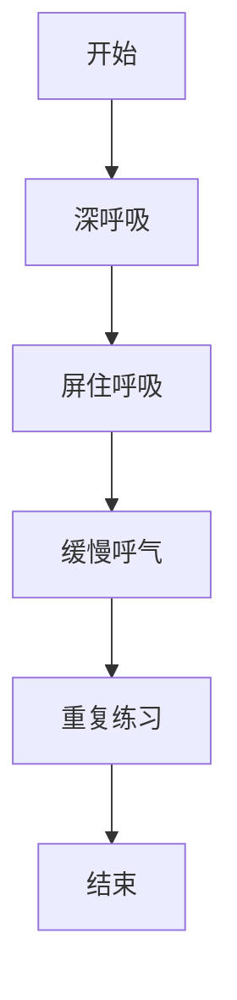

**伪代码**：
```
function breathingExercise(duration) {
    startTime = getCurrentTime();
    while (getCurrentTime() - startTime < duration) {
        inhale();
        holdBreath();
        exhale();
    }
    print("呼吸练习完成");
}

breathingExercise(600);  // 进行10分钟的呼吸练习
```

简单呼吸法通过调节呼吸节奏，有助于降低心率、放松身体，从而减轻紧张和焦虑情绪。通过定期的练习，个体可以更好地掌握这一情绪管理技巧，提高情绪调节能力。

### 3.2 冥想与放松训练

冥想与放松训练是情绪管理中的有效工具，通过集中注意力、放松身心，帮助个体缓解压力、焦虑和紧张情绪。以下是一个简单的冥想与放松训练步骤：

1. **准备工作**：选择一个安静、舒适的环境，坐或躺在一个放松的姿势。
2. **呼吸冥想**：将注意力集中在呼吸上。深吸一口气，感受腹部上升，胸部轻微扩张。缓慢地呼出空气，感受腹部下降，胸部收缩。专注于呼吸节奏，将思绪带回到呼吸上。
3. **身体扫描**：从头到脚逐一扫描身体，感受每个部位的状态。当发现紧张或不适的部位时，轻轻按摩或伸展，以帮助放松。
4. **正念冥想**：将注意力集中在当下的感受，无论是身体感受、情绪波动还是周围环境。接受所有的感受，不评判、不抗拒，保持平和的心态。
5. **结束冥想**：当感觉到身体和心灵都放松下来时，慢慢将注意力带回到周围环境中，缓缓睁开眼睛，慢慢起身。

**Mermaid流程图**：
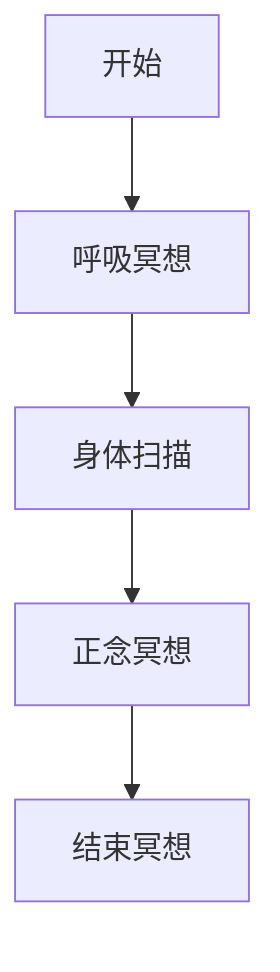

**伪代码**：
```
function meditation(duration) {
    startTime = getCurrentTime();
    while (getCurrentTime() - startTime < duration) {
        breathe();
        scanBody();
        practiceMindfulness();
    }
    print("冥想完成");
}

meditation(600);  // 进行10分钟的冥想与放松训练
```

冥想与放松训练有助于提高个体的心理韧性，减少压力和焦虑情绪。通过定期的练习，个体可以更好地掌握这一情绪管理技巧，提高情绪调节能力。

### 3.3 正念练习

正念练习（Mindfulness Practice）是一种专注于当前时刻、接受现实的心理练习，它有助于提高情绪调节能力，减少焦虑和压力。以下是一个简单的正念练习步骤：

1. **准备工作**：选择一个安静、舒适的环境，坐或躺在一个放松的姿势。
2. **呼吸觉察**：将注意力集中在呼吸上。感受每次吸气和呼气的过程，观察呼吸的节奏和感觉。如果思绪偏离，轻轻地将注意力引回到呼吸上。
3. **身体扫描**：从头到脚逐一扫描身体，感受每个部位的状态。当发现紧张或不适的部位时，轻轻按摩或伸展，以帮助放松。
4. **情绪觉察**：将注意力转移到内心的情绪感受上。接受所有的感受，无论是喜悦、悲伤还是愤怒。不评判、不抗拒，保持平和的心态。
5. **环境觉察**：将注意力扩展到周围的环境中，感受周围的声音、气味和触感。专注于当前时刻，不追忆过去，也不担忧未来。
6. **结束练习**：当感觉到身体和心灵都放松下来时，慢慢将注意力带回到周围环境中，缓缓睁开眼睛，慢慢起身。

**Mermaid流程图**：
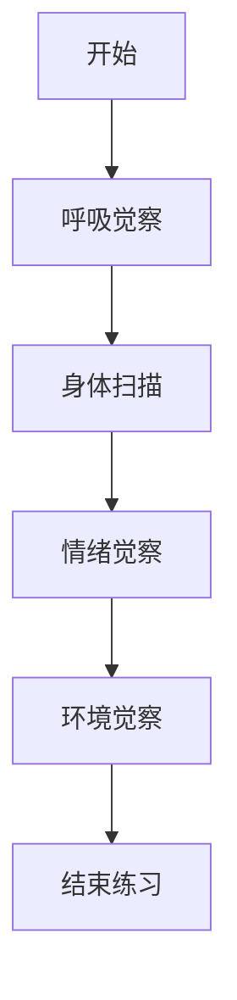

**伪代码**：
```
function mindfulness(duration) {
    startTime = getCurrentTime();
    while (getCurrentTime() - startTime < duration) {
        observeBreathing();
        scanBody();
        observeEmotions();
        observeEnvironment();
    }
    print("正念练习完成");
}

mindfulness(600);  // 进行10分钟的正念练习
```

正念练习有助于提高个体的情绪调节能力，帮助个体更好地应对生活中的压力和挑战。通过定期的练习，个体可以更好地掌握这一情绪管理技巧，提高心理健康和生活质量。

### 4.1 建立有效沟通

建立有效沟通是情绪管理的重要一环，通过良好的沟通，个体可以更好地理解他人，从而调节自己的情绪。以下是一些有效沟通的技巧：

1. **倾听**：倾听是有效沟通的关键。在倾听过程中，要关注对方的言语和非言语信息，不要急于打断或评判。通过倾听，个体可以更好地理解对方的感受和需求，从而减少误解和冲突。

2. **表达**：表达是沟通的另一重要方面。在表达自己的观点和感受时，要尽量清晰、明确，避免使用模糊或模糊的词汇。同时，要注意语气和表情，尽量保持温和和尊重。

3. **反馈**：在沟通过程中，给予及时的反馈可以帮助双方更好地理解对方的意图。通过反馈，个体可以确认自己的观点是否被理解，同时也可以从对方那里获得有用的信息。

4. **情绪管理**：在沟通时，要尽量控制自己的情绪。避免情绪激动或争吵，以免破坏沟通的氛围。通过情绪管理技巧，如深呼吸、冥想等，可以帮助个体在沟通时保持冷静和理智。

5. **非暴力沟通**：非暴力沟通（Nonviolent Communication）是一种有效的沟通技巧，强调以同情和理解为基础进行沟通。通过非暴力沟通，个体可以更好地表达自己的需求和感受，同时也能够倾听和理解对方的观点。

**Mermaid流程图**：
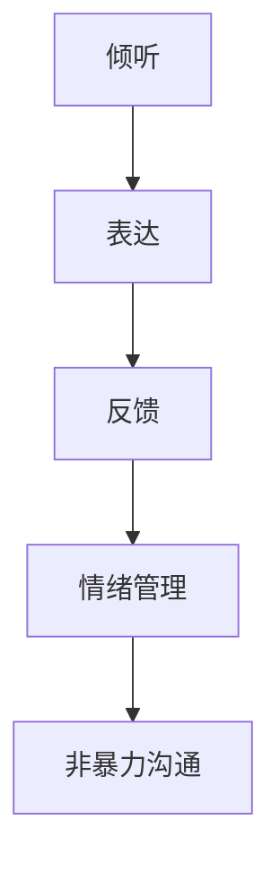

**伪代码**：
```
function effectiveCommunication() {
    while (communication ongoing) {
        listen();
        express();
        provideFeedback();
        manageEmotions();
        nonviolentCommunication();
    }
    print("沟通成功");
}

effectiveCommunication();  // 开始有效沟通
```

通过建立有效沟通，个体可以更好地理解他人，从而调节自己的情绪，减少冲突，提高关系质量。有效沟通是情绪管理中不可或缺的一部分，值得我们重视和实践。

### 4.2 提升情感智力

提升情感智力（Emotional Intelligence，EQ）是情绪管理的重要组成部分。情感智力包括自我意识、自我管理、社交意识和关系管理四个核心能力。以下是一些提升情感智力的方法：

1. **自我意识**：自我意识是指个体能够识别和了解自己的情绪、需求和行为。提升自我意识的技巧包括：

   - **自我反思**：定期花时间思考自己的情绪、行为和反应。通过日记或反思练习，个体可以更好地理解自己的情绪和行为模式。
   - **情绪日记**：记录每天的情绪变化，分析情绪产生的原因和应对策略。这有助于个体了解情绪的波动规律，从而更好地管理情绪。
   - **情绪识别**：学习如何识别和理解自己的情绪，包括情绪的生理、行为和认知表现。通过情绪识别，个体可以更快地识别情绪，并采取适当的调节策略。

2. **自我管理**：自我管理是指个体能够控制情绪、调节行为，并在压力下保持冷静和专注。提升自我管理的技巧包括：

   - **情绪调节**：学会通过深呼吸、冥想、正念练习等方法来调节情绪。这些技巧有助于降低紧张和焦虑情绪，提高情绪稳定性。
   - **情绪释放**：找到合适的渠道释放情绪，如通过运动、写日记或进行创造性活动。情绪释放有助于个体避免情绪积压，减少心理负担。
   - **压力管理**：学会通过时间管理、设定优先级、寻求支持等方法来应对压力。通过有效的压力管理，个体可以更好地应对生活中的挑战。

3. **社交意识**：社交意识是指个体能够理解他人的情绪和需求，并有效地与他人互动。提升社交意识的技巧包括：

   - **倾听**：倾听是建立有效沟通的重要基础。通过倾听，个体可以更好地理解他人的情感和需求，从而提高社交能力。
   - **同理心**：培养同理心，能够站在他人的角度理解和感受他们的情感。同理心有助于建立信任和共鸣，提高人际关系质量。
   - **社交技巧**：学习社交技巧，如如何进行有效的自我介绍、如何与他人建立联系、如何处理冲突等。这些技巧有助于个体在社交场合中更好地表现。

4. **关系管理**：关系管理是指个体能够建立和维护健康的人际关系，并有效地解决冲突。提升关系管理的技巧包括：

   - **沟通**：通过有效沟通，个体可以表达自己的需求、理解和满足他人的需求。良好的沟通有助于解决冲突，增进关系。
   - **冲突解决**：学会通过理性对话和妥协来解决冲突。有效的冲突解决技巧包括识别冲突原因、寻找共同点和制定解决方案。
   - **边界设定**：学会设定健康的边界，保护自己的情感和需求。通过边界设定，个体可以避免过度牺牲或依赖他人。

**Mermaid流程图**：
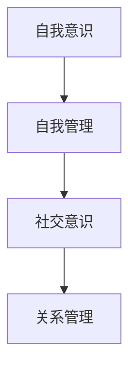

**伪代码**：
```
function improveEmotionalIntelligence() {
    while (ongoing improvement) {
        selfAwareness();
        selfManagement();
        socialAwareness();
        relationshipManagement();
    }
    print("情感智力提升");
}

improveEmotionalIntelligence();  // 开始提升情感智力
```

通过提升情感智力，个体可以更好地管理自己的情绪，提高社交能力，建立和维护健康的人际关系。情感智力是情绪管理的关键，值得我们投入时间和精力去培养和实践。

### 4.3 社交支持系统

社交支持系统（Social Support System）是情绪管理的重要组成部分，它为个体提供情感支持、信息资源和实际帮助，帮助个体应对生活中的压力和挑战。以下是一些关于建立和维护有效社交支持系统的策略：

1. **建立积极的人际关系**：建立和维护良好的人际关系是构建有效社交支持系统的第一步。这包括与家人、朋友和同事建立深厚的情感联系，以及参与社区活动和社交团体。通过积极参与社交活动，个体可以扩大社交圈，增加社交资源。

2. **识别和寻求支持**：当个体面临压力和困难时，识别需要支持和帮助的领域，并主动寻求他人的帮助。这可以通过与朋友、家人或专业人士进行沟通来实现。例如，当遇到工作压力时，可以与同事或上司交流，寻求解决方案；当遇到情感困扰时，可以与心理咨询师或信任的朋友进行咨询。

3. **提供和接受支持**：在社交支持系统中，个体不仅需要接受支持，还应该愿意提供支持。通过互相支持和帮助，个体可以在需要时获得情感支持，同时也可以培养互助精神，增强社交网络的紧密性。

4. **建立健康的边界**：在社交支持系统中，建立健康的边界至关重要。这包括了解自己的需求和界限，以及尊重他人的需求和界限。通过设定健康的边界，个体可以避免过度依赖他人，同时也能更好地保护自己的情感和隐私。

5. **利用社区资源**：社区资源，如社区中心、非营利组织、心理健康机构和咨询服务，是获取社交支持的重要渠道。通过利用这些资源，个体可以获得专业的帮助和支持，提高情绪调节能力。

**Mermaid流程图**：
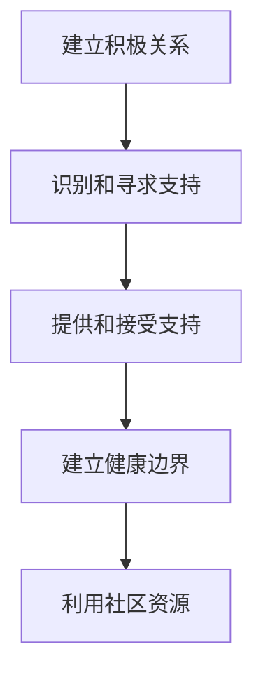

**伪代码**：
```
function establishSocialSupportSystem() {
    while (system ongoing) {
        buildPositiveRelationships();
        identifyAndSeekSupport();
        provideAndAcceptSupport();
        setHealthyBoundaries();
        utilizeCommunityResources();
    }
    print("社交支持系统建立成功");
}

establishSocialSupportSystem();  // 开始建立社交支持系统
```

通过建立和维护有效的社交支持系统，个体可以获得情感支持、信息资源和实际帮助，从而更好地管理情绪，提高生活质量。社交支持系统是情绪管理的重要一环，值得我们重视和实践。

### 5.1 饮食与情绪

饮食与情绪之间存在密切的联系，合理的饮食可以显著影响个体的情绪状态。以下是一些关于饮食与情绪之间关系的关键点：

1. **营养素对情绪的影响**：
   - **蛋白质**：蛋白质是身体合成神经递质（如多巴胺和血清素）的基础，有助于调节情绪。缺锌可能导致情绪不稳定。
   - **复合碳水化合物**：复合碳水化合物（如全谷物、蔬菜和水果）有助于提高血清素的水平，有助于改善情绪和睡眠质量。
   - **脂肪**：健康的脂肪（如欧米茄-3脂肪酸）对大脑健康至关重要，有助于改善情绪。缺乏欧米茄-3脂肪酸可能导致情绪障碍，如抑郁症和焦虑症。
   - **维生素和矿物质**：如维生素D、维生素B群、镁和锌等，对情绪调节有重要作用。维生素D不足与情绪低落和抑郁症有关。

2. **饮食习惯对情绪的影响**：
   - **规律饮食**：规律的饮食习惯有助于维持血糖水平的稳定，减少情绪波动。不吃早餐或饮食习惯不规律可能导致情绪不稳定。
   - **低糖饮食**：高糖饮食可能导致血糖水平迅速升高和下降，引起情绪波动。减少糖分摄入有助于稳定情绪。
   - **减少加工食品**：加工食品通常含有较多的添加剂和防腐剂，这些成分可能对情绪产生不利影响。减少加工食品的摄入有助于改善情绪。

3. **饮食与情绪调节的案例**：
   - **案例一**：一个长期情绪低落的人通过增加蛋白质摄入和减少糖分摄入，改善了情绪状态。他增加了鱼、鸡蛋、坚果等高蛋白食物的摄入，同时减少了糖果和甜点的摄入，逐渐恢复了积极的生活态度。
   - **案例二**：一位焦虑症患者通过饮食调整，如增加富含欧米茄-3脂肪酸的食物（如三文鱼、亚麻籽）和减少咖啡因摄入，显著改善了焦虑症状。她通过饮食改善了大脑的神经传递功能，提高了情绪稳定性。

**Mermaid流程图**：
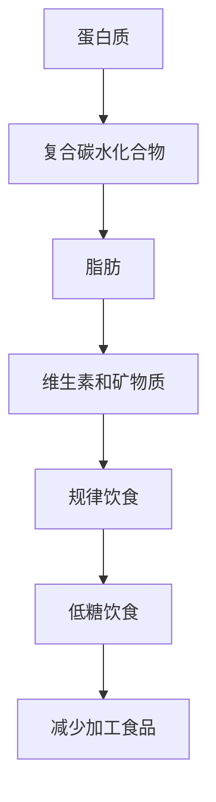

**伪代码**：
```
function dietaryEmotionRegulation() {
    increaseProteinIntake();
    reduceSugarIntake();
    addHealthyFats();
    ensureRegularDiet();
    minimizeProcessedFood();
    print("饮食与情绪调节成功");
}

dietaryEmotionRegulation();  // 开始进行饮食与情绪调节
```

通过合理的饮食和饮食习惯，个体可以显著改善情绪状态，提高心理健康。了解饮食与情绪之间的关系，有助于我们更好地管理情绪，实现身心健康。

### 5.2 运动对情绪的影响

运动对情绪有显著的积极影响，通过促进生理和心理的多种机制，帮助个体调节情绪、减轻压力和焦虑。以下是一些关于运动对情绪影响的关键点：

1. **生理机制**：
   - **神经递质释放**：运动可以促进大脑中神经递质的释放，如内啡肽、多巴胺和血清素。这些神经递质能够提升个体的幸福感，减少负面情绪。
   - **降低应激激素**：运动有助于降低应激激素，如皮质醇的水平，从而减轻压力和焦虑。
   - **改善心血管健康**：规律的运动有助于改善心血管健康，提高心率变异性，有助于情绪稳定。

2. **心理机制**：
   - **分散注意力**：运动可以分散个体的注意力，减少对负面情绪的关注。通过专注于运动本身，个体可以暂时忘记压力和烦恼。
   - **提升自尊和自信**：运动能够增强个体的身体能力，提高自尊和自信，从而改善情绪状态。
   - **释放情绪**：运动是一种有效的情绪释放途径。通过运动，个体可以释放累积的情绪压力，如愤怒、焦虑和抑郁。

3. **实际案例**：
   - **案例一**：一位长期受到焦虑困扰的职场人士，通过每天进行30分钟的有氧运动（如跑步或游泳），显著改善了焦虑症状。他发现，运动后身体放松，心情愉悦，焦虑感明显减轻。
   - **案例二**：一位患有抑郁症的女士，通过参与瑜伽和冥想课程，逐步恢复了情绪稳定性。她发现，瑜伽和冥想不仅改善了她的身体状况，还帮助她学会了如何管理情绪。

**Mermaid流程图**：
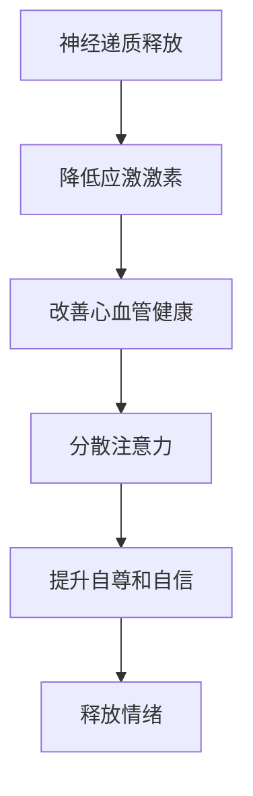

**伪代码**：
```
function exerciseEmotionRegulation() {
    promoteNeurotransmitterRelease();
    reduceStressHormones();
    improveCardiovascularHealth();
    distractAttention();
    boostSelfEsteem();
    releaseEmotions();
    print("运动对情绪的影响显著");
}

exerciseEmotionRegulation();  // 开始进行运动与情绪调节
```

通过运动，个体可以显著改善情绪状态，减轻压力和焦虑。了解运动对情绪的积极影响，有助于我们更好地管理情绪，提高生活质量。

### 5.3 饮食与运动的结合策略

将饮食与运动结合起来，可以显著增强情绪管理的效果，帮助个体在生理和心理层面同时获得积极影响。以下是一些关于饮食与运动结合策略的关键点：

1. **营养支持**：
   - **优质蛋白质**：优质蛋白质（如鸡肉、鱼类、豆类和蛋类）能够促进肌肉恢复，同时释放内啡肽，提升情绪。
   - **健康脂肪**：健康脂肪（如富含欧米茄-3脂肪酸的鱼类和坚果）有助于改善大脑功能，提高情绪稳定性。
   - **复合碳水化合物**：复合碳水化合物（如全谷物、蔬菜和水果）能够提供持久的能量，减少血糖波动，有助于情绪稳定。

2. **运动选择**：
   - **有氧运动**：如跑步、游泳和骑自行车，这些运动能够促进内啡肽的释放，缓解压力和焦虑。
   - **力量训练**：如举重和阻力训练，这些运动能够增强肌肉力量，提高自信心和自尊，有助于情绪调节。
   - **伸展运动**：如瑜伽和普拉提，这些运动有助于放松身体，减轻紧张和焦虑。

3. **结合策略**：
   - **规律饮食**：保持规律的饮食习惯，确保每天摄入充足的营养素，有助于身体和情绪的稳定。
   - **运动前热身**：在运动前进行适当的热身，如慢跑或伸展运动，可以减少受伤风险，提高运动效果。
   - **运动后恢复**：运动后，通过适当的拉伸和营养摄入，帮助身体恢复，减少疲劳和肌肉酸痛。
   - **综合方法**：结合饮食和运动，制定个性化的情绪管理计划，根据个人需求和偏好进行调整。

**Mermaid流程图**：
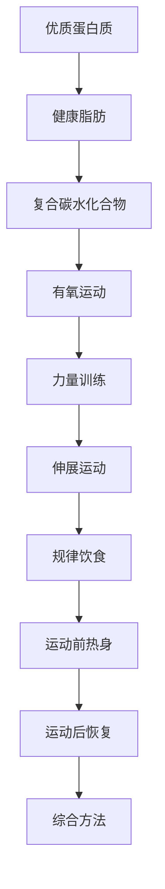

**伪代码**：
```
function combinedDietAndExerciseStrategy() {
    includeHighQualityProteins();
    consumeHealthyFats();
    eatComplexCarbohydrates();
    engageInAerobicExercise();
    performStrengthTraining();
    practiceStretchingExercises();
    maintainRegularDiet();
    warmUpBeforeExercise();
    recoverAfterExercise();
    implementIntegratedMethods();
    print("饮食与运动结合策略成功");
}

combinedDietAndExerciseStrategy();  // 开始执行饮食与运动的结合策略
```

通过将饮食与运动结合起来，个体可以更全面地管理情绪，提高身心健康。了解和执行这些结合策略，有助于我们在日常生活中更好地调节情绪，实现身心和谐。

### 6.1 认知行为疗法

认知行为疗法（Cognitive Behavioral Therapy，CBT）是一种广泛应用于情绪调节和心理治疗的心理学干预方法。它通过改变个体的认知和行为，帮助个体改善情绪和心理状态。以下将详细阐述认知行为疗法的基本原理、核心技巧和实际应用。

#### 基本原理

认知行为疗法的基本原理是，个体的情绪和行为是由其认知（即对事件的思考和解释）直接影响的。CBT 的核心观点是，通过改变不合理的认知，可以改善情绪和行为。CBT 强调，情绪问题往往源于认知错误，如过度概括、以偏概全和灾难化思维等。

#### 核心技巧

1. **认知重构**：认知重构是 CBT 的核心技巧之一，旨在帮助个体识别和改变不合理的认知。通过识别负面思维模式，个体可以学习用更理性、更积极的方式来看待事件。以下是一个认知重构的例子：

   - **负面思维**：“我无法完成任务，一定会失败。”
   - **认知重构**：“虽然任务有难度，但通过努力和学习，我有机会成功。”

2. **行为激活**：行为激活通过鼓励个体参与积极的行动来改善情绪。例如，如果个体因抑郁而减少社交活动，治疗师可能会建议他们逐渐增加与朋友的互动。以下是一个行为激活的例子：

   - **负面行为**：“我总是感到沮丧，不想做任何事情。”
   - **行为激活**：“每天安排一些小活动，如散步或与朋友聊天。”

3. **技能训练**：CBT 还包括各种技能训练，如解决问题的技巧、压力管理和时间管理。这些技能有助于个体更好地应对生活中的挑战。以下是一个技能训练的例子：

   - **压力管理**：学习通过深呼吸、冥想和正念练习来减轻压力。
   - **时间管理**：学习如何合理安排时间和任务，减少拖延。

#### 实际应用

1. **抑郁症治疗**：CBT 在抑郁症治疗中表现出色。通过认知重构和行为激活，个体可以减少抑郁情绪，提高生活质量。

2. **焦虑症治疗**：CBT 适用于治疗各种形式的焦虑症，如广泛性焦虑症、社交焦虑症和特定恐惧症。通过认知重构和暴露疗法，个体可以逐步克服焦虑。

3. **压力管理**：CBT 帮助个体识别和管理生活中的压力源。通过学习技能和改变认知，个体可以更好地应对压力，减少焦虑和抑郁。

#### 案例

**案例一**：一位长期焦虑的上班族通过 CBT 学会了如何识别和改变负面思维。在治疗过程中，她学会了认知重构技巧，例如将“我一定会失败”改为“虽然任务有挑战，但我可以通过努力解决问题”。通过这一改变，她的焦虑感显著减轻，工作效率也提高了。

**案例二**：一位患有社交焦虑的年轻人通过 CBT 学习了行为激活和社交技能训练。在治疗过程中，他逐渐增加了社交活动，例如与朋友共进晚餐和参加社区活动。通过这些实践，他的社交焦虑显著减少，自信心逐步提升。

总之，认知行为疗法是一种有效的情绪调节和心理治疗方法。通过改变认知和行为，个体可以显著改善情绪和心理状态，提高生活质量。

### 6.2 情绪调节技巧

情绪调节技巧是情绪管理的重要组成部分，通过这些技巧，个体可以在日常生活中有效地调节情绪，减轻压力和焦虑。以下是一些常见的情绪调节技巧：

1. **情绪识别**：情绪识别是情绪调节的第一步，它要求个体能够准确地识别和理解自己的情绪。通过情绪识别，个体可以更好地了解自己的情绪状态，从而采取适当的调节策略。以下是一个情绪识别的例子：

   - **负面情绪**：感到焦虑、愤怒或沮丧。
   - **情绪识别**：认识到自己正在经历这些情绪，并尝试理解这些情绪的来源和原因。

2. **情绪表达**：情绪表达是指个体如何表达自己的情绪，包括言语和非言语表达。有效的情绪表达有助于个体与他人建立更好的沟通，减少误解和冲突。以下是一个情绪表达的例子：

   - **负面情绪**：感到沮丧。
   - **情绪表达**：“我最近感到有些沮丧，因为工作压力很大。我觉得需要和你谈谈，看看有没有什么可以帮助我缓解压力的方法。”

3. **情绪调节策略**：情绪调节策略是指个体如何采取具体行动来调节情绪。以下是一些常见的情绪调节策略：

   - **深呼吸**：通过深呼吸，个体可以放松身体，减少焦虑和紧张情绪。
   - **正念冥想**：通过正念冥想，个体可以专注于当下，减少杂念，提高情绪稳定性。
   - **运动**：运动有助于释放内啡肽，提升情绪，减少焦虑和抑郁。
   - **写日记**：通过写日记，个体可以记录自己的情绪和想法，有助于情绪释放和自我反思。

**Mermaid流程图**：
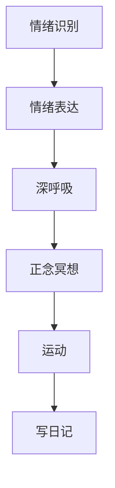

**伪代码**：
```
function emotionRegulation() {
    while (emotions exist) {
        identifyEmotions();
        expressEmotions();
        breatheDeeply();
        practiceMindfulness();
        exercise();
        writeJournal();
    }
    print("情绪调节技巧应用成功");
}

emotionRegulation();  // 开始进行情绪调节
```

通过情绪识别、情绪表达和情绪调节策略，个体可以更有效地管理情绪，提高心理健康和生活质量。这些情绪调节技巧是日常生活中宝贵的工具，值得我们掌握和应用。

### 6.3 心理咨询与治疗

心理咨询与治疗是情绪管理的重要手段，通过专业的心理辅导和治疗，个体可以获得有效的情绪调节和支持，提升心理健康。以下将介绍心理咨询与治疗的基本概念、常见方法以及实际应用。

#### 基本概念

心理咨询与治疗是指通过专业的心理干预，帮助个体解决心理问题、改善情绪和行为的过程。心理咨询通常注重日常生活中的问题，如人际关系、职业压力和情感困扰；而心理治疗则侧重于更严重的心理问题，如抑郁症、焦虑症和创伤后应激障碍。

#### 常见方法

1. **认知行为疗法（CBT）**：认知行为疗法是一种广泛应用于情绪调节和心理治疗的方法。它通过识别和改变不合理的认知，帮助个体改善情绪和行为。CBT 包括认知重构、行为激活和技能训练等技巧。

2. **心理动力学治疗**：心理动力学治疗关注个体的潜意识过程和童年经历，通过探索和理解这些因素，帮助个体解决深层次的心理问题。

3. **人本主义治疗**：人本主义治疗强调个体的自我实现和自我决定，通过建立积极的辅导关系，帮助个体发现和实现自己的潜力。

4. **心理分析治疗**：心理分析治疗是一种深入的长期治疗方法，通过分析梦、自由联想和移情关系，帮助个体理解潜意识冲突和内心矛盾。

#### 实际应用

1. **抑郁症治疗**：心理咨询与治疗在抑郁症治疗中表现出色。通过认知行为疗法，个体可以改变负面思维模式，提高积极情绪。心理动力学治疗和情感焦点治疗也可以帮助个体探索和解决抑郁症的根源。

2. **焦虑症治疗**：焦虑症的治疗通常包括认知行为疗法、正念疗法和暴露疗法。这些方法有助于个体逐步克服焦虑，提高情绪稳定性。

3. **创伤后应激障碍（PTSD）治疗**：心理治疗，如眼动脱敏与再加工疗法（EMDR）和创伤中心治疗，可以帮助个体处理创伤记忆，减轻PTSD症状。

#### 案例

**案例一**：一位长期受焦虑困扰的职场人士通过认知行为疗法（CBT）取得了显著改善。在治疗过程中，他学会了认知重构技巧，如将“我一定会失败”改为“虽然任务有挑战，但我可以通过努力解决问题”。通过这些改变，他的焦虑感显著减轻，工作效率也提高了。

**案例二**：一位经历过严重创伤的退伍军人通过创伤中心治疗（PTSD）逐步恢复了心理平衡。在治疗过程中，他学会了如何处理创伤记忆，并找到了有效的方法来应对应激反应，如通过正念练习和深呼吸来放松身心。

总之，心理咨询与治疗是情绪管理的重要手段，通过专业的心理干预，个体可以获得有效的情绪调节和支持，提升心理健康。了解和利用这些心理治疗方法，有助于我们在面对心理问题时寻求专业帮助。

### 7.1 设定情绪管理目标

设定情绪管理目标是情绪管理过程中至关重要的一步，它为个体提供了明确的行动方向和目标，有助于持续改进情绪调节能力。以下是如何设定情绪管理目标的步骤：

1. **自我评估**：首先，个体需要对自己的情绪状态进行评估，了解自己的情绪反应模式、常见的情绪问题以及这些情绪问题对生活的影响。通过自我评估，个体可以明确需要改进的方面。

2. **目标明确**：在自我评估的基础上，个体需要设定具体、明确的目标。目标应该具有可衡量性，例如“减少焦虑发作的频率”或“提高积极情绪体验的时间”。目标需要具体到每一天或每周，以便个体可以跟踪进展。

3. **目标具体化**：将目标具体化，包括设定具体的行动步骤和时间表。例如，如果目标是“减少焦虑发作的频率”，可以具体化为“每天进行30分钟的放松练习，每周减少一次焦虑发作”。

4. **设定优先级**：根据目标的紧急性和重要性，设定优先级。例如，如果焦虑对工作影响较大，可以将改善工作相关的焦虑作为首要目标。

5. **制定行动计划**：为每个目标制定详细的行动计划，包括具体的行动步骤、资源和时间安排。行动计划有助于个体更好地执行目标。

6. **定期评估和调整**：定期评估目标的完成情况，并根据评估结果进行调整。例如，如果某个目标进展缓慢，可以重新评估目标设定，调整行动计划。

**Mermaid流程图**：
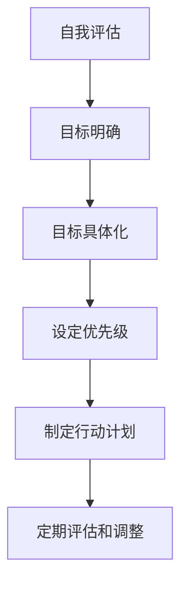

**伪代码**：
```
function setEmotionManagementGoals() {
    performSelfAssessment();
    defineClearGoals();
    specifyGoals();
    setPriorities();
    createActionPlan();
    regularlyEvaluateAndAdjust();
    print("情绪管理目标设定成功");
}

setEmotionManagementGoals();  // 开始设定情绪管理目标
```

通过设定明确的情绪管理目标，个体可以更有针对性地进行情绪调节，逐步提高情绪调节能力，实现心理健康和生活的平衡。

### 7.2 情绪管理日记

情绪管理日记是一种有效的自我反思工具，通过记录和反思情绪变化，个体可以更好地了解自己的情绪模式，从而进行有效的情绪调节。以下是如何保持情绪管理日记的步骤：

1. **选择合适的记录方式**：个体可以根据自己的习惯和偏好选择记录方式，如手写日记、电子日记或语音记录。选择一种方便自己且愿意坚持的方式进行记录。

2. **定期记录**：设定一个固定的记录时间，例如每天晚上或每周的某个时间点。定期记录有助于个体养成习惯，并能够连续地观察情绪变化。

3. **详细记录情绪**：在日记中详细记录当天的情绪变化，包括情绪的类型（如快乐、愤怒、悲伤等）、情绪发生的时间、情境以及情绪持续的时间。例如，“今天下午3点，在开会时感到愤怒，原因是同事的发言让我觉得不被重视，情绪持续了约20分钟。”

4. **反思情绪原因**：在记录情绪后，花时间反思情绪的起因和原因。分析情绪背后的触发因素，例如是否与工作压力、人际关系或其他生活事件有关。通过反思，个体可以更好地理解情绪背后的原因。

5. **记录应对策略**：记录在面对情绪时采取的应对策略，如深呼吸、冥想、运动或与他人交流等。这有助于个体评估不同策略的有效性，并在未来遇到类似情绪时能够快速采取有效的应对措施。

6. **定期回顾和调整**：定期回顾情绪管理日记，观察情绪变化的规律和模式。通过回顾，个体可以发现情绪调节中的成功经验和不足之处，并根据需要调整情绪管理策略。

**Mermaid流程图**：
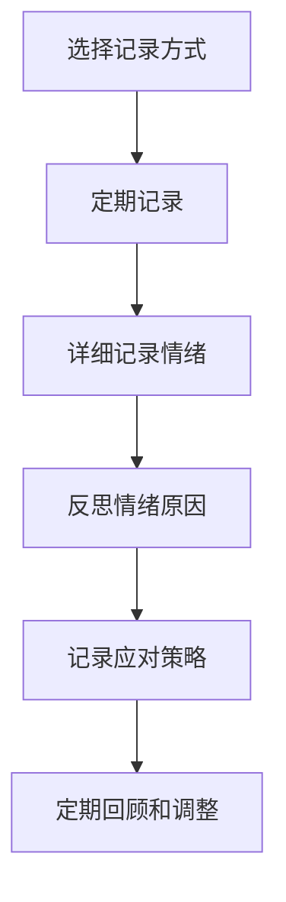

**伪代码**：
```
function maintainEmotionJournal() {
    chooseJournalMethod();
    scheduleRegularEntries();
    recordEmotions();
    reflectOnEmotionCauses();
    documentResponseStrategies();
    regularlyReviewAndAdjust();
    print("情绪管理日记保持成功");
}

maintainEmotionJournal();  // 开始保持情绪管理日记
```

通过保持情绪管理日记，个体可以更好地认识自己的情绪变化，学会有效的情绪调节策略，从而提高情绪调节能力和生活质量。

### 7.3 情绪管理案例分享

情绪管理案例分享有助于读者了解情绪管理在实际生活中的应用，通过具体案例的学习，读者可以借鉴他人的经验，提高自己的情绪管理能力。以下将分享三个情绪管理的实际案例。

**案例一：职场压力管理**

**背景**：李先生是一名IT公司的项目经理，工作繁忙，经常面临项目截止日期的压力。长期的压力使他感到焦虑，影响了工作效率和人际关系。

**策略**：
1. **认知重构**：李先生通过认知重构技巧，改变了“任务必须一次性完成”的不合理信念，学会了分解任务，逐步完成。
2. **时间管理**：李先生开始使用时间管理工具，合理安排工作，确保有足够的时间处理紧急任务，减少时间压力。
3. **运动和放松**：每天下班后，李先生会进行30分钟的运动，如慢跑或瑜伽，以缓解工作压力。

**结果**：通过上述策略，李先生的焦虑感明显减轻，工作效率提高，与同事的关系也得到了改善。

**案例二：人际关系冲突解决**

**背景**：王女士是一位公司高层管理者，工作中经常需要与下属和同事沟通。然而，她发现自己在处理人际关系冲突时，经常情绪失控，导致冲突升级。

**策略**：
1. **倾听和表达**：王女士学会了倾听他人的观点，并通过有效的表达技巧，清晰、冷静地表达自己的意见。
2. **情绪调节**：在冲突发生时，王女士会先进行深呼吸，控制自己的情绪，然后再进行沟通。
3. **寻求第三方帮助**：当冲突难以解决时，王女士会寻求人力资源部门的帮助，通过调解来解决问题。

**结果**：通过这些策略，王女士的人际关系得到了显著改善，冲突解决的效率提高，团队的凝聚力增强。

**案例三：应对焦虑与抑郁**

**背景**：张先生是一位自由职业者，由于工作不稳定和长期的家庭压力，他逐渐出现了焦虑和抑郁情绪。

**策略**：
1. **心理咨询**：张先生定期进行心理咨询，通过认知行为疗法和情感焦点治疗，逐步克服了焦虑和抑郁。
2. **社交支持**：张先生加入了兴趣小组，通过参加社交活动，扩大了自己的社交圈子，获得了情感支持。
3. **健康生活**：张先生开始注重健康饮食和适量运动，通过改善生活方式，提高了情绪稳定性。

**结果**：通过上述策略，张先生的情绪逐渐稳定，焦虑和抑郁症状得到显著缓解，生活质量得到提高。

通过这些实际案例，我们可以看到情绪管理在不同生活场景中的应用。了解和借鉴这些案例中的策略，可以帮助读者在实际生活中更好地管理情绪，提高心理健康。

### 8.1 情绪管理的发展趋势

情绪管理作为心理学和健康科学的重要研究领域，正随着科技的进步和社会的发展而不断演变。当前，情绪管理的发展趋势主要体现在以下几个方面：

1. **科技在情绪管理中的应用**：
   - **虚拟现实（VR）疗法**：虚拟现实技术为情绪管理提供了新的工具。通过虚拟环境，个体可以进行模拟情境训练，如面对社交恐惧或焦虑的情境。VR疗法已被证明在治疗焦虑症和创伤后应激障碍（PTSD）方面具有显著效果。
   - **人工智能（AI）与情绪分析**：人工智能技术能够通过语音、文字和面部表情分析，实时监测个体的情绪状态。例如，AI情绪分析软件可以帮助心理咨询师更准确地了解客户的情绪，从而提供更个性化的治疗方案。
   - **可穿戴设备**：可穿戴设备如智能手表和健康监测器，能够实时记录个体的生理数据，如心率、血压和睡眠质量。这些数据有助于个体更好地了解自己的情绪状态，并进行相应的调节。

2. **未来情绪管理的新方向**：
   - **个性化情绪管理**：未来的情绪管理将更加注重个性化。通过大数据和机器学习技术，情绪管理工具将能够根据个体的情绪历史、行为模式和生活环境，提供个性化的情绪管理建议。
   - **跨学科整合**：情绪管理将逐步整合心理学、神经科学、医学和科技等多个学科。例如，神经反馈疗法结合了生物反馈技术，可以帮助个体通过训练调节大脑活动，实现情绪的稳定。
   - **虚拟健康顾问**：随着AI技术的进步，虚拟健康顾问将成为未来的一个重要趋势。这些虚拟顾问能够提供24/7的情绪支持和建议，帮助个体在需要时获得及时的帮助。

3. **情绪管理与心理健康**：
   - **预防性情绪管理**：未来的情绪管理将更注重预防，通过早期的情绪干预和情绪教育，减少情绪障碍的发生。学校、企业和社区将更多地推广情绪管理课程，帮助个体培养良好的情绪调节能力。
   - **综合性治疗**：情绪管理和心理健康治疗将更加综合。除了传统的心理咨询和治疗，心理健康服务将结合药物治疗、心理训练和科技应用，提供全方位的治疗方案。

总之，情绪管理的发展趋势预示着一个更加智能、个性化和综合化的未来。随着科技的进步和跨学科的整合，情绪管理将在心理健康领域发挥更大的作用，为个体提供更全面、更有效的情绪调节支持。

### 8.2 情绪管理的发展趋势：科技的应用

随着科技的快速发展，科技在情绪管理中的应用越来越广泛，为个体提供了更多元化和个性化的情绪调节工具。以下将详细探讨虚拟现实（VR）疗法、人工智能（AI）和可穿戴设备等技术在情绪管理中的具体应用。

1. **虚拟现实（VR）疗法**：

虚拟现实疗法是一种利用虚拟环境进行心理干预的技术，特别适用于治疗焦虑症、恐惧症和创伤后应激障碍（PTSD）。通过VR技术，个体可以在一个可控的虚拟环境中逐步面对和克服真实的情绪困扰。

   - **情境模拟**：VR疗法可以创建各种模拟情境，如公共场合、飞行或高度场所等，个体可以在虚拟环境中逐渐适应和减少对这些情境的恐惧和焦虑。
   - **渐进性暴露**：在VR疗法中，个体会逐渐增加面对恐惧情境的时间，从较不具挑战性的情境开始，逐步提升面对真实情境的信心和适应能力。
   - **治疗效果**：研究表明，VR疗法在治疗焦虑症和PTSD方面具有显著效果，能够显著减轻个体的焦虑情绪，提高生活质量和心理健康。

2. **人工智能（AI）与情绪分析**：

人工智能技术在情绪管理中的应用日益广泛，通过分析个体的语言、声音、面部表情和行为，AI能够实时监测和评估个体的情绪状态。

   - **情绪识别**：AI情绪分析软件可以使用自然语言处理（NLP）和计算机视觉技术，从文本、语音和面部表情中识别和分类情绪。例如，通过分析社交媒体帖子或通话记录，AI可以识别出用户的情绪状态。
   - **情绪预测**：基于历史数据和分析模型，AI可以预测个体在未来可能出现的情绪波动。例如，通过分析用户的日常活动和情绪日志，AI可以提前预警潜在的焦虑或抑郁风险。
   - **个性化建议**：AI情绪分析可以为个体提供个性化的情绪调节建议。例如，当AI检测到用户情绪低落时，可以推荐进行深呼吸练习或进行社交活动，帮助用户改善情绪。

3. **可穿戴设备**：

可穿戴设备如智能手表、健康监测器和心电监测器，能够实时记录个体的生理数据，如心率、血压、睡眠质量和运动量，为情绪管理提供了重要的数据支持。

   - **生理数据监测**：通过监测心率、血压等生理指标，可穿戴设备可以及时发现异常，帮助个体了解自己的生理状态与情绪变化的关系。例如，心率变异（HRV）是一种常用的情绪评估指标，通过分析HRV数据，可以了解个体的情绪波动和压力水平。
   - **实时反馈**：一些先进的可穿戴设备能够提供实时反馈，帮助个体及时调整情绪。例如，当监测到个体处于高压状态时，设备可以提醒用户进行深呼吸或放松练习。
   - **数据分析**：通过收集和分析长时间的数据，可穿戴设备可以为个体提供个性化的情绪管理策略。例如，基于对运动和饮食与情绪关系的分析，设备可以推荐最适合用户的情绪调节方案。

综上所述，科技在情绪管理中的应用不仅为个体提供了更便捷的情绪监测和调节工具，还通过个性化建议和实时反馈，帮助个体更好地理解和管理自己的情绪。随着科技的不断进步，这些应用将更加成熟和普及，为情绪管理领域带来更多的创新和发展。

### 8.3 情绪管理与心理健康

情绪管理与心理健康密切相关，通过有效的情绪管理，个体可以显著改善心理健康，提高生活质量和幸福感。以下将讨论情绪管理如何影响心理健康，以及心理健康对情绪管理的重要性。

**情绪管理对心理健康的影响**：

1. **减少心理压力**：情绪管理技巧如深呼吸、冥想和正念练习，可以帮助个体在压力情境中保持冷静，减少心理压力。长期的压力积累可能导致焦虑、抑郁等心理问题，通过情绪管理，个体可以更好地应对日常生活中的压力源。

2. **提高情绪稳定性**：情绪管理技巧有助于个体稳定自己的情绪，减少情绪波动。情绪稳定性是心理健康的重要指标，稳定的情绪有助于个体更好地处理人际关系和应对生活中的挑战。

3. **增强心理韧性**：心理韧性是指个体在面对逆境和压力时，能够迅速恢复并保持积极心态的能力。通过情绪管理，个体可以培养心理韧性，提高对逆境的适应能力，减少心理创伤和长期的心理问题。

4. **改善睡眠质量**：情绪管理有助于改善睡眠质量。情绪不稳定可能导致失眠和睡眠质量问题，而良好的情绪管理技巧如放松训练和深呼吸练习，可以帮助个体入睡，并保持良好的睡眠。

**心理健康对情绪管理的重要性**：

1. **情绪识别和表达**：心理健康良好的个体更容易识别和理解自己的情绪，并能够以健康的方式表达这些情绪。缺乏心理健康可能导致情绪障碍，如情绪抑制或情绪爆发，这些情况会严重影响情绪管理。

2. **应对能力**：心理健康良好的个体具备更强的应对能力，能够更有效地处理生活中的压力和挑战。通过心理健康维护，个体可以更好地应用情绪管理技巧，提高情绪调节能力。

3. **认知功能**：心理健康与认知功能密切相关。心理健康良好的个体通常拥有更好的认知功能，包括注意力、记忆力和决策能力。这些认知功能对于情绪管理至关重要，有助于个体更好地理解和应对情绪。

4. **人际关系**：心理健康良好的个体更容易建立和维护良好的人际关系。情绪管理是人际关系的重要部分，心理健康有助于个体以积极的方式与他人互动，减少冲突，建立信任和亲密感。

总之，情绪管理与心理健康相互影响，通过有效的情绪管理，个体可以显著改善心理健康，提高生活质量。同时，心理健康是情绪管理的基础，只有心理健康得到维护，个体才能更好地应用情绪管理技巧，实现情绪的平衡与稳定。

### 附录A：情绪管理资源推荐

情绪管理作为一项重要的生活技能，需要不断的探索和学习。以下是一些推荐的书籍、网站和应用，可以帮助个体更好地理解和实践情绪管理。

#### A.1 推荐书籍

1. **《情绪管理的艺术》** - 该书详细介绍了情绪管理的基本原理和实践技巧，适合初学者阅读。
2. **《如何控制你的情绪》** - 这本书提供了多种情绪调节方法，包括认知行为疗法和正念练习，帮助读者掌握情绪管理技巧。
3. **《情绪调节心理学》** - 该书深入探讨了情绪调节的心理机制和科学依据，适合对情绪管理有深入兴趣的读者。

#### A.2 推荐网站

1. **美国国家心理健康协会（NIMH）** - 提供权威的心理健康信息和资源，包括情绪管理的相关知识。
2. **心理咨询网** - 提供专业的心理咨询服务，包括情绪调节和心理治疗。
3. **情绪管理研究中心** - 提供情绪管理的研究成果和应用指南，适合对情绪管理有学术兴趣的读者。

#### A.3 推荐应用

1. **Headspace** - 提供一系列冥想和放松练习，帮助用户管理情绪和压力。
2. **Calm** - 提供放松音乐、冥想指导和呼吸练习，适合想要缓解焦虑和改善睡眠的用户。
3. **Moodfit** - 提供个性化的情绪管理计划和每日情绪追踪，帮助用户了解自己的情绪变化，并提供相应的调节建议。

通过这些书籍、网站和应用的推荐，读者可以获取更多关于情绪管理的知识和资源，提升自己的情绪管理能力，实现心理健康和生活的平衡。

### 附录B：情绪管理实践工具

情绪管理实践工具为个体提供了具体的方法和资源，以帮助他们在日常生活中更好地管理情绪。以下是一些情绪管理实践工具的详细介绍，包括呼吸练习指南、冥想与放松训练指南以及情绪管理应用程序推荐。

#### B.1 呼吸练习指南

**4-7-8呼吸法**：
- **步骤**：
  1. 通过鼻子深吸一口气，数到4。
  2. 屏住呼吸，数到7。
  3. 通过嘴巴慢慢呼气，数到8。
- **效果**：这种呼吸法有助于放松身体、降低心率和缓解焦虑。建议每天练习几次，每次练习约5-10分钟。

**默数呼吸法**：
- **步骤**：
  1. 通过鼻子缓慢吸气，感受腹部上升。
  2. 屏住呼吸，默数到10。
  3. 通过嘴巴缓慢呼气，感受腹部下降。
  4. 重复上述步骤，直到感觉放松。
- **效果**：这种呼吸法有助于集中注意力，减少杂念，提升情绪稳定性。

#### B.2 冥想与放松训练指南

**正念冥想**：
- **步骤**：
  1. 选择一个安静的环境，采取一个舒适的姿势。
  2. 将注意力集中在呼吸上，观察每次吸气和呼气的过程。
  3. 当注意力离开呼吸时，轻轻地将注意力带回到呼吸上。
  4. 练习时，保持身体和心灵的放松。
- **效果**：正念冥想有助于提高专注力、减少焦虑和压力，提升情绪稳定性。

**渐进性肌肉放松**：
- **步骤**：
  1. 选择一个舒适的姿势，闭上眼睛。
  2. 逐一放松身体的不同部位，从脚开始到头部。
  3. 对每个部位进行紧张的肌肉收缩，然后放松。
  4. 保持深呼吸，专注于肌肉的紧张和放松。
- **效果**：这种放松训练有助于减轻身体紧张和焦虑，提高情绪稳定性。

#### B.3 情绪管理应用程序推荐

1. **Headspace**：
   - **功能**：提供定制的冥想和放松练习，涵盖日常压力管理、睡眠改善和情绪调节等多种主题。
   - **优点**：内容丰富，指导清晰，适合初学者和有经验的冥想者。

2. **Calm**：
   - **功能**：提供放松音乐、睡眠指导、冥想练习和呼吸练习，帮助用户缓解压力和焦虑。
   - **优点**：界面简洁，声音质量高，适合在睡前使用。

3. **Moodfit**：
   - **功能**：提供个性化的情绪管理计划和每日情绪追踪，通过数据分析和个性化建议帮助用户了解和管理情绪。
   - **优点**：功能全面，交互友好，适合希望深入了解自己情绪变化的用户。

通过这些情绪管理实践工具，个体可以在日常生活中更容易地应用情绪管理技巧，提高情绪调节能力，实现心理和情绪的健康平衡。

### 结语

情绪管理作为一门科学，对于个体心理健康和幸福感具有重要意义。本文通过详细的阐述和案例分析，帮助读者了解了情绪管理的理论基础、心理机制、实践技巧和未来展望。情绪管理不仅仅是心理学领域的研究课题，更是我们在日常生活中需要掌握的重要技能。通过学习情绪管理，我们可以更好地应对生活中的压力和挑战，提高心理健康和幸福感。

在此，我衷心感谢您的阅读，希望本文能够对您在情绪管理方面有所启发。如果您有任何疑问或建议，请随时与我交流。让我们一起努力，提高情绪管理能力，实现身心健康和生活的平衡。

## 作者信息

作者：AI天才研究院/AI Genius Institute & 禅与计算机程序设计艺术 /Zen And The Art of Computer Programming

---

通过本文，我们深入探讨了情绪管理的各个方面，从理论基础到实践技巧，再到未来展望，希望能够为读者提供全面和实用的情绪管理指南。感谢您的关注，让我们一起在情绪管理的道路上不断前行。祝您心理健康，生活愉快！ <|endoftext|>

