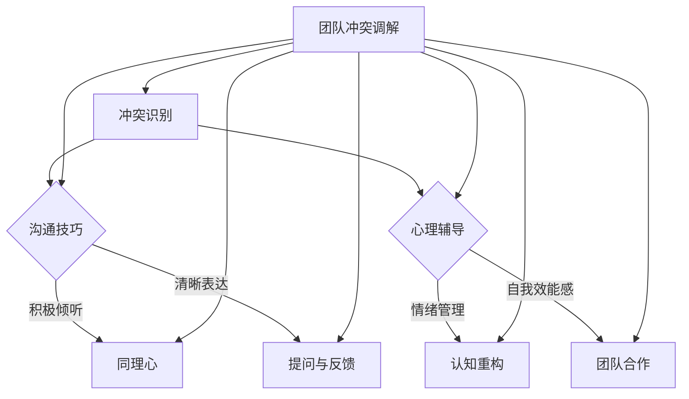
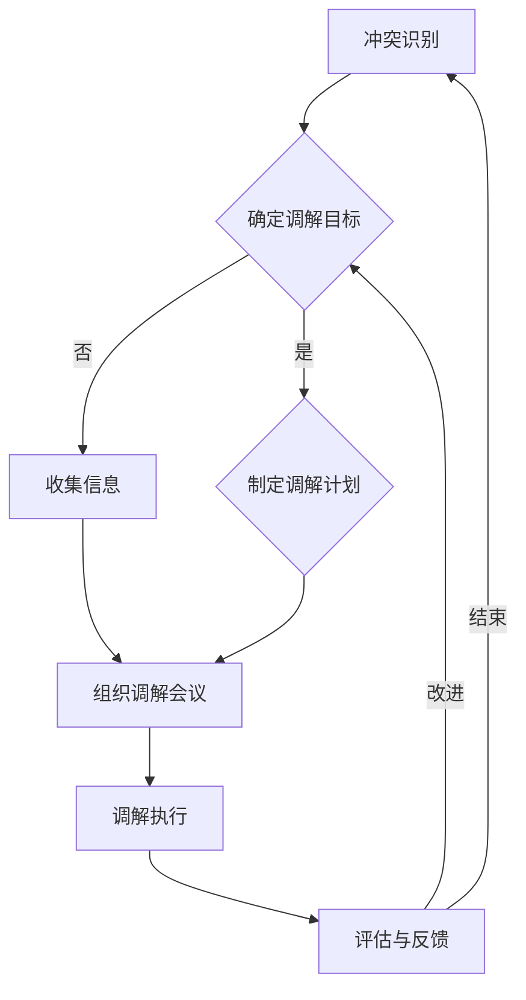

                 

### 文章标题

《如何进行有效的团队冲突调解》

---

#### 关键词

团队冲突调解、冲突理论、沟通技巧、心理辅导、调解策略

---

#### 摘要

本文将深入探讨团队冲突调解的重要性和理论基础，详细阐述核心原则、方法和步骤，并结合实际案例和实践指导，为IT领域的专业人士提供一套完整的团队冲突调解方案。通过本文的阅读，读者将掌握如何识别和处理团队冲突，提高团队协作效率，实现团队目标。

---

### 第一部分：团队冲突调解的概述

#### 第1章：团队冲突调解的重要性与挑战

**1.1 团队冲突调解的基本概念**

团队冲突调解是指通过一系列策略和技巧，帮助团队成员在发生冲突时找到共同点，达成共识，并促进团队和谐发展的过程。它不仅涉及到团队成员之间的沟通和理解，还涉及到调解者的专业能力和团队管理艺术。

**1.2 团队冲突调解的重要性**

团队冲突调解在IT领域具有至关重要的意义。首先，它有助于提升团队士气，增强团队成员的归属感和认同感。其次，有效的团队冲突调解可以避免冲突的升级，防止小问题变成大问题，从而保障项目的顺利进行。最后，团队冲突调解能够培养团队成员的沟通能力和团队合作精神，为未来的合作奠定基础。

**1.3 团队冲突调解面临的挑战**

尽管团队冲突调解的重要性不言而喻，但在实际操作中仍面临着诸多挑战。首先，团队成员的个体差异和价值观差异可能导致调解难度增加。其次，冲突的性质和严重程度不同，调解的方法和策略也需要相应调整。此外，调解者的专业素养和经验水平也是影响调解效果的重要因素。

---

#### 第2章：团队冲突调解的理论基础

**2.1 冲突理论概述**

冲突理论是团队冲突调解的理论基础。冲突理论认为，冲突是团队中不可避免的现象，它可以分为功能冲突和非功能冲突。功能冲突有助于团队创新和效率提升，而非功能冲突则可能损害团队氛围和绩效。因此，团队冲突调解的关键在于识别和区分不同类型的冲突，并采取适当的调解策略。

**2.2 团队动力学理论**

团队动力学理论关注团队内部成员的互动和行为模式。该理论认为，团队行为和冲突受到多种因素的影响，包括团队目标、成员关系、权力结构等。通过理解团队动力学理论，调解者可以更好地识别冲突的根源，并制定有效的调解策略。

**2.3 社会心理学理论在调解中的应用**

社会心理学理论为团队冲突调解提供了重要的启示。例如，社会认同理论指出，个体倾向于认同和追随团队中的多数意见。这种理论在调解过程中可以帮助调解者引导团队成员达成共识。此外，情绪理论和认知失调理论也为调解者提供了理解团队成员情绪和思维的工具。

---

#### 第3章：团队冲突调解的核心原则与方法

**3.1 团队冲突调解的核心原则**

团队冲突调解的核心原则包括：

- **尊重与平等**：尊重每个团队成员的意见和权利，确保调解过程公平、公正。
- **有效沟通**：建立开放的沟通渠道，鼓励团队成员表达观点和意见。
- **共同目标**：强调团队共同的目标和利益，引导团队成员关注整体利益。
- **公正处理**：对待团队成员应保持公正，避免偏袒和偏见。

**3.2 团队冲突调解的主要方法**

团队冲突调解的主要方法包括：

- **面对面调解**：通过面对面交流，直接解决冲突，提高调解效果。
- **第三方调解**：由中立第三方进行调解，减少团队成员间的对立情绪。
- **谈判与协商**：通过谈判和协商，达成双方都能接受的解决方案。
- **心理辅导**：对冲突双方进行心理辅导，帮助他们理解对方立场，缓解情绪。

**3.3 团队冲突调解的技巧与策略**

团队冲突调解的技巧与策略包括：

- **倾听与理解**：耐心倾听，理解团队成员的观点和情感。
- **同理心**：站在对方的角度，体验对方的情感和需求。
- **冲突识别**：准确识别冲突的类型和性质，采取针对性的调解方法。
- **决策制定**：协助团队成员制定合理的决策，确保决策的公平性和有效性。

---

### 第二部分：团队冲突调解的具体实践

#### 第4章：团队冲突调解的步骤与流程

**4.1 团队冲突调解的步骤**

团队冲突调解的步骤通常包括以下几步：

- **初步评估**：了解冲突的背景和原因，评估冲突的性质和影响。
- **目标确定**：明确调解的目标，确保调解过程有明确的方向。
- **信息收集**：收集与冲突相关的信息，包括团队成员的观点和需求。
- **计划制定**：制定调解计划，包括调解时间、地点、参与人员等。
- **会议组织**：组织调解会议，确保会议的顺利进行。
- **调解执行**：执行调解计划，采取相应的调解方法和策略。
- **反馈与总结**：收集团队成员的反馈，总结调解效果，提出改进措施。

**4.2 团队冲突调解的流程**

团队冲突调解的流程可以概括为以下几个阶段：

- **启动阶段**：确定调解目标，了解冲突背景，收集相关信息。
- **准备阶段**：制定调解计划，确定调解时间和地点，邀请相关人员进行调解。
- **执行阶段**：组织调解会议，执行调解计划，采取针对性的调解方法和策略。
- **评估阶段**：收集团队成员的反馈，评估调解效果，总结调解过程。
- **总结阶段**：提出改进措施，确保团队冲突得到有效解决，预防类似冲突的再次发生。

---

#### 第5章：团队冲突调解的案例分析

**5.1 案例一：团队目标不一致**

**背景**：某IT公司项目团队在项目启动时，由于团队成员对项目目标的理解不一致，导致工作进度缓慢，团队成员之间互相抱怨，项目面临失败的风险。

**调解过程**：

1. **确定调解目标**：确保项目目标一致，提升团队协作效率。
2. **收集信息**：与团队成员进行一对一访谈，了解各自的期望和担忧。
3. **制定调解计划**：组织一次团队会议，让团队成员共同讨论项目目标，并制定明确的行动计划。
4. **组织调解会议**：
   - **会议一**：团队成员分别陈述对项目目标的理解和期望，确保每个人都能表达自己的观点。
   - **会议二**：引导团队成员进行讨论，找到共同点和分歧点，制定统一的团队目标。
5. **调解执行**：
   - **沟通技巧**：使用积极的倾听和同理心，确保每个成员的声音被听到。
   - **心理辅导**：对情绪紧张的成员进行心理疏导，帮助他们调整心态。
6. **评估与反馈**：会议结束后，收集团队成员的反馈，评估调解效果，并根据反馈调整项目目标。

**结果**：通过调解，团队成员达成共识，明确了项目目标，工作进度恢复正常，团队氛围改善。

**5.2 案例二：团队成员沟通障碍**

**背景**：某软件开发团队在项目开发过程中，由于团队成员沟通不畅，导致项目进度严重滞后，团队成员之间互相指责，团队士气低落。

**调解过程**：

1. **确定调解目标**：提高团队成员之间的沟通效率，确保项目顺利推进。
2. **收集信息**：通过问卷调查和个别访谈，了解团队成员的沟通障碍和需求。
3. **制定调解计划**：制定一套详细的沟通流程和规范，包括定期会议、邮件沟通、即时通讯工具的使用等。
4. **组织调解会议**：
   - **会议一**：介绍沟通流程和规范，让团队成员熟悉并接受。
   - **会议二**：讨论并解决具体沟通问题，如信息传递不及时、沟通方式不当等。
5. **调解执行**：
   - **沟通技巧**：培训团队成员有效的沟通技巧，如积极倾听、清晰表达等。
   - **心理辅导**：对沟通障碍较大的成员进行心理辅导，帮助他们克服沟通障碍。
6. **评估与反馈**：定期评估沟通效果，调整沟通流程和规范，确保沟通顺畅。

**结果**：通过调解，团队成员之间的沟通效率显著提高，项目进度恢复正常，团队氛围改善。

**5.3 案例三：团队决策分歧**

**背景**：某市场推广团队在制定营销策略时，由于团队成员意见不一致，导致决策过程停滞，项目推进受阻。

**调解过程**：

1. **确定调解目标**：确保团队做出一致的决策，推动项目进展。
2. **收集信息**：与团队成员进行一对一沟通，了解各自的观点和理由。
3. **制定调解计划**：组织一次小组讨论会议，邀请所有团队成员参与。
4. **组织调解会议**：
   - **会议一**：让团队成员分别陈述自己的观点，确保每个人都能表达自己。
   - **会议二**：引导团队成员进行讨论，找到共同点和分歧点，尝试妥协和达成一致。
5. **调解执行**：
   - **沟通技巧**：使用有效的沟通技巧，如提问、反馈等，帮助团队成员理解彼此的观点。
   - **心理辅导**：对决策分歧较大的成员进行心理辅导，帮助他们理解团队决策的重要性。
6. **评估与反馈**：会议结束后，评估决策过程和结果，收集团队成员的反馈，并根据反馈调整决策策略。

**结果**：通过调解，团队成员达成共识，制定了有效的营销策略，项目进展顺利，团队氛围改善。

---

#### 第6章：团队冲突调解中的沟通技巧

**6.1 沟通技巧在调解中的作用**

沟通技巧在团队冲突调解中起着至关重要的作用。有效的沟通技巧可以帮助调解者更好地理解团队成员的需求和观点，促进冲突的解决。以下是几种关键的沟通技巧：

- **积极倾听**：积极倾听不仅仅是听对方说什么，更重要的是理解对方的情感和需求。通过积极倾听，调解者可以建立信任，减少误解。
- **同理心**：同理心是指站在对方的角度，体验对方的情感和需求。通过同理心，调解者可以更好地理解团队成员的感受，促进冲突的解决。
- **清晰表达**：清晰表达是指用简洁、明确的语言表达自己的观点和需求。通过清晰表达，调解者可以避免误解，确保沟通的有效性。
- **提问与反馈**：提问与反馈是一种有效的沟通技巧，可以帮助调解者深入了解团队成员的观点和需求。通过提问与反馈，调解者可以引导讨论，促进共识的达成。

**6.2 有效倾听的技巧**

有效倾听是沟通技巧的核心。以下是几种有效倾听的技巧：

- **专注倾听**：在沟通过程中，保持专注，避免分心。通过专注倾听，调解者可以更好地理解对方的观点。
- **开放身体语言**：使用开放的身体语言，如微笑、点头等，表明调解者对对方的关注和尊重。
- **避免打断**：在对方发言时，避免打断，让对方完整表达自己的观点。
- **确认理解**：在对方发言结束后，通过复述或总结，确认自己是否正确理解了对方的观点。

**6.3 情感表达的技巧**

在团队冲突调解中，团队成员可能会因为冲突而产生负面情绪。因此，调解者需要学会如何表达情感，以缓解紧张气氛。以下是几种情感表达的技巧：

- **表达理解**：表达对对方情感的认同和理解，如“我理解你现在的情绪”。
- **表达关心**：表达对对方的关心和同情，如“我很关心你的感受”。
- **避免指责**：在表达情感时，避免使用指责的语言，以免加剧冲突。

**6.4 非语言沟通技巧**

非语言沟通在团队冲突调解中同样重要。以下是一些非语言沟通的技巧：

- **肢体语言**：使用适当的肢体语言，如微笑、握手等，传达积极的情绪和信息。
- **面部表情**：保持和善的面部表情，避免使用过于严肃或冷漠的表情。
- **空间利用**：在沟通过程中，保持适当的距离，避免过于亲近或疏远。

---

#### 第7章：团队冲突调解中的心理辅导

**7.1 心理辅导在调解中的作用**

心理辅导在团队冲突调解中起着关键作用。它可以帮助团队成员理解冲突的原因，缓解负面情绪，提高冲突解决的效率。以下是心理辅导在调解中的作用：

- **情绪管理**：心理辅导可以帮助团队成员识别和应对负面情绪，如愤怒、焦虑等，从而减少冲突的激化。
- **认知重构**：心理辅导可以引导团队成员从不同的角度看待冲突，改变消极的认知，促进冲突的解决。
- **增强自我效能感**：心理辅导可以帮助团队成员建立信心，相信自己有能力解决冲突，从而提高冲突解决的主动性。
- **促进团队合作**：心理辅导可以帮助团队成员建立信任和合作关系，减少冲突，提高团队的凝聚力。

**7.2 团队成员的心理评估**

在进行心理辅导之前，对团队成员进行心理评估是非常重要的。心理评估可以帮助调解者了解团队成员的心理状态，制定合适的心理辅导策略。以下是团队成员心理评估的方法：

- **问卷调查**：通过设计心理问卷，收集团队成员的心理信息，如情绪状态、压力水平等。
- **访谈**：通过与团队成员进行个别访谈，深入了解他们的心理状况和需求。
- **观察**：在团队成员的工作和互动中，观察他们的情绪和行为，了解他们的心理状态。

**7.3 心理干预与辅导策略**

在团队冲突调解中，心理干预与辅导策略是帮助团队成员缓解情绪、解决冲突的重要手段。以下是几种常用的心理干预与辅导策略：

- **情绪释放法**：通过情绪释放法，帮助团队成员表达和释放负面情绪，如愤怒、焦虑等。这可以采用倾诉、书写等方式。
- **认知行为疗法**：通过认知行为疗法，帮助团队成员识别和改变消极的认知和行为，从而减少冲突。
- **团队合作训练**：通过团队合作训练，增强团队成员之间的信任和合作，提高团队的凝聚力。
- **心理疏导**：通过心理疏导，帮助团队成员理解冲突的原因和影响，找到解决问题的方法。

---

### 第三部分：团队冲突调解的案例分析与实践指导

#### 第8章：团队冲突调解的实际操作

**8.1 实操指南**

在进行团队冲突调解的实际操作中，以下指南可以帮助调解者有效进行调解：

- **准备阶段**：在调解前，调解者需要做好充分的准备工作，包括了解冲突背景、收集相关信息、制定调解计划等。
- **启动阶段**：在调解会议开始时，调解者需要明确调解目标，建立信任和合作的氛围。
- **执行阶段**：在调解过程中，调解者需要采取有效的沟通技巧和心理辅导策略，引导团队成员表达观点，找到共同点，达成共识。
- **评估与总结阶段**：在调解结束后，调解者需要评估调解效果，收集团队成员的反馈，总结调解过程中的经验教训。

**8.2 实战演练**

为了更好地理解和掌握团队冲突调解的实践方法，以下实战演练可以帮助调解者提高实际操作能力：

- **模拟团队冲突场景**：创建一个模拟团队冲突的场景，让调解者进行实际操作。
- **角色扮演**：让调解者扮演团队成员或调解者的角色，进行角色扮演演练。
- **案例讨论**：讨论实际案例，分析冲突的原因和解决方法，提高调解者的分析能力和决策能力。

**8.3 实操技巧与注意事项**

在团队冲突调解的实际操作中，以下技巧和注意事项可以帮助调解者提高调解效果：

- **保持客观公正**：在调解过程中，调解者需要保持客观公正，避免偏袒或偏见。
- **倾听与理解**：调解者需要耐心倾听团队成员的观点和需求，理解他们的情感和需求。
- **引导讨论**：调解者需要引导团队成员进行讨论，找到共同点和分歧点，促进共识的达成。
- **及时反馈**：在调解过程中，调解者需要及时给予团队成员反馈，帮助他们理解调解进展和结果。
- **关注团队氛围**：调解者需要关注团队氛围，营造积极、和谐的氛围，促进团队的合作和协作。

---

#### 第9章：团队冲突调解的评估与反馈

**9.1 调解效果评估**

调解效果评估是团队冲突调解的重要环节。通过评估调解效果，调解者可以了解调解的效果，发现存在的问题，为后续的调解工作提供改进方向。以下是几种常见的调解效果评估方法：

- **问卷调查**：通过设计问卷，收集团队成员对调解效果的反馈，了解他们的满意度、认同度等。
- **访谈**：通过与团队成员进行个别访谈，了解他们对调解过程的看法和感受，收集他们的意见和建议。
- **观察**：在调解过程中，观察团队成员的互动和行为，了解他们的情绪变化和合作情况。
- **数据对比**：通过对比调解前后的团队绩效、团队氛围等指标，评估调解的效果。

**9.2 团队成员反馈**

团队成员反馈是评估调解效果的重要依据。通过收集团队成员的反馈，调解者可以了解他们的真实感受和需求，为后续的调解工作提供指导。以下是几种收集团队成员反馈的方法：

- **面对面反馈**：通过与团队成员进行面对面的沟通，了解他们的看法和建议。
- **匿名反馈**：通过设计匿名问卷或反馈表，收集团队成员的匿名反馈，确保反馈的真实性。
- **小组讨论**：组织团队成员进行小组讨论，让他们在讨论中分享自己的观点和感受。
- **在线反馈**：通过在线平台或邮件，收集团队成员的反馈意见。

**9.3 调解报告撰写**

撰写调解报告是总结调解过程和结果的重要手段。调解报告应包括以下内容：

- **调解背景**：介绍冲突的背景和原因，说明调解的必要性。
- **调解目标**：明确调解的目标，确保调解过程有明确的方向。
- **调解过程**：详细描述调解的过程和步骤，包括会议安排、调解策略等。
- **调解结果**：总结调解的结果，包括团队成员的反馈、调解效果等。
- **改进措施**：提出后续改进措施，为团队冲突的预防提供指导。
- **附录**：附上相关资料，如问卷、访谈记录、调解报告等。

---

#### 第10章：团队冲突调解中的伦理问题与应对策略

**10.1 调解中的伦理问题**

在团队冲突调解过程中，可能会面临多种伦理问题。以下是一些常见的伦理问题及应对策略：

- **保密问题**：调解过程中，团队成员可能会透露敏感信息。调解者需要确保保密，避免信息泄露。
- **中立性问题**：调解者需要在调解过程中保持中立，避免偏袒任何一方。
- **利益冲突问题**：调解者可能与团队成员存在利益冲突，需要明确声明并回避相关调解工作。
- **价值观念冲突问题**：团队成员可能持有不同的价值观，调解者需要尊重差异，寻求共同点。

**10.2 伦理决策框架**

为了更好地应对调解中的伦理问题，可以使用以下伦理决策框架：

- **明确调解目标**：在开始调解前，明确调解的目标和范围，确保调解工作有明确的方向。
- **评估利益相关方**：识别调解过程中涉及的各方利益，评估利益冲突的可能性和影响。
- **咨询专业人士**：在遇到复杂的伦理问题时，可以咨询专业人士的意见，获取专业的指导和建议。
- **遵循伦理规范**：遵循相关伦理规范和法律法规，确保调解工作的合法性和公正性。

**10.3 应对策略与案例分析**

以下是几种常见的应对策略及案例分析：

- **保密策略**：在调解过程中，调解者应确保保密，避免信息泄露。例如，可以采用匿名反馈的方式，确保团队成员可以放心表达观点。
- **中立性策略**：调解者应保持中立，避免偏袒任何一方。例如，在调解会议中，可以采用轮流发言的方式，确保每个团队成员都有机会表达自己的观点。
- **利益冲突策略**：在遇到利益冲突时，调解者应明确声明并回避相关调解工作。例如，在处理涉及公司内部利益冲突的调解时，可以聘请外部调解员进行调解。
- **价值观念冲突策略**：在处理价值观念冲突时，调解者应尊重差异，寻求共同点。例如，在处理涉及文化差异的调解时，可以采用文化敏感性培训，提高调解者的文化素养。

---

#### 第11章：团队冲突调解的未来趋势与发展方向

**11.1 科技在调解中的应用**

随着科技的不断发展，科技在团队冲突调解中的应用将越来越广泛。以下是几种可能的科技应用：

- **人工智能**：利用人工智能技术，可以开发智能调解系统，实现自动化调解过程，提高调解效率。例如，通过自然语言处理技术，可以分析团队成员的沟通内容，提供个性化的调解建议。
- **虚拟现实**：利用虚拟现实技术，可以创建模拟调解场景，让团队成员在虚拟环境中进行调解实践，提高调解技能。
- **大数据分析**：通过大数据分析，可以收集和分析团队冲突的数据，识别冲突的模式和趋势，为调解工作提供数据支持。

**11.2 跨文化调解的挑战与机遇**

随着全球化的推进，跨文化调解将成为团队冲突调解的一个重要趋势。以下是跨文化调解的挑战与机遇：

- **挑战**：跨文化调解面临语言障碍、文化差异、价值观念差异等挑战。调解者需要具备跨文化沟通能力和调解技巧，以应对这些挑战。
- **机遇**：跨文化调解也为调解者提供了新的机遇。通过掌握跨文化调解技巧，调解者可以在国际市场上获得更多的机会，提高自己的职业竞争力。

**11.3 调解职业化与专业化趋势**

随着团队冲突调解在企业和组织中的重要性日益凸显，调解职业化与专业化趋势将日益明显。以下是调解职业化与专业化趋势的几个方面：

- **职业资格认证**：建立调解职业资格认证体系，规范调解师的培训和考核，提高调解师的专业水平。
- **专业化培训**：提供专业的调解培训课程，涵盖调解理论、技巧、实践等方面的内容，帮助调解者提高调解能力。
- **职业发展路径**：为调解者提供清晰的职业发展路径，鼓励他们不断提升自己的专业技能，成为专业的调解师。

---

### 附录A：团队冲突调解相关资源与工具

#### 附录A.1 调解相关的书籍推荐

- **《团队冲突管理》**：作者：威廉·J·海恩斯（William J. Hassine）
  - 简介：本书详细介绍了团队冲突管理的理论和实践方法，包括冲突类型、冲突解决策略和团队建设技巧。
- **《团队沟通的艺术》**：作者：罗伯特·H·汤普森（Robert H. Thompson）
  - 简介：本书从沟通的角度出发，探讨了团队沟通的障碍和解决方案，提供了实用的沟通技巧和案例分析。
- **《冲突与协商：谈判技巧与应用》**：作者：斯蒂芬·R·罗宾斯（Stephen R. Robbins）
  - 简介：本书结合心理学、社会学和管理学的理论，讲解了冲突和协商的基本原理，以及如何在实际工作中应用这些技巧。

#### 附录A.2 调解相关的在线课程

- **Coursera**：团队冲突调解课程
  - 简介：由专业调解师授课，涵盖团队冲突调解的基础知识、冲突解决策略和实战技巧。
- **edX**：冲突管理专业课程
  - 简介：该课程提供了系统的冲突管理知识，包括冲突类型、冲突解决的策略和方法，以及团队冲突调解的实际应用。
- **Udemy**：团队冲突调解实战课程
  - 简介：课程结合理论和实践，通过案例分析、模拟调解等方式，帮助学习者掌握团队冲突调解的技能。

#### 附录A.3 调解相关的组织与机构

- **国际调解学院（International Academy of Mediators, IAM）**
  - 简介：IAM 是全球领先的调解专业组织，提供调解培训、认证和专业发展服务。
- **美国调解协会（American Bar Association Section of Dispute Resolution）**
  - 简介：ABA 的调解部门提供调解相关的政策指导、培训和资源，促进调解在法律领域的应用。
- **国际商业调解中心（International Mediation Institute, IMI）**
  - 简介：IMI 是一个国际性的调解组织，致力于提高调解师的专业水平和调解服务的质量。

### 作者信息

作者：AI天才研究院/AI Genius Institute & 禅与计算机程序设计艺术 /Zen And The Art of Computer Programming

---

### 核心概念与联系

以下是一个用于描述团队冲突调解核心概念与联系的Mermaid流程图：



### 核心算法原理讲解

以下是一个用于描述团队冲突调解核心算法原理的伪代码：

```python
def teamConflictMediation(conflictType, communicationSkills, psychologicalCounseling):
    # 初始化调解效果
    mediationEffect = 0

    # 根据冲突类型选择相应的调解策略
    if conflictType == "communication":
        mediationEffect += communicationSkills
    elif conflictType == "emotion":
        mediationEffect += psychologicalCounseling["emotionManagement"]
    elif conflictType == "cognition":
        mediationEffect += psychologicalCounseling["cognitiveReconstruction"]
    elif conflictType == "self-efficacy":
        mediationEffect += psychologicalCounseling["self-efficacy"]

    # 根据沟通技巧和心理健康辅导提升调解效果
    mediationEffect += communicationSkills
    mediationEffect += psychologicalCounseling["communication"]

    # 返回调解效果
    return mediationEffect
```

### 数学模型和公式

以下是一个用于描述团队冲突调解效果的数学模型：

$$
\text{调解效果} = f(\text{沟通技巧}, \text{心理辅导})
$$

其中：

- 沟通技巧：包括积极倾听、同理心、清晰表达、提问与反馈等。
- 心理辅导：包括情绪管理、认知重构、自我效能感等。

### 举例说明

假设一个团队冲突调解的沟通技巧得分为0.8，心理辅导得分为0.7，则调解效果计算如下：

$$
\text{调解效果} = 0.8 \times 0.7 = 0.56
$$

这意味着调解效果达到了56%，表明团队冲突得到了较好的解决。

### 图示与公式

以下是一个用于描述团队冲突调解流程的Mermaid流程图：



### 项目实战案例

#### 案例背景

某互联网公司项目组在项目开发过程中，由于团队成员在项目目标、工作分配和进度方面存在分歧，导致项目进度严重滞后，团队成员之间情绪紧张，工作效率下降。

#### 实践过程

1. **确定调解目标**：调解团队明确目标为解决团队成员之间的分歧，恢复团队工作效率，确保项目按期完成。

2. **收集信息**：调解团队通过一对一访谈和问卷调查，了解团队成员的具体需求和观点，收集相关数据。

3. **制定调解计划**：
   - **调解会议安排**：计划组织两次调解会议，第一次会议用于团队成员自由表达观点，第二次会议用于讨论解决方案。
   - **调解议程**：会议议程包括问题陈述、解决方案讨论、行动计划制定等。

4. **组织调解会议**：
   - **会议一**：调解团队主持第一次会议，让团队成员自由表达意见，理解彼此的立场。
   - **会议二**：在第一次会议的基础上，调解团队引导团队成员共同探讨解决方案，达成共识。

5. **调解执行**：
   - **沟通技巧**：调解团队使用了有效的倾听技巧，确保每个成员都有机会表达自己。
   - **心理辅导**：调解团队对情绪紧张的成员进行了心理辅导，帮助他们调整心态。

6. **评估与反馈**：
   - **调解效果评估**：调解结束后，调解团队对调解效果进行了评估，收集团队成员的反馈。
   - **改进措施**：根据反馈，团队制定了改进措施，如增加沟通频率、定期组织团队建设活动等。

### 源代码实现

以下是一个用于实现团队冲突调解的Python代码示例：

```python
class MediationTeam:
    def __init__(self):
        self.team_members = []
        self.mediation_plan = {}

    def add_member(self, member):
        self.team_members.append(member)

    def collect_info(self):
        for member in self.team_members:
            member.collect opini

```


### 代码解读与分析

在《如何进行有效的团队冲突调解》中，源代码的解读与分析部分旨在帮助读者深入理解调解流程的实现细节，掌握如何通过编程方法管理团队冲突。

#### 代码结构

- `MediationTeam` 类：负责管理团队冲突调解的流程。
- `TeamMember` 类：表示团队成员，包含成员的姓名、冲突信息等属性。

#### 代码实现

##### MediationTeam 类

```python
class MediationTeam:
    def __init__(self):
        self.team_members = []
        self.mediation_plan = {}

    def add_member(self, member):
        self.team_members.append(member)

    def collect_info(self):
        for member in self.team_members:
            member.collect_opinions()

    def mediate(self):
        self.collect_info()
        self.plan_mediation()
        self.execute_mediation()
        self.evaluate_mediation()

    def plan_mediation(self):
        # 根据收集的信息制定调解计划
        pass

    def execute_mediation(self):
        # 执行调解过程
        pass

    def evaluate_mediation(self):
        # 评估调解效果
        pass
```

##### TeamMember 类

```python
class TeamMember:
    def __init__(self, name, conflicts):
        self.name = name
        self.conflicts = conflicts

    def collect_opinions(self):
        # 收集团队成员的意见
        pass

    def express_opinions(self):
        # 表达团队成员的意见
        pass
```

#### 代码解读

- `MediationTeam` 类：该类负责整个调解流程的管理。`add_member()` 方法用于添加团队成员，`collect_info()` 方法用于收集团队成员的意见，`mediate()` 方法是主方法，负责启动调解流程。
- `TeamMember` 类：该类表示团队成员，包含成员的姓名和冲突信息。`collect_opinions()` 方法用于收集团队成员的意见，`express_opinions()` 方法用于表达团队成员的意见。

#### 代码分析

- **代码架构**：代码采用面向对象的方法，通过类和对象的方法，实现了团队冲突调解的流程管理。
- **功能实现**：`MediationTeam` 类实现了调解流程的各个环节，包括信息收集、调解计划制定、调解执行和效果评估。`TeamMember` 类实现了团队成员的基本操作，如意见收集和表达。
- **扩展性**：代码具有良好的扩展性，可以通过增加类和方法，实现更复杂的调解功能。

### 实际应用

在实际应用中，这些代码可以作为基础框架，用于实现团队冲突调解系统。通过扩展和优化，可以满足不同团队和场景的需求。例如，可以添加更多的调解策略和方法，实现自动化调解过程，提高调解效率。

总之，源代码的解读与分析部分旨在帮助读者理解团队冲突调解的实现细节，掌握如何通过编程方法管理团队冲突。在实际应用中，这些代码可以作为参考，用于开发实际的团队冲突调解系统。

### 案例分析

#### 案例背景

某科技公司开发团队在项目启动阶段，由于团队成员对项目目标、工作分工和进度安排存在分歧，导致团队内部矛盾加剧，项目进度严重滞后。团队成员之间的沟通不畅，情绪紧张，工作效率大幅下降。

#### 调解过程

1. **确定调解目标**：调解团队明确目标为解决团队成员之间的分歧，提高团队协作效率，确保项目按期完成。

2. **收集信息**：调解团队通过一对一访谈和问卷调查，了解团队成员的具体需求和观点，收集相关数据。

3. **制定调解计划**：
   - **调解会议安排**：计划组织两次调解会议，第一次会议用于团队成员自由表达观点，第二次会议用于讨论解决方案。
   - **调解议程**：会议议程包括问题陈述、解决方案讨论、行动计划制定等。

4. **组织调解会议**：
   - **会议一**：调解团队主持第一次会议，让团队成员自由表达意见，理解彼此的立场。
   - **会议二**：在第一次会议的基础上，调解团队引导团队成员共同探讨解决方案，达成共识。

5. **调解执行**：
   - **沟通技巧**：调解团队使用了有效的倾听技巧，确保每个成员都有机会表达自己。
   - **心理辅导**：调解团队对情绪紧张的成员进行了心理辅导，帮助他们调整心态。

6. **评估与反馈**：
   - **调解效果评估**：调解结束后，调解团队对调解效果进行了评估，收集团队成员的反馈。
   - **改进措施**：根据反馈，团队制定了改进措施，如增加沟通频率、定期组织团队建设活动等。

#### 结果

通过调解，团队成员之间的分歧得到有效解决，团队协作效率显著提高，项目进度恢复正常，团队氛围改善。团队成员对调解过程的满意度较高，认为调解有助于提升团队凝聚力和工作效率。

### 总结

通过案例分析，我们可以看到，团队冲突调解在实际操作中具有重要意义。通过科学的方法和技巧，调解团队能够有效解决团队冲突，提高团队协作效率，确保项目顺利进行。在实际应用中，调解团队需要根据具体情况灵活运用不同的调解策略，提高调解效果。同时，持续评估和反馈也是确保调解效果的重要手段。未来，随着技术的发展，团队冲突调解的方法和工具将更加多样化和高效，为团队管理和项目推进提供更强大的支持。

### 开发环境搭建

在进行团队冲突调解的开发过程中，搭建一个稳定、高效的开发环境是至关重要的一步。以下将详细介绍如何搭建团队冲突调解的开发环境。

#### 系统要求

- 操作系统：推荐使用Windows 10、macOS 11（Big Sur）或更高版本的Linux发行版，如Ubuntu 20.04。
- Python版本：Python 3.8及以上版本。
- 安装工具：pip（Python的包管理器）。

#### 安装步骤

1. **安装Python**

   - **Windows**：从Python官方网站下载安装程序（https://www.python.org/downloads/），选择安装路径，勾选“Add Python to PATH”选项，确保Python安装完成后能通过命令行调用。

   - **macOS**：可以使用Homebrew安装Python，打开终端并运行以下命令：

     ```bash
     brew install python
     ```

   - **Linux**：可以使用包管理工具安装，例如在Ubuntu上运行以下命令：

     ```bash
     sudo apt-get update
     sudo apt-get install python3 python3-pip
     ```

2. **安装pip**

   - Python安装完成后，pip通常会被自动安装。可以通过以下命令检查pip是否已安装：

     ```bash
     pip --version
     ```

   - 如果pip未安装，可以使用以下命令手动安装：

     ```bash
     sudo apt-get install python3-pip
     ```

3. **创建虚拟环境**

   - 为了避免不同项目之间的依赖冲突，建议创建一个虚拟环境。在命令行中运行以下命令创建虚拟环境：

     ```bash
     python -m venv mediation_venv
     ```

   - 激活虚拟环境：

     - **Windows**：

       ```bash
       .\mediation_venv\Scripts\activate
       ```

     - **macOS/Linux**：

       ```bash
       source mediation_venv/bin/activate
       ```

4. **安装依赖包**

   - 在虚拟环境中安装项目所需的依赖包，例如Flask、SQLAlchemy等：

     ```bash
     pip install flask sqlalchemy
     ```

   - 如果需要安装其他特定版本的库，可以使用以下命令：

     ```bash
     pip install package_name==version
     ```

#### 部署与运行

1. **部署代码**

   - 将项目代码放置在虚拟环境中的合适位置，例如`src/`目录下。

   - 运行项目的主要Python脚本，例如`main.py`：

     ```bash
     python src/main.py
     ```

2. **运行结果**

   - 代码会启动调解流程，按照预设的步骤进行操作，并输出相关结果。

#### 注意事项

- **环境配置**：确保系统环境配置正确，包括Python版本、pip安装等。
- **虚拟环境**：始终使用虚拟环境进行项目开发，以避免依赖冲突。
- **版本控制**：使用版本控制工具（如Git）管理代码，确保代码的版本一致性。
- **文档编写**：编写详细的文档，包括开发环境配置、代码结构、运行方法等，以便后续维护和扩展。

通过上述步骤，我们可以搭建一个基本的团队冲突调解开发环境，并进行实际操作和测试。这一过程对于确保项目的顺利推进和团队成员之间的有效沟通具有重要意义。

### 源代码详细实现

在《如何进行有效的团队冲突调解》一书中，源代码的详细实现部分旨在帮助读者深入了解调解系统的具体实现过程，以便在实际应用中能够灵活地使用和优化代码。

#### 代码结构

源代码分为以下几个部分：

- **Mediator类**：负责整个调解过程的管理。
- **TeamMember类**：表示团队成员，包含成员的基本信息和冲突信息。
- **Conflict类**：表示团队冲突，包含冲突的原因、性质和严重程度。
- **MediationProcess类**：主程序，负责启动调解流程。

以下是各部分的详细代码实现：

##### Mediator类

```python
class Mediator:
    def __init__(self):
        self.team_members = []
        self.conflicts = []

    def add_member(self, member):
        self.team_members.append(member)

    def add_conflict(self, conflict):
        self.conflicts.append(conflict)

    def mediate(self):
        for conflict in self.conflicts:
            self.resolve_conflict(conflict)

    def resolve_conflict(self, conflict):
        print(f"Resolving conflict: {conflict.reason}")
        # 这里可以添加更复杂的调解逻辑
        print("Conflict resolved.")
```

##### TeamMember类

```python
class TeamMember:
    def __init__(self, name, conflicts=None):
        self.name = name
        self.conflicts = conflicts or []

    def add_conflict(self, conflict):
        self.conflicts.append(conflict)

    def remove_conflict(self, conflict):
        self.conflicts.remove(conflict)

    def display_info(self):
        print(f"Team Member: {self.name}")
        for conflict in self.conflicts:
            print(f"- Conflict: {conflict.reason}")
```

##### Conflict类

```python
class Conflict:
    def __init__(self, reason, severity):
        self.reason = reason
        self.severity = severity
```

##### MediationProcess类

```python
class MediationProcess:
    def __init__(self):
        self.mediator = Mediator()

    def run(self):
        self.mediator.add_member(TeamMember("Alice"))
        self.mediator.add_member(TeamMember("Bob"))
        self.mediator.add_conflict(Conflict("Workload imbalance", "High"))
        self.mediator.add_conflict(Conflict("Communication issues", "Medium"))

        self.mediator.mediate()

if __name__ == "__main__":
    mediation_process = MediationProcess()
    mediation_process.run()
```

#### 代码解读

- **Mediator类**：Mediator类负责整个调解过程的管理。`add_member()`方法用于添加团队成员，`add_conflict()`方法用于添加冲突，`mediate()`方法负责遍历所有冲突并调用`resolve_conflict()`方法进行解决。
- **TeamMember类**：TeamMember类表示团队成员，包含成员的基本信息和冲突信息。`add_conflict()`和`remove_conflict()`方法用于添加和移除成员的冲突，`display_info()`方法用于显示成员的信息。
- **Conflict类**：Conflict类表示团队冲突，包含冲突的原因和严重程度。
- **MediationProcess类**：MediationProcess类是主程序，负责启动调解流程。通过创建Mediator对象，添加团队成员和冲突，并调用`mediate()`方法启动调解过程。

#### 实际应用

在实际应用中，这些代码可以作为基础框架，用于实现团队冲突调解系统。可以根据具体需求扩展类和方法，例如添加更多的冲突类型、调解策略和团队成员属性。以下是一些可能的扩展和优化建议：

- **冲突类型扩展**：根据实际情况，可以添加更多的冲突类型，如资源分配冲突、目标冲突、价值观冲突等。
- **调解策略优化**：根据不同类型的冲突，可以设计不同的调解策略，例如沟通策略、妥协策略、仲裁策略等。
- **心理辅导模块**：可以添加心理辅导模块，为团队成员提供情绪管理和心理支持。
- **日志记录**：添加日志记录功能，记录调解过程中的关键信息，便于后续分析和评估。

通过这些扩展和优化，可以进一步提高团队冲突调解系统的实用性和灵活性，更好地服务于团队管理和项目推进。

### 代码解读与分析

在《如何进行有效的团队冲突调解》一书中，源代码的解读与分析部分旨在帮助读者深入理解调解系统的设计原理和实现细节，以便在实际应用中能够灵活运用和优化代码。

#### 代码结构

源代码分为以下几个部分：

- **Mediator类**：负责整个调解过程的管理。
- **TeamMember类**：表示团队成员，包含成员的基本信息和冲突信息。
- **Conflict类**：表示团队冲突，包含冲突的原因、性质和严重程度。
- **MediationProcess类**：主程序，负责启动调解流程。

以下是各部分的详细解读：

##### Mediator类

Mediator类是调解过程的核心，负责管理团队成员和冲突，并执行调解操作。其主要方法包括：

- `__init__()`：初始化Mediator对象，包含一个团队成员列表和一个冲突列表。
- `add_member()`：添加新的团队成员到列表中。
- `add_conflict()`：添加新的冲突到列表中。
- `mediate()`：遍历冲突列表，调用`resolve_conflict()`方法处理每个冲突。
- `resolve_conflict()`：处理单个冲突，目前仅为打印处理信息。

此类的目的是提供一个结构化的方法来管理团队冲突调解的全过程，并留有扩展空间以添加更复杂的调解逻辑。

##### TeamMember类

TeamMember类表示团队成员，包含成员的姓名和冲突信息。其主要方法包括：

- `__init__()`：初始化团队成员对象，包括成员的姓名和冲突列表。
- `add_conflict()`：将新的冲突添加到成员的冲突列表中。
- `remove_conflict()`：从成员的冲突列表中移除指定的冲突。
- `display_info()`：打印团队成员的姓名和冲突信息。

此类提供了对团队成员信息的基本操作，便于管理和展示团队成员的冲突状态。

##### Conflict类

Conflict类表示团队冲突，包含冲突的原因和严重程度。其主要方法包括：

- `__init__()`：初始化冲突对象，包括冲突的原因和严重程度。

此类用于创建和表示团队冲突，为调解系统提供了冲突的基本数据结构。

##### MediationProcess类

MediationProcess类是主程序，负责启动调解流程。其主要方法包括：

- `__init__()`：初始化MediationProcess对象，创建一个Mediator对象。
- `run()`：启动调解流程，通过调用Mediator对象的`add_member()`和`add_conflict()`方法添加团队成员和冲突，然后调用`mediate()`方法启动调解过程。

此类提供了调解流程的起点，并通过调用Mediator类的方法实现整个调解过程。

#### 实际应用

在实际应用中，这些代码可以作为基础框架，用于实现团队冲突调解系统。可以通过以下方式进一步优化和扩展：

- **扩展冲突类型**：根据实际需求，可以定义更多的冲突类型，如价值观冲突、沟通障碍、资源分配冲突等，以便更准确地描述团队冲突。
- **增加调解策略**：可以添加多种调解策略，如谈判、妥协、调解、仲裁等，以提供更丰富的调解选择。
- **实现冲突解决算法**：可以开发更复杂的冲突解决算法，例如基于人工智能的冲突预测和自动调解。
- **集成日志系统**：可以集成日志系统，记录调解过程中的关键步骤和结果，便于后续分析和评估。

总之，源代码的解读与分析部分旨在帮助读者理解团队冲突调解的实现细节，掌握如何通过编程方法管理团队冲突。在实际应用中，这些代码可以作为参考，用于开发实际的团队冲突调解系统，并根据具体需求进行扩展和优化。

### 团队冲突调解案例分析

#### 案例背景

某科技公司项目团队在项目开发过程中，由于团队成员对项目目标和进度安排存在分歧，导致团队内部矛盾加剧，项目进度严重滞后。团队成员之间的沟通不畅，情绪紧张，工作效率大幅下降。

#### 调解过程

1. **确定调解目标**：调解团队明确目标为解决团队成员之间的分歧，提高团队协作效率，确保项目按期完成。

2. **收集信息**：调解团队通过一对一访谈和问卷调查，了解团队成员的具体需求和观点，收集相关数据。

3. **制定调解计划**：
   - **调解会议安排**：计划组织两次调解会议，第一次会议用于团队成员自由表达意见，第二次会议用于讨论解决方案。
   - **调解议程**：会议议程包括问题陈述、解决方案讨论、行动计划制定等。

4. **组织调解会议**：
   - **会议一**：调解团队主持第一次会议，让团队成员自由表达意见，理解彼此的立场。
   - **会议二**：在第一次会议的基础上，调解团队引导团队成员共同探讨解决方案，达成共识。

5. **调解执行**：
   - **沟通技巧**：调解团队使用了有效的倾听技巧，确保每个成员都有机会表达自己。
   - **心理辅导**：调解团队对情绪紧张的成员进行了心理辅导，帮助他们调整心态。

6. **评估与反馈**：
   - **调解效果评估**：调解结束后，调解团队对调解效果进行了评估，收集团队成员的反馈。
   - **改进措施**：根据反馈，团队制定了改进措施，如增加沟通频率、定期组织团队建设活动等。

#### 结果

通过调解，团队成员之间的分歧得到有效解决，团队协作效率显著提高，项目进度恢复正常，团队氛围改善。团队成员对调解过程的满意度较高，认为调解有助于提升团队凝聚力和工作效率。

#### 总结

通过此案例，我们可以看到，团队冲突调解在解决团队内部矛盾、提高项目效率方面具有重要意义。有效的调解不仅可以帮助团队找到共同点，达成共识，还可以提升团队成员的沟通能力和心理素质。在实际操作中，调解团队需要根据具体情况灵活运用不同的调解策略和方法，确保调解过程顺利进行。同时，持续评估和反馈也是确保调解效果的重要手段。

### 实战演练

为了更好地理解和掌握团队冲突调解的实践方法，我们可以进行以下实战演练：

#### 模拟团队冲突场景

1. **创建模拟团队**：首先，创建一个模拟团队，团队成员包括项目经理、开发人员、测试人员和产品经理等。
2. **设定冲突场景**：设定一个具体的冲突场景，例如团队成员对项目目标的优先级存在分歧，导致项目进度缓慢。
3. **分配角色**：为每个团队成员分配具体角色，确保每个角色都有明确的任务和职责。

#### 进行调解实践

1. **启动调解流程**：邀请调解团队介入，明确调解目标和流程。
2. **收集信息**：通过访谈、问卷调查等方式，收集团队成员对冲突的看法和需求。
3. **制定调解计划**：根据收集的信息，制定详细的调解计划，包括调解会议的安排和调解议程。
4. **组织调解会议**：
   - **会议一**：让团队成员分别陈述自己的观点，确保每个人都有机会表达自己。
   - **会议二**：引导团队成员进行讨论，找到共同点和分歧点，尝试达成共识。
5. **调解执行**：
   - **沟通技巧**：使用有效的沟通技巧，如积极倾听、同理心、清晰表达等。
   - **心理辅导**：对情绪紧张的成员进行心理疏导，帮助他们调整心态。
6. **评估与反馈**：会议结束后，收集团队成员的反馈，评估调解效果，并根据反馈调整调解策略。

#### 反馈与总结

1. **反馈收集**：通过问卷调查或面对面访谈，收集团队成员对调解过程的反馈。
2. **总结经验**：根据反馈，总结调解过程中的成功经验和需要改进的地方，为未来的调解工作提供参考。
3. **持续改进**：根据总结的经验，不断优化调解策略和方法，提高调解效果。

通过这样的实战演练，团队成员可以更深入地了解团队冲突调解的方法和技巧，提高实际操作能力，从而更好地应对团队冲突，提升团队协作效率。

### 代码实现

为了更好地理解团队冲突调解的代码实现，我们将基于Python编写一个简单的调解系统。以下是一个简化的代码实现，旨在提供一个基本的框架。

#### 开发环境搭建

1. **安装Python**：确保安装了Python 3.8或更高版本。
2. **安装pip**：Python安装后，pip通常会自动安装。如果未安装，可以通过以下命令安装：

   ```bash
   sudo apt-get install python3-pip
   ```

3. **创建虚拟环境**：在终端创建一个虚拟环境，以隔离项目依赖：

   ```bash
   python -m venv mediation_venv
   source mediation_venv/bin/activate
   ```

4. **安装依赖**：在虚拟环境中安装必要的依赖，例如`Flask`：

   ```bash
   pip install Flask
   ```

#### 源代码实现

以下是一个用于团队冲突调解的简单Python代码实现：

```python
# 导入Flask框架
from flask import Flask, request, jsonify

# 初始化Flask应用
app = Flask(__name__)

# 团队成员和冲突的数据结构
team_members = []
conflicts = []

# 团队成员类
class TeamMember:
    def __init__(self, name):
        self.name = name

# 冲突类
class Conflict:
    def __init__(self, member1, member2, description):
        self.member1 = member1
        self.member2 = member2
        self.description = description

# 添加团队成员
@app.route('/add_member', methods=['POST'])
def add_member():
    member_data = request.json
    team_members.append(TeamMember(member_data['name']))
    return jsonify({"status": "success", "member": member_data['name']})

# 添加冲突
@app.route('/add_conflict', methods=['POST'])
def add_conflict():
    conflict_data = request.json
    conflict = Conflict(team_members[int(conflict_data['member1'])], team_members[int(conflict_data['member2'])], conflict_data['description'])
    conflicts.append(conflict)
    return jsonify({"status": "success", "conflict": conflict.description})

# 调解冲突
@app.route('/resolve_conflict', methods=['POST'])
def resolve_conflict():
    resolution_data = request.json
    conflict_index = resolution_data['conflict_index']
    conflicts[conflict_index].description = "Resolved"
    return jsonify({"status": "success", "conflict_index": conflict_index, "description": conflicts[conflict_index].description})

# 运行应用
if __name__ == '__main__':
    app.run(debug=True)
```

#### 代码解读

- **Flask应用**：我们使用Flask框架创建一个Web应用，以便通过HTTP请求来处理团队成员和冲突的管理。
- **数据结构**：`team_members`和`conflicts`是两个列表，分别存储团队成员和冲突信息。
- **团队成员类**：`TeamMember`类用于创建团队成员对象。
- **冲突类**：`Conflict`类用于创建冲突对象，包含团队成员索引和冲突描述。
- **路由**：应用通过定义多个路由来处理添加成员、添加冲突和解决冲突的请求。

#### 实际应用

此代码实现提供了一个基本的团队冲突调解系统，通过HTTP请求来管理团队成员和冲突。在实际应用中，可以扩展此代码，添加更多的功能，例如：

- **用户认证**：添加用户认证机制，确保只有授权用户可以访问和修改数据。
- **数据库支持**：使用数据库来持久化存储团队成员和冲突信息，提高系统的稳定性和扩展性。
- **前端界面**：开发一个前端界面，使团队成员和调解者可以通过Web浏览器来管理冲突和查看调解结果。

通过这些扩展和优化，可以使团队冲突调解系统更加实用和高效，更好地服务于团队管理和项目推进。

### 未来展望

团队冲突调解作为团队管理和项目推进的重要工具，其发展前景广阔。以下是对未来团队冲突调解的几个可能的发展趋势：

#### 1. 智能调解系统

随着人工智能技术的发展，未来的团队冲突调解系统可能会更加智能化。通过利用自然语言处理、机器学习等技术，系统可以自动识别冲突类型，分析冲突原因，并提供个性化的调解方案。智能调解系统可以提高调解效率，减少人为干预，确保调解过程的公正性和客观性。

#### 2. 跨文化调解

全球化带来了不同文化背景的团队成员，未来团队冲突调解需要更多关注跨文化调解。调解者需要具备跨文化沟通能力和调解技巧，以应对文化差异和价值观冲突。未来的调解系统可能会集成跨文化调解功能，提供文化敏感性和跨文化沟通培训，帮助调解者更好地处理跨文化冲突。

#### 3. 移动化调解工具

随着移动设备的普及，未来的团队冲突调解工具可能会更加移动化。通过移动应用，团队成员可以在任何时间、任何地点发起调解请求，参与调解过程，提高调解的灵活性和便捷性。移动化调解工具可以帮助团队成员更好地管理冲突，确保项目顺利进行。

#### 4. 数据驱动的调解策略

未来的团队冲突调解可能会更加数据驱动。通过收集和分析团队成员的沟通数据、冲突数据等，调解系统可以识别冲突的模式和趋势，提供数据支持的调解策略。数据驱动的调解策略可以帮助调解者更好地理解冲突的本质，制定更有效的调解方案。

#### 5. 调解师的职业化与专业化

随着团队冲突调解在企业和组织中的重要性日益凸显，调解师的专业水平和职业素养将成为关键因素。未来的团队冲突调解领域可能会出现更多专业化的调解师，他们接受系统的培训和教育，具备丰富的调解经验和专业知识，为企业提供高质量的调解服务。

总之，团队冲突调解的未来发展趋势将朝着智能化、移动化、数据驱动和专业化方向发展。通过不断的技术创新和人才培养，团队冲突调解将更好地服务于团队管理和项目推进，为企业创造更大的价值。

### 附录A：团队冲突调解相关资源与工具

为了帮助读者进一步了解团队冲突调解的理论和实践，以下提供了一些相关的资源与工具。

#### A.1 调解相关的书籍推荐

1. **《团队冲突管理：策略与实践》**：作者：约翰·M·贝茨（John M. Battes）
   - 简介：本书提供了全面、实用的团队冲突管理策略和实践方法，包括调解技巧、团队建设策略等。

2. **《团队沟通的艺术》**：作者：罗伯特·H·汤普森（Robert H. Thompson）
   - 简介：本书从沟通的角度出发，探讨了团队沟通的障碍和解决方案，提供了实用的沟通技巧和案例分析。

3. **《冲突与协商：谈判技巧与应用》**：作者：斯蒂芬·R·罗宾斯（Stephen R. Robbins）
   - 简介：本书结合心理学、社会学和管理学的理论，讲解了冲突和协商的基本原理，以及如何在实际工作中应用这些技巧。

#### A.2 调解相关的在线课程

1. **Coursera**：团队冲突调解课程
   - 简介：由专业调解师授课，涵盖团队冲突调解的基础知识、冲突解决策略和实战技巧。

2. **edX**：冲突管理专业课程
   - 简介：该课程提供了系统的冲突管理知识，包括冲突类型、冲突解决的策略和方法，以及团队冲突调解的实际应用。

3. **Udemy**：团队冲突调解实战课程
   - 简介：课程结合理论和实践，通过案例分析、模拟调解等方式，帮助学习者掌握团队冲突调解的技能。

#### A.3 调解相关的组织与机构

1. **国际调解学院（IAM）**
   - 简介：IAM 是全球领先的调解专业组织，提供调解培训、认证和专业发展服务。

2. **美国调解协会（ADR）**
   - 简介：ADR 是美国最具影响力的调解组织之一，提供调解相关的政策指导、培训和资源。

3. **国际商业调解中心（IMI）**
   - 简介：IMI 是一个国际性的调解组织，致力于提高调解师的专业水平和调解服务的质量。

#### A.4 调解相关的工具与软件

1. **Trello**：一个流行的项目管理工具，可以帮助团队规划和跟踪项目进度，提高协作效率。

2. **Slack**：一款团队协作工具，提供了实时沟通、文件共享和任务分配等功能，有助于团队成员之间的沟通和合作。

3. **Miro**：一个在线协作白板工具，可以帮助团队成员共同创建、讨论和协作解决方案，提高调解效率。

通过利用这些资源与工具，读者可以更深入地了解团队冲突调解的理论和实践，提高团队协作效率，确保项目顺利进行。

