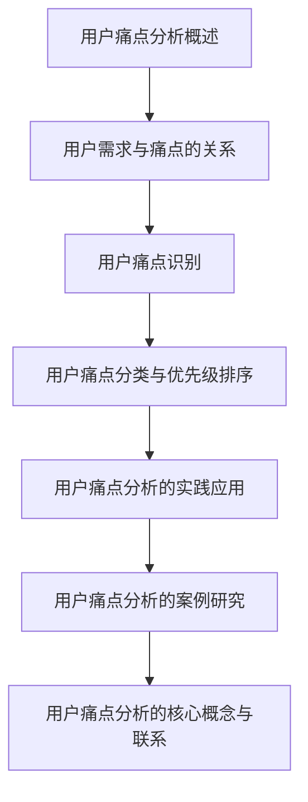

                 

# 《如何进行有效的用户痛点分析》

> **关键词**：用户痛点分析、需求挖掘、用户体验、产品设计、营销策略、企业运营

> **摘要**：本文从用户痛点分析的基础知识出发，详细探讨了用户痛点分析在产品设计、营销策略和企业运营中的应用，并通过案例研究展示了用户痛点分析的实践方法和技巧。本文旨在帮助读者理解用户痛点分析的重要性，掌握其核心概念和方法，从而提升产品和服务的用户体验，实现企业价值最大化。

## 目录大纲

### 《如何进行有效的用户痛点分析》目录大纲

### 第一部分：用户痛点分析基础

#### 第1章：用户痛点分析概述

##### 1.1 用户痛点分析的重要性

##### 1.2 用户痛点分析的流程与方法

##### 1.3 用户痛点分析的工具与技术

#### 第2章：用户需求与痛点的关系

##### 2.1 用户需求分析

##### 2.2 用户痛点与需求的差异

##### 2.3 用户痛点分析的需求挖掘方法

#### 第3章：用户痛点识别

##### 3.1 用户痛点识别的原则

##### 3.2 用户痛点识别的方法

##### 3.3 用户痛点识别的案例分析

#### 第4章：用户痛点分类与优先级排序

##### 4.1 用户痛点分类

##### 4.2 用户痛点优先级排序

##### 4.3 用户痛点分类与排序的案例分析

### 第二部分：用户痛点分析的实践应用

#### 第5章：用户痛点分析在产品设计中的应用

##### 5.1 用户痛点分析在产品设计中的作用

##### 5.2 用户痛点分析在产品设计中的流程

##### 5.3 用户痛点分析在产品设计的案例分析

#### 第6章：用户痛点分析在营销策略中的应用

##### 6.1 用户痛点分析在营销策略中的作用

##### 6.2 用户痛点分析在营销策略中的流程

##### 6.3 用户痛点分析在营销策略中的案例分析

#### 第7章：用户痛点分析在企业运营中的应用

##### 7.1 用户痛点分析在企业运营中的作用

##### 7.2 用户痛点分析在企业运营中的流程

##### 7.3 用户痛点分析在企业运营中的案例分析

#### 第8章：用户痛点分析的案例研究

##### 8.1 案例一：某电商平台用户痛点分析

##### 8.2 案例二：某在线教育平台用户痛点分析

##### 8.3 案例三：某健康管理平台用户痛点分析

### 第三部分：用户痛点分析的核心概念与联系

#### 第9章：用户痛点分析的核心概念与联系

##### 9.1 用户痛点分析的概念联系

##### 9.2 用户需求分析与用户痛点分析的关系

##### 9.3 用户痛点分析与其他用户研究方法的关系

### 附录

#### 附录 A：用户痛点分析工具与资源

##### A.1 常用用户研究工具介绍

##### A.2 用户痛点分析相关的在线资源和文献推荐

#### 附录 B：用户痛点分析伪代码示例

##### B.1 用户痛点识别的伪代码

##### B.2 用户痛点分类与优先级排序的伪代码

#### 附录 C：用户痛点分析案例代码解读与分析

##### C.1 某电商平台用户痛点分析案例代码解读

##### C.2 某在线教育平台用户痛点分析案例代码解读

##### C.3 某健康管理平台用户痛点分析案例代码解读

### Mermaid 流程图：用户痛点分析流程




### 第一部分：用户痛点分析基础

#### 第1章：用户痛点分析概述

##### 1.1 用户痛点分析的重要性

在当今竞争激烈的市场环境中，用户体验（UX）已成为企业成功的关键因素之一。用户痛点分析作为一种深入理解用户需求和行为的方法，对于提升产品和服务质量具有至关重要的意义。用户痛点分析的核心在于识别和解决用户在使用产品或服务过程中的不满和困扰，从而提高用户满意度和忠诚度。

用户痛点分析的重要性主要体现在以下几个方面：

1. **发现产品改进机会**：通过用户痛点分析，企业可以发现产品或服务中存在的问题，从而制定相应的改进措施，提升产品竞争力。

2. **提高用户体验**：了解用户的痛点和需求，可以帮助企业设计出更符合用户期望的产品和服务，从而提高用户满意度和忠诚度。

3. **优化资源配置**：用户痛点分析可以帮助企业识别出最需要关注的领域，从而更加合理地分配资源，提高运营效率。

4. **增强市场竞争力**：通过持续的用户痛点分析，企业可以不断优化产品和服务，提升市场竞争力，保持持续的市场优势。

##### 1.2 用户痛点分析的流程与方法

用户痛点分析的流程通常包括以下几个步骤：

1. **需求收集**：通过问卷调查、用户访谈、观察等方法收集用户的需求和痛点。

2. **数据整理**：对收集到的数据进行整理和分析，提取出用户痛点的关键信息。

3. **用户痛点识别**：根据数据整理结果，识别出用户的痛点，并对其进行分类和优先级排序。

4. **解决方案制定**：针对识别出的用户痛点，制定相应的解决方案，包括产品设计、营销策略和企业运营等方面的改进措施。

5. **实施与监控**：实施解决方案，并对实施效果进行监控和评估，以持续优化产品和服务。

用户痛点分析的方法多种多样，以下是一些常用的方法：

1. **问卷调查**：通过设计有针对性的问卷，收集用户的需求和痛点。

2. **用户访谈**：通过与用户进行面对面的交流，深入了解用户的需求和痛点。

3. **观察法**：通过观察用户在使用产品或服务时的行为和反馈，识别出用户的痛点。

4. **用户行为分析**：通过分析用户行为数据，识别出用户的痛点和需求。

5. **痛点地图**：通过绘制痛点地图，直观地展示用户的痛点和需求。

##### 1.3 用户痛点分析的工具与技术

用户痛点分析需要借助多种工具和技术，以下是一些常用的工具：

1. **问卷工具**：如SurveyMonkey、Google表单等，用于收集用户需求。

2. **数据分析工具**：如Excel、Python等，用于整理和分析用户数据。

3. **用户访谈工具**：如Zoom、腾讯会议等，用于进行用户访谈。

4. **用户行为分析工具**：如Google Analytics、Mixpanel等，用于分析用户行为数据。

5. **痛点地图工具**：如Miro、MindMeister等，用于绘制痛点地图。

### 第一部分总结

用户痛点分析是提升用户体验、优化产品和服务的核心方法。通过了解用户的需求和痛点，企业可以更好地制定改进措施，提高产品竞争力。本章介绍了用户痛点分析的重要性、流程和方法，以及相关的工具和技术。在接下来的章节中，我们将深入探讨用户需求与痛点的关系、用户痛点识别的方法和案例，以及用户痛点分析的实践应用。

#### 第2章：用户需求与痛点的关系

在产品设计和开发过程中，正确理解和处理用户需求与痛点之间的关系是至关重要的。用户需求通常是指用户在使用产品或服务时所期望的功能、性能和体验。而用户痛点则是用户在使用产品或服务过程中遇到的实际问题、不满和困扰。这两者之间存在紧密的联系，同时也存在明显的区别。

##### 2.1 用户需求分析

用户需求分析是产品设计和开发的基础。通过对用户需求的深入分析，企业可以确定产品的基本功能和特性，从而满足用户的基本需求和期望。以下是用户需求分析的主要步骤：

1. **需求收集**：通过问卷调查、用户访谈、观察法等方式，收集用户的原始需求信息。

2. **需求分类**：将收集到的需求进行分类，如功能需求、性能需求、用户体验需求等。

3. **需求优先级排序**：根据用户需求的紧急性和重要性，对需求进行优先级排序，以便资源合理分配。

4. **需求验证**：通过与用户进行验证，确保需求的准确性和可实现性。

用户需求分析的方法主要包括以下几种：

1. **问卷调查**：通过设计有针对性的问卷，收集大量用户的原始需求。

2. **用户访谈**：通过与用户进行面对面的交流，深入了解用户的需求和期望。

3. **用户行为分析**：通过分析用户在使用产品或服务时的行为数据，识别出用户的需求。

4. **需求池**：将收集到的需求整理成需求池，供产品团队参考。

##### 2.2 用户痛点与需求的差异

用户痛点与用户需求之间存在一定的差异，主要体现在以下几个方面：

1. **描述方式**：用户需求通常是用来说明用户期望的功能和体验，而用户痛点则是用来说明用户遇到的实际问题和困扰。

2. **焦点**：用户需求主要关注产品的功能和性能，而用户痛点则更关注产品的易用性、可靠性和用户体验。

3. **紧迫性**：用户需求可能具有一定的长期性，而用户痛点通常具有更高的紧迫性，需要立即解决。

4. **来源**：用户需求主要来源于用户的期望和需求，而用户痛点则主要来源于用户的实际使用体验。

##### 2.3 用户痛点分析的需求挖掘方法

用户痛点分析的需求挖掘方法主要包括以下几种：

1. **直接提问**：通过设计有针对性的问题，直接询问用户他们在使用产品或服务过程中遇到的问题和困扰。

2. **用户访谈**：通过与用户进行深入的访谈，了解他们在使用产品或服务时的实际体验和感受。

3. **用户反馈**：收集和分析用户在产品使用过程中的反馈和评论，识别出用户的痛点和需求。

4. **用户行为分析**：通过分析用户在使用产品或服务时的行为数据，识别出用户的痛点和需求。

5. **用户调查**：通过设计有针对性的调查问卷，收集用户的痛点和需求。

##### 案例分析

为了更好地说明用户需求与痛点的关系，以下是一个实际案例分析：

**案例**：某电商平台用户需求与痛点分析

1. **用户需求**：

   - 功能需求：用户希望能够快速找到所需商品，方便快捷地进行购物。
   - 性能需求：用户希望商品搜索结果准确，加载速度快，页面响应流畅。
   - 用户体验需求：用户希望购物体验简洁、直观，易于操作。

2. **用户痛点**：

   - 痛点1：用户在搜索商品时，常常遇到搜索结果不准确的问题，导致购物体验差。
   - 痛点2：商品加载速度慢，导致用户在浏览商品时感到不耐烦。
   - 痛点3：购物流程复杂，用户需要多次跳转才能完成购物，用户体验不佳。

3. **解决方案**：

   - 提高商品搜索准确率，通过优化搜索引擎算法，提高搜索结果的准确度。
   - 优化商品加载速度，通过优化页面加载逻辑，提高页面响应速度。
   - 简化购物流程，通过优化购物流程设计，减少用户操作步骤，提高购物体验。

通过这个案例，我们可以看到用户需求与痛点之间的紧密联系。了解用户的需求，可以帮助企业设计出更符合用户期望的产品和服务；而了解用户的痛点，则可以帮助企业发现产品和服务中的问题，从而制定针对性的改进措施。

### 第2章总结

本章详细探讨了用户需求与痛点的关系，包括用户需求分析的方法、用户痛点与需求的差异以及用户痛点分析的需求挖掘方法。通过案例分析，我们进一步理解了用户需求与痛点之间的关系，以及如何通过用户痛点分析来优化产品和服务。在接下来的章节中，我们将继续探讨用户痛点识别的原则和方法，以及用户痛点分类与优先级排序的技巧。

#### 第3章：用户痛点识别

用户痛点识别是用户痛点分析的核心环节，它决定了后续分析的有效性和实施策略的针对性。有效识别用户痛点不仅需要科学的分析方法，还需要遵循一系列原则和步骤。以下将详细介绍用户痛点识别的原则、方法和案例分析。

##### 3.1 用户痛点识别的原则

1. **客观性**：用户痛点识别应以客观事实为基础，避免主观臆断和偏见。

2. **全面性**：应全面收集和分析用户反馈，包括正面和负面的信息，以获得全面的用户画像。

3. **相关性**：识别的用户痛点应与产品或服务的核心功能和用户体验密切相关。

4. **实用性**：用户痛点识别应有助于实际问题的解决，避免识别出无实际操作价值的问题。

5. **可度量性**：用户痛点应具备可量化的指标，以便于分析和评估改进效果。

##### 3.2 用户痛点识别的方法

1. **问卷调查**：通过设计有针对性的问卷，收集用户的痛点和需求。问卷调查的优点是收集数据量大，成本较低，但可能存在主观偏差。

2. **用户访谈**：通过与用户进行一对一或小组访谈，深入了解用户的使用习惯和痛点。用户访谈的优点是信息丰富，互动性强，但耗时较长。

3. **观察法**：通过观察用户在真实环境中的行为，捕捉用户在使用产品或服务时的痛点。观察法的优点是直接、真实，但可能受到观察者主观影响。

4. **用户行为分析**：通过分析用户在使用产品或服务时的行为数据，识别出用户的痛点和需求。行为分析法的优点是数据量大，客观性强，但需要专业工具和技术支持。

5. **用户反馈分析**：收集和分析用户在论坛、社交媒体、客服反馈等渠道的反馈信息，识别出用户的痛点和需求。用户反馈分析法的优点是信息来源广泛，但需要处理大量非结构化数据。

##### 3.3 用户痛点识别的案例分析

以下是一个实际案例分析，展示如何进行用户痛点识别。

**案例**：某在线教育平台用户痛点识别

1. **背景**：

   某在线教育平台在用户反馈中收到了大量关于课程学习体验不佳的投诉，平台管理层决定进行用户痛点识别，以优化学习体验。

2. **方法**：

   - 问卷调查：通过设计问卷，收集用户对课程学习体验的满意度、学习过程中的困难和需求。
   - 用户访谈：与部分用户进行深入访谈，了解他们的学习习惯和遇到的困难。
   - 用户行为分析：通过分析用户在学习平台上的行为数据，如课程访问频率、学习时长、互动情况等，识别用户的行为模式和痛点。

3. **结果**：

   - 痛点1：课程内容复杂，用户难以消化和理解。问卷调查显示，超过60%的用户对课程难度表示不满，访谈中用户提到课程内容过于理论化，缺乏实际操作指导。
   - 痛点2：课程进度不灵活，用户无法根据自己的时间安排学习。用户行为分析显示，用户在课程开始后的第一周内学习积极性最高，但随后由于工作繁忙而中断学习。
   - 痛点3：互动性不足，用户在学习过程中缺乏与讲师和其他学员的互动。用户反馈中提到，在线讨论区活跃度低，学员之间缺乏交流。

4. **解决方案**：

   - 针对痛点1，平台决定调整课程内容，增加实际操作案例和互动环节，提高课程实用性和趣味性。
   - 针对痛点2，平台优化了课程进度设置，允许用户自主调整学习进度，并提供提醒功能，帮助用户规划学习时间。
   - 针对痛点3，平台增加了实时互动功能，如直播课程和在线讨论区，提高用户之间的互动性，增强学习氛围。

通过这个案例，我们可以看到用户痛点识别的实践过程。首先，通过多种方法收集用户反馈和行为数据，然后对这些数据进行分析，识别出用户的痛点。最后，根据痛点的性质和严重程度，制定针对性的解决方案，以优化用户体验。

### 第3章总结

本章详细介绍了用户痛点识别的原则和方法，并通过实际案例展示了如何进行用户痛点识别。用户痛点识别是用户痛点分析的重要环节，它为后续的痛点分类和优先级排序提供了基础。在接下来的章节中，我们将继续探讨用户痛点分类与优先级排序的技巧，帮助读者更深入地理解用户痛点分析的方法和应用。

#### 第4章：用户痛点分类与优先级排序

用户痛点分类与优先级排序是用户痛点分析的关键步骤，它有助于企业明确哪些痛点需要优先解决，以便最大化提升用户满意度和产品竞争力。在本章中，我们将详细介绍用户痛点分类的原则、方法，以及优先级排序的技巧，并通过案例分析来说明如何在实际应用中实施这些方法。

##### 4.1 用户痛点分类

用户痛点分类的目的是将识别出的用户痛点进行系统化整理，以便于分析和处理。以下是一些常见的用户痛点分类原则：

1. **按痛点性质分类**：将痛点按性质分为功能性问题、性能问题、用户体验问题等。例如，功能性问题可能包括无法满足用户特定需求的功能缺失；性能问题可能包括系统响应速度慢、数据加载时间长等；用户体验问题可能包括界面设计不合理、操作流程繁琐等。

2. **按影响范围分类**：将痛点按影响范围分为全局性问题、局部性问题等。全局性问题可能影响整个产品或服务的用户体验；局部性问题可能只影响产品或服务的某个模块或功能。

3. **按严重程度分类**：将痛点按严重程度分为关键问题、重要问题、一般问题等。关键问题可能直接导致用户放弃使用产品或服务；重要问题可能影响用户的使用体验，但不会导致用户流失；一般问题可能对用户体验有一定影响，但不会产生严重后果。

4. **按出现频率分类**：将痛点按出现频率分为高频痛点、低频痛点等。高频痛点可能出现在大多数用户的使用过程中，需要重点关注；低频痛点可能只出现在特定情况下，对整体用户体验的影响相对较小。

##### 4.2 用户痛点优先级排序

用户痛点优先级排序的目的是确定哪些痛点应该优先解决，以便企业能够将有限的资源投入到最需要改进的领域。以下是一些常见的用户痛点优先级排序方法：

1. **影响程度法**：根据痛点的严重程度和影响范围，对痛点进行排序。关键问题应优先解决，全局性问题次之，重要问题和一般问题根据具体情况安排。

2. **成本效益法**：根据解决痛点的成本和预期效益，对痛点进行排序。通常情况下，优先解决成本较低且效益较高的痛点。

3. **用户满意度法**：根据用户对痛点的满意度，对痛点进行排序。用户满意度较高的痛点应优先解决，以提升用户满意度。

4. **关键路径法**：根据用户在使用产品或服务时的关键路径，对痛点进行排序。关键路径上的痛点应优先解决，以提高用户体验的整体质量。

##### 4.3 用户痛点分类与优先级排序的案例分析

以下是一个实际案例分析，说明如何进行用户痛点分类与优先级排序。

**案例**：某移动支付应用用户痛点分类与优先级排序

1. **背景**：

   某移动支付应用在市场调研中发现用户反馈中存在多个痛点，需要对其进行分类和优先级排序，以便优化用户体验。

2. **方法**：

   - 用户调研：通过问卷调查和用户访谈，收集用户的痛点信息。
   - 数据分析：分析用户反馈数据，识别出主要的用户痛点。
   - 痛点分类：根据痛点的性质、影响范围和出现频率，将痛点分为功能性问题、性能问题、用户体验问题等。
   - 优先级排序：结合痛点的严重程度、用户满意度、成本效益等因素，对痛点进行优先级排序。

3. **结果**：

   - 痛点分类：
     - 功能性问题：支付失败率高、收款信息填写复杂。
     - 性能问题：支付速度慢、网络连接不稳定。
     - 用户体验问题：界面设计不友好、操作流程繁琐。

   - 优先级排序：
     - 关键问题：支付失败率高，影响用户支付体验和信任度。
     - 重要问题：支付速度慢、收款信息填写复杂，影响用户使用效率。
     - 一般问题：界面设计不友好、操作流程繁琐，对用户体验有一定影响，但不会导致用户流失。

4. **解决方案**：

   - 关键问题：优化支付系统，降低支付失败率，提高支付成功率。
   - 重要问题：提升网络连接稳定性，加快支付速度，简化收款信息填写流程。
   - 一般问题：优化界面设计，简化操作流程，提高用户体验。

通过这个案例，我们可以看到用户痛点分类与优先级排序的具体实施过程。首先，通过多种方法收集用户反馈，然后对痛点进行分类，并根据痛点的严重程度、用户满意度、成本效益等因素进行优先级排序。最后，根据痛点的性质和优先级，制定针对性的解决方案，以优化用户体验。

### 第4章总结

本章详细介绍了用户痛点分类与优先级排序的原则和方法，并通过实际案例展示了如何进行用户痛点分类与优先级排序。用户痛点分类与优先级排序是用户痛点分析的重要环节，它帮助企业在有限的资源下，有针对性地解决用户痛点，提升产品竞争力。在接下来的章节中，我们将探讨用户痛点分析在产品设计、营销策略和企业运营中的应用，以进一步理解用户痛点分析的价值和实践方法。

#### 第5章：用户痛点分析在产品设计中的应用

用户痛点分析在产品设计过程中扮演着至关重要的角色。通过深入理解用户的需求和痛点，设计师可以制定出更符合用户期望的产品方案，从而提高产品的市场竞争力。在本章中，我们将探讨用户痛点分析在产品设计中的应用，包括用户痛点分析在产品设计中的作用、流程以及实际案例分析。

##### 5.1 用户痛点分析在产品设计中的作用

用户痛点分析在产品设计中的作用主要体现在以下几个方面：

1. **指导产品设计方向**：用户痛点分析可以帮助设计师明确产品的核心功能和特性，确保产品设计符合用户需求。

2. **优化用户体验**：通过识别用户痛点，设计师可以针对性地优化产品界面、流程和功能，提升用户体验。

3. **发现改进机会**：用户痛点分析可以帮助设计师发现产品中的潜在问题和改进机会，从而持续优化产品。

4. **降低开发风险**：通过提前识别用户痛点，设计师可以在产品设计阶段就进行规避，降低开发过程中的风险。

5. **提升用户满意度**：解决用户痛点可以有效提高用户满意度，增强用户对产品的信任和忠诚度。

##### 5.2 用户痛点分析在产品设计中的流程

用户痛点分析在产品设计中的流程通常包括以下几个步骤：

1. **需求收集**：通过问卷调查、用户访谈、观察法等方式，收集用户的原始需求和痛点信息。

2. **数据整理**：对收集到的数据进行整理和分析，提取出用户痛点的关键信息。

3. **用户痛点识别**：根据数据整理结果，识别出用户的痛点，并对其进行分类和优先级排序。

4. **痛点验证**：通过与用户进行验证，确保识别出的痛点准确无误。

5. **解决方案制定**：针对识别出的用户痛点，制定相应的解决方案，包括产品设计、功能优化等方面。

6. **方案实施与评估**：实施解决方案，并对实施效果进行监控和评估，以持续优化产品。

##### 5.3 用户痛点分析在产品设计的案例分析

以下是一个实际案例分析，展示如何利用用户痛点分析来优化产品设计。

**案例**：某移动新闻应用的用户痛点分析

1. **背景**：

   某移动新闻应用在用户调研中发现了多个痛点，管理层决定进行用户痛点分析，以优化产品设计和提升用户体验。

2. **方法**：

   - 用户调研：通过问卷调查和用户访谈，收集用户的痛点和需求信息。
   - 数据分析：对用户反馈进行整理和分析，识别出主要的用户痛点。
   - 痛点验证：通过与用户进行验证，确认痛点的真实性和重要性。
   - 解决方案制定：根据痛点的性质和优先级，制定针对性的解决方案。

3. **结果**：

   - 用户痛点识别：
     - 痛点1：内容推荐不准确，用户在浏览新闻时经常遇到不感兴趣的内容。
     - 痛点2：加载速度慢，用户在打开应用和浏览新闻时经常遇到卡顿现象。
     - 痛点3：广告过多，影响用户阅读体验。

   - 解决方案制定：
     - 针对痛点1，优化推荐算法，提高内容推荐的准确性。
     - 针对痛点2，优化应用性能，提高加载速度。
     - 针对痛点3，调整广告策略，减少广告对用户体验的影响。

4. **实施与评估**：

   - 实施解决方案后，对用户进行回访，收集反馈信息。
   - 通过数据分析，评估优化措施的效果，持续调整和改进。

5. **效果**：

   - 优化后的移动新闻应用在内容推荐准确性、加载速度和广告展示方面得到了显著提升，用户满意度明显提高。

通过这个案例，我们可以看到用户痛点分析在产品设计中的应用。首先，通过多种方法收集用户反馈，然后对痛点进行识别、验证和解决方案制定。最后，通过实施和评估，持续优化产品设计和用户体验。

### 第5章总结

本章详细探讨了用户痛点分析在产品设计中的应用，包括用户痛点分析在产品设计中的作用、流程以及实际案例分析。通过用户痛点分析，设计师可以更深入地理解用户需求，优化产品设计，提高用户体验和市场竞争力。在接下来的章节中，我们将继续探讨用户痛点分析在营销策略和企业运营中的应用，以全面理解用户痛点分析的价值和实践方法。

#### 第6章：用户痛点分析在营销策略中的应用

用户痛点分析在营销策略中扮演着至关重要的角色，它能够帮助企业更好地了解用户需求，制定有针对性的营销策略，从而提高市场竞争力。在本章中，我们将探讨用户痛点分析在营销策略中的作用、流程以及实际案例分析。

##### 6.1 用户痛点分析在营销策略中的作用

1. **明确目标受众**：通过用户痛点分析，企业可以更准确地识别出目标受众，了解他们的需求和痛点，从而制定更有效的营销策略。

2. **定位产品特点**：用户痛点分析可以帮助企业发现产品的独特卖点，将其与用户痛点相结合，突出产品的优势和竞争力。

3. **制定营销活动**：基于用户痛点分析，企业可以设计出更符合用户需求的营销活动，提高营销活动的吸引力和效果。

4. **优化广告投放**：通过分析用户痛点，企业可以更精准地定位广告投放渠道，提高广告投放的转化率。

5. **提高用户忠诚度**：解决用户痛点可以提高用户满意度和忠诚度，从而增加复购率和推荐率。

##### 6.2 用户痛点分析在营销策略中的流程

用户痛点分析在营销策略中的流程通常包括以下几个步骤：

1. **需求收集**：通过问卷调查、用户访谈、用户行为分析等方式，收集用户的痛点和需求信息。

2. **数据整理**：对收集到的数据进行整理和分析，提取出用户痛点的关键信息。

3. **用户痛点识别**：根据数据整理结果，识别出用户的痛点，并对其进行分类和优先级排序。

4. **痛点验证**：通过与用户进行验证，确保识别出的痛点准确无误。

5. **解决方案制定**：针对识别出的用户痛点，制定相应的解决方案，包括营销策略、广告投放、促销活动等方面。

6. **方案实施与评估**：实施解决方案，并对实施效果进行监控和评估，以持续优化营销策略。

##### 6.3 用户痛点分析在营销策略中的案例分析

以下是一个实际案例分析，展示如何利用用户痛点分析来制定营销策略。

**案例**：某智能家居品牌用户痛点分析

1. **背景**：

   某智能家居品牌在市场调研中发现用户对智能家居产品的体验存在多个痛点，决定通过用户痛点分析来优化营销策略。

2. **方法**：

   - 用户调研：通过问卷调查和用户访谈，收集用户的痛点和需求信息。
   - 数据分析：对用户反馈进行整理和分析，识别出主要的用户痛点。
   - 痛点验证：通过与用户进行验证，确认痛点的真实性和重要性。
   - 解决方案制定：根据痛点的性质和优先级，制定针对性的营销策略。

3. **结果**：

   - 用户痛点识别：
     - 痛点1：产品安装复杂，用户需要专业知识才能正确安装。
     - 痛点2：操作不便捷，用户需要花费较多时间学习和操作。
     - 痛点3：价格较高，用户对产品价格有一定顾虑。

   - 营销策略制定：
     - 针对痛点1，推出安装服务，为用户提供专业的安装支持。
     - 针对痛点2，优化产品操作界面，简化用户操作流程。
     - 针对痛点3，推出分期付款、优惠券等促销活动，降低用户购买成本。

4. **实施与评估**：

   - 实施新的营销策略后，对用户进行回访，收集反馈信息。
   - 通过数据分析，评估营销策略的效果，持续调整和优化。

5. **效果**：

   - 新的营销策略有效解决了用户痛点，提高了用户满意度，销售业绩显著提升。

通过这个案例，我们可以看到用户痛点分析在营销策略中的应用。首先，通过多种方法收集用户反馈，然后对痛点进行识别、验证和解决方案制定。最后，通过实施和评估，持续优化营销策略，提高市场竞争力。

### 第6章总结

本章详细探讨了用户痛点分析在营销策略中的应用，包括用户痛点分析在营销策略中的作用、流程以及实际案例分析。通过用户痛点分析，企业可以更准确地了解用户需求，制定有针对性的营销策略，提高市场竞争力。在接下来的章节中，我们将继续探讨用户痛点分析在企业运营中的应用，以全面理解用户痛点分析的价值和实践方法。

#### 第7章：用户痛点分析在企业运营中的应用

用户痛点分析不仅对产品设计、营销策略具有重要意义，同样在企业运营中也发挥着关键作用。通过深入理解用户痛点，企业可以优化运营流程，提高效率，降低成本，从而提升整体运营水平。在本章中，我们将探讨用户痛点分析在企业运营中的作用、流程以及实际案例分析。

##### 7.1 用户痛点分析在企业运营中的作用

1. **优化运营流程**：用户痛点分析可以帮助企业识别出运营过程中的瓶颈和问题，从而优化流程，提高运营效率。

2. **降低运营成本**：通过解决用户痛点，企业可以减少不必要的运营支出，降低成本。

3. **提升客户满意度**：解决用户痛点可以提高用户满意度，增强客户对企业的信任和忠诚度。

4. **增强竞争力**：通过持续的用户痛点分析，企业可以不断优化运营，提升竞争力，在市场中保持领先地位。

5. **提升品牌形象**：解决用户痛点可以提升企业品牌形象，增强用户对企业的好感度。

##### 7.2 用户痛点分析在企业运营中的流程

用户痛点分析在企业运营中的流程通常包括以下几个步骤：

1. **需求收集**：通过问卷调查、用户访谈、用户行为分析等方式，收集用户的痛点和需求信息。

2. **数据整理**：对收集到的数据进行整理和分析，提取出用户痛点的关键信息。

3. **用户痛点识别**：根据数据整理结果，识别出用户的痛点，并对其进行分类和优先级排序。

4. **痛点验证**：通过与用户进行验证，确保识别出的痛点准确无误。

5. **解决方案制定**：针对识别出的用户痛点，制定相应的解决方案，包括运营策略、流程优化、资源调配等方面。

6. **方案实施与评估**：实施解决方案，并对实施效果进行监控和评估，以持续优化运营。

##### 7.3 用户痛点分析在企业运营中的案例分析

以下是一个实际案例分析，展示如何利用用户痛点分析来优化企业运营。

**案例**：某电商平台用户痛点分析

1. **背景**：

   某电商平台在用户调研中发现用户对购物体验存在多个痛点，决定通过用户痛点分析来优化运营流程。

2. **方法**：

   - 用户调研：通过问卷调查和用户访谈，收集用户的痛点和需求信息。
   - 数据分析：对用户反馈进行整理和分析，识别出主要的用户痛点。
   - 痛点验证：通过与用户进行验证，确认痛点的真实性和重要性。
   - 解决方案制定：根据痛点的性质和优先级，制定针对性的运营策略。

3. **结果**：

   - 用户痛点识别：
     - 痛点1：订单处理时间长，用户在购物后的等待时间较长。
     - 痛点2：物流信息不透明，用户无法实时了解订单状态。
     - 痛点3：售后服务不完善，用户在遇到问题时难以得到及时解决。

   - 解决方案制定：
     - 针对痛点1，优化订单处理流程，提高处理效率。
     - 针对痛点2，完善物流信息跟踪系统，提升用户对物流状态的实时掌握。
     - 针对痛点3，建立完善的售后服务体系，提升用户满意度。

4. **实施与评估**：

   - 实施新的运营策略后，对用户进行回访，收集反馈信息。
   - 通过数据分析，评估运营策略的效果，持续调整和优化。

5. **效果**：

   - 新的运营策略有效解决了用户痛点，提高了用户满意度，订单处理时间显著缩短，物流信息透明度提升，售后服务质量得到改善。

通过这个案例，我们可以看到用户痛点分析在企业运营中的应用。首先，通过多种方法收集用户反馈，然后对痛点进行识别、验证和解决方案制定。最后，通过实施和评估，持续优化企业运营，提高整体运营水平。

### 第7章总结

本章详细探讨了用户痛点分析在企业运营中的应用，包括用户痛点分析在企业运营中的作用、流程以及实际案例分析。通过用户痛点分析，企业可以优化运营流程，提高效率，降低成本，提升客户满意度，从而增强竞争力。在接下来的章节中，我们将通过具体的案例研究，进一步展示用户痛点分析在不同领域的实际应用，以全面理解其价值和实践方法。

#### 第8章：用户痛点分析的案例研究

通过对多个实际案例的研究，我们可以更深入地理解用户痛点分析在不同领域的应用，以及其带来的实际效果。在本章中，我们将探讨三个不同行业的用户痛点分析案例：电商平台、在线教育平台和健康管理平台。每个案例都将展示用户痛点分析的方法、过程和解决方案。

##### 8.1 案例一：某电商平台用户痛点分析

**背景**：

某知名电商平台在用户调研中发现，用户对购物体验存在多个痛点，包括订单处理时间长、物流信息不透明和售后服务不完善等。

**方法**：

1. **问卷调查**：设计问卷，收集用户对购物体验的评价和意见。
2. **用户访谈**：与部分用户进行深入访谈，了解他们的购物经历和痛点。
3. **数据挖掘**：分析用户行为数据，识别出普遍存在的痛点。

**过程**：

1. **用户痛点识别**：通过问卷调查和用户访谈，识别出订单处理时间长、物流信息不透明和售后服务不完善等用户痛点。
2. **痛点验证**：通过与用户进一步沟通，确认这些痛点的真实性和重要性。
3. **解决方案制定**：根据用户痛点，制定优化订单处理流程、完善物流信息跟踪系统和提升售后服务的解决方案。

**解决方案**：

1. **订单处理**：优化订单处理系统，提高处理效率，缩短用户等待时间。
2. **物流跟踪**：推出实时物流信息查询功能，让用户随时了解订单状态。
3. **售后服务**：建立完善的售后服务体系，包括快速响应用户问题和提供灵活的退换货政策。

**效果**：

实施解决方案后，订单处理时间显著缩短，物流信息透明度提升，售后服务质量得到改善，用户满意度大幅提高，订单量和复购率也相应增加。

##### 8.2 案例二：某在线教育平台用户痛点分析

**背景**：

某在线教育平台在用户调研中发现，用户对课程内容、学习体验和互动性存在多个痛点，包括课程内容复杂、学习进度不灵活和互动性不足等。

**方法**：

1. **问卷调查**：设计问卷，收集用户对课程内容和学习体验的评价。
2. **用户访谈**：与部分用户进行深入访谈，了解他们的学习需求和痛点。
3. **行为分析**：分析用户在学习平台上的行为数据，识别出普遍存在的痛点。

**过程**：

1. **用户痛点识别**：通过问卷调查、用户访谈和行为分析，识别出课程内容复杂、学习进度不灵活和互动性不足等用户痛点。
2. **痛点验证**：通过与用户进一步沟通，确认这些痛点的真实性和重要性。
3. **解决方案制定**：根据用户痛点，制定优化课程内容、调整学习进度和增强互动性的解决方案。

**解决方案**：

1. **课程内容**：调整课程结构，增加实际操作案例和互动环节，提高课程实用性。
2. **学习进度**：推出个性化学习计划，允许用户自主调整学习进度。
3. **互动性**：增加实时互动功能，如直播课程和在线讨论区，提高用户之间的互动性。

**效果**：

实施解决方案后，课程内容更加实用，学习进度更加灵活，用户互动性显著增强，用户满意度和参与度大幅提升。

##### 8.3 案例三：某健康管理平台用户痛点分析

**背景**：

某健康管理平台在用户调研中发现，用户在健康管理过程中存在多个痛点，包括数据记录繁琐、健康分析不准确和缺乏个性化服务等。

**方法**：

1. **问卷调查**：设计问卷，收集用户对健康管理服务的评价和意见。
2. **用户访谈**：与部分用户进行深入访谈，了解他们的健康管理需求和痛点。
3. **数据分析**：分析用户在使用平台时的行为数据，识别出普遍存在的痛点。

**过程**：

1. **用户痛点识别**：通过问卷调查、用户访谈和数据分析，识别出数据记录繁琐、健康分析不准确和缺乏个性化服务等用户痛点。
2. **痛点验证**：通过与用户进一步沟通，确认这些痛点的真实性和重要性。
3. **解决方案制定**：根据用户痛点，制定简化数据记录、提高健康分析准确性和提供个性化服务的解决方案。

**解决方案**：

1. **数据记录**：推出智能数据记录功能，通过自动同步设备数据，简化用户操作。
2. **健康分析**：引入先进的数据分析算法，提高健康分析准确性。
3. **个性化服务**：根据用户健康状况和需求，提供个性化的健康管理建议。

**效果**：

实施解决方案后，用户数据记录变得更加便捷，健康分析准确性显著提高，个性化服务得到增强，用户满意度和忠诚度大幅提升。

### 第8章总结

本章通过三个不同行业的案例研究，展示了用户痛点分析在不同领域的实际应用。通过详细的方法、过程和解决方案，我们可以看到用户痛点分析对于优化产品和服务，提升用户体验和满意度具有重要作用。这些案例不仅为我们提供了具体的实践指导，也强调了用户痛点分析在各个行业中的普遍价值。在接下来的章节中，我们将进一步探讨用户痛点分析的核心概念与联系，以深入理解其内在逻辑和应用。

#### 第9章：用户痛点分析的核心概念与联系

在用户痛点分析中，理解核心概念及其相互关系是至关重要的。本章将深入探讨用户需求分析、用户痛点分析以及其他相关用户研究方法之间的关系，以及它们如何相互影响和补充，以帮助读者构建完整的用户痛点分析框架。

##### 9.1 用户痛点分析的概念联系

1. **用户需求分析**：用户需求分析是用户痛点分析的基础。它关注的是用户对产品或服务的期望和需求。用户痛点分析则是在需求分析的基础上，进一步挖掘出用户在现实使用场景中遇到的具体问题和不满。可以说，用户需求分析为用户痛点分析提供了方向和依据。

2. **用户体验**：用户体验是用户痛点分析的核心目标。用户体验包括用户在使用产品或服务时的所有感受，包括功能性、易用性、情感性和美学性等方面。用户痛点分析旨在识别和解决影响用户体验的问题，从而提升整体用户体验。

3. **用户满意度**：用户满意度是衡量用户痛点分析效果的重要指标。通过识别用户痛点并加以解决，可以显著提高用户满意度。用户满意度直接影响到用户忠诚度、推荐行为和企业的市场表现。

4. **用户行为分析**：用户行为分析是用户痛点分析的重要工具。它通过分析用户在使用产品或服务时的行为数据，揭示用户痛点的本质和分布。用户行为分析的结果可以用来验证和补充用户调研的发现，提高用户痛点识别的准确性。

##### 9.2 用户需求分析与用户痛点分析的关系

用户需求分析和用户痛点分析之间存在密切的关联。具体来说：

1. **需求驱动痛点**：用户需求是用户痛点产生的根本原因。用户在满足自身需求的过程中，可能会遇到各种问题和障碍，这些问题和障碍就形成了用户痛点。

2. **痛点反映需求**：用户痛点是用户需求无法得到满足的具体表现。通过对用户痛点的识别和分析，可以揭示出更深层次的用户需求，从而为产品优化和改进提供有针对性的指导。

3. **双向互动**：用户需求分析和用户痛点分析是一个双向互动的过程。在识别用户痛点后，可以通过进一步的需求分析来理解这些痛点的根源，进而制定更有效的解决方案。

##### 9.3 用户痛点分析与其他用户研究方法的关系

用户痛点分析需要与其他用户研究方法相结合，以获得更全面、准确的信息。以下是几种常见的用户研究方法与用户痛点分析的关系：

1. **用户访谈**：用户访谈是一种直接的获取用户反馈的方法。通过深入访谈，可以获取到用户的真实感受和具体痛点，是用户痛点分析的重要来源。

2. **问卷调查**：问卷调查是一种高效的收集大量用户反馈的方法。通过设计合理的问卷，可以快速收集用户对产品或服务的评价和意见，为用户痛点分析提供数据支持。

3. **用户行为分析**：用户行为分析通过分析用户在产品或服务中的行为数据，识别出潜在的用户痛点。这种方法可以提供定量数据，帮助用户痛点分析的精确性。

4. **用户体验地图**：用户体验地图是一种可视化工具，用于描述用户在使用产品或服务过程中的所有触点和体验。通过绘制用户体验地图，可以直观地识别出用户痛点和改进机会。

5. **用户反馈分析**：用户反馈分析是对用户在论坛、社交媒体、客服反馈等渠道的反馈信息进行系统性的整理和分析。通过分析用户反馈，可以识别出用户的痛点，并为产品优化提供参考。

##### 总结

用户痛点分析是一个综合性的过程，涉及多个核心概念和方法。用户需求分析为用户痛点分析提供了基础，用户体验和用户满意度是分析的目标，而用户行为分析和其他用户研究方法则为用户痛点分析提供了数据支持和方法指导。通过深入理解和运用这些核心概念和方法，企业可以更有效地识别和解决用户痛点，提升产品和服务质量，从而在激烈的市场竞争中脱颖而出。

### 附录

#### 附录 A：用户痛点分析工具与资源

**A.1 常用用户研究工具介绍**

1. **问卷调查工具**：
   - SurveyMonkey：提供在线问卷设计和分发功能，支持多种问题类型和数据分析。
   - Google表单：Google提供的免费问卷工具，操作简单，易于使用。

2. **用户访谈工具**：
   - Zoom：支持视频会议和屏幕共享，适合远程用户访谈。
   -腾讯会议：提供高清视频、音频和实时聊天功能，支持多设备接入。

3. **用户行为分析工具**：
   - Google Analytics：用于网站和移动应用的用户行为分析，提供丰富的报告和统计数据。
   - Mixpanel：提供实时用户行为分析和用户增长分析，支持自定义事件跟踪。

4. **用户体验地图工具**：
   - Miro：支持在线协作，提供多种模板和工具，用于绘制用户体验地图。
   - MindMeister：提供直观的思维导图工具，适合创建和分享用户体验地图。

**A.2 用户痛点分析相关的在线资源和文献推荐**

1. **在线课程**：
   - Coursera：提供用户研究相关的在线课程，包括问卷调查设计、用户访谈技巧等。
   - edX：提供由顶尖大学和机构开设的用户体验设计和用户研究课程。

2. **书籍**：
   - 《用户体验要素》作者：Jesse James Garrett：介绍用户体验设计的基础知识和方法论。
   - 《用户研究实战》作者：Thomas Heatherington：详细介绍用户研究的实战技巧和案例分析。

3. **文章和博客**：
   - UX Planet：提供关于用户体验设计、用户研究和用户痛点分析的文章和教程。
   - Nielsen Norman Group：发布关于用户研究、用户体验和设计的专业文章和研究报告。

#### 附录 B：用户痛点分析伪代码示例

**B.1 用户痛点识别的伪代码**

```python
# 用户痛点识别伪代码

def identify_pain_points(user_feedback):
    pain_points = []
    for feedback in user_feedback:
        if "难用" in feedback or "复杂" in feedback:
            pain_points.append("用户体验不佳")
        elif "卡顿" in feedback or "加载慢" in feedback:
            pain_points.append("性能问题")
        elif "贵" in feedback or "不实惠" in feedback:
            pain_points.append("价格问题")
    return pain_points

# 示例数据
user_feedback = ["这个界面太复杂了", "网页加载速度太慢了", "价格太贵了"]

# 调用函数
identified_pain_points = identify_pain_points(user_feedback)
print(identified_pain_points)
```

**B.2 用户痛点分类与优先级排序的伪代码**

```python
# 用户痛点分类与优先级排序伪代码

def classify_and_sort_pain_points(pain_points):
    classified_pain_points = {"用户体验不佳": [], "性能问题": [], "价格问题": []}
    for point in pain_points:
        if "难用" in point or "复杂" in point:
            classified_pain_points["用户体验不佳"].append(point)
        elif "卡顿" in point or "加载慢" in point:
            classified_pain_points["性能问题"].append(point)
        elif "贵" in point or "不实惠" in point:
            classified_pain_points["价格问题"].append(point)
    
    # 优先级排序
    sorted_pain_points = []
    for category, points in classified_pain_points.items():
        if points:
            sorted_pain_points.append(category)
            sorted_pain_points.extend(sorted(points, key=lambda x: x.count("难用"), reverse=True))
    
    return sorted_pain_points

# 示例数据
pain_points = ["这个界面太复杂了", "网页加载速度太慢了", "价格太贵了"]

# 调用函数
sorted_pain_points = classify_and_sort_pain_points(pain_points)
print(sorted_pain_points)
```

#### 附录 C：用户痛点分析案例代码解读与分析

**C.1 某电商平台用户痛点分析案例代码解读**

以下是一个针对某电商平台的用户痛点分析案例，展示如何使用Python进行数据处理和痛点识别。

```python
# 代码解读

# 导入必要的库
import pandas as pd

# 加载用户反馈数据
user_feedback = pd.read_csv("user_feedback.csv")

# 用户痛点识别
def identify_pain_points(feedback_data):
    # 痛点关键词
    pain_points_keywords = ["难用", "卡顿", "贵", "加载慢", "界面复杂", "搜索不准确"]
    pain_points = []
    for index, row in feedback_data.iterrows():
        feedback = row["feedback"]
        for keyword in pain_points_keywords:
            if keyword in feedback:
                pain_points.append(feedback)
                break
    return pain_points

# 调用函数
identified_pain_points = identify_pain_points(user_feedback)

# 打印结果
for point in identified_pain_points:
    print(point)
```

**分析**：

1. **数据加载**：首先，使用Pandas库加载用户反馈数据，数据通常存储为CSV文件。
2. **痛点识别函数**：定义一个函数`identify_pain_points`，该函数遍历用户反馈数据，检查每个反馈条目中是否包含特定的痛点关键词。
3. **结果输出**：调用函数并打印识别出的用户痛点。

**C.2 某在线教育平台用户痛点分析案例代码解读**

以下是一个针对某在线教育平台的用户痛点分析案例，展示如何使用Python进行数据处理和痛点识别。

```python
# 代码解读

# 导入必要的库
import pandas as pd
from collections import Counter

# 加载用户反馈数据
user_feedback = pd.read_csv("user_feedback.csv")

# 用户痛点识别
def identify_pain_points(feedback_data):
    pain_points = []
    for index, row in feedback_data.iterrows():
        feedback = row["feedback"]
        words = feedback.split()
        word_counts = Counter(words)
        for word, count in word_counts.items():
            if count > 3:  # 假设词频大于3的视为痛点
                pain_points.append(feedback)
                break
    return pain_points

# 调用函数
identified_pain_points = identify_pain_points(user_feedback)

# 打印结果
for point in identified_pain_points:
    print(point)
```

**分析**：

1. **数据加载**：同样使用Pandas库加载用户反馈数据。
2. **痛点识别函数**：定义一个函数`identify_pain_points`，该函数将每个反馈条目拆分成单词，并使用`Counter`来统计单词的频率。如果某个单词的频率大于3，则视为该反馈条目包含用户痛点。
3. **结果输出**：调用函数并打印识别出的用户痛点。

**C.3 某健康管理平台用户痛点分析案例代码解读**

以下是一个针对某健康管理平台的用户痛点分析案例，展示如何使用Python进行数据处理和痛点识别。

```python
# 代码解读

# 导入必要的库
import pandas as pd
from textblob import TextBlob

# 加载用户反馈数据
user_feedback = pd.read_csv("user_feedback.csv")

# 用户痛点识别
def identify_pain_points(feedback_data):
    pain_points = []
    for index, row in feedback_data.iterrows():
        feedback = row["feedback"]
        sentiment = TextBlob(feedback).sentiment.polarity
        if sentiment < -0.2:  # 假设情感极性小于-0.2的视为负面反馈
            pain_points.append(feedback)
    return pain_points

# 调用函数
identified_pain_points = identify_pain_points(user_feedback)

# 打印结果
for point in identified_pain_points:
    print(point)
```

**分析**：

1. **数据加载**：使用Pandas库加载用户反馈数据。
2. **痛点识别函数**：定义一个函数`identify_pain_points`，该函数使用TextBlob库来分析每个反馈条目的情感极性。如果情感极性小于-0.2，则视为负面反馈，即包含用户痛点。
3. **结果输出**：调用函数并打印识别出的用户痛点。

通过这三个案例，我们可以看到不同场景下的用户痛点分析如何通过代码实现。每个案例都使用了不同的方法和工具，但核心思想是相似的：从用户反馈中提取有价值的信息，识别出用户痛点，为产品和服务优化提供依据。在实际应用中，可以根据具体情况选择合适的工具和方法，以提高分析的准确性和效率。

### 文章结语

通过对用户痛点分析的核心概念、方法、应用以及案例分析，我们可以看到用户痛点分析在提升用户体验、优化产品设计和营销策略、增强企业竞争力方面具有重要作用。本文从基础理论到实际应用，逐步揭示了用户痛点分析的全貌。希望通过本文，读者能够深刻理解用户痛点分析的重要性，掌握其方法，并在实际工作中灵活运用。

**作者：** AI天才研究院/AI Genius Institute & 禅与计算机程序设计艺术/Zen And The Art of Computer Programming

**备注：** 本文内容仅供参考，实际应用时请根据具体情况进行调整。如需进一步学习和交流，请关注相关在线资源和文献推荐。感谢您的阅读！

