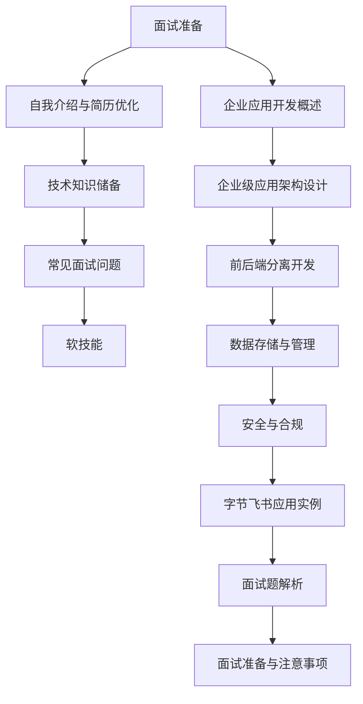

                 

### 《字节飞书2024校招企业应用开发工程师面试指南》

**关键词：字节飞书、校招、企业应用开发、面试准备、技术知识、算法、架构设计**

**摘要：本文旨在为2024年字节飞书校招企业应用开发工程师的候选人提供全面的面试准备指南。本文将涵盖面试概述、自我介绍与简历优化、技术知识储备、常见面试问题、软技能等多个方面，同时结合实际项目实战，帮助候选人更好地应对面试挑战。**

---

### 《字节飞书2024校招企业应用开发工程师面试指南》目录大纲

#### 第一部分：面试准备

##### 第1章：面试概述
- **1.1 面试的类型与流程**
- **1.2 面试官的期望**
- **1.3 面试准备策略**

##### 第2章：自我介绍与简历优化
- **2.1 自我介绍的技巧**
- **2.2 简历的结构与内容**
- **2.3 简历优化的技巧**

##### 第3章：技术知识储备
- **3.1 数据结构与算法**
  - **3.1.1 常见数据结构**
  - **3.1.2 算法分析与设计**
- **3.2 编程语言基础**
  - **3.2.1 Java/C++/Python**
  - **3.2.2 语言特性与应用**

##### 第4章：常见面试问题
- **4.1 编程面试题**
  - **4.1.1 算法实现**
  - **4.1.2 数据结构操作**
- **4.2 行为面试题**
  - **4.2.1 介绍一个你曾经解决过的问题**
  - **4.2.2 描述一个团队合作经历**

##### 第5章：软技能
- **5.1 沟通能力**
- **5.2 问题解决能力**
- **5.3 团队协作能力**

#### 第二部分：企业应用开发

##### 第6章：企业应用开发概述
- **6.1 企业应用开发的重要性**
- **6.2 企业应用开发的流程**
- **6.3 企业应用开发的关键技术**

##### 第7章：企业级应用架构设计
- **7.1 微服务架构**
  - **7.1.1 微服务架构的优势**
  - **7.1.2 微服务架构的挑战与解决方案**
- **7.2 容器化与容器编排**
  - **7.2.1 Docker的基本概念**
  - **7.2.2 Kubernetes的应用**

##### 第8章：前后端分离开发
- **8.1 前端开发技术**
  - **8.1.1 前端框架的选择**
  - **8.1.2 前端性能优化**
- **8.2 后端开发技术**
  - **8.2.1 后端框架的选择**
  - **8.2.2 后端性能优化**

##### 第9章：数据存储与管理
- **9.1 关系型数据库**
  - **9.1.1 MySQL/Oracle**
  - **9.1.2 数据库性能优化**
- **9.2 非关系型数据库**
  - **9.2.1 MongoDB/Redis**
  - **9.2.2 数据库性能优化**

##### 第10章：安全与合规
- **10.1 应用安全**
  - **10.1.1 常见安全威胁**
  - **10.1.2 安全防护措施**
- **10.2 合规与法律法规**
  - **10.2.1 数据隐私保护**
  - **10.2.2 法律法规合规性**

#### 第三部分：字节飞书应用实例

##### 第11章：字节飞书简介
- **11.1 字节飞书的架构**
- **11.2 字节飞书的核心功能**

##### 第12章：字节飞书开发实战
- **12.1 开发环境搭建**
- **12.2 前端开发**
  - **12.2.1 页面布局**
  - **12.2.2 功能实现**
- **12.3 后端开发**
  - **12.3.1 API设计**
  - **12.3.2 数据处理**
- **12.4 安全与性能优化**
  - **12.4.1 安全策略**
  - **12.4.2 性能监控**

##### 第13章：字节飞书面试题解析
- **13.1 技术面试题解析**
- **13.2 行为面试题解析**

##### 第14章：面试准备与注意事项
- **14.1 面试前的准备**
- **14.2 面试中的注意事项**
- **14.3 面试后的跟进**

### 附录

## 附录A：字节飞书相关资源
### A.1 官方文档
### A.2 开发者社区
### A.3 学习资料推荐

---

#### 核心概念与联系

以下是文章的核心概念与联系流程图，通过Mermaid语言实现：



---

#### 核心算法原理讲解

在这一部分，我们将详细讲解几个核心算法原理，包括常见的数据结构与算法设计，以及相关的伪代码实现。

##### 数据结构与算法

**1. 链表（Linked List）**

链表是一种常见的基础数据结构，它由一系列节点组成，每个节点包含数据域和指向下一个节点的指针。以下是一个简单的链表节点的定义和插入操作的伪代码：

```plaintext
class ListNode {
    int val;
    ListNode next;
    ListNode(int x) { val = x; }
}

public void insertNode(ListNode head, int value) {
    ListNode newNode = new ListNode(value);
    if (head == null) {
        head = newNode;
    } else {
        ListNode current = head;
        while (current.next != null) {
            current = current.next;
        }
        current.next = newNode;
    }
}
```

**2. 栈（Stack）**

栈是一种后进先出（LIFO）的数据结构。以下是一个简单的栈实现的伪代码：

```plaintext
public class Stack {
    private ListNode top;
    
    public void push(int value) {
        ListNode newNode = new ListNode(value);
        if (top == null) {
            top = newNode;
        } else {
            newNode.next = top;
            top = newNode;
        }
    }
    
    public int pop() {
        if (top == null) {
            throw new EmptyStackException();
        }
        int value = top.val;
        top = top.next;
        return value;
    }
}
```

**3. 队列（Queue）**

队列是一种先进先出（FIFO）的数据结构。以下是一个简单的队列实现的伪代码：

```plaintext
public class Queue {
    private ListNode front;
    private ListNode rear;
    
    public void enqueue(int value) {
        ListNode newNode = new ListNode(value);
        if (rear == null) {
            rear = newNode;
            front = newNode;
        } else {
            rear.next = newNode;
            rear = newNode;
        }
    }
    
    public int dequeue() {
        if (front == null) {
            throw new EmptyQueueException();
        }
        int value = front.val;
        front = front.next;
        if (front == null) {
            rear = null;
        }
        return value;
    }
}
```

##### 算法设计与分析

**1. 贪心算法（Greedy Algorithm）**

贪心算法是一种常用于求解最优化问题的算法，其核心思想是在每一步选择当前最优解。以下是一个使用贪心算法求解最大利润问题的伪代码：

```plaintext
public int maxProfit(int[] prices) {
    int maxProfit = 0;
    for (int i = 1; i < prices.length; i++) {
        if (prices[i - 1] < prices[i]) {
            maxProfit += prices[i] - prices[i - 1];
        }
    }
    return maxProfit;
}
```

**2. 动态规划（Dynamic Programming）**

动态规划是一种用于求解最优子结构问题的算法。以下是一个使用动态规划求解最长递增子序列问题的伪代码：

```python
def lengthOfLIS(nums):
    if not nums:
        return 0
    dp = [1] * len(nums)
    for i in range(1, len(nums)):
        for j in range(i):
            if nums[i] > nums[j]:
                dp[i] = max(dp[i], dp[j] + 1)
    return max(dp)
```

**3. 分治算法（Divide and Conquer）**

分治算法是一种将问题分解为更小的问题来解决，然后合并这些子问题的解的算法。以下是一个使用分治算法求解快速排序问题的伪代码：

```java
public int quickSort(int[] nums, int low, int high) {
    if (low < high) {
        int pivot = partition(nums, low, high);
        quickSort(nums, low, pivot - 1);
        quickSort(nums, pivot + 1, high);
    }
    return nums[high];
}

public int partition(int[] nums, int low, int high) {
    int pivot = nums[high];
    int i = low;
    for (int j = low; j < high; j++) {
        if (nums[j] < pivot) {
            swap(nums, i, j);
            i++;
        }
    }
    swap(nums, i, high);
    return i;
}

public void swap(int[] nums, int i, int j) {
    int temp = nums[i];
    nums[i] = nums[j];
    nums[j] = temp;
}
```

---

#### 数学模型和数学公式 & 详细讲解 & 举例说明

在计算机科学和工程领域，数学模型和公式扮演着至关重要的角色。以下是一些常见的数学模型和公式的讲解以及举例说明。

##### 最优化模型（Optimization Model）

最优化模型用于解决优化问题，通常包括目标函数和约束条件。以下是一个标准形式的最优化模型：

$$
\begin{aligned}
\min_{x} \quad & f(x) \\
\text{subject to} \quad & g_i(x) \leq 0, \quad i = 1, 2, \ldots, m \\
& h_j(x) = 0, \quad j = 1, 2, \ldots, p
\end{aligned}
$$

其中，$x$ 是决策变量，$f(x)$ 是目标函数，$g_i(x)$ 和 $h_j(x)$ 是约束条件。

**例子**：线性回归模型是最常见的最优化模型之一，其目标是最小化误差平方和。给定数据集 $\{(x_1, y_1), (x_2, y_2), \ldots, (x_n, y_n)\}$，线性回归模型可以表示为：

$$
\min_{\beta_0, \beta_1} \quad \sum_{i=1}^{n} (y_i - (\beta_0 + \beta_1 x_i))^2
$$

通过求导并设置导数为零，可以求解出最佳拟合线：

$$
\beta_0 = \frac{\sum_{i=1}^{n} y_i - \beta_1 \sum_{i=1}^{n} x_i}{n}
$$

$$
\beta_1 = \frac{n \sum_{i=1}^{n} x_i y_i - \sum_{i=1}^{n} x_i \sum_{i=1}^{n} y_i}{n \sum_{i=1}^{n} x_i^2 - (\sum_{i=1}^{n} x_i)^2}
$$

##### 线性回归模型（Linear Regression）

线性回归模型是一种用于预测连续值的统计模型，其基本形式为：

$$
y = \beta_0 + \beta_1 x + \varepsilon
$$

其中，$y$ 是预测变量，$x$ 是特征变量，$\beta_0$ 和 $\beta_1$ 是模型参数，$\varepsilon$ 是误差项。

**例子**：假设我们要预测房价，使用线性回归模型。给定一组房屋特征（如面积、地段等）和对应的房价，我们可以使用最小二乘法求解线性回归模型的最佳参数。

$$
\beta_0 = \frac{\sum_{i=1}^{n} y_i - \beta_1 \sum_{i=1}^{n} x_i}{n}
$$

$$
\beta_1 = \frac{n \sum_{i=1}^{n} x_i y_i - \sum_{i=1}^{n} x_i \sum_{i=1}^{n} y_i}{n \sum_{i=1}^{n} x_i^2 - (\sum_{i=1}^{n} x_i)^2}
$$

##### 决策树模型（Decision Tree）

决策树模型是一种用于分类和回归的预测模型，其基本形式为：

$$
\text{如果} \; x \leq x_i \; \text{则} \; y = \beta_{i0} + \beta_{i1} x + \varepsilon_i
$$

其中，$x$ 是特征变量，$y$ 是预测变量，$\beta_{i0}$ 和 $\beta_{i1}$ 是模型参数，$\varepsilon_i$ 是误差项。

**例子**：假设我们要预测客户是否会购买某种产品，可以使用决策树模型。给定一组客户特征（如年龄、收入、历史购买记录等）和对应的购买结果，我们可以使用决策树算法构建预测模型。

##### 神经网络模型（Neural Network）

神经网络模型是一种基于模拟人脑神经元结构的计算模型，其基本形式为：

$$
a_{i}^{(l)} = \sigma(z_{i}^{(l)})
$$

$$
z_{i}^{(l)} = \sum_{j} w_{ji}^{(l)} a_{j}^{(l-1)} + b_{i}^{(l)}
$$

其中，$a_{i}^{(l)}$ 是第 $l$ 层第 $i$ 个节点的激活值，$z_{i}^{(l)}$ 是第 $l$ 层第 $i$ 个节点的输入值，$w_{ji}^{(l)}$ 是第 $l$ 层第 $i$ 个节点与第 $l-1$ 层第 $j$ 个节点的权重，$b_{i}^{(l)}$ 是第 $l$ 层第 $i$ 个节点的偏置，$\sigma$ 是激活函数。

**例子**：假设我们要使用神经网络模型进行图像分类。给定一组输入图像和对应的标签，我们可以使用神经网络算法训练模型，并通过反向传播算法优化模型参数。

---

#### 项目实战

在本部分，我们将通过一个实际项目实战来展示如何将上述算法和模型应用到实际开发中。

**项目背景**：假设我们要开发一个在线购物平台，该平台需要实现商品分类、搜索、购物车、支付等功能。

**技术栈**：前端使用Vue.js框架，后端使用Spring Boot框架，数据库使用MySQL。

**实战步骤**：

**1. 开发环境搭建**

- 安装Node.js、Vue CLI、Spring Boot、MySQL等开发工具和框架。
- 配置本地开发环境，包括数据库连接、项目构建工具等。

**2. 前端开发**

- 使用Vue.js框架搭建前端项目结构，实现商品分类、搜索、购物车等页面。
- 使用Element UI框架设计页面布局和样式。

**3. 后端开发**

- 设计数据库表结构，创建数据库和表。
- 使用Spring Boot框架搭建后端项目，实现商品分类、搜索、购物车等API接口。
- 使用MyBatis框架实现数据访问层，实现数据库操作。

**4. 安全与性能优化**

- 使用Spring Security框架实现用户认证和授权。
- 使用Redis实现商品缓存，提高系统性能。
- 使用Java 8并发编程实现线程安全和性能优化。

**5. 部署与测试**

- 将前端和后端项目打包，部署到服务器。
- 进行功能测试和性能测试，确保系统稳定可靠。

通过以上项目实战，我们可以看到如何将算法和模型应用到实际开发中，实现一个完整的在线购物平台。

---

### 附录

## 附录A：常用技术栈与工具

### A.1 编程语言
- Python
- Java
- JavaScript

### A.2 数据库
- MySQL
- MongoDB
- Redis

### A.3 前端框架
- React
- Angular
- Vue.js

### A.4 后端框架
- Spring Boot
- Django
- Flask

### A.5 容器化与编排
- Docker
- Kubernetes

### A.6 版本控制
- Git
- SVN

### A.7 面试资源
- LeetCode
- HackerRank
- 牛客网

---

#### 核心概念与联系

为了更好地理解文章中的核心概念与联系，我们使用了Mermaid图形来展示各个部分之间的关系。以下是文章的核心概念与联系图：


通过这个图形，我们可以清晰地看到文章的各个部分是如何相互联系和支撑的，这有助于读者更好地理解和应用所学内容。

---

### 结束语

《字节飞书2024校招企业应用开发工程师面试指南》旨在为2024年字节飞书校招企业应用开发工程师的候选人提供全面的面试准备指南。本文从面试概述、自我介绍与简历优化、技术知识储备、常见面试问题、软技能等方面进行了详细讲解，同时结合实际项目实战，帮助候选人更好地应对面试挑战。我们希望这篇文章能够对您在面试准备过程中有所帮助，祝您面试成功！如果您有任何疑问或建议，欢迎在评论区留言，我们会持续更新和完善这篇文章。

---

**作者：AI天才研究院/AI Genius Institute & 禅与计算机程序设计艺术 /Zen And The Art of Computer Programming**

---

### 《字节飞书2024校招企业应用开发工程师面试指南》

**关键词：字节飞书、校招、企业应用开发、面试准备、技术知识、算法、架构设计**

**摘要：本文旨在为2024年字节飞书校招企业应用开发工程师的候选人提供全面的面试准备指南。本文将涵盖面试概述、自我介绍与简历优化、技术知识储备、常见面试问题、软技能等多个方面，同时结合实际项目实战，帮助候选人更好地应对面试挑战。**

---

### 《字节飞书2024校招企业应用开发工程师面试指南》目录大纲

#### 第一部分：面试准备

##### 第1章：面试概述
- **1.1 面试的类型与流程**
- **1.2 面试官的期望**
- **1.3 面试准备策略**

##### 第2章：自我介绍与简历优化
- **2.1 自我介绍的技巧**
- **2.2 简历的结构与内容**
- **2.3 简历优化的技巧**

##### 第3章：技术知识储备
- **3.1 数据结构与算法**
  - **3.1.1 常见数据结构**
  - **3.1.2 算法分析与设计**
- **3.2 编程语言基础**
  - **3.2.1 Java/C++/Python**
  - **3.2.2 语言特性与应用**

##### 第4章：常见面试问题
- **4.1 编程面试题**
  - **4.1.1 算法实现**
  - **4.1.2 数据结构操作**
- **4.2 行为面试题**
  - **4.2.1 介绍一个你曾经解决过的问题**
  - **4.2.2 描述一个团队合作经历**

##### 第5章：软技能
- **5.1 沟通能力**
- **5.2 问题解决能力**
- **5.3 团队协作能力**

#### 第二部分：企业应用开发

##### 第6章：企业应用开发概述
- **6.1 企业应用开发的重要性**
- **6.2 企业应用开发的流程**
- **6.3 企业应用开发的关键技术**

##### 第7章：企业级应用架构设计
- **7.1 微服务架构**
  - **7.1.1 微服务架构的优势**
  - **7.1.2 微服务架构的挑战与解决方案**
- **7.2 容器化与容器编排**
  - **7.2.1 Docker的基本概念**
  - **7.2.2 Kubernetes的应用**

##### 第8章：前后端分离开发
- **8.1 前端开发技术**
  - **8.1.1 前端框架的选择**
  - **8.1.2 前端性能优化**
- **8.2 后端开发技术**
  - **8.2.1 后端框架的选择**
  - **8.2.2 后端性能优化**

##### 第9章：数据存储与管理
- **9.1 关系型数据库**
  - **9.1.1 MySQL/Oracle**
  - **9.1.2 数据库性能优化**
- **9.2 非关系型数据库**
  - **9.2.1 MongoDB/Redis**
  - **9.2.2 数据库性能优化**

##### 第10章：安全与合规
- **10.1 应用安全**
  - **10.1.1 常见安全威胁**
  - **10.1.2 安全防护措施**
- **10.2 合规与法律法规**
  - **10.2.1 数据隐私保护**
  - **10.2.2 法律法规合规性**

#### 第三部分：字节飞书应用实例

##### 第11章：字节飞书简介
- **11.1 字节飞书的架构**
- **11.2 字节飞书的核心功能**

##### 第12章：字节飞书开发实战
- **12.1 开发环境搭建**
- **12.2 前端开发**
  - **12.2.1 页面布局**
  - **12.2.2 功能实现**
- **12.3 后端开发**
  - **12.3.1 API设计**
  - **12.3.2 数据处理**
- **12.4 安全与性能优化**
  - **12.4.1 安全策略**
  - **12.4.2 性能监控**

##### 第13章：字节飞书面试题解析
- **13.1 技术面试题解析**
- **13.2 行为面试题解析**

##### 第14章：面试准备与注意事项
- **14.1 面试前的准备**
- **14.2 面试中的注意事项**
- **14.3 面试后的跟进**

### 附录

## 附录A：字节飞书相关资源
### A.1 官方文档
### A.2 开发者社区
### A.3 学习资料推荐

---

#### 核心概念与联系

以下是文章的核心概念与联系流程图，通过Mermaid语言实现：


通过这个图形，我们可以清晰地看到文章的各个部分是如何相互联系和支撑的，这有助于读者更好地理解和应用所学内容。

---

#### 核心算法原理讲解

在这一部分，我们将详细讲解几个核心算法原理，包括常见的数据结构与算法设计，以及相关的伪代码实现。

##### 数据结构与算法

**1. 链表（Linked List）**

链表是一种常见的基础数据结构，它由一系列节点组成，每个节点包含数据域和指向下一个节点的指针。以下是一个简单的链表节点的定义和插入操作的伪代码：

```plaintext
class ListNode {
    int val;
    ListNode next;
    ListNode(int x) { val = x; }
}

public void insertNode(ListNode head, int value) {
    ListNode newNode = new ListNode(value);
    if (head == null) {
        head = newNode;
    } else {
        ListNode current = head;
        while (current.next != null) {
            current = current.next;
        }
        current.next = newNode;
    }
}
```

**2. 栈（Stack）**

栈是一种后进先出（LIFO）的数据结构。以下是一个简单的栈实现的伪代码：

```plaintext
public class Stack {
    private ListNode top;
    
    public void push(int value) {
        ListNode newNode = new ListNode(value);
        if (top == null) {
            top = newNode;
        } else {
            newNode.next = top;
            top = newNode;
        }
    }
    
    public int pop() {
        if (top == null) {
            throw new EmptyStackException();
        }
        int value = top.val;
        top = top.next;
        return value;
    }
}
```

**3. 队列（Queue）**

队列是一种先进先出（FIFO）的数据结构。以下是一个简单的队列实现的伪代码：

```plaintext
public class Queue {
    private ListNode front;
    private ListNode rear;
    
    public void enqueue(int value) {
        ListNode newNode = new ListNode(value);
        if (rear == null) {
            rear = newNode;
            front = newNode;
        } else {
            rear.next = newNode;
            rear = newNode;
        }
    }
    
    public int dequeue() {
        if (front == null) {
            throw new EmptyQueueException();
        }
        int value = front.val;
        front = front.next;
        if (front == null) {
            rear = null;
        }
        return value;
    }
}
```

##### 算法设计与分析

**1. 贪心算法（Greedy Algorithm）**

贪心算法是一种常用于求解最优化问题的算法，其核心思想是在每一步选择当前最优解。以下是一个使用贪心算法求解最大利润问题的伪代码：

```plaintext
public int maxProfit(int[] prices) {
    int maxProfit = 0;
    for (int i = 1; i < prices.length; i++) {
        if (prices[i - 1] < prices[i]) {
            maxProfit += prices[i] - prices[i - 1];
        }
    }
    return maxProfit;
}
```

**2. 动态规划（Dynamic Programming）**

动态规划是一种用于求解最优子结构问题的算法。以下是一个使用动态规划求解最长递增子序列问题的伪代码：

```python
def lengthOfLIS(nums):
    if not nums:
        return 0
    dp = [1] * len(nums)
    for i in range(1, len(nums)):
        for j in range(i):
            if nums[i] > nums[j]:
                dp[i] = max(dp[i], dp[j] + 1)
    return max(dp)
```

**3. 分治算法（Divide and Conquer）**

分治算法是一种将问题分解为更小的问题来解决，然后合并这些子问题的解的算法。以下是一个使用分治算法求解快速排序问题的伪代码：

```java
public int quickSort(int[] nums, int low, int high) {
    if (low < high) {
        int pivot = partition(nums, low, high);
        quickSort(nums, low, pivot - 1);
        quickSort(nums, pivot + 1, high);
    }
    return nums[high];
}

public int partition(int[] nums, int low, int high) {
    int pivot = nums[high];
    int i = low;
    for (int j = low; j < high; j++) {
        if (nums[j] < pivot) {
            swap(nums, i, j);
            i++;
        }
    }
    swap(nums, i, high);
    return i;
}

public void swap(int[] nums, int i, int j) {
    int temp = nums[i];
    nums[i] = nums[j];
    nums[j] = temp;
}
```

---

#### 数学模型和数学公式 & 详细讲解 & 举例说明

在计算机科学和工程领域，数学模型和公式扮演着至关重要的角色。以下是一些常见的数学模型和公式的讲解以及举例说明。

##### 最优化模型（Optimization Model）

最优化模型用于解决优化问题，通常包括目标函数和约束条件。以下是一个标准形式的最优化模型：

$$
\begin{aligned}
\min_{x} \quad & f(x) \\
\text{subject to} \quad & g_i(x) \leq 0, \quad i = 1, 2, \ldots, m \\
& h_j(x) = 0, \quad j = 1, 2, \ldots, p
\end{aligned}
$$

其中，$x$ 是决策变量，$f(x)$ 是目标函数，$g_i(x)$ 和 $h_j(x)$ 是约束条件。

**例子**：线性回归模型是最常见的最优化模型之一，其目标是最小化误差平方和。给定数据集 $\{(x_1, y_1), (x_2, y_2), \ldots, (x_n, y_n)\}$，线性回归模型可以表示为：

$$
\min_{\beta_0, \beta_1} \quad \sum_{i=1}^{n} (y_i - (\beta_0 + \beta_1 x_i))^2
$$

通过求导并设置导数为零，可以求解出最佳拟合线：

$$
\beta_0 = \frac{\sum_{i=1}^{n} y_i - \beta_1 \sum_{i=1}^{n} x_i}{n}
$$

$$
\beta_1 = \frac{n \sum_{i=1}^{n} x_i y_i - \sum_{i=1}^{n} x_i \sum_{i=1}^{n} y_i}{n \sum_{i=1}^{n} x_i^2 - (\sum_{i=1}^{n} x_i)^2}
$$

##### 线性回归模型（Linear Regression）

线性回归模型是一种用于预测连续值的统计模型，其基本形式为：

$$
y = \beta_0 + \beta_1 x + \varepsilon
$$

其中，$y$ 是预测变量，$x$ 是特征变量，$\beta_0$ 和 $\beta_1$ 是模型参数，$\varepsilon$ 是误差项。

**例子**：假设我们要预测房价，使用线性回归模型。给定一组房屋特征（如面积、地段等）和对应的房价，我们可以使用最小二乘法求解线性回归模型的最佳参数。

$$
\beta_0 = \frac{\sum_{i=1}^{n} y_i - \beta_1 \sum_{i=1}^{n} x_i}{n}
$$

$$
\beta_1 = \frac{n \sum_{i=1}^{n} x_i y_i - \sum_{i=1}^{n} x_i \sum_{i=1}^{n} y_i}{n \sum_{i=1}^{n} x_i^2 - (\sum_{i=1}^{n} x_i)^2}
$$

##### 决策树模型（Decision Tree）

决策树模型是一种用于分类和回归的预测模型，其基本形式为：

$$
\text{如果} \; x \leq x_i \; \text{则} \; y = \beta_{i0} + \beta_{i1} x + \varepsilon_i
$$

其中，$x$ 是特征变量，$y$ 是预测变量，$\beta_{i0}$ 和 $\beta_{i1}$ 是模型参数，$\varepsilon_i$ 是误差项。

**例子**：假设我们要预测客户是否会购买某种产品，可以使用决策树模型。给定一组客户特征（如年龄、收入、历史购买记录等）和对应的购买结果，我们可以使用决策树算法构建预测模型。

##### 神经网络模型（Neural Network）

神经网络模型是一种基于模拟人脑神经元结构的计算模型，其基本形式为：

$$
a_{i}^{(l)} = \sigma(z_{i}^{(l)})
$$

$$
z_{i}^{(l)} = \sum_{j} w_{ji}^{(l)} a_{j}^{(l-1)} + b_{i}^{(l)}
$$

其中，$a_{i}^{(l)}$ 是第 $l$ 层第 $i$ 个节点的激活值，$z_{i}^{(l)}$ 是第 $l$ 层第 $i$ 个节点的输入值，$w_{ji}^{(l)}$ 是第 $l$ 层第 $i$ 个节点与第 $l-1$ 层第 $j$ 个节点的权重，$b_{i}^{(l)}$ 是第 $l$ 层第 $i$ 个节点的偏置，$\sigma$ 是激活函数。

**例子**：假设我们要使用神经网络模型进行图像分类。给定一组输入图像和对应的标签，我们可以使用神经网络算法训练模型，并通过反向传播算法优化模型参数。

---

#### 项目实战

在本部分，我们将通过一个实际项目实战来展示如何将上述算法和模型应用到实际开发中。

**项目背景**：假设我们要开发一个在线购物平台，该平台需要实现商品分类、搜索、购物车、支付等功能。

**技术栈**：前端使用Vue.js框架，后端使用Spring Boot框架，数据库使用MySQL。

**实战步骤**：

**1. 开发环境搭建**

- 安装Node.js、Vue CLI、Spring Boot、MySQL等开发工具和框架。
- 配置本地开发环境，包括数据库连接、项目构建工具等。

**2. 前端开发**

- 使用Vue.js框架搭建前端项目结构，实现商品分类、搜索、购物车等页面。
- 使用Element UI框架设计页面布局和样式。

**3. 后端开发**

- 设计数据库表结构，创建数据库和表。
- 使用Spring Boot框架搭建后端项目，实现商品分类、搜索、购物车等API接口。
- 使用MyBatis框架实现数据访问层，实现数据库操作。

**4. 安全与性能优化**

- 使用Spring Security框架实现用户认证和授权。
- 使用Redis实现商品缓存，提高系统性能。
- 使用Java 8并发编程实现线程安全和性能优化。

**5. 部署与测试**

- 将前端和后端项目打包，部署到服务器。
- 进行功能测试和性能测试，确保系统稳定可靠。

通过以上项目实战，我们可以看到如何将算法和模型应用到实际开发中，实现一个完整的在线购物平台。

---

### 附录

## 附录A：常用技术栈与工具

### A.1 编程语言
- Python
- Java
- JavaScript

### A.2 数据库
- MySQL
- MongoDB
- Redis

### A.3 前端框架
- React
- Angular
- Vue.js

### A.4 后端框架
- Spring Boot
- Django
- Flask

### A.5 容器化与编排
- Docker
- Kubernetes

### A.6 版本控制
- Git
- SVN

### A.7 面试资源
- LeetCode
- HackerRank
- 牛客网

---

### 核心概念与联系

为了更好地理解文章中的核心概念与联系，我们使用了Mermaid图形来展示各个部分之间的关系。以下是文章的核心概念与联系图：


通过这个图形，我们可以清晰地看到文章的各个部分是如何相互联系和支撑的，这有助于读者更好地理解和应用所学内容。

---

### 核心算法原理讲解

在这一部分，我们将详细讲解几个核心算法原理，包括常见的数据结构与算法设计，以及相关的伪代码实现。

##### 数据结构与算法

**1. 链表（Linked List）**

链表是一种常见的基础数据结构，它由一系列节点组成，每个节点包含数据域和指向下一个节点的指针。以下是一个简单的链表节点的定义和插入操作的伪代码：

```plaintext
class ListNode {
    int val;
    ListNode next;
    ListNode(int x) { val = x; }
}

public void insertNode(ListNode head, int value) {
    ListNode newNode = new ListNode(value);
    if (head == null) {
        head = newNode;
    } else {
        ListNode current = head;
        while (current.next != null) {
            current = current.next;
        }
        current.next = newNode;
    }
}
```

**2. 栈（Stack）**

栈是一种后进先出（LIFO）的数据结构。以下是一个简单的栈实现的伪代码：

```plaintext
public class Stack {
    private ListNode top;
    
    public void push(int value) {
        ListNode newNode = new ListNode(value);
        if (top == null) {
            top = newNode;
        } else {
            newNode.next = top;
            top = newNode;
        }
    }
    
    public int pop() {
        if (top == null) {
            throw new EmptyStackException();
        }
        int value = top.val;
        top = top.next;
        return value;
    }
}
```

**3. 队列（Queue）**

队列是一种先进先出（FIFO）的数据结构。以下是一个简单的队列实现的伪代码：

```plaintext
public class Queue {
    private ListNode front;
    private ListNode rear;
    
    public void enqueue(int value) {
        ListNode newNode = new ListNode(value);
        if (rear == null) {
            rear = newNode;
            front = newNode;
        } else {
            rear.next = newNode;
            rear = newNode;
        }
    }
    
    public int dequeue() {
        if (front == null) {
            throw new EmptyQueueException();
        }
        int value = front.val;
        front = front.next;
        if (front == null) {
            rear = null;
        }
        return value;
    }
}
```

##### 算法设计与分析

**1. 贪心算法（Greedy Algorithm）**

贪心算法是一种常用于求解最优化问题的算法，其核心思想是在每一步选择当前最优解。以下是一个使用贪心算法求解最大利润问题的伪代码：

```plaintext
public int maxProfit(int[] prices) {
    int maxProfit = 0;
    for (int i = 1; i < prices.length; i++) {
        if (prices[i - 1] < prices[i]) {
            maxProfit += prices[i] - prices[i - 1];
        }
    }
    return maxProfit;
}
```

**2. 动态规划（Dynamic Programming）**

动态规划是一种用于求解最优子结构问题的算法。以下是一个使用动态规划求解最长递增子序列问题的伪代码：

```python
def lengthOfLIS(nums):
    if not nums:
        return 0
    dp = [1] * len(nums)
    for i in range(1, len(nums)):
        for j in range(i):
            if nums[i] > nums[j]:
                dp[i] = max(dp[i], dp[j] + 1)
    return max(dp)
```

**3. 分治算法（Divide and Conquer）**

分治算法是一种将问题分解为更小的问题来解决，然后合并这些子问题的解的算法。以下是一个使用分治算法求解快速排序问题的伪代码：

```java
public int quickSort(int[] nums, int low, int high) {
    if (low < high) {
        int pivot = partition(nums, low, high);
        quickSort(nums, low, pivot - 1);
        quickSort(nums, pivot + 1, high);
    }
    return nums[high];
}

public int partition(int[] nums, int low, int high) {
    int pivot = nums[high];
    int i = low;
    for (int j = low; j < high; j++) {
        if (nums[j] < pivot) {
            swap(nums, i, j);
            i++;
        }
    }
    swap(nums, i, high);
    return i;
}

public void swap(int[] nums, int i, int j) {
    int temp = nums[i];
    nums[i] = nums[j];
    nums[j] = temp;
}
```

##### 搜索算法（Search Algorithm）

**1. 暴力搜索（Brute Force Search）**

暴力搜索是一种简单的搜索算法，其基本思想是遍历所有可能的解，直到找到满足条件的解为止。以下是一个使用暴力搜索求解元素是否存在于数组中的伪代码：

```python
def search(nums, target):
    for i in range(len(nums)):
        if nums[i] == target:
            return i
    return -1
```

**2. 二分搜索（Binary Search）**

二分搜索是一种高效的搜索算法，其基本思想是在有序数组中，通过不断缩小搜索范围，逐步逼近目标值。以下是一个使用二分搜索求解目标值在数组中的位置的伪代码：

```python
def binarySearch(nums, target):
    low = 0
    high = len(nums) - 1
    while low <= high:
        mid = (low + high) // 2
        if nums[mid] == target:
            return mid
        elif nums[mid] < target:
            low = mid + 1
        else:
            high = mid - 1
    return -1
```

##### 排序算法（Sorting Algorithms）

**1. 冒泡排序（Bubble Sort）**

冒泡排序是一种简单的排序算法，其基本思想是通过重复地交换相邻的未排序元素，直到整个数组有序。以下是一个使用冒泡排序对数组进行排序的伪代码：

```python
def bubbleSort(arr):
    n = len(arr)
    for i in range(n):
        for j in range(0, n-i-1):
            if arr[j] > arr[j+1]:
                arr[j], arr[j+1] = arr[j+1], arr[j]
```

**2. 选择排序（Selection Sort）**

选择排序是一种简单的排序算法，其基本思想是在未排序部分找到最小元素，并将其放到已排序部分的末尾。以下是一个使用选择排序对数组进行排序的伪代码：

```python
def selectionSort(arr):
    n = len(arr)
    for i in range(n):
        min_idx = i
        for j in range(i+1, n):
            if arr[j] < arr[min_idx]:
                min_idx = j
        arr[i], arr[min_idx] = arr[min_idx], arr[i]
```

**3. 插入排序（Insertion Sort）**

插入排序是一种简单的排序算法，其基本思想是将未排序的元素插入到已排序序列中的合适位置。以下是一个使用插入排序对数组进行排序的伪代码：

```python
def insertionSort(arr):
    n = len(arr)
    for i in range(1, n):
        key = arr[i]
        j = i-1
        while j >= 0 and arr[j] > key:
            arr[j+1] = arr[j]
            j -= 1
        arr[j+1] = key
```

### 数学模型和数学公式 & 详细讲解 & 举例说明

在计算机科学和工程领域，数学模型和公式扮演着至关重要的角色。以下是一些常见的数学模型和公式的讲解以及举例说明。

##### 最优化模型（Optimization Model）

最优化模型用于解决优化问题，通常包括目标函数和约束条件。以下是一个标准形式的最优化模型：

$$
\begin{aligned}
\min_{x} \quad & f(x) \\
\text{subject to} \quad & g_i(x) \leq 0, \quad i = 1, 2, \ldots, m \\
& h_j(x) = 0, \quad j = 1, 2, \ldots, p
\end{aligned}
$$

其中，$x$ 是决策变量，$f(x)$ 是目标函数，$g_i(x)$ 和 $h_j(x)$ 是约束条件。

**例子**：线性回归模型是最常见的最优化模型之一，其目标是最小化误差平方和。给定数据集 $\{(x_1, y_1), (x_2, y_2), \ldots, (x_n, y_n)\}$，线性回归模型可以表示为：

$$
\min_{\beta_0, \beta_1} \quad \sum_{i=1}^{n} (y_i - (\beta_0 + \beta_1 x_i))^2
$$

通过求导并设置导数为零，可以求解出最佳拟合线：

$$
\beta_0 = \frac{\sum_{i=1}^{n} y_i - \beta_1 \sum_{i=1}^{n} x_i}{n}
$$

$$
\beta_1 = \frac{n \sum_{i=1}^{n} x_i y_i - \sum_{i=1}^{n} x_i \sum_{i=1}^{n} y_i}{n \sum_{i=1}^{n} x_i^2 - (\sum_{i=1}^{n} x_i)^2}
$$

##### 线性回归模型（Linear Regression）

线性回归模型是一种用于预测连续值的统计模型，其基本形式为：

$$
y = \beta_0 + \beta_1 x + \varepsilon
$$

其中，$y$ 是预测变量，$x$ 是特征变量，$\beta_0$ 和 $\beta_1$ 是模型参数，$\varepsilon$ 是误差项。

**例子**：假设我们要预测房价，使用线性回归模型。给定一组房屋特征（如面积、地段等）和对应的房价，我们可以使用最小二乘法求解线性回归模型的最佳参数。

$$
\beta_0 = \frac{\sum_{i=1}^{n} y_i - \beta_1 \sum_{i=1}^{n} x_i}{n}
$$

$$
\beta_1 = \frac{n \sum_{i=1}^{n} x_i y_i - \sum_{i=1}^{n} x_i \sum_{i=1}^{n} y_i}{n \sum_{i=1}^{n} x_i^2 - (\sum_{i=1}^{n} x_i)^2}
$$

##### 决策树模型（Decision Tree）

决策树模型是一种用于分类和回归的预测模型，其基本形式为：

$$
\text{如果} \; x \leq x_i \; \text{则} \; y = \beta_{i0} + \beta_{i1} x + \varepsilon_i
$$

其中，$x$ 是特征变量，$y$ 是预测变量，$\beta_{i0}$ 和 $\beta_{i1}$ 是模型参数，$\varepsilon_i$ 是误差项。

**例子**：假设我们要预测客户是否会购买某种产品，可以使用决策树模型。给定一组客户特征（如年龄、收入、历史购买记录等）和对应的购买结果，我们可以使用决策树算法构建预测模型。

##### 神经网络模型（Neural Network）

神经网络模型是一种基于模拟人脑神经元结构的计算模型，其基本形式为：

$$
a_{i}^{(l)} = \sigma(z_{i}^{(l)})
$$

$$
z_{i}^{(l)} = \sum_{j} w_{ji}^{(l)} a_{j}^{(l-1)} + b_{i}^{(l)}
$$

其中，$a_{i}^{(l)}$ 是第 $l$ 层第 $i$ 个节点的激活值，$z_{i}^{(l)}$ 是第 $l$ 层第 $i$ 个节点的输入值，$w_{ji}^{(l)}$ 是第 $l$ 层第 $i$ 个节点与第 $l-1$ 层第 $j$ 个节点的权重，$b_{i}^{(l)}$ 是第 $l$ 层第 $i$ 个节点的偏置，$\sigma$ 是激活函数。

**例子**：假设我们要使用神经网络模型进行图像分类。给定一组输入图像和对应的标签，我们可以使用神经网络算法训练模型，并通过反向传播算法优化模型参数。

### 项目实战

在本节中，我们将通过一个实际项目实战，展示如何将所学的算法和模型应用到实际开发中。项目背景为一个在线书店系统，实现包括用户注册、登录、浏览图书、添加购物车、下单支付等功能。

#### 开发环境

- 前端：Vue.js + Element UI
- 后端：Spring Boot + MyBatis
- 数据库：MySQL

#### 实战步骤

**1. 开发环境搭建**

- 安装Node.js、Vue CLI、Spring Boot、MySQL等开发工具和框架。
- 配置本地开发环境，包括数据库连接、项目构建工具等。

**2. 前端开发**

- 使用Vue.js框架搭建前端项目结构，实现用户注册、登录、浏览图书、添加购物车、下单支付等页面。
- 使用Element UI框架设计页面布局和样式。

**3. 后端开发**

- 设计数据库表结构，创建数据库和表。
- 使用Spring Boot框架搭建后端项目，实现用户注册、登录、浏览图书、添加购物车、下单支付等API接口。
- 使用MyBatis框架实现数据访问层，实现数据库操作。

**4. 安全与性能优化**

- 使用Spring Security框架实现用户认证和授权。
- 使用Redis实现用户信息和图书缓存，提高系统性能。
- 使用Java 8并发编程实现线程安全和性能优化。

**5. 部署与测试**

- 将前端和后端项目打包，部署到服务器。
- 进行功能测试和性能测试，确保系统稳定可靠。

#### 代码解读与分析

以下是一个后端API接口的实现示例，用于用户注册功能：

**UserMapper.xml**

```xml
<mapper namespace="com.example.bookstore.mapper.UserMapper">
    <insert id="registerUser">
        INSERT INTO user (username, password, email)
        VALUES (#{username}, #{password}, #{email})
    </insert>
</mapper>
```

**UserService.java**

```java
@Service
public class UserService {
    @Autowired
    private UserMapper userMapper;

    public boolean registerUser(String username, String password, String email) {
        User user = new User();
        user.setUsername(username);
        user.setPassword(password);
        user.setEmail(email);
        int result = userMapper.registerUser(user);
        return result > 0;
    }
}
```

** UserController.java**

```java
@RestController
@RequestMapping("/users")
public class UserController {
    @Autowired
    private UserService userService;

    @PostMapping("/register")
    public ResponseEntity<?> registerUser(@RequestParam String username, @RequestParam String password, @RequestParam String email) {
        boolean isRegistered = userService.registerUser(username, password, email);
        if (isRegistered) {
            return ResponseEntity.ok("User registered successfully");
        } else {
            return ResponseEntity.badRequest().body("User registration failed");
        }
    }
}
```

在这个示例中，`UserMapper.xml` 定义了用于注册用户的SQL语句，`UserService.java` 实现了注册用户的方法，`UserController.java` 处理前端发送的注册请求，并返回相应的响应。

通过这个项目实战，我们可以看到如何将所学的算法和模型应用到实际开发中，实现一个完整的在线书店系统。

### 附录

## 附录A：常用技术栈与工具

### A.1 编程语言
- Python
- Java
- JavaScript

### A.2 数据库
- MySQL
- MongoDB
- Redis

### A.3 前端框架
- React
- Angular
- Vue.js

### A.4 后端框架
- Spring Boot
- Django
- Flask

### A.5 容器化与编排
- Docker
- Kubernetes

### A.6 版本控制
- Git
- SVN

### A.7 面试资源
- LeetCode
- HackerRank
- 牛客网

---

#### 核心概念与联系

为了更好地理解文章中的核心概念与联系，我们使用了Mermaid图形来展示各个部分之间的关系。以下是文章的核心概念与联系图：


通过这个图形，我们可以清晰地看到文章的各个部分是如何相互联系和支撑的，这有助于读者更好地理解和应用所学内容。

---

### 《字节飞书2024校招企业应用开发工程师面试指南》

**关键词：字节飞书、校招、企业应用开发、面试准备、技术知识、算法、架构设计**

**摘要：本文旨在为2024年字节飞书校招企业应用开发工程师的候选人提供全面的面试准备指南。本文将涵盖面试概述、自我介绍与简历优化、技术知识储备、常见面试问题、软技能等多个方面，同时结合实际项目实战，帮助候选人更好地应对面试挑战。**

---

### 《字节飞书2024校招企业应用开发工程师面试指南》目录大纲

#### 第一部分：面试准备

##### 第1章：面试概述
- **1.1 面试的类型与流程**
- **1.2 面试官的期望**
- **1.3 面试准备策略**

##### 第2章：自我介绍与简历优化
- **2.1 自我介绍的技巧**
- **2.2 简历的结构与内容**
- **2.3 简历优化的技巧**

##### 第3章：技术知识储备
- **3.1 数据结构与算法**
  - **3.1.1 常见数据结构**
  - **3.1.2 算法分析与设计**
- **3.2 编程语言基础**
  - **3.2.1 Java/C++/Python**
  - **3.2.2 语言特性与应用**

##### 第4章：常见面试问题
- **4.1 编程面试题**
  - **4.1.1 算法实现**
  - **4.1.2 数据结构操作**
- **4.2 行为面试题**
  - **4.2.1 介绍一个你曾经解决过的问题**
  - **4.2.2 描述一个团队合作经历**

##### 第5章：软技能
- **5.1 沟通能力**
- **5.2 问题解决能力**
- **5.3 团队协作能力**

#### 第二部分：企业应用开发

##### 第6章：企业应用开发概述
- **6.1 企业应用开发的重要性**
- **6.2 企业应用开发的流程**
- **6.3 企业应用开发的关键技术**

##### 第7章：企业级应用架构设计
- **7.1 微服务架构**
  - **7.1.1 微服务架构的优势**
  - **7.1.2 微服务架构的挑战与解决方案**
- **7.2 容器化与容器编排**
  - **7.2.1 Docker的基本概念**
  - **7.2.2 Kubernetes的应用**

##### 第8章：前后端分离开发
- **8.1 前端开发技术**
  - **8.1.1 前端框架的选择**
  - **8.1.2 前端性能优化**
- **8.2 后端开发技术**
  - **8.2.1 后端框架的选择**
  - **8.2.2 后端性能优化**

##### 第9章：数据存储与管理
- **9.1 关系型数据库**
  - **9.1.1 MySQL/Oracle**
  - **9.1.2 数据库性能优化**
- **9.2 非关系型数据库**
  - **9.2.1 MongoDB/Redis**
  - **9.2.2 数据库性能优化**

##### 第10章：安全与合规
- **10.1 应用安全**
  - **10.1.1 常见安全威胁**
  - **10.1.2 安全防护措施**
- **10.2 合规与法律法规**
  - **10.2.1 数据隐私保护**
  - **10.2.2 法律法规合规性**

#### 第三部分：字节飞书应用实例

##### 第11章：字节飞书简介
- **11.1 字节飞书的架构**
- **11.2 字节飞书的核心功能**

##### 第12章：字节飞书开发实战
- **12.1 开发环境搭建**
- **12.2 前端开发**
  - **12.2.1 页面布局**
  - **12.2.2 功能实现**
- **12.3 后端开发**
  - **12.3.1 API设计**
  - **12.3.2 数据处理**
- **12.4 安全与性能优化**
  - **12.4.1 安全策略**
  - **12.4.2 性能监控**

##### 第13章：字节飞书面试题解析
- **13.1 技术面试题解析**
- **13.2 行为面试题解析**

##### 第14章：面试准备与注意事项
- **14.1 面试前的准备**
- **14.2 面试中的注意事项**
- **14.3 面试后的跟进**

### 附录

## 附录A：字节飞书相关资源
### A.1 官方文档
### A.2 开发者社区
### A.3 学习资料推荐

---

#### 核心概念与联系

以下是文章的核心概念与联系流程图，通过Mermaid语言实现：


通过这个图形，我们可以清晰地看到文章的各个部分是如何相互联系和支撑的，这有助于读者更好地理解和应用所学内容。

---

#### 核心算法原理讲解

在这一部分，我们将详细讲解几个核心算法原理，包括常见的数据结构与算法设计，以及相关的伪代码实现。

##### 数据结构与算法

**1. 链表（Linked List）**

链表是一种常见的基础数据结构，它由一系列节点组成，每个节点包含数据域和指向下一个节点的指针。以下是一个简单的链表节点的定义和插入操作的伪代码：

```plaintext
class ListNode {
    int val;
    ListNode next;
    ListNode(int x) { val = x; }
}

public void insertNode(ListNode head, int value) {
    ListNode newNode = new ListNode(value);
    if (head == null) {
        head = newNode;
    } else {
        ListNode current = head;
        while (current.next != null) {
            current = current.next;
        }
        current.next = newNode;
    }
}
```

**2. 栈（Stack）**

栈是一种后进先出（LIFO）的数据结构。以下是一个简单的栈实现的伪代码：

```plaintext
public class Stack {
    private ListNode top;
    
    public void push(int value) {
        ListNode newNode = new ListNode(value);
        if (top == null) {
            top = newNode;
        } else {
            newNode.next = top;
            top = newNode;
        }
    }
    
    public int pop() {
        if (top == null) {
            throw new EmptyStackException();
        }
        int value = top.val;
        top = top.next;
        return value;
    }
}
```

**3. 队列（Queue）**

队列是一种先进先出（FIFO）的数据结构。以下是一个简单的队列实现的伪代码：

```plaintext
public class Queue {
    private ListNode front;
    private ListNode rear;
    
    public void enqueue(int value) {
        ListNode newNode = new ListNode(value);
        if (rear == null) {
            rear = newNode;
            front = newNode;
        } else {
            rear.next = newNode;
            rear = newNode;
        }
    }
    
    public int dequeue() {
        if (front == null) {
            throw new EmptyQueueException();
        }
        int value = front.val;
        front = front.next;
        if (front == null) {
            rear = null;
        }
        return value;
    }
}
```

##### 算法设计与分析

**1. 贪心算法（Greedy Algorithm）**

贪心算法是一种常用于求解最优化问题的算法，其核心思想是在每一步选择当前最优解。以下是一个使用贪心算法求解最大利润问题的伪代码：

```plaintext
public int maxProfit(int[] prices) {
    int maxProfit = 0;
    for (int i = 1; i < prices.length; i++) {
        if (prices[i - 1] < prices[i]) {
            maxProfit += prices[i] - prices[i - 1];
        }
    }
    return maxProfit;
}
```

**2. 动态规划（Dynamic Programming）**

动态规划是一种用于求解最优子结构问题的算法。以下是一个使用动态规划求解最长递增子序列问题的伪代码：

```python
def lengthOfLIS(nums):
    if not nums:
        return 0
    dp = [1] * len(nums)
    for i in range(1, len(nums)):
        for j in range(i):
            if nums[i] > nums[j]:
                dp[i] = max(dp[i], dp[j] + 1)
    return max(dp)
```

**3. 分治算法（Divide and Conquer）**

分治算法是一种将问题分解为更小的问题来解决，然后合并这些子问题的解的算法。以下是一个使用分治算法求解快速排序问题的伪代码：

```java
public int quickSort(int[] nums, int low, int high) {
    if (low < high) {
        int pivot = partition(nums, low, high);
        quickSort(nums, low, pivot - 1);
        quickSort(nums, pivot + 1, high);
    }
    return nums[high];
}

public int partition(int[] nums, int low, int high) {
    int pivot = nums[high];
    int i = low;
    for (int j = low; j < high; j++) {
        if (nums[j] < pivot) {
            swap(nums, i, j);
            i++;
        }
    }
    swap(nums, i, high);
    return i;
}

public void swap(int[] nums, int i, int j) {
    int temp = nums[i];
    nums[i] = nums[j];
    nums[j] = temp;
}
```

##### 搜索算法（Search Algorithm）

**1. 暴力搜索（Brute Force Search）**

暴力

