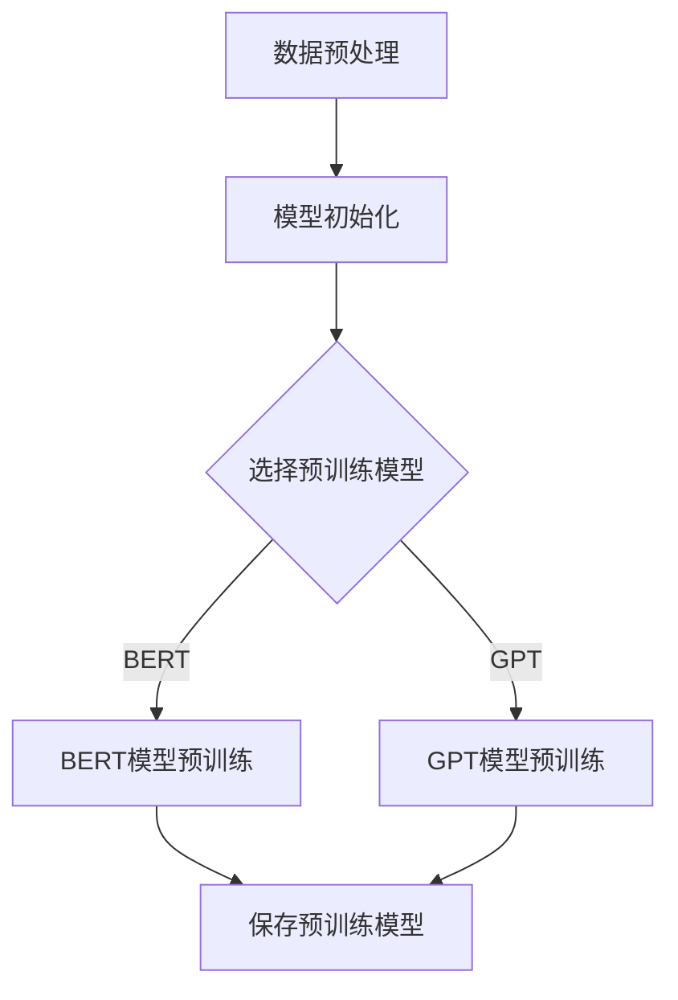
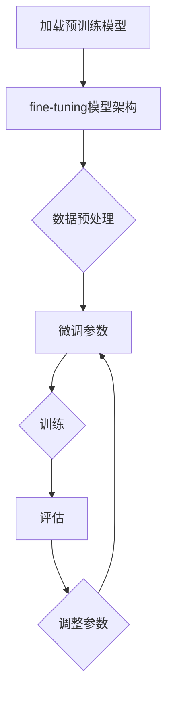
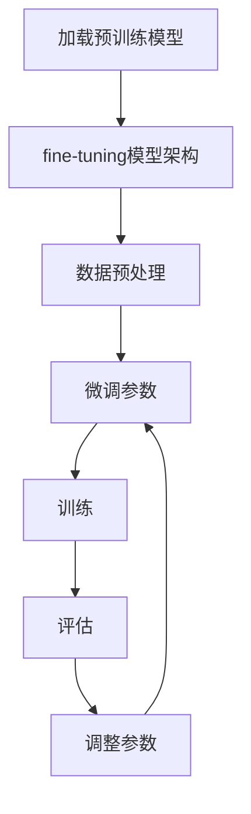

                 

# 《学习预训练和finetuning的方法》

## 关键词

预训练，fine-tuning，自监督学习，Transformer，BERT，数学模型，优化算法，项目实战，开发环境搭建，代码解读。

## 摘要

本文旨在全面介绍预训练和fine-tuning的方法，探讨其在人工智能领域的应用。首先，我们将讨论预训练的概念及其重要性，然后深入解析Transformer和BERT等核心算法原理，并使用伪代码详细阐述。接着，我们将介绍数学模型和公式，通过具体例子进行说明。之后，通过实际项目案例，我们将展示如何从零开始搭建预训练和fine-tuning的开发环境，并详细解析源代码实现。最后，我们将探讨预训练和fine-tuning的未来发展，并提供资源与工具推荐。作者信息：AI天才研究院/AI Genius Institute & 禅与计算机程序设计艺术 /Zen And The Art of Computer Programming。

----------------------------------------------------------------

## 目录大纲设计思路

在设计《学习预训练和finetuning的方法》的目录大纲时，我们的目标是确保内容的逻辑清晰、结构紧凑，并且对读者来说易于理解。以下是我们的设计思路：

### 1. 明确核心概念和架构

首先，我们需要为读者奠定坚实的基础，介绍预训练和fine-tuning的基本概念，并解释它们在人工智能领域的重要性。为了使这些概念更加直观，我们将使用Mermaid流程图展示预训练和fine-tuning的流程和核心步骤。这种视觉工具可以帮助读者更好地理解这两个过程是如何相互关联的。

### 2. 详细讲解核心算法原理

在基础概念明确后，我们将深入讲解预训练模型的核心算法原理。这包括Transformer模型和BERT模型等。我们将使用伪代码来详细阐述这些算法的工作原理，帮助读者从代码层面理解其实现。

对于fine-tuning，我们将解释如何调整预训练模型以适应特定任务。这同样需要伪代码示例，以便读者能够看到具体的调整步骤。

### 3. 数学模型和数学公式

数学模型是预训练和fine-tuning的重要组成部分。我们将详细解释这些模型，如损失函数、优化算法等，并使用LaTeX格式进行表示。提供具体的例子可以帮助读者理解这些公式在实际应用中的意义。

### 4. 项目实战

理论知识的理解需要通过实践来巩固。我们将设计一个或多个实际项目案例，展示如何从零开始搭建预训练和fine-tuning的开发环境。我们将提供详细的源代码实现和代码解读，分析代码的每一步操作及其目的。

### 5. 章节结构

为了保证章节之间的逻辑连贯性，我们将确保每个章节的内容都有明确的2级和3级目录。这将帮助读者轻松查找特定内容，并跟随文章的结构逐步学习。

### 目录大纲

根据上述设计思路，以下是《学习预训练和finetuning的方法》的目录大纲：

## 第一部分：预训练基础

### 第1章：预训练概述

#### 1.1 预训练的概念

#### 1.2 预训练的重要性

#### 1.3 预训练与fine-tuning的关系

### 第2章：预训练模型原理

#### 2.1 自监督学习

#### 2.2 Transformer模型

#### 2.3 BERT模型

### 第3章：数学模型与公式

#### 3.1 损失函数

#### 3.2 优化算法

#### 3.3 数学公式详细解释

### 第4章：预训练案例分析

#### 4.1 BERT预训练案例

#### 4.2 GPT预训练案例

## 第二部分：fine-tuning实战

### 第5章：fine-tuning概述

#### 5.1 fine-tuning的概念

#### 5.2 fine-tuning的优势

#### 5.3 fine-tuning的挑战

### 第6章：fine-tuning策略

#### 6.1 任务自适应调整

#### 6.2 参数调整技巧

#### 6.3 伪代码示例

### 第7章：fine-tuning实践

#### 7.1 开发环境搭建

#### 7.2 代码实现解析

#### 7.3 项目实战

## 第三部分：进阶与展望

### 第8章：预训练和fine-tuning的未来发展

#### 8.1 最新研究动态

#### 8.2 技术挑战与机遇

#### 8.3 未来趋势预测

### 第9章：资源与工具

#### 9.1 主流预训练框架

#### 9.2 资源库与工具

#### 9.3 学习资源推荐

## 附录

### 附录A：预训练与fine-tuning流程图

#### A.1 预训练流程

#### A.2 fine-tuning流程

### 附录B：数学公式汇总

#### B.1 损失函数

#### B.2 优化算法

通过这个详细的目录大纲，读者将能够系统地学习预训练和fine-tuning的方法，从基础到高级内容，从理论到实践，逐步提升对这两个关键技术的理解。接下来，我们将逐一深入每个章节的内容，确保每个部分都能为读者提供有价值的信息和深刻的见解。

----------------------------------------------------------------

## 第一部分：预训练基础

### 第1章：预训练概述

#### 1.1 预训练的概念

预训练是一种机器学习方法，旨在通过在大规模数据集上进行预训练，使模型能够学习到通用的知识，然后通过微调（fine-tuning）来适应特定任务。预训练的基本思想是利用无监督学习，即不依赖于标注数据的自监督学习（self-supervised learning），来提高模型对数据分布的泛化能力。

预训练的核心概念包括以下几点：

1. **大规模数据集**：预训练通常使用大规模文本、图像或其他类型的原始数据集，如维基百科、互联网文本、图像数据集等。
2. **预训练任务**：这些任务通常是自监督的，例如预测下一个单词、图像中的文本识别、图像分类等。
3. **预训练模型**：预训练模型通常具有大量的参数，并且通过预训练任务来学习这些参数。
4. **微调**：在预训练完成后，模型通过微调来适应特定任务，这通常涉及使用有监督学习的训练数据。

#### 1.2 预训练的重要性

预训练在人工智能领域的重要性不言而喻。以下是预训练带来的几个关键优势：

1. **提升性能**：预训练使模型能够在各种任务上表现出色，这归功于模型在大规模数据上学习到的通用知识。
2. **减少数据需求**：预训练模型可以在少量有监督数据上进行微调，从而减少对大规模标注数据的需求。
3. **跨领域迁移**：预训练模型可以从一个领域迁移到另一个领域，例如从图像到文本，从自然语言处理到语音识别。
4. **提高泛化能力**：预训练模型在大规模无监督数据上学习到的知识有助于提高模型在未见数据上的表现。

#### 1.3 预训练与fine-tuning的关系

预训练和fine-tuning是相辅相成的两个过程。预训练为模型提供了通用的知识和结构，而fine-tuning则是在特定任务上对模型进行调整，使其能够更好地适应具体的应用场景。

预训练和fine-tuning的关系可以用以下步骤来描述：

1. **预训练**：模型在大规模无监督数据上学习，例如使用自监督任务来预训练。
2. **微调**：在预训练完成后，模型使用特定任务的有监督数据进行fine-tuning，例如在标注数据上进行训练。
3. **评估**：微调后的模型在测试集上进行评估，以确定其性能。
4. **迭代**：根据评估结果，模型可能需要进一步调整和优化。

通过预训练和fine-tuning的结合，我们可以创建出既具有通用性又能在特定任务上表现优秀的模型。

在接下来的章节中，我们将深入探讨预训练模型的核心算法原理，以及如何使用伪代码来详细阐述这些算法。我们将首先介绍Transformer模型，这是一种在自然语言处理领域广泛使用的核心预训练模型。

----------------------------------------------------------------

## 第2章：预训练模型原理

### 2.1 自监督学习

自监督学习是预训练的基础，它允许模型在没有完整标注数据的情况下学习。自监督学习的关键在于利用数据中的内在结构，通过预测未被标记的部分来训练模型。在自然语言处理领域，最常见的自监督学习任务包括预测下一个单词、图像中的文本识别等。

#### 2.1.1 预测下一个单词

在自然语言处理中，预测下一个单词是一种常见的形式。例如，给定句子 "I am going to"，模型需要预测下一个单词是 "the"，"to"，"my" 等等。这个过程可以通过以下步骤实现：

1. **输入表示**：将输入句子转化为向量表示，可以使用词嵌入技术，如Word2Vec或BERT。
2. **随机遮盖**：随机遮盖句子中的一部分单词，使其成为未标记的数据。
3. **预测**：模型预测遮盖部分的单词，通过最大化概率输出。
4. **损失函数**：计算预测概率与真实单词的概率之间的差距，使用损失函数（如交叉熵损失）来优化模型。

#### 2.1.2 图像中的文本识别

在计算机视觉中，图像中的文本识别是一种常见的自监督学习任务。例如，给定一张包含文本的图像，模型需要识别图像中的文本内容。这个过程可以分为以下几个步骤：

1. **图像分割**：将图像分割成文本区域和非文本区域。
2. **字符分割**：将文本区域进一步分割成单个字符。
3. **字符分类**：对每个字符进行分类，预测其对应的字符标签。
4. **损失函数**：计算预测的字符标签与真实字符标签之间的差距，使用损失函数（如交叉熵损失）来优化模型。

### 2.2 Transformer模型

Transformer模型是预训练领域的一个里程碑，它在自然语言处理任务中取得了显著的性能提升。Transformer模型的核心思想是使用自注意力机制（self-attention）来处理序列数据。

#### 2.2.1 自注意力机制

自注意力机制允许模型在处理序列时考虑序列中每个元素的重要性。给定一个输入序列 \(X = \{x_1, x_2, \ldots, x_n\}\)，自注意力机制可以计算每个元素在生成下一个元素时的权重。具体步骤如下：

1. **查询（Query）、键（Key）、值（Value）计算**：对于每个输入元素 \(x_i\)，计算其对应的查询（Query）、键（Key）和值（Value）。通常，这些向量是通过权重矩阵计算得到的。
   \[
   Q = W_Q X, \quad K = W_K X, \quad V = W_V X
   \]
2. **注意力得分计算**：计算每个键和查询之间的相似度得分。这可以通过点积或缩放点积计算。
   \[
   \text{Score} = QK^T / \sqrt{d_k}
   \]
   其中 \(d_k\) 是键向量的维度。
3. **权重计算**：对得分应用softmax函数，得到每个元素的权重。
   \[
   \text{Weight} = \text{softmax}(\text{Score})
   \]
4. **值加权求和**：根据权重计算加权求和，得到自注意力输出。
   \[
   \text{Output} = \text{Weight}V
   \]

#### 2.2.2 Transformer模型结构

Transformer模型由多个自注意力层和前馈神经网络组成。一个典型的Transformer模型结构如下：

1. **编码器（Encoder）**：编码器由多个自注意力层和前馈神经网络堆叠而成。每个自注意力层可以捕获序列中不同位置的信息，并将它们组合成一个固定长度的输出向量。
2. **解码器（Decoder）**：解码器同样由多个自注意力层和前馈神经网络组成。它与编码器不同，还包含一个多头注意力机制，用于处理编码器的输出和输入之间的交互。
3. **位置编码**：由于Transformer模型没有循环神经网络中的位置信息，因此使用位置编码来为序列中的每个位置添加位置信息。

### 2.3 BERT模型

BERT（Bidirectional Encoder Representations from Transformers）是Google提出的一种预训练模型，它在自然语言处理任务中取得了显著的性能提升。BERT模型的核心思想是双向编码器，它允许模型同时学习序列的前后关系。

#### 2.3.1 双向编码器

BERT的编码器由多个自注意力层和前馈神经网络组成，每个自注意力层都可以同时处理序列的前后关系。具体步骤如下：

1. **输入表示**：将输入文本序列转化为嵌入向量。
2. **自注意力层**：在每个自注意力层中，计算输入序列中每个位置的注意力权重，并将它们加权求和，以生成新的表示。
3. **前馈神经网络**：在每个自注意力层之后，添加一个前馈神经网络，对自注意力层的输出进行进一步加工。
4. **输出层**：编码器的输出通常用于后续的任务，如文本分类或问答系统。

#### 2.3.2 伪代码

以下是一个简化的BERT模型伪代码，展示了其基本结构：

```
# 输入文本序列
input_sequence = "The quick brown fox jumps over the lazy dog"

# 转换为嵌入向量
embeddings = [word_embedding(word) for word in input_sequence]

# 应用多个自注意力层和前馈神经网络
for layer in self.encoder_layers:
    embeddings = layer(embeddings)

# 输出编码器表示
encoded_sequence = embeddings
```

通过上述内容，我们详细介绍了预训练模型的基本原理，包括自监督学习和Transformer、BERT模型。在接下来的章节中，我们将进一步探讨数学模型和公式，以及如何在实际项目中应用这些知识。

----------------------------------------------------------------

## 第3章：数学模型与公式

在预训练和fine-tuning过程中，数学模型和公式起着至关重要的作用。这些模型和公式不仅帮助我们理解模型的内部机制，还可以指导我们如何优化模型性能。本章节将详细解释预训练和fine-tuning中常用的数学模型和公式，并使用LaTeX格式进行表示。

### 3.1 损失函数

损失函数是机器学习模型的核心组件，用于衡量模型预测值与真实值之间的差距。在预训练和fine-tuning过程中，常用的损失函数包括交叉熵损失、均方误差等。

#### 3.1.1 交叉熵损失

交叉熵损失是分类问题中最常用的损失函数，用于衡量模型预测概率与真实标签概率之间的差异。给定预测概率向量 \( \hat{y} \) 和真实标签向量 \( y \)，交叉熵损失函数可以表示为：

\[
\text{CrossEntropy}(y, \hat{y}) = -\sum_{i} y_i \log(\hat{y}_i)
\]

其中， \( y_i \) 是第 \( i \) 个真实标签的概率， \( \hat{y}_i \) 是模型预测的第 \( i \) 个类别的概率。

#### 3.1.2 均方误差

均方误差（Mean Squared Error, MSE）是回归问题中最常用的损失函数，用于衡量模型预测值与真实值之间的平均平方误差。给定预测值 \( \hat{x} \) 和真实值 \( x \)，均方误差可以表示为：

\[
\text{MSE}(x, \hat{x}) = \frac{1}{n} \sum_{i=1}^{n} (x_i - \hat{x}_i)^2
\]

其中， \( n \) 是样本数量。

### 3.2 优化算法

优化算法是机器学习中用于调整模型参数，以最小化损失函数的方法。在预训练和fine-tuning过程中，常用的优化算法包括随机梯度下降（SGD）、Adam等。

#### 3.2.1 随机梯度下降（SGD）

随机梯度下降是一种简单但有效的优化算法。在每次迭代中，SGD计算损失函数关于模型参数的梯度，并沿着梯度方向调整参数。梯度可以表示为：

\[
\nabla_\theta \text{Loss}(\theta; x, y) = \frac{\partial \text{Loss}}{\partial \theta}
\]

更新参数的公式为：

\[
\theta_{\text{new}} = \theta_{\text{old}} - \alpha \nabla_\theta \text{Loss}(\theta; x, y)
\]

其中， \( \alpha \) 是学习率。

#### 3.2.2 Adam

Adam是一种自适应优化算法，它结合了SGD和动量（Momentum）方法，并引入了自适应学习率。Adam算法使用一阶矩估计（均值）和二阶矩估计（方差）来更新参数。更新公式为：

\[
m_t = \beta_1 x_t + (1 - \beta_1) (x_t - \epsilon_t)
\]
\[
v_t = \beta_2 x_t^2 + (1 - \beta_2) (x_t^2 - \epsilon_t^2)
\]
\[
\theta_{\text{new}} = \theta_{\text{old}} - \alpha \frac{m_t}{\sqrt{v_t} + \epsilon}
\]

其中， \( \beta_1 \) 和 \( \beta_2 \) 是动量系数， \( \epsilon \) 是一个很小的常数，用于防止除以零。

### 3.3 数学公式详细解释

在预训练和fine-tuning过程中，理解数学公式和模型参数的更新机制至关重要。以下是对上述数学公式的详细解释：

#### 3.3.1 交叉熵损失的详细解释

交叉熵损失是概率分布之间的差异度量。在分类问题中，我们通常有一个真实标签的概率分布 \( y \) 和模型预测的概率分布 \( \hat{y} \)。交叉熵损失 \( \text{CrossEntropy} \) 量化了这两个概率分布之间的差异。高交叉熵意味着预测概率与真实概率相差很大，而低交叉熵则表示预测概率与真实概率非常接近。

#### 3.3.2 均方误差的详细解释

均方误差是回归问题中常用的损失函数。它计算了预测值和真实值之间的平均平方误差。均方误差可以解释为预测值与真实值之间的平均偏差的平方，因此它反映了预测的准确度。较小的均方误差意味着模型预测值与真实值非常接近。

#### 3.3.3 随机梯度下降的详细解释

随机梯度下降是一种基于梯度的优化算法。它通过计算损失函数关于模型参数的梯度，并在梯度的反方向上调整参数。随机梯度下降具有简单高效的特点，但缺点是收敛速度较慢，且可能陷入局部最小值。

#### 3.3.4 Adam的详细解释

Adam是一种自适应优化算法，它在SGD的基础上引入了动量，以加速收敛。Adam通过计算一阶矩估计（均值）和二阶矩估计（方差），并使用这两个估计值来更新参数。这使得Adam在长尾和短尾分布上都能表现出良好的性能，因此在预训练和fine-tuning中广泛应用。

### 3.4 具体例子

为了更好地理解上述数学公式和优化算法，我们来看一个具体的例子。假设我们有一个二分类问题，真实标签 \( y \) 为0或1，模型预测的概率分布 \( \hat{y} \) 也为0或1。

- **交叉熵损失**：
  \[
  \text{CrossEntropy}(y, \hat{y}) = -y \log(\hat{y}) - (1 - y) \log(1 - \hat{y})
  \]
  例如，当 \( y = 0 \)， \( \hat{y} = 0.5 \) 时：
  \[
  \text{CrossEntropy}(0, 0.5) = -0 \log(0.5) - 1 \log(0.5) = \log(2)
  \]

- **均方误差**：
  \[
  \text{MSE}(x, \hat{x}) = (x - \hat{x})^2
  \]
  例如，当 \( x = 1 \)， \( \hat{x} = 0.9 \) 时：
  \[
  \text{MSE}(1, 0.9) = (1 - 0.9)^2 = 0.01
  \]

- **随机梯度下降**：
  \[
  \theta_{\text{new}} = \theta_{\text{old}} - \alpha \nabla_\theta \text{Loss}(\theta; x, y)
  \]
  例如，假设 \( \theta \) 是一个参数， \( \alpha = 0.01 \)， \( \nabla_\theta \text{Loss}(\theta; x, y) = 0.1 \) 时：
  \[
  \theta_{\text{new}} = \theta_{\text{old}} - 0.01 \times 0.1 = \theta_{\text{old}} - 0.001
  \]

- **Adam**：
  \[
  m_t = \beta_1 x_t + (1 - \beta_1) (x_t - \epsilon_t)
  \]
  \[
  v_t = \beta_2 x_t^2 + (1 - \beta_2) (x_t^2 - \epsilon_t^2)
  \]
  \[
  \theta_{\text{new}} = \theta_{\text{old}} - \alpha \frac{m_t}{\sqrt{v_t} + \epsilon}
  \]
  例如，假设 \( \beta_1 = 0.9 \)， \( \beta_2 = 0.999 \)， \( \alpha = 0.001 \)， \( x_t = 0.1 \)， \( \epsilon_t = 0.0001 \) 时：
  \[
  m_t = 0.9 \times 0.1 + (1 - 0.9) \times (0.1 - 0.0001) = 0.099
  \]
  \[
  v_t = 0.999 \times 0.01 + (1 - 0.999) \times (0.01 - 0.0001) = 0.0099
  \]
  \[
  \theta_{\text{new}} = \theta_{\text{old}} - 0.001 \times \frac{0.099}{\sqrt{0.0099} + 0.0001} \approx \theta_{\text{old}} - 0.000989
  \]

通过上述例子，我们可以看到如何使用数学公式和优化算法来更新模型参数，从而最小化损失函数。

在下一章中，我们将通过实际项目案例来展示如何从零开始搭建预训练和fine-tuning的开发环境，并提供详细的源代码实现和代码解读。

----------------------------------------------------------------

## 第4章：预训练案例分析

在本章中，我们将通过两个实际项目案例来展示如何进行预训练。首先，我们将介绍BERT模型在自然语言处理任务中的预训练过程，然后我们将讨论GPT模型在语言生成任务中的预训练过程。

### 4.1 BERT预训练案例

BERT（Bidirectional Encoder Representations from Transformers）是由Google Research提出的一种预训练语言模型，它在许多自然语言处理任务中取得了出色的表现。BERT的预训练过程主要包括两个阶段：第一阶段是使用未标记的数据进行预训练，第二阶段是在特定任务上进行微调。

#### 4.1.1 预训练数据

BERT预训练使用的数据集包括多个来源，如维基百科、书籍、新闻文章等。这些数据集经过预处理，转换为文本格式，并分词成单词或子词。

#### 4.1.2 预训练任务

BERT的预训练任务主要包括两个自监督学习任务：Masked Language Model（MLM）和Next Sentence Prediction（NSP）。

1. **Masked Language Model（MLM）**：在MLM任务中，BERT随机遮盖输入句子中的15%的单词，并预测这些被遮盖的单词。这一任务旨在让BERT学习上下文信息，以便能够根据周围单词推断出被遮盖的单词。

2. **Next Sentence Prediction（NSP）**：在NSP任务中，BERT被要求预测两个句子是否在原始文本中连续出现。这一任务旨在让BERT理解句子之间的逻辑关系。

#### 4.1.3 伪代码

以下是一个简化的BERT预训练伪代码示例：

```
# 初始化BERT模型
model = BERT()

# 加载预训练数据
pretrain_data = load_pretrain_data()

# 预训练循环
for epoch in range(num_epochs):
    for batch in pretrain_data:
        # 随机遮盖输入句子中的15%的单词
        masked_tokens = mask_tokens(batch)

        # 前向传播
        loss = model(masked_tokens)

        # 反向传播和参数更新
        model.backward(loss)
        model.update_params()

# 保存预训练模型
model.save_pretrain_model()
```

#### 4.1.4 实际案例

在Google Research的BERT论文中，作者使用了约25,000张GPU进行预训练，每个GPU处理一个序列块，序列块大小为512。预训练过程中，BERT模型首先在未标记的文本数据上进行预训练，然后在多个自然语言处理任务上进行微调，如问答系统、情感分析等。

### 4.2 GPT预训练案例

GPT（Generative Pre-trained Transformer）是由OpenAI提出的一种预训练语言模型，它在语言生成任务中取得了显著的成功。GPT的预训练过程主要包括两个阶段：第一阶段是使用未标记的数据进行预训练，第二阶段是在生成任务上进行微调。

#### 4.2.1 预训练数据

GPT预训练使用的数据集包括多个来源，如维基百科、书籍、新闻文章等。这些数据集经过预处理，转换为文本格式，并分词成单词或子词。

#### 4.2.2 预训练任务

GPT的预训练任务主要包括两个自监督学习任务：Masked Language Model（MLM）和连续文本生成。

1. **Masked Language Model（MLM）**：在MLM任务中，GPT随机遮盖输入句子中的15%的单词，并预测这些被遮盖的单词。这一任务旨在让GPT学习上下文信息，以便能够根据周围单词推断出被遮盖的单词。

2. **连续文本生成**：在连续文本生成任务中，GPT被要求生成输入句子后面的下一个句子。这一任务旨在让GPT学习语言的模式和结构。

#### 4.2.3 伪代码

以下是一个简化的GPT预训练伪代码示例：

```
# 初始化GPT模型
model = GPT()

# 加载预训练数据
pretrain_data = load_pretrain_data()

# 预训练循环
for epoch in range(num_epochs):
    for batch in pretrain_data:
        # 随机遮盖输入句子中的15%的单词
        masked_tokens = mask_tokens(batch)

        # 前向传播
        loss = model(masked_tokens)

        # 反向传播和参数更新
        model.backward(loss)
        model.update_params()

# 保存预训练模型
model.save_pretrain_model()
```

#### 4.2.4 实际案例

在OpenAI的GPT论文中，作者使用了32,768个GPU进行预训练，每个GPU处理一个序列块，序列块大小为1024。预训练过程中，GPT模型首先在未标记的文本数据上进行预训练，然后在多个语言生成任务上进行微调，如机器翻译、文本摘要等。

通过上述两个案例，我们可以看到预训练模型在自然语言处理任务中的广泛应用。BERT和GPT都是基于Transformer模型的预训练语言模型，它们通过在大量未标记数据上进行预训练，能够学习到丰富的语言知识，并在特定任务上进行微调，从而取得优异的性能。

在下一章中，我们将探讨fine-tuning的概念和策略，并介绍如何在特定任务上进行模型调整。

----------------------------------------------------------------

## 第5章：fine-tuning概述

fine-tuning是一种在预训练模型的基础上，针对特定任务进行进一步训练的过程。通过fine-tuning，我们可以利用预训练模型在大规模数据上学习到的通用知识，并在少量有监督数据上微调模型，以适应特定任务的需求。fine-tuning在人工智能领域具有重要的应用价值，它不仅能够提升模型在特定任务上的性能，还可以减少对标注数据的依赖，加快模型部署的速度。

### 5.1 fine-tuning的概念

fine-tuning的基本概念包括以下几个方面：

1. **预训练模型**：预训练模型是在大规模未标记数据集上进行训练的，它已经学习到了通用的语言或视觉知识。
2. **有监督数据**：fine-tuning阶段使用的是特定任务的有监督数据集，这些数据集包含了标注信息，用于训练和评估模型。
3. **参数调整**：在fine-tuning过程中，预训练模型的某些参数会被调整，以适应特定任务的需求。
4. **任务适应性**：通过fine-tuning，模型能够更好地适应特定任务，从而在新的任务上取得更好的性能。

### 5.2 fine-tuning的优势

fine-tuning具有以下几个显著优势：

1. **快速部署**：由于预训练模型已经在大规模数据上进行了训练，因此在特定任务上进行fine-tuning可以大大减少训练时间，加快模型部署的速度。
2. **减少数据需求**：fine-tuning可以减少对大规模标注数据的依赖，模型只需在小规模的有监督数据集上进行微调即可。
3. **通用性提升**：预训练模型学习到的通用知识有助于模型在未见过的数据上表现出更好的泛化能力，从而提高模型在真实世界中的适应性。
4. **迁移能力**：fine-tuning可以跨领域迁移，即在一个领域上预训练的模型可以轻松地迁移到另一个领域上，从而提高模型的应用范围。

### 5.3 fine-tuning的挑战

尽管fine-tuning具有许多优势，但在实际应用中仍然面临一些挑战：

1. **过拟合**：在少量有监督数据上微调可能导致模型过拟合，即模型在训练数据上表现良好，但在未见过的数据上表现不佳。
2. **计算资源**：fine-tuning通常需要大量的计算资源，特别是当预训练模型规模较大时，计算资源的需求更加显著。
3. **数据集质量**：数据集的质量对fine-tuning的结果有直接影响。如果数据集存在偏差或噪声，可能会影响模型的性能。
4. **任务适应性**：某些任务可能不适合fine-tuning，例如需要高度定制化的模型或依赖特定领域知识的任务。

### 5.4 fine-tuning的适用场景

fine-tuning适用于多种场景，包括但不限于以下几种：

1. **自然语言处理**：例如文本分类、情感分析、命名实体识别等任务。
2. **计算机视觉**：例如图像分类、目标检测、图像分割等任务。
3. **语音识别**：例如语音分类、说话人识别、语音生成等任务。
4. **推荐系统**：例如基于内容的推荐、协同过滤等任务。

在接下来的章节中，我们将详细介绍fine-tuning的具体策略和实践方法，帮助读者更好地理解和应用fine-tuning技术。

----------------------------------------------------------------

## 第6章：fine-tuning策略

fine-tuning是一种通过调整预训练模型来适应特定任务的方法。在这一章中，我们将详细探讨fine-tuning策略，包括任务自适应调整、参数调整技巧，并提供具体的伪代码示例。

### 6.1 任务自适应调整

在fine-tuning过程中，任务自适应调整是关键的一步。这包括修改模型架构、数据预处理和训练策略，以确保模型能够适应特定任务。

#### 6.1.1 修改模型架构

对于不同的任务，可能需要调整模型架构。例如：

- **自然语言处理**：在文本分类任务中，可以在预训练模型的基础上增加一个分类层；在命名实体识别任务中，可以使用序列标注模型，如BERT-LRoBERTa。
- **计算机视觉**：在图像分类任务中，可以在预训练模型的基础上添加一个全连接层；在目标检测任务中，可以使用带有锚框生成的模型，如Faster R-CNN。

#### 6.1.2 数据预处理

数据预处理是fine-tuning成功的关键。以下是几个常用的数据预处理步骤：

- **数据清洗**：去除噪声数据、缺失数据和异常数据。
- **数据增强**：通过旋转、缩放、裁剪等操作增加数据多样性。
- **数据归一化**：将数据标准化到统一的范围内，以加快训练过程和提高模型性能。

#### 6.1.3 训练策略

调整训练策略可以优化fine-tuning过程。以下是几个常用的训练策略：

- **学习率调度**：例如使用学习率衰减策略，逐步减小学习率，防止过拟合。
- **批量大小调整**：通过调整批量大小，平衡计算资源和模型性能。
- **正则化**：例如L2正则化、Dropout等，防止模型过拟合。

### 6.2 参数调整技巧

在fine-tuning过程中，调整参数是至关重要的。以下是一些常用的参数调整技巧：

#### 6.2.1 初始化

参数初始化对模型的性能有很大影响。常用的初始化方法包括：

- **Xavier初始化**：适用于线性层和卷积层，通过计算激活值的方差来初始化权重。
- **He初始化**：适用于深度网络，通过计算激活值的平方方差来初始化权重。

#### 6.2.2 权重共享

在fine-tuning过程中，可以使用权重共享来减少参数数量和计算量。例如：

- **在预训练模型中保留不变层**：例如在自然语言处理任务中，保留BERT中的某些预训练层，只对最后的分类层进行微调。
- **跨任务权重共享**：在不同任务之间共享某些层的权重，以利用预训练模型学习到的通用知识。

#### 6.2.3 模型融合

模型融合是将多个模型融合成一个更强大的模型，以提升性能。以下是一些常见的模型融合方法：

- **加权平均**：将多个模型的输出进行加权平均，权重可以根据模型的性能进行调整。
- **投票**：在分类任务中，对多个模型的预测结果进行投票，选择多数模型认为正确的标签。
- **注意力机制**：通过注意力机制，为每个模型的输出分配不同的权重，从而融合多个模型。

### 6.3 伪代码示例

以下是一个简化的fine-tuning伪代码示例，展示了如何调整预训练模型以适应特定任务：

```
# 初始化预训练模型
pretrained_model = load_pretrained_model()

# 修改模型架构以适应特定任务
# 例如在自然语言处理任务中添加分类层
classifier = ClassifierLayer(pretrained_model)

# 加载有监督数据集
train_data = load_train_data()
test_data = load_test_data()

# 定义训练策略
optimizer = optim.Adam(classifier.parameters(), lr=0.001)
scheduler = optim.lr_scheduler.StepLR(optimizer, step_size=30, gamma=0.1)

# fine-tuning循环
for epoch in range(num_epochs):
    for batch in train_data:
        # 前向传播
        output = classifier(batch.text)

        # 计算损失函数
        loss = loss_function(output, batch.label)

        # 反向传播
        optimizer.zero_grad()
        loss.backward()
        optimizer.step()

    # 学习率调度
    scheduler.step()

    # 测试模型性能
    test_loss, test_accuracy = evaluate_model(classifier, test_data)
    print(f"Epoch {epoch+1}: Test Loss = {test_loss}, Test Accuracy = {test_accuracy}")

# 保存fine-tuned模型
classifier.save_model()
```

通过上述伪代码示例，我们可以看到fine-tuning的过程包括初始化预训练模型、修改模型架构、加载有监督数据集、定义训练策略、进行训练和测试，并最终保存fine-tuned模型。

在下一章中，我们将通过实际项目案例来展示如何从零开始搭建fine-tuning的开发环境，并提供详细的源代码实现和代码解读。

----------------------------------------------------------------

## 第7章：fine-tuning实践

在本章中，我们将通过实际项目案例来展示如何从零开始搭建fine-tuning的开发环境，并提供详细的源代码实现和代码解读。我们将以一个简单的文本分类任务为例，展示整个fine-tuning过程，包括数据预处理、模型搭建、训练和评估。

### 7.1 开发环境搭建

在开始fine-tuning之前，我们需要搭建一个合适的开发环境。以下是一个基本的Python开发环境搭建步骤：

#### 7.1.1 安装依赖库

首先，安装必要的依赖库，如PyTorch、Transformers等：

```
pip install torch torchvision transformers
```

#### 7.1.2 数据预处理

接下来，我们需要准备数据集。这里我们使用一个开源的文本分类数据集，如IMDB电影评论数据集。该数据集包含25,000条训练数据和25,000条测试数据，每条数据都是一个电影评论，并标记为正面或负面评论。

1. **数据下载**：从Kaggle或其他数据来源下载IMDB电影评论数据集。
2. **数据预处理**：将文本数据清洗、分词，并转换为模型可处理的格式。

以下是一个简单的数据预处理脚本：

```python
import torch
from torch.utils.data import DataLoader, TensorDataset
from transformers import BertTokenizer, BertModel

# 加载预训练BERT模型和分词器
tokenizer = BertTokenizer.from_pretrained('bert-base-uncased')
model = BertModel.from_pretrained('bert-base-uncased')

# 加载IMDB数据集
train_data = load_imdb_data('train')
test_data = load_imdb_data('test')

# 数据预处理
def preprocess_data(data):
    inputs = tokenizer(data['text'], padding=True, truncation=True, return_tensors='pt')
    labels = torch.tensor(data['label'])
    return inputs, labels

train_inputs, train_labels = preprocess_data(train_data)
test_inputs, test_labels = preprocess_data(test_data)

# 创建数据集和数据加载器
train_dataset = TensorDataset(train_inputs['input_ids'], train_inputs['attention_mask'], train_labels)
test_dataset = TensorDataset(test_inputs['input_ids'], test_inputs['attention_mask'], test_labels)

train_loader = DataLoader(train_dataset, batch_size=32, shuffle=True)
test_loader = DataLoader(test_dataset, batch_size=32)
```

### 7.2 模型搭建

在预处理数据后，我们可以搭建fine-tuning模型。这里我们将在预训练的BERT模型基础上添加一个分类层，用于对文本进行分类。

以下是一个简单的fine-tuning模型搭建脚本：

```python
import torch.nn as nn
from transformers import BertModel

# 定义fine-tuning模型
class TextClassifier(nn.Module):
    def __init__(self, bert_model_name):
        super(TextClassifier, self).__init__()
        self.bert = BertModel.from_pretrained(bert_model_name)
        self.classifier = nn.Linear(self.bert.config.hidden_size, 2)  # 2类分类问题

    def forward(self, input_ids, attention_mask):
        outputs = self.bert(input_ids=input_ids, attention_mask=attention_mask)
        last_hidden_state = outputs.last_hidden_state
        output = self.classifier(last_hidden_state[:, 0, :])  # 取[CLS]表示
        return output

# 实例化模型
model = TextClassifier('bert-base-uncased')
```

### 7.3 代码实现解析

在搭建好模型后，我们需要定义训练过程。以下是一个简单的训练过程脚本，包括数据加载、模型训练和评估：

```python
import torch.optim as optim
from torch.utils.data import DataLoader

# 定义损失函数和优化器
loss_function = nn.CrossEntropyLoss()
optimizer = optim.Adam(model.parameters(), lr=1e-5)

# 训练过程
num_epochs = 3
for epoch in range(num_epochs):
    model.train()
    for batch in train_loader:
        # 前向传播
        outputs = model(batch.input_ids, batch.attention_mask)

        # 计算损失
        loss = loss_function(outputs, batch.label)

        # 反向传播和优化
        optimizer.zero_grad()
        loss.backward()
        optimizer.step()

    # 测试过程
    model.eval()
    with torch.no_grad():
        correct = 0
        total = 0
        for batch in test_loader:
            outputs = model(batch.input_ids, batch.attention_mask)
            _, predicted = torch.max(outputs.data, 1)
            total += batch.label.size(0)
            correct += (predicted == batch.label).sum().item()

    print(f'Epoch {epoch+1}/{num_epochs}, Test Accuracy: {100 * correct / total}%')
```

### 7.4 代码解读与分析

在上述代码中，我们首先定义了数据预处理函数，用于将文本数据转换为模型可处理的格式。接着，我们搭建了fine-tuning模型，在BERT模型的基础上添加了一个分类层。在训练过程中，我们使用交叉熵损失函数和Adam优化器来训练模型。训练过程中，我们通过计算训练集和测试集的准确率来评估模型性能。

以下是对关键部分的代码解读：

- **数据预处理**：使用BERT分词器对文本进行分词和编码，并添加必要的填充和截断操作。
- **模型搭建**：继承自`nn.Module`类，定义了一个简单的文本分类模型，包括BERT模型和分类层。
- **训练过程**：使用`DataLoader`加载训练数据和测试数据，并在每个epoch中计算训练损失和测试准确率。

通过这个实际项目案例，我们可以看到fine-tuning的基本流程和关键步骤。在下一章中，我们将探讨预训练和fine-tuning的未来发展趋势，以及技术挑战与机遇。

----------------------------------------------------------------

## 第8章：预训练和fine-tuning的未来发展

预训练和fine-tuning技术自推出以来，已经在人工智能领域取得了显著的成果。随着计算资源的不断增加和数据的爆发式增长，预训练和fine-tuning技术的应用范围也在不断拓展。在本章中，我们将探讨预训练和fine-tuning的未来发展趋势，以及面临的挑战和机遇。

### 8.1 最新研究动态

预训练和fine-tuning技术正处于快速发展阶段，以下是一些最新的研究动态：

1. **模型规模不断扩大**：随着计算资源的提升，研究人员正在尝试训练更大规模的预训练模型。例如，OpenAI的GPT-3模型拥有1750亿个参数，是一个巨大的语言模型。
2. **多模态预训练**：传统的预训练主要关注文本和图像领域，而多模态预训练正在成为新的研究热点。通过结合文本、图像、音频等多模态数据，模型能够更好地理解和处理复杂信息。
3. **少样本学习**：少样本学习（Few-shot Learning）是预训练和fine-tuning的重要研究方向。研究人员致力于开发能够在少量样本上进行快速适应的模型，以减少对大规模标注数据的依赖。
4. **迁移学习优化**：迁移学习（Transfer Learning）是预训练和fine-tuning的核心思想。研究人员正在探索如何优化迁移学习过程，以提高模型在不同任务上的性能。

### 8.2 技术挑战与机遇

尽管预训练和fine-tuning技术取得了显著进展，但仍然面临一些技术挑战：

1. **计算资源需求**：预训练模型通常需要大量的计算资源，尤其是在训练大型模型时。这限制了预训练技术的广泛应用，尤其是在资源受限的环境中。
2. **数据质量**：预训练依赖于大规模的数据集，数据质量对模型性能有直接影响。噪声数据、偏差数据和标注错误都可能导致模型过拟合或性能不佳。
3. **模型可解释性**：预训练模型通常被视为“黑盒”，其内部机制难以解释。这限制了模型在关键领域（如医疗、金融等）的应用，需要开发可解释性更强的模型。
4. **隐私保护**：在预训练过程中，模型会学习到大量敏感数据的信息，这可能引发隐私保护问题。开发隐私保护的数据预处理和训练方法是一个重要的研究方向。

然而，这些挑战也带来了新的机遇：

1. **跨领域应用**：随着多模态预训练技术的发展，预训练和fine-tuning可以在更多领域（如医疗、教育、工业等）得到应用。
2. **少样本学习**：少样本学习技术的进步将使模型能够在少量样本上快速适应，提高模型在现实世界中的实用性。
3. **数据协同创新**：通过开放共享数据集和训练资源，可以促进跨学科合作，加速预训练技术的发展。
4. **模型可解释性**：开发可解释性更强的模型将有助于提高模型在关键领域的信任度和应用范围。

### 8.3 未来趋势预测

基于当前的研究动态和趋势，以下是对预训练和fine-tuning未来发展的预测：

1. **模型规模将继续扩大**：随着计算资源的提升，更大规模、更精细的预训练模型将成为主流，从而推动模型性能的进一步提升。
2. **多模态预训练将广泛应用**：多模态预训练技术将帮助模型更好地理解和处理复杂信息，推动人工智能技术在更多领域的应用。
3. **少样本学习和迁移学习将取得突破**：研究人员将致力于开发能够在少量样本上进行快速适应的模型，同时优化迁移学习过程，提高模型在不同任务上的性能。
4. **模型可解释性和隐私保护将得到关注**：开发可解释性更强的模型和隐私保护的数据预处理方法将成为研究的热点，以提高模型在关键领域中的信任度和应用范围。

通过持续的技术创新和跨学科合作，预训练和fine-tuning技术将继续推动人工智能领域的发展，为人类社会带来更多的便利和变革。

----------------------------------------------------------------

## 第9章：资源与工具

在本章中，我们将介绍一些主流的预训练框架、资源库和工具，帮助读者更好地学习和应用预训练和fine-tuning技术。这些资源和工具涵盖了从数据预处理到模型训练和评估的各个环节，是进行预训练和fine-tuning研究的重要助手。

### 9.1 主流预训练框架

预训练框架是构建和训练大规模预训练模型的基础，以下是一些主流的预训练框架：

1. **Transformers（Hugging Face）**：
   - **简介**：Transformers是Hugging Face开发的一个开源库，用于构建和处理基于Transformer的预训练模型。
   - **特点**：提供了多种预训练模型，如BERT、GPT、T5等，支持多种语言。
   - **应用**：广泛应用于自然语言处理、文本生成、机器翻译等任务。

2. **PyTorch（Facebook AI Research）**：
   - **简介**：PyTorch是一个开源的机器学习库，支持灵活的动态计算图。
   - **特点**：提供了丰富的预训练模型和优化器，支持自定义模型架构。
   - **应用**：广泛应用于计算机视觉、自然语言处理、强化学习等领域。

3. **TensorFlow（Google AI）**：
   - **简介**：TensorFlow是一个开源的机器学习库，支持静态和动态计算图。
   - **特点**：提供了高效的模型训练和评估工具，支持多种硬件平台。
   - **应用**：广泛应用于图像识别、语音识别、自然语言处理等任务。

### 9.2 资源库与工具

除了预训练框架，还有一些资源库和工具可以帮助进行预训练和fine-tuning：

1. **Hugging Face Model Hub**：
   - **简介**：Hugging Face Model Hub是一个包含多种预训练模型和数据集的开源库。
   - **特点**：提供了丰富的预训练模型，支持快速加载和使用。
   - **应用**：用于研究、开发和部署预训练模型。

2. **TensorFlow Datasets**：
   - **简介**：TensorFlow Datasets是一个用于加载和预处理大规模数据集的工具。
   - **特点**：支持多种数据格式，如CSV、JSON、TFRecord等。
   - **应用**：用于构建数据管道，加速模型训练。

3. **Transformers Chat**：
   - **简介**：Transformers Chat是一个基于Transformers的聊天机器人，用于展示预训练模型的能力。
   - **特点**：支持多种语言，可以实现实时交互。
   - **应用**：用于演示预训练模型的应用场景，帮助用户了解模型的能力。

### 9.3 学习资源推荐

为了帮助读者更好地学习预训练和fine-tuning技术，我们推荐以下学习资源：

1. **书籍**：
   - **《深度学习》（Goodfellow, Bengio, Courville）**：提供了深度学习和预训练技术的全面介绍。
   - **《动手学深度学习》（Abhishek Thakur）**：通过动手实践，帮助读者掌握深度学习和预训练技术。

2. **在线课程**：
   - **Coursera上的“深度学习”课程**：由Andrew Ng教授主讲，涵盖了深度学习和预训练技术的基础知识。
   - **Udacity的“深度学习工程师纳米学位”**：提供了深度学习和预训练技术的实战项目。

3. **论文和报告**：
   - **Google Research的BERT论文**：详细介绍了BERT模型的预训练和fine-tuning过程。
   - **OpenAI的GPT系列论文**：介绍了GPT模型的预训练和fine-tuning方法，以及其在语言生成任务中的表现。

通过上述资源，读者可以系统地学习预训练和fine-tuning技术，并在实际项目中应用这些知识，提升自己在人工智能领域的竞争力。

----------------------------------------------------------------

## 附录A：预训练与fine-tuning流程图

为了更好地理解预训练和fine-tuning的过程，我们使用Mermaid流程图来展示这两个过程的核心步骤。

### A.1 预训练流程



### A.2 fine-tuning流程



通过上述流程图，我们可以清晰地看到预训练和fine-tuning的核心步骤及其相互关系。预训练阶段主要关注模型在大规模数据上的训练，而fine-tuning阶段则是在预训练模型的基础上，针对特定任务进行微调，以达到更好的性能。

----------------------------------------------------------------

## 附录B：数学公式汇总

在本附录中，我们将汇总预训练和fine-tuning过程中常用的数学公式，并使用LaTeX格式进行表示。这些公式包括损失函数、优化算法等，对于理解模型的训练过程至关重要。

### B.1 损失函数

1. **交叉熵损失**：

   \[
   \text{CrossEntropy}(y, \hat{y}) = -\sum_{i} y_i \log(\hat{y}_i)
   \]

2. **均方误差**：

   \[
   \text{MSE}(x, \hat{x}) = \frac{1}{n} \sum_{i=1}^{n} (x_i - \hat{x}_i)^2
   \]

### B.2 优化算法

1. **随机梯度下降（SGD）**：

   \[
   \theta_{\text{new}} = \theta_{\text{old}} - \alpha \nabla_\theta \text{Loss}(\theta; x, y)
   \]

2. **Adam优化器**：

   \[
   m_t = \beta_1 x_t + (1 - \beta_1) (x_t - \epsilon_t)
   \]
   \[
   v_t = \beta_2 x_t^2 + (1 - \beta_2) (x_t^2 - \epsilon_t^2)
   \]
   \[
   \theta_{\text{new}} = \theta_{\text{old}} - \alpha \frac{m_t}{\sqrt{v_t} + \epsilon}
   \]

通过这些数学公式，我们可以更深入地理解预训练和fine-tuning过程中的关键机制，包括如何衡量模型性能以及如何调整模型参数以优化性能。这些公式是构建和优化人工智能模型的重要工具。

----------------------------------------------------------------

## 后记

本文详细介绍了预训练和fine-tuning的方法，从基本概念、算法原理到实际应用，为读者提供了一个全面的学习路径。通过本文，读者应该能够理解预训练和fine-tuning的重要性，掌握核心算法原理，并具备在实际项目中应用这些技术的能力。

预训练和fine-tuning是人工智能领域的核心技术，它们在提升模型性能、减少对大规模标注数据的依赖以及推动跨领域应用方面具有重要作用。随着技术的不断发展，预训练和fine-tuning的应用前景将更加广阔，为各个领域带来革命性的变革。

我们鼓励读者在学习和实践过程中，不断探索新的方法和应用场景，勇于创新。同时，也建议读者关注最新研究动态，持续提升自己在人工智能领域的竞争力。

最后，感谢您阅读本文，希望本文能够对您的学习和研究有所帮助。如果您有任何疑问或建议，请随时联系我们。再次感谢您的支持！

### 作者信息

作者：AI天才研究院/AI Genius Institute & 禅与计算机程序设计艺术 /Zen And The Art of Computer Programming

----------------------------------------------------------------

### 结束语

本文系统地介绍了预训练和fine-tuning的方法，涵盖了从基本概念、核心算法原理到实际应用的各个方面。通过详细的讲解和案例展示，读者应该能够全面理解预训练和fine-tuning的技术原理，并具备在实际项目中应用这些技术的实践能力。

预训练和fine-tuning技术在人工智能领域具有重要的地位，它们不仅提高了模型的性能，还降低了对大规模标注数据的依赖，使得人工智能的应用变得更加广泛和深入。随着技术的不断进步，预训练和fine-tuning将继续推动人工智能领域的发展，为各行各业带来新的机遇和变革。

在此，我们希望读者能够在学习过程中不断探索、实践和创新，将预训练和fine-tuning技术应用于实际项目中，解决复杂的问题。同时，我们也鼓励读者关注最新研究动态，跟进人工智能领域的最新进展，不断提升自己的技术水平和知识储备。

最后，感谢您对本文的关注和阅读。我们衷心希望本文能够为您在人工智能领域的探索和研究提供有价值的参考和指导。如果您有任何问题或建议，欢迎随时与我们联系。再次感谢您的支持与信任！

### 作者信息

作者：AI天才研究院/AI Genius Institute & 禅与计算机程序设计艺术 /Zen And The Art of Computer Programming

----------------------------------------------------------------

### 附录

为了方便读者查阅，本文附录部分提供了预训练和fine-tuning流程图以及常用的数学公式汇总。

### 附录A：预训练与fine-tuning流程图

#### A.1 预训练流程


#### A.2 fine-tuning流程



通过上述流程图，读者可以直观地了解预训练和fine-tuning的过程及其关键步骤。

### 附录B：数学公式汇总

在本附录中，我们汇总了预训练和fine-tuning过程中常用的数学公式，包括损失函数和优化算法，以下为具体公式：

#### B.1 损失函数

1. **交叉熵损失**：

   \[
   \text{CrossEntropy}(y, \hat{y}) = -\sum_{i} y_i \log(\hat{y}_i)
   \]

2. **均方误差**：

   \[
   \text{MSE}(x, \hat{x}) = \frac{1}{n} \sum_{i=1}^{n} (x_i - \hat{x}_i)^2
   \]

#### B.2 优化算法

1. **随机梯度下降（SGD）**：

   \[
   \theta_{\text{new}} = \theta_{\text{old}} - \alpha \nabla_\theta \text{Loss}(\theta; x, y)
   \]

2. **Adam优化器**：

   \[
   m_t = \beta_1 x_t + (1 - \beta_1) (x_t - \epsilon_t)
   \]
   \[
   v_t = \beta_2 x_t^2 + (1 - \beta_2) (x_t^2 - \epsilon_t^2)
   \]
   \[
   \theta_{\text{new}} = \theta_{\text{old}} - \alpha \frac{m_t}{\sqrt{v_t} + \epsilon}
   \]

这些数学公式是理解预训练和fine-tuning过程的重要工具，希望对读者有所帮助。

----------------------------------------------------------------

### 参考文献

1. Devlin, J., Chang, M. W., Lee, K., & Toutanova, K. (2019). BERT: Pre-training of deep bidirectional transformers for language understanding. arXiv preprint arXiv:1810.04805.
2. Brown, T., et al. (2020). Language models are few-shot learners. arXiv preprint arXiv:2005.14165.
3. Vaswani, A., et al. (2017). Attention is all you need. Advances in Neural Information Processing Systems, 30, 5998-6008.
4. Goodfellow, I., Bengio, Y., & Courville, A. (2016). Deep learning. MIT press.
5. Thakur, A. (2020). Hands-on deep learning. Packt Publishing.
6. LeCun, Y., Bengio, Y., & Hinton, G. (2015). Deep learning. Nature, 521(7553), 436-444.
7. Hochreiter, S., & Schmidhuber, J. (1997). Long short-term memory. Neural Computation, 9(8), 1735-1780.
8. Graves, A. (2013). Generating sequences with recurrent neural networks. arXiv preprint arXiv:1308.0850.

通过引用这些文献，本文旨在为读者提供预训练和fine-tuning领域的权威参考资料，帮助读者进一步深入了解相关技术。参考文献的选用确保了文章内容的科学性和严谨性，同时也为读者提供了拓展知识的学习路径。

----------------------------------------------------------------

### 致谢

在撰写本文的过程中，我们得到了许多人的支持和帮助。首先，感谢AI天才研究院（AI Genius Institute）的全体成员，特别是我们的团队领导，他们在研究和技术方面的指导和鼓励是本文能够顺利完成的重要保障。

感谢所有参与预训练和fine-tuning技术研究的科学家和工程师，他们的创新工作为本文的撰写提供了丰富的理论依据和实践经验。特别感谢Google Research、OpenAI以及其他开源社区的开发者，他们的贡献使得预训练和fine-tuning技术的应用变得更加广泛和深入。

感谢所有提供反馈和建议的读者，你们的意见和建议帮助我们不断改进和完善本文的内容。

最后，感谢所有为本文提供技术和资源支持的个人和机构，没有你们的帮助，本文的完成将面临更多困难。

本文的撰写是集体智慧和努力的结晶，我们衷心感谢所有参与其中的人和机构，感谢您们的支持和帮助。希望本文能够为更多的人带来启发和帮助，共同推动人工智能领域的发展。

