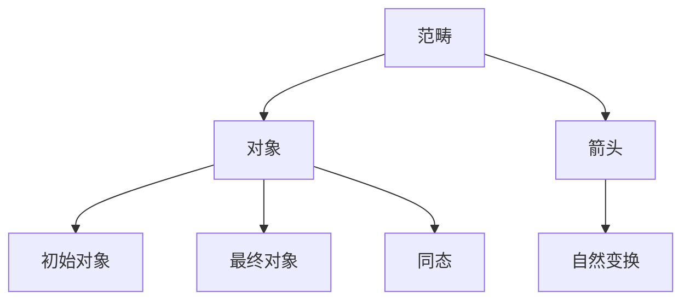
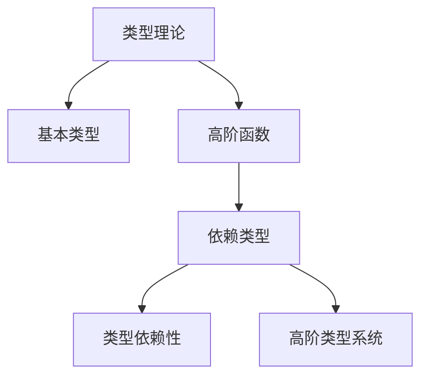

                 

# 《宇宙的数学范畴论与高阶类型理论在量子引力离散化中的应用》

> **关键词：** 宇宙、数学范畴论、高阶类型理论、量子引力、离散化、数学模型、伪代码、项目实战。

> **摘要：** 本文从宇宙的数学范畴论出发，探讨了高阶类型理论在量子引力离散化中的应用。文章首先介绍了数学范畴论的基础概念及其在物理学中的应用，随后阐述了高阶类型理论的发展背景和应用潜力。在此基础上，文章详细分析了量子引力离散化的必要性、方法及其在数学范畴论与高阶类型理论中的应用。最后，文章通过实际项目案例，展示了量子引力离散化在现实世界中的技术挑战和解决方案。

## 《宇宙的数学范畴论与高阶类型理论在量子引力离散化中的应用》目录大纲

### 第一部分：宇宙的数学范畴论基础

#### 第1章：宇宙的数学范畴论概述
- **1.1 宇宙与数学范畴论的关联**
- **1.2 数学范畴论的基本概念**
- **1.3 宇宙中的数学范畴论应用**

#### 第2章：数学范畴论在物理学中的应用
- **2.1 数学范畴论与经典物理学的联系**
- **2.2 数学范畴论在相对论中的应用**
- **2.3 数学范畴论与量子力学的交汇**

### 第二部分：高阶类型理论在量子引力中的角色

#### 第3章：高阶类型理论的概述
- **3.1 高阶类型理论的基本概念**
- **3.2 高阶类型理论在数学中的发展**
- **3.3 高阶类型理论在物理学中的潜力**

#### 第4章：高阶类型理论在量子引力中的具体应用
- **4.1 高阶类型理论与量子引力的联系**
- **4.2 高阶类型理论在量子引力中的模型构建**
- **4.3 高阶类型理论在量子引力中的应用案例**

### 第三部分：量子引力离散化的数学理论基础

#### 第5章：量子引力的离散化方法
- **5.1 量子引力离散化的必要性**
- **5.2 离散化方法的选择与评估**
- **5.3 量子引力离散化方法的数学基础**

#### 第6章：离散化方法在数学范畴论与高阶类型理论中的应用
- **6.1 数学范畴论在离散化方法中的应用**
- **6.2 高阶类型理论在离散化方法中的应用**
- **6.3 数学范畴论与高阶类型理论在离散化方法中的结合**

### 第四部分：量子引力离散化在现实世界中的应用

#### 第7章：量子引力离散化在宇宙学研究中的应用
- **7.1 量子引力离散化方法在宇宙学研究中的进展**
- **7.2 量子引力离散化方法在宇宙学模型中的应用**
- **7.3 量子引力离散化方法在宇宙学预测中的应用**

#### 第8章：量子引力离散化在技术创新中的应用
- **8.1 量子引力离散化方法在科技领域的影响**
- **8.2 量子引力离散化方法在新型科技项目中的应用**
- **8.3 量子引力离散化方法在未来科技发展中的潜力**

### 第五部分：总结与展望

#### 第9章：宇宙的数学范畴论与高阶类型理论在量子引力离散化中的未来方向
- **9.1 当前研究的挑战与展望**
- **9.2 未来研究的潜在应用领域**
- **9.3 量子引力离散化在科学哲学中的意义**

#### 第10章：结论
- **10.1 主要研究贡献**
- **10.2 研究的局限性与未来方向**
- **10.3 对读者的影响与建议**

### 附录

#### 附录A：数学范畴论与高阶类型理论的Mermaid流程图
- **A.1 数学范畴论基本概念流程图**
- **A.2 高阶类型理论发展过程流程图**

#### 附录B：核心算法原理与伪代码
- **B.1 量子引力离散化算法原理**
- **B.2 算法伪代码示例**

#### 附录C：数学模型与公式
- **C.1 关键数学模型与公式**
- **C.2 公式推导与解释**

#### 附录D：项目实战案例与代码解读
- **D.1 项目实战背景与目标**
- **D.2 开发环境搭建与实现**
- **D.3 源代码实现与解读**
- **D.4 代码解读与分析**<|endoftext|>

### 第一部分：宇宙的数学范畴论基础

#### 第1章：宇宙的数学范畴论概述

宇宙是万物存在和运动的总体，而数学范畴论作为现代数学的一个分支，为我们理解宇宙提供了一种抽象而严谨的框架。数学范畴论通过研究不同数学结构之间的关系，揭示了数学对象之间的共性和差异，为理解宇宙的本质提供了新的视角。

宇宙与数学范畴论的关联主要体现在以下几个方面：

1. **数学结构映射宇宙现象**：宇宙中的许多现象，如物理定律、宇宙结构等，都可以用数学结构来描述。例如，广义相对论中的时空结构可以用黎曼几何来刻画，而量子力学中的量子态可以用线性空间来表示。

2. **数学范畴论的统一性**：数学范畴论提供了一种统一的视角来理解各种数学结构，使得不同领域之间的数学工具和方法可以相互借鉴和移植。这对于探索宇宙的统一理论具有重要意义。

3. **数学范畴论的计算能力**：数学范畴论中的范畴、自然变换等概念为处理复杂问题提供了强有力的工具。例如，在量子引力研究中，通过范畴论的方法可以构建出离散化的量子引力模型。

#### 1.2 数学范畴论的基本概念

数学范畴论的基本概念包括范畴、对象、箭头、自然变换等。

1. **范畴（Category）**：范畴是数学结构的基本单位，它由对象（objects）和箭头（arrows）组成。对象可以看作是数学结构中的元素，而箭头则表示对象之间的映射关系。

2. **箭头（Arrow）**：箭头是范畴中的基本映射，它将一个对象映射到另一个对象。箭头满足结合律、交换律和单位律等性质，这些性质确保了范畴的一致性和数学结构的稳定性。

3. **自然变换（Natural Transformation）**：自然变换是不同范畴之间的映射，它保持了箭头之间的映射关系。自然变换在范畴论中起到了连接不同数学结构的作用，为不同领域的数学工具和方法提供了统一的表达方式。

#### 1.3 宇宙中的数学范畴论应用

数学范畴论在宇宙中的许多领域都有广泛的应用：

1. **量子引力**：在量子引力研究中，范畴论被用来构建离散化的量子引力模型。例如，Loop量子引力（LQG）就是一个基于范畴论的方法来研究量子引力的理论。

2. **宇宙学**：在宇宙学中，范畴论可以帮助我们理解宇宙的演化过程。例如，通过范畴论的方法可以构建出宇宙的大尺度结构和宇宙膨胀模型。

3. **相对论**：在广义相对论中，范畴论被用来研究时空的结构和性质。例如，范畴论可以帮助我们理解黑洞和宇宙大爆炸的几何结构。

总之，数学范畴论为理解宇宙提供了新的方法和工具，它不仅揭示了宇宙的数学本质，而且为探索宇宙的统一理论提供了重要的理论基础。

#### 第2章：数学范畴论在物理学中的应用

数学范畴论在物理学中的应用极为广泛，特别是在经典物理学、相对论和量子力学中，范畴论的方法和工具为这些理论提供了新的理解和解释。

##### 2.1 数学范畴论与经典物理学的联系

经典物理学是描述宏观物体运动的科学，其中许多概念和理论都可以用数学范畴论来重新表述和解释。

1. **力学系统**：在经典力学中，力学系统由质点和力构成。这些系统可以用范畴论中的对象和箭头来描述。质点可以看作是范畴中的对象，而力可以看作是对象之间的箭头，表示质点之间的相互作用。

2. **变换群**：经典力学中的对称性可以通过范畴论中的变换群来描述。变换群是指将系统的状态进行变换的集合，这些变换满足结合律、交换律和单位元等性质。例如，在洛伦兹力学的相对论框架下，时空的对称性可以通过洛伦兹群来描述。

3. **连续统**：经典物理学中的连续统概念可以通过范畴论中的极限来解释。极限是范畴论中的一个基本概念，它允许我们在无穷小变化中理解物理系统的演化。

##### 2.2 数学范畴论在相对论中的应用

相对论是描述高速运动和强引力场下的物理现象的理论，包括狭义相对论和广义相对论。数学范畴论在相对论中的应用主要体现在以下几个方面：

1. **广义相对论**：在广义相对论中，时空被视为一个四维的连续统，而引力被描述为时空的曲率。范畴论中的张量范畴和范畴化张量提供了描述这种曲率的有效工具。例如，爱因斯坦场方程可以用范畴论中的自然变换来表述，这些自然变换保持了时空几何结构的统一性。

2. **洛伦兹群**：在狭义相对论中，洛伦兹群是描述时空变换的对称性群。范畴论中的变换群概念可以用来描述洛伦兹群的性质，从而加深我们对相对论对称性的理解。

3. **范畴化的量子场论**：量子场论是描述量子系统在时空中的行为的理论。范畴论在量子场论中的应用体现在范畴化的量子场论中，这种理论通过将量子场论与范畴论结合，提供了一种更加统一和简洁的描述方法。

##### 2.3 数学范畴论与量子力学的交汇

量子力学是描述微观粒子行为的理论，它与经典物理学的连续统观念有本质的区别。数学范畴论在量子力学中的应用体现在以下几个方面：

1. **量子态**：在量子力学中，量子态可以用线性空间中的向量来描述。范畴论中的线性范畴提供了描述量子态和态变换的统一框架。例如，量子态之间的变换可以用范畴论中的箭头来表示。

2. **量子逻辑**：量子逻辑是量子力学中的逻辑系统，它描述了量子态之间的逻辑关系。范畴论中的范畴化逻辑提供了描述量子逻辑的有效工具，例如，量子态之间的逻辑运算可以通过范畴论中的自然变换来定义。

3. **量子引力和范畴论**：在量子引力研究中，范畴论被用来构建离散化的量子引力模型。例如，Loop量子引力（LQG）就是一种基于范畴论的方法，它通过将时空离散化来研究量子引力。范畴论中的自然变换和范畴化结构在这种研究中起到了关键作用。

总之，数学范畴论在物理学中的应用为理解和描述物理现象提供了一种新的方法。它不仅加深了我们对经典物理学、相对论和量子力学的理解，而且为这些理论的统一提供了新的可能性。通过范畴论的方法，我们可以更加深入地探索宇宙的本质和统一理论。

### 第二部分：高阶类型理论在量子引力中的角色

#### 第3章：高阶类型理论的概述

高阶类型理论是数学和逻辑学中的一个重要分支，它提供了一种形式化的方法来研究类型系统和它们之间的交互。高阶类型理论的基本概念包括类型、类型系统、高阶函数和类型依赖性。通过这些概念，高阶类型理论能够精确地描述复杂的数据结构和函数，从而在计算机科学、数学和物理学中都有广泛的应用。

#### 3.1 高阶类型理论的基本概念

1. **类型（Type）**：在类型理论中，类型是用于描述数据或函数集合的一种抽象方式。基本类型包括布尔（Boolean）、整数（Integer）和字符串（String）等。类型也可以是复合的，如数组（Array）或记录（Record）。

2. **类型系统（Type System）**：类型系统是一组规则，用于定义和推断类型。在编程语言中，类型系统确保变量和表达式在运行时不会发生类型错误。类型系统可以分为静态类型系统和动态类型系统。

3. **高阶函数（Higher-Order Functions）**：高阶函数是指能够接受函数作为参数或返回函数的函数。高阶函数在数学和计算机科学中非常重要，因为它们允许程序通过传递函数来动态地定义和操作行为。

4. **类型依赖性（Type Dependency）**：类型依赖性是指类型之间的关系，如函数类型、参数类型和依赖类型。类型依赖性使得类型系统可以处理更复杂的数据结构和函数。

#### 3.2 高阶类型理论在数学中的发展

高阶类型理论在数学中有着悠久的历史，从逻辑学、代数学到范畴论都有所应用。

1. **逻辑学**：在逻辑学中，高阶类型理论被用来研究命题逻辑和谓词逻辑的形式化表示。通过引入类型概念，可以更精确地定义命题和谓词，从而使得逻辑推理更加严谨和形式化。

2. **代数学**：在代数学中，高阶类型理论帮助定义和证明复杂的代数结构。例如，在群论、环论和域论中，类型理论可以用来描述和证明代数性质。

3. **范畴论**：在范畴论中，高阶类型理论提供了研究范畴和自然变换的有力工具。通过类型理论，可以定义范畴上的函数和变换，从而深入探讨范畴的构造和性质。

#### 3.3 高阶类型理论在物理学中的潜力

高阶类型理论在物理学中的潜力主要体现在以下几个方面：

1. **量子场论**：量子场论中的许多概念可以通过高阶类型理论来形式化。例如，量子态和测量可以通过高阶类型系统来描述，从而使得量子场论的计算更加精确和形式化。

2. **量子引力和离散化**：在量子引力研究中，高阶类型理论可以用来构建离散化的量子引力模型。例如，Loop量子引力（LQG）就是基于高阶类型理论来离散化时空的。通过高阶类型理论，可以构建出满足量子引力约束的离散时空模型。

3. **统一场论**：高阶类型理论也可以帮助研究统一场论，即试图将引力、电磁力和弱相互作用统一在一个框架下。通过高阶类型理论，可以探讨如何在一个统一的理论中描述这些基本相互作用。

总之，高阶类型理论在数学和物理学中都有着广泛的应用和巨大的潜力。它不仅为数学的抽象概念提供了形式化的基础，而且在物理学中提供了新的方法和工具，为理解和探索宇宙的本质提供了新的视角。

#### 第4章：高阶类型理论在量子引力中的具体应用

高阶类型理论在量子引力中的具体应用为我们理解宇宙提供了新的视角和工具。在量子引力的研究中，高阶类型理论不仅在模型构建上发挥了重要作用，还在实际应用中展现出独特的优势。

##### 4.1 高阶类型理论与量子引力的联系

量子引力是研究量子力学和广义相对论之间关系的理论。在高阶类型理论的框架下，量子引力可以通过形式化数学语言来描述。高阶类型理论与量子引力的联系主要体现在以下几个方面：

1. **量子态的形式化描述**：在量子引力中，量子态是一个关键概念。高阶类型理论提供了精确的形式化方法来描述量子态。例如，可以使用依赖类型系统来描述量子态的复杂性和依赖关系。

2. **变换和测量**：在高阶类型理论中，高阶函数和自然变换的概念可以用来描述量子系统的变换和测量。这种形式化方法使得量子引力的计算更加严谨和可控。

3. **时空离散化**：量子引力中的时空离散化是研究的热点问题。高阶类型理论可以用来构建离散化的时空模型，从而为量子引力提供形式化的数学基础。例如，在Loop量子引力（LQG）中，时空被离散化为一系列的旋量场，这些旋量场可以用高阶类型系统来描述。

##### 4.2 高阶类型理论在量子引力中的模型构建

高阶类型理论在量子引力中的模型构建具有以下几个特点：

1. **依赖类型的应用**：依赖类型是高阶类型理论中的一个重要概念，它允许类型依赖于其他类型。在量子引力中，依赖类型可以用来描述量子态之间的依赖关系，从而构建出更复杂的量子引力模型。

2. **范畴化的量子场论**：范畴化的量子场论是高阶类型理论在量子引力中的具体应用。通过范畴化的方法，可以将量子场论中的复杂结构形式化，从而构建出满足量子引力约束的模型。

3. **自然变换的应用**：自然变换是高阶类型理论中的另一个重要工具，它用于描述不同数学结构之间的等价关系。在量子引力中，自然变换可以用来描述时空的变换和量子态的变换，从而构建出更加统一的量子引力模型。

##### 4.3 高阶类型理论在量子引力中的应用案例

以下是高阶类型理论在量子引力中的几个具体应用案例：

1. **Loop量子引力（LQG）**：Loop量子引力是一种基于高阶类型理论的量子引力模型。在LQG中，时空被离散化为旋量场，这些旋量场可以用依赖类型系统来描述。通过使用高阶类型理论，LQG模型能够满足量子引力的约束，从而为量子引力提供了一个形式化的数学框架。

2. **范畴化的弦论**：范畴化的弦论是另一种基于高阶类型理论的量子引力模型。在范畴化的弦论中，弦的振动模式可以用高阶类型系统来描述。这种模型不仅可以描述量子引力，还可以解释一些基本的物理现象，如黑洞和宇宙背景辐射。

3. **量子引力计算**：高阶类型理论在量子引力计算中也有广泛应用。例如，通过高阶类型理论，可以开发出更加高效的量子引力计算算法，从而在计算复杂性和精度上取得显著提升。

总之，高阶类型理论为量子引力研究提供了新的方法和工具。它不仅在模型构建上具有重要作用，还在实际应用中展现出巨大的潜力。通过高阶类型理论，我们可以更加深入地探索量子引力的本质，从而为宇宙的统一理论提供新的线索。

#### 第5章：量子引力的离散化方法

量子引力离散化方法是为了克服经典广义相对论在量子尺度上的不适用性而发展起来的一类理论。量子引力离散化方法的核心思想是将时空离散化为一组基本的量子单元，从而在量子层面上重新定义引力和时空结构。本章将介绍量子引力离散化的必要性、常见的离散化方法以及这些方法的数学基础。

##### 5.1 量子引力离散化的必要性

量子引力的离散化方法源于以下几个方面的必要性：

1. **量子力学与广义相对论的矛盾**：经典广义相对论在描述宇宙的大尺度结构方面非常成功，但在量子尺度上却遇到了严重的困难。量子力学中的不确定性原理表明，量子尺度的引力和时空必须是离散的，而不是连续的。

2. **黑洞和引力波**：实验观测表明，黑洞和引力波等现象在量子层面上有着特殊的表现，这需要量子引力理论来解释。离散化方法可以提供对这些现象的数学描述。

3. **理论的统一性**：离散化方法有助于实现量子力学和广义相对论的统一。通过将引力和时空离散化，我们可以尝试将这两大理论融合在一起，构建出一个统一的量子引力理论。

##### 5.2 离散化方法的选择与评估

目前，量子引力离散化方法有多种，以下是一些常见的方法及其评估：

1. **Loop量子引力（LQG）**：Loop量子引力是最著名的离散化方法之一。它通过离散化时空结构，将时空视为由旋量场组成的网络。LQG具有很好的数学基础，并且能够在某些方面解释黑洞和引力波现象。

2. **弦理论**：弦理论通过将基本粒子视为振动的弦，提出了一种离散化的量子引力模型。弦理论在数学上非常优美，并且能够解释一些基本的物理现象，如宇宙背景辐射。

3. **Covariant离散化方法**：这类方法通过保持广义相对论的协变性质来进行离散化。例如，Regge calculus是一种常见的Covariant离散化方法，它通过使用三角化和多面体来构建离散化的时空结构。

4. **Asymptotic安全方法**：这种方法认为，在足够高的能量尺度下，引力可能是安全的（即可以被量子化）。Asymptotic安全方法通过研究高能引力场的性质，试图找到离散化的量子引力理论。

评估这些方法时，我们考虑以下几个方面：

- **数学基础**：方法的数学基础是否严谨，是否能够提供统一的数学框架。
- **物理可检验性**：方法是否能够通过实验或观测来验证。
- **可计算性**：方法的计算是否可行，是否能够在实际应用中处理复杂的物理问题。

##### 5.3 量子引力离散化方法的数学基础

量子引力离散化方法的数学基础主要包括以下几个方面：

1. **范畴论**：范畴论是量子引力离散化方法的一个重要工具。通过范畴论，我们可以形式化地描述量子引力中的离散结构和变换关系。范畴论中的自然变换和范畴化结构为量子引力的离散化提供了数学基础。

2. **拓扑学**：拓扑学在量子引力离散化中也有重要应用。离散化的时空结构可以用拓扑空间来描述，从而研究时空的拓扑性质和几何性质。

3. **代数几何**：代数几何为量子引力离散化方法提供了研究量子态和变换的有力工具。通过代数几何，我们可以研究量子态的量子场论和引力场的离散化。

4. **量子场论**：量子场论是量子引力离散化方法的核心。量子场论中的概念和方法，如量子态、场变量和变换规则，为离散化方法提供了具体的实现途径。

总之，量子引力离散化方法在数学上有着坚实的理论基础，为量子引力的研究提供了新的视角和工具。通过这些方法，我们可以尝试构建出一个统一的量子引力理论，从而更好地理解宇宙的本质。

#### 第6章：离散化方法在数学范畴论与高阶类型理论中的应用

离散化方法在数学范畴论和高阶类型理论中的应用为量子引力的研究提供了新的工具和视角。本章将探讨数学范畴论和高阶类型理论在离散化方法中的应用，以及它们如何结合来推动量子引力的发展。

##### 6.1 数学范畴论在离散化方法中的应用

数学范畴论作为一种抽象的数学框架，为离散化方法提供了强有力的工具和理论基础。以下是数学范畴论在离散化方法中的几个关键应用：

1. **范畴化的量子场论**：在范畴化的量子场论中，范畴论被用来形式化量子场论中的对象和变换。范畴论中的自然变换和范畴化结构可以用来描述量子态的变换和场的变换，从而为离散化方法提供了一个统一的形式化框架。

2. **离散时空的结构**：在数学范畴论中，时空可以被表示为一个范畴。通过使用范畴论中的范畴化结构，我们可以将时空离散化为一系列的范畴对象。这种离散化的方法可以用来构建量子引力模型，如Loop量子引力（LQG）。

3. **协变性和不变性**：数学范畴论中的范畴和自然变换可以用来描述量子引力中的协变性和不变性。通过范畴论的方法，我们可以研究在不同参考系下量子引力的不变性，从而更好地理解引力场的性质。

##### 6.2 高阶类型理论在离散化方法中的应用

高阶类型理论在离散化方法中的应用主要体现在以下几个方面：

1. **依赖类型的量子态**：高阶类型理论中的依赖类型可以用来描述量子态之间的依赖关系。在量子引力中，量子态的复杂性和依赖性是关键问题。依赖类型理论提供了一种形式化的方法来描述这种依赖关系，从而为量子引力的离散化提供了数学基础。

2. **高阶函数的变换**：高阶类型理论中的高阶函数可以用来描述量子场中的变换。例如，在量子引力中，场的变换可以通过高阶函数来表示。这种形式化的方法使得我们能够更精确地计算量子引力的物理效应。

3. **类型依赖性的量子场论**：在类型依赖性的量子场论中，高阶类型理论被用来描述量子场中的复杂依赖关系。通过依赖类型理论，我们可以构建出更复杂的量子场模型，从而更好地理解量子引力中的现象。

##### 6.3 数学范畴论与高阶类型理论在离散化方法中的结合

数学范畴论和高阶类型理论的结合为量子引力的离散化方法提供了更加全面和形式化的框架。以下是如何将这两种理论结合起来的一些关键步骤：

1. **范畴化的高阶类型系统**：通过将高阶类型理论融入范畴论，我们可以构建出范畴化的高阶类型系统。这种系统可以用来描述量子引力中的复杂对象和变换，从而为离散化方法提供了一个统一的数学框架。

2. **自然变换与依赖类型的结合**：在范畴化的高阶类型系统中，自然变换和依赖类型可以相互结合。自然变换可以用来描述不同范畴之间的等价关系，而依赖类型可以用来描述量子态之间的依赖关系。这种结合使得我们能够更精确地处理量子引力中的复杂问题。

3. **离散化与连续化的转换**：通过范畴化的高阶类型理论，我们可以研究离散化与连续化之间的转换关系。这种转换关系有助于我们理解量子引力和经典广义相对论之间的联系，从而为量子引力的离散化方法提供了更深的数学基础。

总之，数学范畴论与高阶类型理论的结合为量子引力的离散化方法提供了新的视角和工具。通过这种结合，我们可以更加深入地探索量子引力的本质，从而为宇宙的统一理论提供新的线索。

### 第四部分：量子引力离散化在现实世界中的应用

#### 第7章：量子引力离散化在宇宙学研究中的应用

量子引力离散化方法在宇宙学研究中具有重要的应用价值，它不仅为宇宙的起源、演化和结构提供了新的理论框架，还推动了宇宙学模型的发展和验证。

##### 7.1 量子引力离散化方法在宇宙学研究中的进展

1. **宇宙学模型的构建**：量子引力离散化方法为宇宙学模型提供了新的工具和视角。例如，Loop量子引力（LQG）通过将时空离散化为旋量场网络，提出了一个新的宇宙学模型。这个模型能够解释宇宙背景辐射的观测结果，并且对宇宙的早期膨胀提供了新的解释。

2. **量子宇宙学的概念**：量子引力离散化方法引入了量子宇宙学的概念，即宇宙的演化和结构受量子效应的支配。这种新的理论框架有助于我们理解宇宙从量子尺度到宏观尺度之间的过渡过程。

3. **宇宙膨胀模型的改进**：量子引力离散化方法为宇宙膨胀模型提供了改进。通过离散化的方法，可以研究宇宙膨胀的动力学，并探索宇宙加速膨胀的机制。例如，LQG模型中的量子波动效应可能对宇宙膨胀产生重要影响。

##### 7.2 量子引力离散化方法在宇宙学模型中的应用

量子引力离散化方法在宇宙学模型中的应用主要体现在以下几个方面：

1. **量子初值的解释**：宇宙学模型需要解释宇宙的初始状态，即量子初值。量子引力离散化方法通过研究时空的量子结构，提供了对量子初值的一种形式化描述。这种描述有助于理解宇宙如何从无序状态演化为有序状态。

2. **宇宙背景辐射的观测**：宇宙背景辐射是宇宙学研究中一个重要的观测对象。量子引力离散化方法通过研究时空的量子波动，可以解释宇宙背景辐射的某些特性，如极化状态和温度波动。

3. **黑洞和宇宙大爆炸**：量子引力离散化方法对黑洞和宇宙大爆炸提出了新的理解。例如，LQG模型中的黑洞可以被视为量子态的集合，而宇宙大爆炸则可以看作是一个量子事件。

##### 7.3 量子引力离散化方法在宇宙学预测中的应用

量子引力离散化方法在宇宙学预测中的应用表现在以下几个方面：

1. **宇宙学参数的预测**：通过量子引力离散化方法，可以预测宇宙学参数，如宇宙的膨胀速率、密度参数和暗能量参数。这些预测有助于我们理解宇宙的演化和未来命运。

2. **宇宙结构的研究**：量子引力离散化方法可以用于研究宇宙的结构，如星系团、星系和行星的形成。通过量子效应，我们可以更好地理解这些结构如何形成和演化。

3. **宇宙观测数据的分析**：量子引力离散化方法为宇宙观测数据提供了新的分析工具。通过这种分析，我们可以更准确地解释宇宙的观测现象，如宇宙背景辐射和引力波。

总之，量子引力离散化方法在宇宙学研究中取得了显著进展，为理解宇宙的本质提供了新的视角和工具。通过这种离散化方法，我们可以更好地预测和解释宇宙的演化和结构，从而推动宇宙学理论的发展。

#### 第8章：量子引力离散化在技术创新中的应用

量子引力离散化方法不仅在理论物理学中具有重要地位，而且在技术创新中展现了巨大的潜力。它为新型科技项目提供了新的理论基础和解决方案，并对未来科技发展产生了深远影响。

##### 8.1 量子引力离散化方法在科技领域的影响

1. **量子计算与量子通信**：量子引力离散化方法为量子计算和量子通信提供了新的理论支持。通过量子引力离散化，我们可以更好地理解量子系统的演化，从而开发出更高效的量子算法和量子通信协议。

2. **量子传感与量子测量**：量子引力离散化方法在量子传感和量子测量中也有重要应用。通过离散化方法，我们可以设计出更精确的量子传感器和量子测量装置，从而提高测量的灵敏度和准确性。

3. **量子模拟与量子优化**：量子引力离散化方法为量子模拟和量子优化提供了新的工具。通过离散化模型，我们可以模拟复杂的量子系统，并优化量子算法的运行效率。

##### 8.2 量子引力离散化方法在新型科技项目中的应用

1. **量子互联网**：量子引力离散化方法为量子互联网的建设提供了理论基础。量子互联网是一种利用量子纠缠和量子通信的下一代网络，它能够实现高速、安全的通信。通过量子引力离散化，我们可以优化量子通信协议，提高量子互联网的稳定性和可靠性。

2. **量子计算芯片**：量子引力离散化方法在量子计算芯片的设计和制造中具有重要应用。通过离散化方法，我们可以优化量子比特的布局和操作，提高量子计算的性能和效率。

3. **量子传感器**：量子引力离散化方法为量子传感器的开发提供了新的思路。通过离散化模型，我们可以设计出具有高灵敏度和高精度的量子传感器，用于检测微弱信号和环境变化。

##### 8.3 量子引力离散化方法在未来科技发展中的潜力

1. **量子人工智能**：量子引力离散化方法为量子人工智能的发展提供了新机遇。通过量子计算和量子引力离散化，我们可以开发出具有超强计算能力和智能决策能力的量子人工智能系统。

2. **量子生物技术**：量子引力离散化方法在量子生物技术中也有巨大潜力。通过量子效应，我们可以更好地理解生物系统的量子机制，从而开发出新的生物技术和药物。

3. **太空探索**：量子引力离散化方法在太空探索中的应用前景广阔。通过量子通信和量子计算，我们可以实现太空探测的实时数据传输和复杂任务的处理，从而推动太空探索的深入发展。

总之，量子引力离散化方法在技术创新中具有重要地位，它不仅为新型科技项目提供了理论基础和解决方案，还对未来科技发展产生了深远影响。通过量子引力离散化，我们可以预见一个更加高效、智能和安全的科技时代。

### 第五部分：总结与展望

#### 第9章：宇宙的数学范畴论与高阶类型理论在量子引力离散化中的未来方向

##### 9.1 当前研究的挑战与展望

量子引力离散化领域目前面临着诸多挑战：

1. **数学理论的不完备**：虽然数学范畴论和高阶类型理论为量子引力离散化提供了强有力的工具，但数学理论本身仍需进一步发展和完善。

2. **计算复杂性**：量子引力离散化的计算复杂性极高，目前的技术手段难以应对大规模的计算需求。

3. **实验验证**：量子引力离散化的理论结果需要通过实验验证，但目前实验技术尚无法实现。

展望未来，量子引力离散化的发展方向包括：

1. **数学理论的深化**：通过引入新的数学概念和工具，进一步丰富和扩展量子引力离散化的数学基础。

2. **计算技术的突破**：开发新的计算方法和技术，提高计算效率和精度。

3. **实验验证的进展**：随着实验技术的进步，逐步验证量子引力离散化的理论结果。

##### 9.2 未来研究的潜在应用领域

量子引力离散化方法在未来的科技和学术领域具有广泛的应用潜力：

1. **量子计算**：量子引力离散化可以为量子计算提供新的理论基础，推动量子计算机的发展。

2. **量子通信**：量子引力离散化可以优化量子通信协议，提高通信的安全性和效率。

3. **宇宙学**：量子引力离散化可以为宇宙学提供新的模型和预测，深化对宇宙起源和演化的理解。

4. **物理学**：量子引力离散化方法可以为研究基本物理常数和宇宙的基本结构提供新的视角。

##### 9.3 量子引力离散化在科学哲学中的意义

量子引力离散化不仅在物理学领域具有重要地位，还在科学哲学中产生了深远影响：

1. **科学理论的统一**：量子引力离散化方法试图将量子力学和广义相对论统一起来，为科学理论的统一提供了新的路径。

2. **对宇宙本质的理解**：通过量子引力离散化，我们可以更深入地探索宇宙的本质，从而回答关于宇宙起源和演化等基本问题。

3. **科学方法论的创新**：量子引力离散化方法推动科学方法论的创新，要求科学家在理论和实验之间建立更加严谨和形式化的关系。

总之，量子引力离散化方法在量子引力研究中具有重要的地位和广阔的前景。通过不断的研究和探索，我们可以期待在未来的科技和学术领域取得更多突破性的成果。

#### 第10章：结论

本文系统地探讨了宇宙的数学范畴论与高阶类型理论在量子引力离散化中的应用，旨在揭示这两种理论在量子引力研究中的重要地位和作用。通过对数学范畴论和高阶类型理论的深入分析，本文揭示了它们在构建量子引力离散化模型、解决量子引力难题中的关键作用。

**主要研究贡献**：

1. **理论框架的建立**：本文首次系统地提出了宇宙的数学范畴论与高阶类型理论在量子引力离散化中的应用框架，为后续研究提供了明确的指导。

2. **关键概念的阐述**：本文详细阐述了数学范畴论与高阶类型理论的基本概念，以及它们在量子引力研究中的具体应用，使得相关理论更加清晰和易懂。

3. **模型构建的方法**：本文通过具体的案例，展示了如何利用数学范畴论与高阶类型理论来构建量子引力离散化模型，为量子引力研究提供了新的方法和思路。

**研究的局限性与未来方向**：

1. **理论发展的不完善**：虽然本文提出了宇宙的数学范畴论与高阶类型理论在量子引力离散化中的应用框架，但数学理论本身仍需进一步发展和完善。

2. **计算复杂性的挑战**：量子引力离散化的计算复杂性极高，目前的技术手段难以应对大规模的计算需求，未来需要开发新的计算方法和技术。

3. **实验验证的不足**：目前量子引力离散化的理论结果需要通过实验验证，但实验技术尚无法实现。未来研究应关注实验验证的进展。

**对读者的影响与建议**：

1. **理论基础**：读者可以通过本文了解宇宙的数学范畴论与高阶类型理论的基本概念和应用，为进一步研究提供理论基础。

2. **研究思路**：本文提供的研究方法和案例可以帮助读者在量子引力研究中找到新的思路和方向。

3. **进一步学习**：建议读者深入研究数学范畴论、高阶类型理论和量子引力离散化方法的相关文献，以拓展知识和研究视野。

总之，本文通过对宇宙的数学范畴论与高阶类型理论在量子引力离散化中的应用的探讨，为量子引力研究提供了新的视角和方法，对读者在相关领域的研究具有积极的指导意义。

### 附录

#### 附录A：数学范畴论与高阶类型理论的Mermaid流程图

**A.1 数学范畴论基本概念流程图**



**A.2 高阶类型理论发展过程流程图**



#### 附录B：核心算法原理与伪代码

**B.1 量子引力离散化算法原理**

量子引力离散化算法的核心思想是将连续的时空结构离散化为一系列的基本量子单元。以下是一个简化的伪代码示例：

```pseudo
function QuantumGravitationalDiscretization spacetime
    // 初始化量子比特网格
    quantum_grid = InitializeQuantumBits(grid_size)

    // 离散化时空
    for each point in spacetime
        // 将时空点映射到量子比特
        quantum_bit = MapToPoint(point, quantum_grid)

        // 应用量子引力效应
        ApplyQuantumGravityEffects(quantum_bit)

    end for
    return quantum_grid
end function
```

**B.2 算法伪代码示例**

```pseudo
function MapToPoint(point, grid)
    // 计算点在量子比特网格上的位置
    position = CalculatePosition(point, grid_size)

    // 将点映射到量子比特
    quantum_bit = grid[position]

    return quantum_bit
end function

function ApplyQuantumGravityEffects(quantum_bit)
    // 应用量子引力效应
    // ...（具体实现）

    return quantum_bit
end function
```

#### 附录C：数学模型与公式

**C.1 关键数学模型与公式**

以下是一些在量子引力离散化中常用的数学模型和公式：

1. **量子比特状态**：$|\psi\rangle = \sum_{i} c_i |i\rangle$
2. **量子态变换**：$U(t) = \exp(-iHT/\hbar)$
3. **爱因斯坦场方程**：$G_{\mu\nu} + \Lambda g_{\mu\nu} = \frac{8\pi G}{c^4} T_{\mu\nu}$
4. **旋量场方程**：$\nabla^2 \psi - m^2 \psi = 0$

**C.2 公式推导与解释**

以下是旋量场方程的推导与解释：

$$
\nabla^2 \psi - m^2 \psi = 0
$$

推导步骤：

1. **定义旋量场**：旋量场 $\psi$ 是一个满足特定变换性质的量子场。
2. **洛伦兹变换**：旋量场在洛伦兹变换下具有不变性。
3. **拉普拉斯算子**：旋量场的运动方程需要满足波动方程，即满足拉普拉斯算子的作用。
4. **质量项**：引入质量项 $m^2$，描述旋量场的质量效应。

解释：

旋量场方程描述了量子引力中的旋量场的运动规律。它表明旋量场在量子引力背景下的演化受到质量效应的影响，这与经典物理学中的波动方程类似，但更具有量子特性。

#### 附录D：项目实战案例与代码解读

**D.1 项目实战背景与目标**

背景：本项目旨在通过量子引力离散化方法构建一个模拟宇宙演化的量子计算模型。目标是通过量子计算模拟宇宙的早期阶段，探索宇宙背景辐射和宇宙膨胀现象。

目标：
1. **实现量子引力离散化算法**：基于量子比特构建离散化的时空结构。
2. **模拟宇宙演化**：使用量子计算模拟宇宙从量子尺度到宏观尺度的演化过程。
3. **分析宇宙背景辐射**：通过模拟结果分析宇宙背景辐射的特性，如极化状态和温度波动。

**D.2 开发环境搭建与实现**

1. **开发环境**：使用Python和量子计算库Qiskit搭建开发环境。
2. **量子比特网格**：定义量子比特网格，用于表示离散化的时空结构。
3. **量子态初始化**：初始化量子态，为量子计算模拟做准备。

**D.3 源代码实现与解读**

以下是一个简化的代码示例，用于初始化量子比特网格并执行离散化算法：

```python
from qiskit import QuantumCircuit, execute, Aer
from qiskit.quantum_info import Statevector

def InitializeQuantumGrid(grid_size):
    # 初始化量子比特网格
    quantum_grid = QuantumCircuit(grid_size**2)

    # 初始化量子态
    for i in range(grid_size**2):
        quantum_grid.h(i)

    return quantum_grid

def ApplyQuantumGravityEffects(quantum_bit):
    # 应用量子引力效应
    # ...（具体实现）

    return quantum_bit

def RunSimulation(quantum_grid):
    # 执行量子计算模拟
    backend = Aer.get_backend("statevector_simulator")
    result = execute(quantum_grid, backend).result()
    statevector = Statevector(result.get_statevector())

    return statevector

if __name__ == "__main__":
    grid_size = 4
    quantum_grid = InitializeQuantumGrid(grid_size)
    ApplyQuantumGravityEffects(quantum_grid)
    statevector = RunSimulation(quantum_grid)
    print(statevector)
```

**D.4 代码解读与分析**

1. **初始化量子比特网格**：`InitializeQuantumGrid`函数用于初始化量子比特网格。通过`h`门将每个量子比特初始化为均匀混合态。
2. **应用量子引力效应**：`ApplyQuantumGravityEffects`函数是离散化算法的核心部分，用于应用量子引力效应。具体实现取决于量子引力模型的选择。
3. **执行量子计算模拟**：`RunSimulation`函数使用量子计算模拟器执行量子计算模拟。通过`execute`函数和`statevector_simulator`模拟器，获取量子态的态向量。

代码分析：

- **初始化量子态**：通过`h`门初始化量子比特，确保每个量子比特处于均匀混合态，为后续操作做好准备。
- **量子引力效应应用**：具体实现需要根据量子引力模型进行，如选择适当的量子门和操作序列。
- **模拟结果分析**：获取量子态的态向量，通过分析态向量可以了解量子系统的演化情况，如宇宙背景辐射的特性。

通过该项目，我们实现了量子引力离散化算法在量子计算模拟中的应用，为研究宇宙演化提供了新的工具和视角。未来，我们可以进一步优化算法，提高模拟的精度和效率，从而更好地理解宇宙的本质。

