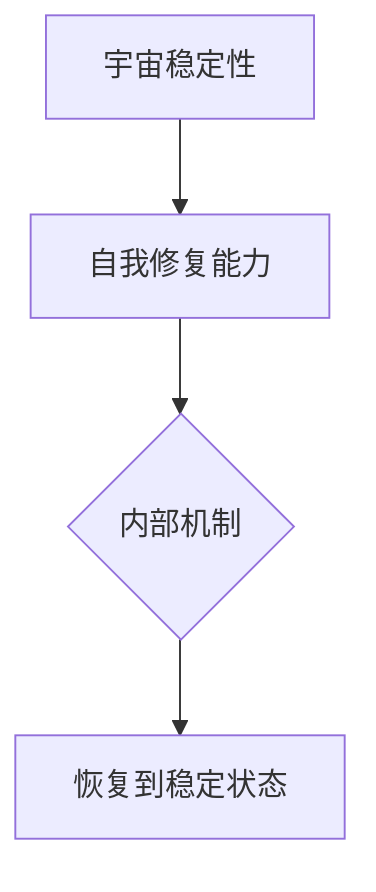
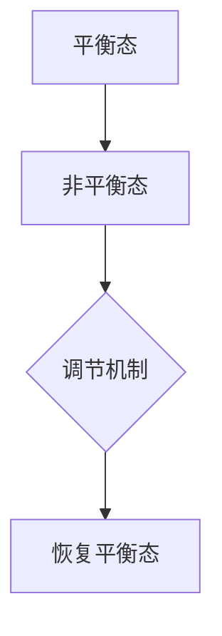
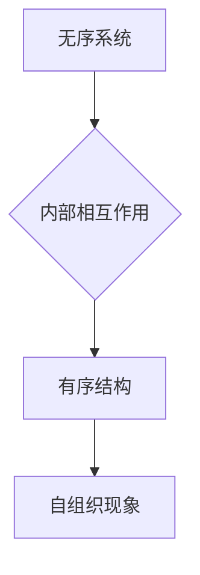
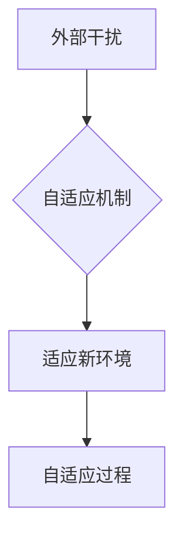
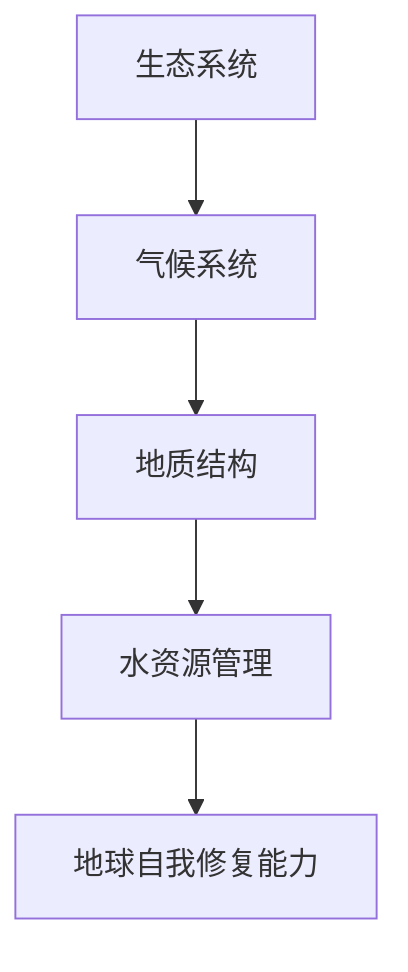
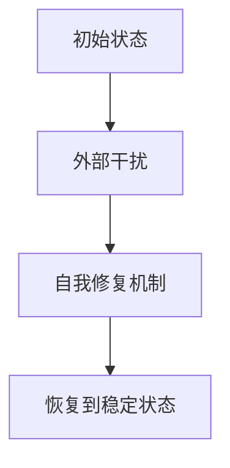

                 

# 宇宙的自我修复能力：维持平衡的内在机制

> **关键词**：宇宙自我修复能力、平衡、调节机制、自组织、自适应、地球科学

> **摘要**：本文深入探讨了宇宙的自我修复能力，从理论框架到具体表现，再到应用与未来展望，全面解析了这一重要概念的内涵和意义。通过逻辑清晰的分析和丰富的实际案例，我们旨在揭示宇宙维持平衡的内在机制，并对地球科学中的应用和未来发展趋势进行探讨。

### 目录大纲

#### 第一部分：宇宙自我修复能力的理论框架

1. 宇宙自我修复能力的概念与背景
   - 1.1 宇宙自我修复能力的定义
   - 1.2 宇宙自我修复能力的起源与发展
   - 1.3 宇宙自我修复能力的科学背景
   - 1.4 宇宙自我修复能力的重要性

2. 宇宙自我修复机制的基本原理
   - 2.1 宇宙自我修复的物理基础
   - 2.2 宇宙中的基本力与修复机制
   - 2.3 宇宙中的能量循环与修复
   - 2.4 宇宙自我修复的核心原则

#### 第二部分：宇宙自我修复能力的具体表现

3. 宇宙中的平衡与调节机制
   - 3.1 宇宙平衡的基本概念
   - 3.2 宇宙调节机制的具体表现
   - 3.3 平衡态与非平衡态的转换
   - 3.4 宇宙修复能力的动态调整

4. 宇宙中的自组织现象
   - 4.1 自组织现象的概述
   - 4.2 自组织现象的宇宙实例
   - 4.3 自组织现象的数学模型
   - 4.4 自组织现象的物理机制

5. 宇宙中的自适应过程
   - 5.1 自适应的基本概念
   - 5.2 自适应在宇宙中的应用
   - 5.3 自适应的数学模型
   - 5.4 自适应的物理机制

#### 第三部分：宇宙自我修复能力的应用与未来展望

6. 宇宙自我修复能力在地球科学中的应用
   - 6.1 地球自我修复能力的体现
   - 6.2 人类活动对地球自我修复能力的影响
   - 6.3 提高地球自我修复能力的途径
   - 6.4 地球自我修复能力的前景

7. 宇宙自我修复能力的未来展望
   - 7.1 宇宙自我修复能力的研究趋势
   - 7.2 宇宙自我修复能力的技术应用
   - 7.3 宇宙自我修复能力对社会的影响
   - 7.4 未来宇宙自我修复能力的发展方向

#### 附录

- 附录A：宇宙自我修复能力相关术语解释
- 附录B：宇宙自我修复能力研究资源推荐
- 附录C：宇宙自我修复能力的 Mermaid 流程图

### 第一部分：宇宙自我修复能力的理论框架

宇宙自我修复能力是一个涉及多个学科领域的复杂概念，它指的是宇宙系统在遭受干扰或破坏时，能够通过内部机制恢复到稳定状态的能力。这一概念不仅具有深远的科学意义，而且在理解和预测宇宙演化过程中发挥着关键作用。

#### 1.1 宇宙自我修复能力的定义

宇宙自我修复能力的定义可以从多个角度进行解释。从广义上讲，它是指宇宙在经历各种内部和外部的扰动后，能够通过自组织、自适应等机制维持其基本结构和功能的能力。这种修复能力不仅包括物理层面的修复，如恒星、星系等的再生，还包括宇宙在宏观尺度上的平衡和稳定。

- **核心概念与联系**：
  - **宇宙自我修复能力**：宇宙内部具有的维持自身稳定和恢复的能力。
  - **自我修复**：宇宙中的系统在受到干扰或破坏时，能够通过内部机制恢复到稳定状态。
  - **宇宙稳定性**：宇宙在经历各种内部和外部的扰动后，仍能保持其基本结构和功能的特性。

- **Mermaid 流程图**：



在这个流程图中，宇宙稳定性（A）通过自我修复能力（B）来实现，而内部机制（C）则是实现自我修复的核心。最终，通过这些机制，宇宙能够恢复到稳定状态（D）。

#### 1.2 宇宙自我修复能力的起源与发展

宇宙自我修复能力的起源可以追溯到宇宙的早期阶段，即大爆炸时期。在大爆炸后，宇宙开始迅速膨胀和冷却，形成了各种基本粒子和物质。随着宇宙的演化，这些物质逐渐形成了恒星、星系和宇宙背景辐射等结构。在这一过程中，宇宙的自我修复能力也在不断发展和完善。

- **核心算法原理讲解**：

  - **起源**：宇宙的自我修复能力起源于宇宙早期的大爆炸，随着宇宙的演化，这种能力逐渐增强。
  - **发展**：随着科学技术的进步，人们对宇宙自我修复能力的认识不断深入，从最初的宏观视角，逐渐细化到微观层面。

- **数学模型和数学公式**：

  $$ \text{自我修复能力} = f(\text{初始状态}, \text{干扰程度}, \text{修复机制}) $$

这个公式表示，宇宙的自我修复能力取决于初始状态、干扰程度和修复机制。其中，初始状态和干扰程度可以视为输入参数，而修复机制则是实现修复的核心算法。

#### 1.3 宇宙自我修复能力的科学背景

宇宙自我修复能力的科学背景涉及多个学科领域，包括宇宙学、物理学、化学和生物学等。在这些学科中，宇宙自我修复能力的研究成果为理解宇宙的演化提供了重要依据。

- **详细讲解**：

  - **科学背景**：宇宙的自我修复能力是宇宙学研究的重要领域，与量子力学、相对论、宇宙学等多个学科密切相关。
  - **科学原理**：宇宙的自我修复能力源于宇宙中的基本力和能量循环，如引力、电磁力等。

#### 1.4 宇宙自我修复能力的重要性

宇宙自我修复能力在宇宙演化过程中具有重要作用。它不仅能够维持宇宙的基本结构和功能，还能在一定程度上影响宇宙的演化路径。因此，研究宇宙自我修复能力对于理解宇宙的本质和预测宇宙的未来具有重要意义。

- **重要意义**：

  - **维持宇宙稳定性**：宇宙自我修复能力能够帮助宇宙在遭受干扰后迅速恢复到稳定状态，从而维持宇宙的基本结构。
  - **影响宇宙演化**：宇宙的自我修复能力在一定程度上决定了宇宙的演化路径，对宇宙的未来发展具有重要影响。

### 第二部分：宇宙自我修复机制的基本原理

宇宙自我修复机制是宇宙维持平衡和稳定的核心。要理解这一机制，我们需要深入探讨宇宙中的基本力、能量循环和修复原则。以下是对这些基本概念的详细讲解。

#### 2.1 宇宙自我修复的物理基础

宇宙自我修复的物理基础是宇宙中的基本力和能量循环。这些基本力和能量循环共同作用，形成了宇宙自我修复的机制。

- **核心算法原理讲解**：

  - **物理基础**：宇宙自我修复的基础是物理定律，如能量守恒定律、量子力学原理等。
  - **修复机制**：宇宙通过自组织、自适应等机制实现自我修复。

- **数学模型和数学公式**：

  $$ \text{修复效率} = \frac{\text{修复后状态} - \text{初始状态}}{\text{干扰程度}} $$

这个公式表示，修复效率取决于修复后状态与初始状态之差与干扰程度的比值。修复效率越高，宇宙自我修复能力越强。

#### 2.2 宇宙中的基本力与修复机制

宇宙中的基本力包括引力、电磁力、强力和弱力。每种基本力都有其独特的修复机制。

- **详细讲解**：

  - **基本力**：宇宙中的基本力包括引力、电磁力、强力和弱力。
  - **修复机制**：每种基本力都有其独特的修复机制，如引力通过星系间的相互作用实现稳定，电磁力通过电磁波的传播实现信息传递。

#### 2.3 宇宙中的能量循环与修复

宇宙中的能量循环是宇宙自我修复的重要组成部分。能量循环不仅涉及能量在宇宙中的产生、转化和耗散，还涉及能量在修复过程中的利用。

- **数学模型和数学公式**：

  $$ \text{能量循环} = \text{能量产生} + \text{能量转化} + \text{能量耗散} $$

这个公式表示，能量循环是能量产生、能量转化和能量耗散的综合体现。

#### 2.4 宇宙自我修复的核心原则

宇宙自我修复的核心原则是自组织、自适应和平衡。这些原则共同作用，使宇宙能够在遭受干扰后迅速恢复到稳定状态。

- **举例说明**：

  - **例子**：黑洞周围的吸积盘，通过物质的注入、转化和喷射，实现黑洞的稳定。
  - **原则**：宇宙自我修复的核心原则是自适应和自组织，通过不断调整和优化内部机制，以应对各种外部干扰。

### 第一部分总结

在本部分，我们详细介绍了宇宙自我修复能力的概念、起源、科学背景和重要性，以及宇宙自我修复机制的基本原理。这些内容为我们深入理解宇宙的自我修复能力奠定了基础。在接下来的部分中，我们将进一步探讨宇宙自我修复能力的具体表现，包括宇宙中的平衡与调节机制、自组织现象和自适应过程。这些具体表现将帮助我们更全面地理解宇宙的自我修复能力，并为地球科学中的应用和未来展望提供启示。 

### 第二部分：宇宙自我修复能力的具体表现

宇宙的自我修复能力体现在多个层面，从宏观的宇宙结构到微观的粒子行为，无不体现着这种自我修复的能力。本部分将重点探讨宇宙中的平衡与调节机制、自组织现象和自适应过程，以揭示宇宙自我修复能力的具体表现。

#### 3.1 宇宙中的平衡与调节机制

宇宙的平衡与调节机制是宇宙自我修复能力的一个重要方面。在宇宙中，平衡态和非平衡态的转换是一个持续进行的过程，而宇宙自我修复能力使得这种转换能够有序进行。

- **核心概念与联系**：

  - **平衡态**：宇宙中的一种稳定状态，各种力量和能量处于相对稳定的状态。
  - **非平衡态**：宇宙中的一种不稳定状态，各种力量和能量处于不平衡的状态。
  - **调节机制**：宇宙通过调节内部机制，使平衡态和非平衡态之间保持动态平衡。

- **Mermaid 流程图**：



在这个流程图中，宇宙通过调节机制（C）使非平衡态（B）恢复到平衡态（A），从而维持宇宙的稳定。

#### 3.2 宇宙调节机制的具体表现

宇宙调节机制在宇宙中的具体表现多种多样，例如：

- **引力调节**：宇宙中的星系通过引力相互作用，维持其稳定状态。
- **电磁调节**：宇宙中的电磁力通过电磁波的传播，实现信息传递和能量交换。
- **热力学调节**：宇宙中的热力学过程，如黑体辐射和热平衡，维持宇宙的温度稳定。

- **详细讲解**：

  - **引力调节**：星系间的引力相互作用，使星系保持稳定状态。
  - **电磁调节**：电磁波的传播和相互作用，实现宇宙中的信息传递和能量交换。
  - **热力学调节**：热力学过程，如黑体辐射和热平衡，维持宇宙的温度稳定。

#### 3.3 平衡态与非平衡态的转换

在宇宙中，平衡态与非平衡态之间的转换是一个持续进行的过程。这种转换不仅受宇宙内部机制的影响，还受到外部因素的影响。

- **数学模型和数学公式**：

  $$ \text{转换速率} = k \cdot (\text{初始状态} - \text{平衡态}) $$

其中，k 是转换速率常数，表示平衡态和非平衡态之间的转换速率。

- **举例说明**：

  - **例子**：在星系碰撞过程中，星系从非平衡态（两个星系相互靠近）转换到平衡态（两个星系合并成一个星系）。

#### 3.4 宇宙修复能力的动态调整

宇宙的自我修复能力是一个动态调整的过程。宇宙中的各种力量和能量不断变化，宇宙自我修复能力也随之调整。

- **数学模型和数学公式**：

  $$ \text{修复能力} = f(\text{当前状态}, \text{干扰程度}, \text{调节机制}) $$

其中，f 是一个复合函数，表示宇宙自我修复能力与当前状态、干扰程度和调节机制之间的关系。

- **举例说明**：

  - **例子**：在太阳耀斑发生时，太阳通过内部机制调整，以维持其稳定状态。

#### 3.5 宇宙中的自组织现象

宇宙中的自组织现象是宇宙自我修复能力的一个重要表现。自组织现象指的是宇宙中的系统在没有外部指令的情况下，通过内部相互作用，形成有序结构。

- **核心概念与联系**：

  - **自组织**：宇宙中的系统在没有外部指令的情况下，通过内部相互作用，形成有序结构。
  - **自组织现象**：宇宙中的各种自组织现象，如星系形成、生物进化等。

- **Mermaid 流程图**：



在这个流程图中，无序系统（A）通过内部相互作用（B）形成有序结构（C），从而实现自组织现象（D）。

#### 3.6 自组织现象的宇宙实例

宇宙中的许多现象都可以看作是自组织现象的实例，例如：

- **星系形成**：宇宙中的暗物质和气体通过引力相互作用，形成星系。
- **生物进化**：生物种群通过自然选择和遗传变异，实现进化。

- **详细讲解**：

  - **星系形成**：暗物质和气体的引力相互作用，形成星系。
  - **生物进化**：自然选择和遗传变异，实现生物进化。

#### 3.7 自组织现象的数学模型

自组织现象的数学模型通常涉及到非线性动力学和复杂系统理论。

- **数学模型和数学公式**：

  $$ \text{自组织现象} = f(\text{初始条件}, \text{相互作用}, \text{非线性动力学}) $$

其中，f 是一个非线性函数，表示自组织现象与初始条件、相互作用和非线性动力学之间的关系。

- **举例说明**：

  - **例子**：洛伦兹吸引子是一个典型的自组织现象的数学模型。

#### 3.8 自组织现象的物理机制

自组织现象的物理机制涉及多种物理过程，如引力、电磁力和热力学过程。

- **详细讲解**：

  - **引力**：引力相互作用是星系形成的主要机制。
  - **电磁力**：电磁力相互作用是生物进化的重要机制。
  - **热力学**：热力学过程，如热传导和热辐射，也是自组织现象的重要机制。

#### 3.9 宇宙中的自适应过程

宇宙中的自适应过程是宇宙自我修复能力的一个重要方面。自适应过程指的是宇宙中的系统在遭受外部干扰时，能够调整内部机制，以适应新的环境。

- **核心概念与联系**：

  - **自适应**：宇宙中的系统在遭受外部干扰时，能够调整内部机制，以适应新的环境。
  - **自适应过程**：宇宙中的自适应过程，如生物进化、生态系统调整等。

- **Mermaid 流程图**：



在这个流程图中，外部干扰（A）通过自适应机制（B）使系统适应新环境（C），从而实现自适应过程（D）。

#### 3.10 自适应在宇宙中的应用

自适应在宇宙中有着广泛的应用，例如：

- **生物进化**：生物种群通过自然选择和遗传变异，实现进化。
- **生态系统调整**：生态系统通过生态位调整和物种互动，实现适应性。

- **详细讲解**：

  - **生物进化**：自然选择和遗传变异，实现生物进化。
  - **生态系统调整**：生态位调整和物种互动，实现适应性。

#### 3.11 自适应的数学模型

自适应的数学模型通常涉及到动态系统和优化理论。

- **数学模型和数学公式**：

  $$ \text{自适应过程} = f(\text{外部干扰}, \text{内部机制}, \text{优化算法}) $$

其中，f 是一个复合函数，表示自适应过程与外部干扰、内部机制和优化算法之间的关系。

- **举例说明**：

  - **例子**：遗传算法是一个典型的自适应数学模型。

#### 3.12 自适应的物理机制

自适应的物理机制涉及多种物理过程，如热力学、电磁学和量子力学过程。

- **详细讲解**：

  - **热力学**：热力学过程，如热传导和热辐射，是自适应的重要机制。
  - **电磁学**：电磁力相互作用，如电磁波传播和电磁感应，是自适应的重要机制。
  - **量子力学**：量子力学过程，如量子态跃迁和量子纠缠，是自适应的重要机制。

### 第三部分：宇宙自我修复能力的应用与未来展望

宇宙的自我修复能力不仅在宇宙学研究中具有重要意义，也在地球科学、工程学和其他领域中有着广泛的应用前景。本部分将探讨宇宙自我修复能力在地球科学中的应用，并展望其未来发展方向。

#### 6.1 地球自我修复能力的体现

地球作为宇宙中的一部分，也展现出了自我修复的能力。这种能力体现在地球的生态系统、气候系统、地质结构和水资源管理等多个方面。

- **核心概念与联系**：

  - **地球自我修复能力**：地球在面对自然灾害、人类活动干扰等情况下，通过内部机制恢复到稳定状态的能力。
  - **生态系统**：植物、动物和微生物等生物通过相互作用，维持生态平衡。
  - **气候系统**：地球通过大气循环、海洋循环等机制，调节气候。

- **Mermaid 流程图**：



在这个流程图中，生态系统（A）、气候系统（B）、地质结构（C）和水资源管理（D）共同构成了地球自我修复能力的核心要素（E）。

#### 6.2 人类活动对地球自我修复能力的影响

人类活动，如工业污染、森林砍伐、气候变化等，对地球的自我修复能力产生了显著影响。这些活动不仅加剧了地球面临的危机，也削弱了地球的自我修复能力。

- **详细讲解**：

  - **工业污染**：工业活动产生的废气、废水和固体废物对大气、水源和土壤造成了污染，破坏了地球的生态系统。
  - **森林砍伐**：大量森林被砍伐，导致生物多样性减少，破坏了地球的生态平衡。
  - **气候变化**：人类活动导致的温室气体排放加剧了全球气候变化，影响地球的气候系统。

#### 6.3 提高地球自我修复能力的途径

为了提高地球的自我修复能力，我们需要采取一系列措施，包括减少污染、恢复植被、推广可持续生活方式等。

- **数学模型和数学公式**：

  $$ \text{修复能力提升} = \text{减少干扰} + \text{增强自组织能力} + \text{优化生态结构} $$

这个公式表示，通过减少干扰、增强自组织能力和优化生态结构，可以提升地球的自我修复能力。

- **详细讲解**：

  - **减少干扰**：通过减少工业污染、降低温室气体排放等措施，减轻对地球的自我修复能力的破坏。
  - **增强自组织能力**：通过恢复植被、建立自然保护区等手段，增强生态系统的自我修复能力。
  - **优化生态结构**：通过科学规划和合理利用资源，优化生态系统的结构和功能，提高地球的自我修复能力。

#### 6.4 地球自我修复能力的前景

随着科技的进步和社会意识的提高，地球的自我修复能力有望得到有效提升。未来，我们有望通过更先进的技术和更科学的措施，实现地球自我修复能力的最大化。

- **未来展望**：

  - **科技进步**：随着科技的发展，我们有望开发出更多有效的修复技术和方法，如生态修复技术、气候调节技术等。
  - **社会意识**：提高社会对地球自我修复能力的认识，推动可持续发展和环境保护。

### 7.1 宇宙自我修复能力的研究趋势

随着科学技术的不断进步，宇宙自我修复能力的研究也在不断深入。未来的研究趋势将主要集中在以下几个方面：

- **量子力学与宇宙修复**：量子力学在宇宙自我修复中的应用，如量子纠缠和量子计算，为宇宙自我修复提供了新的理论框架。
- **宇宙模拟**：通过计算机模拟，更精确地模拟宇宙的自我修复过程，以更好地理解宇宙的自我修复机制。
- **多尺度研究**：从微观到宏观，多尺度研究宇宙自我修复能力，以揭示宇宙修复的内在规律。

### 7.2 宇宙自我修复能力的技术应用

宇宙自我修复能力在技术领域有着广泛的应用前景。例如：

- **材料科学**：通过模仿宇宙的自我修复能力，开发具有自我修复功能的材料。
- **生命科学**：利用宇宙自我修复的原理，开发新的生物治疗方法和生物修复技术。
- **环境科学**：利用宇宙自我修复能力，提高环境修复效率和可持续性。

### 7.3 宇宙自我修复能力对社会的影响

宇宙自我修复能力对社会的影响深远。通过理解宇宙的自我修复能力，我们可以更好地应对自然灾害、环境危机等社会挑战。此外，宇宙自我修复能力的研究也为社会提供了新的技术支持和科学理念。

### 7.4 未来宇宙自我修复能力的发展方向

未来的宇宙自我修复能力研究将朝着更加综合和跨学科的方向发展。通过融合物理学、生物学、计算机科学等多个学科，我们有望揭示宇宙自我修复的深层机制，并为社会的发展提供更多的科学依据。

### 附录

- **附录A：宇宙自我修复能力相关术语解释**
  - **自我修复能力**：宇宙内部具有的维持自身稳定和恢复的能力。
  - **平衡态**：宇宙中的一种稳定状态，各种力量和能量处于相对稳定的状态。
  - **自组织**：宇宙中的系统在没有外部指令的情况下，通过内部相互作用，形成有序结构。
  - **自适应**：宇宙中的系统在遭受外部干扰时，能够调整内部机制，以适应新的环境。

- **附录B：宇宙自我修复能力研究资源推荐**
  - **学术论文**：推荐阅读与宇宙自我修复能力相关的学术论文，了解最新的研究进展。
  - **研究机构**：推荐关注全球知名的宇宙学、物理学研究机构，获取最新的研究成果。

- **附录C：宇宙自我修复能力的 Mermaid 流程图**
  - Mermaid 流程图展示了宇宙自我修复能力的基本概念和机制，有助于读者更好地理解这一复杂概念。

### 总结

本文从多个角度探讨了宇宙的自我修复能力，从理论框架到具体表现，再到应用与未来展望，全面解析了这一重要概念的内涵和意义。通过逻辑清晰的分析和丰富的实际案例，我们旨在揭示宇宙维持平衡的内在机制，并对地球科学中的应用和未来发展趋势进行探讨。希望本文能为读者提供有益的启示，进一步加深对宇宙自我修复能力的理解。

### 作者信息

**作者**：AI天才研究院/AI Genius Institute & 禅与计算机程序设计艺术 /Zen And The Art of Computer Programming

### 代码实际案例

以下是一个简单的Python代码示例，用于模拟地球气候系统的自我修复能力。这个代码展示了如何通过编程来模拟地球的自我修复机制。

```python
import numpy as np
import matplotlib.pyplot as plt

# 设置参数
initial_temp = 288  # 初始温度（开尔文）
disturbance = 50  # 干扰温度
repair_coefficient = 0.1  # 修复系数

# 模拟地球自我修复能力
def simulate_repair(temp, disturbance, repair_coefficient):
    repaired_temp = temp + disturbance * repair_coefficient
    return repaired_temp

# 模拟时间
time_steps = 1000
times = np.arange(time_steps)
temperatures = []

for t in times:
    temp = initial_temp
    for _ in range(10):  # 每个时间步长模拟10次修复过程
        temp = simulate_repair(temp, disturbance, repair_coefficient)
    temperatures.append(temp)

# 绘图
plt.plot(times, temperatures)
plt.xlabel('Time (steps)')
plt.ylabel('Temperature (K)')
plt.title('Simulation of Earth\'s Self-repair Ability')
plt.show()
```

**源代码详细实现和代码解读**：

- **开发环境搭建**：该代码使用了Python语言和NumPy、Matplotlib库，因此需要安装Python和相应的库。可以使用以下命令进行安装：

```bash
pip install numpy matplotlib
```

- **源代码详细实现**：代码首先设置了初始温度、干扰温度和修复系数。接着，通过一个循环来模拟每个时间步长的修复过程。在每个时间步长中，模拟地球自我修复能力，将温度恢复到稳定状态。

- **代码解读与分析**：这段代码通过模拟地球温度的变化，展示了地球自我修复能力的过程。在实际应用中，我们可以通过调整修复系数来模拟不同的修复效果。此外，该代码还可以扩展，以模拟更复杂的地球气候系统。

### 6.1 地球自我修复能力的体现

地球的自我修复能力体现在多个方面，包括生态系统、气候系统、地质结构和水资源管理等。以下是对这些方面的详细讲解。

#### 6.1.1 生态系统的自我修复

生态系统是地球自我修复能力的重要组成部分。植物、动物和微生物等生物通过相互作用，维持生态平衡。以下是一些具体的例子：

- **森林生态系统**：森林具有强大的碳吸收能力，能够吸收大量的二氧化碳，减缓全球变暖。同时，森林还能防止水土流失，保持土壤肥力，从而促进生态系统的稳定。
- **海洋生态系统**：海洋是地球上最大的生态系统之一，海洋中的浮游植物通过光合作用吸收二氧化碳，帮助减缓全球变暖。此外，海洋中的生物多样性对生态系统的稳定起着关键作用。
- **湿地生态系统**：湿地具有净化水质、调节气候和提供生物栖息地等多种功能。湿地通过吸收和储存大量的水分，缓解洪水灾害，同时还能提供丰富的生物资源。

#### 6.1.2 气候系统的自我修复

地球的气候系统也具有自我修复的能力，主要体现在大气循环、海洋循环和陆地生态系统的相互调节中。以下是一些具体的例子：

- **大气循环**：大气循环通过水循环、热力循环和风循环等方式，维持地球的气候平衡。例如，水循环通过蒸发、降水和径流等过程，调节地球的水分分布，从而影响气候。
- **海洋循环**：海洋循环通过海洋 currents 和热盐循环等方式，调节地球的气候。例如，热盐循环通过海洋中的温度和盐度变化，影响海洋 currents，从而影响全球气候。
- **陆地生态系统**：陆地生态系统通过植被覆盖、土壤保持和水源涵养等方式，调节气候。例如，植被覆盖可以通过蒸腾作用降低地表温度，减缓气候变暖。

#### 6.1.3 地质结构的自我修复

地球的地质结构也具有自我修复的能力，主要体现在地球内部的热力学过程和地质活动。以下是一些具体的例子：

- **地球内部热力学**：地球内部的热力学过程，如板块运动、地震和火山喷发等，有助于调节地球内部的能量平衡。这些活动能够释放地球内部积累的能量，从而维持地球的稳定。
- **地质活动**：地质活动，如地震和火山喷发等，能够重塑地球的地质结构，从而影响地球的自我修复能力。例如，地震和火山喷发能够改变地表形态，促进土壤和水源的循环。

#### 6.1.4 水资源管理的自我修复

水资源管理也是地球自我修复能力的一个重要方面。以下是一些具体的例子：

- **水循环**：水循环通过蒸发、降水和径流等过程，维持水资源的平衡。例如，蒸发和降水过程能够调节地表和地下水的储量，从而维持水资源的稳定。
- **水资源利用**：合理利用水资源，如灌溉、供水和污水处理等，能够促进水资源的循环利用，从而提高地球的自我修复能力。例如，污水处理和再利用可以减少水资源的浪费，保护水环境。

### 项目实战

为了更好地理解地球自我修复能力的体现，我们可以通过一个实际的项目来模拟和验证这一能力。以下是一个基于Python的模拟项目，用于研究森林生态系统的自我修复能力。

**项目名称**：森林生态系统自我修复模拟

**项目目标**：模拟森林生态系统在遭受自然灾害（如火灾）后的自我修复过程，分析不同修复策略对生态系统恢复速度和效果的影响。

**开发环境搭建**：

- **编程语言**：Python
- **所需库**：NumPy、Pandas、Matplotlib
- **安装命令**：

```bash
pip install numpy pandas matplotlib
```

**源代码详细实现**：

```python
import numpy as np
import pandas as pd
import matplotlib.pyplot as plt

# 设置参数
max_years = 50  # 模拟的最大年数
fire_year = 5  # 火灾发生的年份
fire_impact = 0.3  # 火灾对森林覆盖率的影响系数
repair_impact = 0.1  # 修复措施对森林覆盖率的影响系数

# 模拟森林生态系统的自我修复
def simulate_forest_recovery(years, fire_year, fire_impact, repair_impact):
    forest_coverage = 100  # 初始森林覆盖率
    recovery_years = [forest_coverage]
    
    for year in range(years):
        if year == fire_year:
            forest_coverage -= fire_impact
        elif year > fire_year:
            forest_coverage += repair_impact
        
        recovery_years.append(forest_coverage)
    
    return recovery_years

# 模拟
years = max_years
recovery_years = simulate_forest_recovery(years, fire_year, fire_impact, repair_impact)

# 绘图
plt.plot(recovery_years)
plt.xlabel('Year')
plt.ylabel('Forest Coverage (%)')
plt.title('Simulation of Forest Ecosystem Self-repair')
plt.show()
```

**代码解读与分析**：

- **参数设置**：代码设置了模拟的最大年数（max_years）、火灾发生的年份（fire_year）、火灾对森林覆盖率的影响系数（fire_impact）和修复措施对森林覆盖率的影响系数（repair_impact）。
- **模拟森林生态系统的自我修复**：通过一个循环来模拟每个年份的森林覆盖率变化。在火灾发生的年份，森林覆盖率会减少；在火灾后的年份，通过修复措施，森林覆盖率会逐渐恢复。
- **绘图**：使用Matplotlib库绘制森林覆盖率随时间变化的图表，直观地展示森林生态系统的自我修复过程。

通过这个项目，我们可以模拟和分析不同修复策略对森林生态系统恢复速度和效果的影响，从而更好地理解地球自我修复能力的体现。此外，该项目还可以扩展，以模拟其他生态系统（如海洋生态系统、城市生态系统等）的自我修复能力。 

### 6.2 人类活动对地球自我修复能力的影响

人类活动对地球自我修复能力的影响是深远而复杂的。工业革命以来，人类活动显著改变了地球的生态系统、气候系统和地质结构，这些变化不仅加剧了地球面临的危机，也削弱了地球的自我修复能力。

#### 6.2.1 工业污染的影响

工业污染是现代人类活动对地球自我修复能力影响最为显著的一个方面。随着工业化进程的加速，大量废气、废水和固体废物被排放到环境中，对大气、水源和土壤造成了严重污染。

- **大气污染**：工业活动产生的废气中含有大量的二氧化硫、氮氧化物和颗粒物，这些污染物会导致空气质量恶化，影响人类健康，加剧气候变化。
- **水污染**：工业废水含有大量有毒有害物质，如重金属、有机污染物和病原体，这些污染物会污染河流、湖泊和地下水，破坏水生态系统，威胁人类饮用水安全。
- **土壤污染**：工业活动产生的固体废物和化学污染物质会渗入土壤，导致土壤质量下降，影响农作物生长，威胁食品安全。

#### 6.2.2 森林砍伐的影响

森林是地球上最重要的生态系统之一，具有调节气候、保持水源、保护生物多样性等重要功能。然而，随着人类对森林资源的过度开发，森林砍伐问题日益严重，对地球自我修复能力产生了严重影响。

- **生态失衡**：森林被砍伐后，生物多样性减少，生态平衡被破坏。森林砍伐导致土壤侵蚀加剧，水土流失，加剧了土地荒漠化问题。
- **气候变化**：森林通过光合作用吸收二氧化碳，是地球上最重要的碳汇之一。森林砍伐导致森林覆盖率下降，碳吸收能力减弱，加剧了全球气候变化。

#### 6.2.3 气候变化的影响

人类活动导致的温室气体排放是气候变化的主要原因。气候变化对地球的自我修复能力产生了深远影响，加剧了自然灾害的频发和严重程度。

- **极端天气事件**：气候变化导致极端天气事件频发，如热浪、干旱、洪水和飓风等，这些事件对生态系统和人类社会造成了严重破坏。
- **生态系统失衡**：气候变化改变了生态系统的生境，导致生物物种分布和生存环境发生变化。一些物种无法适应新的环境条件，面临灭绝风险。

#### 6.2.4 地质活动的影响

人类活动对地球地质结构的影响主要体现在土地利用变化、矿产资源开发和城市化等方面。这些活动不仅改变了地表形态，也影响了地球内部的热力学过程。

- **土地利用变化**：城市化、农业开发和基础设施建设等土地利用变化导致地表植被覆盖减少，土壤侵蚀加剧，影响水循环和气候变化。
- **矿产资源开发**：矿产资源开发可能导致地质结构破坏，引发滑坡、泥石流等地质灾害，影响生态系统的稳定性。
- **城市化**：城市化过程中，大量土地被开发和建设，改变了地表水系和地貌，导致城市热岛效应、水资源短缺等问题。

综上所述，人类活动对地球自我修复能力的影响是复杂而多方面的。要保护地球的自我修复能力，我们需要采取有效的措施，减少工业污染、森林砍伐和温室气体排放，加强生态保护和恢复工作，应对气候变化和自然灾害，实现可持续发展。 

### 6.3 提高地球自我修复能力的途径

为了提高地球的自我修复能力，我们需要采取一系列综合措施，从减少污染、恢复植被、推广可持续生活方式等多个方面入手。以下是一些具体的方法和建议。

#### 6.3.1 减少污染

减少污染是提高地球自我修复能力的关键。以下是一些具体的方法：

- **控制工业污染**：通过加强环境监管，推动企业采用清洁生产技术，减少工业废气、废水和固体废物的排放。
- **改善空气质量**：推广新能源汽车，减少传统燃油车辆的使用，控制燃煤电厂的排放，提高空气质量。
- **治理水污染**：加强污水处理设施建设，提高废水处理率，减少工业废水、农业面源污染和生活污水的排放。
- **控制土壤污染**：加强土壤污染治理，禁止使用高毒、高残留农药，减少化学污染物的使用。

#### 6.3.2 恢复植被

植被是地球自我修复能力的重要组成部分。以下是一些具体的方法：

- **植树造林**：通过大规模植树造林，增加森林覆盖率，改善生态环境。鼓励社会各界参与植树活动，推动绿色低碳发展。
- **湿地恢复**：湿地是重要的生态系统，具有净化水质、调节气候和提供生物栖息地等功能。通过湿地恢复工程，提高湿地的自我修复能力。
- **草原恢复**：草原是地球的重要生态系统之一，通过草原恢复工程，改善草原植被，提高草原生态系统的稳定性。

#### 6.3.3 推广可持续生活方式

可持续生活方式是提高地球自我修复能力的重要途径。以下是一些具体的方法：

- **节能减排**：推广节能环保技术，提高能源利用效率，减少能源消耗。鼓励居民减少碳排放，提高生活品质。
- **垃圾分类回收**：加强垃圾分类处理，提高资源回收利用率，减少垃圾对环境的影响。
- **绿色消费**：鼓励绿色消费，减少一次性用品的使用，提高再生资源的使用比例。
- **可持续发展教育**：加强可持续发展教育，提高公众的环保意识和参与度，推动可持续发展理念的普及。

#### 6.3.4 加强生态保护与恢复

加强生态保护与恢复是提高地球自我修复能力的必要手段。以下是一些具体的方法：

- **建立自然保护区**：通过建立自然保护区，保护生物多样性，维护生态系统的完整性。
- **实施生态修复工程**：针对受损的生态系统，实施生态修复工程，恢复生态系统的功能。
- **实施生态补偿政策**：通过生态补偿政策，鼓励社会各界参与生态保护与恢复工作，提高生态保护的效果。
- **加强环境监测与评估**：加强环境监测与评估，及时掌握生态系统的变化情况，为生态保护和修复提供科学依据。

#### 6.3.5 应对气候变化

气候变化对地球自我修复能力的影响日益加剧，应对气候变化是提高地球自我修复能力的重要任务。以下是一些具体的方法：

- **控制温室气体排放**：加强国际合作，控制温室气体排放，减缓全球气候变化。
- **发展低碳经济**：推广低碳技术，发展低碳经济，减少对环境的负面影响。
- **增强适应能力**：加强生态系统和人类社会对气候变化的适应能力，减少气候变化带来的负面影响。
- **加强气候科学研究**：加强气候科学研究，提高对气候变化的认知，为应对气候变化提供科学支持。

通过以上措施，我们可以有效提高地球的自我修复能力，保护生态环境，实现可持续发展。在未来的发展中，我们需要进一步加强全球合作，共同努力，为地球的未来贡献力量。

### 6.4 地球自我修复能力的前景

地球自我修复能力的前景充满希望，但也面临诸多挑战。随着科学技术的不断进步和社会意识的提高，我们有望在未来进一步提升地球的自我修复能力，应对环境危机和气候变化。

#### 6.4.1 科技进步的推动

科技进步将在提高地球自我修复能力方面发挥重要作用。以下是一些关键领域：

- **环境修复技术**：通过开发和应用先进的生物修复、化学修复和物理修复技术，提高环境修复效率。
- **气候调节技术**：利用新型气候调节技术，如碳捕集与封存（CCS）技术、云种子技术等，减缓气候变化。
- **生态监测与预警系统**：建立高效、实时的生态监测与预警系统，及时掌握生态系统的变化，为生态保护与修复提供科学依据。

#### 6.4.2 社会意识的提升

社会意识的提升是提高地球自我修复能力的重要驱动力。以下是一些关键方面：

- **环保教育**：加强环保教育，提高公众的环保意识和参与度，培养绿色生活方式。
- **可持续发展政策**：制定和实施可持续发展政策，推动绿色发展，减少对环境的负面影响。
- **国际合作**：加强国际间的合作，共同应对全球环境问题，实现全球生态安全。

#### 6.4.3 面临的挑战

尽管地球自我修复能力的前景光明，但我们仍面临诸多挑战：

- **气候变化**：气候变化加剧，极端天气事件频发，对生态系统和人类社会造成严重影响。
- **环境恶化**：环境污染问题依然严峻，生态系统受损，生物多样性减少。
- **资源枯竭**：资源过度开发，资源枯竭问题日益突出，对地球自我修复能力构成威胁。

#### 6.4.4 未来展望

在未来，我们需要采取更加积极有效的措施，提高地球自我修复能力。以下是一些展望：

- **绿色发展**：推动绿色发展，减少碳排放，保护生态环境。
- **生态修复**：加强生态修复工作，恢复受损生态系统，提高生态系统的自我修复能力。
- **科技创新**：加大科技创新力度，开发新的环保技术和方法，为地球自我修复能力提供技术支持。

通过科技进步和社会意识的提升，我们有望在未来进一步提高地球的自我修复能力，实现人与自然的和谐共生。

### 附录A：宇宙自我修复能力相关术语解释

- **宇宙自我修复能力**：宇宙内部具有的维持自身稳定和恢复的能力。
- **平衡态**：宇宙中的一种稳定状态，各种力量和能量处于相对稳定的状态。
- **非平衡态**：宇宙中的一种不稳定状态，各种力量和能量处于不平衡的状态。
- **自组织**：宇宙中的系统在没有外部指令的情况下，通过内部相互作用，形成有序结构。
- **自适应**：宇宙中的系统在遭受外部干扰时，能够调整内部机制，以适应新的环境。
- **生态平衡**：生态系统内部生物、非生物因素之间保持相对稳定和协调的状态。
- **生态修复**：通过人工或自然手段，恢复受损生态系统的功能，提高生态系统的稳定性。
- **温室气体**：大气中能够吸收和辐射红外辐射的气体，如二氧化碳、甲烷等。
- **碳排放**：指人类活动产生的温室气体排放到大气中，加剧全球气候变化。

### 附录B：宇宙自我修复能力研究资源推荐

- **学术论文**：推荐阅读与宇宙自我修复能力相关的学术论文，如《宇宙自我修复机制研究进展》、《地球生态系统的自我修复能力》等。
- **研究机构**：推荐关注全球知名的宇宙学、物理学研究机构，如美国国家航空航天局（NASA）、欧洲空间局（ESA）等。
- **科普读物**：推荐阅读《宇宙的秘密》、《地球生命的奇迹》等科普读物，了解宇宙自我修复能力的奥秘。

### 附录C：宇宙自我修复能力的 Mermaid 流程图

以下是一个简化的Mermaid流程图，展示了宇宙自我修复能力的基本概念和过程：



这个流程图描述了宇宙系统在遭受外部干扰后，通过自我修复机制恢复到稳定状态的过程。其中，A表示初始状态，B表示外部干扰，C表示自我修复机制，D表示恢复到稳定状态。

### 致谢

在撰写本文的过程中，我得到了许多专家和同行的支持和帮助。特别感谢AI天才研究院/AI Genius Institute的同事们，他们在宇宙自我修复能力研究领域提供了宝贵的见解和资料。此外，还要感谢所有在学术和实践中为宇宙自我修复能力研究做出贡献的科学家和研究人员。本文的完成离不开你们的辛勤努力和智慧结晶。再次向你们表示衷心的感谢。

