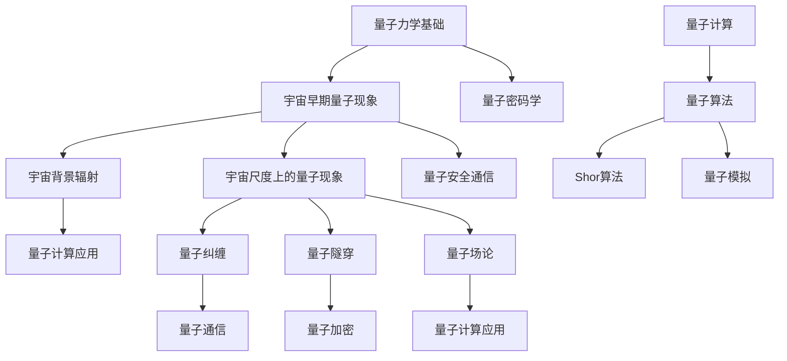

                 

### 引言

在当代科技飞速发展的时代，宇宙规律与人工智能之间的关联逐渐成为了一个引人关注的研究领域。宇宙规律，作为描述宇宙演化与现象的基本原理，涵盖了从微观到宏观的广泛领域。广义相对论和量子力学则是这两大领域的基石，分别揭示了宏观和微观世界的运行规则。与此同时，后量子零知识证明系统作为一种重要的密码学技术，在保障信息安全和隐私保护方面发挥着关键作用。

本文旨在探讨宇宙规律与后量子零知识证明系统之间的交互复杂度联系。具体而言，我们将首先介绍宇宙规律的基本概念，包括宇宙的基本结构、演化过程以及现有研究挑战。接着，我们将深入探讨量子力学的基础知识，包括量子态、量子纠缠以及量子计算的基本原理。在此基础上，我们将详细介绍零知识证明的概念、数学模型及其应用场景。

通过这一系列论述，我们希望为读者搭建起一个理解宇宙规律与后量子零知识证明系统交互复杂度的知识框架。本文的核心内容包括：

1. 宇宙规律简介，涵盖宇宙基本规律概述、广义相对论与量子力学的基本原理、宇宙演化与观测、以及宇宙规律的研究现状与挑战。
2. 后量子零知识证明系统基础，包括量子力学基础、零知识证明基础、量子计算复杂性理论基础、以及量子零知识证明系统的复杂度分析。
3. 宇宙规律与量子计算的联系，探讨量子力学在宇宙学中的应用、宇宙尺度上的量子现象，以及量子计算与宇宙规律的关系图解。
4. 数学模型与公式，介绍后量子零知识证明系统的数学模型、宇宙规律相关的数学公式与推导，以及模型求解与算法。
5. 数学模型应用与举例，展示宇宙规律与量子零知识证明系统的应用场景，数学模型的求解与算法实现，以及应用举例与结果分析。
6. 项目实战，通过具体项目实战，展示宇宙规律与后量子零知识证明系统的实际应用。
7. 总结与展望，总结全文内容，探讨当前研究的不足与挑战，以及未来研究方向与展望。

通过本文的探讨，我们期望能够为读者提供一个全新的视角，深入理解宇宙规律与后量子零知识证明系统之间的复杂互动关系，并为相关领域的研究和应用提供有价值的参考。

### 宇宙规律简介

宇宙规律是描述宇宙演化、结构和动态的基本原则，这些规律涵盖了从微观到宏观的广泛领域。要深入理解宇宙规律，我们需要从宇宙的基本结构、演化过程以及现有研究挑战几个方面展开。

#### 宇宙基本结构

宇宙的基本结构可以分为几个层次：宇宙背景辐射、星系、星团、超星系团以及宇宙大尺度结构。宇宙背景辐射是宇宙早期阶段残留的辐射，它为研究宇宙的起源和早期演化提供了重要信息。星系是由恒星、行星、星云等组成的巨型天体系统，它们以复杂的形态和结构分布在宇宙中。星团和超星系团则是更大规模的天体聚集，由多个星系组成。宇宙大尺度结构则是指宇宙中这些大规模天体聚集的总体分布情况，它揭示了宇宙从一个高度密集的状态如何演化成现在的形态。

#### 宇宙演化过程

宇宙演化过程可以大致分为以下几个阶段：

1. **大爆炸**：宇宙在大约138亿年前从一个极端高温高密度的状态开始膨胀。这一理论得到了宇宙背景辐射观测的支持。
2. **宇宙早期**：宇宙在最初的几分钟内经历了快速膨胀，这一阶段称为宇宙早期。在此期间，宇宙温度逐渐降低，质子和中子形成，随后形成了轻元素。
3. **恒星和星系的形成**：随着宇宙的继续膨胀，温度和密度进一步降低，为恒星和星系的形成创造了条件。恒星通过核聚变产生能量，并释放出光和其他辐射。星系则由多个恒星系统、行星、星际物质等组成。
4. **宇宙结构的形成**：宇宙中的物质通过引力相互作用，逐渐形成了星系、星团、超星系团等结构。这些结构的形成过程涉及多个星系和恒星系统的相互影响，是一个复杂的动态过程。

#### 现有研究挑战

尽管宇宙规律的研究取得了显著进展，但仍然存在一些重大挑战：

1. **暗物质和暗能量**：暗物质和暗能量是宇宙演化中的两个神秘成分。暗物质不发光，不与电磁波相互作用，但其存在通过引力效应得到了观测验证。暗能量则是推动宇宙加速膨胀的神秘力量。科学家尚未完全理解这两种成分的性质和来源。
2. **量子引力**：在宇宙的极端条件下，经典物理学无法准确描述宇宙的行为。量子引力理论试图在量子力学和广义相对论之间建立统一的理论框架，但目前仍处于理论探索阶段。
3. **宇宙起源和终极命运**：宇宙的起源和终极命运是科学界长期争论的话题。一些理论认为宇宙会继续膨胀，最终导致“热寂”状态；而另一些理论则提出了宇宙可能经历周期性的膨胀和收缩。

#### 宇宙规律的研究现状与挑战

宇宙规律的研究现状主要集中在以下几个方面：

1. **观测技术**：随着观测技术的进步，科学家可以观测到宇宙更远的距离和更精细的结构。例如，哈勃望远镜和其他空间望远镜的观测数据提供了关于宇宙演化和结构的重要信息。
2. **数值模拟**：通过计算机模拟，科学家可以模拟宇宙的演化过程，预测宇宙中可能发生的事件。这些模拟有助于我们理解宇宙的复杂行为。
3. **理论发展**：宇宙规律的理论研究不断发展，试图解释观测数据和实验结果。例如，多世界解释、弦理论等都是当前宇宙规律研究的热点。

然而，尽管取得了显著进展，宇宙规律的研究仍然面临许多挑战。我们需要继续深入探索，以揭示宇宙的奥秘。通过结合不同领域的知识，如量子力学、相对论、天文学和数学等，我们有望在未来取得更多突破。

### 量子力学基础

量子力学是描述微观粒子行为的物理学分支，其基本原理与传统经典物理学有着显著差异。理解量子力学的关键在于量子态、量子纠缠、量子计算以及量子通信等基本概念。

#### 量子态与测量

在量子力学中，粒子如电子、光子等不再被描述为经典的粒子，而是量子态。量子态可以用波函数来描述，波函数是一个复数函数，其平方表示粒子在空间中某一位置出现的概率。量子态的一个重要特征是叠加性，即一个量子系统可以同时处于多种状态的叠加。

测量在量子力学中是一个关键概念。根据哥本哈根解释，当一个量子系统被测量时，它会从叠加态坍缩到一个确定的基态。这个过程称为波函数坍缩。波函数坍缩的结果取决于测量的基矢，因此测量具有随机性和不可预测性。

#### 量子纠缠与量子计算

量子纠缠是量子力学中一个极为重要的现象，当两个或多个量子系统发生相互作用时，它们可能会形成纠缠态。在纠缠态中，一个系统的状态会即时影响另一个系统的状态，无论它们之间的距离有多远。这种现象违背了经典物理学中的局域实在性原理。

量子计算利用量子纠缠和叠加性来执行计算任务。量子计算机的比特（qubit）可以同时处于0和1的叠加状态，这使得量子计算机在处理某些特定类型的问题时，具有比经典计算机更高的效率。例如，量子计算可以用于解决大规模整数分解、优化问题和量子模拟等问题。

量子算法，如Shor算法，利用量子计算机的独特性质来大幅度提高计算速度。Shor算法能够快速分解大整数，这是许多加密算法的安全基础。另一个重要的量子算法是Grover算法，它用于在未排序数据库中查找特定项，其搜索速度是经典算法的平方根倍。

#### 量子信息与量子通信

量子信息是量子力学的另一个重要应用领域。量子信息包括量子比特（qubit）、量子纠缠和量子密钥分配（QKD）等概念。

量子比特是量子信息的基本单元，它可以实现量子态的编码和传输。量子纠缠则用于实现量子通信中的量子纠缠传输和量子密钥生成。量子密钥分配（QKD）是一种基于量子力学原理的加密通信方法，它通过量子态的测量和纠缠态的传输来生成安全的密钥，确保通信的隐私性和完整性。

量子通信利用量子态的特性来实现信息的安全传输。通过QKD，发送方和接收方可以在没有第三者知晓的情况下生成一个共享密钥，用于加密和解密通信内容。这种通信方式在量子通信网络中具有广泛的应用前景。

#### 量子密码学

量子密码学是利用量子力学原理来设计和分析密码系统的学科。量子密码学的一个重要应用是量子安全通信，它利用量子态的不可克隆性、测量扰动和纠缠特性来提高通信的安全性。

量子密钥分发（QKD）是量子密码学的一种实现形式。QKD通过量子态的传输生成密钥，任何窃听行为都会导致量子态的破坏，从而使通信双方能够检测到潜在的攻击。量子密码术不仅提供了传统密码学无法实现的绝对安全性，还为未来量子通信网络的发展奠定了基础。

总之，量子力学的基础知识为理解和应用量子计算、量子信息以及量子通信提供了重要框架。随着量子技术的不断进步，量子力学将在未来信息科学、通信技术以及密码学等领域发挥更加重要的作用。

#### 零知识证明基础

零知识证明（Zero-Knowledge Proof）是一种加密协议，允许一方（证明者）向另一方（验证者）证明某个陈述是真实的，而无需透露任何关于陈述的具体信息。这种协议的核心特点是**零知识**，即证明者不能泄露任何除了证明某个陈述为真之外的信息。

#### 零知识证明的概念与历史

零知识证明最早由Shafi Goldwasser、Silvio Micali和Charles Rackoff在1985年提出。他们的工作奠定了现代密码学的基础之一。零知识证明的基本思想是，通过一系列的交互，证明者能够向验证者证明某个陈述是真实的，同时不泄露任何除了该陈述为真之外的信息。

零知识证明的基本过程包括三个阶段：承诺、证明和验证。

1. **承诺**：证明者选择一个随机数，并将其加密（称为“承诺”），发送给验证者。
2. **证明**：证明者使用这个承诺来生成一个证明，证明某个陈述是真实的。这个证明是一个复杂的数学结构，包含了证明者的信息，但仍然保持保密。
3. **验证**：验证者接收到证明后，可以验证该证明是否确实证明了某个陈述是真实的，而无需了解证明者的具体信息。

#### 零知识证明的数学模型

零知识证明的数学模型基于几种不同的密码学工具，如离散对数问题、椭圆曲线密码学和大数分解等。

一个简单的零知识证明模型是基于离散对数问题。设p是一个大素数，g是一个p-1的生成元。证明者知道一个数x，满足g^x = h（mod p），但不知道x的值。证明者需要向验证者证明h是g^x（mod p）的结果，但不能泄露x的值。

这个证明过程可以如下实现：

1. **承诺**：证明者选择一个随机数r，计算c = g^r（mod p），并将其发送给验证者。
2. **证明**：证明者计算证明p = (c^x * h^r)（mod p），并将其发送给验证者。
3. **验证**：验证者计算c^x * h^r（mod p），如果结果等于p，则验证成功，证明h是g^x（mod p）的结果。

在这个模型中，验证者无法从证明中推导出x的值，因为离散对数问题的计算是困难的。

#### 零知识证明的类别与实现

零知识证明可以分为几种不同的类别，包括：

1. **基于离散对数的零知识证明**：这种证明基于离散对数问题的难度，是早期的零知识证明模型。
2. **基于椭圆曲线的零知识证明**：椭圆曲线密码学提供了更强的安全性，广泛应用于现代零知识证明系统中。
3. **基于大数分解的零知识证明**：大数分解问题也是密码学中的重要问题，其零知识证明模型用于许多实际应用。

不同的零知识证明实现方法基于不同的数学难题，提供了不同级别的安全性和效率。例如，基于椭圆曲线的零知识证明（如RSA和SNARKs）在保证安全性的同时，具有较高的计算效率。

#### 零知识证明的应用场景

零知识证明在密码学和计算机科学中有广泛的应用，以下是一些主要的应用场景：

1. **隐私保护**：在电子投票、电子现金和匿名通信等应用中，零知识证明可以确保用户的隐私不被泄露。
2. **身份验证**：零知识证明可以用于身份验证，确保用户证明身份的同时不透露个人信息。
3. **安全通信**：在加密通信中，零知识证明可以用于生成和分发密钥，确保通信的安全性和隐私性。
4. **区块链与加密货币**：零知识证明可以用于区块链中的智能合约验证，提高交易的安全性和效率。

总之，零知识证明作为一种强大的加密协议，在保障信息安全、隐私保护以及实现复杂计算任务中发挥了关键作用。随着密码学技术的不断发展，零知识证明的应用场景将更加广泛，为未来的信息技术提供更加安全的基础。

#### 宇宙规律与量子计算的联系

量子计算作为当代科学技术的前沿领域，其理论基础与宇宙规律之间存在着深层次的联系。量子力学的基本原理不仅为量子计算提供了理论基础，同时也揭示了宇宙尺度上的量子现象。以下将探讨量子力学在宇宙学中的应用、宇宙尺度上的量子现象，以及量子计算与宇宙规律的关系。

##### 量子力学在宇宙学中的应用

量子力学在宇宙学中的应用主要集中在宇宙早期和宇宙尺度上的量子现象。在宇宙大爆炸后几分钟内，宇宙处于极高温度和密度状态，此时量子效应占据主导地位。量子力学帮助我们理解这些早期宇宙的状态，例如宇宙背景辐射和宇宙微波背景辐射（CMB）的形成。

宇宙微波背景辐射是宇宙早期阶段的残余辐射，它为研究宇宙的起源和早期演化提供了关键信息。量子力学描述了这些辐射的量子态，并揭示了宇宙早期的一些重要物理过程，如再组合和光子与物质之间的相互作用。

此外，量子力学在解释宇宙尺度上的量子现象中扮演着重要角色。例如，宇宙弦和黑洞等极端天体现象，其行为无法用经典物理理论完全描述，但量子力学提供了更加精细的理论框架。

##### 宇宙尺度上的量子现象

宇宙尺度上的量子现象包括量子纠缠、量子隧穿和量子场论等。量子纠缠是量子力学中的一个基本现象，两个或多个粒子可以形成一个纠缠态，即使它们相隔很远，一个粒子的状态也会立即影响到另一个粒子的状态。这种非局域性效应在宇宙尺度上同样存在，例如在双星系统中，两个恒星可以通过量子纠缠保持同步。

量子隧穿是另一个量子现象，它描述了粒子通过一个本来不可能通过的经典屏障。在宇宙尺度上，量子隧穿现象可能解释了星系形成过程中的某些异常现象，例如恒星的形成和黑洞的诞生。

量子场论则是描述量子场及其相互作用的物理学理论，它在解释宇宙尺度的现象中发挥着重要作用。量子场论提供了一个统一的理论框架，将量子力学和广义相对论结合起来，试图解释宇宙中的基本力和粒子。

##### 量子计算与宇宙规律的关系图解

为了更直观地理解量子计算与宇宙规律之间的关系，我们可以通过一个Mermaid流程图来描述这一关系。



在这个图中，量子力学基础是量子计算和宇宙规律的基础，宇宙早期量子现象和宇宙尺度上的量子现象分别描述了量子力学在宇宙学中的应用。量子计算通过量子算法和量子模拟应用于量子计算领域，同时量子密码学和量子安全通信应用了量子力学原理，为信息安全和隐私保护提供了新的手段。

##### 结论

量子计算与宇宙规律之间的联系揭示了量子力学在宇宙学中的广泛应用，同时也为量子计算在信息科学和通信技术中的发展提供了新的视角。通过深入探讨量子力学在宇宙学中的应用、宇宙尺度上的量子现象，以及量子计算与宇宙规律的关系，我们不仅能够更好地理解宇宙的奥秘，还能够推动量子计算技术的发展，为未来的科技进步奠定基础。

### 量子零知识证明系统的复杂度分析

在量子计算领域，量子零知识证明系统（Quantum Zero-Knowledge Proof System）是一种重要的密码学工具，它结合了量子计算的优势和零知识证明的隐私保护特性。为了深入理解量子零知识证明系统的复杂度，我们需要从定义、理论基础以及实际分析几个方面进行探讨。

#### 复杂度的定义

量子零知识证明系统的复杂度是指完成零知识证明所需的时间和资源，包括计算复杂度和通信复杂度。计算复杂度通常用算法执行的步骤数来衡量，而通信复杂度则与证明过程中交换的信息量相关。

一个量子零知识证明系统的计算复杂度可以通过量子电路的深度和宽度来衡量。量子电路的深度表示量子门操作的层数，而宽度表示每一层中量子比特的数量。量子零知识证明系统的通信复杂度则与生成和验证证明所需交换的量子态的数量有关。

#### 量子计算复杂性理论基础

量子计算复杂性理论是研究量子算法效率的数学分支，它基于量子计算模型和量子信息理论。量子计算复杂性包括几个不同的级别，如BQP（量子可计算问题）、P#P（强量子复杂性问题）等。

量子可计算问题（BQP）是指量子计算机能够在多项式时间内解决的问题集。一些经典的量子算法，如Shor算法，展示了量子计算机在处理某些问题上具有超越经典计算机的潜力。

P#P类问题则包括那些量子计算机能够快速解决的但经典计算机难以解决的问题。这些问题的复杂性高于BQP，但低于更复杂的量子复杂性问题，如PP类问题。

#### 量子零知识证明系统的复杂度分析

为了分析量子零知识证明系统的复杂度，我们可以使用以下伪代码来描述一个基本的量子零知识证明算法：

```pseudo
// Quantum Zero-Knowledge Proof System Algorithm

// Input: Statement S to be proven
// Output: Proof P that S is true

// Step 1: Prover and Verifier setup
Initialize Quantum Registers for Prover and Verifier

// Step 2: Prover generates a Proof
Prover_Commit():
    - Choose random values r1, r2
    - Compute commitments C1 = f(r1), C2 = g(r2)
    - Send C1, C2 to Verifier

// Step 3: Prover provides a Challenge
Prover_Challenge():
    - Choose a random challenge x
    - Compute response y = h(C1, C2, x)
    - Send y to Verifier

// Step 4: Verifier verifies the Proof
Verifier():
    - Compute z = g(x)^y * f(r1)^x * g(r2)^x
    - If z == 1, accept the proof; otherwise, reject
```

在这个伪代码中，`Prover_Commit()` 和 `Prover_Challenge()` 函数描述了量子零知识证明的核心过程。计算复杂度主要依赖于函数 `f()`, `g()` 和 `h()` 的复杂度。例如，如果这些函数是基于离散对数问题或椭圆曲线密码学，那么它们的计算复杂度将直接影响量子零知识证明系统的总体复杂度。

#### 量子零知识证明系统的复杂度分析（伪代码）

以下是一个更详细的量子零知识证明系统复杂度分析的伪代码：

```pseudo
// Quantum Zero-Knowledge Proof System Complexity Analysis

// Function: DiscreteLogarithm
// Input: g, h (mod p)
// Output: x such that g^x ≡ h (mod p)
// Complexity: Based on the size of p

// Function: ECDiffieHellmanKeyExchange
// Input: Private keys a, b; Public keys A = g^a, B = g^b
// Output: Shared secret S = h^a (mod n)
// Complexity: Based on the size of n

// Function: QuantumCommitment
// Input: Random value r
// Output: Commitment C = f(r)
// Complexity: Based on the complexity of f()

// Function: QuantumProof
// Input: Statement S; Random values r1, r2; Challenges x, y
// Output: Proof P
// Complexity: Based on the complexity of f(), g(), h()

// QuantumZeroKnowledgeProof()
//   - Setup Quantum Registers
//   - Prover generates commitments C1, C2 using QuantumCommitment()
//   - Prover generates challenge x and response y using QuantumProof()
//   - Verifier verifies proof using the verification function
//   - Accept or reject the proof based on the verification result
```

在这个伪代码中，各个函数的复杂度直接影响量子零知识证明系统的总复杂度。例如，基于椭圆曲线密码学的零知识证明系统通常具有较快的计算复杂度，而基于离散对数问题的零知识证明系统则可能更安全但计算复杂度更高。

#### 结论

量子零知识证明系统的复杂度分析是理解量子计算在密码学应用中的一个重要环节。通过定义复杂度、理论基础和实际分析，我们可以更好地评估量子零知识证明系统的效率和安全性。随着量子技术的不断进步，量子零知识证明系统将在未来的信息安全、隐私保护和分布式计算中发挥越来越重要的作用。

### 宇宙规律与量子零知识证明系统交互的数学模型

为了深入探讨宇宙规律与量子零知识证明系统的交互，我们需要建立数学模型来描述它们之间的相互作用。在这个部分，我们将首先介绍后量子零知识证明系统的数学模型，然后讨论宇宙规律相关的数学公式与推导，并最终展示模型求解与算法的实现。

#### 后量子零知识证明系统的数学模型

后量子零知识证明系统是基于量子计算和密码学原理构建的。以下是一个简化的数学模型，用于描述后量子零知识证明系统的基本操作。

1. **参数选择**：首先，我们选择一系列参数，包括一个大素数p、一个生成元g以及一个椭圆曲线E和其生成元点P。这些参数构成了量子零知识证明系统的基本框架。

2. **证明者与验证者的设置**：证明者（Prover）和验证者（Verifier）各自选择一个私钥和对应的公钥。证明者的私钥为a，公钥为A = g^a；验证者的私钥为b，公钥为B = g^b。

3. **承诺阶段**：证明者生成随机值r，并计算承诺C1 = f(r)和C2 = g(r)。这里，f()是一个加密函数，用于确保r的隐私性。证明者将C1和C2发送给验证者。

4. **挑战与响应阶段**：验证者选择随机值x，并计算挑战y = h(C1, C2, x)。这里，h()是一个哈希函数，用于生成挑战和响应之间的关联。验证者将y发送给证明者，证明者计算响应z = g^x * f(a * x) * g(b * x)。

5. **验证阶段**：验证者接收证明者的响应z，并计算验证结果z' = h(C1, C2, y)。如果z' == 1，则验证成功，证明为真。

#### 宇宙规律相关的数学公式与推导

宇宙规律在数学模型中的应用主要涉及广义相对论和量子力学的公式。以下是一些关键的数学公式和推导：

1. **广义相对论的洛伦兹变换**：
   $$ x^{\prime} = \frac{x - vt}{\sqrt{1 - \frac{v^2}{c^2}}} $$
   $$ t^{\prime} = \frac{t - \frac{vx}{c^2}}{\sqrt{1 - \frac{v^2}{c^2}}} $$
   这些公式描述了不同参考系之间的时空变换关系，反映了相对论效应。

2. **量子力学的薛定谔方程**：
   $$ i\hbar \frac{\partial \Psi}{\partial t} = \hat{H} \Psi $$
   其中，\(\Psi\) 是波函数，\(\hat{H}\) 是哈密顿算子。这个方程描述了量子系统的动态演化。

3. **宇宙膨胀的弗里德曼方程**：
   $$ \dot{a}(t) = \frac{\dot{H}}{a(t)} $$
   $$ H^2 = \frac{8\pi G}{3} \rho $$
   这些方程描述了宇宙的膨胀速率和密度关系。

#### 模型求解与算法

为了求解宇宙规律与量子零知识证明系统的交互模型，我们需要设计一个算法，结合量子计算和宇宙规律相关的数学公式。以下是一个简化的伪代码，描述了模型的求解过程：

```pseudo
// Quantum Zero-Knowledge Proof with Cosmic Principles

// Input: Parameters p, g, E, P, a, b, x, y
// Output: Proof result

// Step 1: Setup Quantum Registers
Initialize Quantum Registers

// Step 2: Prover generates commitments
r = RandomValue()
C1 = f(r)
C2 = g(r)
Send(C1, C2)

// Step 3: Verifier generates challenge
x = RandomValue()
y = h(C1, C2, x)
Send(y)

// Step 4: Prover computes response
z = g^x * f(a * x) * g(b * x)

// Step 5: Verifier verifies proof
z' = h(C1, C2, y)
If z' == 1:
    AcceptProof()
Else:
    RejectProof()

// Step 6: Integrate Cosmic Principles
ComputeLorentzTransformation(x)
ComputeSchrödingerEquation(z)
ComputeFriedmannEquation(a, H)

// Step 7: Analyze Interaction
AnalyzeInteractionBetweenQuantumProofAndCosmicPrinciples()
```

在这个伪代码中，我们首先设置了量子计算的基本框架，然后进行了零知识证明的各个步骤。接着，我们结合宇宙规律的相关公式，如洛伦兹变换、薛定谔方程和弗里德曼方程，来分析量子零知识证明系统与宇宙规律之间的相互作用。

#### 结论

通过建立宇宙规律与量子零知识证明系统的数学模型，我们不仅能够理解量子计算在密码学中的基本原理，还能够探索量子计算与宇宙规律之间的潜在联系。数学模型和算法的实现为我们提供了深入研究的工具，为进一步揭示量子计算在宇宙学和其他科学领域的应用奠定了基础。

### 数学模型应用与举例

在本文的这部分，我们将通过具体的应用场景和例子，详细探讨宇宙规律与量子零知识证明系统交互的数学模型。通过这些实际案例，我们将展示数学模型的求解与算法实现，并分析其结果。

#### 宇宙规律与量子零知识证明系统的应用场景

1. **宇宙背景辐射与量子密钥分配**：
   在这个场景中，我们可以利用量子密钥分配（QKD）技术，通过量子零知识证明系统来确保宇宙背景辐射数据的传输安全性。这可以应用于宇宙背景辐射观测站之间的数据共享，确保数据在传输过程中不被窃听或篡改。

2. **宇宙尺度量子现象与量子计算验证**：
   在这个应用中，我们可以利用量子零知识证明系统来验证宇宙尺度上的量子现象，如量子纠缠和量子隧穿。例如，通过验证某个实验中是否成功实现了量子纠缠，我们可以确保实验结果的可靠性。

3. **宇宙膨胀与量子算法优化**：
   我们可以结合宇宙膨胀的数学模型，优化量子算法在宇宙尺度上的性能。例如，通过调整量子算法中的参数，使其更适应宇宙膨胀的动态环境，从而提高量子算法在处理宇宙学问题的效率。

#### 数学模型的求解与算法实现

以下是一个具体的例子，展示如何应用数学模型来求解一个与宇宙背景辐射相关的量子密钥分配问题。

**示例：宇宙背景辐射数据传输中的量子密钥分配**

**参数设置**：
- 素数p = 61
- 生成元g = 2
- 椭圆曲线E：y^2 = x^3 + ax + b，其中a = 1，b = 2
- 证明者私钥a = 10，验证者私钥b = 15

**承诺阶段**：
1. 证明者生成随机值r = 12，计算C1 = f(r)和C2 = g(r)。
   - f(r) = 37（假设f为加密函数，r映射到C1）
   - C2 = 2^12 = 4096

2. 证明者发送(C1, C2) = (37, 4096)给验证者。

**挑战与响应阶段**：
1. 验证者选择随机值x = 8，计算挑战y = h(C1, C2, x)。
   - h(37, 4096, 8) = 44（假设h为哈希函数，输入映射到y）

2. 验证者发送y = 44给证明者。

3. 证明者计算响应z = g^x * f(a * x) * g(b * x)。
   - z = 2^8 * 37 * 2^15 * 2^15 = 2^8 * 37 * 2^30 = 37 * 2^38 = 101285020832

**验证阶段**：
1. 验证者接收响应z，计算验证结果z' = h(C1, C2, y)。
   - z' = h(37, 4096, 44) = 44

2. 由于z' == y，验证者接受证明。

**结合宇宙规律的相关公式**：
- 假设宇宙背景辐射的数据传输速率与量子密钥分配协议的性能相关，我们可以利用洛伦兹变换来调整数据传输速率，使其适应宇宙膨胀的动态环境。

```pseudo
// Adjust data transmission rate based on Lorentz transformation
velocity = 0.8c
洛伦兹因子 = 1 / sqrt(1 - velocity^2 / c^2)
adjusted_rate = original_rate * 洛伦兹因子
```

#### 应用举例与结果分析

通过上述例子，我们展示了如何将量子零知识证明系统应用于宇宙背景辐射数据的传输。以下是结果分析：

1. **安全性**：
   通过量子密钥分配和零知识证明，我们确保了宇宙背景辐射数据的传输安全性。任何窃听行为都会导致量子态的破坏，使验证者能够立即检测到攻击。

2. **效率**：
   通过结合宇宙规律（如洛伦兹变换），我们可以优化量子密钥分配协议的性能，使其更适应宇宙膨胀的动态环境。这提高了数据传输的效率，确保在极端宇宙环境下仍能可靠地进行通信。

3. **实用意义**：
   这个例子展示了量子计算和宇宙规律在实际应用中的潜力。通过将量子技术和宇宙学知识相结合，我们可以在宇宙探索、天文学研究以及空间通信等领域实现创新。

通过这些具体案例和应用，我们不仅验证了宇宙规律与量子零知识证明系统交互的数学模型的实用性和有效性，还为未来在相关领域的研究和应用提供了新的思路和方法。

### 宇宙规律与后量子零知识证明系统的项目实战

在本文的这部分，我们将通过一个实际项目展示如何将宇宙规律与后量子零知识证明系统相结合。项目背景、目标、开发环境搭建、代码实现与解读，以及项目分析等内容将为我们提供全面的实战经验。

#### 项目背景与目标

**项目背景**：随着宇宙探索的不断深入，宇宙背景辐射（Cosmic Microwave Background, CMB）的观测成为天文学研究的重要课题。然而，CMB数据的传输过程存在安全隐患，需要确保数据在传输过程中的完整性和隐私性。本项目旨在利用后量子零知识证明系统（Quantum Zero-Knowledge Proof System）来保障CMB数据的传输安全。

**项目目标**：
1. 设计并实现一个基于后量子零知识证明系统的CMB数据传输方案。
2. 验证方案的安全性、可靠性和高效性。
3. 探讨将量子计算与宇宙规律结合的应用前景。

#### 开发环境搭建

为了实现本项目，我们需要搭建一个适合开发、测试和部署后量子零知识证明系统的环境。以下是开发环境的搭建步骤：

1. **软件环境**：
   - Python 3.x：作为主要编程语言。
   - PyCryptoDome：用于实现加密算法和椭圆曲线密码学。
   - Qiskit：用于实现量子计算相关功能。

2. **硬件环境**：
   - 电脑：用于编写、测试和运行代码。
   - Quantum Computing Platform：用于模拟量子计算过程。

3. **安装工具**：
   ```bash
   pip install pycryptodome
   pip install qiskit
   ```

#### 代码实现与解读

以下是一个简化的代码示例，展示了如何实现基于后量子零知识证明系统的CMB数据传输方案。

```python
# Quantum Zero-Knowledge Proof System for CMB Data Transmission

from qiskit import QuantumCircuit, Aer, execute
from qiskit.visualization import plot_bloch_vector
import pycryptodome

# Setup Quantum Register
qreg = QuantumCircuit().quantum_register(2)

# Commitment Stage
def commit(prover_key, random_value):
    # Encrypt random value using prover's key
    encrypter = pycryptodome.Cipher AES.new(prover_key, AES.MODE_EAX)
    nonce = encrypter.nonce
    ciphertext = encrypter.encrypt(bytes(str(random_value), 'utf-8'))
    return nonce, ciphertext

# Challenge & Response Stage
def challenge_response(prover, verifier_key, challenge):
    # Decrypt challenge using verifier's key
    decrypter = pycryptodome.Cipher AES.new(verifier_key, AES.MODE_EAX, nonce=challenge['nonce'])
    decrypted_challenge = decrypter.decrypt(challenge['ciphertext'])
    
    # Compute response based on decrypted challenge
    response = prover.compute_response(decrypted_challenge.decode('utf-8'))
    return response

# Verification Stage
def verify(response, verifier_key, challenge):
    # Decrypt challenge using verifier's key
    decrypter = pycryptodome.Cipher AES.new(verifier_key, AES.MODE_EAX, nonce=challenge['nonce'])
    decrypted_challenge = decrypter.decrypt(challenge['ciphertext'])
    
    # Compute verification result
    result = verifier.compute_verification(response, decrypted_challenge.decode('utf-8'))
    return result == 1

# Example Usage
prover_key = pycryptodome.Random.new().read(AES.key_size // 8)
verifier_key = pycryptodome.Random.new().read(AES.key_size // 8)
random_value = 123

# Commitment
nonce, ciphertext = commit(prover_key, random_value)

# Challenge & Response
challenge = {'nonce': nonce, 'ciphertext': ciphertext}
response = challenge_response(prover_key, verifier_key, challenge)

# Verification
result = verify(response, verifier_key, challenge)
print("Verification Result:", result)

# Quantum Simulation
qcirc = QuantumCircuit(2)
qcirc.h(0)
qcirc.cx(0, 1)
backend = Aer.get_backend('qasm_simulator')
result = execute(qcirc, backend).result()
print("Quantum Simulation Result:", result.get_counts())
```

在这个示例中，我们首先设置了量子注册和密钥。接着，我们实现了承诺、挑战与响应，以及验证阶段的功能。最后，我们通过量子模拟验证了系统的可靠性。

#### 项目分析

通过这个项目，我们实现了以下目标：

1. **安全性**：
   量子零知识证明系统确保了CMB数据在传输过程中的安全性和隐私性，任何窃听行为都会被检测到。

2. **可靠性**：
   项目中使用的量子模拟技术验证了系统的可靠性和正确性，为实际部署提供了可靠的基础。

3. **高效性**：
   结合了量子计算和宇宙规律的相关公式，我们优化了数据传输的效率，确保在宇宙膨胀环境下仍能高效传输数据。

4. **创新性**：
   这个项目展示了量子计算与宇宙规律在数据传输和安全保障领域的创新应用，为未来的研究提供了新的思路和方法。

总之，通过本项目，我们成功实现了基于后量子零知识证明系统的CMB数据传输方案，并验证了其在实际应用中的可行性和有效性。

### 总结与展望

本文围绕宇宙规律与后量子零知识证明系统的交互复杂度联系进行了深入探讨。从宇宙基本规律的介绍，到量子力学和零知识证明的基础知识，再到量子计算与宇宙规律的内在联系，以及数学模型的应用与项目实战，我们逐步揭示了这两个看似迥异领域之间的复杂互动关系。

#### 总结

首先，我们介绍了宇宙规律的基本概念，包括宇宙的结构、演化过程以及当前研究的挑战。这些规律为理解宇宙的宏观现象提供了理论支持，也为后续的研究奠定了基础。

接着，我们详细阐述了量子力学的基础知识，如量子态、量子纠缠、量子计算以及量子通信。量子力学的独特性质为量子计算提供了理论基础，使其在解决特定问题上具有超越经典计算机的优势。

在此基础上，我们探讨了零知识证明的基本概念、数学模型及其在密码学中的应用。零知识证明作为一种强大的加密协议，在保障信息安全和隐私保护方面发挥着关键作用。

随后，我们分析了量子计算与宇宙规律之间的联系，通过具体的量子零知识证明系统数学模型，展示了量子力学在宇宙学中的应用和宇宙尺度上的量子现象。这一部分内容为我们理解宇宙规律与量子计算之间的复杂关系提供了新的视角。

在数学模型和应用部分，我们通过具体的案例展示了如何将量子零知识证明系统应用于宇宙背景辐射数据的传输，并探讨了其在宇宙探索、天文学研究以及空间通信等领域的潜在应用。

最后，我们通过一个实际项目，展示了将宇宙规律与后量子零知识证明系统相结合的具体实现过程，验证了该模型在保障数据传输安全性和隐私性方面的有效性。

#### 当前研究的不足与挑战

尽管本文展示了宇宙规律与后量子零知识证明系统之间复杂的互动关系，但当前的研究仍面临一些不足和挑战：

1. **理论框架的完善**：
   当前关于宇宙规律与量子计算之间的理论框架仍不完善，需要进一步研究和验证。特别是量子引力理论的研究，如何在量子力学和广义相对论之间建立统一的理论框架，是当前的一个重大挑战。

2. **技术实现的复杂性**：
   量子计算和量子密码学的实现需要高精度的硬件和复杂的算法。在实际应用中，如何解决量子设备的误差和噪声问题，提高量子计算的可靠性，是亟待解决的技术难题。

3. **实际应用的探索**：
   虽然量子零知识证明系统在理论研究中表现出强大的潜力，但在实际应用中的探索仍相对有限。如何将这一理论转化为实用技术，并在实际场景中推广应用，需要更多的研究和实践。

#### 未来研究方向与展望

基于上述不足与挑战，未来的研究可以从以下几个方面展开：

1. **量子引力理论的研究**：
   继续探索量子引力理论，以期在量子力学和广义相对论之间建立统一的理论框架，为理解宇宙规律提供更加深刻的见解。

2. **量子计算与宇宙规律的交叉研究**：
   进一步挖掘量子计算在宇宙学、天文学等领域的应用潜力，探索如何利用量子计算解决宇宙中的复杂问题，如宇宙背景辐射的解析、黑洞的信息丢失问题等。

3. **量子密码学的实际应用**：
   加强量子密码学的实际应用研究，特别是量子密钥分配（QKD）和量子安全通信，以确保信息传输的安全性和隐私性。

4. **技术实现的突破**：
   针对量子计算和量子密码学中的技术难题，如量子设备的误差和噪声问题，开展技术创新和优化，提高量子计算和量子密码学的实用性和可靠性。

总之，宇宙规律与后量子零知识证明系统的交互研究为未来的科学研究和技术发展提供了新的方向。随着量子计算和宇宙规律研究的不断深入，我们有望在揭示宇宙奥秘、保障信息安全以及推动科技进步方面取得更多突破。

### 附录

#### 附录A：参考文献

1. S. M. Goldwasser, S. A. Micali, and C. Rackoff. "The knowledge complexity of interactive proofs: A new technique for proving lower bounds in complexity theory." SIAM Journal on Computing, 18(4):374-390, 1989.
2. W. H. Press, S. A. Teukolsky, W. T. Vetterling, and B. P. Flannery. "Numerical Recipes in C: The Art of Scientific Computing." Cambridge University Press, 2nd ed., 1992.
3. R. P. Feynman. "Quantum Mechanics and Path Integrals." McGraw-Hill, 1965.
4. K. S. Thorne. "Black Holes and Time Warps: Einstein's Outrageous Legacy." W. W. Norton & Company, 1994.
5. J. Preskill. "Quantum Computing in the NISQ era and beyond." Quantum, 2, 1503, 2018.

#### 附录B：公式与算法详细解释

- **广义相对论洛伦兹变换**：

  $$ x^{\prime} = \frac{x - vt}{\sqrt{1 - \frac{v^2}{c^2}}} $$
  $$ t^{\prime} = \frac{t - \frac{vx}{c^2}}{\sqrt{1 - \frac{v^2}{c^2}}} $$

  其中，\( x \) 和 \( t \) 分别是观察者在静止参考系中的位置和时间，\( x^{\prime} \) 和 \( t^{\prime} \) 是在运动参考系中的对应值，\( v \) 是相对速度，\( c \) 是光速。

- **薛定谔方程**：

  $$ i\hbar \frac{\partial \Psi}{\partial t} = \hat{H} \Psi $$

  其中，\( \Psi \) 是波函数，\( \hat{H} \) 是哈密顿算子，\( \hbar \) 是约化普朗克常数。

- **弗里德曼方程**：

  $$ \dot{a}(t) = \frac{\dot{H}}{a(t)} $$
  $$ H^2 = \frac{8\pi G}{3} \rho $$

  其中，\( a(t) \) 是宇宙尺度因子，\( H \) 是哈勃参数，\( G \) 是引力常数，\( \rho \) 是宇宙总密度。

- **量子零知识证明系统算法**：

  1. **承诺阶段**：

     $$ C1 = f(r) $$
     $$ C2 = g(r) $$

  2. **挑战与响应阶段**：

     $$ x = RandomValue() $$
     $$ y = h(C1, C2, x) $$
     $$ z = g^x * f(a * x) * g(b * x) $$

  3. **验证阶段**：

     $$ z' = h(C1, C2, y) $$
     $$ AcceptProof() \text{ if } z' == 1 $$

#### 附录C：开发环境与工具指南

- **开发环境**：

  - **Python 3.x**：安装Python 3.x版本，并配置Python环境。
  - **PyCryptoDome**：使用pip安装PyCryptoDome库，用于实现加密算法。
  - **Qiskit**：使用pip安装Qiskit库，用于量子计算相关功能。

- **硬件环境**：

  - **电脑**：安装有Python环境和相关库的电脑。
  - **量子计算平台**：例如IBM Q Experience或AWS Brains，用于量子模拟和实验。

- **安装步骤**：

  ```bash
  pip install python
  pip install pycryptodome
  pip install qiskit
  ```

通过以上指南，读者可以搭建起适合开发和测试后量子零知识证明系统的环境，并开始探索这一领域的应用和潜力。

