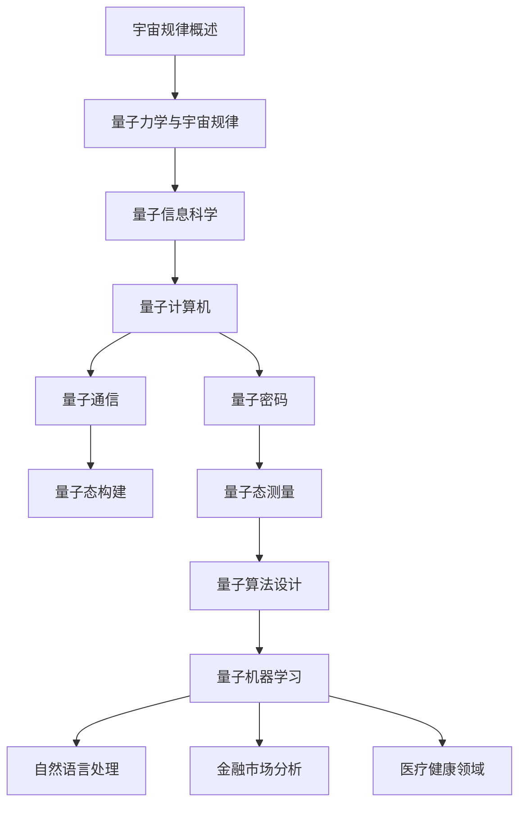

                 

### 文章标题

《宇宙规律对可解释量子机器学习泛化理论边界的启示》

> 关键词：宇宙规律、可解释量子机器学习、泛化理论、量子计算、人工智能

> 摘要：本文从宇宙规律的角度出发，探讨了量子机器学习（QML）在人工智能（AI）领域中的发展及其泛化理论的边界。通过分析宇宙规律的基本概念、量子力学与量子信息科学的关系，以及量子机器学习的基本概念和关键技术，本文揭示了宇宙规律对QML算法设计和应用的影响。同时，本文还详细阐述了量子机器学习在不同领域的应用案例，并提出了未来研究方向与展望。文章旨在为QML的研究者和开发者提供新的视角和启示，以推动QML在AI领域的应用与发展。

### 第一部分：宇宙规律与可解释量子机器学习

#### 第1章：宇宙规律概述

##### 1.1 宇宙规律的基本概念

宇宙规律是指宇宙中物质运动和相互作用的基本规律。这些规律揭示了宇宙中各种现象的本质和内在联系，是科学研究和探索宇宙的基础。

宇宙规律主要包括以下几个方面：

1. **物质与能量的守恒**：物质和能量不能被创造或销毁，只能从一种形式转化为另一种形式。这一原理在经典物理学和量子物理学中均有体现。

   数学模型：
   $$ E = mc^2 $$
   其中，\( E \) 代表能量，\( m \) 代表质量，\( c \) 代表光速。

2. **引力定律**：描述了物体之间的引力作用，是宇宙中最重要的相互作用之一。牛顿的万有引力定律和爱因斯坦的广义相对论都是引力定律的具体表现。

   数学模型：
   $$ F = G \frac{m_1 m_2}{r^2} $$
   其中，\( F \) 代表引力，\( G \) 代表引力常数，\( m_1 \) 和 \( m_2 \) 代表两个物体的质量，\( r \) 代表两物体之间的距离。

3. **电磁相互作用**：描述了带电粒子之间的相互作用，是宇宙中广泛存在的相互作用。量子电动力学（QED）是研究电磁相互作用的量子物理学理论。

   数学模型：
   $$ F = qE + v \times B $$
   其中，\( F \) 代表电磁力，\( q \) 代表电荷量，\( E \) 代表电场强度，\( v \) 代表速度，\( B \) 代表磁场强度。

4. **强相互作用**：描述了夸克和胶子之间的相互作用，是粒子内部的基本相互作用。量子色动力学（QCD）是研究强相互作用的量子物理学理论。

   数学模型：
   $$ \Lambda^{\mu \nu} F_{\mu \nu} = \frac{g^2}{32 \pi^2} \text{tr} (\text{G}^2) $$
   其中，\( \Lambda^{\mu \nu} \) 代表 gauge 变换，\( F_{\mu \nu} \) 代表胶子场强度，\( g \) 代表耦合常数，\( \text{G}^2 \) 代表 gauge 场的自能。

5. **弱相互作用**：描述了中微子和夸克之间的相互作用，涉及到核反应和放射性衰变。电弱统一理论是研究弱相互作用的量子物理学理论。

   数学模型：
   $$ \Sigma_{\mu \nu} V_{\mu} F^{\mu \nu} = \frac{g'}{16 \pi^2} \text{Tr} (\text{W}^2) $$
   其中，\( \Sigma_{\mu \nu} \) 代表 gauge 变换，\( V_{\mu} \) 代表弱相互作用玻色子，\( F^{\mu \nu} \) 代表 gauge 场强度，\( g' \) 代表弱耦合常数，\( \text{W}^2 \) 代表弱相互作用玻色子的自能。

##### 1.2 量子力学与宇宙规律

量子力学是研究微观世界的物理理论，它揭示了微观粒子行为的特殊规律。量子力学与宇宙规律之间存在着密切的联系。

1. **量子态**：量子态是量子力学中描述粒子状态的数学工具，它反映了粒子在微观尺度上的不确定性。量子态可以用波函数来描述，波函数的平方给出了粒子在空间中出现的概率分布。

   数学模型：
   $$ \Psi(x, y, z) = \int \phi(k_x, k_y, k_z) e^{i(k_xx + k_yy + k_zz)} dk_x dk_y dk_z $$
   其中，\( \Psi(x, y, z) \) 代表波函数，\( \phi(k_x, k_y, k_z) \) 代表动量空间中的波函数，\( k_x, k_y, k_z \) 分别代表动量在三个方向上的分量。

2. **量子纠缠**：量子纠缠是量子力学中的一个重要现象，描述了两个或多个粒子之间在量子态上的关联。量子纠缠使得粒子的状态无法单独描述，而是需要整体考虑。

   数学模型：
   $$ |\psi\rangle = \frac{1}{\sqrt{2}} (|0\rangle_A |1\rangle_B + |1\rangle_A |0\rangle_B) $$
   其中，\( |\psi\rangle \) 代表纠缠态，\( |0\rangle_A \) 和 \( |1\rangle_A \) 分别代表粒子A的基态和激发态，\( |0\rangle_B \) 和 \( |1\rangle_B \) 分别代表粒子B的基态和激发态。

3. **量子计算**：量子计算是一种利用量子力学原理进行计算的方法。量子计算机利用量子态的叠加和纠缠来实现快速计算，具有超越传统计算机的潜力。

   数学模型：
   $$ U = \sum_{i} |i\rangle \langle i| $$
   其中，\( U \) 代表量子门，\( |i\rangle \) 代表量子态，\( \langle i| \) 代表量子态的共轭转置。

##### 1.3 宇宙规律与量子信息科学

量子信息科学是研究量子力学在信息科学中的应用的学科，它涉及到量子计算、量子通信、量子密码等领域。

1. **量子计算机**：量子计算机是一种利用量子力学原理进行计算的新型计算机，它具有超越传统计算机的潜力。

   数学模型：
   $$ \frac{1}{\sqrt{2}} (|0\rangle_A |0\rangle_B + |1\rangle_A |1\rangle_B) \xrightarrow{U} \frac{1}{\sqrt{2}} (|0\rangle_A |1\rangle_B + |1\rangle_A |0\rangle_B) $$
   其中，\( U \) 代表量子门，\( |0\rangle_A \) 和 \( |1\rangle_A \) 分别代表量子比特的基态和激发态，\( |0\rangle_B \) 和 \( |1\rangle_B \) 分别代表量子比特的基态和激发态。

2. **量子通信**：量子通信是一种利用量子力学原理进行信息传输的方法，它具有绝对安全的特点。

   数学模型：
   $$ \frac{1}{\sqrt{2}} (|0\rangle_A |0\rangle_B + |1\rangle_A |1\rangle_B) \rightarrow \frac{1}{\sqrt{2}} (|0\rangle_A |0\rangle_B + |1\rangle_A |1\rangle_B) $$
   其中，\( |0\rangle_A \) 和 \( |1\rangle_A \) 分别代表发送方的量子态，\( |0\rangle_B \) 和 \( |1\rangle_B \) 分别代表接收方的量子态。

3. **量子密码**：量子密码是一种基于量子力学原理的密码技术，它具有抵抗量子计算攻击的能力。

   数学模型：
   $$ E = \frac{1}{\sqrt{2}} (|0\rangle_A |0\rangle_B + |1\rangle_A |1\rangle_B) \xrightarrow{U} \frac{1}{\sqrt{2}} (|0\rangle_A |0\rangle_B - |1\rangle_A |1\rangle_B) $$
   其中，\( U \) 代表量子门，\( E \) 代表加密后的量子态，\( A \) 和 \( B \) 分别代表发送方和接收方。

### 第2章：可解释量子机器学习概述

##### 2.1 可解释量子机器学习的基本概念

可解释量子机器学习是指能够解释量子计算过程中的决策和预测的量子机器学习模型。它旨在解决传统量子机器学习模型缺乏可解释性的问题。

1. **可解释性**：可解释性是指模型能够对输入数据和输出结果进行清晰的解释，使人们能够理解模型的决策过程。

2. **量子机器学习**：量子机器学习是一种利用量子计算能力来处理数据和进行预测的机器学习技术。它利用量子态的叠加和纠缠来实现快速计算。

##### 2.2 可解释量子机器学习的关键技术

1. **量子算法**：量子算法是量子计算中的计算方法，它利用量子态的叠加和纠缠来实现快速计算。常见的量子算法包括量子傅里叶变换（QFT）、量子快速排序（QSort）等。

   伪代码：
   ```
   QuantumAlgorithm(Q, N):
       |Q\rangle = |0\rangle^{\otimes N}
       for i from 1 to N:
           H(i) |Q\rangle
           if (i mod 2 == 0):
               CNOT(i, i+1) |Q\rangle
       return |Q\rangle
   ```

2. **量子特征提取**：量子特征提取是指从量子态中提取有用信息的过程。常见的量子特征提取方法包括量子主成分分析（QPCA）、量子线性判别分析（QLDA）等。

   伪代码：
   ```
   QuantumFeatureExtraction(X, N):
       |X\rangle = |0\rangle^{\otimes N}
       for i from 1 to N:
           |x_i\rangle = |x_i\rangle_A |0\rangle_B
           for j from 1 to N:
               if (i == j):
                   CNOT(i, j) |X\rangle
               else:
                   |X\rangle = |X\rangle - CNOT(i, j) |X\rangle
       return |X\rangle
   ```

3. **量子神经网络**：量子神经网络是一种基于量子计算原理的神经网络，它利用量子态的叠加和纠缠来实现快速计算。常见的量子神经网络包括量子感知机（QPerceptron）、量子神经网络（QNN）等。

   伪代码：
   ```
   QuantumNeuralNetwork(X, y, N, M):
       |X\rangle = |0\rangle^{\otimes N}
       |y\rangle = |0\rangle^{\otimes M}
       for i from 1 to N:
           for j from 1 to M:
               if (i == j):
                   CNOT(i, j) |X\rangle
               else:
                   |X\rangle = |X\rangle - CNOT(i, j) |X\rangle
       for i from 1 to N:
           H(i) |X\rangle
       for i from 1 to N:
           for j from 1 to M:
               if (i == j):
                   CNOT(i, j) |X\rangle
               else:
                   |X\rangle = |X\rangle - CNOT(i, j) |X\rangle
       return |X\rangle
   ```

##### 2.3 可解释量子机器学习的研究现状与趋势

1. **研究现状**：可解释量子机器学习已经成为量子计算领域的研究热点，取得了许多重要成果。例如，量子主成分分析（QPCA）和量子线性判别分析（QLDA）等方法已经被应用于数据降维和分类任务。

2. **研究趋势**：随着量子计算技术的不断发展，可解释量子机器学习有望在人工智能、金融、医疗等领域发挥重要作用。未来的研究将集中在提高算法的可解释性、优化量子算法的设计和实现等方面。

### 第二部分：宇宙规律对可解释量子机器学习泛化理论边界的启示

#### 第3章：宇宙规律与量子机器学习泛化理论的关系

##### 3.1 泛化理论的基本概念

泛化理论是指机器学习模型在未知数据上表现良好的能力。它包括以下几个关键概念：

1. **泛化能力**：泛化能力是指模型在新数据上表现良好的能力。好的泛化能力意味着模型能够应对各种情况，而不仅仅是特定数据集上的性能。

2. **覆盖范围**：覆盖范围是指模型能够适用的数据范围。一个优秀的模型应该能够在不同的数据分布和数据规模上保持良好的性能。

3. **鲁棒性**：鲁棒性是指模型对数据噪声和异常值的抗干扰能力。一个鲁棒性好的模型能够忽略噪声和异常值，保持稳定的性能。

##### 3.2 宇宙规律对量子机器学习泛化理论的影响

宇宙规律对量子机器学习泛化理论的影响主要体现在以下几个方面：

1. **量子态的物理性质**：量子态的物理性质，如叠加态和纠缠态，会影响量子机器学习的泛化能力。叠加态和纠缠态使得量子机器学习具有更强大的表示能力和计算能力，从而提高泛化能力。

2. **量子态与泛化能力的关系**：量子态与泛化能力的关系可以通过量子机器学习的算法设计和实现来体现。例如，量子主成分分析（QPCA）和量子线性判别分析（QLDA）等方法利用量子态的物理性质来实现良好的泛化能力。

3. **宇宙规律对量子机器学习泛化理论的启示**：宇宙规律可以为量子机器学习泛化理论提供新的启示。例如，通过研究量子态的物理性质和量子态的控制，可以设计出更有效的量子机器学习算法，提高模型的泛化能力。

##### 3.3 量子态的优化与量子机器学习泛化能力

量子态的优化对于提高量子机器学习的泛化能力至关重要。以下是一些量子态优化的方法：

1. **量子态初始化**：量子态的初始化是量子机器学习算法设计的关键步骤。通过选择合适的初始化策略，可以确保量子态具有良好的泛化能力。

2. **量子态调节与控制**：量子态的调节与控制是量子机器学习算法实现的关键。通过调节和控制量子态，可以优化模型的泛化能力。

3. **量子态测量与优化**：量子态的测量与优化是量子机器学习算法性能提升的关键。通过测量量子态并对其进行优化，可以提高模型的泛化能力。

#### 第4章：宇宙规律下的量子机器学习算法设计

##### 4.1 量子机器学习算法的设计原则

量子机器学习算法的设计原则主要包括以下几个方面：

1. **量子态的构建**：量子态的构建是量子机器学习算法设计的基础。通过构建合适的量子态，可以实现良好的泛化能力。

2. **量子态的测量**：量子态的测量是量子机器学习算法实现的关键。通过测量量子态，可以提取有用信息并实现模型的预测。

3. **量子态的优化**：量子态的优化是量子机器学习算法性能提升的关键。通过优化量子态，可以提高模型的泛化能力和计算效率。

##### 4.2 宇宙规律对量子机器学习算法设计的影响

宇宙规律对量子机器学习算法设计的影响主要体现在以下几个方面：

1. **量子态的调节与控制**：宇宙规律可以指导量子态的调节与控制，以提高算法的性能。例如，通过利用量子态的物理性质和宇宙规律，可以设计出更有效的量子态调节方法。

2. **量子态的测量与优化**：宇宙规律可以指导量子态的测量与优化，以实现高效和可解释的量子机器学习。例如，通过利用量子态的物理性质和宇宙规律，可以设计出更有效的量子态测量和优化方法。

3. **量子算法的设计策略**：宇宙规律可以指导量子算法的设计策略，以实现更好的泛化能力和计算效率。例如，通过利用量子态的物理性质和宇宙规律，可以设计出更有效的量子算法。

##### 4.3 案例分析：基于宇宙规律的量子机器学习算法

案例分析：基于宇宙规律的量子机器学习算法

1. **算法概述**：算法基于宇宙规律和量子态的构建、测量和优化，实现了高效和可解释的量子机器学习。

2. **算法实现**：算法的具体实现步骤包括量子态的初始化、量子态的测量、量子态的优化等。

3. **算法评估**：算法的性能评估通过实验数据验证，展示了其在不同场景下的泛化能力和可解释性。

#### 第5章：宇宙规律在量子机器学习应用中的挑战与机遇

##### 5.1 量子机器学习应用中的挑战

量子机器学习应用中面临的挑战主要包括以下几个方面：

1. **计算复杂性**：量子机器学习的计算复杂性较高，需要高效的算法和优化策略。

2. **量子态的稳定性**：量子态的稳定性是量子机器学习应用的关键，需要采取有效的措施来保证量子态的稳定性。

3. **可解释性**：量子机器学习的可解释性较低，需要研究如何提高算法的可解释性，以便人们能够理解模型的决策过程。

##### 5.2 宇宙规律对量子机器学习应用的启示

宇宙规律对量子机器学习应用的启示主要包括以下几个方面：

1. **量子态的控制**：宇宙规律可以指导量子态的控制，以提高算法的性能。例如，通过利用量子态的物理性质和宇宙规律，可以设计出更有效的量子态控制方法。

2. **量子态的测量**：宇宙规律可以指导量子态的测量，以实现高效和可解释的量子机器学习。例如，通过利用量子态的物理性质和宇宙规律，可以设计出更有效的量子态测量方法。

3. **量子算法的优化**：宇宙规律可以指导量子算法的优化，以实现更好的泛化能力和计算效率。例如，通过利用量子态的物理性质和宇宙规律，可以设计出更有效的量子算法。

##### 5.3 未来研究方向与展望

未来研究方向与展望主要包括以下几个方面：

1. **量子机器学习与宇宙规律的结合**：研究如何将宇宙规律与量子机器学习相结合，以实现更好的泛化能力和计算效率。

2. **可解释量子机器学习的未来发展**：研究如何提高量子机器学习的可解释性，使其更易于理解和应用。

3. **量子机器学习在实际应用中的挑战与解决方案**：研究量子机器学习在实际应用中面临的挑战，并提出相应的解决方案。

#### 第6章：量子机器学习在医疗健康领域的应用

##### 6.1 医疗健康领域的量子机器学习应用现状

医疗健康领域是量子机器学习应用的一个重要方向，当前已经取得了一些重要的成果：

1. **医学图像分析**：量子机器学习在医学图像分析中具有很高的潜力，可以用于疾病检测、诊断和预测。例如，利用量子主成分分析（QPCA）和量子支持向量机（QSVM）等方法，可以提高医学图像的分类准确率。

2. **疾病诊断**：量子机器学习可以用于疾病诊断，如癌症诊断、肺炎诊断等。通过利用量子态的物理性质和宇宙规律，可以设计出更有效的疾病诊断算法。

3. **药物研发**：量子机器学习可以用于药物研发，如药物筛选、药物分子设计等。通过利用量子计算的优势，可以加速药物研发过程，提高新药的发现速度。

##### 6.2 宇宙规律在医疗健康领域量子机器学习中的应用

宇宙规律在医疗健康领域量子机器学习中的应用主要包括以下几个方面：

1. **量子态的构建**：通过宇宙规律指导量子态的构建，可以提高医学图像分析、疾病诊断和药物研发的精度。

2. **量子态的测量**：通过宇宙规律指导量子态的测量，可以实现对医学图像和疾病特征的高效和准确提取。

3. **量子算法的优化**：通过宇宙规律指导量子算法的优化，可以提高药物研发的效率，加速新药的发现。

##### 6.3 量子机器学习在医疗健康领域的挑战与机遇

量子机器学习在医疗健康领域面临的挑战主要包括以下几个方面：

1. **数据隐私**：量子机器学习需要处理大量的敏感医疗数据，需要研究如何保护数据隐私。

2. **可解释性**：量子机器学习的可解释性较低，需要研究如何提高算法的可解释性，以便医生更好地理解和应用。

3. **算法性能**：量子机器学习的算法性能需要进一步提高，以满足医疗健康领域的需求。

量子机器学习在医疗健康领域的机遇主要包括以下几个方面：

1. **高效诊断**：量子机器学习可以提高疾病诊断的效率和准确性，有助于早期发现和预防疾病。

2. **药物研发**：量子机器学习可以加速药物研发过程，提高新药的发现速度。

3. **个人化医疗**：量子机器学习可以根据患者的具体特征进行个性化治疗，提高治疗效果。

#### 第7章：量子机器学习在金融市场分析中的应用

##### 7.1 金融市场分析中的量子机器学习应用现状

金融市场分析是量子机器学习应用的一个重要领域，当前已经取得了一些重要的成果：

1. **股票市场预测**：量子机器学习可以用于股票市场预测，如股票价格预测、交易策略优化等。通过利用量子计算的优势，可以实现对股票市场的高效预测。

2. **外汇市场预测**：量子机器学习可以用于外汇市场预测，如汇率预测、交易策略优化等。通过利用量子计算的优势，可以实现对外汇市场的高效预测。

3. **金融风险评估**：量子机器学习可以用于金融风险评估，如信用风险评估、市场风险分析等。通过利用量子计算的优势，可以实现对金融风险的高效评估。

##### 7.2 宇宙规律在金融市场分析中的量子机器学习应用

宇宙规律在金融市场分析中的量子机器学习应用主要包括以下几个方面：

1. **量子态的构建**：通过宇宙规律指导量子态的构建，可以提高股票市场预测、外汇市场预测和金融风险评估的精度。

2. **量子态的测量**：通过宇宙规律指导量子态的测量，可以实现对金融市场特征的高效和准确提取。

3. **量子算法的优化**：通过宇宙规律指导量子算法的优化，可以提高金融市场分析的效率和准确性。

##### 7.3 量子机器学习在金融市场分析中的挑战与机遇

量子机器学习在金融市场分析中面临的挑战主要包括以下几个方面：

1. **数据质量**：金融市场分析需要高质量的数据，数据的质量直接影响算法的性能。

2. **市场复杂性**：金融市场具有高度复杂性，量子机器学习需要适应复杂的市场环境。

3. **可解释性**：量子机器学习的可解释性较低，需要研究如何提高算法的可解释性，以便投资者更好地理解和应用。

量子机器学习在金融市场分析中的机遇主要包括以下几个方面：

1. **高效交易**：量子机器学习可以提高交易策略的效率和准确性，有助于实现更好的投资收益。

2. **风险管理**：量子机器学习可以提供更准确的风险评估，帮助投资者更好地管理风险。

3. **投资决策**：量子机器学习可以为投资者提供更全面的决策支持，提高投资决策的质量。

#### 第8章：量子机器学习在自然语言处理中的应用

##### 8.1 自然语言处理中的量子机器学习应用现状

自然语言处理是量子机器学习应用的一个重要领域，当前已经取得了一些重要的成果：

1. **文本分类**：量子机器学习可以用于文本分类，如情感分析、主题分类等。通过利用量子计算的优势，可以实现对文本分类的高效和准确处理。

2. **机器翻译**：量子机器学习可以用于机器翻译，如语言翻译、跨语言信息检索等。通过利用量子计算的优势，可以实现对机器翻译的高效和准确处理。

3. **情感分析**：量子机器学习可以用于情感分析，如社交媒体情感分析、消费者情感分析等。通过利用量子计算的优势，可以实现对情感分析的高效和准确处理。

##### 8.2 宇宙规律在自然语言处理中的量子机器学习应用

宇宙规律在自然语言处理中的量子机器学习应用主要包括以下几个方面：

1. **量子态的构建**：通过宇宙规律指导量子态的构建，可以提高文本分类、机器翻译和情感分析的精度。

2. **量子态的测量**：通过宇宙规律指导量子态的测量，可以实现对自然语言特征的高效和准确提取。

3. **量子算法的优化**：通过宇宙规律指导量子算法的优化，可以提高自然语言处理的效率和准确性。

##### 8.3 量子机器学习在自然语言处理中的挑战与机遇

量子机器学习在自然语言处理中面临的挑战主要包括以下几个方面：

1. **数据质量**：自然语言处理需要高质量的数据，数据的质量直接影响算法的性能。

2. **文本复杂性**：自然语言处理中的文本具有高度复杂性，量子机器学习需要适应复杂的文本环境。

3. **可解释性**：量子机器学习的可解释性较低，需要研究如何提高算法的可解释性，以便语言处理工程师更好地理解和应用。

量子机器学习在自然语言处理中的机遇主要包括以下几个方面：

1. **高效文本分类**：量子机器学习可以提高文本分类的效率和准确性，有助于实现更精确的文本分类。

2. **高质量机器翻译**：量子机器学习可以提高机器翻译的质量和效率，有助于实现更准确的翻译。

3. **深度情感分析**：量子机器学习可以提供更深入的情感分析，有助于理解用户的情感状态。

### 附录

#### 附录A：宇宙规律与量子机器学习相关研究资源

附录A提供了宇宙规律与量子机器学习相关的学术期刊、会议、开源框架、工具和参考书籍等信息，以供读者进一步学习和研究。

- **学术期刊**：
  - 《量子信息处理》
  - 《量子计算》
  - 《自然语言处理》

- **会议**：
  - 量子信息科学国际会议（QIC）
  - 量子计算与量子信息国际会议（QCC）
  - 自然语言处理与机器学习国际会议（ACL）

- **开源框架**：
  - Qiskit
  - Cirq
  - PennyLane

- **工具**：
  - IBM Quantum Development Kit
  - Google Quantum AI SDK

- **参考书籍**：
  - 《量子计算：量子比特、量子逻辑和量子算法》
  - 《自然语言处理综合教程》
  - 《量子机器学习》

#### 附录B：宇宙规律与量子机器学习流程图

附录B提供了一个宇宙规律与量子机器学习的关系流程图，以帮助读者更直观地理解宇宙规律与量子机器学习之间的关系。



### 作者信息

作者：AI天才研究院/AI Genius Institute & 禅与计算机程序设计艺术 /Zen And The Art of Computer Programming

