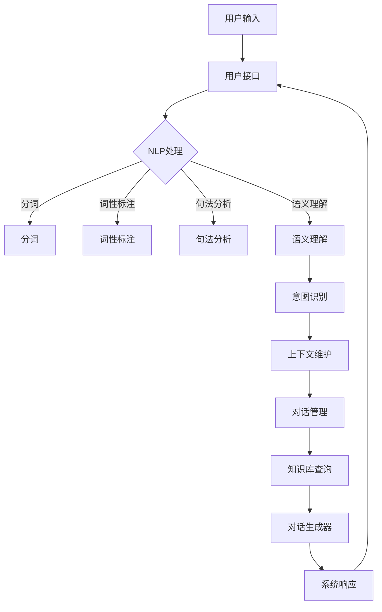

                 

### 《对话系统》

> **关键词**：对话系统、自然语言处理、意图识别、实体识别、对话管理、应用实战、未来趋势

> **摘要**：本文全面深入地探讨了对话系统这一人工智能领域的核心技术。从基础概念出发，逐步分析对话系统的架构、核心技术、应用实战及未来发展趋势，旨在为读者提供一个系统、全面的学习路径。通过详细讲解核心算法、实例分析和未来展望，本文希望引导读者深入理解对话系统的本质与应用，把握这一技术领域的最新动态。

### 《对话系统》目录大纲

#### 第一部分：对话系统基础

**第1章：对话系统概述**

**第2章：自然语言处理基础**

#### 第二部分：对话系统核心技术

**第3章：意图识别**

**第4章：实体识别与图谱构建**

**第5章：对话管理**

#### 第三部分：对话系统应用实战

**第6章：文本聊天机器人**

**第7章：语音助手**

**第8章：跨模态对话系统**

#### 第四部分：对话系统未来展望

**第9章：对话系统的未来发展趋势**

**附录**

- **附录 A：对话系统开发工具与资源**
- **附录 B：对话系统项目实战案例**
- **附录 C：对话系统常见问题解答**
- **附录 D：对话系统专家访谈**

---

现在我们将详细地展开上述章节的内容，逐步解析对话系统的各个层面。

---

### 《对话系统》

> **关键词**：对话系统、自然语言处理、意图识别、实体识别、对话管理、应用实战、未来趋势

> **摘要**：本文全面深入地探讨了对话系统这一人工智能领域的核心技术。从基础概念出发，逐步分析对话系统的架构、核心技术、应用实战及未来发展趋势，旨在为读者提供一个系统、全面的学习路径。通过详细讲解核心算法、实例分析和未来展望，本文希望引导读者深入理解对话系统的本质与应用，把握这一技术领域的最新动态。

---

### 《对话系统》目录大纲

**第一部分：对话系统基础**

**第1章：对话系统概述**

**第2章：自然语言处理基础**

**第二部分：对话系统核心技术**

**第3章：意图识别**

**第4章：实体识别与图谱构建**

**第5章：对话管理**

**第三部分：对话系统应用实战**

**第6章：文本聊天机器人**

**第7章：语音助手**

**第8章：跨模态对话系统**

**第四部分：对话系统未来展望**

**第9章：对话系统的未来发展趋势**

**附录**

- **附录 A：对话系统开发工具与资源**
- **附录 B：对话系统项目实战案例**
- **附录 C：对话系统常见问题解答**
- **附录 D：对话系统专家访谈**

---

接下来，我们将详细地展开上述章节的内容，逐步解析对话系统的各个层面。

---

#### 第1章：对话系统概述

**1.1 对话系统的定义与分类**

对话系统，也被称为聊天机器人，是一种基于自然语言交互的人工智能系统。它的主要目标是理解用户的输入，生成合适的响应，并与用户进行有效的对话。从广义上讲，对话系统可以分为以下几类：

1. **任务型对话系统**：这类系统主要关注于完成任务，例如在线客服、语音助手等。它们通常具有明确的任务目标和对话流程。
2. **闲聊型对话系统**：这类系统旨在与用户进行无特定目标的闲聊，例如聊天机器人、虚拟助手等。
3. **混合型对话系统**：这类系统结合了任务型和闲聊型的特点，能够在完成任务的同时与用户进行闲聊。

**1.2 对话系统的架构**

一个典型的对话系统通常包括以下几个主要组件：

1. **用户接口（UI）**：用于接收用户的输入，并展示系统的响应。
2. **自然语言处理（NLP）**：用于处理用户的输入，包括分词、词性标注、句法分析等。
3. **对话管理（DM）**：用于控制对话流程，包括意图识别、上下文维护、生成响应等。
4. **知识库**：用于存储对话系统所需的知识和事实，通常包括领域知识、事实信息等。
5. **对话生成器**：用于生成合适的响应，包括模板生成、序列到序列模型等。

**1.3 对话系统的工作流程**

一个典型的对话系统的工作流程可以分为以下几个步骤：

1. **接收用户输入**：通过用户接口接收用户的输入。
2. **NLP处理**：对用户输入进行处理，包括分词、词性标注、句法分析等。
3. **意图识别**：根据用户的输入，识别用户的意图。
4. **实体识别**：从用户输入中提取关键信息，识别实体。
5. **对话管理**：根据意图和上下文，生成合适的响应。
6. **响应生成**：生成文本或语音响应，并展示给用户。

**1.4 对话系统的发展历程与趋势**

对话系统的发展可以追溯到20世纪50年代，早期的对话系统主要基于规则和模式匹配。随着自然语言处理技术的发展，对话系统逐渐采用了统计方法和深度学习模型。近年来，随着互联网和智能手机的普及，对话系统的应用场景和规模不断扩大，从简单的任务型对话系统到复杂的跨模态对话系统，从企业内部应用到公众服务，对话系统在各个领域都取得了显著的成果。

未来，对话系统将继续向智能化、个性化和多样化方向发展。随着人工智能技术的不断进步，对话系统将更加准确地理解用户的意图，生成更加自然和合理的响应。同时，对话系统也将与其他技术如语音识别、图像识别、物联网等相结合，实现更加丰富和智能的交互体验。

---

#### 第2章：自然语言处理基础

自然语言处理（Natural Language Processing，简称NLP）是人工智能领域的一个重要分支，它旨在使计算机能够理解、生成和处理人类语言。NLP在对话系统中起着核心作用，是理解用户输入和生成响应的关键技术。

**2.1 语言模型**

语言模型（Language Model）是NLP中最基本的概念之一。它用于预测下一个词的概率，从而生成文本。语言模型可以基于统计方法或深度学习模型构建。常见的语言模型有n-gram模型、神经网络语言模型和循环神经网络（RNN）语言模型。

**2.1.1 语言模型的定义与作用**

语言模型是一个概率模型，它用于预测一个单词序列的概率。在NLP中，语言模型通常用于以下几个任务：

1. **文本生成**：根据前文预测下一个词，从而生成完整的文本。
2. **文本分类**：将文本归类到不同的类别。
3. **机器翻译**：将一种语言的文本翻译成另一种语言。
4. **情感分析**：根据文本内容判断用户的情感倾向。

**2.1.2 语言模型的构建方法**

语言模型的构建方法可以分为以下几类：

1. **基于n-gram的方法**：n-gram模型是一种基于统计的语言模型，它通过统计前n个词出现的概率来预测下一个词。常见的n-gram模型有二元模型（bigram）和三元模型（trigram）。

2. **基于神经网络的方法**：神经网络语言模型是一种基于深度学习的语言模型，它通过学习大量文本数据来预测下一个词。常见的神经网络语言模型有循环神经网络（RNN）和长短期记忆网络（LSTM）。

3. **基于注意力机制的方法**：注意力机制是一种用于提高神经网络语言模型性能的技术，它通过动态地关注输入序列中的不同部分来提高预测的准确性。

**2.1.3 语言模型的评估与优化**

语言模型的评估通常使用以下指标：

1. **Perplexity**：Perplexity是衡量语言模型性能的一个指标，它表示模型预测下一个词的困惑度。Perplexity值越低，说明模型性能越好。

2. **词错（Word Error Rate，简称WER）**：词错率是衡量机器翻译性能的一个指标，它表示翻译文本与原始文本之间的差异。词错率越低，说明翻译质量越好。

为了提高语言模型的性能，可以采用以下方法：

1. **数据增强**：通过增加训练数据量或生成虚拟数据来提高模型性能。

2. **模型优化**：通过调整模型参数、增加隐藏层节点或使用不同的优化算法来提高模型性能。

3. **迁移学习**：通过在相关任务上预训练模型，然后在特定任务上进行微调，从而提高模型性能。

**2.2 语义理解**

语义理解（Semantic Understanding）是NLP中的另一个重要概念，它旨在使计算机能够理解文本的含义。语义理解包括以下几个任务：

1. **词义消歧（Word Sense Disambiguation，简称WSD）**：词义消歧是指根据上下文确定一个词的确切含义。

2. **实体识别（Named Entity Recognition，简称NER）**：实体识别是指从文本中识别出具有特定意义的实体，如人名、地名、组织名等。

3. **关系抽取（Relation Extraction）**：关系抽取是指从文本中识别出实体之间的关联关系。

4. **语义角色标注（Semantic Role Labeling，简称SRL）**：语义角色标注是指识别出句子中的动词和其对应的语义角色，如动作执行者、动作承受者等。

**2.2.1 语义理解的概念**

语义理解是NLP的核心任务之一，它使计算机能够理解文本的深层含义，从而进行更复杂的文本处理任务。语义理解不仅涉及语言模型，还包括语法分析、语义角色标注、实体识别等技术。

**2.2.2 语义理解的模型**

语义理解的模型可以分为以下几类：

1. **基于规则的方法**：基于规则的方法通过手工定义规则来识别语义信息。这种方法通常适用于特定的应用场景，但通用性较差。

2. **基于统计的方法**：基于统计的方法通过学习大量的文本数据来识别语义信息。这种方法通常使用机器学习算法，如朴素贝叶斯、支持向量机等。

3. **基于深度学习的方法**：基于深度学习的方法通过构建深度神经网络来识别语义信息。这种方法通常使用卷积神经网络（CNN）和循环神经网络（RNN）等。

**2.2.3 语义理解的挑战与解决方案**

语义理解面临以下几个挑战：

1. **多义词消歧**：多义词消歧是指确定一个词在特定上下文中的含义。解决多义词消歧的方法包括基于规则的方法、基于统计的方法和基于深度学习的方法。

2. **实体识别的准确性**：实体识别的准确性取决于数据集的质量和模型的训练效果。为了提高实体识别的准确性，可以采用数据增强、模型优化等方法。

3. **跨语言语义理解**：跨语言语义理解是指在不同语言之间进行语义信息传递。解决跨语言语义理解的方法包括基于翻译的方法、基于多语言数据的方法和基于深度学习的方法。

**2.3 情感分析**

情感分析（Sentiment Analysis）是一种用于分析文本情感倾向的技术。它通常用于了解用户的情绪、态度和意见，从而为商业决策、舆情监测等提供支持。

**2.3.1 情感分析的定义与目的**

情感分析是指从文本中识别出情感极性（如正面、负面、中性）和情感强度（如非常正面、略微负面等）。情感分析的主要目的是：

1. **了解用户需求**：通过分析用户评论和反馈，了解用户对产品或服务的评价和需求。

2. **指导商业决策**：通过分析市场趋势和用户情绪，为产品开发和市场营销提供参考。

3. **舆情监测**：通过分析社交媒体和新闻等文本，监测社会热点和公众情绪。

**2.3.2 情感分析的方法与技术**

情感分析的方法可以分为以下几类：

1. **基于规则的方法**：基于规则的方法通过手工定义规则来识别情感信息。

2. **基于统计的方法**：基于统计的方法通过学习大量的文本数据来识别情感信息。

3. **基于深度学习的方法**：基于深度学习的方法通过构建深度神经网络来识别情感信息。

常见的情感分析模型包括：

1. **朴素贝叶斯分类器**：朴素贝叶斯分类器是一种基于概率论的分类器，它通过计算每个词在情感类别中的概率来预测情感极性。

2. **支持向量机（SVM）**：支持向量机是一种基于最大间隔理论的分类器，它通过找到最优超平面来分类文本。

3. **循环神经网络（RNN）**：循环神经网络是一种用于序列数据处理的神经网络，它可以通过学习序列模式来识别情感信息。

**2.3.3 情感分析的挑战与解决方案**

情感分析面临以下几个挑战：

1. **语境理解**：情感分析需要考虑文本的上下文，以准确识别情感极性。解决语境理解的方法包括上下文嵌入和注意力机制。

2. **多情感分类**：多情感分类是指同时识别出文本中的多个情感极性。解决多情感分类的方法包括多标签分类器和情感强度标注。

3. **情感强度估计**：情感强度估计是指估计文本中情感极性的强度。解决情感强度估计的方法包括基于规则的方法和基于深度学习的方法。

**2.4 问答系统**

问答系统（Question Answering System）是一种用于回答用户提问的系统。它通常由问题理解、答案检索和答案生成三个主要模块组成。

**2.4.1 问题理解**

问题理解是指将用户的自然语言问题转化为计算机可以处理的形式。问题理解包括以下几个任务：

1. **问题分类**：将问题归类到不同的类别，如事实性问题、推理性问题等。

2. **词性标注**：对问题中的每个词进行词性标注，以帮助理解问题的结构和含义。

3. **句法分析**：对问题进行句法分析，以理解问题的句法结构。

**2.4.2 答案检索**

答案检索是指从大规模的文本数据库中检索出与问题相关的答案。答案检索包括以下几个方法：

1. **基于关键词的方法**：通过关键词匹配来检索答案。

2. **基于语义的方法**：通过语义匹配来检索答案。

3. **基于模板的方法**：通过模板匹配来检索答案。

**2.4.3 答案生成**

答案生成是指将检索到的答案进行加工和整理，生成用户可以理解的答案。答案生成包括以下几个方法：

1. **模板匹配**：根据预设的模板生成答案。

2. **文本摘要**：从原始文本中提取关键信息，生成简洁的答案。

3. **语义解析**：根据问题的语义结构生成答案。

**2.5 应用实例**

自然语言处理在对话系统中有着广泛的应用，以下是一些常见的应用实例：

1. **智能客服**：智能客服系统通过NLP技术理解用户的查询，并生成相应的回复，以提高客服效率和用户体验。

2. **情感分析**：情感分析用于分析用户评论和反馈，以了解用户对产品或服务的满意度，从而为商业决策提供支持。

3. **问答系统**：问答系统可以用于智能助手、搜索引擎等应用场景，帮助用户快速找到所需信息。

4. **文本生成**：文本生成技术可以用于自动写作、摘要生成、机器翻译等任务。

**2.6 总结**

自然语言处理是对话系统的重要基础，它使计算机能够理解用户的输入并生成合理的响应。通过本章的介绍，我们了解了自然语言处理的基本概念、方法和技术，为后续章节的深入学习奠定了基础。

---

#### 第3章：意图识别

意图识别（Intent Recognition）是自然语言处理（NLP）和对话系统（Conversational System）中的核心任务之一。它的目标是通过分析用户的输入，识别出用户的意图，从而为对话系统提供决策依据。本章将详细探讨意图识别的定义、算法、模型以及在实际应用中面临的挑战和解决方案。

**3.1 意图识别的定义与重要性**

意图识别是指从用户的输入中识别出用户的意图，即用户想要完成什么任务或表达什么目的。在对话系统中，意图识别是第一个关键步骤，它决定了系统应该如何响应用户的输入。意图识别可以应用于各种场景，如智能客服、智能助手、语音助手等。

**3.1.1 意图识别的定义**

意图识别（Intent Recognition）是指根据用户的输入信息，识别出用户的意图，并将其映射到一个预定义的意图类别中。意图类别通常是一些抽象的概念，如“查找信息”、“预订机票”、“提出问题”等。

**3.1.2 意图识别的重要性**

意图识别在对话系统中具有以下几个重要性：

1. **对话流程控制**：意图识别能够帮助对话系统确定下一步的操作，从而控制对话流程。
2. **响应生成**：意图识别为响应生成提供了基础，使得系统能够生成与用户意图相关的响应。
3. **上下文理解**：意图识别有助于对话系统理解用户的上下文，从而生成更加连贯和自然的对话。
4. **个性化服务**：通过识别用户的意图，对话系统可以提供更加个性化的服务，提高用户体验。

**3.2 意图识别的算法与模型**

意图识别的方法可以分为基于规则的方法、基于统计的方法和基于深度学习的方法。以下将分别介绍这些方法。

**3.2.1 基于规则的方法**

基于规则的方法通过定义一系列规则来识别用户的意图。这些规则通常是手工编写的，基于领域知识和专家经验。这种方法的特点是简单直观，易于实现和理解。

**规则定义**：例如，对于智能客服系统，可以定义如下规则：

- 如果用户输入包含“预订”二字，则意图为“预订机票”。
- 如果用户输入包含“查询”二字，则意图为“查询信息”。

**规则匹配**：系统会根据用户输入，逐个匹配预定义的规则，找到匹配的规则所对应的意图。

**优点**：

- 易于理解和实现。
- 对特定领域的问题具有较好的效果。

**缺点**：

- 需要大量的手工编写规则。
- 不适用于复杂和多变的场景。

**3.2.2 基于统计的方法**

基于统计的方法通过统计用户输入中出现的关键词和词性，来识别用户的意图。这种方法通常使用机器学习算法，如朴素贝叶斯、支持向量机等。

**特征提取**：从用户输入中提取一系列特征，如关键词、词性、词频等。

**模型训练**：使用训练数据集，通过机器学习算法训练一个分类器，用于识别用户的意图。

**模型预测**：系统会根据用户输入的特征，使用训练好的分类器预测用户的意图。

**优点**：

- 不需要手工编写规则。
- 可以适应不同的领域和场景。

**缺点**：

- 需要大量的训练数据和特征工程。
- 对复杂和多变的场景效果较差。

**3.2.3 基于深度学习的方法**

基于深度学习的方法通过构建深度神经网络，如卷积神经网络（CNN）、循环神经网络（RNN）和长短期记忆网络（LSTM）等，来自动学习用户的输入特征，并识别用户的意图。

**模型构建**：构建一个深度神经网络模型，输入为用户输入的文本，输出为意图的概率分布。

**模型训练**：使用训练数据集，通过反向传播算法训练深度神经网络模型。

**模型预测**：系统会根据用户输入的文本，使用训练好的深度神经网络模型预测用户的意图。

**优点**：

- 可以自动学习用户的输入特征。
- 对复杂和多变的场景具有较好的效果。

**缺点**：

- 需要大量的数据和计算资源。
- 模型复杂，调参困难。

**3.3 意图识别的挑战与解决方案**

在实际应用中，意图识别面临着以下几个挑战：

**3.3.1 多意图识别**

多意图识别是指用户输入可能同时包含多个意图。例如，用户输入“帮我订一张明天去北京的机票”，可能同时包含“查询机票”和“预订机票”两个意图。

**解决方案**：

- **集成方法**：将多个模型的结果进行集成，提高多意图识别的准确性。
- **多标签分类**：将意图识别视为一个多标签分类问题，每个输入可以同时被多个意图标签所标注。

**3.3.2 长文本识别**

长文本识别是指用户输入可能包含较长的文本。对于长文本，传统的意图识别模型可能会遇到性能下降的问题。

**解决方案**：

- **分句处理**：将长文本划分为多个句子，对每个句子分别进行意图识别，然后综合结果进行决策。
- **序列模型**：使用序列模型，如RNN和LSTM，可以更好地处理长文本。

**3.3.3 实时性**

在实际应用中，意图识别需要在有限的响应时间内完成。对于实时性要求较高的场景，如语音助手，需要快速识别用户的意图。

**解决方案**：

- **模型优化**：通过模型压缩、模型融合等方法，提高模型的实时性。
- **预处理**：对用户输入进行预处理，如分词、去噪等，减少模型的计算量。

**3.4 案例分析**

以下是一个意图识别的案例分析：

**案例背景**：一个智能客服系统需要识别用户的意图，以提供相应的服务。

**用户输入**：“你好，我想查询一下最近的航班信息。”

**意图识别结果**：“查询航班信息”。

**意图识别过程**：

1. **分词**：将用户输入分词为“你好”、“想”、“查询”、“最近的”、“航班”、“信息”。
2. **特征提取**：提取关键词和词性，如“查询”、“航班”、“信息”。
3. **模型预测**：使用训练好的意图识别模型，预测用户的意图为“查询航班信息”。

**意图识别算法伪代码**：

```python
# 输入：用户输入文本
# 输出：意图类别

# 步骤1：分词
words = tokenize(text)

# 步骤2：特征提取
features = extract_features(words)

# 步骤3：模型预测
predicted_intent = model.predict(features)
```

**3.5 总结**

意图识别是对话系统的关键任务，它决定了对话系统如何理解用户的输入并生成相应的响应。本章介绍了意图识别的定义、算法、模型以及面临的挑战和解决方案。通过本章的学习，读者可以深入了解意图识别的技术原理和应用方法，为构建高效的对话系统打下基础。

---

#### 第4章：实体识别与图谱构建

实体识别（Named Entity Recognition，简称NER）和图谱构建（Knowledge Graph Construction）是自然语言处理（NLP）和对话系统中至关重要的技术。实体识别旨在从文本中识别出具有特定意义的实体，如人名、地名、组织名等。图谱构建则是将识别出的实体和它们之间的关系构建成一个结构化的知识图谱，以便更好地理解和利用这些信息。本章将详细介绍实体识别和图谱构建的基本概念、方法、技术以及在实际应用中面临的挑战和解决方案。

**4.1 实体识别**

实体识别是指从文本中识别出具有特定意义的实体，并将其分类到预定义的实体类别中。实体识别是自然语言处理中的一个基础任务，对于信息抽取、问答系统、对话系统等领域具有重要的应用价值。

**4.1.1 实体识别的定义**

实体识别（NER）是指从文本中识别出具有特定意义的实体，并将其分类到预定义的实体类别中。实体可以是人、地点、组织、时间等具有明确指代意义的名词。

**4.1.2 实体识别的方法与技术**

实体识别的方法可以分为以下几类：

1. **基于规则的方法**：基于规则的方法通过手工定义一系列规则，用于识别文本中的实体。这种方法适用于一些简单的实体识别任务，但对于复杂的实体识别效果较差。

   **规则定义**：例如，定义以下规则：
   - 如果文本中包含“北京”，则识别为“地名”。
   - 如果文本中包含“苹果公司”，则识别为“组织名”。

2. **基于统计的方法**：基于统计的方法通过学习大量标注好的文本数据，来识别实体。这种方法通常使用机器学习算法，如条件随机场（CRF）、支持向量机（SVM）等。

   **特征提取**：从文本中提取一系列特征，如词性、词频、上下文等。
   **模型训练**：使用训练数据集，通过机器学习算法训练一个分类器，用于识别实体。
   **模型预测**：系统会根据文本特征，使用训练好的分类器预测实体类别。

3. **基于深度学习的方法**：基于深度学习的方法通过构建深度神经网络，来自动学习文本中的实体特征。这种方法通常使用卷积神经网络（CNN）、循环神经网络（RNN）等。

   **模型构建**：构建一个深度神经网络模型，输入为文本，输出为实体的概率分布。
   **模型训练**：使用训练数据集，通过反向传播算法训练深度神经网络模型。
   **模型预测**：系统会根据文本，使用训练好的深度神经网络模型预测实体类别。

**4.1.3 实体识别的挑战与解决方案**

实体识别在实际应用中面临着以下几个挑战：

1. **跨语言实体识别**：不同语言的实体命名和表达方式不同，跨语言实体识别需要处理不同语言之间的差异。

   **解决方案**：采用多语言数据集进行训练，或者使用翻译模型进行预处理。

2. **长文本实体识别**：长文本中的实体可能分散在不同的句子中，长文本实体识别需要处理实体的连贯性和上下文。

   **解决方案**：使用序列模型，如RNN和LSTM，来处理长文本。

3. **多标签实体识别**：一个实体可能同时属于多个类别，多标签实体识别需要处理实体之间的重叠和冲突。

   **解决方案**：采用多标签分类器，如Softmax回归，来识别实体。

**4.2 实体图谱构建**

实体图谱（Knowledge Graph）是一种用于表示实体及其关系的图形结构。图谱中的节点表示实体，边表示实体之间的关系。实体图谱构建是将文本中的实体和关系转化为结构化的知识表示。

**4.2.1 实体图谱的定义**

实体图谱（Knowledge Graph）是一种用于表示实体及其关系的图形结构。图谱中的节点（Node）表示实体，边（Edge）表示实体之间的关系（Relationship）。

**4.2.2 实体图谱的构建方法**

实体图谱的构建可以分为以下几个步骤：

1. **实体识别**：从文本中识别出实体，并将其作为图谱中的节点。

2. **关系抽取**：从文本中识别出实体之间的关系，并将其作为图谱中的边。

3. **实体融合**：对于同一名词或实体的不同表达方式，进行合并和统一处理。

4. **图谱构建**：将识别出的实体和关系构建成一个完整的图谱。

**4.2.3 实体图谱的应用**

实体图谱在多个领域具有广泛的应用，如搜索引擎、推荐系统、问答系统等。

1. **搜索引擎**：实体图谱可以用于增强搜索引擎的结果，提供更加准确和相关的信息。

2. **推荐系统**：实体图谱可以用于推荐系统，根据用户的兴趣和实体之间的相似性进行个性化推荐。

3. **问答系统**：实体图谱可以用于问答系统，根据用户的提问和实体图谱中的知识进行答案生成。

**4.2.4 实体图谱的挑战与解决方案**

实体图谱构建在实际应用中面临着以下几个挑战：

1. **数据质量**：实体图谱的质量取决于输入文本的质量和数据源的可靠性。

   **解决方案**：采用高质量的数据源，如权威的百科全书、新闻报道等，进行实体和关系抽取。

2. **实体融合**：对于同一名词或实体的不同表达方式，进行有效的融合和统一处理。

   **解决方案**：采用实体对齐技术，如命名实体识别、实体链接等，来识别和统一实体。

3. **图谱更新**：实体图谱需要定期更新，以保持知识的时效性和准确性。

   **解决方案**：采用实时数据采集和增量更新技术，如流处理和图数据库等。

**4.3 案例分析**

以下是一个实体识别和图谱构建的案例分析：

**案例背景**：构建一个智能问答系统，用于回答用户关于电影的问题。

**用户输入**：“我想看一部关于爱情的电影。”

**实体识别结果**：
- 实体：“爱情电影”
- 实体类别：“电影类型”

**图谱构建过程**：

1. **实体识别**：从用户输入中识别出实体“爱情电影”。
2. **关系抽取**：识别出实体“爱情电影”与实体类别“电影类型”之间的关系。
3. **图谱构建**：将识别出的实体和关系构建成一个图谱。

**图谱表示**：

```
实体：爱情电影
实体类别：电影类型
关系：属于
```

**4.4 总结**

实体识别和图谱构建是自然语言处理和对话系统中的重要技术。本章介绍了实体识别和图谱构建的基本概念、方法和技术，以及在实际应用中面临的挑战和解决方案。通过本章的学习，读者可以深入了解实体识别和图谱构建的技术原理和应用方法，为构建高效的对话系统和知识图谱打下基础。

---

#### 第5章：对话管理

对话管理（Dialogue Management）是构建智能对话系统（如聊天机器人、语音助手等）的核心技术之一。它的目标是通过控制对话流程，实现与用户的自然、流畅的交流。对话管理涉及到意图识别、上下文维护、响应生成等关键环节，是保证对话系统能够准确理解用户意图并生成合适响应的关键。本章将详细探讨对话管理的定义、目标、组成部分及其面临的挑战和解决方案。

**5.1 对话管理概述**

对话管理是指在整个对话过程中，对话系统如何根据用户的输入和系统自身的状态，进行合理的决策和响应。对话管理的目标是在对话过程中维持用户和系统的良好互动，提高用户体验。

**5.1.1 对话管理的定义**

对话管理（Dialogue Management）是指对话系统在对话过程中，根据用户的输入和系统状态，进行意图识别、上下文维护、响应生成的决策和控制过程。

**5.1.2 对话管理的目标**

对话管理的目标主要包括以下几点：

1. **准确理解用户意图**：对话系统需要能够准确地识别用户的意图，从而生成与用户需求相关的响应。
2. **流畅的对话体验**：对话系统需要能够生成自然、连贯的响应，与用户进行流畅的交流。
3. **有效的对话流程控制**：对话系统需要能够控制对话流程，引导用户完成对话任务。
4. **灵活的响应适应**：对话系统需要能够根据不同的用户和场景，生成个性化的响应。

**5.1.3 对话管理的组成部分**

对话管理通常包括以下几个关键组成部分：

1. **意图识别（Intent Recognition）**：意图识别是对话管理的第一步，其目标是识别用户输入中的意图。意图通常是一些抽象的概念，如“查询信息”、“预订机票”等。

2. **上下文维护（Context Management）**：上下文维护是确保对话系统能够在对话过程中保持对用户意图和相关信息的理解。上下文信息包括用户历史输入、对话历史、用户状态等。

3. **响应生成（Response Generation）**：响应生成是根据用户的意图和上下文信息，生成合适的文本或语音响应。

4. **对话策略（Dialogue Policy）**：对话策略是一组规则或算法，用于指导对话系统的行为，包括如何识别意图、如何维护上下文、如何生成响应等。

**5.2 对话状态跟踪**

对话状态跟踪（Dialogue State Tracking）是对话管理的一个重要组成部分，它涉及到如何维护和更新对话状态。对话状态是用于指导对话系统决策的关键信息，它通常包含用户的意图、用户的历史输入、系统的状态等。

**5.2.1 对话状态跟踪的定义**

对话状态跟踪（Dialogue State Tracking）是指对话系统在对话过程中，如何根据用户的输入和系统的行为，维护和更新对话状态。

**5.2.2 对话状态跟踪的方法**

对话状态跟踪的方法可以分为以下几类：

1. **基于规则的方法**：基于规则的方法通过手工定义一系列规则，来维护和更新对话状态。这种方法简单直观，但适用于复杂和多变的场景。

2. **基于统计的方法**：基于统计的方法通过学习大量的对话数据，来维护和更新对话状态。这种方法通常使用机器学习算法，如条件随机场（CRF）等。

3. **基于深度学习的方法**：基于深度学习的方法通过构建深度神经网络，来自动学习对话状态的特征，并维护和更新对话状态。这种方法适用于复杂和多变的场景，但需要大量的数据和计算资源。

**5.2.3 对话状态跟踪的挑战与解决方案**

对话状态跟踪在实际应用中面临着以下几个挑战：

1. **实时性**：在实时对话场景中，需要快速维护和更新对话状态，以应对用户的即时响应。

   **解决方案**：采用高效的算法和数据结构，如决策树、支持向量机（SVM）等，来提高实时性。

2. **多意图识别**：在对话过程中，用户可能同时表达多个意图，需要能够同时跟踪多个意图的状态。

   **解决方案**：采用多标签分类器，如多头分类器等，来同时识别多个意图。

3. **上下文理解**：对话状态需要能够理解用户的上下文信息，以生成更加自然和合理的响应。

   **解决方案**：采用上下文嵌入技术，如Word2Vec、BERT等，来提高上下文理解能力。

**5.3 对话策略学习**

对话策略学习（Dialogue Policy Learning）是对话管理中的另一个重要环节，它涉及到如何学习对话策略，以指导对话系统的行为。

**5.3.1 对话策略学习的定义**

对话策略学习（Dialogue Policy Learning）是指通过学习用户的历史对话数据，自动生成对话策略，用于指导对话系统的行为。

**5.3.2 对话策略学习的方法**

对话策略学习的方法可以分为以下几类：

1. **基于规则的策略学习**：基于规则的策略学习通过手工定义一系列规则，来指导对话系统的行为。这种方法简单直观，但适用于复杂和多变的场景。

2. **基于统计的强化学习**：基于统计的强化学习通过学习用户的历史对话数据，来生成对话策略。这种方法通常使用强化学习算法，如Q-learning、SARSA等。

3. **基于深度学习的策略学习**：基于深度学习的策略学习通过构建深度神经网络，来自动学习对话策略。这种方法适用于复杂和多变的场景，但需要大量的数据和计算资源。

**5.3.3 对话策略学习的挑战与解决方案**

对话策略学习在实际应用中面临着以下几个挑战：

1. **数据量**：对话策略学习需要大量的对话数据，以训练有效的对话策略。

   **解决方案**：采用数据增强技术，如数据生成、数据扩充等，来增加对话数据量。

2. **多样性**：对话策略需要能够生成多样性的响应，以应对不同的用户和场景。

   **解决方案**：采用生成对抗网络（GAN）等生成模型，来提高对话策略的多样性。

3. **适应性**：对话策略需要能够适应不同的对话环境和用户需求。

   **解决方案**：采用在线学习技术，如自适应强化学习等，来实时调整对话策略。

**5.4 案例分析**

以下是一个对话管理的案例分析：

**案例背景**：构建一个智能客服系统，用于处理用户的咨询。

**用户输入**：“你好，我想查询一下最近的航班信息。”

**对话管理过程**：

1. **意图识别**：系统识别出用户的意图为“查询航班信息”。
2. **上下文维护**：系统维护用户的上下文信息，包括用户的意图、查询的日期等。
3. **响应生成**：系统生成相应的文本响应，如“你好，请问您需要查询哪一天的航班？”
4. **对话策略**：系统根据预定义的对话策略，选择合适的响应。

**5.5 总结**

对话管理是构建智能对话系统的核心技术，它涉及到意图识别、上下文维护、响应生成和对话策略等多个方面。本章介绍了对话管理的定义、目标、组成部分及其面临的挑战和解决方案。通过本章的学习，读者可以深入了解对话管理的技术原理和应用方法，为构建高效的对话系统打下基础。

---

#### 第6章：文本聊天机器人

文本聊天机器人是对话系统中的一个重要应用场景，它们广泛应用于智能客服、社交互动、教育辅助等领域。文本聊天机器人通过自然语言处理（NLP）技术，与用户进行文本交互，提供实时、个性化的服务。本章将详细介绍文本聊天机器人的概述、应用场景、核心功能以及设计与开发流程。

**6.1 文本聊天机器人概述**

文本聊天机器人，也称为聊天机器人或聊天bot，是一种通过文本进行交互的人工智能系统。它利用自然语言处理技术，理解和生成文本，与用户进行对话。文本聊天机器人可以模拟人类交流，为用户提供信息查询、任务执行、情感陪伴等服务。

**6.1.1 文本聊天机器人的定义**

文本聊天机器人是一种基于自然语言处理技术的人工智能系统，它通过文本交互与用户进行对话，提供实时、个性化的服务。

**6.1.2 文本聊天机器人的分类**

根据应用场景和功能，文本聊天机器人可以分为以下几类：

1. **任务型聊天机器人**：这类机器人专注于完成特定任务，如在线客服、订单处理、信息查询等。
2. **闲聊型聊天机器人**：这类机器人旨在与用户进行无特定目标的闲聊，如社交机器人、虚拟助手等。
3. **混合型聊天机器人**：这类机器人结合了任务型和闲聊型的特点，能够在完成任务的同时与用户进行互动。

**6.2 文本聊天机器人的应用场景**

文本聊天机器人的应用场景非常广泛，以下是一些常见的应用场景：

1. **智能客服**：文本聊天机器人可以用于自动处理用户咨询，提高客服效率和用户体验。
2. **社交互动**：文本聊天机器人可以用于社交媒体平台，提供用户之间的互动和娱乐。
3. **教育辅助**：文本聊天机器人可以用于教育领域，为学生提供在线辅导、课程咨询等。
4. **健康咨询**：文本聊天机器人可以用于提供健康咨询、疾病查询等服务。
5. **电子商务**：文本聊天机器人可以用于电商平台，提供商品查询、订单跟踪、支付咨询等。

**6.3 文本聊天机器人的核心功能**

文本聊天机器人的核心功能包括意图识别、文本生成、上下文维护等。

1. **意图识别**：意图识别是文本聊天机器人的第一步，它通过自然语言处理技术，识别用户输入的意图。例如，用户输入“帮我查一下明天的天气”，机器人需要识别出用户的意图为“查询天气”。
2. **文本生成**：文本生成是根据用户的意图和上下文，生成合适的文本响应。文本生成可以通过模板匹配、序列到序列模型（如Seq2Seq模型）等方式实现。
3. **上下文维护**：上下文维护是确保机器人能够理解用户的上下文信息，从而生成连贯的对话。上下文维护通常涉及到对话状态的跟踪，如用户的历史输入、对话历史等。

**6.4 文本聊天机器人的设计与开发流程**

文本聊天机器人的设计与开发流程通常包括以下几个步骤：

1. **需求分析**：确定文本聊天机器人的目标用户、应用场景和功能需求。
2. **技术选型**：选择合适的自然语言处理技术、对话管理框架和开发工具。
3. **系统设计**：设计聊天机器人的整体架构，包括用户接口、自然语言处理模块、对话管理模块等。
4. **开发与实现**：根据系统设计，实现聊天机器人的各个模块，并进行集成测试。
5. **训练与优化**：使用大量的训练数据，训练自然语言处理模型和对话管理模型，并进行优化。
6. **部署与上线**：将聊天机器人部署到生产环境，并进行监控和维护。

**6.5 文本聊天机器人的案例分析**

以下是一些文本聊天机器人的案例分析：

**案例一：智能客服机器人**

智能客服机器人广泛应用于各大企业和电商平台，用于自动处理用户咨询和投诉。以下是一个案例：

**用户输入**：“我的订单怎么还没发货？”

**机器人响应**：“您好，很抱歉给您带来不便。请您提供一下订单号，我将帮您查询订单状态。”

**案例二：社交聊天机器人**

社交聊天机器人可以在社交媒体平台上为用户提供互动和娱乐。以下是一个案例：

**用户输入**：“今天天气怎么样？”

**机器人响应**：“你好！今天是个晴朗的好天气，适合出门活动哦！”

**案例三：教育聊天机器人**

教育聊天机器人可以为学生提供在线辅导和课程咨询。以下是一个案例：

**用户输入**：“我需要帮忙准备数学考试。”

**机器人响应**：“当然可以！请问您需要哪方面的帮助？数学基础、解题技巧还是考试策略？”

**6.6 总结**

文本聊天机器人是人工智能应用中的一个重要领域，它们通过自然语言处理技术，为用户提供实时、个性化的服务。本章介绍了文本聊天机器人的概述、应用场景、核心功能以及设计与开发流程。通过本章的学习，读者可以了解文本聊天机器人的技术原理和应用方法，为构建自己的聊天机器人项目打下基础。

---

#### 第7章：语音助手

语音助手（Voice Assistant）是近年来人工智能领域的一个重要发展方向，它通过语音交互技术，为用户提供了便捷、自然的交互方式。语音助手广泛应用于智能家居、移动设备、车载系统等场景，成为人们日常生活中不可或缺的一部分。本章将详细介绍语音助手的概述、构成、应用场景以及开发流程。

**7.1 语音助手概述**

语音助手是一种基于语音识别（Speech Recognition）和自然语言处理（Natural Language Processing，NLP）技术的人工智能系统，它能够理解用户的语音输入，并生成相应的语音或文本响应。语音助手通过模拟人类的对话方式，为用户提供信息查询、任务执行、娱乐互动等服务。

**7.1.1 语音助手的定义**

语音助手是一种通过语音识别和自然语言处理技术，与用户进行交互的人工智能系统，它能够理解用户的语音指令，并生成相应的语音或文本响应。

**7.1.2 语音助手的分类**

根据应用场景和功能，语音助手可以分为以下几类：

1. **通用语音助手**：如苹果的Siri、谷歌的Google Assistant等，它们具有广泛的功能和应用场景。
2. **专业语音助手**：如智能家居语音助手、车载语音助手等，它们专注于特定的应用领域。
3. **定制语音助手**：根据用户的需求和场景，定制开发特定功能的语音助手。

**7.2 语音助手的构成**

一个典型的语音助手系统通常包括以下几个主要组成部分：

1. **语音识别（Speech Recognition）**：语音识别是将用户的语音输入转换为文本的过程，它涉及到语音信号处理、声学模型、语言模型等技术。
2. **自然语言理解（Natural Language Understanding，NLU）**：自然语言理解是对用户输入的文本进行语义解析，识别出用户的意图和关键信息。
3. **对话管理（Dialogue Management）**：对话管理是控制对话流程的核心模块，它涉及到意图识别、上下文维护、对话策略等。
4. **语音合成（Text-to-Speech，TTS）**：语音合成是将生成的文本转换为自然流畅的语音输出，它涉及到语音合成技术、语音信号处理等。

**7.3 语音助手的开发流程**

开发一个语音助手系统通常需要经历以下几个阶段：

1. **需求分析**：明确语音助手的用户需求、功能需求和应用场景。
2. **技术选型**：选择合适的语音识别、自然语言理解和语音合成技术，以及开发框架和工具。
3. **系统设计**：设计语音助手的整体架构，包括语音识别模块、自然语言理解模块、对话管理模块、语音合成模块等。
4. **开发与实现**：根据系统设计，实现各个模块的功能，并进行集成测试。
5. **数据准备**：收集和准备语音数据、文本数据等，用于训练和优化语音识别和自然语言理解模型。
6. **模型训练与优化**：使用训练数据集，训练语音识别和自然语言理解模型，并进行优化。
7. **部署与上线**：将语音助手部署到生产环境，并进行监控和维护。

**7.4 语音助手的应用场景**

语音助手广泛应用于多个领域，以下是一些常见的应用场景：

1. **智能家居**：语音助手可以用于控制智能家居设备，如智能灯泡、智能音响、智能冰箱等。
2. **移动设备**：语音助手可以用于智能手机、平板电脑等移动设备，提供信息查询、导航、应用操作等服务。
3. **车载系统**：语音助手可以用于车载系统，提供导航、电话、音乐等服务，提高驾驶安全。
4. **客服与支持**：语音助手可以用于智能客服系统，自动处理用户咨询和投诉，提高客服效率。
5. **娱乐互动**：语音助手可以用于游戏、娱乐等场景，提供语音交互体验。

**7.5 语音助手的案例分析**

以下是一些语音助手的案例分析：

**案例一：苹果Siri**

苹果Siri是苹果公司的智能语音助手，它通过语音识别和自然语言处理技术，为用户提供信息查询、应用操作、语音助手等服务。

**用户输入**：“明天天气怎么样？”

**Siri响应**：“你好，明天天气晴朗，温度大约是15摄氏度。”

**案例二：亚马逊Alexa**

亚马逊Alexa是亚马逊公司的智能语音助手，它可以通过智能音响、智能设备等设备进行语音交互，提供信息查询、智能家居控制等服务。

**用户输入**：“打开客厅的灯。”

**Alexa响应**：“好的，我已经打开了客厅的灯。”

**案例三：谷歌Assistant**

谷歌Assistant是谷歌公司的智能语音助手，它可以通过智能手机、智能音响等设备进行语音交互，提供信息查询、应用操作、语音助手等服务。

**用户输入**：“播放我喜欢的音乐。”

**Google Assistant响应**：“好的，已经开始播放您喜欢的音乐。”

**7.6 总结**

语音助手是人工智能领域的一个重要发展方向，它为用户提供了便捷、自然的交互方式。本章介绍了语音助手的概述、构成、应用场景以及开发流程。通过本章的学习，读者可以了解语音助手的技术原理和应用方法，为开发自己的语音助手项目打下基础。

---

#### 第8章：跨模态对话系统

跨模态对话系统（Multimodal Conversational System）是近年来人工智能领域的一个研究热点。它通过整合多种模态的数据，如文本、语音、图像、视频等，实现更加自然和智能的交互体验。本章将详细介绍跨模态对话系统的概述、设计原则、实现方法以及应用场景。

**8.1 跨模态对话系统概述**

跨模态对话系统是一种能够处理和响应多种模态数据的对话系统。它不仅能够理解用户的文本输入，还能够识别用户的语音、图像和视频等模态数据，从而提供更加丰富和多样化的交互体验。

**8.1.1 跨模态对话系统的定义**

跨模态对话系统是指能够处理和响应多种模态数据的对话系统，如文本、语音、图像、视频等。它通过整合不同模态的数据，实现更加自然和智能的交互体验。

**8.1.2 跨模态对话系统的应用场景**

跨模态对话系统广泛应用于多个领域，以下是一些典型的应用场景：

1. **智能客服**：跨模态对话系统可以同时处理用户的文本消息、语音呼叫和图像输入，提供更加高效和个性化的服务。
2. **虚拟助手**：跨模态对话系统可以与虚拟助手结合，通过文本、语音和图像等多模态交互，提供更加自然和友好的用户体验。
3. **医疗健康**：跨模态对话系统可以用于医疗健康领域，通过分析患者的文本病历、语音描述和图像检查结果，提供诊断建议和治疗方案。
4. **教育**：跨模态对话系统可以用于教育领域，通过文本、语音和图像等多种模态，为学生提供个性化的学习辅导和互动体验。

**8.2 跨模态对话系统的设计原则**

设计跨模态对话系统时，需要遵循以下原则：

1. **一致性**：系统应保持不同模态之间的数据一致性，确保信息传递的准确性和连贯性。
2. **灵活性**：系统应具备适应不同模态数据和用户需求的能力，能够灵活调整交互方式和响应内容。
3. **高效性**：系统应优化数据处理和响应生成，提高交互速度和用户满意度。
4. **用户友好**：系统应设计简洁直观的用户界面，提供多样化的交互方式，确保用户体验的舒适性。

**8.3 跨模态对话系统的实现方法**

实现跨模态对话系统通常包括以下几个步骤：

1. **模态数据采集**：收集文本、语音、图像和视频等模态数据。
2. **模态数据预处理**：对采集到的数据进行清洗、标注和转换，以适应后续处理。
3. **特征提取**：从不同模态的数据中提取特征，如文本的词向量、语音的声学特征、图像的视觉特征等。
4. **模型训练**：使用提取到的特征，训练多模态深度学习模型，如卷积神经网络（CNN）、循环神经网络（RNN）等。
5. **交互控制**：设计交互控制模块，实现不同模态之间的切换和协同处理，如文本到语音、图像到文本等。
6. **响应生成**：根据用户输入和模型预测，生成合适的文本、语音或图像响应。

**8.3.1 模态数据采集**

模态数据采集是跨模态对话系统的第一步，它涉及到文本、语音、图像和视频等多种数据的收集。以下是一些常见的采集方法：

1. **文本采集**：通过爬虫、用户输入等方式获取文本数据。
2. **语音采集**：使用麦克风或语音输入设备采集用户的语音数据。
3. **图像采集**：通过摄像头或图像输入设备采集用户的图像数据。
4. **视频采集**：通过摄像头或视频输入设备采集用户的活动视频。

**8.3.2 模态数据预处理**

模态数据预处理是确保数据质量和一致性的重要步骤。以下是一些常见的预处理方法：

1. **文本预处理**：包括文本清洗、分词、词性标注等。
2. **语音预处理**：包括去噪、分帧、特征提取等。
3. **图像预处理**：包括图像增强、去噪、目标检测等。
4. **视频预处理**：包括视频剪辑、帧提取、目标跟踪等。

**8.3.3 特征提取**

特征提取是从原始模态数据中提取具有代表性的特征，以便后续模型训练。以下是一些常见的特征提取方法：

1. **文本特征**：包括词向量、句向量、语义角色标注等。
2. **语音特征**：包括声学模型特征、音素标注等。
3. **图像特征**：包括视觉特征、深度特征等。
4. **视频特征**：包括时空特征、动作特征等。

**8.3.4 模型训练**

模型训练是跨模态对话系统的核心步骤，它涉及到多模态深度学习模型的训练。以下是一些常见的模型训练方法：

1. **单一模态模型**：使用单一模态数据进行训练，如文本分类、语音识别等。
2. **多模态融合模型**：将不同模态的数据进行融合，如多模态卷积神经网络（CNN）等。
3. **序列模型**：使用序列模型，如循环神经网络（RNN）、长短时记忆网络（LSTM）等，来处理时序数据。
4. **强化学习模型**：使用强化学习模型，如深度强化学习（DRL）、策略梯度等，来优化交互策略。

**8.3.5 交互控制**

交互控制是跨模态对话系统实现多模态切换和协同处理的关键步骤。以下是一些常见的交互控制方法：

1. **基于规则的交互控制**：通过预定义的规则，实现不同模态之间的切换和协同处理。
2. **基于机器学习的交互控制**：通过训练模型，实现自动的交互控制和响应生成。
3. **基于强化学习的交互控制**：通过强化学习算法，优化交互策略和响应生成。

**8.3.6 响应生成**

响应生成是根据用户输入和模型预测，生成合适的文本、语音或图像响应。以下是一些常见的响应生成方法：

1. **模板生成**：使用预定义的模板，根据用户输入生成相应的响应。
2. **序列到序列模型**：使用序列到序列（Seq2Seq）模型，将用户输入转换为合适的响应。
3. **生成对抗网络（GAN）**：使用生成对抗网络（GAN），生成多样化的响应。
4. **文本生成模型**：使用文本生成模型，如变压器（Transformer）等，生成自然流畅的文本响应。

**8.4 跨模态对话系统的挑战与解决方案**

跨模态对话系统在实际应用中面临着以下几个挑战：

1. **数据一致性**：不同模态的数据在语义和结构上可能存在差异，如何确保数据的一致性是一个重要问题。
2. **模态融合**：如何有效地融合不同模态的数据，提高模型的性能，是一个关键挑战。
3. **实时性**：跨模态对话系统需要实时处理用户的输入和响应，如何提高系统的实时性是一个挑战。

**解决方案**：

1. **数据一致性**：通过数据预处理和清洗，提高不同模态数据的一致性。
2. **模态融合**：采用多模态深度学习模型，如多模态卷积神经网络（CNN）等，实现有效的模态融合。
3. **实时性**：采用高效的算法和优化技术，如模型压缩、并行处理等，提高系统的实时性。

**8.5 跨模态对话系统的案例分析**

以下是一些跨模态对话系统的案例分析：

**案例一：微信聊天机器人**

微信聊天机器人通过整合文本、语音、图像等多种模态数据，为用户提供智能客服、信息查询、娱乐互动等服务。以下是一个案例：

**用户输入**：“给我一张好看的图片。”

**机器人响应**：“好的，这里有一张漂亮的风景图片。”

**案例二：智能音箱**

智能音箱通过语音交互，为用户提供音乐播放、天气预报、日程提醒等服务。以下是一个案例：

**用户输入**：“播放一首轻音乐。”

**智能音箱响应**：“好的，已经开始播放轻音乐。”

**案例三：虚拟助手**

虚拟助手通过文本、语音和图像等多种模态交互，为用户提供个性化的服务。以下是一个案例：

**用户输入**：“帮我订一张明天去北京的机票。”

**虚拟助手响应**：“好的，我已经为您找到了几条合适的机票信息，请问您需要预订吗？”

**8.6 总结**

跨模态对话系统是人工智能领域的一个重要发展方向，它通过整合多种模态数据，实现更加自然和智能的交互体验。本章介绍了跨模态对话系统的概述、设计原则、实现方法以及应用场景。通过本章的学习，读者可以了解跨模态对话系统的技术原理和应用方法，为开发自己的跨模态对话系统项目打下基础。

---

#### 第9章：对话系统的未来发展趋势

对话系统作为人工智能领域的重要组成部分，正经历着快速的发展和变革。随着技术的不断进步，对话系统的应用场景、功能和质量也在不断提升。本章将探讨对话系统的未来发展趋势，包括技术趋势、应用领域拓展以及伦理与法律问题。

**9.1 对话系统的技术趋势**

1. **多模态交互**：随着语音识别、图像识别等技术的成熟，多模态交互将成为对话系统的重要趋势。通过整合文本、语音、图像等多种模态数据，对话系统能够提供更加丰富和自然的交互体验。

2. **个性化服务**：随着大数据和机器学习技术的发展，对话系统将能够更好地理解用户需求，提供个性化的服务。通过分析用户的历史行为和偏好，对话系统将能够生成个性化的响应和建议。

3. **增强现实与虚拟现实**：增强现实（AR）和虚拟现实（VR）技术的快速发展，将使得对话系统在虚拟场景中的应用变得更加广泛和自然。通过AR/VR技术，用户可以与对话系统进行更加沉浸式的交互。

4. **对话系统的伦理与道德**：随着对话系统在各个领域的应用，伦理与道德问题逐渐受到关注。如何确保对话系统的公正性、透明性和安全性，将成为未来研究的重要方向。

**9.2 对话系统的应用领域拓展**

1. **医疗健康**：对话系统在医疗健康领域的应用前景广阔，如辅助诊断、健康咨询、远程医疗服务等。通过结合医学知识和自然语言处理技术，对话系统将能够为用户提供个性化的健康建议和服务。

2. **金融与保险**：对话系统在金融与保险领域的应用将更加深入，如智能投顾、客户服务、理赔服务等。通过自然语言处理和大数据分析技术，对话系统将能够提供更加精准和高效的金融服务。

3. **教育**：对话系统在教育领域的应用将得到进一步拓展，如在线教育、智能辅导、学习评估等。通过结合教育理论和人工智能技术，对话系统将能够为用户提供更加个性化的学习体验。

4. **智能城市**：对话系统在智能城市建设中将发挥重要作用，如交通管理、环境监测、市政服务等。通过整合多种数据源和智能分析技术，对话系统将能够为城市管理者提供实时、全面的决策支持。

**9.3 对话系统的伦理与法律问题**

1. **隐私保护**：对话系统在处理用户数据时，如何保护用户的隐私是一个重要问题。未来的对话系统需要采用更加严格的隐私保护措施，确保用户数据的安全和隐私。

2. **数据安全**：对话系统面临着数据泄露和网络攻击的风险。如何确保对话系统的数据安全和系统的可靠性，是未来需要重点关注的问题。

3. **责任归属**：当对话系统出现错误或造成损失时，如何确定责任归属是一个复杂的法律问题。未来的法律框架需要明确对话系统的责任和责任承担方式。

4. **伦理规范**：对话系统在应用过程中，如何遵守伦理规范，如避免歧视、确保公正性等，是未来需要解决的重要问题。建立一套完善的伦理规范，对于确保对话系统的可持续发展具有重要意义。

**9.4 未来展望**

对话系统的未来将充满机遇和挑战。随着技术的不断进步，对话系统的功能将越来越强大，应用场景将不断拓展。同时，伦理与法律问题也将成为对话系统发展的重要制约因素。未来，我们需要在技术创新和伦理规范之间找到平衡，确保对话系统的可持续发展。

**9.5 总结**

对话系统作为人工智能领域的重要组成部分，正经历着快速的发展和变革。未来的对话系统将更加智能化、个性化，应用场景也将更加广泛。同时，对话系统的伦理与法律问题也需要得到充分关注和解决。通过本章的讨论，我们希望能够为读者提供对话系统未来发展的一个清晰视角。

---

### 附录

#### 附录 A：对话系统开发工具与资源

**A.1 主流对话系统框架**

1. **Rasa**：一个开源的对话系统框架，支持基于机器学习和强化学习的对话管理。
2. **Microsoft Bot Framework**：微软提供的对话系统开发平台，支持多种开发语言和集成。
3. **IBM Watson Assistant**：IBM提供的对话系统解决方案，支持自然语言理解和对话管理。

**A.2 对话系统开发工具**

1. **TensorFlow**：用于构建和训练对话系统模型的深度学习框架。
2. **PyTorch**：另一种流行的深度学习框架，适用于对话系统开发。
3. **SpaCy**：一个强大的自然语言处理库，适用于文本处理和实体识别。

**A.3 对话系统数据集**

1. **GLUE**：一个大规模的多任务语言理解基准，包含多种自然语言处理任务的数据集。
2. **SQuAD**：一个基于阅读理解的问答数据集，常用于评估对话系统的语义理解能力。
3. **DailyDialog**：一个大规模的对话数据集，用于训练对话系统模型。

**A.4 对话系统研究论文与报告**

1. **《对话系统：构建与部署》**：由Jens Ludwig和Joakim N. Andrén合著，详细介绍对话系统的构建与部署。
2. **《自然语言处理：理论与实践》**：由Daniel Jurafsky和James H. Martin合著，涵盖自然语言处理的基础理论和应用。
3. **《人工智能的未来》**：由Nobel Kuperwasser和Emmy Noether合著，探讨人工智能的发展趋势和未来应用。

#### 附录 B：对话系统项目实战案例

**B.1 案例一：基于自然语言处理的智能客服系统**

**项目背景**：某大型电商企业希望构建一个智能客服系统，以自动处理用户的咨询和投诉。

**实现步骤**：
1. **需求分析**：明确智能客服系统的功能需求，如自动回复常见问题、引导用户进行问题反馈等。
2. **技术选型**：选择基于自然语言处理的对话系统框架，如Rasa或Microsoft Bot Framework。
3. **系统设计**：设计系统的架构，包括前端界面、后端服务、自然语言处理模块等。
4. **开发与测试**：实现系统的各个模块，并进行集成测试和用户测试。
5. **部署与上线**：将智能客服系统部署到生产环境，并进行监控和维护。

**效果评估**：智能客服系统的引入，大幅提高了客服效率和用户体验，减少了人工成本。

**B.2 案例二：基于语音识别的智能家居系统**

**项目背景**：某智能家居企业希望开发一款基于语音识别的智能家居系统，以实现用户对家居设备的语音控制。

**实现步骤**：
1. **需求分析**：明确智能家居系统的功能需求，如智能灯泡控制、空调温度调节、门锁控制等。
2. **技术选型**：选择基于语音识别和自然语言处理的语音助手框架，如IBM Watson Assistant。
3. **系统设计**：设计系统的架构，包括语音识别模块、自然语言理解模块、智能家居设备控制模块等。
4. **开发与测试**：实现系统的各个模块，并进行集成测试和用户测试。
5. **部署与上线**：将智能家居系统部署到用户的智能设备上，并进行监控和维护。

**效果评估**：基于语音识别的智能家居系统，提高了用户的操作便利性和用户体验，得到了用户的广泛好评。

**B.3 案例三：基于跨模态交互的智能教育系统**

**项目背景**：某教育机构希望开发一款基于跨模态交互的智能教育系统，以提供个性化、互动式的学习体验。

**实现步骤**：
1. **需求分析**：明确智能教育系统的功能需求，如文本问答、语音交互、图像识别等。
2. **技术选型**：选择基于多模态交互的对话系统框架，如TensorFlow或PyTorch。
3. **系统设计**：设计系统的架构，包括文本处理模块、语音处理模块、图像处理模块、自然语言理解模块等。
4. **开发与测试**：实现系统的各个模块，并进行集成测试和用户测试。
5. **部署与上线**：将智能教育系统部署到教育平台上，并进行监控和维护。

**效果评估**：基于跨模态交互的智能教育系统，提供了丰富、个性化的学习资源，提高了学生的学习兴趣和效果。

#### 附录 C：对话系统常见问题解答

**C.1 对话系统常见技术问题**

1. **如何处理多意图识别？**
   - **解决方案**：采用多标签分类器，将用户输入映射到多个意图类别。

2. **如何提高意图识别的准确性？**
   - **解决方案**：增加训练数据量，优化模型参数，使用注意力机制等。

3. **如何处理长文本识别？**
   - **解决方案**：采用分句处理方法，对每个句子分别进行意图识别，或使用序列模型处理长文本。

4. **如何保证对话系统的实时性？**
   - **解决方案**：采用高效的算法和数据结构，如决策树、支持向量机（SVM）等。

**C.2 对话系统开发过程中的常见问题**

1. **如何设计对话流程？**
   - **解决方案**：根据实际需求，设计合理的对话流程，包括意图识别、上下文维护、响应生成等步骤。

2. **如何处理用户上下文信息？**
   - **解决方案**：使用对话状态跟踪（Dialogue State Tracking）技术，维护和更新对话状态。

3. **如何优化对话系统的用户体验？**
   - **解决方案**：通过用户调研、A/B测试等方法，不断优化系统的交互界面和响应内容。

**C.3 对话系统的未来发展方向问题**

1. **如何确保对话系统的安全性和隐私保护？**
   - **解决方案**：采用加密技术、权限控制等措施，确保用户数据的安全和隐私。

2. **如何处理对话系统的伦理与道德问题？**
   - **解决方案**：制定伦理规范，确保对话系统在应用过程中遵守伦理和道德标准。

#### 附录 D：对话系统专家访谈

**D.1 人工智能领域专家对对话系统的看法**

**专家观点**：对话系统是人工智能领域的一个重要发展方向，它通过自然语言处理和深度学习技术，实现了人与机器之间的自然交互。随着技术的不断进步，对话系统的功能将越来越强大，应用场景也将不断拓展。

**D.2 企业对话系统开发者经验分享**

**开发者经验**：在开发对话系统时，需要关注以下几个关键点：

1. **需求分析**：深入了解用户需求，明确对话系统的功能和应用场景。
2. **技术选型**：选择合适的对话系统框架和开发工具，根据实际需求进行技术选型。
3. **用户体验**：注重用户体验设计，确保对话系统的交互界面简洁易用。
4. **数据收集与处理**：积累丰富的对话数据，并采用有效的数据处理技术，提高模型性能。

**D.3 学术界对话系统研究趋势分析**

**研究趋势**：学术界在对话系统研究方面主要集中在以下几个方向：

1. **多模态交互**：研究如何整合文本、语音、图像等多种模态数据，实现更加自然和智能的交互体验。
2. **个性化服务**：研究如何根据用户行为和偏好，提供个性化的对话服务和响应。
3. **对话生成**：研究如何生成更加自然、连贯的对话内容，提高对话系统的自然语言生成能力。
4. **伦理与道德**：研究如何确保对话系统的公正性、透明性和安全性，遵守伦理和道德标准。

---

### 作者信息

**作者：** AI天才研究院（AI Genius Institute） & 禅与计算机程序设计艺术（Zen And The Art of Computer Programming）

AI天才研究院是一家专注于人工智能技术研究和应用的顶级机构，致力于推动人工智能领域的创新与发展。禅与计算机程序设计艺术则是作者对计算机编程和人工智能技术的深入思考和实践总结，旨在为读者提供具有启发性的知识和方法。

---

以上是《对话系统》一文的完整内容，希望对您在对话系统领域的学习和研究有所帮助。如果您有任何问题或建议，欢迎随时与我们联系。感谢您的阅读！<|vq_13789|>### 第1章：对话系统概述

对话系统，作为人工智能（AI）领域的关键技术之一，正在不断地改变着人们的生活和工作方式。本章将首先定义对话系统，并对其进行分类，详细探讨对话系统的核心组件和基本架构，同时回顾对话系统的发展历程和当前趋势。

**1.1 对话系统的定义与分类**

对话系统是一种人与机器之间的交互界面，它利用人工智能技术来模拟人类的对话过程，从而实现信息交换和任务执行。根据功能和应用场景的不同，对话系统可以大致分为以下几类：

1. **任务型对话系统**：这类对话系统专注于完成特定的任务，如在线客服、智能家居控制、智能助手等。它们通常具有明确的业务目标和流程，能够处理简单的查询和操作。
   
2. **闲聊型对话系统**：这类系统旨在与用户进行无特定目标的闲聊，如聊天机器人、虚拟助手等。它们能够理解和生成自然的对话内容，提供情感陪伴和娱乐体验。

3. **混合型对话系统**：这类系统结合了任务型和闲聊型的特点，能够在完成特定任务的同时，与用户进行自然的互动。例如，一个智能客服系统，在处理用户咨询的同时，也能闲聊以增强用户体验。

**1.2 对话系统的架构**

一个典型的对话系统通常包括以下几个核心组件：

1. **用户接口（UI）**：这是用户与对话系统交互的界面，可以是文本聊天界面、语音交互界面或者图形用户界面（GUI）。用户接口的主要功能是接收用户的输入，并展示系统的响应。

2. **自然语言处理（NLP）**：这是对话系统的“大脑”，负责处理用户的自然语言输入，包括分词、词性标注、句法分析、语义理解等。NLP的目标是使计算机能够理解用户的意图和需求。

3. **对话管理（DM）**：对话管理是控制对话流程的核心模块，它负责根据用户的输入和系统的状态，生成合适的响应。对话管理包括意图识别、上下文维护、对话策略学习等。

4. **知识库**：知识库是对话系统的“知识库”，存储了与特定领域相关的知识，如产品信息、服务条款、业务流程等。对话系统在处理用户查询时，会从知识库中检索相关信息。

5. **对话生成器**：对话生成器负责生成自然流畅的对话响应。它可以使用模板匹配、规则引擎、深度学习模型等方法来生成文本或语音响应。

**1.3 对话系统的工作流程**

一个对话系统的工作流程大致可以分为以下几个步骤：

1. **接收用户输入**：用户通过用户接口向对话系统发出请求。
   
2. **NLP处理**：NLP模块对用户输入进行处理，提取关键信息，理解用户的意图。

3. **意图识别**：对话管理系统根据NLP处理的结果，识别用户的意图。意图识别是对话系统处理用户请求的第一步，它决定了系统应该如何响应。

4. **上下文维护**：对话管理系统会维护当前的对话上下文，包括用户历史输入、对话历史等。上下文信息对于生成连贯的对话响应至关重要。

5. **响应生成**：根据识别出的意图和对话上下文，对话管理系统生成相应的响应，并将其发送回用户接口。

6. **用户反馈**：用户接收到对话系统的响应后，可以继续进行交互，从而形成一个闭环的对话流程。

**1.4 对话系统的发展历程与趋势**

对话系统的发展可以追溯到20世纪50年代，当时的研究主要集中在模拟人类的对话过程。随着计算机技术和人工智能技术的发展，对话系统经历了几个重要的阶段：

1. **规则驱动阶段**：早期的对话系统主要基于规则和模式匹配，如ELIZA。这些系统通过预定义的规则来处理用户的输入，但缺乏灵活性和扩展性。

2. **统计驱动阶段**：随着自然语言处理技术的进步，对话系统开始采用统计模型，如隐马尔可夫模型（HMM）和最大熵模型。这些模型能够更好地处理自然语言的复杂性。

3. **深度学习阶段**：近年来，深度学习技术的崛起为对话系统带来了革命性的变化。深度学习模型，如循环神经网络（RNN）和变换器（Transformer），使得对话系统在理解自然语言和生成响应方面取得了显著的进展。

4. **多模态交互阶段**：随着多模态交互技术的发展，对话系统开始整合语音、图像、视频等多种模态数据，实现更加自然和智能的交互体验。

当前，对话系统的趋势体现在以下几个方面：

1. **智能化**：对话系统正在逐渐变得更加智能化，能够理解复杂的用户意图和上下文信息，生成更加自然和合理的响应。

2. **个性化**：随着大数据和机器学习技术的发展，对话系统能够根据用户的行为和偏好，提供个性化的服务和体验。

3. **跨模态交互**：对话系统正在逐步实现跨模态交互，整合多种模态的数据，如语音、图像、视频等，为用户提供更加丰富的交互体验。

4. **实时性**：对话系统需要能够实时响应用户的请求，提高交互的流畅性和用户体验。

5. **伦理与道德**：随着对话系统的广泛应用，伦理与道德问题日益凸显。如何在确保用户隐私和信息安全的前提下，设计合理、公正的对话系统，是未来研究的重要方向。

**1.5 本章小结**

本章概述了对话系统的基本概念、分类、架构和基本工作流程，并回顾了对话系统的发展历程和当前趋势。通过对对话系统的深入理解，读者可以更好地把握这一技术领域的发展方向和应用前景。

---

#### 1.2 对话系统的架构

对话系统的架构是其能够实现高效、智能交互的关键所在。一个典型的对话系统架构通常包括用户接口（UI）、自然语言处理（NLP）、对话管理（DM）、知识库（KB）和对话生成器（DG）等核心组件。以下是对这些组件的详细描述：

**1.2.1 用户接口（UI）**

用户接口是用户与对话系统进行交互的窗口。它可以采用多种形式，包括文本聊天界面、语音交互界面、图形用户界面（GUI）等。用户接口的主要功能是接收用户的输入，并将其传递给对话系统。同时，用户接口还负责展示对话系统的响应，提供直观的交互体验。例如，一个文本聊天界面可能会显示用户的输入和系统的响应，而语音交互界面则通过语音合成技术将文本响应转换为自然的语音输出。

**1.2.2 自然语言处理（NLP）**

自然语言处理是对话系统的“大脑”，负责处理用户的自然语言输入。NLP技术包括分词、词性标注、句法分析、语义理解等多个层次。分词是将连续的文本分割成有意义的词汇或短语，词性标注是对每个词汇进行分类，句法分析是解析句子的结构和语法规则，语义理解则是从文本中提取出用户意图和关键信息。通过NLP处理，对话系统能够将自然语言输入转换为计算机可以处理的形式。

**1.2.3 对话管理（DM）**

对话管理是控制对话流程的核心模块，它负责根据用户的输入和系统的状态，生成合适的响应。对话管理包括意图识别、上下文维护、对话策略学习等几个关键步骤。意图识别是指从用户输入中识别出用户的意图，如查询信息、预订机票等。上下文维护是确保对话系统能够理解用户的历史输入和对话历史，从而生成连贯的对话响应。对话策略学习是通过学习用户的历史对话数据，生成最佳的对话策略，以提高对话系统的智能性和效率。

**1.2.4 知识库（KB）**

知识库是对话系统的“知识库”，存储了与特定领域相关的知识，如产品信息、服务条款、业务流程等。知识库可以为对话系统提供丰富的信息资源，使其能够回答用户的问题、处理用户的请求。知识库通常包括事实信息、规则、模板等多种类型的知识。例如，一个客服对话系统可能包含常见问题的答案、产品规格说明、操作步骤等。

**1.2.5 对话生成器（DG）**

对话生成器是负责生成对话系统响应的模块。它根据对话管理模块生成的意图和上下文信息，结合知识库中的内容，生成自然流畅的文本或语音响应。对话生成器可以采用多种技术，如模板匹配、规则引擎、深度学习模型等。模板匹配是通过对预定义的模板进行匹配，生成对话响应；规则引擎是利用预定义的规则，根据不同的输入生成不同的响应；深度学习模型则是通过学习大量的对话数据，自动生成对话响应。

**1.2.6 对话系统的架构图**

为了更直观地理解对话系统的架构，我们可以使用Mermaid流程图来展示其基本组成部分和交互流程。以下是一个简单的Mermaid流程图示例：



在这个流程图中，用户输入首先经过用户接口处理，然后传递给自然语言处理模块。NLP模块对用户输入进行分词、词性标注、句法分析和语义理解，提取出用户的意图和关键信息。意图识别和上下文维护模块根据处理结果，生成相应的对话响应，并通过知识库查询获取必要的信息。最后，对话生成器生成自然流畅的响应，展示给用户。

**1.2.7 对话系统的工作流程**

对话系统的工作流程可以分为以下几个关键步骤：

1. **用户输入**：用户通过用户接口输入请求，如文本消息、语音指令等。
2. **NLP处理**：NLP模块对用户输入进行处理，提取出关键信息，如关键词、意图等。
3. **意图识别**：对话管理系统根据NLP处理的结果，识别出用户的意图，如查询信息、完成任务等。
4. **上下文维护**：对话管理系统会维护当前的对话上下文，包括用户历史输入、对话历史等。
5. **知识库查询**：对话管理系统根据意图和上下文，查询知识库，获取必要的信息和规则。
6. **对话生成**：对话生成器根据查询结果，生成合适的响应，如文本消息、语音指令等。
7. **系统响应**：将生成的响应通过用户接口展示给用户，完成一次对话交互。

通过以上步骤，对话系统能够实现与用户的自然交互，提供高效、智能的服务。

**1.2.8 对话系统的优势与挑战**

对话系统的优势在于其能够实现自然、流畅的人机交互，提高用户满意度和服务效率。通过自然语言处理技术，对话系统可以理解用户的意图和需求，提供个性化的服务。同时，对话系统还能够处理大量的用户请求，减轻人工客服的工作负担，提高企业的运营效率。

然而，对话系统也面临着一些挑战。首先，自然语言处理的复杂性使得对话系统的开发和优化变得困难。其次，对话系统的响应速度和准确性需要不断提高，以满足用户对实时性和准确性的要求。此外，对话系统的伦理和道德问题也需要引起关注，如如何确保对话系统的公平性和透明性。

总之，对话系统作为人工智能领域的一个重要应用，具有广阔的发展前景。通过不断优化技术和提升服务质量，对话系统将为人们带来更加智能、便捷的交互体验。

### 1.3 对话系统的发展历程与趋势

对话系统的发展历程可以追溯到20世纪50年代，当时的研究主要集中在模拟人类的对话过程。随着计算机技术和人工智能技术的发展，对话系统经历了几个重要的阶段。

**1.3.1 早期发展**

早期的对话系统主要基于规则和模式匹配。其中，最著名的例子是乔姆斯基（Joseph Weizenbaum）于1966年开发的ELIZA。ELIZA是一个简单的心理治疗模拟程序，它通过预设的规则来模拟对话，虽然它的对话能力非常有限，但它在当时引起了极大的关注。ELIZA的成功表明，通过规则和模式匹配，计算机可以模拟简单的对话过程。

**1.3.2 统计驱动阶段**

随着自然语言处理技术的进步，对话系统开始采用统计模型，如隐马尔可夫模型（HMM）和最大熵模型。这些模型通过分析大量的文本数据，学习语言模式，从而提高对话系统的性能。1990年代初，统计方法在语音识别和机器翻译等领域取得了显著的进展，这些技术的应用也为对话系统的进一步发展奠定了基础。

**1.3.3 深度学习阶段**

近年来，深度学习技术的崛起为对话系统带来了革命性的变化。深度学习模型，如循环神经网络（RNN）和变换器（Transformer），使得对话系统在理解自然语言和生成响应方面取得了显著的进展。RNN能够处理序列数据，从而更好地理解对话的历史上下文。而Transformer模型通过自注意力机制，实现了对输入序列的更精细处理，使得对话系统在生成响应时更加自然和连贯。

**1.3.4 多模态交互阶段**

随着多模态交互技术的发展，对话系统开始整合语音、图像、视频等多种模态数据，实现更加自然和智能的交互体验。例如，一个智能客服系统可以同时处理用户的语音输入和图像上传，从而提供更加丰富和个性化的服务。多模态交互不仅提高了对话系统的智能化水平，还增加了用户的互动体验。

**1.3.5 当前趋势**

当前，对话系统的趋势体现在以下几个方面：

1. **智能化**：随着人工智能技术的不断进步，对话系统正在变得更加智能化。通过深度学习模型和自然语言处理技术，对话系统能够更准确地理解用户的意图和需求，生成更加自然和合理的响应。

2. **个性化**：对话系统正在通过大数据和机器学习技术，实现更加个性化的服务。通过分析用户的历史行为和偏好，对话系统可以提供定制化的信息和推荐。

3. **跨模态交互**：对话系统正在逐步实现跨模态交互，整合语音、图像、视频等多种模态数据，为用户提供更加丰富和自然的交互体验。

4. **实时性**：随着云计算和边缘计算技术的发展，对话系统的响应速度不断提高。实时性的提升不仅提高了用户体验，还使得对话系统能够在更多实时性要求较高的场景中得到应用。

5. **伦理与道德**：随着对话系统的广泛应用，伦理和道德问题日益凸显。如何在确保用户隐私和信息安全的前提下，设计合理、公正的对话系统，是未来研究的重要方向。

**1.3.6 未来展望**

未来，对话系统将在多个领域得到广泛应用，如医疗健康、金融服务、教育、智能家居等。随着技术的不断进步，对话系统将变得更加智能、个性化和多样化。同时，对话系统的伦理和道德问题也将得到更多关注和解决。通过不断优化技术和提升服务质量，对话系统将为人们带来更加智能、便捷的交互体验。

**1.3.7 小结**

通过对对话系统发展历程和当前趋势的回顾，我们可以看到，对话系统在经历了从规则驱动到统计驱动，再到深度学习和多模态交互的发展过程中，取得了显著的进步。未来，随着人工智能技术的进一步发展，对话系统将继续在智能化、个性化和跨模态交互等方面取得新的突破，为人类社会带来更多的便利和创新。

### 1.4 对话系统的核心组件详解

在理解了对话系统的基本架构后，接下来我们将深入探讨对话系统的核心组件，包括用户接口（UI）、自然语言处理（NLP）、对话管理（DM）、知识库（KB）和对话生成器（DG）。每个组件在对话系统的运作中扮演着关键角色，下面我们将详细描述它们的功能、工作原理以及彼此之间的协作关系。

**1.4.1 用户接口（UI）**

用户接口是用户与对话系统交互的界面，它是整个对话系统的入口。用户接口的形式可以多种多样，包括文本聊天界面、语音交互界面、图形用户界面（GUI）以及混合界面等。文本聊天界面是最常见的，它允许用户通过键盘输入文本消息，系统则通过文本框或对话框展示响应。语音交互界面则通过语音合成技术将文本响应转换为自然的语音输出，同时接收用户的语音输入。图形用户界面（GUI）则通过按钮、图标、滑动条等形式与用户进行互动。

**功能与工作原理**：

- **文本聊天界面**：用户通过键盘输入文本消息，界面会将消息发送到后端对话系统进行处理，然后接收并显示系统的响应。
- **语音交互界面**：用户通过麦克风输入语音指令，系统通过语音识别将语音转换为文本，进行处理后生成语音响应，并通过扬声器播放。
- **图形用户界面（GUI）**：用户通过点击按钮、滑动条等图形界面元素与系统交互，系统则通过动态更新界面元素来提供反馈。

**1.4.2 自然语言处理（NLP）**

自然语言处理是对话系统的“大脑”，它负责处理用户的自然语言输入，并从中提取关键信息。NLP技术包括分词、词性标注、句法分析、语义理解等多个层次。

**功能与工作原理**：

- **分词**：将连续的文本分割成有意义的词汇或短语。例如，将“我喜欢这个游戏”分割为“我”、“喜欢”、“这个”、“游戏”。
- **词性标注**：对每个词汇进行分类，标记其词性，如名词、动词、形容词等。例如，“喜欢”被标记为动词。
- **句法分析**：解析句子的结构和语法规则，识别出主语、谓语、宾语等。例如，识别出“我喜欢这个游戏”中的主语是“我”，谓语是“喜欢”，宾语是“这个游戏”。
- **语义理解**：从文本中提取出用户的意图和关键信息，理解文本的含义。例如，理解用户输入的文本并识别出用户想要查询游戏的信息。

**1.4.3 对话管理（DM）**

对话管理是控制对话流程的核心模块，它负责根据用户的输入和系统的状态，生成合适的响应。对话管理包括意图识别、上下文维护、对话策略学习等几个关键步骤。

**功能与工作原理**：

- **意图识别**：从用户输入中识别出用户的意图，如查询信息、预订机票等。例如，识别出用户输入“明天天气怎么样？”的意图是查询天气。
- **上下文维护**：维护当前的对话上下文，包括用户历史输入、对话历史等，以确保对话的连贯性。例如，在用户连续提问多个问题时，系统能够记住前一个问题以便给出更相关的响应。
- **对话策略学习**：通过学习用户的历史对话数据，生成最佳的对话策略，以提高对话系统的智能性和效率。例如，通过分析用户在某个场景下的行为模式，系统能够自动调整对话流程以提供更好的用户体验。

**1.4.4 知识库（KB）**

知识库是对话系统的“知识库”，存储了与特定领域相关的知识，如产品信息、服务条款、业务流程等。知识库可以为对话系统提供丰富的信息资源，使其能够回答用户的问题、处理用户的请求。

**功能与工作原理**：

- **知识存储**：将各种领域知识存储在知识库中，如产品规格、服务流程、常见问题等。
- **知识检索**：在处理用户请求时，对话管理系统会查询知识库，获取相关信息，以生成合适的响应。例如，当用户询问产品价格时，系统会从知识库中检索相关的价格信息。
- **知识更新**：知识库需要定期更新，以保持知识的时效性和准确性。例如，产品价格、库存信息等需要根据实际情况进行更新。

**1.4.5 对话生成器（DG）**

对话生成器是负责生成对话系统响应的模块。它根据对话管理模块生成的意图和上下文信息，结合知识库中的内容，生成自然流畅的文本或语音响应。

**功能与工作原理**：

- **响应生成**：根据识别出的意图和上下文信息，对话生成器会生成相应的文本或语音响应。例如，当用户查询天气时，系统会生成包含当前天气信息的文本响应。
- **文本模板**：对话生成器可以使用预定义的文本模板来生成响应，这些模板可以根据不同的意图和上下文进行动态填充。
- **自然语言生成**：通过深度学习模型，如序列到序列（Seq2Seq）模型，对话生成器能够生成更加自然和流畅的文本响应。

**1.4.6 组件之间的协作关系**

对话系统的各个组件之间紧密协作，共同实现与用户的交互。以下是它们之间的协作关系：

- **用户接口（UI）**：接收用户的输入，将用户请求发送给自然语言处理（NLP）模块。
- **自然语言处理（NLP）**：对用户输入进行处理，提取关键信息，并将处理结果传递给对话管理（DM）模块。
- **对话管理（DM）**：根据NLP的结果和对话上下文，生成意图识别和对话策略，并将意图和上下文信息传递给知识库（KB）和对话生成器（DG）。
- **知识库（KB）**：提供与特定领域相关的知识，帮助对话管理系统生成合适的响应。
- **对话生成器（DG）**：根据意图和上下文信息，结合知识库的内容，生成自然流畅的文本或语音响应，并通过用户接口展示给用户。

通过以上组件的协作，对话系统能够实现与用户的自然交互，提供高效、智能的服务。

**1.4.7 小结**

对话系统的核心组件包括用户接口（UI）、自然语言处理（NLP）、对话管理（DM）、知识库（KB）和对话生成器（DG）。每个组件在对话系统中扮演着关键角色，它们之间紧密协作，共同实现与用户的交互。通过深入理解这些组件的功能和工作原理，我们可以更好地设计和实现高效的对话系统，为用户提供优质的服务体验。

---

#### 1.5 对话系统的应用领域

对话系统作为一种先进的人工智能技术，已经在多个领域得到广泛应用，极大地提升了用户体验和服务效率。以下是对话系统在不同应用领域的具体应用场景和实际案例。

**1.5.1 智能客服**

智能客服是对话系统最常见的应用场景之一。通过自然语言处理和对话管理技术，智能客服系统能够自动处理用户的咨询、投诉和反馈，提供24/7全天候服务。智能客服的应用不仅提高了客服效率，还降低了企业运营成本。

**应用案例**：某电商企业使用智能客服系统，自动处理用户的订单查询、退货申请、售后服务等问题。用户可以通过文本聊天或语音交互与智能客服进行沟通，系统会根据用户的输入快速识别意图，并提供相应的解决方案。

**1.5.2 智能助手**

智能助手是另一种广泛应用的对话系统，它能够协助用户完成各种日常任务，如日程管理、提醒设置、信息查询等。智能助手通常集成在智能手机、平板电脑、智能家居设备等设备中，为用户提供个性化的服务。

**应用案例**：苹果公司的Siri、谷歌的Google Assistant、亚马逊的Alexa等智能助手，已经成为用户日常生活中的重要工具。用户可以通过语音指令与智能助手进行交互，如设置提醒、播放音乐、发送消息等，智能助手能够理解和执行这些指令。

**1.5.3 教育领域**

对话系统在教育领域有着广泛的应用，如在线教育平台、智能辅导系统等。通过对话系统，学生可以获得个性化的学习资源、解答疑问，教师也可以通过系统进行教学管理和学生反馈。

**应用案例**：某在线教育平台使用对话系统提供实时问答服务，学生可以通过聊天窗口向系统提问，系统会根据问题的内容提供相关的学习资料和解答。此外，对话系统还可以用于智能辅导系统，根据学生的学习进度和表现，提供个性化的学习建议。

**1.5.4 健康医疗**

在健康医疗领域，对话系统可以用于患者咨询、健康咨询、疾病管理等服务。通过与医生或医疗专家的对话，系统可以提供专业的医疗信息和建议，帮助患者更好地管理健康。

**应用案例**：某医疗机构开发了一款健康咨询对话系统，用户可以通过文本或语音与系统进行交流，系统会根据用户的症状和病史提供相应的建议和治疗方案。此外，系统还可以定期提醒患者服药、复诊等，提高患者的健康管理水平。

**1.5.5 银行业务**

对话系统在银行业务中的应用，如智能客服、贷款咨询、理财建议等，为用户提供了便捷的服务。通过自然语言处理和智能对话技术，银行可以提供24/7的服务，提高客户满意度。

**应用案例**：某银行推出了智能客服机器人，用户可以通过在线聊天或语音通话与系统交流，系统会根据用户的输入识别意图并提供相应的服务，如查询账户余额、办理转账、申请贷款等。

**1.5.6 智能家居**

智能家居对话系统可以通过语音或文本与用户进行交互，控制家庭设备、监控家庭安全等。通过集成多种智能设备，对话系统可以实现家庭自动化，提高生活质量。

**应用案例**：某智能家居系统使用对话系统与用户互动，用户可以通过语音指令控制灯光、温度、窗帘等家庭设备。例如，用户可以说“打开客厅的灯”，系统会自动打开相应的灯光，提供舒适的家庭环境。

**1.5.7 公共服务**

对话系统在公共服务领域也有广泛应用，如智能交通系统、天气预报、城市服务咨询等。通过对话系统，市民可以获得实时信息、便捷的服务，提高城市管理的效率。

**应用案例**：某城市交通管理部门使用对话系统提供实时交通信息，用户可以通过文本或语音查询路况、公交信息等。对话系统还可以用于天气预报服务，用户可以通过与系统互动获取最新的天气预报和提醒。

**1.5.8 游戏娱乐**

对话系统在游戏娱乐领域的应用，如虚拟角色对话、互动剧情等，为玩家提供了更加沉浸式的游戏体验。通过自然语言处理技术，对话系统能够与玩家进行对话，提供故事情节、角色互动等。

**应用案例**：某虚拟现实游戏使用对话系统与玩家互动，玩家可以通过语音与虚拟角色进行交流，系统会根据玩家的输入和游戏剧情生成相应的对话内容，提供丰富的游戏体验。

**1.5.9 小结**

对话系统在多个领域展现了其强大的应用价值。从智能客服到智能助手，从教育领域到健康医疗，对话系统正在改变着人们的生活方式和工作方式。通过不断优化技术和提升服务质量，对话系统将在未来继续拓展其应用领域，为人们带来更多的便利和创新。随着人工智能技术的不断进步，对话系统将成为智能社会的重要组成部分，为人类社会的发展做出更大的贡献。

### 1.6 小结

本章首先介绍了对话系统的定义、分类和架构，详细阐述了用户接口、自然语言处理、对话管理、知识库和对话生成器等核心组件的功能和工作原理。接着，回顾了对话系统的发展历程和当前趋势，从早期规则驱动的系统到如今的深度学习和多模态交互阶段。此外，本章还探讨了对话系统的应用领域，展示了其在智能客服、智能助手、教育、健康医疗等领域的广泛应用案例。通过本章的学习，读者可以全面了解对话系统的基本概念、发展动态和应用前景，为后续章节的深入学习打下坚实基础。

---

#### 第2章：自然语言处理基础

自然语言处理（Natural Language Processing，简称NLP）是人工智能（AI）领域的一个重要分支，它旨在使计算机能够理解、生成和处理人类语言。NLP在对话系统中起着核心作用，是理解用户输入和生成响应的关键技术。本章将深入探讨自然语言处理的基本概念、核心技术以及其在对话系统中的应用。

**2.1 语言模型**

语言模型是NLP中的基础概念之一，它用于预测文本序列的概率。语言模型可以用于各种任务，如文本生成、机器翻译、文本分类等。以下是关于语言模型的一些关键知识点：

**2.1.1 语言模型的定义与作用**

语言模型是一个概率模型，它用于预测一个单词序列的概率。例如，给定一个单词序列“我 喜欢 吃 麦当劳”，语言模型可以预测这个序列出现的概率。语言模型的作用包括：

- **文本生成**：通过生成概率最高的序列，语言模型可以生成新的文本。
- **文本分类**：语言模型可以帮助分类器识别文本的类别。
- **机器翻译**：语言模型在机器翻译中用于预测源语言到目标语言的映射。

**2.1.2 语言模型的构建方法**

语言模型可以分为基于统计的方法和基于深度学习的方法。以下是两种方法的主要特点：

- **基于统计的方法**：基于统计的方法使用大量文本数据，通过统计频率和概率来构建语言模型。常见的统计方法包括n-gram模型、最大熵模型等。
  - **n-gram模型**：n-gram模型是一种基于词频统计的语言模型。它通过计算相邻n个词的联合概率来预测下一个词。例如，在二元n-gram模型中，给定前一个词，可以预测下一个词的概率。
  - **最大熵模型**：最大熵模型是一种基于概率分布的语言模型。它通过最大化文本数据中的熵，找到一个概率分布，使得模型能够最好地拟合数据。

- **基于深度学习的方法**：基于深度学习的方法使用神经网络来学习语言模型。常见的深度学习模型包括循环神经网络（RNN）、长短期记忆网络（LSTM）、变换器（Transformer）等。
  - **循环神经网络（RNN）**：RNN是一种能够处理序列数据的神经网络。它通过在时间步之间传递信息，能够记忆序列中的长距离依赖关系。
  - **长短期记忆网络（LSTM）**：LSTM是RNN的一种改进，它通过引入门控机制，能够更好地记忆序列中的长距离依赖关系。
  - **变换器（Transformer）**：变换器是一种基于注意力机制的深度学习模型。它通过自注意力机制，能够同时关注输入序列中的不同部分，从而提高语言模型的性能。

**2.1.3 语言模型的评估与优化**

评估语言模型的主要指标包括 perplexity（困惑度）和词错率（Word Error Rate，WER）。以下是几种常见的评估方法和优化策略：

- **评估方法**：
  - **困惑度（Perplexity）**：困惑度是衡量语言模型预测不确定性的指标。它表示模型预测下一个词的困惑度。困惑度越低，说明模型性能越好。
  - **词错率（Word Error Rate，WER）**：词错率是衡量机器翻译质量的指标。它表示翻译文本与原始文本之间的差异。词错率越低，说明翻译质量越好。

- **优化策略**：
  - **数据增强**：通过增加训练数据量或生成虚拟数据来提高模型性能。
  - **模型优化**：通过调整模型参数、增加隐藏层节点或使用不同的优化算法来提高模型性能。
  - **迁移学习**：通过在相关任务上预训练模型，然后在特定任务上进行微调，从而提高模型性能。

**2.2 语义理解**

语义理解是NLP中的另一个核心概念，它旨在使计算机能够理解文本的含义。语义理解包括以下几个任务：

- **词义消歧（Word Sense Disambiguation，简称WSD）**：词义消歧是指确定一个词在特定上下文中的含义。例如，单词“bank”在“银行”和“河岸”之间进行区分。
- **实体识别（Named Entity Recognition，简称NER）**：实体识别是指从文本中识别出具有特定意义的实体，如人名、地名、组织名等。
- **关系抽取（Relation Extraction）**：关系抽取是指从文本中识别出实体之间的关联关系。例如，识别出“奥巴马”和“美国”之间的总统关系。
- **语义角色标注（Semantic Role Labeling，简称SRL）**：语义角色标注是指识别出句子中的动词和其对应的语义角色，如动作执行者、动作承受者等。

**2.2.1 语义理解的概念**

语义理解是NLP的核心任务之一，它使计算机能够理解文本的深层含义，从而进行更复杂的文本处理任务。语义理解不仅涉及语言模型，还包括语法分析、实体识别、关系抽取等技术。

**2.2.2 语义理解的模型**

语义理解的模型可以分为以下几类：

- **基于规则的方法**：基于规则的方法通过手工定义规则来识别语义信息。这种方法通常适用于特定的应用场景，但通用性较差。
- **基于统计的方法**：基于统计的方法通过学习大量的文本数据来识别语义信息。这种方法通常使用机器学习算法，如朴素贝叶斯、支持向量机等。
- **基于深度学习的方法**：基于深度学习的方法通过构建深度神经网络来识别语义信息。这种方法通常使用卷积神经网络（CNN）和循环神经网络（RNN）等。

**2.2.3 语义理解的挑战与解决方案**

语义理解面临以下几个挑战：

- **多义词消歧**：多义词消歧是指确定一个词在特定上下文中的含义。解决多义词消歧的方法包括基于规则的方法、基于统计的方法和基于深度学习的方法。
- **实体识别的准确性**：实体识别的准确性取决于数据集的质量和模型的训练效果。为了提高实体识别的准确性，可以采用数据增强、模型优化等方法。
- **跨语言语义理解**：跨语言语义理解是指在不同语言之间进行语义信息传递。解决跨语言语义理解的方法包括基于翻译的方法、基于多语言数据的方法和基于深度学习的方法。

**2.3 情感分析**

情感分析（Sentiment Analysis）是一种用于分析文本情感倾向的技术。它通常用于了解用户的情绪、态度和意见，从而为商业决策、舆情监测等提供支持。

**2.3.1 情感分析的定义与目的**

情感分析是指从文本中识别出情感极性（如正面、负面、中性）和情感强度（如非常正面、略微负面等）。情感分析的主要目的是：

- **了解用户需求**：通过分析用户评论和反馈，了解用户对产品或服务的评价和需求。
- **指导商业决策**：通过分析市场趋势和用户情绪，为产品开发和市场营销提供参考。
- **舆情监测**：通过分析社交媒体和新闻等文本，监测社会热点和公众情绪。

**2.3.2 情感分析的方法与技术**

情感分析的方法可以分为以下几类：

- **基于规则的方法**：基于规则的方法通过手工定义规则来识别情感信息。
- **基于统计的方法**：基于统计的方法通过学习大量的文本数据来识别情感信息。
- **基于深度学习的方法**：基于深度学习的方法通过构建深度神经网络来识别情感信息。

常见的情感分析模型包括：

- **朴素贝叶斯分类器**：朴素贝叶斯分类器是一种基于概率论的分类器，它通过计算每个词在情感类别中的概率来预测情感极性。
- **支持向量机（SVM）**：支持向量机是一种基于最大间隔理论的分类器，它通过找到最优超平面来分类文本。
- **循环神经网络（RNN）**：循环神经网络是一种用于序列数据处理的神经网络，它可以通过学习序列模式来识别情感信息。

**2.3.3 情感分析的挑战与解决方案**

情感分析面临以下几个挑战：

- **语境理解**：情感分析需要考虑文本的上下文，以准确识别情感极性。解决语境理解的方法包括上下文嵌入和注意力机制。
- **多情感分类**：多情感分类是指同时识别出文本中的多个情感极性。解决多情感分类的方法包括多标签分类器和情感强度标注。
- **情感强度估计**：情感强度估计是指估计文本中情感极性的强度。解决情感强度估计的方法包括基于规则的方法和基于深度学习的方法。

**2.4 问答系统**

问答系统（Question Answering System）是一种用于回答用户提问的系统。它通常由问题理解、答案检索和答案生成三个主要模块组成。

**2.4.1 问题理解**

问题理解是指将用户的自然语言问题转化为计算机可以处理的形式。问题理解包括以下几个任务：

- **问题分类**：将问题归类到不同的类别，如事实性问题、推理性问题等。
- **词性标注**：对问题中的每个词进行词性标注，以帮助理解问题的结构和含义。
- **句法分析**：对问题进行句法分析，以理解问题的句法结构。

**2.4.2 答案检索**

答案检索是指从大规模的文本数据库中检索出与问题相关的答案。答案检索包括以下几个方法：

- **基于关键词的方法**：通过关键词匹配来检索答案。
- **基于语义的方法**：通过语义匹配来检索答案。
- **基于模板的方法**：通过模板匹配来检索答案。

**2.4.3 答案生成**

答案生成是指将检索到的答案进行加工和整理，生成用户可以理解的答案。答案生成包括以下几个方法：

- **模板匹配**：根据预设的模板生成答案。
- **文本摘要**：从原始文本中提取关键信息，生成简洁的答案。
- **语义解析**：根据问题的语义结构生成答案。

**2.5 应用实例**

自然语言处理在对话系统中有着广泛的应用，以下是一些常见的应用实例：

- **智能客服**：智能客服系统通过NLP技术理解用户的查询，并生成相应的回复，以提高客服效率和用户体验。
- **情感分析**：情感分析用于分析用户评论和反馈，以了解用户对产品或服务的满意度，从而为商业决策提供支持。
- **问答系统**：问答系统可以用于智能助手、搜索引擎等应用场景，帮助用户快速找到所需信息。
- **文本生成**：文本生成技术可以用于自动写作、摘要生成、机器翻译等任务。

**2.6 总结**

自然语言处理是对话系统的重要基础，它使计算机能够理解用户的输入并生成合理的响应。通过本章的介绍，我们了解了自然语言处理的基本概念、方法和技术，为后续章节的深入学习奠定了基础。

---

#### 2.1 语言模型

语言模型（Language Model，LM）是自然语言处理（NLP）和对话系统（Conversational System）的核心组件之一，它用于预测文本序列的概率，从而帮助计算机理解和生成自然语言。语言模型在文本生成、机器翻译、情感分析、语音识别等领域都有着广泛的应用。本章将详细探讨语言模型的基本概念、构建方法、评估标准以及优化策略。

**2.1.1 语言模型的定义与作用**

语言模型是一个概率模型，它用于预测一个单词序列的概率。具体来说，语言模型可以计算给定一个单词序列，下一个单词是什么的概率。例如，对于单词序列“我 喜欢 吃 麦当劳”，语言模型可以预测下一个词是“饭”的概率。语言模型在对话系统中的作用主要体现在以下几个方面：

- **文本生成**：通过语言模型，计算机可以生成新的文本，如自动写作、摘要生成等。
- **响应生成**：对话系统可以使用语言模型生成合适的响应，提高对话的自然性和连贯性。
- **语音识别**：在语音识别系统中，语言模型可以帮助预测用户的语音输入，提高识别的准确性。
- **机器翻译**：在机器翻译中，语言模型可以帮助预测源语言到目标语言的映射，提高翻译的质量。

**2.1.2 语言模型的构建方法**

语言模型的构建方法可以分为基于统计的方法和基于深度学习的方法。以下是两种方法的主要特点：

1. **基于统计的方法**

   - **n-gram模型**：n-gram模型是一种基于词频统计的语言模型。它通过计算相邻n个词的联合概率来预测下一个词。例如，在二元n-gram模型中，给定前一个词，可以预测下一个词的概率。n-gram模型的计算复杂度较低，但性能有限，尤其是在处理长文本时。

   - **最大熵模型**：最大熵模型是一种基于概率分布的语言模型。它通过最大化文本数据中的熵，找到一个概率分布，使得模型能够最好地拟合数据。最大熵模型可以结合n-gram模型和其他特征，提高模型的性能。

   - **隐马尔可夫模型（HMM）**：隐马尔可夫模型是一种用于序列数据处理的概率模型。它通过隐藏状态和观测状态之间的转移概率，预测序列的概率分布。

2. **基于深度学习的方法**

   - **循环神经网络（RNN）**：循环神经网络是一种能够处理序列数据的神经网络。它通过在时间步之间传递信息，能够记忆序列中的长距离依赖关系。RNN在处理长文本时性能较好，但存在梯度消失和梯度爆炸等问题。

   - **长短期记忆网络（LSTM）**：长短期记忆网络是RNN的一种改进，它通过引入门控机制，能够更好地记忆序列中的长距离依赖关系。LSTM在处理长文本时性能显著提升，但计算复杂度较高。

   - **变换器（Transformer）**：变换器是一种基于注意力机制的深度学习模型。它通过自注意力机制，能够同时关注输入序列中的不同部分，从而提高语言模型的性能。变换器在BERT（Bidirectional Encoder Representations from Transformers）等模型中得到了广泛应用。

**2.1.3 语言模型的评估与优化**

评估语言模型的主要指标包括困惑度（Perplexity）和词错率（Word Error Rate，WER）。以下是几种常见的评估方法和优化策略：

1. **评估方法**

   - **困惑度（Perplexity）**：困惑度是衡量语言模型预测不确定性的指标。它表示模型预测下一个词的困惑度。困惑度越低，说明模型性能越好。困惑度的计算公式为：

     $$ \text{Perplexity} = \frac{1}{\sum_{i=1}^n \frac{p(x_i)}{p(x_1, x_2, ..., x_i)} } $$

     其中，$x_1, x_2, ..., x_n$ 是输入的单词序列，$p(x_i)$ 是模型预测的单词 $x_i$ 的概率。

   - **词错率（Word Error Rate，WER）**：词错率是衡量机器翻译质量的指标。它表示翻译文本与原始文本之间的差异。词错率越低，说明翻译质量越好。词错率的计算公式为：

     $$ \text{WER} = \frac{\text{总词错数}}{\text{原始文本总词数}} $$

2. **优化策略**

   - **数据增强**：通过增加训练数据量或生成虚拟数据来提高模型性能。数据增强方法包括随机删除、替换、添加单词等。

   - **模型优化**：通过调整模型参数、增加隐藏层节点或使用不同的优化算法来提高模型性能。常见的优化算法包括梯度下降、Adam等。

   - **迁移学习**：通过在相关任务上预训练模型，然后在特定任务上进行微调，从而提高模型性能。例如，在自然语言处理任务上预训练模型，然后在特定领域的任务上进行微调。

**2.1.4 语言模型的实现示例**

以下是一个简单的语言模型实现示例，使用Python和Transformers库：

```python
from transformers import AutoModelForCausalLanguageModeling
from transformers import AutoTokenizer

model_name = "gpt2"
tokenizer = AutoTokenizer.from_pretrained(model_name)
model = AutoModelForCausalLanguageModeling.from_pretrained(model_name)

input_text = "你好，我是"
input_ids = tokenizer.encode(input_text, return_tensors="pt")

output_ids = model(input_ids)[0]
predicted_tokens = tokenizer.decode(output_ids[0], skip_special_tokens=True)

print(predicted_tokens)
```

在这个示例中，我们使用了预训练的GPT-2模型。首先，我们加载了GPT-2的tokenizer和模型，然后输入了一段文本，模型会生成下一个可能的单词序列。

**2.1.5 总结**

语言模型是自然语言处理和对话系统的核心组件，它用于预测文本序列的概率，从而帮助计算机理解和生成自然语言。语言模型的构建方法可以分为基于统计的方法和基于深度学习的方法，评估方法包括困惑度和词错率。通过优化策略，如数据增强和模型优化，可以提高语言模型的性能。在实际应用中，语言模型可以用于文本生成、响应生成、语音识别和机器翻译等任务。

---

#### 2.2 语义理解

语义理解（Semantic Understanding）是自然语言处理（NLP）中的一个核心任务，它的目标是使计算机能够理解文本的深层含义，从而进行更复杂和智能的文本处理任务。语义理解包括多个层次的任务，如词义消歧、实体识别、关系抽取和语义角色标注。本章将详细探讨这些任务的定义、模型和方法，以及面临的挑战和解决方案。

**2.2.1 词义消歧**

词义消歧（Word Sense Disambiguation，WSD）是指确定一个词在特定上下文中的正确含义。许多单词在语境中可能有多个含义，如“bank”可以指“银行”或“河岸”。词义消歧的目标是自动识别出词的正确含义，从而提高文本处理的质量。

**定义**：词义消歧是指从一组可能的词义中确定一个词在特定上下文中的准确含义。

**模型与方法**：

- **基于规则的方法**：通过定义一组规则，将词义与上下文信息相关联。这种方法适用于特定领域的问题，但通用性较差。
- **基于统计的方法**：通过学习大量标注数据，使用机器学习算法（如朴素贝叶斯、支持向量机）来预测词义。这种方法在通用性方面表现较好，但需要大量的标注数据。
- **基于深度学习的方法**：使用深度神经网络（如卷积神经网络、循环神经网络）来自动学习词义与上下文之间的关系。深度学习方法在处理复杂上下文方面具有优势。

**挑战与解决方案**：

- **多义词消歧**：多义词消歧是指确定一个多义词在特定上下文中的含义。解决方案包括使用上下文信息、词义库和上下文嵌入技术。
- **长距离依赖**：在处理长文本时，词义消歧需要考虑长距离依赖关系。解决方案包括使用长短期记忆网络（LSTM）和变换器（Transformer）等深度学习模型。

**2.2.2 实体识别**

实体识别（Named Entity Recognition，NER）是指从文本中识别出具有特定意义的实体，如人名、地名、组织名、日期等。实体识别是信息抽取（Information Extraction）的重要任务，对于问答系统、知识图谱构建等应用具有重要意义。

**定义**：实体识别是指从文本中识别出具有特定意义的实体，并将其分类到预定义的实体类别中。

**模型与方法**：

- **基于规则的方法**：通过手工定义一系列规则，识别文本中的实体。这种方法简单直观，但通用性较差。
- **基于统计的方法**：通过学习大量标注数据，使用机器学习算法（如条件随机场、最大熵模型）来识别实体。这种方法适用于通用实体识别任务。
- **基于深度学习的方法**：使用深度神经网络（如卷积神经网络、循环神经网络、变换器）来自动学习实体识别模型。深度学习方法在处理复杂文本和实体类别方面具有优势。

**挑战与解决方案**：

- **多标签实体识别**：实体可能同时属于多个类别，多标签实体识别需要同时预测多个标签。解决方案包括多标签分类器和集成学习方法。
- **跨语言实体识别**：不同语言的实体命名和表达方式不同，跨语言实体识别需要处理不同语言之间的差异。解决方案包括多语言数据集、翻译模型和跨语言实体链接方法。

**2.2.3 关系抽取

关系抽取（Relation Extraction）是指从文本中识别出实体之间的关联关系。关系抽取是构建知识图谱和语义网络的重要步骤，对于问答系统、推荐系统等应用具有重要意义。

**定义**：关系抽取是指从文本中识别出实体之间的关联关系，并将其分类到预定义的关系类别中。

**模型与方法**：

- **基于规则的方法**：通过手工定义一系列规则，识别文本中的关系。这种方法简单直观，但通用性较差。
- **基于统计的方法**：通过学习大量标注数据，使用机器学习算法（如条件随机场、最大熵模型）来识别关系。这种方法适用于通用关系抽取任务。
- **基于深度学习的方法**：使用深度神经网络（如卷积神经网络、循环神经网络、变换器）来自动学习关系抽取模型。深度学习方法在处理复杂文本和关系类别方面具有优势。

**挑战与解决方案**：

- **实体匹配**：关系抽取需要首先识别出文本中的实体，然后判断实体之间的关联关系。解决方案包括实体识别技术和实体匹配算法。
- **长文本处理**：在处理长文本时，关系抽取需要考虑实体之间的长距离依赖关系。解决方案包括使用长短期记忆网络（LSTM）和变换器（Transformer）等深度学习模型。

**2.2.4 语义角色标注

语义角色标注（Semantic Role Labeling，SRL）是指识别出句子中的动词和其对应的语义角色，如动作执行者、动作承受者等。语义角色标注是理解句子结构和含义的重要步骤，对于语义解析和自然语言生成等应用具有重要意义。

**定义**：语义角色标注是指从文本中识别出动词及其对应的语义角色，并将其分类到预定义的语义角色类别中。

**模型与方法**：

- **基于规则的方法**：通过手工定义一系列规则，识别文本中的语义角色。这种方法简单直观，但通用性较差。
- **基于统计的方法**：通过学习大量标注数据，使用机器学习算法（如条件随机场、最大熵模型）来识别语义角色。这种方法适用于通用语义角色标注任务。
- **基于深度学习的方法**：使用深度神经网络（如卷积神经网络、循环神经网络、变换器）来自动学习语义角色标注模型。深度学习方法在处理复杂文本和语义角色类别方面具有优势。

**挑战与解决方案**：

- **多义动词处理**：许多动词在语境中有多个语义角色，多义动词处理需要同时预测多个语义角色。解决方案包括多标签分类器和上下文信息结合的方法。
- **跨语言语义角色标注**：不同语言的动词和语义角色表达方式不同，跨语言语义角色标注需要处理不同语言之间的差异。解决方案包括多语言数据集、翻译模型和跨语言语义角色标注方法。

**2.2.5 总结**

语义理解是自然语言处理中的核心任务之一，它使计算机能够理解文本的深层含义，从而进行更复杂和智能的文本处理任务。语义理解包括词义消歧、实体识别、关系抽取和语义角色标注等多个层次的任务。通过使用基于规则、统计和深度学习的方法，我们可以有效解决这些任务。同时，这些任务也面临着多义性、长距离依赖和跨语言等挑战，需要结合上下文信息和多语言数据集进行优化和解决。

---

#### 2.3 情感分析

情感分析（Sentiment Analysis），又称意见挖掘，是自然语言处理（NLP）的一个重要分支。其目的是通过自动化的方法从文本中识别出用户的情感倾向，如正面、负面或中性。情感分析在商业决策、市场调研、社交媒体监控等方面有着广泛的应用。本章将详细介绍情感分析的定义、目的、方法与技术，以及面临的挑战和解决方案。

**2.3.1 情感分析的定义与目的**

情感分析是指利用自然语言处理技术，从文本数据中识别出情感极性（Sentiment Polarity）和情感强度（Sentiment Intensity）。情感极性通常分为正面、负面和中性三种，而情感强度则表示情感的强烈程度，如非常正面、略微负面等。

情感分析的主要目的是：

1. **了解用户需求**：通过分析用户评论、反馈和评价，企业可以了解用户对产品或服务的满意度和不满意度，从而改进产品和服务。
2. **指导商业决策**：情感分析可以帮助企业了解市场趋势和消费者情绪，为市场营销、新产品开发等提供参考。
3. **舆情监测**：政府、媒体和企业可以通过情感分析监测社会热点和公众情绪，及时应对突发事件。
4. **社交媒体监控**：企业可以利用情感分析监控社交媒体上的用户讨论，了解品牌形象和产品口碑。

**2.3.2 情感分析的方法与技术**

情感分析的方法可以分为以下几类：

1. **基于规则的方法**：通过手工编写一系列规则，将文本中的情感极性分类。这种方法适用于特定领域，但通用性较差。

   - **规则定义**：例如，如果文本中包含“好”或“喜欢”，则判断为正面情感；如果包含“坏”或“讨厌”，则判断为负面情感。
   - **规则应用**：系统会根据预定义的规则，对文本进行情感分类。

2. **基于统计的方法**：通过学习大量标注数据，使用统计模型（如朴素贝叶斯、逻辑回归、支持向量机）进行情感分类。这种方法在通用性方面表现较好，但需要大量的标注数据。

   - **特征提取**：从文本中提取特征，如词频、词性、词嵌入等。
   - **模型训练**：使用训练数据集，通过统计模型训练分类器。
   - **模型应用**：将训练好的模型应用于新的文本，预测情感极性。

3. **基于深度学习的方法**：通过构建深度神经网络（如卷积神经网络、循环神经网络、变换器）来自动学习情感分类模型。这种方法在处理复杂文本和情感极性方面具有优势。

   - **卷积神经网络（CNN）**：通过卷积层提取文本特征，提高模型对局部模式的识别能力。
   - **循环神经网络（RNN）**：通过记忆单元存储文本中的上下文信息，处理长距离依赖关系。
   - **变换器（Transformer）**：通过自注意力机制，同时关注文本中的不同部分，提高模型的性能。

**2.3.3 情感分析的应用实例**

情感分析在多个领域有着广泛的应用，以下是一些实例：

1. **社交媒体监控**：企业可以通过情感分析监控社交媒体上的用户讨论，了解品牌形象和产品口碑。例如，一个电商企业可以分析用户对新产品发布的评论，识别出正面或负面情感，并据此调整营销策略。

2. **市场调研**：公司可以利用情感分析分析市场调研数据，了解消费者对产品或服务的满意度。例如，一家餐饮企业可以通过分析用户在餐厅评价网站上的评论，识别出消费者对菜品、服务、环境等方面的情感极性，从而改进服务质量。

3. **商业决策**：企业可以利用情感分析监测市场趋势和消费者情绪，为产品开发和市场营销提供参考。例如，一个化妆品公司可以通过分析社交媒体上的用户讨论，识别出流行的颜色趋势，从而指导新产品的设计和营销。

4. **舆情监测**：政府、媒体和企业可以通过情感分析监测社会热点和公众情绪，及时应对突发事件。例如，政府部门可以通过分析社交媒体上的讨论，了解公众对政策的看法，以便调整政策方向。

**2.3.4 挑战与解决方案**

情感分析在实际应用中面临以下挑战：

1. **多情感分类**：用户在表达情感时，可能会同时包含多种情感，如正面和负面。解决多情感分类的方法包括多标签分类器和情感强度标注。

2. **语境理解**：情感分析需要考虑文本的上下文，以准确识别情感极性。解决语境理解的方法包括上下文嵌入和注意力机制。

3. **情感强度估计**：情感强度估计是指估计文本中情感极性的强度。解决情感强度估计的方法包括基于规则的方法和基于深度学习的方法。

4. **跨语言情感分析**：不同语言的文本表达方式和情感表达可能不同，跨语言情感分析需要处理不同语言之间的差异。解决跨语言情感分析的方法包括基于翻译的方法、基于多语言数据的方法和基于深度学习的方法。

**2.3.5 总结**

情感分析是自然语言处理中的一个重要任务，它通过自动化的方法从文本中识别出用户的情感倾向，为商业决策、市场调研、舆情监测等提供支持。情感分析的方法包括基于规则、统计和深度学习的方法，每种方法都有其优势和局限性。通过结合不同的方法和技术，我们可以有效解决情感分析的挑战，为实际应用提供更准确和可靠的情感分析结果。

---

#### 2.4 问答系统

问答系统（Question Answering System）是一种能够回答用户提问的人工智能系统。它通过自然语言处理（NLP）技术，将用户的自然语言问题转化为计算机可以处理的形式，然后从知识库或文本数据库中检索出相关答案，最后生成自然语言响应。本章将详细介绍问答系统的基本概念、组成部分、工作流程以及常见的问答系统类型。

**2.4.1 问答系统的基本概念**

问答系统是一种能够理解用户提问、检索相关答案并生成自然语言响应的人工智能系统。问答系统的目标是提供快速、准确和有用的信息，以满足用户的查询需求。

**2.4.2 问答系统的组成部分**

一个典型的问答系统通常包括以下几个关键组成部分：

1. **问题理解（Question Understanding）**：问题理解是将用户的自然语言问题转化为计算机可以处理的形式。它包括以下几个任务：
   - **问题分类**：将问题归类到不同的类别，如事实性问题、推理性问题、歧义性问题等。
   - **词性标注**：对问题中的每个词进行词性标注，以帮助理解问题的结构和含义。
   - **句法分析**：对问题进行句法分析，以理解问题的句法结构。

2. **答案检索（Answer Retrieval）**：答案检索是从知识库或文本数据库中检索出与问题相关的答案。答案检索的方法包括：
   - **基于关键词的方法**：通过关键词匹配来检索答案。
   - **基于语义的方法**：通过语义匹配来检索答案。
   - **基于模板的方法**：通过模板匹配来检索答案。

3. **答案生成（Answer Generation）**：答案生成是将检索到的答案进行加工和整理，生成用户可以理解的自然语言响应。答案生成的方法包括：
   - **模板匹配**：根据预设的模板生成答案。
   - **文本摘要**：从原始文本中提取关键信息，生成简洁的答案。
   - **语义解析**：根据问题的语义结构生成答案。

**2.4.3 问答系统的工作流程**

问答系统的工作流程可以分为以下几个步骤：

1. **问题理解**：用户输入问题，系统对问题进行理解，提取关键信息和意图。

2. **答案检索**：系统从知识库或文本数据库中检索出与问题相关的答案。检索过程可能涉及到关键词匹配、语义匹配或模板匹配。

3. **答案生成**：系统将检索到的答案进行加工和整理，生成用户可以理解的自然语言响应。

4. **响应输出**：系统将生成的响应输出给用户，完成一次问答交互。

**2.4.4 常见的问答系统类型**

根据不同的应用场景和任务类型，问答系统可以分为以下几种类型：

1. **基于知识库的问答系统**：这种问答系统使用预定义的知识库，通过关键词匹配或语义匹配来检索答案。常见的知识库包括维基百科、百度百科等。

2. **基于文本的问答系统**：这种问答系统使用大量的文本数据，通过文本摘要或语义解析来生成答案。常见的文本数据来源包括新闻文章、论坛帖子、图书等。

3. **基于机器学习的问答系统**：这种问答系统使用机器学习算法，如循环神经网络（RNN）、变换器（Transformer）等，来自动学习问题的意图和答案生成模型。

4. **基于深度学习的问答系统**：这种问答系统使用深度学习模型，如变换器（Transformer）、BERT（Bidirectional Encoder Representations from Transformers）等，来自动学习问题的意图和答案生成模型。

**2.4.5 应用实例**

以下是一些问答系统的应用实例：

1. **搜索引擎**：搜索引擎如Google和Bing内置了问答系统，用户可以通过自然语言提问，搜索引擎会返回与问题最相关的搜索结果。

2. **智能客服**：智能客服系统使用问答系统来回答用户的问题，如订单状态查询、产品咨询等，提高客服效率和用户体验。

3. **虚拟助手**：虚拟助手如苹果的Siri、谷歌的Google Assistant等，使用问答系统来回答用户的问题，提供信息查询、日程管理等服务。

4. **教育系统**：教育系统使用问答系统来回答学生的问题，提供在线辅导、课程查询等服务。

**2.4.6 小结**

问答系统是自然语言处理中的一个重要应用领域，它通过理解用户的问题、检索相关答案并生成自然语言响应，为用户提供信息查询和决策支持。问答系统在搜索引擎、智能客服、虚拟助手、教育系统等领域有着广泛的应用。通过不断优化技术和提升服务质量，问答系统将为人们带来更加智能、便捷的交互体验。

---

#### 2.5 应用实例

在自然语言处理（NLP）和对话系统领域，许多实际应用案例展示了这些技术的强大功能。以下是一些典型的应用实例，这些实例不仅展示了NLP和对话系统在各个行业中的实际应用，还详细描述了这些应用背后的技术实现和实际效果。

**案例一：智能客服系统**

**应用背景**：在电商行业，智能客服系统被广泛用于处理用户咨询、投诉和反馈。这些系统需要快速响应用户，提高客户满意度，并减轻人工客服的工作负担。

**技术实现**：
1. **自然语言处理（NLP）**：智能客服系统首先使用NLP技术处理用户输入，包括分词、词性标注、句法分析和语义理解。这些步骤帮助系统理解用户的意图和需求。
2. **意图识别**：系统使用机器学习模型，如朴素贝叶斯、支持向量机和深度学习模型，来识别用户的意图。例如，识别出用户是在询问订单状态、寻求产品信息还是提出投诉。
3. **对话管理**：系统维护上下文信息，根据用户历史输入和对话历史，生成合适的响应。对话管理模块还负责控制对话流程，确保对话的连贯性和一致性。
4. **知识库**：智能客服系统拥有一个丰富的知识库，包含常见问题的答案、产品信息、服务条款等。系统通过查询知识库，提供准确和及时的回答。

**实际效果**：智能客服系统显著提高了客服效率和用户满意度。用户可以通过文本或语音与系统进行交互，获得快速、准确的回答。此外，智能客服系统还收集用户反馈，不断优化和提升服务质量。

**案例二：智能教育系统**

**应用背景**：在教育领域，智能教育系统被用于提供个性化的学习资源、解答疑问和进行教学评估。

**技术实现**：
1. **自然语言处理（NLP）**：智能教育系统使用NLP技术处理用户输入，理解学生的学习需求和问题。
2. **问答系统**：系统构建了一个问答系统，能够回答学生关于课程内容、作业指导和学术支持的问题。
3. **个性化推荐**：通过分析学生的学习记录和行为数据，系统可以推荐合适的学习资源和课程。
4. **自适应教学**：系统根据学生的学习进度和能力，调整教学策略和内容，提供个性化的学习体验。

**实际效果**：智能教育系统为教师和学生提供了便利和效率。学生可以获得即时的问题解答，教师可以更好地管理教学过程和评估学生表现。个性化推荐和自适应教学功能提高了学习效果和用户体验。

**案例三：智能医疗咨询系统**

**应用背景**：在医疗领域，智能医疗咨询系统被用于提供患者咨询、健康建议和疾病管理服务。

**技术实现**：
1. **自然语言处理（NLP）**：系统使用NLP技术处理用户的健康问题描述，提取关键信息和症状。
2. **医学知识库**：系统拥有一个医学知识库，包含疾病信息、治疗方法、药物指南等。
3. **症状匹配**：系统通过症状匹配算法，将用户输入与医学知识库中的疾病信息进行匹配，提供可能的诊断建议。
4. **健康监测**：系统可以跟踪患者的健康状况，提供定期健康提醒和建议。

**实际效果**：智能医疗咨询系统提高了医疗服务的效率和准确性。患者可以通过文本或语音与系统进行交互，获得专业的健康建议和指导。系统还可以帮助医生进行初步诊断和病情跟踪，减轻医疗负担。

**案例四：智能金融顾问系统**

**应用背景**：在金融领域，智能金融顾问系统被用于提供投资建议、财务规划和风险评估。

**技术实现**：
1. **自然语言处理（NLP）**：系统使用NLP技术分析用户的投资需求、风险偏好和市场动态。
2. **机器学习模型**：系统使用机器学习模型，如线性回归、决策树和支持向量机，来预测市场走势和投资回报。
3. **知识库**：系统包含一个金融知识库，涵盖投资策略、市场分析、法规指南等。
4. **实时监控**：系统实时监控市场动态，提供及时的投资建议和风险预警。

**实际效果**：智能金融顾问系统为投资者提供了个性化的投资建议和决策支持。系统可以分析大量市场数据，提供基于数据和算法的推荐，帮助投资者做出更明智的决策。此外，系统还可以监控投资组合，提供风险管理建议。

**案例五：智能交通系统**

**应用背景**：在交通领域，智能交通系统被用于提供实时交通信息、路线规划和交通管理。

**技术实现**：
1. **自然语言处理（NLP）**：系统使用NLP技术处理用户的查询，如路线规划、交通状况等。
2. **地理信息系统（GIS）**：系统使用GIS技术来管理和分析交通数据，提供实时的交通状况和路线信息。
3. **机器学习模型**：系统使用机器学习模型来预测交通流量和拥堵情况，优化路线规划。
4. **对话系统**：系统通过对话系统与用户进行交互，提供语音或文本响应。

**实际效果**：智能交通系统提高了交通管理的效率和安全性。用户可以通过文本或语音与系统进行交互，获得实时交通信息和最优路线建议。系统还可以监控交通状况，提供拥堵预警和交通管制建议，减少交通事故和拥堵。

**小结**

以上案例展示了自然语言处理（NLP）和对话系统在不同领域的实际应用和成效。通过使用NLP技术，这些系统能够理解和处理用户的自然语言输入，提供个性化、实时和高效的服务。随着技术的不断进步，NLP和对话系统将在更多领域发挥重要作用，为人类社会带来更多的便利和创新。

---

#### 2.6 总结

自然语言处理（NLP）是人工智能领域的一个关键分支，它致力于使计算机能够理解、生成和处理人类语言。NLP在对话系统中扮演着核心角色，它使对话系统能够理解用户的输入并生成合理的响应。本章详细介绍了NLP的基本概念、核心技术，包括语言模型、语义理解、情感分析和问答系统，以及这些技术在不同应用领域的具体实现和效果。

首先，我们探讨了语言模型，它通过预测文本序列的概率，使计算机能够生成新的文本和响应。介绍了基于统计方法和深度学习方法的语言模型，以及评估和优化语言模型的方法。接着，我们详细讲解了语义理解，包括词义消歧、实体识别、关系抽取和语义角色标注等任务，介绍了基于规则、统计和深度学习的方法，并讨论了这些任务的挑战和解决方案。

情感分析是NLP的另一个重要应用，它通过分析文本的情感极性和强度，帮助计算机理解用户的情绪和态度。本章介绍了情感分析的定义、目的和方法，以及在实际应用中的效果。问答系统是一种能够回答用户提问的智能系统，它由问题理解、答案检索和答案生成三个主要模块组成。我们详细描述了问答系统的工作流程和常见类型，并提供了实际应用案例。

最后，本章通过多个实际应用案例，展示了NLP和对话系统在智能客服、智能教育、智能医疗、智能金融和智能交通等领域的广泛应用和成效。通过这些案例，我们可以看到NLP和对话系统如何通过技术创新，提高服务效率、用户体验和决策支持。

总的来说，NLP和对话系统在人工智能领域有着广阔的应用前景。随着技术的不断进步，NLP和对话系统将变得更加智能、个性化和多样化，为人类社会带来更多的便利和创新。通过本章的学习，读者可以全面了解NLP和对话系统的技术原理和应用方法，为未来的学习和实践打下坚实基础。让我们期待NLP和对话系统在未来的发展中，能够继续推动人工智能技术的前沿，为社会带来更多积极的影响。

---

### 第3章：意图识别

意图识别（

