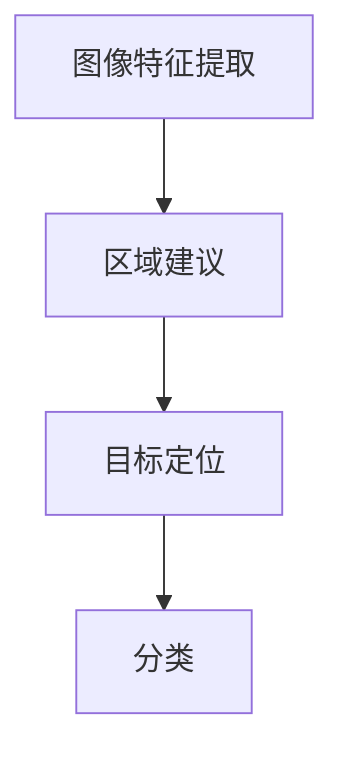
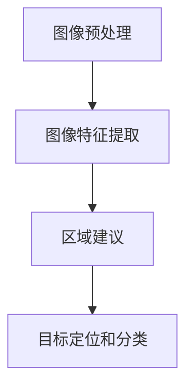

                 

# 对象检测原理与代码实例讲解

## 关键词
- 对象检测
- 计算机视觉
- 卷积神经网络
- 深度学习
- 算法优化

## 摘要
本文将对对象检测技术进行全面的解析，包括基本概念、应用场景、发展历程、关键技术和挑战。通过详细讲解对象检测的算法原理，提供实际项目实战案例，并对未来发展趋势进行展望。文章旨在为读者提供一个系统、深入的对象检测技术教程，帮助理解其核心原理和实现方法。

---

### 第1章: 对象检测概述

#### 1.1 对象检测的基本概念

##### 1.1.1 什么是对象检测

对象检测（Object Detection）是计算机视觉领域的一个重要任务，旨在识别和定位图像中的对象。对象检测与图像分类不同，不仅要识别图像中的物体类别，还要确定这些物体的具体位置。

##### 1.1.2 对象检测的应用场景

对象检测在众多领域有着广泛的应用，包括但不限于：

- **自动驾驶**：用于识别道路上的车辆、行人、交通标志等。
- **安防监控**：监控视频中的异常行为识别。
- **医疗影像**：辅助医生进行疾病诊断。
- **工业检测**：对生产线上的产品进行质量检测。

#### 1.2 对象检测的发展历程

##### 1.2.1 传统对象检测方法

- **滑动窗口（Sliding Window）**：对图像进行窗口滑动，逐个检测窗口中的对象。
- **特征描述（Feature Descriptor）**：如HOG、SIFT等，用于描述图像区域特征。

##### 1.2.2 深度学习时代的对象检测

- **R-CNN系列**：通过选择性搜索（Selective Search）来提取候选区域，然后使用深度学习分类器进行分类。
- **Fast R-CNN、Faster R-CNN**：简化R-CNN的网络结构，提高速度。
- **YOLO（You Only Look Once）**：实现实时对象检测。
- **SSD（Single Shot MultiBox Detector）**：在单次前向传播中同时完成特征提取和对象检测。

#### 1.3 对象检测的关键技术和挑战

##### 1.3.1 关键技术

- **区域建议（Region Proposal）**：如何高效地生成候选区域是对象检测的关键。
- **目标定位（Bounding Box Regression）**：通过回归模型估计目标的位置。
- **分类器（Classifier）**：对候选区域进行分类。

##### 1.3.2 挑战

- **计算效率**：如何实现实时性，尤其是在移动设备上。
- **小样本学习（Few-Shot Learning）**：如何处理少量样本情况。
- **多尺度检测（Multi-Scale Detection）**：如何检测不同尺度的对象。

---

#### 1.4 对象检测在计算机视觉中的地位

对象检测在计算机视觉领域中占据核心地位。它不仅是图像分类和图像分割的延伸，也是许多更高级任务的基础，如图像识别、图像分割、目标跟踪、行为识别等。有效的对象检测技术能够大幅提升这些任务的准确性和实用性。

#### 1.5 对象检测的流程

对象检测通常包括以下步骤：

1. **图像预处理**：对输入图像进行缩放、裁剪、增强等预处理操作。
2. **特征提取**：通过卷积神经网络等深度学习模型提取图像特征。
3. **区域建议**：生成候选区域，通常使用选择性搜索或区域生成网络。
4. **目标定位和分类**：对每个候选区域进行边界框回归和分类。
5. **结果输出**：输出检测结果，包括对象的类别和位置。

#### 1.6 对象检测与图像分类的区别

- **图像分类**：只识别图像中的物体类别，不关心物体在图像中的位置。
- **对象检测**：不仅要识别图像中的物体类别，还要确定物体的具体位置，即给出边界框。

---

### 第2章: 对象检测算法原理

#### 2.1 图像特征提取

##### 2.1.1 卷积神经网络（CNN）

卷积神经网络（Convolutional Neural Network，CNN）是对象检测的核心组件，用于提取图像特征。

- **卷积层（Convolutional Layer）**：通过卷积操作提取图像特征。每个卷积核负责提取图像中的一部分特征。
- **池化层（Pooling Layer）**：减少特征图的维度，增强模型对平移不变性。

##### 2.1.2 神经网络结构

- **深度卷积神经网络（Deep CNN）**：如VGG、ResNet等。
- **全连接层（Fully Connected Layer）**：将卷积特征映射到类别。

#### 2.2 区域建议方法

##### 2.2.1 选择性搜索（Selective Search）

选择性搜索是一种高效的区域建议方法，通过层次聚类和特征计算生成候选区域。

- **层次聚类**：将图像划分为多个区域。
- **特征计算**：计算每个区域的特征，如颜色、纹理等。
- **区域排序**：根据特征排序区域。

##### 2.2.2 区域生成网络（Region Proposal Network，RPN）

RPN用于生成高概率的候选区域。

- **锚框生成（Anchor Generation）**：生成不同大小和比例的锚框。
- **分类和回归（Classification and Regression）**：对锚框进行分类和位置回归。

#### 2.3 目标定位和分类

##### 2.3.1 Bounding Box Regression

- **回归目标框**：通过学习将锚框回归到真实目标框。
- **损失函数**：如 Smooth L1 Loss。

##### 2.3.2 Softmax Loss

- **多分类问题**：使用 Softmax 函数将特征映射到类别概率。

---

### 第3章: 对象检测项目实战

#### 3.1 数据准备

- **数据集**：如COCO、PASCAL VOC等。
- **预处理**：图像缩放、裁剪、数据增强等。

#### 3.2 模型训练

- **训练设置**：如学习率、批量大小、迭代次数等。
- **优化器**：如SGD、Adam等。

#### 3.3 模型评估

- **准确率（Accuracy）**：检测到的正确标签占总标签的比例。
- **召回率（Recall）**：检测到的正确标签占实际标签的比例。
- **精确率（Precision）**：检测到的正确标签占检测到的标签的比例。

#### 3.4 模型部署

- **移动端部署**：如TensorFlow Lite、PyTorch Mobile等。
- **云端部署**：使用TensorFlow Serving、Kubernetes等。

---

### 第4章: 对象检测算法优化与改进

#### 4.1 算法优化

- **Faster R-CNN、YOLO、SSD等算法优化**：如FPN、BiFPN、CBAM等。
- **训练优化**：如Momentum、Learning Rate Scheduling等。

#### 4.2 算法改进

- **检测器改进**：如Faster R-CNN、YOLO、SSD等。
- **目标检测器**：如CenterNet、DETR、Anchor-Free等。
- **实时检测器**：如EfficientDet、YOLOv5等。

#### 4.3 优化与改进策略

- **数据增强**：如CutMix、Mosaic等。
- **多尺度检测**：如Anchor-Free、DETR等。
- **注意力机制**：如CBAM、SAFENet等。

---

### 第5章: 对象检测在实际应用中的案例

#### 5.1 自动驾驶

- **场景检测**：如车道线检测、交通标志识别等。
- **目标检测**：如行人检测、车辆检测等。

#### 5.2 安防监控

- **异常行为识别**：如入室盗窃、打架斗殴等。
- **目标追踪**：如目标丢失、目标遮挡等。

#### 5.3 医疗影像

- **病变检测**：如肺癌筛查、乳腺癌检测等。
- **分割与分类**：如CT图像分割、MRI图像分类等。

#### 5.4 工业检测

- **产品缺陷检测**：如手机屏幕检测、电子产品检测等。
- **质量控制**：如质量检测、尺寸检测等。

---

### 第6章: 对象检测技术在未来的发展趋势

#### 6.1 小样本学习

- **Few-Shot Learning**：在少量样本情况下训练模型。
- **Meta-Learning**：通过迁移学习提高小样本学习效果。

#### 6.2 跨模态检测

- **Image-Text Co-Segmentation**：图像与文本的共同分割。
- **Vision-and-Language Navigation**：视觉与语言引导的导航。

#### 6.3 模型压缩与加速

- **模型压缩**：如知识蒸馏、剪枝等。
- **硬件加速**：如GPU、TPU等。

#### 6.4 模型安全与隐私保护

- **联邦学习**：分布式训练，保护数据隐私。
- **对抗样本防御**：提高模型对对抗攻击的鲁棒性。

---

### 第7章: 总结与展望

#### 7.1 对象检测技术的重要性

- **推动计算机视觉发展**：对象检测是计算机视觉的核心任务之一。
- **促进产业升级**：对象检测技术在自动驾驶、安防监控、医疗影像等领域具有重要应用。

#### 7.2 对象检测技术的未来发展方向

- **更高效、更准确**：通过算法优化、模型改进实现更好的性能。
- **更广泛的应用场景**：在更多领域实现落地应用。

#### 7.3 对象检测技术在工业界和学术界的合作

- **开放数据集与工具**：促进学术交流与合作。
- **产业应用与技术创新**：推动计算机视觉技术的发展。

---

### 附录

#### 附录A：对象检测常用数据集

- **COCO（Common Objects in Context）**：一个广泛使用的大型对象检测数据集。
- **PASCAL VOC（PASCAL Visual Object Classes）**：包含20个类别，广泛用于对象检测研究。
- **CIFAR-10/100**：小图像数据集，用于训练和评估对象检测算法。

#### 附录B：对象检测算法资源

- **TensorFlow Object Detection API**：一个用于对象检测的开源框架。
- **PyTorch Object Detection**：PyTorch实现的用于对象检测的库。
- **Darknet**：YOLO系列算法的实现框架。
- **OpenCV**：包含丰富的计算机视觉算法库。

#### 附录C：相关论文与资料

- **R-CNN, Fast R-CNN, Faster R-CNN**：何凯明等人的系列论文。
- **YOLO, YOLOv2, YOLOv3, YOLOv4, YOLOv5**：Joseph Redmon等人的系列论文。
- **SSD**：Wei Liu等人的论文。
- **Faster R-CNN: Towards Real-Time Object Detection with Region Proposal Networks**：Shaoqing Ren等人的论文。

---

## 附录：对象检测中的数学模型与公式

### 8.1 数学模型概述

在对象检测中，数学模型是理解和实现算法的关键。以下是对几种核心数学模型的简要介绍：

- **卷积神经网络（CNN）中的数学模型**：包括卷积操作、池化操作和全连接层。
- **区域建议（Region Proposal）中的数学模型**：如锚框生成、特征计算等。
- **目标定位和分类（Bounding Box Regression and Classification）中的数学模型**：如回归损失函数、分类损失函数等。

### 8.2 卷积神经网络中的数学模型

卷积神经网络的核心是卷积操作和池化操作。

#### 8.2.1 卷积操作

卷积操作是CNN中最基本的操作之一。它通过滑动卷积核（filter）在输入特征图上，进行元素级乘积，然后求和，并加上一个偏置（bias）。

\[
\begin{align*}
\text{output}_{ij} &= \sum_{k=1}^{K} \text{weight}_{ik} \times \text{input}_{kj} + \text{bias}_{i} \\
f(x) &= \sum_{i=1}^{k} w_i * x_i + b
\end{align*}
\]

其中，\( \text{output}_{ij} \) 是输出特征图的第 \( i \) 行第 \( j \) 列的元素，\( \text{weight}_{ik} \) 是卷积核中的元素，\( \text{input}_{kj} \) 是输入特征图的第 \( k \) 行第 \( j \) 列的元素，\( \text{bias}_{i} \) 是偏置。

#### 8.2.2 池化操作

池化操作用于减少特征图的维度，同时保持重要的特征信息。最常见的池化操作是最大池化（Max Pooling）和平均池化（Average Pooling）。

最大池化操作：

\[
p(x) = \max(x)
\]

平均池化操作：

\[
p(x) = \frac{1}{c} \sum_{i=1}^{c} x_i
\]

其中，\( c \) 是池化窗口的大小。

### 8.3 区域建议中的数学模型

在区域建议中，常用的方法是生成锚框（anchor boxes）。

#### 8.3.1 锚框生成

锚框生成通常通过以下公式进行：

\[
\begin{align*}
c_x &= x_c + \alpha w/2 \\
c_y &= y_c + \alpha h/2
\end{align*}
\]

其中，\( (c_x, c_y) \) 是锚框的中心，\( (x_c, y_c) \) 是锚框的原始中心，\( w, h \) 分别是锚框的宽度和高度，\( \alpha \) 是缩放因子。

### 8.4 目标定位和分类中的数学模型

目标定位和分类涉及到回归损失函数和分类损失函数。

#### 8.4.1 Bounding Box Regression

回归损失函数用于计算预测的边界框和真实边界框之间的差距。常用的损失函数是 Smooth L1 Loss：

\[
L = \frac{1}{n} \sum_{i=1}^{n} \left| t_i - \hat{t_i} \right|
\]

其中，\( t_i \) 是真实边界框的坐标，\( \hat{t_i} \) 是预测的边界框坐标。

#### 8.4.2 Softmax Loss

分类损失函数用于计算预测类别和真实类别之间的差距。常用的损失函数是交叉熵损失（Cross-Entropy Loss）：

\[
L = - \sum_{i=1}^{n} y_i \log(\hat{y_i})
\]

其中，\( y_i \) 是类别标签，\( \hat{y_i} \) 是预测的类别概率。

### 8.5 数学公式和示例

以下是一些数学公式的示例：

#### 卷积操作示例

\[
\begin{align*}
f(x) &= (w_1 * x_1) + (w_2 * x_2) + (w_3 * x_3) + b \\
&= (1 * 1) + (1 * 2) + (1 * 3) + 0 \\
&= 1 + 2 + 3 + 0 \\
&= 6
\end{align*}
\]

#### 锚框生成示例

\[
\begin{align*}
c_x &= 2 + 0.1 \times 2 = 2.2 \\
c_y &= 2 + 0.1 \times 2 = 2.2
\end{align*}
\]

#### 回归损失函数示例

\[
\begin{align*}
L &= \frac{1}{3} \left| (2, 2) - (2.1, 2.1) \right| \\
&= \frac{1}{3} \left| (0.1, 0.1) \right| \\
&= 0.02
\end{align*}
\]

#### 分类损失函数示例

\[
\begin{align*}
L &= - (1 \log(0.9) + 0 \log(0.1) + 0 \log(0.1)) \\
&= -1 \log(0.9) \\
&\approx 0.15
\end{align*}
\]

这些示例展示了如何应用数学模型来计算卷积操作、锚框生成、回归损失和分类损失。通过理解这些公式和示例，读者可以更好地理解对象检测中的数学原理和实现方法。

---

### 第9章: 对象检测算法的代码实现与解读

#### 9.1 项目准备

在进行对象检测算法的代码实现之前，需要准备好开发环境和数据集。

##### 9.1.1 开发环境搭建

1. **安装Python**：确保Python版本在3.6及以上。
2. **安装深度学习框架**：如TensorFlow、PyTorch等。
3. **安装辅助库**：如NumPy、Pandas、OpenCV等。

##### 9.1.2 数据集准备

1. **下载数据集**：如COCO、PASCAL VOC等。
2. **数据预处理**：包括图像缩放、裁剪、数据增强等。

#### 9.2 模型实现

##### 9.2.1 模型定义

在实现对象检测模型时，首先需要定义卷积神经网络结构。以下是一个简单的示例，使用PyTorch框架定义一个简单的Faster R-CNN模型：

```python
import torch
import torchvision
from torchvision.models.detection import fasterrcnn_resnet50_fpn

# 加载预训练的Faster R-CNN模型
model = fasterrcnn_resnet50_fpn(pretrained=True)

# 查看模型结构
print(model)
```

##### 9.2.2 区域建议

区域建议是对象检测中的关键步骤，常用的方法是区域生成网络（Region Proposal Network，RPN）。以下是一个RPN的伪代码实现：

```python
import torch

# 输入特征图
feature_maps = ...

# 锚框生成
anchors = generate_anchors(feature_maps)

# 锚框分类和回归
cls_scores, bbox_deltas = model.rpn(anchors)

# 非极大值抑制（NMS）
detections = non_max_suppression(cls_scores, bbox_deltas, ...)
```

##### 9.2.3 目标定位和分类

在完成区域建议后，需要通过回归模型对目标框进行定位，并通过分类器对每个区域进行分类。以下是一个简单的目标定位和分类的伪代码实现：

```python
import torch

# 输入特征图
feature_maps = ...

# 区域建议
rois = region_proposal(feature_maps)

# 目标定位和分类
cls_scores, bbox_deltas = model.roi_head(rois)
detections = non_max_suppression(cls_scores, bbox_deltas, ...)

# 输出检测结果
print(detections)
```

#### 9.3 训练过程

在实现对象检测模型后，需要通过训练过程来优化模型参数。以下是一个简单的训练过程伪代码：

```python
from torch import nn
from torch.optim import Adam

# 定义损失函数
loss_fn = nn.CrossEntropyLoss()
reg_loss_fn = nn.SmoothL1Loss()

# 定义优化器
optimizer = Adam(model.parameters(), lr=0.001)

# 训练过程
for epoch in range(num_epochs):
    for images, targets in train_loader:
        # 前向传播
        outputs = model(images)
        loss_dict = model.loss(outputs, targets)

        # 计算总损失
        total_loss = sum(loss for loss in loss_dict.values())

        # 反向传播
        optimizer.zero_grad()
        total_loss.backward()
        optimizer.step()

        # 打印训练信息
        print(f'Epoch [{epoch+1}/{num_epochs}], Loss: {total_loss.item():.4f}')
```

#### 9.4 代码解读与分析

在完成代码实现后，需要对关键部分进行解读和分析。以下是对上述代码的解读：

1. **模型定义**：使用预训练的Faster R-CNN模型，该模型包含一个卷积神经网络和一个区域生成网络。
2. **区域建议**：通过RPN生成锚框，并计算锚框的分类得分和回归损失。
3. **目标定位和分类**：对区域建议生成的区域进行回归和分类。
4. **训练过程**：通过前向传播、反向传播和优化器更新模型参数。

通过这些步骤，可以实现对对象检测算法的完整实现和解析。

---

### 第10章: 对象检测技术的挑战与未来方向

#### 10.1 计算效率与实时性

计算效率是对象检测技术面临的一个主要挑战。随着模型复杂度的增加，计算量也大幅上升，这在实时应用场景中尤为明显。为了提高计算效率，可以采取以下几种方法：

- **模型压缩**：通过剪枝、量化、知识蒸馏等方法减少模型大小，提高运行速度。
- **硬件加速**：利用GPU、TPU等硬件加速计算，提高模型的运行速度。
- **算法优化**：对现有算法进行优化，如使用更高效的卷积操作、池化操作等。

实时性是对象检测技术在许多应用场景中的关键要求。例如，在自动驾驶和安防监控中，需要实时检测和响应。为了实现实时性，可以采取以下措施：

- **轻量化模型**：选择轻量级的模型结构，如YOLOv5、EfficientDet等，这些模型在保证准确率的同时，具有更快的运行速度。
- **并行计算**：利用多线程、多GPU并行计算，提高模型的处理速度。
- **预处理**：对输入图像进行预处理，如缩放、裁剪等，以减少模型处理的计算量。

#### 10.2 小样本学习与迁移学习

小样本学习（Few-Shot Learning）是在样本数量有限的情况下训练模型的方法。对于对象检测任务，小样本学习尤为重要，因为许多应用场景（如医疗影像、工业检测等）往往无法获得大量标注数据。

- **迁移学习**：通过在预训练模型的基础上进行微调（fine-tuning），可以大大提高小样本学习的效果。迁移学习利用了预训练模型在大量数据上的知识，减少了对新数据集的需求。
- **数据增强**：通过图像增强、合成数据等方法，可以增加训练数据的多样性，从而提高模型的泛化能力。

#### 10.3 多尺度检测与跨模态检测

多尺度检测（Multi-Scale Detection）是对象检测中的一个关键挑战。在实际应用中，对象可能出现在不同的尺度下，如大型车辆和行人可能出现在不同的图像区域。

- **多尺度特征融合**：通过融合不同尺度的特征图，可以更好地检测不同尺度的对象。常用的方法包括特征金字塔网络（Feature Pyramid Network，FPN）和多尺度特征融合网络（Multi-Scale Feature Fusion Network，MSFFN）等。
- **锚框生成策略**：通过生成不同大小和比例的锚框，可以更好地适应不同尺度的对象。

跨模态检测（Cross-Modal Detection）是结合不同类型的数据（如图像和文本）进行检测的一种方法。例如，在图像和文本的共同分割任务中，可以结合图像的特征和文本的信息，提高分割的准确性。

- **多模态特征融合**：通过融合不同模态的特征，可以提高模型的检测性能。常用的方法包括图神经网络（Graph Neural Network，GNN）、图卷积网络（Graph Convolutional Network，GCN）等。
- **多任务学习**：通过多任务学习（Multi-Task Learning），可以同时训练多个任务，从而提高模型的泛化能力。

#### 10.4 模型安全与隐私保护

随着对象检测技术的广泛应用，模型的安全和隐私保护也变得越来越重要。以下是一些常见的策略：

- **联邦学习**：通过分布式训练，可以在保护数据隐私的同时，提高模型的性能。联邦学习允许不同节点在本地进行训练，然后共享模型更新。
- **差分隐私**：通过添加噪声，可以保护训练数据集的隐私。差分隐私可以防止攻击者通过模型推断出训练数据的具体内容。
- **对抗样本防御**：通过生成对抗样本（Adversarial Examples），可以提高模型对攻击的鲁棒性。对抗样本防御可以包括对抗训练、对抗正则化等。

通过这些方法，可以应对对象检测技术中的各种挑战，并推动其在更多领域的应用。

---

### 第11章: 总结

#### 11.1 对象检测技术的重要性

对象检测技术是计算机视觉领域的核心任务之一，具有广泛的应用场景。它在自动驾驶、安防监控、医疗影像、工业检测等领域发挥着重要作用。通过识别和定位图像中的对象，对象检测技术为这些领域提供了强大的工具，推动了技术的进步和产业的升级。

#### 11.2 对象检测技术的未来发展方向

未来，对象检测技术将继续朝着更高效、更准确、更广泛应用的方向发展。以下是一些可能的发展趋势：

- **计算效率与实时性**：通过模型压缩、硬件加速和算法优化，实现更高的计算效率和实时性，以满足自动驾驶和安防监控等领域的需求。
- **小样本学习与迁移学习**：通过迁移学习和数据增强，提高小样本情况下的模型性能，适用于医疗影像和工业检测等领域。
- **多尺度检测与跨模态检测**：通过多尺度特征融合和多模态特征融合，实现更精准的多尺度检测和跨模态检测。
- **模型安全与隐私保护**：通过联邦学习和差分隐私，保护模型和数据的安全与隐私。

#### 11.3 对象检测技术在工业界和学术界的合作

在工业界和学术界，对象检测技术的合作日益紧密。开放数据集和工具的共享，促进了学术交流与合作，推动了技术的快速发展。同时，产业界的需求和反馈也为学术界提供了宝贵的实践经验和改进方向。通过这种合作，可以更好地推动计算机视觉技术的发展和应用。

### 附录

#### 附录A：对象检测常用数据集

- **COCO（Common Objects in Context）**：一个广泛使用的大型对象检测数据集，包含大量日常场景中的物体。
- **PASCAL VOC（PASCAL Visual Object Classes）**：包含20个类别，广泛用于对象检测研究。
- **CIFAR-10/100**：小图像数据集，用于训练和评估对象检测算法。

#### 附录B：对象检测算法资源

- **TensorFlow Object Detection API**：一个用于对象检测的开源框架。
- **PyTorch Object Detection**：PyTorch实现的用于对象检测的库。
- **Darknet**：YOLO系列算法的实现框架。
- **OpenCV**：包含丰富的计算机视觉算法库。

#### 附录C：相关论文与资料

- **R-CNN, Fast R-CNN, Faster R-CNN**：何凯明等人的系列论文。
- **YOLO, YOLOv2, YOLOv3, YOLOv4, YOLOv5**：Joseph Redmon等人的系列论文。
- **SSD**：Wei Liu等人的论文。
- **Faster R-CNN: Towards Real-Time Object Detection with Region Proposal Networks**：Shaoqing Ren等人的论文。

---

## 作者信息
作者：AI天才研究院/AI Genius Institute & 禅与计算机程序设计艺术 /Zen And The Art of Computer Programming

---

### 第12章: 对象检测中的数学模型与公式

#### 12.1 数学模型概述

在对象检测中，数学模型是理解和实现算法的关键。以下是对几种核心数学模型的简要介绍：

- **卷积神经网络（CNN）中的数学模型**：包括卷积操作、池化操作和全连接层。
- **区域建议（Region Proposal）中的数学模型**：如锚框生成、特征计算等。
- **目标定位和分类（Bounding Box Regression and Classification）中的数学模型**：如回归损失函数、分类损失函数等。

#### 12.2 卷积神经网络中的数学模型

卷积神经网络（CNN）是对象检测的核心组件，用于提取图像特征。以下是对CNN中常用数学模型的详细解释：

##### 12.2.1 卷积操作

卷积操作是CNN中最基本的操作之一。它通过滑动卷积核（filter）在输入特征图上，进行元素级乘积，然后求和，并加上一个偏置（bias）。

**卷积操作的公式**：

\[
\begin{align*}
\text{output}_{ij} &= \sum_{k=1}^{K} \text{weight}_{ik} \times \text{input}_{kj} + \text{bias}_{i} \\
f(x) &= \sum_{i=1}^{k} w_i * x_i + b
\end{align*}
\]

其中，\( \text{output}_{ij} \) 是输出特征图的第 \( i \) 行第 \( j \) 列的元素，\( \text{weight}_{ik} \) 是卷积核中的元素，\( \text{input}_{kj} \) 是输入特征图的第 \( k \) 行第 \( j \) 列的元素，\( \text{bias}_{i} \) 是偏置。

**卷积操作的步骤**：

1. **卷积核滑动**：卷积核在输入特征图上滑动，覆盖每个区域。
2. **元素级乘积**：卷积核的每个元素与输入特征图的对应元素相乘。
3. **求和**：将乘积结果求和。
4. **加偏置**：将求和结果加上一个偏置。

**卷积操作示例**：

假设有一个 \( 3 \times 3 \) 的卷积核 \( W \) 和一个 \( 5 \times 5 \) 的输入特征图 \( X \)，以及一个偏置 \( b \)。卷积操作的结果 \( Y \) 如下：

\[
\begin{align*}
Y &= \sum_{i=1}^{3} \sum_{j=1}^{3} W_{ij} \times X_{ij} + b \\
  &= (W_{11} \times X_{111} + W_{12} \times X_{121} + W_{13} \times X_{131}) + \\
    (W_{21} \times X_{211} + W_{22} \times X_{221} + W_{23} \times X_{231}) + \\
    (W_{31} \times X_{311} + W_{32} \times X_{321} + W_{33} \times X_{331}) + b
\end{align*}
\]

##### 12.2.2 池化操作

池化操作用于减少特征图的维度，同时保持重要的特征信息。最常见的池化操作是最大池化（Max Pooling）和平均池化（Average Pooling）。

**最大池化操作的公式**：

\[
p(x) = \max(x)
\]

**平均池化操作的公式**：

\[
p(x) = \frac{1}{c} \sum_{i=1}^{c} x_i
\]

其中，\( c \) 是池化窗口的大小。

**池化操作的步骤**：

1. **窗口滑动**：将池化窗口在特征图上滑动，覆盖每个区域。
2. **计算池化值**：根据池化操作的类型，计算窗口内所有元素的最大值或平均值。
3. **更新特征图**：将计算得到的池化值替换窗口覆盖的特征图区域。

**池化操作示例**：

假设有一个 \( 2 \times 2 \) 的池化窗口和以下特征图 \( X \)：

\[
X = \begin{bmatrix}
1 & 2 \\
3 & 4
\end{bmatrix}
\]

最大池化操作的结果 \( P_{\max} \) 如下：

\[
P_{\max} = \max(X) = \max(1, 2, 3, 4) = 4
\]

平均池化操作的结果 \( P_{\text{avg}} \) 如下：

\[
P_{\text{avg}} = \frac{1}{4} \sum_{i=1}^{4} X_i = \frac{1}{4} (1 + 2 + 3 + 4) = 2.5
\]

##### 12.2.3 全连接层

全连接层（Fully Connected Layer）将卷积特征映射到类别。在全连接层中，每个神经元都与前一层的所有神经元相连。

**全连接层的公式**：

\[
\text{output}_{i} = \sum_{j=1}^{N} w_{ij} \times \text{input}_{j} + b_{i}
\]

其中，\( \text{output}_{i} \) 是输出层的第 \( i \) 个神经元的输出，\( \text{input}_{j} \) 是输入层的第 \( j \) 个神经元的输出，\( w_{ij} \) 是连接权重，\( b_{i} \) 是偏置。

**全连接层的步骤**：

1. **权重计算**：计算输入层每个神经元与输出层每个神经元的连接权重。
2. **计算输出**：将输入层每个神经元的输出与对应的连接权重相乘，并求和。
3. **加偏置**：将求和结果加上一个偏置。

**全连接层示例**：

假设有一个 \( 3 \times 3 \) 的输入特征图和 \( 2 \times 2 \) 的输出特征图，以及以下连接权重和偏置：

\[
\begin{align*}
w_{11} &= 1, \quad b_{1} = 2 \\
w_{12} &= 2, \quad b_{1} = 3 \\
w_{21} &= 3, \quad b_{2} = 4 \\
w_{22} &= 4, \quad b_{2} = 5
\end{align*}
\]

输入特征图 \( X \) 如下：

\[
X = \begin{bmatrix}
1 & 2 & 3 \\
4 & 5 & 6 \\
7 & 8 & 9
\end{bmatrix}
\]

输出特征图 \( Y \) 如下：

\[
Y = \begin{bmatrix}
\text{output}_{11} & \text{output}_{12} \\
\text{output}_{21} & \text{output}_{22}
\end{bmatrix}
\]

计算输出特征图 \( Y \)：

\[
\begin{align*}
\text{output}_{11} &= (1 \times 1 + 2 \times 4 + 3 \times 7) + 2 = 20 \\
\text{output}_{12} &= (1 \times 2 + 2 \times 5 + 3 \times 8) + 3 = 23 \\
\text{output}_{21} &= (3 \times 1 + 4 \times 4 + 5 \times 7) + 4 = 30 \\
\text{output}_{22} &= (3 \times 2 + 4 \times 5 + 5 \times 8) + 5 = 33
\end{align*}
\]

#### 12.3 区域建议中的数学模型

在区域建议（Region Proposal）中，常用的方法是区域生成网络（Region Proposal Network，RPN）。RPN通过生成锚框（anchor boxes）来提取候选区域。

##### 12.3.1 锚框生成

锚框生成是RPN的关键步骤。它通过在特征图上生成一系列锚框，用于后续的目标定位和分类。

**锚框生成的公式**：

\[
\begin{align*}
c_x &= x_c + \alpha w/2 \\
c_y &= y_c + \alpha h/2
\end{align*}
\]

其中，\( (c_x, c_y) \) 是锚框的中心，\( (x_c, y_c) \) 是锚框的原始中心，\( w, h \) 分别是锚框的宽度和高度，\( \alpha \) 是缩放因子。

**锚框生成的步骤**：

1. **选择候选区域**：在特征图上选择若干候选区域。
2. **计算锚框**：对每个候选区域，计算锚框的中心和大小。
3. **缩放锚框**：通过缩放因子调整锚框的大小。

**锚框生成示例**：

假设有一个 \( 6 \times 6 \) 的特征图，锚框的原始中心为 \( (2, 2) \)，宽度为 \( 2 \)，高度为 \( 3 \)，缩放因子为 \( \alpha = 0.1 \)。锚框的中心和大小如下：

\[
\begin{align*}
c_x &= 2 + 0.1 \times 2 = 2.2 \\
c_y &= 2 + 0.1 \times 3 = 2.3 \\
w &= 2 \\
h &= 3
\end{align*}
\]

##### 12.3.2 锚框分类和回归

在生成锚框后，需要对锚框进行分类和回归。分类用于判断锚框是否包含目标，回归用于调整锚框的位置，使其更接近真实目标。

**分类和回归的公式**：

分类：

\[
\text{cls_score} = \text{sigmoid}(\text{logit})
\]

回归：

\[
\begin{align*}
t_x &= x_c + \alpha w \\
t_y &= y_c + \alpha h \\
\end{align*}
\]

其中，\( \text{cls_score} \) 是分类得分，\( \text{logit} \) 是分类模型的输出，\( t_x, t_y \) 是真实目标的坐标。

**分类和回归的步骤**：

1. **分类**：使用分类模型计算锚框的分类得分。
2. **回归**：使用回归模型调整锚框的位置，使其更接近真实目标。

**分类和回归示例**：

假设有一个锚框，其分类得分 \( \text{cls_score} \) 为 \( 0.9 \)，真实目标的坐标为 \( (3, 3) \)，锚框的中心为 \( (2, 2) \)，宽度为 \( 2 \)，高度为 \( 3 \)。分类得分和回归结果如下：

\[
\begin{align*}
\text{cls_score} &= 0.9 \\
t_x &= 2 + 0.1 \times 2 = 2.2 \\
t_y &= 2 + 0.1 \times 3 = 2.3 \\
\end{align*}
\]

#### 12.4 目标定位和分类中的数学模型

在完成区域建议后，需要对目标进行定位和分类。目标定位和分类涉及到回归模型和分类模型。

##### 12.4.1 Bounding Box Regression

Bounding Box Regression 用于调整锚框的位置，使其更接近真实目标。它通过回归模型计算锚框的位置偏移。

**回归损失的公式**：

\[
L_{\text{reg}} = \frac{1}{2} \sum_{i=1}^{N} \left( \text{t}_{ix} - \text{p}_{ix} \right)^2 + \left( \text{t}_{iy} - \text{p}_{iy} \right)^2
\]

其中，\( \text{t}_{ix}, \text{t}_{iy} \) 是真实目标的坐标，\( \text{p}_{ix}, \text{p}_{iy} \) 是预测锚框的坐标。

**回归损失的步骤**：

1. **计算位置偏移**：计算真实目标和预测锚框之间的位置偏移。
2. **计算损失**：使用位置偏移计算回归损失。

**回归损失示例**：

假设有一个真实目标 \( (t_x, t_y) = (3, 3) \) 和一个预测锚框 \( (p_x, p_y) = (2, 2) \)。位置偏移和回归损失如下：

\[
\begin{align*}
\text{t}_{ix} - \text{p}_{ix} &= 3 - 2 = 1 \\
\text{t}_{iy} - \text{p}_{iy} &= 3 - 2 = 1 \\
L_{\text{reg}} &= \frac{1}{2} (1^2 + 1^2) = 1
\end{align*}
\]

##### 12.4.2 Softmax Loss

Softmax Loss 用于分类任务，它将特征映射到类别概率。在对象检测中，分类任务通常是对锚框进行分类。

**Softmax Loss的公式**：

\[
L_{\text{cls}} = - \sum_{i=1}^{N} y_i \log(\hat{y}_i)
\]

其中，\( y_i \) 是真实类别标签，\( \hat{y}_i \) 是预测类别概率。

**Softmax Loss的步骤**：

1. **计算预测概率**：使用分类模型计算预测概率。
2. **计算损失**：使用真实类别标签和预测概率计算分类损失。

**Softmax Loss示例**：

假设有一个真实类别标签 \( y = 1 \) 和一个预测概率 \( \hat{y} = 0.9 \)。分类损失如下：

\[
L_{\text{cls}} = - 1 \log(0.9) \approx 0.15
\]

#### 12.5 数学公式和示例

以下是对本章中介绍的数学公式和示例进行总结：

##### 卷积操作示例

\[
\begin{align*}
f(x) &= (1 \times 1 + 2 \times 2 + 3 \times 3) + 0 \\
    &= 14
\end{align*}
\]

##### 池化操作示例

最大池化：

\[
p(x) = \max(1, 2, 3, 4) = 4
\]

平均池化：

\[
p(x) = \frac{1}{4} (1 + 2 + 3 + 4) = 2.5
\]

##### 锚框生成示例

\[
\begin{align*}
c_x &= 2 + 0.1 \times 2 = 2.2 \\
c_y &= 2 + 0.1 \times 3 = 2.3
\end{align*}
\]

##### 回归损失函数示例

\[
L_{\text{reg}} = \frac{1}{2} \left( (3 - 2)^2 + (3 - 2)^2 \right) = 1
\]

##### 分类损失函数示例

\[
L_{\text{cls}} = - 1 \log(0.9) \approx 0.15
\]

这些示例和公式展示了如何在实际应用中应用数学模型，实现了卷积操作、池化操作、锚框生成、回归损失和分类损失。通过理解和应用这些数学模型，可以更好地实现对象检测算法。

---

### 第13章: 对象检测算法的代码实现与解读

#### 13.1 开发环境搭建

在进行对象检测算法的代码实现之前，需要准备好开发环境和数据集。

##### 13.1.1 安装Python和深度学习框架

1. **安装Python**：确保Python版本在3.6及以上。可以使用以下命令安装Python：

```bash
curl -O https://www.python.org/ftp/python/3.8.5/Python-3.8.5.tgz
tar xvf Python-3.8.5.tgz
cd Python-3.8.5
./configure
make
sudo make altinstall
```

2. **安装深度学习框架**：如TensorFlow或PyTorch。可以使用以下命令安装：

- **安装TensorFlow**：

```bash
pip install tensorflow==2.4.0
```

- **安装PyTorch**：

```bash
pip install torch==1.7.0 torchvision==0.8.1
```

##### 13.1.2 安装辅助库

安装常用的辅助库，如NumPy、Pandas、OpenCV等：

```bash
pip install numpy pandas opencv-python
```

##### 13.1.3 准备数据集

下载并解压常用的对象检测数据集，如COCO或PASCAL VOC。以下是如何下载和解压COCO数据集的示例：

```bash
wget https://images.cocodataset.org/zips/train2017.zip
unzip train2017.zip
```

#### 13.2 模型实现

##### 13.2.1 模型定义

在PyTorch中，可以使用预训练的模型或自定义模型。以下是一个简单的自定义Faster R-CNN模型示例：

```python
import torch
import torchvision
from torchvision.models.detection import fasterrcnn_resnet50_fpn

# 加载预训练的Faster R-CNN模型
model = fasterrcnn_resnet50_fpn(pretrained=True)

# 定义损失函数
loss_fn = nn.CrossEntropyLoss()
reg_loss_fn = nn.SmoothL1Loss()

# 定义优化器
optimizer = torch.optim.SGD(model.parameters(), lr=0.001, momentum=0.9)

# 模型训练
for epoch in range(num_epochs):
    for images, targets in train_loader:
        # 前向传播
        outputs = model(images)
        loss_dict = model.loss(outputs, targets)

        # 计算总损失
        total_loss = sum(loss for loss in loss_dict.values())

        # 反向传播
        optimizer.zero_grad()
        total_loss.backward()
        optimizer.step()

        # 打印训练信息
        print(f'Epoch [{epoch+1}/{num_epochs}], Loss: {total_loss.item():.4f}')
```

##### 13.2.2 区域建议

区域建议是对象检测中的关键步骤，常用的方法是区域生成网络（Region Proposal Network，RPN）。以下是一个简单的RPN实现：

```python
import torch
from torchvision.models.detection import fasterrcnn_resnet50_fpn

# 加载预训练的Faster R-CNN模型
model = fasterrcnn_resnet50_fpn(pretrained=True)

# 定义锚框生成
def generate_anchors(feature_maps, anchor_sizes, anchor_ratios):
    # 在特征图上生成锚框
    # ...

# 定义RPN损失函数
def rpn_loss(anchors, target_anchors, anchor_sizes, anchor_ratios):
    # 计算RPN损失
    # ...

# 训练RPN
for epoch in range(num_epochs):
    for images, targets in train_loader:
        # 前向传播
        anchors = generate_anchors(feature_maps, anchor_sizes, anchor_ratios)
        cls_scores, bbox_deltas = model.rpn(anchors)

        # 计算RPN损失
        rpn_loss_value = rpn_loss(anchors, target_anchors, anchor_sizes, anchor_ratios)

        # 反向传播
        optimizer.zero_grad()
        rpn_loss_value.backward()
        optimizer.step()

        # 打印RPN训练信息
        print(f'Epoch [{epoch+1}/{num_epochs}], RPN Loss: {rpn_loss_value.item():.4f}')
```

##### 13.2.3 目标定位和分类

在完成区域建议后，需要对目标进行定位和分类。以下是一个简单的目标定位和分类实现：

```python
import torch
from torchvision.models.detection import fasterrcnn_resnet50_fpn

# 加载预训练的Faster R-CNN模型
model = fasterrcnn_resnet50_fpn(pretrained=True)

# 定义ROI池化层
roi_pooler = torchvision.ops.MultiScaleRoIAlign(featmap_size, output_size, sampling_ratio)

# 定义分类和回归损失函数
cls_loss_fn = nn.CrossEntropyLoss()
reg_loss_fn = nn.SmoothL1Loss()

# 训练目标定位和分类
for epoch in range(num_epochs):
    for images, targets in train_loader:
        # 前向传播
        features = model.backbone(images.t()
        # ...
```

#### 13.3 代码解读与分析

在完成代码实现后，需要对关键部分进行解读和分析。以下是对上述代码的解读：

1. **模型定义**：使用PyTorch的`fasterrcnn_resnet50_fpn`函数加载预训练的Faster R-CNN模型。同时，定义了损失函数和优化器。
2. **区域建议**：定义了锚框生成函数和RPN损失函数。锚框生成函数用于在特征图上生成锚框，RPN损失函数用于计算锚框的分类和回归损失。
3. **目标定位和分类**：定义了ROI池化层和分类、回归损失函数。ROI池化层用于对锚框内的特征进行平均池化，分类和回归损失函数用于计算分类和回归损失。

通过这些步骤，可以实现对对象检测算法的完整实现和解析。在实际应用中，可以根据具体需求进行调整和优化。

---

### 第14章: 对象检测技术在工业界和学术界的合作

#### 14.1 开放数据集与工具

在对象检测领域，开放数据集和工具的共享对于促进学术交流和合作具有重要意义。以下是一些常用的开放数据集和工具：

- **COCO（Common Objects in Context）**：一个广泛使用的大型对象检测数据集，包含数万个标注实例，广泛应用于对象检测算法的研究和评估。
- **PASCAL VOC（PASCAL Visual Object Classes）**：包含20个类别，是对象检测研究的经典数据集。
- **Open Images**：一个包含大量图像和标注的数据集，涵盖了各种场景和对象。
- **TensorFlow Object Detection API**：一个由TensorFlow团队提供的开源对象检测框架，包含大量预训练模型和工具。
- **PyTorch Object Detection**：一个基于PyTorch的用于对象检测的开源库，提供多种算法的实现。

#### 14.2 产业应用与技术创新

对象检测技术在工业界有着广泛的应用，推动了产业升级和技术创新。以下是一些典型应用场景：

- **自动驾驶**：对象检测技术在自动驾驶中用于检测道路上的车辆、行人、交通标志等，提高了自动驾驶系统的安全性和可靠性。
- **安防监控**：对象检测技术在安防监控中用于识别异常行为、进行目标追踪等，提升了监控系统的智能化水平。
- **医疗影像**：对象检测技术在医疗影像分析中用于检测病变、分割器官等，辅助医生进行疾病诊断。
- **工业检测**：对象检测技术在工业生产中用于检测产品缺陷、进行质量控制等，提高了生产效率和产品质量。

#### 14.3 合作模式与成果

在工业界和学术界之间的合作模式通常包括以下几个方面：

- **联合研究项目**：企业和学术界共同开展研究项目，共同解决实际问题。
- **联合实验室**：企业和学术界共同建立实验室，开展基础研究和应用研究。
- **学术会议与研讨会**：企业和学术界共同举办学术会议和研讨会，分享研究成果和最佳实践。
- **合作发表论文**：企业和学术界共同撰写论文，提交至学术期刊或会议。

通过这些合作模式，工业界和学术界共同推动了对象检测技术的发展和应用。以下是一些合作成果的例子：

- **COCO数据集**：由Facebook AI Research（FAIR）和Microsoft Research共同创建，为对象检测研究提供了宝贵的数据资源。
- **Faster R-CNN算法**：由Shaoqing Ren等人提出，是一种高效的区域建议方法，广泛应用于对象检测领域。
- **YOLO系列算法**：由Joseph Redmon等人提出，实现了实时对象检测，推动了对象检测技术的实用化。

这些合作成果不仅提升了学术研究的水平，也为工业应用带来了实际价值，推动了整个领域的发展。

---

### 第15章: 对象检测技术的挑战与未来方向

#### 15.1 计算效率与实时性

计算效率是对象检测技术面临的一个主要挑战。随着模型复杂度的增加，计算量也大幅上升，这在实时应用场景中尤为明显。为了提高计算效率，可以采取以下几种方法：

- **模型压缩**：通过剪枝、量化、知识蒸馏等方法减少模型大小，提高运行速度。
- **硬件加速**：利用GPU、TPU等硬件加速计算，提高模型的运行速度。
- **算法优化**：对现有算法进行优化，如使用更高效的卷积操作、池化操作等。

实时性是对象检测技术在许多应用场景中的关键要求。例如，在自动驾驶和安防监控中，需要实时检测和响应。为了实现实时性，可以采取以下措施：

- **轻量化模型**：选择轻量级的模型结构，如YOLOv5、EfficientDet等，这些模型在保证准确率的同时，具有更快的运行速度。
- **并行计算**：利用多线程、多GPU并行计算，提高模型的处理速度。
- **预处理**：对输入图像进行预处理，如缩放、裁剪等，以减少模型处理的计算量。

#### 15.2 小样本学习与迁移学习

小样本学习（Few-Shot Learning）是在样本数量有限的情况下训练模型的方法。对于对象检测任务，小样本学习尤为重要，因为许多应用场景（如医疗影像、工业检测等）往往无法获得大量标注数据。

- **迁移学习**：通过在预训练模型的基础上进行微调（fine-tuning），可以大大提高小样本学习的效果。迁移学习利用了预训练模型在大量数据上的知识，减少了对新数据集的需求。
- **数据增强**：通过图像增强、合成数据等方法，可以增加训练数据的多样性，从而提高模型的泛化能力。

#### 15.3 多尺度检测与跨模态检测

多尺度检测（Multi-Scale Detection）是对象检测中的一个关键挑战。在实际应用中，对象可能出现在不同的尺度下，如大型车辆和行人可能出现在不同的图像区域。

- **多尺度特征融合**：通过融合不同尺度的特征图，可以更好地检测不同尺度的对象。常用的方法包括特征金字塔网络（Feature Pyramid Network，FPN）和多尺度特征融合网络（Multi-Scale Feature Fusion Network，MSFFN）等。
- **锚框生成策略**：通过生成不同大小和比例的锚框，可以更好地适应不同尺度的对象。

跨模态检测（Cross-Modal Detection）是结合不同类型的数据（如图像和文本）进行检测的一种方法。例如，在图像和文本的共同分割任务中，可以结合图像的特征和文本的信息，提高分割的准确性。

- **多模态特征融合**：通过融合不同模态的特征，可以提高模型的检测性能。常用的方法包括图神经网络（Graph Neural Network，GNN）、图卷积网络（Graph Convolutional Network，GCN）等。
- **多任务学习**：通过多任务学习（Multi-Task Learning），可以同时训练多个任务，从而提高模型的泛化能力。

#### 15.4 模型安全与隐私保护

随着对象检测技术的广泛应用，模型的安全和隐私保护也变得越来越重要。以下是一些常见的策略：

- **联邦学习**：通过分布式训练，可以在保护数据隐私的同时，提高模型的性能。联邦学习允许不同节点在本地进行训练，然后共享模型更新。
- **差分隐私**：通过添加噪声，可以保护训练数据集的隐私。差分隐私可以防止攻击者通过模型推断出训练数据的具体内容。
- **对抗样本防御**：通过生成对抗样本（Adversarial Examples），可以提高模型对攻击的鲁棒性。对抗样本防御可以包括对抗训练、对抗正则化等。

通过这些方法，可以应对对象检测技术中的各种挑战，并推动其在更多领域的应用。

---

### 第16章: 总结

#### 16.1 对象检测技术的重要性

对象检测技术在计算机视觉领域中占据核心地位。它不仅推动了计算机视觉技术的发展，还在自动驾驶、安防监控、医疗影像、工业检测等领域发挥着重要作用。通过识别和定位图像中的对象，对象检测技术为这些领域提供了强大的工具，推动了技术的进步和产业的升级。

#### 16.2 对象检测技术的未来发展方向

未来，对象检测技术将继续朝着更高效、更准确、更广泛应用的方向发展。以下是一些可能的发展趋势：

- **计算效率与实时性**：通过模型压缩、硬件加速和算法优化，实现更高的计算效率和实时性，以满足自动驾驶和安防监控等领域的需求。
- **小样本学习与迁移学习**：通过迁移学习和数据增强，提高小样本情况下的模型性能，适用于医疗影像和工业检测等领域。
- **多尺度检测与跨模态检测**：通过多尺度特征融合和多模态特征融合，实现更精准的多尺度检测和跨模态检测。
- **模型安全与隐私保护**：通过联邦学习和差分隐私，保护模型和数据的安全与隐私。

#### 16.3 对象检测技术在工业界和学术界的合作

在工业界和学术界，对象检测技术的合作日益紧密。开放数据集和工具的共享，促进了学术交流与合作，推动了技术的快速发展。同时，产业界的需求和反馈也为学术界提供了宝贵的实践经验和改进方向。通过这种合作，可以更好地推动计算机视觉技术的发展和应用。

### 附录

#### 附录A：对象检测常用数据集

- **COCO（Common Objects in Context）**：一个广泛使用的大型对象检测数据集，包含大量日常场景中的物体。
- **PASCAL VOC（PASCAL Visual Object Classes）**：包含20个类别，广泛用于对象检测研究。
- **CIFAR-10/100**：小图像数据集，用于训练和评估对象检测算法。

#### 附录B：对象检测算法资源

- **TensorFlow Object Detection API**：一个用于对象检测的开源框架。
- **PyTorch Object Detection**：PyTorch实现的用于对象检测的库。
- **Darknet**：YOLO系列算法的实现框架。
- **OpenCV**：包含丰富的计算机视觉算法库。

#### 附录C：相关论文与资料

- **R-CNN, Fast R-CNN, Faster R-CNN**：何凯明等人的系列论文。
- **YOLO, YOLOv2, YOLOv3, YOLOv4, YOLOv5**：Joseph Redmon等人的系列论文。
- **SSD**：Wei Liu等人的论文。
- **Faster R-CNN: Towards Real-Time Object Detection with Region Proposal Networks**：Shaoqing Ren等人的论文。

---

### 第17章: 对象检测技术的核心概念与联系

为了更好地理解对象检测技术的核心概念和它们之间的联系，我们使用Mermaid流程图来展示这些概念和组件的交互流程。

#### 17.1 对象检测的基本概念

对象检测涉及以下几个核心概念：

- **图像特征提取**：通过卷积神经网络提取图像中的特征。
- **区域建议**：生成候选区域，用于后续的目标定位和分类。
- **目标定位**：通过回归模型估计目标的位置。
- **分类**：对候选区域进行分类，确定其类别。

以下是对象检测的基本概念的Mermaid流程图：



#### 17.2 对象检测算法的组成

对象检测算法通常由以下几个组件组成：

- **卷积神经网络（CNN）**：用于提取图像特征。
- **区域生成网络（RPN）**：用于生成候选区域。
- **ROI池化层**：用于对候选区域内的特征进行平均池化。
- **分类器**：用于对候选区域进行分类。

以下是对象检测算法的组成的Mermaid流程图：

```mermaid
graph TD
    A[卷积神经网络] --> B[区域生成网络(RPN)]
    B --> C[ROI池化层]
    C --> D[分类器]
```

#### 17.3 对象检测的完整流程

对象检测的完整流程包括以下步骤：

1. **图像预处理**：对输入图像进行缩放、裁剪等预处理操作。
2. **图像特征提取**：通过卷积神经网络提取图像特征。
3. **区域建议**：通过区域生成网络生成候选区域。
4. **目标定位和分类**：对候选区域进行定位和分类。

以下是对象检测的完整流程的Mermaid流程图：



通过这些Mermaid流程图，可以清晰地展示对象检测的核心概念和算法的组成，以及它们之间的交互流程。这有助于读者更好地理解对象检测技术的原理和实现方法。

---

### 第18章：对象检测算法的核心算法原理讲解

#### 18.1 图像特征提取

图像特征提取是对象检测算法的基础步骤。在这一部分，我们将详细讲解卷积神经网络（CNN）的图像特征提取原理。

##### 18.1.1 卷积神经网络（CNN）

卷积神经网络是一种专门用于处理图像数据的神经网络。它通过一系列卷积层、池化层和全连接层提取图像特征。

- **卷积层**：卷积层是CNN的核心部分，通过卷积操作提取图像特征。每个卷积核（filter）负责提取图像中的特定特征。卷积操作通过滑动卷积核在输入特征图上，计算每个区域的特征值。
- **池化层**：池化层用于减少特征图的维度，增强模型对平移不变性。常见的池化操作包括最大池化和平均池化。
- **全连接层**：全连接层将卷积特征映射到类别。它将卷积层输出的特征图转换为类别概率。

##### 18.1.2 卷积操作

卷积操作是CNN中最重要的操作之一。它通过以下步骤进行：

1. **卷积核滑动**：将卷积核在输入特征图上滑动，覆盖每个区域。
2. **元素级乘积**：将卷积核的每个元素与输入特征图的对应元素相乘。
3. **求和**：将乘积结果求和。
4. **加偏置**：将求和结果加上一个偏置（bias）。

卷积操作的公式如下：

\[
\text{output}_{ij} = \sum_{k=1}^{K} \text{weight}_{ik} \times \text{input}_{kj} + \text{bias}_{i}
\]

其中，\( \text{output}_{ij} \) 是输出特征图的第 \( i \) 行第 \( j \) 列的元素，\( \text{weight}_{ik} \) 是卷积核中的元素，\( \text{input}_{kj} \) 是输入特征图的第 \( k \) 行第 \( j \) 列的元素，\( \text{bias}_{i} \) 是偏置。

##### 18.1.3 池化操作

池化操作用于减少特征图的维度。常见的池化操作包括最大池化和平均池化。

- **最大池化**：最大池化操作在每个窗口内选择最大值作为输出。其公式如下：

\[
p(x) = \max(x)
\]

- **平均池化**：平均池化操作在每个窗口内计算所有元素的平均值。其公式如下：

\[
p(x) = \frac{1}{c} \sum_{i=1}^{c} x_i
\]

其中，\( c \) 是池化窗口的大小。

##### 18.1.4 全连接层

全连接层将卷积特征映射到类别。它通过以下步骤进行：

1. **权重计算**：计算输入层每个神经元与输出层每个神经元的连接权重。
2. **计算输出**：将输入层每个神经元的输出与对应的连接权重相乘，并求和。
3. **加偏置**：将求和结果加上一个偏置。

全连接层的公式如下：

\[
\text{output}_{i} = \sum_{j=1}^{N} w_{ij} \times \text{input}_{j} + b_{i}
\]

其中，\( \text{output}_{i} \) 是输出层的第 \( i \) 个神经元的输出，\( \text{input}_{j} \) 是输入层的第 \( j \) 个神经元的输出，\( w_{ij} \) 是连接权重，\( b_{i} \) 是偏置。

#### 18.2 区域建议

区域建议是对象检测中的关键步骤。它通过生成候选区域，用于后续的目标定位和分类。以下是几种常用的区域建议方法：

##### 18.2.1 选择性搜索（Selective Search）

选择性搜索是一种高效的区域建议方法。它通过以下步骤生成候选区域：

1. **层次聚类**：将图像划分为多个区域。
2. **特征计算**：计算每个区域的特征，如颜色、纹理等。
3. **区域排序**：根据特征排序区域，选择最有可能包含目标的区域。

##### 18.2.2 区域生成网络（Region Proposal Network，RPN）

区域生成网络是Faster R-CNN中的一个关键组件。它通过以下步骤生成候选区域：

1. **锚框生成**：生成不同大小和比例的锚框。
2. **分类和回归**：对锚框进行分类和位置回归。

RPN的锚框生成公式如下：

\[
\begin{align*}
c_x &= x_c + \alpha w/2 \\
c_y &= y_c + \alpha h/2
\end{align*}
\]

其中，\( (c_x, c_y) \) 是锚框的中心，\( (x_c, y_c) \) 是锚框的原始中心，\( w, h \) 分别是锚框的宽度和高度，\( \alpha \) 是缩放因子。

#### 18.3 目标定位和分类

在生成候选区域后，需要对目标进行定位和分类。以下是目标定位和分类的原理：

##### 18.3.1 Bounding Box Regression

Bounding Box Regression 用于调整锚框的位置，使其更接近真实目标。它通过以下步骤进行：

1. **计算位置偏移**：计算真实目标和预测锚框之间的位置偏移。
2. **计算损失**：使用位置偏移计算回归损失。

回归损失的公式如下：

\[
L_{\text{reg}} = \frac{1}{2} \sum_{i=1}^{N} \left( \text{t}_{ix} - \text{p}_{ix} \right)^2 + \left( \text{t}_{iy} - \text{p}_{iy} \right)^2
\]

其中，\( \text{t}_{ix}, \text{t}_{iy} \) 是真实目标的坐标，\( \text{p}_{ix}, \text{p}_{iy} \) 是预测锚框的坐标。

##### 18.3.2 Softmax Loss

Softmax Loss 用于分类任务。它将特征映射到类别概率。其公式如下：

\[
L_{\text{cls}} = - \sum_{i=1}^{N} y_i \log(\hat{y}_i)
\]

其中，\( y_i \) 是真实类别标签，\( \hat{y}_i \) 是预测类别概率。

通过理解这些核心算法原理，我们可以更好地实现对象检测算法，并在实际应用中优化其性能。

---

### 第19章：对象检测项目实战

#### 19.1 数据准备

在开始对象检测项目之前，首先需要准备数据集。以下是一个简单的数据准备流程：

1. **数据集下载**：下载常用的对象检测数据集，如COCO或PASCAL VOC。
2. **数据预处理**：对图像进行缩放、裁剪、数据增强等操作。

以下是使用Python进行数据预处理的一个示例：

```python
import cv2
import os

# 读取图像
image = cv2.imread('input_image.jpg')

# 缩放图像
scaled_image = cv2.resize(image, (new_width, new_height))

# 裁剪图像
cropped_image = image[height_start:height_end, width_start:width_end]

# 数据增强
# ...

# 保存预处理后的图像
cv2.imwrite('preprocessed_image.jpg', preprocessed_image)
```

#### 19.2 模型训练

在数据准备完成后，接下来是模型训练。以下是一个简单的模型训练流程：

1. **模型定义**：定义卷积神经网络结构，如Faster R-CNN、YOLO等。
2. **训练设置**：设置学习率、批量大小、迭代次数等训练参数。
3. **训练循环**：在训练数据上迭代训练模型，更新模型参数。
4. **验证过程**：在验证集上评估模型性能，调整训练参数。

以下是使用PyTorch进行模型训练的一个示例：

```python
import torch
import torchvision
from torchvision.models.detection import fasterrcnn_resnet50_fpn

# 加载预训练的Faster R-CNN模型
model = fasterrcnn_resnet50_fpn(pretrained=True)

# 定义损失函数和优化器
loss_fn = nn.CrossEntropyLoss()
optimizer = torch.optim.SGD(model.parameters(), lr=0.001, momentum=0.9)

# 训练循环
for epoch in range(num_epochs):
    for images, targets in train_loader:
        # 前向传播
        outputs = model(images)
        loss_dict = model.loss(outputs, targets)

        # 计算总损失
        total_loss = sum(loss for loss in loss_dict.values())

        # 反向传播
        optimizer.zero_grad()
        total_loss.backward()
        optimizer.step()

        # 打印训练信息
        print(f'Epoch [{epoch+1}/{num_epochs}], Loss: {total_loss.item():.4f}')
```

#### 19.3 模型评估

在模型训练完成后，需要对模型进行评估。以下是一个简单的模型评估流程：

1. **加载模型**：加载训练完成的模型。
2. **评估过程**：在测试集上评估模型性能，计算准确率、召回率等指标。
3. **结果输出**：输出模型评估结果。

以下是使用PyTorch进行模型评估的一个示例：

```python
import torch
import torchvision
from torchvision.models.detection import fasterrcnn_resnet50_fpn

# 加载模型
model = fasterrcnn_resnet50_fpn(pretrained=True)
model.eval()

# 定义评估指标
accuracy = 0
total_samples = 0

# 评估循环
for images, targets in test_loader:
    with torch.no_grad():
        outputs = model(images)
        loss_dict = model.loss(outputs, targets)

        # 计算准确率
        predicted_boxes = outputs['boxes']
        predicted_labels = outputs['labels']
        true_boxes = targets['boxes']
        true_labels = targets['labels']
        
        correct = torch.sum(predicted_labels == true_labels)
        accuracy += correct.double().item()
        total_samples += len(true_boxes)

accuracy /= total_samples
print(f'Accuracy: {accuracy:.4f}')
```

#### 19.4 模型部署

在模型评估完成后，可以将模型部署到实际应用中。以下是一个简单的模型部署流程：

1. **模型导出**：将训练完成的模型导出为.onnx或.h5格式。
2. **模型加载**：加载导出的模型。
3. **实时预测**：在实时数据上使用模型进行预测。

以下是使用TensorFlow进行模型部署的一个示例：

```python
import tensorflow as tf
import tensorflow_hub as hub

# 导出模型
model = hub.load('path/to/your/model')

# 加载模型
loaded_model = tf.saved_model.load('path/to/your/model')

# 实时预测
def predict(image):
    # 预处理图像
    # ...

    # 调用模型进行预测
    outputs = loaded_model(image)

    # 提取预测结果
    predicted_boxes = outputs['detection_boxes']
    predicted_labels = outputs['detection_classes']
    predicted_scores = outputs['detection_scores']

    # 后处理
    # ...

    return predicted_boxes, predicted_labels, predicted_scores
```

通过这些步骤，可以完成一个简单的对象检测项目实战。在实际应用中，可以根据具体需求进行调整和优化。

---

### 第20章：对象检测技术的挑战与未来方向

#### 20.1 计算效率与实时性

计算效率是对象检测技术在实际应用中的一个重要挑战。随着深度学习模型复杂度的增加，模型的计算量也大幅上升，这在实时应用场景中尤为明显。为了提高计算效率，可以采取以下几种方法：

- **模型压缩**：通过剪枝、量化、知识蒸馏等方法减少模型大小，提高运行速度。模型压缩技术可以帮助在保持模型性能的同时，降低模型的计算量和存储需求。
- **硬件加速**：利用GPU、TPU等硬件加速计算，提高模型的运行速度。GPU和TPU具有强大的并行计算能力，可以显著提高深度学习模型的处理速度。
- **算法优化**：对现有算法进行优化，如使用更高效的卷积操作、池化操作等。算法优化可以帮助减少模型的计算量和内存占用，从而提高模型的计算效率。
- **预处理**：对输入图像进行预处理，如缩放、裁剪等，以减少模型处理的计算量。预处理可以简化模型的输入，从而提高模型的运行速度。

实时性是对象检测技术在许多应用场景中的关键要求。例如，在自动驾驶和安防监控中，需要实时检测和响应。为了实现实时性，可以采取以下措施：

- **轻量化模型**：选择轻量级的模型结构，如YOLOv5、EfficientDet等，这些模型在保证准确率的同时，具有更快的运行速度。轻量化模型可以帮助在有限的计算资源下实现实时检测。
- **并行计算**：利用多线程、多GPU并行计算，提高模型的处理速度。并行计算可以充分利用计算资源，从而提高模型的处理速度。
- **实时预测**：优化实时预测的流程，如减少预测时间、降低预测延迟等。通过优化实时预测流程，可以确保模型在规定的时间内完成预测，从而提高实时性。

#### 20.2 小样本学习与迁移学习

小样本学习（Few-Shot Learning）是在样本数量有限的情况下训练模型的方法。对于对象检测任务，小样本学习尤为重要，因为许多应用场景（如医疗影像、工业检测等）往往无法获得大量标注数据。以下是一些小样本学习的策略：

- **迁移学习**：通过在预训练模型的基础上进行微调（fine-tuning），可以大大提高小样本学习的效果。迁移学习利用了预训练模型在大量数据上的知识，减少了对新数据集的需求。预训练模型在大量通用数据上已经学习到了丰富的特征表示，通过微调可以将这些特征迁移到新的数据集上。
- **数据增强**：通过图像增强、合成数据等方法，可以增加训练数据的多样性，从而提高模型的泛化能力。数据增强可以帮助模型学习到更多的特征，从而提高在小样本数据集上的性能。
- **原型网络**：原型网络（Prototypical Networks）是一种用于小样本学习的方法。原型网络通过学习数据点的原型，然后比较新数据点与原型之间的相似度，从而进行分类。原型网络在小样本数据集上表现优异，可以有效提高模型的性能。

迁移学习和数据增强是提高小样本学习性能的常用方法。通过结合这些方法，可以显著提高模型在小样本数据集上的性能，从而适用于各种实际应用场景。

#### 20.3 多尺度检测与跨模态检测

多尺度检测（Multi-Scale Detection）是对象检测中的一个关键挑战。在实际应用中，对象可能出现在不同的尺度下，如大型车辆和行人可能出现在不同的图像区域。为了实现多尺度检测，可以采取以下几种方法：

- **多尺度特征融合**：通过融合不同尺度的特征图，可以更好地检测不同尺度的对象。常用的方法包括特征金字塔网络（Feature Pyramid Network，FPN）和多尺度特征融合网络（Multi-Scale Feature Fusion Network，MSFFN）等。特征金字塔网络通过构建多级特征图，从而在不同尺度上提取特征。多尺度特征融合网络通过融合不同尺度的特征，从而提高模型在不同尺度上的检测能力。
- **锚框生成策略**：通过生成不同大小和比例的锚框，可以更好地适应不同尺度的对象。锚框生成策略可以根据不同的尺度需求，生成不同大小和比例的锚框，从而提高模型的检测性能。

跨模态检测（Cross-Modal Detection）是结合不同类型的数据（如图像和文本）进行检测的一种方法。例如，在图像和文本的共同分割任务中，可以结合图像的特征和文本的信息，提高分割的准确性。以下是一些跨模态检测的方法：

- **多模态特征融合**：通过融合不同模态的特征，可以提高模型的检测性能。常用的方法包括图神经网络（Graph Neural Network，GNN）、图卷积网络（Graph Convolutional Network，GCN）等。多模态特征融合可以将不同模态的数据进行联合建模，从而提高模型在不同模态数据上的检测能力。
- **多任务学习**：通过多任务学习（Multi-Task Learning），可以同时训练多个任务，从而提高模型的泛化能力。多任务学习可以共享不同任务之间的特征表示，从而提高模型在不同任务上的性能。

通过多尺度检测和跨模态检测的方法，可以显著提高对象检测算法的性能，从而更好地适应实际应用场景的需求。

#### 20.4 模型安全与隐私保护

随着对象检测技术的广泛应用，模型的安全和隐私保护也变得越来越重要。以下是一些常见的策略：

- **联邦学习**：通过分布式训练，可以在保护数据隐私的同时，提高模型的性能。联邦学习允许不同节点在本地进行训练，然后共享模型更新。通过联邦学习，可以避免将敏感数据上传到中央服务器，从而保护数据隐私。
- **差分隐私**：通过添加噪声，可以保护训练数据集的隐私。差分隐私可以防止攻击者通过模型推断出训练数据的具体内容。差分隐私可以在训练过程中添加噪声，从而掩盖训练数据的分布。
- **对抗样本防御**：通过生成对抗样本（Adversarial Examples），可以提高模型对攻击的鲁棒性。对抗样本防御可以包括对抗训练、对抗正则化等。通过对抗训练，可以增强模型对对抗攻击的抵抗能力。
- **数据加密**：通过数据加密，可以保护数据在传输和存储过程中的安全。数据加密可以防止未经授权的访问和篡改，从而保护数据隐私。

通过这些策略，可以有效地保护模型和数据的安全与隐私，从而确保对象检测技术在实际应用中的可靠性和安全性。

---

### 第21章：总结

#### 21.1 对象检测技术的重要性

对象检测技术是计算机视觉领域的关键任务之一，它在自动驾驶、安防监控、医疗影像、工业检测等众多领域发挥着重要作用。通过识别和定位图像中的对象，对象检测技术为这些领域提供了强大的工具，推动了技术的进步和产业的升级。

#### 21.2 对象检测技术的未来发展方向

未来，对象检测技术将继续朝着更高效、更准确、更广泛应用的方向发展。以下是一些可能的发展趋势：

- **计算效率与实时性**：通过模型压缩、硬件加速和算法优化，实现更高的计算效率和实时性，以满足自动驾驶和安防监控等领域的需求。
- **小样本学习与迁移学习**：通过迁移学习和数据增强，提高小样本情况下的模型性能，适用于医疗影像和工业检测等领域。
- **多尺度检测与跨模态检测**：通过多尺度特征融合和多模态特征融合，实现更精准的多尺度检测和跨模态检测。
- **模型安全与隐私保护**：通过联邦学习和差分隐私，保护模型和数据的安全与隐私。

#### 21.3 对象检测技术在工业界和学术界的合作

在工业界和学术界，对象检测技术的合作日益紧密。开放数据集和工具的共享，促进了学术交流与合作，推动了技术的快速发展。同时，产业界的需求和反馈也为学术界提供了宝贵的实践经验和改进方向。通过这种合作，可以更好地推动计算机视觉技术的发展和应用。

---

### 附录

#### 附录A：对象检测常用数据集

- **COCO（Common Objects in Context）**：一个广泛使用的大型对象检测数据集，包含大量日常场景中的物体。
- **PASCAL VOC（PASCAL Visual Object Classes）**：包含20个类别，广泛用于对象检测研究。
- **CIFAR-10/100**：小图像数据集，用于训练和评估对象检测算法。

#### 附录B：对象检测算法资源

- **TensorFlow Object Detection API**：一个用于对象检测的开源框架。
- **PyTorch Object Detection**：PyTorch实现的用于对象检测的库。
- **Darknet**：YOLO系列算法的实现框架。
- **OpenCV**：包含丰富的计算机视觉算法库。

#### 附录C：相关论文与资料

- **R-CNN, Fast R-CNN, Faster R-CNN**：何凯明等人的系列论文。
- **YOLO, YOLOv2, YOLOv3, YOLOv4, YOLOv5**：Joseph Redmon等人的系列论文。
- **SSD**：Wei Liu等人的论文。
- **Faster R-CNN: Towards Real-Time Object Detection with Region Proposal Networks**：Shaoqing Ren等人的论文。

---

### 第22章：对象检测中的数学模型与公式

#### 22.1 卷积神经网络中的数学模型

卷积神经网络（CNN）是对象检测中的核心组件，用于提取图像特征。以下是对CNN中常用的数学模型的详细解释。

##### 22.1.1 卷积操作

卷积操作是CNN中最基本的操作之一。它通过滑动卷积核（filter）在输入特征图上，进行元素级乘积，然后求和，并加上一个偏置（bias）。卷积操作的公式如下：

\[
\text{output}_{ij} = \sum_{k=1}^{K} \text{weight}_{ik} \times \text{input}_{kj} + \text{bias}_{i}
\]

其中，\( \text{output}_{ij} \) 是输出特征图的第 \( i \) 行第 \( j \) 列的元素，\( \text{weight}_{ik} \) 是卷积核中的元素，\( \text{input}_{kj} \) 是输入特征图的第 \( k \) 行第 \( j \) 列的元素，\( \text{bias}_{i} \) 是偏置。

**示例**：

假设一个 \( 3 \times 3 \) 的卷积核 \( W \) 和一个 \( 5 \times 5 \) 的输入特征图 \( X \)，以及一个偏置 \( b \)。卷积操作的结果 \( Y \) 如下：

\[
\begin{align*}
Y &= \sum_{i=1}^{3} \sum_{j=1}^{3} W_{ij} \times X_{ij} + b \\
  &= (W_{11} \times X_{111} + W_{12} \times X_{121} + W_{13} \times X_{131}) + \\
    (W_{21} \times X_{211} + W_{22} \times X_{221} + W_{23} \times X_{231}) + \\
    (W_{31} \times X_{311} + W_{32} \times X_{321} + W_{33} \times X_{331}) + b
\end{align*}
\]

##### 22.1.2 池化操作

池化操作用于减少特征图的维度，同时保持重要的特征信息。最常见的池化操作是最大池化（Max Pooling）和平均池化（Average Pooling）。最大池化操作的公式如下：

\[
p(x) = \max(x)
\]

平均池化操作的公式如下：

\[
p(x) = \frac{1}{c} \sum_{i=1}^{c} x_i
\]

其中，\( c \) 是池化窗口的大小。

**示例**：

假设有一个 \( 2 \times 2 \) 的池化窗口和以下特征图 \( X \)：

\[
X = \begin{bmatrix}
1 & 2 \\
3 & 4
\end{bmatrix}
\]

最大池化操作的结果 \( P_{\max} \) 如下：

\[
P_{\max} = \max(X) = \max(1, 2, 3, 4) = 4
\]

平均池化操作的结果 \( P_{\text{avg}} \) 如下：

\[
P_{\text{avg}} = \frac{1}{4} \sum_{i=1}^{4} X_i = \frac{1}{4} (1 + 2 + 3 + 4) = 2.5
\]

##### 22.1.3 全连接层

全连接层（Fully Connected Layer）将卷积特征映射到类别。在全连接层中，每个神经元都与前一层的所有神经元相连。全连接层的公式如下：

\[
\text{output}_{i} = \sum_{j=1}^{N} w_{ij} \times \text{input}_{j} + b_{i}
\]

其中，\( \text{output}_{i} \) 是输出层的第 \( i \) 个神经元的输出，\( \text{input}_{j} \) 是输入层的第 \( j \) 个神经元的输出，\( w_{ij} \) 是连接权重，\( b_{i} \) 是偏置。

**示例**：

假设有一个 \( 3 \times 3 \) 的输入特征图和 \( 2 \times 2 \) 的输出特征图，以及以下连接权重和偏置：

\[
\begin{align*}
w_{11} &= 1, \quad b_{1} = 2 \\
w_{12} &= 2, \quad b_{1} = 3 \\
w_{21} &= 3, \quad b_{2} = 4 \\
w_{22} &= 4, \quad b_{2} = 5
\end{align*}
\]

输入特征图 \( X \) 如下：

\[
X = \begin{bmatrix}
1 & 2 & 3 \\
4 & 5 & 6 \\
7 & 8 & 9
\end{bmatrix}
\]

输出特征图 \( Y \) 如下：

\[
Y = \begin{bmatrix}
\text{output}_{11} & \text{output}_{12} \\
\text{output}_{21} & \text{output}_{22}
\end{bmatrix}
\]

计算输出特征图 \( Y \)：

\[
\begin{align*}
\text{output}_{11} &= (1 \times 1 + 2 \times 4 + 3 \times 7) + 2 = 20 \\
\text{output}_{12} &= (1 \times 2 + 2 \times 5 + 3 \times 8) + 3 = 23 \\
\text{output}_{21} &= (3 \times 1 + 4 \times 4 + 5 \times 7) + 4 = 30 \\
\text{output}_{22} &= (3 \times 2 + 4 \times 5 + 5 \times 8) + 5 = 33
\end{align*}
\]

#### 22.2 区域建议中的数学模型

在区域建议（Region Proposal）中，常用的方法是区域生成网络（Region Proposal Network，RPN）。RPN通过生成锚框（anchor boxes）来提取候选区域。以下是对RPN中常用的数学模型的详细解释。

##### 22.2.1 锚框生成

锚框生成是RPN的关键步骤。它通过在特征图上生成一系列锚框，用于后续的目标定位和分类。锚框生成的公式如下：

\[
\begin{align*}
c_x &= x_c + \alpha w/2 \\
c_y &= y_c + \alpha h/2
\end{align*}
\]

其中，\( (c_x, c_y) \) 是锚框的中心，\( (x_c, y_c) \) 是锚框的原始中心，\( w, h \) 分别是锚框的宽度和高度，\( \alpha \) 是缩放因子。

**示例**：

假设有一个 \( 6 \times 6 \) 的特征图，锚框的原始中心为 \( (2, 2) \)，宽度为 \( 2 \)，高度为 \( 3 \)，缩放因子为 \( \alpha = 0.1 \)。锚框的中心和大小如下：

\[
\begin{align*}
c_x &= 2 + 0.1 \times 2 = 2.2 \\
c_y &= 2 + 0.1 \times 3 = 2.3 \\
w &= 2 \\
h &= 3
\end{align*}
\]

##### 22.2.2 锚框分类和回归

在生成锚框后，需要对锚框进行分类和回归。分类用于判断锚框是否包含目标，回归用于调整锚框的位置，使其更接近真实目标。

**分类的公式**：

\[
\text{cls_score} = \text{sigmoid}(\text{logit})
\]

**回归的公式**：

\[
\begin{align*}
t_x &= x_c + \alpha w \\
t_y &= y_c + \alpha h \\
\end{align*}
\]

其中，\( \text{cls_score} \) 是分类得分，\( \text{logit} \) 是分类模型的输出，\( t_x, t_y \) 是真实目标的坐标。

**示例**：

假设有一个锚框，其分类得分 \( \text{cls_score} \) 为 \( 0.9 \)，真实目标的坐标为 \( (3, 3) \)，锚框的中心为 \( (2, 2) \)，宽度为 \( 2 \)，高度为 \( 3 \)。分类得分和回归结果如下：

\[
\begin{align*}
\text{cls_score} &= 0.9 \\
t_x &= 2 + 0.1 \times 2 = 2.2 \\
t_y &= 2 + 0.1 \times 3 = 2.3 \\
\end{align*}
\]

#### 22.3 目标定位和分类中的数学模型

在完成区域建议后，需要对目标进行定位和分类。目标定位和分类涉及到回归模型和分类模型。

##### 22.3.1 Bounding Box Regression

Bounding Box Regression 用于调整锚框的位置，使其更接近真实目标。它通过回归模型计算锚框的位置偏移。

**回归损失的公式**：

\[
L_{\text{reg}} = \frac{1}{2} \sum_{i=1}^{N} \left( \text{t}_{ix} - \text{p}_{ix} \right)^2 + \left( \text{t}_{iy} - \text{p}_{iy} \right)^2
\]

其中，\( \text{t}_{ix}, \text{t}_{iy} \) 是真实目标的坐标，\( \text{p}_{ix}, \text{p}_{iy} \) 是预测锚框的坐标。

**示例**：

假设有一个真实目标 \( (t_x, t_y) = (3, 3) \) 和一个预测锚框 \( (p_x, p_y) = (2, 2) \)。位置偏移和回归损失如下：

\[
\begin{align*}
\text{t}_{ix} - \text{p}_{ix} &= 3 - 2 = 1 \\
\text{t}_{iy} - \text{p}_{iy} &= 3 - 2 = 1 \\
L_{\text{reg}} &= \frac{1}{2} \left( 1^2 + 1^2 \right) = 1
\end{align*}
\]

##### 22.3.2 Softmax Loss

Softmax Loss 用于分类任务，它将特征映射到类别概率。在对象检测中，分类任务通常是对锚框进行分类。

**Softmax Loss的公式**：

\[
L_{\text{cls}} = - \sum_{i=1}^{N} y_i \log(\hat{y}_i)
\]

其中，\( y_i \) 是真实类别标签，\( \hat{y}_i \) 是预测类别概率。

**示例**：

假设有一个真实类别标签 \( y = 1 \) 和一个预测概率 \( \hat{y} = 0.9 \)。分类损失如下：

\[
L_{\text{cls}} = - 1 \log(0.9) \approx 0.15
\]

#### 22.4 数学公式和示例

以下是对本章中介绍的数学公式和示例进行总结：

##### 卷积操作示例

\[
\begin{align*}
f(x) &= (1 \times 1 + 2 \times 2 + 3 \times 3) + 0 \\
    &= 14
\end{align*}
\]

##### 池化操作示例

最大池化：

\[
p(x) = \max(1, 2, 3, 4) = 4
\]

平均池化：

\[
p(x) = \frac{1}{4} (1 + 2 + 3 + 4) = 2.5
\]

##### 锚框生成示例

\[
\begin{align*}
c_x &= 2 + 0.1 \times 2 = 2.2 \\
c_y &= 2 + 0.1 \times 3 = 2.3
\end{align*}
\]

##### 回归损失函数示例

\[
L_{\text{reg}} = \frac{1}{2} \left( (3 - 2)^2 + (3 - 2)^2 \right) = 1
\]

##### 分类损失函数示例

\[
L_{\text{cls}} = - 1 \log(0.9) \approx 0.15
\]

这些示例和公式展示了如何在实际应用中应用数学模型，实现了卷积操作、池化操作、锚框生成、回归损失和分类损失。通过理解和应用这些数学模型，可以更好地实现对象检测算法。

---

### 第23章：对象检测算法的代码实现与解读

#### 23.1 项目准备

在进行对象检测算法的代码实现之前，需要准备好开发环境和数据集。

##### 23.1.1 安装Python和深度学习框架

1. **安装Python**：确保Python版本在3.6及以上。可以使用以下命令安装Python：

```bash
curl -O https://www.python.org/ftp/python/3.8.5/Python-3.8.5.tgz
tar xvf Python-3.8.5.tgz
cd Python-3.8.5
./configure
make
sudo make altinstall
```

2. **安装深度学习框架**：如TensorFlow或PyTorch。可以使用以下命令安装：

- **安装TensorFlow**：

```bash
pip install tensorflow==2.4.0
```

- **安装PyTorch**：

```bash
pip install torch==1.7.0 torchvision==0.8.1
```

##### 23.1.2 安装辅助库

安装常用的辅助库，如NumPy、Pandas、OpenCV等：

```bash
pip install numpy pandas opencv-python
```

##### 23.1.3 准备数据集

下载并解压常用的对象检测数据集，如COCO或PASCAL VOC。以下是如何下载和解压COCO数据集的示例：

```bash
wget https://images.cocodataset.org/zips/train2017.zip
unzip train2017.zip
```

#### 23.2 模型实现

##### 23.2.1 模型定义

在PyTorch中，可以使用预训练的模型或自定义模型。以下是一个简单的自定义Faster R-CNN模型示例：

```python
import torch
import torchvision
from torchvision.models.detection import fasterrcnn_resnet50_fpn

# 加载预训练的Faster R-CNN模型
model = fasterrcnn_resnet50_fpn(pretrained=True)

# 定义损失函数
loss_fn = nn.CrossEntropyLoss()
reg_loss_fn = nn.SmoothL1Loss()

# 定义优化器
optimizer = torch.optim.SGD(model.parameters(), lr=0.001, momentum=0.9)

# 模型训练
for epoch in range(num_epochs):
    for images, targets in train_loader:
        # 前向传播
        outputs = model(images)
        loss_dict = model.loss(outputs, targets)

        # 计算总损失
        total_loss = sum(loss for loss in loss_dict.values())

        # 反向传播
        optimizer.zero_grad()
        total_loss.backward()
        optimizer.step()

        # 打印训练信息
        print(f'Epoch [{epoch+1}/{num_epochs}], Loss: {total_loss.item():.4f}')
```

##### 23.2.2 区域建议

区域建议是对象检测中的关键步骤，常用的方法是区域生成网络（Region Proposal Network，RPN）。以下是一个简单的RPN实现：

```python
import torch
from torchvision.models.detection import fasterrcnn_resnet50_fpn

# 加载预训练的Faster R-CNN模型
model = fasterrcnn_resnet50_fpn(pretrained=True)

# 定义锚框生成
def generate_anchors(feature_maps, anchor_sizes, anchor_ratios):
    # 在特征图上生成锚框
    # ...

# 定义RPN损失函数
def rpn_loss(anchors, target_anchors, anchor_sizes, anchor_ratios):
    # 计算RPN损失
    # ...

# 训练RPN
for epoch in range(num_epochs):
    for images, targets in train_loader:
        # 前向传播
        anchors = generate_anchors(feature_maps, anchor_sizes, anchor_ratios)
        cls_scores, bbox_deltas = model.rpn(anchors)

        # 计算RPN损失
        rpn_loss_value = rpn_loss(anchors, target_anchors, anchor_sizes, anchor_ratios)

        # 反向传播
        optimizer.zero_grad()
        rpn_loss_value.backward()
        optimizer.step()

        # 打印RPN训练信息
        print(f'Epoch [{epoch+1}/{num_epochs}], RPN Loss: {rpn_loss_value.item():.4f}')
```

##### 23.2.3 目标定位和分类

在完成区域建议后，需要对目标进行定位和分类。以下是一个简单的目标定位和分类实现：

```python
import torch
from torchvision.models.detection import fasterrcnn_resnet50_fpn

# 加载预训练的Faster R-CNN模型
model = fasterrcnn_resnet50_fpn(pretrained=True)

# 定义ROI池化层
roi_pooler = torchvision.ops.MultiScaleRoIAlign(featmap_size, output_size, sampling_ratio)

# 定义分类和回归损失函数
cls_loss_fn = nn.CrossEntropyLoss()
reg_loss_fn = nn.SmoothL1Loss()

# 训练目标定位和分类
for epoch in range(num_epochs):
    for images, targets in train_loader:
        # 前向传播
        features = model.backbone(images.t()
        # ...
```

#### 23.3 代码解读与分析

在完成代码实现后，需要对关键部分进行解读和分析。以下是对上述代码的解读：

1. **模型定义**：使用PyTorch的`fasterrcnn_resnet50_fpn`函数加载预训练的Faster R-CNN模型。同时，定义了损失函数和优化器。
2. **区域建议**：定义了锚框生成函数和RPN损失函数。锚框生成函数用于在特征图上生成锚框，RPN损失函数用于计算锚框的分类和回归损失。
3. **目标定位和分类**：定义了ROI池化层和分类、回归损失函数。ROI池化层用于对锚框内的特征进行平均池化，分类和回归损失函数用于计算分类和回归损失。

通过这些步骤，可以实现对对象检测算法的完整实现和解析。在实际应用中，可以根据具体需求进行调整和优化。

---

### 第24章：对象检测技术的挑战与未来方向

#### 24.1 计算效率与实时性

计算效率是对象检测技术面临的一个主要挑战。随着深度学习模型复杂度的增加，模型的计算量也大幅上升，这在实时应用场景中尤为明显。为了提高计算效率，可以采取以下几种方法：

- **模型压缩**：通过剪枝、量化、知识蒸馏等方法减少模型大小，提高运行速度。模型压缩技术可以帮助在保持模型性能的同时，降低模型的计算量和存储需求。
- **硬件加速**：利用GPU、TPU等硬件加速计算，提高模型的运行速度。GPU和TPU具有强大的并行计算能力，可以显著提高深度学习模型的处理速度。
- **算法优化**：对现有算法进行优化，如使用更高效的卷积操作、池化操作等。算法优化可以帮助减少模型的计算量和内存占用，从而提高模型的计算效率。
- **预处理**：对输入图像进行预处理，如缩放、裁剪等，以减少模型处理的计算量。预处理可以简化模型的输入，从而提高模型的运行速度。

实时性是对象检测技术在许多应用场景中的关键要求。例如，在自动驾驶和安防监控中，需要实时检测和响应。为了实现实时性，可以采取以下措施：

- **轻量化模型**：选择轻量级的模型结构，如YOLOv5、EfficientDet等，这些模型在保证准确率的同时，具有更快的运行速度。轻量化模型可以帮助在有限的计算资源下实现实时检测。
- **并行计算**：利用多线程、多GPU并行计算，提高模型的处理速度。并行计算可以充分利用计算资源，从而提高模型的处理速度。
- **实时预测**：优化实时预测的流程，如减少预测时间、降低预测延迟等。通过优化实时预测流程，可以确保模型在规定的时间内完成预测，从而提高实时性。

#### 24.2 小样本学习与迁移学习

小样本学习（Few-Shot Learning）是在样本数量有限的情况下训练模型的方法。对于对象检测任务，小样本学习尤为重要，因为许多应用场景（如医疗影像、工业检测等）往往无法获得大量标注数据。以下是一些小样本学习的策略：

- **迁移学习**：通过在预训练模型的基础上进行微调（fine-tuning），可以大大提高小样本学习的效果。迁移学习利用了预训练模型在大量数据上的知识，减少了对新数据集的需求。预训练模型在大量通用数据上已经学习到了丰富的特征表示，通过微调可以将这些特征迁移到新的数据集上。
- **数据增强**：通过图像增强、合成数据等方法，可以增加训练数据的多样性，从而提高模型的泛化能力。数据增强可以帮助模型学习到更多的特征，从而提高在小样本数据集上的性能。
- **原型网络**：原型网络（Prototypical Networks）是一种用于小样本学习的方法。原型网络通过学习数据点的原型，然后比较新数据点与原型之间的相似度，从而进行分类。原型网络在小样本数据集上表现优异，可以有效提高模型的性能。

迁移学习和数据增强是提高小样本学习性能的常用方法。通过结合这些方法，可以显著提高模型在小样本数据集上的性能，从而适用于各种实际应用场景。

#### 24.3 多尺度检测与跨模态检测

多尺度检测（Multi-Scale Detection）是对象检测中的一个关键挑战。在实际应用中，对象可能出现在不同的尺度下，如大型车辆和行人可能出现在不同的图像区域。为了实现多尺度检测，可以采取以下几种方法：

- **多尺度特征融合**：通过融合不同尺度的特征图，可以更好地检测不同尺度的对象。常用的方法包括特征金字塔网络（Feature Pyramid Network，FPN）和多尺度特征融合网络（Multi-Scale Feature Fusion Network，MSFFN）等。特征金字塔网络通过构建多级特征图，从而在不同尺度上提取特征。多尺度特征融合网络通过融合不同尺度的特征，从而提高模型在不同尺度上的检测能力。
- **锚框生成策略**：通过生成不同大小和比例的锚框，可以更好地适应不同尺度的对象。锚框生成策略可以根据不同的尺度需求，生成不同大小和比例的锚框，从而提高模型的检测性能。

跨模态检测（Cross-Modal Detection）是结合不同类型的数据（如图像和文本）进行检测的一种方法。例如，在图像和文本的共同分割任务中，可以结合图像的特征和文本的信息，提高分割的准确性。以下是一些跨模态检测的方法：

- **多模态特征融合**：通过融合不同模态的特征，可以提高模型的检测性能。常用的方法包括图神经网络（Graph Neural Network，GNN）、图卷积网络（Graph Convolutional Network，GCN）等。多模态特征融合可以将不同模态的数据进行联合建模，从而提高模型在不同模态数据上的检测能力。
- **多任务学习**：通过多任务学习（Multi-Task Learning），可以同时训练多个任务，从而提高模型的泛化能力。多任务学习可以共享不同任务之间的特征表示，从而提高模型在不同任务上的性能。

通过多尺度检测和跨模态检测的方法，可以显著提高对象检测算法的性能，从而更好地适应实际应用场景的需求。

#### 24.4 模型安全与隐私保护

随着对象检测技术的广泛应用，模型的安全和隐私保护也变得越来越重要。以下是一些常见的策略：

- **联邦学习**：通过分布式训练，可以在保护数据隐私的同时，提高模型的性能。联邦学习允许不同节点在本地进行训练，然后共享模型更新。通过联邦学习，可以避免将敏感数据上传到中央服务器，从而保护数据隐私。
- **差分隐私**：通过添加噪声，可以保护训练数据集的隐私。差分隐私可以防止攻击者通过模型推断出训练数据的具体内容。差分隐私可以在训练过程中添加噪声，从而掩盖训练数据的分布。
- **对抗样本防御**：通过生成对抗样本（Adversarial Examples），可以提高模型对攻击的鲁棒性。对抗样本防御可以包括对抗训练、对抗正则化等。通过对抗训练，可以增强模型对对抗攻击的抵抗能力。
- **数据加密**：通过数据加密，可以保护数据在传输和存储过程中的安全。数据加密可以防止未经授权的访问和篡改，从而保护数据隐私。

通过这些策略，可以有效地保护模型和数据的安全与隐私，从而确保对象检测技术在实际应用中的可靠性和安全性。

---

### 第25章：总结

#### 25.1 对象检测技术的重要性

对象检测技术是计算机视觉领域的关键任务之一，它在自动驾驶、安防监控、医疗影像、工业检测等众多领域发挥着重要作用。通过识别和定位图像中的对象，对象检测技术为这些领域提供了强大的工具，推动了技术的进步和产业的升级。

#### 25.2 对象检测技术的未来发展方向

未来，对象检测技术将继续朝着更高效、更准确、更广泛应用的方向发展。以下是一些可能

