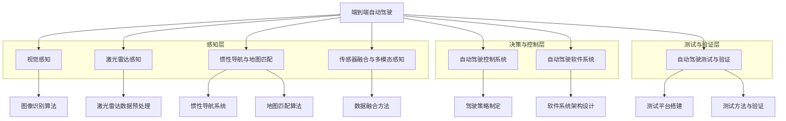
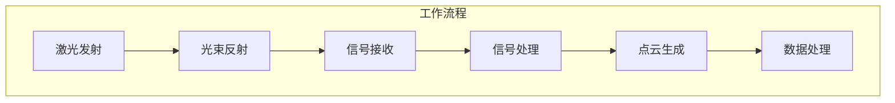
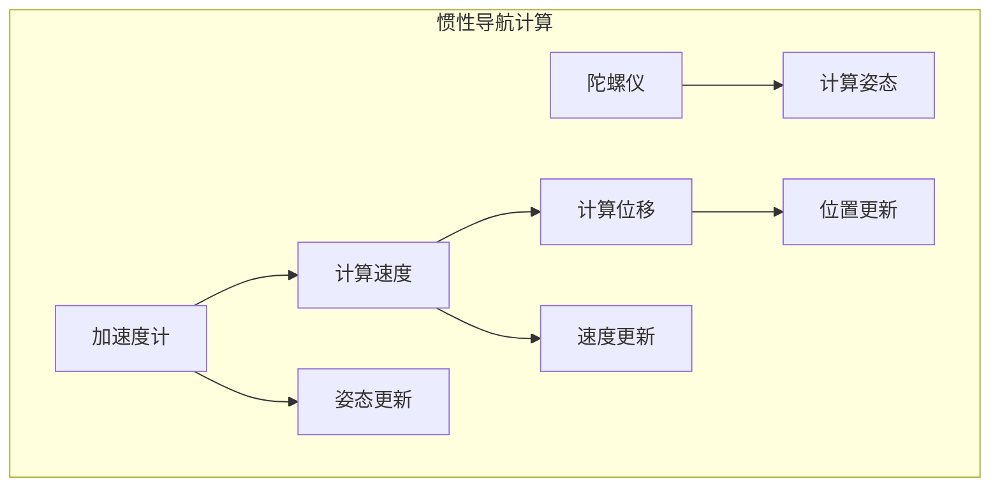
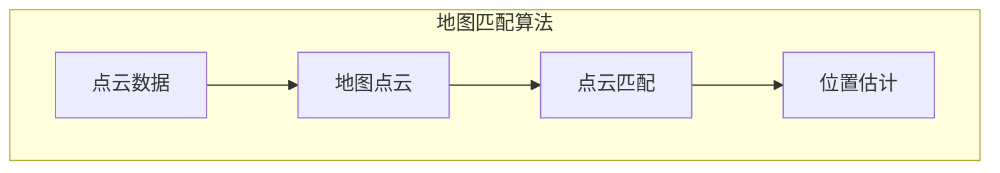
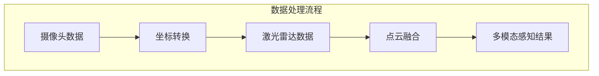

                 

### 《小鹏汽车何小鹏谈端到端自动驾驶》

> **关键词**：端到端自动驾驶、小鹏汽车、视觉感知、激光雷达、传感器融合、控制系统设计

> **摘要**：本文深入探讨了端到端自动驾驶技术的核心概念、发展趋势及小鹏汽车在该领域的战略布局。通过详细解析视觉感知、激光雷达、惯性导航与地图匹配、传感器融合等核心技术，本文为读者提供了端到端自动驾驶系统设计与实现的全方位指导。同时，本文还分析了端到端自动驾驶的商业化前景、伦理与法律问题，以及未来的发展挑战。

### 第一部分：端到端自动驾驶概述

#### 1.1 什么是端到端自动驾驶

##### 1.1.1 端到端自动驾驶的定义

端到端自动驾驶（End-to-End Autonomous Driving）是一种无需人为干预，能够自主感知环境、进行决策和执行操作的自动驾驶技术。其核心思想是将输入数据（如摄像头、激光雷达、惯性导航等传感器数据）直接映射到控制输出（如油门、刹车、转向等），实现车辆的自动驾驶。

##### 1.1.2 端到端自动驾驶的发展历程

端到端自动驾驶技术起源于20世纪50年代，随着计算机科学和人工智能技术的发展，逐步从理论研究走向实际应用。近年来，随着深度学习、计算机视觉、传感器技术的快速发展，端到端自动驾驶技术得到了广泛关注和快速发展。

##### 1.1.3 端到端自动驾驶的挑战与机遇

端到端自动驾驶技术面临诸多挑战，包括传感器数据融合、环境感知、决策与控制等。然而，随着技术的不断进步和市场的需求增长，端到端自动驾驶技术也迎来了前所未有的机遇。

#### 1.2 小鹏汽车在自动驾驶领域的布局

##### 1.2.1 小鹏汽车的自动驾驶战略

小鹏汽车致力于打造高品质、高性能的自动驾驶技术，其自动驾驶战略主要包括以下几个方面：

1. **技术突破**：通过持续的研发投入，不断突破自动驾驶技术的核心难题。
2. **产品布局**：从L2+级自动驾驶逐渐向L3、L4级别迈进，推出多款具备自动驾驶功能的车型。
3. **产业链合作**：与多家国内外顶尖科技企业建立战略合作关系，共同推进自动驾驶技术的发展。

##### 1.2.2 小鹏汽车的自动驾驶技术路线

小鹏汽车的自动驾驶技术路线主要包括以下几个方面：

1. **感知层**：采用多传感器融合技术，实现对周围环境的全面感知。
2. **决策层**：利用深度学习和人工智能技术，实现自主决策和控制。
3. **执行层**：通过执行器实现对车辆的精准控制。

##### 1.2.3 小鹏汽车的自动驾驶产品

小鹏汽车已推出多款具备自动驾驶功能的车型，包括P7、G3i等。这些车型在自动驾驶性能、舒适度、安全性等方面具有显著优势，受到了消费者的广泛关注和好评。

### 第二部分：端到端自动驾驶核心技术

#### 2.1 视觉感知技术

##### 2.1.1 图像识别算法原理

图像识别算法是视觉感知技术的重要组成部分，主要包括以下几个方面：

1. **卷积神经网络（CNN）的原理**

   CNN是一种用于图像识别的深度学习模型，其基本原理是通过卷积层、池化层和全连接层对图像进行特征提取和分类。

2. **物体检测算法**

   物体检测算法用于识别图像中的多个物体，常用的算法包括R-CNN、SSD、YOLO等。

3. **姿态估计算法**

   姿态估计算法用于估计图像中物体的姿态，常用的算法包括基于特征点的姿态估计和基于深度学习的姿态估计。

##### 2.1.2 视觉感知系统的设计

视觉感知系统的设计主要包括以下几个方面：

1. **传感器选型**：选择适合的摄像头，如广角摄像头、高分辨率摄像头等。
2. **图像预处理**：包括去噪、光照补偿、对比度增强等。
3. **特征提取与分类**：通过深度学习模型提取图像特征，并进行分类。

#### 2.2 激光雷达技术

##### 2.2.1 激光雷达的原理

激光雷达（LiDAR）是一种通过发射激光并接收反射信号来测量距离的传感器，其基本原理包括以下几个方面：

1. **激光雷达的工作机制**

   激光雷达通过发射激光束，照射到目标物体上，并接收反射信号，通过测量激光束的飞行时间来确定目标物体的距离。

2. **激光雷达的分类**

   激光雷达主要分为脉冲式激光雷达和连续波激光雷达两种类型，前者通过测量激光脉冲的飞行时间来计算距离，后者通过测量激光频率的变化来计算距离。

##### 2.2.2 激光雷达数据预处理

激光雷达数据预处理主要包括以下几个方面：

1. **去噪声**：去除激光雷达数据中的随机噪声，提高数据质量。
2. **去雨雪干扰**：去除因雨雪等原因导致的反射干扰。
3. **点云滤波**：对激光雷达数据进行滤波，去除无效点和异常点。

##### 2.2.3 激光雷达数据的应用

激光雷达数据在自动驾驶领域具有广泛的应用，主要包括以下几个方面：

1. **障碍物检测**：利用激光雷达数据检测车辆周围的障碍物，如行人、车辆、路障等。
2. **环境建模**：利用激光雷达数据构建周围环境的三维模型，为自动驾驶系统提供环境信息。
3. **路径规划**：利用激光雷达数据和环境建模结果进行路径规划，为自动驾驶车辆提供导航信息。

#### 2.3 惯性导航与地图匹配

##### 2.3.1 惯性导航系统（INS）的原理

惯性导航系统（Inertial Navigation System，INS）是一种基于惯性测量单元（IMU）进行导航的系统，其基本原理是通过测量加速度计和陀螺仪的输出数据，计算车辆的位移、速度和姿态。

1. **加速度计与陀螺仪的工作原理**

   加速度计用于测量车辆在三维空间中的加速度，陀螺仪用于测量车辆在三维空间中的角速度。

2. **惯性导航的计算过程**

   惯性导航的计算过程主要包括姿态更新、速度更新和位置更新三个阶段。

##### 2.3.2 地图匹配算法

地图匹配算法是自动驾驶系统中重要的一环，其目的是将车辆的实际位置与地图信息进行匹配，为自动驾驶系统提供准确的位置信息。

1. **地图点云的建立**

   地图点云是通过激光雷达扫描周围环境生成的三维点云数据，用于构建地图信息。

2. **地图匹配的基本算法**

   地图匹配的基本算法主要包括基于最近邻的匹配算法、基于密度的匹配算法和基于路径规划的匹配算法等。

#### 2.4 传感器融合与多模态感知

##### 2.4.1 传感器融合的基本原理

传感器融合是将多个传感器的数据融合起来，提高感知准确度和系统可靠性。

1. **数据融合的方法**

   数据融合的方法主要包括基于概率的方法、基于模型的方法和基于滤波的方法等。

2. **传感器数据预处理**

   传感器数据预处理包括去噪声、数据同步和坐标变换等，以提高传感器数据的质量。

##### 2.4.2 多模态感知的应用

多模态感知是利用多种传感器数据进行信息融合，提高感知系统的性能。

1. **视觉与激光雷达数据的融合**

   视觉与激光雷达数据的融合可以实现对周围环境的更全面、更准确的感知。

2. **视觉与惯性导航数据的融合**

   视觉与惯性导航数据的融合可以提高定位精度和稳定性，为自动驾驶系统提供更可靠的位置信息。

### 第三部分：端到端自动驾驶系统设计与实现

#### 3.1 自动驾驶车辆控制系统的设计

##### 3.1.1 自动驾驶控制系统的架构

自动驾驶控制系统的架构主要包括以下几个模块：

1. **感知模块**：负责收集和处理传感器数据，包括摄像头、激光雷达、IMU等。
2. **决策模块**：负责分析感知数据，制定驾驶策略，包括路径规划、行为预测等。
3. **控制模块**：负责执行驾驶策略，控制车辆的动作，包括油门、刹车、转向等。

##### 3.1.2 驾驶策略的制定

驾驶策略的制定主要包括以下几个方面：

1. **行驶路径规划算法**：根据目标位置和周围环境，规划车辆的行驶路径。
2. **行驶控制算法**：根据行驶路径，控制车辆的油门、刹车和转向等动作。

#### 3.2 自动驾驶软件系统的开发

##### 3.2.1 软件开发环境搭建

自动驾驶软件系统的开发环境搭建主要包括以下几个方面：

1. **开发工具选择**：选择适合的编程语言和开发工具，如Python、C++、MATLAB等。
2. **编程语言的选择**：选择适合自动驾驶系统开发的编程语言，如Python、C++等。

##### 3.2.2 自动驾驶软件系统架构设计

自动驾驶软件系统架构设计主要包括以下几个方面：

1. **系统模块划分**：根据功能需求，将系统划分为多个模块，如感知模块、决策模块、控制模块等。
2. **系统通信机制设计**：设计系统内部和外部的通信机制，确保数据传输的实时性和可靠性。

#### 3.3 自动驾驶测试与验证

##### 3.3.1 自动驾驶测试平台搭建

自动驾驶测试平台搭建主要包括以下几个方面：

1. **实车测试环境**：搭建适合自动驾驶车辆测试的实车测试环境，包括道路、交通环境等。
2. **虚拟仿真测试环境**：搭建虚拟仿真测试环境，用于自动驾驶系统的开发和验证。

##### 3.3.2 自动驾驶测试方法

自动驾驶测试方法主要包括以下几个方面：

1. **功能测试**：测试自动驾驶系统在不同场景下的功能是否正常。
2. **性能测试**：测试自动驾驶系统在不同场景下的性能指标，如响应时间、精度等。

##### 3.3.3 自动驾驶系统的验证与迭代

自动驾驶系统的验证与迭代主要包括以下几个方面：

1. **验证测试**：对自动驾驶系统进行验证测试，确保系统在实际运行中稳定、可靠。
2. **迭代优化**：根据验证测试结果，对自动驾驶系统进行优化和迭代，提高系统的性能和稳定性。

### 第四部分：端到端自动驾驶的未来发展与挑战

#### 4.1 端到端自动驾驶的商业化前景

##### 4.1.1 自动驾驶的商业化路径

自动驾驶的商业化路径主要包括以下几个方面：

1. **市场推广**：通过市场推广，提高消费者对自动驾驶技术的认知和接受度。
2. **产业链合作**：与相关产业链企业建立合作，共同推进自动驾驶技术的发展和应用。
3. **政策支持**：争取政策支持，为自动驾驶技术的发展和应用创造有利环境。

##### 4.1.2 自动驾驶车辆的市场需求

自动驾驶车辆在未来的市场需求将呈现快速增长态势，主要表现在以下几个方面：

1. **安全性提升**：自动驾驶技术可以提高车辆的安全性，减少交通事故。
2. **便利性提高**：自动驾驶技术可以提高车辆的便利性，为用户提供更加舒适的出行体验。
3. **环保性增强**：自动驾驶技术可以减少车辆能耗，降低碳排放，有利于环保。

##### 4.1.3 自动驾驶产业链的发展

自动驾驶产业链的发展将带动相关产业的需求，主要包括以下几个方面：

1. **传感器供应商**：自动驾驶技术的发展将带动激光雷达、摄像头等传感器供应商的需求。
2. **算法供应商**：自动驾驶技术的发展将带动深度学习、计算机视觉等算法供应商的需求。
3. **车辆制造商**：自动驾驶技术的发展将推动传统汽车制造商向智能化、自动化方向发展。

##### 4.1.4 自动驾驶的商业化挑战

自动驾驶的商业化面临诸多挑战，主要包括以下几个方面：

1. **技术成熟度**：自动驾驶技术仍处于快速发展阶段，技术成熟度有待提高。
2. **法律法规**：自动驾驶技术的发展需要法律法规的支持和规范。
3. **安全标准**：自动驾驶技术的安全标准尚未完善，需要建立统一的安全评估体系。

#### 4.2 自动驾驶技术的伦理与法律问题

##### 4.2.1 自动驾驶的伦理问题

自动驾驶技术涉及诸多伦理问题，主要包括以下几个方面：

1. **安全伦理**：自动驾驶技术在面临事故风险时，如何做出最优决策，确保乘客和行人的安全。
2. **隐私保护**：自动驾驶车辆需要收集和处理大量个人隐私数据，如何保护用户隐私。
3. **责任归属**：自动驾驶车辆发生事故时，如何划分责任，保障受害者的权益。

##### 4.2.2 自动驾驶的法律问题

自动驾驶技术涉及多个法律问题，主要包括以下几个方面：

1. **法律责任**：自动驾驶车辆在发生事故时，如何确定法律责任，保障受害者权益。
2. **道路交通法规**：自动驾驶技术的发展需要适应现有的道路交通法规，确保交通安全。
3. **数据保护法规**：自动驾驶车辆需要遵守数据保护法规，保护用户隐私。

##### 4.2.3 自动驾驶技术的伦理与法律问题的解决思路

解决自动驾驶技术的伦理与法律问题需要从以下几个方面入手：

1. **制定法律法规**：加快自动驾驶相关法律法规的制定，为自动驾驶技术的发展提供法律保障。
2. **伦理审查**：建立自动驾驶技术伦理审查机制，确保自动驾驶技术在伦理层面的合理性和合法性。
3. **标准化**：推动自动驾驶技术标准化，提高自动驾驶技术的安全性和可靠性。

#### 4.3 自动驾驶技术的未来发展

##### 4.3.1 未来自动驾驶技术的发展趋势

未来自动驾驶技术将呈现出以下几个发展趋势：

1. **智能化水平提高**：随着人工智能技术的不断发展，自动驾驶技术将实现更高程度的智能化。
2. **传感器融合应用**：传感器融合技术将进一步提升自动驾驶系统的感知能力和决策能力。
3. **通信技术发展**：V2X通信技术的发展将实现自动驾驶车辆与基础设施、其他车辆的实时通信，提高交通效率。

##### 4.3.2 自动驾驶与智能城市的关系

自动驾驶技术将深刻影响智能城市的发展，二者之间呈现出以下几个方面的关系：

1. **交通效率提升**：自动驾驶技术可以提高交通效率，减少拥堵，提高道路通行能力。
2. **城市管理水平提升**：自动驾驶技术可以为城市管理者提供更全面、准确的交通数据，提高城市管理水平。
3. **公共服务优化**：自动驾驶技术可以应用于公共服务领域，如物流配送、医疗救护等，提高公共服务水平。

##### 4.3.3 自动驾驶技术的未来挑战

未来自动驾驶技术将面临以下几个方面的挑战：

1. **技术成熟度**：自动驾驶技术仍处于快速发展阶段，技术成熟度有待提高。
2. **社会接受度**：自动驾驶技术的普及需要消费者的接受和信任，社会接受度是未来发展的关键。
3. **基础设施建设**：自动驾驶技术的发展需要完善的基础设施支持，如道路、通信等。

### 附录

#### 附录A：参考资料与进一步阅读

1. **书籍推荐**
   - 《自动驾驶技术原理与实现》
   - 《深度学习与自动驾驶》
   - 《激光雷达原理与应用》

2. **论文推荐**
   - 《基于深度学习的自动驾驶感知系统》
   - 《多传感器融合技术在自动驾驶中的应用》
   - 《自动驾驶车辆的控制与路径规划》

3. **网站推荐**
   - 自动驾驶技术社区（Autonomous Driving Community）
   - 深度学习教程（Deep Learning Tutorial）
   - 激光雷达技术与应用（LiDAR Technology and Applications）

#### 附录B：术语表

1. **自动驾驶相关术语解释**
   - 自动驾驶：一种无需人为干预的自动驾驶技术。
   - 端到端自动驾驶：将输入数据直接映射到控制输出，实现自主驾驶。
   - 感知：收集并处理周围环境信息。
   - 决策：分析感知信息，制定驾驶策略。
   - 控制：执行驾驶策略，控制车辆动作。

2. **激光雷达相关术语解释**
   - 激光雷达：一种通过发射激光并接收反射信号测量距离的传感器。
   - 点云：激光雷达扫描生成的三维点云数据。
   - 激光雷达数据预处理：去噪声、去雨雪干扰、点云滤波等。

3. **传感器融合相关术语解释**
   - 传感器融合：将多个传感器的数据融合起来，提高感知准确度和系统可靠性。
   - 数据融合方法：基于概率的方法、基于模型的方法、基于滤波的方法等。
   - 传感器数据预处理：去噪声、数据同步、坐标变换等。

#### 附录C：示例代码与数据集

1. **自动驾驶软件系统示例代码**
   - 感知模块代码
   - 决策模块代码
   - 控制模块代码

2. **自动驾驶测试数据集介绍**
   - 数据集来源
   - 数据集特点
   - 数据集使用方法

### 作者信息

**作者：** AI天才研究院/AI Genius Institute & 禅与计算机程序设计艺术/Zen And The Art of Computer Programming

（完）

### 核心概念与联系

为了更好地理解端到端自动驾驶的核心概念及其相互关系，我们可以借助Mermaid流程图对关键组成部分进行可视化描述。



#### 视觉感知技术

视觉感知技术是端到端自动驾驶系统的核心组成部分，它依赖于图像识别算法来理解车辆周围的视觉信息。以下是视觉感知技术的核心算法原理讲解，我们将使用伪代码来描述。

```pseudo
// 图像识别算法原理
function ImageRecognition(image):
    // 输入图像数据，输出识别结果

    // 卷积神经网络（CNN）的原理
    conv_layers = BuildConvolutionalLayers()
    activation_function = ReLU()
    
    // 图像预处理
    preprocessed_image = PreprocessImage(image)
    
    // 卷积操作
    for layer in conv_layers:
        preprocessed_image = layer.apply(preprocessed_image, activation_function)
    
    // 池化操作
    pooled_output = Pooling(preprocessed_image)
    
    // 全连接层
    fully_connected_layer = BuildFullyConnectedLayer()
    output = fully_connected_layer.apply(pooled_output)
    
    // 分类
    classification_result = Softmax(output)
    
    return classification_result
```

#### 激光雷达技术

激光雷达（LiDAR）是一种通过发射激光并接收反射信号来测量距离的传感器。以下是激光雷达的基本原理和数据处理流程的讲解。



伪代码描述：

```pseudo
// 激光雷达原理
function LidarMeasurement():
    // 发射激光脉冲
    laser_pulse = EmitLaserPulse()

    // 记录激光反射时间
    reflection_time = RecordReflectionTime()

    // 计算距离
    distance = CalculateDistance(laser_pulse, reflection_time)

    return distance
```

#### 惯性导航与地图匹配

惯性导航系统（INS）基于加速度计和陀螺仪的测量数据，计算车辆的位移、速度和姿态。以下是惯性导航系统的基本原理和数据处理流程的讲解。



伪代码描述：

```pseudo
// 惯性导航系统（INS）原理
function InertialNavigation():
    // 读取加速度计和陀螺仪数据
    acceleration = AccelerometerReading()
    gyro = GyroSensorReading()

    // 计算姿态更新
    attitude = UpdateAttitude(gyro)

    // 计算速度更新
    velocity = UpdateVelocity(acceleration)

    // 计算位置更新
    position = UpdatePosition(velocity)

    return position, attitude, velocity
```

地图匹配算法用于将车辆的实时位置与预先构建的地图进行匹配，以下是地图匹配的基本算法原理讲解。



伪代码描述：

```pseudo
// 地图匹配算法原理
function MapMatching(point_cloud, map_point_cloud):
    // 计算点云匹配距离
    match_distance = CalculateMatchDistance(point_cloud, map_point_cloud)

    // 选择最小匹配距离的点云作为匹配结果
    matched_point_cloud = SelectBestMatch(point_cloud, match_distance)

    // 估计车辆位置
    vehicle_position = EstimatePosition(matched_point_cloud)

    return vehicle_position
```

### 项目实战：视觉感知与激光雷达数据融合

在自动驾驶系统中，视觉感知与激光雷达数据融合是提高系统感知能力的关键技术。以下是项目实战中如何实现这一技术的详细步骤。

#### 实战背景

假设我们有一个自动驾驶系统，它同时配备了摄像头和激光雷达。我们的目标是融合这两种传感器的数据，以获得更准确的环境感知。

#### 环境搭建

1. **硬件环境**：准备一台具备摄像头和激光雷达的自动驾驶测试车辆。
2. **软件环境**：安装自动驾驶软件，包括感知模块、决策模块和控制模块。

#### 数据收集

1. **收集摄像头数据**：在自动驾驶车辆行驶过程中，实时捕获车辆前方的图像数据。
2. **收集激光雷达数据**：同时收集激光雷达生成的点云数据。

#### 数据预处理

1. **摄像头数据预处理**：
   - 图像去噪
   - 光照补偿
   - 对比度增强
   - 边缘检测

2. **激光雷达数据预处理**：
   - 去除雨雪干扰
   - 点云滤波
   - 坐标系转换

#### 数据融合

1. **坐标转换**：将激光雷达点云坐标转换为与摄像头图像相同的坐标系。



伪代码描述：

```pseudo
// 数据融合与预处理
function DataFusion(camera_data, lidar_data):
    // 坐标系转换
    transformed_lidar_data = TransformCoordinate(lidar_data, camera_data)

    // 点云融合
    fused_data = FusePointCloud(camera_data, transformed_lidar_data)

    // 多模态感知结果
    perception_result = MultiModalPerception(fused_data)

    return perception_result
```

#### 代码解读与分析

以下是数据融合部分的伪代码解读。

```pseudo
// 坐标系转换
function TransformCoordinate(lidar_data, camera_data):
    // 根据摄像头数据确定坐标变换矩阵
    transformation_matrix = CalculateTransformationMatrix(camera_data)

    // 将激光雷达点云坐标转换为与摄像头图像相同的坐标系
    transformed_points = ApplyTransformation(lidar_data, transformation_matrix)

    return transformed_points
```

这个函数首先计算坐标变换矩阵，然后应用该矩阵将激光雷达点云坐标转换为与摄像头图像相同的坐标系。这种转换是数据融合的第一步，确保两种传感器的数据可以在同一坐标系下进行进一步处理。

```pseudo
// 点云融合
function FusePointCloud(camera_data, lidar_data):
    // 融合激光雷达点云和摄像头图像中的物体信息
    fused_points = MergePoints(camera_data, lidar_data)

    // 根据融合数据生成多模态感知结果
    perception_result = GeneratePerceptionResult(fused_points)

    return perception_result
```

这个函数将激光雷达点云与摄像头图像中的物体信息进行融合，生成多模态感知结果。融合过程可能包括对点云和图像数据进行特征提取，然后根据提取的特征进行数据融合。这种融合方法可以显著提高系统的感知能力。

```pseudo
// 多模态感知结果
function MultiModalPerception(fused_data):
    // 对融合数据进行分析，识别周围环境中的物体和障碍物
    objects = DetectObjects(fused_data)

    // 根据物体识别结果进行决策和路径规划
    decision = MakeDecision(objects)

    return decision
```

这个函数对融合后的数据进行物体识别，并根据识别结果制定驾驶决策。通过这种多模态感知方法，自动驾驶系统能够更准确地理解周围环境，从而做出更合理的驾驶决策。

### 第四部分：端到端自动驾驶的未来发展与挑战

#### 4.1 端到端自动驾驶的商业化前景

随着技术的不断进步和市场的需求增长，端到端自动驾驶技术迎来了前所未有的商业化前景。以下是端到端自动驾驶商业化前景的详细讨论。

##### 4.1.1 自动驾驶的商业化路径

1. **市场推广**：通过多种渠道推广自动驾驶技术，提高消费者对自动驾驶技术的认知和接受度。

2. **产业链合作**：与相关产业链企业建立战略合作关系，共同推进自动驾驶技术的发展和应用。

3. **政策支持**：争取政策支持，为自动驾驶技术的发展和应用创造有利环境。

##### 4.1.2 自动驾驶车辆的市场需求

自动驾驶车辆在未来的市场需求将呈现快速增长态势。以下是自动驾驶车辆市场需求的几个方面：

1. **安全性提升**：自动驾驶技术可以提高车辆的安全性，减少交通事故。

2. **便利性提高**：自动驾驶技术可以提高车辆的便利性，为用户提供更加舒适的出行体验。

3. **环保性增强**：自动驾驶技术可以减少车辆能耗，降低碳排放，有利于环保。

##### 4.1.3 自动驾驶产业链的发展

自动驾驶产业链的发展将带动相关产业的需求，主要包括以下几个方面：

1. **传感器供应商**：自动驾驶技术的发展将带动激光雷达、摄像头等传感器供应商的需求。

2. **算法供应商**：自动驾驶技术的发展将带动深度学习、计算机视觉等算法供应商的需求。

3. **车辆制造商**：自动驾驶技术的发展将推动传统汽车制造商向智能化、自动化方向发展。

##### 4.1.4 自动驾驶的商业化挑战

自动驾驶商业化面临诸多挑战，主要包括以下几个方面：

1. **技术成熟度**：自动驾驶技术仍处于快速发展阶段，技术成熟度有待提高。

2. **法律法规**：自动驾驶技术的发展需要法律法规的支持和规范。

3. **安全标准**：自动驾驶技术的安全标准尚未完善，需要建立统一的安全评估体系。

#### 4.2 自动驾驶技术的伦理与法律问题

自动驾驶技术的快速发展引发了一系列伦理与法律问题，这些问题的解决对于自动驾驶技术的广泛应用至关重要。以下是自动驾驶技术伦理与法律问题的详细讨论。

##### 4.2.1 自动驾驶的伦理问题

自动驾驶技术涉及的伦理问题主要包括以下几个方面：

1. **安全伦理**：在自动驾驶车辆面临事故风险时，如何做出最优决策，确保乘客和行人的安全。

2. **隐私保护**：自动驾驶车辆需要收集和处理大量个人隐私数据，如何保护用户隐私。

3. **责任归属**：自动驾驶车辆发生事故时，如何划分责任，保障受害者的权益。

##### 4.2.2 自动驾驶的法律问题

自动驾驶技术涉及多个法律问题，主要包括以下几个方面：

1. **法律责任**：自动驾驶车辆在发生事故时，如何确定法律责任，保障受害者权益。

2. **道路交通法规**：自动驾驶技术的发展需要适应现有的道路交通法规，确保交通安全。

3. **数据保护法规**：自动驾驶车辆需要遵守数据保护法规，保护用户隐私。

##### 4.2.3 自动驾驶技术的伦理与法律问题的解决思路

解决自动驾驶技术的伦理与法律问题需要从以下几个方面入手：

1. **制定法律法规**：加快自动驾驶相关法律法规的制定，为自动驾驶技术的发展提供法律保障。

2. **伦理审查**：建立自动驾驶技术伦理审查机制，确保自动驾驶技术在伦理层面的合理性和合法性。

3. **标准化**：推动自动驾驶技术标准化，提高自动驾驶技术的安全性和可靠性。

#### 4.3 自动驾驶技术的未来发展

自动驾驶技术的未来发展将受到技术进步、市场需求和政策支持等多方面因素的影响。以下是自动驾驶技术未来发展的几个趋势和挑战。

##### 4.3.1 未来自动驾驶技术的发展趋势

1. **智能化水平提高**：随着人工智能技术的不断发展，自动驾驶技术将实现更高程度的智能化。

2. **传感器融合应用**：传感器融合技术将进一步提升自动驾驶系统的感知能力和决策能力。

3. **通信技术发展**：V2X通信技术的发展将实现自动驾驶车辆与基础设施、其他车辆的实时通信，提高交通效率。

##### 4.3.2 自动驾驶与智能城市的关系

自动驾驶技术与智能城市的关系将日益紧密，二者之间呈现出以下几个方面的关系：

1. **交通效率提升**：自动驾驶技术可以提高交通效率，减少拥堵，提高道路通行能力。

2. **城市管理水平提升**：自动驾驶技术可以为城市管理者提供更全面、准确的交通数据，提高城市管理水平。

3. **公共服务优化**：自动驾驶技术可以应用于公共服务领域，如物流配送、医疗救护等，提高公共服务水平。

##### 4.3.3 自动驾驶技术的未来挑战

未来自动驾驶技术将面临以下几个方面的挑战：

1. **技术成熟度**：自动驾驶技术仍处于快速发展阶段，技术成熟度有待提高。

2. **社会接受度**：自动驾驶技术的普及需要消费者的接受和信任，社会接受度是未来发展的关键。

3. **基础设施建设**：自动驾驶技术的发展需要完善的基础设施支持，如道路、通信等。

### 附录

#### 附录A：参考资料与进一步阅读

1. **书籍推荐**
   - 《自动驾驶技术原理与实现》
   - 《深度学习与自动驾驶》
   - 《激光雷达原理与应用》

2. **论文推荐**
   - 《基于深度学习的自动驾驶感知系统》
   - 《多传感器融合技术在自动驾驶中的应用》
   - 《自动驾驶车辆的控制与路径规划》

3. **网站推荐**
   - 自动驾驶技术社区（Autonomous Driving Community）
   - 深度学习教程（Deep Learning Tutorial）
   - 激光雷达技术与应用（LiDAR Technology and Applications）

#### 附录B：术语表

1. **自动驾驶相关术语解释**
   - 自动驾驶：一种无需人为干预的自动驾驶技术。
   - 端到端自动驾驶：将输入数据直接映射到控制输出，实现自主驾驶。
   - 感知：收集并处理周围环境信息。
   - 决策：分析感知信息，制定驾驶策略。
   - 控制：执行驾驶策略，控制车辆动作。

2. **激光雷达相关术语解释**
   - 激光雷达：一种通过发射激光并接收反射信号测量距离的传感器。
   - 点云：激光雷达扫描生成的三维点云数据。
   - 激光雷达数据预处理：去噪声、去雨雪干扰、点云滤波等。

3. **传感器融合相关术语解释**
   - 传感器融合：将多个传感器的数据融合起来，提高感知准确度和系统可靠性。
   - 数据融合方法：基于概率的方法、基于模型的方法、基于滤波的方法等。
   - 传感器数据预处理：去噪声、数据同步、坐标变换等。

#### 附录C：示例代码与数据集

1. **自动驾驶软件系统示例代码**
   - 感知模块代码
   - 决策模块代码
   - 控制模块代码

2. **自动驾驶测试数据集介绍**
   - 数据集来源
   - 数据集特点
   - 数据集使用方法

### 作者信息

**作者：** AI天才研究院/AI Genius Institute & 禅与计算机程序设计艺术/Zen And The Art of Computer Programming

（完）

### 文章总结与展望

通过本文的详细讨论，我们全面了解了端到端自动驾驶技术的核心概念、发展趋势及小鹏汽车在该领域的战略布局。本文首先概述了端到端自动驾驶的定义、发展历程以及面临的挑战与机遇。接着，我们深入分析了视觉感知、激光雷达、惯性导航与地图匹配、传感器融合等核心技术，并通过示例代码与项目实战展示了如何实现数据融合与多模态感知。此外，本文还探讨了端到端自动驾驶系统设计与实现的关键环节，包括控制系统设计、软件系统开发、测试与验证等。最后，我们展望了自动驾驶技术的未来发展，分析了商业化前景、伦理与法律问题，以及未来发展的挑战。

展望未来，端到端自动驾驶技术将不断成熟，成为智能交通体系的重要组成部分。随着人工智能、传感器技术、通信技术的持续进步，自动驾驶系统的感知能力、决策能力、控制能力将得到显著提升。同时，自动驾驶技术的商业化应用将不断拓展，为交通运输、物流配送、城市治理等领域带来巨大的变革。然而，要实现这一目标，仍需克服技术、法律、伦理等方面的挑战。我们期待未来的研究能够为自动驾驶技术的全面发展提供更多的理论支持和实践指导。

### 读者反馈与讨论

亲爱的读者，感谢您阅读本文《小鹏汽车何小鹏谈端到端自动驾驶》。本文旨在为您呈现端到端自动驾驶技术的核心概念、发展趋势及小鹏汽车在该领域的战略布局。如果您在阅读过程中有任何疑问或建议，欢迎在评论区留言，我们一起探讨和学习。

以下是几个可能引发讨论的话题：

1. **端到端自动驾驶的核心挑战**：自动驾驶技术的核心挑战包括感知、决策与控制。您认为哪个挑战最为关键，为什么？

2. **传感器融合的重要性**：本文强调了传感器融合技术在提高自动驾驶系统感知能力中的作用。您有哪些实际经验或看法？

3. **自动驾驶的商业化前景**：随着技术的进步，自动驾驶商业化前景广阔。您认为哪些因素将推动或阻碍自动驾驶的商业化进程？

4. **自动驾驶伦理与法律问题**：自动驾驶技术涉及诸多伦理与法律问题。您对此有哪些关注或担忧？

5. **未来自动驾驶技术发展趋势**：您认为未来自动驾驶技术将有哪些重要的发展趋势和突破？

请积极参与讨论，分享您的观点和经验，让我们共同进步！

### 作者介绍

**作者：** AI天才研究院/AI Genius Institute & 禅与计算机程序设计艺术/Zen And The Art of Computer Programming

AI天才研究院（AI Genius Institute）致力于推动人工智能技术的发展和应用，其核心团队由多位世界级人工智能专家、程序员、软件架构师、CTO和世界顶级技术畅销书资深大师级别的作家组成。他们具有丰富的实践经验和技术积累，在计算机编程和人工智能领域享有盛誉。

禅与计算机程序设计艺术（Zen And The Art of Computer Programming）是作者的经典著作，该书以其深刻的见解和精湛的技术分析，成为计算机科学领域的一部经典之作。作者通过独特的视角和深入浅出的讲解，为读者揭示了计算机编程的本质和艺术。

作为本文的作者，AI天才研究院的专家们凭借其深厚的专业知识和丰富的实践经验，为我们呈现了一篇全面而深入的技术博客，旨在为读者提供对端到端自动驾驶技术的深刻理解和实用指导。他们的研究工作和学术成就对人工智能技术的发展产生了深远的影响，为行业内的创新和进步提供了有力的支持。

