                 

# 市场调研：创业者的必备功课

> **关键词**：市场调研、创业者、商业策略、数据分析、消费者行为

> **摘要**：本文将深入探讨市场调研的重要性及其对创业者的关键作用。通过分析市场调研的基本概念、理论、实践方法和案例分析，我们将帮助创业者更好地理解市场环境，制定有效的商业策略，并在竞争激烈的市场中脱颖而出。

### 第一部分：市场调研基本概念与理论

#### 第1章：市场调研概述

##### 1.1 市场调研的定义与重要性

市场调研是指通过系统的方法收集、记录、分析有关市场及其相关活动的信息，以便更好地理解和满足消费者的需求。对于创业者而言，市场调研是必不可少的一环，它能够提供关键的决策支持，帮助企业抓住市场机会，规避潜在风险。

**市场调研的定义**：
市场调研是指通过收集、分析和解读有关市场及其相关活动的信息，以便更好地理解和满足消费者的需求。

- **收集信息**：通过多种渠道收集有关市场的数据，包括消费者行为、市场竞争、市场规模等。
- **分析信息**：对收集到的信息进行定量和定性的分析，以识别市场趋势、消费者偏好和竞争态势。
- **解读信息**：将分析结果转化为具体的商业决策，指导企业的运营和战略规划。

**市场调研的重要性**：

- **指导决策**：市场调研可以帮助创业者更好地理解市场环境和消费者需求，从而做出更明智的决策。
- **发现机会**：通过市场调研，创业者可以发现市场中的潜在机会，从而抓住新的增长点。
- **评估风险**：市场调研可以帮助企业评估市场中的潜在风险，从而采取预防措施。

##### 1.2 市场调研的类型与方法

市场调研可以分为定性调研和定量调研两种类型，每种类型都有其独特的特点和方法。

**市场调研的类型**：

- **定性调研**：定性调研主要适用于深入了解消费者行为和需求，常用的方法包括小组讨论、深度访谈等。定性调研的优点是能够深入挖掘消费者的深层次想法和感受，缺点是样本量小，数据代表性较差。

- **定量调研**：定量调研主要适用于获取大量数据并进行量化分析，常用的方法包括问卷调查、统计分析等。定量调研的优点是数据量大，具有较高的代表性和可信度，缺点是难以深入探讨消费者的心理和感受。

**市场调研的方法**：

- **观察法**：观察法是指直接观察消费者在特定环境下的行为，以获取第一手数据。观察法的优点是能够获取真实的行为数据，缺点是难以控制环境和变量。

- **问卷调查法**：问卷调查法是通过设计问卷收集消费者的信息，问卷可以采用纸质、在线或电话等多种形式。问卷调查法的优点是能够收集大量数据，缺点是问卷设计的质量和回答的准确性直接影响数据的可靠性。

- **实验法**：实验法是通过实验控制变量，评估市场效果的方法。实验法常用于新产品测试、价格敏感性分析等。实验法的优点是能够准确评估变量对市场的影响，缺点是实施成本高，实验环境难以完全模拟真实市场。

##### 1.3 市场调研的核心概念与理论

市场调研涉及多个核心概念和理论，以下是对这些概念和理论的简要介绍：

**市场细分与目标市场**：

- **市场细分**：市场细分是指将整个市场划分为若干具有相似需求和特征的子市场，以便更好地满足不同消费者的需求。市场细分的方法包括地理细分、心理细分和行为细分等。

- **目标市场**：目标市场是企业决定要进入和服务的市场细分，通常基于市场细分和企业的资源能力确定。选择合适的目标市场可以帮助企业集中资源，提高市场竞争力。

**市场需求与消费者行为**：

- **市场需求**：市场需求是指消费者在一定时间内，在某一价格水平上愿意且能够购买的商品或服务的总量。市场需求受到价格、消费者收入、替代品价格等多种因素的影响。

- **消费者行为**：消费者行为是指消费者在购买、使用、评价和处置产品或服务过程中的心理和行动活动。理解消费者行为有助于企业更好地满足消费者需求，提高客户满意度。

**SWOT分析**：

- **SWOT分析**：SWOT分析是一种战略规划工具，用于评估企业的优势、劣势、机会和威胁。优势是企业内部的优势和竞争力，劣势是企业内部的弱点，机会是外部环境中的有利因素，威胁是外部环境中的不利因素。

通过SWOT分析，企业可以识别自身的优势和劣势，抓住市场机会，规避潜在威胁，制定更有效的战略规划。

### 第二部分：市场调研实践方法

#### 第2章：市场调研的核心概念与理论

##### 2.1 市场细分与目标市场

市场细分与目标市场是企业制定有效市场策略的基础。通过市场细分，企业可以将整个市场划分为具有相似需求和特征的子市场，以便更好地满足不同消费者的需求。而目标市场则是企业决定要进入和服务的市场细分，通常基于市场细分和企业的资源能力确定。

**市场细分**：

市场细分的方法包括地理细分、心理细分和行为细分等。地理细分是根据消费者所在的地理位置来划分市场；心理细分是根据消费者的心理特征和行为习惯来划分市场；行为细分是根据消费者的购买行为和消费习惯来划分市场。以下是一个简单的地理细分示例：

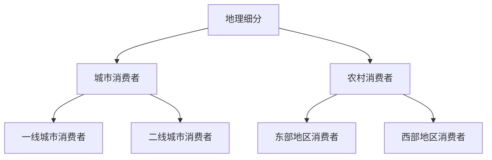

**目标市场**：

确定目标市场是市场细分后的关键步骤。企业应根据自身的资源和能力，选择最具潜力的市场细分作为目标市场。以下是一个目标市场的确定示例：

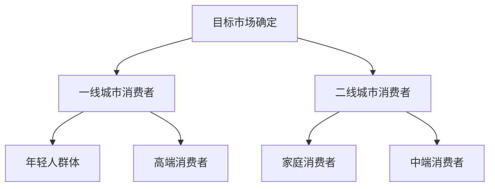

通过市场细分和目标市场确定，企业可以更有针对性地进行市场调研和营销策略制定，提高市场竞争力。

##### 2.2 市场需求与消费者行为

市场需求和消费者行为是市场调研中两个核心概念。理解市场需求有助于企业制定合适的价格策略和产品策略，而了解消费者行为则有助于企业更好地满足消费者需求，提高客户满意度。

**市场需求**：

市场需求是指消费者在一定时间内，在某一价格水平上愿意且能够购买的商品或服务的总量。市场需求受到多种因素的影响，包括：

1. **价格**：价格是影响市场需求的重要因素。价格上升，需求下降；价格下降，需求上升。

2. **消费者收入**：消费者收入水平直接影响其购买力，从而影响市场需求。收入上升，市场需求增加；收入下降，市场需求减少。

3. **替代品价格**：替代品价格的变化会影响消费者对某种商品的需求。替代品价格上升，消费者转向其他替代品，市场需求下降；替代品价格下降，消费者增加对该商品的需求，市场需求上升。

以下是一个市场需求的影响因素示意图：

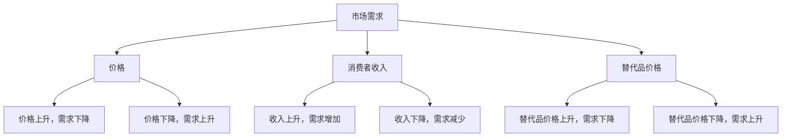

**消费者行为**：

消费者行为是指消费者在购买、使用、评价和处置产品或服务过程中的心理和行动活动。理解消费者行为有助于企业更好地满足消费者需求，提高客户满意度。以下是一个消费者行为的模型：

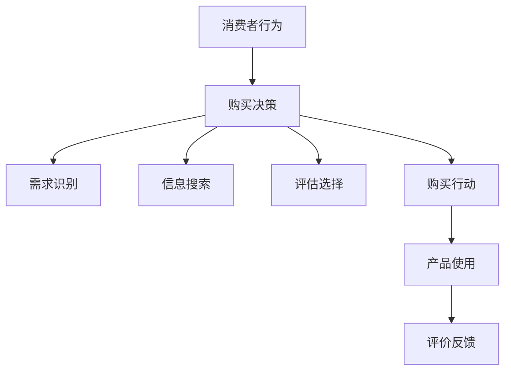

通过分析市场需求和消费者行为，企业可以制定更有效的营销策略，提高市场竞争力。

##### 2.3 SWOT分析

SWOT分析是一种常用的战略规划工具，用于评估企业的优势、劣势、机会和威胁。通过SWOT分析，企业可以全面了解自身的竞争地位，制定相应的战略规划。

**SWOT分析**：

SWOT分析包括四个方面：

1. **优势**：优势是企业内部的优势和竞争力，如专利技术、品牌优势、人才优势等。

2. **劣势**：劣势是企业内部的弱点和不足，如生产成本高、市场份额低、研发能力不足等。

3. **机会**：机会是外部环境中的有利因素，如市场增长、政策支持、技术进步等。

4. **威胁**：威胁是外部环境中的不利因素，如竞争加剧、市场需求下降、政策变化等。

以下是一个简单的SWOT分析示例：

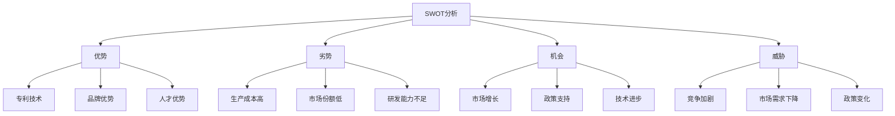

通过SWOT分析，企业可以明确自身的优势和劣势，抓住市场机会，规避潜在威胁，制定更有效的战略规划。

### 第三部分：市场调研实践方法

#### 第3章：定性调研方法

定性调研方法主要通过小组讨论、深度访谈等方式收集消费者的观点和意见，以深入了解消费者的心理和行为。以下将详细介绍小组讨论和深度访谈这两种定性调研方法。

##### 3.1 小组讨论

小组讨论是一种定性调研方法，通过组织一组人进行讨论，收集消费者的观点和意见。小组讨论的优点在于能够快速获取多方面的信息，有利于发现问题和解决问题。

**小组讨论的步骤**：

1. **确定讨论主题**：根据市场调研的目的，确定小组讨论的主题。

2. **选择参与者**：选择具有代表性的消费者作为参与者，确保讨论的多样性和全面性。

3. **准备讨论提纲**：提前准备讨论提纲，列出讨论的问题和话题，引导参与者进行深入的讨论。

4. **进行讨论**：组织参与者进行讨论，注意倾听每个人的观点，鼓励参与者提出问题和解决方案。

5. **记录讨论内容**：详细记录讨论内容，包括参与者的观点、问题和建议。

6. **分析讨论结果**：对讨论内容进行分析，提取关键信息，为市场调研报告提供支持。

以下是一个小组讨论的示例：

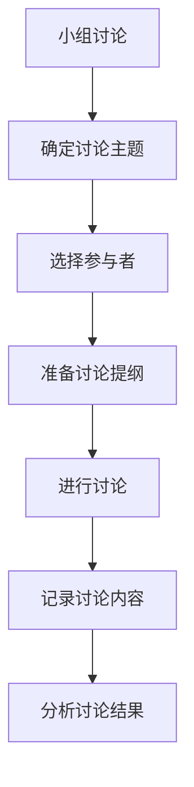

##### 3.2 深度访谈

深度访谈是一种定性调研方法，通过与单个消费者进行深入的一对一对话，获取详细的见解和观点。深度访谈的优点在于能够深入了解消费者的内心世界和真实想法。

**深度访谈的步骤**：

1. **确定访谈主题**：根据市场调研的目的，确定深度访谈的主题。

2. **选择受访者**：选择具有代表性的消费者作为受访者，确保访谈的多样性和全面性。

3. **设计访谈提纲**：提前设计访谈提纲，列出访谈的问题和话题，引导受访者进行深入的讨论。

4. **进行访谈**：与受访者进行一对一的深度访谈，注意倾听受访者的观点，鼓励受访者提出问题和解决方案。

5. **记录访谈内容**：详细记录访谈内容，包括受访者的观点、问题和建议。

6. **分析访谈结果**：对访谈内容进行分析，提取关键信息，为市场调研报告提供支持。

以下是一个深度访谈的示例：

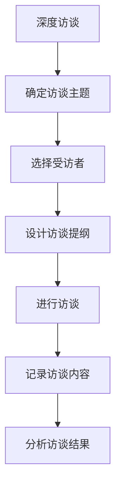

通过小组讨论和深度访谈，创业者可以深入了解消费者的需求和观点，为市场调研提供丰富的数据支持，从而制定更有效的商业策略。

#### 第4章：定量调研方法

定量调研方法是通过设计问卷、统计分析等方式收集大量数据，并进行量化分析，以深入了解市场情况和消费者行为。以下将详细介绍问卷调查设计、统计分析、数据可视化和SPSS与Excel的应用。

##### 4.1 问卷调查设计

问卷调查设计是定量调研的关键环节，一个良好的问卷设计能够有效收集到准确的数据，为市场调研提供有力的支持。以下是一个问卷调查设计的示例：

**问卷调查设计步骤**：

1. **确定调研目标**：明确市场调研的目的和目标，如了解消费者的购物习惯、满意度等。

2. **设计问卷框架**：根据调研目标，设计问卷的框架，包括问卷标题、引言、问题和结束语。

3. **编写问题**：编写清晰、具体、明确的问题，问题类型包括开放性问题和封闭性问题。

4. **选择问题类型**：根据调研目标和问题类型，选择适合的问题类型，如单选题、多选题、评分题等。

5. **编写问题选项**：为每个问题编写合适的选项，确保选项全面、准确、无歧义。

6. **测试问卷**：在正式调研前，对问卷进行测试，确保问卷的可行性和有效性。

以下是一个问卷调查设计的示例：

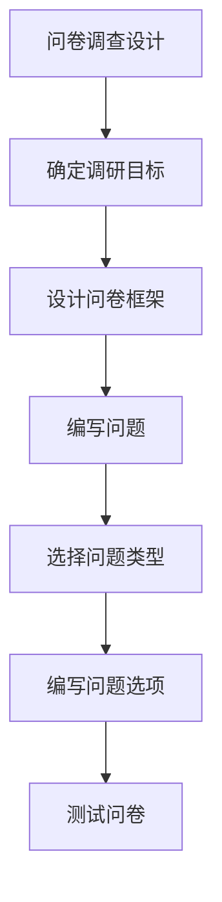

##### 4.2 统计分析

统计分析是定量调研中的重要环节，通过对收集到的数据进行统计分析，可以深入了解市场情况和消费者行为。以下是一个统计分析的示例：

**统计分析步骤**：

1. **数据预处理**：对收集到的数据进行清洗、整理和预处理，确保数据的质量和完整性。

2. **描述性统计**：对数据进行描述性统计分析，如计算平均数、中位数、众数、标准差等，以了解数据的基本特征。

3. **推断性统计**：对数据进行推断性统计分析，如进行T检验、方差分析等，以判断数据之间的差异和关系。

4. **相关性分析**：对数据进行相关性分析，如计算相关系数、进行卡方检验等，以了解变量之间的相关性。

5. **回归分析**：对数据进行回归分析，如线性回归、多项式回归等，以建立变量之间的关系模型。

以下是一个统计分析的示例：

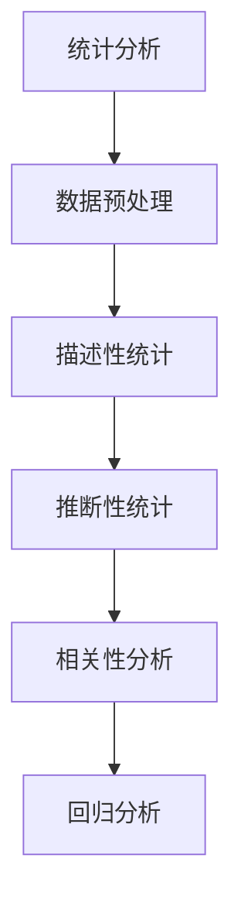

##### 4.3 数据可视化

数据可视化是将数据分析结果以图表、图形等方式呈现，帮助更好地理解和解读数据。以下是一个数据可视化的示例：

**数据可视化步骤**：

1. **确定可视化目标**：根据数据分析的目标和结果，确定数据可视化的类型和形式。

2. **选择可视化工具**：选择合适的可视化工具，如Excel、Python的Matplotlib、R语言等。

3. **设计可视化图表**：根据可视化目标和工具，设计合适的可视化图表，如柱状图、折线图、散点图等。

4. **调整可视化效果**：对可视化图表进行适当的调整，如颜色、字体、大小等，以提高可读性和视觉效果。

5. **解读可视化结果**：对可视化结果进行解读，提取关键信息，为市场调研报告提供支持。

以下是一个数据可视化的示例：

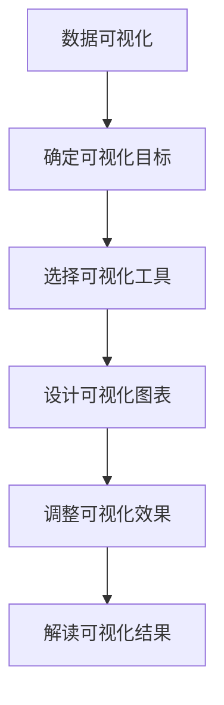

##### 4.4 SPSS与Excel的应用

SPSS和Excel是常用的数据分析工具，广泛应用于市场调研中的数据收集、处理和分析。

**SPSS的应用**：

1. **数据录入**：通过SPSS的数据录入功能，将收集到的数据输入到软件中。

2. **数据清洗**：使用SPSS的数据清洗功能，对数据进行清洗、整理和预处理。

3. **描述性统计**：使用SPSS的描述性统计功能，计算平均数、中位数、众数、标准差等，以了解数据的基本特征。

4. **推断性统计**：使用SPSS的推断性统计功能，进行T检验、方差分析等，以判断数据之间的差异和关系。

5. **回归分析**：使用SPSS的回归分析功能，建立变量之间的关系模型。

**Excel的应用**：

1. **数据录入**：使用Excel的单元格功能，将收集到的数据输入到表格中。

2. **数据清洗**：使用Excel的数据清洗功能，对数据进行清洗、整理和预处理。

3. **描述性统计**：使用Excel的描述性统计功能，计算平均数、中位数、众数、标准差等，以了解数据的基本特征。

4. **推断性统计**：使用Excel的推断性统计功能，进行T检验、方差分析等，以判断数据之间的差异和关系。

5. **回归分析**：使用Excel的回归分析功能，建立变量之间的关系模型。

6. **数据可视化**：使用Excel的数据可视化功能，将数据分析结果以图表、图形等方式呈现。

通过SPSS和Excel的应用，创业者可以更高效地收集、处理和分析市场调研数据，为市场调研报告提供有力的支持。

### 第四部分：市场调研报告与建议

#### 第5章：市场调研报告撰写

市场调研报告是对市场调研过程的总结和结果的呈现，它能够帮助企业更好地理解市场环境，制定有效的商业策略。以下将详细介绍市场调研报告的撰写步骤和内容。

##### 5.1 报告结构

市场调研报告通常包括以下部分：

1. **摘要**：摘要是对市场调研报告的简要概述，包括调研目的、方法、主要发现和结论。

2. **引言**：引言是对市场调研背景和目的的介绍，包括调研背景、调研问题和预期目标。

3. **方法**：方法部分详细描述市场调研的过程和方法，包括调研类型、调研对象、样本选择、数据收集和分析方法等。

4. **结果**：结果部分呈现市场调研的数据和分析结果，包括定量和定性分析结果，以及相应的图表和表格。

5. **讨论**：讨论部分对市场调研结果进行深入分析，探讨市场趋势、消费者行为、竞争态势等，并提出相应的解释和见解。

6. **结论**：结论部分总结市场调研的主要发现，提出建议和展望，为企业的决策提供参考。

7. **参考文献**：参考文献部分列出在市场调研报告中引用的参考资料，以支持报告的结论和观点。

以下是一个市场调研报告结构的示例：

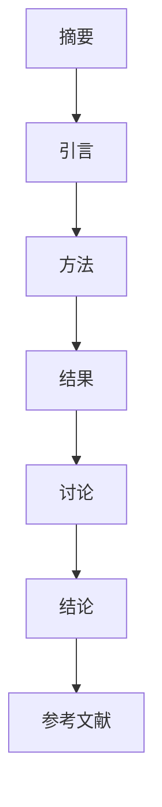

##### 5.2 数据展示与解读

在市场调研报告中，正确的数据展示和解读至关重要。以下是一些数据展示和解读的技巧：

1. **使用图表和表格**：使用图表和表格可以直观地展示数据分析结果，如柱状图、折线图、饼图、散点图等。

2. **图表标题和标签**：为图表添加清晰的标题和标签，以便读者理解图表的内容和数据来源。

3. **数据注释**：对关键数据进行注释，解释数据的意义和影响。

4. **对比分析**：将不同时间点、不同市场或不同群体的数据对比分析，以突出市场趋势和差异。

5. **数据分析**：对数据进行定量和定性分析，提取关键信息，为市场调研报告提供支持。

以下是一个数据展示和解读的示例：

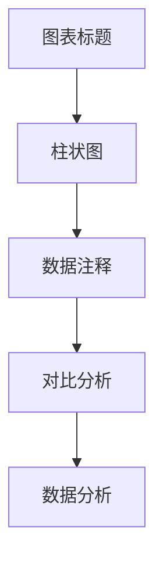

通过正确的数据展示和解读，市场调研报告能够更直观地传达数据分析结果，为企业的决策提供有力的支持。

##### 5.3 市场调研建议与实施

基于市场调研的结果，可以提出具体的建议和措施，以帮助企业更好地应对市场环境，提高市场竞争力。以下是一些市场调研建议与实施的示例：

1. **产品策略**：根据市场调研结果，调整产品定位、功能和价格，以满足消费者的需求。

2. **营销策略**：根据市场调研结果，制定有效的营销策略，如广告投放、促销活动、社交媒体营销等。

3. **市场定位**：根据市场调研结果，明确目标市场和细分市场，为企业的市场定位提供依据。

4. **渠道策略**：根据市场调研结果，优化渠道布局和运营策略，以提高销售效率和客户满意度。

5. **竞争策略**：根据市场调研结果，分析竞争对手的优劣势，制定相应的竞争策略。

以下是一个市场调研建议与实施的示例：

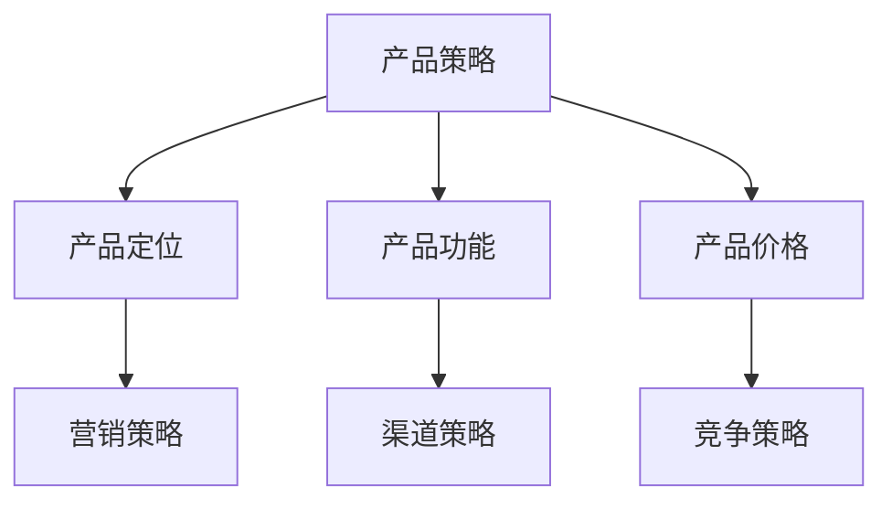

通过市场调研建议与实施，企业可以更有效地应对市场变化，提高市场竞争力，实现可持续发展。

### 第五部分：案例分析

#### 第6章：市场调研案例分析

为了更好地理解市场调研的实际应用，以下将介绍一个具体的市场调研案例，包括案例背景、调研方法、结果与讨论以及案例启示。

##### 6.1 案例背景

某知名电子产品公司计划推出一款新型智能手机，为了了解市场需求和消费者偏好，该公司决定进行一次市场调研。

**调研目的**：
- 了解消费者对智能手机的需求和偏好。
- 分析竞争对手的产品特点和市场表现。
- 评估新型智能手机的市场潜力。

**调研对象**：潜在消费者、竞争对手产品用户、智能手机市场专家。

##### 6.2 案例方法

**调研方法**：

1. **问卷调查**：通过线上和线下方式，设计问卷调查消费者对智能手机的需求和偏好。

2. **深度访谈**：与部分消费者进行一对一深度访谈，深入了解其对智能手机的使用体验和需求。

3. **SWOT分析**：对竞争对手产品进行SWOT分析，评估其市场地位和潜在威胁。

4. **实验法**：通过模拟市场测试，评估新型智能手机的受欢迎程度和市场接受度。

##### 6.3 案例结果与讨论

**调研结果**：

1. **消费者需求**：
   - 大多数消费者对新型智能手机的外观设计、电池续航和摄像头功能较为关注。
   - 消费者更倾向于选择价格在2000元至3000元区间的智能手机。

2. **竞争对手分析**：
   - 竞争对手的产品在性能、价格和品牌认知度上具有一定的优势。
   - 竞争对手在市场营销策略上存在一定的不足，如广告宣传和售后服务。

3. **市场潜力**：
   - 新型智能手机在市场上具有一定的潜力，尤其是在中高端市场。

**讨论**：

1. **产品策略**：
   - 企业应注重外观设计、电池续航和摄像头功能的研发，以满足消费者需求。
   - 企业可以在价格策略上采取差异化竞争，针对不同消费者群体推出不同价位的产品。

2. **营销策略**：
   - 企业应加强广告宣传，提高品牌知名度。
   - 企业可以加强与消费者的互动，通过社交媒体等渠道收集消费者反馈，优化产品和服务。

3. **渠道策略**：
   - 企业应优化渠道布局，提高线上线下融合的效率。
   - 企业可以与电商平台合作，开展促销活动，提高产品销量。

4. **竞争策略**：
   - 企业应积极分析竞争对手的优劣势，制定相应的竞争策略。
   - 企业可以通过技术创新和服务升级，提升市场竞争力。

##### 6.4 案例启示

通过本案例，我们可以得出以下启示：

1. **市场调研的重要性**：市场调研能够帮助企业了解市场需求和消费者偏好，制定有效的产品策略和营销策略。

2. **多元化调研方法**：结合问卷调查、深度访谈、SWOT分析等多种调研方法，可以更全面地了解市场情况和消费者需求。

3. **数据驱动决策**：基于市场调研的数据分析，企业可以更科学地制定商业策略，提高市场竞争力。

4. **持续调研与优化**：市场环境不断变化，企业应持续进行市场调研，优化产品和服务，以适应市场变化。

### 附录

#### 附录A：市场调研工具与资源

在市场调研过程中，使用适当的工具和资源可以大大提高调研的效率和质量。以下是一些常用的市场调研工具和资源：

1. **问卷星**：一款专业的在线问卷调查工具，提供多种问卷模板和数据分析功能。

2. **问卷网**：提供在线问卷设计和数据分析服务，支持多种数据收集渠道。

3. **SPSS**：一款强大的统计分析软件，广泛应用于市场调研、社会科学研究等领域。

4. **Excel**：一款常见的电子表格软件，适用于数据收集、处理和分析。

5. **R语言**：一款开源的统计分析工具，适用于复杂的数据分析和机器学习。

6. **Python**：一款功能强大的编程语言，适用于数据收集、处理和分析，以及数据可视化。

7. **Google Analytics**：一款免费的分析工具，用于网站流量分析、用户行为分析等。

8. **市场调研公司**：如尼尔森、凯度等，提供专业的市场调研报告和分析服务。

通过使用这些市场调研工具和资源，创业者可以更高效地开展市场调研，为企业的决策提供有力支持。

### 结束语

市场调研是创业成功的关键之一，通过系统的调研方法和技术，创业者可以更好地了解市场环境、消费者需求和市场机会。本文从市场调研的基本概念、实践方法、数据分析工具到案例分析和附录资源，全面阐述了市场调研的重要性和具体实施步骤。希望本文能为创业者提供有益的指导，帮助他们在竞争激烈的市场中脱颖而出。

**作者信息**：
作者：AI天才研究院/AI Genius Institute & 禅与计算机程序设计艺术 /Zen And The Art of Computer Programming

感谢您的阅读，期待您在市场调研的道路上取得成功！

