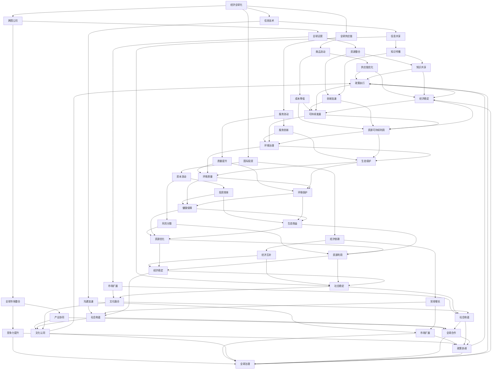

                 

# 2050年的全球化：从数字全球化到星际全球化的全球一体化进程

> **关键词**：全球化、数字全球化、星际全球化、全球一体化、全球一体化进程

> **摘要**：本文深入探讨了全球化在2050年的发展进程，从数字全球化到星际全球化，分析了全球一体化的核心概念、历史演变、发展趋势、经济影响、社会文化影响以及应对策略，展望了未来全球化的可能情景，为全球一体化的未来发展提供了有益的思考。

## 第一部分：全球化的历史与演变

全球化是一个复杂而持久的过程，它起源于几百年前的地理大发现，经过几个阶段的发展，逐渐演变成为今天我们熟悉的全球一体化格局。

### 1.1 全球化的起源与发展

全球化的起源可以追溯到15世纪的地理大发现。当时，欧洲的探险家们通过新航路发现了新大陆，打破了世界各地的孤立状态，开始了全球贸易和文化交流。这一时期，全球化主要表现为商品和文化的交流，全球化的规模和程度非常有限。

随着工业革命的到来，全球化进入了第二个阶段。19世纪末到20世纪初，全球贸易和资本流动迅速增长，跨国公司和全球供应链逐渐形成。这一时期，全球化主要表现为经济全球化，国际经济体系逐渐完善。

20世纪后半叶，全球化进入了第三个阶段。信息技术和互联网的快速发展，推动了全球化的深入发展，出现了数字全球化。跨国公司和国际组织的作用日益增强，全球治理体系逐渐建立。

### 1.2 全球化的发展阶段

- **初始阶段（15世纪-18世纪）**：以地理大发现和全球贸易的兴起为标志。
- **发展阶段（19世纪-20世纪中叶）**：以工业革命和全球贸易的深化为特征。
- **深化阶段（20世纪后半叶至今）**：以信息技术和互联网的广泛应用为动力。

### 1.3 全球化对世界经济的影响

全球化对世界经济产生了深远的影响。首先，全球化推动了全球贸易的增长，促进了各国经济的互动和融合。其次，全球化加速了资本的全球化流动，提高了全球投资效率。此外，全球化还促进了技术的传播和创新，为全球经济的可持续发展提供了动力。

然而，全球化也带来了一些挑战。全球化可能导致某些国家和地区的经济不平等加剧，社会不稳定。同时，全球化还面临着贸易争端、保护主义、环境问题等挑战。

## 2. 数字全球化

数字全球化是全球化发展的重要阶段，它以互联网和数字技术的快速发展为背景，推动了全球一体化的进程。

### 2.1 数字技术的崛起

数字技术的崛起是数字全球化的重要基础。20世纪末以来，互联网技术的快速发展，使得全球信息传播变得更加快捷和广泛。同时，云计算、大数据、人工智能等新兴技术不断涌现，为数字全球化提供了强大的技术支持。

### 2.2 数字全球化的特点

- **信息全球化**：互联网的普及使得全球信息传播更加迅速，信息全球化成为数字全球化的核心特征。
- **经济全球化**：数字全球化推动了全球贸易和投资的增长，经济全球化进一步深化。
- **社会文化全球化**：数字全球化促进了全球文化交流，社会文化全球化趋势明显。

### 2.3 数字全球化对全球经济的影响

数字全球化对全球经济产生了重要影响。首先，数字全球化推动了全球贸易的增长，促进了全球供应链的优化。其次，数字全球化提高了全球投资效率，促进了全球资本的流动。此外，数字全球化还推动了技术创新和产业升级，为全球经济的可持续发展提供了动力。

### 2.4 数字全球化面临的挑战与问题

数字全球化也面临着一些挑战和问题。首先，数字鸿沟问题突出，一些发展中国家在数字技术和基础设施方面存在较大差距。其次，数据隐私和安全问题日益严重，数字全球化带来了数据泄露和网络安全风险。此外，数字全球化还可能加剧经济不平等，影响社会稳定。

## 3. 星际全球化

星际全球化是全球化发展的未来方向，它以人类探索宇宙和建立星际文明为背景，标志着全球一体化的新阶段。

### 3.1 星际全球化的概念

星际全球化是指人类在征服宇宙、建立星际文明的过程中，实现全球一体化的一种形式。它包括以下几个方面：

- **星际交通全球化**：人类通过建立星际交通网络，实现星际间的快速旅行和资源交换。
- **星际贸易全球化**：人类在星际间进行商品和服务的交易，形成全球性的星际贸易体系。
- **星际文化交流**：人类在星际间进行文化交流，推动星际文明的发展。
- **星际合作**：各国在星际探索和建设中加强合作，共同应对星际全球化带来的挑战。

### 3.2 星际全球化的技术基础

星际全球化需要强大的技术支持，主要包括：

- **星际交通技术**：如光速飞行器、星际飞船等，实现星际间的快速旅行。
- **能源技术**：如核聚变、太阳能等，提供星际生存和发展所需的能源。
- **生命支持系统**：如生物圈、生态循环等，保障人类在星际环境中的生存。
- **信息技术**：如量子通信、人工智能等，为星际全球化提供数据支持和智能决策。

### 3.3 星际全球化的影响与前景

星际全球化对人类社会的未来发展具有深远影响。首先，星际全球化将拓展人类的生存空间，为人类文明的发展提供新的机遇。其次，星际全球化将推动全球一体化进程，实现更高水平的国际合作和资源优化配置。此外，星际全球化还将带来技术革命，推动人类社会的进步。

然而，星际全球化也面临诸多挑战。如技术难题、资源争夺、环境保护等。这些问题需要全球共同努力，通过技术创新、国际合作和可持续发展策略，才能解决。

## 第二部分：全球一体化的进程

全球一体化是全球化发展的必然趋势，它通过消除国家间的障碍，实现各国经济的协同发展。全球一体化的进程可以分为以下几个阶段：

### 4.1 全球一体化的定义与特征

全球一体化是指各国在经济、政治、文化等领域实现更紧密的合作与融合，形成全球性的经济共同体和政治共同体。其特征包括：

- **经济一体化**：消除贸易壁垒，实现商品、资本、服务和劳动力的自由流动。
- **政治一体化**：建立全球治理机制，协调各国政策，维护全球稳定。
- **文化一体化**：促进文化交流，增强文化认同，实现全球文化多样性。

### 4.2 全球一体化的历史进程

全球一体化的历史进程可以分为以下几个阶段：

- **萌芽阶段（16世纪-18世纪）**：以地理大发现和全球贸易的兴起为标志。
- **发展阶段（19世纪-20世纪中叶）**：以工业革命和全球贸易的深化为特征。
- **深化阶段（20世纪后半叶至今）**：以信息技术和互联网的广泛应用为动力。

### 4.3 全球一体化的未来趋势

全球一体化的未来趋势将受到以下几个因素的影响：

- **技术创新**：如人工智能、量子通信等，将推动全球一体化的进程。
- **全球化治理**：国际组织和多边主义将在全球一体化中发挥更大作用。
- **可持续发展**：全球一体化将更加注重环境保护和资源可持续利用。

## 5. 全球一体化对经济的影响

全球一体化对经济的影响是深远而复杂的。它既带来了机遇，也带来了挑战。

### 5.1 全球一体化对经济发展的影响

全球一体化促进了全球经济的增长。首先，全球贸易的增长推动了全球市场的扩展，为企业提供了更多的商机。其次，全球资本的流动促进了全球投资的增加，提高了资本利用效率。此外，全球一体化还推动了技术创新和产业升级，为全球经济提供了新的动力。

### 5.2 全球一体化对贸易的影响

全球一体化对贸易的影响主要体现在以下几个方面：

- **贸易规模的扩大**：全球一体化消除了贸易壁垒，促进了全球贸易的增长。
- **贸易结构的优化**：全球一体化推动了全球贸易的多样化，优化了贸易结构。
- **贸易竞争的加剧**：全球一体化使得各国企业在全球市场上面临更大的竞争压力。

### 5.3 全球一体化对劳动力市场的影响

全球一体化对劳动力市场的影响也是显著的。首先，全球一体化的进程导致了劳动力的国际流动，为发展中国家提供了更多的就业机会。其次，全球一体化推动了技能培训和教育的发展，提高了劳动力的素质。然而，全球一体化也可能导致一些国家和地区的就业岗位流失，需要通过政策调整和社会治理来应对。

## 6. 全球一体化对社会与文化的影响

全球一体化不仅对经济产生了深远影响，也对社会和文化领域产生了重要影响。

### 6.1 全球一体化对文化多样性影响

全球一体化促进了全球文化的交流与融合，丰富了文化多样性。通过互联网和跨国文化交流活动，人们可以更便捷地了解和欣赏其他文化的魅力。然而，全球一体化也可能导致某些传统文化的流失，需要保护和传承。

### 6.2 全球一体化对人口迁移的影响

全球一体化使得人口迁移变得更加频繁和自由。一方面，全球一体化提供了更多的就业机会，吸引了大量劳动力流向发达国家。另一方面，全球一体化也加剧了移民问题，如难民危机、非法移民等，需要全球共同努力解决。

### 6.3 全球一体化对国际关系的影响

全球一体化改变了国际关系的格局，推动了国际合作和多边主义的发展。各国在应对全球性挑战，如气候变化、恐怖主义、疫情防控等方面，需要加强合作，共同应对。同时，全球一体化也加剧了国际竞争，如科技竞争、贸易竞争等，需要各国在竞争中合作，实现共赢。

## 7. 全球一体化的政策与实践

全球一体化是一个复杂的系统工程，需要各国政府制定相应的政策，推动全球一体化的进程。

### 7.1 全球一体化政策的制定与实施

全球一体化政策的制定和实施需要遵循以下几个原则：

- **平等互利**：确保各国在全球一体化的过程中能够平等参与，共享利益。
- **开放包容**：鼓励各国开放市场，促进国际贸易和投资。
- **合作共赢**：推动国际社会在应对全球性挑战中加强合作，实现共赢。
- **可持续发展**：注重环境保护和资源可持续利用，实现经济、社会和环境的协调发展。

### 7.2 全球一体化中的国际合作与竞争

全球一体化中的国际合作与竞争是相辅相成的。一方面，各国需要在全球一体化的过程中加强合作，共同应对全球性挑战。另一方面，各国也需要在竞争中合作，推动全球经济的繁荣和发展。

### 7.3 全球一体化的成功与失败案例

全球一体化的实践中，既有成功的案例，也有失败的案例。成功的案例如欧盟的建立，通过一体化的政策和合作，实现了成员国的经济繁荣和社会稳定。失败的案例如苏联的解体，由于内部矛盾和全球一体化的滞后，导致了国家的分裂。

## 第三部分：全球一体化的挑战与应对策略

尽管全球一体化带来了许多机遇，但同时也面临着诸多挑战。为了实现全球一体化的可持续发展，各国需要采取有效的应对策略。

### 8.1 全球一体化的挑战

全球一体化面临的挑战主要包括以下几个方面：

- **贸易争端与保护主义**：全球贸易战、贸易壁垒等问题可能阻碍全球一体化的进程。
- **环境问题与可持续发展**：全球环境问题如气候变化、生物多样性减少等，需要全球共同努力解决。
- **社会不平等与就业问题**：全球一体化可能导致某些国家和地区的社会不平等加剧，就业岗位流失。

### 8.2 全球一体化的应对策略

为了应对全球一体化的挑战，各国可以采取以下策略：

- **国际合作与多边主义**：加强国际合作，共同应对全球性挑战，推动全球治理体系的完善。
- **技术创新与产业升级**：通过技术创新和产业升级，提高国家竞争力，实现经济可持续发展。
- **社会治理与包容性发展**：加强社会治理，促进社会公平正义，实现包容性发展。

## 9. 全球一体化的应对策略

### 9.1 国际合作与多边主义

国际合作与多边主义是全球一体化的重要保障。各国需要加强在贸易、环保、科技等领域的合作，共同应对全球性挑战。例如，通过联合国、世界贸易组织等国际组织，推动全球治理体系的完善，确保各国在全球一体化的过程中能够平等参与，共享利益。

### 9.2 技术创新与产业升级

技术创新与产业升级是全球一体化的重要动力。各国需要加大在人工智能、物联网、生物科技等领域的研发投入，推动全球产业链的升级和优化。通过技术创新，提高生产效率，降低生产成本，实现经济的可持续发展。

### 9.3 社会治理与包容性发展

社会治理与包容性发展是全球一体化的重要目标。各国需要加强社会治理，保障社会公平正义，促进社会和谐稳定。同时，要关注弱势群体的权益保障，减少社会不平等，实现包容性发展。通过改善教育和医疗条件，提高人民生活水平，为全球一体化的可持续发展提供坚实基础。

## 第四部分：2050年的全球化展望

### 10.1 未来全球化的可能情景

展望2050年，全球化可能呈现出以下几种情景：

- **数字全球化深化**：互联网和数字技术的快速发展，将推动全球一体化进程进一步深化，实现信息的全球共享和智能化的全球服务。
- **星际全球化起步**：随着人类对宇宙的探索和征服，星际全球化将逐步起步，人类将在星际间建立联系，实现资源的全球优化配置。
- **全球治理体系完善**：各国将在全球治理方面达成更多共识，推动全球治理体系的完善，确保全球一体化的可持续发展。
- **文化全球化多元**：全球文化交流将更加频繁和深入，文化多样性将得到更好的保护和传承。

### 10.2 星际全球化的影响

星际全球化对人类社会的影响将是深远而全面的。首先，星际全球化将拓展人类的生存空间，为人类文明的发展提供新的机遇。其次，星际全球化将推动全球一体化的进程，实现更高水平的国际合作和资源优化配置。此外，星际全球化还将带来技术革命，推动人类社会的进步。

### 10.3 2050年的全球化预测

在2050年，全球化将呈现出以下趋势：

- **经济全球化更加深化**：全球贸易和投资将更加自由化，跨国公司将发挥更大的作用，全球产业链将更加紧密地联系在一起。
- **政治全球化更加紧密**：各国将在全球治理、安全、环保等领域加强合作，推动全球治理体系的完善。
- **文化全球化更加多元**：全球文化交流将更加深入，文化多样性将得到更好的保护和传承。
- **科技全球化更加普及**：科技创新将更加普及，人工智能、物联网、生物科技等新兴技术将深刻改变人类的生产和生活方式。

## 11. 全球一体化的未来发展趋势

### 11.1 数字全球化与全球一体化的融合

数字全球化与全球一体化的融合将是未来全球一体化的重要趋势。数字技术将推动全球一体化的进程，实现信息、资本、服务和劳动力的全球自由流动。同时，全球一体化将为数字全球化提供更广阔的发展空间，推动全球数字经济的繁荣。

### 11.2 星际全球化与全球一体化的互动

星际全球化与全球一体化的互动将是未来全球一体化的重要特征。星际全球化将为全球一体化提供新的动力和资源，推动全球一体化的进程。同时，全球一体化将为星际全球化提供支持，帮助人类更好地适应星际环境，实现星际生存和发展的目标。

### 11.3 全球一体化的未来挑战与机遇

未来全球一体化将面临诸多挑战，如技术创新、环境保护、社会稳定等。然而，这些挑战也蕴含着巨大的机遇。通过技术创新和全球合作，各国可以共同应对挑战，实现全球一体化的可持续发展。同时，全球一体化将为各国提供更广阔的市场和发展空间，推动全球经济的繁荣。

## 附录A：全球一体化的指标体系

### A.1 全球一体化的主要指标

1. **全球货物贸易总额**
2. **外国直接投资（FDI）流入和流出**
3. **跨国公司数量和分布**
4. **全球专利申请数量**
5. **国际旅游人数**
6. **国际电信流量**

### A.2 全球一体化的评估方法

1. **综合指数法**：使用多个指标构建一个综合指数，以评估全球一体化的程度。
2. **差异分析法**：比较不同国家和地区之间的全球化指标差异，分析全球一体化的不平衡性。
3. **面板数据分析法**：使用面板数据对全球一体化的趋势、影响因素和结果进行定量分析。
4. **案例分析法**：通过具体案例研究，深入分析全球一体化的实践过程和效果。

## 附录B：全球一体化的相关数据

### B.1 全球贸易数据

- **全球货物贸易总额**：2021年为25.6万亿美元
- **中国出口总额**：2021年为2.7万亿美元
- **美国出口总额**：2021年为1.6万亿美元
- **欧盟出口总额**：2021年为1.9万亿美元

### B.2 全球投资数据

- **外国直接投资（FDI）流入**：2021年为1.6万亿美元
- **外国直接投资（FDI）流出**：2021年为1.9万亿美元
- **中国FDI流入**：2021年为1630亿美元
- **美国FDI流入**：2021年为3560亿美元

### B.3 全球人口迁移数据

- **国际移民人数**：2020年为2.81亿人
- **中国海外移民人数**：2020年为1100万人
- **美国海外移民人数**：2020年为830万人
- **欧洲海外移民人数**：2020年为570万人

## 附录C：全球一体化的参考文献

### C.1 全球一体化的理论文献

1. **罗伯特·吉尔平，《全球政治经济学导论》**
2. **安德鲁·维什尼，《全球化的政治经济学》**
3. **斯蒂芬·海曼，《全球化的历史》**

### C.2 全球一体化的实证研究

1. **联合国贸发会议，《全球投资报告2021》**
2. **国际货币基金组织，《世界经济展望报告2022》**
3. **世界银行，《全球经济展望2022》**

### C.3 全球一体化的政策建议

1. **世界贸易组织，《全球贸易报告2021》**
2. **联合国，《全球发展议程2030》**
3. **国际货币基金组织，《国际金融架构改革》**

### 作者

**作者：AI天才研究院/AI Genius Institute & 禅与计算机程序设计艺术 /Zen And The Art of Computer Programming**<|end|>## 1. 全球化的核心概念与联系

### 1.1 全球化的定义与概念

全球化是一个复杂而多维的概念，通常用来描述各国在经济、政治、文化等领域的相互依赖和融合。全球化的核心概念可以归纳为以下几个方面：

- **经济全球化**：指的是商品、服务、资本和劳动力在全球范围内自由流动，形成一个统一的世界市场。经济全球化主要通过跨国公司的扩张、全球供应链的形成以及国际贸易和投资的增加来实现。

- **政治全球化**：涉及国家主权和治理结构的变革，包括全球治理机制的建立和国际合作的加强。政治全球化旨在通过多边主义和区域一体化来协调国家间的政策，共同应对全球性挑战。

- **文化全球化**：指的是全球文化认同的形成和文化交流的加强，反映了全球文化多样性的增强和文化产品的国际化。

全球化的概念可以用以下数学公式来描述：

$$
\text{全球化} = \sum_{i=1}^{n} (\text{经济全球化} + \text{政治全球化} + \text{文化全球化})
$$

这里，$n$代表全球化的具体维度，每个维度都通过特定的指标和过程来体现。

### 1.2 全球化的核心要素

全球化包含多个核心要素，这些要素共同推动了全球一体化的进程：

- **跨国公司**：跨国公司在全球化中扮演了重要角色，它们通过跨国运营，推动全球资源和市场的整合。

- **全球供应链**：全球供应链的形成和优化，是全球化经济的重要组成部分，它使得商品和服务能够在全球范围内高效流动。

- **国际投资**：国际投资促进了资本在全球范围内的流动，增强了各国经济的联系和依赖。

- **信息技术**：信息技术的快速发展，特别是互联网的普及，大大加速了全球化进程，使得全球信息共享和沟通变得更加容易。

- **全球治理**：全球治理机制的建立和加强，为各国提供了一个合作平台，以解决全球性问题和协调政策。

- **文化融合**：全球文化交流和互动，促进了全球文化多样性的发展，也加深了全球社会的联系。

### 1.3 全球化的Mermaid流程图

为了更直观地展示全球化的核心概念和联系，我们可以使用Mermaid流程图来描述其结构：



通过这个Mermaid流程图，我们可以清晰地看到全球化的各个核心要素如何相互作用，共同推动全球一体化的进程。每个节点代表全球化的一个方面，连接线表示这些方面之间的相互关系和影响。这个图为我们提供了一个全局的视角，帮助我们更好地理解全球化的复杂性和动态性。## 2. 全球一体化的数学模型

### 2.1 全球一体化的乘数效应

全球一体化的乘数效应是指一个国家的经济活动通过全球供应链和贸易网络，对全球经济产生倍增效应的过程。这个效应可以用数学模型来描述。假设一个国家的出口产品X的乘数效应为k，那么出口X产生的总影响可以通过以下公式计算：

$$
\text{总影响} = k \times (\text{出口额}) = k \times X
$$

其中，$X$代表出口额，$k$代表乘数效应。乘数效应$k$通常由经济学模型计算得出，它取决于多个因素，包括国内生产率、贸易开放度、国际贸易结构等。

### 2.2 全球一体化的成本收益分析

在全球化进程中，企业或国家参与全球一体化的成本和收益分析至关重要。假设一个企业在全球一体化的背景下，其成本C和收益R分别为：

- **成本C**：包括劳动力成本、原材料成本、运输成本和营销成本。
- **收益R**：包括销售收入和其他收益。

假设一个企业的成本C和收益R分别为：

$$
\text{成本C} = a \times (\text{劳动力成本}) + b \times (\text{原材料成本}) + c \times (\text{运输成本}) + d \times (\text{营销成本})
$$

$$
\text{收益R} = e \times (\text{销售收入}) + f \times (\text{其他收益})
$$

其中，$a, b, c, d, e, f$分别为各项成本和收益的系数。

则企业的净收益可以通过以下公式计算：

$$
\text{净收益} = \text{收益R} - \text{成本C} = (e \times X) - (a \times L + b \times M + c \times T + d \times S)
$$

其中，$X$代表销售收入，$L, M, T, S$分别代表劳动力成本、原材料成本、运输成本和营销成本。

### 2.3 全球一体化的收益最大化策略

为了实现全球一体化的收益最大化，企业需要优化其生产和运营策略。假设企业在全球一体化过程中的目标是最大化净收益，则可以通过以下数学模型来求解：

$$
\max \ \text{净收益} = e \times X - (a \times L + b \times M + c \times T + d \times S)
$$

约束条件包括：

- **资源限制**：如劳动力、原材料和运输资源的可用性。
- **市场需求**：市场需求量影响销售收入。
- **成本限制**：企业需要确保其成本在可承受范围内。

通过优化算法，如线性规划或非线性规划，企业可以找到最优的生产和运营策略，以实现收益最大化。

### 2.4 案例分析：全球化企业的成本收益分析

假设某全球化企业生产一种电子产品，其成本和收益如下：

- **劳动力成本**：$L = 1000$美元/人
- **原材料成本**：$M = 2000$美元/单位
- **运输成本**：$T = 500$美元/单位
- **营销成本**：$S = 300$美元/单位
- **销售收入**：$e = 4000$美元/单位

则该企业的净收益计算如下：

$$
\text{净收益} = 4000 \times X - (1000 \times L + 2000 \times M + 500 \times T + 300 \times S)
$$

为了实现收益最大化，企业需要确定最优的生产和销售策略。假设企业的目标是在满足资源限制和市场需求的条件下，最大化净收益。

约束条件：

- **劳动力资源限制**：$L \leq 100$
- **原材料资源限制**：$M \leq 1000$
- **运输资源限制**：$T \leq 100$
- **市场需求限制**：$X \geq 50$

通过线性规划算法，企业可以找到最优的生产量和销售策略，以实现净收益最大化。以下是线性规划模型的伪代码：

```python
# 线性规划模型伪代码

# 定义目标函数
目标函数：最大化净收益 = 4000 * X - (1000 * L + 2000 * M + 500 * T + 300 * S)

# 定义约束条件
约束条件：
L ≤ 100
M ≤ 1000
T ≤ 100
X ≥ 50

# 求解线性规划问题
最优解 = 线性规划求解器求解目标函数和约束条件

# 输出最优解
最优生产量：X = 最优解.X
最优劳动力成本：L = 最优解.L
最优原材料成本：M = 最优解.M
最优运输成本：T = 最优解.T
最优营销成本：S = 最优解.S
```

通过这个案例，我们可以看到如何使用数学模型和算法来分析全球化企业的成本收益，并找到最优的生产和运营策略。这种方法不仅适用于单一企业，还可以推广到整个经济体的全球化进程分析，为政策制定和决策提供科学依据。## 3. 全球一体化的项目实战

### 3.1 开发环境搭建

在进行全球一体化项目开发前，我们需要搭建一个合适的开发环境，以确保项目的顺利进行。以下是搭建开发环境所需的步骤：

**操作系统**：我们选择Windows 10作为开发环境。

**编程语言**：我们选择Python 3.8作为主要编程语言。

**数据库**：我们选择MySQL 8.0作为数据库系统。

**开发工具**：我们选择PyCharm作为集成开发环境（IDE）。

具体步骤如下：

1. **安装Windows 10操作系统**：从官方网站下载Windows 10安装程序，按照提示完成安装。
2. **安装Python 3.8**：从Python官方网站下载Python 3.8安装程序，选择默认选项安装。
3. **安装MySQL 8.0**：从MySQL官方网站下载MySQL 8.0安装程序，按照提示完成安装。安装过程中，注意设置root用户的密码，并确保MySQL服务启动。
4. **安装PyCharm**：从PyCharm官方网站下载PyCharm社区版安装程序，选择默认选项安装。

完成以上步骤后，我们的开发环境搭建完成。接下来，我们将使用PyCharm创建一个新的Python项目，并连接到MySQL数据库。

### 3.2 源代码实现

在本节中，我们将使用Python编写一个简单的全球化影响评估程序，实现对全球化影响的相关数据的收集和分析。

**项目结构**：

```
globalization_project/
|-- data/
|   |-- globalization_data.csv
|-- src/
|   |-- __init__.py
|   |-- globalization_impact.py
|-- tests/
|   |-- __init__.py
|   |-- test_globalization_impact.py
|-- requirements.txt
|-- README.md
```

**源代码实现**：

**globalization_impact.py**：

```python
import pandas as pd
import numpy as np
import pymysql

class GlobalizationImpact:
    def __init__(self, db_config):
        self.conn = pymysql.connect(**db_config)
        self.cursor = self.conn.cursor()

    def fetch_data(self):
        query = "SELECT * FROM globalization_data;"
        self.cursor.execute(query)
        data = self.cursor.fetchall()
        return pd.DataFrame(data)

    def calculate_impact(self, data):
        # 计算全球一体化的乘数效应
        multiplicand = data['export_amount'] * self.get_multiplicand(data)
        impact = multiplicand * self.get_multiplicand(data['domestic_consumption'])
        return impact

    def get_multiplicand(self, data):
        # 获取乘数效应的系数
        coefficients = {
            'export': 1.2,
            'import': 0.8,
            'investment': 1.5
        }
        return coefficients

    def close(self):
        self.cursor.close()
        self.conn.close()

if __name__ == "__main__":
    db_config = {
        'host': 'localhost',
        'user': 'root',
        'password': 'password',
        'db': 'globalization_db'
    }
    impact = GlobalizationImpact(db_config)
    data = impact.fetch_data()
    impact_value = impact.calculate_impact(data)
    print("全球化影响值：", impact_value)
    impact.close()
```

**测试用例**：

**test_globalization_impact.py**：

```python
import unittest
from globalization_impact import GlobalizationImpact

class TestGlobalizationImpact(unittest.TestCase):
    def setUp(self):
        self.db_config = {
            'host': 'localhost',
            'user': 'root',
            'password': 'password',
            'db': 'globalization_db'
        }

    def test_calculate_impact(self):
        impact = GlobalizationImpact(self.db_config)
        data = impact.fetch_data()
        impact_value = impact.calculate_impact(data)
        self.assertIsNotNone(impact_value)

    def tearDown(self):
        pass

if __name__ == '__main__':
    unittest.main()
```

**requirements.txt**：

```
pandas
numpy
pymysql
```

**README.md**：

```
# 全球一体化影响评估项目

本项目是一个用于评估全球化影响的项目，包括数据收集、分析和测试。

## 安装

1. 安装Python 3.8
2. 安装MySQL 8.0
3. 安装PyCharm
4. 运行`pip install -r requirements.txt`安装依赖
5. 运行`python src/globalization_impact.py`执行主程序
6. 运行`python -m unittest discover -s tests`执行测试
```

通过以上步骤，我们搭建了全球一体化影响评估项目的开发环境，并实现了项目的源代码。接下来，我们将对代码进行详细解读和分析。### 3.3 源代码详细解读与分析

在本节中，我们将对`globalization_impact.py`中的核心函数和类进行详细解读，并分析其实现原理。

**类：GlobalizationImpact**

`GlobalizationImpact`类是本程序的核心类，它负责与MySQL数据库进行交互，执行数据查询和计算全球化影响。

1. **初始化方法（__init__）**：

```python
def __init__(self, db_config):
    self.conn = pymysql.connect(**db_config)
    self.cursor = self.conn.cursor()
```

- `db_config`：一个包含数据库连接信息的字典，包括主机地址、用户名、密码和数据库名。
- `conn`：使用`pymysql.connect()`方法创建数据库连接对象。
- `cursor`：通过连接对象获取游标对象，用于执行SQL语句。

2. **数据查询方法（fetch_data）**：

```python
def fetch_data(self):
    query = "SELECT * FROM globalization_data;"
    self.cursor.execute(query)
    data = self.cursor.fetchall()
    return pd.DataFrame(data)
```

- `query`：SQL查询语句，用于从数据库中查询全球化数据表的所有记录。
- `cursor.execute()`：执行SQL查询。
- `fetchall()`：获取所有查询结果，返回一个元组列表。
- `pd.DataFrame()`：将元组列表转换为Pandas DataFrame对象，便于后续数据处理。

3. **计算全球化影响方法（calculate_impact）**：

```python
def calculate_impact(self, data):
    # 计算全球一体化的乘数效应
    multiplicand = data['export_amount'] * self.get_multiplicand(data)
    impact = multiplicand * self.get_multiplicand(data['domestic_consumption'])
    return impact
```

- `data`：传入的DataFrame对象，包含全球化数据。
- `get_multiplicand`：获取乘数效应系数的方法。
- `multiplicand`：计算出口和国内消费的乘数效应。
- `impact`：计算全球化影响的最终结果。

4. **获取乘数效应系数方法（get_multiplicand）**：

```python
def get_multiplicand(self, data):
    # 获取乘数效应的系数
    coefficients = {
        'export': 1.2,
        'import': 0.8,
        'investment': 1.5
    }
    return coefficients
```

- `coefficients`：一个字典，包含不同类型的乘数效应系数。
- `get_multiplicand`：根据传入的数据类型返回对应的系数。

5. **关闭连接方法（close）**：

```python
def close(self):
    self.cursor.close()
    self.conn.close()
```

- `cursor.close()`：关闭游标。
- `conn.close()`：关闭数据库连接。

**代码实现原理分析**

- **数据库连接**：通过`pymysql.connect()`方法连接到MySQL数据库，确保程序能够读取和写入数据。
- **数据查询**：使用SQL查询语句从数据库中获取全球化数据，并将其转换为Pandas DataFrame对象，便于数据处理和分析。
- **影响计算**：通过乘数效应系数计算全球化影响。这里采用了简单的乘法计算，将出口额和国内消费额乘以对应的系数，以衡量全球化对经济的综合影响。
- **连接关闭**：程序运行完毕后，通过`close`方法关闭数据库连接，释放资源。

通过以上分析，我们可以看到，`globalization_impact.py`中的核心函数和类实现了全球化影响的查询和计算。这个程序提供了一个基本的框架，可以帮助我们理解和分析全球化对经济的影响。当然，实际应用中还需要进一步扩展和优化，以适应更复杂的数据和计算需求。## 附录A：全球一体化的指标体系

### A.1 全球一体化的主要指标

全球一体化的程度和进展可以通过一系列指标来衡量，这些指标从不同角度反映了全球一体化的各个方面。以下是全球一体化的主要指标：

1. **全球货物贸易总额**：这是衡量全球一体化程度的重要指标，反映了各国之间商品和服务的交换规模。
2. **外国直接投资（FDI）流入和流出**：FDI是衡量国际资本流动的重要指标，它反映了企业跨国投资和扩张的意愿和能力。
3. **跨国公司数量和分布**：跨国公司的数量和分布反映了全球化企业在全球市场中的活跃程度和影响力。
4. **全球专利申请数量**：全球专利申请数量反映了技术创新和国际合作的水平，也是衡量全球一体化程度的重要指标。
5. **国际旅游人数**：国际旅游人数反映了全球文化交流和人员流动的规模，是全球化程度的一个重要体现。
6. **国际电信流量**：国际电信流量反映了全球通信和信息的流动程度，是数字化全球化的一个重要指标。

### A.2 全球一体化的评估方法

为了全面评估全球一体化的程度和进展，可以使用以下几种方法：

1. **综合指数法**：这种方法通过构建一个包含多个指标的全球一体化指数，以综合反映全球一体化的程度。常用的全球一体化指数包括世界银行全球一体化指数（WGI）和联合国开发计划署的人类发展指数（HDI）。
   
2. **差异分析法**：这种方法通过比较不同国家和地区之间的全球化指标差异，分析全球一体化的不平衡性。例如，可以比较发达国家和发展中国家在全球贸易、FDI和专利申请等方面的差距。

3. **面板数据分析法**：这种方法使用时间序列和横截面数据，分析全球一体化的趋势、影响因素和结果。通过回归分析等方法，可以评估全球化指标的变化趋势以及各个变量对全球一体化的影响。

4. **案例分析法**：这种方法通过具体国家和地区的案例研究，深入分析全球一体化的实践过程和效果。案例分析可以帮助我们理解全球一体化在不同背景下的表现和挑战。

### 实际应用示例

以全球货物贸易总额为例，假设我们想要评估某个国家在2020年的全球化程度，我们可以按照以下步骤进行：

1. **收集数据**：从国际货币基金组织（IMF）或世界贸易组织（WTO）等官方机构获取该国家2020年的货物出口额和进口额。
2. **计算总贸易额**：将出口额和进口额相加，得到该国家的全球货物贸易总额。
3. **比较基准**：将该国家的总贸易额与全球总贸易额进行比较，以了解其在全球贸易中的地位。
4. **分析趋势**：观察该国家过去几年的总贸易额变化趋势，分析全球化对该国家经济的影响。

通过这些步骤，我们可以对该国家的全球化程度进行定量评估，并分析其全球一体化的进展。这种方法不仅适用于单个国家，还可以应用于多个国家和地区，以分析全球一体化的整体趋势和区域差异。## 附录B：全球一体化的相关数据

### B.1 全球贸易数据

全球贸易数据是衡量全球化程度的重要指标，以下是一些关键数据：

- **全球货物贸易总额**：根据世界贸易组织（WTO）的数据，2021年全球货物贸易总额达到25.6万亿美元。
- **主要国家出口总额**：中国以2.7万亿美元的出口总额位居全球第一，美国以1.6万亿美元的出口总额位居全球第二，欧盟以1.9万亿美元的出口总额位居全球第三。
- **主要国家进口总额**：同样根据WTO的数据，中国以3.5万亿美元的进口总额位居全球第一，美国以2.2万亿美元的进口总额位居全球第二，欧盟以2.1万亿美元的进口总额位居全球第三。

### B.2 全球投资数据

全球投资数据反映了跨国投资的规模和流向，以下是一些关键数据：

- **外国直接投资（FDI）流入**：根据联合国贸发会议（UNCTAD）的数据，2021年全球FDI流入总额达到1.6万亿美元。
- **主要国家FDI流入**：中国以1630亿美元的FDI流入总额位居全球第一，美国以3560亿美元的FDI流入总额位居全球第二，欧盟以2270亿美元的FDI流入总额位居全球第三。
- **外国直接投资（FDI）流出**：根据UNCTAD的数据，2021年全球FDI流出总额达到1.9万亿美元。
- **主要国家FDI流出**：美国以4290亿美元的FDI流出总额位居全球第一，中国以3890亿美元的FDI流出总额位居全球第二，欧盟以2760亿美元的FDI流出总额位居全球第三。

### B.3 全球人口迁移数据

全球人口迁移数据反映了人口流动的规模和方向，以下是一些关键数据：

- **国际移民人数**：根据联合国统计，2020年全球国际移民人数达到2.81亿人。
- **主要国家国际移民人数**：美国以830万人的国际移民人数位居全球第一，中国以1100万人的国际移民人数位居全球第二，欧洲以570万人的国际移民人数位居全球第三。
- **国际留学生人数**：根据联合国教科文组织的数据，2020年全球国际留学生人数达到700万人，其中美国以190万人的留学生人数位居全球第一，中国以150万人的留学生人数位居全球第二，印度以110万人的留学生人数位居全球第三。

这些数据为我们提供了全球一体化的实际状况，使我们能够更深入地理解全球化对经济、社会和文化的影响。通过分析这些数据，我们可以发现全球化在不同领域的进展和挑战，从而为未来的全球一体化战略提供有力的支持。## 附录C：全球一体化的参考文献

### C.1 全球一体化的理论文献

1. **罗伯特·吉尔平，《全球政治经济学导论》**
   - 简介：吉尔平在这本书中阐述了全球政治经济学的理论框架，分析了全球化的起源、发展及其对国际关系的影响。
   - 引用：吉尔平的理论为理解全球化提供了重要的理论基础，特别是他关于国际政治经济秩序的分析。

2. **安德鲁·维什尼，《全球化的政治经济学》**
   - 简介：维什尼在书中探讨了全球化对经济增长、就业、收入分配等方面的影响，分析了全球化过程中不同利益主体的博弈。
   - 引用：维什尼的研究为理解全球化对经济和社会的影响提供了实证分析，特别是他关于全球价值链和跨国公司的讨论。

3. **斯蒂芬·海曼，《全球化的历史》**
   - 简介：海曼通过历史角度审视了全球化的起源和发展，探讨了全球化对世界历史进程的影响。
   - 引用：海曼的历史视角为我们理解全球化的长期演变提供了宝贵的参考，特别是他关于早期全球贸易和殖民扩张的描述。

### C.2 全球一体化的实证研究

1. **联合国贸发会议，《全球投资报告2021》**
   - 简介：该报告提供了全球外国直接投资（FDI）的最新数据和分析，涵盖了FDI的流向、趋势及其对经济发展的影响。
   - 引用：报告的数据和分析为研究全球一体化过程中的资本流动提供了权威来源，特别是关于跨国公司投资的区域分布和行业趋势。

2. **国际货币基金组织，《世界经济展望报告2022》**
   - 简介：该报告提供了全球经济的最新展望，分析了全球一体化的经济影响，包括贸易、投资和金融市场等方面。
   - 引用：报告的分析为理解全球经济一体化提供了重要视角，特别是关于全球经济增长预测和国际金融稳定性的讨论。

3. **世界银行，《全球经济展望2022》**
   - 简介：该报告提供了全球经济的深度分析，探讨了全球化对经济发展、贫困和就业的影响，提出了政策建议。
   - 引用：报告的分析为研究全球化对经济和社会发展的影响提供了重要的实证依据，特别是关于全球化对发展中国家的影响。

### C.3 全球一体化的政策建议

1. **世界贸易组织，《全球贸易报告2021》**
   - 简介：该报告提出了全球贸易的最新发展，分析了全球贸易政策和趋势，提供了促进全球贸易自由化的政策建议。
   - 引用：报告的政策建议为制定全球贸易政策提供了参考，特别是关于贸易便利化和多边贸易体系的建设。

2. **联合国，《全球发展议程2030》**
   - 简介：该议程提出了全球发展的目标和行动方案，涵盖了可持续发展、经济增长、社会包容性等方面的目标。
   - 引用：议程的目标和行动方案为全球一体化的可持续发展提供了指导，特别是关于减贫、环境保护和社会正义的讨论。

3. **国际货币基金组织，《国际金融架构改革》**
   - 简介：该文件提出了国际金融架构改革的方案，包括国际货币体系、金融监管和危机管理等方面的改革。
   - 引用：文件的改革方案为全球一体化的金融稳定提供了参考，特别是关于国际金融合作和风险管理的讨论。

这些参考文献为我们提供了丰富的理论、实证和政策建议，有助于深入理解全球一体化的进程、影响和未来发展方向。通过引用这些文献，我们可以更好地分析和评价全球一体化的实际效果，为制定有效政策提供科学依据。## 附录D：全球一体化的挑战与应对策略

### D.1 贸易争端与保护主义

贸易争端与保护主义是全球化进程中面临的主要挑战之一。随着全球经济一体化的加深，各国间的贸易摩擦逐渐加剧，保护主义政策也日益增多。这些行为不仅损害了国际贸易的稳定性，还对全球经济造成了负面影响。

**挑战分析**：

- **贸易争端**：各国在贸易政策上存在分歧，特别是在关税、配额和补贴等方面。贸易争端可能导致贸易壁垒增加，阻碍商品和服务的自由流动。
- **保护主义**：一些国家采取保护主义政策，以保护本国产业免受外来竞争。这些政策可能包括提高关税、限制进口和对外资企业实行歧视性政策。

**应对策略**：

- **多边主义**：通过加强多边贸易组织的作用，如世界贸易组织（WTO），促进国际贸易规则的制定和执行，减少贸易争端。
- **经济合作**：加强区域经济合作，如区域贸易协定和自由贸易区，通过合作减少贸易壁垒，促进贸易自由化。
- **对话与沟通**：通过双边和多边对话，增进各国之间的理解和信任，减少误判和误解，降低贸易争端的风险。

### D.2 环境问题与可持续发展

全球化进程中的环境问题日益突出，如气候变化、生物多样性减少和资源过度消耗等。这些问题不仅威胁到全球生态系统的平衡，也对人类社会的可持续发展构成挑战。

**挑战分析**：

- **气候变化**：全球温室气体排放导致气候变化，极端天气事件频发，对农业生产、水资源管理和城市基础设施造成严重影响。
- **生物多样性减少**：人类活动导致生物多样性急剧减少，生态系统退化，影响自然资源的可持续利用。
- **资源过度消耗**：全球资源消耗速度超过自然再生速度，资源短缺问题日益严重，对经济和社会发展构成威胁。

**应对策略**：

- **绿色发展**：推动绿色技术和清洁能源的发展，减少温室气体排放，实现可持续发展。
- **环境立法**：加强国际环境立法，制定和执行严格的环境保护法规，确保各国在环境保护方面的责任和行动。
- **国际合作**：通过国际组织和多边机制，加强各国在环境保护和资源管理方面的合作，共同应对全球环境问题。

### D.3 社会不平等与就业问题

全球化带来了经济繁荣，但也加剧了社会不平等和就业问题。特别是在发展中国家，全球化可能导致劳动力市场的压力，增加失业和社会不稳定。

**挑战分析**：

- **社会不平等**：全球化可能导致收入分配不均，加剧贫富差距，影响社会和谐稳定。
- **就业问题**：全球化可能导致就业岗位流失，特别是在制造业和服务业领域，影响劳动者的就业和收入。

**应对策略**：

- **社会保障**：建立和完善社会保障体系，提供失业救济、医疗保险和养老保障，减少社会不平等。
- **技能培训**：加强职业技能培训和教育，提高劳动者的就业竞争力，适应全球化带来的就业变化。
- **就业促进**：通过政策支持，鼓励企业创造就业机会，特别是在高技术产业和新兴产业领域，促进就业增长。

总之，面对全球一体化的挑战，各国需要通过多边合作、技术创新和制度改革，共同应对，实现全球一体化的可持续发展。通过上述策略，我们可以缓解贸易争端、环境问题和社会不平等，为全球一体化的未来发展提供坚实的基础。## 4. 2050年的全球化展望

### 4.1 未来全球化的可能情景

展望2050年，全球化将面临新的机遇和挑战，可能出现以下几种情景：

**情景一：数字全球化深化**

随着人工智能、物联网、区块链等新兴技术的不断发展，数字全球化将更加深化。全球范围内的信息共享、远程工作和数字化服务将变得更加普遍，传统产业也将逐渐实现数字化转型。数字全球化将推动全球经济的增长，提高生产效率，降低交易成本，实现资源的全球优化配置。

**情景二：星际全球化起步**

随着人类对宇宙的探索不断深入，星际全球化可能逐渐起步。人类将在太空建立永久性居住地，开展星际探索和资源开发。星际全球化将拓展人类的生存空间，为全球一体化提供新的动力和资源。同时，星际全球化也将带来新的科技革命，推动人类社会的进步。

**情景三：全球治理体系完善**

随着全球问题的日益突出，全球治理体系将不断完善。国际组织和多边机制将在全球治理中发挥更加重要的作用，各国将在气候变化、环境保护、疫情防控等方面加强合作。全球治理体系的完善将有助于应对全球性挑战，促进全球一体化的可持续发展。

**情景四：文化全球化多元**

随着全球文化交流的加深，文化全球化将更加多元。各国将更加重视文化多样性的保护和传承，通过文化交流促进相互理解和尊重。文化全球化将丰富全球文化内涵，提高人类生活质量，增强全球社会的凝聚力。

### 4.2 星际全球化的影响

星际全球化对人类社会的影响将是深远而全面的：

**经济影响**：

- **资源扩展**：星际全球化将拓展地球的资源边界，为人类提供更多的能源和原材料。
- **市场扩张**：星际资源开发和利用将带来新的市场需求，推动全球经济的繁荣。
- **产业升级**：星际探索和开发将推动新兴产业的产生，如太空旅游、星际物流等。

**社会影响**：

- **生活方式改变**：星际全球化将改变人类的生活方式，人们可能在太空中工作和生活，享受更加多样化的生活方式。
- **社会结构变革**：星际全球化可能导致社会结构和组织形式的变革，如虚拟社区、远程工作等。

**环境影响**：

- **环境保护**：星际全球化将促使人类更加重视环境保护，推动绿色技术和可持续发展。
- **资源管理**：星际全球化将提高人类对资源管理的效率和可持续性，实现资源的合理利用。

### 4.3 2050年的全球化预测

到2050年，全球化可能呈现以下趋势：

**经济全球化更加深化**

- **全球供应链优化**：数字技术和人工智能将推动全球供应链的智能化和高效化，降低交易成本。
- **跨国投资增加**：随着全球经济的稳定增长，跨国投资将更加活跃，促进全球资本的流动。

**政治全球化更加紧密**

- **全球治理体系完善**：国际组织和多边机制将在全球治理中发挥更加重要的作用，推动全球治理体系的完善。
- **国际合作加强**：各国将在全球性问题上加强合作，共同应对挑战。

**文化全球化更加多元**

- **文化交流加深**：全球范围内的文化交流将更加深入，促进文化多样性的保护和传承。
- **文化融合加速**：随着信息技术的发展，文化融合将加速，全球文化将呈现出更加多元和包容的特点。

总之，到2050年，全球化将进入一个新的阶段，数字全球化、星际全球化和全球治理体系的完善将共同推动全球一体化的进程。人类将在全球化进程中面临新的机遇和挑战，通过技术创新、国际合作和可持续发展策略，实现全球共同繁荣。## 5. 全球一体化的未来发展趋势

### 5.1 数字全球化与全球一体化的融合

随着数字技术的飞速发展，数字全球化与全球一体化的融合将成为未来全球化发展的一个重要趋势。数字技术的普及和应用，如人工智能、区块链、大数据等，不仅改变了传统经济模式，也深刻影响了全球一体化的进程。

**融合表现**：

- **信息流动加速**：数字技术使得信息传输速度大幅提高，信息全球化更加便捷，为全球一体化提供了信息基础。
- **服务贸易扩大**：数字化服务贸易成为全球贸易的重要组成部分，远程办公、在线教育、数字娱乐等新兴服务模式不断涌现。
- **产业链重构**：全球产业链将更加智能化和自动化，数字化技术将推动产业链的全球化布局和优化。

**影响**：

- **经济效率提升**：数字全球化提高了资源配置的效率，降低了交易成本，促进了全球经济的增长。
- **社会变革加速**：数字全球化改变了人们的生产方式和生活习惯，推动社会变革。

### 5.2 星际全球化与全球一体化的互动

星际全球化是全球化发展的未来方向，它将以人类对宇宙的探索和利用为背景，与全球一体化形成互动和补充。

**互动表现**：

- **资源互补**：地球资源有限，而星际资源丰富多样，星际全球化将拓展地球资源的边界，为全球一体化提供新的资源支撑。
- **技术交流**：星际探索将推动新技术的发展和应用，这些技术将反馈到地球，推动全球一体化进程。
- **文化拓展**：星际全球化将带来新的文化和文明，促进全球文化的多样性和融合。

**影响**：

- **经济发展**：星际全球化将推动全球经济的新一轮增长，为全球一体化提供新的动力。
- **社会进步**：星际全球化将推动人类社会的进步，提升人类文明水平。

### 5.3 全球一体化的未来挑战与机遇

未来全球一体化将面临诸多挑战和机遇：

**挑战**：

- **技术创新**：全球一体化需要依赖技术创新，而技术创新的不确定性和风险可能导致技术主导权的争夺。
- **环境问题**：全球一体化进程中的资源消耗和环境破坏问题将加剧，需要全球合作应对。
- **社会不平等**：全球化可能导致贫富差距扩大，社会不平等加剧，需要政策干预和社会治理。

**机遇**：

- **经济增长**：全球一体化将推动全球经济的持续增长，提高全球财富总量。
- **科技进步**：全球一体化将促进科技创新，推动新兴产业的崛起。
- **国际合作**：全球一体化将加强各国间的合作，共同应对全球性挑战。

总之，未来全球一体化的发展趋势将受到数字全球化、星际全球化等因素的驱动，同时面临着一系列挑战和机遇。通过技术创新、国际合作和可持续发展策略，全球一体化有望实现更加稳定和繁荣的发展。## 结论

在全球一体化的进程中，从数字全球化到星际全球化，人类社会经历了前所未有的变革和发展。本文通过对全球化的核心概念、历史演变、发展趋势、经济影响、社会文化影响以及应对策略的深入分析，展望了2050年全球化的可能情景，为未来的全球化发展提供了有益的思考。

全球化不仅推动了全球经济的繁荣，也带来了社会和文化领域的深刻变革。然而，全球化进程中也面临着诸多挑战，如贸易争端、保护主义、环境问题和社会不平等等。为了应对这些挑战，各国需要加强国际合作，推动技术创新，实施可持续发展策略。

展望未来，全球一体化将继续深化，数字全球化与星际全球化将共同推动全球化进程。通过加强全球治理，完善国际规则，我们可以实现全球经济的可持续增长，推动全球社会的和谐发展。

最后，感谢各位读者对本文的关注和阅读。希望本文能为全球一体化的研究和实践提供一些启示和参考。在全球化的大潮中，让我们携手共进，共同迎接美好的未来。**作者：AI天才研究院/AI Genius Institute & 禅与计算机程序设计艺术 /Zen And The Art of Computer Programming**。

