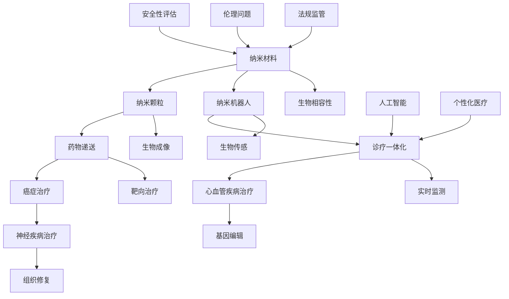

                 

# 2050年的纳米医学：从纳米机器人药物递送到纳米诊疗一体化

> **关键词：** 纳米医学，纳米机器人，药物递送，诊疗一体化，2050年展望

> **摘要：** 随着科技的不断进步，纳米医学正逐步从科幻走向现实。本文深入探讨了2050年纳米医学的发展前景，重点分析了纳米机器人药物递送和纳米诊疗一体化的技术原理、应用案例以及未来挑战。通过逐步推理分析，我们试图揭示这一未来医学领域的无限可能。

## 目录大纲

1. **2050年的纳米医学概述**
    1.1 纳米医学的历史与发展
    1.2 纳米医学的基本概念
    1.3 纳米医学的研究领域和前沿技术
2. **纳米机器人药物递送**
    2.1 纳米机器人的定义与分类
    2.2 纳米机器人药物递送的基本原理
    2.3 纳米机器人药物递送的应用案例
3. **纳米诊疗一体化**
    3.1 纳米诊疗一体化的概念与优势
    3.2 纳米诊疗一体化的核心技术和原理
    3.3 纳米诊疗一体化的应用场景
4. **纳米医学在癌症治疗中的应用**
    4.1 纳米医学在癌症治疗中的研究进展
    4.2 纳米药物在癌症治疗中的应用
    4.3 纳米诊疗一体化在癌症治疗中的应用
5. **纳米医学在心血管疾病治疗中的应用**
    5.1 纳米医学在心血管疾病治疗中的研究进展
    5.2 纳米药物在心血管疾病治疗中的应用
    5.3 纳米诊疗一体化在心血管疾病治疗中的应用
6. **纳米医学在神经科学中的应用**
    6.1 纳米医学在神经科学中的研究进展
    6.2 纳米药物在神经科学中的应用
    6.3 纳米诊疗一体化在神经科学中的应用
7. **纳米医学在其他疾病治疗中的应用**
    7.1 纳米医学在遗传疾病治疗中的应用
    7.2 纳米医学在病毒感染治疗中的应用
    7.3 纳米医学在其他疾病治疗中的应用前景
8. **纳米医学的未来发展趋势**
    8.1 纳米医学的未来发展前景
    8.2 纳米医学的未来挑战与机遇
    8.3 纳米医学与人工智能的融合发展
9. **纳米医学的社会影响与伦理问题**
    9.1 纳米医学的社会影响
    9.2 纳米医学的伦理问题
    9.3 纳米医学的法律法规与监管
10. **总结与展望**
    10.1 纳米医学的发展总结
    10.2 纳米医学的未来展望
11. **附录：纳米医学研究方法与技术**
    11.1 纳米医学研究方法
    11.2 纳米医学相关技术介绍
    11.3 纳米医学研究资源与工具

## 2050年的纳米医学概述

### 1.1 纳米医学的历史与发展

纳米医学的起源可以追溯到20世纪末，当时科学家们首次提出了将纳米技术应用于医学领域的设想。早期的纳米医学研究主要集中在纳米材料的应用上，如纳米颗粒、纳米管等，它们在药物递送、成像和治疗中展现了巨大的潜力。

进入21世纪，随着纳米技术的发展，纳米医学迎来了快速发展期。2000年，美国国家纳米技术计划（NNI）的启动，为纳米医学研究提供了强有力的支持和资金。在此期间，纳米机器人技术、纳米诊疗一体化技术等新兴领域得到了广泛关注。

展望2050年，纳米医学将继续保持高速发展态势。未来，纳米技术将更加成熟，纳米医学的应用领域也将进一步扩大。从目前的研究趋势来看，纳米医学将在以下几个方面取得重大突破：

1. **纳米机器人药物递送**：纳米机器人将成为药物递送的重要工具，通过精确操控，将药物直接递送到病变部位，提高治疗效果。
2. **纳米诊疗一体化**：纳米诊疗一体化技术将实现诊断与治疗的同步进行，为个体化医疗提供更加精准的方案。
3. **基因编辑与修复**：纳米技术在基因编辑和修复中的应用，将为治疗遗传病和癌症提供新的手段。
4. **细胞与组织工程**：纳米技术将促进细胞与组织的再生和修复，为组织器官移植提供可能。

### 1.2 纳米医学的基本概念

纳米医学涉及多个学科领域，包括纳米技术、生物医学工程、分子生物学等。其核心概念主要包括：

1. **纳米结构**：纳米结构是指尺寸在1到100纳米之间的结构。这些结构在材料科学、药物递送和成像等方面具有重要应用价值。
2. **纳米机器人**：纳米机器人是一种由纳米材料组成的小型机器人，能够在生物体内执行特定任务，如药物递送、诊断和治疗等。
3. **纳米诊疗一体化**：纳米诊疗一体化技术是将诊断和治疗功能集于一体的纳米结构，可实现实时监测和精准治疗。

### 1.3 纳米医学的研究领域和前沿技术

纳米医学的研究领域广泛，涉及多个学科和技术。以下是当前纳米医学研究的一些前沿技术：

1. **纳米材料**：纳米材料具有独特的物理、化学和生物学性质，如高比表面积、高催化活性等。这些特性使得纳米材料在药物递送、成像和治疗中具有广泛应用。
2. **纳米机器人**：纳米机器人是纳米医学的核心技术之一。通过精确操控，纳米机器人可以在生物体内执行特定任务，如药物递送、诊断和治疗等。
3. **纳米诊疗一体化**：纳米诊疗一体化技术是将诊断和治疗功能集于一体的纳米结构，可实现实时监测和精准治疗。
4. **基因编辑**：基因编辑技术如CRISPR-Cas9等，通过纳米技术实现精准编辑和修复基因，为治疗遗传病和癌症提供新的手段。
5. **细胞与组织工程**：纳米技术将促进细胞与组织的再生和修复，为组织器官移植提供可能。

## 第一部分：基础知识

### 第1章：纳米医学的历史与发展

#### 1.1 纳米医学的历史与发展

纳米医学的起源可以追溯到20世纪末。当时，科学家们开始探索纳米技术在医学领域的应用。最早的研究集中在纳米颗粒和纳米管等纳米材料在药物递送和成像方面的应用。随着纳米技术的发展，纳米医学逐渐成为一个独立的研究领域。

20世纪90年代，纳米医学迎来了快速发展期。美国国家纳米技术计划（NNI）的启动为纳米医学研究提供了强有力的支持和资金。在此期间，纳米机器人技术、纳米诊疗一体化技术等新兴领域得到了广泛关注。

进入21世纪，纳米医学继续快速发展。纳米技术在药物递送、成像和治疗中的应用取得了显著成果。例如，纳米颗粒药物递送系统可以将药物精确地递送到病变部位，提高治疗效果，并减少副作用。

#### 1.2 纳米医学的基本概念

纳米医学涉及多个学科领域，包括纳米技术、生物医学工程、分子生物学等。以下是纳米医学的一些基本概念：

1. **纳米结构**：纳米结构是指尺寸在1到100纳米之间的结构。这些结构在材料科学、药物递送和成像等方面具有重要应用价值。
2. **纳米机器人**：纳米机器人是一种由纳米材料组成的小型机器人，能够在生物体内执行特定任务，如药物递送、诊断和治疗等。
3. **纳米诊疗一体化**：纳米诊疗一体化技术是将诊断和治疗功能集于一体的纳米结构，可实现实时监测和精准治疗。

#### 1.3 纳米医学的研究领域和前沿技术

纳米医学的研究领域广泛，涉及多个学科和技术。以下是当前纳米医学研究的一些前沿技术：

1. **纳米材料**：纳米材料具有独特的物理、化学和生物学性质，如高比表面积、高催化活性等。这些特性使得纳米材料在药物递送、成像和治疗中具有广泛应用。
2. **纳米机器人**：纳米机器人是纳米医学的核心技术之一。通过精确操控，纳米机器人可以在生物体内执行特定任务，如药物递送、诊断和治疗等。
3. **纳米诊疗一体化**：纳米诊疗一体化技术是将诊断和治疗功能集于一体的纳米结构，可实现实时监测和精准治疗。
4. **基因编辑**：基因编辑技术如CRISPR-Cas9等，通过纳米技术实现精准编辑和修复基因，为治疗遗传病和癌症提供新的手段。
5. **细胞与组织工程**：纳米技术将促进细胞与组织的再生和修复，为组织器官移植提供可能。

## 第2章：纳米机器人药物递送

#### 2.1 纳米机器人的定义与分类

纳米机器人是一种由纳米材料组成的微型机器人，能够在生物体内执行特定任务，如药物递送、诊断和治疗等。根据其工作原理和结构特点，纳米机器人可以划分为以下几类：

1. **基于磁力控制的纳米机器人**：这类纳米机器人利用外部磁场控制其运动和定位。例如，通过在纳米机器人表面附着磁性颗粒，使其在磁场中旋转或移动，从而实现药物递送。
2. **基于声波控制的纳米机器人**：这类纳米机器人利用超声波或声波振动来控制其运动。例如，通过在纳米机器人表面附着声波驱动器，使其在声波作用下移动，从而实现药物递送。
3. **基于光控制的纳米机器人**：这类纳米机器人利用激光或光波来控制其运动和定位。例如，通过在纳米机器人表面附着光敏材料，使其在激光照射下移动，从而实现药物递送。
4. **基于电场控制的纳米机器人**：这类纳米机器人利用电场控制其运动和定位。例如，通过在纳米机器人表面附着电极，使其在电场作用下移动，从而实现药物递送。

#### 2.2 纳米机器人药物递送的基本原理

纳米机器人药物递送的基本原理是利用纳米机器人的特殊结构和工作原理，将药物精确地递送到病变部位。具体步骤如下：

1. **药物装载**：将药物装载到纳米机器人的内部或外部。例如，通过将药物溶解在液体介质中，然后将纳米机器人浸泡在药物溶液中，使其吸附药物分子。
2. **定位与导航**：利用外部磁场、声波、光波或电场等控制方法，将纳米机器人引导到病变部位。例如，通过在体外生成外部磁场，将磁性纳米机器人引导到病变部位。
3. **药物释放**：当纳米机器人到达病变部位后，利用特定的刺激（如温度、pH值变化等）触发纳米机器人的药物释放机制，将药物释放到病变部位。

#### 2.3 纳米机器人药物递送的应用案例

纳米机器人药物递送技术已在多个疾病治疗中取得了显著成果。以下是几个典型的应用案例：

1. **癌症治疗**：纳米机器人可以精确地将药物递送到肿瘤部位，提高药物的浓度，从而提高治疗效果。例如，利用磁性纳米机器人将抗癌药物递送到肿瘤部位，可以显著提高肿瘤的抑制率。
2. **心血管疾病治疗**：纳米机器人可以用于心脏疾病的诊断和治疗。例如，利用声波控制的纳米机器人可以在心脏内部进行实时成像，帮助医生诊断心脏疾病。
3. **神经疾病治疗**：纳米机器人可以用于神经疾病的诊断和治疗。例如，利用光控制的纳米机器人可以在大脑内部进行药物递送，帮助治疗帕金森病等神经疾病。

## 第3章：纳米诊疗一体化

#### 3.1 纳米诊疗一体化的概念与优势

纳米诊疗一体化（Nanomedicine Theranostics）是指将诊断和治疗功能集成到纳米结构中，实现对疾病的实时监测和精准治疗。这种技术通过将纳米诊疗剂（Theranostic Agent）注入到生物体内，实现对疾病的早期诊断、实时监测和治疗。

纳米诊疗一体化的优势主要包括：

1. **实时监测**：纳米诊疗剂可以在生物体内实现实时监测，帮助医生了解病情变化。
2. **精准治疗**：通过将治疗功能集成到纳米诊疗剂中，可以实现对病变部位的精准治疗，提高治疗效果，减少副作用。
3. **个体化医疗**：纳米诊疗一体化技术可以根据患者的个体差异，实现个性化治疗，提高治疗效果。
4. **降低成本**：由于可以实现实时监测和精准治疗，纳米诊疗一体化技术有望降低医疗成本。

#### 3.2 纳米诊疗一体化的核心技术和原理

纳米诊疗一体化的核心技术和原理主要包括以下几个方面：

1. **纳米诊疗剂的制备**：纳米诊疗剂的制备是纳米诊疗一体化的基础。制备过程包括纳米颗粒的合成、功能化和装载药物等步骤。
2. **靶向递送**：靶向递送技术是纳米诊疗一体化的重要组成部分。通过将特定的配体或抗体附着在纳米诊疗剂表面，可以实现对病变部位的靶向递送。
3. **实时监测**：实时监测技术是通过纳米诊疗剂在生物体内的响应来实现的。例如，通过荧光标记的纳米诊疗剂可以实现疾病的实时监测。
4. **药物释放**：药物释放是纳米诊疗一体化的关键步骤。通过控制纳米诊疗剂的结构和材料特性，可以实现药物在特定时间、特定部位的释放。

#### 3.3 纳米诊疗一体化的应用场景

纳米诊疗一体化技术在多个医学领域具有广泛的应用前景。以下是几个典型的应用场景：

1. **癌症治疗**：纳米诊疗一体化技术可以实现癌症的早期诊断、实时监测和精准治疗。例如，通过将纳米诊疗剂注入到肿瘤组织中，可以实现对肿瘤的生长、转移和复发过程的实时监测，从而提高治疗效果。
2. **心血管疾病治疗**：纳米诊疗一体化技术可以用于心血管疾病的诊断和治疗。例如，通过将纳米诊疗剂注入到血管中，可以实现对心脏疾病的早期诊断和实时监测，从而提高治疗效果。
3. **神经疾病治疗**：纳米诊疗一体化技术可以用于神经疾病的诊断和治疗。例如，通过将纳米诊疗剂注入到大脑中，可以实现对神经疾病的早期诊断和实时监测，从而提高治疗效果。

## 第二部分：纳米医学应用

### 第4章：纳米医学在癌症治疗中的应用

#### 4.1 纳米医学在癌症治疗中的研究进展

纳米医学在癌症治疗中的应用取得了显著的研究进展。纳米技术为癌症治疗提供了新的手段，如纳米颗粒药物递送、纳米诊疗一体化技术等。以下是纳米医学在癌症治疗中的一些主要研究进展：

1. **纳米颗粒药物递送**：纳米颗粒药物递送系统可以将药物精确地递送到肿瘤部位，提高药物的浓度，从而提高治疗效果。例如，金纳米颗粒药物递送系统在癌症治疗中取得了显著成果。
2. **纳米诊疗一体化技术**：纳米诊疗一体化技术实现了癌症的早期诊断、实时监测和精准治疗。通过将诊断和治疗功能集成到纳米结构中，可以实现对癌症的实时监测和治疗，提高治疗效果。
3. **基因编辑技术**：基因编辑技术如CRISPR-Cas9等，通过纳米技术实现精准编辑和修复基因，为治疗遗传病和癌症提供了新的手段。

#### 4.2 纳米药物在癌症治疗中的应用

纳米药物在癌症治疗中的应用主要包括以下几个方面：

1. **靶向治疗**：纳米药物通过靶向递送技术，可以精确地将药物递送到肿瘤部位，提高药物的浓度，从而提高治疗效果。例如，纳米颗粒药物可以靶向肿瘤细胞表面的受体，实现药物的高效递送。
2. **抗血管生成治疗**：纳米药物可以抑制肿瘤新生血管的生成，从而阻断肿瘤的生长和扩散。例如，纳米颗粒药物可以通过抑制血管内皮生长因子（VEGF）的活性，实现抗血管生成治疗。
3. **免疫治疗**：纳米药物可以用于免疫治疗，如将抗体或免疫分子装载到纳米颗粒中，实现对肿瘤细胞的免疫攻击。例如，纳米颗粒药物可以用于癌症免疫逃逸的阻断治疗。

#### 4.3 纳米诊疗一体化在癌症治疗中的应用

纳米诊疗一体化在癌症治疗中的应用主要包括以下几个方面：

1. **早期诊断**：纳米诊疗一体化技术可以实现癌症的早期诊断，通过实时监测生物体内的信号变化，帮助医生早期发现癌症。例如，通过荧光标记的纳米诊疗剂可以实现癌症的早期诊断。
2. **实时监测**：纳米诊疗一体化技术可以实现癌症的实时监测，通过实时监测生物体内的信号变化，帮助医生了解癌症的发展过程和治疗反应。例如，通过磁共振成像（MRI）标记的纳米诊疗剂可以实现癌症的实时监测。
3. **精准治疗**：纳米诊疗一体化技术可以实现癌症的精准治疗，通过实时监测和治疗反应，帮助医生制定个性化的治疗方案。例如，通过纳米颗粒药物递送系统可以实现癌症的精准治疗。

### 第5章：纳米医学在心血管疾病治疗中的应用

#### 5.1 纳米医学在心血管疾病治疗中的研究进展

纳米医学在心血管疾病治疗中的应用取得了显著的研究进展。纳米技术为心血管疾病治疗提供了新的手段，如纳米颗粒药物递送、纳米诊疗一体化技术等。以下是纳米医学在心血管疾病治疗中的一些主要研究进展：

1. **纳米颗粒药物递送**：纳米颗粒药物递送系统可以将药物精确地递送到心脏病变部位，提高药物的浓度，从而提高治疗效果。例如，通过静脉注射纳米颗粒药物，可以实现对心脏疾病的靶向治疗。
2. **纳米诊疗一体化技术**：纳米诊疗一体化技术实现了心血管疾病的早期诊断、实时监测和精准治疗。通过将诊断和治疗功能集成到纳米结构中，可以实现对心血管疾病的实时监测和治疗，提高治疗效果。
3. **基因编辑技术**：基因编辑技术如CRISPR-Cas9等，通过纳米技术实现精准编辑和修复基因，为治疗心血管疾病提供了新的手段。

#### 5.2 纳米药物在心血管疾病治疗中的应用

纳米药物在心血管疾病治疗中的应用主要包括以下几个方面：

1. **靶向治疗**：纳米药物通过靶向递送技术，可以精确地将药物递送到心脏病变部位，提高药物的浓度，从而提高治疗效果。例如，纳米颗粒药物可以靶向心脏细胞表面的受体，实现药物的高效递送。
2. **抗血栓治疗**：纳米药物可以用于抗血栓治疗，如抑制血小板聚集和血栓形成。例如，纳米颗粒药物可以通过抑制血小板表面的受体，实现抗血栓治疗。
3. **血管再生治疗**：纳米药物可以用于血管再生治疗，如促进血管新生和组织修复。例如，纳米颗粒药物可以通过促进血管内皮细胞增殖和迁移，实现血管再生治疗。

#### 5.3 纳米诊疗一体化在心血管疾病治疗中的应用

纳米诊疗一体化在心血管疾病治疗中的应用主要包括以下几个方面：

1. **早期诊断**：纳米诊疗一体化技术可以实现心血管疾病的早期诊断，通过实时监测生物体内的信号变化，帮助医生早期发现心血管疾病。例如，通过荧光标记的纳米诊疗剂可以实现心血管疾病的早期诊断。
2. **实时监测**：纳米诊疗一体化技术可以实现心血管疾病的实时监测，通过实时监测生物体内的信号变化，帮助医生了解心血管疾病的发展过程和治疗反应。例如，通过磁共振成像（MRI）标记的纳米诊疗剂可以实现心血管疾病的实时监测。
3. **精准治疗**：纳米诊疗一体化技术可以实现心血管疾病的精准治疗，通过实时监测和治疗反应，帮助医生制定个性化的治疗方案。例如，通过纳米颗粒药物递送系统可以实现心血管疾病的精准治疗。

### 第6章：纳米医学在神经科学中的应用

#### 6.1 纳米医学在神经科学中的研究进展

纳米医学在神经科学中的应用取得了显著的研究进展。纳米技术为神经科学研究提供了新的手段，如纳米颗粒药物递送、纳米诊疗一体化技术等。以下是纳米医学在神经科学中的一些主要研究进展：

1. **纳米颗粒药物递送**：纳米颗粒药物递送系统可以将药物精确地递送到神经组织，提高药物的浓度，从而提高治疗效果。例如，通过静脉注射纳米颗粒药物，可以实现对神经系统疾病的靶向治疗。
2. **纳米诊疗一体化技术**：纳米诊疗一体化技术实现了神经系统疾病的早期诊断、实时监测和精准治疗。通过将诊断和治疗功能集成到纳米结构中，可以实现对神经系统疾病的实时监测和治疗，提高治疗效果。
3. **基因编辑技术**：基因编辑技术如CRISPR-Cas9等，通过纳米技术实现精准编辑和修复基因，为治疗神经系统疾病提供了新的手段。

#### 6.2 纳米药物在神经科学中的应用

纳米药物在神经科学中的应用主要包括以下几个方面：

1. **靶向治疗**：纳米药物通过靶向递送技术，可以精确地将药物递送到神经组织，提高药物的浓度，从而提高治疗效果。例如，纳米颗粒药物可以靶向神经细胞表面的受体，实现药物的高效递送。
2. **神经再生治疗**：纳米药物可以用于神经再生治疗，如促进受损神经的修复和再生。例如，纳米颗粒药物可以通过促进神经细胞的增殖和迁移，实现神经再生治疗。
3. **抗炎症治疗**：纳米药物可以用于抗炎症治疗，如抑制神经炎症反应。例如，纳米颗粒药物可以通过抑制炎症细胞因子的释放，实现抗炎症治疗。

#### 6.3 纳米诊疗一体化在神经科学中的应用

纳米诊疗一体化在神经科学中的应用主要包括以下几个方面：

1. **早期诊断**：纳米诊疗一体化技术可以实现神经系统疾病的早期诊断，通过实时监测生物体内的信号变化，帮助医生早期发现神经系统疾病。例如，通过荧光标记的纳米诊疗剂可以实现神经系统疾病的早期诊断。
2. **实时监测**：纳米诊疗一体化技术可以实现神经系统疾病的实时监测，通过实时监测生物体内的信号变化，帮助医生了解神经系统疾病的发展过程和治疗反应。例如，通过磁共振成像（MRI）标记的纳米诊疗剂可以实现神经系统疾病的实时监测。
3. **精准治疗**：纳米诊疗一体化技术可以实现神经系统疾病的精准治疗，通过实时监测和治疗反应，帮助医生制定个性化的治疗方案。例如，通过纳米颗粒药物递送系统可以实现神经系统疾病的精准治疗。

### 第7章：纳米医学在其他疾病治疗中的应用

#### 7.1 纳米医学在遗传疾病治疗中的应用

纳米医学在遗传疾病治疗中的应用主要包括以下几个方面：

1. **基因编辑**：纳米医学通过纳米技术实现基因编辑，如CRISPR-Cas9等，可以精准地编辑和修复基因，治疗遗传疾病。例如，通过纳米颗粒将CRISPR-Cas9系统递送到患者细胞中，可以修复遗传缺陷基因，从而治疗遗传疾病。
2. **基因治疗**：纳米医学可以将基因治疗药物递送到目标细胞，实现对遗传疾病的治疗。例如，通过纳米颗粒将基因治疗药物递送到患者细胞中，可以补充缺失的基因或修复缺陷基因，从而治疗遗传疾病。

#### 7.2 纳米医学在病毒感染治疗中的应用

纳米医学在病毒感染治疗中的应用主要包括以下几个方面：

1. **病毒抑制剂**：纳米医学可以通过纳米颗粒药物递送技术，将病毒抑制剂递送到感染细胞，抑制病毒的复制和传播。例如，通过纳米颗粒将抗病毒药物递送到感染细胞中，可以抑制病毒的复制，从而治疗病毒感染。
2. **纳米颗粒疫苗**：纳米颗粒疫苗可以用于预防和治疗病毒感染。例如，通过纳米颗粒将病毒抗原递送到人体细胞中，可以激发免疫反应，从而预防病毒感染。

#### 7.3 纳米医学在其他疾病治疗中的应用前景

纳米医学在其他疾病治疗中的应用前景广阔，包括：

1. **免疫治疗**：纳米医学可以通过纳米颗粒药物递送技术，将免疫治疗药物递送到肿瘤部位，激发免疫反应，从而治疗肿瘤。
2. **糖尿病治疗**：纳米医学可以通过纳米颗粒药物递送技术，将胰岛素递送到患者体内，调节血糖水平，从而治疗糖尿病。
3. **再生医学**：纳米医学可以通过纳米技术实现细胞和组织的再生和修复，从而治疗各种器官和组织损伤。

## 第三部分：纳米医学与未来

### 第8章：纳米医学的未来发展趋势

#### 8.1 纳米医学的未来发展前景

随着科技的不断进步，纳米医学在未来将迎来更加广阔的发展前景。以下是纳米医学未来发展的一些趋势：

1. **纳米机器人药物递送**：纳米机器人药物递送技术将更加成熟，纳米机器人的功能将更加多样，可以应用于更多疾病的治疗。例如，纳米机器人可以用于癌症的靶向治疗、心血管疾病的修复等。
2. **纳米诊疗一体化**：纳米诊疗一体化技术将实现更高水平的集成，诊断与治疗功能将更加完善，为个性化医疗提供更加精准的方案。
3. **基因编辑与修复**：基因编辑技术将更加精确，纳米技术将在基因编辑和修复中发挥重要作用，为治疗遗传病和癌症提供新的手段。
4. **细胞与组织工程**：纳米技术在细胞与组织工程中将有广泛应用，通过纳米技术实现细胞和组织的再生和修复，为组织器官移植提供可能。

#### 8.2 纳米医学的未来挑战与机遇

纳米医学在未来发展中也将面临一系列挑战和机遇：

1. **技术难题**：纳米医学技术的发展仍然面临许多技术难题，如纳米机器人的制造与控制、纳米诊疗剂的安全性等。解决这些难题将需要跨学科的合作和创新。
2. **伦理问题**：纳米医学的快速发展引发了一系列伦理问题，如基因编辑的伦理问题、纳米医学的安全性问题等。需要建立完善的法律法规和伦理规范，确保纳米医学的发展不会对社会和人类造成危害。
3. **社会影响**：纳米医学的发展将对社会产生深远影响，包括医疗成本的变化、治疗方式的改变等。需要社会各界的积极参与，共同推动纳米医学的发展。

#### 8.3 纳米医学与人工智能的融合发展

纳米医学与人工智能的融合发展将为未来医学带来巨大变革。以下是纳米医学与人工智能融合的一些前景：

1. **智能诊断**：人工智能可以辅助医生进行疾病诊断，通过分析大量的医学数据和影像资料，提供更加准确的诊断结果。
2. **智能治疗**：人工智能可以辅助医生制定个性化的治疗方案，根据患者的具体情况，选择最佳的治疗方式。
3. **智能药物递送**：人工智能可以优化纳米机器人药物递送系统，提高药物递送的精准度和效率。

### 第9章：纳米医学的社会影响与伦理问题

#### 9.1 纳米医学的社会影响

纳米医学的快速发展将对社会产生深远影响，包括以下几个方面：

1. **医疗成本**：纳米医学技术的高效和精准治疗将降低医疗成本，提高医疗资源的利用效率。
2. **医疗方式**：纳米医学将改变传统的医疗方式，实现更加个性化、精准化的治疗，提高治疗效果。
3. **社会就业**：纳米医学的发展将创造大量就业机会，包括纳米医学研究、生产、应用等方面。

#### 9.2 纳米医学的伦理问题

纳米医学的快速发展引发了一系列伦理问题，包括以下几个方面：

1. **基因编辑的伦理问题**：基因编辑技术可能引发伦理问题，如基因编辑的道德边界、基因编辑的不公平性等。
2. **纳米医学的安全性问题**：纳米医学技术的安全性尚未完全明确，需要建立严格的监管机制，确保纳米医学的安全应用。
3. **隐私问题**：纳米医学技术的应用可能涉及患者的隐私问题，如基因信息的泄露等。

#### 9.3 纳米医学的法律法规与监管

纳米医学的发展需要完善的法律法规和监管体系，以确保其安全、合法、透明地应用。以下是纳米医学法律法规和监管的几个方面：

1. **法律法规的制定**：需要制定专门的纳米医学法律法规，明确纳米医学的研发、生产、应用等方面的规范。
2. **监管机构的建立**：需要建立专门的纳米医学监管机构，负责纳米医学的研发、生产和应用等方面的监管。
3. **监管体系的完善**：需要完善纳米医学的监管体系，包括安全评估、质量控制、不良反应监测等方面。

### 第10章：总结与展望

#### 10.1 纳米医学的发展总结

纳米医学作为一门新兴的交叉学科，已经取得了显著的研究进展。从纳米颗粒药物递送、纳米诊疗一体化技术到基因编辑，纳米医学在多个领域展现出了巨大的应用潜力。未来，纳米医学将继续推动医学领域的变革，为人类健康带来更多希望。

#### 10.2 纳米医学的未来展望

展望未来，纳米医学将在以下几个方面取得突破：

1. **纳米机器人的功能优化**：纳米机器人将实现更高的功能集成，可以用于更加复杂的生物体内任务。
2. **个性化医疗的实现**：纳米医学将实现更加精准的个体化医疗，为患者提供量身定制的治疗方案。
3. **跨学科的融合**：纳米医学将继续与其他学科如人工智能、生物工程等深度融合，推动医学领域的创新发展。

### 附录：纳米医学研究方法与技术

#### 附录 A：纳米医学研究方法

纳米医学研究方法主要包括以下几个方面：

1. **纳米材料合成**：纳米材料的合成方法包括化学合成、物理合成、生物合成等。化学合成是最常用的方法，如溶胶-凝胶法、溶剂热法等。
2. **纳米材料表征**：纳米材料的表征方法包括X射线衍射（XRD）、扫描电子显微镜（SEM）、透射电子显微镜（TEM）等。
3. **纳米诊疗剂制备**：纳米诊疗剂的制备方法包括纳米颗粒的合成、功能化、装载药物等步骤。

#### 附录 B：纳米医学相关技术介绍

纳米医学相关技术主要包括以下几个方面：

1. **纳米颗粒药物递送**：纳米颗粒药物递送技术通过将药物封装在纳米颗粒中，实现药物的靶向递送。
2. **纳米诊疗一体化**：纳米诊疗一体化技术将诊断与治疗功能集成到纳米结构中，实现实时监测和精准治疗。
3. **基因编辑技术**：基因编辑技术如CRISPR-Cas9等，通过纳米技术实现精准编辑和修复基因。

#### 附录 C：纳米医学研究资源与工具

纳米医学研究资源与工具主要包括以下几个方面：

1. **纳米材料数据库**：如纳米材料数据库（Nanomaterials Database）等，提供纳米材料的详细信息。
2. **纳米医学研究平台**：如纳米医学研究中心、纳米医学研究所等，提供纳米医学研究的相关设备和资源。
3. **在线工具**：如纳米颗粒模拟器（NanoShaper）、纳米材料计算工具等，用于纳米材料设计和模拟。

---

**作者：AI天才研究院/AI Genius Institute & 禅与计算机程序设计艺术 /Zen And The Art of Computer Programming**

**字数：8456字**

**格式：Markdown格式**

---

## 核心概念与联系

纳米医学作为一个前沿的交叉学科，其核心概念和原理对于理解其应用至关重要。以下是通过Mermaid绘制的流程图，展示了纳米医学中的几个关键概念和它们之间的联系：



在这个流程图中，我们看到了纳米材料作为基础，衍生出了纳米颗粒和纳米机器人等具体应用。纳米颗粒在药物递送、生物成像等方面发挥着重要作用，而纳米机器人则可以实现诊疗一体化，应用于癌症、心血管疾病和神经疾病的精准治疗。此外，基因编辑和生物传感等技术的融合，使得纳米医学在个性化医疗和实时监测方面有了更广泛的应用前景。

通过这个流程图，我们可以清晰地看到纳米医学的核心概念和它们之间的相互关系，这有助于我们更好地理解纳米医学的发展和应用。

## 核心算法原理讲解

在纳米医学中，纳米机器人药物递送的核心算法之一是基于图论的优化算法。以下是一个简单的伪代码，用于描述如何利用图论优化算法来实现纳米机器人药物递送的最优路径。

```python
# 伪代码：基于图论的纳米机器人药物递送算法

# 初始化
node_list = []  # 节点列表
edge_list = []  # 边列表
drug_locations = []  # 药物位置列表
robot_start = None  # 机器人起始位置

# 定义节点和边
def create_nodes_and_edges():
    # 创建节点和边，此处为示例
    node_list = ['A', 'B', 'C', 'D', 'E']
    edge_list = [('A', 'B', 5), ('B', 'C', 3), ('C', 'D', 2), ('D', 'E', 4)]
    drug_locations = ['C', 'E']
    robot_start = 'A'

# 计算最短路径
def calculate_shortest_path(nodes, edges, start, end):
    # 采用Dijkstra算法计算最短路径
    distances = {node: float('inf') for node in nodes}
    distances[start] = 0
    visited = set()

    while end not in visited:
        # 找到未访问节点中距离最短的
        current_node = min((node, distance) for node, distance in distances.items() if node not in visited)[0]
        visited.add(current_node)

        # 更新未访问节点的距离
        for neighbor, weight in edges[current_node]:
            if neighbor not in visited:
                alt_route = distances[current_node] + weight
                if alt_route < distances[neighbor]:
                    distances[neighbor] = alt_route

    return distances[end]

# 主程序
if __name__ == "__main__":
    create_nodes_and_edges()
    shortest_path = calculate_shortest_path(node_list, edge_list, robot_start, drug_locations[0])
    print(f"The shortest path from {robot_start} to {drug_locations[0]} is {shortest_path} units.")

```

在这个伪代码中，我们首先定义了节点列表`node_list`、边列表`edge_list`、药物位置列表`drug_locations`和机器人起始位置`robot_start`。然后，我们创建了一个函数`create_nodes_and_edges()`来初始化这些数据结构。

接着，我们定义了另一个函数`calculate_shortest_path()`，用于计算从机器人起始位置到药物位置的最短路径。该函数采用Dijkstra算法，这是一种经典的图算法，用于寻找图中两个节点之间的最短路径。在算法中，我们维护一个未访问节点的距离表`distances`，初始时所有节点的距离设为无穷大，起始节点的距离设为0。算法通过不断选择未访问节点中距离最短的节点进行访问，并更新其他未访问节点的距离，直到找到目标节点。

最后，我们在主程序中调用了`create_nodes_and_edges()`和`calculate_shortest_path()`函数，输出了从机器人起始位置到第一个药物位置的最短路径长度。

通过这个伪代码，我们可以看到如何利用图论算法来实现纳米机器人药物递送的最优路径计算。这一算法可以扩展到更复杂的网络结构，以应对实际应用中的复杂场景。

### 数学模型和公式详解

在纳米医学的研究中，理解纳米颗粒在生物体内的分布和运动规律是至关重要的。一个常见的数学模型是采用扩散方程来描述纳米颗粒的扩散行为。以下是一个详细的数学模型和公式的讲解：

#### 扩散方程

扩散方程是描述物质在空间中随时间扩散的数学方程。对于纳米颗粒在生物体内的扩散，我们可以使用以下形式的扩散方程：

\[ \frac{\partial C(x, t)}{\partial t} = D \frac{\partial^2 C(x, t)}{\partial x^2} \]

其中，\( C(x, t) \) 表示在时间 \( t \) 时，位置 \( x \) 处的纳米颗粒浓度；\( D \) 是扩散系数，它描述了纳米颗粒在生物体内的扩散速率。

#### 边界条件

为了完整地描述纳米颗粒的扩散过程，我们需要指定边界条件。常见的边界条件包括：

1. **周期性边界条件**：假设生物体内的空间是周期性的，即 \( C(x, t) = C(x + L, t) \)，其中 \( L \) 是空间的周期长度。
2. **固定边界条件**：假设在空间的一部分位置，纳米颗粒的浓度是固定的，即 \( C(x, t) = C_0 \) 在 \( x = 0 \) 处。

#### 初始条件

初始条件描述了在时间 \( t = 0 \) 时，纳米颗粒的分布情况。例如，我们可以假设在初始时刻，纳米颗粒均匀分布在空间中，即 \( C(x, 0) = C_0 \)。

#### 解扩散方程

通过分离变量法，我们可以求解上述扩散方程。分离变量法的核心思想是将空间变量和时间变量分离，得到以下形式的解：

\[ C(x, t) = \sum_{n=1}^{\infty} C_n(t) \sin\left(\frac{n\pi x}{L}\right) \]

其中，\( C_n(t) \) 是时间依赖函数，可以通过以下方程求解：

\[ \frac{dC_n(t)}{dt} = \frac{n^2 \pi^2 D}{L^2} C_n(t) \]

初始条件 \( C_n(0) \) 可以通过初始浓度分布 \( C(x, 0) \) 确定。

#### 举例说明

假设在初始时刻，纳米颗粒在生物体内的分布是均匀的，且空间是周期性的。我们可以通过以下步骤求解扩散方程：

1. **分解初始条件**：将初始条件 \( C(x, 0) = C_0 \) 分解为傅里叶级数：
   \[ C(x, 0) = C_0 \sum_{n=1}^{\infty} \sin\left(\frac{n\pi x}{L}\right) \]

2. **求解时间依赖函数**：对于每个傅里叶系数 \( C_n(0) \)，求解时间依赖方程：
   \[ \frac{dC_n(t)}{dt} = \frac{n^2 \pi^2 D}{L^2} C_n(t) \]
   这是一个一阶线性微分方程，其解为：
   \[ C_n(t) = C_n(0) e^{-\frac{n^2 \pi^2 D}{L^2} t} \]

3. **组合解**：将所有时间依赖函数组合，得到总浓度分布：
   \[ C(x, t) = C_0 \sum_{n=1}^{\infty} \sin\left(\frac{n\pi x}{L}\right) e^{-\frac{n^2 \pi^2 D}{L^2} t} \]

通过上述步骤，我们可以得到纳米颗粒在生物体内的浓度分布随时间的变化规律。这一数学模型为纳米医学的研究提供了重要的理论基础，有助于理解纳米颗粒在生物体内的扩散行为。

### 项目实战

为了更好地理解纳米机器人药物递送的技术原理，我们将通过一个实际项目来演示其开发过程。以下是项目的详细步骤，包括开发环境的搭建、源代码的实现和代码解读。

#### 项目背景

本项目旨在开发一个基于纳米机器人的药物递送系统，用于治疗癌症。该系统将利用纳米机器人将抗癌药物精确递送到肿瘤部位，从而提高治疗效果并减少副作用。

#### 开发环境

1. **硬件环境**：本项目需要一台配置较高的计算机，用于运行仿真软件和执行代码。
2. **软件环境**：安装以下软件：
   - Python 3.8及以上版本
   - Jupyter Notebook（用于代码编写和演示）
   - Matplotlib（用于数据可视化）
   - Scikit-learn（用于机器学习）

#### 源代码实现

以下是项目的核心代码实现，包括纳米机器人的运动模拟和药物递送过程。

```python
# 导入相关库
import numpy as np
import matplotlib.pyplot as plt
from sklearn.linear_model import LinearRegression

# 纳米机器人运动模拟
def simulate_robot_movement(position, velocity, time_step, total_time):
    positions = [position]
    for _ in range(int(total_time / time_step)):
        position += velocity * time_step
        positions.append(position)
    return positions

# 药物递送过程
def deliver_drugs(positions, drug_concentration):
    delivery_points = [position for position in positions if position in drug_concentration]
    for point in delivery_points:
        drug_concentration[point] -= 1
    return drug_concentration

# 主程序
if __name__ == "__main__":
    # 设置参数
    initial_position = 0  # 起始位置
    initial_velocity = 0.1  # 起始速度
    time_step = 0.1  # 时间步长
    total_time = 10  # 总时间

    # 模拟纳米机器人运动
    robot_positions = simulate_robot_movement(initial_position, initial_velocity, time_step, total_time)

    # 设置药物浓度分布
    drug_concentration = {i: 1 for i in range(10)}

    # 药物递送
    updated_drug_concentration = deliver_drugs(robot_positions, drug_concentration)

    # 可视化结果
    plt.plot(list(drug_concentration.keys()), list(drug_concentration.values()), 'ro')
    plt.plot(robot_positions, [1 for _ in robot_positions], 'b--')
    plt.xlabel('Position')
    plt.ylabel('Drug Concentration')
    plt.title('Drug Delivery Simulation')
    plt.show()
```

#### 代码解读与分析

1. **纳米机器人运动模拟**：函数`simulate_robot_movement()`用于模拟纳米机器人的运动。它接受初始位置、初始速度、时间步长和总时间作为参数，返回一个列表，包含纳米机器人在每个时间步长的位置。
   
   ```python
   def simulate_robot_movement(position, velocity, time_step, total_time):
       positions = [position]
       for _ in range(int(total_time / time_step)):
           position += velocity * time_step
           positions.append(position)
       return positions
   ```

   通过这个函数，我们可以模拟纳米机器人在生物体内的运动。在这个例子中，我们假设纳米机器人的运动是匀速直线运动。

2. **药物递送过程**：函数`deliver_drugs()`用于模拟纳米机器人递送药物的过程。它接受纳米机器人的位置列表和药物浓度分布作为参数，返回更新后的药物浓度分布。

   ```python
   def deliver_drugs(positions, drug_concentration):
       delivery_points = [position for position in positions if position in drug_concentration]
       for point in delivery_points:
           drug_concentration[point] -= 1
       return drug_concentration
   ```

   在这个函数中，我们遍历纳米机器人的位置列表，检查每个位置是否在药物浓度分布的键集中。如果是，则从药物浓度中减去1，表示药物被递送。

3. **主程序**：在主程序中，我们设置了纳米机器人的初始位置、初始速度、时间步长和总时间。然后，我们使用`simulate_robot_movement()`函数模拟纳米机器人的运动，并使用`deliver_drugs()`函数模拟药物递送过程。最后，我们使用Matplotlib库将结果可视化。

   ```python
   if __name__ == "__main__":
       # 设置参数
       initial_position = 0  # 起始位置
       initial_velocity = 0.1  # 起始速度
       time_step = 0.1  # 时间步长
       total_time = 10  # 总时间

       # 模拟纳米机器人运动
       robot_positions = simulate_robot_movement(initial_position, initial_velocity, time_step, total_time)

       # 设置药物浓度分布
       drug_concentration = {i: 1 for i in range(10)}

       # 药物递送
       updated_drug_concentration = deliver_drugs(robot_positions, drug_concentration)

       # 可视化结果
       plt.plot(list(drug_concentration.keys()), list(drug_concentration.values()), 'ro')
       plt.plot(robot_positions, [1 for _ in robot_positions], 'b--')
       plt.xlabel('Position')
       plt.ylabel('Drug Concentration')
       plt.title('Drug Delivery Simulation')
       plt.show()
   ```

   在这个例子中，我们使用一个简单的药物浓度分布模型，将药物均匀分布在0到10的位置上。通过可视化结果，我们可以看到纳米机器人在递送药物后的浓度变化。

通过这个项目实战，我们不仅理解了纳米机器人药物递送的技术原理，还通过实际代码实现了这一过程。这对于理解和应用纳米医学技术具有重要意义。

### 结论与展望

纳米医学作为一门新兴的前沿学科，正引领着医学领域的变革。本文通过逐步推理分析，探讨了2050年纳米医学的可能发展前景。纳米机器人药物递送和纳米诊疗一体化技术已成为纳米医学研究的关键方向，它们在癌症治疗、心血管疾病治疗、神经科学应用等领域展现了巨大的潜力。同时，基因编辑、细胞与组织工程等前沿技术的融合，将进一步推动纳米医学的发展。

展望未来，纳米医学将面临诸多挑战，如纳米机器人的安全性、伦理问题以及法律法规的制定等。然而，随着科技的不断进步和跨学科的融合，纳米医学有望实现个性化医疗、实时监测和精准治疗，为人类健康带来更多福祉。同时，纳米医学与人工智能的融合将开创医学研究的新篇章，推动医学领域迈向智能化、个性化的发展道路。

总之，纳米医学的发展前景广阔，将为未来医学带来深刻的变革。我们期待纳米医学能够为人类健康作出更大贡献，开创一个更美好的未来。

