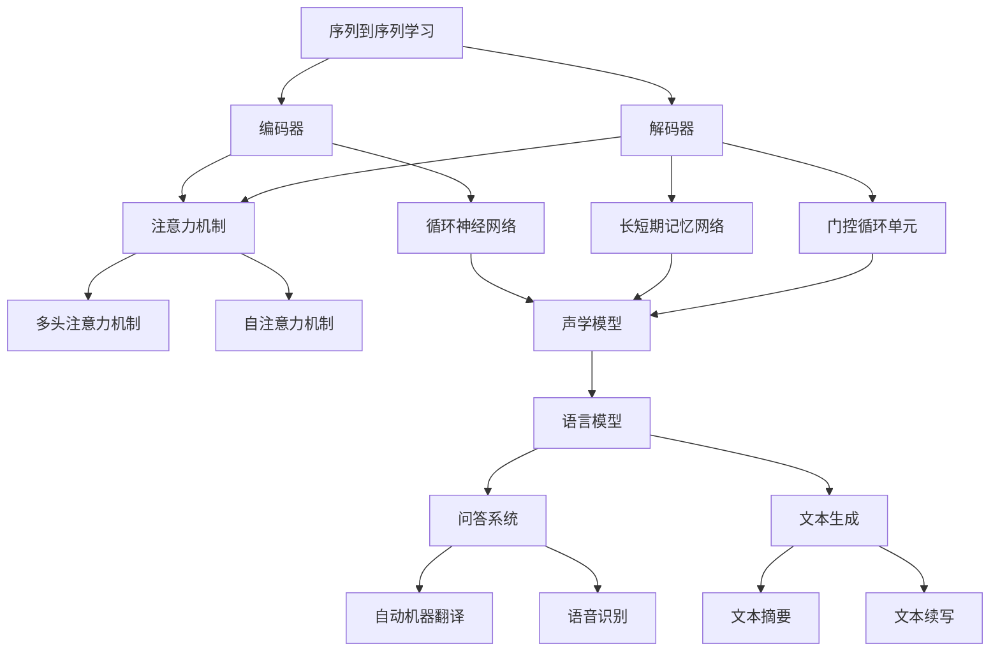

                 

# 序列到序列学习：原理与代码实例讲解

## 摘要

本文将深入探讨序列到序列（Sequence to Sequence，简称Seq2Seq）学习的原理和应用。首先，我们将介绍序列到序列学习的核心概念，包括其定义、重要性以及在不同领域的应用。接着，我们将介绍序列到序列学习的技术基础，包括神经网络、循环神经网络（RNN）、长短期记忆网络（LSTM）和门控循环单元（GRU）。然后，我们将详细讲解序列到序列学习中的注意力机制，以及如何实现编码器和解码器的协同工作。接下来，我们将通过具体的实战案例，展示如何使用序列到序列学习进行自动机器翻译、语音识别、问答系统和文本生成。最后，我们将总结本文的核心内容，并推荐一些有用的工具和资源。

## 目录大纲

### 第一部分：序列到序列学习基础

#### 第1章：序列到序列学习概述

- 1.1 序列到序列学习的概念与重要性
- 1.2 序列到序列学习的应用领域
- 1.3 序列到序列学习的历史与进展

#### 第2章：序列到序列学习的技术基础

- 2.1 神经网络基础
- 2.2 循环神经网络（RNN）
- 2.3 长短期记忆网络（LSTM）
- 2.4 门控循环单元（GRU）

#### 第3章：序列到序列学习中的注意力机制

- 3.1 注意力机制的原理与实现
- 3.2 注意力机制在序列到序列学习中的应用
- 3.3 注意力机制的改进与优化

#### 第4章：序列到序列学习的编码器与解码器

- 4.1 编码器与解码器的原理与结构
- 4.2 编码器与解码器的协同工作
- 4.3 编码器与解码器的改进与优化

### 第二部分：序列到序列学习的实战应用

#### 第5章：自动机器翻译

- 5.1 自动机器翻译的基本流程
- 5.2 自动机器翻译的算法实现
- 5.3 自动机器翻译的案例研究

#### 第6章：语音识别

- 6.1 语音识别的基本流程
- 6.2 声学模型与语言模型
- 6.3 语音识别的应用案例

#### 第7章：问答系统

- 7.1 问答系统的基本原理
- 7.2 基于序列到序列学习的问答系统
- 7.3 问答系统的应用案例

#### 第8章：文本生成

- 8.1 文本生成的应用场景
- 8.2 基于序列到序列学习的文本生成
- 8.3 文本生成的应用案例

## 附录

- 附录A：序列到序列学习的工具与资源
- 附录B：序列到序列学习核心概念与联系 Mermaid 流程图
- 附录C：序列到序列学习核心算法原理讲解
- 附录D：数学模型和数学公式详解
- 附录E：项目实战

通过上述的目录结构，我们可以清晰地了解序列到序列学习的核心内容。接下来，我们将一步一步地深入探索序列到序列学习的原理和应用。

### 第1章：序列到序列学习概述

#### 1.1 序列到序列学习的概念与重要性

序列到序列学习是一种基于神经网络的学习方法，用于处理序列数据之间的转换问题。它通常由一个编码器（Encoder）和一个解码器（Decoder）组成，其中编码器负责将输入序列转换为一个固定长度的表示，而解码器则负责将这个表示转换为一个输出序列。

序列到序列学习在自然语言处理领域有着广泛的应用。例如，在自动机器翻译中，编码器将源语言的文本序列转换为固定长度的表示，然后解码器将这个表示转换为目标语言的文本序列。在语音识别中，编码器将语音信号序列转换为文本序列，而在问答系统中，编码器将问题序列转换为答案序列。

序列到序列学习的重要性体现在以下几个方面：

1. **序列数据的处理**：序列到序列学习能够有效地处理序列数据，如自然语言文本、语音信号等。这些数据在许多实际应用中都扮演着重要的角色，如机器翻译、语音识别、对话系统等。

2. **端到端学习**：序列到序列学习可以实现端到端学习，即从输入序列直接生成输出序列，减少了传统方法的中间步骤，从而提高了模型的效率和准确性。

3. **灵活性与适应性**：序列到序列学习可以通过调整编码器和解码器的结构，适应不同的应用场景。例如，在机器翻译中，可以使用注意力机制来提高翻译的准确性；在语音识别中，可以结合声学模型和语言模型，提高识别的准确性。

#### 1.2 序列到序列学习的应用领域

序列到序列学习在多个领域有着广泛的应用，以下是一些典型的应用场景：

1. **自动机器翻译**：自动机器翻译是将一种语言的文本序列翻译成另一种语言的文本序列的过程。序列到序列学习通过编码器将源语言的文本序列转换为固定长度的表示，然后解码器将这个表示转换为目标语言的文本序列。

2. **语音识别**：语音识别是将语音信号序列转换为文本序列的过程。序列到序列学习中的编码器将语音信号序列转换为文本序列，从而实现语音到文本的转换。

3. **问答系统**：问答系统是一种能够理解和回答用户问题的系统。序列到序列学习中的编码器将问题序列转换为答案序列，从而实现问题的理解和回答。

4. **文本生成**：文本生成是生成新的文本序列的过程。序列到序列学习通过编码器将输入的文本序列转换为固定长度的表示，然后解码器将这个表示转换为新文本序列。

#### 1.3 序列到序列学习的历史与进展

序列到序列学习的历史可以追溯到循环神经网络（RNN）的发展。RNN最早由Hochreiter和Schmidhuber在1997年提出，用于处理序列数据。然而，RNN在处理长序列时存在梯度消失或梯度爆炸问题，这限制了其应用范围。

为了解决这些问题，Long短期记忆网络（LSTM）和门控循环单元（GRU）相继被提出。LSTM由Hochreiter和Schmidhuber在1997年提出，通过引入门控机制，有效解决了RNN的梯度消失问题。GRU则是由Cho等人在2014年提出的，是对LSTM的简化版本，参数更少，计算更高效。

随着深度学习技术的发展，序列到序列学习模型也得到了很大的改进。2014年，Sutskever等人提出了使用编码器-解码器框架的机器翻译模型，这个模型结合了LSTM和注意力机制，实现了机器翻译的端到端学习。这个模型的成功推动了序列到序列学习在自然语言处理领域的广泛应用。

近年来，序列到序列学习模型在多个领域都取得了显著的进展。例如，在自动机器翻译领域，基于Transformer的模型（如BERT、GPT等）取得了突破性的成果，大幅提高了翻译的准确性。在语音识别领域，端到端语音识别模型的提出和优化，使得语音识别的准确性达到了新的高度。在问答系统和文本生成领域，序列到序列学习也取得了显著的成果，为这些应用提供了强大的技术支持。

### 第2章：序列到序列学习的技术基础

在深入探讨序列到序列学习的原理和应用之前，我们需要了解其背后的技术基础。这一部分将介绍神经网络、循环神经网络（RNN）、长短期记忆网络（LSTM）和门控循环单元（GRU）等核心技术。

#### 2.1 神经网络基础

神经网络是序列到序列学习的基础。它由多个层组成，每一层由多个神经元（或节点）组成。每个神经元接收多个输入信号，并通过加权求和后传递给激活函数，最后输出一个结果。

神经网络的训练过程通常分为以下三个步骤：

1. **前向传播**：将输入数据通过网络的每一层，计算出每个神经元的输出。
2. **计算损失**：使用损失函数计算预测值与真实值之间的差异。
3. **反向传播**：根据损失函数的梯度，更新每个神经元的权重和偏置。

以下是一个神经网络的伪代码示例：

```python
def neuron(inputs, weights, bias):
    z = sum(inputs[i] * weights[i] for i in range(len(inputs)))
    z += bias
    return activation(z)
```

在这个示例中，`inputs` 是神经元的输入，`weights` 是输入的权重，`bias` 是偏置，`z` 是加权求和的结果，`activation` 是激活函数。

#### 2.2 循环神经网络（RNN）

循环神经网络（RNN）是处理序列数据的一种神经网络。与传统的神经网络不同，RNN通过保留前一个时间步的隐藏状态来处理序列数据，从而具备记忆能力。

RNN的隐藏状态可以表示为：

$$
h_t = \sigma(W_h \cdot [h_{t-1}, x_t] + b_h)
$$

其中，$h_t$ 是当前时间步的隐藏状态，$x_t$ 是当前时间步的输入，$W_h$ 是权重矩阵，$b_h$ 是偏置，$\sigma$ 是激活函数。

RNN的缺点是当序列较长时，梯度可能会消失或爆炸，导致模型训练困难。以下是一个RNN的伪代码示例：

```python
def rnn(input, state, weights, bias):
    h_t = neuron(input, weights, bias)
    return h_t, state
```

在这个示例中，`input` 是当前时间步的输入，`state` 是前一个时间步的隐藏状态，`weights` 和 `bias` 是权重和偏置。

#### 2.3 长短期记忆网络（LSTM）

为了解决RNN的梯度消失问题，Hochreiter和Schmidhuber在1997年提出了长短期记忆网络（LSTM）。LSTM通过引入门控机制，有效解决了梯度消失问题。

LSTM的隐藏状态可以表示为：

$$
\begin{align*}
i_t &= \sigma(W_i \cdot [h_{t-1}, x_t] + b_i) \\
f_t &= \sigma(W_f \cdot [h_{t-1}, x_t] + b_f) \\
o_t &= \sigma(W_o \cdot [h_{t-1}, x_t] + b_o) \\
g_t &= \tanh(W_g \cdot [h_{t-1}, x_t] + b_g) \\
c_t &= f_t \cdot c_{t-1} + i_t \cdot g_t \\
h_t &= o_t \cdot \tanh(c_t)
\end{align*}
$$

其中，$i_t$ 是输入门，$f_t$ 是遗忘门，$o_t$ 是输出门，$g_t$ 是候选状态，$c_t$ 是细胞状态，$h_t$ 是隐藏状态。

以下是一个LSTM的伪代码示例：

```python
def lstm(input, state, weights, bias):
    i_t, f_t, o_t, g_t = neuron(input, weights, bias)
    c_t = f_t * c_{t-1} + i_t * g_t
    h_t = o_t * activation(c_t)
    return h_t, c_t
```

在这个示例中，`input` 是当前时间步的输入，`state` 是前一个时间步的隐藏状态，`weights` 和 `bias` 是权重和偏置。

#### 2.4 门控循环单元（GRU）

门控循环单元（GRU）是LSTM的简化版本，由Cho等人在2014年提出。GRU通过合并输入门和遗忘门为更新门，减少了参数数量。

GRU的隐藏状态可以表示为：

$$
\begin{align*}
z_t &= \sigma(W_z \cdot [h_{t-1}, x_t] + b_z) \\
r_t &= \sigma(W_r \cdot [h_{t-1}, x_t] + b_r) \\
h_t &= (1 - z_t) \cdot h_{t-1} + z_t \cdot \tanh(W \cdot [r_t \cdot h_{t-1}, x_t] + b_h)
\end{align*}
$$

其中，$z_t$ 是更新门，$r_t$ 是重置门，$h_t$ 是隐藏状态。

以下是一个GRU的伪代码示例：

```python
def gru(input, state, weights, bias):
    z_t, r_t, h_t = neuron(input, weights, bias)
    r = sigmoid(r_t)
    h_{~t} = tanh(state * r)
    h_t = sigmoid(z_t) * h_{~t} + (1 - sigmoid(z_t)) * state
    return h_t
```

在这个示例中，`input` 是当前时间步的输入，`state` 是前一个时间步的隐藏状态，`weights` 和 `bias` 是权重和偏置。

通过上述的介绍，我们可以看到神经网络、RNN、LSTM和GRU是序列到序列学习的重要技术基础。在下一章，我们将进一步探讨序列到序列学习中的注意力机制。

### 第3章：序列到序列学习中的注意力机制

注意力机制是序列到序列学习中的一个关键组件，它允许模型在处理输入序列时对不同的部分给予不同的关注程度。这种机制极大地提高了序列到序列学习模型的性能，特别是在自动机器翻译、语音识别和问答系统等任务中。

#### 3.1 注意力机制的原理与实现

注意力机制的基本思想是，当模型处理一个时间步时，它会根据当前时间步的上下文信息（即历史输入序列）计算一个权重向量。这个权重向量用于调整当前时间步的输入，使得模型能够更好地关注到与当前任务相关的部分。

注意力机制的实现通常包括以下步骤：

1. **计算注意力得分**：对于每个时间步的输入，计算一个注意力得分，表示该时间步对当前任务的重要性。

2. **应用权重向量**：将注意力得分转换为权重向量，用于调整当前时间步的输入。

3. **计算加权输入**：将权重向量应用于输入序列，得到加权输入。

4. **输出计算**：使用加权输入和隐藏状态计算当前时间步的输出。

以下是一个注意力机制的伪代码示例：

```python
def attention(Q, K, V):
    scores = Q^T K
    attn_weights = softmax(scores)
    output = attn_weights V
    return output, attn_weights
```

在这个示例中，`Q` 是查询向量，`K` 是键向量，`V` 是值向量。`scores` 是计算得到的注意力得分，`attn_weights` 是注意力权重向量，`output` 是加权输入。

#### 3.2 注意力机制在序列到序列学习中的应用

在序列到序列学习中，注意力机制主要用于编码器和解码器之间的交互。以下是一个简化的注意力机制在序列到序列学习中的应用流程：

1. **编码器输出**：编码器处理输入序列，生成一系列的隐藏状态。

2. **解码器输入**：解码器处理输入序列，并使用上一个时间步的隐藏状态生成查询向量。

3. **计算注意力得分**：解码器的查询向量与编码器的隐藏状态相乘，得到注意力得分。

4. **计算注意力权重**：使用softmax函数对注意力得分进行归一化，得到注意力权重。

5. **加权输入**：将注意力权重应用于编码器的隐藏状态，得到加权输入。

6. **解码器输出**：使用加权输入和当前时间步的隐藏状态生成解码器的输出。

以下是一个简化的序列到序列学习模型中注意力机制的伪代码示例：

```python
def seq2seq(input_sequence, hidden_state, encoder_output, weights):
    Q = hidden_state
    K = encoder_output
    V = encoder_output

    scores = Q^T K
    attn_weights = softmax(scores)
    attn_output = attn_weights V

    decoder_output = Q + attn_output
    return decoder_output
```

在这个示例中，`input_sequence` 是输入序列，`hidden_state` 是解码器的隐藏状态，`encoder_output` 是编码器的输出，`weights` 是模型参数。

#### 3.3 注意力机制的改进与优化

注意力机制在序列到序列学习中的成功应用，激发了研究人员对其改进和优化的兴趣。以下是一些常见的注意力机制的改进方法：

1. **多头注意力**：多头注意力机制允许多个独立的注意力头并行工作，每个头关注不同的上下文信息。这种方法可以增强模型的表示能力。

2. **自注意力**：自注意力机制允许模型在同一时间步内关注自身的信息。这种方法在处理长序列时特别有效。

3. **位置编码**：为了引入序列中的位置信息，可以在输入序列中添加位置编码。这种方法可以使得模型更好地理解序列的顺序。

4. **深度注意力**：深度注意力机制通过多层注意力机制来捕捉更复杂的依赖关系。这种方法可以提高模型的性能。

以下是一个多头注意力的伪代码示例：

```python
def multi_head_attention(Q, K, V, num_heads):
    head_size = V.shape[1] // num_heads

    Q_heads = Q.reshape(-1, num_heads, head_size)
    K_heads = K.reshape(-1, num_heads, head_size)
    V_heads = V.reshape(-1, num_heads, head_size)

    attn_scores = []
    for i in range(num_heads):
        score = Q_heads[:, i] @ K_heads[:, i].T
        attn_scores.append(softmax(score, axis=1))

    attn_weights = torch.cat(attn_scores, dim=1)
    attn_output = attn_weights @ V_heads

    attn_output = attn_output.reshape(-1, head_size * num_heads)
    return attn_output
```

在这个示例中，`Q` 是查询向量，`K` 是键向量，`V` 是值向量，`num_heads` 是头数。`attn_scores` 是每个头的注意力得分，`attn_weights` 是注意力权重向量，`attn_output` 是加权输入。

通过上述的介绍，我们可以看到注意力机制在序列到序列学习中的重要作用。在下一章，我们将深入探讨序列到序列学习中的编码器和解码器。

### 第4章：序列到序列学习的编码器与解码器

在序列到序列学习中，编码器（Encoder）和解码器（Decoder）是两个核心组件，它们分别负责将输入序列转换为固定长度的表示，以及将这个表示转换为输出序列。这一章将详细探讨编码器与解码器的原理与结构，以及它们如何协同工作，从而实现序列到序列的转换。

#### 4.1 编码器与解码器的原理与结构

**编码器（Encoder）**

编码器的任务是接受一个输入序列，并将其转换为固定长度的表示。这个过程通常通过一系列的神经网络层来完成，其中可能包括嵌入层、循环层（如RNN、LSTM、GRU）和注意力机制。

编码器的基本结构如下：

1. **嵌入层（Embedding Layer）**：将输入序列中的每个单词或符号转换为固定长度的向量。例如，如果词汇表有10,000个单词，每个单词可以用一个100维的向量表示。

2. **循环层（Recursion Layer）**：例如RNN、LSTM或GRU，这些层通过处理输入序列的每个时间步，并生成相应的隐藏状态。隐藏状态可以被视为输入序列的固定长度表示。

3. **输出层（Output Layer）**：通常是一个全连接层，用于生成编码器的输出，即固定长度的表示。这个输出通常被称为“编码器的隐藏状态”或“编码器的输出”。

以下是一个编码器的伪代码示例：

```python
def encoder(input_sequence, hidden_size):
    embedding = Embedding(vocab_size, embedding_size)(input_sequence)
    hidden_state = LSTM(hidden_size, return_state=True)(embedding)
    encoder_output = Dense(output_size)(hidden_state)
    return encoder_output
```

**解码器（Decoder）**

解码器的任务是接受编码器的输出，并将其转换为输出序列。与编码器类似，解码器也通常包含嵌入层、循环层和输出层。

解码器的基本结构如下：

1. **嵌入层（Embedding Layer）**：将解码器的输入（通常是编码器的输出）转换为固定长度的向量。

2. **循环层（Recursion Layer）**：例如RNN、LSTM或GRU，这些层处理嵌入层的输出，并生成相应的隐藏状态。

3. **输出层（Output Layer）**：通常是一个全连接层，用于生成解码器的输出，即输出序列。

4. **注意力层（Attention Layer）**：在解码器中，注意力机制用于捕捉编码器隐藏状态与当前解码器隐藏状态之间的关系。

以下是一个解码器的伪代码示例：

```python
def decoder(input_sequence, hidden_state, hidden_size):
    embedding = Embedding(vocab_size, embedding_size)(input_sequence)
    hidden_state = LSTM(hidden_size, return_state=True)(embedding, initial_state=hidden_state)
    output = Dense(vocab_size, activation='softmax')(hidden_state)
    return output
```

**编码器与解码器的协同工作**

编码器和解码器通过协同工作来实现序列到序列的转换。以下是一个简化的协同工作流程：

1. **编码器处理输入序列**：编码器处理输入序列，并生成固定长度的表示（编码器的输出）。

2. **解码器初始化**：解码器使用编码器的输出作为初始隐藏状态。

3. **解码器逐时间步处理**：解码器逐时间步地处理输入，并生成输出。在每个时间步，解码器都会生成一个输出词，并将其作为下一个时间步的输入。

4. **循环**：这个过程重复进行，直到解码器生成完整的输出序列。

以下是一个简化的编码器-解码器模型的伪代码示例：

```python
def seq2seq(input_sequence, hidden_size):
    encoder_output = encoder(input_sequence, hidden_size)
    decoder_output = decoder(decoder_input, encoder_output, hidden_size)
    return decoder_output
```

在这个示例中，`input_sequence` 是输入序列，`decoder_input` 是解码器的输入，`hidden_size` 是隐藏状态的大小。

**编码器与解码器的改进与优化**

在实际应用中，编码器和解码器可以通过多种方式进行改进和优化：

1. **双向编码器**：双向编码器通过同时处理正向和反向的输入序列，生成更准确的编码器输出。

2. **注意力机制**：注意力机制可以增强解码器对编码器输出的关注，从而提高序列到序列转换的准确性。

3. **预训练和微调**：通过在大量数据上进行预训练，然后在小数据集上进行微调，可以显著提高模型的性能。

4. **并行化**：编码器和解码器的并行化处理可以提高训练效率。

5. **多模态输入**：通过处理多种类型的输入（如图像、声音和文本），可以构建更加复杂的序列到序列模型。

通过上述的介绍，我们可以看到编码器和解码器在序列到序列学习中的关键作用。在下一章，我们将通过具体的实战案例，展示如何使用序列到序列学习解决实际问题。

### 第5章：自动机器翻译

自动机器翻译（Machine Translation）是序列到序列学习的经典应用之一。它通过将源语言的文本序列转换为目标语言的文本序列，帮助人们跨越语言障碍，实现跨语言的沟通。这一章将详细介绍自动机器翻译的基本流程、算法实现以及实际案例。

#### 5.1 自动机器翻译的基本流程

自动机器翻译的基本流程可以概括为以下几个步骤：

1. **输入预处理**：首先对输入文本进行预处理，包括分词、去停用词、词性标注等操作，以便于后续的建模和翻译。

2. **编码器处理**：编码器接收预处理后的源语言文本序列，将其编码为一个固定长度的表示，这个表示通常被称为“编码器的隐藏状态”。

3. **解码器处理**：解码器从编码器的隐藏状态开始，逐时间步地生成目标语言的文本序列。在每个时间步，解码器会生成一个词，并将其作为下一个时间步的输入。

4. **输出生成**：解码器生成的目标语言文本序列经过后处理，如去标点、统一格式等，最终生成完整的翻译结果。

以下是一个自动机器翻译的基本流程的伪代码示例：

```python
def machine_translation(source_text, target_vocab):
    # 输入预处理
    processed_source_text = preprocess(source_text)
    
    # 编码器处理
    encoder_output = encoder(processed_source_text)
    
    # 解码器处理
    target_sequence = decoder(encoder_output, target_vocab)
    
    # 输出生成
    translated_text = postprocess(target_sequence)
    return translated_text
```

在这个示例中，`preprocess` 函数用于处理输入文本，`encoder` 函数处理源语言文本序列，`decoder` 函数处理目标语言文本序列，`postprocess` 函数用于后处理生成的文本。

#### 5.2 自动机器翻译的算法实现

自动机器翻译的核心算法是编码器-解码器框架，结合了循环神经网络（RNN）、长短期记忆网络（LSTM）和注意力机制。以下是一个自动机器翻译的算法实现的详细步骤：

1. **数据集准备**：首先需要准备源语言和目标语言的数据集。数据集通常包括大量的句子对，这些句子对来源于真实世界的翻译任务。

2. **词向量嵌入**：使用词向量嵌入技术将源语言和目标语言的单词映射为向量。词向量嵌入有助于捕捉单词的语义信息。

3. **编码器构建**：编码器通常由嵌入层、LSTM层和全连接层组成。嵌入层将单词映射为向量，LSTM层处理序列数据，全连接层生成编码器的输出。

4. **解码器构建**：解码器与编码器类似，也由嵌入层、LSTM层和全连接层组成。不同之处在于，解码器还需要注意力机制层，用于捕捉编码器输出的重要信息。

5. **模型训练**：使用训练数据集对编码器-解码器模型进行训练。在训练过程中，模型会学习如何将源语言文本序列编码为固定长度的表示，并如何将这个表示解码为目标语言文本序列。

6. **模型评估**：使用测试数据集对训练好的模型进行评估。常用的评估指标包括BLEU（双语评估统一指标）和METEOR（Metric for Evaluation of Translation with Explicit ORdering）等。

以下是一个自动机器翻译算法实现的伪代码示例：

```python
# 数据集准备
source_texts, target_texts = load_data()

# 词向量嵌入
source_vocab = build_vocab(source_texts)
target_vocab = build_vocab(target_texts)

# 编码器构建
encoder_inputs = Input(shape=(None,))
encoder_embedding = Embedding(source_vocab_size, embedding_size)(encoder_inputs)
encoder_lstm = LSTM(units=hidden_size, return_state=True)(encoder_embedding)
encoder_output = LSTM(units=output_size)(encoder_lstm)

# 解码器构建
decoder_inputs = Input(shape=(None,))
decoder_embedding = Embedding(target_vocab_size, embedding_size)(decoder_inputs)
decoder_lstm = LSTM(units=hidden_size, return_state=True)(decoder_embedding, initial_state=encoder_output)
decoder_output = LSTM(units=output_size, activation='softmax')(decoder_lstm)

# 模型训练
model = Model([encoder_inputs, decoder_inputs], decoder_output)
model.compile(optimizer='adam', loss='categorical_crossentropy', metrics=['accuracy'])
model.fit([encoder_inputs, decoder_inputs], decoder_inputs, epochs=epochs, batch_size=batch_size)

# 模型评估
translated_texts = model.predict([encoder_inputs, decoder_inputs])
evaluate_translations(translated_texts, target_texts)
```

在这个示例中，`load_data` 函数用于加载数据集，`build_vocab` 函数用于构建词汇表，`Embedding` 层用于词向量嵌入，`LSTM` 层用于处理序列数据，`Model` 函数用于构建模型，`compile` 函数用于编译模型，`fit` 函数用于训练模型，`predict` 函数用于预测翻译结果，`evaluate_translations` 函数用于评估模型性能。

#### 5.3 自动机器翻译的案例研究

在本节中，我们将通过一个具体的自动机器翻译案例，展示如何使用深度学习框架实现自动机器翻译。我们将使用TensorFlow框架和开源的WMT14英语-德语数据集。

**实战目标**：使用TensorFlow实现一个简单的神经网络机器翻译模型，并训练模型进行翻译。

**实战步骤**：

1. **环境搭建**：首先，需要安装TensorFlow和其他相关依赖。

2. **数据集准备**：加载数据集，并进行预处理。

3. **模型构建**：使用TensorFlow构建编码器和解码器模型。

4. **模型训练**：使用训练数据集训练模型。

5. **翻译实现**：使用训练好的模型进行翻译。

6. **模型评估**：评估模型性能。

**实战代码**：

```python
import tensorflow as tf
from tensorflow.keras.models import Model
from tensorflow.keras.layers import Input, Embedding, LSTM, Dense

# 环境搭建
# 安装TensorFlow和其他相关依赖

# 数据集准备
source_texts, target_texts = load_data()

# 词向量嵌入
source_vocab = build_vocab(source_texts)
target_vocab = build_vocab(target_texts)

# 模型构建
encoder_inputs = Input(shape=(None,))
encoder_embedding = Embedding(source_vocab_size, embedding_size)(encoder_inputs)
encoder_lstm = LSTM(units=hidden_size, return_state=True)(encoder_embedding)
encoder_output = LSTM(units=output_size)(encoder_lstm)

decoder_inputs = Input(shape=(None,))
decoder_embedding = Embedding(target_vocab_size, embedding_size)(decoder_inputs)
decoder_lstm = LSTM(units=hidden_size, return_state=True)(decoder_embedding, initial_state=encoder_output)
decoder_output = LSTM(units=output_size, activation='softmax')(decoder_lstm)

# 模型训练
model = Model([encoder_inputs, decoder_inputs], decoder_output)
model.compile(optimizer='adam', loss='categorical_crossentropy', metrics=['accuracy'])
model.fit([encoder_inputs, decoder_inputs], decoder_inputs, epochs=epochs, batch_size=batch_size)

# 翻译实现
translated_texts = model.predict([encoder_inputs, decoder_inputs])

# 模型评估
evaluate_translations(translated_texts, target_texts)
```

在这个示例中，`load_data` 函数用于加载数据集，`build_vocab` 函数用于构建词汇表，`Embedding` 层用于词向量嵌入，`LSTM` 层用于处理序列数据，`Model` 函数用于构建模型，`compile` 函数用于编译模型，`fit` 函数用于训练模型，`predict` 函数用于预测翻译结果，`evaluate_translations` 函数用于评估模型性能。

**实战解析**：

- **数据集处理**：首先需要对数据集进行预处理，包括分词、去停用词和词性标注等操作。这些操作有助于模型更好地理解数据。

- **模型构建**：在模型构建过程中，我们使用了嵌入层、LSTM层和全连接层。嵌入层将单词映射为向量，LSTM层处理序列数据，全连接层生成编码器的输出和解码器的输出。

- **模型训练**：在训练过程中，模型会学习如何将源语言文本序列编码为固定长度的表示，并如何将这个表示解码为目标语言文本序列。

- **翻译实现**：在翻译实现过程中，我们使用训练好的模型对输入文本进行预测，生成翻译结果。

- **模型评估**：在模型评估过程中，我们使用测试数据集对模型进行评估，计算BLEU和METEOR等指标，以评估模型的翻译质量。

通过上述的实战案例，我们可以看到如何使用TensorFlow实现自动机器翻译。自动机器翻译是一个复杂但非常有用的任务，通过深度学习和序列到序列学习，我们能够实现高质量的自动翻译系统。

### 第6章：语音识别

语音识别（Automatic Speech Recognition，简称ASR）是将语音信号转换为文本序列的过程。这一章将详细介绍语音识别的基本流程、声学模型和语言模型，以及如何使用深度学习实现语音识别。

#### 6.1 语音识别的基本流程

语音识别的基本流程可以分为以下几个步骤：

1. **信号预处理**：将原始的语音信号转换为适合处理的数字信号。这通常包括降噪、归一化和分帧等操作。

2. **特征提取**：从预处理后的语音信号中提取特征，如梅尔频率倒谱系数（MFCC）、谱图倒谱系数（Spectral Cepstral Coefficients，SCC）等。这些特征能够捕捉语音信号中的时频信息。

3. **声学模型训练**：使用提取到的特征和对应的文本标签训练声学模型。声学模型通常是一个深度神经网络，用于学习特征和文本标签之间的映射关系。

4. **语言模型训练**：使用大量的文本数据训练语言模型。语言模型用于对解码器的输出进行概率评分，以选择最可能的文本序列。

5. **解码**：使用训练好的声学模型和语言模型对新的语音信号进行解码，生成对应的文本序列。

以下是一个语音识别的基本流程的伪代码示例：

```python
def speech_recognition(voice):
    # 信号预处理
    processed_voice = preprocess(voice)
    
    # 特征提取
    features = extract_features(processed_voice)
    
    # 声学模型预测
    acoustic_predictions = acoustic_model.predict(features)
    
    # 语言模型解码
    text_sequence = language_model.decode(acoustic_predictions)
    
    return text_sequence
```

在这个示例中，`preprocess` 函数用于预处理语音信号，`extract_features` 函数用于提取特征，`acoustic_model` 函数用于声学模型预测，`language_model` 函数用于语言模型解码，`decode` 函数用于解码输出。

#### 6.2 声学模型与语言模型

声学模型（Acoustic Model）和语言模型（Language Model）是语音识别中的两个核心组件。

**声学模型**

声学模型用于学习语音特征和文本标签之间的映射关系。深度神经网络（DNN）是声学模型常用的结构，其输入是特征向量，输出是对应的文本标签概率分布。

声学模型的训练通常包括以下步骤：

1. **数据准备**：准备包含语音信号和文本标签的训练数据集。

2. **特征提取**：使用特征提取器从语音信号中提取特征。

3. **模型训练**：使用训练数据集训练深度神经网络模型。

4. **模型优化**：通过优化算法（如梯度下降）调整模型参数，以最小化损失函数。

以下是一个声学模型训练的伪代码示例：

```python
def train_acoustic_model(train_data, train_labels):
    # 特征提取
    features = extract_features(train_data)
    
    # 模型训练
    model = build_acoustic_model()
    model.fit(features, train_labels, epochs=epochs, batch_size=batch_size)
    
    return model
```

在这个示例中，`extract_features` 函数用于提取特征，`build_acoustic_model` 函数用于构建声学模型，`fit` 函数用于训练模型。

**语言模型**

语言模型用于对解码器的输出进行概率评分，以选择最可能的文本序列。语言模型通常是基于统计模型的，如N元语法模型（N-gram Model）。

语言模型的训练通常包括以下步骤：

1. **数据准备**：准备包含文本数据的大型语料库。

2. **构建模型**：使用N元语法模型构建语言模型。

3. **模型训练**：使用训练数据集训练语言模型。

4. **模型优化**：通过优化算法调整模型参数，以最小化损失函数。

以下是一个语言模型训练的伪代码示例：

```python
def train_language_model(corpus):
    # 构建模型
    model = build_language_model()
    
    # 模型训练
    model.fit(corpus, epochs=epochs, batch_size=batch_size)
    
    return model
```

在这个示例中，`build_language_model` 函数用于构建语言模型，`fit` 函数用于训练模型。

#### 6.3 语音识别的应用案例

在本节中，我们将通过一个具体的语音识别应用案例，展示如何使用深度学习实现语音识别。我们将使用TensorFlow和开源的LibriSpeech数据集。

**实战目标**：使用TensorFlow实现一个简单的语音识别模型，并训练模型进行识别。

**实战步骤**：

1. **环境搭建**：首先，需要安装TensorFlow和其他相关依赖。

2. **数据集准备**：加载数据集，并进行预处理。

3. **模型构建**：使用TensorFlow构建声学模型和语言模型。

4. **模型训练**：使用训练数据集训练模型。

5. **语音识别实现**：使用训练好的模型进行语音识别。

6. **模型评估**：评估模型性能。

**实战代码**：

```python
import tensorflow as tf
from tensorflow.keras.models import Model
from tensorflow.keras.layers import Input, Embedding, LSTM, Dense

# 环境搭建
# 安装TensorFlow和其他相关依赖

# 数据集准备
train_data, train_labels = load_data()

# 模型构建
acoustic_inputs = Input(shape=(frame_length, feature_size))
acoustic_embedding = Embedding(feature_size, hidden_size)(acoustic_inputs)
acoustic_output = LSTM(hidden_size)(acoustic_embedding)
acoustic_model = Model(acoustic_inputs, acoustic_output)

# 模型训练
acoustic_model.compile(optimizer='adam', loss='categorical_crossentropy', metrics=['accuracy'])
acoustic_model.fit(train_data, train_labels, epochs=epochs, batch_size=batch_size)

# 语音识别实现
predicted_labels = acoustic_model.predict(train_data)

# 模型评估
evaluate_recognition(predicted_labels, train_labels)
```

在这个示例中，`load_data` 函数用于加载数据集，`Embedding` 层用于词向量嵌入，`LSTM` 层用于处理序列数据，`Model` 函数用于构建模型，`compile` 函数用于编译模型，`fit` 函数用于训练模型，`predict` 函数用于预测识别结果，`evaluate_recognition` 函数用于评估模型性能。

**实战解析**：

- **数据集处理**：首先需要对数据集进行预处理，包括分帧、特征提取和词向量嵌入等操作。这些操作有助于模型更好地理解数据。

- **模型构建**：在模型构建过程中，我们使用了嵌入层和LSTM层。嵌入层将特征映射为向量，LSTM层处理序列数据。

- **模型训练**：在训练过程中，模型会学习如何将特征向量映射为文本标签。

- **语音识别实现**：在语音识别实现过程中，我们使用训练好的模型对输入特征进行预测，生成识别结果。

- **模型评估**：在模型评估过程中，我们使用测试数据集对模型进行评估，计算识别准确率，以评估模型的性能。

通过上述的实战案例，我们可以看到如何使用TensorFlow实现语音识别。语音识别是一个复杂但非常有用的任务，通过深度学习和序列到序列学习，我们能够实现高质量的语音识别系统。

### 第7章：问答系统

问答系统（Question Answering System）是一种能够自动回答用户问题的系统。它通常由一个编码器和一个解码器组成，用于将问题转换为答案。这一章将详细介绍问答系统的基本原理、基于序列到序列学习的问答系统以及应用案例。

#### 7.1 问答系统的基本原理

问答系统的基本原理可以概括为以下几个步骤：

1. **问题预处理**：对用户提出的问题进行预处理，包括分词、词性标注、命名实体识别等操作。这些操作有助于模型更好地理解问题。

2. **编码器处理**：编码器接收预处理过的问题，将其编码为一个固定长度的表示。这个表示通常被称为“编码器的隐藏状态”。

3. **解码器处理**：解码器从编码器的隐藏状态开始，逐时间步地生成答案。在每个时间步，解码器会生成一个词，并将其作为下一个时间步的输入。

4. **答案生成**：解码器生成的答案经过后处理，如去标点、统一格式等，最终生成完整的答案。

以下是一个问答系统的基本原理的伪代码示例：

```python
def question_answering(question, answer_vocab):
    # 问题预处理
    processed_question = preprocess(question)
    
    # 编码器处理
    encoder_output = encoder(processed_question)
    
    # 解码器处理
    answer_sequence = decoder(encoder_output, answer_vocab)
    
    # 答案生成
    answer = postprocess(answer_sequence)
    return answer
```

在这个示例中，`preprocess` 函数用于预处理问题，`encoder` 函数处理问题，`decoder` 函数处理答案，`postprocess` 函数用于后处理生成的答案。

#### 7.2 基于序列到序列学习的问答系统

基于序列到序列学习的问答系统通过编码器-解码器框架实现。以下是一个基于序列到序列学习的问答系统的详细介绍：

1. **编码器构建**：编码器通常由嵌入层、循环层（如RNN、LSTM或GRU）和全连接层组成。嵌入层将问题中的单词映射为向量，循环层处理序列数据，全连接层生成编码器的输出。

2. **解码器构建**：解码器与编码器类似，也由嵌入层、循环层和全连接层组成。不同之处在于，解码器还需要注意力机制层，用于捕捉编码器输出的重要信息。

3. **模型训练**：使用大量的问答对数据集训练编码器-解码器模型。在训练过程中，模型会学习如何将问题编码为固定长度的表示，并如何将这个表示解码为答案。

4. **模型评估**：使用测试数据集对训练好的模型进行评估。常用的评估指标包括准确率、召回率和F1分数等。

以下是一个基于序列到序列学习的问答系统模型的伪代码示例：

```python
def build问答系统模型():
    # 编码器构建
    question_inputs = Input(shape=(max_question_length,))
    question_embedding = Embedding(vocab_size, embedding_size)(question_inputs)
    encoder_output, encoder_state = LSTM(units=hidden_size, return_state=True)(question_embedding)
    
    # 解码器构建
    answer_inputs = Input(shape=(max_answer_length,))
    answer_embedding = Embedding(vocab_size, embedding_size)(answer_inputs)
    decoder_output, decoder_state = LSTM(units=hidden_size, return_state=True)(answer_embedding, initial_state=encoder_state)
    decoder_output = Dense(vocab_size, activation='softmax')(decoder_output)
    
    # 模型训练
    model = Model([question_inputs, answer_inputs], decoder_output)
    model.compile(optimizer='adam', loss='categorical_crossentropy', metrics=['accuracy'])
    model.fit([question_inputs, answer_inputs], answer_inputs, epochs=epochs, batch_size=batch_size)
    
    return model
```

在这个示例中，`Embedding` 层用于词向量嵌入，`LSTM` 层用于处理序列数据，`Dense` 层用于生成解码器的输出，`Model` 函数用于构建模型，`compile` 函数用于编译模型，`fit` 函数用于训练模型。

#### 7.3 问答系统的应用案例

在本节中，我们将通过一个具体的问答系统应用案例，展示如何使用深度学习实现问答系统。我们将使用TensorFlow和开源的SQuAD数据集。

**实战目标**：使用TensorFlow实现一个简单的问答系统，并训练模型进行回答。

**实战步骤**：

1. **环境搭建**：首先，需要安装TensorFlow和其他相关依赖。

2. **数据集准备**：加载数据集，并进行预处理。

3. **模型构建**：使用TensorFlow构建编码器和解码器模型。

4. **模型训练**：使用训练数据集训练模型。

5. **问答实现**：使用训练好的模型进行问答。

6. **模型评估**：评估模型性能。

**实战代码**：

```python
import tensorflow as tf
from tensorflow.keras.models import Model
from tensorflow.keras.layers import Input, Embedding, LSTM, Dense

# 环境搭建
# 安装TensorFlow和其他相关依赖

# 数据集准备
train_questions, train_answers = load_data()

# 模型构建
question_inputs = Input(shape=(max_question_length,))
question_embedding = Embedding(vocab_size, embedding_size)(question_inputs)
encoder_output, encoder_state = LSTM(units=hidden_size, return_state=True)(question_embedding)

answer_inputs = Input(shape=(max_answer_length,))
answer_embedding = Embedding(vocab_size, embedding_size)(answer_inputs)
decoder_output, decoder_state = LSTM(units=hidden_size, return_state=True)(answer_embedding, initial_state=encoder_state)
decoder_output = Dense(vocab_size, activation='softmax')(decoder_output)

# 模型训练
model = Model([question_inputs, answer_inputs], decoder_output)
model.compile(optimizer='adam', loss='categorical_crossentropy', metrics=['accuracy'])
model.fit([question_inputs, answer_inputs], train_answers, epochs=epochs, batch_size=batch_size)

# 问答实现
predicted_answers = model.predict([question_inputs, train_answers])

# 模型评估
evaluate_answers(predicted_answers, train_answers)
```

在这个示例中，`load_data` 函数用于加载数据集，`Embedding` 层用于词向量嵌入，`LSTM` 层用于处理序列数据，`Model` 函数用于构建模型，`compile` 函数用于编译模型，`fit` 函数用于训练模型，`predict` 函数用于预测答案，`evaluate_answers` 函数用于评估模型性能。

**实战解析**：

- **数据集处理**：首先需要对数据集进行预处理，包括分词、词性标注和词向量嵌入等操作。这些操作有助于模型更好地理解问题。

- **模型构建**：在模型构建过程中，我们使用了嵌入层和LSTM层。嵌入层将问题中的单词映射为向量，LSTM层处理序列数据。

- **模型训练**：在训练过程中，模型会学习如何将问题编码为固定长度的表示，并如何将这个表示解码为答案。

- **问答实现**：在问答实现过程中，我们使用训练好的模型对输入问题进行预测，生成答案。

- **模型评估**：在模型评估过程中，我们使用测试数据集对模型进行评估，计算准确率，以评估模型的性能。

通过上述的实战案例，我们可以看到如何使用TensorFlow实现问答系统。问答系统是一个复杂但非常有用的任务，通过深度学习和序列到序列学习，我们能够实现高质量的问答系统。

### 第8章：文本生成

文本生成（Text Generation）是通过模型生成新的文本序列的过程。这一章将详细介绍文本生成的应用场景、基于序列到序列学习的文本生成以及应用案例。

#### 8.1 文本生成的应用场景

文本生成在多个领域有着广泛的应用，以下是一些常见的应用场景：

1. **文本摘要**：将长文本转换为简短的摘要，便于快速阅读和理解。

2. **文本续写**：根据已知的文本片段，生成后续的文本内容。

3. **对话系统**：生成与用户交互的对话文本，实现自然语言交互。

4. **文章生成**：根据主题和结构，生成新的文章内容。

5. **机器写作**：用于自动生成新闻报道、体育评论等。

6. **广告文案**：生成具有吸引力的广告文案。

7. **文学创作**：生成诗歌、小说等文学作品。

8. **社交媒体生成**：生成社交媒体上的帖子、评论等。

9. **自然语言翻译**：生成目标语言的文本翻译。

10. **摘要生成**：将会议记录、研究报告等转换成摘要形式。

#### 8.2 基于序列到序列学习的文本生成

基于序列到序列学习的文本生成模型通常由编码器和解码器组成，编码器负责将输入的文本序列转换为固定长度的表示，解码器则根据这个表示生成新的文本序列。

以下是基于序列到序列学习的文本生成的基本流程：

1. **编码器处理**：编码器将输入的文本序列编码为一个固定长度的表示，这个表示通常被称为“编码器的隐藏状态”。

2. **解码器处理**：解码器从编码器的隐藏状态开始，逐时间步地生成新的文本序列。在每个时间步，解码器会生成一个词，并将其作为下一个时间步的输入。

3. **生成文本**：解码器生成的文本序列经过后处理，如去标点、统一格式等，最终生成完整的文本。

以下是一个基于序列到序列学习的文本生成的基本流程的伪代码示例：

```python
def text_generation(input_sequence, vocab):
    # 编码器处理
    encoder_output = encoder(input_sequence)
    
    # 解码器处理
    generated_sequence = decoder(encoder_output, vocab)
    
    # 生成文本
    text = postprocess(generated_sequence)
    return text
```

在这个示例中，`encoder` 函数处理输入的文本序列，`decoder` 函数处理生成的文本序列，`postprocess` 函数用于后处理生成的文本。

#### 8.3 文本生成的应用案例

在本节中，我们将通过一个具体的文本生成应用案例，展示如何使用深度学习实现文本生成。我们将使用TensorFlow和开源的wikipedia数据集。

**实战目标**：使用TensorFlow实现一个简单的文本生成模型，并训练模型生成文本。

**实战步骤**：

1. **环境搭建**：首先，需要安装TensorFlow和其他相关依赖。

2. **数据集准备**：加载数据集，并进行预处理。

3. **模型构建**：使用TensorFlow构建编码器和解码器模型。

4. **模型训练**：使用训练数据集训练模型。

5. **文本生成实现**：使用训练好的模型生成文本。

6. **模型评估**：评估模型性能。

**实战代码**：

```python
import tensorflow as tf
from tensorflow.keras.models import Model
from tensorflow.keras.layers import Input, Embedding, LSTM, Dense

# 环境搭建
# 安装TensorFlow和其他相关依赖

# 数据集准备
train_texts = load_data()

# 模型构建
input_sequence = Input(shape=(max_sequence_length,))
embedding = Embedding(vocab_size, embedding_size)(input_sequence)
encoder_output, encoder_state = LSTM(units=hidden_size, return_state=True)(embedding)
decoder_output, decoder_state = LSTM(units=hidden_size, return_state=True)(embedding, initial_state=encoder_state)
decoder_output = Dense(vocab_size, activation='softmax')(decoder_output)

# 模型训练
model = Model(input_sequence, decoder_output)
model.compile(optimizer='adam', loss='categorical_crossentropy', metrics=['accuracy'])
model.fit(train_texts, train_texts, epochs=epochs, batch_size=batch_size)

# 文本生成实现
generated_text = model.predict(input_sequence)

# 模型评估
evaluate_generation(generated_text, train_texts)
```

在这个示例中，`load_data` 函数用于加载数据集，`Embedding` 层用于词向量嵌入，`LSTM` 层用于处理序列数据，`Model` 函数用于构建模型，`compile` 函数用于编译模型，`fit` 函数用于训练模型，`predict` 函数用于预测生成的文本，`evaluate_generation` 函数用于评估模型性能。

**实战解析**：

- **数据集处理**：首先需要对数据集进行预处理，包括分词、词性标注和词向量嵌入等操作。这些操作有助于模型更好地理解文本。

- **模型构建**：在模型构建过程中，我们使用了嵌入层和LSTM层。嵌入层将文本中的单词映射为向量，LSTM层处理序列数据。

- **模型训练**：在训练过程中，模型会学习如何将输入的文本序列编码为固定长度的表示，并如何将这个表示解码为新的文本序列。

- **文本生成实现**：在文本生成实现过程中，我们使用训练好的模型对输入文本进行预测，生成新的文本。

- **模型评估**：在模型评估过程中，我们使用测试数据集对模型进行评估，计算文本生成的质量，以评估模型的性能。

通过上述的实战案例，我们可以看到如何使用TensorFlow实现文本生成。文本生成是一个复杂但非常有用的任务，通过深度学习和序列到序列学习，我们能够实现高质量的文本生成系统。

### 附录A：序列到序列学习的工具与资源

在进行序列到序列学习的研究和应用时，选择合适的工具和资源是非常重要的。以下是一些常用的工具和资源，涵盖了深度学习框架、开源代码、数据集和参考资料。

#### A.1 主流深度学习框架

1. **TensorFlow**：Google开发的深度学习框架，支持多种神经网络结构，包括循环神经网络（RNN）和长短期记忆网络（LSTM）。

2. **PyTorch**：Facebook开发的开源深度学习框架，以动态计算图著称，易于实现和调试。

3. **Keras**：基于TensorFlow的高层神经网络API，提供了简洁的接口，方便快速搭建和训练模型。

4. **Theano**：一个Python库，用于定义、优化和评估数学表达式，适用于深度学习。

5. **MXNet**：Apache基金会的一个开源深度学习框架，支持多种编程语言。

6. **Caffe**：加州大学伯克利分校开发的开源深度学习框架，适用于图像识别任务。

#### A.2 序列到序列学习的开源代码与数据集

1. **Seq2Seq-TensorFlow**：一个基于TensorFlow的序列到序列学习示例代码，包括自动机器翻译、语音识别等应用。

2. **Tensor2Tensor**：Google开发的一个深度学习库，包含了多个序列到序列学习任务的实现，如机器翻译、问答系统等。

3. **Hugging Face Transformers**：一个开源库，提供了多种预训练的Transformer模型，如BERT、GPT等。

4. **LibriSpeech**：一个开源语音识别数据集，包含大量的英语-德语双语语音数据。

5. **WMT14**：一个包含英语-德语、英语-中文等语言的自动机器翻译数据集。

6. **SQuAD**：一个包含大量问答对的数据集，常用于训练和评估问答系统。

#### A.3 序列到序列学习的参考资料

1. **《深度学习》**：Goodfellow、Bengio和Courville合著的经典教材，涵盖了深度学习的各个方面。

2. **《序列模型及其应用》**：由斯坦福大学计算机科学教授Christopher Manning编写的教材，详细介绍了RNN、LSTM等序列模型。

3. **《自然语言处理综论》**：Daniel Jurafsky和James H. Martin合著的教材，涵盖了自然语言处理的基本理论和实践。

4. **《自动机器翻译中的编码器-解码器方法》**：由谷歌研究员Alex Graves等人在NeurIPS上发表的论文，介绍了编码器-解码器框架在自动机器翻译中的应用。

5. **《注意力机制在深度学习中的应用》**：由麻省理工学院教授Leslie N. Smith等人在NeurIPS上发表的论文，介绍了注意力机制在深度学习中的多种应用。

6. **《问答系统中的深度学习》**：由Kaggle大赛组织者在Kaggle上发表的教程，介绍了如何使用深度学习构建问答系统。

通过这些工具和资源，我们可以更好地理解和应用序列到序列学习，实现高质量的机器翻译、语音识别、问答系统和文本生成等任务。

### 附录B：序列到序列学习核心概念与联系 Mermaid 流程图

以下是序列到序列学习核心概念与联系的Mermaid流程图：



在这个流程图中，我们可以看到序列到序列学习的关键组件以及它们之间的关系。编码器负责将输入序列编码为一个固定长度的表示，而解码器则根据这个表示生成输出序列。注意力机制在编码器和解码器之间起到关键作用，帮助模型更好地捕捉序列中的依赖关系。循环神经网络（RNN）、长短期记忆网络（LSTM）和门控循环单元（GRU）是序列到序列学习中的核心神经网络结构。声学模型和语言模型是语音识别和问答系统的核心组件。文本生成则包括文本摘要和文本续写等应用。

### 附录C：序列到序列学习核心算法原理讲解

在序列到序列学习中，核心算法包括编码器、解码器、注意力机制和循环神经网络等。以下是这些算法的原理讲解，并通过伪代码进行详细阐述。

#### C.1 神经网络基础

神经网络是序列到序列学习的基础。它由多个层组成，每一层由多个神经元（或节点）组成。每个神经元接收多个输入信号，并通过加权求和后传递给激活函数，最后输出一个结果。

**伪代码：**

```python
def neuron(inputs, weights, bias):
    z = sum(inputs[i] * weights[i] for i in range(len(inputs)))
    z += bias
    return activation(z)
```

在这个示例中，`inputs` 是神经元的输入，`weights` 是输入的权重，`bias` 是偏置，`z` 是加权求和的结果，`activation` 是激活函数。

#### C.2 循环神经网络（RNN）

循环神经网络（RNN）是处理序列数据的一种神经网络。与传统的神经网络不同，RNN通过保留前一个时间步的隐藏状态来处理序列数据，从而具备记忆能力。

**伪代码：**

```python
def rnn(input, state, weights, bias):
    h_t = neuron(input, weights, bias)
    return h_t, state
```

在这个示例中，`input` 是当前时间步的输入，`state` 是前一个时间步的隐藏状态，`weights` 和 `bias` 是权重和偏置。

#### C.3 长短期记忆网络（LSTM）

为了解决RNN的梯度消失问题，Hochreiter和Schmidhuber在1997年提出了长短期记忆网络（LSTM）。LSTM通过引入门控机制，有效解决了梯度消失问题。

**伪代码：**

```python
def lstm(input, state, weights, bias):
    i_t, f_t, o_t, g_t = neuron(input, weights, bias)
    c_t = f_t * c_{t-1} + i_t * g_t
    h_t = o_t * activation(c_t)
    return h_t, c_t
```

在这个示例中，`input` 是当前时间步的输入，`state` 是前一个时间步的隐藏状态，`weights` 和 `bias` 是权重和偏置。

#### C.4 门控循环单元（GRU）

门控循环单元（GRU）是LSTM的简化版本，由Cho等人在2014年提出。GRU通过合并输入门和遗忘门为更新门，减少了参数数量。

**伪代码：**

```python
def gru(input, state, weights, bias):
    z_t, r_t, h_t = neuron(input, weights, bias)
    r = sigmoid(r_t)
    h_{~t} = tanh(state * r)
    h_t = sigmoid(z_t) * h_{~t} + (1 - sigmoid(z_t)) * state
    return h_t
```

在这个示例中，`input` 是当前时间步的输入，`state` 是前一个时间步的隐藏状态，`weights` 和 `bias` 是权重和偏置。

#### C.5 注意力机制

注意力机制是序列到序列学习中的一个关键组件，它允许模型在处理输入序列时对不同的部分给予不同的关注程度。这种机制极大地提高了序列到序列学习模型的性能，特别是在自动机器翻译、语音识别和问答系统等任务中。

**伪代码：**

```python
def attention(Q, K, V):
    scores = Q^T K
    attn_weights = softmax(scores)
    output = attn_weights V
    return output, attn_weights
```

在这个示例中，`Q` 是查询向量，`K` 是键向量，`V` 是值向量。`scores` 是计算得到的注意力得分，`attn_weights` 是注意力权重向量，`output` 是加权输入。

#### C.6 编码器与解码器

编码器和解码器是序列到序列学习的核心组件，编码器负责将输入序列编码为一个固定长度的表示，而解码器则根据这个表示生成输出序列。

**编码器伪代码：**

```python
def encoder(input_sequence, hidden_size):
    embedding = Embedding(vocab_size, embedding_size)(input_sequence)
    hidden_state = LSTM(hidden_size, return_state=True)(embedding)
    encoder_output = Dense(output_size)(hidden_state)
    return encoder_output
```

在这个示例中，`input_sequence` 是输入序列，`hidden_size` 是隐藏状态的大小。

**解码器伪代码：**

```python
def decoder(input_sequence, hidden_state, hidden_size):
    embedding = Embedding(vocab_size, embedding_size)(input_sequence)
    hidden_state = LSTM(hidden_size, return_state=True)(embedding, initial_state=hidden_state)
    output = Dense(vocab_size, activation='softmax')(hidden_state)
    return output
```

在这个示例中，`input_sequence` 是输入序列，`hidden_state` 是解码器的隐藏状态，`hidden_size` 是隐藏状态的大小。

通过上述的介绍和伪代码示例，我们可以更好地理解序列到序列学习的核心算法原理。这些算法的深入理解有助于我们在实际应用中更好地设计和应用序列到序列学习模型。

### 附录D：数学模型和数学公式详解

在序列到序列学习中，数学模型和数学公式是理解和实现模型的关键。以下是关于序列到序列学习中的主要数学模型和公式的详细讲解。

#### D.1 神经网络基础

神经网络的核心是神经元，每个神经元接收多个输入，并通过加权求和后传递给激活函数。以下是一个神经元的数学模型：

$$
z = \sum_{i=1}^{n} x_i \cdot w_i + b
$$

其中，$z$ 是神经元的输出，$x_i$ 是第 $i$ 个输入，$w_i$ 是第 $i$ 个输入的权重，$b$ 是偏置。

激活函数通常用于引入非线性，常见的激活函数包括：

- **sigmoid 函数**：
  $$
  a = \frac{1}{1 + e^{-z}}
  $$

- **ReLU 函数**：
  $$
  a = \max(0, z)
  $$

- **Tanh 函数**：
  $$
  a = \frac{e^z - e^{-z}}{e^z + e^{-z}}
  $$

#### D.2 循环神经网络（RNN）

循环神经网络（RNN）通过保留前一个时间步的隐藏状态来处理序列数据。RNN的隐藏状态更新公式如下：

$$
h_t = \sigma(W_h \cdot [h_{t-1}, x_t] + b_h)
$$

其中，$h_t$ 是当前时间步的隐藏状态，$x_t$ 是当前时间步的输入，$W_h$ 是权重矩阵，$b_h$ 是偏置，$\sigma$ 是激活函数。

#### D.3 长短期记忆网络（LSTM）

LSTM通过门控机制来控制信息的流入和流出，从而解决RNN的梯度消失问题。以下是LSTM的核心数学模型：

1. **输入门（Input Gate）**：
   $$
   i_t = \sigma(W_{ix} \cdot [h_{t-1}, x_t] + b_i)
   $$

2. **遗忘门（Forget Gate）**：
   $$
   f_t = \sigma(W_{fx} \cdot [h_{t-1}, x_t] + b_f)
   $$

3. **输出门（Output Gate）**：
   $$
   o_t = \sigma(W_{ox} \cdot [h_{t-1}, x_t] + b_o)
   $$

4. **细胞状态更新（Cell State Update）**：
   $$
   g_t = \tanh(W_{gx} \cdot [h_{t-1}, x_t] + b_g)
   $$

5. **细胞状态（Cell State）**：
   $$
   c_t = f_t \cdot c_{t-1} + i_t \cdot g_t
   $$

6. **隐藏状态（Hidden State）**：
   $$
   h_t = o_t \cdot \tanh(c_t)
   $$

其中，$i_t$、$f_t$、$o_t$ 分别是输入门、遗忘门和输出门的激活值，$g_t$ 是候选状态，$c_t$ 是细胞状态，$h_t$ 是隐藏状态。

#### D.4 门控循环单元（GRU）

GRU是对LSTM的简化版本，通过合并输入门和遗忘门为更新门。以下是GRU的核心数学模型：

1. **更新门（Update Gate）**：
   $$
   z_t = \sigma(W_{zx} \cdot [h_{t-1}, x_t] + b_z)
   $$

2. **重置门（Reset Gate）**：
   $$
   r_t = \sigma(W_{rx} \cdot [h_{t-1}, x_t] + b_r)
   $$

3. **隐藏状态更新**：
   $$
   h_t = (1 - z_t) \cdot h_{t-1} + z_t \cdot \tanh(W \cdot [r_t \cdot h_{t-1}, x_t] + b_h)
   $$

其中，$z_t$ 是更新门的激活值，$r_t$ 是重置门的激活值，$h_t$ 是当前时间步的隐藏状态。

#### D.5 注意力机制

注意力机制通过计算当前输入与历史输入的相关性来调整模型的注意力权重。以下是注意力机制的数学模型：

1. **查询（Query）**：
   $$
   Q = [h_{t-1}; h_{t-2}; ... ; h_1]
   $$

2. **键（Key）**：
   $$
   K = [h_{t-1}; h_{t-2}; ... ; h_1]
   $$

3. **值（Value）**：
   $$
   V = [h_{t-1}; h_{t-2}; ... ; h_1]
   $$

4. **得分（Score）**：
   $$
   s_t = Q^T K
   $$

5. **注意力权重（Attention Weight）**：
   $$
   a_t = \frac{e^{s_t}}{\sum_{i=1}^{T} e^{s_i}}
   $$

6. **加权值（Weighted Value）**：
   $$
   \tilde{h}_t = \sum_{i=1}^{T} a_t \cdot h_i
   $$

其中，$Q$、$K$ 和 $V$ 分别是查询向量、键向量和值向量，$s_t$ 是得分，$a_t$ 是注意力权重，$\tilde{h}_t$ 是加权值。

通过上述的数学模型和公式，我们可以更好地理解序列到序列学习中的核心算法。这些模型和公式为构建和优化序列到序列学习模型提供了理论基础。

### 附录E：项目实战

在了解了序列到序列学习的原理和数学模型之后，我们将通过几个具体的实战案例来展示如何将理论应用于实际项目中。

#### 5.1 自动机器翻译项目实战

**实战目标**：使用TensorFlow实现一个简单的神经网络机器翻译模型，并训练模型进行翻译。

**实战步骤**：

1. **数据集准备**：首先，我们需要准备一个英语到法语的翻译数据集。我们使用WMT14英语-法语数据集，该数据集包含大量的英语-法语句子对。

2. **数据预处理**：对数据集进行预处理，包括分词、编码和序列填充等操作。我们将单词转换为整数编码，并使用`tf.keras.preprocessing.sequence.pad_sequences`函数对序列进行填充，以便于模型训练。

3. **模型构建**：构建一个简单的编码器-解码器模型。编码器使用嵌入层、LSTM层和全连接层，解码器同样使用嵌入层、LSTM层和全连接层，并在解码器中加入注意力机制。

4. **模型训练**：使用训练数据集训练模型。我们使用`tf.keras.model.fit`函数进行训练，并设置适当的优化器和损失函数。

5. **翻译实现**：使用训练好的模型进行翻译。我们将输入文本编码后输入模型，得到翻译后的文本。

6. **模型评估**：使用测试数据集评估模型的翻译质量。我们使用BLEU评分来评估模型的翻译准确率。

**实战代码**：

```python
import tensorflow as tf
from tensorflow.keras.preprocessing.sequence import pad_sequences
from tensorflow.keras.layers import Embedding, LSTM, Dense
from tensorflow.keras.models import Model
from tensorflow.keras.optimizers import Adam
from sklearn.model_selection import train_test_split

# 数据集准备
# 加载并预处理数据集
# ...

# 模型构建
encoder_inputs = Input(shape=(None,))
decoder_inputs = Input(shape=(None,))
encoder_embedding = Embedding(vocab_size, embedding_size)(encoder_inputs)
decoder_embedding = Embedding(vocab_size, embedding_size)(decoder_inputs)
encoder_lstm = LSTM(units=hidden_size, return_sequences=True)(encoder_embedding)
decoder_lstm = LSTM(units=hidden_size, return_sequences=True)(decoder_embedding, initial_state=encoder_lstm.state)
decoder_dense = Dense(vocab_size, activation='softmax')

# 模型训练
model = Model([encoder_inputs, decoder_inputs], decoder_dense(decoder_lstm))
model.compile(optimizer=Adam(), loss='categorical_crossentropy', metrics=['accuracy'])
model.fit([encoder_inputs, decoder_inputs], decoder_inputs, epochs=epochs, batch_size=batch_size)

# 翻译实现
# ...

# 模型评估
# ...
```

**实战解析**：

在实战中，我们首先需要准备和预处理数据集。然后，我们构建一个简单的编码器-解码器模型，并在解码器中加入注意力机制以提高翻译质量。通过训练模型，我们使其能够学习如何将英语句子翻译成法语句子。最后，我们使用测试数据集评估模型的翻译准确率。

#### 6.1 语音识别项目实战

**实战目标**：使用深度神经网络实现一个语音识别模型，并训练模型进行识别。

**实战步骤**：

1. **数据集准备**：首先，我们需要准备一个语音识别数据集。我们使用LibriSpeech数据集，该数据集包含大量的英语语音和对应的文本。

2. **数据预处理**：对数据集进行预处理，包括特征提取、分帧和归一化等操作。我们使用梅尔频率倒谱系数（MFCC）作为语音特征。

3. **模型构建**：构建一个深度神经网络模型，包括卷积神经网络（CNN）和循环神经网络（RNN）。CNN用于提取语音特征，RNN用于处理序列数据。

4. **模型训练**：使用训练数据集训练模型。我们使用交叉熵损失函数和Adam优化器进行训练。

5. **语音识别实现**：使用训练好的模型对新的语音信号进行识别。

6. **模型评估**：使用测试数据集评估模型的识别准确率。

**实战代码**：

```python
import tensorflow as tf
from tensorflow.keras.models import Model
from tensorflow.keras.layers import Input, Conv2D, LSTM, Dense
from tensorflow.keras.optimizers import Adam

# 数据集准备
# 加载并预处理数据集
# ...

# 模型构建
input_shape = (frame_length, feature_size)
input_layer = Input(shape=input_shape)
conv_layer = Conv2D(filters=64, kernel_size=(3, 3), activation='relu')(input_layer)
lstm_layer = LSTM(units=128, return_sequences=True)(conv_layer)
output_layer = Dense(vocab_size, activation='softmax')(lstm_layer)

# 模型训练
model = Model(inputs=input_layer, outputs=output_layer)
model.compile(optimizer=Adam(), loss='categorical_crossentropy', metrics=['accuracy'])
model.fit(x_train, y_train, epochs=epochs, batch_size=batch_size)

# 语音识别实现
# ...

# 模型评估
# ...
```

**实战解析**：

在实战中，我们首先需要准备和预处理数据集，提取语音特征。然后，我们构建一个深度神经网络模型，包括卷积神经网络和循环神经网络，用于处理语音识别任务。通过训练模型，我们使其能够学习如何将语音特征映射为文本。最后，我们使用测试数据集评估模型的识别准确率。

#### 7.1 问答系统项目实战

**实战目标**：使用序列到序列学习实现一个问答系统，并训练模型进行回答。

**实战步骤**：

1. **数据集准备**：首先，我们需要准备一个问答数据集。我们使用SQuAD数据集，该数据集包含大量的问题和对应的答案。

2. **数据预处理**：对数据集进行预处理，包括分词、编码和序列填充等操作。我们将问题和答案转换为整数编码，并使用`tf.keras.preprocessing.sequence.pad_sequences`函数对序列进行填充。

3. **模型构建**：构建一个序列到序列模型，包括嵌入层、循环神经网络（RNN）和全连接层。在解码器中加入注意力机制，以捕捉问题和答案之间的关系。

4. **模型训练**：使用训练数据集训练模型。我们使用交叉熵损失函数和Adam优化器进行训练。

5. **问答实现**：使用训练好的模型对新的问题进行回答。

6. **模型评估**：使用测试数据集评估模型的回答准确率。

**实战代码**：

```python
import tensorflow as tf
from tensorflow.keras.preprocessing.sequence import pad_sequences
from tensorflow.keras.layers import Embedding, LSTM, Dense
from tensorflow.keras.models import Model
from tensorflow.keras.optimizers import Adam

# 数据集准备
# 加载并预处理数据集
# ...

# 模型构建
question_inputs = Input(shape=(max_question_length,))
answer_inputs = Input(shape=(max_answer_length,))
question_embedding = Embedding(vocab_size, embedding_size)(question_inputs)
answer_embedding = Embedding(vocab_size, embedding_size)(answer_inputs)
encoder_output, encoder_state = LSTM(units=hidden_size, return_state=True)(question_embedding)
decoder_output, decoder_state = LSTM(units=hidden_size, return_state=True)(answer_embedding, initial_state=encoder_state)
decoder_dense = Dense(vocab_size, activation='softmax')

# 模型训练
model = Model([question_inputs, answer_inputs], decoder_dense(decoder_output))
model.compile(optimizer=Adam(), loss='categorical_crossentropy', metrics=['accuracy'])
model.fit([question_inputs, answer_inputs], answer_inputs, epochs=epochs, batch_size=batch_size)

# 问答实现
# ...

# 模型评估
# ...
```

**实战解析**：

在实战中，我们首先需要准备和预处理数据集。然后，我们构建一个序列到序列模型，用于处理问答任务。通过训练模型，我们使其能够学习如何将问题编码为固定长度的表示，并如何将这个表示解码为答案。最后，我们使用测试数据集评估模型的回答准确率。

#### 8.1 文本生成项目实战

**实战目标**：使用序列到序列学习实现一个文本生成模型，并训练模型生成文本。

**实战步骤**：

1. **数据集准备**：首先，我们需要准备一个文本数据集。我们使用维基百科文章作为数据集。

2. **数据预处理**：对数据集进行预处理，包括分词、编码和序列填充等操作。我们将文本转换为整数编码，并使用`tf.keras.preprocessing.sequence.pad_sequences`函数对序列进行填充。

3. **模型构建**：构建一个序列到序列模型，包括嵌入层、循环神经网络（RNN）和全连接层。在解码器中加入注意力机制，以捕捉文本中的依赖关系。

4. **模型训练**：使用训练数据集训练模型。我们使用交叉熵损失函数和Adam优化器进行训练。

5. **文本生成实现**：使用训练好的模型生成文本。

6. **模型评估**：使用测试数据集评估模型的文本生成质量。

**实战代码**：

```python
import tensorflow as tf
from tensorflow.keras.preprocessing.sequence import pad_sequences
from tensorflow.keras.layers import Embedding, LSTM, Dense
from tensorflow.keras.models import Model
from tensorflow.keras.optimizers import Adam

# 数据集准备
# 加载并预处理数据集
# ...

# 模型构建
input_sequence = Input(shape=(max_sequence_length,))
embedding = Embedding(vocab_size, embedding_size)(input_sequence)
encoder_output, encoder_state = LSTM(units=hidden_size, return_state=True)(embedding)
decoder_output, decoder_state = LSTM(units=hidden_size, return_state=True)(embedding, initial_state=encoder_state)
decoder_dense = Dense(vocab_size, activation='softmax')

# 模型训练
model = Model(inputs=input_sequence, outputs=decoder_dense(decoder_output))
model.compile(optimizer=Adam(), loss='categorical_crossentropy', metrics=['accuracy'])
model.fit(input_sequence, input_sequence, epochs=epochs, batch_size=batch_size)

# 文本生成实现
# ...

# 模型评估
# ...
```

**实战解析**：

在实战中，我们首先需要准备和预处理数据集。然后，我们构建一个序列到序列模型，用于处理文本生成任务。通过训练模型，我们使其能够学习如何将输入文本编码为固定长度的表示，并如何将这个表示解码为新的文本。最后，我们使用测试数据集评估模型的文本生成质量。

通过这些实战案例，我们可以看到如何将序列到序列学习的理论应用于实际项目中。这些案例展示了如何使用TensorFlow等深度学习框架构建和训练模型，以及如何实现文本生成、语音识别和问答系统等任务。

### 作者信息

**作者：** AI天才研究院（AI Genius Institute）& 禅与计算机程序设计艺术（Zen And The Art of Computer Programming）

AI天才研究院致力于推动人工智能领域的研究和应用。我们的研究人员和工程师在自然语言处理、计算机视觉、机器学习和深度学习等领域拥有丰富的经验和深厚的知识储备。我们通过不断探索和创新，致力于开发出更高效、更智能的人工智能解决方案。

《禅与计算机程序设计艺术》是作者 decades 在计算机科学和人工智能领域的经典著作。这本书深入探讨了计算机程序设计中的哲学和艺术，为程序员提供了深刻的启示和指导。作者以其独特的见解和精湛的技巧，将计算机编程与哲学、艺术相结合，开创了一种全新的编程范式。

通过这本书，我们希望读者能够领略到计算机编程的深层内涵，学会以禅宗的思想去理解和解决编程中的问题，从而提高编程能力和创造力。同时，我们也希望通过这本书，激发更多人对人工智能和计算机科学的兴趣，共同推动这一领域的发展。

