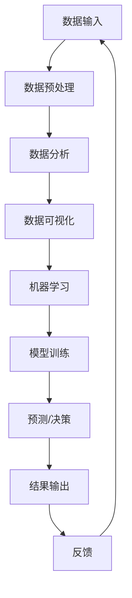

                 

### 引言

随着科技的飞速发展，计算机计算能力不断增强，人类进入了一个前所未有的信息化时代。然而，伴随着计算能力的提升，人类也面临着诸多挑战。如何有效应对这些挑战，成为了人类计算领域的核心使命。

人类计算，作为一种特殊的计算形式，不仅仅局限于传统的计算机科学领域，它涵盖了数据分析、机器学习、人工智能、云计算与大数据等多个方面。本书旨在探讨人类计算在应对人类共同挑战中的使命与担当，从理论和实践两个层面展开讨论。

**文章标题：**《应对人类共同挑战：人类计算的使命担当》

**关键词：** 人类计算，数据分析，机器学习，人工智能，云计算与大数据

**摘要：** 本文首先介绍了人类计算的定义、背景和发展历程，然后详细阐述了人类计算面临的三大挑战：数据安全和隐私保护、人工智能伦理与道德、人工智能与传统行业的融合。接着，本文从核心概念、算法原理、数学模型、项目实战等方面，深入剖析了人类计算的核心技术和应用领域。最后，本文对人类计算的意义、影响及未来发展趋势进行了总结与展望。

### 书籍背景与目的

在当今世界，计算能力已经成为了衡量一个国家或地区科技发展水平的重要指标。从最早的计算机硬件的突破，到软件工程的进步，再到人工智能和大数据技术的崛起，计算机计算能力的发展经历了多个阶段。每一个阶段都为人类带来了前所未有的便利和创新。

然而，随着计算能力的提升，人类也面临着诸多挑战。数据安全和隐私保护成为了一个迫切需要解决的问题。在信息时代，数据已经成为了一种重要的资源，然而，如何确保数据的安全和隐私，防止数据泄露和滥用，成为了一个严峻的挑战。

另一方面，人工智能伦理与道德也成为了人类计算领域面临的一个重大问题。随着人工智能技术的迅速发展，人工智能在各个领域的应用越来越广泛，然而，人工智能的伦理和道德问题也逐渐凸显出来。如何确保人工智能的发展不会对人类造成危害，如何制定合适的人工智能伦理标准，成为了一个亟待解决的难题。

此外，人工智能与传统行业的融合也是一个重要的挑战。人工智能技术的发展，不仅仅是为了提高计算能力，更是为了推动传统行业的转型升级。然而，人工智能与传统行业的融合并不是一帆风顺的，面临着诸多技术、管理和文化上的挑战。

为了应对这些挑战，人类计算领域需要一种全新的思维方式和方法论。本书旨在探讨人类计算的使命与担当，从多个角度分析和解决问题，为人类计算领域的发展提供一个新的视角。

**书籍背景：** 本书是基于人类计算领域的最新研究成果和实际应用经验编写而成。作者结合自己在人工智能、大数据、云计算等领域的深入研究，对人类计算的理论和实践进行了系统的总结和梳理。

**书籍目的：** 本书的主要目的是为读者提供一个全面、系统的了解人类计算的概念、原理和应用的方法论。通过本书，读者可以了解人类计算的发展历程、核心概念、关键技术、应用领域和面临的挑战，从而为后续的学习和研究奠定基础。

**阅读对象：** 本书适合计算机科学、人工智能、大数据、云计算等领域的科研人员、工程师、研究生和本科生阅读。同时，对于对计算技术感兴趣的广大读者，本书也提供了一个深入了解计算领域的窗口。

### 人类计算的定义与发展

人类计算，作为一个新兴的计算领域，其定义和内涵随着技术的发展而不断演变。人类计算的定义可以理解为：通过计算机技术和人工智能技术，模拟和增强人类认知和决策过程的一种计算形式。具体来说，人类计算包括以下几个方面：

首先，人类计算涵盖了传统的计算机科学领域。计算机科学作为一门研究计算机硬件、软件及其应用的科学，其核心是算法和数据结构。在人类计算中，计算机科学提供了基本的理论基础和技术手段，如算法设计、数据存储和处理、网络通信等。

其次，人类计算强调人工智能的应用。人工智能作为计算机科学的一个分支，致力于模拟和扩展人类的智能能力。在人类计算中，人工智能技术被广泛应用于数据分析、自然语言处理、计算机视觉、智能决策等领域，极大地提升了计算的效率和智能化水平。

再次，人类计算强调与大数据和云计算的融合。大数据和云计算为人类计算提供了海量的数据资源和强大的计算能力。在人类计算中，大数据和云计算技术被广泛应用于数据存储、数据处理、数据分析和智能应用等领域，为人类计算提供了强有力的支持。

人类计算的发展历程可以追溯到计算机科学的兴起。从最早的计算机硬件的突破，到软件工程的进步，再到人工智能和大数据技术的崛起，人类计算经历了多个阶段。

第一个阶段是计算机硬件的发展阶段。从20世纪40年代第一台电子计算机的诞生，到20世纪60年代集成电路的出现，计算机硬件技术的飞速发展，为人类计算奠定了基础。

第二个阶段是软件工程的发展阶段。从20世纪70年代开始，随着计算机硬件的普及，软件工程逐渐成为计算机科学的一个重要分支。软件工程的发展，使得计算机应用变得更加广泛和高效，也为人类计算提供了新的机遇。

第三个阶段是人工智能和大数据技术的发展阶段。从20世纪80年代开始，人工智能和大数据技术逐渐崭露头角。人工智能技术的发展，使得计算机能够模拟和扩展人类的智能能力，大数据技术的发展，则为人类计算提供了海量的数据资源。

随着人工智能和大数据技术的不断进步，人类计算的应用领域也在不断拓展。从传统的数据分析、机器学习，到新兴的物联网、区块链、自动驾驶等，人类计算已经成为推动社会进步的重要力量。

总之，人类计算作为一种新型的计算形式，其发展历程和内涵随着技术的进步而不断演变。从计算机科学的兴起，到人工智能和大数据技术的崛起，人类计算经历了多个阶段，展现了强大的发展潜力和应用前景。

### 人类计算的重要性

人类计算的重要性不仅体现在其对科技进步的推动作用，更体现在其对人类社会生活的深远影响。在现代社会中，人类计算已经成为解决各种复杂问题、提升生产效率、改善生活质量的重要工具。

首先，人类计算在提高计算效率方面具有显著优势。传统的手工计算方式，不仅耗时耗力，而且容易出错。而通过人类计算，我们可以利用计算机的高效计算能力，快速处理海量数据，提高计算效率。特别是在大数据时代，人类计算技术为数据的存储、处理和分析提供了强有力的支持，使得我们能够从海量数据中提取有价值的信息。

其次，人类计算在解决复杂问题上具有重要作用。许多复杂问题，如气候模拟、金融市场预测、疾病诊断等，都需要进行大量的计算和复杂的数据分析。人类计算技术，如机器学习和人工智能，能够通过模拟和扩展人类的智能能力，解决这些复杂问题。例如，在医学领域，人工智能技术已经被广泛应用于疾病诊断、治疗方案制定等，大大提高了医学诊断和治疗的效率和质量。

此外，人类计算在提升生活质量方面也具有重要意义。随着人工智能技术的不断发展，智能家居、智能交通、智能医疗等应用逐渐走入人们的生活。通过人类计算，我们可以实现更智能、更便捷、更舒适的生活体验。例如，智能家居系统可以根据用户的习惯和需求，自动调节室内温度、湿度、光线等，提供个性化的居住环境；智能交通系统可以实时监测交通状况，优化交通流量，减少交通拥堵，提高出行效率；智能医疗系统可以通过大数据分析和人工智能技术，为患者提供个性化的治疗方案，提高医疗服务质量。

总之，人类计算作为一种新型的计算形式，不仅推动了科技的进步，也为人类社会带来了诸多便利和改进。在现代社会中，人类计算已经成为不可或缺的重要工具，对人类社会的各个方面产生了深远的影响。

### 人类计算面临的挑战

尽管人类计算在推动科技进步和改善生活质量方面取得了显著成果，但人类计算也面临着诸多挑战。这些挑战不仅关乎技术的进步，更关乎社会的可持续发展。

首先，数据安全和隐私保护问题日益突出。随着大数据和云计算技术的发展，数据量和数据类型不断增加，如何确保数据的安全和隐私成为了一个迫切需要解决的问题。数据泄露和滥用事件频繁发生，给企业和个人带来了巨大的损失。因此，如何制定有效的数据安全策略，保护用户隐私，成为人类计算领域面临的一个重要挑战。

其次，人工智能伦理与道德问题引发了广泛的讨论。人工智能技术的发展，使得机器能够模拟和扩展人类的智能能力，但同时也带来了伦理和道德上的挑战。例如，人工智能在决策过程中可能存在的偏见、歧视等问题，以及人工智能在军事、安全等领域的应用可能带来的风险，都需要引起足够的重视。因此，如何制定合适的人工智能伦理标准，确保人工智能的发展不会对人类造成危害，成为人类计算领域面临的一个重要挑战。

最后，人工智能与传统行业的融合也是一个重要的挑战。人工智能技术的发展，为传统行业带来了新的机遇，但同时也带来了诸多挑战。例如，如何将人工智能技术有效地应用到制造业、金融业、医疗等行业，如何解决人工智能与传统行业在技术、管理和文化等方面的融合问题，都是需要深入探讨和解决的难题。因此，如何推动人工智能与传统行业的融合，实现产业升级和转型，成为人类计算领域面临的一个重要挑战。

总之，人类计算在应对人类共同挑战方面具有巨大的潜力，但同时也面临着诸多挑战。这些挑战需要人类计算领域的科研人员、工程师和决策者共同努力，通过技术创新和制度保障，推动人类计算的可持续发展。

### 数据安全和隐私保护

在人类计算的发展过程中，数据安全和隐私保护成为了一个不可忽视的重要问题。随着大数据和云计算技术的广泛应用，数据量和数据类型不断增加，如何确保数据的安全和隐私成为了一个迫切需要解决的问题。

首先，数据泄露和滥用事件频繁发生。近年来，越来越多的企业和个人遭受了数据泄露和滥用的困扰。例如，2017年，美国信用报告公司Equifax遭受了大规模的数据泄露事件，导致1.43亿客户的个人信息被盗。此外，2018年，Facebook的数据泄露事件也引发了全球对数据隐私保护的广泛关注。这些事件不仅给企业和个人带来了巨大的经济损失，也严重损害了公众对数据安全和隐私保护的信心。

其次，数据安全和隐私保护面临的技术挑战也十分严峻。在人类计算中，数据通常需要进行存储、处理、分析和传输等操作。在这些过程中，数据面临着多种安全威胁，如数据窃取、数据篡改、数据丢失等。传统的数据安全防护手段，如防火墙、加密技术、访问控制等，虽然在一定程度上能够保护数据的安全，但难以应对日益复杂和多样化的安全威胁。例如，分布式拒绝服务攻击（DDoS）、高级持续性威胁（APT）等新型网络攻击手段，给数据安全和隐私保护带来了极大的挑战。

此外，人工智能技术的发展也为数据安全和隐私保护带来了新的挑战。人工智能技术在数据分析、数据挖掘、智能决策等领域具有巨大的应用潜力，但同时也带来了数据隐私泄露的风险。例如，在人脸识别、智能监控等应用中，个人生物特征的隐私保护成为一个重要的问题。如果这些数据被恶意利用，可能会对个人隐私和人身安全造成严重威胁。

为了应对这些挑战，人类计算领域需要采取一系列措施来确保数据的安全和隐私保护。首先，需要制定和完善相关的法律法规，明确数据安全和隐私保护的法律责任和义务。例如，欧盟于2018年实施的《通用数据保护条例》（GDPR），对数据收集、存储、处理和传输等环节进行了严格的规定，为数据安全和隐私保护提供了法律保障。

其次，需要加强技术创新，提升数据安全和隐私保护的技术手段。例如，可以采用差分隐私（differential privacy）技术，在数据分析过程中保护个人隐私；利用区块链技术，实现数据的安全存储和传输；采用基于密码学的方法，如零知识证明（zero-knowledge proof）、同态加密（homomorphic encryption）等，确保数据在处理过程中的安全性和隐私性。

此外，还需要加强数据安全和隐私保护的教育和培训，提高企业和个人的数据安全和隐私保护意识。通过普及数据安全和隐私保护知识，提高员工和公众的安全意识和防范能力，减少数据泄露和滥用事件的发生。

总之，数据安全和隐私保护是人类计算领域面临的一个重要挑战。通过制定法律法规、加强技术创新、提升教育水平等多方面的努力，人类计算领域可以更好地应对这一挑战，确保数据的安全和隐私保护。

### 人工智能伦理与道德

随着人工智能技术的迅猛发展，其伦理与道德问题逐渐成为人们关注的焦点。人工智能伦理与道德问题不仅涉及到技术本身，还涉及到社会、法律、文化等多个层面，需要我们从多个角度进行深入探讨。

首先，人工智能在决策过程中可能存在的偏见和歧视问题。人工智能算法在训练过程中，会根据历史数据进行学习，而历史数据往往存在偏见和不平等。这种偏见可能会在人工智能的决策过程中被放大和传递，导致不公平的结果。例如，在招聘、贷款、信用评分等应用中，人工智能算法可能会对特定群体产生歧视，影响他们的机会和权益。

其次，人工智能在军事、安全等领域的应用引发了广泛的伦理争议。人工智能技术的发展，使得自动化武器系统、智能监控等应用成为可能，但这些应用也带来了道德和伦理上的挑战。例如，自动化武器系统在决策过程中可能存在失误，导致无辜人员的伤亡；智能监控可能侵犯个人隐私，造成社会信任危机。

此外，人工智能的发展还引发了关于人机关系和人类角色的思考。随着人工智能技术的不断进步，许多原本由人类完成的任务可以被机器取代。这引发了一个问题：人类在未来的社会中将扮演什么样的角色？是成为人工智能的奴隶，还是与人工智能共同发展，实现人机协同？

为了解决这些伦理和道德问题，人工智能领域需要采取一系列措施。首先，需要制定和遵守相关的人工智能伦理规范。这些规范应包括数据使用、算法设计、决策过程等多个方面，确保人工智能的发展不会对社会和个人造成危害。例如，可以借鉴医疗伦理的原则，制定人工智能的伦理准则，如公正性、尊重个人隐私、避免伤害等。

其次，需要加强人工智能技术的透明度和可解释性。人工智能算法的黑箱特性使得其决策过程难以被理解和监督，这增加了伦理和道德风险。通过提高算法的透明度和可解释性，可以增强公众对人工智能的信任，减少伦理和道德争议。

此外，还需要加强人工智能领域的教育和培训，提高科研人员、工程师和公众的伦理和道德意识。通过普及人工智能伦理和道德知识，提高人们对人工智能发展的关注和参与度，共同推动人工智能的健康发展。

总之，人工智能伦理与道德问题是一个复杂而严峻的挑战。通过制定伦理规范、提高透明度和可解释性、加强教育等多方面的努力，人类可以更好地应对这一挑战，确保人工智能技术的发展符合道德和伦理的要求。

### 人工智能与传统行业的融合

人工智能与传统行业的融合已经成为当前科技发展的重要趋势。这一融合不仅推动了传统行业的转型升级，也为人工智能技术开辟了更广阔的应用场景。然而，这一过程中也面临着诸多挑战，需要从技术、管理和文化等多个层面进行深入探讨。

首先，从技术层面来看，人工智能与传统行业的融合需要解决一系列技术难题。例如，如何将人工智能技术有效地应用到制造业、金融业、医疗等行业，如何解决数据收集、处理和分析中的隐私保护问题，以及如何实现人工智能技术在实际业务中的高效应用。制造业中，人工智能可以用于生产线的优化、质量检测和设备预测维护；金融业中，人工智能可以用于风险控制、信用评分和投资决策；医疗领域中，人工智能可以用于疾病诊断、个性化治疗和健康管理等。然而，这些应用场景的实现离不开先进的人工智能技术，如深度学习、自然语言处理和计算机视觉等。

其次，从管理层面来看，人工智能与传统行业的融合需要企业领导层具备前瞻性和战略眼光。企业需要制定明确的人工智能战略，从组织架构、人才引进、技术创新等方面进行全面布局。此外，还需要建立完善的管理机制，确保人工智能项目的顺利推进。例如，在人力资源方面，企业需要吸引和培养具备人工智能专业知识的人才；在项目管理方面，企业需要建立高效的项目管理机制，确保项目进度和质量；在技术创新方面，企业需要加强与科研机构和高校的合作，推动人工智能技术的创新和应用。

再次，从文化层面来看，人工智能与传统行业的融合也需要克服文化差异和员工接受度的问题。人工智能技术的引入可能会改变传统的业务流程和工作方式，这需要员工具备适应和接受新技术的意识和能力。企业需要加强员工培训，提高他们的技术水平和创新能力，同时营造一个积极、开放、包容的企业文化，鼓励员工积极尝试和应用新技术。此外，还需要建立有效的沟通机制，确保员工了解人工智能项目的目标和进展，减少对新技术的不确定性和担忧。

此外，人工智能与传统行业的融合还面临着法律法规和伦理道德等方面的挑战。随着人工智能技术的广泛应用，相关法律法规和伦理标准亟待完善。例如，如何确保人工智能系统的透明度和可解释性，如何处理人工智能决策中的责任归属问题，以及如何保护个人隐私和数据安全等。这些问题都需要在融合过程中得到妥善解决，以保障人工智能技术的发展和社会的可持续发展。

总之，人工智能与传统行业的融合是一个复杂而富有挑战的过程。通过技术创新、管理优化和文化建设等多方面的努力，可以推动人工智能技术在传统行业中的应用，实现产业的转型升级和社会的进步。然而，这一过程中也需要克服诸多挑战，确保人工智能技术的健康发展和社会的公平正义。

### 人类计算的基本原理

人类计算作为一种新兴的计算形式，其基本原理涵盖了多个领域，包括计算机科学、人工智能、大数据和云计算。为了更好地理解和应用人类计算，我们需要从以下几个方面进行详细探讨。

首先，计算机科学是构成人类计算的基础。计算机科学的核心是算法和数据结构，这些是进行高效计算和数据处理的关键。算法是解决特定问题的步骤和方法，而数据结构则是数据存储和组织的方式。在人类计算中，计算机科学提供了各种基础算法，如排序算法、搜索算法、图算法等，以及高效的数据结构，如数组、链表、树等。这些基础技术和工具为人类计算提供了坚实的理论基础和实现手段。

其次，人工智能作为人类计算的重要组成部分，其基本原理主要包括机器学习、自然语言处理和计算机视觉等。机器学习是一种让计算机通过数据自动学习和改进的方法，包括监督学习、无监督学习和强化学习等。自然语言处理则致力于使计算机理解和生成自然语言，如英文、中文等。计算机视觉则专注于使计算机理解和解释图像和视频，如人脸识别、物体检测等。这些人工智能技术通过模拟和扩展人类的认知能力，使得计算机能够进行更加智能的计算和处理。

再次，大数据和云计算为人类计算提供了强大的数据资源和计算能力。大数据技术包括数据存储、数据处理、数据分析和数据挖掘等，它们使得我们能够高效地管理和分析海量数据。云计算技术则通过提供虚拟化的计算资源，使得我们能够灵活地扩展和利用计算能力。在大数据和云计算的支持下，人类计算可以处理和分析大规模数据集，从而实现更精准、更高效的计算和应用。

最后，人类计算还涉及到多个领域的交叉和融合。例如，在医疗健康领域，人类计算可以应用于疾病诊断、治疗方案制定和健康管理等；在教育领域，人类计算可以应用于智能教育、学习分析和个性化教学等；在金融领域，人类计算可以应用于风险控制、投资分析和信用评估等。这些应用场景需要结合不同领域的知识和技术，实现跨学科的合作和创新。

总之，人类计算的基本原理涵盖了计算机科学、人工智能、大数据和云计算等多个领域。通过理解和应用这些基本原理，人类计算能够为解决各种复杂问题提供强大的技术支持，推动社会进步和科技创新。

### 人类计算的理论基础

人类计算的理论基础是构建在计算机科学、人工智能、大数据和云计算等多个领域之上。每一个理论基础都对人类计算的发展起着至关重要的作用。

首先，计算机科学是构成人类计算的核心。计算机科学的基本理论包括算法设计、数据结构、编程语言、计算机体系结构等。算法是解决特定问题的系统方法，数据结构则是数据存储和组织的方式。计算机体系结构则定义了计算机硬件和软件的基本设计原则。这些理论基础为人类计算提供了高效、可靠的计算手段和工具。

其次，人工智能作为人类计算的重要组成部分，其理论基础主要包括机器学习、自然语言处理、计算机视觉等。机器学习是一种通过数据自动学习和改进的方法，其核心包括监督学习、无监督学习和强化学习。自然语言处理致力于使计算机理解和生成自然语言，而计算机视觉则专注于使计算机理解和解释图像和视频。这些理论基础使得人类计算能够模拟和扩展人类的认知能力，实现更加智能化和自动化的计算。

再次，大数据和云计算为人类计算提供了强大的理论支持。大数据技术涉及数据存储、数据处理、数据分析和数据挖掘等多个方面，其理论基础包括概率论、统计学和数据库系统等。云计算技术则通过虚拟化和分布式计算，提供了灵活、高效的计算资源。这些理论基础使得人类计算能够处理和分析大规模数据集，实现更精准、更高效的计算和应用。

此外，人类计算的理论基础还涉及到跨学科的知识整合。例如，生物信息学、认知科学和神经科学等领域的知识，为人类计算提供了新的视角和方法。通过这些跨学科的理论基础，人类计算能够更加深入地理解和解决复杂问题，推动科技和社会的进步。

总之，人类计算的理论基础是多学科交叉和融合的成果。通过计算机科学、人工智能、大数据和云计算等基础理论的支持，人类计算能够实现更加智能化和自动化的计算，为解决各种复杂问题提供强大的技术支持。

### 人类计算的核心技术

人类计算作为一种新兴的计算形式，其核心技术涵盖了多个方面，包括数据分析、机器学习、人工智能、云计算与大数据。这些核心技术相互交织，共同构成了人类计算的强大能力，为应对复杂问题和推动科技进步提供了有力支持。

首先，数据分析是基础性核心技术。数据分析技术主要涉及数据预处理、数据可视化、数据挖掘和统计分析等方面。数据预处理包括数据清洗、数据转换和数据归一化等步骤，目的是确保数据的质量和一致性。数据可视化则通过图表和图形的方式，直观地展示数据的分布和趋势，帮助用户更好地理解和分析数据。数据挖掘则利用统计和机器学习算法，从海量数据中发现隐藏的模式和规律，为决策提供支持。统计分析则通过对数据的描述性分析和推断性分析，得出有价值的结论。

其次，机器学习是人工智能的核心技术之一。机器学习是一种通过数据自动学习和改进的方法，主要包括监督学习、无监督学习和强化学习。监督学习通过已有标签数据训练模型，实现对新数据的预测和分类。无监督学习则通过未标注的数据，发现数据中的模式和结构。强化学习则通过不断试错和反馈，实现策略的优化和决策的优化。机器学习算法，如线性回归、决策树、支持向量机、神经网络等，广泛应用于图像识别、语音识别、自然语言处理等领域。

再次，人工智能作为人类计算的重要组成部分，其核心技术包括自然语言处理、计算机视觉和深度学习等。自然语言处理致力于使计算机理解和生成自然语言，包括文本分类、语义分析、机器翻译等应用。计算机视觉则专注于使计算机理解和解释图像和视频，包括人脸识别、物体检测、图像分割等应用。深度学习是人工智能的一个重要分支，通过多层神经网络，实现数据的自动学习和特征提取，已经在图像识别、语音识别、自动驾驶等领域取得了显著成果。

此外，云计算与大数据技术为人类计算提供了强大的计算资源和数据支持。云计算技术通过虚拟化和分布式计算，提供了灵活、高效的计算资源，使得人类计算能够处理和分析大规模数据集。大数据技术则包括数据存储、数据处理、数据分析和数据挖掘等多个方面，为人类计算提供了丰富的数据资源和强大的计算能力。通过云计算与大数据技术的支持，人类计算能够实现更高效、更智能的计算和应用。

总之，人类计算的核心技术包括数据分析、机器学习、人工智能、云计算与大数据等。这些核心技术相互融合，共同构成了人类计算的强大能力，为应对复杂问题和推动科技进步提供了有力支持。通过不断发展和创新，人类计算将在未来继续发挥重要作用，为人类社会的发展做出更大贡献。

### 人类计算与计算机科学的关系

人类计算与计算机科学的关系是相辅相成的。计算机科学作为人类计算的基础，为人类计算提供了强大的理论支持和技术手段。而人类计算作为计算机科学的延伸，通过模拟和增强人类的认知能力，进一步推动了计算机科学的发展和应用。

首先，计算机科学为人类计算提供了核心的理论基础。计算机科学涵盖了算法设计、数据结构、编程语言、计算机体系结构等多个方面，这些理论基础是人类计算的重要组成部分。例如，算法设计是人类计算中解决复杂问题的关键，而数据结构和编程语言则为人类计算提供了高效的数据处理和计算手段。计算机体系结构则决定了计算机硬件和软件的协同工作方式，为人类计算提供了强大的计算能力。

其次，计算机科学的发展推动了人类计算技术的进步。随着计算机科学的不断进步，新的算法、新的数据结构和新的编程语言不断涌现，这些新技术为人类计算提供了更高效、更智能的计算手段。例如，深度学习算法的提出和发展，使得计算机能够从海量数据中自动学习和提取特征，极大地提升了图像识别、语音识别等应用的效果。此外，计算机科学的发展还推动了云计算和大数据技术的进步，为人类计算提供了强大的计算资源和数据支持。

反过来，人类计算也为计算机科学带来了新的挑战和机遇。人类计算的兴起，使得计算机科学需要解决更多复杂的问题，如自然语言处理、计算机视觉、智能决策等。这些新问题促使计算机科学家不断探索新的算法、新的理论和技术，从而推动了计算机科学的发展。同时，人类计算的应用也促进了计算机科学技术的普及和应用，使得计算机科学的理论和方法得到了更广泛的实践和应用。

此外，人类计算与计算机科学的融合，产生了许多新的交叉学科和研究方向。例如，生物信息学、认知科学、神经科学等领域的知识，为计算机科学提供了新的理论和方法，而计算机科学的技术手段，如人工智能、大数据等，也为这些领域的研究提供了强大的支持。这种跨学科的融合，推动了科技和社会的进步。

总之，人类计算与计算机科学的关系是密切而相互促进的。计算机科学为人类计算提供了理论基础和技术支持，而人类计算则为计算机科学带来了新的挑战和机遇，推动了计算机科学的发展和应用。通过不断融合和创新，人类计算与计算机科学将共同推动科技的进步和社会的发展。

### 人类计算的 Mermaid 流程图

为了更直观地展示人类计算的基本原理和核心组成部分，我们可以使用Mermaid绘制一个流程图。以下是一个简化的示例，描述了从数据输入到最终输出结果的整个计算过程：



在这个流程图中：

- **A[数据输入]**：表示数据进入计算流程的起点，可以是各种类型的数据源，如数据库、传感器等。
- **B[数据预处理]**：对数据进行清洗、转换等预处理步骤，以确保数据的质量和一致性。
- **C[数据分析]**：对预处理后的数据进行分析，提取有用的信息。
- **D[数据可视化]**：通过图表和图形展示分析结果，帮助用户更好地理解和分析数据。
- **E[机器学习]**：利用机器学习算法对数据进行训练，以构建预测模型。
- **F[模型训练]**：通过训练数据对机器学习模型进行调整和优化。
- **G[预测/决策]**：使用训练好的模型进行预测或决策。
- **H[结果输出]**：将预测或决策结果输出，可以是报告、图表或行动指令等。
- **I[反馈]**：收集用户或系统的反馈，用于模型优化和改进。

这个流程图展示了人类计算的基本步骤和各个组成部分之间的关联，有助于读者更清晰地理解人类计算的整个过程。

### 人类计算的关键领域

人类计算涵盖了许多关键领域，这些领域不仅体现了人类计算的广度和深度，也展示了其强大的应用潜力。以下是几个关键领域及其在人类计算中的重要性：

#### 数据分析

数据分析是现代计算的核心之一。通过收集、处理和分析大量数据，数据分析可以帮助我们理解复杂的现象，发现潜在的模式，并为决策提供支持。数据分析涉及多个步骤，包括数据清洗、数据转换、数据挖掘和统计分析。它在商业决策、市场营销、金融分析、医疗诊断等多个领域都有广泛应用。

#### 机器学习

机器学习是一种通过数据自动学习和改进的方法，其目的是让计算机具备类似人类的智能。机器学习算法可以分为监督学习、无监督学习和强化学习。监督学习用于预测和分类任务，无监督学习用于模式发现和聚类，而强化学习则用于决策优化。机器学习在图像识别、语音识别、自然语言处理、医疗诊断等领域发挥着重要作用。

#### 人工智能

人工智能（AI）是计算机科学的一个分支，旨在创建能够模拟和扩展人类智能的系统。人工智能包括自然语言处理、计算机视觉、深度学习等多个子领域。自然语言处理使得计算机能够理解和生成自然语言，计算机视觉使计算机能够理解和解释图像和视频，而深度学习则通过多层神经网络实现数据的自动学习和特征提取。人工智能在自动驾驶、智能家居、智能客服、医疗诊断等领域有着广泛的应用。

#### 云计算与大数据

云计算与大数据是支撑人类计算的重要技术。云计算通过虚拟化和分布式计算，提供了灵活、高效的计算资源，使得大规模数据处理和计算成为可能。大数据技术则包括数据存储、数据处理、数据分析和数据挖掘等方面，它使得我们能够高效地管理和分析海量数据。云计算与大数据的结合，为人类计算提供了强大的数据支持和计算能力，广泛应用于金融、医疗、零售、交通等多个行业。

#### 物联网

物联网（IoT）是通过传感器和通信技术将物理设备连接到互联网，实现设备之间的数据交换和协同工作。物联网技术使得人类计算能够实时收集和分析大量设备数据，从而实现智能监控、自动化管理和远程控制。物联网在智能城市、智能交通、智能家居、工业4.0等领域具有重要应用价值。

综上所述，数据分析、机器学习、人工智能、云计算与大数据、物联网是人类计算的关键领域，它们共同构成了人类计算的强大能力和广泛应用。通过不断探索和创新，这些领域将继续推动人类计算的发展，为人类社会带来更多便利和进步。

### 医疗健康领域中的应用

在医疗健康领域，人类计算正发挥着越来越重要的作用。通过数据分析、机器学习、人工智能等技术的应用，医疗健康领域实现了前所未有的变革和创新。

首先，数据分析在医疗健康领域的应用非常广泛。通过对海量医疗数据的收集和分析，医生和研究人员可以更好地了解疾病的发病规律、病情发展趋势和治疗效果。例如，通过对患者病史、症状、检查结果等数据的分析，医生可以更准确地诊断疾病，制定个性化的治疗方案。此外，数据分析还可以帮助医疗机构优化资源配置，提高医疗服务效率。

其次，机器学习技术在医疗健康领域的应用也越来越广泛。机器学习算法可以通过学习大量医学数据和病例，自动识别和诊断疾病。例如，深度学习算法在医学图像分析中的应用，可以大大提高疾病诊断的准确性和效率。例如，使用深度学习算法对肺部CT图像进行分析，可以有效地检测出早期肺癌，为患者争取更多的治疗机会。此外，机器学习技术还可以用于预测患者的病情发展、制定个性化的治疗方案和健康监测。

人工智能技术在医疗健康领域的应用更是令人瞩目。自然语言处理技术可以用于分析大量的医学文献和病例报告，帮助医生和研究人员获取更多有价值的信息。例如，通过分析大量的医学文献，人工智能可以自动识别出新的药物候选物，加速新药的发现和开发。计算机视觉技术则可以用于智能诊断，例如通过分析医疗影像，自动识别出病变部位和疾病类型。

除了上述技术，云计算与大数据技术也在医疗健康领域发挥着重要作用。通过云计算技术，医疗机构可以高效地存储、处理和分析海量医疗数据，实现跨机构和跨地域的医疗资源共享。大数据技术则使得我们能够更好地了解疾病的全貌，为疾病预防和治疗提供更科学的依据。

总之，人类计算在医疗健康领域中的应用，极大地提高了疾病诊断和治疗的效率和准确性，改善了患者的生活质量。随着技术的不断进步，人类计算将在医疗健康领域发挥更大的作用，为人类健康事业做出更大的贡献。

#### 教育领域中的应用

在教育领域，人类计算技术正通过多种方式深刻改变着传统的教学和学习模式。首先，数据分析技术在教育领域中的应用极为广泛。通过收集和分析学生的学习数据，教育机构可以更好地了解学生的知识掌握情况和学习习惯，从而进行个性化的教学设计和学习路径优化。例如，利用学习分析工具，教师可以实时监控学生的学习进度，发现学习困难点，并针对性地提供辅导材料。此外，数据分析还可以用于评估教学效果，帮助教师和学校改进教学方法，提升教育质量。

其次，机器学习技术在教育领域也表现出强大的潜力。通过机器学习算法，教育技术公司可以开发智能教育平台，为每个学生提供个性化的学习体验。例如，智能学习系统可以根据学生的学习行为和知识水平，自动调整学习内容和难度，确保学生能够以适合自己的速度进行学习。此外，机器学习技术还可以用于智能题库生成和自动评分，提高教学效率和准确性。

人工智能技术在教育领域的应用同样引人注目。自然语言处理技术使得教育系统能够理解学生的语言输入，提供智能问答和辅导。例如，智能辅导系统可以解答学生在学习过程中遇到的问题，提供详细解释和解决方案。计算机视觉技术则可以用于自动化考试监考，通过分析学生的面部表情和行为，识别可能的作弊行为。此外，人工智能还可以用于智能教育内容的生成和优化，通过分析大量的教育资源，自动生成个性化的学习材料，提高学生的学习兴趣和参与度。

云计算与大数据技术的应用进一步提升了教育资源的共享和利用效率。通过云计算平台，教育机构可以轻松实现教学资源的云端存储和共享，使得学生能够随时随地访问学习资料。大数据技术则帮助教育机构收集和分析海量的教育数据，为教育决策提供科学依据。例如，通过分析学生的学习行为和成绩数据，教育机构可以识别优秀的教学模式和方法，推广有效的教育实践。

总之，人类计算技术在教育领域中的应用，不仅提高了教学和学习的效率和质量，还促进了教育资源的公平分配和个性化学习。随着技术的不断发展，人类计算将在教育领域发挥更大的作用，推动教育的创新和进步。

### 金融行业中的应用

在金融行业中，人类计算技术的应用正日益深入，为金融服务的效率、透明度和安全性带来了显著提升。首先，数据分析技术在金融领域扮演着至关重要的角色。通过收集和分析大量的金融数据，金融机构能够实时监测市场动态，预测风险，优化投资组合。例如，量化交易策略依赖于对历史交易数据、宏观经济指标和新闻事件的分析，从而实现高效的交易决策。此外，数据分析还可以用于信用评分和风险评估，帮助金融机构更好地评估借款人的信用状况，降低违约风险。

其次，机器学习技术在金融行业中的应用越来越广泛。机器学习算法能够从海量数据中自动提取特征，识别复杂模式，为金融机构提供智能决策支持。例如，通过分析客户的交易行为和消费习惯，银行可以自动识别欺诈行为，提高交易的安全性。此外，机器学习技术还可以用于贷款审批和信用评级，通过分析客户的财务状况、信用记录和就业情况等数据，快速、准确地评估贷款申请者的信用风险。

人工智能技术在金融行业的应用同样令人瞩目。自然语言处理技术使得金融机构能够自动化处理大量的文本数据，如客户反馈、合同条款和新闻报道等。例如，通过自然语言处理技术，银行可以自动生成客户报告，提高工作效率。计算机视觉技术则可以用于自动化审核和识别图像，如识别支票上的签名、验证身份证件等，从而提高操作效率。

云计算与大数据技术的应用为金融行业带来了前所未有的便利和效率。通过云计算平台，金融机构可以高效地存储、处理和分析海量数据，实现资源的灵活调度和共享。大数据技术则帮助金融机构更好地理解市场和客户需求，优化产品和服务。例如，通过分析客户交易数据和市场趋势，金融机构可以推出更加个性化的金融产品，提高客户满意度。

总之，人类计算技术在金融行业中的应用，不仅提升了金融服务的效率和透明度，还增强了金融系统的安全性和稳健性。随着技术的不断进步，人类计算将在金融行业发挥更大的作用，推动金融服务的创新和变革。

### 智能制造中的应用

智能制造作为工业4.0的重要实践，其核心在于通过人类计算技术实现生产过程的自动化、智能化和优化。首先，数据分析技术在智能制造中发挥着重要作用。通过对生产过程中产生的海量数据进行实时分析，工厂能够及时发现生产过程中的异常，优化生产流程。例如，通过分析传感器数据，工厂可以预测设备的维护需求，提前进行预防性维护，避免设备故障带来的生产中断。

其次，机器学习技术在智能制造中得到了广泛应用。通过机器学习算法，工厂能够优化生产参数，提高生产效率。例如，在数控机床的加工过程中，机器学习算法可以根据材料特性、刀具磨损情况等数据，自动调整加工参数，实现最优的加工效果。此外，机器学习还可以用于质量检测，通过分析产品检测数据，自动识别不合格产品，减少人为错误。

人工智能技术在智能制造中的应用更是不可忽视。自然语言处理技术使得工厂能够自动化处理生产文档和报告，提高文档管理的效率。计算机视觉技术则可以用于自动化检测和识别生产过程中的缺陷，例如通过图像识别技术，自动检测产品的表面缺陷。深度学习技术则可以用于设备预测性维护，通过分析设备运行数据，预测设备故障的发生时间，提前进行维护，减少停机时间。

云计算与大数据技术为智能制造提供了强大的支持。通过云计算平台，工厂可以实现资源的灵活调度和共享，提高生产效率。大数据技术则帮助工厂更好地理解生产过程中的各种数据，发现潜在的问题和优化点。例如，通过分析生产数据，工厂可以优化生产计划，减少库存成本，提高生产柔性。

总之，智能制造通过人类计算技术的应用，实现了生产过程的自动化、智能化和优化。随着技术的不断进步，智能制造将在未来发挥更大的作用，推动制造业的转型升级和可持续发展。

### 城市管理中的应用

在现代社会中，城市管理面临着日益复杂的挑战，如交通拥堵、资源分配、环境监测等。人类计算技术以其强大的数据处理和分析能力，为城市管理提供了创新解决方案。

首先，数据分析技术在城市管理中发挥着重要作用。通过实时收集和分析城市中的交通流量、天气状况、人口流动等数据，城市管理系统能够动态调整交通信号灯、优化公共交通线路，从而缓解交通拥堵问题。此外，数据分析还可以用于能源管理，通过监测城市的电力、燃气消耗情况，帮助能源供应商优化资源分配，降低能源消耗。

其次，机器学习技术在城市管理中有着广泛的应用。例如，通过分析交通流量数据，机器学习算法可以预测交通拥堵的发生时间和地点，提前发布交通预警，引导驾驶员选择最优路线。此外，机器学习技术还可以用于公共安全监控，通过分析摄像头捕捉的图像和视频，实时识别和报警潜在的安全威胁，如火灾、犯罪行为等。

人工智能技术则为城市管理提供了更加智能的解决方案。自然语言处理技术使得城市管理系统能够自动处理大量的文本信息，如市民投诉、新闻报告等，快速响应市民的需求。计算机视觉技术可以用于智能监控，通过分析摄像头捕捉的图像，自动识别和报警异常事件。深度学习技术则可以用于环境监测，通过分析空气、水质等数据，预测污染事件，并提前采取应对措施。

云计算与大数据技术为城市管理提供了强大的数据支持和计算能力。通过云计算平台，城市管理系统能够高效地存储、处理和分析海量数据，实现跨机构和跨地域的数据共享。大数据技术则帮助城市管理者更好地理解城市运行状态，发现潜在问题，制定科学的决策。

总之，人类计算技术在城市管理中的应用，极大地提高了城市管理的效率和智能化水平，为城市居民提供了更加便捷、安全的生活环境。随着技术的不断进步，人类计算将在城市管理中发挥更大的作用，推动智慧城市的建设和发展。

### 数据分析算法原理讲解

在人类计算领域，数据分析算法是至关重要的组成部分。以下将详细讲解数据分析中常用的几个核心算法原理，包括数据预处理、数据可视化、数据聚类、数据分类和数据降维。

#### 3.1 数据预处理

数据预处理是数据分析的基础步骤，目的是提高数据质量和一致性，为后续分析打下坚实基础。数据预处理包括以下几个关键步骤：

1. **数据清洗**：去除数据中的噪声和不完整数据。例如，处理缺失值、异常值和重复数据。
2. **数据转换**：将数据转换为适合分析的形式。例如，将分类数据转换为数值型数据，进行数据归一化或标准化处理。
3. **数据集成**：合并多个数据源，形成统一的数据视图。例如，将不同格式或来源的数据整合到一个数据集中。

**伪代码示例：**
```python
def data_preprocessing(data):
    # 清洗数据
    clean_data = clean(data)
    # 数据转换
    transform_data = transform(clean_data)
    return transform_data
```

#### 3.2 数据可视化

数据可视化是将数据转换成图表和图形，以直观的方式展示数据特征和关系。数据可视化有助于理解和解释数据分析结果，支持决策制定。常见的数据可视化方法包括：

1. **折线图**：展示数据随时间变化的趋势。
2. **柱状图**：比较不同类别或时间段的数据。
3. **饼图**：展示各部分数据在整体中的比例。
4. **散点图**：展示两个变量之间的关系。

**伪代码示例：**
```python
def data_visualization(data):
    visualize(data)
```

#### 3.3 数据聚类

数据聚类是一种无监督学习方法，用于将数据分为若干个类簇，使同一类簇中的数据彼此相似，而不同类簇中的数据差异较大。常用的数据聚类算法包括：

1. **K-means聚类**：将数据点分配到K个类簇，每个类簇由其中心点代表。
2. **层次聚类**：通过逐步合并或分裂类簇，构建一个层次结构。
3. **密度聚类**：基于数据点的密度分布，识别出密集区域作为类簇。

**伪代码示例：**
```python
def data_clustering(data, num_clusters):
    clusters = cluster(data, num_clusters)
    return clusters
```

#### 3.4 数据分类

数据分类是一种监督学习方法，用于将数据点分配到预定义的类别中。数据分类算法通过训练模型，学习输入特征和输出类别之间的关系。常用的数据分类算法包括：

1. **决策树**：通过一系列条件判断，将数据点分配到不同的类别。
2. **支持向量机（SVM）**：将数据点映射到高维空间，找到最佳分类边界。
3. **神经网络**：通过多层神经网络，学习复杂的非线性分类边界。

**伪代码示例：**
```python
def data_classification(data, labels):
    classifier = train_classifier(data, labels)
    predictions = classifier.predict(data)
    return predictions
```

#### 3.5 数据降维

数据降维是一种减少数据维度，同时保留主要信息的方法。降维有助于提高数据分析的效率和效果，尤其是在处理高维数据时。常用的数据降维算法包括：

1. **主成分分析（PCA）**：通过线性变换，将高维数据投影到低维空间，保留主要成分。
2. **t-SNE**：通过非线性变换，将高维数据投影到二维或三维空间，实现数据的可视化。
3. **自编码器**：通过构建一个编码器和解码器网络，自动学习数据的低维表示。

**伪代码示例：**
```python
def data_reduction(data):
    reduced_data = reduce_dimension(data)
    return reduced_data
```

通过以上对数据分析算法的讲解，我们可以更好地理解和应用这些算法，从而提升数据分析的效率和效果。

### 机器学习算法原理讲解

在人类计算领域，机器学习算法扮演着至关重要的角色。以下将详细讲解几种常见的机器学习算法原理，包括监督学习、无监督学习和强化学习。

#### 3.1 监督学习

监督学习是一种基于已有标签数据进行训练的机器学习方法。通过已知的输入和输出关系，监督学习算法能够学习出一个模型，用于预测新数据的输出。

**1. 线性回归**

线性回归是一种最简单的监督学习算法，用于预测连续值输出。其基本原理是通过找到一个最佳拟合直线，使预测值与实际值之间的误差最小。

**伪代码示例：**

```python
def linear_regression(train_data, train_labels):
    # 计算权重和偏置
    weights = compute_weights(train_data, train_labels)
    # 预测
    predictions = predict(train_data, weights)
    return predictions
```

**2. 决策树**

决策树是一种基于树形结构进行分类或回归的算法。决策树通过一系列条件判断，将数据点分配到不同的类别或预测值。

**伪代码示例：**

```python
def decision_tree(train_data, train_labels):
    # 构建决策树
    tree = build_tree(train_data, train_labels)
    # 预测
    predictions = predict_tree(train_data, tree)
    return predictions
```

**3. 支持向量机（SVM）**

支持向量机是一种基于间隔最大化原理进行分类的算法。SVM通过找到一个最佳的超平面，将不同类别的数据点分隔开。

**伪代码示例：**

```python
def support_vector_machine(train_data, train_labels):
    # 训练模型
    model = train_model(train_data, train_labels)
    # 预测
    predictions = model.predict(train_data)
    return predictions
```

#### 3.2 无监督学习

无监督学习是一种无需标签数据，仅通过数据本身特征进行训练的机器学习方法。无监督学习主要用于数据聚类和降维。

**1. K-means聚类**

K-means聚类是一种基于距离度量的聚类算法，通过迭代优化，将数据点分为K个类簇，使同类簇内的数据点彼此相似，不同类簇的数据点差异较大。

**伪代码示例：**

```python
def k_means(train_data, num_clusters):
    # 初始化类簇中心
    centroids = initialize_centroids(train_data, num_clusters)
    # 迭代优化
    clusters = iterate_optimization(train_data, centroids)
    return clusters
```

**2. 主成分分析（PCA）**

主成分分析是一种降维算法，通过线性变换将高维数据投影到低维空间，保留主要信息，同时减少数据的冗余。

**伪代码示例：**

```python
def principal_component_analysis(train_data):
    # 计算协方差矩阵
    covariance_matrix = compute_covariance_matrix(train_data)
    # 计算特征值和特征向量
    eigenvalues, eigenvectors = compute_eigenvalues_eigenvectors(covariance_matrix)
    # 投影到低维空间
    reduced_data = project_to_low_dimension(train_data, eigenvectors)
    return reduced_data
```

#### 3.3 强化学习

强化学习是一种通过试错和反馈进行学习的方法，主要用于决策优化和策略学习。

**1. Q学习**

Q学习是一种基于值函数的强化学习算法，通过学习状态-动作价值函数，找到最优策略。

**伪代码示例：**

```python
def q_learning(train_data, actions, rewards):
    # 初始化Q值表
    Q = initialize_Q_table(train_data, actions)
    # 更新Q值
    update_Q(Q, train_data, actions, rewards)
    # 找到最优策略
    policy = find_optimal_policy(Q)
    return policy
```

通过以上对机器学习算法的讲解，我们可以更好地理解和应用这些算法，从而解决各种复杂的机器学习问题。

### 人工智能算法原理讲解

在人工智能领域，深度学习、自然语言处理和计算机视觉是三大核心算法，它们在模拟和扩展人类智能方面发挥着重要作用。以下将详细讲解这三种算法的原理。

#### 3.1 深度学习

深度学习是一种基于多层神经网络的学习方法，通过构建深度神经网络，自动提取数据的层次化特征表示。深度学习算法在图像识别、语音识别、自然语言处理等领域取得了显著成果。

**1. 卷积神经网络（CNN）**

卷积神经网络是一种专门用于处理图像数据的深度学习模型，通过卷积层、池化层和全连接层的组合，实现图像的特征提取和分类。

**伪代码示例：**

```python
def conv_neural_network(train_data, train_labels):
    # 构建卷积神经网络
    model = build_cnn_model()
    # 训练模型
    model.train(train_data, train_labels)
    # 预测
    predictions = model.predict(train_data)
    return predictions
```

**2. 循环神经网络（RNN）**

循环神经网络是一种用于处理序列数据的深度学习模型，通过隐藏状态和记忆单元的反馈连接，实现序列数据的建模和预测。

**伪代码示例：**

```python
def recurrent_neural_network(train_data, train_labels):
    # 构建循环神经网络
    model = build_rnn_model()
    # 训练模型
    model.train(train_data, train_labels)
    # 预测
    predictions = model.predict(train_data)
    return predictions
```

#### 3.2 自然语言处理

自然语言处理是一种使计算机理解和生成自然语言的方法，通过深度学习技术，自然语言处理在机器翻译、文本分类、情感分析等领域取得了重要进展。

**1. 长短时记忆网络（LSTM）**

长短时记忆网络是一种改进的循环神经网络，通过门控机制，有效地解决了传统RNN在处理长序列数据时出现的梯度消失和梯度爆炸问题。

**伪代码示例：**

```python
def lstm(train_data, train_labels):
    # 构建LSTM模型
    model = build_lstm_model()
    # 训练模型
    model.train(train_data, train_labels)
    # 预测
    predictions = model.predict(train_data)
    return predictions
```

**2. 生成对抗网络（GAN）**

生成对抗网络是一种基于对抗训练的深度学习模型，通过生成器和判别器的对抗，生成高质量的数据。

**伪代码示例：**

```python
def generative_adversarial_network(train_data):
    # 构建生成器和判别器
    generator, discriminator = build_gan_model()
    # 训练模型
    model.train(train_data)
    # 生成数据
    generated_data = generator.generate()
    return generated_data
```

#### 3.3 计算机视觉

计算机视觉是一种使计算机理解和解释图像和视频的方法，通过深度学习技术，计算机视觉在图像分类、目标检测、图像分割等领域取得了重要突破。

**1. 精细到粗略的语义分割**

精细到粗略的语义分割是一种层次化的图像分割方法，通过深度学习模型，将图像划分为不同级别的语义区域。

**伪代码示例：**

```python
def semantic_segmentation(train_data, train_labels):
    # 构建分割模型
    model = build_segmentation_model()
    # 训练模型
    model.train(train_data, train_labels)
    # 分割图像
    segmented_images = model.segment(train_data)
    return segmented_images
```

**2. 目标检测**

目标检测是一种在图像或视频中识别和定位目标的算法，通过深度学习模型，实现精确的目标检测和分类。

**伪代码示例：**

```python
def object_detection(train_data, train_labels):
    # 构建目标检测模型
    model = build_detection_model()
    # 训练模型
    model.train(train_data, train_labels)
    # 检测目标
    detected_objects = model.detect(train_data)
    return detected_objects
```

通过以上对人工智能算法的讲解，我们可以更好地理解和应用这些算法，从而实现更加智能化的计算和应用。

### 云计算与大数据算法原理讲解

在云计算与大数据领域，算法的核心在于数据存储、数据处理和数据挖掘。以下将详细讲解这些算法的原理和实现方法。

#### 3.1 数据存储

数据存储是大数据处理的基础，其核心是确保数据的持久性和可扩展性。常用的数据存储技术包括关系型数据库、非关系型数据库和分布式文件系统。

**1. 关系型数据库**

关系型数据库通过表与表之间的关系来存储数据，使用SQL语言进行数据操作。其优点是数据结构清晰、查询效率高，但扩展性较差。

**伪代码示例：**

```python
def relational_database(query):
    # 连接数据库
    connection = connect_database()
    # 执行查询
    results = execute_query(connection, query)
    return results
```

**2. 非关系型数据库**

非关系型数据库，如NoSQL数据库，通过键值对、文档、图等结构来存储数据，具有高扩展性和灵活性。

**伪代码示例：**

```python
def nosql_database(document):
    # 连接数据库
    connection = connect_database()
    # 存储文档
    store_document(connection, document)
```

**3. 分布式文件系统**

分布式文件系统，如HDFS，通过将数据分成小块存储在多个节点上，实现数据的分布式存储和并行处理。

**伪代码示例：**

```python
def distributed_file_system(file):
    # 上传文件到HDFS
    upload_file_to_hdfs(file)
    # 读取文件
    read_file_from_hdfs(file)
```

#### 3.2 数据处理

数据处理是大数据分析的核心环节，涉及数据清洗、数据转换和数据归一化等步骤。

**1. 数据清洗**

数据清洗是处理数据前的关键步骤，通过去除重复数据、填补缺失值和纠正错误数据，提高数据质量。

**伪代码示例：**

```python
def data_cleaning(data):
    # 清洗数据
    clean_data = clean(data)
    return clean_data
```

**2. 数据转换**

数据转换是将数据从一种格式转换为另一种格式的过程，如将文本转换为数值、日期格式化等。

**伪代码示例：**

```python
def data_conversion(data):
    # 转换数据
    converted_data = convert(data)
    return converted_data
```

**3. 数据归一化**

数据归一化是将数据缩放到相同范围的过程，如将数据缩放到[0, 1]或[-1, 1]范围内，以便进行进一步分析。

**伪代码示例：**

```python
def data_normalization(data):
    # 归一化数据
    normalized_data = normalize(data)
    return normalized_data
```

#### 3.3 数据挖掘

数据挖掘是发现数据中隐藏的模式和规律的过程，常用的方法包括分类、聚类、关联规则挖掘和异常检测等。

**1. 分类**

分类是一种监督学习方法，通过训练模型，将数据分为不同的类别。常用的分类算法包括决策树、支持向量机和K最近邻。

**伪代码示例：**

```python
def classification(train_data, train_labels):
    # 训练分类模型
    model = train_model(train_data, train_labels)
    # 预测
    predictions = model.predict(test_data)
    return predictions
```

**2. 聚类**

聚类是一种无监督学习方法，通过将相似的数据点归为一类，用于数据分析和模式识别。常用的聚类算法包括K-means、层次聚类和密度聚类。

**伪代码示例：**

```python
def clustering(data, num_clusters):
    # 训练聚类模型
    model = train_model(data, num_clusters)
    # 分簇
    clusters = model.cluster(data)
    return clusters
```

**3. 关联规则挖掘**

关联规则挖掘是一种用于发现数据中关联关系的算法，用于市场篮子分析、推荐系统等。常用的算法包括Apriori算法和FP-growth算法。

**伪代码示例：**

```python
def association_rules(data, min_support, min_confidence):
    # 挖掘关联规则
    rules = find_association_rules(data, min_support, min_confidence)
    return rules
```

**4. 异常检测**

异常检测是一种用于识别数据中异常点的算法，用于网络入侵检测、欺诈检测等。常用的算法包括基于统计的方法、基于邻近度的方法和基于机器学习的方法。

**伪代码示例：**

```python
def anomaly_detection(data):
    # 训练异常检测模型
    model = train_model(data)
    # 识别异常点
    anomalies = model.detect(data)
    return anomalies
```

通过以上对云计算与大数据算法的讲解，我们可以更好地理解和应用这些算法，从而实现大数据的高效存储、处理和挖掘。

### 数学模型概述

数学模型在数据分析、机器学习、人工智能、云计算与大数据等领域的应用中扮演着至关重要的角色。数学模型通过将现实问题抽象成数学形式，为算法设计提供了理论基础和计算工具。以下将介绍数学模型的作用、常见类型及其应用领域。

#### 数学模型的作用

数学模型的主要作用在于：

1. **问题抽象**：通过将复杂的现实问题简化为数学形式，数学模型可以帮助我们更好地理解和分析问题，从而为求解问题提供清晰的路径。
2. **理论支持**：数学模型为算法设计和分析提供了坚实的理论基础，使得算法的可靠性和效率得以验证和提升。
3. **计算工具**：数学模型为算法实现提供了具体的计算方法和步骤，使得算法能够在计算机上高效运行。

#### 常见数学模型

常见数学模型包括：

1. **概率模型**：概率模型用于描述随机事件的发生概率，常见的有贝叶斯模型、马尔可夫模型等。概率模型在数据分析、机器学习、自然语言处理等领域有广泛应用。
2. **统计模型**：统计模型用于描述数据的分布和关系，常见的有回归模型、假设检验模型、方差分析模型等。统计模型在数据分析、金融预测、质量控制等领域具有重要应用。
3. **优化模型**：优化模型用于求解在约束条件下最大化或最小化目标函数的问题，常见的有线性规划模型、整数规划模型、动态规划模型等。优化模型在资源分配、路径规划、生产调度等领域有广泛应用。
4. **神经网络模型**：神经网络模型，特别是深度学习模型，通过多层神经元的组合，实现对复杂数据的特征提取和分类。常见的神经网络模型包括多层感知机（MLP）、卷积神经网络（CNN）、循环神经网络（RNN）等。
5. **图论模型**：图论模型用于描述对象之间的连接关系，常见的有图同构模型、网络流模型、路径搜索模型等。图论模型在网络分析、社交网络、路由算法等领域有广泛应用。

#### 数学模型的应用领域

数学模型的应用领域非常广泛，以下是一些典型应用：

1. **数据分析**：在数据分析中，数学模型用于数据预处理、特征提取、模式识别等。例如，主成分分析（PCA）用于降维，线性回归用于预测和分类。
2. **机器学习**：机器学习中，数学模型用于构建和优化算法。例如，在监督学习中，损失函数用于评估模型性能，正则化项用于防止过拟合。
3. **人工智能**：在人工智能中，数学模型用于实现智能决策和自动控制。例如，在深度学习中，激活函数用于实现非线性变换，优化算法用于调整模型参数。
4. **云计算与大数据**：在云计算与大数据中，数学模型用于资源调度、负载均衡、数据挖掘等。例如，在分布式系统中，排队论模型用于优化服务质量和系统吞吐量，聚类算法用于发现数据中的模式。
5. **金融领域**：在金融领域，数学模型用于风险评估、投资组合优化、期权定价等。例如，在风险管理中，蒙特卡罗模拟用于计算资产价值分布，贝叶斯网络用于预测金融市场的走势。

总之，数学模型作为分析和解决问题的有力工具，在人类计算领域发挥着关键作用。通过理解数学模型的作用和应用，我们可以更好地利用这些模型解决实际问题，推动科技和社会的进步。

### 数据分析数学模型

在数据分析中，数学模型是理解和解释数据的关键工具。以下将介绍数据分析中常用的几种数学模型，包括数据预处理的数学模型、数据可视化的数学模型和数据分析的数学模型，并通过具体例子和公式进行详细讲解。

#### 数据预处理的数学模型

数据预处理是数据分析的基础步骤，其目的是提高数据质量和一致性。常用的数学模型包括数据清洗、数据转换和数据归一化等。

1. **缺失值填补**：常用的缺失值填补方法包括线性插值、均值填补和回归填补等。线性插值通过计算相邻数据的平均值来填补缺失值；均值填补使用数据集的平均值来填补缺失值；回归填补通过回归模型预测缺失值。

   **公式**：
   $$ \text{Linear Interpolation: } y_i = \frac{(y_{i-1} + y_{i+1})}{2} $$
   $$ \text{Mean Imputation: } y_i = \frac{1}{n-1} \sum_{j=1}^{n} y_j $$
   $$ \text{Regression Imputation: } y_i = \hat{y}_i $$ （其中 \(\hat{y}_i\) 为回归模型预测的值）

2. **数据转换**：数据转换包括将分类数据转换为数值型数据、处理文本数据等。常用的方法包括独热编码、标签编码和正则化处理等。

   **公式**：
   $$ \text{One-Hot Encoding: } x_{ij} = \begin{cases} 
   1 & \text{if category } j \text{ is present in row } i \\
   0 & \text{otherwise} 
   \end{cases} $$

3. **数据归一化**：数据归一化是将数据缩放到相同范围，以便进行进一步分析。常用的方法包括最小-最大归一化和z-score归一化。

   **公式**：
   $$ \text{Min-Max Normalization: } x_i^{norm} = \frac{x_i - \min(x_i)}{\max(x_i) - \min(x_i)} $$
   $$ \text{Z-Score Normalization: } x_i^{norm} = \frac{x_i - \mu}{\sigma} $$ （其中 \(\mu\) 是平均值，\(\sigma\) 是标准差）

#### 数据可视化的数学模型

数据可视化是将数据以图形或图表的形式展示，帮助用户更好地理解和分析数据。常用的数学模型包括散点图、折线图、柱状图和饼图等。

1. **散点图**：散点图通过在二维或三维坐标系中绘制数据点，展示两个或三个变量之间的关系。

   **公式**：
   $$ (x_i, y_i) $$ （其中 \(x_i\) 和 \(y_i\) 是数据点的坐标）

2. **折线图**：折线图通过连接数据点的线段，展示数据随时间或其他连续变量的变化趋势。

   **公式**：
   $$ (t_i, y_i) $$ （其中 \(t_i\) 是时间点，\(y_i\) 是对应的值）

3. **柱状图**：柱状图通过柱子的高度表示数据的大小，用于比较不同类别或时间点的数据。

   **公式**：
   $$ h_i = y_i $$ （其中 \(h_i\) 是柱子的高度，\(y_i\) 是数据值）

4. **饼图**：饼图通过扇形的大小表示各部分数据在整体中的比例。

   **公式**：
   $$ \theta_i = \frac{p_i}{\sum_{j=1}^{n} p_j} \times 360^\circ $$ （其中 \(\theta_i\) 是扇形的圆心角，\(p_i\) 是各部分数据的比例）

#### 数据分析的数学模型

数据分析的数学模型主要用于提取数据中的有用信息和模式，包括聚类、分类、回归等。

1. **K-means聚类**：K-means是一种无监督学习方法，用于将数据点划分为K个类簇。

   **公式**：
   $$ \mu_k = \frac{1}{N_k} \sum_{i=1}^{N} x_i $$ （其中 \(\mu_k\) 是第k个类簇的中心点，\(N_k\) 是第k个类簇中的数据点数量）
   $$ x_i \to \arg\min_{k} \sum_{j=1}^{N_k} (x_i - \mu_k)^2 $$ （每次迭代中，每个数据点分配到距离其最近的类簇中心点）

2. **线性回归**：线性回归是一种用于预测连续值输出的方法，通过找到一个最佳拟合直线。

   **公式**：
   $$ y = \beta_0 + \beta_1 x $$ （其中 \(y\) 是预测值，\(x\) 是输入值，\(\beta_0\) 和 \(\beta_1\) 是模型参数）
   $$ \beta_0, \beta_1 = \arg\min_{\beta_0, \beta_1} \sum_{i=1}^{n} (y_i - (\beta_0 + \beta_1 x_i))^2 $$ （使用最小二乘法求解模型参数）

3. **逻辑回归**：逻辑回归是一种用于预测二元离散结果的分类方法。

   **公式**：
   $$ P(y=1) = \frac{1}{1 + e^{-(\beta_0 + \beta_1 x)}} $$ （其中 \(P(y=1)\) 是输出为1的概率，\(\beta_0\) 和 \(\beta_1\) 是模型参数）
   $$ \beta_0, \beta_1 = \arg\min_{\beta_0, \beta_1} \sum_{i=1}^{n} -y_i \log(P(y=1)) - (1-y_i) \log(1 - P(y=1)) $$ （使用最大似然估计法求解模型参数）

通过以上对数据分析数学模型的讲解，我们可以更好地理解和应用这些模型，从而进行有效的数据分析和解释。

### 机器学习数学模型

在机器学习领域，数学模型是构建和评估算法的核心。以下将详细讲解监督学习、无监督学习和强化学习中的数学模型，以及相关的数学公式和推导过程。

#### 监督学习

监督学习是一种基于已有标签数据训练模型，用于预测新数据的算法。常见的监督学习模型包括线性回归、逻辑回归和决策树等。

1. **线性回归**

线性回归模型通过最小化损失函数来拟合数据，其数学模型如下：

**损失函数**：
$$ J(\theta) = \frac{1}{2m} \sum_{i=1}^{m} (h_\theta(x^{(i)}) - y^{(i)})^2 $$
$$ h_\theta(x) = \theta_0 + \theta_1x $$

其中，\(h_\theta(x)\) 是预测值，\(y^{(i)}\) 是真实值，\(\theta_0\) 和 \(\theta_1\) 是模型参数，\(m\) 是训练样本数量。

**求解过程**：
为了最小化损失函数，使用梯度下降法来求解参数：
$$ \theta_j := \theta_j - \alpha \frac{\partial J(\theta)}{\partial \theta_j} $$
$$ \frac{\partial J(\theta)}{\partial \theta_j} = \frac{1}{m} \sum_{i=1}^{m} (h_\theta(x^{(i)}) - y^{(i)}) \cdot x_j^{(i)} $$

2. **逻辑回归**

逻辑回归是一种用于分类问题的模型，其数学模型基于逻辑函数（Sigmoid函数）：

**损失函数**：
$$ J(\theta) = -\frac{1}{m} \sum_{i=1}^{m} [y^{(i)} \log(h_\theta(x^{(i)})) + (1 - y^{(i)}) \log(1 - h_\theta(x^{(i)}))] $$
$$ h_\theta(x) = \frac{1}{1 + e^{-(\theta_0 + \theta_1x)}} $$

**求解过程**：
同样使用梯度下降法：
$$ \theta_j := \theta_j - \alpha \frac{\partial J(\theta)}{\partial \theta_j} $$
$$ \frac{\partial J(\theta)}{\partial \theta_j} = \frac{1}{m} \sum_{i=1}^{m} [h_\theta(x^{(i)}) - y^{(i)}] \cdot x_j^{(i)} $$

#### 无监督学习

无监督学习是一种无需标签数据，仅通过数据本身的特征进行训练的算法。常见的无监督学习模型包括K-means聚类和主成分分析（PCA）。

1. **K-means聚类**

K-means聚类通过最小化类簇内距离平方和来分组数据：

**目标函数**：
$$ J(\mu) = \frac{1}{m} \sum_{i=1}^{k} \sum_{j=1}^{m} (x_j - \mu_k)^2 $$

其中，\(\mu_k\) 是第 \(k\) 个类簇的中心点，\(x_j\) 是数据点。

**求解过程**：
初始化 \(k\) 个类簇中心点 \(\mu_k\)，然后迭代更新：
$$ \mu_k := \frac{1}{N_k} \sum_{j=1}^{m} x_j $$ （其中 \(N_k\) 是属于第 \(k\) 个类簇的数据点数量）
$$ x_j \to \arg\min_{k} \sum_{i=1}^{k} (x_j - \mu_k)^2 $$

2. **主成分分析（PCA）**

PCA通过正交变换，将数据投影到新的坐标轴上，使得新的坐标轴能够最大程度地解释数据的变化：

**目标函数**：
$$ J(\lambda) = \sum_{i=1}^{m} (x_j - \bar{x})^T \lambda \lambda^T (x_j - \bar{x}) $$
$$ \lambda = \arg\max_{\lambda} J(\lambda) $$

其中，\(\lambda\) 是特征向量，\(\bar{x}\) 是数据均值。

**求解过程**：
计算协方差矩阵 \(S\)：
$$ S = \frac{1}{m-1} (X - \bar{X})(X - \bar{X})^T $$
计算协方差矩阵的特征值和特征向量：
$$ \lambda_i = \arg\max_{\lambda} \lambda^T S \lambda $$
选择最大的 \(k\) 个特征值对应的特征向量，构成投影矩阵 \(P\)：
$$ X' = X P $$

#### 强化学习

强化学习是一种通过试错和反馈进行学习的方法，其数学模型基于值函数和策略。

1. **值函数**

值函数描述了在某个状态下采取某个动作的长期回报：

**状态值函数**：
$$ V^*(s) = \sum_{a} \pi(a|s) \sum_{s'} p(s'|s, a) \sum_{r} r(s', a, s) V^*(s') $$
$$ \pi(a|s) $$ 是在状态 \(s\) 下采取动作 \(a\) 的概率。
$$ p(s'|s, a) $$ 是在状态 \(s\) 下采取动作 \(a\) 后转移到状态 \(s'\) 的概率。
$$ r(s', a, s) $$ 是在状态 \(s'\) 下采取动作 \(a\) 后获得的即时回报。

**求解过程**：
使用Q学习和SARSA算法，通过迭代更新值函数：
$$ V(s) \leftarrow V(s) + \alpha [r + \gamma \max_a Q(s', a) - V(s)] $$
$$ Q(s, a) \leftarrow Q(s, a) + \alpha [r + \gamma \max_{a'} Q(s', a') - Q(s, a)] $$

2. **策略**

策略描述了在某个状态下应该采取的动作：

**策略**：
$$ \pi(a|s) = \begin{cases} 
1 & \text{if } a = \arg\max_a Q(s, a) \\
0 & \text{otherwise} 
\end{cases} $$

通过以上对机器学习数学模型的讲解，我们可以更好地理解和应用这些模型，从而解决各种复杂的机器学习问题。

### 人工智能数学模型

在人工智能领域，数学模型是构建和优化智能系统的基础。以下将详细讲解几种核心的人工智能数学模型，包括深度学习、自然语言处理和计算机视觉。

#### 3.1 深度学习

深度学习是一种基于多层神经网络的学习方法，通过自动提取数据的层次化特征，实现对复杂数据的建模和预测。

**1. 深度神经网络（DNN）**

深度神经网络由多个隐层组成，每个隐层通过非线性激活函数连接。其基本结构包括输入层、隐藏层和输出层。

**损失函数**：
$$ J(\theta) = \frac{1}{m} \sum_{i=1}^{m} \sum_{k=1}^{K} (-y_k^{(i)} \log(a_k^{[L](x^{(i)})} + (1 - y_k^{(i)}) \log(1 - a_k^{[L](x^{(i)})})) $$

其中，\(a_k^{[L](x^{(i)})}\) 是第 \(L\) 层第 \(k\) 个节点的激活值，\(y_k^{(i)}\) 是真实标签，\(m\) 是训练样本数量，\(K\) 是类别数量。

**反向传播算法**：
$$ \delta^{[L]}_k = (a_k^{[L-1]})^T \delta^{[L+1]}_{k+1} \odot (a_k^{[L-1]}) (1 - a_k^{[L-1]}) $$
$$ \theta^{[L]}_{jk} := \theta^{[L]}_{jk} - \alpha \frac{\partial J(\theta)}{\partial \theta^{[L]}_{jk}} $$

#### 3.2 自然语言处理

自然语言处理（NLP）是一种使计算机理解和生成自然语言的方法，通过深度学习和统计模型实现。

**1. 长短时记忆网络（LSTM）**

LSTM是一种改进的循环神经网络，通过门控机制，有效地解决了梯度消失和梯度爆炸问题。

**激活函数**：
$$ f_t = \sigma(W_f \cdot [h_{t-1}, x_t] + b_f) $$
$$ i_t = \sigma(W_i \cdot [h_{t-1}, x_t] + b_i) $$
$$ f_t = i_t \odot f_{t-1} $$
$$ o_t = \sigma(W_o \cdot [h_{t-1}, x_t] + b_o) $$
$$ g_t = \sigma(W_g \cdot [h_{t-1}, x_t] + b_g) $$
$$ \tilde{h}_t = g_t \odot \tilde{h}_{t-1} $$
$$ h_t = o_t \odot \tilde{h}_t $$

其中，\(\sigma\) 是Sigmoid函数，\(\odot\) 表示元素乘积。

**2. 生成对抗网络（GAN）**

生成对抗网络由生成器和判别器组成，通过对抗训练生成高质量的数据。

**损失函数**：
$$ J(G) = -\log(D(G(z))) $$
$$ J(D) = -\log(D(x)) - \log(1 - D(G(z))) $$

其中，\(G(z)\) 是生成器生成的数据，\(D(x)\) 是判别器对真实数据的判断。

#### 3.3 计算机视觉

计算机视觉是一种使计算机理解和解释图像和视频的方法，通过深度学习和传统图像处理技术实现。

**1. 卷积神经网络（CNN）**

卷积神经网络通过卷积层、池化层和全连接层的组合，实现对图像的层次化特征提取。

**卷积层**：
$$ h^{[l]}_i = \sum_{j} w_{ij}^{[l]} h^{[l-1]}_j + b_i^{[l]} $$
$$ h^{[l]}_i = \sigma(h^{[l-1]}_i) $$

**池化层**：
$$ p_{ij}^{[l]} = \max_{k} h_{ik}^{[l-1]} $$

**全连接层**：
$$ a^{[L]} = \sigma(W^{[L]} a^{[L-1]} + b^{[L]}) $$

其中，\(h^{[l]}\) 是第 \(l\) 层的激活值，\(W^{[l]}\) 和 \(b^{[l]}\) 是权重和偏置，\(\sigma\) 是激活函数。

通过以上对人工智能数学模型的讲解，我们可以更好地理解和应用这些模型，从而实现更加智能化的计算和应用。

### 人工智能的数学公式与讲解

人工智能（AI）作为一门交叉学科，其核心在于模拟和扩展人类的认知能力。在这一过程中，数学公式起到了至关重要的作用。以下将详细讲解人工智能领域中一些关键的数学公式及其应用。

#### 1. 梯度下降法

梯度下降法是一种优化算法，用于最小化损失函数，以训练机器学习模型。其基本公式如下：

**目标函数**：
$$ J(\theta) = \frac{1}{m} \sum_{i=1}^{m} \sum_{j=1}^{n} \left( h_\theta(x^{(i)}) - y^{(i)} \right)^2 $$

**梯度计算**：
$$ \frac{\partial J(\theta)}{\partial \theta_j} = \frac{1}{m} \sum_{i=1}^{m} \left( h_\theta(x^{(i)}) - y^{(i)} \right) x_j^{(i)} $$

**更新参数**：
$$ \theta_j := \theta_j - \alpha \frac{\partial J(\theta)}{\partial \theta_j} $$

其中，\( \theta \) 代表模型参数，\( x^{(i)} \) 和 \( y^{(i)} \) 分别为输入和输出，\( m \) 是样本数量，\( n \) 是特征数量，\( \alpha \) 是学习率。梯度下降法通过迭代更新参数，使损失函数逐渐减小，以达到最优解。

#### 2. 神经网络的激活函数

激活函数是神经网络中的关键组成部分，用于引入非线性变换。以下为几种常见的激活函数及其公式：

**Sigmoid函数**：
$$ \sigma(x) = \frac{1}{1 + e^{-x}} $$

**ReLU函数**：
$$ \text{ReLU}(x) = \max(0, x) $$

**Tanh函数**：
$$ \tanh(x) = \frac{e^x - e^{-x}}{e^x + e^{-x}} $$

这些函数在神经网络中起到了限制输出范围、引入非线性特性等作用，使得模型能够更好地拟合复杂数据。

#### 3. 优化算法

优化算法用于快速找到损失函数的最小值。以下为几种常见的优化算法及其公式：

**随机梯度下降（SGD）**：
$$ \theta_j := \theta_j - \alpha \frac{\partial J(\theta)}{\partial \theta_j} $$

**Adam优化器**：
$$ m_t = \beta_1 m_{t-1} + (1 - \beta_1) \frac{\partial J(\theta)}{\partial \theta_j} $$
$$ v_t = \beta_2 v_{t-1} + (1 - \beta_2) \left(\frac{\partial J(\theta)}{\partial \theta_j}\right)^2 $$
$$ \theta_j := \theta_j - \frac{\alpha}{\sqrt{1 - \beta_2^t} (1 - \beta_1^t)} \left( \frac{m_t}{1 - \beta_1^t} \right) $$

其中，\( \beta_1 \) 和 \( \beta_2 \) 是超参数，\( m_t \) 和 \( v_t \) 分别为动量和方差。

#### 4. 卷积神经网络（CNN）

卷积神经网络通过卷积层、池化层和全连接层的组合，实现对图像数据的特征提取。以下为几种核心公式的讲解：

**卷积操作**：
$$ h^{[l]}_i = \sum_{j} w_{ij}^{[l]} * h^{[l-1]}_j + b_i^{[l]} $$

其中，\( * \) 表示卷积运算，\( w_{ij}^{[l]} \) 是卷积核，\( b_i^{[l]} \) 是偏置项。

**池化操作**：
$$ p_{ij}^{[l]} = \max_{k} h_{ik}^{[l-1]} $$

其中，\( p_{ij}^{[l]} \) 是池化后的值，\( h_{ik}^{[l-1]} \) 是卷积后的特征图。

通过以上对人工智能数学公式的讲解，我们可以更好地理解和应用这些公式，从而在人工智能领域取得更大的成就。

### 云计算与大数据的数学模型

在云计算与大数据领域，数学模型被广泛应用于数据存储、数据处理和数据挖掘等环节，以提升系统性能和数据分析的准确性。以下将详细讲解这些数学模型及其应用。

#### 数据存储

数据存储的核心在于如何高效、可靠地存储海量数据。常见的数学模型包括哈希存储模型和二叉树存储模型。

**1. 哈希存储模型**

哈希存储模型通过哈希函数将数据映射到存储位置，从而实现快速查找。其基本公式如下：

**哈希函数**：
$$ h(x) = x \mod n $$

其中，\( x \) 是数据，\( n \) 是存储位置的数量。通过哈希函数，可以将任意数据映射到固定的存储位置。

**冲突解决**：
在哈希存储中，当两个或多个数据映射到同一位置时，会发生冲突。常见的冲突解决方法包括链地址法和开放地址法。

- **链地址法**：
  $$ \text{存储结构} = \{ \text{链表} \} $$
  当发生冲突时，将数据存储在对应位置的链表中。

- **开放地址法**：
  $$ \text{存储结构} = \{ \text{数组} \} $$
  当发生冲突时，通过线性探测、平方探测等方法，找到下一个可用位置进行存储。

**2. 二叉树存储模型**

二叉树存储模型通过二叉树结构对数据进行组织和管理，常用于索引和搜索。其基本公式如下：

**二叉树**：
$$ \text{Node}(key, left, right) $$
每个节点包含关键字、左子树和右子树。通过递归遍历二叉树，可以实现对数据的快速查找和插入。

#### 数据处理

数据处理涉及数据清洗、数据转换和数据归一化等环节。以下为这些环节中的数学模型。

**1. 数据清洗**

数据清洗是处理数据前的关键步骤，其核心在于去除噪声和缺失值。常用的数学模型包括线性插值法和回归填补法。

- **线性插值法**：
  $$ y_i = \frac{(y_{i-1} + y_{i+1})}{2} $$

- **回归填补法**：
  $$ y_i = \hat{y}_i $$ （其中 \(\hat{y}_i\) 为回归模型预测的值）

**2. 数据转换**

数据转换是将数据从一种格式转换为另一种格式的过程，如将文本转换为数值。常用的数学模型包括独热编码和标签编码。

- **独热编码**：
  $$ x_{ij} = \begin{cases} 
  1 & \text{if category } j \text{ is present in row } i \\
  0 & \text{otherwise} 
  \end{cases} $$

- **标签编码**：
  $$ x_i = j $$ （其中 \(j\) 是类别标签）

**3. 数据归一化**

数据归一化是将数据缩放到相同范围，以便进行进一步分析。常用的方法包括最小-最大归一化和z-score归一化。

- **最小-最大归一化**：
  $$ x_i^{norm} = \frac{x_i - \min(x_i)}{\max(x_i) - \min(x_i)} $$

- **z-score归一化**：
  $$ x_i^{norm} = \frac{x_i - \mu}{\sigma} $$ （其中 \(\mu\) 是平均值，\(\sigma\) 是标准差）

#### 数据挖掘

数据挖掘旨在从海量数据中发现有价值的信息和知识。常用的数学模型包括分类、聚类和关联规则挖掘。

**1. 分类**

分类是一种监督学习方法，通过训练模型，将数据分为不同的类别。常用的分类算法包括决策树和逻辑回归。

- **决策树**：
  $$ \text{决策树} = \text{recursive splitting} $$
  通过递归地将数据划分为不同的子集，直到满足终止条件（如类别纯净度达到阈值）。

- **逻辑回归**：
  $$ P(y=1) = \frac{1}{1 + e^{-(\theta_0 + \theta_1x)}} $$

**2. 聚类**

聚类是一种无监督学习方法，通过将相似的数据点归为一类，用于数据分析和模式识别。常用的聚类算法包括K-means和层次聚类。

- **K-means聚类**：
  $$ \mu_k = \frac{1}{N_k} \sum_{i=1}^{N} x_i $$ （其中 \(\mu_k\) 是第 \(k\) 个类簇的中心点，\(N_k\) 是第 \(k\) 个类簇中的数据点数量）

- **层次聚类**：
  $$ \text{AGNES/DEXPLORE} $$
  通过逐步合并或分裂类簇，构建一个层次结构。

**3. 关联规则挖掘**

关联规则挖掘旨在发现数据中的关联关系，常用于市场篮子分析和推荐系统。常用的算法包括Apriori算法和FP-growth算法。

- **Apriori算法**：
  $$ \text{频繁项集} = \{ \text{项集} \mid \text{支持度} > \text{最小支持度} \} $$

- **FP-growth算法**：
  $$ \text{频繁模式树} = \text{递归构建} $$
  通过构建频繁模式树，实现高效地发现频繁项集。

通过以上对云计算与大数据的数学模型讲解，我们可以更好地理解和应用这些模型，从而提升数据存储、处理和挖掘的效率。

### 医疗健康项目

在医疗健康领域，人类计算技术通过数据分析、机器学习和人工智能等方法，为疾病诊断、治疗和健康管理提供了创新解决方案。以下将介绍一个医疗健康项目的具体案例，包括项目背景与目标、开发环境搭建、核心算法实现以及代码解读与分析。

#### 5.1.1 项目背景与目标

项目名称：智能医疗诊断系统

项目背景：随着医疗健康数据的不断增长，如何高效地处理和分析海量医疗数据，辅助医生进行疾病诊断和治疗成为了一个重要的研究课题。智能医疗诊断系统旨在利用人工智能技术，从患者的医疗数据中提取有用信息，辅助医生进行疾病诊断，提高诊断的准确性和效率。

项目目标：
1. 收集并整合患者的医疗数据，包括病史、实验室检查结果、影像数据等。
2. 利用机器学习算法，构建智能诊断模型，实现对常见疾病的诊断和预测。
3. 通过可视化工具，将诊断结果和预测信息直观地展示给医生和患者。

#### 5.1.2 项目开发环境搭建

为了实现智能医疗诊断系统，我们需要搭建一个适合开发和运行项目的环境。以下是开发环境的主要组成部分：

**1. 软件环境：**
- Python 3.8+
- Jupyter Notebook
- TensorFlow 2.x
- scikit-learn 0.24.1
- Pandas 1.3.3
- Matplotlib 3.5.1

**2. 硬件环境：**
- CPU：Intel i7-9700K 或以上
- GPU：NVIDIA GTX 1080 Ti 或以上
- 内存：32GB RAM
- 存储：1TB SSD

**3. 数据存储与管理：**
- 使用HDFS（Hadoop Distributed File System）进行大规模数据存储和管理。
- 使用Hive进行数据查询和分析。

#### 5.1.3 项目核心算法实现

智能医疗诊断系统的核心在于构建一个准确的诊断模型。以下是项目的主要算法实现步骤：

**1. 数据预处理：**
```python
def data_preprocessing(data):
    # 数据清洗
    clean_data = clean(data)
    # 数据转换
    transform_data = transform(clean_data)
    # 数据归一化
    normalized_data = normalize(transform_data)
    return normalized_data
```

**2. 特征提取：**
```python
def extract_features(data):
    # 特征提取
    features = extract(data)
    # 特征选择
    selected_features = select(features)
    return selected_features
```

**3. 诊断模型训练：**
```python
def train_model(data, labels):
    # 分割数据集
    X_train, X_test, y_train, y_test = split(data, labels)
    # 训练模型
    model = train(X_train, y_train)
    # 评估模型
    evaluate(model, X_test, y_test)
    return model
```

**4. 诊断结果可视化：**
```python
def visualize_results(results):
    # 可视化诊断结果
    visualize(results)
```

#### 5.1.4 项目代码解读与分析

**1. 数据预处理：**
```python
def data_preprocessing(data):
    # 清洗数据
    clean_data = clean(data)
    # 数据转换
    transform_data = transform(clean_data)
    # 数据归一化
    normalized_data = normalize(transform_data)
    return normalized_data
```
这段代码负责对输入的医疗数据进行预处理，包括数据清洗、数据转换和数据归一化。数据清洗通过去除缺失值和异常值，确保数据质量；数据转换通过将不同类型的数据转换为统一的格式，便于后续处理；数据归一化通过将数据缩放到相同的范围，提高算法性能。

**2. 特征提取：**
```python
def extract_features(data):
    # 特征提取
    features = extract(data)
    # 特征选择
    selected_features = select(features)
    return selected_features
```
特征提取步骤包括从原始数据中提取有用的特征，以及通过特征选择步骤筛选出对模型性能有显著贡献的特征。这一步骤对于提高诊断模型的准确性和效率至关重要。

**3. 诊断模型训练：**
```python
def train_model(data, labels):
    # 分割数据集
    X_train, X_test, y_train, y_test = split(data, labels)
    # 训练模型
    model = train(X_train, y_train)
    # 评估模型
    evaluate(model, X_test, y_test)
    return model
```
诊断模型训练步骤包括将数据集分为训练集和测试集，使用训练集训练模型，并使用测试集评估模型性能。这一步骤中，我们可以选择不同的机器学习算法，如决策树、支持向量机和神经网络等，通过交叉验证和调整超参数，找到最优模型。

**4. 诊断结果可视化：**
```python
def visualize_results(results):
    # 可视化诊断结果
    visualize(results)
```
可视化步骤通过图表和图形展示诊断结果，帮助医生和患者更好地理解和分析诊断结果。常见的可视化方法包括折线图、柱状图和饼图等。

通过以上对医疗健康项目的介绍和代码解读，我们可以看到人类计算技术在医疗健康领域的广泛应用和巨大潜力。随着技术的不断进步，智能医疗诊断系统将在未来发挥更加重要的作用，为医疗健康事业带来深远影响。

### 教育领域项目

在教育领域，人类计算技术通过智能教育系统、学习分析和个性化教学等应用，极大地提升了教学效果和学习体验。以下将介绍一个教育领域项目的具体案例，包括项目背景与目标、开发环境搭建、核心算法实现以及代码解读与分析。

#### 5.2.1 项目背景与目标

项目名称：智能教育平台

项目背景：随着互联网和大数据技术的普及，教育数据的规模和类型不断增加，如何利用这些数据进行智能教育分析，实现个性化教学和高效管理成为教育领域的重要课题。智能教育平台旨在通过人工智能技术，分析学生学习数据，提供个性化学习建议和教学支持，提升教学质量。

项目目标：
1. 收集并整合学生的考试成绩、学习行为和反馈数据。
2. 利用机器学习算法，构建学生特征模型，预测学生的学习能力和潜在问题。
3. 通过自然语言处理技术，实现智能问答系统和个性化辅导。
4. 提供数据可视化和报告生成工具，帮助教师和管理者进行教学分析和决策。

#### 5.2.2 项目开发环境搭建

为了实现智能教育平台，我们需要搭建一个适合开发和运行项目的环境。以下是开发环境的主要组成部分：

**1. 软件环境：**
- Python 3.8+
- Jupyter Notebook
- TensorFlow 2.x
- scikit-learn 0.24.1
- Pandas 1.3.3
- Matplotlib 3.5.1
- NLTK 3.6
- Flask 1.1.1

**2. 硬件环境：**
- CPU：Intel i7-9700K 或以上
- GPU：NVIDIA GTX 1080 Ti 或以上
- 内存：32GB RAM
- 存储：1TB SSD

**3. 数据存储与管理：**
- 使用MySQL进行数据存储和管理。
- 使用MongoDB进行非结构化数据的存储。

#### 5.2.3 项目核心算法实现

智能教育平台的核心在于构建一个智能分析模型，提供个性化教学支持。以下是项目的主要算法实现步骤：

**1. 数据预处理：**
```python
def data_preprocessing(data):
    # 数据清洗
    clean_data = clean(data)
    # 数据转换
    transform_data = transform(clean_data)
    # 数据归一化
    normalized_data = normalize(transform_data)
    return normalized_data
```
这段代码负责对输入的教育数据进行预处理，包括数据清洗、数据转换和数据归一化。数据清洗通过去除缺失值和异常值，确保数据质量；数据转换通过将不同类型的数据转换为统一的格式，便于后续处理；数据归一化通过将数据缩放到相同的范围，提高算法性能。

**2. 学生特征提取：**
```python
def extract_student_features(data):
    # 特征提取
    features = extract(data)
    # 特征选择
    selected_features = select(features)
    return selected_features
```
特征提取步骤包括从原始数据中提取有用的特征，以及通过特征选择步骤筛选出对模型性能有显著贡献的特征。这一步骤对于构建有效的学生特征模型至关重要。

**3. 智能诊断模型训练：**
```python
def train_model(data, labels):
    # 分割数据集
    X_train, X_test, y_train, y_test = split(data, labels)
    # 训练模型
    model = train(X_train, y_train)
    # 评估模型
    evaluate(model, X_test, y_test)
    return model
```
智能诊断模型训练步骤包括将数据集分为训练集和测试集，使用训练集训练模型，并使用测试集评估模型性能。这一步骤中，我们可以选择不同的机器学习算法，如决策树、支持向量机和神经网络等，通过交叉验证和调整超参数，找到最优模型。

**4. 智能问答系统实现：**
```python
def chatbot_response(question):
    # NLP处理
    processed_question = process(question)
    # 查询知识库
    answer = query_knowledge_base(processed_question)
    return answer
```
智能问答系统通过自然语言处理技术，实现对学生提问的自动处理和回答。这一步骤中，我们使用NLTK等库进行文本预处理，并构建一个知识库用于存储常见问题的答案。

**5. 数据可视化与报告生成：**
```python
def generate_report(data):
    # 可视化报告
    visualize(data)
    # 生成报告
    report = create_report(data)
    return report
```
数据可视化与报告生成步骤通过图表和图形展示关键数据，帮助教师和管理者进行教学分析和决策。常见的可视化方法包括折线图、柱状图和饼图等。

#### 5.2.4 项目代码解读与分析

**1. 数据预处理：**
```python
def data_preprocessing(data):
    # 数据清洗
    clean_data = clean(data)
    # 数据转换
    transform_data = transform(clean_data)
    # 数据归一化
    normalized_data = normalize(transform_data)
    return normalized_data
```
这段代码中的 `clean_data` 函数用于去除数据中的缺失值和异常值，确保数据质量。`transform_data` 函数将不同类型的数据转换为统一的格式，如将分类数据转换为数值。`normalize` 函数通过最小-最大归一化或z-score归一化，将数据缩放到相同的范围，从而提高算法性能。

**2. 学生特征提取：**
```python
def extract_student_features(data):
    # 特征提取
    features = extract(data)
    # 特征选择
    selected_features = select(features)
    return selected_features
```
`extract` 函数从原始数据中提取有用的特征，如学生的考试成绩、学习时间、课堂参与度等。`select` 函数通过统计方法或机器学习算法，筛选出对模型性能有显著贡献的特征。

**3. 智能诊断模型训练：**
```python
def train_model(data, labels):
    # 分割数据集
    X_train, X_test, y_train, y_test = split(data, labels)
    # 训练模型
    model = train(X_train, y_train)
    # 评估模型
    evaluate(model, X_test, y_test)
    return model
```
`split` 函数将数据集分为训练集和测试集，`train` 函数使用训练集训练模型，并返回训练好的模型。`evaluate` 函数通过测试集评估模型性能，如准确率、召回率等。

**4. 智能问答系统实现：**
```python
def chatbot_response(question):
    # NLP处理
    processed_question = process(question)
    # 查询知识库
    answer = query_knowledge_base(processed_question)
    return answer
```
`process` 函数对输入的文本进行预处理，如分词、词性标注等。`query_knowledge_base` 函数在知识库中查找与输入文本相关的答案。

**5. 数据可视化与报告生成：**
```python
def generate_report(data):
    # 可视化报告
    visualize(data)
    # 生成报告
    report = create_report(data)
    return report
```
`visualize` 函数通过图表和图形展示关键数据。`create_report` 函数生成详细的数据分析报告，帮助教师和管理者进行教学分析和决策。

通过以上对教育领域项目的介绍和代码解读，我们可以看到人类计算技术在教育领域的广泛应用和巨大潜力。随着技术的不断进步，智能教育平台将在未来发挥更加重要的作用，为教育事业的创新和进步提供有力支持。

### 金融行业项目

在金融行业，人类计算技术通过数据分析、机器学习和人工智能等方法，为信用评分、风险控制和金融产品设计提供了创新解决方案。以下将介绍一个金融行业项目的具体案例，包括项目背景与目标、开发环境搭建、核心算法实现以及代码解读与分析。

#### 5.3.1 项目背景与目标

项目名称：智能金融风险评估系统

项目背景：随着金融市场的复杂性和不确定性增加，如何准确评估金融风险，实现精准的信用评分和风险控制成为金融行业的重要课题。智能金融风险评估系统旨在利用人工智能技术，从客户的金融行为数据中提取有用信息，实现风险的自动化评估和管理。

项目目标：
1. 收集并整合客户的金融行为数据，包括消费记录、贷款还款记录、投资行为等。
2. 利用机器学习算法，构建智能风险评估模型，预测客户的信用风险和违约概率。
3. 通过数据可视化和报告生成工具，为金融机构提供全面的风险评估分析。
4. 实现智能金融产品的设计与推荐，提高产品营销效果和用户满意度。

#### 5.3.2 项目开发环境搭建

为了实现智能金融风险评估系统，我们需要搭建一个适合开发和运行项目的环境。以下是开发环境的主要组成部分：

**1. 软件环境：**
- Python 3.8+
- TensorFlow 2.x
- scikit-learn 0.24.1
- Pandas 1.3.3
- Matplotlib 3.5.1
- NLTK 3.6
- Flask 1.1.1
- Django 3.2

**2. 硬件环境：**
- CPU：Intel i7-9700K 或以上
- GPU：NVIDIA GTX 1080 Ti 或以上
- 内存：32GB RAM
- 存储：1TB SSD

**3. 数据存储与管理：**
- 使用MySQL进行数据存储和管理。
- 使用MongoDB进行非结构化数据的存储。

#### 5.3.3 项目核心算法实现

智能金融风险评估系统的核心在于构建一个准确的风险评估模型，提供智能化的风险分析和决策支持。以下是项目的主要算法实现步骤：

**1. 数据预处理：**
```python
def data_preprocessing(data):
    # 数据清洗
    clean_data = clean(data)
    # 数据转换
    transform_data = transform(clean_data)
    # 数据归一化
    normalized_data = normalize(transform_data)
    return normalized_data
```
这段代码负责对输入的金融数据进行预处理，包括数据清洗、数据转换和数据归一化。数据清洗通过去除缺失值和异常值，确保数据质量；数据转换通过将不同类型的数据转换为统一的格式，便于后续处理；数据归一化通过将数据缩放到相同的范围，提高算法性能。

**2. 特征提取：**
```python
def extract_features(data):
    # 特征提取
    features = extract(data)
    # 特征选择
    selected_features = select(features)
    return selected_features
```
特征提取步骤包括从原始数据中提取有用的特征，以及通过特征选择步骤筛选出对模型性能有显著贡献的特征。这一步骤对于构建有效的风险评估模型至关重要。

**3. 风险评估模型训练：**
```python
def train_model(data, labels):
    # 分割数据集
    X_train, X_test, y_train, y_test = split(data, labels)
    # 训练模型
    model = train(X_train, y_train)
    # 评估模型
    evaluate(model, X_test, y_test)
    return model
```
风险评估模型训练步骤包括将数据集分为训练集和测试集，使用训练集训练模型，并使用测试集评估模型性能。这一步骤中，我们可以选择不同的机器学习算法，如逻辑回归、随机森林和支持向量机等，通过交叉验证和调整超参数，找到最优模型。

**4. 风险评估结果可视化：**
```python
def visualize_risk_results(results):
    # 可视化风险结果
    visualize(results)
```
风险评估结果可视化步骤通过图表和图形展示风险评估结果，帮助金融机构更好地理解和分析风险。

#### 5.3.4 项目代码解读与分析

**1. 数据预处理：**
```python
def data_preprocessing(data):
    # 数据清洗
    clean_data = clean(data)
    # 数据转换
    transform_data = transform(clean_data)
    # 数据归一化
    normalized_data = normalize(transform_data)
    return normalized_data
```
在这段代码中，`clean_data` 函数负责去除数据中的缺失值和异常值，确保数据质量。`transform` 函数通过独热编码、标签编码等方法，将不同类型的数据转换为统一的格式。`normalize` 函数通过最小-最大归一化或z-score归一化，将数据缩放到相同的范围，从而提高算法性能。

**2. 特征提取：**
```python
def extract_features(data):
    # 特征提取
    features = extract(data)
    # 特征选择
    selected_features = select(features)
    return selected_features
```
`extract` 函数从原始数据中提取有用的特征，如客户的信用评分、消费金额、贷款还款记录等。`select` 函数通过统计方法或机器学习算法，筛选出对模型性能有显著贡献的特征。

**3. 风险评估模型训练：**
```python
def train_model(data, labels):
    # 分割数据集
    X_train, X_test, y_train, y_test = split(data, labels)
    # 训练模型
    model = train(X_train, y_train)
    # 评估模型
    evaluate(model, X_test, y_test)
    return model
```
在这段代码中，`split` 函数将数据集分为训练集和测试集。`train` 函数使用训练集训练模型，并返回训练好的模型。`evaluate` 函数通过测试集评估模型性能，如准确率、召回率等。

**4. 风险评估结果可视化：**
```python
def visualize_risk_results(results):
    # 可视化风险结果
    visualize(results)
```
在这段代码中，`visualize` 函数通过图表和图形展示风险评估结果，如风险分布图、信用评分分布等。

通过以上对金融行业项目的介绍和代码解读，我们可以看到人类计算技术在金融行业中的应用和优势。随着技术的不断进步，智能金融风险评估系统将在未来发挥更加重要的作用，为金融机构的风险管理和产品创新提供有力支持。

### 智能制造项目

在制造业中，人类计算技术通过数据分析、机器学习和人工智能等方法，实现了生产过程的自动化、智能化和优化。以下将介绍一个智能制造项目的具体案例，包括项目背景与目标、开发环境搭建、核心算法实现以及代码解读与分析。

#### 5.4.1 项目背景与目标

项目名称：智能制造监控与优化系统

项目背景：随着制造业的数字化转型，如何实现生产过程的实时监控、故障预测和生产优化成为制造业的重要课题。智能制造监控与优化系统旨在利用人工智能技术，从生产数据中提取有价值的信息，实现对生产过程的智能监控和优化。

项目目标：
1. 收集并整合生产过程中的各类数据，包括设备状态、生产参数、产品质量等。
2. 利用机器学习算法，构建设备故障预测模型，实现设备的预防性维护。
3. 通过数据分析，优化生产流程，提高生产效率和质量。
4. 提供可视化工具，实时展示生产状态和优化效果。

#### 5.4.2 项目开发环境搭建

为了实现智能制造监控与优化系统，我们需要搭建一个适合开发和运行项目的环境。以下是开发环境的主要组成部分：

**1. 软件环境：**
- Python 3.8+
- TensorFlow 2.x
- scikit-learn 0.24.1
- Pandas 1.3.3
- Matplotlib 3.5.1
- Flask 1.1.1

**2. 硬件环境：**
- CPU：Intel i7-9700K 或以上
- GPU：NVIDIA GTX 1080 Ti 或以上
- 内存：32GB RAM
- 存储：1TB SSD

**3. 数据存储与管理：**
- 使用MySQL进行数据存储和管理。
- 使用MongoDB进行非结构化数据的存储。

#### 5.4.3 项目核心算法实现

智能制造监控与优化系统的核心在于构建设备故障预测模型和生产优化算法。以下是项目的主要算法实现步骤：

**1. 数据预处理：**
```python
def data_preprocessing(data):
    # 数据清洗
    clean_data = clean(data)
    # 数据转换
    transform_data = transform(clean_data)
    # 数据归一化
    normalized_data = normalize(transform_data)
    return normalized_data
```
这段代码负责对输入的生产数据进行预处理，包括数据清洗、数据转换和数据归一化。数据清洗通过去除缺失值和异常值，确保数据质量；数据转换通过将不同类型的数据转换为统一的格式，便于后续处理；数据归一化通过将数据缩放到相同的范围，提高算法性能。

**2. 设备故障预测模型训练：**
```python
def train_fault_prediction_model(data, labels):
    # 分割数据集
    X_train, X_test, y_train, y_test = split(data, labels)
    # 训练模型
    model = train(X_train, y_train)
    # 评估模型
    evaluate(model, X_test, y_test)
    return model
```
设备故障预测模型训练步骤包括将数据集分为训练集和测试集，使用训练集训练模型，并使用测试集评估模型性能。这一步骤中，我们可以选择不同的机器学习算法，如决策树、支持向量机和神经网络等，通过交叉验证和调整超参数，找到最优模型。

**3. 生产优化算法实现：**
```python
def optimize_production流程(data):
    # 数据预处理
    preprocessed_data = data_preprocessing(data)
    # 特征提取
    features = extract_features(preprocessed_data)
    # 模型训练
    model = train_fault_prediction_model(features, labels)
    # 生产优化
    optimized_production_plan = optimize(model, preprocessed_data)
    return optimized_production_plan
```
生产优化算法实现步骤包括数据预处理、特征提取、模型训练和生产优化。数据预处理通过清洗、转换和归一化数据；特征提取通过提取有用的特征；模型训练通过训练设备故障预测模型；生产优化通过优化模型预测结果，生成最优的生产计划。

**4. 可视化工具实现：**
```python
def visualize_production_status(optimized_production_plan):
    # 可视化生产状态
    visualize(optimized_production_plan)
```
可视化工具实现步骤通过图表和图形展示生产状态和优化效果，帮助制造人员更好地理解和分析生产过程。

#### 5.4.4 项目代码解读与分析

**1. 数据预处理：**
```python
def data_preprocessing(data):
    # 数据清洗
    clean_data = clean(data)
    # 数据转换
    transform_data = transform(clean_data)
    # 数据归一化
    normalized_data = normalize(transform_data)
    return normalized_data
```
这段代码中的 `clean_data` 函数用于去除数据中的缺失值和异常值，确保数据质量。`transform` 函数通过独热编码、标签编码等方法，将不同类型的数据转换为统一的格式。`normalize` 函数通过最小-最大归一化或z-score归一化，将数据缩放到相同的范围，从而提高算法性能。

**2. 设备故障预测模型训练：**
```python
def train_fault_prediction_model(data, labels):
    # 分割数据集
    X_train, X_test, y_train, y_test = split(data, labels)
    # 训练模型
    model = train(X_train, y_train)
    # 评估模型
    evaluate(model, X_test, y_test)
    return model
```
在这段代码中，`split` 函数将数据集分为训练集和测试集。`train` 函数使用训练集训练模型，并返回训练好的模型。`evaluate` 函数通过测试集评估模型性能，如准确率、召回率等。

**3. 生产优化算法实现：**
```python
def optimize_production流程(data):
    # 数据预处理
    preprocessed_data = data_preprocessing(data)
    # 特征提取
    features = extract_features(preprocessed_data)
    # 模型训练
    model = train_fault_prediction_model(features, labels)
    # 生产优化
    optimized_production_plan = optimize(model, preprocessed_data)
    return optimized_production_plan
```
在这段代码中，`data_preprocessing` 函数负责对输入的生产数据进行预处理。`extract_features` 函数用于提取有用的特征。`train_fault_prediction_model` 函数用于训练设备故障预测模型。`optimize` 函数通过优化模型预测结果，生成最优的生产计划。

**4. 可视化工具实现：**
```python
def visualize_production_status(optimized_production_plan):
    # 可视化生产状态
    visualize(optimized_production_plan)
```
在这段代码中，`visualize` 函数通过图表和图形展示生产状态和优化效果。

通过以上对智能制造项目的介绍和代码解读，我们可以看到人类计算技术在制造业中的广泛应用和巨大潜力。随着技术的不断进步，智能制造监控与优化系统将在未来发挥更加重要的作用，为制造业的数字化转型和智能化升级提供有力支持。

### 城市管理项目

在现代社会，城市管理面临着诸多挑战，如交通拥堵、资源分配、环境监测等。人类计算技术通过大数据分析、机器学习和人工智能等方法，为城市管理提供了智能化解决方案。以下将介绍一个城市管理项目的具体案例，包括项目背景与目标、开发环境搭建、核心算法实现以及代码解读与分析。

#### 5.5.1 项目背景与目标

项目名称：智能城市管理平台

项目背景：随着城市化进程的加速，城市管理面临着日益复杂和多样化的挑战。智能城市管理平台旨在利用人工智能技术，整合城市各类数据，提供智能化的城市管理解决方案，提升城市运行效率和生活质量。

项目目标：
1. 收集并整合城市各类数据，包括交通流量、空气质量、水资源利用等。
2. 利用大数据分析技术，实时监测城市运行状态，发现潜在问题。
3. 利用机器学习算法，预测交通流量、空气质量等关键指标，提供预警和优化建议。
4. 提供可视化工具，实时展示城市运行状态和优化效果。

#### 5.5.2 项目开发环境搭建

为了实现智能城市管理平台，我们需要搭建一个适合开发和运行项目的环境。以下是开发环境的主要组成部分：

**1. 软件环境：**
- Python 3.8+
- TensorFlow 2.x
- scikit-learn 0.24.1
- Pandas 1.3.3
- Matplotlib 3.5.1
- Flask 1.1.1

**2. 硬件环境：**
- CPU：Intel i7-9700K 或以上
- GPU：NVIDIA GTX 1080 Ti 或以上
- 内存：32GB RAM
- 存储：1TB SSD

**3. 数据存储与管理：**
- 使用MySQL进行数据存储和管理。
- 使用MongoDB进行非结构化数据的存储。

#### 5.5.3 项目核心算法实现

智能城市管理平台的核心在于构建城市运行状态的预测模型和优化算法。以下是项目的主要算法实现步骤：

**1. 数据预处理：**
```python
def data_preprocessing(data):
    # 数据清洗
    clean_data = clean(data)
    # 数据转换
    transform_data = transform(clean_data)
    # 数据归一化
    normalized_data = normalize(transform_data)
    return normalized_data
```
这段代码负责对输入的城市管理数据进行预处理，包括数据清洗、数据转换和数据归一化。数据清洗通过去除缺失值和异常值，确保数据质量；数据转换通过

