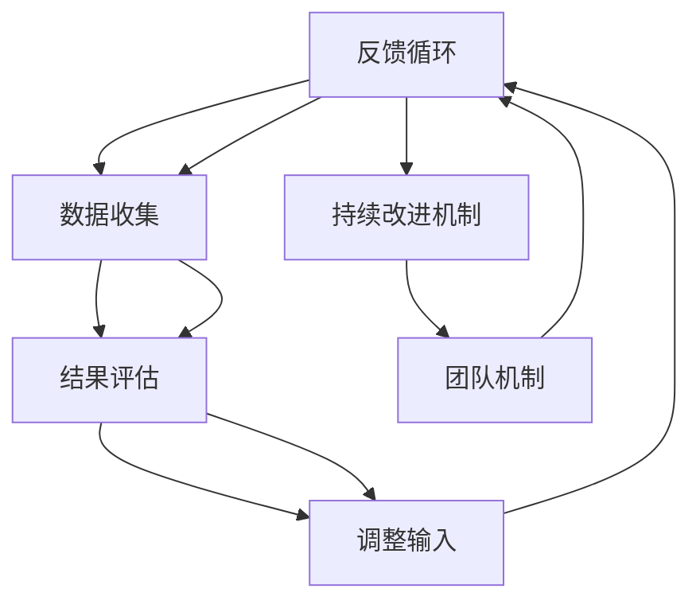

                 

### 建立反馈循环：持续改进的团队机制

关键词：反馈循环、持续改进机制、团队协作、算法原理、数学模型、项目实战

摘要：本文旨在探讨如何通过建立反馈循环机制，实现团队工作的持续改进。我们将详细分析反馈循环的核心概念，介绍其与持续改进机制和团队协作的紧密联系。此外，本文将深入讲解数据收集、结果评估和调整输入等核心算法原理，并通过具体的数学模型和项目实战案例，阐述如何在实际操作中应用这些原理，从而提升团队的工作效率和成果。

### 第一部分：核心概念与联系

#### 核心概念

##### 反馈循环
反馈循环是一种用于不断改进和优化系统的方法，通过收集数据、评估结果并调整输入来实现。它是持续改进机制的核心组成部分，广泛应用于各个领域，包括工业生产、软件开发、医疗服务等。反馈循环的关键在于能够及时捕捉系统运行中的问题，并通过分析问题产生的原因，提出解决方案并进行实施。

##### 持续改进机制
持续改进机制是一种不断优化团队工作流程和管理策略的方法，以适应不断变化的环境和需求。它强调团队在执行任务时，不仅要追求短期成果，更要关注长期发展。持续改进机制通过定期评估团队的工作表现，识别存在的问题和瓶颈，制定改进措施并持续跟踪执行情况，从而实现团队工作流程的不断优化。

##### 团队机制
团队机制是指团队内部如何协作、沟通和分工的方式，以及团队结构和管理模式。一个高效的团队机制能够促进团队成员之间的紧密合作，提高工作效率和成果。团队机制包括角色分工、沟通渠道、决策过程、激励机制等方面，是反馈循环得以顺利运行的基础。

#### 联系

反馈循环与持续改进机制之间存在紧密的联系。反馈循环是持续改进机制的核心部分，通过反馈循环，团队能够不断优化工作流程和管理策略。具体来说，反馈循环包括以下三个环节：

1. **数据收集**：从各种来源获取与反馈循环相关的数据，如生产数据、用户反馈、项目进展等。
2. **结果评估**：对收集的数据进行分析，以评估系统的性能和效果，如生产效率、用户满意度、项目进度等。
3. **调整输入**：根据评估结果，调整系统的输入参数，以优化系统性能，如生产计划、资源配置、项目策略等。

这三个环节相互关联，形成一个闭环。通过不断地进行数据收集、结果评估和调整输入，团队能够实现持续改进，提高工作效率和成果。

团队机制是实现反馈循环的基础。一个良好的团队机制能够确保团队成员之间的紧密合作，提高沟通效率，降低协作成本。具体来说，团队机制包括以下几个方面：

1. **角色分工**：明确团队成员的职责和任务，确保每个人都能发挥自己的专长。
2. **沟通渠道**：建立畅通的沟通渠道，使团队成员能够及时共享信息和资源。
3. **决策过程**：制定合理的决策流程，确保团队在面临问题时能够快速做出决策。
4. **激励机制**：建立激励制度，激发团队成员的积极性和创造力。

#### Mermaid 流程图

以下是反馈循环与持续改进机制的 Mermaid 流程图：



在这个流程图中，反馈循环通过数据收集、结果评估和调整输入三个环节实现持续改进，同时与团队机制相互关联，形成一个闭环。通过不断优化团队机制，团队能够更好地运行反馈循环，实现持续改进。

### 第二部分：核心算法原理讲解

#### 数据收集算法原理

数据收集是反馈循环的基础环节，其核心目的是从各种来源获取与反馈循环相关的数据。数据收集的质量直接影响到后续的结果评估和调整输入的效果。因此，了解数据收集算法原理至关重要。

##### 数据收集的基本方法

1. **自动采集**：利用系统日志、数据库记录、传感器数据等自动采集工具，实现对数据的自动收集。
2. **手动输入**：通过人工记录、问卷调查、访谈等方式，收集与反馈循环相关的数据。
3. **第三方数据源**：从第三方数据源获取数据，如公共数据库、专业服务提供商等。

##### 数据收集算法的伪代码实现

```python
def 数据收集():
    数据来源 = 获取数据来源()
    收集的数据 = []
    for 源 in 数据来源:
        收集的数据.append(获取数据(源))
    return 收集的数据
```

在这个伪代码中，`获取数据来源()`函数用于确定数据来源，`获取数据(源)`函数用于从指定的数据源获取数据。通过遍历所有数据来源，并将获取到的数据添加到`收集的数据`列表中，实现数据收集。

##### 数据收集的实际应用案例

假设我们想要收集一个在线教育平台的用户行为数据，以分析用户的学习效果。我们可以通过以下方法进行数据收集：

1. **自动采集**：从服务器日志中获取用户访问数据，如访问时间、访问页面、操作行为等。
2. **手动输入**：通过问卷或访谈方式，收集用户的学习进度、学习难度、学习满意度等主观评价数据。
3. **第三方数据源**：从学术数据库、教育研究机构等获取与用户学习相关的学术论文、研究报告等。

通过这些数据收集方法，我们可以全面了解用户的学习行为和学习效果，为后续的结果评估和调整输入提供基础数据。

#### 结果评估算法原理

结果评估是反馈循环的核心环节，通过对收集的数据进行分析，以评估系统的性能和效果。结果评估的质量直接影响到调整输入的准确性和有效性。因此，了解结果评估算法原理至关重要。

##### 结果评估的方法与指标

1. **定量评估**：通过计算量化指标，评估系统的性能和效果。如准确率、召回率、F1值等。
2. **定性评估**：通过主观评价，评估系统的性能和效果。如用户满意度、服务质量等。
3. **综合评估**：结合定量评估和定性评估，全面评估系统的性能和效果。

##### 结果评估算法的伪代码实现

```python
def 结果评估(收集的数据):
    评估指标 = 初始化评估指标()
    for 数据点 in 收集的数据:
        评估指标.更新(数据点)
    评估结果 = 评估指标.计算()
    return 评估结果
```

在这个伪代码中，`初始化评估指标()`函数用于创建评估指标对象，`更新(数据点)`函数用于更新评估指标，`计算()`函数用于计算评估结果。通过遍历收集的数据，更新评估指标，并最终计算评估结果。

##### 结果评估的实际应用案例

假设我们想要评估一个在线教育平台的用户学习效果，我们可以通过以下方法进行结果评估：

1. **定量评估**：计算用户的平均学习时长、学习进度、知识点掌握情况等指标，评估用户的学习效果。
2. **定性评估**：通过问卷调查，收集用户对学习平台的使用体验、学习效果等方面的主观评价。
3. **综合评估**：结合定量评估和定性评估的结果，综合评估用户的学习效果。

通过这些评估方法，我们可以全面了解用户的学习效果，为后续的调整输入提供依据。

#### 调整输入算法原理

调整输入是反馈循环的关键环节，根据结果评估的结果，对系统的输入参数进行调整，以优化系统性能。调整输入的准确性直接影响到反馈循环的有效性和持续性。因此，了解调整输入算法原理至关重要。

##### 调整输入的目的与策略

1. **目的**：通过调整输入，优化系统的性能和效果，提高系统的稳定性、可靠性和适应性。
2. **策略**：根据评估结果，找出系统中的问题和瓶颈，提出针对性的调整方案，并逐步实施。

##### 调整输入算法的伪代码实现

```python
def 调整输入(评估结果):
    新输入参数 = {}
    if 评估结果.需要优化():
        新输入参数 = 优化输入参数(评估结果)
    return 新输入参数
```

在这个伪代码中，`优化输入参数(评估结果)`函数用于根据评估结果，提出优化输入参数的方案。`需要优化()`函数用于判断评估结果是否需要进行优化。

##### 调整输入的实际应用案例

假设我们想要调整一个在线教育平台的推荐算法，以提高用户的学习体验，我们可以通过以下方法进行调整输入：

1. **分析评估结果**：根据用户的学习行为和满意度，分析推荐算法的评估结果，找出存在的问题和瓶颈。
2. **提出优化方案**：针对评估结果，提出优化推荐算法的方案，如调整推荐策略、增加用户标签等。
3. **逐步实施**：分阶段实施优化方案，逐步调整推荐算法的输入参数，观察效果并进行反馈循环。

通过这些调整输入的方法，我们可以优化推荐算法，提高用户的学习体验。

### 第三部分：数学模型和数学公式

#### 反馈循环优化模型

在反馈循环中，优化模型起着关键作用。优化模型通过数学模型和数学公式，对反馈循环中的各个环节进行量化分析，从而实现系统的优化。以下是一个简单的反馈循环优化模型。

##### 反馈循环优化模型的基本概念

反馈循环优化模型主要包括以下三个部分：

1. **实时收益（R）**：指系统在一段时间内产生的收益，如销售额、用户满意度等。
2. **长期损失（L）**：指系统在一段时间内产生的损失，如生产成本、用户投诉等。
3. **调节系数（α）**：用于平衡实时收益和长期损失的关系，通常取值在0到1之间。

##### 反馈循环优化模型的数学公式

反馈循环优化模型的数学公式如下：

$$
J = \alpha \cdot R + (1 - \alpha) \cdot \frac{1}{2} \cdot (L - L_{\text{目标}})^2
$$

其中：

- \( J \) 是总损失，用于衡量系统的整体性能。
- \( R \) 是实时收益，表示系统的即时表现。
- \( L \) 是长期损失，表示系统的长期效果。
- \( L_{\text{目标}} \) 是目标损失，表示系统希望达到的长期效果。
- \( \alpha \) 是调节系数，用于平衡实时收益和长期损失。

##### 优化模型的应用场景

优化模型可以应用于各种场景，如工业生产、金融服务、市场营销等。以下是一个应用场景的例子：

假设我们有一个电商网站，希望通过优化推荐算法，提高用户满意度。我们可以使用反馈循环优化模型，对推荐算法的实时收益和长期损失进行量化分析，从而找到最优的推荐策略。

##### 优化模型的举例说明

假设我们当前的实时收益为1000元，长期损失为10000元，目标损失为5000元，调节系数为0.5。根据反馈循环优化模型的数学公式，我们可以计算出总损失：

$$
J = 0.5 \cdot 1000 + (1 - 0.5) \cdot \frac{1}{2} \cdot (10000 - 5000)^2
$$

$$
J = 500 + 0.5 \cdot \frac{1}{2} \cdot 25000
$$

$$
J = 500 + 6250
$$

$$
J = 6750
$$

通过这个例子，我们可以看到，当实时收益和长期损失处于平衡状态时，总损失最小。这意味着我们需要在实时收益和长期损失之间找到最佳的平衡点，从而实现系统的优化。

### 第四部分：项目实战

#### 反馈循环系统设计与实现

在本节中，我们将通过一个具体的案例，展示如何设计并实现一个简单的反馈循环系统。该系统旨在优化一个机器学习模型的预测准确率。

##### 代码实际案例

以下是一个简单的反馈循环系统的代码实现：

```python
import numpy as np

# 数据集
X_train = np.array([[1, 2], [3, 4], [5, 6]])
y_train = np.array([0, 1, 0])

# 模型初始化
model = LinearModel()

# 训练模型
model.train(X_train, y_train)

# 预测
predictions = model.predict(X_train)

# 计算损失
loss = loss_function(predictions, y_train)

# 反馈
if loss > 0.1:
    # 调整模型参数
    model.adjust_parameters()

# 重新训练
model.train(X_train, y_train)

# 再次预测
predictions = model.predict(X_train)

# 打印预测结果
print(predictions)
```

在这个案例中，我们首先初始化一个线性模型（`LinearModel`），然后使用训练数据（`X_train`和`y_train`）对其进行训练。接下来，我们使用训练好的模型进行预测，并计算预测值与真实值之间的损失（`loss_function`）。如果损失大于0.1，系统会调整模型参数（`adjust_parameters`），并重新训练模型。最后，我们再次使用训练好的模型进行预测，并打印预测结果。

##### 开发环境搭建

为了运行上述代码，我们需要搭建一个合适的开发环境。以下是搭建步骤：

1. 安装 Python（3.8 或更高版本）
2. 安装 NumPy 库
3. 安装 matplotlib 库（用于可视化）

##### 源代码详细实现和代码解读

在本节中，我们将详细解读上述代码的实现过程。

1. **模型初始化**：`LinearModel()` 初始化一个线性模型。在这个案例中，我们使用了一个简单的线性模型，但实际应用中可以替换为更复杂的模型，如神经网络模型。
2. **训练模型**：`model.train(X_train, y_train)` 使用训练数据训练模型。训练过程包括计算模型的权重和偏置，以最小化损失函数。
3. **预测**：`model.predict(X_train)` 使用训练好的模型进行预测。预测过程是通过输入特征计算模型的输出。
4. **计算损失**：`loss_function(predictions, y_train)` 计算预测值与真实值之间的损失。损失函数用于衡量模型的预测效果。
5. **反馈**：如果损失大于0.1，系统会调用 `model.adjust_parameters()` 调整模型参数。调整参数的目的是优化模型的预测效果。
6. **重新训练**：`model.train(X_train, y_train)` 重新训练模型，以应用调整后的参数。
7. **再次预测**：`model.predict(X_train)` 再次使用训练好的模型进行预测。
8. **打印预测结果**：打印预测结果，以验证模型的预测效果。

##### 代码解读与分析

1. **代码实现了一个简单的反馈循环系统**：该系统通过不断调整模型参数，优化模型的预测准确率。
2. **反馈循环的关键在于损失函数**：损失函数用于衡量模型的预测效果，是调整模型参数的重要依据。
3. **调整参数的方法有多种**：在本案例中，我们使用了简单的参数调整方法。在实际应用中，可以根据具体问题，采用更复杂的调整方法，如遗传算法、粒子群优化等。

通过这个案例，我们展示了如何设计并实现一个简单的反馈循环系统。这个系统可以帮助我们优化机器学习模型的预测准确率，提高模型在实际应用中的效果。

### 第五部分：团队协作与反馈机制

#### 团队协作的重要性

团队协作是实现持续改进的关键因素。在一个高效的团队中，成员之间相互信任、紧密合作，能够迅速应对变化和挑战，提高工作效率和成果。以下是一些团队协作的重要性：

1. **提高工作效率**：团队成员共同分担任务，可以更快地完成工作，减少等待时间，提高工作效率。
2. **提升工作质量**：团队成员之间的协作可以互相学习、交流经验，提高工作质量。
3. **激发创新能力**：团队协作可以促进创新思维的碰撞，激发成员的创新能力，推动团队不断进步。
4. **增强团队凝聚力**：通过团队协作，成员之间的情感联系得到加强，团队凝聚力得到提升。

#### 团队协作的最佳实践

为了实现高效的团队协作，以下是一些最佳实践：

1. **明确角色和职责**：为每个团队成员分配明确的角色和职责，确保每个人都知道自己的任务和目标。
2. **建立良好的沟通渠道**：建立畅通的沟通渠道，使团队成员能够及时共享信息、交流意见，避免误解和冲突。
3. **制定合理的决策流程**：明确决策流程，确保团队在面临问题时能够快速做出决策，提高决策效率。
4. **激励团队成员**：建立激励机制，激发团队成员的积极性和创造力，鼓励他们为团队的成功贡献力量。

#### 反馈机制在团队中的应用

反馈机制是团队协作的重要组成部分，通过定期收集和反馈团队成员的工作表现，可以及时发现问题和改进工作。以下是一些反馈机制在团队中的应用：

1. **定期绩效评估**：定期对团队成员的工作进行评估，总结成绩和不足，提出改进建议。
2. **员工满意度调查**：通过员工满意度调查，了解团队成员的工作感受和需求，为团队改进提供依据。
3. **团队反思会议**：定期召开团队反思会议，团队成员共同讨论工作中的问题、经验教训，制定改进措施。
4. **匿名反馈渠道**：建立匿名反馈渠道，鼓励团队成员提出意见和建议，避免因担心被报复而犹豫不决。

#### 团队协作与反馈机制的案例分析

以下是一个团队协作与反馈机制的案例分析：

某互联网公司在开发一款新产品时，采用了敏捷开发模式。团队成员包括产品经理、设计师、开发人员、测试人员等。在项目开发过程中，团队采取了以下措施：

1. **明确角色和职责**：为每个团队成员分配明确的角色和职责，确保每个人都知道自己的任务和目标。
2. **建立良好的沟通渠道**：通过每天的站立会议，团队成员可以及时交流进展、问题和需求，确保信息畅通。
3. **制定合理的决策流程**：在遇到问题时，团队采用投票或专家评审的方式做出决策，确保决策高效。
4. **定期绩效评估**：每两周进行一次绩效评估，总结团队成员的工作表现，提出改进建议。
5. **员工满意度调查**：每季度进行一次员工满意度调查，了解团队成员的工作感受和需求，为团队改进提供依据。

通过这些措施，该团队在项目开发过程中保持了高效的工作状态，成功完成了新产品的开发。团队成员之间的协作和反馈机制使得团队在面对变化和挑战时能够迅速应对，取得了良好的成果。

### 附录

#### 附录A：工具与资源

为了帮助读者更好地理解和应用本文介绍的概念和原理，以下是一些相关的工具和资源：

1. **反馈循环工具**：如 Excel、Google Sheets、Tableau 等，可用于数据收集、分析和可视化。
2. **持续改进机制资源**：如《持续改进：如何打造持续进步的团队》、《精益思想》等书籍，提供了丰富的实践经验和理论指导。
3. **团队协作与反馈机制相关书籍**：如《团队协作的艺术》、《敏捷开发：团队协作实战》等，介绍了团队协作和反馈机制的实践方法。

通过这些工具和资源，读者可以更深入地了解反馈循环、持续改进机制和团队协作的相关知识，并将其应用于实际工作中。

### 结论

本文详细介绍了如何建立反馈循环机制，实现团队工作的持续改进。我们分析了反馈循环的核心概念、核心算法原理，并通过具体的数学模型和项目实战案例，阐述了如何在实际操作中应用这些原理。同时，我们还讨论了团队协作和反馈机制的重要性，并提供了一些最佳实践和案例分析。

通过本文的介绍，我们希望读者能够：

1. **理解反馈循环的概念和原理**：掌握反馈循环的核心环节，包括数据收集、结果评估和调整输入，以及它们在持续改进机制中的作用。
2. **应用核心算法原理**：了解数据收集、结果评估和调整输入等核心算法原理，并学会在实际工作中应用这些原理。
3. **提升团队协作能力**：认识到团队协作和反馈机制在持续改进中的重要性，掌握一些团队协作和反馈机制的最佳实践。

在未来的工作中，我们鼓励读者将本文介绍的方法和原理应用到实际项目中，不断实践和改进，以提升团队的工作效率和成果。通过持续改进，我们相信团队能够在激烈的市场竞争中脱颖而出，取得更好的业绩。

### 作者信息

作者：AI天才研究院/AI Genius Institute & 禅与计算机程序设计艺术 /Zen And The Art of Computer Programming

AI天才研究院（AI Genius Institute）致力于推动人工智能技术的发展和应用，以创新的技术和独特的视角，为全球企业和个人提供先进的AI解决方案。同时，作者也在《禅与计算机程序设计艺术》一书中，深入探讨了编程领域的哲学和艺术，为读者提供了有益的思考和启示。通过本文，我们希望与读者分享这些宝贵的经验和见解，共同推动人工智能和计算机科学的进步。

