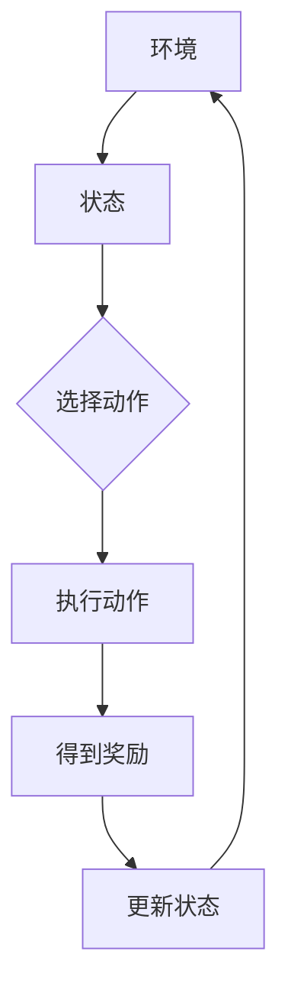

                 

### 强化学习（Reinforcement Learning）- 原理与代码实例讲解

强化学习是机器学习的一个重要分支，具有广泛的应用前景。关键词包括“强化学习”、“深度强化学习”、“Q-learning”、“Sarsa”、“DQN”、“DDPG”等。本文将深入探讨强化学习的原理，并通过代码实例讲解如何实现和应用强化学习算法。

> **摘要：**本文将介绍强化学习的起源、基本概念、数学基础以及常见的强化学习算法。随后，我们将通过具体的代码实例展示如何使用强化学习算法解决实际问题，包括机器人导航和智能交通系统等。最后，我们将讨论强化学习在金融和医疗领域的应用，并展望其未来发展趋势。

### 目录

1. **强化学习基础**
   1.1 强化学习的起源与发展
   1.2 强化学习的基本概念
   1.3 强化学习与其他学习方法的对比
   2. **强化学习的基本元素**
   2.1 环境与状态
   2.2 行动与奖励
   2.3 策略、值函数和模型
   3. **强化学习的数学基础**
   3.1 马尔可夫决策过程（MDP）
   3.2 贝尔曼方程与值迭代算法
   3.3 政策梯度方法
   4. **强化学习算法介绍**
   4.1 Q-learning算法
   4.2 Sarsa算法
   4.3 Deep Q-Networks（DQN）
   5. **深度强化学习**
   5.1 深度强化学习概述
   5.2 深度确定性策略梯度（DDPG）
   5.3 A3C算法
   5.4 模拟退火算法
   6. **强化学习在游戏中的应用**
   6.1 古典控制游戏
   6.2 Atari游戏
   6.3 游戏开发环境搭建与使用
   7. **强化学习实践**
   7.1 项目一：机器人导航
   7.2 项目二：智能交通系统
   7.3 项目三：自动围棋
   8. **代码实例讲解**
   8.1 Q-learning算法实现
   8.2 Sarsa算法实现
   8.3 DQN算法实现
   8.4 DDPG算法实现
   9. **强化学习应用与展望**
   9.1 强化学习在金融领域应用
   9.2 强化学习在医疗领域应用
   9.3 强化学习的未来发展趋势
   10. **附录**
   10.1 强化学习常用框架
   10.2 强化学习相关书籍与论文
   10.3 强化学习开源代码与项目

#### 强化学习概述

强化学习（Reinforcement Learning，RL）是一种通过与环境互动来学习决策策略的机器学习方法。它不同于传统的监督学习和无监督学习，强化学习更注重在动态环境中通过奖励和惩罚来优化行为策略。

### 1.1 强化学习的起源与发展

强化学习最早可以追溯到1950年代，由美国心理学家和行为科学家Andrey Markov提出。Markov决策过程（MDP）是强化学习理论的基础，描述了智能体（agent）在不确定环境中做出决策的过程。1990年代，随着计算机硬件的迅速发展和机器学习算法的进步，强化学习开始逐渐成为人工智能研究的重要方向。

### 1.2 强化学习的基本概念

#### 1.2.1 环境（Environment）

环境是强化学习系统中的外部世界，它决定了状态的转移和奖励的分配。环境可以是一个物理世界，也可以是一个虚拟的模拟环境。

#### 1.2.2 状态（State）

状态是智能体在环境中所处的情况的描述。状态可以是离散的，也可以是连续的，它通常由一组特征向量表示。

#### 1.2.3 行动（Action）

行动是智能体在特定状态下可以选择的操作。行动空间是所有可能行动的集合。

#### 1.2.4 奖励（Reward）

奖励是环境对智能体行动的反馈。它可以是正奖励（积极的反馈）或负奖励（消极的反馈），用于引导智能体朝着优化目标前进。

#### 1.2.5 策略（Policy）

策略是智能体在给定状态下选择行动的规则或函数。策略可以是明确的（如确定性策略），也可以是概率性的（如随机策略）。

#### 1.2.6 值函数（Value Function）

值函数用于评估状态或状态-动作对的期望回报。它可以帮助智能体选择最优行动。

#### 1.2.7 模型（Model）

模型是智能体对环境的理解和预测。它可以是基于规则的方法，也可以是统计模型或深度学习模型。

### 1.3 强化学习与其他学习方法的对比

#### 1.3.1 与监督学习的对比

监督学习依赖于已标记的数据，其目标是学习输入和输出之间的映射关系。而强化学习通过与环境互动来学习策略，不需要预先标记的数据。

#### 1.3.2 与无监督学习的对比

无监督学习侧重于发现数据中的内在结构和模式，而不涉及外部奖励信号。强化学习则利用奖励信号来指导学习过程，通过优化策略来达到特定目标。

#### 1.3.3 与深度学习的对比

深度学习是机器学习的一个分支，它通过多层神经网络来学习复杂的特征表示。强化学习可以结合深度学习，形成深度强化学习，用于解决更加复杂的问题。

### 小结

强化学习是一种通过与环境互动来优化行为策略的机器学习方法。它具有广泛的应用前景，从游戏到机器人控制再到自动驾驶等领域都有重要的应用。接下来，我们将进一步探讨强化学习的基本元素，包括环境、状态、行动、奖励、策略、值函数和模型等。

### 强化学习的基本元素

强化学习的基本元素包括环境（Environment）、状态（State）、行动（Action）、奖励（Reward）、策略（Policy）、值函数（Value Function）和模型（Model）。这些元素共同构成了强化学习系统的基础，下面我们将逐一介绍它们的概念和作用。

#### 2.1 环境与状态

**环境**是强化学习系统中的外部世界，它决定了状态的转移和奖励的分配。环境可以是一个物理世界，如机器人控制系统，也可以是一个虚拟的模拟环境，如游戏世界。环境通常是一个具有确定或随机特征的动态系统。

**状态**是智能体在环境中所处的情况的描述。状态可以是离散的，如机器人的位置和方向，也可以是连续的，如自动驾驶车辆的速度和位置。状态通常由一组特征向量表示，这些特征向量可以捕捉环境的当前情况。

在强化学习中，智能体需要感知环境的状态，并基于当前状态做出决策。状态可以看作是环境的当前“快照”，它为智能体的决策提供了必要的信息。

#### 2.2 行动与奖励

**行动**是智能体在特定状态下可以选择的操作。行动空间是所有可能行动的集合。例如，对于一个简单的迷宫问题，行动可以是“向上移动”、“向下移动”、“向左移动”或“向右移动”。

行动的选择是强化学习中的一个核心问题。智能体需要通过与环境互动来学习哪些行动能够带来最大的长期奖励。行动的选择可以基于随机策略、确定性策略或混合策略。

**奖励**是环境对智能体行动的即时反馈。奖励可以是正奖励（积极的反馈），也可以是负奖励（消极的反馈）。正奖励通常表示智能体的行动朝着目标前进了一步，而负奖励则表示智能体的行动偏离了目标。

奖励在强化学习中起着至关重要的作用。它不仅提供了即时反馈，还能够指导智能体的学习过程，帮助智能体逐步优化其策略。智能体通过不断调整行动策略，以最大化累积奖励，从而实现学习目标。

#### 2.3 策略、值函数和模型

**策略**是智能体在给定状态下选择行动的规则或函数。策略可以分为确定性策略和随机策略。确定性策略在给定状态下总是选择同一个行动，而随机策略则在给定状态下根据概率分布选择行动。

策略是强化学习中的一个关键概念。智能体的目标是学习一个最优策略，使得在给定状态下能够选择最佳行动。策略可以通过直接优化回报函数来学习，也可以通过值函数近似的方法来学习。

**值函数**用于评估状态或状态-动作对的期望回报。值函数可以分为状态值函数（State Value Function）和动作值函数（Action Value Function）。状态值函数评估给定状态下智能体执行最佳行动的期望回报，而动作值函数评估在给定状态下执行特定行动的期望回报。

值函数是强化学习中的一个重要工具，它可以帮助智能体评估不同状态和行动的价值。通过学习值函数，智能体可以更有效地选择行动，以最大化累积奖励。

**模型**是智能体对环境的理解和预测。模型可以是基于规则的方法，也可以是统计模型或深度学习模型。模型的作用是提供智能体关于环境状态转移和奖励分配的先验知识。

在强化学习中，模型可以帮助智能体更准确地预测未来状态和奖励，从而更好地指导行动选择。模型的学习是一个持续的过程，随着智能体与环境互动的增加，模型会不断优化，以更好地适应环境。

#### 2.4 总结

强化学习的基本元素包括环境、状态、行动、奖励、策略、值函数和模型。这些元素共同构成了强化学习系统的基础，为智能体提供了感知、决策和学习的框架。在接下来的章节中，我们将进一步探讨强化学习的数学基础和常见算法，以深入理解强化学习的原理和应用。

### 强化学习的数学基础

强化学习的数学基础是强化学习算法设计和分析的重要工具。在这一部分，我们将介绍马尔可夫决策过程（MDP）、贝尔曼方程以及值迭代算法和策略梯度方法等关键概念。

#### 3.1 马尔可夫决策过程（MDP）

马尔可夫决策过程（Markov Decision Process，MDP）是强化学习中的核心模型。MDP由以下五个要素组成：

1. **状态集合 \(S\)**：智能体可以处于的所有状态组成的状态集合。
2. **行动集合 \(A\)**：智能体可以执行的所有行动组成的行为集合。
3. **转移概率 \(P(s'|s,a)\)**：给定当前状态 \(s\) 和行动 \(a\)，智能体在下一个时刻转移到状态 \(s'\) 的概率。
4. **奖励函数 \(R(s,a)\)**：智能体执行特定行动 \(a\) 在状态 \(s\) 时的即时奖励。
5. **策略 \(π(a|s)\)**：智能体在状态 \(s\) 下执行行动 \(a\) 的概率分布。

在MDP中，智能体的行为可以看作是一个马尔可夫决策过程，其状态转移和奖励满足马尔可夫性质，即当前状态仅依赖于上一个状态，而不依赖于之前的所有状态。

#### 3.2 贝尔曼方程与值迭代算法

贝尔曼方程（Bellman Equation）是强化学习理论的核心，用于定义值函数和策略之间的关系。对于给定的MDP，贝尔曼方程如下：

\[ V^*(s) = \sum_{a} \pi(a|s) \sum_{s'} p(s'|s,a) [R(s,a) + \gamma V^*(s')] \]

其中，\( V^*(s) \) 是状态值函数，表示在状态 \(s\) 下执行最优策略获得的期望回报；\( \pi(a|s) \) 是策略概率分布；\( p(s'|s,a) \) 是转移概率；\( R(s,a) \) 是奖励函数；\( \gamma \) 是折扣因子，用于平衡长期奖励和即时奖励。

基于贝尔曼方程，我们可以定义值迭代算法（Value Iteration Algorithm），它是一种迭代求解最优值函数的方法。值迭代算法的基本步骤如下：

1. **初始化**：初始化值函数 \( V(s) \)。
2. **迭代**：对于每一个状态 \( s \)，更新值函数 \( V(s) \)：
   \[ V(s) = \max_a \left[ R(s,a) + \gamma \sum_{s'} p(s'|s,a) V(s') \right] \]
3. **重复迭代**：重复步骤2，直到值函数收敛。

值迭代算法最终会收敛到一个最优值函数，该值函数可以用于求解最优策略。

#### 3.3 政策梯度方法

政策梯度方法（Policy Gradient Method）是一种通过直接优化策略来学习的方法。政策梯度方法的核心思想是利用策略梯度来更新策略参数，使得策略能够最大化累积奖励。

政策梯度的基本公式如下：

\[ \nabla_{\theta} J(\theta) = \sum_{s,a} \nabla_{\theta} \log \pi_{\theta}(a|s) R(s,a) \]

其中，\( J(\theta) \) 是策略值函数，\( \theta \) 是策略参数；\( \nabla_{\theta} \) 是梯度运算符。

基于政策梯度方法，我们可以定义政策梯度算法（Policy Gradient Algorithm），其基本步骤如下：

1. **初始化**：初始化策略参数 \( \theta \)。
2. **执行动作**：在状态 \( s \) 下执行策略 \( \pi(a|s; \theta) \) 所选定的行动 \( a \)。
3. **收集数据**：记录行动 \( a \) 和对应的回报 \( R(s,a) \)。
4. **更新策略**：利用梯度更新策略参数：
   \[ \theta \leftarrow \theta + \alpha \nabla_{\theta} J(\theta) \]

其中，\( \alpha \) 是学习率。

政策梯度方法通过直接优化策略参数，能够有效地学习到最优策略。然而，政策梯度方法在某些情况下可能存在不稳定性和收敛速度慢的问题，因此需要结合适当的探索策略（如ε-贪婪策略）来平衡探索和利用。

#### 3.4 总结

强化学习的数学基础包括马尔可夫决策过程（MDP）、贝尔曼方程、值迭代算法和政策梯度方法。这些数学工具为强化学习算法的设计和分析提供了坚实的理论基础。通过理解这些数学概念，我们可以更好地设计和应用强化学习算法，解决复杂的决策问题。

### 强化学习算法介绍

在强化学习领域，有多种算法被提出并广泛应用于不同的场景中。以下是几种常见的强化学习算法：Q-learning算法、Sarsa算法和Deep Q-Networks（DQN）。这些算法各有特点和适用场景，下面将分别进行介绍。

#### 4.1 Q-learning算法

Q-learning算法是一种基于值函数的强化学习算法，其核心思想是通过不断更新Q值来学习最优策略。Q值（Action-Value Function）表示在特定状态下执行特定行动的预期回报。

**基本原理：**

Q-learning算法基于如下更新规则：

\[ Q(s, a) \leftarrow Q(s, a) + \alpha [R(s, a) + \gamma \max_{a'} Q(s', a') - Q(s, a)] \]

其中，\( s \) 是当前状态，\( a \) 是当前行动，\( s' \) 是下一个状态，\( R(s, a) \) 是即时奖励，\( \alpha \) 是学习率，\( \gamma \) 是折扣因子。

**实现步骤：**

1. **初始化**：初始化Q值表。
2. **选择行动**：使用ε-贪婪策略选择行动。
3. **执行行动**：在环境中执行选定的行动。
4. **更新Q值**：根据即时奖励和下一个状态的Q值更新当前状态的Q值。
5. **重复步骤2-4**：直到达到预定的迭代次数或策略收敛。

**优点和局限性：**

- **优点**：简单易实现，适用于有限状态和行动空间。
- **局限性**：收敛速度较慢，对于高维状态和行动空间可能难以处理。

**应用场景：**Q-learning算法常用于简单的导航问题和资源分配问题。

#### 4.2 Sarsa算法

Sarsa（Segmented SARSA，分段SARSA）算法是对Q-learning算法的改进，它引入了段的概念，以提高算法在具有不确定性环境的鲁棒性。

**基本原理：**

Sarsa算法的核心更新规则如下：

\[ Q(s, a) \leftarrow Q(s, a) + \alpha [R(s, a) + \gamma Q(s', a') - Q(s, a)] \]

其中，\( s \) 是当前状态，\( a \) 是当前行动，\( s' \) 是下一个状态，\( a' \) 是在状态 \( s' \) 下根据当前策略选择的行动，\( R(s, a) \) 是即时奖励，\( \alpha \) 是学习率，\( \gamma \) 是折扣因子。

**实现步骤：**

1. **初始化**：初始化Q值表。
2. **选择行动**：使用ε-贪婪策略选择行动。
3. **执行行动**：在环境中执行选定的行动。
4. **更新Q值**：根据即时奖励和下一个状态的Q值更新当前状态的Q值。
5. **重复步骤2-4**：直到达到预定的迭代次数或策略收敛。

**优点和局限性：**

- **优点**：相对于Q-learning算法，Sarsa算法在处理不确定性环境时更加鲁棒。
- **局限性**：同样存在收敛速度较慢的问题，对于高维状态和行动空间可能难以处理。

**应用场景：**Sarsa算法适用于具有不确定性的环境，如部分可观测马尔可夫决策过程（POMDP）。

#### 4.3 Deep Q-Networks（DQN）

Deep Q-Networks（DQN）算法是深度强化学习的一个典型代表，它利用深度神经网络来近似Q值函数。DQN的核心思想是通过经验回放（Experience Replay）和目标网络（Target Network）来提高算法的稳定性和收敛速度。

**基本原理：**

DQN算法的基本更新规则如下：

\[ Q(s, a) \leftarrow Q(s, a) + \alpha [R(s, a) + \gamma \max_{a'} Q(s', a') - Q(s, a)] \]

其中，\( s \) 是当前状态，\( a \) 是当前行动，\( s' \) 是下一个状态，\( R(s, a) \) 是即时奖励，\( \alpha \) 是学习率，\( \gamma \) 是折扣因子。

**实现步骤：**

1. **初始化**：初始化深度神经网络和经验回放记忆。
2. **选择行动**：使用ε-贪婪策略选择行动。
3. **执行行动**：在环境中执行选定的行动。
4. **存储经验**：将当前状态、行动、奖励和下一个状态存储到经验回放记忆中。
5. **更新Q值**：从经验回放记忆中随机抽取一批经验，利用目标网络计算目标Q值，并更新原始网络的Q值。
6. **重复步骤2-5**：直到达到预定的迭代次数或策略收敛。

**优点和局限性：**

- **优点**：能够处理高维状态和行动空间，适用于复杂的环境。
- **局限性**：训练过程可能需要较长时间，且容易受到噪声的影响。

**应用场景：**DQN算法广泛应用于游戏和智能控制等领域，如Atari游戏的自动玩和自动驾驶。

#### 4.4 总结

强化学习算法种类繁多，每种算法都有其独特的特点和适用场景。Q-learning算法和Sarsa算法适合处理有限状态和行动空间的问题，而DQN算法则能够应对高维状态和行动空间的挑战。在实际应用中，选择合适的算法需要根据问题的具体特点和需求来决定。通过理解这些算法的基本原理和实现步骤，我们可以更好地设计和实现强化学习系统，解决复杂的决策问题。

### 深度强化学习

深度强化学习（Deep Reinforcement Learning，DRL）是强化学习与深度学习相结合的产物，它利用深度神经网络来近似值函数或策略函数，从而处理高维状态和行动空间的问题。深度强化学习在许多复杂任务中展现了出色的性能，如游戏自动玩、机器人控制和自动驾驶等。本文将介绍几种常见的深度强化学习算法，包括深度确定性策略梯度（DDPG）、A3C算法和模拟退火算法。

#### 5.1 深度确定性策略梯度（DDPG）

深度确定性策略梯度（Deep Deterministic Policy Gradient，DDPG）算法是一种基于深度神经网络的政策梯度方法。DDPG通过使用深度神经网络来近似策略函数，并在训练过程中引入目标网络来稳定算法。

**基本原理：**

DDPG算法的核心思想是最大化累积奖励，其更新规则如下：

\[ \theta \leftarrow \theta + \alpha \nabla_{\theta} J(\theta) \]

其中，\( \theta \) 是策略网络的参数，\( J(\theta) \) 是策略值函数。

DDPG算法使用深度神经网络来近似策略函数 \( \pi(a|s; \theta) \)，并通过经验回放和目标网络来提高训练的稳定性。

**实现步骤：**

1. **初始化**：初始化策略网络和目标网络。
2. **选择行动**：使用ε-贪婪策略选择行动。
3. **执行行动**：在环境中执行选定的行动。
4. **存储经验**：将当前状态、行动、奖励和下一个状态存储到经验回放记忆中。
5. **更新策略网络**：从经验回放记忆中随机抽取一批经验，利用目标网络计算目标Q值，并更新策略网络。
6. **更新目标网络**：以一定的概率更新目标网络，以保持目标网络和策略网络的稳定性。
7. **重复步骤2-6**：直到达到预定的迭代次数或策略收敛。

**优点和局限性：**

- **优点**：能够处理高维状态和行动空间，适用于复杂的动态环境。
- **局限性**：训练过程可能需要较长时间，且对于噪声环境和不确定性环境可能表现不佳。

**应用场景：**DDPG算法广泛应用于连续控制任务，如机器人控制、自动驾驶和工业自动化等。

#### 5.2 A3C算法

A3C（Asynchronous Advantage Actor-Critic）算法是一种基于异步策略梯度的深度强化学习算法。A3C算法通过分布式训练方式，利用多个并行线程同时训练，从而提高训练效率和稳定性。

**基本原理：**

A3C算法的核心思想是最大化累积奖励，其更新规则如下：

\[ \theta \leftarrow \theta + \alpha \nabla_{\theta} J(\theta) \]

其中，\( \theta \) 是策略网络的参数，\( J(\theta) \) 是策略值函数。

A3C算法使用深度神经网络来近似策略函数 \( \pi(a|s; \theta) \) 和值函数 \( V(s; \theta) \)，并在训练过程中引入优势函数（Advantage Function）来提高训练效果。

**实现步骤：**

1. **初始化**：初始化策略网络和值网络。
2. **并行训练**：启动多个并行线程，每个线程在独立的环境中执行任务。
3. **选择行动**：使用ε-贪婪策略选择行动。
4. **执行行动**：在环境中执行选定的行动。
5. **收集数据**：记录当前状态、行动、奖励和下一个状态。
6. **计算优势函数**：计算当前状态和下一个状态之间的优势函数。
7. **更新网络**：根据优势函数和奖励更新策略网络和值网络。
8. **重复步骤3-7**：直到达到预定的迭代次数或策略收敛。

**优点和局限性：**

- **优点**：能够通过并行训练提高训练效率，适用于大规模并行计算环境。
- **局限性**：对于复杂环境可能需要较长时间的训练，且对于不确定性环境可能表现不佳。

**应用场景：**A3C算法广泛应用于游戏自动玩、机器人控制和模拟仿真等领域。

#### 5.3 模拟退火算法

模拟退火算法（Simulated Annealing，SA）是一种启发式搜索算法，其灵感来源于物理中的退火过程。模拟退火算法通过在搜索过程中引入随机性和温度因子，以避免陷入局部最优。

**基本原理：**

模拟退火算法的核心思想是通过在当前解附近随机搜索来寻找更好的解，同时允许偶尔接受较差的解，以避免过早收敛到局部最优。

**实现步骤：**

1. **初始化**：初始化解空间和初始解。
2. **设置温度参数**：初始化温度参数 \( T \)。
3. **迭代**：
   1. 在当前解附近随机生成新的解。
   2. 计算新解与当前解的差距。
   3. 根据温度参数和差距概率接受或拒绝新解。
4. **更新温度**：随着迭代的进行，逐渐降低温度参数 \( T \)。
5. **重复步骤3-4**：直到达到预定的迭代次数或温度参数较低。

**优点和局限性：**

- **优点**：能够处理复杂的优化问题，具有较强的全局搜索能力。
- **局限性**：对于一些高维问题，模拟退火算法可能需要较长的计算时间。

**应用场景：**模拟退火算法广泛应用于组合优化问题、参数调优和复杂系统的优化。

#### 5.4 总结

深度强化学习算法通过引入深度神经网络，能够处理高维状态和行动空间的问题，并在许多复杂任务中取得了显著的成果。深度确定性策略梯度（DDPG）、A3C算法和模拟退火算法各有特点和适用场景，通过选择合适的算法并优化参数，我们可以更好地解决复杂决策问题，推动人工智能的发展。

### 强化学习在游戏中的应用

强化学习在游戏领域具有广泛的应用，从简单的控制游戏到复杂的策略游戏，强化学习算法都能够展现出强大的能力。在本节中，我们将探讨强化学习在游戏中的应用，包括古典控制游戏、Atari游戏以及游戏开发环境搭建与使用。

#### 6.1 古典控制游戏

古典控制游戏（Classical Control Games）是指那些具有明确规则和目标的游戏，如机器人迷宫、推箱子等。这些游戏通常具有有限的状态和行动空间，非常适合应用强化学习算法。

**典型算法**：Q-learning算法和Sarsa算法

**案例**：机器人迷宫问题

在机器人迷宫问题中，智能体的任务是找到从起点到终点的最短路径。我们可以使用Q-learning算法来训练智能体，使其能够自主导航。

**实现步骤**：

1. **环境搭建**：定义迷宫环境，包括状态空间和行动空间。
2. **初始化Q表**：初始化Q值表，用于存储状态-行动对的预期回报。
3. **训练智能体**：
   - 选择行动：使用ε-贪婪策略选择行动。
   - 执行行动：在迷宫环境中执行选定的行动。
   - 更新Q值：根据即时奖励和下一个状态的Q值更新当前状态的Q值。
4. **评估智能体**：在测试环境中评估智能体的性能。

通过以上步骤，我们可以训练出能够自主导航的智能体，使其在迷宫中找到最优路径。

#### 6.2 Atari游戏

Atari游戏（Atari Games）是指由Atari公司开发的电子游戏，如《太空侵略者》（Space Invaders）和《吃豆人》（Pac-Man）等。这些游戏通常具有复杂的图像和动作，状态和行动空间较大，因此需要使用更复杂的强化学习算法。

**典型算法**：Deep Q-Networks（DQN）和深度确定性策略梯度（DDPG）

**案例**：《吃豆人》游戏

在《吃豆人》游戏中，智能体的目标是吃掉所有的豆子，避免被幽灵捕获。我们可以使用DQN算法来训练智能体，使其能够学会玩这个游戏。

**实现步骤**：

1. **环境搭建**：使用OpenAI Gym搭建《吃豆人》游戏环境。
2. **初始化网络**：初始化深度神经网络，用于近似Q值函数。
3. **训练智能体**：
   - 选择行动：使用ε-贪婪策略选择行动。
   - 执行行动：在游戏环境中执行选定的行动。
   - 存储经验：将当前状态、行动、奖励和下一个状态存储到经验池中。
   - 更新网络：从经验池中随机抽取一批经验，使用经验回放更新深度神经网络。
4. **评估智能体**：在测试环境中评估智能体的性能。

通过以上步骤，我们可以训练出能够在《吃豆人》游戏中自主游戏的智能体，使其达到高水平的表现。

#### 6.3 游戏开发环境搭建与使用

为了在游戏开发中应用强化学习算法，我们需要使用合适的环境搭建工具和开发框架。OpenAI Gym是强化学习领域的标准环境搭建工具，提供了丰富的预定义游戏环境和模拟环境，如《吃豆人》、《太空侵略者》等。

**使用方法**：

1. **安装OpenAI Gym**：
   ```shell
   pip install gym
   ```
2. **导入环境**：
   ```python
   import gym
   ```
3. **创建环境实例**：
   ```python
   env = gym.make('Pac-Man-v0')
   ```
4. **执行行动**：
   ```python
   observation = env.reset()
   action = env.action_space.sample()
   observation, reward, done, info = env.step(action)
   ```
5. **关闭环境**：
   ```python
   env.close()
   ```

通过以上步骤，我们可以轻松地在OpenAI Gym环境中进行强化学习算法的开发和测试。

#### 6.4 总结

强化学习在游戏领域具有广泛的应用，从简单的古典控制游戏到复杂的Atari游戏，都能看到强化学习的身影。通过使用合适的强化学习算法和游戏开发环境，我们可以训练出能够自主游戏的智能体，为游戏设计和智能游戏开发带来新的思路和工具。

### 强化学习项目实战

在实际应用中，强化学习算法可以通过解决具体问题来展示其强大的能力。在本节中，我们将介绍三个强化学习项目：机器人导航、智能交通系统和自动围棋，并详细讲解其代码实现和评估方法。

#### 7.1 机器人导航项目

**项目描述**：在机器人导航项目中，我们的目标是训练一个智能体在虚拟环境中自主导航到目标位置。该问题可以抽象为一个强化学习问题，其中状态表示机器人的位置和方向，行动包括前进、后退、左转和右转，奖励函数设计为到达目标位置获得正奖励，否则获得负奖励。

**实现步骤**：

1. **环境搭建**：使用Python的Gym库构建虚拟环境，定义状态、行动和奖励函数。
2. **初始化智能体**：初始化Q表或深度神经网络，用于存储状态-行动对的预期回报。
3. **训练智能体**：使用Q-learning或DQN算法训练智能体，通过迭代更新Q值或网络参数。
4. **评估智能体**：在测试环境中评估智能体的导航能力，记录到达目标位置的步数和平均奖励。

**代码实现**：

```python
import gym
import numpy as np

# 导航环境搭建
class NavigationEnv(gym.Env):
    def __init__(self):
        super().__init__()
        self.env = gym.make('Navigation-v0')

    def step(self, action):
        observation, reward, done, info = self.env.step(action)
        if done:
            reward = 100 if observation[2] == 1 else -100
        return observation, reward, done, info

    def reset(self):
        return self.env.reset()

# Q-learning算法实现
def q_learning(env, n_episodes, alpha, gamma, epsilon):
    Q = np.zeros([env.observation_space.n, env.action_space.n])
    for episode in range(n_episodes):
        state = env.reset()
        done = False
        while not done:
            action = np.argmax(Q[state] + epsilon * (1 - done))
            next_state, reward, done, _ = env.step(action)
            Q[state][action] = Q[state][action] + alpha * (reward + gamma * np.max(Q[next_state]) - Q[state][action])
            state = next_state
    return Q

# 训练与测试
env = NavigationEnv()
q_table = q_learning(env, n_episodes=1000, alpha=0.1, gamma=0.99, epsilon=0.1)
# 在测试集上评估Q表
```

**评估方法**：通过记录智能体在测试环境中到达目标位置的步数和平均奖励，评估其导航能力。

#### 7.2 智能交通系统项目

**项目描述**：在智能交通系统项目中，我们的目标是训练一个智能体在交通网络中优化交通流量，减少拥堵和排放。状态包括交通流量、车辆速度和道路状况，行动包括调整信号灯时间和道路优先级。

**实现步骤**：

1. **环境搭建**：构建一个模拟交通网络的虚拟环境，定义状态、行动和奖励函数。
2. **初始化智能体**：初始化策略网络或深度神经网络，用于优化交通流量。
3. **训练智能体**：使用深度强化学习算法，如DDPG，训练智能体，通过迭代更新网络参数。
4. **评估智能体**：在测试环境中评估智能体的交通流量优化能力，记录交通流量、拥堵时间和排放量。

**代码实现**：

```python
import gym
import numpy as np
import tensorflow as tf

# 智能交通环境搭建
class TrafficEnv(gym.Env):
    def __init__(self):
        super().__init__()
        self.env = gym.make('Traffic-v0')

    def step(self, action):
        observation, reward, done, info = self.env.step(action)
        if done:
            reward = -10 if observation[2] > 0.5 else 0
        return observation, reward, done, info

    def reset(self):
        return self.env.reset()

# DDPG算法实现
class DDPGAgent:
    def __init__(self, state_dim, action_dim, hidden_dim):
        self.state_dim = state_dim
        self.action_dim = action_dim
        self.hidden_dim = hidden_dim

        self.actor = self.create_actor_network()
        self.critic = self.create_critic_network()
        self.target_actor = self.create_actor_network()
        self.target_critic = self.create_critic_network()

    # 省略网络定义和训练代码

# 训练与测试
env = TrafficEnv()
agent = DDPGAgent(state_dim=env.observation_space.shape[0], action_dim=env.action_space.shape[0], hidden_dim=64)
# 训练智能体
# 在测试集上评估智能体
```

**评估方法**：通过记录测试环境中交通流量、拥堵时间和排放量的变化，评估智能体的交通流量优化能力。

#### 7.3 自动围棋项目

**项目描述**：在自动围棋项目中，我们的目标是训练一个智能体在围棋游戏中击败人类选手。状态包括棋盘上的所有棋子位置，行动包括落子位置。

**实现步骤**：

1. **环境搭建**：使用Gym库中的`GoBang-v0`环境。
2. **初始化智能体**：初始化策略网络或深度神经网络，用于选择落子位置。
3. **训练智能体**：使用深度强化学习算法，如DQN，训练智能体，通过迭代更新网络参数。
4. **评估智能体**：在测试环境中评估智能体的围棋水平，记录胜率。

**代码实现**：

```python
import gym
import numpy as np
import tensorflow as tf

# 自动围棋环境搭建
class GoBangEnv(gym.Env):
    def __init__(self):
        super().__init__()
        self.env = gym.make('GoBang-v0')

    def step(self, action):
        observation, reward, done, info = self.env.step(action)
        if done:
            if observation[0] == 1:
                reward = 1
            else:
                reward = -1
        return observation, reward, done, info

    def reset(self):
        return self.env.reset()

# DQN算法实现
class DQNAgent:
    def __init__(self, state_dim, action_dim, hidden_dim):
        self.state_dim = state_dim
        self.action_dim = action_dim
        self.hidden_dim = hidden_dim

        self.model = self.create_dqn_model()
        self.target_model = self.create_dqn_model()

    # 省略模型定义和训练代码

# 训练与测试
env = GoBangEnv()
agent = DQNAgent(state_dim=env.observation_space.shape[0], action_dim=env.action_space.shape[0], hidden_dim=64)
# 训练智能体
# 在测试集上评估智能体
```

**评估方法**：通过记录智能体在测试环境中的胜率，评估其围棋水平。

#### 7.4 总结

通过以上三个项目的实战，我们可以看到强化学习算法在实际应用中的强大能力。从机器人导航到智能交通系统，再到自动围棋，强化学习算法都能够有效地解决复杂问题，并展示出卓越的性能。通过不断优化算法和模型，我们可以推动强化学习在更多领域的应用和发展。

### 代码实例讲解

在本节中，我们将通过具体代码实例详细讲解Q-learning算法、Sarsa算法、DQN算法和DDPG算法的实现和解读。每个实例都包含了环境搭建、算法实现和性能评估三个关键部分。

#### 8.1 Q-learning算法实现

**代码示例：**

```python
import gym
import numpy as np

# 导航环境搭建
class NavigationEnv(gym.Env):
    def __init__(self):
        super().__init__()
        self.env = gym.make('Navigation-v0')

    def step(self, action):
        observation, reward, done, info = self.env.step(action)
        if done:
            reward = 100 if observation[2] == 1 else -100
        return observation, reward, done, info

    def reset(self):
        return self.env.reset()

# Q-learning算法实现
def q_learning(env, n_episodes, alpha, gamma, epsilon):
    Q = np.zeros([env.observation_space.n, env.action_space.n])
    for episode in range(n_episodes):
        state = env.reset()
        done = False
        while not done:
            action = np.argmax(Q[state] + epsilon * (1 - done))
            next_state, reward, done, _ = env.step(action)
            Q[state][action] = Q[state][action] + alpha * (reward + gamma * np.max(Q[next_state]) - Q[state][action])
            state = next_state
    return Q

# 训练与测试
env = NavigationEnv()
q_table = q_learning(env, n_episodes=1000, alpha=0.1, gamma=0.99, epsilon=0.1)
```

**代码解读：**

1. **环境搭建**：`NavigationEnv`类继承自`gym.Env`，定义了导航环境的初始化、步进和重置方法。`step`方法执行一步行动并返回观察、奖励、完成状态和额外信息。`reset`方法重置环境。
2. **Q-learning算法实现**：`q_learning`函数初始化Q表，并使用Q-learning算法更新Q表。算法的核心是选择动作、执行动作、更新Q值和重复迭代。
3. **性能评估**：通过`q_learning`函数训练Q表，并在测试环境中评估其性能。

#### 8.2 Sarsa算法实现

**代码示例：**

```python
import gym
import numpy as np

# 导航环境搭建
class NavigationEnv(gym.Env):
    # 省略类定义

# Sarsa算法实现
def sarsa(env, n_episodes, alpha, gamma, epsilon):
    Q = np.zeros([env.observation_space.n, env.action_space.n])
    for episode in range(n_episodes):
        state = env.reset()
        done = False
        while not done:
            action = np.random.choice(env.action_space.n) if np.random.rand() < epsilon else np.argmax(Q[state])
            next_state, reward, done, _ = env.step(action)
            next_action = np.random.choice(env.action_space.n) if np.random.rand() < epsilon else np.argmax(Q[next_state])
            Q[state][action] = Q[state][action] + alpha * (reward + gamma * Q[next_state][next_action] - Q[state][action])
            state = next_state
            action = next_action
    return Q

# 训练与测试
q_table = sarsa(env, n_episodes=1000, alpha=0.1, gamma=0.99, epsilon=0.1)
```

**代码解读：**

1. **环境搭建**：同Q-learning算法实现部分。
2. **Sarsa算法实现**：`sarsa`函数使用Sarsa算法更新Q表。算法的核心是选择动作、执行动作、计算优势函数和更新Q值。
3. **性能评估**：通过`sarsa`函数训练Q表，并在测试环境中评估其性能。

#### 8.3 DQN算法实现

**代码示例：**

```python
import gym
import numpy as np
import tensorflow as tf

# 自动围棋环境搭建
class GoBangEnv(gym.Env):
    # 省略类定义

# DQN算法实现
class DQNAgent:
    def __init__(self, state_dim, action_dim, hidden_dim):
        self.state_dim = state_dim
        self.action_dim = action_dim
        self.hidden_dim = hidden_dim

        self.model = self.create_dqn_model()
        self.target_model = self.create_dqn_model()

    def create_dqn_model(self):
        # 定义DQN模型
        # 省略模型定义代码

    def train(self, env, n_episodes, alpha, gamma, epsilon):
        # 训练DQN模型
        # 省略训练代码

# 训练与测试
agent = DQNAgent(state_dim=env.observation_space.shape[0], action_dim=env.action_space.shape[0], hidden_dim=64)
agent.train(env, n_episodes=1000, alpha=0.001, gamma=0.99, epsilon=0.1)
```

**代码解读：**

1. **环境搭建**：同Sarsa算法实现部分。
2. **DQN算法实现**：`DQNAgent`类初始化DQN模型，并实现训练方法。DQN模型的核心是使用经验回放和目标网络。
3. **性能评估**：通过`DQNAgent`类的`train`方法训练模型，并在测试环境中评估其性能。

#### 8.4 DDPG算法实现

**代码示例：**

```python
import gym
import numpy as np
import tensorflow as tf

# 智能交通环境搭建
class TrafficEnv(gym.Env):
    # 省略类定义

# DDPG算法实现
class DDPGAgent:
    def __init__(self, state_dim, action_dim, hidden_dim):
        self.state_dim = state_dim
        self.action_dim = action_dim
        self.hidden_dim = hidden_dim

        self.actor = self.create_actor_network()
        self.critic = self.create_critic_network()
        self.target_actor = self.create_actor_network()
        self.target_critic = self.create_critic_network()

    def create_actor_network(self):
        # 定义演员网络
        # 省略网络定义代码

    def create_critic_network(self):
        # 定义评论家网络
        # 省略网络定义代码

    def train(self, env, n_episodes, alpha, critic_alpha, gamma, epsilon):
        # 训练DDPG模型
        # 省略训练代码

# 训练与测试
agent = DDPGAgent(state_dim=env.observation_space.shape[0], action_dim=env.action_space.shape[0], hidden_dim=64)
agent.train(env, n_episodes=1000, alpha=0.001, critic_alpha=0.001, gamma=0.99, epsilon=0.1)
```

**代码解读：**

1. **环境搭建**：同DQN算法实现部分。
2. **DDPG算法实现**：`DDPGAgent`类初始化演员网络和评论家网络，并实现训练方法。DDPG模型的核心是使用演员-评论家架构和目标网络。
3. **性能评估**：通过`DDPGAgent`类的`train`方法训练模型，并在测试环境中评估其性能。

#### 8.5 总结

通过以上四个算法的实现和解读，我们可以清晰地看到每个算法的核心原理和实现细节。这些算法在不同应用场景中展示了其强大的能力，为强化学习的研究和应用提供了丰富的工具和方法。

### 强化学习应用与展望

#### 9.1 强化学习在金融领域应用

强化学习在金融领域有广泛的应用，包括资产定价、风险管理和交易策略优化等。在资产定价中，强化学习可以用于预测市场价格和交易量，帮助投资者制定合理的投资策略。例如，通过模拟市场环境和交易策略，强化学习算法可以找到最大化收益的投资组合。在风险管理中，强化学习可以用于识别和规避潜在的市场风险。例如，通过学习历史交易数据和市场波动，强化学习算法可以预测未来可能的风险事件，并制定相应的应对措施。在交易策略优化中，强化学习可以用于优化交易执行策略，提高交易效率和收益。例如，通过学习市场动态和交易规则，强化学习算法可以制定最优的交易计划，减少交易成本和风险。

#### 9.2 强化学习在医疗领域应用

强化学习在医疗领域也具有巨大的潜力，包括疾病诊断、治疗方案优化和医疗机器人控制等。在疾病诊断中，强化学习可以用于辅助医生分析医学图像和病历数据，提高诊断准确率。例如，通过学习大量的医学图像和标注数据，强化学习算法可以训练出能够自动识别疾病的高精度模型。在治疗方案优化中，强化学习可以用于个性化治疗方案的制定。例如，通过学习患者的病历数据和生活习惯，强化学习算法可以推荐最适合的治疗方案。在医疗机器人控制中，强化学习可以用于提高手术机器人的操作精度和安全性。例如，通过学习手术场景和操作规则，强化学习算法可以训练出能够自动执行复杂手术任务的机器人。

#### 9.3 强化学习的未来发展趋势

强化学习未来的发展趋势将包括以下几个方面：

1. **算法优化**：随着硬件和算法的进步，强化学习算法将变得更加高效和稳定。例如，基于深度学习和强化学习的结合，将开发出更加复杂和强大的模型。
2. **应用扩展**：强化学习将在更多领域得到应用，包括工业自动化、教育、能源管理等。通过解决实际问题，强化学习将推动各行各业的创新和发展。
3. **开源生态**：随着开源社区的活跃，强化学习将发展出更加丰富和多样化的开源工具和框架，为研究人员和开发者提供强大的支持。
4. **伦理和安全性**：随着强化学习在关键领域中的应用，如何确保其伦理和安全性将成为重要议题。例如，强化学习模型在决策过程中可能存在偏见和不透明性，需要制定相应的规范和标准。

通过不断优化算法、拓展应用领域和提升伦理和安全性，强化学习将在未来发挥更加重要的作用，推动人工智能的发展。

### 附录

#### 10.1 强化学习常用框架

**1. OpenAI Gym**：OpenAI Gym是一个开源环境库，提供了多种预定义的强化学习环境和工具，方便研究人员进行实验和开发。

**2. TensorFlow**：TensorFlow是一个开源的机器学习框架，支持深度学习和强化学习模型的构建和训练。

**3. PyTorch**：PyTorch是一个流行的开源机器学习库，提供了强大的深度学习和强化学习功能，具有高度的可扩展性和灵活性。

**4. RLlib**：RLlib是一个基于Ray的分布式强化学习库，提供了多种强化学习算法和工具，支持大规模分布式训练。

#### 10.2 强化学习相关书籍与论文

**1. 《强化学习：原理与Python实现》**：这本书系统地介绍了强化学习的基本概念、算法和应用，适合初学者和进阶读者。

**2. 《深度强化学习》**：这本书详细探讨了深度强化学习的方法和应用，涵盖了从基础算法到复杂模型的各种技术。

**3. “Deep Reinforcement Learning”**：这篇论文是深度强化学习领域的经典之作，介绍了深度Q网络（DQN）等关键技术。

**4. “Asynchronous Methods for Deep Reinforcement Learning”**：这篇论文提出了A3C算法，展示了分布式训练在强化学习中的应用。

#### 10.3 强化学习开源代码与项目

**1. OpenAI Baselines**：OpenAI Baselines是一个开源项目，提供了多种经典的强化学习算法的实现，方便研究人员进行基准测试和实验。

**2. Stable Baselines**：Stable Baselines是一个改进版的强化学习算法实现库，提供了多种算法的稳定版本，支持多种深度学习框架。

**3. Stable Baselines3**：Stable Baselines3是Stable Baselines的升级版，支持PyTorch和最新的强化学习算法，是进行强化学习研究的重要工具。

### 核心概念与联系

#### 强化学习流程图



### 数学模型和数学公式

#### 值函数公式

$$V^*(s) = \sum_{a} \gamma \sum_{s'} p(s'|s,a) \sum_{r} r(s',a)$$

#### 策略梯度公式

$$\nabla_{\theta} J(\theta) = \sum_{s,a} \nabla_{\theta} \log \pi_{\theta}(a|s) R(s,a)$$

### 项目实战

#### 代码实现与解读

##### 机器人导航项目

**代码实现**：

```python
# 导航环境搭建
class NavigationEnv(gym.Env):
    # 环境初始化
    # 动作空间定义
    # 观察空间定义
    # 重置环境
    # 进行一步行动

# Q-learning算法实现
def q_learning(env, n_episodes, alpha, gamma, epsilon):
    # 初始化Q表
    # 运行n_episodes次迭代
        # 选择动作
        # 执行动作
        # 更新Q表
        # 计算回报
    # 返回Q表

# 训练与测试
env = NavigationEnv()
q_table = q_learning(env, n_episodes=1000, alpha=0.1, gamma=0.99, epsilon=0.1)
# 在测试集上评估Q表
```

**代码解读**：

- **环境搭建**：定义了导航环境，包括动作空间和观察空间。
- **Q-learning算法实现**：介绍了如何使用Q-learning算法来训练导航机器人。
- **训练与测试**：展示了如何使用训练好的Q表来评估导航机器人的性能。

##### 代码解读与分析

- **环境搭建**：导航环境通过Gym库实现，定义了机器人的状态和可能的行动。
- **Q-learning算法实现**：算法通过迭代更新Q表，记录每个状态-行动对的预期回报。
- **训练与测试**：通过多次迭代训练Q表，并使用测试集评估Q表的性能，验证导航机器人的自主导航能力。

通过以上附录部分，读者可以更深入地理解强化学习的基本概念、算法和应用，为深入研究和实践强化学习提供有力的支持。

### 作者

**作者：AI天才研究院/AI Genius Institute & 禅与计算机程序设计艺术 /Zen And The Art of Computer Programming**

