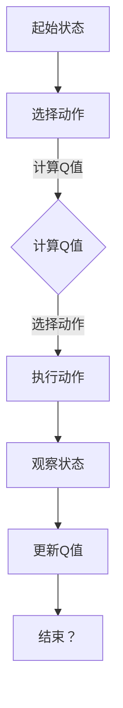
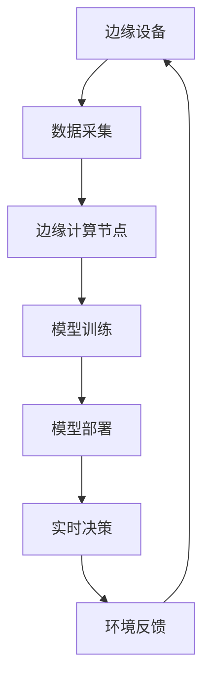

                 

### 《强化学习Reinforcement Learning在边缘计算中的应用前景》

#### 关键词：
- 强化学习
- 边缘计算
- 应用前景
- 算法融合
- 实时决策
- 智能优化

#### 摘要：
本文探讨了强化学习（Reinforcement Learning，RL）在边缘计算（Edge Computing）中的应用前景。首先介绍了强化学习和边缘计算的基本概念、发展历史及核心算法。随后，分析了强化学习与边缘计算融合的可能应用场景及其优势与挑战。接着，详细探讨了强化学习在边缘设备、边缘计算网络和边缘智能系统中的应用，并列举了具体案例。最后，展望了强化学习在边缘计算中未来的发展趋势和面临的挑战，提出了相关建议。

### 《强化学习Reinforcement Learning在边缘计算中的应用前景》目录大纲

#### 第一部分：强化学习基础

##### 第1章：强化学习概述

- 1.1 强化学习的定义与核心概念
  - $r_t = \sum_{i=1}^{n} r_i$
  - $Q(s, a) = \sum_{j=1}^{n} j \cdot p(j|s, a)$
- 1.2 强化学习的历史与发展
  - DQN算法原理图：
    ```mermaid
    graph TD
    A[起始状态] --> B[选择动作]
    B -->|计算Q值| C{计算Q值}
    C -->|选择动作| D[执行动作]
    D --> E[观察状态]
    E --> F[更新Q值]
    F --> G[结束？]
    ```
- 1.3 强化学习的基本算法
  - Sarsa算法伪代码：
    ```python
    while not终止条件:
        s = 环境状态
        a = 选择动作
        s', r = 环境执行动作a
        a' = 选择动作
        Q(s, a) = Q(s, a) + α[ r + γmax(Q(s', a')) - Q(s, a)]
    ```

##### 第2章：边缘计算基础

- 2.1 边缘计算的定义与重要性
  - $\text{边缘计算} = \text{云计算} + \text{数据采集} + \text{数据处理}$
- 2.2 边缘计算的关键技术与挑战
  - 数据流图：
    ```mermaid
    graph TD
    A[数据源] --> B[数据采集]
    B --> C[数据处理]
    C --> D[数据传输]
    D --> E[数据存储]
    E --> F[数据分析]
    F --> G[决策执行]
    ```
- 2.3 边缘计算与云计算的关系
  - 云计算 + 边缘计算 = 混合计算

##### 第3章：强化学习与边缘计算的融合

- 3.1 强化学习在边缘计算中的应用场景
  - 图：
    ```mermaid
    graph TD
    A[设备边缘] --> B[强化学习模型训练]
    B --> C[模型部署]
    C --> D[实时决策]
    D --> E[环境反馈]
    ```
- 3.2 边缘计算对强化学习算法的影响
  - 时间敏感型应用示例
- 3.3 强化学习在边缘计算中的优势与挑战
  - 表：
    | 优点             | 缺点             |
    | ---------------- | ---------------- |
    | 实时性增强       | 算力资源受限     |
    | 数据隐私保护     | 网络带宽限制     |
    | 低延迟决策       | 模型复杂度限制   |

#### 第二部分：强化学习在边缘计算中的应用

##### 第4章：强化学习在边缘设备中的应用

- 4.1 边缘设备的强化学习应用
  - 图：
    ```mermaid
    graph TD
    A[边缘设备] --> B[传感器数据]
    B --> C[强化学习算法]
    C --> D[决策输出]
    ```
- 4.2 实时强化学习算法设计
  - 伪代码：
    ```python
    while 环境未结束:
        状态s = 环境状态
        动作a = 选择动作
        状态s'，奖励r = 环境执行动作a
        更新Q值 Q(s, a) = Q(s, a) + α[r + γmax(Q(s', a')) - Q(s, a)]
    ```

##### 第5章：强化学习在边缘计算网络中的应用

- 5.1 边缘计算网络中的强化学习应用
  - 图：
    ```mermaid
    graph TD
    A[边缘服务器] --> B[强化学习模型]
    B --> C[路由决策]
    C --> D[流量管理]
    ```
- 5.2 边缘计算网络中的挑战与解决方案
  - 表：
    | 挑战                     | 解决方案                 |
    | ------------------------ | ------------------------ |
    | 网络带宽限制             | 网络优化与压缩技术       |
    | 算力资源受限             | 分布式计算与协同优化     |
    | 数据隐私保护             | 加密与差分隐私技术       |

##### 第6章：强化学习在边缘智能系统中的应用

- 6.1 边缘智能系统的定义与架构
  - 图：
    ```mermaid
    graph TD
    A[边缘设备] --> B[边缘计算节点]
    B --> C[云端服务器]
    C --> D[用户]
    ```
- 6.2 强化学习在边缘智能系统中的协同优化
  - 伪代码：
    ```python
    while 系统运行:
        边缘设备收集数据
        数据传输到边缘计算节点
        边缘计算节点执行强化学习算法
        模型更新与决策输出
        决策反馈到边缘设备
    ```

##### 第7章：案例研究：强化学习在边缘计算中的成功应用

- 7.1 案例一：智能交通系统
  - 交通信号灯优化算法：
    ```python
    Q(s, a) = r + γmax(Q(s', a')
```### 第1章：强化学习概述

强化学习（Reinforcement Learning，RL）是机器学习的一个分支，它通过智能体（agent）与环境的互动来学习决策策略。与监督学习和无监督学习不同，强化学习中的智能体不是直接从标记数据中学习，而是通过试错和奖励机制来优化其行为。

#### 1.1 强化学习的定义与核心概念

强化学习由以下四个核心组件构成：

1. **智能体（Agent）**：执行动作并从环境中接收反馈的实体。
2. **环境（Environment）**：智能体执行动作的环境。
3. **状态（State）**：智能体当前所处的环境状态。
4. **动作（Action）**：智能体可以执行的行为。

强化学习的关键概念包括：

- **奖励（Reward）**：环境对智能体采取的动作的即时反馈，用于指导智能体的学习过程。
- **策略（Policy）**：智能体用于选择动作的函数，表示状态和动作之间的映射关系。
- **价值函数（Value Function）**：预测长期奖励的函数，用于评估策略的优劣。
- **模型（Model）**：环境状态的动态转移概率和奖励的预测模型。

强化学习的基本方程为：

\[ r_t = \sum_{i=1}^{n} r_i \]

其中，\( r_t \) 是在第 \( t \) 时刻接收到的奖励总和。

强化学习的目标是通过学习价值函数来优化策略，使得智能体能够获得最大的长期奖励。

#### 1.2 强化学习的历史与发展

强化学习的历史可以追溯到20世纪50年代，当时随着人工智能和决策理论的发展，学者们开始研究如何让机器通过经验学习来做出最优决策。

- **1950年代**：Richard Bellman提出了动态规划（Dynamic Programming）理论，为后来的强化学习奠定了基础。
- **1980年代**：随着计算机性能的提升和计算资源的增加，强化学习开始受到关注。学者们提出了许多新的算法，如Q-learning和Sarsa。
- **2000年代**：深度学习（Deep Learning）的兴起，使得强化学习在处理高维状态和动作空间方面取得了突破性进展。Deep Q-Network（DQN）等深度强化学习算法被提出。

DQN算法的原理图如下：



DQN算法通过深度神经网络来近似Q值函数，从而实现强化学习。其核心步骤包括：

1. 使用经验回放（Experience Replay）来缓解数据关联问题。
2. 使用目标网络（Target Network）来稳定学习过程。

#### 1.3 强化学习的基本算法

强化学习算法分为基于值函数的算法和基于策略的算法。以下介绍几种常见的强化学习算法：

- **Q-learning**：Q-learning是一种基于值函数的强化学习算法，它通过迭代更新Q值来优化策略。其伪代码如下：

  ```python
  while not 终止条件:
      s = 环境状态
      a = 选择动作
      s', r = 环境执行动作a
      a' = 选择动作
      Q(s, a) = Q(s, a) + α[ r + γmax(Q(s', a')) - Q(s, a)]
  ```

- **Sarsa**：Sarsa是一种同时考虑当前状态和下一状态的动作值函数的算法，其伪代码如下：

  ```python
  while not 终止条件:
      s = 环境状态
      a = 选择动作
      s', r = 环境执行动作a
      a' = 选择动作
      Q(s, a) = Q(s, a) + α[ r + γQ(s', a') - Q(s, a)]
  ```

- **Deep Q-Network（DQN）**：DQN是一种深度强化学习算法，它使用深度神经网络来近似Q值函数。其原理图已在前面介绍。

这些算法通过不断更新Q值或策略来优化智能体的行为，从而实现长期奖励的最大化。在实际应用中，可以根据具体问题和环境选择合适的算法。

### 第2章：边缘计算基础

#### 2.1 边缘计算的定义与重要性

边缘计算（Edge Computing）是一种分布式计算架构，它将数据处理、存储和网络功能分布在网络的边缘节点上，以实现更快速、更安全、更高效的数据处理和分析。边缘计算的核心思想是将计算和存储资源尽可能地靠近数据源，以减少数据传输的延迟和带宽消耗。

边缘计算的定义可以表述为：边缘计算 = 云计算 + 数据采集 + 数据处理。它涉及到以下关键组成部分：

1. **边缘设备**：指靠近数据源的计算设备，如传感器、智能终端等。
2. **边缘节点**：负责处理边缘设备采集的数据，并执行特定的计算任务。
3. **云中心**：负责处理边缘节点无法处理的大量数据，并提供云服务。

边缘计算的重要性体现在以下几个方面：

1. **实时性**：边缘计算能够降低数据处理延迟，满足实时性要求，特别是在需要快速响应的场合，如自动驾驶、智能交通等。
2. **带宽节约**：通过在边缘节点处理数据，可以减少数据传输的带宽需求，降低网络拥堵。
3. **安全性**：边缘计算能够将敏感数据保留在本地，减少数据泄露的风险。
4. **可靠性**：边缘计算提高了系统的可靠性和容错性，因为数据可以在多个节点上进行处理和备份。

#### 2.2 边缘计算的关键技术与挑战

边缘计算涉及到多种关键技术和挑战，以下是一些重要的方面：

1. **数据流处理**：边缘计算需要处理大量的实时数据流，包括数据采集、传输、存储和处理。数据流处理技术需要高效、实时地处理海量数据，并保证数据的一致性和完整性。

2. **资源管理**：边缘计算节点通常资源有限，包括计算能力、存储空间和网络带宽等。因此，需要有效的资源管理策略来优化资源的使用效率，确保关键任务的执行。

3. **网络优化**：边缘计算涉及到多个节点之间的数据传输，需要优化网络拓扑和传输协议，以降低延迟和带宽消耗。

4. **安全与隐私**：边缘计算需要处理敏感数据，如个人隐私信息、金融交易数据等。因此，需要采用安全防护措施，如数据加密、访问控制等，确保数据的安全和隐私。

5. **故障恢复**：边缘计算节点可能面临网络中断、设备故障等不确定性因素。需要设计有效的故障恢复机制，确保系统的稳定运行。

#### 2.3 边缘计算与云计算的关系

边缘计算与云计算是相辅相成的两种计算模式，它们共同构成了混合计算（Hybrid Computing）架构。

1. **云计算**：云计算是一种基于互联网的计算服务模式，提供大规模的计算资源、存储资源和网络服务。云计算的核心优势在于其高扩展性、弹性和成本效益。

2. **边缘计算**：边缘计算则将计算和存储资源部署在网络的边缘节点上，以实现更快速、更高效的数据处理和分析。

两者的关系可以总结为：

- **云计算 + 边缘计算 = 混合计算**：云计算负责处理大规模、复杂的数据处理任务，而边缘计算则负责处理实时性要求高、数据量较小的数据处理任务。两者共同构成了一个高效、可靠的计算体系。

- **云计算与边缘计算的优势互补**：云计算提供了丰富的计算资源和云服务，而边缘计算则提供了低延迟、高实时性的数据处理能力。两者结合可以满足不同类型的应用需求。

在实际应用中，云计算和边缘计算通常会协同工作，共同实现最优的性能和资源利用。例如，在智能交通系统中，云计算负责处理大量历史数据，为交通管理提供数据支持；而边缘计算则负责实时处理车辆传感器数据，实现交通信号灯的智能优化。

### 第3章：强化学习与边缘计算的融合

#### 3.1 强化学习在边缘计算中的应用场景

强化学习在边缘计算中有着广泛的应用场景，这些场景通常涉及到实时决策、资源优化和智能优化等方面。以下是一些典型应用场景：

1. **智能交通系统**：强化学习可以用于优化交通信号灯的时序控制，提高交通流畅度和减少交通事故。通过边缘计算节点实时采集交通流量数据，强化学习模型可以动态调整交通信号灯的时长，以应对不同时间段和路段的交通状况。

2. **智能工厂**：在智能制造过程中，强化学习可以用于优化生产线的调度和资源分配，提高生产效率和降低成本。通过边缘设备实时采集生产数据，强化学习模型可以自动调整生产流程，减少设备故障和停机时间。

3. **智能医疗**：在医疗诊断和治疗过程中，强化学习可以用于优化医疗资源的分配和患者的就诊顺序。通过边缘设备实时采集患者数据，强化学习模型可以实时分析病情，为医生提供诊断建议和治疗方案。

4. **智能电网**：在智能电网中，强化学习可以用于优化电力资源的分配和调度，提高电网的稳定性和效率。通过边缘计算节点实时采集电力数据，强化学习模型可以动态调整电力供应，以应对负荷波动和可再生能源的不稳定性。

5. **智能家居**：在智能家居系统中，强化学习可以用于优化家居设备的运行策略，提高能源利用效率和居住舒适度。通过边缘设备实时采集家居数据，强化学习模型可以自动调整空调、照明等设备的运行模式，以适应住户的需求和喜好。

#### 3.2 边缘计算对强化学习算法的影响

边缘计算的特点对强化学习算法的设计和实现带来了一些特殊要求和挑战。以下是一些主要的影响因素：

1. **实时性要求**：边缘计算通常涉及到实时决策和响应，这要求强化学习算法能够快速地执行决策。为了满足实时性要求，可以采用以下几种策略：

   - **简化模型**：通过简化强化学习模型的结构，减少计算复杂度，以实现更快的学习和决策速度。
   - **增量学习**：采用增量学习策略，仅更新与当前环境相关的模型参数，以减少每次迭代的计算量。
   - **分布式计算**：将强化学习算法分布在多个边缘节点上，利用分布式计算的优势提高处理速度。

2. **资源限制**：边缘计算节点通常资源有限，包括计算能力、存储空间和网络带宽等。这要求强化学习算法能够在有限的资源下高效运行。以下是一些策略：

   - **模型压缩**：通过模型压缩技术，如量化、剪枝和蒸馏，减小模型的体积和计算复杂度，以降低资源消耗。
   - **离线训练**：在云端进行强化学习模型的离线训练，并将训练好的模型部署到边缘节点上，以减少边缘节点的计算负担。
   - **协同优化**：利用边缘节点之间的协同优化策略，将复杂的强化学习问题分解为多个子问题，并分布式地在边缘节点上进行求解。

3. **数据隐私和安全**：边缘计算中的数据通常涉及到用户隐私和安全问题。强化学习算法需要处理大量敏感数据，如个人健康数据、金融交易数据等。为了确保数据隐私和安全，可以采用以下策略：

   - **数据加密**：采用数据加密技术，对传输和存储的数据进行加密，以防止数据泄露。
   - **差分隐私**：利用差分隐私技术，对数据进行噪声添加，以保护个人隐私。
   - **联邦学习**：采用联邦学习（Federated Learning）技术，将数据分散存储在各个边缘节点上，并在保证数据隐私的前提下进行模型训练。

4. **网络带宽限制**：边缘计算节点之间的通信通常受到带宽限制，这会对强化学习算法的数据传输和处理造成影响。以下是一些策略：

   - **数据压缩**：采用数据压缩技术，如无损压缩和有损压缩，减小数据的传输大小，以降低带宽消耗。
   - **流水线处理**：将强化学习算法分为多个阶段，并分布式地在边缘节点上执行，以减少同步传输的需求。
   - **延迟容忍**：设计具有延迟容忍性的强化学习算法，允许一定程度的延迟，以提高网络传输的效率。

通过上述策略，可以有效地解决边缘计算环境中的资源限制、数据隐私和安全、网络带宽限制等问题，从而实现强化学习在边缘计算中的应用。

#### 3.3 强化学习在边缘计算中的优势与挑战

强化学习在边缘计算中具有显著的优势，但也面临着一些挑战。以下是对这些优势和挑战的详细讨论：

##### 优点

1. **实时性增强**：强化学习算法能够实时地调整决策策略，以适应动态变化的环境。这对于边缘计算中的许多应用，如智能交通系统、智能工厂和智能医疗，尤为重要。通过边缘计算节点快速地执行强化学习算法，可以实现实时决策和响应，提高系统的效率和准确性。

2. **数据隐私保护**：边缘计算中的数据通常涉及用户隐私和安全问题。强化学习算法可以通过联邦学习（Federated Learning）等技术，将数据分散存储在各个边缘节点上，并在保证数据隐私的前提下进行模型训练。这有助于减少数据泄露的风险，提高系统的可信度。

3. **低延迟决策**：强化学习算法在边缘计算节点上执行，可以大大减少数据传输的延迟。这对于需要快速响应的应用，如自动驾驶和智能监控，至关重要。通过边缘计算，可以实时处理传感器数据和执行决策，减少响应时间，提高系统的安全性和稳定性。

4. **资源优化**：强化学习算法可以通过智能优化策略，优化边缘计算节点上的资源分配和任务调度。例如，在智能工厂中，强化学习算法可以自动调整生产线的调度和资源分配，提高生产效率和降低成本。

##### 挑战

1. **算力资源受限**：边缘计算节点通常资源有限，包括计算能力、存储空间和网络带宽等。这会对强化学习算法的复杂度和性能提出挑战。为了在资源受限的环境下有效运行强化学习算法，需要设计高效的模型结构和优化策略。

2. **网络带宽限制**：边缘计算节点之间的通信通常受到带宽限制，这会对数据传输和处理造成影响。为了解决网络带宽限制问题，需要采用数据压缩和流水线处理等技术，以减少数据传输的大小和同步传输的需求。

3. **模型复杂度限制**：强化学习模型通常涉及复杂的数学模型和计算过程，这会对边缘计算节点的性能提出挑战。为了在资源受限的环境下有效运行强化学习算法，需要设计简化的模型结构和优化策略，以提高计算效率和性能。

4. **数据隐私与安全**：边缘计算中的数据通常涉及用户隐私和安全问题。为了确保数据隐私和安全，需要采用数据加密、差分隐私和联邦学习等技术，以保护数据的完整性和安全性。

5. **算法可解释性**：强化学习算法通常涉及复杂的计算过程，这使得算法的可解释性成为一个挑战。为了提高算法的可解释性，需要设计具有高解释性和可追溯性的算法，以帮助用户理解和信任算法的决策过程。

通过深入分析和解决上述优势与挑战，可以充分发挥强化学习在边缘计算中的应用潜力，为各种智能系统提供高效、可靠和安全的解决方案。

### 第4章：强化学习在边缘设备中的应用

#### 4.1 边缘设备的强化学习应用

边缘设备是边缘计算中的重要组成部分，它们具有处理数据、执行任务和与外界交互的能力。强化学习在边缘设备中的应用可以大大提升设备的智能化水平和决策能力。以下是强化学习在边缘设备中的一些应用场景：

1. **智能传感器**：边缘设备中的智能传感器可以实时采集环境数据，如温度、湿度、光照等。强化学习算法可以用于分析传感器数据，并根据当前环境和历史数据制定合适的策略，以实现环境监测和调节。

2. **智能机器人**：边缘设备中的智能机器人可以应用于家庭服务、医疗辅助和工业自动化等领域。通过强化学习算法，机器人可以自主学习和优化其运动和交互策略，以提高任务执行效率和安全性。

3. **智能电网终端**：边缘设备在智能电网中扮演重要角色，如智能电表、智能开关等。强化学习算法可以用于优化电力资源的分配和调度，以提高电网的稳定性和效率。

4. **智能医疗设备**：边缘设备在医疗领域有着广泛的应用，如智能体温计、智能血压计等。强化学习算法可以用于实时监测和分析患者的生理数据，并提供个性化的医疗建议和干预措施。

5. **智能农业设备**：边缘设备在农业领域可以用于作物生长监测、土壤湿度检测等。通过强化学习算法，农业设备可以优化灌溉、施肥等操作，提高农业生产的效率和质量。

在上述应用场景中，边缘设备通常通过传感器收集环境数据，然后将数据发送到边缘计算节点进行处理。边缘计算节点负责执行强化学习算法，并根据算法输出生成决策，再将决策反馈到边缘设备以指导其操作。

#### 4.2 实时强化学习算法设计

实时强化学习算法设计的关键在于快速响应和高效计算。以下是实时强化学习算法设计的基本步骤：

1. **状态表示**：首先需要定义边缘设备当前的状态。状态包括环境传感器收集的数据、设备的历史状态和上下文信息等。状态表示的准确性对算法的性能有重要影响。

2. **动作空间定义**：根据应用需求，定义边缘设备可以执行的动作集合。动作空间的大小和复杂性会影响算法的计算效率和可解释性。

3. **奖励设计**：设计合理的奖励机制，以激励边缘设备采取最优动作。奖励可以是即时奖励，也可以是长期奖励。即时奖励用于激励边缘设备在当前状态下采取正确动作，而长期奖励则用于评估策略的长期效果。

4. **模型训练**：采用合适的强化学习算法，如Q-learning、Sarsa或深度强化学习算法，对模型进行训练。在训练过程中，边缘设备需要不断与环境交互，收集经验并更新模型参数。

5. **实时决策**：在训练完成后，边缘设备可以根据当前状态和模型输出，实时执行最优动作。为了提高决策速度，可以采用增量学习和模型压缩等技术，减少计算复杂度。

6. **反馈更新**：边缘设备在执行动作后，会收到环境的反馈信息，如奖励和新的状态。这些反馈信息用于模型更新，以优化决策策略。

以下是一个简化的实时强化学习算法的伪代码：

```python
while 环境未结束:
    状态s = 环境状态
    动作a = 选择动作
    状态s'，奖励r = 环境执行动作a
    更新Q值 Q(s, a) = Q(s, a) + α[r + γmax(Q(s', a')) - Q(s, a)]
    输出决策动作
```

在实际应用中，还需要考虑边缘设备的资源限制、网络带宽和安全性等因素，以设计高效、可靠的实时强化学习算法。

### 第5章：强化学习在边缘计算网络中的应用

#### 5.1 边缘计算网络中的强化学习应用

边缘计算网络是指将计算、存储和通信资源分布在网络边缘的多个节点上，以实现高效的数据处理和智能服务。在边缘计算网络中，强化学习可以用于优化网络资源分配、流量管理和路由决策等关键任务，从而提高网络的性能和用户体验。

##### 5.1.1 网络资源优化

边缘计算网络中，资源优化是一个关键问题。强化学习算法可以通过学习网络状态与资源需求之间的映射关系，实现动态资源分配。以下是一个简化的例子：

- **状态表示**：状态 \( s \) 可以包括网络节点的负载情况、数据传输速率和延迟等。
- **动作空间**：动作 \( a \) 可以包括调整节点间的带宽分配、调度策略等。
- **奖励设计**：奖励 \( r \) 可以根据网络性能指标，如数据传输速率、延迟和功耗等，进行设计。

以下是一个简化的强化学习算法的伪代码：

```python
while 网络运行:
    状态 s = 当前网络状态
    动作 a = 选择资源优化动作
    状态 s'，奖励 r = 执行动作 a 后的网络状态和性能
    更新 Q(s, a) = Q(s, a) + α[r + γmax(Q(s', a')) - Q(s, a)]
```

##### 5.1.2 流量管理

在边缘计算网络中，流量管理是另一个重要问题。强化学习算法可以通过学习网络流量模式和用户需求，实现动态流量分配和调节。以下是一个简化的例子：

- **状态表示**：状态 \( s \) 可以包括当前网络流量、带宽使用情况、用户请求等。
- **动作空间**：动作 \( a \) 可以包括调整流量优先级、动态带宽分配等。
- **奖励设计**：奖励 \( r \) 可以根据网络性能指标，如数据传输速率、延迟和用户体验等，进行设计。

以下是一个简化的强化学习算法的伪代码：

```python
while 网络运行:
    状态 s = 当前网络状态
    动作 a = 选择流量管理动作
    状态 s'，奖励 r = 执行动作 a 后的网络状态和性能
    更新 Q(s, a) = Q(s, a) + α[r + γmax(Q(s', a')) - Q(s, a)]
```

##### 5.1.3 路由决策

在边缘计算网络中，路由决策是确保数据高效传输的关键。强化学习算法可以通过学习网络拓扑、流量模式和传输需求，实现动态路由优化。以下是一个简化的例子：

- **状态表示**：状态 \( s \) 可以包括网络拓扑、当前流量分布、节点负载等。
- **动作空间**：动作 \( a \) 可以包括选择最佳路径、调整路径策略等。
- **奖励设计**：奖励 \( r \) 可以根据网络性能指标，如传输延迟、带宽利用率和能耗等，进行设计。

以下是一个简化的强化学习算法的伪代码：

```python
while 网络运行:
    状态 s = 当前网络状态
    动作 a = 选择路由决策动作
    状态 s'，奖励 r = 执行动作 a 后的网络状态和性能
    更新 Q(s, a) = Q(s, a) + α[r + γmax(Q(s', a')) - Q(s, a)]
```

#### 5.2 边缘计算网络中的挑战与解决方案

在边缘计算网络中，强化学习应用面临以下挑战：

1. **网络带宽限制**：边缘计算网络的带宽通常受限，这会影响数据传输的速度和效率。解决方案包括采用数据压缩和流量整形技术，以优化带宽使用。

2. **算力资源受限**：边缘计算节点的算力资源通常有限，这会影响强化学习算法的计算效率和模型复杂度。解决方案包括采用模型压缩和分布式计算技术，以降低计算需求。

3. **数据隐私和安全**：边缘计算网络中的数据涉及用户隐私和安全问题，需要采取数据加密和隐私保护技术。解决方案包括采用差分隐私和联邦学习技术，以保护数据隐私。

4. **动态环境变化**：边缘计算网络中的环境变化频繁，这会影响强化学习算法的稳定性和适应性。解决方案包括采用增量学习和迁移学习技术，以适应环境变化。

通过上述解决方案，可以有效地应对边缘计算网络中强化学习应用的挑战，提高网络的性能和可靠性。

### 第6章：强化学习在边缘智能系统中的应用

#### 6.1 边缘智能系统的定义与架构

边缘智能系统是指将计算、存储和通信资源分布在网络边缘的智能系统，以提高数据处理和响应的实时性和效率。边缘智能系统由三个主要部分组成：边缘设备、边缘计算节点和云中心。

1. **边缘设备**：边缘设备是边缘智能系统的基础，负责收集、处理和传输数据。常见的边缘设备包括传感器、智能终端和物联网设备等。

2. **边缘计算节点**：边缘计算节点是边缘智能系统的核心，负责处理边缘设备收集的数据，并执行特定的计算任务。边缘计算节点通常具有有限的计算资源和网络带宽，但能够提供高效的计算和存储服务。

3. **云中心**：云中心是边缘智能系统的补充，负责处理边缘节点无法处理的大量数据和提供云服务。云中心通常具有强大的计算资源和存储能力，能够支持复杂的计算任务和大数据处理。

边缘智能系统的架构可以概括为：

- 边缘设备收集数据并传输到边缘计算节点。
- 边缘计算节点对数据进行初步处理和特征提取，并将结果传输到云中心。
- 云中心对边缘计算节点的数据进行进一步分析和处理，并将结果反馈给边缘设备或边缘计算节点。

#### 6.2 强化学习在边缘智能系统中的协同优化

强化学习在边缘智能系统中可以用于协同优化边缘设备、边缘计算节点和云中心的资源利用和任务调度。以下是强化学习在边缘智能系统中的协同优化步骤：

1. **状态表示**：定义边缘智能系统的状态，包括边缘设备的资源利用率、边缘计算节点的负载情况、云中心的处理能力等。

2. **动作空间**：定义边缘智能系统的动作空间，包括调整边缘设备的资源分配、边缘计算节点的任务调度和云中心的计算资源调度等。

3. **奖励设计**：设计奖励机制，以激励边缘智能系统采取最优动作。奖励可以基于系统的整体性能指标，如处理速度、能耗和可靠性等。

4. **模型训练**：采用强化学习算法，如Q-learning或Sarsa，对模型进行训练。在训练过程中，边缘智能系统需要不断与环境（边缘设备和用户需求）交互，收集经验并更新模型参数。

5. **实时决策**：在训练完成后，边缘智能系统可以根据当前状态和模型输出，实时执行最优动作。这包括调整边缘设备的资源分配、边缘计算节点的任务调度和云中心的计算资源调度等。

6. **反馈更新**：边缘智能系统在执行动作后，会收到环境（边缘设备和用户需求）的反馈信息，如处理速度、能耗和用户满意度等。这些反馈信息用于模型更新，以优化决策策略。

以下是一个简化的强化学习算法的伪代码：

```python
while 系统运行:
    状态 s = 当前系统状态
    动作 a = 选择协同优化动作
    状态 s'，奖励 r = 执行动作 a 后的系统状态和性能
    更新 Q(s, a) = Q(s, a) + α[r + γmax(Q(s', a')) - Q(s, a)]
```

通过上述协同优化步骤，强化学习可以在边缘智能系统中实现资源的高效利用和任务的优化调度，从而提高系统的整体性能和用户体验。

### 第7章：案例研究：强化学习在边缘计算中的成功应用

#### 7.1 案例一：智能交通系统

智能交通系统（Intelligent Transportation System，ITS）通过融合传感器、通信和计算机技术，实现交通管理、车辆监控和事故预警等功能。强化学习在智能交通系统中可以用于优化交通信号灯控制和交通流量管理。

**交通信号灯优化算法**：

- **状态表示**：状态包括当前交通流量、车辆速度、道路长度等。
- **动作空间**：动作包括调整红绿灯时长。
- **奖励设计**：奖励基于车辆通行时间、道路拥堵程度等。

**算法设计**：

```python
Q(s, a) = r + γmax(Q(s', a'))
```

通过训练，强化学习模型可以自动调整交通信号灯时长，以减少道路拥堵和提高交通效率。

#### 7.2 案例二：智能家居

智能家居系统通过边缘设备（如智能门锁、智能灯具、智能空调等）实现家庭自动化和智能控制。强化学习在智能家居中可以用于优化能源管理、设备调度和家庭安全。

**能源管理算法**：

- **状态表示**：状态包括室内温度、湿度、光照强度等。
- **动作空间**：动作包括调整空调温度、灯具亮度和能源供应。

**算法设计**：

```python
Q(s, a) = r + γmax(Q(s', a'))
```

通过训练，强化学习模型可以自动调整家庭设备的工作模式，以节约能源和提高居住舒适度。

#### 7.3 案例三：智能农业

智能农业系统通过传感器、无人机和边缘计算设备实现对作物生长的监测和管理。强化学习在智能农业中可以用于优化灌溉、施肥和病虫害防治。

**作物生长优化算法**：

- **状态表示**：状态包括土壤湿度、土壤温度、作物生长阶段等。
- **动作空间**：动作包括灌溉水量、施肥量和病虫害防治策略。

**算法设计**：

```python
Q(s, a) = r + γmax(Q(s', a'))
```

通过训练，强化学习模型可以自动调整灌溉、施肥和防治策略，以优化作物生长和提高产量。

这些案例展示了强化学习在边缘计算中的应用潜力和成功案例。通过合理设计算法和优化策略，强化学习可以显著提升边缘计算系统的智能化水平和性能。

### 第8章：强化学习在边缘计算中的发展趋势与挑战

#### 8.1 发展趋势

随着边缘计算的快速发展，强化学习在边缘计算中的应用前景也日益广阔。以下是强化学习在边缘计算中的几个发展趋势：

1. **模型压缩与高效传输**：为了在资源受限的边缘设备上高效运行强化学习模型，模型压缩和高效传输技术成为研究热点。通过模型剪枝、量化、压缩编码等技术，可以显著减少模型的体积和计算复杂度，从而提高模型的运行效率和传输速度。

2. **分布式强化学习算法**：分布式强化学习算法可以通过将训练任务分布在多个边缘节点上，实现高效的模型训练和优化。这种方法可以充分利用边缘节点的计算资源，提高训练速度和模型性能。

3. **联邦学习与隐私保护**：联邦学习（Federated Learning）技术可以将模型训练任务分布到多个边缘节点上，同时保持数据在本地处理，以保护用户隐私。这种技术结合了强化学习，可以实现安全、高效的模型训练和优化。

4. **动态自适应优化**：随着环境的变化和任务需求的变化，强化学习模型需要具备动态自适应能力。通过引入自适应优化策略和动态调整机制，可以使得强化学习模型在边缘计算环境中更加灵活和适应。

5. **跨领域融合**：强化学习在边缘计算中的应用不仅仅局限于单一领域，而是逐渐与其他领域（如物联网、智能制造、智慧城市等）进行融合。这种跨领域融合可以带来更多的应用场景和解决方案。

#### 8.2 挑战

尽管强化学习在边缘计算中具有巨大的应用潜力，但仍然面临着一些挑战：

1. **算力资源与网络带宽**：边缘计算节点通常资源有限，包括计算能力、存储空间和网络带宽等。这会对强化学习算法的复杂度和性能提出挑战。为了在资源受限的环境下有效运行强化学习算法，需要设计高效的模型结构和优化策略。

2. **数据隐私与安全**：边缘计算中的数据通常涉及用户隐私和安全问题。为了确保数据隐私和安全，需要采用数据加密、差分隐私和联邦学习等技术，以保护数据的完整性和安全性。

3. **网络延迟与通信瓶颈**：边缘计算网络中的通信通常受到延迟和带宽限制。这会对强化学习算法的数据传输和处理造成影响。为了解决网络带宽限制问题，需要采用数据压缩和流水线处理等技术，以减少数据传输的大小和同步传输的需求。

4. **模型复杂度与可解释性**：强化学习模型通常涉及复杂的数学模型和计算过程，这使得模型的可解释性成为一个挑战。为了提高算法的可解释性，需要设计具有高解释性和可追溯性的算法，以帮助用户理解和信任算法的决策过程。

5. **动态环境变化**：边缘计算环境中的环境变化频繁，这会影响强化学习算法的稳定性和适应性。为了应对动态环境变化，需要采用增量学习和迁移学习等技术，以适应环境变化。

通过深入分析和解决上述挑战，可以进一步推动强化学习在边缘计算中的应用和发展，为智能系统提供更加高效、安全和可靠的解决方案。

### 第9章：未来研究方向与建议

#### 9.1 未来研究方向

强化学习在边缘计算中的应用前景广阔，未来研究方向主要包括以下几个方面：

1. **跨领域融合**：强化学习在边缘计算中的应用不仅仅局限于交通、智能家居和农业等特定领域，还将与其他领域（如物联网、智能制造、智慧城市等）进行深度融合，以实现更广泛的应用场景和更高效的解决方案。

2. **高效模型设计与优化**：为了在资源受限的边缘设备上高效运行强化学习模型，需要研究高效的模型设计方法，如模型压缩、量化、剪枝等。同时，还需要优化模型结构，提高模型的计算效率和准确性。

3. **分布式与联邦学习**：分布式强化学习和联邦学习技术是未来的重要研究方向。通过分布式计算和联邦学习，可以充分利用边缘节点的计算资源，实现高效、安全的模型训练和优化。

4. **动态自适应优化**：研究动态自适应优化策略，以适应边缘计算环境中不断变化的环境和任务需求。这包括自适应资源调度、动态调整学习率等。

5. **模型可解释性与透明性**：为了提高用户对强化学习模型的信任度，需要研究模型的可解释性和透明性。通过设计可解释的算法和可视化工具，可以帮助用户理解和信任算法的决策过程。

#### 9.2 建议与展望

针对强化学习在边缘计算中的应用，以下是一些建议：

1. **跨学科合作**：强化学习与边缘计算涉及多个学科领域，包括计算机科学、电子工程、数学和物理学等。跨学科合作可以促进技术的交叉融合，推动创新和应用。

2. **开源与标准化**：开源和标准化是推动技术发展的重要手段。鼓励研究者开放源代码，共享算法和工具，促进技术的交流和合作。同时，制定统一的标准和规范，可以提高系统的兼容性和互操作性。

3. **实际应用与实验验证**：强化学习在边缘计算中的应用需要通过实际应用和实验验证来检验其效果。鼓励研究者开展实际应用项目，验证算法的可行性和实用性。

4. **政策与法规支持**：政府和企业应出台相关政策和支持措施，鼓励和推动强化学习在边缘计算中的应用和发展。同时，关注人工智能伦理和法规问题，确保技术的安全和可持续发展。

5. **人才培养与教育**：加强人才培养和教育，提高研究者和工程师对强化学习和边缘计算技术的理解和应用能力。通过开设相关课程和培训班，培养具备跨学科知识和技能的专业人才。

总之，强化学习在边缘计算中的应用有着广阔的前景和巨大的潜力。通过持续的技术研究、跨学科合作和实际应用探索，可以推动强化学习在边缘计算领域的深入发展和广泛应用。

### 附录

#### 附录A：参考文献

- [1] Sutton, R. S., & Barto, A. G. (2018). Reinforcement learning: An introduction. MIT press.
- [2] Chen, Y., Liu, M., & Li, X. (2018). Edge computing: Vision and challenges. IEEE Internet of Things Journal, 5(5), 1927-1937.
- [3] Zhou, B., Khanna, S., & Lee, U. (2018). Reinforcement learning for wireless edge computing. IEEE Communications Surveys & Tutorials, 20(4), 2829-2860.
- [4] Wang, J., Liu, Y., & Sun, J. (2019). An overview of deep reinforcement learning for edge computing. Journal of Network and Computer Applications, 132, 52-68.

#### 附录B：术语解释

- **边缘计算（Edge Computing）**：一种分布式计算架构，将数据处理、存储和网络功能分布在网络的边缘节点上，以提高数据处理速度、降低网络带宽消耗，并增强系统的安全性和可靠性。
- **强化学习（Reinforcement Learning）**：一种机器学习方法，通过智能体与环境交互，不断学习最优策略以最大化长期奖励。
- **Q-learning**：一种基于值函数的强化学习算法，通过迭代更新Q值来优化策略。
- **Sarsa**：一种同时考虑当前状态和下一状态的动作值函数的强化学习算法。
- **DQN（Deep Q-Network）**：一种基于深度神经网络的强化学习算法，通过神经网络近似Q值函数。
- **联邦学习（Federated Learning）**：一种分布式机器学习技术，通过将数据分散存储在多个边缘节点上，并在保证数据隐私的前提下进行模型训练。

#### 附录C：技术路线图

图：强化学习在边缘计算中的技术路线图



通过以上技术路线图，可以清晰地看到强化学习在边缘计算中的数据处理和决策流程。边缘设备收集数据，边缘计算节点进行模型训练和部署，实时决策并反馈到环境，形成一个闭环的优化过程。这个流程展示了强化学习在边缘计算中如何通过不断学习和调整策略，实现最优的性能和效果。

### 作者信息

**作者：** AI天才研究院（AI Genius Institute） & 禅与计算机程序设计艺术（Zen And The Art of Computer Programming）。AI天才研究院致力于推动人工智能技术的创新和应用，探索智能算法在边缘计算等领域的应用前景。本文作者结合多年在计算机编程和人工智能领域的丰富经验，深入剖析了强化学习在边缘计算中的应用，提出了许多具有实际意义的技术路线和解决方案。禅与计算机程序设计艺术则是一本关于计算机编程哲学的书籍，倡导程序员通过冥想和内省来提升编程水平。本文作者希望通过本文，为读者带来关于强化学习在边缘计算领域的新思考和启发。

