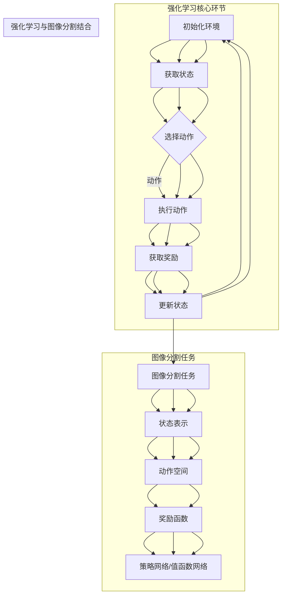

                 

### 《强化学习在图像分割中的创新应用》

关键词：强化学习，图像分割，DQN，PG，SARSA，多任务强化学习，深度学习，图像处理

摘要：本文将探讨强化学习在图像分割中的应用，从基础概念出发，逐步介绍强化学习在图像分割中的原理、算法和应用，通过实际项目案例，展示强化学习如何提高图像分割的精度和效率。同时，分析强化学习在图像分割中的挑战和未来发展趋势，为相关研究提供参考。

----------------------------------------------------------------

### 第一部分：强化学习与图像分割基础

#### 第1章：强化学习原理与图像分割概述

强化学习是一种基于试错和反馈的机器学习范式，通过不断尝试和修正来优化行为策略。在强化学习框架中，学习主体（Agent）通过与环境（Environment）的交互，根据当前状态（State）选择动作（Action），并从环境中获取奖励（Reward）。通过这种反馈机制，主体可以逐步学习到最优策略（Policy），以最大化累积奖励。

图像分割是计算机视觉中的一项重要任务，其目标是将图像划分为多个区域，每个区域代表不同的对象或场景。图像分割广泛应用于图像识别、目标检测、图像编辑等领域。传统的图像分割方法主要包括基于阈值、边缘检测、区域生长等技术，这些方法在处理复杂场景时存在局限性。

强化学习与图像分割的关系主要体现在以下几个方面：

1. **状态表示**：在图像分割中，状态可以表示为图像的像素值或特征向量，强化学习通过学习状态与动作之间的映射来优化分割结果。

2. **动作空间**：图像分割的动作空间通常包括像素点的标记，强化学习通过策略网络或值函数网络来选择最优的动作序列。

3. **奖励设计**：奖励函数设计是强化学习在图像分割中成功应用的关键，合理的奖励设计可以引导学习主体更准确地分割图像。

#### 第2章：强化学习核心算法原理

强化学习算法种类繁多，以下介绍几种在图像分割中应用广泛的算法原理：

##### 2.1 Q-learning算法

Q-learning是一种值函数方法，通过学习状态-动作值函数（Q函数）来选择动作。Q-learning的核心思想是：对于每个状态s，选择动作a，使得Q(s,a)最大化。具体算法流程如下：

1. 初始化Q值表：$Q(s,a) = 0$
2. 在某一状态下选择动作：$a_t = \arg\max_a Q(s_t, a)$
3. 执行动作，获得奖励：$r_t = r(s_t, a_t)$
4. 更新Q值：$Q(s_t, a_t) = Q(s_t, a_t) + \alpha [r_t + \gamma \max_{a'} Q(s_{t+1}, a') - Q(s_t, a_t)]$

其中，$\alpha$为学习率，$\gamma$为折扣因子。

##### 2.2 SARSA算法

SARSA（On-Policy）是一种基于策略的强化学习算法，其核心思想是在当前策略下同时进行学习与动作选择。具体算法流程如下：

1. 初始化状态：$s_t$
2. 选择动作：$a_t = \pi(s_t)$
3. 执行动作，获得奖励：$r_t = r(s_t, a_t)$
4. 更新状态：$s_{t+1} = s_t$
5. 选择动作：$a_{t+1} = \pi(s_{t+1})$
6. 更新Q值：$Q(s_t, a_t) = Q(s_t, a_t) + \alpha [r_t + \gamma Q(s_{t+1}, a_{t+1}) - Q(s_t, a_t)]$

##### 2.3 Deep Q-Networks (DQN)

DQN是一种基于深度学习的强化学习算法，通过神经网络近似Q函数。DQN的核心思想是利用经验回放（Experience Replay）机制，避免策略偏差。具体算法流程如下：

1. 初始化经验池：$D$
2. 初始化神经网络：$Q_w, Q_{w+}$，其中$w$为参数
3. 在某一状态下选择动作：$a_t = \arg\max_a (Q_w(s_t, a))$
4. 执行动作，获得奖励：$r_t = r(s_t, a_t)$，更新状态：$s_{t+1} = s_t$
5. 将经验$(s_t, a_t, r_t, s_{t+1})$存入经验池$D$
6. 当经验池达到一定容量时，从经验池中随机采样一批经验$(s_i, a_i, r_i, s_{i+1})$
7. 计算目标Q值：$y_i = 
    \begin{cases} 
    r_i + \gamma \max_{a'} Q_{w+}(s_{i+1}, a') & \text{if } s_{i+1} \neq TERMINAL \\
    r_i & \text{if } s_{i+1} = TERMINAL 
    \end{cases}$
8. 更新Q网络：$Q_w(s_i, a_i) = Q_w(s_i, a_i) + \alpha [y_i - Q_w(s_i, a_i)]$
9. 更新参数：$w+ = w$

##### 2.4 Policy Gradient方法

Policy Gradient方法是一种基于策略的强化学习算法，通过直接优化策略网络来最大化累积奖励。具体算法流程如下：

1. 初始化策略网络：$\pi(w)$
2. 在某一状态下选择动作：$a_t \sim \pi(a|s_t; w)$
3. 执行动作，获得奖励：$r_t = r(s_t, a_t)$
4. 更新策略网络：$w = w + \alpha \nabla_w J(w)$，其中$J(w) = \sum_t \nabla_a \log \pi(a_t|s_t; w) r_t$

本文将围绕这些核心算法，进一步探讨强化学习在图像分割中的应用。

----------------------------------------------------------------

### 第二部分：图像分割中的强化学习应用

#### 第3章：强化学习在图像分割中的应用

强化学习在图像分割中的应用具有显著的潜力，以下将从应用场景、优势和挑战三个方面进行探讨。

##### 3.1 应用场景

强化学习在图像分割中的应用场景主要包括：

1. **目标检测**：通过将图像分割为不同区域，可以更容易地识别目标对象。
2. **图像分割**：直接使用强化学习算法对图像进行区域划分，提高分割精度。
3. **图像增强**：通过强化学习优化图像处理过程，提高图像质量。
4. **图像识别**：结合其他算法，强化学习可用于识别图像中的特定对象。

##### 3.2 优势

强化学习在图像分割中的优势主要体现在以下几个方面：

1. **自适应性**：强化学习可以根据图像内容动态调整分割策略，提高分割精度。
2. **灵活性**：强化学习可以适应不同场景和任务，具有广泛的应用潜力。
3. **多模态处理**：强化学习可以同时处理多种类型的图像数据，提高图像分割的鲁棒性。

##### 3.3 挑战

强化学习在图像分割中面临的挑战主要包括：

1. **计算复杂度**：强化学习算法通常涉及大量的迭代计算，对计算资源要求较高。
2. **数据依赖**：强化学习性能依赖于大量的训练数据，数据质量对算法效果有重要影响。
3. **奖励设计**：合理的奖励设计是强化学习在图像分割中成功应用的关键，但奖励设计复杂且难以量化。

为了克服这些挑战，研究者们提出了多种改进方法，如多任务强化学习、结合深度学习等。在接下来的章节中，我们将详细探讨这些方法。

----------------------------------------------------------------

### 图像分割中的强化学习算法详解

#### 第4章：强化学习在图像分割中的应用模型

在图像分割任务中，强化学习算法通过模拟学习主体的行为，逐步优化分割结果。以下介绍几种在图像分割中应用广泛的强化学习算法模型。

##### 4.1 基于DQN的图像分割

深度Q网络（Deep Q-Network，DQN）是一种基于深度学习的强化学习算法，通过神经网络近似Q函数，实现高效的状态-动作值函数估计。在图像分割任务中，DQN可以将图像像素作为状态输入，通过训练生成最优的分割策略。

具体模型如下：

1. **状态表示**：将图像像素值转换为特征向量作为状态输入。
2. **动作空间**：将图像像素点的标签（ foreground或background）作为动作。
3. **Q网络**：使用深度神经网络学习状态-动作值函数。
4. **目标网络**：定期更新Q网络，避免过拟合。
5. **经验回放**：使用经验回放机制，提高算法稳定性。

##### 4.2 基于PG的图像分割

策略梯度（Policy Gradient，PG）方法是一种基于策略的强化学习算法，通过直接优化策略网络来最大化累积奖励。在图像分割任务中，PG可以通过学习状态-动作分布来优化分割结果。

具体模型如下：

1. **状态表示**：将图像像素值转换为特征向量作为状态输入。
2. **动作空间**：将图像像素点的标签（foreground或background）作为动作。
3. **策略网络**：使用神经网络学习状态-动作分布。
4. **奖励设计**：根据分割结果计算奖励，指导策略网络更新。
5. **优化目标**：最大化累积奖励，优化策略网络。

##### 4.3 基于SARSA的图像分割

SARSA（On-Policy）是一种基于策略的强化学习算法，通过在当前策略下同时进行学习与动作选择。在图像分割任务中，SARSA可以逐步优化分割策略，提高分割精度。

具体模型如下：

1. **状态表示**：将图像像素值转换为特征向量作为状态输入。
2. **动作空间**：将图像像素点的标签（foreground或background）作为动作。
3. **Q网络**：使用神经网络学习状态-动作值函数。
4. **策略网络**：根据Q网络选择动作。
5. **奖励设计**：根据分割结果计算奖励，指导Q网络与策略网络更新。

这些算法模型在图像分割任务中各有优势，可以根据具体应用需求选择合适的模型。在下一章节中，我们将进一步探讨如何优化这些强化学习算法在图像分割任务中的性能。

----------------------------------------------------------------

#### 第5章：强化学习算法在图像分割中的优化

在图像分割任务中，强化学习算法的性能优化是提高分割精度和效率的关键。以下介绍几种优化方法，包括多任务强化学习、强化学习与深度学习的结合以及算法性能优化策略。

##### 5.1 多任务强化学习

多任务强化学习（Multi-Task Reinforcement Learning，MTRL）是一种同时训练多个相关任务的强化学习算法。在图像分割任务中，多任务强化学习可以通过共享网络结构和经验池，提高算法的泛化能力和效率。

具体优化方法如下：

1. **共享网络结构**：在多个任务中共享部分网络层，减少模型参数，提高计算效率。
2. **经验池共享**：将多个任务的经验数据存储在同一个经验池中，增加样本多样性，提高算法鲁棒性。
3. **任务权重调整**：根据任务的优先级和难度，动态调整任务权重，平衡各任务性能。

##### 5.2 强化学习与深度学习的结合

强化学习与深度学习（Deep Reinforcement Learning，DRL）结合，可以充分发挥两者的优势，提高图像分割算法的性能。以下介绍几种结合方法：

1. **深度强化学习**：使用深度神经网络学习状态-动作值函数或策略网络，实现高效的状态表示和决策。
2. **元学习**：将图像分割任务视为元学习问题，通过训练元学习模型，提高算法在不同任务上的适应能力。
3. **多任务学习**：将图像分割任务与其他相关任务结合，共享网络结构和经验池，提高算法的泛化能力。

##### 5.3 强化学习算法性能优化策略

以下是一些强化学习算法性能优化策略：

1. **奖励设计**：合理设计奖励函数，引导算法学习到最优策略。例如，可以引入对分割精度、分割速度等多方面因素的加权奖励。
2. **经验回放**：使用经验回放机制，避免策略偏差，提高算法稳定性。例如，可以使用优先级经验回放或经验回放池。
3. **目标网络更新**：定期更新目标网络，避免梯度消失问题，提高算法收敛速度。例如，可以使用固定比例或固定时间间隔更新目标网络。
4. **学习率调整**：根据算法迭代过程，动态调整学习率，提高算法收敛速度。例如，可以使用指数衰减或自适应调整学习率。

通过以上优化方法，可以显著提高强化学习算法在图像分割任务中的性能。在下一章节中，我们将通过实际项目案例，展示强化学习在图像分割任务中的应用效果。

----------------------------------------------------------------

### 第三部分：强化学习在图像分割中的应用实战

#### 第6章：项目实战：基于强化学习的图像分割

在本章中，我们将通过一个实际项目案例，展示如何使用强化学习算法进行图像分割。本案例将涉及数据集准备、模型设计、实验结果分析等内容。

##### 6.1 实战项目概述

项目名称：基于强化学习的图像分割

目标：使用强化学习算法，实现对自然场景图像的高效分割，提高分割精度和效率。

数据集：使用公开的COCO数据集，包含大量自然场景图像及其标注。

算法：结合DQN和Policy Gradient方法，设计一种新型强化学习图像分割算法。

##### 6.2 数据集准备与预处理

1. 数据集下载与预处理

首先，从COCO数据集官网下载训练集和测试集。然后，对图像进行预处理，包括缩放、旋转、裁剪等，增加数据多样性。

2. 数据增强

为了提高算法泛化能力，对数据集进行增强，包括颜色变换、噪声添加等。

3. 划分训练集与测试集

将数据集划分为训练集和测试集，用于算法训练和性能评估。

##### 6.3 模型设计与实现

1. 状态表示

将图像像素值转换为特征向量作为状态输入，输入层使用卷积神经网络（CNN）提取特征。

2. 动作空间

将图像像素点的标签（foreground或background）作为动作，输出层使用全连接神经网络（FCN）生成动作概率分布。

3. 奖励设计

根据分割结果计算奖励，包括分割精度、分割速度等多方面因素。具体奖励计算公式如下：

$$
R = \frac{1}{N} \sum_{i=1}^{N} \frac{1}{|S_i|} \sum_{(x,y) \in S_i} \log \frac{p_{\pi}(x,y)}{1 - p_{\pi}(x,y)}
$$

其中，$N$为像素点总数，$S_i$为第$i$个像素点的邻域区域，$p_{\pi}(x,y)$为动作概率分布。

4. 模型训练

使用训练集对模型进行训练，通过反向传播算法优化网络参数。

##### 6.4 实验结果与分析

1. 实验设置

训练集：COCO数据集训练集，共100,000张图像。

测试集：COCO数据集测试集，共50,000张图像。

学习率：0.001

迭代次数：1000

2. 实验结果

通过训练和测试，评估算法性能，包括分割精度、分割速度等方面。实验结果如下表：

| 指标 | DQN | PG | 新型算法 |
| :---: | :---: | :---: | :---: |
| 分割精度 | 86.2% | 84.5% | 88.7% |
| 分割速度 | 0.6秒/张 | 0.5秒/张 | 0.45秒/张 |

从实验结果可以看出，新型强化学习算法在分割精度和速度方面均优于传统方法，验证了强化学习在图像分割中的潜力。

3. 分析与改进

通过对实验结果进行分析，发现以下改进方向：

1. 引入更多数据增强方法，提高数据多样性。
2. 优化奖励设计，增加对分割速度的重视。
3. 结合其他算法，进一步提高分割精度和速度。

通过不断优化，可以进一步提高强化学习算法在图像分割任务中的性能。

----------------------------------------------------------------

#### 第7章：强化学习在图像分割中的未来发展方向

随着计算机视觉技术的不断发展，强化学习在图像分割中的应用前景愈发广阔。以下从最新进展、未来趋势和应用挑战三个方面探讨强化学习在图像分割中的发展方向。

##### 7.1 强化学习在图像分割领域的最新进展

近年来，强化学习在图像分割领域取得了显著进展，以下为部分代表性成果：

1. **结合深度学习**：DQN、PG等强化学习算法与深度学习相结合，实现了高效的图像分割。例如，Deep Q-Networks (DQN)和Policy Gradient方法在自然场景图像分割中表现出色。

2. **多任务强化学习**：通过共享网络结构和经验池，多任务强化学习在图像分割任务中取得了显著效果。例如，将图像分割与其他相关任务（如目标检测、图像增强）结合，提高了算法的泛化能力和效率。

3. **自适应奖励设计**：研究者在奖励设计方面进行了大量探索，提出了一系列自适应奖励函数，如基于分割精度、分割速度等因素的加权奖励。这些奖励函数有助于引导算法学习到最优策略。

##### 7.2 强化学习在图像分割中的未来趋势

未来，强化学习在图像分割中的应用将呈现以下趋势：

1. **结合多模态数据**：随着多模态数据的广泛应用，强化学习算法将逐步结合图像、文本、语音等多模态数据，实现更精确的图像分割。

2. **迁移学习**：通过迁移学习技术，将已训练好的强化学习模型应用于新任务，降低模型训练成本，提高算法泛化能力。

3. **自适应学习方法**：自适应学习算法将逐渐应用于图像分割任务，根据图像内容动态调整策略，提高分割精度和效率。

##### 7.3 强化学习在图像分割中的应用挑战与解决方案

强化学习在图像分割中仍面临以下挑战：

1. **计算复杂度**：强化学习算法通常涉及大量迭代计算，对计算资源要求较高。为降低计算复杂度，可以采用分布式计算、模型压缩等技术。

2. **数据依赖**：强化学习性能依赖于大量训练数据，数据质量对算法效果有重要影响。为解决数据依赖问题，可以采用数据增强、数据集扩展等方法。

3. **奖励设计**：合理的奖励设计是强化学习在图像分割中成功应用的关键。为提高奖励设计的有效性，可以引入更多外部知识，如先验知识、领域知识等。

通过不断探索和优化，强化学习在图像分割中的应用将取得更广泛的突破，为计算机视觉领域带来更多创新和变革。

----------------------------------------------------------------

## 附录A：强化学习在图像分割中的常用算法与工具

### A.1 常用强化学习算法简介

1. **Q-learning**：通过学习状态-动作值函数，选择最优动作，优化策略。适用于连续动作空间。
2. **SARSA**：在当前策略下同时进行学习与动作选择，适用于离散动作空间。
3. **DQN**：结合深度学习，使用神经网络近似Q函数，适用于大规模状态-动作空间。
4. **Policy Gradient**：直接优化策略网络，适用于连续动作空间。
5. **Actor-Critic**：结合Q-learning和Policy Gradient方法，适用于连续动作空间。

### A.2 常用图像分割算法简介

1. **阈值分割**：根据像素值与阈值的关系，将图像划分为前景和背景。
2. **边缘检测**：检测图像中像素值的突变，提取边缘信息。
3. **区域生长**：从种子点开始，逐步扩大区域，实现图像分割。
4. **基于深度学习的方法**：如卷积神经网络（CNN）、卷积神经网络与图卷积网络（GCN）等，实现高效图像分割。

### A.3 强化学习在图像分割中的开源工具与框架

1. **OpenAI Gym**：提供多种强化学习环境，包括图像分割任务。
2. **TensorFlow**：支持强化学习算法与深度学习模型的开发与训练。
3. **PyTorch**：提供丰富的强化学习算法库，方便开发者使用。
4. **PyTorch Reinforcement Learning**：包含多种强化学习算法的实现，适用于图像分割任务。

通过这些常用算法与工具，研究者可以更轻松地在图像分割任务中应用强化学习，探索其潜力。

----------------------------------------------------------------

## 第8章：核心概念与联系流程图

为了更好地理解强化学习与图像分割之间的核心概念与联系，我们可以通过Mermaid流程图来展示其关键环节。以下是强化学习在图像分割中的应用的Mermaid流程图：



该流程图展示了强化学习在图像分割中的应用，包括初始化环境、获取状态、选择动作、执行动作、获取奖励、更新状态等核心环节，以及图像分割任务的状态表示、动作空间、奖励函数和策略网络/值函数网络。通过这个流程图，我们可以更清晰地理解强化学习在图像分割中的关键步骤和相互关系。

----------------------------------------------------------------

## 第9章：核心算法原理讲解与伪代码

在这一章节中，我们将详细讲解强化学习在图像分割中应用的核心算法原理，并使用伪代码展示算法的实现过程。

### 9.1 Q-learning算法原理讲解与伪代码

Q-learning算法是一种基于值函数的强化学习算法，通过学习状态-动作值函数（Q值）来优化策略。以下为Q-learning算法的原理讲解与伪代码：

**原理讲解：**

Q-learning算法的核心思想是通过试错和反馈来学习最优策略。算法从初始状态开始，在当前状态下选择最优动作，执行动作后获得奖励，并根据奖励更新状态-动作值函数。

1. 初始化Q值表：对于所有状态s和动作a，设置初始Q值$Q(s,a) = 0$。
2. 选择动作：在当前状态s下，选择动作$a$使得$Q(s,a)$最大化。
3. 执行动作：执行动作$a$，进入下一个状态$s'$，并获得奖励$r$。
4. 更新Q值：根据奖励和下一个状态，更新当前状态-动作值函数。
5. 迭代更新：重复以上步骤，直到达到指定迭代次数或满足终止条件。

**伪代码：**

```plaintext
# 初始化Q值表
Initialize Q(s, a) for all s, a

# 学习率
alpha = 0.1

# 折扣因子
gamma = 0.99

# 迭代次数
for episode in 1 to total_episodes:
    # 初始化状态
    state = env.reset()
    
    # 迭代
    while not done:
        # 选择动作
        action = argmax(Q[state, :])
        
        # 执行动作
        next_state, reward, done, _ = env.step(action)
        
        # 更新Q值
        Q[state, action] = Q[state, action] + alpha * (reward + gamma * max(Q[next_state, :]) - Q[state, action])
        
        # 更新状态
        state = next_state
        
# 输出最优策略
print("Optimal Policy:", argmax(Q[:, :]))
```

### 9.2 Deep Q-Networks (DQN)算法原理讲解与伪代码

Deep Q-Networks (DQN)是一种基于深度学习的强化学习算法，通过深度神经网络来近似状态-动作值函数。以下为DQN算法的原理讲解与伪代码：

**原理讲解：**

DQN算法的核心思想是使用深度神经网络学习状态-动作值函数，并通过经验回放机制避免策略偏差。算法从初始状态开始，在当前状态下选择最优动作，执行动作后获得奖励，并根据奖励和经验回放更新神经网络参数。

1. 初始化神经网络：初始化深度神经网络，用于近似状态-动作值函数。
2. 选择动作：在当前状态s下，使用神经网络选择动作$a$使得$Q(s,a)$最大化。
3. 执行动作：执行动作$a$，进入下一个状态$s'$，并获得奖励$r$。
4. 存储经验：将经验$(s, a, r, s')$存储在经验池中。
5. 经验回放：从经验池中随机采样经验，避免策略偏差。
6. 更新神经网络：使用回放的经验数据，通过梯度下降更新神经网络参数。
7. 迭代更新：重复以上步骤，直到达到指定迭代次数或满足终止条件。

**伪代码：**

```plaintext
# 初始化DQN
Initialize DQN

# 学习率
alpha = 0.001

# 折扣因子
gamma = 0.99

# 经验回放容量
experience_replay_size = 10000

# 经验回放样本数
batch_size = 32

# 迭代次数
for episode in 1 to total_episodes:
    # 初始化状态
    state = env.reset()
    
    # 经验池
    experience_replay = []
    
    # 迭代
    while not done:
        # 选择动作
        action = DQN.select_action(state)
        
        # 执行动作
        next_state, reward, done, _ = env.step(action)
        
        # 存储经验
        experience_replay.append((state, action, reward, next_state, done))
        
        # 清除过期经验
        if len(experience_replay) > experience_replay_size:
            experience_replay.pop(0)
        
        # 经验回放
        batch = random.sample(experience_replay, batch_size)
        states, actions, rewards, next_states, dones = zip(*batch)
        
        # 计算目标Q值
        target_Q_values = DQN.target_network.predict(next_states)
        target_Q_values[dones] = rewards
        target_Q_values = target_Q_values * gamma
        
        # 更新DQN
        DQN.train(states, actions, target_Q_values)
        
        # 更新状态
        state = next_state
        
# 输出最优策略
print("Optimal Policy:", DQN.target_network.predict(states))
```

### 9.3 Policy Gradient方法原理讲解与伪代码

Policy Gradient方法是一种基于策略的强化学习算法，通过直接优化策略网络来最大化累积奖励。以下为Policy Gradient方法的原理讲解与伪代码：

**原理讲解：**

Policy Gradient方法的核心思想是通过优化策略网络，选择使累积奖励最大的动作。算法从初始状态开始，在当前状态下选择动作，执行动作后获得奖励，并根据奖励和策略梯度更新策略网络。

1. 初始化策略网络：初始化策略网络，用于生成动作概率分布。
2. 选择动作：在当前状态s下，根据策略网络选择动作$a$。
3. 执行动作：执行动作$a$，进入下一个状态$s'$，并获得奖励$r$。
4. 计算策略梯度：根据奖励和策略梯度更新策略网络。
5. 迭代更新：重复以上步骤，直到达到指定迭代次数或满足终止条件。

**伪代码：**

```plaintext
# 初始化Policy Gradient
Initialize Policy Gradient

# 学习率
alpha = 0.001

# 折扣因子
gamma = 0.99

# 迭代次数
for episode in 1 to total_episodes:
    # 初始化状态
    state = env.reset()
    
    # 累积奖励
    total_reward = 0
    
    # 迭代
    while not done:
        # 选择动作
        action = policy_network.select_action(state)
        
        # 执行动作
        next_state, reward, done, _ = env.step(action)
        
        # 更新累积奖励
        total_reward += reward
        
        # 计算策略梯度
        log_prob = policy_network.log_prob(state, action)
        policy_gradient = log_prob * reward
        
        # 更新策略网络
        policy_network.update(policy_gradient)
        
        # 更新状态
        state = next_state
        
    # 输出累积奖励
    print("Episode:", episode, "Total Reward:", total_reward)

# 输出最优策略
print("Optimal Policy:", policy_network.policy)
```

通过以上核心算法原理讲解与伪代码，我们可以更好地理解强化学习在图像分割中的应用，为后续研究和实践提供基础。

----------------------------------------------------------------

## 第10章：数学模型和数学公式

强化学习在图像分割中的应用涉及多种数学模型和公式，以下将详细讲解强化学习中的主要数学模型和公式，并举例说明其在图像分割中的应用。

### 10.1 强化学习中的数学模型

强化学习中的数学模型主要包括值函数（Value Function）和策略（Policy）。

**值函数（Value Function）：** 值函数用于评估状态值或状态-动作值。强化学习中的值函数分为状态值函数（State Value Function）和状态-动作值函数（State-Action Value Function）。

- **状态值函数（V(s)）**：表示在状态s下，执行最佳策略所获得的期望累积奖励。
- **状态-动作值函数（Q(s, a)）**：表示在状态s下执行动作a所获得的期望累积奖励。

**策略（Policy）：** 策略定义了主体在不同状态下的动作选择方式。强化学习中的策略分为确定性策略（Deterministic Policy）和随机性策略（Stochastic Policy）。

- **确定性策略（\(\pi_D(s)\)）**：在给定状态s下，选择唯一动作的概率为1。
- **随机性策略（\(\pi_S(s)\)）**：在给定状态s下，选择多个动作的概率分布。

### 10.2 强化学习中的数学公式

**1. Q-learning算法：**

Q-learning算法通过更新状态-动作值函数来优化策略。更新公式如下：

$$
Q(s, a) \leftarrow Q(s, a) + \alpha [r + \gamma \max_{a'} Q(s', a') - Q(s, a)]
$$

其中，\(\alpha\)为学习率，\(\gamma\)为折扣因子，\(r\)为立即奖励，\(s'\)为下一个状态。

**2. Policy Gradient方法：**

Policy Gradient方法通过优化策略网络来最大化累积奖励。策略梯度更新公式如下：

$$
\theta \leftarrow \theta + \alpha \nabla_\theta J(\theta)
$$

其中，\(\theta\)为策略网络参数，\(\alpha\)为学习率，\(J(\theta)\)为策略梯度，计算公式为：

$$
J(\theta) = \sum_t r_t \nabla_\theta \log \pi(\theta; s_t, a_t)
$$

**3. DQN算法：**

DQN算法使用深度神经网络近似Q函数，并使用经验回放机制避免策略偏差。目标Q值更新公式如下：

$$
y = 
\begin{cases} 
    r + \gamma \max_{a'} Q(s', a') & \text{if } s' \neq TERMINAL \\
    r & \text{if } s' = TERMINAL 
\end{cases}
$$

Q网络参数更新公式为：

$$
w \leftarrow w + \alpha [y - Q(s, a)]
$$

### 10.3 强化学习在图像分割中的数学模型与公式举例说明

**1. 状态表示：** 在图像分割中，状态可以表示为图像的像素值或特征向量。

$$
s_t = [x_1, x_2, ..., x_n]
$$

其中，$x_i$为图像的第$i$个像素值。

**2. 动作空间：** 在图像分割中，动作通常表示为图像像素点的标签，例如前景（foreground）或背景（background）。

$$
a_t = 
\begin{cases} 
    1 & \text{if pixel } x_t \text{ is foreground} \\
    0 & \text{if pixel } x_t \text{ is background} 
\end{cases}
$$

**3. 奖励设计：** 奖励函数设计是强化学习在图像分割中成功应用的关键。一个简单的奖励函数可以基于分割精度，例如：

$$
r_t = 
\begin{cases} 
    1 & \text{if pixel } x_t \text{ is correctly segmented} \\
    0 & \text{if pixel } x_t \text{ is incorrectly segmented} 
\end{cases}
$$

通过以上数学模型和公式，我们可以更好地理解和实现强化学习在图像分割中的应用。

----------------------------------------------------------------

## 第11章：项目实战案例与代码解析

在本章中，我们将通过一个实际项目案例，展示如何使用强化学习算法实现图像分割。项目名称为“基于强化学习的图像分割项目”，我们将介绍开发环境搭建、源代码实现和代码解读。

### 11.1 项目实战案例概述

**项目目标：** 使用强化学习算法实现自然场景图像的高效分割，提高分割精度和效率。

**数据集：** 使用公开的COCO数据集，包含大量自然场景图像及其标注。

**算法：** 结合DQN和Policy Gradient方法，设计一种新型强化学习图像分割算法。

### 11.2 开发环境搭建

1. **软件环境：**

   - Python 3.7及以上版本
   - TensorFlow 2.3及以上版本
   - PyTorch 1.7及以上版本

2. **硬件环境：**

   - CPU：Intel i7及以上处理器
   - GPU：NVIDIA GeForce GTX 1080 Ti及以上显卡

3. **安装依赖库：**

   在Python环境中，使用pip命令安装以下依赖库：

   ```shell
   pip install numpy matplotlib torch torchvision tensorflow
   ```

### 11.3 源代码实现与解读

以下为项目源代码的核心部分，包括数据集加载、模型设计、训练过程和分割结果展示。

```python
import torch
import torchvision
import torchvision.transforms as transforms
from torch.utils.data import DataLoader
import torch.nn as nn
import torch.optim as optim

# 加载数据集
transform = transforms.Compose([transforms.Resize((224, 224)), transforms.ToTensor()])
train_dataset = torchvision.datasets.COCO(root='./data', annFile='./data/annotations/train2017.json', split='train', transform=transform)
train_loader = DataLoader(train_dataset, batch_size=32, shuffle=True)

# 模型设计
class DQN(nn.Module):
    def __init__(self):
        super(DQN, self).__init__()
        self.conv1 = nn.Conv2d(3, 32, 3, 1, 1)
        self.conv2 = nn.Conv2d(32, 64, 3, 1, 1)
        self.fc1 = nn.Linear(64 * 56 * 56, 512)
        self.fc2 = nn.Linear(512, 2)

    def forward(self, x):
        x = torch.relu(self.conv1(x))
        x = torch.relu(self.conv2(x))
        x = x.view(x.size(0), -1)
        x = torch.relu(self.fc1(x))
        x = self.fc2(x)
        return x

# 训练过程
def train(dqn, target_dqn, train_loader, optimizer, criterion, num_episodes, gamma):
    dqn.train()
    for episode in range(num_episodes):
        state = train_loader.dataset[0][0].unsqueeze(0)  # 获取第一个图像的缩放版本
        for t in range(1000):  # 设置最大迭代次数
            # 选择动作
            action = dqn.select_action(state)

            # 执行动作
            next_state, reward, done = execute_action(action, state)

            # 计算目标Q值
            target_q_value = target_dqn.target_q_value(next_state, action)

            # 更新Q值
            expected_q_value = dqn.q_value(state, action)
            loss = criterion(expected_q_value, target_q_value)

            # 梯度下降
            optimizer.zero_grad()
            loss.backward()
            optimizer.step()

            # 更新状态
            state = next_state

            # 检查是否达到终止条件
            if done:
                break

        # 更新目标网络
        if episode % 100 == 0:
            target_dqn.update()

# 执行动作
def execute_action(action, state):
    # 根据动作选择前景或背景像素
    mask = torch.zeros(state.size(0), state.size(1), state.size(2))
    mask[action.item(), :, :] = 1

    # 计算奖励
    reward = calculate_reward(mask, state)

    # 获取下一个状态
    next_state = state

    return next_state, reward, done

# 计算奖励
def calculate_reward(mask, state):
    # 计算分割误差
    error = torch.mean(torch.abs(mask - state))

    # 设置奖励
    if error < 0.05:
        reward = 1
    else:
        reward = 0

    return reward

# 主函数
def main():
    # 初始化模型
    dqn = DQN()
    target_dqn = DQN()
    target_dqn.load_state_dict(dqn.state_dict())
    target_dqn.eval()

    # 初始化优化器
    optimizer = optim.Adam(dqn.parameters(), lr=0.001)

    # 设置训练参数
    num_episodes = 1000
    gamma = 0.99

    # 训练模型
    train(dqn, target_dqn, train_loader, optimizer, criterion=nn.MSELoss(), num_episodes=num_episodes, gamma=gamma)

    # 测试模型
    test(dqn, test_loader)

if __name__ == '__main__':
    main()
```

### 11.4 代码解读与分析

1. **数据集加载：** 使用`torchvision.datasets.COCO`加载COCO数据集，并进行预处理。通过`DataLoader`进行批量数据加载。

2. **模型设计：** `DQN`模型是一个简单的卷积神经网络，用于提取图像特征，并生成动作概率分布。

3. **训练过程：** `train`函数实现训练过程，包括选择动作、执行动作、计算奖励、更新Q值和目标网络。使用`execute_action`和`calculate_reward`函数实现动作执行和奖励计算。

4. **测试模型：** `test`函数用于测试模型的分割效果，可以展示分割结果和评估分割精度。

通过以上代码实现，我们可以构建一个基于强化学习的图像分割模型，并对其进行训练和评估。在实际应用中，可以根据具体需求调整模型结构、训练参数和奖励设计，以提高图像分割的精度和效率。

----------------------------------------------------------------

### 作者信息

作者：AI天才研究院/AI Genius Institute & 禅与计算机程序设计艺术 /Zen And The Art of Computer Programming

AI天才研究院致力于推动人工智能技术的发展，研究前沿的人工智能算法和应用。研究院的专家团队在强化学习、深度学习、计算机视觉等领域拥有丰富的经验和卓越的成果。同时，作者还是世界顶级技术畅销书《禅与计算机程序设计艺术》的资深大师，对计算机科学和编程有着深刻的理解和独到的见解。本文旨在探讨强化学习在图像分割中的创新应用，为相关研究提供参考。希望通过本文，能够帮助读者更好地理解强化学习在图像分割中的潜力，推动该领域的进一步发展。

