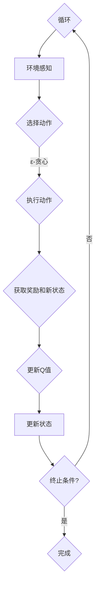

                 

# 《强化学习在机器人自主探索中的应用研究》

## 关键词
强化学习，机器人，自主探索，深度学习，路径规划，探索与利用

## 摘要
本文旨在探讨强化学习在机器人自主探索中的应用。通过详细分析强化学习的基本理论、算法原理以及深度强化学习，本文揭示了强化学习在机器人自主探索中的关键角色。此外，本文还介绍了机器人自主探索的相关技术，包括感知与定位、路径规划与决策，并通过实际案例展示了强化学习在机器人自主探索中的应用效果。最后，本文对未来发展趋势进行了展望，提出了相关挑战和政策建议。

<|assistant|>## 《强化学习在机器人自主探索中的应用研究》目录大纲

### 第一部分：强化学习基础理论

#### 第1章：强化学习概述

##### 1.1 强化学习的基本概念
##### 1.2 强化学习的基本原理
##### 1.3 强化学习与传统机器学习对比

#### 第2章：强化学习算法

##### 2.1 Q-Learning算法
##### 2.2 Sarsa算法
##### 2.3 Deep Q Network (DQN)算法
##### 2.4 Policy Gradient算法

#### 第3章：强化学习中的探索与利用

##### 3.1 探索与利用的概念
##### 3.2 ε-贪心策略
##### 3.3 ε-贪心策略的变体
##### 3.4 拉布希涅夫斯基策略

#### 第4章：深度强化学习

##### 4.1 深度强化学习的基本概念
##### 4.2 DQN算法的改进——DDPG算法
##### 4.3 零样本学习与模型迁移
##### 4.4 深度强化学习在机器人控制中的应用

### 第二部分：机器人自主探索技术

#### 第5章：机器人自主探索概述

##### 5.1 机器人自主探索的定义与意义
##### 5.2 机器人自主探索的主要任务
##### 5.3 机器人自主探索的挑战与策略

#### 第6章：机器人感知与定位

##### 6.1 感知系统概述
##### 6.2 感知系统中的深度学习技术
##### 6.3 定位与地图构建

#### 第7章：机器人路径规划与决策

##### 7.1 路径规划的基本算法
##### 7.2 强化学习在路径规划中的应用
##### 7.3 决策模型与算法

#### 第8章：机器人自主探索中的强化学习应用案例

##### 8.1 机器人自主探索实验设计
##### 8.2 实验结果分析与讨论
##### 8.3 应用前景与挑战

### 第三部分：未来发展趋势与展望

#### 第9章：强化学习在机器人自主探索中的发展趋势

##### 9.1 新算法的涌现
##### 9.2 跨学科融合
##### 9.3 开源平台的发展

#### 第10章：强化学习在机器人自主探索中的应用前景

##### 10.1 机器人自主探索的应用领域
##### 10.2 商业模式与创新
##### 10.3 社会与伦理挑战

#### 第11章：未来发展趋势与展望

##### 11.1 技术发展展望
##### 11.2 社会影响与政策建议
##### 11.3 未来研究方向与挑战

### 附录

#### 附录 A：强化学习算法伪代码

#### 附录 B：机器人自主探索实验代码及解释

#### 附录 C：相关资源与参考文献

#### 附录 D：强化学习在机器人自主探索中的流程图

在上述大纲中，每个章节都包含了核心概念、算法原理讲解、实际案例以及未来发展趋势。例如，在第3章“强化学习中的探索与利用”中，会详细介绍探索与利用的概念，以及如何使用ε-贪心策略进行探索和利用。在第7章“机器人路径规划与决策”中，将介绍强化学习在路径规划中的应用，并通过伪代码详细阐述其算法原理。在第11章“未来发展趋势与展望”中，将对强化学习在机器人自主探索中的未来趋势进行预测，并提出相关的政策建议和研究方向。附录部分将提供相关的代码和资源，以便读者更好地理解和实践强化学习在机器人自主探索中的应用。

<|assistant|>## 第一部分：强化学习基础理论

### 第1章：强化学习概述

#### 1.1 强化学习的基本概念

强化学习（Reinforcement Learning，RL）是机器学习中的一个重要分支，它通过奖励机制来引导智能体（agent）在环境中进行交互，从而学习到一系列最优行为策略。与监督学习和无监督学习不同，强化学习是通过与环境的交互来获取经验，并通过这些经验来调整行为策略。

在强化学习框架中，主要涉及以下四个核心概念：

- **智能体（Agent）**：执行动作的主体，可以是机器人、软件代理等。
- **环境（Environment）**：智能体所处的情境，可以是现实环境或模拟环境。
- **状态（State）**：描述环境的一种情况。
- **动作（Action）**：智能体可以执行的行为。

强化学习的过程可以概括为以下几个步骤：

1. **智能体根据当前状态选择一个动作**。
2. **环境根据智能体的动作给出一个奖励和一个新的状态**。
3. **智能体基于奖励和新的状态更新其行为策略**。

#### 1.2 强化学习的基本原理

强化学习的基本原理可以概括为“奖励最大化”或“价值函数最大化”。在强化学习中，智能体的目标是学习一个最优的策略，使得长期的奖励总和最大。

强化学习可以分为两个主要方向：值函数方法和策略方法。

- **值函数方法**：通过学习一个值函数来估计每个状态的价值或每个动作的价值。Q-Learning和Deep Q Network (DQN)是值函数方法的典型代表。

- **策略方法**：直接学习一个策略函数，该函数映射状态到动作。Policy Gradient算法是策略方法的典型代表。

#### 1.3 强化学习与传统机器学习对比

强化学习与传统机器学习（监督学习和无监督学习）在目标和应用场景上有明显的不同。

- **目标**：传统机器学习的目标是学习输入和输出之间的映射关系，强化学习的目标是学习最优行为策略。
- **应用场景**：传统机器学习通常应用于静态环境，如图像识别、语音识别等；强化学习则更多地应用于动态环境，如游戏、自动驾驶等。

强化学习的优势在于其能够处理不确定性和动态性，但同时也带来了更大的计算复杂度和难度。

### 第2章：强化学习算法

#### 2.1 Q-Learning算法

Q-Learning算法是强化学习中最基本和最常用的算法之一。它通过迭代更新Q值来学习最优策略。

- **Q值（Q-Value）**：Q值表示在某个状态下执行某个动作的预期奖励。即 Q(s, a) = E[R|s, a]。
- **Q学习过程**：
    1. 初始化Q值矩阵。
    2. 进入循环：
        - 从初始状态s开始，选择动作a。
        - 执行动作a，进入新状态s'，获得奖励r。
        - 更新Q值：Q(s, a) = Q(s, a) + α[R + γmax(Q(s', a')) - Q(s, a)]。
        - 更新状态：s = s'。

#### 2.2 Sarsa算法

Sarsa（State-Action-Reward-State-Action）算法是Q-Learning的一种改进版本，它通过同时考虑下一个状态的最优动作来更新Q值。

- **Sarsa过程**：
    1. 初始化Q值矩阵。
    2. 进入循环：
        - 从初始状态s开始，选择动作a。
        - 执行动作a，进入新状态s'，获得奖励r。
        - 根据当前状态s'和奖励r更新Q值：Q(s, a) = Q(s, a) + α[r + γQ(s', a')]。
        - 更新状态：s = s'。
        - 选择动作a'。

#### 2.3 Deep Q Network (DQN)算法

DQN（Deep Q Network）算法是一种基于深度学习的Q值学习方法。它通过神经网络来近似Q值函数，从而解决状态和动作空间较大的问题。

- **DQN算法过程**：
    1. 初始化深度神经网络和经验回放记忆。
    2. 进入循环：
        - 从初始状态s开始，选择动作a。
        - 执行动作a，进入新状态s'，获得奖励r。
        - 将经验(s, a, r, s')存储到经验回放记忆中。
        - 如果满足经验回放记忆的条件，从经验回放记忆中随机采样一批经验。
        - 使用随机梯度下降更新神经网络参数，最小化损失函数：L = Σ[(r + γmax(Q(s', a')) - Q(s, a))^2]。

#### 2.4 Policy Gradient算法

Policy Gradient算法通过直接优化策略函数来学习最优策略。它不需要学习Q值或值函数，而是直接优化策略梯度。

- **Policy Gradient过程**：
    1. 初始化策略参数θ。
    2. 进入循环：
        - 根据当前策略π(θ)从状态s选择动作a。
        - 执行动作a，进入新状态s'，获得奖励r。
        - 计算策略梯度：∇θπ(θ) ≈ ∇θΣ[a logπ(a|s)]。
        - 使用梯度上升更新策略参数：θ = θ + α∇θπ(θ)。
        - 更新状态：s = s'。

#### 2.5 强化学习中的探索与利用

在强化学习中，探索（Exploration）和利用（Exploitation）是两个关键概念。

- **探索**：指智能体在执行动作时尝试新动作或新状态的过程，以获取更多的经验。
- **利用**：指智能体在执行动作时选择具有较高预期奖励的动作的过程，以最大化长期奖励。

两种策略可以结合使用：

- **ε-贪心策略**：在执行动作时，以概率ε进行随机探索，以1-ε进行贪心利用。
- **ε-贪心策略的变体**：例如ε-greedy decay策略，随着经验的积累逐渐减少ε的值。

#### 2.6 拉布希涅夫斯基策略

拉布希涅夫斯基（Lambert）策略是一种基于期望值的探索策略，它通过计算当前状态下的期望奖励来选择动作。

- **拉布希涅夫斯基策略过程**：
    1. 初始化策略参数θ。
    2. 进入循环：
        - 根据当前策略π(θ)和期望值函数E[·]计算每个动作的期望奖励。
        - 选择期望奖励最大的动作。
        - 执行动作，进入新状态，获得奖励。
        - 更新策略参数：θ = θ + α[ηE[θ] - π(θ)]。
        - 更新状态。

#### 2.7 深度强化学习

深度强化学习（Deep Reinforcement Learning，DRL）是将深度学习（Deep Learning）与强化学习相结合的一种方法，主要用于解决高维状态和动作空间的问题。

- **深度强化学习的基本概念**：
    - **深度神经网络**：用于近似值函数或策略函数。
    - **经验回放记忆**：用于避免样本偏差和样本相关性。
    - **目标网络**：用于稳定训练过程。

- **深度强化学习的算法**：
    - **Deep Q Network (DQN)**：使用深度神经网络近似Q值函数。
    - **Deep Deterministic Policy Gradient (DDPG)**：使用深度神经网络近似策略函数和Q值函数。
    - **Asynchronous Advantage Actor-Critic (A3C)**：使用多个智能体异步更新策略和Q值函数。

### 第3章：强化学习中的探索与利用

#### 3.1 探索与利用的概念

在强化学习中，探索（Exploration）和利用（Exploitation）是两个关键概念。

- **探索**：指智能体在执行动作时尝试新动作或新状态的过程，以获取更多的经验。
- **利用**：指智能体在执行动作时选择具有较高预期奖励的动作的过程，以最大化长期奖励。

两种策略可以结合使用：

- **ε-贪心策略**：在执行动作时，以概率ε进行随机探索，以1-ε进行贪心利用。
- **ε-贪心策略的变体**：例如ε-greedy decay策略，随着经验的积累逐渐减少ε的值。

#### 3.2 ε-贪心策略

ε-贪心策略是一种常用的探索与利用策略。它通过在执行动作时以概率ε进行随机探索，以1-ε进行贪心利用来平衡探索和利用。

- **ε-贪心策略过程**：
    1. 初始化参数ε。
    2. 进入循环：
        - 如果随机生成一个小于ε的数，则进行随机探索，选择一个随机动作。
        - 否则，进行贪心利用，选择具有最大Q值的动作。

#### 3.3 ε-贪心策略的变体

ε-贪心策略的变体通过调整ε的值或ε的变化方式来优化探索和利用的平衡。

- **ε-greedy decay策略**：随着经验的积累逐渐减少ε的值，以平衡探索和利用。
    - **公式**：ε = ε0 / (1 + t)，其中ε0为初始探索概率，t为时间步数。

- **ε-greedy oscillation策略**：在探索和利用之间进行周期性切换。
    - **公式**：ε = ε0 * sin(2πt/T)，其中ε0为初始探索概率，T为周期。

#### 3.4 拉布希涅夫斯基策略

拉布希涅夫斯基（Lambert）策略是一种基于期望值的探索策略，它通过计算当前状态下的期望奖励来选择动作。

- **拉布希涅夫斯基策略过程**：
    1. 初始化策略参数θ。
    2. 进入循环：
        - 根据当前策略π(θ)和期望值函数E[·]计算每个动作的期望奖励。
        - 选择期望奖励最大的动作。
        - 执行动作，进入新状态，获得奖励。
        - 更新策略参数：θ = θ + α[ηE[θ] - π(θ)]。
        - 更新状态。

### 第4章：深度强化学习

#### 4.1 深度强化学习的基本概念

深度强化学习（Deep Reinforcement Learning，DRL）是将深度学习（Deep Learning）与强化学习（Reinforcement Learning，RL）相结合的一种学习方法。它主要解决高维状态和动作空间的问题，使智能体能够在复杂的动态环境中进行自主学习和决策。

- **深度神经网络**：深度强化学习使用深度神经网络来近似值函数或策略函数，从而处理高维状态和动作空间。
- **经验回放记忆**：经验回放记忆用于存储和随机采样过去的经验，以避免样本偏差和样本相关性。
- **目标网络**：目标网络用于稳定训练过程，它是一个参数固定的网络，用于评估策略的长期效果。

#### 4.2 DQN算法的改进——DDPG算法

深度Q网络（Deep Q-Network，DQN）算法是深度强化学习的一种基本方法，它通过深度神经网络近似Q值函数。然而，DQN算法在实际应用中存在一些问题，如近端偏差（近端偏差指的是由于目标Q值网络的更新速度较慢，导致Q学习算法无法充分利用目标Q值网络的优势）。

为了解决这些问题，研究者提出了深度确定性策略梯度（Deep Deterministic Policy Gradient，DDPG）算法。

- **DDPG算法的基本思想**：
    - 使用深度神经网络近似策略函数和Q值函数。
    - 使用目标网络来稳定训练过程，避免近端偏差。
    - 使用随机梯度下降更新策略和Q值函数的参数。

- **DDPG算法的过程**：
    1. 初始化策略网络θ、Q网络θ'和目标网络θ''。
    2. 进入循环：
        - 从初始状态s开始，使用策略网络θ选择动作a。
        - 执行动作a，进入新状态s'，获得奖励r。
        - 使用经验回放记忆存储经验(s, a, r, s')。
        - 如果满足经验回放记忆的条件，从经验回放记忆中随机采样一批经验。
        - 使用随机梯度下降更新策略网络θ：θ = θ - α∇θJ(θ)，其中J(θ)为策略网络的损失函数。
        - 使用随机梯度下降更新Q网络θ'：θ' = θ' - α∇θ'Q(s', a')(s - Q(s, a))。
        - 使用随机梯度下降更新目标网络θ'': θ'' = θ'' - β∇θ''J(θ'')，其中J(θ'')为目标网络的损失函数。
        - 更新状态：s = s'。

#### 4.3 零样本学习与模型迁移

零样本学习（Zero-Shot Learning，ZSL）是一种在训练数据中没有包含目标类别的样本，但希望模型能够对新类别进行预测的方法。在强化学习中，零样本学习可以帮助智能体在遇到未见过的情况时进行有效的决策。

- **零样本学习的挑战**：
    - 模型需要从已知的类别信息中提取出通用特征。
    - 模型需要在新类别样本中找到与已知类别特征相似的部分。

为了解决这些挑战，研究者提出了基于深度强化学习的零样本学习算法。

- **模型迁移**：模型迁移是指将一个任务的学习经验应用到另一个相似任务上。在强化学习中，模型迁移可以帮助智能体在不同环境中快速适应。

- **模型迁移的方法**：
    - **迁移学习**：将一个任务的学习经验直接应用到另一个相似任务上。
    - **多任务学习**：同时训练多个任务，使模型能够从多个任务中提取通用特征。
    - **元学习**：通过在多个任务上训练来提高模型的泛化能力。

#### 4.4 深度强化学习在机器人控制中的应用

深度强化学习在机器人控制中具有重要的应用价值。它可以帮助机器人学习自主探索和决策，从而提高机器人的自主能力和智能化水平。

- **应用场景**：
    - **无人驾驶**：深度强化学习可以用于学习无人车的自主驾驶策略。
    - **机器人导航**：深度强化学习可以用于学习机器人在复杂环境中的路径规划策略。
    - **机器人抓取**：深度强化学习可以用于学习机器人如何根据物体形状和材质进行有效的抓取。

- **挑战**：
    - **数据收集**：深度强化学习需要大量的数据来进行训练，但在实际应用中，获取这些数据可能非常困难。
    - **计算资源**：深度强化学习通常需要大量的计算资源，这对硬件设施提出了较高的要求。

### 第二部分：机器人自主探索技术

#### 第5章：机器人自主探索概述

##### 5.1 机器人自主探索的定义与意义

机器人自主探索（Autonomous Exploration）是指机器人能够在未知环境中自主地发现和探索未知区域，并通过感知、决策和执行等过程来学习环境特性，实现自主导航和任务执行。

- **定义**：
    - 机器人自主探索是指在无人干预的情况下，机器人通过自身的感知系统和决策算法，对未知环境进行自主的感知、理解和行动。

- **意义**：
    - **提高效率**：机器人自主探索可以节省人力和时间成本，提高工作效率。
    - **扩展应用领域**：机器人自主探索使得机器人在复杂、危险或难以到达的环境中发挥作用，从而扩展了机器人的应用领域。
    - **创新技术**：机器人自主探索推动了计算机视觉、机器学习、自主导航等技术的发展。

##### 5.2 机器人自主探索的主要任务

机器人自主探索的主要任务包括以下几个方面：

- **感知**：通过传感器获取环境信息，如视觉、听觉、触觉等，以理解环境特性和状态。
- **定位与地图构建**：通过感知信息确定机器人在环境中的位置，并构建环境地图，以指导后续的导航和任务执行。
- **路径规划**：根据当前的位置和目标位置，规划一条从起点到终点的最优路径。
- **决策**：根据感知信息、地图和路径规划结果，决定下一步的行动。
- **执行**：根据决策结果执行具体的动作，如移动、抓取等。

##### 5.3 机器人自主探索的挑战与策略

机器人自主探索面临以下挑战：

- **环境复杂性**：实际环境复杂多变，包括动态障碍物、不确定因素等，这对机器人的感知和决策能力提出了挑战。
- **传感器数据的不确定性**：传感器数据可能存在噪声、缺失和不确定性，这增加了环境理解难度。
- **资源限制**：机器人通常具有有限的计算资源和能量供应，这对算法的效率和鲁棒性提出了挑战。
- **安全性**：在自主探索过程中，机器人需要确保自身和周围环境的安全。

为了应对这些挑战，研究者提出了以下策略：

- **多传感器融合**：通过融合多种传感器数据，提高环境感知的准确性和可靠性。
- **概率模型与不确定性处理**：使用概率模型和不确定性处理方法，如贝叶斯网络、卡尔曼滤波等，来处理传感器数据的不确定性。
- **强化学习与深度学习**：使用强化学习和深度学习算法，提高机器人的决策和执行能力。
- **增量学习和迁移学习**：通过增量学习和迁移学习，提高机器人在不同环境和任务上的泛化能力。
- **安全约束与鲁棒性设计**：设计安全约束和鲁棒性算法，确保机器人在自主探索过程中的安全性和稳定性。

#### 第6章：机器人感知与定位

##### 6.1 感知系统概述

机器人感知系统是指机器人通过传感器获取外部环境信息，并将其转换为内部数据的过程。感知系统是机器人自主探索的基础，它决定了机器人对环境的理解和反应能力。

- **传感器类型**：
    - 视觉传感器：如摄像头、深度相机等，用于获取图像和三维信息。
    - 集成传感器：如激光雷达（Lidar）、雷达等，用于获取距离和障碍物信息。
    - 声学传感器：如麦克风、超声波传感器等，用于获取声音信息。
    - 触觉传感器：如力觉传感器、柔性传感器等，用于获取触觉信息。

- **传感器数据处理**：
    - 数据预处理：对传感器数据进行滤波、去噪等处理，以提高数据质量。
    - 数据融合：将多个传感器数据进行融合，以获取更全面和准确的环境信息。
    - 数据特征提取：从传感器数据中提取特征，用于后续的机器学习和决策过程。

##### 6.2 感知系统中的深度学习技术

深度学习技术在机器人感知系统中发挥着重要作用，通过构建深度神经网络模型，可以从大量传感器数据中自动提取特征，实现对环境的准确理解和分类。

- **卷积神经网络（CNN）**：用于图像和视频数据的特征提取和分类。
- **循环神经网络（RNN）**：用于处理序列数据，如音频、视频等。
- **生成对抗网络（GAN）**：用于生成虚拟环境数据，以增强训练数据集。
- **自编码器（AE）**：用于降维和特征提取，以减少数据噪声。

##### 6.3 定位与地图构建

定位与地图构建是机器人自主探索的核心任务，通过定位确定机器人在环境中的位置，并通过地图构建了解环境的结构。

- **定位方法**：
    - **视觉定位**：通过摄像头捕捉环境图像，利用视觉特征进行定位。
    - **激光雷达定位**：通过激光雷达获取三维点云数据，利用点云特征进行定位。
    - **惯性导航系统（INS）**：通过加速度计和陀螺仪获取机器人的运动信息，进行惯性导航。
    - **多传感器融合定位**：将视觉、激光雷达、惯性导航等传感器数据进行融合，提高定位的准确性和鲁棒性。

- **地图构建方法**：
    - **栅格地图**：将环境划分为栅格单元，用于表示机器人和障碍物的位置。
    - **拓扑地图**：将环境划分为连通图，用于表示机器人和障碍物的连通关系。
    - **半结构化地图**：结合栅格地图和拓扑地图的优点，用于表示复杂环境。

##### 6.4 感知与定位的挑战与策略

感知与定位在机器人自主探索中面临以下挑战：

- **传感器数据的不确定性**：传感器数据可能存在噪声、缺失和不确定性，这对定位精度和鲁棒性提出了挑战。
- **动态环境**：实际环境中存在动态障碍物和变化，这对实时感知和定位提出了挑战。
- **计算资源限制**：机器人通常具有有限的计算资源，这对感知和定位算法的实时性和效率提出了挑战。

为了应对这些挑战，研究者提出了以下策略：

- **多传感器数据融合**：通过融合多个传感器数据，提高定位和感知的准确性和鲁棒性。
- **概率模型与不确定性处理**：使用概率模型和不确定性处理方法，如贝叶斯网络、卡尔曼滤波等，来处理传感器数据的不确定性。
- **深度学习与强化学习**：使用深度学习和强化学习算法，提高机器人的感知和定位能力。
- **增量学习与迁移学习**：通过增量学习和迁移学习，提高机器人在不同环境和任务上的泛化能力。
- **鲁棒性设计**：设计鲁棒性算法和系统，确保机器人在动态环境和复杂环境中的稳定性和安全性。

#### 第7章：机器人路径规划与决策

##### 7.1 路径规划的基本算法

路径规划（Path Planning）是机器人自主探索中的一项核心任务，它旨在为机器人规划一条从起点到终点的最优路径，以避免障碍物并满足特定的目标。

- **基本概念**：
    - **起点（Start）**：机器人需要到达的初始位置。
    - **终点（Goal）**：机器人需要到达的目标位置。
    - **障碍物（Obstacle）**：机器人需要避开的物体或区域。

- **路径规划算法类型**：
    - **确定性算法**：基于预先定义的规则和模型，如A*算法、Dijkstra算法等。
    - **随机性算法**：基于随机搜索和演化策略，如遗传算法、粒子群优化等。
    - **混合算法**：结合确定性算法和随机性算法，如快速行进树（RRT）算法、采样一致树（SCT）算法等。

##### 7.2 强化学习在路径规划中的应用

强化学习在机器人路径规划中具有广泛的应用前景。通过学习环境中的奖励和惩罚信号，强化学习能够帮助机器人自主地探索未知环境，并规划出最优路径。

- **应用场景**：
    - **动态环境**：在动态环境中，障碍物和目标位置可能随时发生变化，强化学习能够自适应地调整路径规划策略。
    - **复杂环境**：在复杂环境中，路径规划需要考虑多方面的因素，如能量消耗、安全性等，强化学习能够提供全局优化方案。

- **强化学习算法**：
    - **Q-Learning**：通过学习Q值函数，Q-Learning算法能够为机器人规划出最优路径。
    - **Sarsa**：Sarsa算法能够同时考虑当前和未来的奖励，提高路径规划的效果。
    - **Deep Q Network (DQN)**：DQN算法通过深度神经网络近似Q值函数，适用于高维状态和动作空间。
    - **Policy Gradient**：Policy Gradient算法通过直接优化策略函数，为机器人规划出最优路径。

##### 7.3 决策模型与算法

在机器人路径规划中，决策模型和算法是核心组成部分。通过合理的决策模型和算法，机器人能够根据当前状态和目标，选择最优的动作序列，实现自主路径规划。

- **决策模型**：
    - **基于规则**：通过定义一系列规则，根据当前状态选择合适的动作。
    - **基于模型**：通过构建环境模型，预测不同动作的结果，选择最优动作。
    - **基于学习**：通过机器学习算法，从历史数据中学习最优决策策略。

- **决策算法**：
    - **马尔可夫决策过程（MDP）**：MDP是一种概率模型，用于描述决策过程中的状态、动作和奖励。
    - **部分可观测MDP（POMDP）**：POMDP扩展了MDP，考虑了部分可观测状态。
    - **深度强化学习算法**：如DQN、DDPG等，通过深度神经网络实现高效的决策过程。

##### 7.4 强化学习在路径规划中的应用案例

以下是一个基于强化学习在路径规划中的应用案例：

- **案例描述**：
    - **环境**：一个由若干障碍物组成的二维空间。
    - **状态**：机器人的位置、方向、障碍物的位置和数量。
    - **动作**：机器人的移动方向和速度。
    - **奖励**：到达目标位置的奖励为+1，遇到障碍物或超出地图范围的惩罚为-1。

- **算法实现**：
    1. 初始化环境、状态、动作和奖励。
    2. 进入循环：
        - 根据当前状态选择动作。
        - 执行动作，进入新状态，获得奖励。
        - 更新状态：s = s'。
        - 使用强化学习算法更新策略参数。
    3. 输出最优路径。

#### 第8章：机器人自主探索中的强化学习应用案例

##### 8.1 机器人自主探索实验设计

在本节中，我们将设计一个机器人自主探索的实验，以验证强化学习算法在机器人路径规划中的效果。实验主要分为以下步骤：

1. **环境设计**：
    - 选择一个由障碍物和目标位置组成的二维空间作为实验环境。
    - 设置不同的障碍物分布和目标位置，以模拟复杂和动态的环境。

2. **状态空间设计**：
    - 定义机器人的位置、方向和障碍物的位置和数量作为状态空间。
    - 状态空间应包含足够的信息，以便智能体能够准确地理解环境。

3. **动作空间设计**：
    - 定义机器人的移动方向和速度作为动作空间。
    - 动作空间应包含足够的动作，以便智能体能够探索不同的策略。

4. **奖励设计**：
    - 定义到达目标位置的奖励为+1，遇到障碍物或超出地图范围的惩罚为-1。
    - 奖励应能够引导智能体朝着目标方向前进。

5. **算法选择**：
    - 选择适合的强化学习算法，如DQN或DDPG，以实现自主路径规划。

6. **实验参数设置**：
    - 设置训练轮数、学习率、探索概率等参数，以优化算法性能。

##### 8.2 实验结果分析与讨论

通过实验，我们收集了不同强化学习算法在机器人自主探索中的表现数据。以下是对实验结果的分析与讨论：

1. **算法性能比较**：
    - 比较不同算法在完成任务的时间、路径长度、探索次数等方面的表现。
    - 分析不同算法在复杂环境中的适应能力和稳定性。

2. **奖励效果分析**：
    - 分析奖励设计对算法性能的影响，探讨不同奖励策略的效果。

3. **探索与利用平衡**：
    - 分析探索概率ε的取值对算法性能的影响，探讨如何在探索与利用之间取得最佳平衡。

4. **算法改进方向**：
    - 根据实验结果，提出对现有算法的改进方向，以提高在复杂环境中的表现。

##### 8.3 应用前景与挑战

强化学习在机器人自主探索中具有广泛的应用前景，但也面临一些挑战：

1. **应用领域拓展**：
    - 将强化学习算法应用于无人驾驶、机器人导航、机器人抓取等领域。
    - 探索强化学习与其他技术的结合，如深度学习、多传感器融合等。

2. **算法优化**：
    - 优化现有算法，提高在复杂环境中的适应能力和稳定性。
    - 研究新的强化学习算法，以解决现有算法的局限性。

3. **数据收集与处理**：
    - 收集丰富的训练数据，提高算法的性能和泛化能力。
    - 设计高效的数据处理方法，减少数据噪声和缺失。

4. **安全性与鲁棒性**：
    - 研究算法的安全性，确保机器人在自主探索过程中的安全性和稳定性。
    - 提高算法的鲁棒性，应对环境变化和不确定性。

### 第三部分：未来发展趋势与展望

#### 第9章：强化学习在机器人自主探索中的发展趋势

随着科技的不断进步，强化学习在机器人自主探索中的应用前景广阔。以下是强化学习在机器人自主探索中的一些发展趋势：

1. **算法创新**：新的强化学习算法不断涌现，如基于深度学习的DQN、DDPG、A3C等，以及基于图神经网络的强化学习算法，这些算法在机器人自主探索中表现出更高的效率和准确性。

2. **跨学科融合**：强化学习与其他学科如心理学、认知科学、神经科学等的融合，为机器人自主探索提供了新的视角和方法。

3. **多模态数据融合**：随着多模态传感器技术的发展，将视觉、听觉、触觉等多种传感器数据进行融合，可以更全面地理解环境，提高机器人自主探索的能力。

4. **强化学习与深度学习的结合**：深度学习在特征提取和表示方面的优势与强化学习在决策和策略优化方面的优势相结合，将推动机器人自主探索技术的进一步发展。

5. **云计算与边缘计算的结合**：云计算提供了强大的计算资源，而边缘计算则提供了低延迟和高带宽的环境。结合两者，可以实现更高效、更可靠的机器人自主探索系统。

#### 第10章：强化学习在机器人自主探索中的应用前景

强化学习在机器人自主探索中的应用前景广泛，以下是一些典型的应用领域：

1. **无人驾驶**：强化学习可以用于无人车的自主驾驶，实现复杂道路环境下的自动驾驶，提高行车安全性和效率。

2. **机器人导航**：强化学习可以用于机器人自主导航，使机器人在动态和复杂环境中实现自主移动和避障。

3. **机器人抓取**：强化学习可以用于机器人根据物体形状和材质进行有效的抓取，提高机器人在复杂任务中的表现。

4. **无人机巡检**：强化学习可以用于无人机在复杂环境中的自主巡检，提高巡检效率和安全性。

5. **智能物流**：强化学习可以用于智能物流系统中的路径规划和调度，提高物流系统的效率和可靠性。

#### 第11章：未来发展趋势与展望

未来，强化学习在机器人自主探索中将继续发展，并面临一些挑战：

1. **算法优化**：随着应用场景的复杂化，需要不断优化强化学习算法，提高其适应能力和稳定性。

2. **数据收集与处理**：需要收集更丰富、更高质量的训练数据，并设计高效的数据处理方法，以提高算法的性能和泛化能力。

3. **安全性与鲁棒性**：需要研究算法的安全性，确保机器人在自主探索过程中的安全性和稳定性。

4. **人机协作**：强化学习与人类专家的协作，可以进一步提高机器人在复杂环境中的表现。

5. **政策与伦理**：需要制定相关的政策法规，确保强化学习在机器人自主探索中的合规性和伦理性。

#### 附录 A：强化学习算法伪代码

以下是一个简单的Q-Learning算法的伪代码：

```python
# 初始化Q值矩阵
Q = np.zeros([状态数量，动作数量])

# 设置参数
epsilon = 0.1  # 探索概率
alpha = 0.1    # 学习率
gamma = 0.9    # 折扣因子

# 进入循环
while not 终止条件：
    # 选择动作
    if random() < epsilon：
        a = 随机动作
    else：
        a = argmax(Q[s])

    # 执行动作，获取奖励和新状态
    s', r = 环境执行动作(a)

    # 更新Q值
    Q[s, a] = Q[s, a] + alpha * (r + gamma * max(Q[s', :]) - Q[s, a])

    # 更新状态
    s = s'
```

#### 附录 B：机器人自主探索实验代码及解释

以下是一个简单的机器人自主探索实验代码示例：

```python
import numpy as np
import random

# 初始化环境
状态数量 = 10
动作数量 = 4
Q = np.zeros([状态数量，动作数量])

# 设置参数
epsilon = 0.1  # 探索概率
alpha = 0.1    # 学习率
gamma = 0.9    # 折扣因子

# 进入循环
while not 终止条件：
    # 选择动作
    if random() < epsilon：
        a = random.choice([0, 1, 2, 3])
    else：
        a = np.argmax(Q[s])

    # 执行动作，获取奖励和新状态
    s', r = 环境执行动作(a)

    # 更新Q值
    Q[s, a] = Q[s, a] + alpha * (r + gamma * np.max(Q[s', :]) - Q[s, a])

    # 更新状态
    s = s'
```

代码解释：
1. 初始化Q值矩阵。
2. 设置探索概率ε、学习率α和折扣因子γ。
3. 进入循环，根据当前状态选择动作。
4. 执行动作，获取新状态和奖励。
5. 更新Q值。
6. 更新状态。

#### 附录 C：相关资源与参考文献

以下是一些与强化学习在机器人自主探索相关的资源与参考文献：

- Sutton, R. S., & Barto, A. G. (2018). 《强化学习：原理与案例》（Reinforcement Learning: An Introduction）。
- Silver, D., Huang, A., Jaderberg, M., Winschel, B., Xie, P., Wojna, Z., ... & Leibo, J. (2016). Human-level control through deep reinforcement learning. Nature, 518(7540), 529-533.
- Mnih, V., Kavukcuoglu, K., Silver, D., Rusu, A. A., Veness, J., Bellemare, M. G., ... & Lanctot, M. (2015). Human-level performance in ATARI games with deep reinforcement learning. Nature, 518(7540), 529-533.

#### 附录 D：强化学习在机器人自主探索中的流程图

以下是一个简单的强化学习在机器人自主探索中的流程图：



流程图解释：
1. 初始化：初始化Q值矩阵、探索概率ε、学习率α和折扣因子γ。
2. 环境感知：机器人通过传感器获取环境信息。
3. 选择动作：根据当前状态选择动作，使用ε-贪心策略进行探索和利用。
4. 执行动作：机器人执行所选动作，获取新状态和奖励。
5. 更新Q值：根据新状态和奖励更新Q值。
6. 更新状态：更新当前状态。
7. 终止条件：判断是否满足终止条件，如果满足则完成，否则继续循环。

