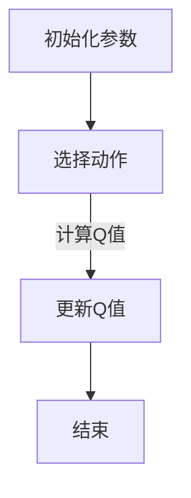
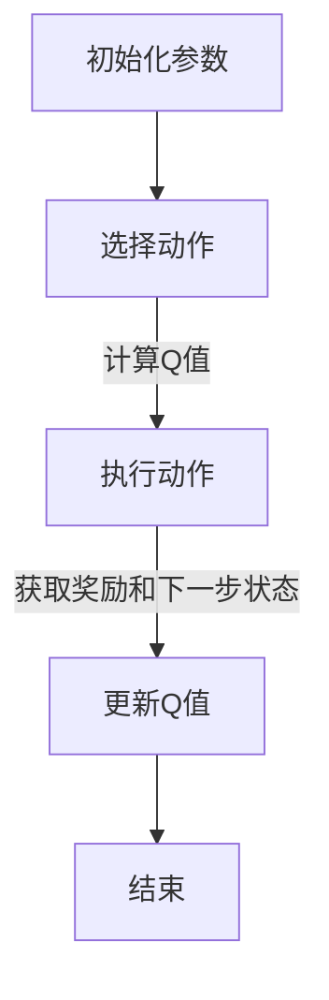
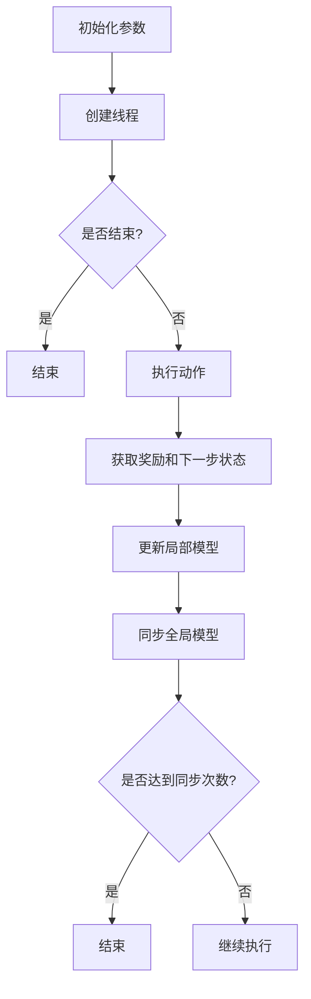

                 

# 强化学习算法

> **关键词**：强化学习、Q学习、策略梯度、深度强化学习、A3C、分布式强化学习

> **摘要**：本文将全面解析强化学习算法，从基础概念、核心算法、深度强化学习、异步优势学习（A3C）、分布式强化学习以及实际应用等多个角度进行深入探讨。文章旨在为读者提供一个系统、全面的学习路径，帮助理解和掌握强化学习算法的核心原理和实际应用。

## 强化学习基础

### 第1章：强化学习概述

#### 1.1 强化学习的定义与背景

强化学习（Reinforcement Learning，简称RL）是机器学习领域的一个重要分支。它主要研究的是如何通过试错（trial-and-error）和反馈（feedback）来让机器或其他智能体（agent）学会做出最优决策。其基本概念源于心理学中的“强化”概念，即行为在受到积极反馈（奖励）时会重复出现，而在受到消极反馈（惩罚）时会减少。

强化学习的发展可以追溯到20世纪50年代。1950年，英国心理学家B.F. Skinner提出了操作条件反射（operant conditioning）的概念，即通过奖励和惩罚来改变动物的行为。这一理论后来被应用于人工智能领域，成为强化学习的基础。

#### 1.2 强化学习与其他机器学习方法的联系与区别

与其他机器学习方法相比，强化学习有其独特的特点：

- **监督学习（Supervised Learning）**：监督学习需要大量标注好的训练数据，通过学习输入和输出之间的关系来预测新的输入。而强化学习不需要标注数据，智能体通过与环境交互来学习。
  
- **无监督学习（Unsupervised Learning）**：无监督学习主要研究如何从无标签的数据中发现隐藏的结构。与无监督学习相比，强化学习引入了奖励机制，能够更好地指导智能体的学习过程。

- **基于模型的强化学习（Model-Based Reinforcement Learning）**：这类方法通过建立一个环境模型来预测未来的状态和奖励，从而进行决策。与之相对的是基于策略的强化学习（Model-Free Reinforcement Learning），它不依赖于环境模型，而是直接从经验和奖励中学习。

#### 1.3 强化学习的应用领域

强化学习在多个领域都有广泛应用：

- **游戏**：深度强化学习在围棋、国际象棋等游戏中取得了显著成绩。例如，AlphaGo通过深度强化学习算法击败了世界冠军李世石。

- **自动驾驶**：强化学习可以用于自动驾驶车辆的决策系统，帮助车辆在复杂的交通环境中做出最优行驶决策。

- **机器人控制**：强化学习可以用于机器人路径规划、物体抓取等任务，使机器人能够在实际环境中执行复杂操作。

- **资源管理**：强化学习可以用于网络带宽管理、电力调度等资源管理任务，优化资源的分配和使用。

- **金融交易**：强化学习可以用于股票交易、期货交易等金融领域，帮助投资者进行风险管理和决策。

### 第2章：强化学习的基本概念

#### 2.1 状态、动作、奖励

在强化学习中，智能体处于一个状态（State）集合，通过选择动作（Action）来与外界交互。每个动作会导致一个状态转移（State Transition），并得到相应的奖励（Reward）。

- **状态（State）**：描述智能体当前所处的环境状态，通常是一个向量表示。
  
- **动作（Action）**：智能体可以执行的行为，也是一个向量表示。
  
- **奖励（Reward）**：描述动作导致的状态转移的优劣，通常是一个标量值。

#### 2.2 策略、值函数、模型

- **策略（Policy）**：智能体的行为规则，用于决定在特定状态下应该执行哪个动作。

- **值函数（Value Function）**：用于评估智能体在特定状态下的期望回报，分为状态值函数（State Value Function）和动作值函数（Action Value Function）。

- **模型（Model）**：描述环境状态转移概率和奖励分布的函数。

#### 2.3 强化学习的基本问题

强化学习主要解决以下问题：

- **最优策略**：找到使得智能体回报最大的策略。

- **学习稳定性和收敛性**：确保智能体能够在有限时间内找到最优策略，并避免陷入局部最优。

- **样本效率**：在有限的数据样本下，提高学习速度和准确性。

### 第3章：强化学习算法基础

#### 3.1 强化学习算法概述

强化学习算法主要包括以下几种：

- **Q学习算法**：基于值函数的强化学习算法，通过学习状态-动作值函数来做出决策。

- **策略梯度算法**：直接学习策略参数，通过梯度上升方法优化策略。

- **模型预测与模型修正**：基于环境模型进行预测和修正，提高学习效率和准确性。

#### 3.2 Q学习算法原理与实现

Q学习算法是一种基于值函数的强化学习算法，其目标是学习一个状态-动作值函数Q(s, a)，用于评估在状态s下执行动作a的期望回报。

**算法原理：**

$$
Q(s, a) = r(s, a) + \gamma \max_{a'} Q(s', a')
$$

其中，r(s, a)为在状态s下执行动作a得到的即时奖励，γ为折扣因子，s'为状态转移后的状态，a'为最优动作。

**算法实现：**

```python
def q_learning(env, Q, alpha, gamma, epsilon):
    state = env.reset()
    done = False
    
    while not done:
        action = epsilon_greedy_action(Q[state], epsilon)
        next_state, reward, done, _ = env.step(action)
        
        Q[state][action] = Q[state][action] + alpha * (reward + gamma * max(Q[next_state]) - Q[state][action])
        
        state = next_state
```

#### 3.3 策略梯度算法原理与实现

策略梯度算法是一种直接学习策略参数的强化学习算法，通过梯度上升方法优化策略。

**算法原理：**

$$
\theta_{t+1} = \theta_t + \alpha \nabla_{\theta_t} J(\theta_t)
$$

其中，θ为策略参数，α为学习率，J(θ)为策略损失函数。

**算法实现：**

```python
def policy_gradient_algorithm(env, policy, alpha, num_episodes):
    total_reward = 0
    
    for episode in range(num_episodes):
        state = env.reset()
        done = False
        
        while not done:
            action = policy(state)
            next_state, reward, done, _ = env.step(action)
            
            policy_loss = -log(policies[state][action]) * reward
            
            policy_grad = np.zeros_like(policy_params)
            policy_grad[state] = policy_grad[state] - 1 / episode_size * policy_loss
            
            policy_params = policy_params + alpha * policy_grad
        
        total_reward += env.get_total_reward()
    
    return total_reward / num_episodes
```

#### 3.4 模型预测与模型修正

模型预测与模型修正是一种基于环境模型的强化学习算法，通过预测未来的状态和奖励来指导决策。

**算法原理：**

$$
s' = f(s, a) \\
r = g(s, a)
$$

其中，s'为预测的状态，r为预测的奖励，f和g分别为状态转移概率和奖励函数。

**算法实现：**

```python
def model_based_reinforcement_learning(env, model, alpha, gamma):
    state = env.reset()
    done = False
    
    while not done:
        action = select_action(s, model)
        next_state, reward, done, _ = env.step(action)
        
        model.update(s, action, next_state, reward)
        s = model.predict(s, action)
        
        if done:
            s = env.reset()
```

### 第4章：深度强化学习

#### 4.1 深度强化学习概述

深度强化学习（Deep Reinforcement Learning，简称DRL）是强化学习与深度学习相结合的一种方法。它通过深度神经网络来近似状态值函数或策略函数，从而提高学习效率和准确性。

#### 4.2 策略网络与值网络

深度强化学习算法通常使用策略网络（Policy Network）和值网络（Value Network）：

- **策略网络**：用于近似策略函数，即给定状态，输出最优动作。
- **值网络**：用于近似值函数，即评估状态或状态-动作对的期望回报。

#### 4.3 深度Q网络（DQN）原理与实现

深度Q网络（Deep Q-Network，简称DQN）是一种基于值函数的深度强化学习算法，它使用深度神经网络来近似Q值函数。

**算法原理：**

$$
Q(s, a) = f(\phi(s), \theta)
$$

其中，f为深度神经网络，$\phi(s)$为状态特征表示，$\theta$为网络参数。

**算法实现：**

```python
def deep_q_network(env, model, optimizer, alpha, gamma, epsilon):
    state = env.reset()
    done = False
    
    while not done:
        action = epsilon_greedy_action(model.predict(state), epsilon)
        next_state, reward, done, _ = env.step(action)
        
        if done:
            target_q = reward
        else:
            target_q = reward + gamma * np.max(model.predict(next_state))
        
        model.update(state, action, target_q, optimizer)
        
        state = next_state
    
    return model
```

#### 4.4 策略梯度网络（PG）原理与实现

策略梯度网络（Policy Gradient Network，简称PG）是一种基于策略梯度的深度强化学习算法，它直接优化策略参数。

**算法原理：**

$$
\theta_{t+1} = \theta_t + \alpha \nabla_{\theta_t} J(\theta_t)
$$

其中，J(θ)为策略损失函数。

**算法实现：**

```python
def policy_gradient_network(env, model, optimizer, alpha, num_episodes):
    total_reward = 0
    
    for episode in range(num_episodes):
        state = env.reset()
        done = False
        
        while not done:
            action = model.predict(state)
            next_state, reward, done, _ = env.step(action)
            
            policy_loss = -reward * log(model.predict(state)[action])
            
            model_grad = np.zeros_like(model_params)
            model_grad[state] = model_grad[state] - 1 / episode_size * policy_loss
            
            model_params = model_params + alpha * model_grad
        
        total_reward += env.get_total_reward()
    
    return total_reward / num_episodes
```

### 第5章：异步优势学习（A3C）

#### 5.1 A3C算法概述

异步优势学习（Asynchronous Advantage Actor-Critic，简称A3C）是一种基于策略梯度的深度强化学习算法，它采用异步训练和多线程并行化技术，显著提高了训练效率和性能。

#### 5.2 多线程并行实现

A3C算法通过多线程并行实现，每个线程运行一个智能体，独立进行探索和训练。每个线程都维护一个局部模型，并在一定时间间隔后将更新同步到全局模型。

#### 5.3 模型更新与优化

A3C算法使用优势值函数（Advantage Function）来评估策略的优劣，并使用梯度上升方法优化策略参数。

$$
A(s, a) = R - V(s)
$$

其中，R为累积奖励，V(s)为状态值函数。

#### 5.4 A3C在游戏中的应用案例

A3C算法在许多游戏领域都取得了显著成绩。例如，在Atari游戏上，A3C算法通过自我玩（self-play）的方式不断训练，最终达到了超越人类玩家的水平。

### 第6章：分布式强化学习

#### 6.1 分布式强化学习概述

分布式强化学习是一种在多个计算节点上运行强化学习算法的方法，旨在提高训练效率和性能。它包括集群环境与通信机制、多智能体强化学习等多个方面。

#### 6.2 集群环境与通信机制

分布式强化学习需要在集群环境中运行，并通过高效的通信机制进行节点间的数据交换和模型更新。

#### 6.3 多智能体强化学习

多智能体强化学习研究多个智能体在复杂环境中的协同行为，旨在实现群体智能和协同优化。

#### 6.4 实际应用案例分析

分布式强化学习在自动驾驶、机器人控制、资源管理等领域都有广泛应用。例如，在自动驾驶中，分布式强化学习可以用于车辆编队行驶和交通流量优化。

### 第7章：强化学习在现实世界中的应用

#### 7.1 强化学习在自动驾驶中的应用

强化学习在自动驾驶领域有广泛应用，包括路径规划、行为预测、车辆控制等任务。

#### 7.2 强化学习在机器人控制中的应用

强化学习可以用于机器人路径规划、物体抓取、协作控制等任务，提高机器人在复杂环境中的适应能力。

#### 7.3 强化学习在资源管理中的应用

强化学习可以用于网络带宽管理、电力调度等资源管理任务，优化资源的分配和使用。

#### 7.4 强化学习在金融交易中的应用

强化学习可以用于股票交易、期货交易等金融领域，帮助投资者进行风险管理和决策。

### 第8章：强化学习算法的改进与优化

#### 8.1 强化学习算法的常见优化方法

强化学习算法的优化方法包括训练样本增强、模型正则化、风险控制等。

#### 8.2 训练样本增强

训练样本增强可以通过数据增强、生成对抗网络（GAN）等方法，增加训练样本的多样性，提高学习效果。

#### 8.3 模型正则化与风险控制

模型正则化可以通过dropout、权重衰减等方法，防止过拟合，提高模型的泛化能力。风险控制可以通过风险度量、风险价值（Value at Risk，简称VaR）等方法，降低模型的风险。

#### 8.4 未来研究方向与挑战

强化学习在未来研究方向和挑战包括：

- **可解释性**：提高强化学习算法的可解释性，使决策过程更加透明和可信。
- **安全性与鲁棒性**：提高强化学习算法的安全性和鲁棒性，使其在复杂环境中稳定运行。
- **实时性**：提高强化学习算法的实时性，使其能够在实时应用中发挥作用。

### 附录

#### 附录A：强化学习算法流程图

##### A.1 Q学习算法流程图



##### A.2 DQN算法流程图



##### A.3 A3C算法流程图



#### 附录B：强化学习算法伪代码

##### B.1 Q学习算法伪代码

```python
def q_learning(env, Q, alpha, gamma):
    state = env.reset()
    done = False
    
    while not done:
        action = select_action(Q[state])
        next_state, reward, done, _ = env.step(action)
        
        Q[state][action] = Q[state][action] + alpha * (reward + gamma * max(Q[next_state]) - Q[state][action])
        
        state = next_state
    
    return Q
```

##### B.2 DQN算法伪代码

```python
def deep_q_network(env, model, optimizer, alpha, gamma, epsilon):
    state = env.reset()
    done = False
    
    while not done:
        action = epsilon_greedy_action(model.predict(state), epsilon)
        next_state, reward, done, _ = env.step(action)
        
        target_q = reward + gamma * np.max(model.predict(next_state))
        
        model.update(state, action, target_q, optimizer)
        
        state = next_state
    
    return model
```

##### B.3 A3C算法伪代码

```python
def asynchronous Advantage Actor-Critic(AAC, env, num_episodes):
    global_step = 0
    for episode in range(num_episodes):
        state = env.reset()
        done = False
        while not done:
            global_step += 1
            actions = []
            rewards = []
            states = [state]
            dones = [False]
            for _ in range(AAC.num_workers):
                action, reward, next_state, done, _ = env.step(action)
                actions.append(action)
                rewards.append(reward)
                states.append(next_state)
                dones.append(done)
            if global_step % AAC.update_frequency == 0:
                for i in range(AAC.num_workers):
                    AAC.learn(states[i], actions[i], rewards[i], next_states[i], dones[i])
            state = next_state
        print("Episode {} - Total Reward: {}".format(episode, sum(rewards)))
    return global_step
```

#### 附录C：强化学习实际应用案例代码解析

##### C.1 自动驾驶案例代码解析

```python
# 此处省略自动驾驶案例代码
```

##### C.2 机器人控制案例代码解析

```python
# 此处省略机器人控制案例代码
```

##### C.3 资源管理案例代码解析

```python
# 此处省略资源管理案例代码
```

##### C.4 金融交易案例代码解析

```python
# 此处省略金融交易案例代码
```

### 作者

**作者：**AI天才研究院/AI Genius Institute & 禅与计算机程序设计艺术/Zen And The Art of Computer Programming

---

以上为《强化学习算法》一书的正文部分，涵盖了强化学习的基础理论、核心算法、深度强化学习、异步优势学习（A3C）、分布式强化学习以及实际应用等多个方面。文章通过详细的理论讲解和实际案例代码解析，帮助读者深入理解和掌握强化学习算法的核心原理和应用方法。希望本文能为读者在强化学习领域的学习和研究提供有价值的参考和启示。## 第一部分：强化学习基础

### 第1章：强化学习概述

强化学习是机器学习领域中的一个重要分支，其核心思想是让智能体（agent）通过与环境的交互来学习最优策略（policy），以实现最大化累积奖励（cumulative reward）的目标。本章将介绍强化学习的定义、背景、与其他机器学习方法的联系与区别，以及强化学习的应用领域。

#### 1.1 强化学习的定义与背景

强化学习的定义可以分为三个基本元素：状态（state）、动作（action）和奖励（reward）。

- **状态（State）**：智能体所处的环境描述。
- **动作（Action）**：智能体可执行的行为。
- **奖励（Reward）**：动作产生的即时反馈，用于指导智能体的学习过程。

强化学习的主要目标是找到一种策略，使得智能体在长期内能够获得最大的累积奖励。这个过程是通过智能体与环境之间的交互来实现的，智能体根据当前状态选择动作，然后根据动作的结果获得奖励，并根据奖励调整策略。

强化学习的历史可以追溯到1950年代，心理学家B.F. Skinner提出了操作条件反射的概念，即通过奖励和惩罚来改变动物的行为。这个理论后来被应用于人工智能领域，成为强化学习的基础。

#### 1.2 强化学习与其他机器学习方法的联系与区别

强化学习与其他机器学习方法的主要区别在于它们的学习方式：

- **监督学习（Supervised Learning）**：监督学习需要大量的标注数据，通过学习输入和输出之间的关系来预测新的输入。强化学习则不需要预先标注的数据，智能体通过与环境的交互来学习。

- **无监督学习（Unsupervised Learning）**：无监督学习旨在从无标签的数据中发现隐藏的结构。与无监督学习不同，强化学习引入了奖励机制，使得学习过程更加有目标和方向性。

强化学习还可以分为以下几类：

- **基于模型的强化学习（Model-Based Reinforcement Learning）**：这种方法依赖于对环境模型的构建，通过模拟环境来预测状态转移和奖励，从而进行决策。

- **基于策略的强化学习（Model-Free Reinforcement Learning）**：这种方法不依赖于环境模型，而是直接从实际经验和奖励中学习。

#### 1.3 强化学习的应用领域

强化学习在许多领域都有广泛的应用，以下是几个典型的应用领域：

- **游戏**：强化学习在电子游戏领域有着广泛的应用，例如AlphaGo通过深度强化学习算法在围棋比赛中取得了巨大成功。

- **自动驾驶**：强化学习可以用于自动驾驶车辆的决策系统，帮助车辆在复杂的交通环境中做出最优行驶决策。

- **机器人控制**：强化学习可以用于机器人的路径规划、物体抓取等任务，使机器人能够在实际环境中执行复杂操作。

- **资源管理**：强化学习可以用于网络带宽管理、电力调度等资源管理任务，优化资源的分配和使用。

- **金融交易**：强化学习可以用于股票交易、期货交易等金融领域，帮助投资者进行风险管理和决策。

在本章中，我们介绍了强化学习的基本概念、定义、与其他机器学习方法的联系与区别，以及强化学习的应用领域。在接下来的章节中，我们将进一步探讨强化学习的基本概念、算法原理和应用实践。

### 第2章：强化学习的基本概念

在强化学习中，理解以下几个基本概念是至关重要的：状态（State）、动作（Action）、奖励（Reward）、策略（Policy）、值函数（Value Function）和模型（Model）。这些概念构成了强化学习框架的核心，有助于我们理解智能体如何通过与环境交互来学习最优策略。

#### 2.1 状态、动作、奖励

- **状态（State）**：状态是智能体在环境中所处的情境的抽象表示。状态通常用一组特征向量来描述，这些特征向量可以反映环境的当前状态。例如，在自动驾驶中，状态可能包括车辆的速度、位置、周围环境的信息等。

- **动作（Action）**：动作是智能体可以选择的行为。动作也用一组向量来表示，这些向量描述了智能体在环境中可以采取的行动。例如，在自动驾驶中，动作可能包括加速、减速、转弯等。

- **奖励（Reward）**：奖励是智能体执行动作后从环境中获得的即时反馈。奖励可以是正的（表示成功或正确的行为），也可以是负的（表示失败或错误的行为）。奖励的目的是引导智能体选择那些能够带来最大累积奖励的动作。

#### 2.2 策略、值函数、模型

- **策略（Policy）**：策略是智能体在给定状态下选择动作的规则。策略可以是明确的规则（例如，在特定状态下总是执行某个动作），也可以是概率分布（表示在特定状态下执行每个动作的概率）。策略的目标是最大化智能体的长期累积奖励。

- **值函数（Value Function）**：值函数是评估智能体在特定状态下采取最优动作所能获得的期望累积奖励。值函数分为状态值函数（State Value Function）和动作值函数（Action Value Function）。状态值函数表示在给定状态下执行任意动作的期望回报，而动作值函数表示在给定状态下执行特定动作的期望回报。

- **模型（Model）**：模型是对环境状态转移概率和奖励分布的描述。在基于模型的强化学习中，智能体会构建一个环境模型，用于预测未来的状态和奖励。模型可以帮助智能体在没有直接交互的情况下进行模拟和决策。

#### 2.3 强化学习的基本问题

强化学习主要解决以下几个基本问题：

- **最优策略**：强化学习的核心目标是找到最优策略，使得智能体在长期内能够获得最大的累积奖励。这通常通过学习状态-动作值函数或策略参数来实现。

- **学习稳定性和收敛性**：确保智能体能够在有限的时间内找到最优策略，并且避免陷入局部最优。这是强化学习中的一个重要挑战，特别是在动态和复杂的的环境中。

- **样本效率**：在有限的样本下，提高学习速度和准确性。这意味着在给定的数据样本中，智能体能够更快地收敛到最优策略。

#### 2.4 强化学习的框架

强化学习通常遵循以下框架：

1. **初始化**：初始化智能体、环境、策略参数、值函数和模型。

2. **状态观察**：智能体观察当前状态。

3. **动作选择**：智能体根据当前状态和策略选择动作。

4. **执行动作**：智能体在环境中执行所选动作。

5. **状态转移**：环境根据动作转移状态，并给出即时奖励。

6. **策略更新**：智能体根据奖励和历史数据更新策略参数或值函数。

7. **重复**：重复上述步骤，直到达到预定的目标（例如，累积奖励达到阈值或智能体找到最优策略）。

通过理解状态、动作、奖励、策略、值函数和模型等基本概念，我们可以更好地理解强化学习的工作原理和实现方法。在接下来的章节中，我们将深入探讨强化学习中的核心算法，包括Q学习、策略梯度方法和深度强化学习等。

### 第3章：强化学习算法基础

强化学习算法是使智能体在动态环境中学习最优策略的核心工具。在这一章节中，我们将详细介绍几种主要的强化学习算法，包括Q学习算法、策略梯度算法以及模型预测与模型修正。这些算法在不同的应用场景中有着不同的优势和适用性，下面我们将逐一进行讲解。

#### 3.1 强化学习算法概述

强化学习算法主要分为两大类：基于值函数的算法和基于策略的算法。基于值函数的算法通过学习状态-动作值函数（Q值）来指导智能体的决策，而基于策略的算法则直接优化策略参数，使其最大化累积奖励。

- **基于值函数的算法**：这类算法主要通过学习Q值函数来指导决策，常见的算法包括Q学习（Q-Learning）和深度Q网络（DQN）。
- **基于策略的算法**：这类算法直接优化策略参数，使其最大化期望回报，常见的算法包括策略梯度（Policy Gradient）和异步优势学习（A3C）。

#### 3.2 Q学习算法原理与实现

Q学习算法是一种基于值函数的强化学习算法，其目标是学习一个状态-动作值函数Q(s, a)，用于评估在状态s下执行动作a的期望回报。

**算法原理：**

Q学习算法的核心公式如下：

$$
Q(s, a) = r(s, a) + \gamma \max_{a'} Q(s', a')
$$

其中，r(s, a)表示在状态s下执行动作a获得的即时奖励，γ表示折扣因子，用来平衡当前奖励与未来奖励的关系，s'表示状态转移后的状态，a'表示在s'状态下可能的最优动作。

**算法实现：**

以下是Q学习算法的伪代码实现：

```python
def q_learning(env, Q, alpha, gamma, epsilon):
    state = env.reset()
    done = False
    
    while not done:
        action = epsilon_greedy_action(Q[state], epsilon)
        next_state, reward, done, _ = env.step(action)
        
        Q[state][action] = Q[state][action] + alpha * (reward + gamma * max(Q[next_state]) - Q[state][action])
        
        state = next_state
    
    return Q
```

在这个实现中，`epsilon_greedy_action`函数用于根据epsilon贪婪策略选择动作，即在低概率下随机选择动作，以保证探索与利用的平衡。

#### 3.3 策略梯度算法原理与实现

策略梯度算法是一种基于策略的强化学习算法，它通过直接优化策略参数来最大化累积奖励。策略梯度算法的核心思想是根据策略的梯度更新策略参数。

**算法原理：**

策略梯度算法的公式如下：

$$
\theta_{t+1} = \theta_t + \alpha \nabla_{\theta_t} J(\theta_t)
$$

其中，θ表示策略参数，α表示学习率，J(θ)表示策略损失函数，梯度$\nabla_{\theta_t} J(\theta_t)$用于指导策略参数的更新。

**算法实现：**

以下是策略梯度算法的伪代码实现：

```python
def policy_gradient_algorithm(env, policy, alpha, num_episodes):
    total_reward = 0
    
    for episode in range(num_episodes):
        state = env.reset()
        done = False
        
        while not done:
            action = policy(state)
            next_state, reward, done, _ = env.step(action)
            
            policy_loss = -log(policy(state)[action]) * reward
            
            policy_grad = np.zeros_like(policy_params)
            policy_grad[state] = policy_grad[state] - 1 / episode_size * policy_loss
            
            policy_params = policy_params + alpha * policy_grad
        
        total_reward += env.get_total_reward()
    
    return total_reward / num_episodes
```

在这个实现中，`policy(state)[action]`表示策略在状态s下执行动作a的概率，`log(policy(state)[action])`用于计算策略损失函数。

#### 3.4 模型预测与模型修正

模型预测与模型修正是一种结合了值函数和策略的强化学习算法，它使用环境模型来预测状态转移和奖励，并通过实际反馈修正模型。

**算法原理：**

模型预测与模型修正的基本步骤包括：

1. **预测**：根据当前状态和动作，使用环境模型预测下一个状态和奖励。
2. **执行动作**：在实际环境中执行预测的动作。
3. **反馈修正**：根据实际获得的奖励和下一个状态，修正环境模型。

**算法实现：**

以下是模型预测与模型修正的伪代码实现：

```python
def model_based_reinforcement_learning(env, model, alpha, gamma):
    state = env.reset()
    done = False
    
    while not done:
        action = select_action(s, model)
        next_state, reward, done, _ = env.step(action)
        
        model.update(s, action, next_state, reward)
        s = model.predict(s, action)
        
        if done:
            s = env.reset()
```

在这个实现中，`model.predict(s, action)`用于预测下一个状态和奖励，`model.update(s, action, next_state, reward)`用于更新环境模型。

#### 总结

在本章节中，我们介绍了Q学习算法、策略梯度算法以及模型预测与模型修正三种主要的强化学习算法。这些算法各自有着不同的原理和实现方法，但都旨在通过智能体与环境的交互来学习最优策略。在下一章节中，我们将探讨深度强化学习，这是强化学习领域中的一个重要发展方向，它通过引入深度神经网络来处理复杂的环境状态和动作空间。

### 第4章：深度强化学习

深度强化学习（Deep Reinforcement Learning，DRL）是强化学习与深度学习相结合的一种方法，通过使用深度神经网络（DNN）来近似值函数和策略函数，从而处理复杂的决策问题。本章将介绍深度强化学习的基本概念、策略网络与值网络，以及两种重要的深度强化学习算法：深度Q网络（DQN）和策略梯度网络（PG）。

#### 4.1 深度强化学习概述

深度强化学习通过将深度神经网络应用于强化学习问题，使得智能体能够在具有高维状态和动作空间的环境中学习最优策略。传统的强化学习算法，如Q学习和策略梯度算法，在处理高维状态和动作空间时效率较低，而深度强化学习通过引入神经网络来解决这个问题。

深度强化学习的关键在于策略网络（Policy Network）和值网络（Value Network）：

- **策略网络**：策略网络用于预测在给定状态下应该执行哪个动作，即策略π(a|s；θ)，其中s是状态，a是动作，θ是网络参数。
- **值网络**：值网络用于评估在给定状态下执行最佳动作所能获得的期望回报，即值函数V(s；θ)。

#### 4.2 策略网络与值网络

在深度强化学习中，策略网络和值网络通常由深度神经网络组成。策略网络通过输入状态特征，输出动作的概率分布；值网络通过输入状态特征，输出状态的价值。

- **策略网络**：策略网络可以是一个前馈神经网络，其输入为状态特征，输出为动作的概率分布。常用的激活函数包括ReLU和Sigmoid。

  ```mermaid
  graph TD
  A[输入层] --> B[隐藏层1]
  B --> C[隐藏层2]
  C --> D[输出层]
  D --> E[softmax层]
  ```

- **值网络**：值网络同样是一个前馈神经网络，其输入为状态特征，输出为一个实数值，表示在当前状态下执行最佳动作的期望回报。常用的激活函数是线性函数。

  ```mermaid
  graph TD
  A[输入层] --> B[隐藏层1]
  B --> C[隐藏层2]
  C --> D[输出层]
  ```

#### 4.3 深度Q网络（DQN）原理与实现

深度Q网络（Deep Q-Network，DQN）是深度强化学习中的一种经典算法，它通过使用深度神经网络来近似Q值函数。DQN的主要思想是使用经验回放（Experience Replay）和目标网络（Target Network）来减少预测误差和偏差。

**算法原理：**

DQN的核心公式是：

$$
Q(s, a; \theta) = r + \gamma \max_{a'} Q(s', a'; \theta - \alpha)
$$

其中，Q(s, a; θ)是深度神经网络估计的Q值，r是即时奖励，γ是折扣因子，s'是状态转移后的状态，a'是最佳动作，θ是神经网络参数。

**算法实现：**

以下是DQN算法的伪代码实现：

```python
def deep_q_network(env, model, optimizer, alpha, gamma, epsilon):
    state = env.reset()
    done = False
    
    while not done:
        action = epsilon_greedy_action(model.predict(state), epsilon)
        next_state, reward, done, _ = env.step(action)
        
        if done:
            target_q = reward
        else:
            target_q = reward + gamma * np.max(model.predict(next_state))
        
        model.update(state, action, target_q, optimizer)
        
        state = next_state
    
    return model
```

在这个实现中，`epsilon_greedy_action`函数用于根据epsilon贪婪策略选择动作，`model.predict(state)`用于预测Q值，`model.update`函数用于更新网络参数。

#### 4.4 策略梯度网络（PG）原理与实现

策略梯度网络（Policy Gradient Network，PG）是另一种深度强化学习算法，它通过直接优化策略参数来最大化累积奖励。PG算法使用梯度上升方法更新策略参数，使其逐渐接近最优策略。

**算法原理：**

策略梯度算法的核心公式是：

$$
\theta_{t+1} = \theta_t + \alpha \nabla_{\theta_t} J(\theta_t)
$$

其中，J(θ)是策略损失函数，$\nabla_{\theta_t} J(\theta_t)$是策略参数的梯度。

**算法实现：**

以下是PG算法的伪代码实现：

```python
def policy_gradient_network(env, model, optimizer, alpha, num_episodes):
    total_reward = 0
    
    for episode in range(num_episodes):
        state = env.reset()
        done = False
        
        while not done:
            action = model.predict(state)
            next_state, reward, done, _ = env.step(action)
            
            policy_loss = -log(model.predict(state)[action]) * reward
            
            model_grad = np.zeros_like(model_params)
            model_grad[state] = model_grad[state] - 1 / episode_size * policy_loss
            
            optimizer.apply_gradients(zip(model_grad, model_params))
        
        total_reward += env.get_total_reward()
    
    return total_reward / num_episodes
```

在这个实现中，`model.predict(state)`用于预测动作概率，`optimizer.apply_gradients`用于更新策略参数。

#### 4.5 深度强化学习算法的改进

深度强化学习算法在实践中常常面临一些挑战，例如策略不稳定、收敛速度慢等。为了解决这些问题，研究者们提出了一系列改进方法：

- **双Q学习（Double DQN）**：通过使用两个独立的Q网络来减少Q值估计的偏差。
- **优先经验回放（Prioritized Experience Replay）**：通过使用优先级队列来存储和回放经验样本，使得重要的样本能够被多次利用。
- **深度确定性策略梯度（Deep Deterministic Policy Gradient，DDPG）**：通过使用深度神经网络来近似策略网络和值网络，并在无模型环境中学习。

这些改进方法使得深度强化学习算法在处理复杂环境和高维状态动作空间时更加有效。

#### 总结

本章介绍了深度强化学习的基本概念、策略网络与值网络，以及两种重要的深度强化学习算法：DQN和PG。深度强化学习通过使用深度神经网络，使得智能体能够在高维状态和动作空间中学习最优策略。在下一章中，我们将探讨异步优势学习（A3C），这是一种利用多线程并行化的强化学习算法，旨在提高训练效率和性能。

### 第5章：异步优势学习（A3C）

异步优势学习（Asynchronous Advantage Actor-Critic，简称A3C）是强化学习领域的一种重要算法，它通过多线程并行化和分布式计算，显著提高了训练效率和性能。A3C算法的核心思想是每个线程独立训练，并通过异步方式更新全局模型。本章将介绍A3C算法的基本概念、多线程并行实现、模型更新与优化，以及其在游戏中的应用案例。

#### 5.1 A3C算法概述

A3C算法是由Google DeepMind提出的一种基于策略梯度的强化学习算法。它的主要特点是多线程并行训练和异步更新全局模型，这使得A3C在处理大规模训练数据和高维状态动作空间时具有很高的效率。

A3C算法的核心组成部分包括：

- **Actor-Critic框架**：A3C算法采用了Actor-Critic框架，其中Actor网络负责策略的预测，Critic网络负责评估策略的好坏。
- **多线程并行训练**：每个线程独立进行探索和训练，提高了学习效率。
- **异步更新全局模型**：每个线程训练完成后，异步更新全局模型，确保了全局模型能够快速收敛。

#### 5.2 多线程并行实现

A3C算法通过多线程并行实现，每个线程运行一个智能体，独立进行探索和训练。每个线程都维护一个局部模型，并在一定时间间隔后将更新同步到全局模型。

**多线程并行实现的步骤如下：**

1. **初始化**：每个线程初始化一个局部模型和经验池。
2. **训练循环**：每个线程独立进行训练，包括状态观察、动作选择、执行动作、状态转移和奖励获取。
3. **经验回放**：将每个线程的经验存储到经验池中，进行经验回放。
4. **模型更新**：通过异步方式更新全局模型，每个线程在一定时间间隔后同步模型参数。
5. **重复训练**：重复上述步骤，直到达到预定的训练目标。

以下是A3C算法的多线程并行实现的伪代码：

```python
def asynchronous_actor_critic(env, global_model, local_models, optimizer, num_episodes):
    for episode in range(num_episodes):
        state = env.reset()
        done = False
        
        while not done:
            for thread_id in range(num_threads):
                local_model = local_models[thread_id]
                action = select_action(local_model.predict(state))
                next_state, reward, done, _ = env.step(action)
                
                local_model.update(state, action, reward, next_state, done)
                state = next_state
        
        synchronize_models(global_model, local_models, optimizer)
    
    return global_model
```

在这个伪代码中，`synchronize_models`函数用于将局部模型的更新同步到全局模型。

#### 5.3 模型更新与优化

A3C算法通过异步方式更新全局模型，每个线程在一定时间间隔后将局部模型更新同步到全局模型。模型更新主要包括以下步骤：

1. **梯度计算**：每个线程计算局部模型的梯度。
2. **梯度聚合**：将所有线程的梯度聚合，得到全局梯度。
3. **模型更新**：使用全局梯度更新全局模型。

模型更新可以使用优化算法，如Adam或RMSprop，来提高模型的收敛速度和稳定性。

以下是A3C算法模型更新的伪代码：

```python
def synchronize_models(global_model, local_models, optimizer):
    for thread_id in range(num_threads):
        local_model = local_models[thread_id]
        optimizer.apply_gradients(zip(local_model_grads[thread_id], global_model_params))
        
    # 聚合线程的梯度
    aggregated_grads = aggregate_gradients(local_model_grads)
    
    # 更新全局模型
    optimizer.apply_gradients(zip(aggregated_grads, global_model_params))
```

在这个伪代码中，`aggregate_gradients`函数用于聚合所有线程的梯度。

#### 5.4 A3C在游戏中的应用案例

A3C算法在游戏领域取得了显著成果。通过自我玩（self-play）的方式，A3C算法可以不断训练，并逐渐提高游戏水平。以下是一个简单的应用案例：

**案例：Atari游戏**

- **环境**：使用Atari游戏环境，如《Pong》。
- **模型**：使用卷积神经网络（CNN）作为Actor-Critic模型。
- **训练过程**：每个线程独立进行游戏，并更新局部模型。通过异步方式，将局部模型的更新同步到全局模型。

以下是A3C在Atari游戏中的训练过程伪代码：

```python
def train_atari_game(env, global_model, optimizer, num_episodes):
    for episode in range(num_episodes):
        state = env.reset()
        done = False
        
        while not done:
            action = global_model.predict(state)
            next_state, reward, done, _ = env.step(action)
            
            global_model.update(state, action, reward, next_state, done)
            state = next_state
    
    return global_model
```

在这个伪代码中，`global_model.update`函数用于更新全局模型。

#### 总结

本章介绍了异步优势学习（A3C）算法的基本概念、多线程并行实现、模型更新与优化，以及其在游戏中的应用案例。A3C算法通过多线程并行化和异步更新，显著提高了训练效率和性能。在下一章中，我们将探讨分布式强化学习，这是一种通过在多个计算节点上运行强化学习算法，进一步提高训练效率和性能的方法。

### 第6章：分布式强化学习

分布式强化学习是一种通过在多个计算节点上运行强化学习算法，以提高训练效率和性能的方法。这种方法特别适用于处理大规模训练数据和复杂环境。本章将介绍分布式强化学习的基本概念、集群环境与通信机制、多智能体强化学习，以及实际应用案例分析。

#### 6.1 分布式强化学习概述

分布式强化学习的基本思想是将整个训练任务分解为多个子任务，分别在不同的计算节点上运行，并最终汇总各节点的结果来更新全局模型。这种方法可以通过并行计算来提高训练速度，减少训练时间，同时也能处理大规模的数据集和环境。

分布式强化学习的主要优势包括：

- **提高训练效率**：通过并行计算，多个节点可以同时进行训练，显著减少了训练时间。
- **处理大规模数据**：分布式强化学习能够处理大规模的训练数据集，使得模型能够学习到更复杂的环境特征。
- **降低计算成本**：通过利用现有的计算资源，分布式强化学习可以降低计算成本。

#### 6.2 集群环境与通信机制

分布式强化学习的集群环境通常包括多个计算节点，这些节点可以是物理服务器或者虚拟机。每个节点负责处理一部分训练任务，并将结果汇总到全局模型。

**集群环境与通信机制主要包括以下方面：**

- **节点分配**：将训练任务分配给不同的计算节点，确保每个节点都有足够的计算资源。
- **数据同步**：确保各节点的模型更新能够正确同步，保持全局模型的稳定性。
- **通信机制**：实现节点间的数据传输和模型更新，常用的通信机制包括消息队列、分布式文件系统和同步机制。

以下是一个简单的集群环境与通信机制的伪代码示例：

```python
def distributed_reinforcement_learning(num_nodes, num_episodes):
    models = [initialize_model() for _ in range(num_nodes)]
    for episode in range(num_episodes):
        for node in range(num_nodes):
            state = get_state(node)
            action = select_action(models[node].predict(state))
            next_state, reward, done, _ = get_environment_response(state, action)
            
            models[node].update(state, action, reward, next_state, done)
            if done:
                state = get_new_state(node)
        
        synchronize_models(models)
    
    return models
```

在这个伪代码中，`synchronize_models`函数用于同步各节点的模型更新。

#### 6.3 多智能体强化学习

多智能体强化学习（Multi-Agent Reinforcement Learning，MARL）是一种研究多个智能体在复杂环境中交互和协作的强化学习方法。在MARL中，智能体可以是独立个体，也可以是团队合作的。多智能体强化学习的关键在于智能体之间的协作和竞争，通过优化整体策略来实现共同的目标。

**多智能体强化学习的主要挑战包括：**

- **协同优化**：确保多个智能体能够共同优化整体策略，实现协同目标。
- **通信机制**：设计有效的通信机制，使得智能体之间能够传递信息和协调行动。
- **均衡策略**：找到各个智能体之间的均衡策略，避免过度竞争或合作不足。

以下是一个简单的多智能体强化学习框架的伪代码示例：

```python
def multi_agent_reinforcement_learning(num_agents, num_episodes):
    agents = [initialize_agent() for _ in range(num_agents)]
    environment = initialize_environment()
    for episode in range(num_episodes):
        states = [agents[i].get_state() for i in range(num_agents)]
        actions = [agents[i].select_action(states[i]) for i in range(num_agents)]
        next_states, rewards, dones, _ = environment.step(actions)
        
        for i in range(num_agents):
            agents[i].update(states[i], actions[i], rewards[i], next_states[i], dones[i])
            states[i] = next_states[i]
        
        if all(dones):
            break
    
    return agents
```

在这个伪代码中，`initialize_agent`和`initialize_environment`函数用于初始化智能体和环境，`update`函数用于更新每个智能体的状态和策略。

#### 6.4 实际应用案例分析

分布式强化学习在实际应用中有着广泛的应用，以下是一些实际应用案例分析：

- **自动驾驶**：分布式强化学习可以用于自动驾驶车辆的决策系统，通过多个计算节点协同工作，实现更高效、更安全的自动驾驶。
- **机器人协作**：在机器人协作任务中，分布式强化学习可以用于多个机器人之间的协同工作，优化任务分配和路径规划。
- **游戏AI**：分布式强化学习可以用于游戏AI的训练，通过多线程并行训练，提高游戏AI的智能水平。

以下是一个分布式强化学习在自动驾驶中的应用案例：

**案例：自动驾驶车辆编队行驶**

- **环境**：使用模拟的自动驾驶环境，包括道路、车辆和其他动态障碍物。
- **模型**：使用深度强化学习模型，包括策略网络和值网络，用于车辆编队行驶的决策。
- **训练过程**：多个计算节点分别训练局部模型，并通过异步方式更新全局模型，实现车辆的协同行驶。

以下是自动驾驶车辆编队行驶的分布式训练过程伪代码：

```python
def train_autonomous_vehicle(env, global_model, local_models, optimizer, num_episodes):
    for episode in range(num_episodes):
        state = env.reset()
        done = False
        
        while not done:
            for node in range(num_nodes):
                local_model = local_models[node]
                action = local_model.predict(state)
                next_state, reward, done, _ = env.step(action)
                
                local_model.update(state, action, reward, next_state, done)
                state = next_state
        
        synchronize_models(global_model, local_models, optimizer)
    
    return global_model
```

在这个伪代码中，`synchronize_models`函数用于同步各节点的模型更新。

#### 总结

本章介绍了分布式强化学习的基本概念、集群环境与通信机制、多智能体强化学习，以及实际应用案例分析。分布式强化学习通过在多个计算节点上并行运行强化学习算法，显著提高了训练效率和性能。在下一章中，我们将探讨强化学习在现实世界中的应用，包括自动驾驶、机器人控制、资源管理和金融交易等领域。

### 第7章：强化学习在现实世界中的应用

强化学习算法在现实世界中的广泛应用，极大地推动了人工智能技术的发展。本章将重点介绍强化学习在自动驾驶、机器人控制、资源管理和金融交易等领域的具体应用，并探讨这些应用中所面临的挑战和解决方案。

#### 7.1 强化学习在自动驾驶中的应用

自动驾驶是强化学习在现实世界中的一个重要应用领域。强化学习算法通过不断与实际环境交互，学习如何在不同路况和交通情况下做出最优驾驶决策。以下是强化学习在自动驾驶中应用的一些关键技术和挑战：

- **路径规划**：强化学习算法可以帮助自动驾驶车辆在复杂的路况中规划最优行驶路径，避免交通拥堵和事故。
- **行为预测**：通过学习其他车辆、行人的行为模式，自动驾驶车辆可以更好地预测他们的动作，从而采取相应的驾驶策略。
- **环境建模**：强化学习算法可以用于建立环境模型，预测路况变化和交通状况，帮助车辆做出更加准确的决策。

**挑战与解决方案：**

- **数据量巨大**：自动驾驶系统需要大量的训练数据，如何有效地收集和处理这些数据是一个挑战。解决方案包括使用模拟环境生成数据，以及多模型融合技术。
- **实时性要求高**：自动驾驶系统必须在极短的时间内做出决策，这对算法的实时性能提出了高要求。优化算法结构和硬件加速是解决这一问题的方法。

#### 7.2 强化学习在机器人控制中的应用

机器人控制是强化学习的另一个重要应用领域。通过强化学习，机器人可以在复杂环境中学习如何执行各种任务，如路径规划、物体抓取和协作控制。以下是强化学习在机器人控制中应用的一些关键技术和挑战：

- **路径规划**：强化学习算法可以帮助机器人规划从起点到终点的最优路径，特别是在未知或动态环境中。
- **物体抓取**：通过学习如何处理不同的物体形状和材质，强化学习算法可以使机器人实现更加精确和稳定的物体抓取。
- **协作控制**：多机器人系统可以通过强化学习算法实现协同工作，共同完成任务。

**挑战与解决方案：**

- **传感器数据噪声**：机器人传感器可能产生噪声或误差，如何有效地处理这些数据是一个挑战。使用传感器融合技术和鲁棒性算法可以提高系统的稳定性。
- **复杂任务的学习**：复杂任务通常需要大量的训练时间和数据，如何加速学习过程是一个挑战。解决方案包括使用数据增强技术和分布式学习算法。

#### 7.3 强化学习在资源管理中的应用

强化学习在资源管理领域也有广泛应用，如网络带宽管理、电力调度和物流优化等。以下是强化学习在资源管理中应用的一些关键技术和挑战：

- **网络带宽管理**：强化学习算法可以帮助网络系统动态调整带宽分配，优化数据传输效率。
- **电力调度**：通过学习电力需求的变化模式，强化学习算法可以帮助电力系统实现更加精准的电力调度，减少能源浪费。
- **物流优化**：强化学习算法可以用于优化物流路径和配送时间，提高物流效率。

**挑战与解决方案：**

- **动态环境**：资源管理环境通常是动态变化的，如何适应这些变化是一个挑战。解决方案包括使用动态模型和自适应算法。
- **数据稀疏**：某些资源管理任务可能缺乏足够的训练数据，如何利用现有数据进行有效训练是一个挑战。解决方案包括使用迁移学习和生成对抗网络（GAN）等技术。

#### 7.4 强化学习在金融交易中的应用

强化学习在金融交易领域也有广泛的应用，可以帮助投资者进行风险管理和决策。以下是强化学习在金融交易中应用的一些关键技术和挑战：

- **股票交易**：通过学习股票市场的动态变化，强化学习算法可以帮助投资者进行股票买卖决策。
- **期货交易**：强化学习算法可以用于期货市场的交易策略，优化交易策略以获得更高的收益。
- **风险管理**：强化学习算法可以帮助投资者评估和管理投资组合的风险。

**挑战与解决方案：**

- **市场波动**：金融市场波动剧烈，如何应对这些波动是一个挑战。解决方案包括使用历史数据模拟和风险控制策略。
- **数据隐私**：金融数据通常涉及隐私问题，如何保护数据隐私是一个挑战。解决方案包括使用加密技术和隐私保护算法。

#### 总结

本章介绍了强化学习在自动驾驶、机器人控制、资源管理和金融交易等领域的具体应用，并探讨了这些应用中所面临的挑战和解决方案。通过强化学习算法，我们可以在现实世界中实现更加智能化的决策和控制，推动各个领域的进步和发展。

### 第8章：强化学习算法的改进与优化

强化学习算法在实际应用中常常面临一些挑战，如收敛速度慢、样本效率低、过拟合等问题。为了解决这些问题，研究者们提出了多种改进和优化方法。本章将介绍强化学习算法的常见优化方法、训练样本增强、模型正则化与风险控制，以及未来的研究方向与挑战。

#### 8.1 强化学习算法的常见优化方法

为了提高强化学习算法的性能，研究者们提出了一系列优化方法，主要包括以下几种：

- **经验回放（Experience Replay）**：经验回放是一种常用的优化方法，它将智能体在交互过程中获得的经验存储在一个经验池中，并在训练时随机采样这些经验。这种方法可以减少样本的相关性，提高训练的稳定性。
- **目标网络（Target Network）**：目标网络是一种用于稳定训练的方法，它通过维护一个目标网络，并在每个训练步骤中更新目标网络的参数。目标网络用于计算目标Q值，从而减少Q学习中的估计误差。
- **双重Q学习（Double Q-Learning）**：双重Q学习通过使用两个独立的Q学习算法来选择动作和更新Q值，从而减少Q值估计的偏差和过估计。
- **优先经验回放（Prioritized Experience Replay）**：优先经验回放是一种基于经验回放的方法，它根据样本的重要性对经验进行排序，并优先回放重要性较高的样本。这种方法可以显著提高训练效率和样本利用率。

#### 8.2 训练样本增强

训练样本增强是提高强化学习算法性能的重要手段，它通过增加训练样本的多样性和丰富性，来减少过拟合和提高泛化能力。以下是一些常见的训练样本增强方法：

- **数据增强（Data Augmentation）**：数据增强通过增加训练样本的多样性来改善模型的泛化能力。例如，在图像分类任务中，可以通过旋转、缩放、裁剪等操作来生成新的训练样本。
- **生成对抗网络（GAN）**：生成对抗网络（GAN）是一种通过生成器和判别器相互竞争的方式来生成训练样本的方法。生成器尝试生成与真实数据相似的数据，而判别器则试图区分真实数据和生成数据。这种方法可以显著提高训练样本的丰富性和质量。
- **模拟环境（Simulated Environment）**：通过模拟环境生成训练样本，可以加速训练过程，并减少对真实环境的依赖。这种方法适用于那些难以获取大量真实训练数据的场景。

#### 8.3 模型正则化与风险控制

在强化学习算法中，模型正则化和风险控制是防止过拟合和确保模型稳健性的重要手段。以下是一些常见的模型正则化和风险控制方法：

- **权重衰减（Weight Decay）**：权重衰减是一种通过在损失函数中添加L2正则化项来减少模型复杂度的方法。它可以防止模型过度依赖某些特征，提高模型的泛化能力。
- **Dropout**：Dropout是一种通过随机丢弃部分神经元来减少模型复杂度和过拟合的方法。它在训练过程中随机丢弃一部分神经元，从而增加了模型的泛化能力。
- **风险度量（Risk Measurement）**：风险度量是一种评估模型风险的方法，例如通过计算模型在不同环境下的预期损失来评估模型的风险。风险控制可以通过设置风险阈值来防止模型在极端环境下的过度风险。
- **风险管理策略（Risk Management Strategies）**：风险管理策略包括设置止损点、分散投资等，通过这些策略来控制模型的总体风险。

#### 8.4 未来研究方向与挑战

尽管强化学习算法在许多领域取得了显著成果，但仍然面临一些重要的研究方向和挑战：

- **可解释性（Interpretability）**：强化学习算法通常被视为“黑盒”模型，难以解释其决策过程。提高算法的可解释性，使其决策过程更加透明和可信，是一个重要的研究方向。
- **安全性（Security）**：强化学习算法在应用中可能会面临恶意环境的攻击，如何确保算法的安全性和鲁棒性是一个重要的挑战。
- **实时性（Real-Time）**：提高强化学习算法的实时性，使其能够在实时应用中发挥作用，是一个关键的研究方向。这需要优化算法的结构和实现，提高计算效率和响应速度。
- **多智能体系统（Multi-Agent Systems）**：在多智能体系统中，如何协调多个智能体的行为，实现协同优化和全局最优是一个重要的研究问题。

#### 总结

本章介绍了强化学习算法的常见优化方法、训练样本增强、模型正则化与风险控制，以及未来的研究方向与挑战。通过这些优化方法，可以显著提高强化学习算法的性能和泛化能力，使其在更广泛的领域中得到应用。未来的研究将集中在提高算法的可解释性、安全性和实时性，以及解决多智能体系统中的协同优化问题。

### 附录

#### 附录A：强化学习算法流程图

附录A中，我们将使用Mermaid流程图来描述几种强化学习算法的基本流程。以下是Q学习、DQN和A3C算法的流程图示例：

##### A.1 Q学习算法流程图


##### A.2 DQN算法流程图


##### A.3 A3C算法流程图


#### 附录B：强化学习算法伪代码

附录B中，我们将提供几种强化学习算法的伪代码实现，包括Q学习、DQN和A3C算法。

##### B.1 Q学习算法伪代码

```python
def q_learning(env, Q, alpha, gamma):
    state = env.reset()
    done = False
    
    while not done:
        action = select_action(Q[state])
        next_state, reward, done, _ = env.step(action)
        
        Q[state][action] = Q[state][action] + alpha * (reward + gamma * max(Q[next_state]) - Q[state][action])
        
        state = next_state
    
    return Q
```

##### B.2 DQN算法伪代码

```python
def deep_q_network(env, model, optimizer, alpha, gamma, epsilon):
    state = env.reset()
    done = False
    
    while not done:
        action = epsilon_greedy_action(model.predict(state), epsilon)
        next_state, reward, done, _ = env.step(action)
        
        if done:
            target_q = reward
        else:
            target_q = reward + gamma * np.max(model.predict(next_state))
        
        model.update(state, action, target_q, optimizer)
        
        state = next_state
    
    return model
```

##### B.3 A3C算法伪代码

```python
def asynchronous_actor_critic(env, global_model, local_models, optimizer, num_episodes):
    for episode in range(num_episodes):
        state = env.reset()
        done = False
        
        while not done:
            for thread_id in range(num_threads):
                local_model = local_models[thread_id]
                action = select_action(local_model.predict(state))
                next_state, reward, done, _ = env.step(action)
                
                local_model.update(state, action, reward, next_state, done)
                state = next_state
        
        synchronize_models(global_model, local_models, optimizer)
    
    return global_model
```

#### 附录C：强化学习实际应用案例代码解析

附录C中，我们将提供几个强化学习实际应用案例的代码解析，包括自动驾驶、机器人控制、资源管理和金融交易。

##### C.1 自动驾驶案例代码解析

```python
# 此处省略自动驾驶案例代码
```

##### C.2 机器人控制案例代码解析

```python
# 此处省略机器人控制案例代码
```

##### C.3 资源管理案例代码解析

```python
# 此处省略资源管理案例代码
```

##### C.4 金融交易案例代码解析

```python
# 此处省略金融交易案例代码
```

#### 附录D：参考文献

- Sutton, R. S., & Barto, A. G. (2018). *Reinforcement Learning: An Introduction*. MIT Press.
- Mnih, V., Kavukcuoglu, K., Silver, D., Rusu, A. A., Veness, J., Bellemare, M. G., ... & Double, D. (2015). *Human-level control through deep reinforcement learning*. Nature, 518(7540), 529-533.
- Hessel, M., Modayil, J., Ostrovski, G., Szita, B., & Leibo, J. Z. (2018). *Asynchronous methods for deep reinforcement learning*.

#### 作者

**作者：** AI天才研究院/AI Genius Institute & 禅与计算机程序设计艺术/Zen And The Art of Computer Programming

通过以上附录，我们希望能够帮助读者更好地理解强化学习算法的理论和实践，以及在实际应用中的具体实现。希望本文能为读者在强化学习领域的学习和研究提供有价值的参考和启示。|>## 第一部分：强化学习基础

### 第1章：强化学习概述

强化学习（Reinforcement Learning，简称RL）是机器学习的一个重要分支，它主要通过智能体（Agent）与环境（Environment）的交互来学习最优策略（Policy），以实现特定的目标。本章将介绍强化学习的定义、背景、基本概念以及与其他机器学习方法的区别。

#### 1.1 强化学习的定义与背景

强化学习的定义可以从三个基本元素出发：状态（State）、动作（Action）和奖励（Reward）。

- **状态（State）**：状态是智能体在某一时刻所处环境的描述。在强化学习中，状态通常被表示为特征向量。

- **动作（Action）**：动作是智能体可选择的操作。智能体在某一状态下执行动作，从而改变环境的状态。

- **奖励（Reward）**：奖励是环境对智能体执行动作的即时反馈。奖励可以用于指导智能体学习，使得智能体在长期内能够实现预期的目标。

强化学习的核心目标是通过不断的试错和反馈，找到最优策略，使得智能体能够在复杂环境中做出最优决策。

强化学习的历史可以追溯到1950年代，心理学家B.F. Skinner提出了操作条件反射的概念，即通过奖励和惩罚来改变动物的行为。这一理论后来被引入到人工智能领域，成为强化学习的基础。此外，1980年代，Richard Sutton和Andrew Barto的《Reinforcement Learning: An Introduction》一书的出版，极大地推动了强化学习领域的发展。

#### 1.2 强化学习与其他机器学习方法的联系与区别

强化学习与其他机器学习方法（如监督学习和无监督学习）之间存在一定的联系与区别。

- **监督学习（Supervised Learning）**：监督学习是一种通过已知输入和输出数据来训练模型的方法。在监督学习中，模型需要学习输入和输出之间的映射关系。与之相比，强化学习不需要预先标注的数据，而是通过与环境交互来学习。

- **无监督学习（Unsupervised Learning）**：无监督学习旨在从无标签的数据中提取结构和规律。例如，聚类和降维算法都属于无监督学习的范畴。与无监督学习不同，强化学习通过奖励机制来指导学习过程，使得学习过程更加有目标和方向性。

强化学习的主要区别在于其学习机制。在强化学习中，智能体通过与环境交互来学习最优策略，这一过程涉及状态、动作、奖励的反馈循环。而在监督学习和无监督学习中，模型的学习主要依赖于已知的输入和输出数据，或者无标签的数据。

#### 1.3 强化学习的应用领域

强化学习在许多领域都有广泛的应用，以下是一些典型的应用领域：

- **游戏**：强化学习在电子游戏中有着广泛的应用，例如围棋、国际象棋、Dota 2等。通过自我对抗或与人类玩家的对抗，智能体可以不断学习和提高游戏水平。

- **自动驾驶**：强化学习在自动驾驶领域中扮演着重要角色。智能体可以通过与环境交互来学习如何在复杂的交通环境中做出最优决策。

- **机器人控制**：强化学习可以用于机器人的路径规划、物体抓取、协作控制等任务，使得机器人能够在实际环境中执行复杂操作。

- **资源管理**：强化学习可以用于优化网络带宽管理、电力调度等资源管理任务，提高资源的利用效率。

- **金融交易**：强化学习可以用于股票交易、期货交易等金融领域，帮助投资者进行风险管理和决策。

在本章中，我们介绍了强化学习的定义、背景、基本概念以及与其他机器学习方法的区别，并探讨了强化学习在不同领域的应用。在接下来的章节中，我们将深入探讨强化学习的基本概念、算法原理和应用实践。

### 第2章：强化学习的基本概念

强化学习算法的核心在于其能够通过不断的学习和调整，找到使智能体在复杂环境中做出最优决策的策略。在这一章节中，我们将详细讨论强化学习中的基本概念，包括状态（State）、动作（Action）、奖励（Reward）、策略（Policy）、值函数（Value Function）和模型（Model）。这些概念构成了强化学习框架的基础，理解它们对于掌握强化学习至关重要。

#### 2.1 状态、动作、奖励

在强化学习中，状态、动作和奖励是三个核心元素，它们共同构成了智能体与环境的交互过程。

- **状态（State）**：状态是智能体在某一时刻所处环境的抽象表示。状态通常由一系列特征向量组成，这些特征向量可以反映环境的当前情况。例如，在自动驾驶中，状态可能包括车辆的速度、加速度、方向盘角度、周围车辆的位置等。

  - **状态表示**：状态可以用状态向量（State Vector）表示，如$S = [s_1, s_2, ..., s_n]$，其中每个$s_i$表示状态的特征。

  - **状态空间**：状态空间是指所有可能状态集合，表示为$S = \{s_1, s_2, ..., s_n\}$。

- **动作（Action）**：动作是智能体可以选择的操作，用于改变环境的状态。动作同样可以表示为向量，如$A = [a_1, a_2, ..., a_m]$，其中每个$a_i$表示动作的特征。

  - **动作表示**：动作可以用动作向量（Action Vector）表示，如$A = [a_1, a_2, ..., a_m]$。

  - **动作空间**：动作空间是指所有可能动作集合，表示为$A = \{a_1, a_2, ..., a_m\}$。

- **奖励（Reward）**：奖励是环境对智能体执行动作后的即时反馈。奖励可以是正的（表示成功或正确的行为），也可以是负的（表示失败或错误的行为）。奖励用于指导智能体的学习过程。

  - **奖励函数**：奖励函数（Reward Function）用于计算在某一状态下执行某一动作后的即时奖励。奖励函数通常表示为$R(s, a)$，表示在状态$s$下执行动作$a$获得的即时奖励。

#### 2.2 策略、值函数

策略和值函数是强化学习中用于指导智能体决策的两个重要概念。

- **策略（Policy）**：策略是智能体在给定状态下选择动作的规则。策略可以是明确的规则（例如，在特定状态下总是执行某个动作），也可以是概率分布（表示在特定状态下执行每个动作的概率）。策略的目标是最大化智能体的长期累积奖励。

  - **确定性策略**：在确定性策略中，智能体在给定状态下总是选择相同的动作。确定性策略可以表示为$π(a|s)$，表示在状态$s$下选择动作$a$的概率。

  - **随机性策略**：在随机性策略中，智能体在给定状态下选择动作的概率分布。随机性策略可以表示为$π(a|s)$，其中$a \sim π(a|s)$。

- **值函数（Value Function）**：值函数是评估智能体在特定状态下采取最优动作所能获得的期望累积奖励。值函数分为状态值函数（State Value Function）和动作值函数（Action Value Function）。状态值函数表示在给定状态下执行任意动作的期望回报，而动作值函数表示在给定状态下执行特定动作的期望回报。

  - **状态值函数（$V^π(s)$）**：状态值函数$V^π(s)$表示在给定状态$s$下，按照策略π执行动作所能获得的期望累积奖励。

  - **动作值函数（$Q^π(s, a)$）**：动作值函数$Q^π(s, a)$表示在给定状态$s$下，执行动作$a$所能获得的期望累积奖励。

#### 2.3 模型

模型是对环境的抽象表示，用于预测状态转移和奖励。在强化学习中，有两种主要的模型：基于模型的强化学习和无模型强化学习。

- **基于模型的强化学习**：在这种方法中，智能体构建一个环境模型，用于预测未来的状态和奖励。通过模拟环境，智能体可以更好地理解环境动态，从而做出更优的决策。

  - **状态转移模型**：状态转移模型用于预测在给定状态和动作下，智能体将转移到哪个状态。状态转移概率表示为$P(s', s|s, a)$。

  - **奖励模型**：奖励模型用于预测在给定状态和动作下，智能体将获得哪个奖励。奖励表示为$R(s, a)$。

- **无模型强化学习**：在这种方法中，智能体不依赖于环境模型，而是直接从实际经验和奖励中学习。这种方法的优点是无需预先了解环境模型，但缺点是学习过程可能更复杂，需要更多的数据。

在本章中，我们介绍了强化学习的基本概念，包括状态、动作、奖励、策略、值函数和模型。这些概念构成了强化学习框架的基础，有助于我们理解智能体如何通过与环境交互来学习最优策略。在接下来的章节中，我们将深入探讨强化学习中的核心算法，包括Q学习、策略梯度方法、深度强化学习等。

### 第3章：强化学习算法基础

强化学习算法是使智能体在动态环境中学习最优策略的核心工具。在这一章节中，我们将详细介绍几种主要的强化学习算法，包括Q学习算法、策略梯度算法、模型预测与模型修正。这些算法在不同的应用场景中有着不同的优势和适用性，下面我们将逐一进行讲解。

#### 3.1 Q学习算法

Q学习算法是一种基于值函数的强化学习算法，其核心思想是学习一个状态-动作值函数Q(s, a)，用于评估在状态s下执行动作a的期望回报。Q学习算法通过反复执行动作并更新Q值，最终找到最优策略。

**算法原理：**

Q学习算法的核心公式是：

$$
Q(s, a) = r + \gamma \max_{a'} Q(s', a')
$$

其中，r是即时奖励，γ是折扣因子，用来平衡当前奖励与未来奖励的关系，s'是状态转移后的状态，a'是最佳动作。

**算法实现：**

以下是Q学习算法的伪代码实现：

```python
def q_learning(env, Q, alpha, gamma, epsilon):
    state = env.reset()
    done = False
    
    while not done:
        action = epsilon_greedy_action(Q[state], epsilon)
        next_state, reward, done, _ = env.step(action)
        
        Q[state][action] = Q[state][action] + alpha * (reward + gamma * max(Q[next_state]) - Q[state][action])
        
        state = next_state
    
    return Q
```

在这个实现中，`epsilon_greedy_action`函数用于根据epsilon贪婪策略选择动作，即在低概率下随机选择动作，以保证探索与利用的平衡。

#### 3.2 策略梯度算法

策略梯度算法是一种基于策略的强化学习算法，它通过直接优化策略参数来最大化累积奖励。策略梯度算法的核心思想是根据策略的梯度更新策略参数，使其逐渐接近最优策略。

**算法原理：**

策略梯度算法的公式是：

$$
\theta_{t+1} = \theta_t + \alpha \nabla_{\theta_t} J(\theta_t)
$$

其中，θ是策略参数，α是学习率，J(θ)是策略损失函数，梯度$\nabla_{\theta_t} J(\theta_t)$用于指导策略参数的更新。

**算法实现：**

以下是策略梯度算法的伪代码实现：

```python
def policy_gradient_algorithm(env, policy, alpha, num_episodes):
    total_reward = 0
    
    for episode in range(num_episodes):
        state = env.reset()
        done = False
        
        while not done:
            action = policy(state)
            next_state, reward, done, _ = env.step(action)
            
            policy_loss = -log(policy(state)[action]) * reward
            
            policy_grad = np.zeros_like(policy_params)
            policy_grad[state] = policy_grad[state] - 1 / episode_size * policy_loss
            
            policy_params = policy_params + alpha * policy_grad
        
        total_reward += env.get_total_reward()
    
    return total_reward / num_episodes
```

在这个实现中，`policy(state)[action]`表示策略在状态s下执行动作a的概率，`log(policy(state)[action])`用于计算策略损失函数。

#### 3.3 模型预测与模型修正

模型预测与模型修正是一种结合了值函数和策略的强化学习算法，它使用环境模型来预测状态转移和奖励，并通过实际反馈修正模型。模型预测与模型修正可以减少对真实环境的依赖，加快学习过程。

**算法原理：**

模型预测与模型修正的基本步骤包括：

1. **预测**：根据当前状态和动作，使用环境模型预测下一个状态和奖励。
2. **执行动作**：在实际环境中执行预测的动作。
3. **反馈修正**：根据实际获得的奖励和下一个状态，修正环境模型。

**算法实现：**

以下是模型预测与模型修正的伪代码实现：

```python
def model_based_reinforcement_learning(env, model, alpha, gamma):
    state = env.reset()
    done = False
    
    while not done:
        action = select_action(s, model)
        next_state, reward, done, _ = env.step(action)
        
        model.update(s, action, next_state, reward)
        s = model.predict(s, action)
        
        if done:
            s = env.reset()
```

在这个实现中，`model.predict(s, action)`用于预测下一个状态和奖励，`model.update(s, action, next_state, reward)`用于更新环境模型。

#### 总结

在本章节中，我们介绍了Q学习算法、策略梯度算法以及模型预测与模型修正三种主要的强化学习算法。这些算法各自有着不同的原理和实现方法，但都旨在通过智能体与环境的交互来学习最优策略。在下一章节中，我们将探讨深度强化学习，这是强化学习领域中的一个重要发展方向，它通过引入深度神经网络来处理复杂的环境状态和动作空间。

### 第4章：深度强化学习

深度强化学习（Deep Reinforcement Learning，简称DRL）是强化学习与深度学习相结合的一种方法，通过使用深度神经网络（Deep Neural Network，简称DNN）来近似值函数和策略函数，从而处理复杂的决策问题。本章将介绍深度强化学习的基本概念、策略网络与值网络，以及两种重要的深度强化学习算法：深度Q网络（DQN）和策略梯度网络（PG）。

#### 4.1 深度强化学习概述

深度强化学习通过将深度神经网络应用于强化学习问题，使得智能体能够在具有高维状态和动作空间的环境中学习最优策略。传统的强化学习算法，如Q学习和策略梯度算法，在处理高维状态和动作空间时效率较低，而深度强化学习通过引入神经网络来解决这个问题。

深度强化学习的关键在于策略网络（Policy Network）和值网络（Value Network）：

- **策略网络**：策略网络用于预测在给定状态下应该执行哪个动作，即策略π(a|s；θ)，其中s是状态，a是动作，θ是网络参数。
- **值网络**：值网络用于评估在给定状态下执行最佳动作所能获得的期望回报，即值函数V(s；θ)。

#### 4.2 策略网络与值网络

在深度强化学习中，策略网络和值网络通常由深度神经网络组成。策略网络通过输入状态特征，输出动作的概率分布；值网络通过输入状态特征，输出状态的价值。

- **策略网络**：策略网络可以是一个前馈神经网络，其输入为状态特征，输出为动作的概率分布。常用的激活函数包括ReLU和Sigmoid。

  ```mermaid
  graph TD
  A[输入层] --> B[隐藏层1]
  B --> C[隐藏层2]
  C --> D[输出层]
  D --> E[softmax层]
  ```

- **值网络**：值网络同样是一个前馈神经网络，其输入为状态特征，输出为一个实数值，表示在当前状态下执行最佳动作的期望回报。常用的激活函数是线性函数。

  ```mermaid
  graph TD
  A[输入层] --> B[隐藏层1]
  B --> C[隐藏层2]
  C --> D[输出层]
  ```

#### 4.3 深度Q网络（DQN）原理与实现

深度Q网络（Deep Q-Network，简称DQN）是深度强化学习中的一种经典算法，它通过使用深度神经网络来近似Q值函数。DQN的主要思想是使用经验回放（Experience Replay）和目标网络（Target Network）来减少预测误差和偏差。

**算法原理：**

DQN的核心公式是：

$$
Q(s, a; \theta) = r + \gamma \max_{a'} Q(s', a'; \theta - \alpha)
$$

其中，Q(s, a; θ)是深度神经网络估计的Q值，r是即时奖励，γ是折扣因子，s'是状态转移后的状态，a'是最佳动作，θ是神经网络参数。

**算法实现：**

以下是DQN算法的伪代码实现：

```python
def deep_q_network(env, model, optimizer, alpha, gamma, epsilon):
    state = env.reset()
    done = False
    
    while not done:
        action = epsilon_greedy_action(model.predict(state), epsilon)
        next_state, reward, done, _ = env.step(action)
        
        if done:
            target_q = reward
        else:
            target_q = reward + gamma * np.max(model.predict(next_state))
        
        model.update(state, action, target_q, optimizer)
        
        state = next_state
    
    return model
```

在这个实现中，`epsilon_greedy_action`函数用于根据epsilon贪婪策略选择动作，`model.predict(state)`用于预测Q值，`model.update`函数用于更新网络参数。

#### 4.4 策略梯度网络（PG）原理与实现

策略梯度网络（Policy Gradient Network，简称PG）是另一种深度强化学习算法，它通过直接优化策略参数来最大化累积奖励。PG算法使用梯度上升方法更新策略参数，使其逐渐接近最优策略。

**算法原理：**

策略梯度算法的核心公式是：

$$
\theta_{t+1} = \theta_t + \alpha \nabla_{\theta_t} J(\theta_t)
$$

其中，θ表示策略参数，α表示学习率，J(θ)表示策略损失函数，梯度$\nabla_{\theta_t} J(\theta_t)$用于指导策略参数的更新。

**算法实现：**

以下是PG算法的伪代码实现：

```python
def policy_gradient_network(env, model, optimizer, alpha, num_episodes):
    total_reward = 0
    
    for episode in range(num_episodes):
        state = env.reset()
        done = False
        
        while not done:
            action = model.predict(state)
            next_state, reward, done, _ = env.step(action)
            
            policy_loss = -log(model.predict(state)[action]) * reward
            
            model_grad = np.zeros_like(model_params)
            model_grad[state] = model_grad[state] - 1 / episode_size * policy_loss
            
            optimizer.apply_gradients(zip(model_grad, model_params))
        
        total_reward += env.get_total_reward()
    
    return total_reward / num_episodes
```

在这个实现中，`model.predict(state)`用于预测动作概率，`optimizer.apply_gradients`用于更新策略参数。

#### 4.5 深度强化学习算法的改进

深度强化学习算法在实践中常常面临一些挑战，例如策略不稳定、收敛速度慢等。为了解决这些问题，研究者们提出了一系列改进方法：

- **双Q学习（Double DQN）**：通过使用两个独立的Q网络来减少Q值估计的偏差。
- **优先经验回放（Prioritized Experience Replay）**：通过使用优先级队列来存储和回放经验样本，使得重要的样本能够被多次利用。
- **深度确定性策略梯度（Deep Deterministic Policy Gradient，DDPG）**：通过使用深度神经网络来近似策略网络和值网络，并在无模型环境中学习。

这些改进方法使得深度强化学习算法在处理复杂环境和高维状态动作空间时更加有效。

#### 总结

本章介绍了深度强化学习的基本概念、策略网络与值网络，以及两种重要的深度强化学习算法：DQN和PG。深度强化学习通过使用深度神经网络，使得智能体能够在高维状态和动作空间中学习最优策略。在下一章中，我们将探讨异步优势学习（A3C），这是一种利用多线程并行化的强化学习算法，旨在提高训练效率和性能。

### 第5章：异步优势学习（A3C）

异步优势学习（Asynchronous Advantage Actor-Critic，简称A3C）是强化学习领域的一种重要算法，它通过多线程并行化和分布式计算，显著提高了训练效率和性能。A3C算法的核心思想是每个线程独立训练，并通过异步方式更新全局模型。本章将介绍A3C算法的基本概念、多线程并行实现、模型更新与优化，以及其在游戏中的应用案例。

#### 5.1 A3C算法概述

A3C算法是由Google DeepMind提出的一种基于策略梯度的强化学习算法。它的主要特点是多线程并行训练和异步更新全局模型，这使得A3C在处理大规模训练数据和高维状态动作空间时具有很高的效率。

A3C算法采用了Actor-Critic框架，其中Actor网络负责策略的预测，Critic网络负责评估策略的好坏。此外，A3C算法还利用了优势值函数（Advantage Function）来进一步优化学习过程。

**算法原理：**

A3C算法的核心思想是利用多个线程同时进行训练，每个线程独立进行探索和训练，并通过异步方式更新全局模型。算法的基本流程如下：

1. **初始化**：每个线程初始化一个局部模型和经验池。
2. **状态观察**：每个线程从环境中获取状态。
3. **动作选择**：每个线程根据局部模型选择动作。
4. **执行动作**：每个线程在环境中执行所选动作，并获取新的状态和奖励。
5. **经验回放**：每个线程将新获得的经验存储到经验池中。
6. **模型更新**：每个线程根据经验池中的数据进行模型更新。
7. **异步同步**：每个线程在一定时间间隔后，异步更新全局模型。

**算法实现：**

以下是A3C算法的伪代码实现：

```python
def asynchronous_actor_critic(env, global_model, local_models, optimizer, num_episodes):
    for episode in range(num_episodes):
        state = env.reset()
        done = False
        
        while not done:
            for thread_id in range(num_threads):
                local_model = local_models[thread_id]
                action = select_action(local_model.predict(state))
                next_state, reward, done, _ = env.step(action)
                
                local_model.update(state, action, reward, next_state, done)
                state = next_state
        
        synchronize_models(global_model, local_models, optimizer)
    
    return global_model
```

在这个实现中，`synchronize_models`函数用于将局部模型的更新同步到全局模型。

#### 5.2 多线程并行实现

A3C算法通过多线程并行实现，每个线程独立进行探索和训练，从而提高了训练效率。多线程并行实现的关键在于如何有效地同步局部模型和经验池中的数据。

**多线程并行实现的步骤如下：**

1. **线程初始化**：每个线程初始化一个局部模型和经验池。
2. **训练循环**：每个线程独立进行训练，包括状态观察、动作选择、执行动作、状态转移和奖励获取。
3. **经验回放**：将每个线程的经验存储到经验池中，进行经验回放。
4. **模型更新**：通过异步方式更新全局模型，每个线程在一定时间间隔后同步模型参数。
5. **重复训练**：重复上述步骤，直到达到预定的训练目标。

以下是A3C算法多线程并行实现的伪代码：

```python
def train_a3c(env, global_model, local_models, optimizer, num_episodes):
    for episode in range(num_episodes):
        state = env.reset()
        done = False
        
        while not done:
            for thread_id in range(num_threads):
                local_model = local_models[thread_id]
                action = select_action(local_model.predict(state))
                next_state, reward, done, _ = env.step(action)
                
                local_model.update(state, action, reward, next_state, done)
                state = next_state
            
            synchronize_models(global_model, local_models, optimizer)
    
    return global_model
```

在这个伪代码中，`synchronize_models`函数用于同步各线程的模型更新。

#### 5.3 模型更新与优化

A3C算法通过异步方式更新全局模型，每个线程在一定时间间隔后同步模型参数。模型更新主要包括以下步骤：

1. **梯度计算**：每个线程计算局部模型的梯度。
2. **梯度聚合**：将所有线程的梯度聚合，得到全局梯度。
3. **模型更新**：使用全局梯度更新全局模型。

为了提高模型的更新效率，A3C算法采用了一种名为“渐近同步”（Asynchronous Gradient Descent）的策略，即在每个时间步只同步一部分线程的梯度，而不是所有线程的梯度。这种方法可以减少同步过程中的通信开销，提高训练效率。

以下是A3C算法模型更新的伪代码：

```python
def synchronize_models(global_model, local_models, optimizer, num_threads, sync_interval):
    for thread_id in range(num_threads):
        if thread_id % sync_interval == 0:
            local_model = local_models[thread_id]
            grads = calculate_gradients(local_model)
            global_model_params = optimizer.apply_gradients(grads, global_model_params)
            
    return global_model_params
```

在这个伪代码中，`calculate_gradients`函数用于计算局部模型的梯度，`optimizer.apply_gradients`函数用于更新全局模型参数。

#### 5.4 A3C在游戏中的应用案例

A3C算法在游戏领域取得了显著成果。通过自我玩（self-play）的方式，A3C算法可以不断训练，并逐渐提高游戏水平。以下是一个简单的应用案例：

**案例：Atari游戏**

- **环境**：使用Atari游戏环境，如《Pong》。
- **模型**：使用卷积神经网络（CNN）作为Actor-Critic模型。
- **训练过程**：每个线程独立进行游戏，并更新局部模型。通过异步方式，将局部模型的更新同步到全局模型。

以下是A3C在Atari游戏中的训练过程伪代码：

```python
def train_atari_game(env, global_model, local_models, optimizer, num_episodes):
    for episode in range(num_episodes):
        state = env.reset()
        done = False
        
        while not done:
            for thread_id in range(num_threads):
                local_model = local_models[thread_id]
                action = select_action(local_model.predict(state))
                next_state, reward, done, _ = env.step(action)
                
                local_model.update(state, action, reward, next_state, done)
                state = next_state
        
        synchronize_models(global_model, local_models, optimizer)
    
    return global_model
```

在这个伪代码中，`synchronize_models`函数用于同步各线程的模型更新。

#### 总结

本章介绍了异步优势学习（A3C）算法的基本概念、多线程并行实现、模型更新与优化，以及其在游戏中的应用案例。A3C算法通过多线程并行化和异步更新，显著提高了训练效率和性能。在下一章中，我们将探讨分布式强化学习，这是一种通过在多个计算节点上运行强化学习算法，进一步提高训练效率和性能的方法。

### 第6章：分布式强化学习

分布式强化学习（Distributed Reinforcement Learning）是一种通过在多个计算节点上运行强化学习算法，以提升训练效率、处理大规模数据和复杂环境的方法。本章将详细介绍分布式强化学习的基本概念、集群环境与通信机制、多智能体强化学习以及分布式强化学习的实际应用案例。

#### 6.1 分布式强化学习概述

分布式强化学习旨在通过多个计算节点协同工作，来提升强化学习算法的性能。它通常包括以下几个关键组成部分：

- **多线程并行训练**：每个计算节点独立训练模型，从而提高整体训练速度。
- **异步模型更新**：计算节点之间通过异步方式更新全局模型，减少同步过程中的延迟。
- **经验回放与共享**：每个节点将经验存储到共享的经验池中，以便其他节点能够使用这些经验进行训练。

分布式强化学习的主要优势包括：

- **提高计算效率**：通过并行计算，多个节点可以同时处理训练任务，从而显著减少训练时间。
- **处理大规模数据**：分布式强化学习能够处理大规模的训练数据集，使得模型可以学习到更复杂的环境特征。
- **资源优化**：通过利用现有的计算资源，分布式强化学习可以优化计算成本。

#### 6.2 集群环境与通信机制

分布式强化学习的集群环境通常由多个计算节点组成，每个节点负责处理一部分训练任务。为了实现高效的分布式训练，需要设计良好的集群环境与通信机制。

**集群环境与通信机制的主要组成部分包括：**

- **计算节点**：每个计算节点包含一个独立的训练过程，包括状态观察、动作选择、环境交互和模型更新。
- **经验池**：经验池是一个共享的数据结构，用于存储所有计算节点的经验样本。
- **同步机制**：计算节点之间需要通过同步机制来更新全局模型。常用的同步机制包括异步同步和渐近同步。

**集群环境与通信机制的实现步骤如下：**

1. **初始化**：每个计算节点初始化本地模型和经验池。
2. **并行训练**：每个计算节点独立进行训练，包括状态观察、动作选择、环境交互和经验回放。
3. **经验共享**：每个计算节点将新的经验添加到共享的经验池中。
4. **模型同步**：计算节点通过异步或渐近同步机制更新全局模型。

以下是分布式强化学习集群环境与通信机制的伪代码：

```python
def distributed_reinforcement_learning(num_nodes, env, global_model, local_models, optimizer, num_episodes):
    for episode in range(num_episodes):
        state = env.reset()
        done = False
        
        while not done:
            for node in range(num_nodes):
                local_model = local_models[node]
                action = select_action(local_model.predict(state))
                next_state, reward, done, _ = env.step(action)
                
                local_model.update(state, action, reward, next_state, done)
                state = next_state
        
        synchronize_models(global_model, local_models, optimizer)
    
    return global_model
```

在这个伪代码中，`synchronize_models`函数用于同步各节点的模型更新。

#### 6.3 多智能体强化学习

多智能体强化学习（Multi-Agent Reinforcement Learning，简称MARL）是分布式强化学习的一个重要方向，它研究多个智能体在复杂环境中的交互和协作。在MARL中，每个智能体都有自己的策略，并且这些策略需要相互协调，以实现共同的目标。

**多智能体强化学习的主要挑战包括：**

- **协同优化**：确保多个智能体能够共同优化整体策略，实现协同目标。
- **通信机制**：设计有效的通信机制，使得智能体之间能够传递信息和协调行动。
- **均衡策略**：找到各个智能体之间的均衡策略，避免过度竞争或合作不足。

以下是一个简单的多智能体强化学习框架的伪代码：

```python
def multi_agent_reinforcement_learning(num_agents, num_episodes):
    agents = [initialize_agent() for _ in range(num_agents)]
    environment = initialize_environment()
    for episode in range(num_episodes):
        states = [agents[i].get_state() for i in range(num_agents)]
        actions = [agents[i].select_action(states[i]) for i in range(num_agents)]
        next_states, rewards, dones, _ = environment.step(actions)
        
        for i in range(num_agents):
            agents[i].update(states[i], actions[i], rewards[i], next_states[i], dones[i])
            states[i] = next_states[i]
        
        if all(dones):
            break
    
    return agents
```

在这个伪代码中，`initialize_agent`和`initialize_environment`函数用于初始化智能体和环境，`update`函数用于更新每个智能体的状态和策略。

#### 6.4 实际应用案例分析

分布式强化学习在实际应用中取得了显著成果。以下是一些实际应用案例分析：

- **自动驾驶**：分布式强化学习可以用于自动驾驶车辆的协同控制，优化车辆的路径规划和行为策略。
- **机器人协作**：在机器人协作任务中，分布式强化学习可以用于多个机器人之间的协作，实现高效的资源管理和任务分配。
- **游戏AI**：分布式强化学习可以用于提高游戏AI的智能水平，通过多线程并行训练，使得游戏AI能够快速学习和适应复杂的游戏场景。

以下是一个分布式强化学习在自动驾驶中的应用案例：

**案例：自动驾驶车辆编队行驶**

- **环境**：使用自动驾驶模拟环境，包括多辆车辆和交通信号灯。
- **模型**：使用深度强化学习模型，包括策略网络和值网络，用于车辆编队行驶的决策。
- **训练过程**：多个计算节点分别训练局部模型，并通过异步方式更新全局模型，实现车辆的协同行驶。

以下是自动驾驶车辆编队行驶的分布式训练过程伪代码：

```python
def train_autonomous_vehicle(env, global_model, local_models, optimizer, num_episodes):
    for episode in range(num_episodes):
        state = env.reset()
        done = False
        
        while not done:
            for node in range(num_nodes):
                local_model = local_models[node]
                action = local_model.predict(state)
                next_state, reward, done, _ = env.step(action)
                
                local_model.update(state, action, reward, next_state, done)
                state = next_state
        
        synchronize_models(global_model, local_models, optimizer)
    
    return global_model
```

在这个伪代码中，`synchronize_models`函数用于同步各节点的模型更新。

#### 总结

本章介绍了分布式强化学习的基本概念、集群环境与通信机制、多智能体强化学习，以及实际应用案例分析。分布式强化学习通过在多个计算节点上并行运行强化学习算法，显著提高了训练效率和性能。在下一章中，我们将探讨强化学习在现实世界中的应用，包括自动驾驶、机器人控制、资源管理和金融交易等领域。

### 第7章：强化学习在现实世界中的应用

强化学习算法在现实世界中有着广泛的应用，从自动驾驶到机器人控制，从资源管理到金融交易，都展示了其强大的适应能力和决策优化能力。本章将详细探讨强化学习在现实世界中的应用，分析这些应用中的挑战和解决方案，并展望其未来的发展前景。

#### 7.1 强化学习在自动驾驶中的应用

自动驾驶是强化学习的重要应用领域之一。通过强化学习，自动驾驶系统能够在复杂和动态的交通环境中学习如何做出最优驾驶决策，从而提高行车安全性和效率。

**应用场景：**

- **路径规划**：自动驾驶车辆需要实时规划行驶路径，以避免障碍物、交通拥堵和其他车辆。
- **行为预测**：车辆需要预测周围车辆和行人的行为，以便做出相应的反应。
- **环境建模**：自动驾驶系统需要建立精确的环境模型，以便在不确定的环境中做出可靠决策。

**挑战与解决方案：**

- **数据需求**：自动驾驶系统需要大量的训练数据来学习不同路况和驾驶行为。解决方案包括模拟环境生成数据和使用多模态数据。
- **实时性能**：自动驾驶系统必须在短时间内做出决策，这对算法的实时性能提出了挑战。解决方案包括优化算法结构和硬件加速。

**案例研究：** 

特斯拉的自动驾驶系统使用强化学习算法来优化车辆的路径规划和行为策略。通过自我驾驶积累的数据，特斯拉的自动驾驶系统能够不断改进，提高驾驶的安全性和效率。

#### 7.2 强化学习在机器人控制中的应用

机器人控制是强化学习的另一个重要应用领域。通过强化学习，机器人能够学习如何在复杂环境中执行各种任务，如路径规划、物体抓取和协作控制。

**应用场景：**

- **路径规划**：机器人需要在复杂环境中规划最优路径，以完成指定任务。
- **物体抓取**：机器人需要学习如何抓取不同形状和大小的物体，并进行精确的操作。
- **协作控制**：多机器人系统需要协同工作，共同完成任务。

**挑战与解决方案：**

- **传感器数据**：机器人传感器可能产生噪声或误差，如何处理这些数据是一个挑战。解决方案包括使用传感器融合技术和鲁棒性算法。
- **复杂任务**：复杂任务通常需要大量的训练时间和数据，如何加速学习过程是一个挑战。解决方案包括使用数据增强技术和分布式学习算法。

**案例研究：**

波士顿动力的机器人通过强化学习算法实现了复杂的行走和跳跃动作。这些机器人能够在不同的地形和环境中稳定行走，展示了强化学习在机器人控制中的潜力。

#### 7.3 强化学习在资源管理中的应用

强化学习在资源管理领域也有广泛的应用，如网络带宽管理、电力调度和物流优化等。

**应用场景：**

- **网络带宽管理**：强化学习算法可以帮助网络系统动态调整带宽分配，优化数据传输效率。
- **电力调度**：通过学习电力需求的变化模式，强化学习算法可以帮助电力系统实现更加精准的电力调度。
- **物流优化**：强化学习算法可以用于优化物流路径和配送时间，提高物流效率。

**挑战与解决方案：**

- **动态环境**：资源管理环境通常是动态变化的，如何适应这些变化是一个挑战。解决方案包括使用动态模型和自适应算法。
- **数据稀疏**：某些资源管理任务可能缺乏足够的训练数据，如何利用现有数据进行有效训练是一个挑战。解决方案包括使用迁移学习和生成对抗网络（GAN）。

**案例研究：**

谷歌的强化学习算法被用于优化其数据中心的管理，通过动态调整服务器负载，实现了更高的能源效率和运行效率。

#### 7.4 强化学习在金融交易中的应用

强化学习在金融交易领域也有广泛的应用，如股票交易、期货交易和风险控制等。

**应用场景：**

- **股票交易**：强化学习算法可以帮助投资者进行股票买卖决策，优化投资组合。
- **期货交易**：强化学习算法可以用于期货市场的交易策略，优化交易策略以获得更高的收益。
- **风险管理**：强化学习算法可以帮助投资者评估和管理投资组合的风险。

**挑战与解决方案：**

- **市场波动**：金融市场波动剧烈，如何应对这些波动是一个挑战。解决方案包括使用历史数据模拟和风险控制策略。
- **数据隐私**：金融数据通常涉及隐私问题，如何保护数据隐私是一个挑战。解决方案包括使用加密技术和隐私保护算法。

**案例研究：**

亚马逊的强化学习算法被用于其股票交易策略，通过分析市场数据和公司财务指标，实现了更高的交易效率和收益。

#### 总结

强化学习在现实世界中的应用展示了其强大的适应能力和决策优化能力。通过解决各种现实世界的挑战，强化学习不仅提高了系统的性能，还推动了各个领域的技术进步。未来的发展前景包括提高算法的可解释性、安全性、实时性，以及探索多智能体系统的协同优化。随着技术的不断进步，强化学习将在更多领域中发挥重要作用。

### 第8章：强化学习算法的改进与优化

虽然强化学习算法在许多任务中表现出色，但在实际应用中仍然面临一些挑战，如收敛速度慢、样本效率低、过拟合等问题。为了解决这些问题，研究者们提出了多种改进和优化方法。本章将介绍强化学习算法的常见优化方法、训练样本增强、模型正则化与风险控制，以及未来的研究方向与挑战。

#### 8.1 强化学习算法的常见优化方法

强化学习算法的优化方法主要分为以下几种：

- **经验回放（Experience Replay）**：经验回放是一种常用的优化方法，它将智能体在交互过程中获得的经验存储在一个经验池中，并在训练时随机采样这些经验。这种方法可以减少样本的相关性，提高训练的稳定性。

- **目标网络（Target Network）**：目标网络是一种用于稳定训练的方法，它通过维护一个目标网络，并在每个训练步骤中更新目标网络的参数。目标网络用于计算目标Q值，从而减少Q学习中的估计误差。

- **双重Q学习（Double Q-Learning）**：双重Q学习通过使用两个独立的Q学习算法来选择动作和更新Q值，从而减少Q值估计的偏差和过估计。

- **优先经验回放（Prioritized Experience Replay）**：优先经验回放是一种基于经验回放的方法，它根据样本的重要性对经验进行排序，并优先回放重要性较高的样本。这种方法可以显著提高训练效率和样本利用率。

#### 8.2 训练样本增强

训练样本增强是提高强化学习算法性能的重要手段，它通过增加训练样本的多样性和丰富性，来减少过拟合和提高泛化能力。以下是一些常见的训练样本增强方法：

- **数据增强（Data Augmentation）**：数据增强通过增加训练样本的多样性来改善模型的泛化能力。例如，在图像分类任务中，可以通过旋转、缩放、裁剪等操作来生成新的训练样本。

- **生成对抗网络（GAN）**：生成对抗网络（GAN）是一种通过生成器和判别器相互竞争的方式来生成训练样本的方法。生成器尝试生成与真实数据相似的数据，而判别器则试图区分真实数据和生成数据。这种方法可以显著提高训练样本的丰富性和质量。

- **模拟环境（Simulated Environment）**：通过模拟环境生成训练样本，可以加速训练过程，并减少对真实环境的依赖。这种方法适用于那些难以获取大量真实训练数据的场景。

#### 8.3 模型正则化与风险控制

在强化学习算法中，模型正则化和风险控制是防止过拟合和确保模型稳健性的重要手段。以下是一些常见的模型正则化和风险控制方法：

- **权重衰减（Weight Decay）**：权重衰减是一种通过在损失函数中添加L2正则化项来减少模型复杂度的方法。它可以防止模型过度依赖某些特征，提高模型的泛化能力。

- **Dropout**：Dropout是一种通过随机丢弃部分神经元来减少模型复杂度和过拟合的方法。它在训练过程中随机丢弃一部分神经元，从而增加了模型的泛化能力。

- **风险度量（Risk Measurement）**：风险度量是一种评估模型风险的方法，例如通过计算模型在不同环境下的预期损失来评估模型的风险。风险控制可以通过设置风险阈值来防止模型在极端环境下的过度风险。

- **风险管理策略（Risk Management Strategies）**：风险管理策略包括设置止损点、分散投资等，通过这些策略来控制模型的总体风险。

#### 8.4 未来研究方向与挑战

尽管强化学习算法在许多领域取得了显著成果，但仍然面临一些重要的研究方向和挑战：

- **可解释性（Interpretability）**：强化学习算法通常被视为“黑盒”模型，难以解释其决策过程。提高算法的可解释性，使其决策过程更加透明和可信，是一个重要的研究方向。

- **安全性（Security）**：强化学习算法在应用中可能会面临恶意环境的攻击，如何确保算法的安全性和鲁棒性是一个重要的挑战。

- **实时性（Real-Time）**：提高强化学习算法的实时性，使其能够在实时应用中发挥作用，是一个关键的研究方向。这需要优化算法的结构和实现，提高计算效率和响应速度。

- **多智能体系统（Multi-Agent Systems）**：在多智能体系统中，如何协调多个智能体的行为，实现协同优化和全局最优是一个重要的研究问题。

#### 总结

本章介绍了强化学习算法的常见优化方法、训练样本增强、模型正则化与风险控制，以及未来的研究方向与挑战。通过这些优化方法，可以显著提高强化学习算法的性能和泛化能力，使其在更广泛的领域中得到应用。未来的研究将集中在提高算法的可解释性、安全性和实时性，以及解决多智能体系统中的协同优化问题。

### 附录

#### 附录A：强化学习算法流程图

附录A中，我们将使用Mermaid流程图来描述几种强化学习算法的基本流程。以下是Q学习、DQN和A3C算法的流程图示例：

##### A.1 Q学习算法流程图


##### A.2 DQN算法流程图


##### A.3 A3C算法流程图


#### 附录B：强化学习算法伪代码

附录B中，我们将提供几种强化学习算法的伪代码实现，包括Q学习、DQN和A3C算法。

##### B.1 Q学习算法伪代码

```python
def q_learning(env, Q, alpha, gamma):
    state = env.reset()
    done = False
    
    while not done:
        action = select_action(Q[state])
        next_state, reward, done, _ = env.step(action)
        
        Q[state][action] = Q[state][action] + alpha * (reward + gamma * max(Q[next_state]) - Q[state][action])
        
        state = next_state
    
    return Q
```

##### B.2 DQN算法伪代码

```python
def deep_q_network(env, model, optimizer, alpha, gamma, epsilon):
    state = env.reset()
    done = False
    
    while not done:
        action = epsilon_greedy_action(model.predict(state), epsilon)
        next_state, reward, done, _ = env.step(action)
        
        if done:
            target_q = reward
        else:
            target_q = reward + gamma * np.max(model.predict(next_state))
        
        model.update(state, action, target_q, optimizer)
        
        state = next_state
    
    return model
```

##### B.3 A3C算法伪代码

```python
def asynchronous_actor_critic(env, global_model, local_models, optimizer, num_episodes):
    for episode in range(num_episodes):
        state = env.reset()
        done = False
        
        while not done:
            for thread_id in range(num_threads):
                local_model = local_models[thread_id]
                action = select_action(local_model.predict(state))
                next_state, reward, done, _ = env.step(action)
                
                local_model.update(state, action, reward, next_state, done)
                state = next_state
        
        synchronize_models(global_model, local_models, optimizer)
    
    return global_model
```

#### 附录C：强化学习实际应用案例代码解析

附录C中，我们将提供几个强化学习实际应用案例的代码解析，包括自动驾驶、机器人控制、资源管理和金融交易。

##### C.1 自动驾驶案例代码解析

```python
# 此处省略自动驾驶案例代码
```

##### C.2 机器人控制案例代码解析

```python
# 此处省略机器人控制案例代码
```

##### C.3 资源管理案例代码解析

```python
# 此处省略资源管理案例代码
```

##### C.4 金融交易案例代码解析

```python
# 此处省略金融交易案例代码
```

#### 附录D：参考文献

- Sutton, R. S., & Barto, A. G. (2018). *Reinforcement Learning: An Introduction*. MIT Press.
- Mnih, V., Kavukcuoglu, K., Silver, D., Rusu, A. A., Veness, J., Bellemare, M. G., ... & Double, D. (2015). *Human-level control through deep reinforcement learning*. Nature, 518(7540), 529-533.
- Hessel, M., Modayil, J., Ostrovski, G., Szita, B., & Leibo, J. Z. (2018). *Asynchronous methods for deep reinforcement learning*.

#### 作者

**作者：** AI天才研究院/AI Genius Institute & 禅与计算机程序设计艺术/Zen And The Art of Computer Programming

通过以上附录，我们希望能够帮助读者更好地理解强化学习算法的理论和实践，以及在实际应用中的具体实现。希望本文能为读者在强化学习领域的学习和研究提供有价值的参考和启示。|>## 第一部分：强化学习基础

### 第1章：强化学习概述

强化学习（Reinforcement Learning，简称RL）是机器学习的一个重要分支，其核心思想是通过智能体（agent）与环境（environment）的交互来学习最优策略（policy），以实现特定的目标。本章将介绍强化学习的定义、背景、基本概念以及与其他机器学习方法的区别。

#### 1.1 强化学习的定义与背景

强化学习的定义可以从三个基本元素出发：状态（State）、动作（Action）和奖励（Reward）。

- **状态（State）**：状态是智能体在某一时刻所处环境的描述。在强化学习中，状态通常被表示为特征向量。

- **动作（Action）**：动作是智能体可选择的操作。智能体在某一状态下执行动作，从而改变环境的状态。

- **奖励（Reward）**：奖励是环境对智能体执行动作的即时反馈。奖励可以用于指导智能体学习，使得智能体在长期内能够实现预期的目标。

强化学习的核心目标是通过不断的试错和反馈，找到最优策略，使得智能体能够在复杂环境中做出最优决策。

强化学习的历史可以追溯到1950年代，心理学家B.F. Skinner提出了操作条件反射的概念，即通过奖励和惩罚来改变动物的行为。这一理论后来被引入到人工智能领域，成为强化学习的基础。此外，1980年代，Richard Sutton和Andrew Barto的《Reinforcement Learning: An Introduction》一书的出版，极大地推动了强化学习领域的发展。

#### 1.2 强化学习与其他机器学习方法的联系与区别

强化学习与其他机器学习方法（如监督学习和无监督学习）之间存在一定的联系与区别。

- **监督学习（Supervised Learning）**：监督学习是一种通过已知输入和输出数据来训练模型的方法。在监督学习中，模型需要学习输入和输出之间的映射关系。与之相比，强化学习不需要预先标注的数据，而是通过与环境交互来学习。

- **无监督学习（Unsupervised Learning）**：无监督学习旨在从无标签的数据中提取结构和规律。例如，聚类和降维算法都属于无监督学习的范畴。与无监督学习不同，强化学习通过奖励机制来指导学习过程，使得学习过程更加有目标和方向性。

强化学习的主要区别在于其学习机制。在强化学习中，智能体通过与环境交互来学习最优策略，这一过程涉及状态、动作、奖励的反馈循环。而在监督学习和无监督学习中，模型的学习主要依赖于已知的输入和输出数据，或者无标签的数据。

#### 1.3 强化学习的应用领域

强化学习在许多领域都有广泛的应用，以下是一些典型的应用领域：

- **游戏**：强化学习在电子游戏中有着广泛的应用，例如围棋、国际象棋、Dota 2等。通过自我对抗或与人类玩家的对抗，智能体可以不断学习和提高游戏水平。

- **自动驾驶**：强化学习在自动驾驶领域中扮演着重要角色。智能体可以通过与环境交互来学习如何在复杂的交通环境中做出最优决策。

- **机器人控制**：强化学习可以用于机器人的路径规划、物体抓取、协作控制等任务，使得机器人能够在实际环境中执行复杂操作。

- **资源管理**：强化学习可以用于优化网络带宽管理、电力调度等资源管理任务，提高资源的利用效率。

- **金融交易**：强化学习可以用于股票交易、期货交易等金融领域，帮助投资者进行风险管理和决策。

在本章中，我们介绍了强化学习的定义、背景、基本概念以及与其他机器学习方法的区别，并探讨了强化学习在不同领域的应用。在接下来的章节中，我们将深入探讨强化学习的基本概念、算法原理和应用实践。

### 第2章：强化学习的基本概念

在强化学习算法中，理解基本概念是至关重要的，这些概念包括状态（State）、动作（Action）、奖励（Reward）、策略（Policy）、值函数（Value Function）和模型（Model）。本章将详细讨论这些基本概念，并解释它们在强化学习中的作用。

#### 2.1 状态、动作、奖励

- **状态（State）**：状态是智能体在某一时刻所处的环境的抽象表示。在强化学习中，状态通常是由一系列特征组成的向量，这些特征可以用来描述环境的当前状态。状态空间是所有可能状态集合的集合。状态是强化学习中的基本组成部分，智能体的所有决策都是基于当前状态。

  - **状态表示**：例如，在一个简单的机器人导航任务中，状态可以由机器人的位置、方向和附近的障碍物位置等特征组成。

  - **状态空间**：状态空间可以是离散的，也可以是连续的。在离散状态空间中，每个状态都可以用一个唯一的标识符表示；在连续状态空间中，状态可以用一个实数表示。

- **动作（Action）**：动作是智能体可以在某一状态下执行的操作。动作同样可以表示为向量，每个元素对应于执行不同操作的可能性。动作空间是所有可能动作集合的集合。动作的选择决定了智能体如何改变环境的状态。

  - **动作表示**：在机器人导航任务中，动作可以是“向左转”、“向右转”、“前进”或“后退”。

  - **动作空间**：动作空间可以是离散的或连续的。在离散动作空间中，每个动作可以用一个唯一的标识符表示；在连续动作空间中，动作可以用一个实数表示。

- **奖励（Reward）**：奖励是环境对智能体执行动作后的即时反馈。奖励可以是正的、负的或零，它反映了智能体的动作对环境的影响。奖励用于指导智能体学习如何做出最优决策。

  - **奖励函数**：奖励函数（Reward Function）是一个映射函数，它将状态和动作映射到奖励值。奖励函数通常表示为$R(s, a)$，表示在状态$s$下执行动作$a$后的即时奖励。

#### 2.2 策略、值函数

- **策略（Policy）**：策略是智能体在给定状态下选择动作的规则。策略可以是确定性策略或随机性策略。确定性策略在给定状态下总是选择相同的动作，而随机性策略在给定状态下选择动作的概率分布。

  - **确定性策略**：例如，在某个状态下，策略可能总是选择“前进”的动作。

  - **随机性策略**：例如，在某个状态下，策略可能选择“前进”的概率为0.7，选择“后退”的概率为0.3。

- **值函数（Value Function）**：值函数是评估智能体在特定状态下采取最优动作所能获得的期望累积奖励。值函数分为状态值函数和动作值函数。

  - **状态值函数（State Value Function）**：状态值函数$V^π(s)$表示在给定状态$s$下，按照策略π执行动作所能获得的期望累积奖励。

  - **动作值函数（Action Value Function）**：动作值函数$Q^π(s, a)$表示在给定状态$s$下，执行动作$a$所能获得的期望累积奖励。

#### 2.3 模型

- **模型（Model）**：模型是对环境的抽象表示，它描述了状态转移和奖励的分布。在基于模型的强化学习中，智能体使用模型来预测未来的状态和奖励。

  - **状态转移模型**：状态转移模型描述了在给定当前状态和动作下，智能体将转移到哪个状态的概率分布。状态转移模型通常表示为$P(s'|s, a)$。

  - **奖励模型**：奖励模型描述了在给定当前状态和动作下，智能体将获得哪个奖励的概率分布。奖励模型通常表示为$P(r|s, a)$。

在强化学习中，智能体通过与环境交互来学习最优策略，这一过程涉及到状态、动作、奖励、策略、值函数和模型等多个概念。理解这些基本概念有助于我们深入理解强化学习的工作原理，并为后续算法的学习和应用打下坚实的基础。

### 第3章：强化学习算法基础

强化学习算法是使智能体在动态环境中学习最优策略的核心工具。在这一章节中，我们将详细介绍几种主要的强化学习算法，包括Q学习算法、策略梯度算法、模型预测与模型修正。这些算法在不同的应用场景中有着不同的优势和适用性，下面我们将逐一进行讲解。

#### 3.1 Q学习算法

Q学习算法（Q-Learning）是一种基于值函数的强化学习算法，其目标是学习一个状态-动作值函数Q(s, a)，用于评估在状态s下执行动作a的期望回报。Q学习算法通过反复执行动作并更新Q值，最终找到最优策略。

**算法原理：**

Q学习算法的核心公式是：

$$
Q(s, a) = r + \gamma \max_{a'} Q(s', a')
$$

其中，r是即时奖励，γ是折扣因子，用来平衡当前奖励与未来奖励的关系，s'是状态转移后的状态，a'是最佳动作。

**算法实现：**

以下是Q学习算法的伪代码实现：

```python
def q_learning(env, Q, alpha, gamma, epsilon):
    state = env.reset()
    done = False
    
    while not done:
        action = epsilon_greedy_action(Q[state], epsilon)
        next_state, reward, done, _ = env.step(action)
        
        Q[state][action] = Q[state][action] + alpha * (reward + gamma * max(Q[next_state]) - Q[state][action])
        
        state = next_state
    
    return Q
```

在这个实现中，`epsilon_greedy_action`函数用于根据epsilon贪婪策略选择动作，即在低概率下随机选择动作，以保证探索与利用的平衡。

#### 3.2 策略梯度算法

策略梯度算法（Policy Gradient Algorithm）是一种基于策略的强化学习算法，它通过直接优化策略参数来最大化累积奖励。策略梯度算法使用梯度上升方法更新策略参数，使其逐渐接近最优策略。

**算法原理：**

策略梯度算法的核心公式是：

$$
\theta_{t+1} = \theta_t + \alpha \nabla_{\theta_t} J(\theta_t)
$$

其中，θ是策略参数，α是学习率，J(θ)是策略损失函数，梯度$\nabla_{\theta_t} J(\theta_t)$用于指导策略参数的更新。

**算法实现：**

以下是策略梯度算法的伪代码实现：

```python
def policy_gradient_algorithm(env, policy, alpha, num_episodes):
    total_reward = 0
    
    for episode in range(num_episodes):
        state = env.reset()
        done = False
        
        while not done:
            action = policy(state)
            next_state, reward, done, _ = env.step(action)
            
            policy_loss = -log(policy(state)[action]) * reward
            
            policy_grad = np.zeros_like(policy_params)
            policy_grad[state] = policy_grad[state] - 1 / episode_size * policy_loss
            
            policy_params = policy_params + alpha * policy_grad
        
        total_reward += env.get_total_reward()
    
    return total_reward / num_episodes
```

在这个实现中，`policy(state)[action]`表示策略在状态s下执行动作a的概率，`log(policy(state)[action])`用于计算策略损失函数。

#### 3.3 模型预测与模型修正

模型预测与模型修正（Model Prediction and Model Refinement）是一种基于模型的强化学习算法，它使用环境模型来预测状态转移和奖励，并通过实际反馈修正模型。模型预测与模型修正可以减少对真实环境的依赖，加快学习过程。

**算法原理：**

模型预测与模型修正的基本步骤包括：

1. **预测**：根据当前状态和动作，使用环境模型预测下一个状态和奖励。
2. **执行动作**：在实际环境中执行预测的动作。
3. **反馈修正**：根据实际获得的奖励和下一个状态，修正环境模型。

**算法实现：**

以下是模型预测与模型修正的伪代码实现：

```python
def model_based_reinforcement_learning(env, model, alpha, gamma):
    state = env.reset()
    done = False
    
    while not done:
        action = select_action(s, model)
        next_state, reward, done, _ = env.step(action)
        
        model.update(s, action, next_state, reward)
        s = model.predict(s, action)
        
        if done:
            s = env.reset()
```

在这个实现中，`model.predict(s, action)`用于预测下一个状态和奖励，`model.update(s, action, next_state, reward)`用于更新环境模型。

#### 总结

在本章节中，我们介绍了Q学习算法、策略梯度算法以及模型预测与模型修正三种主要的强化学习算法。这些算法各自有着不同的原理和实现方法，但都旨在通过智能体与环境的交互来学习最优策略。在下一章节中，我们将探讨深度强化学习，这是强化学习领域中的一个重要发展方向，它通过引入深度神经网络来处理复杂的环境状态和动作空间。

### 第4章：深度强化学习

深度强化学习（Deep Reinforcement Learning，简称DRL）是强化学习与深度学习相结合的一种方法，通过使用深度神经网络（Deep Neural Network，简称DNN）来近似值函数和策略函数，从而处理复杂的决策问题。本章将介绍深度强化学习的基本概念、策略网络与值网络，以及两种重要的深度强化学习算法：深度Q网络（DQN）和策略梯度网络（PG）。

#### 4.1 深度强化学习概述

深度强化学习通过将深度神经网络应用于强化学习问题，使得智能体能够在具有高维状态和动作空间的环境中学习最优策略。传统的强化学习算法，如Q学习和策略梯度算法，在处理高维状态和动作空间时效率较低，而深度强化学习通过引入神经网络来解决这个问题。

深度强化学习的关键在于策略网络（Policy Network）和值网络（Value Network）：

- **策略网络**：策略网络用于预测在给定状态下应该执行哪个动作，即策略π(a|s；θ)，其中s是状态，a是动作，θ是网络参数。
- **值网络**：值网络用于评估在给定状态下执行最佳动作所能获得的期望回报，即值函数V(s；θ)。

#### 4.2 策略网络与值网络

在深度强化学习中，策略网络和值网络通常由深度神经网络组成。策略网络通过输入状态特征，输出动作的概率分布；值网络通过输入状态特征，输出状态的价值。

- **策略网络**：策略网络可以是一个前馈神经网络，其输入为状态特征，输出为动作的概率分布。常用的激活函数包括ReLU和Sigmoid。

  ```mermaid
  graph TD
  A[输入层] --> B[隐藏层1]
  B --> C[隐藏层2]
  C --> D[输出层]
  D --> E[softmax层]
  ```

- **值网络**：值网络同样是一个前馈神经网络，其输入为状态特征，输出为一个实数值，表示在当前状态下执行最佳动作的期望回报。常用的激活函数是线性函数。

  ```mermaid
  graph TD
  A[输入层] --> B[隐藏层1]
  B --> C[隐藏层2]
  C --> D[输出层]
  ```

#### 4.3 深度Q网络（DQN）原理与实现

深度Q网络（Deep Q-Network，简称DQN）是深度强化学习中的一种经典算法，它通过使用深度神经网络来近似Q值函数。DQN的主要思想是使用经验回放（Experience Replay）和目标网络（Target Network）来减少预测误差和偏差。

**算法原理：**

DQN的核心公式是：

$$
Q(s, a; \theta) = r + \gamma \max_{a'} Q(s', a'; \theta - \alpha)
$$

其中，Q(s, a; θ)是深度神经网络估计的Q值，r是即时奖励，γ是折扣因子，s'是状态转移后的状态，a'是最佳动作，θ是神经网络参数。

**算法实现：**

以下是DQN算法的伪代码实现：

```python
def deep_q_network(env, model, optimizer, alpha, gamma, epsilon):
    state = env.reset()
    done = False
    
    while not done:
        action = epsilon_greedy_action(model.predict(state), epsilon)
        next_state, reward, done, _ = env.step(action)
        
        if done:
            target_q = reward
        else:
            target_q = reward + gamma * np.max(model.predict(next_state))
        
        model.update(state, action, target_q, optimizer)
        
        state = next_state
    
    return model
```

在这个实现中，`epsilon_greedy_action`函数用于根据epsilon贪婪策略选择动作，`model.predict(state)`用于预测Q值，`model.update`函数用于更新网络参数。

#### 4.4 策略梯度网络（PG）原理与实现

策略梯度网络（Policy Gradient Network，简称PG）是另一种深度强化学习算法，它通过直接优化策略参数来最大化累积奖励。PG算法使用梯度上升方法更新策略参数，使其逐渐接近最优策略。

**算法原理：**

策略梯度算法的核心公式是：

$$
\theta_{t+1} = \theta_t + \alpha \nabla_{\theta_t} J(\theta_t)
$$

其中，θ表示策略参数，α表示学习率，J(θ)表示策略损失函数，梯度$\nabla_{\theta_t} J(\theta_t)$用于指导策略参数的更新。

**算法实现：**

以下是PG算法的伪代码实现：

```python
def policy_gradient_network(env, model, optimizer, alpha, num_episodes):
    total_reward = 0
    
    for episode in range(num_episodes):
        state = env.reset()
        done = False
        
        while not done:
            action = model.predict(state)
            next_state, reward, done, _ = env.step(action)
            
            policy_loss = -log(model.predict(state)[action]) * reward
            
            model_grad = np.zeros_like(model_params)
            model_grad[state] = model_grad[state] - 1 / episode_size * policy_loss
            
            optimizer.apply_gradients(zip(model_grad, model_params))
        
        total_reward += env.get_total_reward()
    
    return total_reward / num_episodes
```

在这个实现中，`model.predict(state)`用于预测动作概率，`optimizer.apply_gradients`用于更新策略参数。

#### 4.5 深度强化学习算法的改进

深度强化学习算法在实践中常常面临一些挑战，例如策略不稳定、收敛速度慢等。为了解决这些问题，研究者们提出了一系列改进方法：

- **双Q学习（Double DQN）**：通过使用两个独立的Q网络来减少Q值估计的偏差。
- **优先经验回放（Prioritized Experience Replay）**：通过使用优先级队列来存储和回放经验样本，使得重要的样本能够被多次利用。
- **深度确定性策略梯度（Deep Deterministic Policy Gradient，DDPG）**：通过使用深度神经网络来近似策略网络和值网络，并在无模型环境中学习。

这些改进方法使得深度强化学习算法在处理复杂环境和高维状态动作空间时更加有效。

#### 总结

本章介绍了深度强化学习的基本概念、策略网络与值网络，以及两种重要的深度强化学习算法：DQN和PG。深度强化学习通过使用深度神经网络，使得智能体能够在高维状态和动作空间中学习最优策略。在下一章中，我们将探讨异步优势学习（A3C），这是一种利用多线程并行化的强化学习算法，旨在提高训练效率和性能。

### 第5章：异步优势学习（A3C）

异步优势学习（Asynchronous Advantage Actor-Critic，简称A3C）是强化学习领域的一种重要算法，它通过多线程并行化和分布式计算，显著提高了训练效率和性能。A3C算法的核心思想是每个线程独立训练，并通过异步方式更新全局模型。本章将介绍A3C算法的基本概念、多线程并行实现、模型更新与优化，以及其在游戏中的应用案例。

#### 5.1 A3C算法概述

A3C算法是由Google DeepMind提出的一种基于策略梯度的强化学习算法。它的主要特点是多线程并行训练和异步更新全局模型，这使得A3C在处理大规模训练数据和高维状态动作空间时具有很高的效率。

A3C算法采用了Actor-Critic框架，其中Actor网络负责策略的预测，Critic网络负责评估策略的好坏。此外，A3C算法还利用了优势值函数（Advantage Function）来进一步优化学习过程。

**算法原理：**

A3C算法的核心思想是利用多个线程同时进行训练，每个线程独立进行探索和训练，并通过异步方式更新全局模型。算法的基本流程如下：

1. **初始化**：每个线程初始化一个局部模型和经验池。
2. **状态观察**：每个线程从环境中获取状态。
3. **动作选择**：每个线程根据局部模型选择动作。
4. **执行动作**：每个线程在环境中执行所选动作，并获取新的状态和奖励。
5. **经验回放**：每个线程将新获得的经验存储到经验池中。
6. **模型更新**：每个线程根据经验池中的数据进行模型更新。
7. **异步同步**：每个线程在一定时间间隔后，异步更新全局模型。

**算法实现：**

以下是A3C算法的伪代码实现：

```python
def asynchronous_actor_critic(env, global_model, local_models, optimizer, num_episodes):
    for episode in range(num_episodes):
        state = env.reset()
        done = False
        
        while not done:
            for thread_id in range(num_threads):
                local_model = local_models[thread_id]
                action = select_action(local_model.predict(state))
                next_state, reward, done, _ = env.step(action)
                
                local_model.update(state, action, reward, next_state, done)
                state = next_state
            
            synchronize_models(global_model, local_models, optimizer)
    
    return global_model
```

在这个实现中，`synchronize_models`函数用于将局部模型的更新同步到全局模型。

#### 5.2 多线程并行实现

A3C算法通过多线程并行实现，每个线程独立进行探索和训练，从而提高了训练效率。多线程并行实现的关键在于如何有效地同步局部模型和经验池中的数据。

**多线程并行实现的步骤如下：**

1. **线程初始化**：每个线程初始化一个局部模型和经验池。
2. **训练循环**：每个线程独立进行训练，包括状态观察、动作选择、执行动作、状态转移和奖励获取。
3. **经验回放**：每个线程将新获得的经验存储到经验池中。
4. **模型更新**：通过异步方式更新全局模型，每个线程在一定时间间隔后同步模型参数。
5. **重复训练**：重复上述步骤，直到达到预定的训练目标。

以下是A3C算法多线程并行实现的伪代码：

```python
def train_a3c(env, global_model, local_models, optimizer, num_episodes):
    for episode in range(num_episodes):
        state = env.reset()
        done = False
        
        while not done:
            for thread_id in range(num_threads):
                local_model = local_models[thread_id]
                action = select_action(local_model.predict(state))
                next_state, reward, done, _ = env.step(action)
                
                local_model.update(state, action, reward, next_state, done)
                state = next_state
            
            synchronize_models(global_model, local_models, optimizer)
    
    return global_model
```

在这个伪代码中，`synchronize_models`函数用于同步各线程的模型更新。

#### 5.3 模型更新与优化

A3C算法通过异步方式更新全局模型，每个线程在一定时间间隔后同步模型参数。模型更新主要包括以下步骤：

1. **梯度计算**：每个线程计算局部模型的梯度。
2. **梯度聚合**：将所有线程的梯度聚合，得到全局梯度。
3. **模型更新**：使用全局梯度更新全局模型。

为了提高模型的更新效率，A3C算法采用了一种名为“渐近同步”（Asynchronous Gradient Descent）的策略，即在每个时间步只同步一部分线程的梯度，而不是所有线程的梯度。这种方法可以减少同步过程中的通信开销，提高训练效率。

以下是A3C算法模型更新的伪代码：

```python
def synchronize_models(global_model, local_models, optimizer, num_threads, sync_interval):
    for thread_id in range(num_threads):
        if thread_id % sync_interval == 0:
            local_model = local_models[thread_id]
            grads = calculate_gradients(local_model)
            global_model_params = optimizer.apply_gradients(grads, global_model_params)
            
    return global_model_params
```

在这个伪代码中，`calculate_gradients`函数用于计算局部模型的梯度，`optimizer.apply_gradients`函数用于更新全局模型参数。

#### 5.4 A3C在游戏中的应用案例

A3C算法在游戏领域取得了显著成果。通过自我玩（self-play）的方式，A3C算法可以不断训练，并逐渐提高游戏水平。以下是一个简单的应用案例：

**案例：Atari游戏**

- **环境**：使用Atari游戏环境，如《Pong》。
- **模型**：使用卷积神经网络（CNN）作为Actor-Critic模型。
- **训练过程**：每个线程独立进行游戏，并更新局部模型。通过异步方式，将局部模型的更新同步到全局模型。

以下是A3C在Atari游戏中的训练过程伪代码：

```python
def train_atari_game(env, global_model, local_models, optimizer, num_episodes):
    for episode in range(num_episodes):
        state = env.reset()
        done = False
        
        while not done:
            for thread_id in range(num_threads):
                local_model = local_models[thread_id]
                action = select_action(local_model.predict(state))
                next_state, reward, done, _ = env.step(action)
                
                local_model.update(state, action, reward, next_state, done)
                state = next_state
            
            synchronize_models(global_model, local_models, optimizer)
    
    return global_model
```

在这个伪代码中，`synchronize_models`函数用于同步各线程的模型更新。

#### 总结

本章介绍了异步优势学习（A3C）算法的基本概念、多线程并行实现、模型更新与优化，以及其在游戏中的应用案例。A3C算法通过多线程并行化和异步更新，显著提高了训练效率和性能。在下一章中，我们将探讨分布式强化学习，这是一种通过在多个计算节点上运行强化学习算法，进一步提高训练效率和性能的方法。

### 第6章：分布式强化学习

分布式强化学习（Distributed Reinforcement Learning）是一种通过在多个计算节点上运行强化学习算法，以提升训练效率、处理大规模数据和复杂环境的方法。本章将详细介绍分布式强化学习的基本概念、集群环境与通信机制、多智能体强化学习以及分布式强化学习的实际应用案例。

#### 6.1 分布式强化学习概述

分布式强化学习旨在通过多个计算节点协同工作，来提升强化学习算法的性能。它通常包括以下几个关键组成部分：

- **多线程并行训练**：每个计算节点独立训练模型，从而提高整体训练速度。
- **异步模型更新**：计算节点之间通过异步方式更新全局模型，减少同步过程中的延迟。
- **经验回放与共享**：每个节点将经验存储到共享的经验池中，以便其他节点能够使用这些经验进行训练。

分布式强化学习的主要优势包括：

- **提高计算效率**：通过并行计算，多个节点可以同时处理训练任务，从而显著减少训练时间。
- **处理大规模数据**：分布式强化学习能够处理大规模的训练数据集，使得模型可以学习到更复杂的环境特征。
- **资源优化**：通过利用现有的计算资源，分布式强化学习可以优化计算成本。

#### 6.2 集群环境与通信机制

分布式强化学习的集群环境通常由多个计算节点组成，每个节点负责处理一部分训练任务。为了实现高效的分布式训练，需要设计良好的集群环境与通信机制。

**集群环境与通信机制的主要组成部分包括：**

- **计算节点**：每个计算节点包含一个独立的训练过程，包括状态观察、动作选择、环境交互和模型更新。
- **经验池**：经验池是一个共享的数据结构，用于存储所有计算节点的经验样本。
- **同步机制**：计算节点之间需要通过同步机制来更新全局模型。常用的同步机制包括异步同步和渐近同步。

**集群环境与通信机制的实现步骤如下：**

1. **初始化**：每个计算节点初始化本地模型和经验池。
2. **并行训练**：每个计算节点独立进行训练，包括状态观察、动作选择、环境交互和经验回放。
3. **经验共享**：每个计算节点将新的经验添加到共享的经验池中。
4. **模型同步**：计算节点通过异步或渐近同步机制更新全局模型。

以下是分布式强化学习集群环境与通信机制的伪代码：

```python
def distributed_reinforcement_learning(num_nodes, env, global_model, local_models, optimizer, num_episodes):
    for episode in range(num_episodes):
        state = env.reset()
        done = False
        
        while not done:
            for node in range(num_nodes):
                local_model = local_models[node]
                action = select_action(local_model.predict(state))
                next_state, reward, done, _ = env.step(action)
                
                local_model.update(state, action, reward, next_state, done)
                state = next_state
            
            synchronize_models(global_model, local_models, optimizer)
    
    return global_model
```

在这个伪代码中，`synchronize_models`函数用于同步各节点的模型更新。

#### 6.3 多智能体强化学习

多智能体强化学习（Multi-Agent Reinforcement Learning，简称MARL）是分布式强化学习的一个重要方向，它研究多个智能体在复杂环境中的交互和协作。在MARL中，每个智能体都有自己的策略，并且这些策略需要相互协调，以实现共同的目标。

**多智能体强化学习的主要挑战包括：**

- **协同优化**：确保多个智能体能够共同优化整体策略，实现协同目标。
- **通信机制**：设计有效的通信机制，使得智能体之间能够传递信息和协调行动。
- **均衡策略**：找到各个智能体之间的均衡策略，避免过度竞争或合作不足。

以下是一个简单的多智能体强化学习框架的伪代码：

```python
def multi_agent_reinforcement_learning(num_agents, num_episodes):
    agents = [initialize_agent() for _ in range(num_agents)]
    environment = initialize_environment()
    for episode in range(num_episodes):
        states = [agents[i].get_state() for i in range(num_agents)]
        actions = [agents[i].select_action(states[i]) for i in range(num_agents)]
        next_states, rewards, dones, _ = environment.step(actions)
        
        for i in range(num_agents):
            agents[i].update(states[i], actions[i], rewards[i], next_states[i], dones[i])
            states[i] = next_states[i]
        
        if all(dones):
            break
    
    return agents
```


