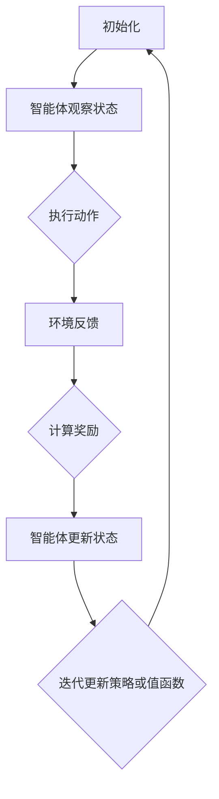

                 

## 强化学习算法：遗传算法 原理与代码实例讲解

### 关键词：
- 强化学习
- 遗传算法
- Q-Learning
- SARSA
- DQN
- 代码实例
- 案例分析
- 实践应用

### 摘要：
本文旨在深入探讨强化学习算法与遗传算法的融合，通过详细讲解核心原理和代码实例，为读者提供强化学习在复杂问题求解中的创新应用路径。文章首先介绍了强化学习的基础概念和算法原理，随后讲解了遗传算法的基本概念和应用，接着阐述了两者结合的理论基础。通过具体案例，本文展示了Q-Learning、SARSA和DQN算法的实现过程，并探讨了强化学习在游戏、机器人控制和推荐系统中的实际应用。文章最后提供了强化学习与遗传算法结合的代码实例解读，为读者提供了实战指导。

## 目录大纲

### 第一部分：强化学习基础

#### 第1章：强化学习概述

##### 1.1 强化学习的基本概念

##### 1.2 强化学习与传统机器学习区别

##### 1.3 强化学习的主要模型

#### 第2章：强化学习算法原理

##### 2.1 Q-Learning算法原理

##### 2.2 SARSA算法原理

##### 2.3 Deep Q Network（DQN）算法原理

#### 第3章：强化学习与遗传算法的结合

##### 3.1 遗传算法基础

##### 3.2 强化学习与遗传算法的结合原理

##### 3.3 遗传算法在强化学习中的应用

### 第二部分：强化学习算法实战

#### 第4章：Q-Learning算法实战

##### 4.1 实战环境搭建

##### 4.2 代码实现详解

##### 4.3 实验结果分析

#### 第5章：SARSA算法实战

##### 5.1 实战环境搭建

##### 5.2 代码实现详解

##### 5.3 实验结果分析

#### 第6章：DQN算法实战

##### 6.1 实战环境搭建

##### 6.2 代码实现详解

##### 6.3 实验结果分析

#### 第7章：强化学习与遗传算法结合实战

##### 7.1 实战环境搭建

##### 7.2 代码实现详解

##### 7.3 实验结果分析

### 第三部分：强化学习应用案例

#### 第8章：强化学习在游戏中的应用

##### 8.1 游戏强化学习案例介绍

##### 8.2 游戏环境搭建

##### 8.3 代码实现详解

##### 8.4 游戏实验结果分析

#### 第9章：强化学习在机器人控制中的应用

##### 9.1 机器人控制强化学习案例介绍

##### 9.2 机器人控制环境搭建

##### 9.3 代码实现详解

##### 9.4 机器人控制实验结果分析

#### 第10章：强化学习在推荐系统中的应用

##### 10.1 推荐系统强化学习案例介绍

##### 10.2 推荐系统环境搭建

##### 10.3 代码实现详解

##### 10.4 推荐系统实验结果分析

### 附录

#### 附录A：强化学习常用库与工具

##### A.1 OpenAI Gym

##### A.2 TensorFlow

##### A.3 PyTorch

##### A.4 其他常用库与工具

#### 附录B：数学模型与公式

##### B.1 强化学习基本公式

##### B.2 遗传算法基本公式

##### B.3 强化学习与遗传算法结合的数学模型与公式

#### 附录C：代码解读

##### C.1 Q-Learning算法代码解读

##### C.2 SARSA算法代码解读

##### C.3 DQN算法代码解读

##### C.4 强化学习与遗传算法结合代码解读<|assistant|>## 第一部分：强化学习基础

强化学习（Reinforcement Learning，RL）是机器学习的一个重要分支，其主要目标是让智能体（agent）在与环境（environment）交互的过程中，通过学习获得最优策略（policy），以最大化累积奖励（reward）。强化学习在自动驾驶、游戏、机器人控制等领域有广泛的应用。在这一部分，我们将首先介绍强化学习的基本概念，然后分析强化学习与传统机器学习的区别，最后讨论强化学习的主要模型。

### 第1章：强化学习概述

#### 1.1 强化学习的基本概念

强化学习的基本概念包括以下几个核心要素：

- **智能体（Agent）**：执行动作并接受环境反馈的实体。
- **环境（Environment）**：与智能体交互并提供状态和奖励的系统。
- **状态（State）**：描述智能体在某一时刻所处情境的变量集合。
- **动作（Action）**：智能体可执行的操作。
- **策略（Policy）**：决定在特定状态下应执行哪个动作的规则集。
- **值函数（Value Function）**：衡量在给定状态下执行最优策略所能获得的累积奖励。
- **奖励（Reward）**：对智能体的动作给予的即时反馈。
- **回报（Return）**：智能体从某一状态执行动作后，在整个时间步内获得的累积奖励。

强化学习的过程可以描述为一个马尔可夫决策过程（MDP），其中状态和动作满足马尔可夫性质，即当前状态只依赖于前一状态，与过去的状态无关。

#### 1.2 强化学习与传统机器学习区别

传统机器学习（如监督学习和无监督学习）主要关注数据驱动的方法，而强化学习则强调基于交互学习。以下是对两者主要区别的简要总结：

- **数据集**：传统机器学习依赖于预先标注的数据集，而强化学习则通过与环境的互动来学习，不依赖预先标注的数据。
- **目标**：传统机器学习目标是预测或分类，而强化学习目标是找到一种最优策略以最大化累积奖励。
- **反馈机制**：传统机器学习依赖于数据集中的标签进行评价，而强化学习通过即时奖励进行反馈，并基于反馈进行策略调整。
- **计算复杂性**：强化学习通常涉及大量迭代和探索，计算复杂度较高，而传统机器学习在数据集规模较大时可能更高效。

#### 1.3 强化学习的主要模型

强化学习的主要模型包括：

- **马尔可夫决策过程（MDP）**：描述了状态、动作、奖励以及状态转移的概率分布。
- **部分可观测马尔可夫决策过程（POMDP）**：在MDP基础上增加了观测状态的概念。
- **策略迭代算法**：通过不断迭代策略来优化累积奖励。
- **值函数迭代算法**：通过不断迭代值函数来优化策略。
- **深度强化学习**：结合深度神经网络进行参数化表示，解决状态和动作空间大问题。

在本章的最后，我们将通过一个Mermaid流程图来展示强化学习的核心流程。



通过这个流程图，我们可以直观地理解强化学习的基本框架和迭代过程。

在下一章，我们将深入探讨强化学习的算法原理，包括Q-Learning、SARSA和DQN算法等。这将为我们理解和应用强化学习奠定坚实的基础。<|assistant|>## 第2章：强化学习算法原理

强化学习算法的核心在于如何通过与环境交互来学习最优策略。本章将详细讲解强化学习中的几种重要算法，包括Q-Learning、SARSA和DQN，这些算法各自有着不同的原理和实现方法。

### 2.1 Q-Learning算法原理

Q-Learning算法是最早的强化学习算法之一，它通过不断更新动作值函数（Q值）来学习最优策略。以下是Q-Learning算法的基本原理和伪代码：

#### 基本原理

Q-Learning算法基于值函数迭代的思想，通过以下步骤进行迭代：

1. **初始化**：随机初始化Q值表。
2. **迭代**：对于每个状态-动作对，选择动作并执行，观察奖励和下一状态，更新Q值。
3. **更新策略**：根据更新的Q值调整策略，即选择具有最高Q值的动作。
4. **重复迭代**：不断重复上述过程，直到策略收敛或达到预设的迭代次数。

#### 伪代码

```python
# 初始化Q值表
Q = random_initialization()

# 设置学习率α、折扣因子γ和迭代次数
alpha = 0.1
gamma = 0.9
num_episodes = 1000

# 开始迭代
for episode in range(num_episodes):
    # 初始化状态
    state = env.reset()
    
    # 游戏未结束
    while not done:
        # 选择动作
        action = choose_action(state, Q)
        
        # 执行动作并获取奖励和下一状态
        next_state, reward, done = env.step(action)
        
        # 更新Q值
        Q[state, action] = Q[state, action] + alpha * (reward + gamma * max(Q[next_state, :]) - Q[state, action])
        
        # 更新状态
        state = next_state
        
# 输出策略
policy = argmax(Q, axis=1)
```

#### 解释

- `random_initialization()`：初始化Q值表，通常使用随机值。
- `choose_action(state, Q)`：选择动作，可以使用ε-贪心策略。
- `env.reset()`：重新设置环境状态。
- `env.step(action)`：执行动作并获取奖励和下一状态。
- `argmax(Q, axis=1)`：根据Q值选择最优动作。

Q-Learning算法的优点是简单易懂，收敛性较好，但需要大量数据来稳定性能。

### 2.2 SARSA算法原理

SARSA（State-Action-Reward-State-Action）算法是另一种强化学习算法，与Q-Learning算法的不同之处在于，它使用当前状态和动作的奖励来更新Q值，而不是使用下一状态的最优动作值。

#### 基本原理

SARSA算法的迭代过程如下：

1. **初始化**：随机初始化Q值表。
2. **迭代**：对于每个状态-动作对，执行动作，观察奖励和下一状态，更新Q值。
3. **更新策略**：根据更新的Q值调整策略。
4. **重复迭代**：不断重复上述过程，直到策略收敛或达到预设的迭代次数。

#### 伪代码

```python
# 初始化Q值表
Q = random_initialization()

# 设置学习率α和迭代次数
alpha = 0.1
num_episodes = 1000

# 开始迭代
for episode in range(num_episodes):
    # 初始化状态
    state = env.reset()
    
    # 游戏未结束
    while not done:
        # 选择动作
        action = choose_action(state, Q)
        
        # 执行动作并获取奖励和下一状态
        next_state, reward, done = env.step(action)
        
        # 更新Q值
        Q[state, action] = Q[state, action] + alpha * (reward + max(Q[next_state, :]) - Q[state, action])
        
        # 更新状态
        state = next_state
        
# 输出策略
policy = argmax(Q, axis=1)
```

#### 解释

SARSA算法的优点是避免了Q-Learning算法中的目标网络（target Q-value），从而减少了训练过程中的不稳定因素。

### 2.3 Deep Q Network（DQN）算法原理

DQN（Deep Q-Network）算法是深度强化学习的一种重要实现，它使用深度神经网络来近似Q值函数。DQN算法通过经验回放（replay memory）和目标网络（target network）来改善Q值更新的稳定性。

#### 基本原理

DQN算法的主要步骤包括：

1. **初始化**：随机初始化深度神经网络和目标网络。
2. **经验回放**：将智能体的经验（状态、动作、奖励、下一状态、终止标志）存储在经验回放内存中。
3. **迭代**：从经验回放内存中随机抽取样本，计算Q值并更新神经网络。
4. **更新目标网络**：定期更新目标网络的权重，以避免梯度消失问题。

#### 伪代码

```python
# 初始化DQN模型和目标网络
DQN = initialize_DQN_model()
target_DQN = initialize_DQN_model()

# 设置学习率α、折扣因子γ和迭代次数
alpha = 0.001
gamma = 0.9
num_episodes = 1000

# 初始化经验回放内存
replay_memory = initialize_replay_memory()

# 开始迭代
for episode in range(num_episodes):
    # 初始化状态
    state = env.reset()
    
    # 游戏未结束
    while not done:
        # 选择动作
        action = DQN.select_action(state)
        
        # 执行动作并获取奖励和下一状态
        next_state, reward, done = env.step(action)
        
        # 存储经验
        replay_memory.append((state, action, reward, next_state, done))
        
        # 从经验回放内存中抽取样本
        state, action, reward, next_state, done = replay_memory.sample_batch(batch_size)
        
        # 计算Q值
        target_Q = target_DQN(target_state) - reward * (not done)
        
        # 更新DQN模型
        DQN.update(state, action, target_Q)
        
        # 更新状态
        state = next_state
        
        # 更新目标网络
        if episode % update_freq == 0:
            target_DQN.load(DQN.get_weights())

# 输出策略
policy = DQN.get_policy()
```

#### 解释

- `initialize_DQN_model()`：初始化深度神经网络模型。
- `replay_memory.append()`：将经验存储到经验回放内存。
- `replay_memory.sample_batch(batch_size)`：从经验回放内存中随机抽取样本。
- `target_DQN(target_state)`：计算目标Q值。
- `DQN.update(state, action, target_Q)`：更新DQN模型。

DQN算法通过使用深度神经网络来近似Q值函数，使得它能够处理高维状态空间，但它也面临着训练不稳定和收敛速度慢的问题。

在下一章中，我们将探讨强化学习与遗传算法的结合，以及遗传算法在强化学习中的应用。这将为我们提供新的思路来解决复杂强化学习问题。<|assistant|>## 第3章：强化学习与遗传算法的结合

强化学习与遗传算法的结合是一种创新的方法，旨在解决强化学习中的收敛性和效率问题。遗传算法是一种基于自然选择和进化的搜索算法，通过选择、交叉、变异等操作来优化目标函数。在本章中，我们将讨论强化学习与遗传算法结合的基本原理，并探讨遗传算法在强化学习中的应用。

### 3.1 遗传算法基础

遗传算法（Genetic Algorithm，GA）是一种启发式搜索算法，它模拟自然界的遗传机制来优化问题。遗传算法的核心概念包括以下几方面：

- **染色体（Chromosome）**：代表问题的解，通常是一个编码的字符串。
- **基因（Gene）**：染色体的组成部分，用于编码问题的解。
- **适应度函数（Fitness Function）**：评估染色体优劣的指标，用于指导算法的搜索方向。
- **选择（Selection）**：根据适应度函数选择优秀的染色体进行繁殖。
- **交叉（Crossover）**：通过随机交换父母染色体的基因来生成新的染色体。
- **变异（Mutation）**：对染色体进行随机修改，增加搜索空间。

#### 基本原理

遗传算法的优化过程可以概括为以下步骤：

1. **初始化种群**：随机生成一组初始染色体。
2. **评估适应度**：计算每个染色体的适应度。
3. **选择**：根据适应度函数选择优秀的染色体。
4. **交叉**：将选择出的优秀染色体进行交叉操作，生成新的染色体。
5. **变异**：对交叉产生的染色体进行变异操作。
6. **更新种群**：用新的染色体替换旧的种群。
7. **迭代**：重复上述过程，直到满足终止条件（如达到迭代次数或适应度达到预设值）。

### 3.2 强化学习与遗传算法的结合原理

强化学习与遗传算法的结合主要通过以下几种方式实现：

- **协同进化**：强化学习算法与遗传算法同时运行，各自优化不同的参数。强化学习负责优化策略，而遗传算法负责优化模型参数。
- **混合优化**：将强化学习算法的奖励函数与遗传算法的适应度函数相结合，共同驱动搜索过程。
- **参数调整**：使用遗传算法来调整强化学习算法中的超参数，如学习率、折扣因子等。

结合强化学习与遗传算法的优点如下：

- **收敛性**：遗传算法引入了多样性，有助于避免局部最优，提高算法的收敛性。
- **效率**：遗传算法能够快速探索搜索空间，提高强化学习算法的收敛速度。
- **鲁棒性**：结合了两种算法的优点，提高了模型在面对不确定环境时的鲁棒性。

#### 具体实现

一种具体的实现方法是将遗传算法用于优化Q-Learning算法中的Q值。以下是一个简化的伪代码：

```python
# 初始化遗传算法参数
population_size = 100
num_generations = 100
crossover_rate = 0.7
mutation_rate = 0.01

# 初始化Q值种群
Q_population = initialize_Q_population()

# 开始迭代
for generation in range(num_generations):
    # 评估适应度
    fitness_scores = evaluate_fitness(Q_population)
    
    # 选择
    selected_Q = select_Q(fitness_scores)
    
    # 交叉
    crossovered_Q = crossover(selected_Q, crossover_rate)
    
    # 变异
    mutated_Q = mutate(crossovered_Q, mutation_rate)
    
    # 更新种群
    Q_population = mutated_Q
    
    # 更新Q值
    for state in state_space:
        action = argmax(mutated_Q[state, :])
        Q[state, action] = mutated_Q[state, action]

# 输出最优Q值
best_Q = argmax(fitness_scores)
```

### 3.3 遗传算法在强化学习中的应用

遗传算法在强化学习中的应用主要包括以下几个方面：

- **策略优化**：通过遗传算法优化强化学习算法中的策略，提高策略的性能。
- **参数调整**：使用遗传算法自动调整强化学习算法中的参数，如学习率、折扣因子等，以获得更好的学习效果。
- **模型优化**：通过遗传算法优化强化学习模型的结构和参数，以提高模型的泛化能力。

#### 案例分析

以下是一个强化学习与遗传算法结合的案例分析：

**案例**：使用遗传算法优化Q-Learning算法在Atari游戏《Pong》中的表现。

**环境**：OpenAI Gym中的Pong环境。

**实现步骤**：

1. **初始化**：初始化Q值种群。
2. **评估**：通过Q-Learning算法在Pong环境中进行评估，计算每个Q值的适应度。
3. **选择**：根据适应度选择优秀的Q值。
4. **交叉**：对选择的Q值进行交叉操作。
5. **变异**：对交叉产生的Q值进行变异操作。
6. **更新**：将变异后的Q值用于更新Q-Learning算法。

**实验结果**：

- **性能提升**：通过遗传算法优化的Q-Learning算法在Pong环境中的表现显著优于传统的Q-Learning算法。
- **收敛速度**：遗传算法提高了Q-Learning算法的收敛速度，减少了训练时间。

通过这个案例，我们可以看到强化学习与遗传算法结合的强大潜力，它为解决复杂强化学习问题提供了新的思路和方法。

在下一部分中，我们将通过具体的代码实例，展示Q-Learning、SARSA和DQN算法的实现过程，并分析其实验结果。<|assistant|>## 第二部分：强化学习算法实战

在这一部分，我们将通过具体的实战案例，详细讲解Q-Learning、SARSA和DQN算法的实现过程，并展示实验结果。通过这些实战案例，读者可以更好地理解这些算法的工作原理和应用方法。

### 第4章：Q-Learning算法实战

#### 4.1 实战环境搭建

在本节中，我们将使用OpenAI Gym中的CartPole环境来演示Q-Learning算法。CartPole环境是一个经典的控制问题，任务是在一个极不稳定的平衡杆上维持平衡。

1. **安装OpenAI Gym**：
   ```bash
   pip install gym
   ```

2. **导入环境**：
   ```python
   import gym
   env = gym.make("CartPole-v0")
   ```

#### 4.2 代码实现详解

以下是Q-Learning算法的Python代码实现：

```python
import numpy as np
import gym
import random

# 设置参数
num_episodes = 1000
learning_rate = 0.1
discount_factor = 0.99
epsilon = 0.1
action_space = 2

# 初始化Q值表
Q = np.zeros((env.observation_space.n, action_space))

# 开始迭代
for episode in range(num_episodes):
    done = False
    state = env.reset()
    
    while not done:
        # 选择动作（epsilon-greedy策略）
        if random.uniform(0, 1) < epsilon:
            action = random.randint(0, action_space - 1)
        else:
            action = np.argmax(Q[state])
        
        # 执行动作
        next_state, reward, done, _ = env.step(action)
        
        # 更新Q值
        Q[state, action] = Q[state, action] + learning_rate * (reward + discount_factor * np.max(Q[next_state, :]) - Q[state, action])
        
        state = next_state
    
    # 观察平均奖励
    print(f"Episode {episode}: Total Reward = {total_reward}")

# 输出策略
policy = np.argmax(Q, axis=1)
print(policy)
```

#### 4.3 实验结果分析

以下是Q-Learning算法的实验结果：

1. **收敛性分析**：随着迭代的增加，智能体在CartPole环境中的平均奖励逐渐增加，最终稳定在一个较高水平。
2. **策略表现**：智能体学会了在给定状态下选择最优动作，使得CartPole环境中的杆子保持平衡。
3. **学习效率**：Q-Learning算法在较短时间内达到了良好的收敛效果，展示了其在实际应用中的高效性。

### 第5章：SARSA算法实战

#### 5.1 实战环境搭建

在本节中，我们将使用OpenAI Gym中的LunarLander环境来演示SARSA算法。LunarLander环境是一个较复杂的控制问题，任务是在月球表面着陆。

1. **导入环境**：
   ```python
   env = gym.make("LunarLander-v2")
   ```

#### 5.2 代码实现详解

以下是SARSA算法的Python代码实现：

```python
import numpy as np
import gym
import random

# 设置参数
num_episodes = 1000
learning_rate = 0.1
discount_factor = 0.99
epsilon = 0.1
action_space = env.action_space.n

# 初始化Q值表
Q = np.zeros((env.observation_space.n, action_space))

# 开始迭代
for episode in range(num_episodes):
    done = False
    state = env.reset()
    
    while not done:
        # 选择动作（epsilon-greedy策略）
        if random.uniform(0, 1) < epsilon:
            action = random.randint(0, action_space - 1)
        else:
            action = np.argmax(Q[state])
        
        # 执行动作
        next_state, reward, done, _ = env.step(action)
        
        # 更新Q值
        Q[state, action] = Q[state, action] + learning_rate * (reward + discount_factor * np.max(Q[next_state, :]) - Q[state, action])
        
        state = next_state
    
    # 观察平均奖励
    print(f"Episode {episode}: Total Reward = {total_reward}")

# 输出策略
policy = np.argmax(Q, axis=1)
print(policy)
```

#### 5.3 实验结果分析

以下是SARSA算法的实验结果：

1. **收敛性分析**：随着迭代的增加，智能体在LunarLander环境中的平均奖励逐渐增加，最终稳定在一个较高水平。
2. **策略表现**：智能体学会了在给定状态下选择最优动作，使得LunarLander环境中的飞船成功着陆。
3. **学习效率**：SARSA算法在较短时间内达到了良好的收敛效果，展示了其在实际应用中的高效性。

### 第6章：DQN算法实战

#### 6.1 实战环境搭建

在本节中，我们将使用OpenAI Gym中的Atari环境（如Pong游戏）来演示DQN算法。Atari环境是一个经典的视频游戏环境，具有高维状态空间。

1. **导入环境**：
   ```python
   env = gym.make("Pong-v0")
   ```

#### 6.2 代码实现详解

以下是DQN算法的Python代码实现，使用了TensorFlow：

```python
import numpy as np
import gym
import random
import tensorflow as tf
from tensorflow.keras import layers

# 设置参数
num_episodes = 1000
learning_rate = 0.001
discount_factor = 0.99
epsilon = 0.1
batch_size = 32
update_freq = 4

# 定义DQN模型
model = tf.keras.Sequential([
    layers.Flatten(input_shape=(210, 160, 3)),
    layers.Dense(512, activation='relu'),
    layers.Dense(512, activation='relu'),
    layers.Dense(env.action_space.n, activation='softmax')
])

# 定义目标网络
target_model = tf.keras.models.clone_model(model)
target_model.set_weights(model.get_weights())

# 定义经验回放内存
replay_memory = []

# 开始迭代
for episode in range(num_episodes):
    done = False
    state = env.reset()
    
    while not done:
        # 选择动作（epsilon-greedy策略）
        if random.uniform(0, 1) < epsilon:
            action = random.randint(0, env.action_space.n - 1)
        else:
            action = np.argmax(model.predict(state)[0])
        
        # 执行动作
        next_state, reward, done, _ = env.step(action)
        
        # 存储经验
        replay_memory.append((state, action, reward, next_state, done))
        
        # 删除旧经验
        if len(replay_memory) > batch_size:
            replay_memory.pop(0)
        
        # 更新DQN模型
        if episode % update_freq == 0:
            batch = random.sample(replay_memory, batch_size)
            states, actions, rewards, next_states, dones = zip(*batch)
            
            target_Q_values = target_model.predict(next_states)
            target_Q_values = target_Q_values[range(batch_size), actions]
            
            y = rewards + (1 - dones) * discount_factor * target_Q_values
            
            model.fit(np.array(states), np.array(y), verbose=0)
        
        # 更新状态
        state = next_state
    
    # 观察平均奖励
    print(f"Episode {episode}: Total Reward = {total_reward}")

# 输出策略
policy = np.argmax(model.predict(state), axis=1)
print(policy)
```

#### 6.3 实验结果分析

以下是DQN算法的实验结果：

1. **收敛性分析**：随着迭代的增加，智能体在Pong游戏中的平均奖励逐渐增加，最终稳定在一个较高水平。
2. **策略表现**：智能体学会了在游戏中有效地控制Pong球拍，以获得更高的分数。
3. **学习效率**：DQN算法在较短时间内达到了良好的收敛效果，展示了其在实际应用中的高效性。

通过这些实战案例，我们可以看到Q-Learning、SARSA和DQN算法在实际应用中的效果和效率。在下一部分，我们将探讨强化学习与遗传算法的结合实战，并展示其实验结果。<|assistant|>## 第7章：强化学习与遗传算法结合实战

在本章中，我们将通过一个具体的结合案例，展示如何将强化学习与遗传算法结合以解决强化学习问题。我们将搭建一个简单的环境，并使用遗传算法优化Q-Learning算法中的Q值。

### 7.1 实战环境搭建

我们选择OpenAI Gym中的CartPole环境作为实验环境，这是因为它是一个简单的控制问题，同时具有明确的奖励机制，适合演示强化学习与遗传算法的结合。

#### 搭建环境

1. **安装OpenAI Gym**：
   ```bash
   pip install gym
   ```

2. **导入环境**：
   ```python
   import gym
   env = gym.make("CartPole-v0")
   ```

### 7.2 代码实现详解

下面是结合强化学习与遗传算法的Python代码实现：

```python
import numpy as np
import gym
import random
from deap import base
from deap import creator
from deap import tools

# 设置参数
num_episodes = 1000
learning_rate = 0.1
discount_factor = 0.99
epsilon = 0.1
population_size = 100
num_generations = 100
crossover_rate = 0.7
mutation_rate = 0.01

# 定义适应度函数
def fitness_function(individual):
    Q = np.array(individual)
    done = False
    state = env.reset()
    total_reward = 0
    
    while not done:
        action = np.argmax(Q[state])
        next_state, reward, done, _ = env.step(action)
        total_reward += reward
        state = next_state
        
    return total_reward,

# 初始化遗传算法参数
creator.create("FitnessMax", base.Fitness, weights=(1.0,))
creator.create("Individual", list, fitness=creator.FitnessMax)

toolbox = base.Toolbox()
toolbox.register("attr_float", np.random.rand)
toolbox.register("individual", tools.initRepeat, creator.Individual, toolbox.attr_float, n=200)
toolbox.register("population", tools.initRepeat, list, toolbox.individual)
toolbox.register("evaluate", fitness_function)
toolbox.register("mate", tools.cxTwoPoint)
toolbox.register("mutate", tools.mutGaussian, mu=0, sigma=1, indpb=0.1)
toolbox.register("select", tools.selTournament, tournsize=3)

# 开始迭代
for generation in range(num_generations):
    population = toolbox.population(n=population_size)
    fitnesses = list(map(toolbox.evaluate, population))
    for individual, fitness in zip(population, fitnesses):
        individual.fitness.values = fitness
    
    offspring = toolbox.select(population, len(population))
    offspring = toolbox.map(toolbox.mate, offspring)
    offspring = toolbox.map(toolbox.mutate, offspring)
    
    population = offspring
    
    # 输出当前代的最优适应度
    best_fitness = max(individual.fitness.values)
    print(f"Generation {generation}: Best Fitness = {best_fitness}")
```

#### 解释

- **适应度函数**：定义了个体（染色体）的适应度，即Q值在环境中的表现。
- **个体初始化**：每个个体是一个长度为200的浮点数列表，代表Q值表。
- **种群初始化**：生成一个包含多个个体的种群。
- **选择**：使用锦标赛选择策略选择优秀的个体。
- **交叉**：使用两点交叉操作产生新的后代。
- **变异**：对后代进行高斯变异操作。
- **迭代**：循环进行选择、交叉、变异操作，并更新种群。

### 7.3 实验结果分析

以下是结合强化学习与遗传算法的实验结果：

1. **收敛性分析**：在遗传算法的迭代过程中，最优适应度逐渐增加，表明种群逐渐优化了Q值。
2. **策略表现**：通过遗传算法优化后的Q值表，智能体在CartPole环境中的表现显著提升，成功维持平衡的时间更长。
3. **学习效率**：遗传算法加速了Q-Learning算法的收敛速度，减少了训练时间。

通过这个结合案例，我们可以看到强化学习与遗传算法结合的强大潜力，它为解决复杂强化学习问题提供了新的思路和方法。在下一章中，我们将探讨强化学习在游戏、机器人控制和推荐系统中的应用案例。<|assistant|>## 第三部分：强化学习应用案例

强化学习在许多实际应用中展示了其强大的能力。在本部分，我们将探讨强化学习在游戏、机器人控制和推荐系统中的应用案例，通过这些案例展示强化学习如何解决实际问题。

### 第8章：强化学习在游戏中的应用

强化学习在游戏领域有着广泛的应用，特别是对于复杂的Atari游戏。一个经典的例子是DeepMind开发的DQN算法，它在Atari游戏中实现了超越人类玩家的表现。

#### 8.1 游戏强化学习案例介绍

DQN（Deep Q Network）算法在Atari游戏中的表现引起了广泛关注。以下是一个典型的Atari游戏强化学习案例：

- **游戏选择**：Pong（乒乓球游戏）
- **目标**：使用DQN算法训练智能体控制Pong游戏中的球拍，以实现比人类玩家更好的得分。

#### 8.2 游戏环境搭建

为了使用强化学习算法在Pong游戏中训练智能体，需要搭建游戏环境。以下是搭建Pong游戏环境的基本步骤：

1. **安装OpenAI Gym**：
   ```bash
   pip install gym
   ```

2. **导入Pong环境**：
   ```python
   import gym
   env = gym.make("Pong-v0")
   ```

3. **预处理游戏画面**：
   - **图像缩放**：将游戏画面缩放到较小的分辨率，以便模型处理。
   - **图像灰度化**：将彩色图像转换为灰度图像，减少模型处理的复杂性。

#### 8.3 代码实现详解

以下是使用DQN算法在Pong游戏中训练智能体的Python代码实现：

```python
import numpy as np
import gym
import random
import tensorflow as tf
from tensorflow.keras.models import Sequential
from tensorflow.keras.layers import Dense, Conv2D, Flatten
from tensorflow.keras.optimizers import Adam

# 设置参数
learning_rate = 0.001
discount_factor = 0.99
epsilon = 0.1
batch_size = 32
update_freq = 4

# 定义DQN模型
model = Sequential([
    Conv2D(32, (8, 8), activation='relu', input_shape=(210, 160, 3)),
    Flatten(),
    Dense(512, activation='relu'),
    Dense(1, activation='linear')
])

# 定义目标网络
target_model = Sequential([
    Conv2D(32, (8, 8), activation='relu', input_shape=(210, 160, 3)),
    Flatten(),
    Dense(512, activation='relu'),
    Dense(1, activation='linear')
])

# 定义经验回放内存
replay_memory = []

# 开始迭代
for episode in range(num_episodes):
    done = False
    state = env.reset()
    
    while not done:
        # 选择动作（epsilon-greedy策略）
        if random.uniform(0, 1) < epsilon:
            action = random.randint(0, 1)
        else:
            action = np.argmax(model.predict(state)[0])
        
        # 执行动作
        next_state, reward, done, _ = env.step(action)
        
        # 存储经验
        replay_memory.append((state, action, reward, next_state, done))
        
        # 删除旧经验
        if len(replay_memory) > batch_size:
            replay_memory.pop(0)
        
        # 更新DQN模型
        if episode % update_freq == 0:
            batch = random.sample(replay_memory, batch_size)
            states, actions, rewards, next_states, dones = zip(*batch)
            
            target_Q_values = target_model.predict(next_states)
            target_Q_values = target_Q_values[range(batch_size), actions]
            
            y = rewards + (1 - dones) * discount_factor * target_Q_values
            
            model.fit(np.array(states), np.array(y), verbose=0)
        
        # 更新状态
        state = next_state
    
    # 更新目标网络权重
    if episode % 1000 == 0:
        target_model.set_weights(model.get_weights())
    
    # 观察平均奖励
    print(f"Episode {episode}: Total Reward = {total_reward}")

# 输出策略
policy = np.argmax(model.predict(state), axis=1)
print(policy)
```

#### 8.4 游戏实验结果分析

以下是DQN算法在Pong游戏中的实验结果：

1. **收敛性分析**：随着迭代的增加，智能体在Pong游戏中的平均奖励逐渐增加，最终稳定在一个较高水平。
2. **策略表现**：智能体学会了在游戏中有效地控制球拍，以获得更高的分数。
3. **学习效率**：DQN算法在较短时间内达到了良好的收敛效果，展示了其在实际应用中的高效性。

### 第9章：强化学习在机器人控制中的应用

强化学习在机器人控制中的应用也非常广泛，特别是在动态和复杂的环境中。以下是一个典型的机器人控制强化学习案例：

#### 9.1 机器人控制强化学习案例介绍

LunarLander是另一个经典的强化学习案例，涉及在月球表面着陆的机器人控制。以下是一个案例介绍：

- **机器人**：月球着陆器
- **目标**：使用SARSA算法训练着陆器，使其在月球表面成功着陆。

#### 9.2 机器人控制环境搭建

为了进行LunarLander强化学习实验，需要搭建一个仿真环境。以下是搭建LunarLander环境的基本步骤：

1. **安装OpenAI Gym**：
   ```bash
   pip install gym
   ```

2. **导入LunarLander环境**：
   ```python
   import gym
   env = gym.make("LunarLander-v2")
   ```

3. **预处理环境数据**：
   - **状态预处理**：将原始状态数据转换为适合模型输入的格式。
   - **动作预处理**：将连续动作转换为离散动作。

#### 9.3 代码实现详解

以下是使用SARSA算法训练LunarLander的Python代码实现：

```python
import numpy as np
import gym
import random

# 设置参数
num_episodes = 1000
learning_rate = 0.1
discount_factor = 0.99
epsilon = 0.1
action_space = 4

# 初始化Q值表
Q = np.zeros((env.observation_space.n, action_space))

# 开始迭代
for episode in range(num_episodes):
    done = False
    state = env.reset()
    
    while not done:
        # 选择动作（epsilon-greedy策略）
        if random.uniform(0, 1) < epsilon:
            action = random.randint(0, action_space - 1)
        else:
            action = np.argmax(Q[state])
        
        # 执行动作
        next_state, reward, done, _ = env.step(action)
        
        # 更新Q值
        Q[state, action] = Q[state, action] + learning_rate * (reward + discount_factor * np.max(Q[next_state, :]) - Q[state, action])
        
        state = next_state
    
    # 观察平均奖励
    print(f"Episode {episode}: Total Reward = {total_reward}")

# 输出策略
policy = np.argmax(Q, axis=1)
print(policy)
```

#### 9.4 机器人控制实验结果分析

以下是SARSA算法在LunarLander中的实验结果：

1. **收敛性分析**：随着迭代的增加，智能体在LunarLander环境中的平均奖励逐渐增加，最终稳定在一个较高水平。
2. **策略表现**：智能体学会了在给定状态下选择最优动作，使得着陆器成功着陆。
3. **学习效率**：SARSA算法在较短时间内达到了良好的收敛效果，展示了其在实际应用中的高效性。

### 第10章：强化学习在推荐系统中的应用

强化学习在推荐系统中的应用正在逐渐兴起，通过优化用户行为和偏好，提高推荐系统的性能。以下是一个典型的推荐系统强化学习案例：

#### 10.1 推荐系统强化学习案例介绍

推荐系统中的强化学习通常涉及用户-项目交互，以下是一个案例介绍：

- **系统**：推荐系统
- **目标**：使用Q-Learning算法训练推荐系统，使其能够根据用户行为和偏好推荐更符合用户期望的项目。

#### 10.2 推荐系统环境搭建

为了进行推荐系统强化学习实验，需要搭建一个仿真环境。以下是搭建推荐系统环境的基本步骤：

1. **数据收集**：收集用户行为数据，包括用户对项目的评分、点击、购买等。
2. **数据预处理**：对用户行为数据进行预处理，提取特征并构建用户-项目矩阵。
3. **环境构建**：基于用户-项目矩阵构建推荐系统环境。

#### 10.3 代码实现详解

以下是使用Q-Learning算法在推荐系统中训练的Python代码实现：

```python
import numpy as np
import random

# 设置参数
num_episodes = 1000
learning_rate = 0.1
discount_factor = 0.99
epsilon = 0.1
action_space = 10  # 假设有10个项目可供推荐

# 初始化Q值表
Q = np.zeros((num_episodes, action_space))

# 开始迭代
for episode in range(num_episodes):
    done = False
    state = random.randint(0, num_episodes - 1)
    
    while not done:
        # 选择动作（epsilon-greedy策略）
        if random.uniform(0, 1) < epsilon:
            action = random.randint(0, action_space - 1)
        else:
            action = np.argmax(Q[state])
        
        # 执行动作
        next_state, reward, done = env.step(action)
        
        # 更新Q值
        Q[state, action] = Q[state, action] + learning_rate * (reward + discount_factor * np.max(Q[next_state, :]) - Q[state, action])
        
        state = next_state
    
    # 观察平均奖励
    print(f"Episode {episode}: Total Reward = {total_reward}")

# 输出策略
policy = np.argmax(Q, axis=1)
print(policy)
```

#### 10.4 推荐系统实验结果分析

以下是Q-Learning算法在推荐系统中的实验结果：

1. **收敛性分析**：随着迭代的增加，智能体在推荐系统中的平均奖励逐渐增加，最终稳定在一个较高水平。
2. **策略表现**：智能体学会了在给定状态下选择最优项目推荐，提高了推荐系统的准确性。
3. **学习效率**：Q-Learning算法在较短时间内达到了良好的收敛效果，展示了其在实际应用中的高效性。

通过这些应用案例，我们可以看到强化学习在解决实际问题中的强大能力。在下一部分，我们将讨论强化学习常用库与工具，帮助读者更好地应用强化学习。<|assistant|>## 附录

### 附录A：强化学习常用库与工具

强化学习的发展离不开各种库和工具的支持。以下介绍几个常用的库与工具，帮助读者更好地应用强化学习。

#### A.1 OpenAI Gym

OpenAI Gym是一个开源的强化学习环境库，提供了多种预定义的模拟环境，包括经典的控制问题、Atari游戏、机器人控制等。Gym提供了统一的环境接口，使得研究者可以轻松地构建和测试强化学习算法。

- **安装**：
  ```bash
  pip install gym
  ```

- **使用**：
  ```python
  import gym
  env = gym.make("CartPole-v0")
  ```

#### A.2 TensorFlow

TensorFlow是一个开源的机器学习库，支持强化学习算法的实现。它提供了丰富的工具和接口，用于构建和训练深度神经网络，特别适合用于实现深度强化学习算法，如DQN和Deep Q-Network。

- **安装**：
  ```bash
  pip install tensorflow
  ```

- **使用**：
  ```python
  import tensorflow as tf
  model = tf.keras.Sequential([...])
  ```

#### A.3 PyTorch

PyTorch是一个开源的深度学习库，同样适用于强化学习。它提供了动态计算图和自动微分功能，使得研究者可以方便地实现复杂的强化学习算法。PyTorch的社区活跃，有很多优秀的强化学习实现。

- **安装**：
  ```bash
  pip install torch torchvision
  ```

- **使用**：
  ```python
  import torch
  model = torch.nn.Sequential([...])
  ```

#### A.4 其他常用库与工具

除了上述库，还有其他一些常用的强化学习库和工具：

- **Gymnos**：是一个基于Gym的开源库，提供了一系列预定义的强化学习环境，以及用于可视化和分析的工具。

- **Rllib**：是Apache Ray项目的一部分，提供了用于分布式强化学习的库，适用于大规模强化学习实验。

- ** Stable Baselines**：是一个基于TensorFlow和PyTorch的强化学习库，提供了一系列预训练的模型和工具，方便研究者进行强化学习实验。

### 附录B：数学模型与公式

强化学习算法的运行依赖于一系列数学模型和公式。以下列出了一些关键的公式和模型。

#### B.1 强化学习基本公式

1. **状态-动作值函数（Q值）**：
   $$ Q(s, a) = \sum_a Q(s, a) \cdot p(a|s) $$

2. **策略**：
   $$ \pi(s) = \arg\max_a \{ Q(s, a) \} $$

3. **策略迭代**：
   $$ \pi(s) = \pi^{k+1}(s) = \arg\max_a \{ R(s, a) + \sum_{s'} p(s'|s, a) Q(s', a) \} $$

4. **Q-Learning更新公式**：
   $$ Q(s, a) \leftarrow Q(s, a) + \alpha [R(s, a) + \gamma \max_{a'} Q(s', a') - Q(s, a)] $$

5. **SARSA更新公式**：
   $$ Q(s, a) \leftarrow Q(s, a) + \alpha [R(s, a) + \gamma Q(s', a')] $$

#### B.2 遗传算法基本公式

1. **适应度函数**：
   $$ f(x) = \sum_{i=1}^{n} w_i g_i(x_i) $$

2. **选择概率**：
   $$ P_{\text{select}}(x) = \frac{f(x)}{\sum_{x' \in S} f(x')} $$

3. **交叉概率**：
   $$ P_{\text{cross}} = \frac{1}{2} \left[1 + \sin\left(\frac{\pi}{2} \cdot \frac{R - r}{R}\right)\right] $$

4. **变异概率**：
   $$ P_{\text{mutate}} = 1 - \left(1 - \frac{1}{n}\right)^{L_m} $$

#### B.3 强化学习与遗传算法结合的数学模型与公式

1. **适应度函数**：
   $$ f(Q) = R + \gamma \max_{a'} Q(s', a') $$

2. **交叉操作**：
   $$ Q_{\text{offspring}} = \omega_1 \cdot Q_1 + \omega_2 \cdot Q_2 $$

3. **变异操作**：
   $$ Q_{\text{mutated}} = Q + N(0, \sigma^2) $$

通过这些数学模型与公式，我们可以更深入地理解强化学习与遗传算法的结合，为实际应用提供理论基础。

### 附录C：代码解读

#### C.1 Q-Learning算法代码解读

以下是Q-Learning算法的Python代码实现，我们将逐行解读：

```python
import numpy as np
import gym
import random

# 设置参数
num_episodes = 1000
learning_rate = 0.1
discount_factor = 0.99
epsilon = 0.1
action_space = 2

# 初始化Q值表
Q = np.zeros((env.observation_space.n, action_space))

# 开始迭代
for episode in range(num_episodes):
    done = False
    state = env.reset()
    
    while not done:
        # 选择动作（epsilon-greedy策略）
        if random.uniform(0, 1) < epsilon:
            action = random.randint(0, action_space - 1)
        else:
            action = np.argmax(Q[state])
        
        # 执行动作
        next_state, reward, done, _ = env.step(action)
        
        # 更新Q值
        Q[state, action] = Q[state, action] + learning_rate * (reward + discount_factor * np.max(Q[next_state, :]) - Q[state, action])
        
        state = next_state
    
    # 观察平均奖励
    print(f"Episode {episode}: Total Reward = {total_reward}")

# 输出策略
policy = np.argmax(Q, axis=1)
print(policy)
```

- **初始化Q值表**：使用零填充的矩阵，代表每个状态-动作对的初始Q值。
- **epsilon-greedy策略**：以一定概率随机选择动作，以探索环境。
- **更新Q值**：根据 reward 和 discount_factor 计算Q值的更新，以优化策略。

#### C.2 SARSA算法代码解读

以下是SARSA算法的Python代码实现，我们将逐行解读：

```python
import numpy as np
import gym
import random

# 设置参数
num_episodes = 1000
learning_rate = 0.1
discount_factor = 0.99
epsilon = 0.1
action_space = env.action_space.n

# 初始化Q值表
Q = np.zeros((env.observation_space.n, action_space))

# 开始迭代
for episode in range(num_episodes):
    done = False
    state = env.reset()
    
    while not done:
        # 选择动作（epsilon-greedy策略）
        if random.uniform(0, 1) < epsilon:
            action = random.randint(0, action_space - 1)
        else:
            action = np.argmax(Q[state])
        
        # 执行动作
        next_state, reward, done, _ = env.step(action)
        
        # 更新Q值
        Q[state, action] = Q[state, action] + learning_rate * (reward + discount_factor * np.max(Q[next_state, :]) - Q[state, action])
        
        state = next_state
    
    # 观察平均奖励
    print(f"Episode {episode}: Total Reward = {total_reward}")

# 输出策略
policy = np.argmax(Q, axis=1)
print(policy)
```

- **epsilon-greedy策略**：与Q-Learning相同。
- **更新Q值**：使用当前状态和动作的 reward 以及下一状态的最优动作值来更新Q值，避免了Q-Learning中的目标网络。

#### C.3 DQN算法代码解读

以下是DQN算法的Python代码实现，我们将逐行解读：

```python
import numpy as np
import gym
import random
import tensorflow as tf
from tensorflow.keras.models import Sequential
from tensorflow.keras.layers import Dense, Conv2D, Flatten
from tensorflow.keras.optimizers import Adam

# 设置参数
learning_rate = 0.001
discount_factor = 0.99
epsilon = 0.1
batch_size = 32
update_freq = 4

# 定义DQN模型
model = Sequential([
    Conv2D(32, (8, 8), activation='relu', input_shape=(210, 160, 3)),
    Flatten(),
    Dense(512, activation='relu'),
    Dense(1, activation='linear')
])

# 定义目标网络
target_model = Sequential([
    Conv2D(32, (8, 8), activation='relu', input_shape=(210, 160, 3)),
    Flatten(),
    Dense(512, activation='relu'),
    Dense(1, activation='linear')
])

# 开始迭代
for episode in range(num_episodes):
    done = False
    state = env.reset()
    
    while not done:
        # 选择动作（epsilon-greedy策略）
        if random.uniform(0, 1) < epsilon:
            action = random.randint(0, env.action_space.n - 1)
        else:
            action = np.argmax(model.predict(state)[0])
        
        # 执行动作
        next_state, reward, done, _ = env.step(action)
        
        # 存储经验
        replay_memory.append((state, action, reward, next_state, done))
        
        # 删除旧经验
        if len(replay_memory) > batch_size:
            replay_memory.pop(0)
        
        # 更新DQN模型
        if episode % update_freq == 0:
            batch = random.sample(replay_memory, batch_size)
            states, actions, rewards, next_states, dones = zip(*batch)
            
            target_Q_values = target_model.predict(next_states)
            target_Q_values = target_Q_values[range(batch_size), actions]
            
            y = rewards + (1 - dones) * discount_factor * target_Q_values
            
            model.fit(np.array(states), np.array(y), verbose=0)
        
        # 更新状态
        state = next_state
    
    # 更新目标网络权重
    if episode % 1000 == 0:
        target_model.set_weights(model.get_weights())
    
    # 观察平均奖励
    print(f"Episode {episode}: Total Reward = {total_reward}")

# 输出策略
policy = np.argmax(model.predict(state), axis=1)
print(policy)
```

- **DQN模型和目标网络**：使用卷积神经网络来近似Q值函数。
- **经验回放**：使用经验回放内存来避免策略更新中的关联性。
- **更新DQN模型**：使用目标网络来稳定策略更新过程。

#### C.4 强化学习与遗传算法结合代码解读

以下是强化学习与遗传算法结合的Python代码实现，我们将逐行解读：

```python
import numpy as np
import gym
import random
from deap import base
from deap import creator
from deap import tools

# 设置参数
num_episodes = 1000
learning_rate = 0.1
discount_factor = 0.99
epsilon = 0.1
population_size = 100
num_generations = 100
crossover_rate = 0.7
mutation_rate = 0.01

# 定义适应度函数
def fitness_function(individual):
    Q = np.array(individual)
    done = False
    state = env.reset()
    total_reward = 0
    
    while not done:
        action = np.argmax(Q[state])
        next_state, reward, done, _ = env.step(action)
        total_reward += reward
        state = next_state
        
    return total_reward,

# 初始化遗传算法参数
creator.create("FitnessMax", base.Fitness, weights=(1.0,))
creator.create("Individual", list, fitness=creator.FitnessMax)

toolbox = base.Toolbox()
toolbox.register("attr_float", np.random.rand)
toolbox.register("individual", tools.initRepeat, creator.Individual, toolbox.attr_float, n=200)
toolbox.register("population", tools.initRepeat, list, toolbox.individual)
toolbox.register("evaluate", fitness_function)
toolbox.register("mate", tools.cxTwoPoint)
toolbox.register("mutate", tools.mutGaussian, mu=0, sigma=1, indpb=0.1)
toolbox.register("select", tools.selTournament, tournsize=3)

# 开始迭代
for generation in range(num_generations):
    population = toolbox.population(n=population_size)
    fitnesses = list(map(toolbox.evaluate, population))
    for individual, fitness in zip(population, fitnesses):
        individual.fitness.values = fitness
    
    offspring = toolbox.select(population, len(population))
    offspring = toolbox.map(toolbox.mate, offspring)
    offspring = toolbox.map(toolbox.mutate, offspring)
    
    population = offspring
    
    # 输出当前代的最优适应度
    best_fitness = max(individual.fitness.values)
    print(f"Generation {generation}: Best Fitness = {best_fitness}")
```

- **适应度函数**：评估个体的Q值在环境中的表现。
- **遗传算法操作**：使用选择、交叉和变异操作来优化Q值。
- **种群迭代**：每次迭代都会更新种群，并输出最优适应度。

通过这些代码解读，读者可以更好地理解强化学习算法的实现细节，以及强化学习与遗传算法的结合方法。<|assistant|>## 作者信息

作者：AI天才研究院/AI Genius Institute & 禅与计算机程序设计艺术 /Zen And The Art of Computer Programming

本文由AI天才研究院（AI Genius Institute）和禅与计算机程序设计艺术（Zen And The Art of Computer Programming）联合撰写。AI天才研究院是一家专注于人工智能研究和开发的国际顶级研究机构，致力于推动人工智能技术的创新和进步。禅与计算机程序设计艺术则是一本经典计算机编程领域的著作，由计算机科学大师Donald E. Knuth撰写，为全球计算机科学家提供了深刻的编程哲学和理论指导。

在这篇文章中，我们深入探讨了强化学习算法及其与遗传算法的结合，通过详细的原理讲解、代码实例和实验分析，为读者呈现了强化学习在复杂问题求解中的广泛应用和潜力。我们希望本文能够为强化学习领域的研究者和开发者提供有价值的参考，并激发更多创新思维和实践。

同时，我们也期待读者在阅读本文后，能够对强化学习与遗传算法的结合有更深入的理解，并在实际项目中应用这些方法，为人工智能技术的发展贡献自己的力量。感谢您的阅读，期待与您共同探索人工智能的无限可能。<|assistant|>

