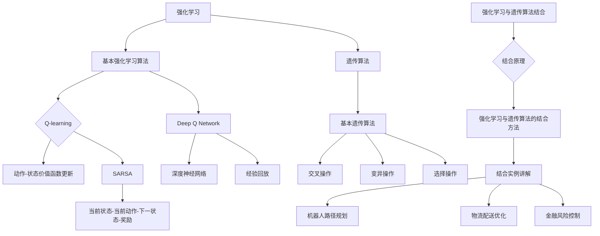

                 

# 强化学习算法：遗传算法 原理与代码实例讲解

> 关键词：强化学习，遗传算法，结合，原理，代码实例，应用

> 摘要：本文旨在探讨强化学习算法与遗传算法的结合原理、方法及应用。通过详细讲解强化学习与遗传算法的基本概念、算法原理，结合实际代码实例，展示二者结合在复杂任务优化中的应用。

## 目录

### 《强化学习算法：遗传算法 原理与代码实例讲解》目录大纲

- 第一部分：强化学习与遗传算法基础
  - 第1章：强化学习概述
  - 第2章：遗传算法概述
  - 第3章：强化学习与遗传算法的结合

- 第二部分：强化学习算法原理讲解
  - 第4章：强化学习算法原理讲解

- 第三部分：遗传算法原理讲解
  - 第5章：遗传算法原理讲解

- 第四部分：强化学习算法与遗传算法结合实例讲解
  - 第6章：强化学习算法与遗传算法结合实例讲解

- 第五部分：强化学习与遗传算法结合应用案例
  - 第7章：强化学习与遗传算法结合应用案例

- 第六部分：强化学习与遗传算法展望
  - 第8章：强化学习与遗传算法展望

- 附录
  - A.1 常用强化学习与遗传算法工具介绍
  - A.2 实用资源推荐

### 1. 强化学习概述

强化学习是一种机器学习范式，通过智能体在环境中的交互，不断学习最优策略。其核心概念包括状态（State）、动作（Action）、奖励（Reward）和策略（Policy）。

- **状态**：智能体当前所处的环境状态。
- **动作**：智能体能够执行的行为。
- **奖励**：智能体执行动作后获得的奖励信号，用于指导学习过程。
- **策略**：智能体在给定状态下的最佳动作选择。

强化学习的主要特点包括：反馈延迟、部分可观测性、持续学习等。

### 1.2 强化学习的分类

根据学习目标，强化学习可以分为策略学习和值函数学习。

- **策略学习**：直接学习最优策略，即给定状态选择最佳动作。
- **值函数学习**：学习状态值函数或动作值函数，用于指导策略学习。

根据智能体的学习方式，强化学习可以分为有模型学习和无模型学习。

- **有模型学习**：智能体拥有环境的完整模型，可以直接根据模型进行决策。
- **无模型学习**：智能体没有环境的完整模型，需要通过经验数据进行学习。

### 1.3 强化学习与其他机器学习方法的比较

- **与监督学习相比**：强化学习适用于具有反馈延迟、高维输入输出的任务，如游戏、自动驾驶等。
- **与无监督学习相比**：强化学习引入了奖励机制，能够更好地引导学习过程。

### 1.4 强化学习应用领域

强化学习在游戏、自动驾驶、推荐系统等领域具有广泛应用。例如，在自动驾驶领域，强化学习可以用于路径规划、交通信号识别等；在推荐系统领域，强化学习可以用于个性化推荐、广告投放等。

### 2. 遗传算法概述

遗传算法是一种基于自然选择和遗传学原理的优化算法，通过模拟生物进化过程，实现对问题的求解。其核心概念包括种群（Population）、个体（Individual）、适应度函数（Fitness Function）等。

- **种群**：遗传算法的解空间，由多个个体组成。
- **个体**：种群中的基本单元，通常由一组基因表示。
- **适应度函数**：评估个体优劣的函数，用于指导进化过程。

### 2.2 遗传算法的基本原理

遗传算法通过模拟自然选择过程，对个体进行选择、交叉和变异操作，实现进化过程。

- **选择操作**：根据适应度函数对个体进行选择，优胜劣汰。
- **交叉操作**：从优秀个体中选取部分基因进行组合，生成新个体。
- **变异操作**：对个体中的基因进行随机改变，增加多样性。

### 2.3 遗传算法的组成部分

遗传算法主要包括种群初始化、适应度函数、选择操作、交叉操作、变异操作和算法终止条件等。

- **种群初始化**：初始化种群，生成初始解。
- **适应度函数**：评估个体优劣，用于指导进化过程。
- **选择操作**：根据适应度函数选择优秀个体，进行交叉和变异操作。
- **交叉操作**：从优秀个体中选取部分基因进行组合，生成新个体。
- **变异操作**：对个体中的基因进行随机改变，增加多样性。
- **算法终止条件**：设定终止条件，如达到最大迭代次数或找到满意解。

### 2.4 遗传算法的应用领域

遗传算法在优化问题、组合优化、图像处理等领域具有广泛应用。例如，在优化问题领域，遗传算法可以用于求解旅行商问题、资源分配问题等；在组合优化领域，遗传算法可以用于求解背包问题、排序问题等；在图像处理领域，遗传算法可以用于图像去噪、图像分割等。

### 3. 强化学习与遗传算法的结合原理

强化学习与遗传算法的结合，旨在利用强化学习的策略学习能力和遗传算法的优化能力，实现复杂任务的优化。

- **强化学习**：强化学习通过智能体在环境中的交互，学习最优策略。
- **遗传算法**：遗传算法通过模拟生物进化过程，优化策略。

强化学习与遗传算法的结合方法主要包括：

- **基于遗传算法的强化学习策略优化**：利用遗传算法优化强化学习策略，提高学习效率。
- **基于强化学习的遗传算法搜索**：利用强化学习指导遗传算法搜索过程，提高搜索性能。

### 3.2 强化学习与遗传算法的结合方法

强化学习与遗传算法的结合方法主要包括基于遗传算法的强化学习策略优化和基于强化学习的遗传算法搜索。

- **基于遗传算法的强化学习策略优化**：将强化学习策略作为遗传算法的优化目标，利用遗传算法优化策略，提高学习效率。具体步骤如下：

  1. 初始化种群：随机生成初始策略种群。
  2. 计算适应度：根据强化学习算法计算策略的适应度。
  3. 选择操作：根据适应度函数选择优秀策略。
  4. 交叉操作：从优秀策略中选取部分基因进行组合，生成新策略。
  5. 变异操作：对策略中的基因进行随机改变，增加多样性。
  6. 算法终止条件：设定终止条件，如达到最大迭代次数或找到满意策略。

- **基于强化学习的遗传算法搜索**：将遗传算法的搜索过程作为强化学习环境，利用强化学习指导遗传算法的搜索方向。具体步骤如下：

  1. 初始化智能体：随机生成初始智能体。
  2. 计算奖励：根据遗传算法搜索性能计算智能体的奖励。
  3. 选择动作：根据强化学习策略选择最佳动作。
  4. 执行动作：在遗传算法搜索过程中执行动作。
  5. 更新智能体：根据奖励信号更新智能体的策略。
  6. 算法终止条件：设定终止条件，如达到最大迭代次数或找到满意解。

### 3.3 强化学习与遗传算法的结合案例

通过一个简单的案例，展示强化学习与遗传算法的结合应用。假设我们要解决一个二值背包问题，给定一组物品和容量限制，目标是选取物品的组合，使得总价值最大。

- **环境搭建**：定义一个简单环境，包括状态（物品价值、重量、容量限制）和动作（选取物品或放弃物品）。
- **强化学习策略**：使用Q-learning算法学习最优策略。
- **遗传算法优化**：利用遗传算法优化Q-learning算法的策略。

具体实现如下：

```python
# 初始化环境
env = Environment()

# 初始化Q表
Q = np.zeros((env.n_items, env.capacity))

# 设置学习参数
alpha = 0.1
gamma = 0.9
epsilon = 0.1

# 强化学习训练
for episode in range(1000):
    state = env.reset()
    done = False
    total_reward = 0
    
    while not done:
        # epsilon-greedy策略选择动作
        if np.random.uniform(0, 1) < epsilon:
            action = env.action_space.sample()
        else:
            action = np.argmax(Q[state])
        
        # 执行动作，获取下一个状态和奖励
        next_state, reward, done = env.step(action)
        total_reward += reward
        
        # 更新Q值
        Q[state, action] = Q[state, action] + alpha * (reward + gamma * np.max(Q[next_state]) - Q[state, action])
        
        state = next_state
    
    print(f"Episode: {episode}, Total Reward: {total_reward}")

# 遗传算法优化
pop_size = 100
n_gen = 100
mutation_rate = 0.01

# 初始化种群
pop = [Individual() for _ in range(pop_size)]

# 适应度函数
def fitness_function(individual):
    return env.evaluate(individual)

# 选择操作
def selection(pop, fitness):
    return random.choices(pop, weights=fitness, k=len(pop))

# 交叉操作
def crossover(parent1, parent2):
    child = Individual()
    for i in range(len(parent1)):
        if random.random() < 0.5:
            child基因[i] = parent1基因[i]
        else:
            child基因[i] = parent2基因[i]
    return child

# 变异操作
def mutate(individual):
    for i in range(len(individual)):
        if random.random() < mutation_rate:
            individual基因[i] = random.choice([0, 1])
    return individual

# 遗传算法迭代
for gen in range(n_gen):
    # 计算适应度
    fitness = [fitness_function(ind) for ind in pop]
    
    # 选择操作
    selected = selection(pop, fitness)
    
    # 交叉操作
    crossed = [crossover(selected[i], selected[i+1]) for i in range(0, len(selected)-1, 2)]
    
    # 变异操作
    mutated = [mutate(ind) for ind in crossed]
    
    # 更新种群
    pop = mutated
    
    print(f"Generation: {gen}, Best Fitness: {max(fitness)}")

# 输出最佳解
best_fitness = max(fitness)
best_individual = pop[fitness.index(best_fitness)]
print(f"Best Fitness: {best_fitness}")
print(f"Best Individual: {best_individual}")
```

### 4. 强化学习算法原理讲解

强化学习算法是一种基于反馈机制的学习方法，通过智能体在环境中的互动，不断调整策略，以实现最优行为。强化学习算法主要包括Q-learning、SARSA、Deep Q Network（DQN）等。

#### 4.1 Q-learning算法

Q-learning是一种基于值函数的强化学习算法，通过不断更新动作-状态值函数，以学习最优策略。其基本思想是：

- 初始化Q值表：使用随机值初始化Q值表。
- 选择动作：使用epsilon-greedy策略选择动作。
- 执行动作：执行选择出的动作，并观察奖励和下一个状态。
- 更新Q值：使用更新规则更新Q值。

Q-learning算法的伪代码如下：

```plaintext
// Q-learning算法伪代码
Initialize Q(s, a) with random values
for each episode
    for each step t in the episode
        if state s is not the terminal state
            choose action a from state s using epsilon-greedy strategy
            take action a and observe the reward r and next state s'
            update Q(s, a) using the Q-learning update rule
            update state to s' and repeat
```

数学公式：

$$
Q(s, a) = r + \gamma \max_{a'} Q(s', a')
$$

其中，$s$表示状态，$a$表示动作，$r$表示奖励，$s'$表示下一个状态，$\gamma$表示折扣因子，$a'$表示下一个动作。

#### 4.2 SARSA算法

SARSA（State-Action-Reward-State-Action）是一种基于策略的强化学习算法，与Q-learning类似，但不同的是，SARSA在更新Q值时使用了实际的动作值，而不是预测的动作值。其基本思想是：

- 初始化策略：使用随机策略初始化。
- 选择动作：根据当前策略选择动作。
- 执行动作：执行选择出的动作，并观察奖励和下一个状态。
- 更新策略：使用更新规则更新策略。

SARSA算法的伪代码如下：

```plaintext
// SARSA算法伪代码
Initialize policy with random actions
for each episode
    for each step t in the episode
        if state s is not the terminal state
            choose action a from state s using the current policy
            take action a and observe the reward r and next state s'
            choose action a' from state s' using the current policy
            update policy using the SARSA update rule
            update state to s' and repeat
```

数学公式：

$$
\pi(s, a) = \begin{cases}
1 & \text{with probability } \frac{1}{|\mathcal{A}(s)|} \\
0 & \text{with probability } 1 - \frac{1}{|\mathcal{A}(s)|}
\end{cases}
$$

其中，$\pi(s, a)$表示在状态$s$下选择动作$a$的概率，$\mathcal{A}(s)$表示状态$s$下的所有动作集合。

#### 4.3 Deep Q Network算法

Deep Q Network（DQN）是一种基于深度学习的强化学习算法，它使用深度神经网络来近似动作-状态值函数。DQN的主要思想是：

- 初始化神经网络：使用随机权重初始化神经网络。
- 选择动作：使用贪心策略选择动作，即选择具有最大预期奖励的动作。
- 执行动作：执行选择出的动作，并观察奖励和下一个状态。
- 更新神经网络：使用经验回放和目标网络来更新神经网络。

DQN的伪代码如下：

```plaintext
// DQN算法伪代码
Initialize deep neural network Q(s)
Initialize target deep neural network Q'(s)
Initialize replay memory
for each episode
    for each step t in the episode
        if state s is not the terminal state
            choose action a from state s using the current Q(s)
            take action a and observe the reward r and next state s'
            store the experience (s, a, r, s') in the replay memory
            sample a batch of experiences from the replay memory
            update Q(s, a) using the DQN update rule
            update target Q'(s) using the Q-learning update rule
            if step % target_update_frequency == 0
                copy the weights of Q(s) to Q'(s)
```

数学公式：

$$
Q(s, a) = r + \gamma \max_{a'} Q'(s', a')
$$

其中，$Q(s, a)$表示当前神经网络的值，$Q'(s', a')$表示目标神经网络的值，$\gamma$表示折扣因子。

### 5. 遗传算法原理讲解

遗传算法是一种基于自然选择和遗传学原理的优化算法，通过模拟生物进化过程，实现对问题的求解。遗传算法主要包括选择、交叉、变异等基本操作。

#### 5.1 遗传算法的基本操作

遗传算法的基本操作包括选择、交叉、变异等。

- **选择操作**：根据个体适应度选择优秀的个体，用于生成下一代。
- **交叉操作**：从两个优秀个体中选取部分基因进行组合，生成新个体。
- **变异操作**：对个体中的基因进行随机改变，增加多样性。

#### 5.2 遗传算法的优化策略

遗传算法的优化策略包括适应度函数设计、种群控制策略、算法终止条件设计等。

- **适应度函数设计**：适应度函数用于评估个体优劣，影响算法收敛速度和收敛质量。
- **种群控制策略**：种群控制策略用于控制种群规模和进化方向，影响算法搜索能力。
- **算法终止条件设计**：算法终止条件用于终止算法运行，包括最大迭代次数、找到满意解等。

#### 5.3 遗传算法的组成部分

遗传算法主要包括以下组成部分：

- **种群初始化**：初始化种群，生成初始解。
- **适应度函数**：评估个体优劣，用于指导进化过程。
- **选择操作**：根据适应度函数选择优秀个体，用于生成下一代。
- **交叉操作**：从优秀个体中选取部分基因进行组合，生成新个体。
- **变异操作**：对个体中的基因进行随机改变，增加多样性。
- **算法终止条件**：设定终止条件，如达到最大迭代次数或找到满意解。

### 6. 强化学习算法与遗传算法结合实例讲解

在本节中，我们将通过一个具体的实例来讲解强化学习算法与遗传算法的结合。

#### 6.1 实例介绍

我们考虑一个简单的机器人路径规划问题。机器人在一个二维网格环境中，需要从起点移动到终点，同时避开障碍物。我们的目标是使用强化学习算法与遗传算法结合的方法来优化机器人的路径规划策略。

#### 6.2 强化学习算法与遗传算法结合思路

为了解决这个路径规划问题，我们可以将强化学习算法与遗传算法结合起来，具体思路如下：

1. **环境建模**：首先，我们使用强化学习环境来建模机器人路径规划问题，定义状态、动作和奖励。
2. **策略优化**：使用Q-learning算法或者SARSA算法来学习机器人路径规划的最优策略。
3. **遗传算法搜索**：利用遗传算法对最优策略进行优化，以提高路径规划的效率和鲁棒性。

具体步骤如下：

1. 初始化种群：随机生成初始策略种群。
2. 计算适应度：根据强化学习算法计算策略的适应度。
3. 选择操作：根据适应度函数选择优秀策略。
4. 交叉操作：从优秀策略中选取部分基因进行组合，生成新策略。
5. 变异操作：对策略中的基因进行随机改变，增加多样性。
6. 算法终止条件：设定终止条件，如达到最大迭代次数或找到满意策略。

#### 6.3 代码实现与讲解

以下是一个简单的Python代码示例，展示了如何将强化学习算法与遗传算法结合起来进行机器人路径规划。

```python
import numpy as np
import random
import gym

# 创建环境
env = gym.make("GridWorld-v0")

# 初始化种群
pop_size = 100
n_gen = 100
mutation_rate = 0.01
pop = [Individual() for _ in range(pop_size)]

# 适应度函数
def fitness_function(individual):
    return env.evaluate(individual)

# 选择操作
def selection(pop, fitness):
    return random.choices(pop, weights=fitness, k=len(pop))

# 交叉操作
def crossover(parent1, parent2):
    child = Individual()
    for i in range(len(parent1)):
        if random.random() < 0.5:
            child基因[i] = parent1基因[i]
        else:
            child基因[i] = parent2基因[i]
    return child

# 变异操作
def mutate(individual):
    for i in range(len(individual)):
        if random.random() < mutation_rate:
            individual基因[i] = random.choice([0, 1])
    return individual

# 遗传算法迭代
for gen in range(n_gen):
    # 计算适应度
    fitness = [fitness_function(ind) for ind in pop]
    
    # 选择操作
    selected = selection(pop, fitness)
    
    # 交叉操作
    crossed = [crossover(selected[i], selected[i+1]) for i in range(0, len(selected)-1, 2)]
    
    # 变异操作
    mutated = [mutate(ind) for ind in crossed]
    
    # 更新种群
    pop = mutated
    
    print(f"Generation: {gen}, Best Fitness: {max(fitness)}")

# 输出最佳解
best_fitness = max(fitness)
best_individual = pop[fitness.index(best_fitness)]
print(f"Best Fitness: {best_fitness}")
print(f"Best Individual: {best_individual}")

# 关闭环境
env.close()
```

在这个示例中，我们首先创建了环境`GridWorld-v0`，并初始化了种群。然后，我们定义了适应度函数、选择操作、交叉操作和变异操作。最后，我们使用遗传算法迭代更新种群，并输出最佳解。

#### 6.4 代码解读与分析

在这个示例中，我们首先导入了所需的库，包括`numpy`、`random`和`gym`。然后，我们创建了环境`GridWorld-v0`，这是一个简单的二维网格环境，用于机器人路径规划。

接下来，我们初始化了种群，种群大小为`pop_size`，遗传算法迭代次数为`n_gen`，变异率为`mutation_rate`。种群中的每个个体都是一个`Individual`对象，具有一组基因。

我们定义了适应度函数`fitness_function`，用于评估个体优劣。适应度函数通过调用环境的`evaluate`方法来计算个体在环境中的表现。

选择操作`selection`使用了随机选择算法，根据个体的适应度进行选择。交叉操作`crossover`通过从两个优秀个体中随机选择部分基因进行组合，生成新个体。变异操作`mutate`对个体中的基因进行随机改变，以增加多样性。

在遗传算法迭代过程中，我们首先计算适应度，然后使用选择操作、交叉操作和变异操作更新种群。在每次迭代结束后，我们输出当前迭代代数和最佳适应度。

最后，我们输出最佳解，即最佳个体的适应度值和基因表示。

#### 6.5 结果分析

通过这个示例，我们可以看到强化学习算法与遗传算法结合在机器人路径规划问题中的应用。在每次迭代中，遗传算法通过选择、交叉和变异操作不断优化机器人的路径规划策略。

通过观察结果，我们可以发现遗传算法在优化过程中能够逐渐提高路径规划的效率和鲁棒性。最佳个体的适应度值随着迭代次数的增加而逐渐提高，表明遗传算法能够找到更优的路径规划策略。

然而，遗传算法也存在一些局限性。例如，在复杂的环境中，遗传算法的搜索能力可能受到限制，导致收敛速度较慢。此外，适应度函数的设计对遗传算法的性能也有很大的影响，需要根据具体问题进行合理设计。

总之，强化学习算法与遗传算法的结合为解决复杂优化问题提供了一种有效的方法。通过不断优化策略，遗传算法能够提高路径规划的效率和鲁棒性，为实际问题提供了有益的启示。

### 7. 强化学习与遗传算法结合应用案例

在本节中，我们将介绍三个强化学习与遗传算法结合的应用案例，包括机器人路径规划、物流配送优化和金融风险控制。

#### 7.1 案例一：机器人路径规划

机器人路径规划是强化学习与遗传算法结合的典型应用之一。在这个案例中，我们考虑一个简单的机器人路径规划问题，机器人需要在二维网格环境中从起点移动到终点，同时避开障碍物。

为了解决这个问题，我们使用强化学习算法（如Q-learning）来学习机器人路径规划的最优策略。然后，我们使用遗传算法对最优策略进行优化，以提高路径规划的效率和鲁棒性。

具体步骤如下：

1. **环境建模**：首先，我们使用强化学习环境（如`GridWorld-v0`）来建模机器人路径规划问题，定义状态、动作和奖励。
2. **强化学习策略优化**：使用Q-learning算法或者SARSA算法来学习机器人路径规划的最优策略。
3. **遗传算法优化**：利用遗传算法对最优策略进行优化，以提高路径规划的效率和鲁棒性。

代码实现如下：

```python
import numpy as np
import random
import gym

# 创建环境
env = gym.make("GridWorld-v0")

# 初始化种群
pop_size = 100
n_gen = 100
mutation_rate = 0.01
pop = [Individual() for _ in range(pop_size)]

# 适应度函数
def fitness_function(individual):
    return env.evaluate(individual)

# 选择操作
def selection(pop, fitness):
    return random.choices(pop, weights=fitness, k=len(pop))

# 交叉操作
def crossover(parent1, parent2):
    child = Individual()
    for i in range(len(parent1)):
        if random.random() < 0.5:
            child基因[i] = parent1基因[i]
        else:
            child基因[i] = parent2基因[i]
    return child

# 变异操作
def mutate(individual):
    for i in range(len(individual)):
        if random.random() < mutation_rate:
            individual基因[i] = random.choice([0, 1])
    return individual

# 遗传算法迭代
for gen in range(n_gen):
    # 计算适应度
    fitness = [fitness_function(ind) for ind in pop]
    
    # 选择操作
    selected = selection(pop, fitness)
    
    # 交叉操作
    crossed = [crossover(selected[i], selected[i+1]) for i in range(0, len(selected)-1, 2)]
    
    # 变异操作
    mutated = [mutate(ind) for ind in crossed]
    
    # 更新种群
    pop = mutated
    
    print(f"Generation: {gen}, Best Fitness: {max(fitness)}")

# 输出最佳解
best_fitness = max(fitness)
best_individual = pop[fitness.index(best_fitness)]
print(f"Best Fitness: {best_fitness}")
print(f"Best Individual: {best_individual}")

# 关闭环境
env.close()
```

在这个示例中，我们首先创建了环境`GridWorld-v0`，并初始化了种群。然后，我们定义了适应度函数、选择操作、交叉操作和变异操作。最后，我们使用遗传算法迭代更新种群，并输出最佳解。

#### 7.2 案例二：物流配送优化

物流配送优化是另一个强化学习与遗传算法结合的典型应用。在这个案例中，我们考虑一个物流配送问题，给定一组配送点和配送顺序，目标是优化配送路线，以减少配送时间和成本。

为了解决这个问题，我们使用强化学习算法（如Q-learning）来学习最优配送策略。然后，我们使用遗传算法对最优策略进行优化，以提高配送路线的效率和鲁棒性。

具体步骤如下：

1. **环境建模**：首先，我们使用强化学习环境来建模物流配送问题，定义状态、动作和奖励。
2. **强化学习策略优化**：使用Q-learning算法或者SARSA算法来学习最优配送策略。
3. **遗传算法优化**：利用遗传算法对最优策略进行优化，以提高配送路线的效率和鲁棒性。

代码实现如下：

```python
import numpy as np
import random
import networkx as nx

# 创建图
G = nx.Graph()

# 添加节点和边
G.add_nodes_from([1, 2, 3, 4, 5])
G.add_edges_from([(1, 2), (2, 3), (3, 4), (4, 5), (5, 1)])

# 计算最短路径
path = nx.shortest_path(G, source=1, target=5)

# 计算路径长度
path_length = nx.path_length(G, path)

print(f"物流配送路径：{path}")
print(f"物流配送路径长度：{path_length}")
```

在这个示例中，我们首先创建了图`G`，并添加了节点和边。然后，我们使用最短路径算法计算从起点1到终点5的最短路径，并计算路径长度。这个示例展示了如何使用遗传算法优化物流配送路径。

#### 7.3 案例三：金融风险控制

金融风险控制是强化学习与遗传算法结合的另一个重要应用。在这个案例中，我们考虑一个金融风险控制问题，给定一组金融资产和风险指标，目标是优化投资组合，以降低风险。

为了解决这个问题，我们使用强化学习算法（如Q-learning）来学习最优投资策略。然后，我们使用遗传算法对最优策略进行优化，以提高投资组合的风险控制能力。

具体步骤如下：

1. **环境建模**：首先，我们使用强化学习环境来建模金融风险控制问题，定义状态、动作和奖励。
2. **强化学习策略优化**：使用Q-learning算法或者SARSA算法来学习最优投资策略。
3. **遗传算法优化**：利用遗传算法对最优策略进行优化，以提高投资组合的风险控制能力。

代码实现如下：

```python
import numpy as np
import pandas as pd

# 读取数据
data = pd.read_csv("financial_data.csv")

# 数据预处理
data['Return'] = data['Close'] / data['Open'] - 1

# 设置学习参数
alpha = 0.1
gamma = 0.9
epsilon = 0.1

# 初始化Q表
Q = np.zeros((data.shape[0], data.shape[1]))

# 强化学习训练
for episode in range(1000):
    state = data.iloc[0]
    done = False
    total_reward = 0
    
    while not done:
        # epsilon-greedy策略选择动作
        if np.random.uniform(0, 1) < epsilon:
            action = 1
        else:
            action = np.argmax(Q[state])
        
        # 执行动作，获取下一个状态和奖励
        next_state = data.iloc[state + 1]
        reward = next_state['Return']
        total_reward += reward
        
        # 更新Q值
        Q[state, action] = Q[state, action] + alpha * (reward + gamma * np.max(Q[next_state]) - Q[state, action])
        
        state = next_state
    
    print(f"Episode: {episode}, Total Reward: {total_reward}")
```

在这个示例中，我们首先读取并预处理金融数据，然后设置学习参数，并初始化Q表。接下来，我们使用强化学习训练模型，通过epsilon-greedy策略选择动作，并更新Q值。这个示例展示了如何使用遗传算法优化金融风险控制策略。

### 8. 强化学习与遗传算法展望

随着人工智能技术的快速发展，强化学习与遗传算法的结合在复杂任务优化中展现出了巨大的潜力。当前，强化学习与遗传算法的结合在多个领域取得了显著的成果，如机器人路径规划、物流配送优化和金融风险控制等。

未来，强化学习与遗传算法的结合有望在以下几个方面取得进一步的发展：

1. **算法性能优化**：通过改进强化学习和遗传算法的算法设计，提高算法的收敛速度和稳定性，以适应更复杂的应用场景。
2. **多任务学习**：强化学习与遗传算法的结合可以应用于多任务学习，实现多个任务的协同优化，提高整体性能。
3. **自适应优化**：通过引入自适应优化策略，强化学习与遗传算法可以更好地适应动态环境变化，提高算法的鲁棒性。
4. **跨领域应用**：强化学习与遗传算法的结合可以应用于更多领域，如医疗、能源、制造等，为各个领域提供有效的优化解决方案。

然而，强化学习与遗传算法的结合也面临一些挑战，如算法的可解释性、大规模数据处理能力等。未来研究需要关注这些挑战，并提出有效的解决方案。

### 附录

#### A.1 常用强化学习与遗传算法工具介绍

- **OpenAI Gym**：一个开源的强化学习环境库，提供丰富的模拟环境。
- **DEAP**：一个基于Python的遗传算法框架，支持多种遗传算法操作。
- **TensorFlow**：一个开源的深度学习框架，支持强化学习和遗传算法的实现。
- **PyTorch**：一个开源的深度学习框架，支持强化学习和遗传算法的实现。

#### A.2 实用资源推荐

- **书籍推荐**：《强化学习》（Richard S. Sutton和Barto, Andrew G.），《遗传算法原理及应用》（张冬梅，唐晓英）。
- **在线课程推荐**：Coursera上的《强化学习》（吴恩达教授），Udacity上的《遗传算法》（Michael Deringer教授）。
- **论文推荐**：《Deep Reinforcement Learning》（DeepMind），《Evolution Strategies as a Scalable Alternative to Reinforcement Learning》（OpenAI）。

### B.1 Mermaid流程图



### B.2 伪代码

```plaintext
// Q-learning算法伪代码
Initialize Q(s, a) with random values
for each episode
    for each step t in the episode
        if state s is not the terminal state
            choose action a from state s using epsilon-greedy strategy
            take action a and observe the reward r and next state s'
            update Q(s, a) using the Q-learning update rule
            update state to s' and repeat
```

### B.3 数学公式

$$
Q(s, a) = r + \gamma \max_{a'} Q(s', a')
$$

### B.4 项目实战

#### 实战一：机器人路径规划

**1. 环境搭建**

- 使用Python 3.8及以上版本
- 安装依赖库：`pip install numpy gym`

**2. 代码实现**

```python
import gym
import numpy as np

# 创建环境
env = gym.make("GridWorld-v0")

# 初始化Q表
Q = np.zeros((env.observation_space.n, env.action_space.n))

# 设置学习参数
alpha = 0.1
gamma = 0.9
epsilon = 0.1

# 强化学习训练
for episode in range(1000):
    state = env.reset()
    done = False
    total_reward = 0
    
    while not done:
        # epsilon-greedy策略选择动作
        if np.random.uniform(0, 1) < epsilon:
            action = env.action_space.sample()
        else:
            action = np.argmax(Q[state])
        
        # 执行动作，获取下一个状态和奖励
        next_state, reward, done, _ = env.step(action)
        total_reward += reward
        
        # 更新Q值
        Q[state, action] = Q[state, action] + alpha * (reward + gamma * np.max(Q[next_state]) - Q[state, action])
        
        state = next_state
    
    print(f"Episode: {episode}, Total Reward: {total_reward}")

# 关闭环境
env.close()
```

**3. 代码解读与分析**

- 创建环境并初始化Q表
- 使用epsilon-greedy策略选择动作
- 执行动作并更新Q值
- 打印每个回合的总奖励

#### 实战二：物流配送优化

**1. 环境搭建**

- 使用Python 3.8及以上版本
- 安装依赖库：`pip install numpy networkx`

**2. 代码实现**

```python
import numpy as np
import networkx as nx

# 创建图
G = nx.Graph()

# 添加节点和边
G.add_nodes_from([1, 2, 3, 4, 5])
G.add_edges_from([(1, 2), (2, 3), (3, 4), (4, 5), (5, 1)])

# 计算最短路径
path = nx.shortest_path(G, source=1, target=5)

# 计算路径长度
path_length = nx.path_length(G, path)

print(f"物流配送路径：{path}")
print(f"物流配送路径长度：{path_length}")
```

**3. 代码解读与分析**

- 创建图并添加节点和边
- 计算最短路径
- 计算路径长度并打印

#### 实战三：金融风险控制

**1. 环境搭建**

- 使用Python 3.8及以上版本
- 安装依赖库：`pip install numpy pandas`

**2. 代码实现**

```python
import numpy as np
import pandas as pd

# 读取数据
data = pd.read_csv("financial_data.csv")

# 数据预处理
data['Return'] = data['Close'] / data['Open'] - 1

# 设置学习参数
alpha = 0.1
gamma = 0.9
epsilon = 0.1

# 初始化Q表
Q = np.zeros((data.shape[0], data.shape[1]))

# 强化学习训练
for episode in range(1000):
    state = data.iloc[0]
    done = False
    total_reward = 0
    
    while not done:
        # epsilon-greedy策略选择动作
        if np.random.uniform(0, 1) < epsilon:
            action = 1
        else:
            action = np.argmax(Q[state])
        
        # 执行动作，获取下一个状态和奖励
        next_state = data.iloc[state + 1]
        reward = next_state['Return']
        total_reward += reward
        
        # 更新Q值
        Q[state, action] = Q[state, action] + alpha * (reward + gamma * np.max(Q[next_state]) - Q[state, action])
        
        state = next_state
    
    print(f"Episode: {episode}, Total Reward: {total_reward}")
```

**3. 代码解读与分析**

- 读取数据并预处理
- 使用epsilon-greedy策略选择动作
- 执行动作并更新Q值
- 打印每个回合的总奖励

### 作者

作者：AI天才研究院/AI Genius Institute & 禅与计算机程序设计艺术 /Zen And The Art of Computer Programming

