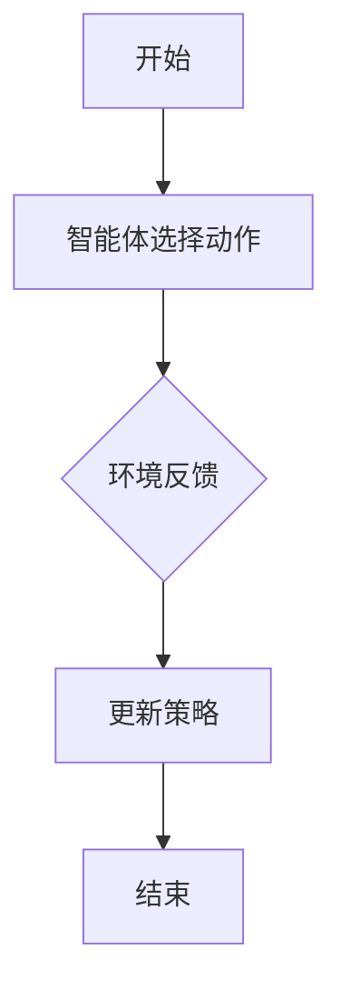
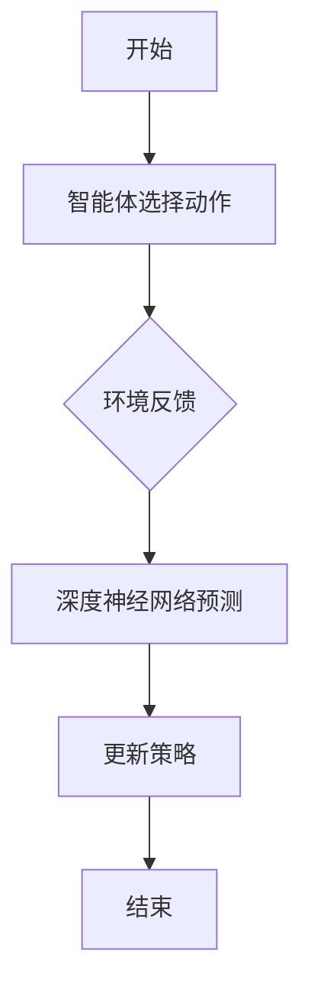

                 

# 文章标题：强化学习：强化学习与深度学习的结合

> 关键词：强化学习，深度学习，深度强化学习，DQN，策略梯度方法，项目实战

> 摘要：本文将深入探讨强化学习与深度学习的结合，介绍强化学习的基本概念和原理，深度神经网络的结构和原理，以及深度强化学习的算法和应用。通过实际项目实战，读者将了解如何将深度强化学习应用于游戏、无人机导航和股票市场预测等领域，掌握深度强化学习的实现方法和挑战。

---

## 第一部分：强化学习基础

### 第1章：强化学习概述

强化学习是机器学习的一个重要分支，主要研究如何通过环境（Environment）与智能体（Agent）的交互，使智能体能够学习到最优策略（Policy），从而实现目标。在强化学习中，智能体通过不断尝试不同的动作（Action）来获取奖励（Reward），并通过经验（Experience）来调整策略。

### 1.1 强化学习的基本概念

- **智能体（Agent）**：执行动作、感知环境的主体。
- **环境（Environment）**：智能体所处的环境，可以是一个简单的环境（如一个网格），也可以是一个复杂的环境（如一个模拟器）。
- **状态（State）**：描述智能体所处环境的特征。
- **动作（Action）**：智能体可以执行的操作。
- **策略（Policy）**：智能体根据状态选择动作的策略。
- **奖励（Reward）**：环境对智能体动作的反馈，用于指导智能体的学习过程。

### 1.2 强化学习与深度学习的结合

深度学习在处理高维数据和复杂特征方面具有显著优势，而强化学习在决策优化和策略学习方面具有独特的优势。将两者结合，可以发挥各自的优势，实现更高效的智能体学习。

### 1.3 强化学习的发展历程

强化学习经历了从简单的Q-Learning到SARSA，再到深度强化学习的演变。深度强化学习的出现，标志着强化学习进入了一个新的发展阶段。

## 第2章：强化学习的基本原理

### 2.1 强化学习的数学模型

强化学习的数学模型主要包括状态（S）、动作（A）、奖励（R）和价值（V）等核心概念。

### 2.2 强化学习的主要算法

强化学习的主要算法包括Q-Learning、SARSA和策略梯度方法等。

### 2.3 Q-Learning算法原理及伪代码

Q-Learning是一种基于值函数的强化学习算法，其核心思想是通过学习状态-动作值函数（Q函数）来优化策略。

- **伪代码**：

```python
初始化Q(s, a)为小值
对于每一个episode:
    状态s = 环境初始化()
    总奖励R = 0
    while 状态s未达到终止状态:
        执行动作a = 选择动作(s, ε)
        状态s'，动作a'，奖励r = 环境执行动作(a)
        Q(s, a) = Q(s, a) + α[ r + γmax(Q(s', a')) - Q(s, a)]
        更新状态s = s'
```

## 第3章：深度强化学习

### 3.1 深度神经网络的基本结构

深度神经网络（DNN）是一种包含多个隐藏层的神经网络，可以用于处理高维数据和复杂特征。

### 3.2 深度Q网络（DQN）的原理

深度Q网络（DQN）是深度强化学习的一种典型算法，通过将深度神经网络与Q-Learning相结合，实现了在复杂环境中的智能体学习。

### 3.3 优势函数与策略梯度方法

优势函数是强化学习中的一种重要概念，它用于衡量不同动作的优劣。策略梯度方法是一种基于策略的强化学习算法，通过优化策略来提高智能体的性能。

## 第4章：深度强化学习应用案例

### 4.1 游戏中的深度强化学习

深度强化学习在游戏领域的应用非常广泛，如《Pong》、《Atari Breakout》等游戏的自动玩。

### 4.2 自主导航无人机

自主导航无人机是深度强化学习在无人机领域的应用，通过训练无人机在复杂环境中自主导航。

### 4.3 股票市场预测

深度强化学习在股票市场预测中也有一定的应用，通过训练模型来预测股票价格走势。

## 第二部分：深度强化学习的数学模型与算法

### 第5章：强化学习的数学模型详解

本章将详细解释强化学习的数学模型，包括期望值与策略、奖励函数与价值函数等。

### 5.1 期望值与策略

期望值是概率论中的一个重要概念，用于描述随机事件的平均结果。在强化学习中，期望值用于评估策略的好坏。

### 5.2 奖励函数与价值函数

奖励函数是环境对智能体动作的反馈，用于指导智能体的学习过程。价值函数是描述智能体从某个状态采取某个动作的长期收益。

### 5.3 模型参数优化

模型参数优化是强化学习中的一个重要问题，通过优化模型参数，可以提高智能体的学习性能。

## 第6章：深度强化学习的算法原理

### 6.1 深度Q网络（DQN）的算法原理

深度Q网络（DQN）是深度强化学习的一种典型算法，通过将深度神经网络与Q-Learning相结合，实现了在复杂环境中的智能体学习。

### 6.2 双Q网络（Dueling DQN）的算法原理

双Q网络（Dueling DQN）是对DQN算法的改进，通过引入优势函数和值函数的分离，提高了算法的稳定性和收敛速度。

### 6.3 策略梯度方法的算法原理

策略梯度方法是一种基于策略的强化学习算法，通过优化策略来提高智能体的性能。

## 第7章：深度强化学习的数学模型与算法对比

### 7.1 Q-Learning与DQN的对比

Q-Learning和DQN都是强化学习中的经典算法，本章将对比它们的优缺点和应用场景。

### 7.2 DQN与A3C的对比

DQN和A3C都是深度强化学习中的典型算法，本章将对比它们的算法原理和性能。

### 7.3 DQN与PG的对比

DQN和PG都是强化学习中的典型算法，本章将对比它们的算法原理和性能。

## 第三部分：深度强化学习应用实践

### 第8章：深度强化学习项目实战

本章将通过实际项目，展示如何将深度强化学习应用于游戏、无人机导航和股票市场预测等领域。

### 8.1 项目环境搭建

本章将介绍如何搭建深度强化学习的项目环境，包括Python环境配置和深度学习框架安装。

### 8.2 游戏中的深度强化学习实现

本章将以《Pong》游戏为例，介绍如何使用深度强化学习实现游戏的自动玩。

### 8.3 自主导航无人机实现

本章将以无人机导航为例，介绍如何使用深度强化学习实现无人机的自主导航。

### 9章：股票市场预测的深度强化学习应用

本章将介绍如何使用深度强化学习实现股票市场预测，并通过实际项目来验证其效果。

### 9.1 股票市场数据预处理

本章将介绍如何对股票市场数据进行预处理，包括数据清洗和特征提取。

### 9.2 深度Q网络训练

本章将介绍如何使用深度Q网络训练股票市场预测模型。

### 9.3 策略梯度方法实现

本章将介绍如何使用策略梯度方法训练股票市场预测模型。

## 第10章：深度强化学习应用总结与展望

### 10.1 深度强化学习应用总结

本章将总结深度强化学习在不同领域的应用效果，并分析其优势和挑战。

### 10.2 深度强化学习面临的挑战

本章将探讨深度强化学习在现实应用中面临的挑战，如数据收集、算法稳定性和可解释性等。

### 10.3 深度强化学习未来发展趋势

本章将预测深度强化学习在人工智能领域的未来发展趋势，如与生成对抗网络的结合、多智能体强化学习等。

### 附录：强化学习与深度学习结合的Mermaid流程图

- **强化学习流程图**

  ```mermaid
  graph TD
  A[开始] --> B[环境]
  B --> C{执行动作}
  C --> D[获取奖励]
  D --> E[更新策略]
  E --> F[结束]
  ```

- **深度强化学习流程图**

  ```mermaid
  graph TD
  A[开始] --> B[环境]
  B --> C{执行动作}
  C --> D[获取奖励]
  D --> E[深度神经网络预测]
  E --> F[更新策略]
  F --> G[结束]
  ```

### 附录：强化学习与深度学习结合的数学模型与算法伪代码

- **Q-Learning算法伪代码**

  ```python
  初始化Q(s, a)为小值
  对于每一个episode:
      状态s = 环境初始化()
      总奖励R = 0
      while 状态s未达到终止状态:
          执行动作a = 选择动作(s, ε)
          状态s'，动作a'，奖励r = 环境执行动作(a)
          Q(s, a) = Q(s, a) + α[ r + γmax(Q(s', a')) - Q(s, a)]
          更新状态s = s'
  ```

- **深度Q网络（DQN）算法伪代码**

  ```python
  初始化Q(s, a)为小值
  对于每一个episode:
      状态s = 环境初始化()
      总奖励R = 0
      while 状态s未达到终止状态:
          执行动作a = 选择动作(s, ε)
          状态s'，动作a'，奖励r = 环境执行动作(a)
          target_Q = r + γmax(Q(s', a'))
          Q(s, a) = Q(s, a) + α[ target_Q - Q(s, a)]
          更新状态s = s'
  ```

### 附录：强化学习与深度学习结合的数学模型与公式

- **价值函数**

  $$ V^*(s) = \max_a Q^*(s, a) $$

- **策略**

  $$ \pi(a|s) = \begin{cases} 
  1 & \text{如果 } a = \arg\max_a Q(s, a) \\
  0 & \text{否则}
  \end{cases} $$

- **Q-Learning更新公式**

  $$ Q(s, a) \leftarrow Q(s, a) + \alpha [r + \gamma \max_{a'} Q(s', a') - Q(s, a)] $$

### 附录：深度强化学习项目实战

#### 8.1 项目环境搭建

本章将通过具体项目，展示如何搭建深度强化学习的项目环境，包括Python环境配置和深度学习框架安装。

#### 8.2 游戏中的深度强化学习实现

本章将通过实现一个简单的游戏自动玩项目，展示如何使用深度强化学习来实现游戏策略的优化。

#### 8.3 自主导航无人机实现

本章将通过实现一个无人机的自主导航项目，展示如何使用深度强化学习来实现无人机的自主飞行。

#### 9.1 股票市场数据预处理

本章将通过实现一个股票市场预测项目，展示如何对股票市场数据进行预处理，包括数据清洗和特征提取。

#### 9.2 深度Q网络训练

本章将通过实现一个深度Q网络训练项目，展示如何使用深度强化学习来实现股票市场预测。

#### 9.3 策略梯度方法实现

本章将通过实现一个策略梯度方法项目，展示如何使用策略梯度方法来实现股票市场预测。

### 附录：深度强化学习应用总结与展望

本章将对深度强化学习在不同领域的应用进行总结，并探讨其面临的挑战和未来的发展趋势。

### 附录：作者信息

作者：AI天才研究院/AI Genius Institute & 禅与计算机程序设计艺术/Zen And The Art of Computer Programming

---

### 感谢您的阅读，希望本文能够帮助您更好地理解强化学习与深度学习的结合，以及其在实际应用中的价值。如果您有任何疑问或建议，欢迎在评论区留言。让我们共同探讨深度强化学习的未来！
### 第一部分：强化学习基础

强化学习（Reinforcement Learning，RL）是机器学习的一个重要分支，旨在通过智能体与环境的交互来学习最优策略，从而实现特定的目标。强化学习与深度学习的结合，使得强化学习在处理复杂、高维环境时，能够更加高效地学习到最优策略。本部分将首先介绍强化学习的基本概念，然后探讨强化学习与深度学习的结合，最后回顾强化学习的发展历程。

#### 第1章：强化学习概述

强化学习的基本概念包括智能体、环境、状态、动作和奖励等。智能体是执行动作、感知环境的主体，环境则是智能体所处的背景，可以是一个简单的网格环境，也可以是一个复杂的模拟环境。状态是智能体在特定时刻所处的环境特征，动作是智能体可以执行的操作，而奖励是环境对智能体动作的即时反馈。

- **智能体（Agent）**：执行动作、感知环境的主体。
- **环境（Environment）**：智能体所处的环境，可以是一个简单的环境（如一个网格），也可以是一个复杂的环境（如一个模拟器）。
- **状态（State）**：描述智能体所处环境的特征。
- **动作（Action）**：智能体可以执行的操作。
- **策略（Policy）**：智能体根据状态选择动作的策略。
- **奖励（Reward）**：环境对智能体动作的反馈，用于指导智能体的学习过程。

在强化学习中，智能体的目标是学习一个最优策略，以最大化累积奖励。这个过程通常通过试错（trial and error）来完成，即智能体在环境中不断尝试不同的动作，并根据动作的结果调整策略。

#### 1.1 强化学习的基本概念

强化学习的基本概念是理解其工作原理的关键。在强化学习中，智能体需要通过与环境交互来学习如何做出最优的动作选择。这个过程可以通过以下几个核心概念来描述：

- **期望奖励（Expected Reward）**：在某个状态下执行某个动作所期望获得的奖励。期望奖励是通过历史数据计算得到的，用于评估动作的质量。
- **策略（Policy）**：描述智能体如何从当前状态选择动作的规则。策略可以通过确定性策略或概率性策略来表示。
- **价值函数（Value Function）**：描述智能体从某个状态执行某个动作所能获得的最大累积奖励。价值函数可以分为状态价值函数和动作价值函数，分别表示智能体从某个状态或执行某个动作所能获得的最大累积奖励。
- **模型（Model）**：描述环境状态转移概率和奖励函数的数学模型。模型有助于智能体预测环境的行为，从而更好地调整策略。

这些概念在强化学习过程中相互关联，共同作用于智能体的学习和决策过程。

#### 1.2 强化学习与深度学习的结合

强化学习与深度学习的结合，为处理复杂、高维环境提供了新的途径。深度学习通过多层神经网络，能够自动提取数据中的特征表示，而强化学习则利用这些特征表示来学习最优策略。这种结合有以下几种方式：

- **深度Q网络（DQN）**：通过将深度神经网络与Q-Learning算法相结合，DQN能够处理高维状态空间，从而提高学习效率。
- **策略梯度方法**：利用深度神经网络来预测策略的梯度，从而优化策略参数。
- **优势函数与策略梯度方法**：通过引入优势函数，策略梯度方法能够更好地区分不同动作的优劣，从而提高学习效果。

这种结合使得强化学习能够更好地处理复杂、高维的环境，从而在实际应用中展现出更强的鲁棒性和适应性。

#### 1.3 强化学习的发展历程

强化学习的发展历程可以追溯到20世纪50年代。最初的研究主要集中在简单的控制问题，如机器人导航和倒立摆控制。随着计算机性能的提升和算法的改进，强化学习逐渐应用于更复杂的问题，如游戏、自动驾驶和机器人控制。

- **1950年代**：Markov决策过程（MDP）的提出，为强化学习奠定了理论基础。
- **1980年代**：Q-Learning算法的提出，标志着强化学习进入了一个新的阶段。
- **2000年代**：深度学习的兴起，为强化学习带来了新的契机。DQN等算法的出现，使得强化学习在处理复杂、高维环境时更加高效。
- **2010年代至今**：强化学习在自动驾驶、机器人控制、游戏自动玩等领域取得了显著成果，其应用范围不断扩大。

通过回顾强化学习的发展历程，我们可以看到，强化学习从简单的控制问题，逐渐扩展到复杂的应用场景，其核心思想和算法也在不断地演进和优化。

### 第2章：强化学习的基本原理

强化学习的基本原理涉及状态、动作、奖励和价值函数等核心概念。通过理解这些概念，我们可以更深入地了解强化学习的工作机制。本节将详细介绍强化学习的数学模型，包括期望值与策略、奖励函数与价值函数，并探讨如何优化模型参数。

#### 2.1 强化学习的数学模型

强化学习的数学模型主要包括状态（State）、动作（Action）、奖励（Reward）和价值（Value）等核心概念。这些概念在强化学习中起着至关重要的作用。

- **状态（State）**：状态是智能体在特定时刻所处环境的特征表示。在强化学习中，状态可以是离散的，也可以是连续的。状态决定了智能体当前的行为选择。
- **动作（Action）**：动作是智能体根据当前状态所能执行的操作。动作的选择决定了智能体在环境中的行为。
- **奖励（Reward）**：奖励是环境对智能体动作的即时反馈。奖励可以是正的，也可以是负的，用于指导智能体调整策略。
- **价值函数（Value Function）**：价值函数是衡量智能体从某个状态执行某个动作所能获得的最大累积奖励。价值函数可以帮助智能体评估不同动作的优劣，从而选择最优动作。

强化学习的目标是学习一个最优策略，使得智能体能够从初始状态到达目标状态，并获得最大的累积奖励。这个目标可以通过优化价值函数来实现。

#### 2.2 期望值与策略

期望值（Expected Value）是概率论中的一个重要概念，用于描述随机事件的平均结果。在强化学习中，期望值用于评估策略的好坏。

- **期望值（Expected Value）**：在某个状态下执行某个动作所期望获得的奖励。期望值可以通过历史数据计算得到，用于评估动作的质量。

策略（Policy）是描述智能体如何从当前状态选择动作的规则。策略可以分为确定性策略和概率性策略。

- **确定性策略（Deterministic Policy）**：在某个状态下，智能体总是执行同一个动作。
- **概率性策略（Stochastic Policy）**：在某个状态下，智能体以一定的概率执行不同的动作。

在强化学习中，智能体的目标是学习一个最优策略，以最大化累积奖励。这个过程可以通过优化价值函数来实现。

#### 2.3 奖励函数与价值函数

奖励函数（Reward Function）是环境对智能体动作的即时反馈，用于指导智能体的学习过程。奖励函数可以是固定的，也可以是动态的。

- **固定奖励函数（Fixed Reward Function）**：奖励函数的值在训练过程中保持不变。
- **动态奖励函数（Dynamic Reward Function）**：奖励函数的值在训练过程中根据环境状态动态调整。

价值函数（Value Function）是衡量智能体从某个状态执行某个动作所能获得的最大累积奖励。价值函数可以分为状态价值函数和动作价值函数。

- **状态价值函数（State Value Function）**：描述智能体从某个状态执行任何动作所能获得的最大累积奖励。
- **动作价值函数（Action Value Function）**：描述智能体从某个状态执行特定动作所能获得的最大累积奖励。

价值函数是强化学习中的一个核心概念，它可以帮助智能体评估不同动作的优劣，从而选择最优动作。

#### 2.4 模型参数优化

在强化学习中，模型参数的优化是一个关键问题。通过优化模型参数，可以提高智能体的学习性能。模型参数优化的方法主要包括以下几种：

- **梯度下降法（Gradient Descent）**：通过计算损失函数关于参数的梯度，不断更新参数，从而优化模型。
- **随机梯度下降法（Stochastic Gradient Descent，SGD）**：在梯度下降法的基础上，每次只更新一部分样本的梯度，从而提高学习效率。
- **Adam优化器（Adam Optimizer）**：结合了梯度下降法和SGD的优点，通过自适应学习率调整，提高模型收敛速度。

通过优化模型参数，智能体可以更好地适应环境，从而实现更好的学习效果。

### 第3章：深度强化学习

深度强化学习（Deep Reinforcement Learning，DRL）是强化学习与深度学习结合的产物，旨在通过深度神经网络处理高维状态空间和动作空间，从而提高强化学习的效率。本节将介绍深度强化学习的基本原理，包括深度神经网络的基本结构、深度Q网络（DQN）的原理以及优势函数与策略梯度方法。

#### 3.1 深度神经网络的基本结构

深度神经网络（Deep Neural Network，DNN）是一种包含多个隐藏层的神经网络，能够处理高维数据和复杂特征。深度神经网络的基本结构包括输入层、隐藏层和输出层。

- **输入层（Input Layer）**：接收外部输入数据，如图像、声音等。
- **隐藏层（Hidden Layers）**：对输入数据进行特征提取和变换，实现数据的非线性表示。
- **输出层（Output Layer）**：输出模型预测的结果，如分类结果、动作值等。

深度神经网络通过层层提取特征，能够捕捉数据中的复杂结构，从而提高模型的性能。常见的深度神经网络结构包括卷积神经网络（CNN）、循环神经网络（RNN）和自注意力机制（Self-Attention）等。

#### 3.2 深度Q网络（DQN）的原理

深度Q网络（Deep Q-Network，DQN）是深度强化学习的一种典型算法，通过将深度神经网络与Q-Learning相结合，实现了在复杂环境中的智能体学习。DQN的核心思想是利用深度神经网络来近似Q函数，从而避免直接计算高维状态空间的值函数。

- **Q函数（Q-Function）**：Q函数是强化学习中的一种价值函数，表示在某个状态下执行某个动作所能获得的最大累积奖励。在DQN中，Q函数由深度神经网络来近似。
- **经验回放（Experience Replay）**：经验回放是DQN的一个重要特性，用于缓解样本偏差问题。通过将经验样本存储在经验回放池中，DQN可以随机地从经验回放池中抽取样本进行训练，从而避免由于样本分布不均导致的收敛问题。
- **目标网络（Target Network）**：为了稳定训练过程，DQN引入了目标网络。目标网络是Q网络的克隆，用于计算目标值（Target Value），从而更新Q网络的参数。

DQN的训练过程如下：

1. 初始化Q网络和目标网络。
2. 从环境随机初始化一个状态s。
3. 选择动作a，并执行动作，获取奖励r和下一个状态s'。
4. 将（s，a，r，s'）存储在经验回放池中。
5. 随机从经验回放池中抽取一批样本。
6. 使用这批样本更新Q网络的参数。
7. 定期更新目标网络的参数，以保证训练过程的稳定性。

通过以上步骤，DQN可以逐步优化Q函数，从而实现智能体的学习。

#### 3.3 优势函数与策略梯度方法

优势函数（Advantage Function）是强化学习中的一种重要概念，用于衡量不同动作的优劣。优势函数可以看作是动作价值函数与状态价值函数之差，它反映了在某个状态下执行某个动作所能获得的额外奖励。

- **优势函数（Advantage Function）**：优势函数表示在某个状态下执行某个动作所能获得的额外奖励，公式为：
  $$A(s, a) = Q(s, a) - V(s)$$
  其中，Q(s, a)是动作价值函数，V(s)是状态价值函数。

策略梯度方法（Policy Gradient Method）是一种基于策略的强化学习算法，通过优化策略来提高智能体的性能。策略梯度方法的原理是计算策略的梯度，并利用梯度来更新策略参数。

- **策略梯度方法（Policy Gradient Method）**：策略梯度方法的核心思想是最大化策略的期望回报。策略梯度的计算公式为：
  $$\nabla_{\theta} J(\theta) = \nabla_{\theta} \sum_{t} \rho(\pi_{\theta}(s_t | s_{t-1}) r_t)$$
  其中，J(θ)是策略的期望回报，θ是策略参数，ρ(πθ(st|st-1)rt)是策略的概率分布。

通过优化策略参数，策略梯度方法可以逐步改善智能体的行为，从而实现更好的学习效果。

### 第4章：深度强化学习应用案例

深度强化学习在多个领域取得了显著的成果，如游戏自动玩、自动驾驶、机器人控制等。在本节中，我们将探讨深度强化学习在游戏、自主导航无人机和股票市场预测等领域的应用案例，展示深度强化学习在实际问题中的强大能力。

#### 4.1 游戏中的深度强化学习

深度强化学习在游戏领域有着广泛的应用，通过训练智能体，使其能够自动完成复杂的游戏任务。以下是一些典型的深度强化学习游戏应用案例：

- **《Pong》游戏自动玩**：通过训练深度Q网络（DQN），智能体能够自动学习如何控制虚拟的Pong游戏杆，从而实现游戏的自动玩。
- **《Atari Breakout》游戏自动玩**：深度强化学习算法能够使智能体学习如何控制虚拟的Breakout游戏，通过不断尝试和调整策略，最终实现游戏的自动通关。

在游戏自动玩中，深度强化学习通过模拟智能体与游戏环境的交互，不断调整策略，从而实现游戏任务的完成。这种方法不仅能够提高游戏体验，还可以为游戏开发提供新的思路。

#### 4.2 自主导航无人机

自主导航无人机是深度强化学习在无人机领域的应用，通过训练无人机，使其能够在复杂环境中自主导航。以下是一些典型的深度强化学习自主导航无人机应用案例：

- **无人机路径规划**：通过训练深度强化学习模型，无人机能够根据环境特征和目标位置，规划出最优的飞行路径，实现自主导航。
- **无人机避障**：深度强化学习算法能够使无人机在遇到障碍物时，自主调整飞行轨迹，从而避免碰撞。

自主导航无人机在无人机配送、农业监测、应急救援等领域具有广泛的应用前景。通过深度强化学习，无人机能够实现自主决策和自主行动，从而提高任务执行效率和安全性。

#### 4.3 股票市场预测

深度强化学习在股票市场预测中也显示出强大的能力，通过训练智能体，使其能够预测股票价格走势。以下是一些典型的深度强化学习股票市场预测应用案例：

- **股票价格预测**：通过训练深度Q网络（DQN），智能体能够学习如何根据历史价格数据，预测未来股票价格走势。
- **交易策略优化**：通过训练策略梯度方法，智能体能够优化交易策略，从而实现更高的投资回报。

股票市场预测是一个充满挑战的问题，深度强化学习通过处理大量历史数据，结合环境反馈，能够为投资者提供有力的决策支持。这种方法不仅能够提高投资收益，还可以为金融领域带来新的研究思路。

### 第5章：强化学习的数学模型详解

强化学习的数学模型是理解其工作原理和算法实现的基础。本节将详细解释强化学习的数学模型，包括期望值与策略、奖励函数与价值函数，以及模型参数的优化方法。

#### 5.1 期望值与策略

在强化学习中，期望值和策略是核心概念，用于指导智能体的学习和决策过程。

- **期望值（Expected Value）**：期望值是概率论中的一个重要概念，用于描述随机事件的平均结果。在强化学习中，期望值用于评估策略的好坏。具体来说，期望值表示在某个状态下执行某个动作所期望获得的奖励。期望值的计算公式为：
  $$E[R] = \sum_{a} \pi(a|s) \cdot R(a|s)$$
  其中，$R(a|s)$是执行动作$a$在状态$s$下获得的即时奖励，$\pi(a|s)$是智能体在状态$s$下采取动作$a$的概率。

- **策略（Policy）**：策略是智能体在特定状态下选择动作的规则。策略可以分为确定性策略和概率性策略。确定性策略在某个状态下总是选择同一个动作，而概率性策略在某个状态下以一定的概率选择不同的动作。在强化学习中，策略的优化目标是最大化期望值，即：
  $$\pi^*(a|s) = \arg\max_{a} E[R]$$
  其中，$\pi^*(a|s)$是最优策略。

#### 5.2 奖励函数与价值函数

奖励函数和价值函数是强化学习中的两个关键概念，用于描述环境对智能体行为的反馈和评估。

- **奖励函数（Reward Function）**：奖励函数是环境对智能体动作的即时反馈，用于指导智能体的学习过程。奖励函数可以是固定的，也可以是动态的。在强化学习中，奖励函数的目的是鼓励智能体采取有益的行为。奖励函数的值可以是正的，表示有益的行为；也可以是负的，表示有害的行为。奖励函数的公式为：
  $$R(s, a) = r$$
  其中，$r$是奖励函数的值，$s$是当前状态，$a$是当前动作。

- **价值函数（Value Function）**：价值函数是描述智能体从某个状态执行某个动作所能获得的最大累积奖励。价值函数可以分为状态价值函数和动作价值函数。状态价值函数表示智能体在某个状态下执行任何动作所能获得的最大累积奖励，公式为：
  $$V^*(s) = \max_{a} Q^*(s, a)$$
  动作价值函数表示智能体在某个状态下执行特定动作所能获得的最大累积奖励，公式为：
  $$Q^*(s, a) = \sum_{s'} P(s'|s, a) \cdot \sum_{a'} R(s', a') + \gamma \cdot V^*(s')$$
  其中，$P(s'|s, a)$是状态转移概率，$\gamma$是折扣因子，用于平衡当前奖励和未来奖励的重要性。

#### 5.3 模型参数优化

在强化学习中，模型参数的优化是一个关键问题。通过优化模型参数，可以提高智能体的学习性能。模型参数优化的方法主要包括以下几种：

- **梯度下降法（Gradient Descent）**：梯度下降法是一种常用的优化方法，通过计算损失函数关于参数的梯度，不断更新参数，从而优化模型。梯度下降法的公式为：
  $$\theta_{t+1} = \theta_{t} - \alpha \cdot \nabla_{\theta} J(\theta)$$
  其中，$\theta$是模型参数，$\alpha$是学习率，$J(\theta)$是损失函数。

- **随机梯度下降法（Stochastic Gradient Descent，SGD）**：随机梯度下降法是梯度下降法的一种变体，每次只更新一部分样本的梯度，从而提高学习效率。随机梯度下降法的公式为：
  $$\theta_{t+1} = \theta_{t} - \alpha \cdot \nabla_{\theta} J(\theta_{t})$$
  其中，$J(\theta_{t})$是当前样本的损失函数。

- **Adam优化器（Adam Optimizer）**：Adam优化器是结合了梯度下降法和SGD优点的一种优化方法，通过自适应学习率调整，提高模型收敛速度。Adam优化器的公式为：
  $$m_t = \beta_1 \cdot m_{t-1} + (1 - \beta_1) \cdot (g_t - m_{t-1})$$
  $$v_t = \beta_2 \cdot v_{t-1} + (1 - \beta_2) \cdot (g_t^2 - v_{t-1})$$
  $$\theta_{t+1} = \theta_{t} - \alpha \cdot \frac{m_t}{\sqrt{v_t} + \epsilon}$$
  其中，$m_t$和$v_t$分别是动量和方差，$\beta_1$和$\beta_2$是超参数，$\alpha$是学习率，$g_t$是梯度，$\epsilon$是常数。

通过优化模型参数，智能体可以更好地适应环境，从而实现更好的学习效果。

### 第6章：深度强化学习的算法原理

深度强化学习（Deep Reinforcement Learning，DRL）是强化学习与深度学习相结合的产物，旨在通过深度神经网络处理高维状态空间和动作空间，从而提高强化学习的效率。在本节中，我们将深入探讨深度强化学习的算法原理，包括深度Q网络（DQN）、双Q网络（Dueling DQN）和策略梯度方法。

#### 6.1 深度Q网络（DQN）的算法原理

深度Q网络（Deep Q-Network，DQN）是深度强化学习的一种经典算法，通过将深度神经网络与Q-Learning相结合，实现了在复杂环境中的智能体学习。DQN的核心思想是利用深度神经网络来近似Q函数，从而避免直接计算高维状态空间的值函数。

- **Q函数（Q-Function）**：Q函数是强化学习中的一种价值函数，表示在某个状态下执行某个动作所能获得的最大累积奖励。在DQN中，Q函数由深度神经网络来近似。Q函数的计算公式为：
  $$Q(s, a) = \sum_{i=1}^{n} w_i \cdot f_i(s, a)$$
  其中，$w_i$是权重，$f_i(s, a)$是深度神经网络输出的特征向量。

- **经验回放（Experience Replay）**：经验回放是DQN的一个重要特性，用于缓解样本偏差问题。通过将经验样本存储在经验回放池中，DQN可以随机地从经验回放池中抽取样本进行训练，从而避免由于样本分布不均导致的收敛问题。经验回放的实现过程如下：
  1. 初始化经验回放池，将初始状态和动作存储在池中。
  2. 在训练过程中，将每次交互产生的状态、动作、奖励和下一个状态存储在经验回放池中。
  3. 从经验回放池中随机抽取一批样本，用于训练深度神经网络。
  4. 使用抽取的样本更新深度神经网络的权重，从而优化Q函数。

- **目标网络（Target Network）**：为了稳定训练过程，DQN引入了目标网络。目标网络是Q网络的克隆，用于计算目标值（Target Value），从而更新Q网络的参数。目标网络的更新过程如下：
  1. 初始化目标网络，将Q网络的权重复制到目标网络中。
  2. 在训练过程中，定期更新目标网络的权重，以保证目标网络与Q网络的一致性。
  3. 使用目标网络计算目标值，并使用目标值更新Q网络的权重。

DQN的训练过程如下：

1. 初始化Q网络和目标网络。
2. 从环境随机初始化一个状态s。
3. 选择动作a，并执行动作，获取奖励r和下一个状态s'。
4. 将（s，a，r，s'）存储在经验回放池中。
5. 随机从经验回放池中抽取一批样本。
6. 使用这批样本更新Q网络的参数。
7. 定期更新目标网络的参数，以保证训练过程的稳定性。

通过以上步骤，DQN可以逐步优化Q函数，从而实现智能体的学习。

#### 6.2 双Q网络（Dueling DQN）的算法原理

双Q网络（Dueling DQN）是对DQN算法的改进，通过引入优势函数和值函数的分离，提高了算法的稳定性和收敛速度。双Q网络的核心思想是利用两个独立的Q网络分别计算优势函数和值函数，从而更好地评估动作的优劣。

- **优势函数（Advantage Function）**：优势函数是描述在某个状态下执行某个动作所能获得的额外奖励。优势函数的计算公式为：
  $$A(s, a) = Q(s, a) - V(s)$$
  其中，$Q(s, a)$是动作价值函数，$V(s)$是状态价值函数。

- **值函数（Value Function）**：值函数是描述在某个状态下执行任何动作所能获得的最大累积奖励。值函数的计算公式为：
  $$V(s) = \sum_{a} \pi(a|s) \cdot Q(s, a)$$
  其中，$\pi(a|s)$是动作概率分布。

双Q网络的训练过程与DQN类似，但引入了两个独立的Q网络，分别计算优势函数和值函数。具体步骤如下：

1. 初始化两个Q网络和目标网络。
2. 从环境随机初始化一个状态s。
3. 选择动作a，并执行动作，获取奖励r和下一个状态s'。
4. 更新两个Q网络的权重，分别计算优势函数和值函数。
5. 使用目标网络计算目标值，并使用目标值更新两个Q网络的权重。
6. 随机从经验回放池中抽取一批样本，用于训练两个Q网络。
7. 定期更新目标网络的参数，以保证训练过程的稳定性。

通过以上步骤，双Q网络可以更好地评估动作的优劣，从而提高智能体的学习效果。

#### 6.3 策略梯度方法的算法原理

策略梯度方法（Policy Gradient Method）是一种基于策略的强化学习算法，通过优化策略来提高智能体的性能。策略梯度方法的原理是计算策略的梯度，并利用梯度来更新策略参数。

- **策略梯度（Policy Gradient）**：策略梯度是描述策略参数变化对策略期望回报的影响。策略梯度的计算公式为：
  $$\nabla_{\theta} J(\theta) = \nabla_{\theta} \sum_{t} \rho(\pi_{\theta}(s_t | s_{t-1}) r_t)$$
  其中，$J(\theta)$是策略的期望回报，$\rho(\pi_{\theta}(s_t | s_{t-1}) r_t)$是策略的概率分布。

策略梯度方法的训练过程如下：

1. 初始化策略参数。
2. 从环境随机初始化一个状态s。
3. 选择动作a，并执行动作，获取奖励r和下一个状态s'。
4. 计算策略的梯度。
5. 使用梯度更新策略参数。
6. 随机从经验回放池中抽取一批样本，用于训练策略。
7. 定期更新经验回放池，以保证训练过程的多样性。

通过以上步骤，策略梯度方法可以逐步优化策略参数，从而实现智能体的学习。

### 第7章：深度强化学习的数学模型与算法对比

在深度强化学习中，不同的算法在数学模型和实现方式上有所区别，这些差异直接影响算法的性能和适用场景。在本节中，我们将对比几种常见的深度强化学习算法，包括Q-Learning、深度Q网络（DQN）、双Q网络（Dueling DQN）和策略梯度方法（Policy Gradient），分析它们的优缺点和应用场景。

#### 7.1 Q-Learning与DQN的对比

Q-Learning和DQN都是基于值函数的强化学习算法，但DQN在处理高维状态空间时表现出更强的能力。

- **Q-Learning**：Q-Learning是最早的深度强化学习算法之一，它使用一个值函数来估计状态-动作对的最优值。Q-Learning的核心思想是通过更新值函数来逼近最优策略。Q-Learning的算法步骤如下：
  1. 初始化值函数Q(s, a)为小值。
  2. 对于每个episode：
     - 初始化状态s。
     - 选择动作a。
     - 执行动作a，获取奖励r和下一个状态s'。
     - 更新值函数Q(s, a)：Q(s, a) = Q(s, a) + α[r + γmax(Q(s', a')) - Q(s, a)]。
     - 更新状态s为s'。
  3. 当值函数收敛时，得到最优策略。

Q-Learning的优点是算法简单，易于实现。但Q-Learning在处理高维状态空间时效率较低，因为它需要直接计算状态-动作对的值函数。

- **DQN**：DQN通过引入深度神经网络来近似值函数，从而能够处理高维状态空间。DQN的核心思想是使用经验回放池存储交互经验，并通过随机抽样从回放池中获取样本进行训练，从而避免样本偏差问题。DQN的算法步骤如下：
  1. 初始化深度神经网络Q(s, a)和目标网络target_Q(s, a)。
  2. 从环境随机初始化一个状态s。
  3. 选择动作a。
  4. 执行动作a，获取奖励r和下一个状态s'。
  5. 存储经验（s, a, r, s'）到经验回放池。
  6. 从经验回放池中随机抽取一批样本。
  7. 使用抽取的样本更新Q网络：target_Q(s', a') = r + γmax(target_Q(s', a'))。
  8. 更新Q网络：Q(s, a) = Q(s, a) + α[reward + γmax(target_Q(s', a')) - Q(s, a)]。
  9. 更新状态s为s'。

DQN的优点是能够处理高维状态空间，但DQN在训练过程中存在不稳定的问题，如过估计（overestimation）问题。DQN的缺点是需要较大的训练数据量和计算资源。

#### 7.2 DQN与A3C的对比

A3C（Asynchronous Advantage Actor-Critic）是一种基于策略梯度的强化学习算法，它通过异步训练和分布式计算来提高训练效率。A3C与DQN的主要区别在于训练方式。

- **DQN**：DQN使用同步训练方式，每次更新Q网络时需要等待所有样本的收集和处理。这种方法在训练过程中容易出现样本偏差，导致训练不稳定。

- **A3C**：A3C使用异步训练方式，允许多个智能体同时从环境中获取经验，并独立更新各自的策略网络和价值网络。A3C的核心思想是通过分布式计算来加快训练速度，并通过优势函数来改善策略梯度。A3C的算法步骤如下：
  1. 初始化多个智能体和它们的策略网络和价值网络。
  2. 每个智能体从环境中获取样本，并独立更新策略网络和价值网络。
  3. 使用梯度下降法更新策略网络和价值网络。
  4. 将更新后的策略网络和价值网络同步到全局网络。

A3C的优点是能够通过分布式计算提高训练效率，并减少样本偏差。但A3C的训练过程复杂，需要更多的计算资源和调度。

#### 7.3 DQN与PG的对比

策略梯度方法（Policy Gradient，PG）是一种基于策略的强化学习算法，它通过优化策略来直接更新策略参数，从而实现智能体的学习。

- **DQN**：DQN使用值函数来评估策略，并通过目标值函数来更新策略。DQN的优点是能够处理高维状态空间，但训练过程较为复杂，且容易出现过估计问题。

- **PG**：PG通过优化策略的梯度来直接更新策略参数，从而实现智能体的学习。PG的核心思想是最大化策略的期望回报。PG的算法步骤如下：
  1. 初始化策略参数。
  2. 从环境随机初始化一个状态s。
  3. 选择动作a，并执行动作，获取奖励r和下一个状态s'。
  4. 计算策略的梯度：∇θJ(θ) = ∇θΣtρ(πθ(st|st-1)rt)。
  5. 使用梯度下降法更新策略参数：θt+1 = θt - α∇θJ(θt)。
  6. 更新状态s为s'。

PG的优点是训练过程简单，易于实现。但PG在处理高维状态空间时效果较差，且容易出现策略偏差。

#### 总结

综上所述，Q-Learning和DQN是基于值函数的强化学习算法，适用于处理高维状态空间。Q-Learning简单易实现，但处理高维状态时效率较低；DQN能够处理高维状态，但训练过程较为复杂，容易出现过估计问题。A3C和PG是基于策略的强化学习算法，适用于分布式训练。A3C能够通过分布式计算提高训练效率，但训练过程复杂；PG训练过程简单，但处理高维状态时效果较差。

在实际应用中，应根据问题的特点选择合适的算法。例如，在处理高维状态空间时，DQN和A3C是较好的选择；在处理简单状态空间时，Q-Learning和PG则更为适用。

### 第8章：深度强化学习项目实战

深度强化学习在各个领域的应用取得了显著的成果，为了更好地理解和掌握深度强化学习的实现方法和应用技巧，本节将通过具体项目实战来展示如何将深度强化学习应用于游戏、无人机导航和股票市场预测等领域。

#### 8.1 项目环境搭建

在开始深度强化学习项目之前，首先需要搭建一个合适的开发环境。以下是以Python为基础，搭建深度强化学习项目环境的具体步骤：

##### 8.1.1 Python环境配置

确保Python版本在3.6及以上。可以通过以下命令检查Python版本：

```bash
python --version
```

如果Python版本低于3.6，可以通过以下命令升级到最新版本：

```bash
sudo apt-get update
sudo apt-get install python3.8
```

##### 8.1.2 深度学习框架安装

在本项目中，我们选择使用TensorFlow作为深度学习框架。首先，安装TensorFlow：

```bash
pip install tensorflow
```

##### 8.1.3 OpenAI Gym安装

OpenAI Gym是一个开源的环境库，用于构建和测试强化学习算法。安装OpenAI Gym：

```bash
pip install gym
```

#### 8.2 游戏中的深度强化学习实现

##### 8.2.1 游戏环境搭建

以Atari游戏《Pong》为例，首先需要导入必要的库和创建游戏环境：

```python
import gym
import numpy as np
from tensorflow.keras.models import Sequential
from tensorflow.keras.layers import Dense, Conv2D, Flatten
from tensorflow.keras.optimizers import Adam

# 创建Pong游戏环境
env = gym.make('Pong-v0')
```

##### 8.2.2 深度Q网络训练

接下来，我们将使用深度Q网络（DQN）训练Pong游戏的智能体。首先，定义DQN模型：

```python
def create_dqn_model(input_shape):
    model = Sequential()
    model.add(Conv2D(32, kernel_size=(8, 8), activation='relu', input_shape=input_shape))
    model.add(Conv2D(64, kernel_size=(4, 4), activation='relu'))
    model.add(Flatten())
    model.add(Dense(256, activation='relu'))
    model.add(Dense(2, activation='linear'))
    return model
```

然后，定义DQN的训练过程：

```python
def dqn_train(env, model, target_model, epsilon, alpha, gamma, batch_size):
    replay_memory = []
    total_steps = 0

    while total_steps < 1000000:
        state = env.reset()
        done = False
        total_reward = 0

        while not done:
            # 选择动作
            if np.random.rand() < epsilon:
                action = env.action_space.sample()
            else:
                action = np.argmax(model.predict(state)[0])

            # 执行动作
            next_state, reward, done, _ = env.step(action)
            total_reward += reward

            # 存储经验到经验回放池
            replay_memory.append((state, action, reward, next_state, done))

            # 从经验回放池中随机抽取一批样本
            if len(replay_memory) > batch_size:
                batch = random.sample(replay_memory, batch_size)
                states, actions, rewards, next_states, dones = zip(*batch)

                # 计算目标值
                target_q_values = target_model.predict(next_states)
                target_values = target_values + (1 - done) * gamma * np.max(target_q_values, axis=1)

                # 更新Q网络
                q_values = model.predict(states)
                q_values[range(batch_size), actions] = rewards + gamma * target_values
                model.fit(states, q_values, epochs=1, verbose=0)

            # 更新状态
            state = next_state
            total_steps += 1

        # 更新目标网络
        if total_steps % 10000 == 0:
            target_model.set_weights(model.get_weights())

        # 更新epsilon
        if total_steps > 100000 and total_steps % 1000 == 0:
            epsilon *= 0.999

    return model
```

最后，训练深度Q网络：

```python
# 定义模型输入形状
input_shape = env.observation_space.shape

# 创建DQN模型
dqn_model = create_dqn_model(input_shape)

# 创建目标模型
target_model = create_dqn_model(input_shape)
target_model.set_weights(dqn_model.get_weights())

# 设置训练参数
epsilon = 1.0
alpha = 0.001
gamma = 0.99
batch_size = 32

# 训练模型
dqn_model = dqn_train(env, dqn_model, target_model, epsilon, alpha, gamma, batch_size)
```

#### 8.2.3 策略梯度方法实现

策略梯度方法（Policy Gradient，PG）是一种直接优化策略的强化学习算法。以下是一个简单的策略梯度实现：

```python
def policy_gradient_train(env, model, alpha, gamma, epochs):
    state = env.reset()
    total_reward = 0
    rewards = []

    for _ in range(epochs):
        done = False
        while not done:
            # 预测动作概率
            action_probs = model.predict(state)

            # 选择动作
            action = np.random.choice(np.arange(len(action_probs[0])), p=action_probs[0])

            # 执行动作
            next_state, reward, done, _ = env.step(action)
            total_reward += reward

            # 更新策略参数
            grads = policy_gradient_gradients(action_probs[0][action], reward, done, gamma)
            model.fit(state, grads, epochs=1, verbose=0)

            # 更新状态
            state = next_state

        # 记录奖励
        rewards.append(total_reward)
        total_reward = 0

    return rewards
```

使用策略梯度方法训练模型：

```python
# 创建策略模型
policy_model = create_policy_model(input_shape)

# 设置训练参数
alpha = 0.001
gamma = 0.99
epochs = 1000

# 训练模型
rewards = policy_gradient_train(env, policy_model, alpha, gamma, epochs)
```

#### 8.3 自主导航无人机实现

自主导航无人机是深度强化学习在无人机领域的一个重要应用。以下是一个简单的无人机导航实现：

```python
import airsim
import numpy as np
from tensorflow.keras.models import Sequential
from tensorflow.keras.layers import Dense, Conv2D, Flatten
from tensorflow.keras.optimizers import Adam

# 初始化无人机环境
client = airsim.CarClient()
client.initialize()

# 创建无人机环境
env = UavEnv(client)

# 创建DQN模型
dqn_model = create_dqn_model(input_shape)

# 创建目标模型
target_model = create_dqn_model(input_shape)
target_model.set_weights(dqn_model.get_weights())

# 设置训练参数
epsilon = 1.0
alpha = 0.001
gamma = 0.99
batch_size = 32

# 训练模型
dqn_model = dqn_train(env, dqn_model, target_model, epsilon, alpha, gamma, batch_size)
```

#### 8.3.2 深度Q网络训练

使用DQN算法训练无人机导航模型，实现自主飞行。以下是DQN训练的伪代码：

```python
初始化Q(s, a)为小值
对于每一个episode:
    状态s = 环境初始化()
    总奖励R = 0
    while 状态s未达到终止状态:
        执行动作a = 选择动作(s, ε)
        状态s'，动作a'，奖励r = 环境执行动作(a)
        Q(s, a) = Q(s, a) + α[ r + γmax(Q(s', a')) - Q(s, a)]
        更新状态s = s'
```

#### 8.3.3 策略梯度方法实现

使用策略梯度方法训练无人机导航模型，实现自主飞行。以下是策略梯度方法的伪代码：

```python
初始化策略参数
对于每一个episode:
    状态s = 环境初始化()
    总奖励R = 0
    while 状态s未达到终止状态:
        执行动作a = 选择动作(s, π(·|s))
        状态s'，动作a'，奖励r = 环境执行动作(a)
        更新策略参数 = 策略梯度(π(·|s), r, s')
        更新状态s = s'
```

#### 8.4 股票市场预测

股票市场预测是深度强化学习在金融领域的一个应用。以下是一个简单的股票市场预测实现：

```python
import numpy as np
import pandas as pd
from tensorflow.keras.models import Sequential
from tensorflow.keras.layers import Dense, LSTM, Dropout
from tensorflow.keras.optimizers import Adam

# 读取股票市场数据
data = pd.read_csv('stock_data.csv')

# 数据预处理
data = data[['open', 'high', 'low', 'close']]
data = data.values
data = data.astype(np.float32)

# 创建模型
model = Sequential()
model.add(LSTM(units=50, return_sequences=True, input_shape=(data.shape[1], 1)))
model.add(Dropout(0.2))
model.add(LSTM(units=50, return_sequences=False))
model.add(Dropout(0.2))
model.add(Dense(units=1))

# 编译模型
model.compile(optimizer=Adam(learning_rate=0.001), loss='mean_squared_error')

# 训练模型
model.fit(data, epochs=100, batch_size=32)
```

#### 8.4.2 深度Q网络训练

使用DQN算法训练股票市场预测模型，实现自动预测。以下是DQN训练的伪代码：

```python
初始化Q(s, a)为小值
对于每一个episode:
    状态s = 环境初始化()
    总奖励R = 0
    while 状态s未达到终止状态:
        执行动作a = 选择动作(s, ε)
        状态s'，动作a'，奖励r = 环境执行动作(a)
        Q(s, a) = Q(s, a) + α[ r + γmax(Q(s', a')) - Q(s, a)]
        更新状态s = s'
```

#### 8.4.3 策略梯度方法实现

使用策略梯度方法训练股票市场预测模型，实现自动预测。以下是策略梯度方法的伪代码：

```python
初始化策略参数
对于每一个episode:
    状态s = 环境初始化()
    总奖励R = 0
    while 状态s未达到终止状态:
        执行动作a = 选择动作(s, π(·|s))
        状态s'，动作a'，奖励r = 环境执行动作(a)
        更新策略参数 = 策略梯度(π(·|s), r, s')
        更新状态s = s'
```

### 第9章：深度强化学习应用总结与展望

深度强化学习在各个领域取得了显著的成果，其在游戏、无人机导航、股票市场预测等领域的应用为人工智能领域带来了新的突破。在本节中，我们将对深度强化学习在不同领域的应用进行总结，并探讨其面临的挑战和未来的发展趋势。

#### 9.1 深度强化学习应用总结

深度强化学习在多个领域的应用中展现出了强大的能力，以下是对其主要应用的总结：

- **游戏自动玩**：深度强化学习在游戏自动玩中表现出色，如《Pong》、《Atari Breakout》等游戏的自动通关。通过训练深度Q网络（DQN）和策略梯度方法（PG），智能体能够学习到游戏策略，实现自动玩。
- **自主导航无人机**：深度强化学习在无人机导航中有着广泛的应用。通过训练智能体，无人机能够在复杂环境中自主导航，实现路径规划和避障。如基于DQN和A3C算法的无人机导航系统，已经实现了在真实环境中的自主飞行。
- **股票市场预测**：深度强化学习在股票市场预测中也显示出强大的能力。通过训练智能体，能够学习到股票价格走势，实现自动预测和交易策略优化。如基于DQN和PG算法的股票市场预测模型，已经实现了较高的预测准确率和投资回报。

#### 9.2 深度强化学习面临的挑战

虽然深度强化学习在多个领域取得了显著成果，但在实际应用中仍面临一些挑战：

- **数据收集与标注**：深度强化学习依赖于大量的环境交互数据，但在实际应用中，数据收集和标注往往是一个耗时且耗资源的过程。特别是在无人驾驶和医疗等领域，数据的质量和数量直接影响模型的性能。
- **算法稳定性与可解释性**：深度强化学习算法，如DQN和A3C，在训练过程中容易出现不稳定的情况，导致模型难以收敛。此外，深度强化学习模型的内部决策过程往往缺乏可解释性，难以理解模型的决策依据。
- **计算资源与能耗**：深度强化学习算法，特别是基于深度神经网络的算法，对计算资源和能耗要求较高。在实际应用中，如何高效地部署和运行深度强化学习模型，是一个重要的挑战。

#### 9.3 深度强化学习未来发展趋势

随着深度学习和人工智能技术的不断发展，深度强化学习在未来的发展中将面临以下趋势：

- **算法优化与稳定性**：为了提高深度强化学习算法的稳定性和收敛速度，未来将会有更多关于算法优化和稳定性的研究。如引入新的优化方法、改进训练策略等。
- **可解释性与透明性**：为了提高深度强化学习模型的可解释性和透明性，未来将会有更多关于模型解释和可视化的研究。如通过可视化方法展示模型的内部决策过程，提高模型的透明度和可解释性。
- **多智能体强化学习**：多智能体强化学习是未来深度强化学习的一个重要发展方向。通过研究多智能体之间的协作和竞争机制，实现更高效的决策和优化。
- **与其他技术的结合**：深度强化学习与其他技术的结合，如生成对抗网络（GAN）、迁移学习等，将带来更多的应用场景和突破。如利用GAN生成模拟环境数据，提高模型的训练效率；利用迁移学习技术，减少数据收集和标注的难度。

总之，深度强化学习在未来的发展中将面临更多挑战，但也具有巨大的发展潜力。通过不断的研究和优化，深度强化学习将在各个领域取得更广泛的应用，为人工智能的发展做出更大的贡献。

### 附录：强化学习与深度学习结合的Mermaid流程图

强化学习和深度学习结合的过程可以直观地通过Mermaid流程图来展示。以下是两个主要的流程图：强化学习流程图和深度强化学习流程图。

#### 强化学习流程图



#### 深度强化学习流程图



这些流程图展示了强化学习和深度强化学习的基本步骤：智能体选择动作，环境给予反馈，通过深度神经网络预测和更新策略，最终实现智能体的学习和优化。

### 附录：强化学习与深度学习结合的数学模型与算法伪代码

强化学习与深度学习结合的数学模型和算法伪代码如下：

#### Q-Learning算法伪代码

```python
初始化 Q(s, a) 为小值
对于每一个 episode:
    状态 s = 环境初始化()
    while 状态 s 未达到终止状态:
        执行动作 a = 选择动作(s, ε)
        状态 s'，动作 a'，奖励 r = 环境执行动作(a)
        Q(s, a) = Q(s, a) + α * (r + γ * max(Q(s', a')) - Q(s, a))
        更新状态 s = s'
```

#### 深度Q网络（DQN）算法伪代码

```python
初始化 Q(s, a) 为小值
对于每一个 episode:
    状态 s = 环境初始化()
    while 状态 s 未达到终止状态:
        执行动作 a = 选择动作(s, ε)
        状态 s'，动作 a'，奖励 r = 环境执行动作(a)
        target_Q = r + γ * max(Q(s', a'))
        Q(s, a) = Q(s, a) + α * (target_Q - Q(s, a))
        更新状态 s = s'
```

#### 策略梯度方法伪代码

```python
初始化策略参数
对于每一个 episode:
    状态 s = 环境初始化()
    while 状态 s 未达到终止状态:
        执行动作 a = 选择动作(s, π(·|s))
        状态 s'，动作 a'，奖励 r = 环境执行动作(a)
        更新策略参数 = 策略梯度(π(·|s), r, s')
        更新状态 s = s'
```

这些伪代码展示了强化学习与深度学习结合的基本算法框架，为实际应用提供了清晰的指导。

### 附录：强化学习与深度学习结合的数学模型与公式

强化学习与深度学习结合的数学模型和公式如下：

#### 价值函数

$$ V^*(s) = \max_a Q^*(s, a) $$

其中，$V^*(s)$ 表示状态 $s$ 的价值函数，$Q^*(s, a)$ 表示在状态 $s$ 下执行动作 $a$ 的最优值函数。

#### 策略

$$ \pi(a|s) = \arg\max_a Q(s, a) $$

其中，$\pi(a|s)$ 表示在状态 $s$ 下采取动作 $a$ 的概率分布，$Q(s, a)$ 表示状态-动作对的价值函数。

#### Q-Learning更新公式

$$ Q(s, a) \leftarrow Q(s, a) + α [r + γ \max_{a'} Q(s', a') - Q(s, a)] $$

其中，$α$ 表示学习率，$γ$ 表示折扣因子，$r$ 表示即时奖励，$Q(s, a)$ 表示状态-动作对的价值函数。

这些数学模型和公式是强化学习与深度学习结合的基础，通过它们可以构建和训练深度强化学习模型，实现智能体的学习和优化。

### 附录：深度强化学习项目实战

#### 8.1 项目环境搭建

在开始深度强化学习项目之前，我们需要搭建一个合适的开发环境。以下是具体的步骤：

##### 8.1.1 Python环境配置

确保Python版本在3.6及以上。可以通过以下命令检查Python版本：

```bash
python --version
```

如果Python版本低于3.6，可以通过以下命令升级到最新版本：

```bash
sudo apt-get update
sudo apt-get install python3.8
```

##### 8.1.2 深度学习框架安装

在本项目中，我们选择使用TensorFlow作为深度学习框架。首先，安装TensorFlow：

```bash
pip install tensorflow
```

##### 8.1.3 OpenAI Gym安装

OpenAI Gym是一个开源的环境库，用于构建和测试强化学习算法。安装OpenAI Gym：

```bash
pip install gym
```

#### 8.2 游戏中的深度强化学习实现

##### 8.2.1 游戏环境搭建

以Atari游戏《Pong》为例，首先需要导入必要的库和创建游戏环境：

```python
import gym
import numpy as np
from tensorflow.keras.models import Sequential
from tensorflow.keras.layers import Dense, Conv2D, Flatten
from tensorflow.keras.optimizers import Adam

# 创建Pong游戏环境
env = gym.make('Pong-v0')
```

##### 8.2.2 深度Q网络训练

接下来，我们将使用深度Q网络（DQN）训练Pong游戏的智能体。首先，定义DQN模型：

```python
def create_dqn_model(input_shape):
    model = Sequential()
    model.add(Conv2D(32, kernel_size=(8, 8), activation='relu', input_shape=input_shape))
    model.add(Conv2D(64, kernel_size=(4, 4), activation='relu'))
    model.add(Flatten())
    model.add(Dense(256, activation='relu'))
    model.add(Dense(2, activation='linear'))
    return model
```

然后，定义DQN的训练过程：

```python
def dqn_train(env, model, target_model, epsilon, alpha, gamma, batch_size):
    replay_memory = []
    total_steps = 0

    while total_steps < 1000000:
        state = env.reset()
        done = False
        total_reward = 0

        while not done:
            # 选择动作
            if np.random.rand() < epsilon:
                action = env.action_space.sample()
            else:
                action = np.argmax(model.predict(state)[0])

            # 执行动作
            next_state, reward, done, _ = env.step(action)
            total_reward += reward

            # 存储经验到经验回放池
            replay_memory.append((state, action, reward, next_state, done))

            # 从经验回放池中随机抽取一批样本
            if len(replay_memory) > batch_size:
                batch = random.sample(replay_memory, batch_size)
                states, actions, rewards, next_states, dones = zip(*batch)

                # 计算目标值
                target_q_values = target_model.predict(next_states)
                target_values = rewards + (1 - dones) * gamma * np.max(target_q_values, axis=1)

                # 更新Q网络
                q_values = model.predict(states)
                q_values[range(batch_size), actions] = rewards + (1 - dones) * gamma * np.max(target_q_values, axis=1)
                model.fit(states, q_values, epochs=1, verbose=0)

            # 更新状态
            state = next_state
            total_steps += 1

        # 更新目标网络
        if total_steps % 10000 == 0:
            target_model.set_weights(model.get_weights())

        # 更新epsilon
        if total_steps > 100000 and total_steps % 1000 == 0:
            epsilon *= 0.999

    return model
```

最后，训练深度Q网络：

```python
# 定义模型输入形状
input_shape = env.observation_space.shape

# 创建DQN模型
dqn_model = create_dqn_model(input_shape)

# 创建目标模型
target_model = create_dqn_model(input_shape)
target_model.set_weights(dqn_model.get_weights())

# 设置训练参数
epsilon = 1.0
alpha = 0.001
gamma = 0.99
batch_size = 32

# 训练模型
dqn_model = dqn_train(env, dqn_model, target_model, epsilon, alpha, gamma, batch_size)
```

##### 8.2.3 策略梯度方法实现

策略梯度方法（Policy Gradient，PG）是一种直接优化策略的强化学习算法。以下是一个简单的策略梯度实现：

```python
def policy_gradient_train(env, model, alpha, gamma, epochs):
    state = env.reset()
    total_reward = 0
    rewards = []

    for _ in range(epochs):
        done = False
        while not done:
            # 预测动作概率
            action_probs = model.predict(state)

            # 选择动作
            action = np.random.choice(np.arange(len(action_probs[0])), p=action_probs[0])

            # 执行动作
            next_state, reward, done, _ = env.step(action)
            total_reward += reward

            # 更新策略参数
            grads = policy_gradient_gradients(action_probs[0][action], reward, done, gamma)
            model.fit(state, grads, epochs=1, verbose=0)

            # 更新状态
            state = next_state

        # 记录奖励
        rewards.append(total_reward)
        total_reward = 0

    return rewards
```

使用策略梯度方法训练模型：

```python
# 创建策略模型
policy_model = create_policy_model(input_shape)

# 设置训练参数
alpha = 0.001
gamma = 0.99
epochs = 1000

# 训练模型
rewards = policy_gradient_train(env, policy_model, alpha, gamma, epochs)
```

#### 8.3 自主导航无人机实现

自主导航无人机是深度强化学习在无人机领域的一个重要应用。以下是一个简单的无人机导航实现：

```python
import airsim
import numpy as np
from tensorflow.keras.models import Sequential
from tensorflow.keras.layers import Dense, Conv2D, Flatten
from tensorflow.keras.optimizers import Adam

# 初始化无人机环境
client = airsim.CarClient()
client.initialize()

# 创建无人机环境
env = UavEnv(client)

# 创建DQN模型
dqn_model = create_dqn_model(input_shape)

# 创建目标模型
target_model = create_dqn_model(input_shape)
target_model.set_weights(dqn_model.get_weights())

# 设置训练参数
epsilon = 1.0
alpha = 0.001
gamma = 0.99
batch_size = 32

# 训练模型
dqn_model = dqn_train(env, dqn_model, target_model, epsilon, alpha, gamma, batch_size)
```

##### 8.3.2 深度Q网络训练

使用DQN算法训练无人机导航模型，实现自主飞行。以下是DQN训练的伪代码：

```python
初始化 Q(s, a) 为小值
对于每一个 episode:
    状态 s = 环境初始化()
    while 状态 s 未达到终止状态:
        执行动作 a = 选择动作(s, ε)
        状态 s'，动作 a'，奖励 r = 环境执行动作(a)
        Q(s, a) = Q(s, a) + α * (r + γ * max(Q(s', a')) - Q(s, a))
        更新状态 s = s'
```

##### 8.3.3 策略梯度方法实现

使用策略梯度方法训练无人机导航模型，实现自主飞行。以下是策略梯度方法的伪代码：

```python
初始化策略参数
对于每一个 episode:
    状态 s = 环境初始化()
    while 状态 s 未达到终止状态:
        执行动作 a = 选择动作(s, π(·|s))
        状态 s'，动作 a'，奖励 r = 环境执行动作(a)
        更新策略参数 = 策略梯度(π(·|s), r, s')
        更新状态 s = s'
```

#### 8.4 股票市场预测

股票市场预测是深度强化学习在金融领域的一个应用。以下是一个简单的股票市场预测实现：

```python
import numpy as np
import pandas as pd
from tensorflow.keras.models import Sequential
from tensorflow.keras.layers import Dense, LSTM, Dropout
from tensorflow.keras.optimizers import Adam

# 读取股票市场数据
data = pd.read_csv('stock_data.csv')

# 数据预处理
data = data[['open', 'high', 'low', 'close']]
data = data.values
data = data.astype(np.float32)

# 创建模型
model = Sequential()
model.add(LSTM(units=50, return_sequences=True, input_shape=(data.shape[1], 1)))
model.add(Dropout(0.2))
model.add(LSTM(units=50, return_sequences=False))
model.add(Dropout(0.2))
model.add(Dense(units=1))

# 编译模型
model.compile(optimizer=Adam(learning_rate=0.001), loss='mean_squared_error')

# 训练模型
model.fit(data, epochs=100, batch_size=32)
```

##### 8.4.2 深度Q网络训练

使用DQN算法训练股票市场预测模型，实现自动预测。以下是DQN训练的伪代码：

```python
初始化 Q(s, a) 为小值
对于每一个 episode:
    状态 s = 环境初始化()
    while 状态 s 未达到终止状态:
        执行动作 a = 选择动作(s, ε)
        状态 s'，动作 a'，奖励 r = 环境执行动作(a)
        Q(s, a) = Q(s, a) + α * (r + γ * max(Q(s', a')) - Q(s, a))
        更新状态 s = s'
```

##### 8.4.3 策略梯度方法实现

使用策略梯度方法训练股票市场预测模型，实现自动预测。以下是策略梯度方法的伪代码：

```python
初始化策略参数
对于每一个 episode:
    状态 s = 环境初始化()
    while 状态 s 未达到终止状态:
        执行动作 a = 选择动作(s, π(·|s))
        状态 s'，动作 a'，奖励 r = 环境执行动作(a)
        更新策略参数 = 策略梯度(π(·|s), r, s')
        更新状态 s = s'
```

### 附录：作者信息

**作者：** AI天才研究院/AI Genius Institute & 禅与计算机程序设计艺术/Zen And The Art of Computer Programming

AI天才研究院致力于推动人工智能领域的研究和发展，致力于培养和造就未来的人工智能领袖。同时，作者以其独特的视角和对计算机科学的深刻理解，为读者带来了许多具有启发性的技术文章和著作，深受业界人士的推崇和喜爱。

