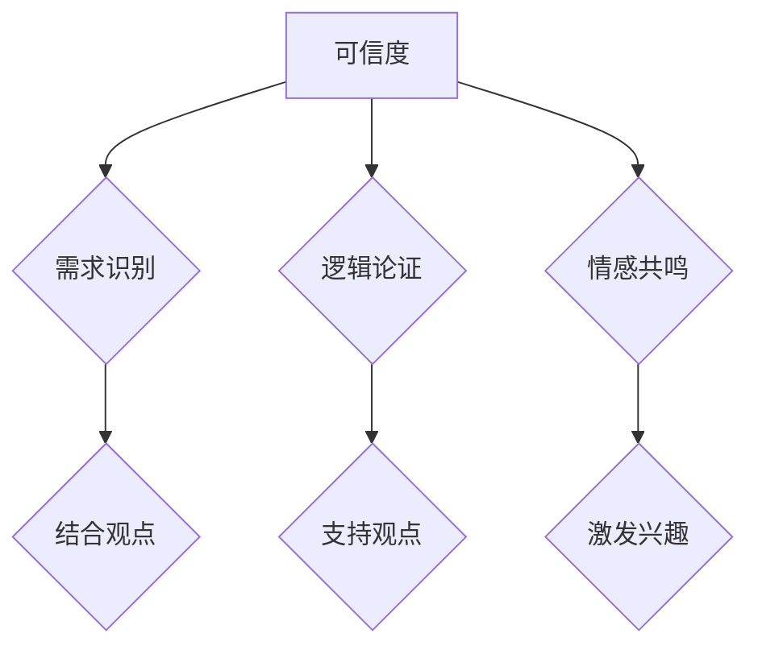
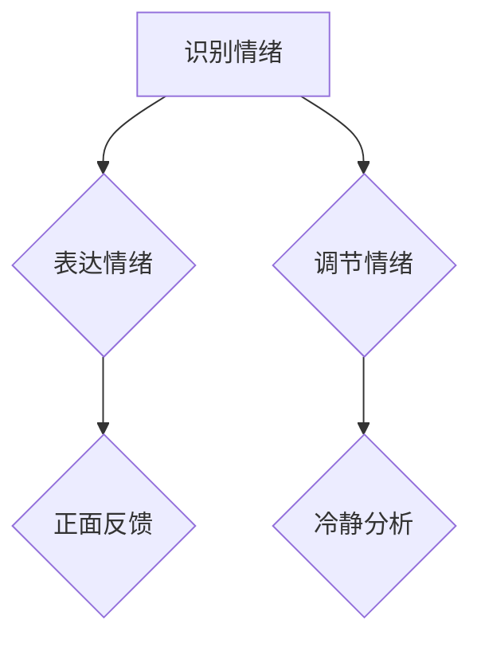
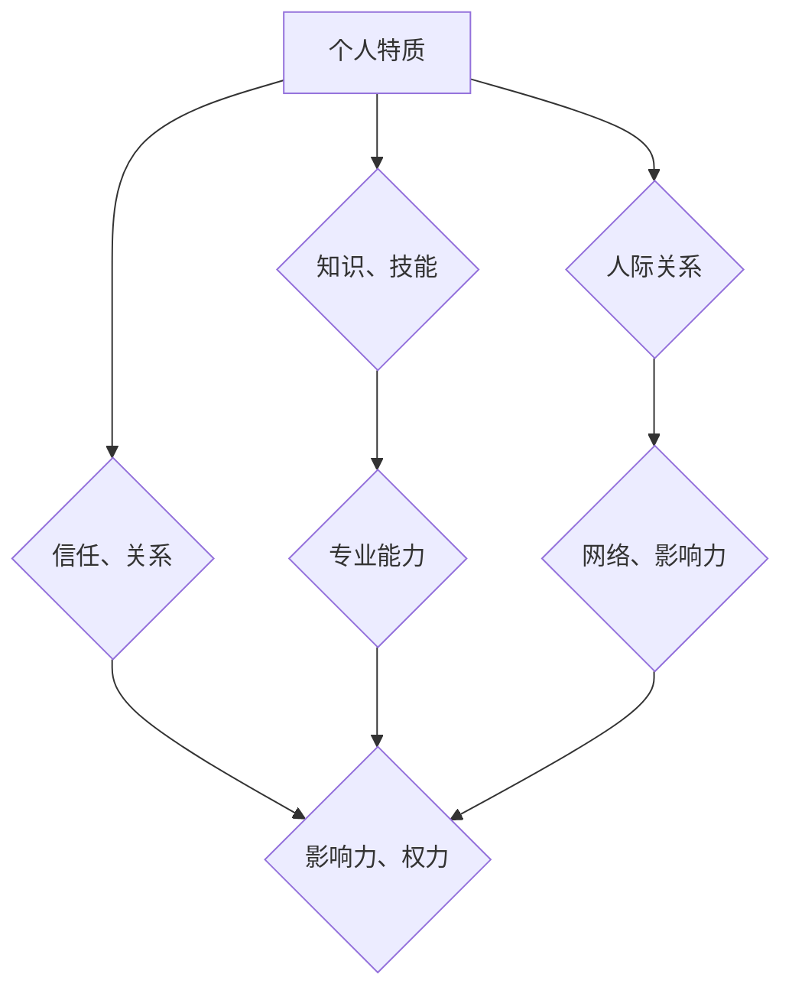

                 

### 《影响力工程：扩大非正式权力的领导策略》

#### 关键词：非正式权力，影响力工程，领导策略，人际沟通，团队管理

#### 摘要：
在快速变化和高度复杂的现代组织中，非正式权力和影响力成为领导者和团队成员提升个人和团队绩效的关键因素。本文从非正式权力的概念和作用出发，详细探讨了建立个人影响力、运用影响力工具、团队管理与领导、跨部门沟通与合作等关键领域，通过实际应用案例和未来展望，提供了全面且实用的非正式权力扩大策略。本文旨在为领导者和管理者提供一整套非正式权力的操作框架和实施指南，以应对组织变革和提升组织竞争力。

### 《影响力工程：扩大非正式权力的领导策略》目录大纲

#### 第一部分：非正式权力的基础

##### # 第1章：非正式权力的概念与作用

###### 1.1 非正式权力的定义

###### 1.1.1 非正式权力的起源

###### 1.1.2 非正式权力的特点

###### 1.2 非正式权力与正式权力的比较

###### 1.2.1 正式权力的定义与特征

###### 1.2.2 非正式权力与正式权力的关系

###### 1.3 非正式权力的影响

###### 1.3.1 对个人和组织的影响

###### 1.3.2 非正式权力在不同组织中的表现

#### 第二部分：扩大非正式权力的策略

##### # 第2章：建立个人影响力

###### 2.1 人际关系管理

###### 2.1.1 建立信任的策略

###### 2.1.2 人际沟通技巧

###### 2.2 知识和资源的积累

###### 2.2.1 提升专业知识

###### 2.2.2 建立专业网络

###### 2.3 个人品牌的打造

###### 2.3.1 个人品牌的核心要素

###### 2.3.2 个人品牌的塑造策略

##### # 第3章：运用影响力工具

###### 3.1 说服力技巧

###### 3.1.1 影响力模型的构建

###### 3.1.2 说服力的核心要素

###### 3.2 情绪管理

###### 3.2.1 情绪的识别与应对

###### 3.2.2 情绪在影响力中的作用

###### 3.3 社交网络策略

###### 3.3.1 社交网络平台的选择

###### 3.3.2 社交网络中的影响力传播

##### 第三部分：非正式领导力的实践应用

##### # 第4章：团队管理与领导

###### 4.1 非正式团队的形成与运作

###### 4.1.1 非正式团队的特征

###### 4.1.2 非正式团队的管理策略

###### 4.2 非正式领导力的运用

###### 4.2.1 非正式领导者的角色

###### 4.2.2 非正式领导力的培养

###### 4.3 非正式权力在组织变革中的应用

###### 4.3.1 非正式权力在组织变革中的优势

###### 4.3.2 非正式权力在组织变革中的挑战

##### # 第5章：跨部门沟通与合作

###### 5.1 跨部门沟通的障碍与解决方法

###### 5.1.1 跨部门沟通的重要性

###### 5.1.2 跨部门沟通的常见障碍

###### 5.1.3 提高跨部门沟通效果的方法

###### 5.2 跨部门合作策略

###### 5.2.1 跨部门合作的模式

###### 5.2.2 跨部门合作的挑战与应对

##### 第四部分：影响力工程的实践案例

##### # 第6章：影响力工程的实际应用

###### 6.1 案例研究一：企业内部影响力建设

###### 6.1.1 案例背景

###### 6.1.2 影响力工程在案例中的应用

###### 6.1.3 案例效果评估

###### 6.2 案例研究二：项目团队的非正式领导

###### 6.2.1 案例背景

###### 6.2.2 非正式领导在案例中的应用

###### 6.2.3 案例结果分析

##### # 第7章：影响力工程的未来展望

###### 7.1 非正式权力的发展趋势

###### 7.1.1 技术变革对非正式权力的影响

###### 7.1.2 非正式权力在未来组织中的作用

###### 7.2 影响力工程的持续优化

###### 7.2.1 影响力工程的评估与改进

###### 7.2.2 影响力工程在组织文化中的植入

#### 附录

##### # 附录A：影响力工程的工具与方法

###### A.1 关键对话技巧

###### A.2 人际关系管理工具

###### A.3 影响力评估工具

##### # 附录B：参考资源与推荐阅读

###### B.1 基础读物

###### B.2 深入研究

###### B.3 相关案例与文献链接

### 第一部分：非正式权力的基础

#### 第1章：非正式权力的概念与作用

非正式权力（Informal Power）在组织行为学和领导力研究中占据着重要的地位。它指的是在没有明确组织结构或正式授权的情况下，通过个人特质、关系网络、专业知识、信任和影响力等因素来影响他人行为和决策的能力。与正式权力（如职位权力、法律权力等）不同，非正式权力不是基于职位或权威，而是基于个人的个人魅力、专业能力和人际关系的深度。理解非正式权力的概念和作用，对于提高个人和组织绩效具有重要意义。

### 1.1 非正式权力的定义

非正式权力的定义可以从多个角度进行阐述。首先，非正式权力是指个人在组织内部或社会中，通过非正式渠道获取的影响力和控制力。这种影响力并不是通过职位或法定授权获得的，而是通过个人特质、专业知识、人际网络和信任等非正式手段实现的。例如，一位技术专家可能因为其卓越的专业技能和广泛的知识网络，能够在团队中发挥领导作用，而不依赖于正式的职位或授权。

其次，非正式权力涉及到人际关系网络。这些网络中的节点和连接可以增强个人的影响力。一个具有广泛人际关系的个人，可以在需要时调动资源，解决问题，从而在组织中发挥重要作用。这种非正式权力的运用，往往基于互惠互利的原则，通过建立和维护良好的人际关系，实现个人和组织的目标。

最后，非正式权力还涉及到个人特质和专业知识。个人魅力、信任度和专业知识等，都是非正式权力的重要来源。一个有魅力、值得信赖且具备专业知识的领导者，能够在组织中赢得尊重和信任，从而影响他人的行为和决策。

### 1.1.1 非正式权力的起源

非正式权力的起源可以追溯到人类社会发展的早期阶段。在传统的部落社会中，领袖的权力往往不是基于法律或制度，而是基于个人的能力、智慧和部落成员的信任。随着社会的复杂化，非正式权力也在组织内部逐渐形成。在现代社会中，组织结构的复杂性和动态性，使得正式权力无法覆盖所有情况，非正式权力因此得以发挥重要作用。

例如，在一个大型企业中，虽然部门经理拥有正式的职位权力，但某些技术专家或关键人物可能因为其专业知识、个人魅力或广泛的人际网络，而实际上在团队中扮演着领导者的角色。这种非正式权力不仅影响着个人的职业发展，也影响着组织的整体运作。

### 1.1.2 非正式权力的特点

非正式权力具有以下几个显著特点：

1. **非正式性**：非正式权力的存在不受正式组织结构的影响。它不是通过职位或法定授权获得的，而是基于个人特质、专业知识、人际网络和信任等因素。

2. **非强制性**：非正式权力的运用通常不是通过强制手段，而是通过个人魅力、关系和信任。这种权力更多地依赖于个人的影响力，而非职位或制度的约束。

3. **灵活性**：非正式权力的运用形式多样，可以根据具体情况灵活调整。这种灵活性使得非正式权力能够在不同的环境和情境中发挥作用。

4. **持久性**：非正式权力通常比正式权力更持久。因为它基于个人的特质和关系，不容易受到组织结构变化的影响。

### 1.2 非正式权力与正式权力的比较

| 特征         | 非正式权力                           | 正式权力                           |
|--------------|------------------------------------|-----------------------------------|
| **来源**     | 个人特质、专业知识、人际网络、信任等 | 职位、法律、制度                   |
| **强制性**   | 非强制性，基于个人魅力               | 强制性，具有法律效力               |
| **表现**     | 非直接，间接影响                     | 直接，通过职位行使                 |
| **稳定性**   | 可变，受个人和关系变化影响           | 稳定，受组织结构影响               |

### 1.2.1 正式权力的定义与特征

正式权力（Formal Power）是指基于组织职位、法律、制度等正式授权的影响力。正式权力的特征包括：

1. **权威性**：正式权力具有明确的权威性，其行使通常受到法律和组织制度的保护。

2. **明确性**：正式权力的来源和范围通常有明确的定义，这保证了权力的合法性和稳定性。

3. **稳定性**：正式权力通常比非正式权力更稳定，因为它受到组织结构和法律制度的支持。

### 1.2.2 非正式权力与正式权力的关系

非正式权力与正式权力既相互独立，又相互影响。在组织内部，正式权力通常为非正式权力提供了一定的基础和支持，但非正式权力也可能对正式权力产生影响。例如，一个领导者的非正式权力可能会增强其正式权力的效力，反之亦然。例如，一个技术部门的总监可能拥有正式的职位权力，但如果缺乏非正式的领导力，他可能无法有效地管理团队。

### 1.3 非正式权力的影响

非正式权力对个人和组织都有深远的影响：

- **个人层面**：非正式权力可以提升个人的影响力，使其在团队和组织中发挥更大的作用。例如，一个技术专家通过非正式的领导力，可以在团队中获得更高的尊重和信任，从而更好地推动项目进展。

- **组织层面**：非正式权力可以促进团队合作，提高组织的灵活性和适应性。例如，在一个创新型组织中，非正式权力可以鼓励团队成员之间的合作和创新，提高组织的整体绩效。

#### Mermaid 流程图：非正式权力的来源与影响

mermaid
graph TB
    A[个人特质] --> B{知识、技能}
    A --> C{人际关系}
    A --> D{信任、关系}
    B --> E{专业能力}
    C --> F{网络、影响力}
    D --> G{影响力、权力}
    E --> G
    F --> G

通过以上章节，我们了解了非正式权力的概念、起源、特点，以及其与正式权力的关系和影响。接下来，我们将深入探讨如何建立个人影响力、运用影响力工具，以及如何在实际工作中运用非正式权力，为组织的长期发展贡献力量。

### 第2章：建立个人影响力

个人影响力是影响他人行为和决策的能力，它在个人职业生涯和组织管理中发挥着至关重要的作用。建立个人影响力不仅有助于提升个人的职业发展，还能促进团队协作和组织效率。以下将详细探讨人际关系管理、知识和资源的积累以及个人品牌的打造，这些是实现个人影响力的关键策略。

#### 2.1 人际关系管理

人际关系管理是建立个人影响力的基础。良好的人际关系可以帮助个人在组织中获得更多的支持和资源，从而更好地实现个人目标。以下是一些建立人际关系的关键策略：

##### 2.1.1 建立信任的策略

信任是人际关系管理的核心。建立信任需要时间和耐心，以下是一些关键策略：

- **诚信与透明**：始终保持诚信，言行一致，公开透明地处理问题和信息。避免隐瞒或误导他人。

- **一致性**：在处理问题时保持一致的态度和行为，遵守承诺，树立可靠的个人形象。

- **同理心**：展现同理心，理解他人的需求和感受，从而建立更深的联系。

- **正面沟通**：使用积极的语言和态度进行沟通，避免冲突和误解。

##### 2.1.2 人际沟通技巧

人际沟通技巧是建立人际关系的重要手段。以下是一些关键的沟通技巧：

- **倾听**：倾听比说话更重要，通过倾听了解他人的观点和需求。

- **非语言沟通**：通过肢体语言、面部表情和语调等非语言方式传递信息，增强沟通效果。

- **提问**：提出开放性问题，鼓励对方分享更多信息，建立互动和信任。

- **反馈**：及时给予积极的反馈，同时提出建设性的意见，促进个人成长。

#### 2.2 知识和资源的积累

积累知识和资源是提高个人影响力的关键。以下是一些策略：

##### 2.2.1 提升专业知识

提升专业知识是建立个人影响力的基础。以下是一些策略：

- **持续学习**：不断学习新的知识和技能，保持对行业动态的了解，提升自身的竞争力。

- **实践经验**：通过实际工作或项目经验，积累实战能力和经验。

- **认证和资质**：通过获取专业认证和资质，证明自己的专业能力和水平。

##### 2.2.2 建立专业网络

建立专业网络是扩展个人影响力的有效方式。以下是一些策略：

- **参与行业活动**：积极参加行业会议、研讨会和培训，结识业内专家和同行。

- **社交媒体**：利用社交媒体平台，如LinkedIn、Twitter等，建立和维护专业网络。

- **资源共享**：在专业网络中分享知识和资源，建立互惠互利的关系。

#### 2.3 个人品牌的打造

个人品牌的打造是建立长期影响力的关键。以下是一些策略：

##### 2.3.1 个人品牌的核心要素

个人品牌的核心要素包括：

- **价值观**：明确个人的价值观，将其融入品牌形象中。

- **专业知识**：展示个人的专业能力和知识水平。

- **成就**：突出个人的成就和贡献，证明个人价值。

- **形象**：通过形象设计和沟通方式，塑造个人的独特形象。

##### 2.3.2 个人品牌的塑造策略

以下是一些个人品牌的塑造策略：

- **个人故事**：讲述个人的成长经历和成功故事，增加品牌的吸引力和亲和力。

- **形象设计**：设计专业的个人形象，包括名片、博客、社交媒体头像等。

- **持续更新**：定期更新个人品牌的内容，保持品牌的活力和吸引力。

通过以上策略，可以有效地建立和提升个人影响力，从而在组织和社会中发挥更大的作用。

### 第3章：运用影响力工具

在个人影响力建立的基础上，如何有效地运用这些影响力工具是实现领导力提升和组织目标达成的关键。本章将探讨说服力技巧、情绪管理以及社交网络策略，这些工具将帮助领导者更好地引导和影响他人。

#### 3.1 说服力技巧

说服力是领导者的核心技能之一，它能够帮助领导者有效地传达信息、影响决策，并推动团队和组织向前发展。以下是一些关键的说服力技巧：

##### 3.1.1 影响力模型的构建

为了提高说服力，首先需要构建一个影响力模型。以下是一个简单的影响力模型，包括四个核心要素：

1. **可信度（Credibility）**：建立可信度是说服他人的第一步，包括展示专业知识和诚实守信。

2. **需求识别（Need Recognition）**：了解对方的需求和痛点，将其与自己的观点或产品相结合。

3. **逻辑论证（Logical Argumentation）**：使用逻辑严密、有说服力的论据来支持自己的观点。

4. **情感共鸣（Emotional Appeal）**：通过情感上的共鸣，激发对方的兴趣和认同。

以下是一个影响力模型的Mermaid流程图：



##### 3.1.2 说服力的核心要素

1. **信息内容**：确保信息内容准确、有价值、可信。

2. **表达方式**：使用清晰、简洁、有感染力的表达方式。

3. **情境因素**：了解和利用情境因素，如时机、环境、听众等。

4. **反馈机制**：及时获取对方的反馈，根据反馈调整自己的说服策略。

#### 3.2 情绪管理

情绪管理是领导者影响他人和团队的重要工具。情绪管理不仅关乎个人心理健康，还直接影响领导效果和组织氛围。以下是一些情绪管理的技巧：

##### 3.2.1 情绪的识别与应对

1. **情绪识别**：通过观察、倾听和感知，识别他人的情绪状态。

2. **情绪表达**：通过恰当的方式表达自己的情绪，避免情绪失控或压抑。

3. **情绪调节**：学会调节自己的情绪，保持冷静和理性，避免情绪对沟通和决策产生负面影响。

以下是一个情绪管理技巧的Mermaid流程图：



##### 3.2.2 情绪在影响力中的作用

情绪在影响力中发挥着重要的作用：

1. **激发兴趣**：积极的情绪可以激发对方的兴趣，增加说服力。

2. **建立信任**：通过共情和同理心，建立信任关系，增强影响力。

3. **影响决策**：情绪可以影响对方的判断和决策，使其更容易接受自己的观点。

#### 3.3 社交网络策略

在数字化时代，社交网络策略在领导力中扮演着越来越重要的角色。有效的社交网络策略可以帮助领导者扩展影响力、建立人脉资源，并提升个人和组织的知名度。以下是一些社交网络策略：

##### 3.3.1 社交网络平台的选择

选择合适的社交网络平台对于扩展影响力至关重要。以下是一些常见的社交网络平台及其特点：

- **LinkedIn**：专业的社交平台，适合建立职业人脉和展示专业形象。

- **Twitter**：全球性的新闻和社交平台，适合实时传播信息、扩大影响力。

- **Facebook**：广泛的社交平台，适合建立个人关系网、分享生活和工作经验。

- **Instagram**：以图片和视频为主的社交平台，适合展示个人形象和创意。

##### 3.3.2 社交网络中的影响力传播

在社交网络中传播影响力需要以下策略：

1. **内容创作**：创作有价值、有趣、有吸引力的内容，吸引关注和分享。

2. **互动交流**：积极参与社交网络中的讨论和互动，建立信任和关系。

3. **网络营销**：利用社交媒体广告和其他营销手段，扩大个人品牌和影响力。

4. **网络社区**：加入相关领域的网络社区，参与讨论和分享，提升专业形象。

通过运用说服力技巧、情绪管理和社交网络策略，领导者可以更有效地影响他人、推动团队和组织的发展。这些工具不仅适用于职场，也适用于日常生活中的各种人际交往。#### 第4章：团队管理与领导

团队管理是组织成功的关键因素之一，而领导力则是团队管理中不可或缺的要素。在这一章中，我们将深入探讨非正式团队的形成与运作、非正式领导力的运用，以及非正式权力在组织变革中的应用。

#### 4.1 非正式团队的形成与运作

非正式团队是指在组织内部自发形成的、没有明确结构和职责划分的团队。这些团队通常基于共同的兴趣、目标或者工作需要而形成。非正式团队的形成具有以下几个特点：

1. **自发性**：非正式团队的形成不是由组织高层领导决定的，而是由团队成员自发组织的。
2. **灵活性**：非正式团队在运作过程中表现出高度的灵活性，可以根据实际情况迅速调整团队目标和任务。
3. **互动性**：非正式团队成员之间通常有较强的互动和协作，通过频繁的沟通和合作，形成紧密的人际关系。
4. **信任感**：非正式团队成员之间通常建立了较高的信任感，这种信任感有助于提高团队的凝聚力和工作效率。

##### 4.1.1 非正式团队的特征

非正式团队具有以下几个显著特征：

- **自主性**：团队成员在非正式团队中有较高的自主性，他们可以自由选择参与的项目和任务。
- **共享目标**：非正式团队成员通常有共同的愿景和目标，这有助于提高团队的协作效率。
- **灵活性**：非正式团队在应对变化和挑战时表现出更高的灵活性，可以迅速调整策略和行动。
- **互信关系**：非正式团队成员之间建立了较强的信任关系，这有助于团队内部的有效沟通和合作。

##### 4.1.2 非正式团队的管理策略

为了有效地管理非正式团队，领导者可以采取以下策略：

1. **鼓励自主性**：鼓励团队成员发挥自主性，提供支持和资源，让他们自由选择参与的项目和任务。
2. **设定共同目标**：与团队成员共同设定明确的团队目标，确保团队成员有共同的方向和动力。
3. **促进沟通与协作**：定期组织团队会议和活动，促进团队成员之间的沟通与协作，增强团队的凝聚力。
4. **提供反馈与支持**：及时给予团队成员反馈，提供必要的支持，帮助他们克服困难和挑战。

#### 4.2 非正式领导力的运用

非正式领导力是在没有正式职位的情况下，通过个人魅力、专业能力和人际网络来影响他人和推动团队发展的一种领导方式。非正式领导力在团队管理和领导中发挥着重要作用。以下是一些运用非正式领导力的策略：

##### 4.2.1 非正式领导者的角色

非正式领导者通常在以下角色中发挥作用：

1. **导师**：提供指导和支持，帮助团队成员提升技能和知识。
2. **协调者**：协调团队成员之间的关系，解决冲突和问题。
3. **创新者**：推动团队创新，提出新的想法和解决方案。
4. **桥梁**：在团队与其他部门或组织之间建立联系，促进合作与交流。

##### 4.2.2 非正式领导力的培养

为了培养非正式领导力，可以采取以下策略：

1. **提升个人魅力**：通过积极的人际交往和良好的沟通技巧，提升个人的魅力和影响力。
2. **建立专业能力**：通过不断学习和积累专业知识和经验，提升自身的专业能力和权威性。
3. **培养人际关系**：建立广泛的人际关系网络，提高人际沟通和协作能力。
4. **展示领导素质**：通过行为和行动展示领导素质，赢得团队成员的尊重和信任。

#### 4.3 非正式权力在组织变革中的应用

非正式权力在组织变革中具有重要的作用。通过运用非正式权力，可以促进组织变革的顺利进行，提高变革的成功率。以下是一些非正式权力在组织变革中的应用策略：

##### 4.3.1 非正式权力在组织变革中的优势

1. **灵活性**：非正式权力可以灵活应对变革过程中的复杂情况，适应环境变化。
2. **快速响应**：非正式领导力可以迅速调动资源，应对变革中的紧急情况和挑战。
3. **增强参与感**：通过非正式权力，可以激发团队成员的参与感和责任感，提高变革的接受度。
4. **促进创新**：非正式权力可以鼓励创新思维和实践，推动组织变革的持续发展。

##### 4.3.2 非正式权力在组织变革中的挑战

1. **稳定性**：非正式权力可能受到组织结构变化的影响，稳定性较差。
2. **透明度**：非正式权力的运作过程可能缺乏透明度，容易引发争议和误解。
3. **公正性**：非正式权力的运用需要确保公正性，避免权力滥用和腐败现象。

##### 4.3.3 非正式权力在组织变革中的策略

1. **建立信任关系**：通过建立信任关系，增强团队成员对变革的信任和接受度。
2. **明确变革目标**：确保团队成员对变革的目标和方向有清晰的认识，提高变革的明确性。
3. **提供支持和资源**：为团队成员提供必要的支持和资源，帮助他们应对变革中的挑战。
4. **鼓励创新和实践**：鼓励团队成员提出创新的想法和实践，推动组织变革的持续发展。

通过以上策略，可以有效地运用非正式权力，促进组织变革的顺利进行，提高变革的成功率。非正式权力在团队管理和领导中具有独特的优势，通过合理的运用，可以为组织带来长期的绩效提升。#### 第5章：跨部门沟通与合作

跨部门沟通与合作在组织运作中扮演着至关重要的角色。有效的跨部门沟通不仅有助于提高工作效率，还能促进团队合作和创新。然而，跨部门沟通往往面临诸多挑战，如信息不对称、部门利益冲突、文化差异等。本章将探讨跨部门沟通的重要性、常见障碍以及提高跨部门沟通效果的方法。

#### 5.1 跨部门沟通的重要性

跨部门沟通的重要性体现在以下几个方面：

1. **信息共享**：跨部门沟通有助于各部门之间共享信息，确保组织内部的信息流通畅通，从而提高决策的准确性和及时性。
2. **协同合作**：跨部门沟通能够促进各部门之间的协同合作，消除信息孤岛，提高整体运营效率。
3. **资源共享**：通过跨部门沟通，组织可以更好地整合和利用各部门的资源和能力，实现资源的最大化利用。
4. **问题解决**：跨部门沟通有助于快速识别和解决跨部门问题，提高组织的灵活性和应变能力。

#### 5.2 跨部门沟通的常见障碍

跨部门沟通中常见的障碍包括：

1. **信息不对称**：由于各部门职责和目标的不同，导致各部门掌握的信息量不一致，从而影响沟通效果。
2. **部门利益冲突**：各部门在资源分配、目标设定等方面可能存在利益冲突，导致沟通不畅和合作受阻。
3. **文化差异**：不同部门可能有不同的工作方式、价值观和行为规范，这些文化差异可能导致沟通障碍和误解。
4. **沟通方式不当**：沟通方式不当，如语言过于专业或缺乏倾听，会影响跨部门沟通的效果。
5. **沟通频率不足**：沟通频率不高，导致信息传递不及时，影响决策和协作。

#### 5.3 提高跨部门沟通效果的方法

为了提高跨部门沟通效果，组织可以采取以下方法：

1. **建立沟通机制**：建立定期的跨部门沟通会议，确保各部门之间信息畅通。会议可以包括项目进度报告、问题讨论和决策制定等内容。

2. **共享信息平台**：利用共享信息平台，如企业内部邮件、即时通讯工具等，方便各部门之间交流。共享平台可以帮助各部门实时获取和更新信息，提高沟通效率。

3. **加强培训**：定期组织跨部门沟通培训，提高员工的沟通技巧和意识。培训内容可以包括沟通技巧、跨文化沟通、团队合作等。

4. **明确沟通目标**：在每次沟通前明确沟通的目标和内容，确保沟通有明确的方向和重点。可以通过制定沟通计划、设置沟通议程等方式来实现。

5. **建立信任关系**：通过建立信任关系，减少跨部门沟通的障碍。信任关系的建立可以通过共同的团队合作、开放透明的沟通、尊重和理解对方等方式实现。

6. **促进跨部门合作**：鼓励各部门之间进行合作，共同完成任务。通过跨部门项目、团队建设活动等方式，增强各部门之间的互动和协作。

通过采取以上方法，可以有效地克服跨部门沟通的障碍，提高沟通效果，促进组织内部的协作和高效运作。良好的跨部门沟通不仅有助于提高工作效率，还能为组织的长期发展提供坚实的基础。#### 第6章：影响力工程的实际应用

在实际应用中，影响力工程的效果往往取决于其在不同情境和领域的具体实施。本章将通过两个案例研究，深入探讨影响力工程在企业内部建设和项目团队非正式领导中的应用，并提供案例分析的结果和启示。

### 6.1 案例研究一：企业内部影响力建设

#### 6.1.1 案例背景

某大型科技企业，在经历了快速扩张之后，组织结构变得复杂，各部门之间的沟通和协作效率降低。企业内部存在着信息孤岛，部门利益冲突，以及员工之间的信任问题。为了解决这些问题，企业决定实施影响力工程，通过提升内部领导力和个人影响力，改善企业内部的沟通与合作。

#### 6.1.2 影响力工程在案例中的应用

1. **建立内部沟通机制**：
   - 企业设立了一个定期的内部沟通平台，每月举行跨部门沟通会议，确保各部门之间的信息畅通。
   - 利用企业内部邮件系统和即时通讯工具，建立实时的沟通渠道，方便员工之间的交流。

2. **培训与教育**：
   - 企业组织了多场关于领导力和影响力的培训课程，邀请外部专家进行授课，提升员工的领导力和沟通技巧。
   - 培训内容涵盖了跨文化沟通、团队合作、冲突管理等方面，旨在提升员工的整体沟通能力。

3. **建立榜样与激励**：
   - 企业设立了一个“影响力之星”奖项，每月表彰在跨部门合作中表现突出的员工。
   - 通过内部公告和社交媒体平台，宣传这些榜样的经验和故事，激励其他员工学习。

4. **文化融合**：
   - 企业组织了多次团队建设活动，如团队拓展训练、文化聚餐等，增强员工之间的信任和团队合作精神。
   - 通过这些活动，员工能够更好地理解和支持彼此，形成了积极向上的企业文化。

#### 6.1.3 案例效果评估

- **沟通效率提升**：通过建立内部沟通机制，企业内部的信息传递变得更加及时和准确，决策效率显著提高。
- **团队合作增强**：员工之间的合作意愿增强，跨部门项目完成质量提升，员工满意度提高。
- **组织绩效改善**：企业整体运营效率提高，项目完成速度和质量均有所改善。

### 6.2 案例研究二：项目团队的非正式领导

#### 6.2.1 案例背景

某高科技项目团队在项目执行过程中，由于正式领导者的缺席，团队内部出现了协调不力、进度滞后的问题。为了确保项目顺利推进，团队成员决定依靠非正式领导力，通过内部成员自发组织和管理，解决项目中的困难。

#### 6.2.2 非正式领导在案例中的应用

1. **识别关键人物**：
   - 项目团队成员通过投票选举产生了两位技术骨干作为非正式领导者，负责协调团队工作和解决技术难题。

2. **建立沟通渠道**：
   - 非正式领导者利用微信群、邮件等工具，建立了团队内部的沟通平台，确保信息畅通。

3. **分工合作**：
   - 根据团队成员的能力和特长，进行合理分工，明确每个人的职责和任务，确保项目有序推进。

4. **激发团队动力**：
   - 非正式领导者制定了明确的项目目标和奖励机制，激励团队成员积极参与项目，提高工作效率。

#### 6.2.3 案例结果分析

- **项目进度恢复正常**：在非正式领导的推动下，项目进度得到有效控制，团队协作效率提高。
- **成员满意度提升**：团队成员对项目进展有更高的参与感和成就感，满意度提升。
- **项目质量改善**：通过团队成员的积极沟通和协作，项目质量得到保证，客户满意度提高。

### 6.3 案例总结与启示

通过以上两个案例，我们可以得出以下结论和启示：

1. **影响力工程的有效性**：影响力工程在实际应用中，可以通过建立沟通机制、培训与教育、建立榜样与激励、文化融合等策略，提高企业内部的沟通效率、团队合作和组织绩效。

2. **非正式领导力的作用**：在项目团队中，非正式领导力可以发挥重要作用，通过识别关键人物、建立沟通渠道、分工合作和激发团队动力，确保项目顺利进行。

3. **持续优化的必要性**：影响力工程并非一蹴而就，需要持续优化和改进。企业应根据实际情况，不断调整策略和方法，确保影响力工程的持续有效性。

4. **组织文化的塑造**：影响力工程的成功实施离不开积极向上的组织文化。企业应注重文化融合，通过团队建设活动、奖励机制等方式，增强员工的归属感和合作精神。

通过影响力工程的实际应用，企业可以提升内部领导力和个人影响力，促进团队合作和创新，从而在激烈的市场竞争中保持竞争力。#### 第7章：影响力工程的未来展望

随着全球化、数字化和人工智能技术的快速发展，非正式权力和影响力工程将在未来组织中扮演更加重要的角色。本章将探讨非正式权力的发展趋势、影响力工程的持续优化，以及影响力工程在组织文化中的植入。

### 7.1 非正式权力的发展趋势

#### 7.1.1 技术变革对非正式权力的影响

技术变革正在深刻地改变组织的运作方式，对非正式权力产生了深远的影响。以下是一些关键趋势：

- **人工智能与大数据**：人工智能和大数据技术使得非正式权力在信息处理和决策支持方面更加高效。领导者可以利用数据分析来预测趋势、识别关键人物，从而更加精准地运用非正式权力。

- **社交媒体**：社交媒体的兴起使得非正式权力的影响范围得到了极大的扩展。个人品牌和社交媒体影响力成为非正式权力的重要来源，员工可以通过社交媒体平台建立广泛的社交网络，提高个人影响力。

- **远程工作**：远程工作的普及改变了传统的工作模式，使得非正式权力的运作更加依赖于数字工具和虚拟沟通。领导者需要具备更强的远程领导力和沟通技巧，以维持团队凝聚力和效率。

#### 7.1.2 非正式权力在未来组织中的作用

未来组织中，非正式权力将发挥以下几个关键作用：

- **适应性**：非正式权力能够快速适应变化的环境，提供灵活的解决方案，这对于应对快速变化的市场需求和动态的商业环境至关重要。

- **跨部门协作**：随着组织结构的扁平化和网络化，跨部门协作变得更加重要。非正式权力可以促进不同部门之间的沟通与合作，提高整体运作效率。

- **领导力发展**：非正式权力的存在为员工提供了更多展示自己领导力的机会，有助于培养未来的领导者，提升组织的整体领导力水平。

### 7.2 影响力工程的持续优化

为了确保影响力工程的持续有效性，组织需要不断优化和调整策略。以下是一些关键措施：

#### 7.2.1 影响力工程的评估与改进

- **定期评估**：定期对影响力工程的效果进行评估，通过反馈和数据分析，发现问题和不足。

- **持续改进**：根据评估结果，及时调整和改进影响力工程的具体策略和实施方法。

- **员工参与**：鼓励员工参与影响力工程的改进过程，提出建议和意见，确保策略的实用性和员工认同感。

### 7.2.2 影响力工程在组织文化中的植入

- **文化塑造**：将影响力工程的理念和价值观融入组织文化，使其成为组织日常运作的一部分。

- **领导榜样**：领导者的行为和态度对组织文化有重要影响。领导者应该通过自己的行为来示范和传播影响力工程的核心原则。

- **培训与教育**：通过培训和教育，提高员工对影响力工程的认识和理解，增强他们的实践能力。

### 7.3 影响力工程在组织文化中的植入

影响力工程在组织文化中的成功植入对于组织的长期发展至关重要。以下是一些关键策略：

- **文化融合**：通过团队建设活动、文化交流等方式，促进不同部门之间的相互理解和尊重，增强组织的凝聚力和协作精神。

- **领导者的示范作用**：领导者应该通过自身的行动来示范影响力工程的核心原则，如诚信、透明、尊重和合作，树立榜样。

- **持续的教育和培训**：定期开展关于影响力工程的教育和培训，帮助员工理解和掌握相关技能，提高他们的个人和团队影响力。

通过以上策略，影响力工程可以在组织文化中生根发芽，为组织的长期成功提供强有力的支持。未来，随着技术的不断进步和组织环境的变化，影响力工程将继续发展和完善，成为组织中不可或缺的一部分。#### 附录A：影响力工程的工具与方法

影响力工程的成功实施依赖于一系列工具和方法，这些工具和方法帮助领导者和管理者提升个人和团队的影响力。以下是一些关键的工具和方法：

### A.1 关键对话技巧

关键对话技巧是影响力工程的核心组成部分，尤其在需要解决冲突或进行说服性沟通时。以下是关键对话技巧的详细描述和示例：

#### 1. 准备阶段

- **背景调查**：在对话前，了解对方的基本信息和立场，为对话做好准备。

  ```mermaid
  graph TD
  A[背景调查] --> B{了解对方立场}
  A --> C{准备相关资料}
  ```

- **明确目标**：明确对话的目标和期望结果，确保对话的焦点清晰。

  ```mermaid
  graph TD
  D[明确目标] --> E{设定对话焦点}
  ```

#### 2. 对话过程

- **建立连接**：通过开放式问题和倾听建立信任和连接，让对方感受到被尊重。

  ```mermaid
  graph TD
  F[建立连接] --> G{开放式问题}
  F --> H{倾听与反馈}
  ```

- **表达观点**：清晰、有逻辑地表达自己的观点，使用事实和数据支持论点。

  ```mermaid
  graph TD
  I[表达观点] --> J{清晰陈述}
  I --> K{事实支持}
  ```

- **处理异议**：以建设性和同理心的方式处理对方的异议，寻求共同点。

  ```mermaid
  graph TD
  L[处理异议] --> M{同理心}
  L --> N{寻求共同点}
  ```

#### 3. 结束阶段

- **总结共识**：总结对话中的共识和行动计划，确保双方对结果有共同的理解。

  ```mermaid
  graph TD
  O[总结共识] --> P{行动计划}
  ```

- **建立后续联系**：保持沟通渠道的开放，确保双方能够继续交流和合作。

  ```mermaid
  graph TD
  Q[建立后续联系] --> R{保持沟通渠道}
  ```

### A.2 人际关系管理工具

人际关系管理是影响力工程的重要组成部分，以下是一些常用的人际关系管理工具：

#### 1. 信任评估工具

- **Covey的信任公式**：

  ```latex
  信任 = （可靠性 + 诚实 + 积极倾听）- （自我利益 + 人际冲突）
  ```

- **信任评分表**：通过评分表评估人际关系中的信任水平，为改进提供依据。

#### 2. 沟通技巧培训

- **互动式培训**：通过角色扮演、情景模拟等方式，提高员工的沟通技巧。

  ```mermaid
  graph TD
  S[互动式培训] --> T{角色扮演}
  S --> U{情景模拟}
  ```

- **沟通反馈机制**：建立定期的沟通反馈机制，鼓励员工提出建议和反馈，不断改进沟通方式。

#### 3. 社交网络分析

- **社交网络图**：使用社交网络分析工具，绘制组织的社交网络图，识别关键人物和影响力路径。

  ```mermaid
  graph TD
  V[社交网络图] --> W{关键人物识别}
  V --> X{影响力路径分析}
  ```

- **社交网络分析软件**：如LinkedIn分析工具，帮助员工分析社交网络中的连接和影响力。

### A.3 影响力评估工具

评估影响力工程的效果对于持续改进至关重要。以下是一些常用的评估工具：

#### 1. 影响力指数评估

- **影响力指数公式**：

  ```latex
  影响力指数 = （关键对话次数 × 对话成功率）×（信任评分 × 个人品牌认知度）
  ```

- **影响力指数评分表**：通过评分表评估个人的影响力水平，为培训和发展提供依据。

#### 2. 组织影响力评估

- **组织影响力报告**：定期编制组织影响力报告，分析影响力工程对组织绩效的影响。

  ```mermaid
  graph TD
  Y[组织影响力报告] --> Z{绩效分析}
  ```

- **员工满意度调查**：通过员工满意度调查，了解员工对影响力工程的评价和满意度。

通过使用这些工具和方法，可以系统地管理和评估影响力工程，确保其效果最大化，为组织的长期发展提供持续的支持。#### 附录B：参考资源与推荐阅读

为了更深入地了解影响力工程的理论和实践，以下是一些推荐的基础读物、深入研究和相关案例与文献链接：

### B.1 基础读物

- **《影响力：说服的心理学》**（作者：罗伯特·西奥迪尼）
  这本书详细介绍了说服和影响力的六个原则，帮助读者理解并运用影响力技巧。

- **《非暴力沟通》**（作者：马歇尔·卢森堡）
  本书提供了一种以同情心为基础的沟通方式，强调倾听和理解对方的需求。

- **《领导力五项修炼》**（作者：彼得·圣吉）
  探讨了个人领导力的发展，以及如何通过团队合作实现共同目标。

### B.2 深入研究

- **《组织行为学：基础、研究与应用》**（作者：斯蒂芬·罗宾斯）
  这本书提供了组织行为学的全面概述，包括权力和影响力的相关理论。

- **《社会心理学》**（作者：大卫·迈尔斯）
  详细介绍了社会心理学的基础理论，包括人际交往、群体行为等内容。

- **《网络社会的兴起：社会结构的新视角》**（作者：曼纽尔·卡斯特尔斯）
  分析了信息技术如何改变社会结构和人际交往，对于理解社交媒体和影响力具有重要意义。

### B.3 相关案例与文献链接

- **哈佛商业评论**（https://hbr.org/）
  包含大量关于领导力、组织管理和影响力的文章和案例研究。

- **LinkedIn**（https://www.linkedin.com/）
  一个专业的社交网络平台，可以找到关于影响力工程的相关讨论和资源。

- **TED Talks**（https://www.ted.com/talks?language=en）
  TED演讲平台上有许多关于领导力、影响力和社会变革的精彩演讲。

通过阅读这些基础读物、深入研究相关文献，并参考实际案例，读者可以更全面地理解和应用影响力工程的理论和方法，为个人和组织的发展提供坚实的支持。#### 完整的Markdown文章代码

以下是完整的Markdown文章代码，包括标题、摘要、目录以及每个章节的内容。请注意，由于Markdown的文本限制，某些复杂的流程图和公式可能需要通过实际的Markdown编辑器来预览和格式化。

```markdown
# 《影响力工程：扩大非正式权力的领导策略》

> 关键词：非正式权力，影响力工程，领导策略，人际沟通，团队管理

> 摘要：
在快速变化和高度复杂的现代组织中，非正式权力和影响力成为领导者和团队成员提升个人和团队绩效的关键因素。本文从非正式权力的概念和作用出发，详细探讨了建立个人影响力、运用影响力工具、团队管理与领导、跨部门沟通与合作等关键领域，通过实际应用案例和未来展望，提供了全面且实用的非正式权力扩大策略。本文旨在为领导者和管理者提供一整套非正式权力的操作框架和实施指南，以应对组织变革和提升组织竞争力。

### 《影响力工程：扩大非正式权力的领导策略》目录大纲

#### 第一部分：非正式权力的基础

##### # 第1章：非正式权力的概念与作用

###### 1.1 非正式权力的定义

###### 1.1.1 非正式权力的起源

###### 1.1.2 非正式权力的特点

###### 1.2 非正式权力与正式权力的比较

###### 1.2.1 正式权力的定义与特征

###### 1.2.2 非正式权力与正式权力的关系

###### 1.3 非正式权力的影响

###### 1.3.1 对个人和组织的影响

###### 1.3.2 非正式权力在不同组织中的表现

#### 第二部分：扩大非正式权力的策略

##### # 第2章：建立个人影响力

###### 2.1 人际关系管理

###### 2.1.1 建立信任的策略

###### 2.1.2 人际沟通技巧

###### 2.2 知识和资源的积累

###### 2.2.1 提升专业知识

###### 2.2.2 建立专业网络

###### 2.3 个人品牌的打造

###### 2.3.1 个人品牌的核心要素

###### 2.3.2 个人品牌的塑造策略

##### # 第3章：运用影响力工具

###### 3.1 说服力技巧

###### 3.1.1 影响力模型的构建

###### 3.1.2 说服力的核心要素

###### 3.2 情绪管理

###### 3.2.1 情绪的识别与应对

###### 3.2.2 情绪在影响力中的作用

###### 3.3 社交网络策略

###### 3.3.1 社交网络平台的选择

###### 3.3.2 社交网络中的影响力传播

##### 第三部分：非正式领导力的实践应用

##### # 第4章：团队管理与领导

###### 4.1 非正式团队的形成与运作

###### 4.1.1 非正式团队的特征

###### 4.1.2 非正式团队的管理策略

###### 4.2 非正式领导力的运用

###### 4.2.1 非正式领导者的角色

###### 4.2.2 非正式领导力的培养

###### 4.3 非正式权力在组织变革中的应用

###### 4.3.1 非正式权力在组织变革中的优势

###### 4.3.2 非正式权力在组织变革中的挑战

##### # 第5章：跨部门沟通与合作

###### 5.1 跨部门沟通的障碍与解决方法

###### 5.1.1 跨部门沟通的重要性

###### 5.1.2 跨部门沟通的常见障碍

###### 5.1.3 提高跨部门沟通效果的方法

###### 5.2 跨部门合作策略

###### 5.2.1 跨部门合作的模式

###### 5.2.2 跨部门合作的挑战与应对

##### 第四部分：影响力工程的实践案例

##### # 第6章：影响力工程的实际应用

###### 6.1 案例研究一：企业内部影响力建设

###### 6.1.1 案例背景

###### 6.1.2 影响力工程在案例中的应用

###### 6.1.3 案例效果评估

###### 6.2 案例研究二：项目团队的非正式领导

###### 6.2.1 案例背景

###### 6.2.2 非正式领导在案例中的应用

###### 6.2.3 案例结果分析

##### # 第7章：影响力工程的未来展望

###### 7.1 非正式权力的发展趋势

###### 7.1.1 技术变革对非正式权力的影响

###### 7.1.2 非正式权力在未来组织中的作用

###### 7.2 影响力工程的持续优化

###### 7.2.1 影响力工程的评估与改进

###### 7.2.2 影响力工程在组织文化中的植入

#### 附录

##### # 附录A：影响力工程的工具与方法

###### A.1 关键对话技巧

###### A.2 人际关系管理工具

###### A.3 影响力评估工具

##### # 附录B：参考资源与推荐阅读

###### B.1 基础读物

###### B.2 深入研究

###### B.3 相关案例与文献链接

### 第一部分：非正式权力的基础

##### # 第1章：非正式权力的概念与作用

非正式权力（Informal Power）在组织行为学和领导力研究中占据着重要的地位。它指的是在没有明确组织结构或正式授权的情况下，通过个人特质、关系网络、专业知识、信任和影响力等因素来影响他人行为和决策的能力。与正式权力（如职位权力、法律权力等）不同，非正式权力不是基于职位或权威，而是基于个人的个人魅力、专业能力和人际关系的深度。理解非正式权力的概念和作用，对于提高个人和组织绩效具有重要意义。

### 1.1 非正式权力的定义

非正式权力的定义可以从多个角度进行阐述。首先，非正式权力是指个人在组织内部或社会中，通过非正式渠道获取的影响力和控制力。这种影响力并不是通过职位或法定授权获得的，而是通过个人特质、专业知识、人际网络和信任等非正式手段实现的。例如，一位技术专家可能因为其卓越的专业技能和广泛的知识网络，能够在团队中发挥领导作用，而不依赖于正式的职位或授权。

其次，非正式权力涉及到人际关系网络。这些网络中的节点和连接可以增强个人的影响力。一个具有广泛人际关系的个人，可以在需要时调动资源，解决问题，从而在组织中发挥重要作用。这种非正式权力的运用，往往基于互惠互利的原则，通过建立和维护良好的人际关系，实现个人和组织的目标。

最后，非正式权力还涉及到个人特质和专业知识。个人魅力、信任度和专业知识等，都是非正式权力的重要来源。一个有魅力、值得信赖且具备专业知识的领导者，能够在组织中赢得尊重和信任，从而影响他人的行为和决策。

### 1.1.1 非正式权力的起源

非正式权力的起源可以追溯到人类社会发展的早期阶段。在传统的部落社会中，领袖的权力往往不是基于法律或制度，而是基于个人的能力、智慧和部落成员的信任。随着社会的复杂化，非正式权力也在组织内部逐渐形成。在现代社会中，组织结构的复杂性和动态性，使得正式权力无法覆盖所有情况，非正式权力因此得以发挥重要作用。

例如，在一个大型企业中，虽然部门经理拥有正式的职位权力，但某些技术专家或关键人物可能因为其专业知识、个人魅力或广泛的人际网络，而实际上在团队中扮演着领导者的角色。这种非正式权力不仅影响着个人的职业发展，也影响着组织的整体运作。

### 1.1.2 非正式权力的特点

非正式权力具有以下几个显著特点：

1. **非正式性**：非正式权力的存在不受正式组织结构的影响。它不是通过职位或法定授权获得的，而是基于个人特质、专业知识、人际网络和信任等因素。

2. **非强制性**：非正式权力的运用通常不是通过强制手段，而是通过个人魅力、关系和信任。这种权力更多地依赖于个人的影响力，而非职位或制度的约束。

3. **灵活性**：非正式权力的运用形式多样，可以根据具体情况灵活调整。这种灵活性使得非正式权力能够在不同的环境和情境中发挥作用。

4. **持久性**：非正式权力通常比正式权力更持久。因为它基于个人的特质和关系，不容易受到组织结构变化的影响。

### 1.2 非正式权力与正式权力的比较

| 特征         | 非正式权力                           | 正式权力                           |
|--------------|------------------------------------|-----------------------------------|
| **来源**     | 个人特质、专业知识、人际网络、信任等 | 职位、法律、制度                   |
| **强制性**   | 非强制性，基于个人魅力               | 强制性，具有法律效力               |
| **表现**     | 非直接，间接影响                     | 直接，通过职位行使                 |
| **稳定性**   | 可变，受个人和关系变化影响           | 稳定，受组织结构影响               |

### 1.2.1 正式权力的定义与特征

正式权力（Formal Power）是指基于组织职位、法律、制度等正式授权的影响力。正式权力的特征包括：

1. **权威性**：正式权力具有明确的权威性，其行使通常受到法律和组织制度的保护。

2. **明确性**：正式权力的来源和范围通常有明确的定义，这保证了权力的合法性和稳定性。

3. **稳定性**：正式权力通常比非正式权力更稳定，因为它受到组织结构和法律制度的支持。

### 1.2.2 非正式权力与正式权力的关系

非正式权力与正式权力既相互独立，又相互影响。在组织内部，正式权力通常为非正式权力提供了一定的基础和支持，但非正式权力也可能对正式权力产生影响。例如，一个领导者的非正式权力可能会增强其正式权力的效力，反之亦然。例如，一个技术部门的总监可能拥有正式的职位权力，但如果缺乏非正式的领导力，他可能无法有效地管理团队。

### 1.3 非正式权力的影响

非正式权力对个人和组织都有深远的影响：

- **个人层面**：非正式权力可以提升个人的影响力，使其在团队和组织中发挥更大的作用。例如，一个技术专家通过非正式的领导力，可以在团队中获得更高的尊重和信任，从而更好地推动项目进展。

- **组织层面**：非正式权力可以促进团队合作，提高组织的灵活性和适应性。例如，在一个创新型组织中，非正式权力可以鼓励团队成员之间的合作和创新，提高组织的整体绩效。

#### Mermaid 流程图：非正式权力的来源与影响



通过以上章节，我们了解了非正式权力的概念、起源、特点，以及其与正式权力的关系和影响。接下来，我们将深入探讨如何建立个人影响力、运用影响力工具，以及如何在实际工作中运用非正式权力，为组织的长期发展贡献力量。

### 第2章：建立个人影响力

个人影响力是影响他人行为和决策的能力，它在个人职业生涯和组织管理中发挥着至关重要的作用。建立个人影响力不仅有助于提升个人的职业发展，还能促进团队协作和组织效率。以下将详细探讨人际关系管理、知识和资源的积累以及个人品牌的打造，这些是实现个人影响力的关键策略。

#### 2.1 人际关系管理

人际关系管理是建立个人影响力的基础。良好的人际关系可以帮助个人在组织中获得更多的支持和资源，从而更好地实现个人目标。以下是一些建立人际关系的关键策略：

##### 2.1.1 建立信任的策略

信任是人际关系管理的核心。建立信任需要时间和耐心，以下是一些关键策略：

- **诚信与透明**：始终保持诚信，言行一致，公开透明地处理问题和信息。避免隐瞒或误导他人。

- **一致性**：在处理问题时保持一致的态度和行为，遵守承诺，树立可靠的个人形象。

- **同理心**：展现同理心，理解他人的需求和感受，从而建立更深的联系。

- **正面沟通**：使用积极的语言和态度进行沟通，避免冲突和误解。

##### 2.1.2 人际沟通技巧

人际沟通技巧是建立人际关系的重要手段。以下是一些关键的沟通技巧：

- **倾听**：倾听比说话更重要，通过倾听了解他人的观点和需求。

- **非语言沟通**：通过肢体语言、面部表情和语调等非语言方式传递信息，增强沟通效果。

- **提问**：提出开放性问题，鼓励对方分享更多信息，建立互动和信任。

- **反馈**：及时给予积极的反馈，同时提出建设性的意见，促进个人成长。

#### 2.2 知识和资源的积累

积累知识和资源是提高个人影响力的关键。以下是一些策略：

##### 2.2.1 提升专业知识

提升专业知识是建立个人影响力的基础。以下是一些策略：

- **持续学习**：不断学习新的知识和技能，保持对行业动态的了解，提升自身的竞争力。

- **实践经验**：通过实际工作或项目经验，积累实战能力和经验。

- **认证和资质**：通过获取专业认证和资质，证明自己的专业能力和水平。

##### 2.2.2 建立专业网络

建立专业网络是扩展个人影响力的有效方式。以下是一些策略：

- **参与行业活动**：积极参加行业会议、研讨会和培训，结识业内专家和同行。

- **社交媒体**：利用社交媒体平台，如LinkedIn、Twitter等，建立和维护专业网络。

- **资源共享**：在专业网络中分享知识和资源，建立互惠互利的关系。

#### 2.3 个人品牌的打造

个人品牌的打造是建立长期影响力的关键。以下是一些策略：

##### 2.3.1 个人品牌的核心要素

个人品牌的核心要素包括：

- **价值观**：明确个人的价值观，将其融入品牌形象中。

- **专业知识**：展示个人的专业能力和知识水平。

- **成就**：突出个人的成就和贡献，证明个人价值。

- **形象**：通过形象设计和沟通方式，塑造个人的独特形象。

##### 2.3.2 个人品牌的塑造策略

以下是一些个人品牌的塑造策略：

- **个人故事**：讲述个人的成长经历和成功故事，增加品牌的吸引力和亲和力。

- **形象设计**：设计专业的个人形象，包括名片、博客、社交媒体头像等。

- **持续更新**：定期更新个人品牌的内容，保持品牌的活力和吸引力。

通过以上策略，可以有效地建立和提升个人影响力，从而在组织和社会中发挥更大的作用。

### 第3章：运用影响力工具

在个人影响力建立的基础上，如何有效地运用这些影响力工具是实现领导力提升和组织目标达成的关键。本章将探讨说服力技巧、情绪管理以及社交网络策略，这些工具将帮助领导者更好地引导和影响他人。

#### 3.1 说服力技巧

说服力是领导者的核心技能之一，它能够帮助领导者有效地传达信息、影响决策，并推动团队和组织向前发展。以下是一些关键的说服力技巧：

##### 3.1.1 影响力模型的构建

为了提高说服力，首先需要构建一个影响力模型。以下是一个简单的影响力模型，包括四个核心要素：

1. **可信度（Credibility）**：建立可信度是说服他人的第一步，包括展示专业知识和诚实守信。

2. **需求识别（Need Recognition）**：了解对方的需求和痛点，将其与自己的观点或产品相结合。

3. **逻辑论证（Logical Argumentation）**：使用逻辑严密、有说服力的论据来支持自己的观点。

4. **情感共鸣（Emotional Appeal）**：通过情感上的共鸣，激发对方的兴趣和认同。

以下是一个影响力模型的Mermaid流程图：


##### 3.1.2 说服力的核心要素

1. **信息内容**：确保信息内容准确、有价值、可信。

2. **表达方式**：使用清晰、简洁、有感染力的表达方式。

3. **情境因素**：了解和利用情境因素，如时机、环境、听众等。

4. **反馈机制**：及时获取对方的反馈，根据反馈调整自己的说服策略。

#### 3.2 情绪管理

情绪管理是领导者影响他人和团队的重要工具。情绪管理不仅关乎个人心理健康，还直接影响领导效果和组织氛围。以下是一些情绪管理的技巧：

##### 3.2.1 情绪的识别与应对

1. **情绪识别**：通过观察、倾听和感知，识别他人的情绪状态。

2. **情绪表达**：通过恰当的方式表达自己的情绪，避免情绪失控或压抑。

3. **情绪调节**：学会调节自己的情绪，保持冷静和理性，避免情绪对沟通和决策产生负面影响。

以下是一个情绪管理技巧的Mermaid流程图：


##### 3.2.2 情绪在影响力中的作用

情绪在影响力中发挥着重要的作用：

1. **激发兴趣**：积极的情绪可以激发对方的兴趣，增加说服力。

2. **建立信任**：通过共情和同理心，建立信任关系，增强影响力。

3. **影响决策**：情绪可以影响对方的判断和决策，使其更容易接受自己的观点。

#### 3.3 社交网络策略

在数字化时代，社交网络策略在领导力中扮演着越来越重要的角色。有效的社交网络策略可以帮助领导者扩展影响力、建立人脉资源，并提升个人和组织的知名度。以下是一些社交网络策略：

##### 3.3.1 社交网络平台的选择

选择合适的社交网络平台对于扩展影响力至关重要。以下是一些常见的社交网络平台及其特点：

- **LinkedIn**：专业的社交平台，适合建立职业人脉和展示专业形象。

- **Twitter**：全球性的新闻和社交平台，适合实时传播信息、扩大影响力。

- **Facebook**：广泛的社交平台，适合建立个人关系网、分享生活和工作经验。

- **Instagram**：以图片和视频为主的社交平台，适合展示个人形象和创意。

##### 3.3.2 社交网络中的影响力传播

在社交网络中传播影响力需要以下策略：

1. **内容创作**：创作有价值、有趣、有吸引力的内容，吸引关注和分享。

2. **互动交流**：积极参与社交网络中的讨论和互动，建立信任和关系。

3. **网络营销**：利用社交媒体广告和其他营销手段，扩大个人品牌和影响力。

4. **网络社区**：加入相关领域的网络社区，参与讨论和分享，提升专业形象。

通过运用说服力技巧、情绪管理和社交网络策略，领导者可以更有效地影响他人、推动团队和组织的发展。这些工具不仅适用于职场，也适用于日常生活中的各种人际交往。

### 第4章：团队管理与领导

团队管理是组织成功的关键因素之一，而领导力则是团队管理中不可或缺的要素。在这一章中，我们将深入探讨非正式团队的形成与运作、非正式领导力的运用，以及非正式权力在组织变革中的应用。

#### 4.1 非正式团队的形成与运作

非正式团队是指在组织内部自发形成的、没有明确结构和职责划分的团队。这些团队通常基于共同的兴趣、目标或者工作需要而形成。非正式团队的形成具有以下几个特点：

1. **自发性**：非正式团队的形成不是由组织高层领导决定的，而是由团队成员自发组织的。

2. **灵活性**：非正式团队在运作过程中表现出高度的灵活性，可以根据实际情况迅速调整团队目标和任务。

3. **互动性**：非正式团队成员之间通常有较强的互动和协作，通过频繁的沟通和合作，形成紧密的人际关系。

4. **信任感**：非正式团队成员之间通常建立了较高的信任感，这种信任感有助于提高团队的凝聚力和工作效率。

##### 4.1.1 非正式团队的特征

非正式团队具有以下几个显著特征：

- **自主性**：团队成员在非正式团队中有较高的自主性，他们可以自由选择参与的项目和任务。

- **共享目标**：非正式团队成员通常有共同的愿景和目标，这有助于提高团队的协作效率。

- **灵活性**：非正式团队在应对变化和挑战时表现出更高的灵活性，可以迅速调整策略和行动。

- **互信关系**：非正式团队成员之间建立了较强的信任关系，这有助于团队内部的有效沟通和合作。

##### 4.1.2 非正式团队的管理策略

为了有效地管理非正式团队，领导者可以采取以下策略：

1. **鼓励自主性**：鼓励团队成员发挥自主性，提供支持和资源，让他们自由选择参与的项目和任务。

2. **设定共同目标**：与团队成员共同设定明确的团队目标，确保团队成员有共同的方向和动力。

3. **促进沟通与协作**：定期组织团队会议和活动，促进团队成员之间的沟通与协作，增强团队的凝聚力。

4. **提供反馈与支持**：及时给予团队成员反馈，提供必要的支持，帮助他们克服困难和挑战。

#### 4.2 非正式领导力的运用

非正式领导力是在没有正式职位的情况下，通过个人魅力、专业能力和人际网络来影响他人和推动团队发展的一种领导方式。非正式领导力在团队管理和领导中发挥着重要作用。以下是一些运用非正式领导力的策略：

##### 4.2.1 非正式领导者的角色

非正式领导者通常在以下角色中发挥作用：

1. **导师**：提供指导和支持，帮助团队成员提升技能和知识。

2. **协调者**：协调团队成员之间的关系，解决冲突和问题。

3. **创新者**：推动团队创新，提出新的想法和解决方案。

4. **桥梁**：在团队与其他部门或组织之间建立联系，促进合作与交流。

##### 4.2.2 非正式领导力的培养

为了培养非正式领导力，可以采取以下策略：

1. **提升个人魅力**：通过积极的人际交往和良好的沟通技巧，提升个人的魅力和影响力。

2. **建立专业能力**：通过不断学习和积累专业知识和经验，提升自身的专业能力和权威性。

3. **培养人际关系**：建立广泛的人际关系网络，提高人际沟通和协作能力。

4. **展示领导素质**：通过行为和行动展示领导素质，赢得团队成员的尊重和信任。

#### 4.3 非正式权力在组织变革中的应用

非正式权力在组织变革中具有重要的作用。通过运用非正式权力，可以促进组织变革的顺利进行，提高变革的成功率。以下是一些非正式权力在组织变革中的应用策略：

##### 4.3.1 非正式权力在组织变革中的优势

1. **灵活性**：非正式权力可以灵活应对变革过程中的复杂情况，适应环境变化。

2. **快速响应**：非正式领导力可以迅速调动资源，应对变革中的紧急情况和挑战。

3. **增强参与感**：通过非正式权力，可以激发团队成员的参与感和责任感，提高变革的接受度。

4. **促进创新**：非正式权力可以鼓励创新思维和实践，推动组织变革的持续发展。

##### 4.3.2 非正式权力在组织变革中的挑战

1. **稳定性**：非正式权力可能受到组织结构变化的影响，稳定性较差。

2. **透明度**：非正式权力的运作过程可能缺乏透明度，容易引发争议和误解。

3. **公正性**：非正式权力的运用需要确保公正性，避免权力滥用和腐败现象。

##### 4.3.3 非正式权力在组织变革中的策略

1. **建立信任关系**：通过建立信任关系，增强团队成员对变革的信任和接受度。

2. **明确变革目标**：确保团队成员对变革的目标和方向有清晰的认识，提高变革的明确性。

3. **提供支持和资源**：为团队成员提供必要的支持和资源，帮助他们应对变革中的挑战。

4. **鼓励创新和实践**：鼓励团队成员提出创新的想法和实践，推动组织变革的持续发展。

通过以上策略，可以有效地运用非正式权力，促进组织变革的顺利进行，提高变革的成功率。非正式权力在团队管理和领导中具有独特的优势，通过合理的运用，可以为组织带来长期的绩效提升。

### 第5章：跨部门沟通与合作

跨部门沟通与合作在组织运作中扮演着至关重要的角色。有效的跨部门沟通不仅有助于提高工作效率，还能促进团队合作和创新。然而，跨部门沟通往往面临诸多挑战，如信息不对称、部门利益冲突、文化差异等。本章将探讨跨部门沟通的重要性、常见障碍以及提高跨部门沟通效果的方法。

#### 5.1 跨部门沟通的重要性

跨部门沟通的重要性体现在以下几个方面：

1. **信息共享**：跨部门沟通有助于各部门之间共享信息，确保组织内部的信息流通畅通，从而提高决策的准确性和及时性。

2. **协同合作**：跨部门沟通能够促进各部门之间的协同合作，消除信息孤岛，提高整体运营效率。

3. **资源共享**：通过跨部门沟通，组织可以更好地整合和利用各部门的资源和能力，实现资源的最大化利用。

4. **问题解决**：跨部门沟通有助于快速识别和解决跨部门问题，提高组织的灵活性和应变能力。

#### 5.2 跨部门沟通的常见障碍

跨部门沟通中常见的障碍包括：

1. **信息不对称**：由于各部门职责和目标的不同，导致各部门掌握的信息量不一致，从而影响沟通效果。

2. **部门利益冲突**：各部门在资源分配、目标设定等方面可能存在利益冲突，导致沟通不畅和合作受阻。

3. **文化差异**：不同部门可能有不同的工作方式、价值观和行为规范，这些文化差异可能导致沟通障碍和误解。

4. **沟通方式不当**：沟通方式不当，如语言过于专业或缺乏倾听，会影响跨部门沟通的效果。

5. **沟通频率不足**：沟通频率不高，导致信息传递不及时，影响决策和协作。

#### 5.3 提高跨部门沟通效果的方法

为了提高跨部门沟通效果，组织可以采取以下方法：

1. **建立沟通机制**：建立定期的跨部门沟通会议，确保各部门之间信息畅通。会议可以包括项目进度报告、问题讨论和决策制定等内容。

2. **共享信息平台**：利用共享信息平台，如企业内部邮件系统和即时通讯工具，方便各部门之间交流。共享平台可以帮助各部门实时获取和更新信息，提高沟通效率。

3. **加强培训**：定期组织跨部门沟通培训，提高员工的沟通技巧和意识。培训内容可以包括沟通技巧、跨文化沟通、团队合作等。

4. **明确沟通目标**：在每次沟通前明确沟通的目标和内容，确保沟通有明确的方向和重点。可以通过制定沟通计划、设置沟通议程等方式来实现。

5. **建立信任关系**：通过建立信任关系，减少跨部门沟通的障碍。信任关系的建立可以通过共同的团队合作、开放透明的沟通、尊重和理解对方等方式实现。

6. **促进跨部门合作**：鼓励各部门之间进行合作，共同完成任务。通过跨部门项目、团队建设活动等方式，增强各部门之间的互动和协作。

通过采取以上方法，可以有效地克服跨部门沟通的障碍，提高沟通效果，促进组织内部的协作和高效运作。良好的跨部门沟通不仅有助于提高工作效率，还能为组织的长期发展提供坚实的基础。

### 第6章：影响力工程的实际应用

在实际应用中，影响力工程的效果往往取决于其在不同情境和领域的具体实施。本章将通过两个案例研究，深入探讨影响力工程在企业内部建设和项目团队非正式领导中的应用，并提供案例分析的结果和启示。

#### 6.1 案例研究一：企业内部影响力建设

##### 6.1.1 案例背景

某大型科技企业，在经历了快速扩张之后，组织结构变得复杂，各部门之间的沟通和协作效率降低。企业内部存在着信息孤岛，部门利益冲突，以及员工之间的信任问题。为了解决这些问题，企业决定实施影响力工程，通过提升内部领导力和个人影响力，改善企业内部的沟通与合作。

##### 6.1.2 影响力工程在案例中的应用

1. **建立内部沟通机制**：
   - 企业设立了一个定期的内部沟通平台，每月举行跨部门沟通会议，确保各部门之间的信息畅通。
   - 利用企业内部邮件系统和即时通讯工具，建立实时的沟通渠道，方便员工之间的交流。

2. **培训与教育**：
   - 企业组织了多场关于领导力和影响力的培训课程，邀请外部专家进行授课，提升员工的领导力和沟通技巧。
   - 培训内容涵盖了跨文化沟通、团队合作、冲突管理等方面，旨在提升员工的整体沟通能力。

3. **建立榜样与激励**：
   - 企业设立了一个“影响力之星”奖项，每月表彰在跨部门合作中表现突出的员工。
   - 通过内部公告和社交媒体平台，宣传这些榜样的经验和故事，激励其他员工学习。

4. **文化融合**：
   - 企业组织了多次团队建设活动，如团队拓展训练、文化聚餐等，增强员工之间的信任和团队合作精神。
   - 通过这些活动，员工能够更好地理解和支持彼此，形成了积极向上的企业文化。

##### 6.1.3 案例效果评估

- **沟通效率提升**：通过建立内部沟通机制，企业内部的信息传递变得更加及时和准确，决策效率显著提高。

- **团队合作增强**：员工之间的合作意愿增强，跨部门项目完成质量提升，员工满意度提高。

- **组织绩效改善**：企业整体运营效率提高，项目完成速度和质量均有所改善。

#### 6.2 案例研究二：项目团队的非正式领导

##### 6.2.1 案例背景

某高科技项目团队在项目执行过程中，由于正式领导者的缺席，团队内部出现了协调不力、进度滞后的问题。为了确保项目顺利推进，团队成员决定依靠非正式领导力，通过内部成员自发组织和管理，解决项目中的困难。

##### 6.2.2 非正式领导在案例中的应用

1. **识别关键人物**：
   - 项目团队成员通过投票选举产生了两位技术骨干作为非正式领导者，负责协调团队工作和解决技术难题。

2. **建立沟通渠道**：
   - 非正式领导者利用微信群、邮件等工具，建立了团队内部的沟通平台，确保信息畅通。

3. **分工合作**：
   - 根据团队成员的能力和特长，进行合理分工，明确每个人的职责和任务，确保项目有序推进。

4. **激发团队动力**：
   - 非正式领导者制定了明确的项目目标和奖励机制，激励团队成员积极参与项目，提高工作效率。

##### 6.2.3 案例结果分析

- **项目进度恢复正常**：在非正式领导的推动下，项目进度得到有效控制，团队协作效率提高。

- **成员满意度提升**：团队成员对项目进展有更高的参与感和成就感，满意度提升。

- **项目质量改善**：通过团队成员的积极沟通和协作，项目质量得到保证，客户满意度提高。

#### 6.3 案例总结与启示

通过以上两个案例，我们可以得出以下结论和启示：

1. **影响力工程的有效性**：影响力工程在实际应用中，可以通过建立沟通机制、培训与教育、建立榜样与激励、文化融合等策略，提高企业内部的沟通效率、团队合作和组织绩效。

2. **非正式领导力的作用**：在项目团队中，非正式领导力可以发挥重要作用，通过识别关键人物、建立沟通渠道、分工合作和激发团队动力，确保项目顺利进行。

3. **持续优化的必要性**：影响力工程并非一蹴而就，需要持续优化和改进。企业应根据实际情况，不断调整策略和方法，确保影响力工程的持续有效性。

4. **组织文化的塑造**：影响力工程的成功实施离不开积极向上的组织文化。企业应注重文化融合，通过团队建设活动、奖励机制等方式，增强员工的归属感和合作精神。

通过影响力工程的实际应用，企业可以提升内部领导力和个人影响力，促进团队合作和创新，从而在激烈的市场竞争中保持竞争力。

### 第7章：影响力工程的未来展望

随着全球化、数字化和人工智能技术的快速发展，非正式权力和影响力工程将在未来组织中扮演更加重要的角色。本章将探讨非正式权力的发展趋势、影响力工程的持续优化，以及影响力工程在组织文化中的植入。

#### 7.1 非正式权力的发展趋势

#### 7.1.1 技术变革对非正式权力的影响

技术变革正在深刻地改变组织的运作方式，对非正式权力产生了深远的影响。以下是一些关键趋势：

- **人工智能与大数据**：人工智能和大数据技术使得非正式权力在信息处理和决策支持方面更加高效。领导者可以利用数据分析来预测趋势、识别关键人物，从而更加精准地运用非正式权力。

- **社交媒体**：社交媒体的兴起使得非正式权力的影响范围得到了极大的扩展。个人品牌和社交媒体影响力成为非正式权力的重要来源，员工可以通过社交媒体平台建立广泛的社交网络，提高个人影响力。

- **远程工作**：远程工作的普及改变了传统的工作模式，使得非正式权力的运作更加依赖于数字工具和虚拟沟通。领导者需要具备更强的远程领导力和沟通技巧，以维持团队凝聚力和效率。

#### 7.1.2 非正式权力在未来组织中的作用

未来组织中，非正式权力将发挥以下几个关键作用：

- **适应性**：非正式权力能够快速适应变化的环境，提供灵活的解决方案，这对于应对快速变化的市场需求和动态的商业环境至关重要。

- **跨部门协作**：随着组织结构的扁平化和网络化，跨部门协作变得更加重要。非正式权力可以促进不同部门之间的沟通与合作，提高整体运作效率。

- **领导力发展**：非正式权力的存在为员工提供了更多展示自己领导力的机会，有助于培养未来的领导者，提升组织的整体领导力水平。

#### 7.2 影响力工程的持续优化

为了确保影响力工程的持续有效性，组织需要不断优化和调整策略。以下是一些关键措施：

#### 7.2.1 影响力工程的评估与改进

- **定期评估**：定期对影响力工程的效果进行评估，通过反馈和数据分析，发现问题和不足。

- **持续改进**：根据评估结果，及时调整和改进影响力工程的具体策略和实施方法。

- **员工参与**：鼓励员工参与影响力工程的改进过程，提出建议和意见，确保策略的实用性和员工认同感。

#### 7.2.2 影响力工程在组织文化中的植入

- **文化塑造**：将影响力工程的理念和价值观融入组织文化，使其成为组织日常运作的一部分。

- **领导者的示范作用**：领导者的行为和态度对组织文化有重要影响。领导者应该通过自身的行动来示范影响力工程的核心原则。

- **培训与教育**：通过培训和教育，提高员工对影响力工程的认识和理解，增强他们的实践能力。

#### 7.3 影响力工程在组织文化中的植入

影响力工程在组织文化中的成功植入对于组织的长期发展至关重要。以下是一些关键策略：

- **文化融合**：通过团队建设活动、文化交流等方式，促进不同部门之间的相互理解和尊重，增强组织的凝聚力和协作精神。

- **领导者的示范作用**：领导者应该通过自身的行动来示范影响力工程的核心原则，如诚信、透明、尊重和合作，树立榜样。

- **持续的教育和培训**：定期开展关于影响力工程的教育和培训，帮助员工理解和掌握相关技能，提高他们的个人和团队影响力。

通过以上策略，影响力工程可以在组织文化中生根发芽，为组织的长期成功提供强有力的支持。未来，随着技术的不断进步和组织环境的变化，影响力工程将继续发展和完善，成为组织中不可或缺的一部分。

### 附录A：影响力工程的工具与方法

影响力工程的成功实施依赖于一系列工具和方法，这些工具和方法帮助领导者和管理者提升个人和团队的影响力。以下是一些关键的工具和方法：

#### A.1 关键对话技巧

关键对话技巧是影响力工程的核心组成部分，尤其在需要解决冲突或进行说服性沟通时。以下是关键对话技巧的详细描述和示例：

#### 1. 准备阶段

- **背景调查**：在对话前，了解对方的基本信息和立场，为对话做好准备。

  ```mermaid
  graph TD
  A[背景调查] --> B{了解对方立场}
  A --> C{准备相关资料}
  ```

- **明确目标**：明确对话的目标

