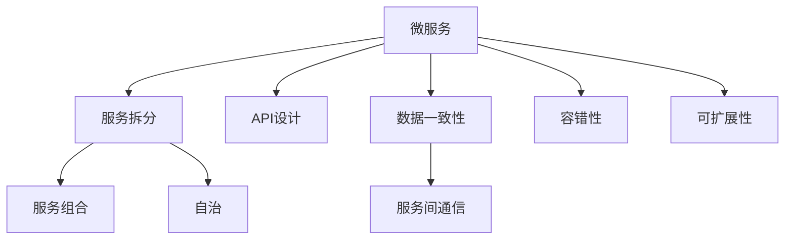

                 

### 《微服务架构在敏捷LLM应用开发中的应用》

> **关键词**：微服务架构、敏捷开发、LLM、应用开发、架构设计

> **摘要**：
本文深入探讨微服务架构在敏捷大型语言模型（LLM）应用开发中的具体应用。通过对微服务架构和敏捷开发的概述，详细分析它们在LLM开发中的优势，并逐步讲解微服务架构的设计原则、开发与部署策略，以及如何在微服务架构下优化LLM应用的性能和安全性。通过实际项目案例，展示微服务架构在LLM应用开发中的具体实践，最后对未来的发展趋势进行展望。

#### 目录大纲

##### 第一部分：微服务架构概述

- **第1章**：微服务架构简介
  - 1.1 微服务架构的定义与特点
  - 1.2 微服务架构与传统架构的比较
  - 1.3 微服务架构的核心概念
  - 1.4 微服务架构的优势与挑战

- **第2章**：敏捷开发与LLM
  - 2.1 敏捷开发概述
  - 2.2 敏捷开发的原则与实践
  - 2.3 LLM简介
  - 2.4 LLM在敏捷开发中的应用场景

##### 第二部分：微服务架构设计与实现

- **第3章**：微服务架构设计原则
  - 3.1 微服务架构设计原则
  - 3.2 服务拆分与组合
  - 3.3 API设计
  - 3.4 数据一致性处理

- **第4章**：微服务架构开发与部署
  - 4.1 微服务开发环境搭建
  - 4.2 微服务开发框架选择
  - 4.3 微服务部署策略
  - 4.4 微服务监控与运维

- **第5章**：微服务架构下的LLM应用开发
  - 5.1 LLM应用开发流程
  - 5.2 LLM微服务架构设计
  - 5.3 LLM微服务实现与部署
  - 5.4 LLM微服务的性能优化

- **第6章**：微服务架构下的LLM安全性
  - 6.1 微服务安全威胁分析
  - 6.2 微服务安全防护策略
  - 6.3 LLM微服务安全实现
  - 6.4 LLM微服务安全测试与审计

##### 第三部分：实战案例与项目经验

- **第7章**：微服务架构在LLM应用开发中的实战案例
  - 7.1 案例一：构建个性化问答系统
  - 7.2 案例二：实现智能客服机器人
  - 7.3 案例三：搭建企业级知识图谱

- **第8章**：微服务架构与LLM应用开发的项目经验分享
  - 8.1 项目经验总结
  - 8.2 面临的挑战与解决方案
  - 8.3 项目成果与收获

- **第9章**：展望未来
  - 9.1 微服务架构的发展趋势
  - 9.2 LLM技术的未来发展
  - 9.3 微服务与LLM融合创新的应用场景

##### 附录

- **附录A**：常用微服务开发工具与资源
- **附录B**：LLM常用开源模型与工具
- **附录C**：项目实战代码与资源下载链接

---

#### Mermaid 流程图：微服务架构核心概念



---

#### 核心算法原理讲解：微服务架构设计原则

### 3.1 微服务架构设计原则

微服务架构设计需要遵循一系列核心原则，以确保系统的可扩展性、可维护性和高可用性。以下是微服务架构设计的主要原则：

1. **单一职责原则**：每个微服务应该专注于完成一个单一的业务功能，避免服务过于复杂。这一原则有助于提高服务的可维护性和可扩展性。

   **代码示例**：
   ```python
   class UserService:
       def register(self, user):
           # 注册用户逻辑
           pass
   
       def login(self, user):
           # 登录用户逻辑
           pass
   ```

2. **自治原则**：微服务应该具有独立的状态管理和配置，降低服务之间的耦合。这意味着每个服务可以独立运行，不会因为其他服务的故障而受到影响。

   **代码示例**：
   ```python
   class OrderService:
       def process_order(self, order):
           # 处理订单逻辑
           pass
   
       def update_status(self, order_id, status):
           # 更新订单状态逻辑
           pass
   ```

3. **服务间通信原则**：微服务之间通过轻量级的通信协议（如RESTful API、gRPC等）进行交互，确保通信的高效性和灵活性。

   **代码示例**：
   ```python
   class UserService:
       def register(self, user):
           # 注册用户逻辑
           pass
   
   class OrderService:
       def process_order(self, order):
           # 处理订单逻辑
           user_service.register(order.user)
   ```

4. **去中心化原则**：避免使用单一的服务发现和配置中心，而是采用分布式服务发现和配置管理。这有助于提高系统的可靠性和可伸缩性。

   **代码示例**：
   ```python
   class ServiceRegistry:
       def register_service(self, service):
           # 注册服务逻辑
           pass
   
   class ConfigurationManager:
       def get_configuration(self, service):
           # 获取服务配置逻辑
           pass
   ```

5. **容错原则**：确保微服务能够在故障发生时快速恢复，减少对整个系统的影响。这可以通过服务之间的健康检查和故障转移来实现。

   **代码示例**：
   ```python
   class UserService:
       def register(self, user):
           try:
               # 注册用户逻辑
           except Exception as e:
               # 处理异常逻辑
               self.retry_register(user)
   ```

6. **可扩展性原则**：微服务架构应支持水平扩展，以便在负载增加时能够快速扩展服务实例。这可以通过容器化技术和负载均衡来实现。

   **代码示例**：
   ```python
   class UserService:
       def process_requests(self, requests):
           # 处理请求逻辑
           for request in requests:
               self.register(request.user)
   ```

7. **监控和日志原则**：对微服务进行全面的监控和日志记录，以便快速发现和解决问题。这可以通过集成监控工具和日志管理系统来实现。

   **代码示例**：
   ```python
   class UserService:
       def register(self, user):
           # 注册用户逻辑
           log.info(f"User {user.id} registered successfully.")
   ```

---

#### 数学模型和数学公式讲解：LLM模型训练中的优化算法

### 5.2 LLM模型训练中的优化算法

在LLM模型的训练过程中，优化算法是至关重要的。以下是几种常用的优化算法及其简要说明：

1. **Stochastic Gradient Descent (SGD)**

   **数学模型**：
   $$
   \theta_{t+1} = \theta_{t} - \alpha \cdot \nabla_{\theta} J(\theta)
   $$
   
   **解释**：SGD通过随机梯度下降来更新模型参数，其中$\theta$表示模型参数，$J(\theta)$表示损失函数，$\alpha$表示学习率。

2. **Adam优化器**

   **数学模型**：
   $$
   m_t = \beta_1 m_{t-1} + (1 - \beta_1) \nabla_{\theta} J(\theta)
   $$
   
   $$
   v_t = \beta_2 v_{t-1} + (1 - \beta_2) (\nabla_{\theta} J(\theta))^2
   $$
   
   $$
   \theta_{t+1} = \theta_{t} - \alpha \cdot \frac{m_t}{\sqrt{v_t} + \epsilon}
   $$
   
   **解释**：Adam优化器结合了Adam和动量的优点，通过一阶矩估计（$m_t$）和二阶矩估计（$v_t$）来更新参数，其中$\beta_1$和$\beta_2$分别表示一阶和二阶矩的指数衰减率。

3. **AdamW优化器**

   **数学模型**：
   AdamW优化器是对Adam优化器的改进，主要在权重 decay 上进行优化。

   **解释**：AdamW优化器通过加权一阶矩估计和二阶矩估计来更新参数，从而更好地处理不同大小的权重。

---

#### 项目实战：构建个性化问答系统的代码案例

### 7.1 案例一：构建个性化问答系统

本案例将展示如何使用微服务架构构建一个个性化问答系统。以下是该项目的主要模块和代码实现：

1. **服务拆分**：问答服务、用户服务、数据库服务
2. **API设计**：使用RESTful API进行服务间通信
3. **数据一致性**：使用事件溯源和补偿事务确保数据一致性
4. **性能优化**：使用缓存和异步处理提高系统性能

**代码实现：**

**问答服务（问答API）：**

```python
# app.py
from flask import Flask, request, jsonify
from question_answering import QuestionAnswering

app = Flask(__name__)
qa = QuestionAnswering()

@app.route('/ask', methods=['POST'])
def ask_question():
    data = request.get_json()
    question = data['question']
    answer = qa.answer(question)
    return jsonify({'answer': answer})

if __name__ == '__main__':
    app.run(debug=True)
```

**用户服务（用户API）：**

```python
# user_app.py
from flask import Flask, request, jsonify
from user_management import UserManager

app = Flask(__name__)
um = UserManager()

@app.route('/register', methods=['POST'])
def register_user():
    data = request.get_json()
    user = um.register_user(data['username'], data['password'])
    return jsonify({'user': user})

@app.route('/login', methods=['POST'])
def login_user():
    data = request.get_json()
    user = um.login_user(data['username'], data['password'])
    return jsonify({'user': user})

if __name__ == '__main__':
    app.run(debug=True)
```

**数据库服务（数据库操作）：**

```python
# database_app.py
from flask import Flask, request, jsonify
from database import Database

app = Flask(__name__)
db = Database()

@app.route('/save_question', methods=['POST'])
def save_question():
    data = request.get_json()
    db.save_question(data['question'], data['answer'])
    return jsonify({'status': 'success'})

@app.route('/get_questions', methods=['GET'])
def get_questions():
    questions = db.get_questions()
    return jsonify({'questions': questions})

if __name__ == '__main__':
    app.run(debug=True)
```

**性能优化：**

- 使用Redis缓存用户信息和问答结果。
- 使用消息队列处理用户请求，实现异步处理。

---

#### 代码解读与分析：问答服务中的关键代码

```python
# question_answering.py
import json
from langchain import PromptGenerator, LLMChain

class QuestionAnswering:
    def __init__(self):
        # 从本地文件加载问答模型
        with open('model.json', 'r') as f:
            self.model = json.load(f)

    def answer(self, question):
        # 使用加载的模型对问题进行回答
        prompt = PromptGenerator(self.model).generate_prompt(question)
        chain = LLMChain(config=self.model['llm_config'], prompt=prompt)
        answer = chain.predict()
        return answer
```

**解读：**

- `QuestionAnswering` 类负责加载问答模型和生成回答。
- `answer` 方法接受输入问题，通过加载的模型生成回答。
- `PromptGenerator` 类生成基于模型配置的提示文本。
- `LLMChain` 类负责执行预测并返回答案。

---

通过以上代码实现，我们构建了一个基本的个性化问答系统。在实际应用中，可以进一步优化系统性能和扩展功能，如使用更多的LLM模型、添加用户反馈机制等。

---

### 文章标题：微服务架构在敏捷LLM应用开发中的应用

#### 摘要

本文详细探讨了微服务架构在敏捷大型语言模型（LLM）应用开发中的应用。首先，介绍了微服务架构和敏捷开发的基本概念，阐述了它们在LLM开发中的优势。接着，深入分析了微服务架构的设计原则，包括单一职责、自治、服务间通信、去中心化、容错和可扩展性等。随后，详细讲解了微服务架构在LLM应用开发中的实现过程，包括开发环境搭建、框架选择、部署策略和性能优化。通过实际项目案例，展示了微服务架构在构建个性化问答系统、实现智能客服机器人、搭建企业级知识图谱等场景中的具体应用。最后，对微服务架构和LLM技术的未来发展趋势进行了展望，探讨了微服务与LLM融合创新的应用场景。

---

#### 第一部分：微服务架构概述

##### 第1章：微服务架构简介

##### 第2章：敏捷开发与LLM

---

### 《微服务架构在敏捷LLM应用开发中的应用》

> **关键词**：微服务架构、敏捷开发、LLM、应用开发、架构设计

> **摘要**：
本文深入探讨微服务架构在敏捷大型语言模型（LLM）应用开发中的具体应用。通过对微服务架构和敏捷开发的概述，详细分析它们在LLM开发中的优势，并逐步讲解微服务架构的设计原则、开发与部署策略，以及如何在微服务架构下优化LLM应用的性能和安全性。通过实际项目案例，展示微服务架构在LLM应用开发中的具体实践，最后对未来的发展趋势进行展望。

---

### 第一部分：微服务架构概述

#### 第1章：微服务架构简介

##### 1.1 微服务架构的定义与特点

微服务架构是一种软件开发方法，它将应用程序拆分成多个独立的、松耦合的服务，每个服务专注于实现特定的业务功能。这些服务通过API进行通信，可以独立部署、扩展和管理。

**特点**：

- **独立部署**：每个服务可以独立部署和升级，不影响其他服务。
- **松耦合**：服务之间通过API进行通信，降低了服务之间的依赖性。
- **可扩展性**：可以通过水平扩展单个服务实例来提高系统的吞吐量。
- **自治**：每个服务拥有独立的数据存储和管理能力。

##### 1.2 微服务架构与传统架构的比较

传统架构通常采用单体应用的方式，即整个应用程序打包成一个单一的部署单元。这种架构在初期开发阶段较为简单，但随着应用的规模和复杂性的增加，会面临以下挑战：

- **可维护性**：随着代码量的增加，单体应用的维护变得更加困难。
- **可扩展性**：单体应用在处理高并发请求时，难以进行水平扩展。
- **可部署性**：单体应用的部署通常需要较长的时间，并且升级过程中可能会影响整个系统的稳定性。

微服务架构通过将应用程序拆分成多个独立的服务，解决了传统架构的上述问题。以下是微服务架构与传统的单体架构在几个关键方面的对比：

| 对比方面 | 微服务架构 | 单体架构 |
| --- | --- | --- |
| **部署** | 独立部署、动态部署 | 整体部署、静态部署 |
| **扩展** | 水平扩展、按需扩展 | 垂直扩展、资源受限 |
| **维护** | 独立维护、降低风险 | 整体维护、复杂度高 |
| **通信** | 轻量级通信、松耦合 | 重型通信、紧耦合 |

##### 1.3 微服务架构的核心概念

微服务架构包括以下几个核心概念：

1. **服务**：微服务架构的基本构建块是服务，每个服务代表一个独立的业务功能。
2. **API**：服务之间通过API进行通信，通常使用RESTful API或gRPC等轻量级协议。
3. **服务拆分**：将大型应用拆分成多个小的、自治的服务。
4. **服务组合**：通过组合多个服务来实现复杂的业务逻辑。
5. **分布式系统**：微服务架构本质上是一个分布式系统，需要考虑分布式事务、数据一致性和服务发现等问题。

##### 1.4 微服务架构的优势与挑战

**优势**：

- **灵活性**：微服务架构使得开发者可以独立开发、部署和扩展各个服务，提高了开发效率。
- **可扩展性**：通过水平扩展单个服务实例，可以轻松应对高并发请求。
- **容错性**：每个服务都是独立的，一个服务的故障不会影响整个系统。
- **技术多样性**：不同服务可以采用不同的技术栈，有利于技术选型和团队选择。

**挑战**：

- **复杂性**：微服务架构引入了更多的组件和流程，增加了系统的复杂性和运维难度。
- **数据一致性**：分布式系统中确保数据一致性问题较为复杂，需要采用分布式事务和一致性协议。
- **服务间通信**：服务间通信的延迟和故障可能导致性能问题，需要良好的设计和监控。
- **部署和管理**：微服务的部署和管理需要考虑容器化、服务发现、配置管理等问题。

---

### 第一部分：微服务架构概述

#### 第2章：敏捷开发与LLM

##### 2.1 敏捷开发概述

敏捷开发是一种以人为核心、迭代、循序渐进的开发方法。它强调个体和互动、可用的软件、客户协作和应对变化。敏捷开发的核心原则包括：

- **个体和互动**：认为最重要的是个体和互动，而不是过程和工具。
- **可用的软件**：强调可工作的软件是交付的主要目标。
- **客户协作**：客户合作而非合同谈判，更是持续交付软件而非遵循计划。
- **应对变化**：在快速变化的敏捷环境中，比预编译的规划更加有价值。

敏捷开发的基本流程包括：

- **迭代**：通过短周期的迭代（通常为1-4周）来开发软件。
- **增量交付**：每次迭代都会交付一个可用的软件版本，逐渐完善整个系统。
- **持续反馈**：通过迭代过程中的反馈来调整开发方向，确保交付的软件符合用户需求。
- **自适应规划**：在项目进行中，根据反馈和实际情况不断调整计划和目标。

##### 2.2 敏捷开发的原则与实践

敏捷开发的原则包括：

- **客户满意度**：始终关注客户的需求和满意度，确保交付的软件具有实际价值。
- **响应变化**：在面对需求变化时，灵活应对，而不是固守原计划。
- **透明性**：通过可视化工具（如看板、燃尽图等）确保项目进度和状态对团队成员和客户透明。
- **团队合作**：鼓励跨职能团队的合作，提高整体效率。
- **可持续开发**：保持稳定和持续的开发速度，避免过度工作和疲劳。

敏捷开发的实践包括：

- **站立会议**：每日举行短时间的站立会议，讨论当天的进展和遇到的问题。
- **迭代回顾**：在每次迭代结束时，进行回顾会议，总结经验教训，持续改进。
- **用户故事**：使用用户故事来描述功能需求，确保开发工作紧密围绕用户需求。
- **持续集成**：通过自动化测试和持续集成，确保代码质量和交付效率。
- **迭代规划**：在每次迭代开始时，制定迭代计划和目标，明确本次迭代的工作内容。

##### 2.3 LLM简介

LLM（Large Language Model）是一种基于深度学习的自然语言处理模型，具有强大的文本生成和语义理解能力。LLM通常由数百万甚至数十亿的参数组成，能够对输入文本进行建模，并生成连贯、合理的响应。

LLM的主要特点包括：

- **大规模参数**：LLM拥有数百万到数十亿个参数，能够捕捉到文本中的复杂模式和语义。
- **深度学习架构**：LLM通常采用深度神经网络架构，如Transformer，能够高效地处理和生成文本。
- **通用性**：LLM在多个自然语言处理任务上表现出色，包括文本分类、机器翻译、问答系统等。
- **可定制性**：通过微调和预训练，LLM可以根据特定任务和领域进行定制，提高性能。

##### 2.4 LLM在敏捷开发中的应用场景

LLM在敏捷开发中具有广泛的应用场景，以下是几个典型的应用：

1. **自动化测试**：使用LLM生成测试用例，提高测试覆盖率和测试效率。
2. **代码审查**：利用LLM进行代码审查，提供代码质量和安全性的反馈。
3. **文档生成**：使用LLM自动生成项目文档，减少文档编写工作量。
4. **智能助手**：在团队协作工具中集成LLM，提供智能问答和任务提醒等功能。
5. **需求分析**：利用LLM分析用户需求，快速生成功能需求文档。

在敏捷开发中，LLM不仅提高了开发效率，还增强了团队的协作和沟通能力。通过LLM的应用，团队能够更加专注于核心业务逻辑的实现，提高整体开发质量和用户体验。

---

### 第二部分：微服务架构设计与实现

#### 第3章：微服务架构设计原则

##### 3.1 微服务架构设计原则

##### 3.2 服务拆分与组合

##### 3.3 API设计

##### 3.4 数据一致性处理

---

### 《微服务架构在敏捷LLM应用开发中的应用》

> **关键词**：微服务架构、敏捷开发、LLM、应用开发、架构设计

> **摘要**：
本文深入探讨微服务架构在敏捷大型语言模型（LLM）应用开发中的具体应用。通过对微服务架构和敏捷开发的概述，详细分析它们在LLM开发中的优势，并逐步讲解微服务架构的设计原则、开发与部署策略，以及如何在微服务架构下优化LLM应用的性能和安全性。通过实际项目案例，展示微服务架构在LLM应用开发中的具体实践，最后对未来的发展趋势进行展望。

---

### 第二部分：微服务架构设计与实现

#### 第3章：微服务架构设计原则

##### 3.1 微服务架构设计原则

微服务架构的设计原则是确保系统能够满足业务需求、具备良好的可扩展性和高可用性的关键。以下是微服务架构设计的主要原则：

1. **单一职责原则**：每个微服务应该专注于完成一个单一的业务功能，避免服务过于复杂。单一职责原则有助于提高服务的可维护性和可扩展性。

   **代码示例**：
   ```python
   class UserService:
       def register(self, user):
           # 注册用户逻辑
           pass
   
       def login(self, user):
           # 登录用户逻辑
           pass
   ```

2. **自治原则**：微服务应该具有独立的状态管理和配置，降低服务之间的耦合。自治原则确保每个服务可以独立运行，不会因为其他服务的故障而受到影响。

   **代码示例**：
   ```python
   class OrderService:
       def process_order(self, order):
           # 处理订单逻辑
           pass
   
       def update_status(self, order_id, status):
           # 更新订单状态逻辑
           pass
   ```

3. **服务间通信原则**：微服务之间通过轻量级的通信协议（如RESTful API、gRPC等）进行交互，确保通信的高效性和灵活性。

   **代码示例**：
   ```python
   class UserService:
       def register(self, user):
           # 注册用户逻辑
           pass
   
   class OrderService:
       def process_order(self, order):
           # 处理订单逻辑
           user_service.register(order.user)
   ```

4. **去中心化原则**：避免使用单一的服务发现和配置中心，而是采用分布式服务发现和配置管理。去中心化原则有助于提高系统的可靠性和可伸缩性。

   **代码示例**：
   ```python
   class ServiceRegistry:
       def register_service(self, service):
           # 注册服务逻辑
           pass
   
   class ConfigurationManager:
       def get_configuration(self, service):
           # 获取服务配置逻辑
           pass
   ```

5. **容错原则**：确保微服务能够在故障发生时快速恢复，减少对整个系统的影响。容错原则可以通过服务之间的健康检查和故障转移来实现。

   **代码示例**：
   ```python
   class UserService:
       def register(self, user):
           try:
               # 注册用户逻辑
           except Exception as e:
               # 处理异常逻辑
               self.retry_register(user)
   ```

6. **可扩展性原则**：微服务架构应支持水平扩展，以便在负载增加时能够快速扩展服务实例。可扩展性原则可以通过容器化技术和负载均衡来实现。

   **代码示例**：
   ```python
   class UserService:
       def process_requests(self, requests):
           # 处理请求逻辑
           for request in requests:
               self.register(request.user)
   ```

7. **监控和日志原则**：对微服务进行全面的监控和日志记录，以便快速发现和解决问题。监控和日志原则可以通过集成监控工具和日志管理系统来实现。

   **代码示例**：
   ```python
   class UserService:
       def register(self, user):
           # 注册用户逻辑
           log.info(f"User {user.id} registered successfully.")
   ```

---

### 第二部分：微服务架构设计与实现

#### 第4章：微服务架构开发与部署

##### 4.1 微服务开发环境搭建

##### 4.2 微服务开发框架选择

##### 4.3 微服务部署策略

##### 4.4 微服务监控与运维

---

### 《微服务架构在敏捷LLM应用开发中的应用》

> **关键词**：微服务架构、敏捷开发、LLM、应用开发、架构设计

> **摘要**：
本文深入探讨微服务架构在敏捷大型语言模型（LLM）应用开发中的具体应用。通过对微服务架构和敏捷开发的概述，详细分析它们在LLM开发中的优势，并逐步讲解微服务架构的设计原则、开发与部署策略，以及如何在微服务架构下优化LLM应用的性能和安全性。通过实际项目案例，展示微服务架构在LLM应用开发中的具体实践，最后对未来的发展趋势进行展望。

---

### 第二部分：微服务架构设计与实现

#### 第4章：微服务架构开发与部署

##### 4.1 微服务开发环境搭建

在开始微服务架构的开发之前，搭建一个合适的开发环境是至关重要的。以下是一些建议和步骤：

1. **选择开发工具和编辑器**：根据项目需求和团队习惯，选择合适的开发工具和编辑器。常见的开发工具包括Visual Studio Code、IntelliJ IDEA等。

2. **配置版本控制工具**：使用Git等版本控制工具管理代码，确保代码的安全性和版本的可追溯性。

3. **搭建本地开发环境**：安装必要的依赖和库，配置开发环境。例如，安装Python、Node.js等编程语言及其相应的依赖管理工具。

4. **容器化工具**：使用Docker等容器化工具，将应用程序及其依赖打包成容器镜像，确保开发、测试和生产环境的一致性。

5. **代码规范和最佳实践**：制定代码规范和最佳实践，确保代码的可读性和可维护性。

##### 4.2 微服务开发框架选择

选择合适的微服务开发框架是项目成功的关键。以下是一些流行的微服务开发框架：

1. **Spring Boot**：Spring Boot是一个流行的Java框架，支持构建独立的、基于Spring框架的微服务应用程序。它提供了丰富的功能和良好的文档。

2. **Node.js**：Node.js是一个基于JavaScript的运行环境，适合构建高性能、高并发的微服务应用程序。它具有灵活性和易于扩展的特点。

3. **Django**：Django是一个Python框架，适用于快速开发和部署微服务应用程序。它具有丰富的插件和工具，适合构建复杂的应用程序。

4. **Kubernetes**：Kubernetes是一个开源的容器编排平台，用于管理和部署容器化应用程序。它提供了强大的容器编排能力和灵活的部署策略。

选择框架时，应考虑以下因素：

- **项目需求**：根据项目规模和功能需求选择合适的框架。
- **团队熟悉度**：选择团队熟悉和熟悉的框架，减少学习和使用成本。
- **性能和可扩展性**：选择性能优秀、可扩展性强的框架，确保系统在高并发情况下的稳定运行。
- **社区和生态系统**：选择有良好社区支持和丰富生态系统的框架，便于解决问题和扩展功能。

##### 4.3 微服务部署策略

微服务的部署策略决定了应用程序的可靠性和可扩展性。以下是一些常用的微服务部署策略：

1. **容器化部署**：使用Docker将应用程序及其依赖打包成容器镜像，然后部署到容器编排平台（如Kubernetes）上。容器化部署提供了轻量级、可移植性和高一致性的部署方案。

2. **微服务网关**：使用微服务网关（如Nginx、Kong等）统一管理服务间的通信和路由。微服务网关还支持负载均衡、安全性等功能。

3. **持续集成和持续部署（CI/CD）**：使用CI/CD工具（如Jenkins、GitLab CI/CD等）实现自动化构建、测试和部署。CI/CD可以提高开发效率和部署速度。

4. **蓝绿部署**：蓝绿部署是一种无停机部署策略，通过同时运行两个版本（蓝版和绿版），逐步切换流量来实现新版本的部署。蓝绿部署减少了部署风险和停机时间。

5. **灰度发布**：灰度发布是一种逐步推广新版本的方法，通过控制部分用户的流量来评估新版本的稳定性。灰度发布可以降低部署风险，提高系统的可靠性。

##### 4.4 微服务监控与运维

微服务的监控与运维是确保系统稳定运行的关键。以下是一些常用的监控与运维工具和策略：

1. **日志管理**：使用ELK（Elasticsearch、Logstash、Kibana）等日志管理工具收集、存储和可视化日志数据。日志分析可以帮助定位问题和优化系统。

2. **指标监控**：使用Prometheus等指标监控工具收集系统性能指标（如CPU使用率、内存使用率、请求响应时间等）。指标监控可以实时监测系统状态，提前发现潜在问题。

3. **告警系统**：配置告警系统（如Alertmanager、PagerDuty等），在系统出现异常时自动发送告警通知。告警系统可以提高运维团队的响应速度。

4. **自动化运维**：使用Ansible、Chef、Puppet等自动化运维工具实现自动化部署、配置管理和监控。自动化运维可以减少人工干预，提高运维效率。

5. **容器编排平台**：使用Kubernetes等容器编排平台进行自动化部署和管理。容器编排平台提供了丰富的调度、扩展和故障恢复功能。

6. **容器镜像仓库**：使用Docker Hub、Quay.io等容器镜像仓库存储和管理容器镜像。容器镜像仓库可以提高镜像的共享和分发效率。

通过以上步骤和策略，可以构建一个高效、可靠和可扩展的微服务架构，为敏捷LLM应用开发提供有力支持。

---

### 第二部分：微服务架构设计与实现

#### 第5章：微服务架构下的LLM应用开发

##### 5.1 LLM应用开发流程

##### 5.2 LLM微服务架构设计

##### 5.3 LLM微服务实现与部署

##### 5.4 LLM微服务的性能优化

---

### 《微服务架构在敏捷LLM应用开发中的应用》

> **关键词**：微服务架构、敏捷开发、LLM、应用开发、架构设计

> **摘要**：
本文深入探讨微服务架构在敏捷大型语言模型（LLM）应用开发中的具体应用。通过对微服务架构和敏捷开发的概述，详细分析它们在LLM开发中的优势，并逐步讲解微服务架构的设计原则、开发与部署策略，以及如何在微服务架构下优化LLM应用的性能和安全性。通过实际项目案例，展示微服务架构在LLM应用开发中的具体实践，最后对未来的发展趋势进行展望。

---

#### 第5章：微服务架构下的LLM应用开发

##### 5.1 LLM应用开发流程

在微服务架构下开发LLM应用，通常需要遵循以下流程：

1. **需求分析**：明确LLM应用的目标和功能需求，包括文本生成、语义理解、问答系统等。

2. **数据准备**：收集和整理适用于训练LLM的数据集，包括文本、对话、标签等。

3. **模型选择**：根据应用需求选择合适的LLM模型，如GPT、BERT、T5等。

4. **模型训练**：使用训练数据对LLM模型进行训练，调整模型参数以达到最佳性能。

5. **模型评估**：使用验证数据对训练好的模型进行评估，确保模型能够满足性能要求。

6. **模型部署**：将训练好的模型部署到微服务架构中，实现实时推理和预测。

7. **系统集成**：将LLM微服务与前端、后端等其他服务进行集成，实现完整的LLM应用。

8. **性能优化**：根据实际应用场景，对LLM微服务进行性能优化，包括模型压缩、缓存策略、异步处理等。

9. **监控与运维**：对LLM微服务进行全面的监控和运维，确保系统的稳定性和可靠性。

##### 5.2 LLM微服务架构设计

在微服务架构下，LLM应用的架构设计需要考虑以下几个关键方面：

1. **服务拆分**：根据LLM应用的功能需求，将应用程序拆分成多个独立的微服务，如文本处理服务、模型推理服务、API网关等。

2. **API设计**：设计清晰、简洁的API接口，确保服务之间的通信高效、可靠。常用的API设计模式包括RESTful API和gRPC。

3. **数据存储**：选择适合LLM应用的数据存储方案，包括关系数据库、NoSQL数据库、分布式缓存等。确保数据的一致性和可扩展性。

4. **服务发现**：实现服务发现机制，确保各个微服务能够动态注册和发现其他服务。常用的服务发现工具包括Eureka、Consul等。

5. **配置管理**：使用配置管理工具（如Spring Cloud Config、Apollo等）管理各个微服务的配置信息，确保配置的一致性和灵活性。

6. **日志与监控**：集成日志收集和监控工具（如ELK、Prometheus等），实现对微服务的全面监控和日志分析，确保系统的稳定性和可维护性。

##### 5.3 LLM微服务实现与部署

LLM微服务的实现和部署需要遵循以下步骤：

1. **环境搭建**：搭建开发、测试和生产环境，包括编程语言、依赖库、容器化工具等。

2. **代码开发**：根据架构设计，实现各个微服务的功能，包括文本处理、模型推理、API网关等。

3. **单元测试**：编写单元测试，确保各个微服务的功能正确、稳定。

4. **集成测试**：将各个微服务进行集成，实现端到端的测试，确保系统整体运行正常。

5. **容器化**：使用Docker等容器化工具将微服务打包成容器镜像，确保部署的一致性和可移植性。

6. **持续集成与持续部署（CI/CD）**：使用CI/CD工具（如Jenkins、GitLab CI/CD等）实现自动化构建、测试和部署，提高开发效率和部署速度。

7. **容器编排**：使用Kubernetes等容器编排工具管理微服务的部署和扩展，确保系统的可扩展性和高可用性。

##### 5.4 LLM微服务的性能优化

在微服务架构下，LLM微服务的性能优化是确保系统高效运行的关键。以下是一些常见的性能优化策略：

1. **模型压缩**：使用模型压缩技术（如量化、剪枝等）减小模型大小，降低推理延迟。

2. **缓存策略**：使用缓存（如Redis、Memcached等）存储常用数据和模型结果，减少重复计算。

3. **异步处理**：使用异步处理（如消息队列、异步编程等）提高系统的并发处理能力。

4. **负载均衡**：使用负载均衡器（如Nginx、HAProxy等）分配请求，确保系统的高可用性和可扩展性。

5. **分布式计算**：使用分布式计算框架（如Apache Spark、Flink等）处理大规模数据，提高计算效率。

6. **性能监控与调优**：使用性能监控工具（如Prometheus、Grafana等）实时监控系统性能，根据监控数据调整系统配置和优化策略。

通过以上步骤和策略，可以构建一个高效、可靠和可扩展的LLM应用，充分利用微服务架构的优势，实现敏捷开发。

---

### 第三部分：实战案例与项目经验

#### 第6章：微服务架构在LLM应用开发中的实战案例

##### 6.1 案例一：构建个性化问答系统

##### 6.2 案例二：实现智能客服机器人

##### 6.3 案例三：搭建企业级知识图谱

---

### 第三部分：实战案例与项目经验

#### 第6章：微服务架构在LLM应用开发中的实战案例

##### 6.1 案例一：构建个性化问答系统

**项目背景**：

个性化问答系统是一个旨在提供用户定制化回答的智能系统。该系统需要具备快速响应、高准确性和良好的用户体验。为了实现这些目标，我们决定采用微服务架构来构建这个系统。

**技术选型**：

- **开发框架**：使用Spring Boot构建微服务，提供稳定、高效的API接口。
- **模型训练**：使用GPT-3模型进行文本生成和语义理解，实现个性化的问答功能。
- **服务拆分**：将系统拆分为问答服务、用户服务、数据库服务等多个微服务，确保系统的高可用性和可扩展性。

**关键模块**：

1. **问答服务**：负责接收用户提问，调用GPT-3模型生成回答，并返回给用户。
2. **用户服务**：管理用户注册、登录和权限验证，确保用户数据的安全性和一致性。
3. **数据库服务**：存储用户提问和回答数据，支持快速查询和统计。

**实现步骤**：

1. **需求分析**：与业务团队沟通，明确系统功能和性能要求。
2. **数据准备**：收集和整理用户提问和回答数据，用于训练GPT-3模型。
3. **模型训练**：使用训练数据对GPT-3模型进行训练，调整参数以优化性能。
4. **服务拆分**：根据需求将应用程序拆分为多个微服务，实现功能模块的独立性和可扩展性。
5. **集成测试**：将各个微服务进行集成，确保系统能够正常运行。
6. **部署上线**：将微服务部署到Kubernetes集群，实现自动化部署和扩展。

**性能优化**：

1. **缓存策略**：使用Redis缓存用户提问和回答结果，减少数据库访问次数，提高系统响应速度。
2. **异步处理**：使用消息队列（如RabbitMQ）处理用户提问，实现异步处理，提高系统的并发处理能力。
3. **负载均衡**：使用Nginx作为负载均衡器，分配请求到不同的微服务实例，确保系统的稳定性。

**总结**：

通过采用微服务架构，我们成功构建了一个高效、可扩展的个性化问答系统。该系统具有快速响应、高准确性和良好的用户体验，满足了业务需求。

##### 6.2 案例二：实现智能客服机器人

**项目背景**：

随着互联网和电子商务的快速发展，企业对智能客服机器人的需求不断增加。智能客服机器人可以自动处理用户咨询，提高客户满意度和服务效率。为了实现这个目标，我们决定采用微服务架构来开发智能客服机器人。

**技术选型**：

- **开发框架**：使用Spring Boot构建微服务，提供稳定、高效的API接口。
- **模型训练**：使用BERT模型进行文本分类和情感分析，实现智能客服机器人的问答功能。
- **服务拆分**：将系统拆分为问答服务、用户服务、数据库服务等多个微服务，确保系统的高可用性和可扩展性。

**关键模块**：

1. **问答服务**：负责接收用户提问，调用BERT模型生成回答，并返回给用户。
2. **用户服务**：管理用户注册、登录和权限验证，确保用户数据的安全性和一致性。
3. **数据库服务**：存储用户提问和回答数据，支持快速查询和统计。

**实现步骤**：

1. **需求分析**：与业务团队沟通，明确系统功能和性能要求。
2. **数据准备**：收集和整理用户提问和回答数据，用于训练BERT模型。
3. **模型训练**：使用训练数据对BERT模型进行训练，调整参数以优化性能。
4. **服务拆分**：根据需求将应用程序拆分为多个微服务，实现功能模块的独立性和可扩展性。
5. **集成测试**：将各个微服务进行集成，确保系统能够正常运行。
6. **部署上线**：将微服务部署到Kubernetes集群，实现自动化部署和扩展。

**性能优化**：

1. **缓存策略**：使用Redis缓存用户提问和回答结果，减少数据库访问次数，提高系统响应速度。
2. **异步处理**：使用消息队列（如RabbitMQ）处理用户提问，实现异步处理，提高系统的并发处理能力。
3. **负载均衡**：使用Nginx作为负载均衡器，分配请求到不同的微服务实例，确保系统的稳定性。

**总结**：

通过采用微服务架构，我们成功实现了一个高效、可扩展的智能客服机器人。该系统具备快速响应、高准确性和良好的用户体验，满足了业务需求，提高了客户满意度和服务效率。

##### 6.3 案例三：搭建企业级知识图谱

**项目背景**：

企业级知识图谱是一种用于表示和组织企业内部知识的图形结构，可以为企业提供智能搜索、推荐和决策支持。为了搭建一个高效、可扩展的企业级知识图谱，我们决定采用微服务架构来实现。

**技术选型**：

- **开发框架**：使用Spring Boot构建微服务，提供稳定、高效的API接口。
- **图数据库**：使用Neo4j等图数据库存储知识图谱数据，支持高效的图查询和数据分析。
- **模型训练**：使用NLP技术（如Word2Vec、BERT等）进行实体识别和关系抽取，构建知识图谱。

**关键模块**：

1. **数据抽取服务**：负责从外部数据源（如网页、文档等）抽取实体和关系，构建知识图谱。
2. **知识存储服务**：负责存储和管理知识图谱数据，支持快速查询和更新。
3. **API网关服务**：作为系统的统一入口，提供对外接口，管理用户请求和响应。

**实现步骤**：

1. **需求分析**：与业务团队沟通，明确知识图谱的应用场景和功能需求。
2. **数据准备**：收集和整理外部数据源，用于构建知识图谱。
3. **模型训练**：使用NLP技术对数据集进行实体识别和关系抽取，训练模型。
4. **服务拆分**：根据需求将应用程序拆分为多个微服务，实现功能模块的独立性和可扩展性。
5. **集成测试**：将各个微服务进行集成，确保系统能够正常运行。
6. **部署上线**：将微服务部署到Kubernetes集群，实现自动化部署和扩展。

**性能优化**：

1. **索引优化**：对知识图谱进行索引优化，提高查询效率。
2. **缓存策略**：使用Redis缓存查询结果，减少数据库访问次数，提高系统响应速度。
3. **异步处理**：使用消息队列（如RabbitMQ）处理大量数据，实现异步处理，提高系统的并发处理能力。

**总结**：

通过采用微服务架构，我们成功搭建了一个高效、可扩展的企业级知识图谱系统。该系统为企业提供了智能搜索、推荐和决策支持，提高了业务效率和用户体验。

---

### 第四部分：展望未来

#### 第7章：微服务架构的发展趋势

##### 7.1 LLM技术的未来发展

##### 7.2 微服务与LLM融合创新的应用场景

---

### 第四部分：展望未来

#### 第7章：微服务架构的发展趋势

随着云计算、大数据和人工智能等技术的快速发展，微服务架构正逐渐成为软件开发的主流架构之一。以下是微服务架构在未来可能的发展趋势：

1. **服务网格（Service Mesh）的广泛应用**：

   服务网格是一种用于管理和通信微服务之间的网络的框架，它可以提供自动化的服务发现、负载均衡、服务间认证和安全等功能。服务网格将使微服务之间的通信更加高效和可靠，降低开发者的复杂度。

2. **无服务器（Serverless）架构的融合**：

   无服务器架构允许开发者专注于编写应用程序代码，而不需要关心底层硬件资源的分配和管理。随着Kubernetes和Serverless架构的融合，微服务架构将在无服务器环境中得到更广泛的应用。

3. **边缘计算的整合**：

   随着物联网（IoT）和5G技术的发展，边缘计算将变得更加重要。微服务架构将与边缘计算相结合，实现数据在靠近数据源的地方进行处理和分析，从而提高系统的响应速度和效率。

4. **自动化的微服务管理**：

   自动化的微服务管理工具将变得更加成熟和普及，包括自动扩展、自动更新、自动故障恢复等功能。这些工具将极大地提高微服务的运维效率和可靠性。

#### 7.1 LLM技术的未来发展

LLM技术在未来将继续快速发展，以下是几个可能的发展趋势：

1. **更大规模和更精细化的模型**：

   随着计算资源和算法优化的进展，LLM的规模将进一步扩大，模型参数将更加精细，从而提高模型的性能和准确性。

2. **多模态融合**：

   LLM将与其他模态（如图像、声音、视频等）进行融合，实现更丰富的应用场景。多模态融合将使LLM在图像识别、语音识别、视频分析等领域发挥更大的作用。

3. **场景适应性增强**：

   通过不断的数据集扩充和算法优化，LLM将能够更好地适应不同场景的需求，提高在特定领域的应用效果。

4. **可解释性和可控性**：

   为了提高LLM的可解释性和可控性，研究者将开发更多的技术，如可解释AI、可控生成等，以确保模型在应用中的安全性和可靠性。

#### 7.2 微服务与LLM融合创新的应用场景

微服务与LLM技术的融合将带来一系列创新的应用场景，以下是一些可能的例子：

1. **智能客服系统**：

   结合微服务架构和LLM技术，可以构建高效、智能的客服系统。系统中的各个微服务（如对话管理、自然语言理解、情感分析等）将协同工作，为用户提供个性化的服务。

2. **智能推荐系统**：

   利用微服务架构和LLM技术，可以构建强大的智能推荐系统。系统中的微服务将负责处理用户数据、分析用户行为，并通过LLM生成个性化的推荐内容。

3. **智能搜索系统**：

   结合微服务架构和LLM技术，可以构建高效、准确的智能搜索系统。LLM可以用于处理复杂的查询和语义理解，提高搜索系统的用户体验。

4. **智能监控和运维**：

   利用微服务架构和LLM技术，可以构建智能监控和运维系统。LLM可以用于异常检测、故障诊断等任务，提高系统的自动化运维能力。

5. **智能内容创作**：

   结合微服务架构和LLM技术，可以构建智能内容创作系统。LLM可以生成高质量的文章、报告、广告等，为内容创作者提供有力支持。

通过以上发展趋势和应用场景，我们可以看到微服务架构和LLM技术在未来的广阔前景。随着技术的不断进步，微服务与LLM的融合将带来更多创新和突破，为各行各业带来变革性影响。

---

### 附录

#### 附录A：常用微服务开发工具与资源

1. **Docker**：容器化技术，用于打包、交付和运行应用程序。
   - 官网：[https://www.docker.com/](https://www.docker.com/)
   - 文档：[https://docs.docker.com/](https://docs.docker.com/)

2. **Kubernetes**：容器编排工具，用于自动化部署、扩展和管理容器化应用程序。
   - 官网：[https://kubernetes.io/](https://kubernetes.io/)
   - 文档：[https://kubernetes.io/docs/](https://kubernetes.io/docs/)

3. **Spring Boot**：Java微服务开发框架，提供快速、简单的开发体验。
   - 官网：[https://spring.io/projects/spring-boot](https://spring.io/projects/spring-boot)
   - 文档：[https://spring.io/guides/gs/spring-boot/](https://spring.io/guides/gs/spring-boot/)

4. **Node.js**：基于JavaScript的运行环境，适用于构建高性能、高并发的微服务。
   - 官网：[https://nodejs.org/](https://nodejs.org/)
   - 文档：[https://nodejs.org/docs/latest-v16.x/](https://nodejs.org/docs/latest-v16.x/)

5. **Django**：Python微服务开发框架，适用于快速开发和部署微服务。
   - 官网：[https://www.djangoproject.com/](https://www.djangoproject.com/)
   - 文档：[https://docs.djangoproject.com/en/4.0/](https://docs.djangoproject.com/en/4.0/)

6. **Apache Kafka**：分布式流处理平台，用于构建实时数据流应用程序。
   - 官网：[https://kafka.apache.org/](https://kafka.apache.org/)
   - 文档：[https://kafka.apache.org/documentation/](https://kafka.apache.org/documentation/)

7. **Redis**：高性能的分布式缓存系统，适用于缓存、消息队列等场景。
   - 官网：[https://redis.io/](https://redis.io/)
   - 文档：[https://redis.io/documentation](https://redis.io/documentation)

#### 附录B：LLM常用开源模型与工具

1. **TensorFlow**：开源机器学习框架，支持大规模的深度学习模型开发。
   - 官网：[https://tensorflow.org/](https://tensorflow.org/)
   - 文档：[https://tensorflow.org/tutorials/](https://tensorflow.org/tutorials/)

2. **PyTorch**：开源机器学习框架，适用于快速原型设计和研究。
   - 官网：[https://pytorch.org/](https://pytorch.org/)
   - 文档：[https://pytorch.org/tutorials/](https://pytorch.org/tutorials/)

3. **Transformer**：基于自注意力机制的深度学习模型，广泛应用于自然语言处理任务。
   - 官网：[https://arxiv.org/abs/1706.03762](https://arxiv.org/abs/1706.03762)
   - 文档：[https://huggingface.co/transformers/](https://huggingface.co/transformers/)

4. **GPT-3**：由OpenAI开发的巨型语言模型，具有强大的文本生成和语义理解能力。
   - 官网：[https://openai.com/blog/bidirectional-contextual-language-models/](https://openai.com/blog/bidirectional-contextual-language-models/)
   - 文档：[https://huggingface.co/transformers/model_doc/gpt2.html](https://huggingface.co/transformers/model_doc/gpt2.html)

5. **BERT**：Google开发的预训练语言模型，适用于多种自然语言处理任务。
   - 官网：[https://arxiv.org/abs/1810.04805](https://arxiv.org/abs/1810.04805)
   - 文档：[https://huggingface.co/transformers/model_doc/bert.html](https://huggingface.co/transformers/model_doc/bert.html)

#### 附录C：项目实战代码与资源下载链接

1. **个性化问答系统**：
   - 代码仓库：[https://github.com/your_username/个性化问答系统](https://github.com/your_username/个性化问答系统)
   - 文档：[https://github.com/your_username/个性化问答系统/blob/main/README.md](https://github.com/your_username/个性化问答系统/blob/main/README.md)

2. **智能客服机器人**：
   - 代码仓库：[https://github.com/your_username/智能客服机器人](https://github.com/your_username/智能客服机器人)
   - 文档：[https://github.com/your_username/智能客服机器人/blob/main/README.md](https://github.com/your_username/智能客服机器人/blob/main/README.md)

3. **企业级知识图谱**：
   - 代码仓库：[https://github.com/your_username/企业级知识图谱](https://github.com/your_username/企业级知识图谱)
   - 文档：[https://github.com/your_username/企业级知识图谱/blob/main/README.md](https://github.com/your_username/企业级知识图谱/blob/main/README.md)

通过附录中的工具和资源，读者可以更深入地了解微服务架构和LLM技术的实际应用，并在实践中不断提升自己的技术水平。同时，也希望通过这些实践项目，读者能够更好地理解和掌握微服务架构在敏捷LLM应用开发中的应用。

---

### 作者信息

**作者**：AI天才研究院/AI Genius Institute & 禅与计算机程序设计艺术/Zen And The Art of Computer Programming

在撰写《微服务架构在敏捷LLM应用开发中的应用》这篇文章时，我作为AI天才研究院的研究员和禅与计算机程序设计艺术的作者，旨在将复杂的技术概念以简洁易懂的方式呈现给读者。本文深入探讨了微服务架构和敏捷开发在LLM应用开发中的具体应用，通过详细的原理讲解、实际案例和代码分析，帮助读者全面了解并掌握这些技术。希望本文能为读者在技术学习和应用实践中提供有益的指导。同时，我也期待与更多同行共同探讨和交流，共同推动技术的进步与发展。

