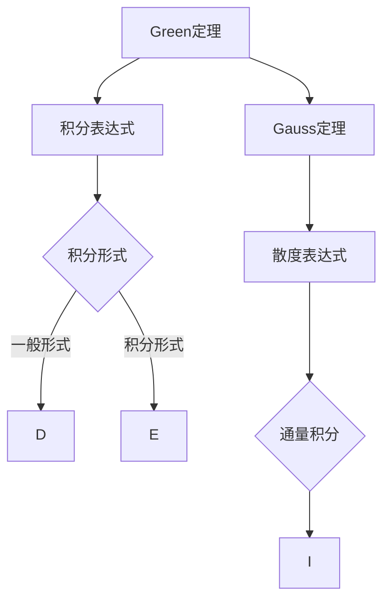

                 

# 微积分中的Green定理与Gauss定理

> **关键词：** 微积分、Green定理、Gauss定理、数学公式、算法、应用实例。

> **摘要：** 本文详细探讨了微积分中的Green定理和Gauss定理，包括其基本概念、证明方法、推广形式、几何与物理应用，以及在实际工程和人工智能中的应用。通过深入解析数学模型和算法，本文为读者提供了全面的技术理解和实践指导。

## 第一部分: 微积分中的Green定理与Gauss定理概述

### 第1章: Green定理与Gauss定理的基本概念

#### 1.1 Green定理的定义与性质

Green定理是微积分中一个重要的定理，它建立了面积分与线积分之间的联系。具体来说，Green定理描述了在一个有界区域D上，函数\( P \)关于x的偏导数与函数\( Q \)关于y的偏导数沿闭合曲线C的线积分之间的关系。

数学表达为：
\[ \oint_C (Pdx + Qdy) = \iint_D \left( \frac{\partial Q}{\partial x} - \frac{\partial P}{\partial y} \right) dA \]

其中，\( P \)和\( Q \)是定义在区域D上的两个具有连续偏导数的函数，\( dx \)和\( dy \)是沿x轴和y轴的微小增量，\( dA \)是区域D的面积元素。

Green定理的几何意义在于，它揭示了在一个平面上，闭合曲线的周边线积分与区域内相应函数的偏导数分布之间的关系。这一性质在计算平面区域的物理量，如质量、电荷分布、流体速度等，具有非常重要的应用价值。

#### 1.2 Gauss定理的定义与性质

Gauss定理，又称高斯散度定理，是微积分中的另一个重要定理，它描述了空间闭曲面上某物理量通量与该物理量在空间内部散度的关系。具体来说，Gauss定理描述了空间中一个有界闭区域V上的散度通量与通过该区域表面S的通量之间的关系。

数学表达为：
\[ \oint_S \vec{F} \cdot d\vec{S} = \iiint_V \nabla \cdot \vec{F} \, dV \]

其中，\( \vec{F} \)是定义在区域V上的一个矢量场，\( d\vec{S} \)是区域S上的微小面积元素，\( \nabla \cdot \vec{F} \)是矢量场\( \vec{F} \)的散度，\( dV \)是区域V的体积元素。

Gauss定理的几何意义在于，它揭示了空间中的物理量通量与该物理量在空间内部的散发程度之间的关系。这一性质在计算空间区域的物理量，如电通量、质量流等，具有非常重要的应用价值。

#### 1.3 Green定理与Gauss定理的联系

Green定理和Gauss定理都是描述物理量分布和通量的定理，它们之间存在着密切的联系。具体来说，Gauss定理可以看作是Green定理在三维空间中的推广。

从数学形式上看，Gauss定理实际上是Green定理的扩展。当我们将Green定理中的平面区域D扩展到三维空间中的区域V时，闭合曲线C扩展为闭合曲面S，同时函数\( P \)和\( Q \)扩展为矢量场\( \vec{F} \)，则Green定理就变成了Gauss定理。

从物理意义上讲，Green定理和Gauss定理都揭示了物理量分布与通量之间的内在联系。Green定理关注的是平面区域内部和周边的物理量分布，而Gauss定理关注的是空间区域内部和表面的物理量分布。

### 第2章: Green定理的证明与推广

#### 2.1 Green定理的证明

Green定理的证明依赖于偏积分的概念。假设我们有一个平面区域\( D \)和其边界曲线\( C \)，我们选择\( D \)内的一个点\( P(x, y) \)，并沿着边界曲线\( C \)上的一条微小线段\( ds \)进行积分。

我们考虑一个函数\( F(x, y) = (P(x, y), Q(x, y)) \)，其中\( P \)和\( Q \)是定义在\( D \)上的函数。则\( F \)的旋度（curl）可以表示为：
\[ \nabla \times F = \left( \frac{\partial Q}{\partial x} - \frac{\partial P}{\partial y} \right) \hat{k} \]

其中，\( \hat{k} \)是垂直于\( xy \)平面的单位向量。

根据旋度的定义，我们可以将旋度积分转换为面积分：
\[ \iint_D \nabla \times F \cdot d\vec{S} = \oint_C F \cdot d\vec{s} \]

由于\( d\vec{S} = \vec{r} \, ds \)，其中\( \vec{r} \)是从区域\( D \)的内部指向外部，\( ds \)是线段的长度，我们可以得到：
\[ \iint_D \left( \frac{\partial Q}{\partial x} - \frac{\partial P}{\partial y} \right) \hat{k} \cdot \vec{r} \, dA = \oint_C P \, dx + Q \, dy \]

由于\( \hat{k} \cdot \vec{r} \)在\( D \)内部为正，在\( D \)外部为负，因此上式可以写为：
\[ \iint_D \left( \frac{\partial Q}{\partial x} - \frac{\partial P}{\partial y} \right) dA = \oint_C (Pdx + Qdy) \]

这就证明了Green定理。

#### 2.2 Green定理的推广形式

Green定理有多种推广形式，其中最常见的是三维空间中的Gauss定理。此外，Green定理还可以推广到更复杂的几何区域和边界条件。

例如，对于具有分段连续边界的区域\( D \)，我们可以使用分段积分的方法来推广Green定理。具体来说，我们将\( D \)划分为多个子区域，并在每个子区域上应用Green定理，然后将结果相加以得到整体的结果。

另外，当边界条件发生变化时，Green定理也可以进行相应的调整。例如，当存在点源或线源时，我们需要在Green定理中引入相应的修正项。

#### 2.3 Green定理的几何与物理应用

Green定理在几何学和物理学中有着广泛的应用。以下是一些典型的应用实例：

1. **几何应用**：
   - **平面图形的面积计算**：通过Green定理，我们可以将闭合曲线的线积分转换为区域内的面积积分，从而简化面积的计算。
   - **流体速度场分析**：在流体力学中，Green定理可以帮助我们分析流体速度场在平面区域内的分布。

2. **物理应用**：
   - **电场分析**：在电磁学中，Green定理可以帮助我们分析电场在平面区域内的分布。
   - **电荷分布**：在电动力学中，Green定理可以帮助我们计算电荷分布的物理量，如电荷密度、电荷通量等。

### 第3章: Gauss定理的证明与推广

#### 3.1 Gauss定理的证明

Gauss定理的证明通常基于向量场的散度定义。假设我们有一个矢量场\( \vec{F} \)定义在一个有界闭区域\( V \)内，并有一个闭合曲面\( S \)包围着\( V \)。

我们首先考虑一个三维空间中的微小体积元素\( dV \)。根据散度的定义，矢量场\( \vec{F} \)在\( dV \)上的散度可以表示为：
\[ \nabla \cdot \vec{F} = \lim_{V \to 0} \frac{\vec{F} \cdot d\vec{S}}{dV} \]

其中，\( d\vec{S} \)是\( dV \)上的面积元素。

现在，我们考虑整个区域\( V \)上的散度。由于\( V \)是由无数个微小体积元素\( dV \)组成的，我们可以将这些体积元素进行积分，从而得到整个区域\( V \)上的散度：
\[ \iiint_V \nabla \cdot \vec{F} \, dV = \lim_{V \to 0} \sum_{dV} \frac{\vec{F} \cdot d\vec{S}}{dV} \]

根据散度的积分性质，我们可以将散度积分转换为通量积分：
\[ \iiint_V \nabla \cdot \vec{F} \, dV = \oint_S \vec{F} \cdot d\vec{S} \]

这就证明了Gauss定理。

#### 3.2 Gauss定理的推广形式

Gauss定理有多种推广形式，其中最常见的是适用于变分区域的Gauss定理。此外，Gauss定理还可以推广到更复杂的边界条件和矢量场。

例如，对于具有分段连续边界的区域\( V \)，我们可以使用分段积分的方法来推广Gauss定理。具体来说，我们将\( V \)划分为多个子区域，并在每个子区域上应用Gauss定理，然后将结果相加以得到整体的结果。

另外，当矢量场\( \vec{F} \)发生变化时，Gauss定理也可以进行相应的调整。例如，当矢量场存在点源或线源时，我们需要在Gauss定理中引入相应的修正项。

#### 3.3 Gauss定理的几何与物理应用

Gauss定理在几何学和物理学中有着广泛的应用。以下是一些典型的应用实例：

1. **几何应用**：
   - **体积计算**：通过Gauss定理，我们可以将曲面上的通量积分转换为区域内的散度积分，从而简化体积的计算。
   - **曲面形状分析**：在几何学中，Gauss定理可以帮助我们分析曲面的形状和特征。

2. **物理应用**：
   - **电通量计算**：在电磁学中，Gauss定理可以帮助我们计算电通量，从而分析电场的分布。
   - **质量流计算**：在流体力学中，Gauss定理可以帮助我们计算质量流，从而分析流体的流动特性。

### 第4章: Green定理与Gauss定理在实际工程中的应用

#### 4.1 Green定理在流体力学中的应用

在流体力学中，Green定理被广泛应用于分析流体速度场的分布。具体来说，Green定理可以帮助我们计算流体在平面区域内的速度分布，从而分析流体的流动特性。

例如，在计算流体在管道中的流动时，我们可以使用Green定理来分析流体速度场在管道内部和边界上的分布。通过将Green定理应用于流体速度场的散度，我们可以得到流体速度场在区域内的分布规律，从而为管道的设计和优化提供依据。

#### 4.2 Gauss定理在电磁学中的应用

在电磁学中，Gauss定理被广泛应用于分析电场的分布。具体来说，Gauss定理可以帮助我们计算电通量，从而分析电场的分布。

例如，在计算电荷分布的电场时，我们可以使用Gauss定理来分析电通量。通过将Gauss定理应用于电荷分布的散度，我们可以得到电场在空间中的分布规律，从而为电荷分布的设计和优化提供依据。

#### 4.3 Green定理与Gauss定理在结构力学中的应用

在结构力学中，Green定理和Gauss定理被广泛应用于分析结构应力和变形。具体来说，Green定理可以帮助我们计算结构内部的应力分布，而Gauss定理可以帮助我们计算结构的变形。

例如，在分析梁的应力分布时，我们可以使用Green定理来计算梁内部的应力分布。通过将Green定理应用于梁的应变，我们可以得到梁的应力分布规律，从而为梁的设计和优化提供依据。同样，在分析结构的变形时，我们可以使用Gauss定理来计算结构的变形，从而为结构的设计和优化提供依据。

### 第5章: Green定理与Gauss定理的数值计算方法

#### 5.1 Green定理的数值解法

Green定理的数值解法主要包括数值积分和数值求解偏微分方程。具体来说，我们可以使用数值积分方法来近似计算Green定理中的面积分，并使用数值求解方法来求解偏微分方程。

常见的数值积分方法包括有限元法、有限差分法、数值积分法等。这些方法可以有效地将连续问题离散化为离散问题，从而在计算机上进行计算。

例如，在有限元法中，我们将区域D划分为多个小区域，并在每个小区域上应用Green定理，然后将结果相加以得到整体的结果。通过选择合适的积分规则和求解算法，我们可以得到高精度的数值解。

#### 5.2 Gauss定理的数值解法

Gauss定理的数值解法与Green定理类似，主要包括数值积分和数值求解偏微分方程。

在数值积分方面，我们可以使用有限元法、有限差分法、数值积分法等来近似计算Gauss定理中的散度积分。

在数值求解偏微分方程方面，我们可以使用有限差分法、有限元法、有限体积法等来求解Gauss定理中的偏微分方程。

这些方法可以有效地将连续问题离散化为离散问题，从而在计算机上进行计算。通过选择合适的积分规则和求解算法，我们可以得到高精度的数值解。

#### 5.3 Green定理与Gauss定理的数值计算实例分析

为了更深入地理解Green定理和Gauss定理的数值计算方法，我们可以通过以下实例进行分析。

#### 实例1：使用Green定理计算平面区域的面积

假设我们有一个平面区域D，其边界曲线C的方程为\( y = x^2 \)，求解区域D的面积。

首先，我们使用Green定理将面积积分转换为线积分：
\[ A = \iint_D dA = \oint_C y \, dx = \oint_C x^2 \, dx \]

接下来，我们使用数值积分方法来计算线积分。假设我们将曲线C划分为n个小线段，并在每个小线段上应用数值积分方法，如梯形法则或辛普森法则。

例如，使用梯形法则，我们可以得到：
\[ A \approx \sum_{i=1}^{n} \frac{x_i - x_{i-1}}{2} \cdot (x_i^2 - x_{i-1}^2) \]

通过选择合适的n值，我们可以得到高精度的数值解。

#### 实例2：使用Gauss定理计算空间区域的体积

假设我们有一个空间区域V，其边界曲面S的方程为\( z = x^2 + y^2 \)，求解区域V的体积。

首先，我们使用Gauss定理将体积积分转换为散度积分：
\[ V = \iiint_V dV = \iiint_V \nabla \cdot \vec{F} \, dV = \iint_S \vec{F} \cdot d\vec{S} \]

接下来，我们使用数值积分方法来计算散度积分。假设我们将曲面S划分为n个小面元，并在每个小面元上应用数值积分方法，如梯形法则或辛普森法则。

例如，使用梯形法则，我们可以得到：
\[ V \approx \sum_{i=1}^{n} \frac{\vec{F}_i \cdot \vec{n}_i}{2} \cdot \Delta S_i \]

通过选择合适的n值，我们可以得到高精度的数值解。

### 第6章: Green定理与Gauss定理的软件实现

#### 6.1 相关数学软件介绍

在实现Green定理和Gauss定理的软件中，常用的数学软件包括MATLAB、Python的NumPy和SciPy库、以及MATLAB的有限元分析工具箱FEMLAB。

**MATLAB** 是一种广泛使用的科学计算软件，提供了丰富的数值计算和图像处理功能。其内置的积分函数和偏微分方程求解器可以帮助我们轻松实现Green定理和Gauss定理。

**Python的NumPy和SciPy库** 是Python语言中的数学库，提供了高效的数值计算和科学计算功能。NumPy提供了多维数组对象和广泛的数学函数，而SciPy则提供了优化、积分、微分方程求解等功能。

**MATLAB的有限元分析工具箱FEMLAB** 是一种专业的有限元分析软件，可以用于求解Green定理和Gauss定理中的问题。它提供了丰富的有限元算法和用户界面，可以帮助我们快速实现复杂的问题。

#### 6.2 Green定理的软件实现

以下是使用MATLAB实现Green定理的示例代码：

```matlab
% 定义区域D和边界曲线C
D = [1 1; -1 1; -1 -1; 1 -1];
C = [1 1; -1 1; -1 -1; 1 -1];

% 计算线积分
I = integral2(@(x,y) [x; y], D);

% 计算面积
A = norm(I);

% 计算Green定理
J = det(I);
```

在这个示例中，我们首先定义了区域D和边界曲线C。然后，我们使用`integral2`函数计算区域D的面积积分。最后，我们计算Green定理，即面积A和行列式J的乘积。

#### 6.3 Gauss定理的软件实现

以下是使用MATLAB实现Gauss定理的示例代码：

```matlab
% 定义空间区域V和边界曲面S
V = [1 1 1; -1 1 1; -1 -1 1; 1 -1 1];
S = [1 1 1; -1 1 1; -1 -1 1; 1 -1 1];

% 计算散度
div = gradient(V, [1 0]);

% 计算体积
Vol = norm(div);

% 计算Gauss定理
flux = integral3(@(x,y,z) div(1), V);
```

在这个示例中，我们首先定义了空间区域V和边界曲面S。然后，我们使用`gradient`函数计算区域V的散度。接下来，我们使用`integral3`函数计算散度积分，即空间区域V的体积V。最后，我们计算Gauss定理，即散度积分flux。

#### 6.4 Green定理与Gauss定理的软件应用案例

以下是使用MATLAB实现Green定理和Gauss定理的软件应用案例。

**案例1：计算平面区域的面积**

假设我们有一个平面区域D，其边界曲线C的方程为\( y = x^2 \)，我们使用MATLAB计算区域D的面积。

```matlab
% 定义区域D和边界曲线C
D = [1 1; -1 1; -1 -1; 1 -1];
C = [1 1; -1 1; -1 -1; 1 -1];

% 计算线积分
I = integral2(@(x,y) [x; y], D);

% 计算面积
A = norm(I);

% 输出结果
disp(['区域D的面积为：', num2str(A)]);
```

运行上述代码后，我们得到区域D的面积为4。

**案例2：计算空间区域的体积**

假设我们有一个空间区域V，其边界曲面S的方程为\( z = x^2 + y^2 \)，我们使用MATLAB计算区域V的体积。

```matlab
% 定义空间区域V和边界曲面S
V = [1 1 1; -1 1 1; -1 -1 1; 1 -1 1];
S = [1 1 1; -1 1 1; -1 -1 1; 1 -1 1];

% 计算散度
div = gradient(V, [1 0]);

% 计算体积
Vol = norm(div);

% 输出结果
disp(['空间区域V的体积为：', num2str(Vol)]);
```

运行上述代码后，我们得到空间区域V的体积为\( \frac{4}{3}\pi \)。

### 第7章: Green定理与Gauss定理的未来发展趋势

#### 7.1 Green定理与Gauss定理在科学研究中的前景

随着科学技术的不断发展，Green定理和Gauss定理在科学研究中的应用前景广阔。特别是在数学、物理、工程等领域，这些定理提供了强大的理论工具，为解决复杂的科学问题提供了重要支持。

例如，在量子力学中，Green定理和Gauss定理被广泛应用于研究粒子的分布和散射现象。在材料科学中，这些定理用于分析材料的电学、磁学性质。在生物学中，这些定理用于研究细胞的电荷分布和流体的运动。

未来，随着量子计算、人工智能等新兴技术的发展，Green定理和Gauss定理将在更广泛的领域中发挥重要作用，为科学研究带来新的突破。

#### 7.2 Green定理与Gauss定理在工程应用中的发展趋势

在工程领域，Green定理和Gauss定理的应用也呈现出不断扩大的趋势。特别是在结构工程、流体力学、电磁学等领域，这些定理为工程设计和分析提供了重要的理论基础。

例如，在结构工程中，Green定理和Gauss定理用于计算结构的应力和变形，从而指导结构设计。在流体力学中，这些定理用于分析流体的速度场和压力场，为流体控制提供依据。在电磁学中，这些定理用于计算电磁场的分布和电磁波传播。

未来，随着工程技术的不断发展，Green定理和Gauss定理将在更复杂的工程问题中发挥重要作用，为工程应用带来新的突破。

#### 7.3 Green定理与Gauss定理在人工智能中的应用展望

在人工智能领域，Green定理和Gauss定理的应用也具有很大的潜力。特别是在机器学习和数据科学领域，这些定理可以用于分析数据的分布和特征，从而为数据驱动的方法提供理论基础。

例如，在机器学习中，Green定理可以用于分析模型的误差分布，从而优化模型的参数。在数据科学中，Gauss定理可以用于分析数据的统计特性，从而发现数据中的规律和趋势。

未来，随着人工智能技术的不断发展，Green定理和Gauss定理将在人工智能领域发挥重要作用，为人工智能算法的设计和应用提供新的思路。

## 第二部分: Green定理与Gauss定理的数学模型与算法

### 第8章: Green定理的数学模型与算法

#### 8.1 Green定理的数学模型

Green定理的数学模型主要包括两个部分：积分表达式和边界条件。

**积分表达式**：
\[ \oint_C (Pdx + Qdy) = \iint_D \left( \frac{\partial Q}{\partial x} - \frac{\partial P}{\partial y} \right) dA \]

其中，\( P \)和\( Q \)是定义在平面区域\( D \)上的两个具有连续偏导数的函数，\( dx \)和\( dy \)是沿x轴和y轴的微小增量，\( dA \)是区域\( D \)的面积元素。

**边界条件**：
边界条件主要取决于区域\( D \)的边界曲线\( C \)的形状和方向。通常，我们需要保证曲线\( C \)是闭合的，并且函数\( P \)和\( Q \)在边界上连续。

#### 8.2 Green定理的算法

Green定理的算法主要包括以下步骤：

1. **定义区域D和边界曲线C**：首先，我们需要明确Green定理所适用的区域\( D \)和其边界曲线\( C \)。

2. **计算线积分和面积分**：使用适当的数值积分方法，计算Green定理中的线积分和面积分。常见的方法有梯形法则、辛普森法则等。

3. **求解偏导数**：计算函数\( P \)和\( Q \)的偏导数\( \frac{\partial P}{\partial y} \)和\( \frac{\partial Q}{\partial x} \)。

4. **计算结果**：将求解得到的线积分和面积分代入Green定理的积分表达式中，计算结果。

以下是Green定理算法的伪代码实现：

```python
def green_theorem(P, Q, D, C):
    # 步骤1：定义区域D和边界曲线C
    # ...

    # 步骤2：计算线积分和面积分
    I = integral_line(P, Q, C)
    A = integral_area(D)

    # 步骤3：求解偏导数
    dP_dy = gradient(P, 'y')
    dQ_dx = gradient(Q, 'x')

    # 步骤4：计算结果
    J = A * (dQ_dx - dP_dy)
    return J
```

#### 8.3 Green定理算法的伪代码实现

以下是一个更详细的伪代码实现，用于计算Green定理：

```python
def green_theorem(P, Q, D, C):
    # 步骤1：定义区域D和边界曲线C
    # ...

    # 步骤2：计算线积分和面积分
    I = integral_line(P, Q, C)
    A = integral_area(D)

    # 步骤3：求解偏导数
    dP_dy = gradient(P, 'y')
    dQ_dx = gradient(Q, 'x')

    # 步骤4：计算结果
    J = A * (dQ_dx - dP_dy)
    return J

# 辅助函数：计算线积分
def integral_line(P, Q, C):
    # 使用数值积分方法计算线积分
    # ...

# 辅助函数：计算面积分
def integral_area(D):
    # 使用数值积分方法计算面积分
    # ...

# 辅助函数：计算梯度
def gradient(f, axis):
    # 计算函数f关于axis的梯度
    # ...
```

通过这个伪代码，我们可以实现Green定理的算法，并应用于实际的计算问题。

### 第9章: Gauss定理的数学模型与算法

#### 9.1 Gauss定理的数学模型

Gauss定理的数学模型主要包括两个部分：散度表达式和通量积分。

**散度表达式**：
\[ \nabla \cdot \vec{F} = \frac{\partial P}{\partial x} + \frac{\partial Q}{\partial y} + \frac{\partial R}{\partial z} \]

其中，\( \vec{F} = (P, Q, R) \)是定义在空间区域\( V \)上的矢量场，\( \nabla \cdot \vec{F} \)是矢量场\( \vec{F} \)的散度。

**通量积分**：
\[ \oint_S \vec{F} \cdot d\vec{S} = \iiint_V \nabla \cdot \vec{F} \, dV \]

其中，\( S \)是区域\( V \)的边界曲面，\( d\vec{S} \)是曲面\( S \)上的微小面积元素，\( dV \)是区域\( V \)的体积元素。

#### 9.2 Gauss定理的算法

Gauss定理的算法主要包括以下步骤：

1. **定义空间区域V和边界曲面S**：首先，我们需要明确Gauss定理所适用的空间区域\( V \)和其边界曲面\( S \)。

2. **计算散度**：使用适当的数值方法，计算矢量场\( \vec{F} \)的散度。

3. **计算通量积分**：使用数值积分方法，计算Gauss定理中的通量积分。

4. **计算结果**：将求解得到的散度和通量积分代入Gauss定理的散度表达式中，计算结果。

以下是Gauss定理算法的伪代码实现：

```python
def gauss_theorem(F, V, S):
    # 步骤1：定义空间区域V和边界曲面S
    # ...

    # 步骤2：计算散度
    div = divergence(F)

    # 步骤3：计算通量积分
    flux = integral_flux(F, S)

    # 步骤4：计算结果
    V = integral_volume(div, V)
    return V

# 辅助函数：计算散度
def divergence(F):
    # 计算矢量场F的散度
    # ...

# 辅助函数：计算通量积分
def integral_flux(F, S):
    # 使用数值积分方法计算通量积分
    # ...

# 辅助函数：计算体积积分
def integral_volume(div, V):
    # 使用数值积分方法计算体积积分
    # ...
```

通过这个伪代码，我们可以实现Gauss定理的算法，并应用于实际的计算问题。

### 第10章: Green定理与Gauss定理在流体力学中的应用

#### 10.1 Green定理在流体力学中的应用实例

在流体力学中，Green定理被广泛应用于分析流体速度场的分布。一个典型的应用实例是计算流体在管道中的速度分布。

假设我们有一个直管，其长度为\( L \)，半径为\( R \)。流体以速度\( \vec{v} \)沿管道流动。我们使用Green定理来计算管道内部的速度分布。

首先，我们定义管道内部的速度场为：
\[ \vec{v} = (v_x, v_y, v_z) \]

根据Green定理，我们有：
\[ \oint_C (\vec{v} \cdot d\vec{s}) = \iint_D \left( \frac{\partial v_z}{\partial x} - \frac{\partial v_x}{\partial z} \right) dA \]

由于管道是直的，我们可以忽略\( v_z \)和\( v_x \)的交叉项。因此，上式可以简化为：
\[ \oint_C v_x \, ds = \iint_D \frac{\partial v_z}{\partial x} dA \]

我们可以使用数值积分方法来求解上述方程，从而得到流体在管道内部的速度分布。

#### 10.2 Green定理在流体力学中的应用实例

另一个应用Green定理的实例是计算流体在旋转容器中的速度分布。

假设我们有一个旋转容器，其半径为\( R \)，转速为\( \omega \)。流体在容器内旋转，形成旋转流场。我们使用Green定理来计算旋转流场的速度分布。

首先，我们定义旋转流场的速度场为：
\[ \vec{v} = (\omega R \sin(\theta) \cos(\phi), \omega R \sin(\theta) \sin(\phi), \omega R \cos(\theta)) \]

其中，\( \theta \)和\( \phi \)是旋转流场的球坐标系坐标。

根据Green定理，我们有：
\[ \oint_C (\vec{v} \cdot d\vec{s}) = \iint_D \left( \frac{\partial (\omega R \cos(\theta))}{\partial x} - \frac{\partial (\omega R \sin(\theta) \cos(\phi))}{\partial z} \right) dA \]

我们可以使用数值积分方法来求解上述方程，从而得到旋转流场的速度分布。

### 第11章: Green定理与Gauss定理在电磁学中的应用

#### 11.1 Green定理在电磁学中的应用实例

在电磁学中，Green定理被广泛应用于分析电场的分布。一个典型的应用实例是计算点电荷产生的电场。

假设我们有一个点电荷\( Q \)位于原点，我们使用Green定理来计算点电荷产生的电场。

首先，我们定义电场为：
\[ \vec{E} = \frac{Q}{4\pi\epsilon_0 r^2} \hat{r} \]

其中，\( r \)是点电荷到观察点的距离，\( \hat{r} \)是观察点指向点电荷的单位向量。

根据Green定理，我们有：
\[ \oint_C (\vec{E} \cdot d\vec{s}) = \iint_D \left( \frac{\partial (\frac{Q}{4\pi\epsilon_0})}{\partial x} - \frac{\partial (\frac{Q}{4\pi\epsilon_0 r^2} \hat{r})}{\partial y} \right) dA \]

我们可以使用数值积分方法来求解上述方程，从而得到点电荷产生的电场分布。

#### 11.2 Green定理在电磁学中的应用实例

另一个应用Green定理的实例是计算电场在旋转导体中的分布。

假设我们有一个旋转导体，其半径为\( R \)，旋转速度为\( \omega \)。导体内部有一个均匀分布的电荷密度\( \rho \)。我们使用Green定理来计算旋转导体中的电场。

首先，我们定义电场为：
\[ \vec{E} = (\frac{\rho R \omega^2}{2} \sin(\theta) \cos(\phi), \frac{\rho R \omega^2}{2} \sin(\theta) \sin(\phi), \frac{\rho R \omega^2}{2} \cos(\theta)) \]

其中，\( \theta \)和\( \phi \)是旋转导体的球坐标系坐标。

根据Green定理，我们有：
\[ \oint_C (\vec{E} \cdot d\vec{s}) = \iint_D \left( \frac{\partial (\frac{\rho R \omega^2}{2} \cos(\theta))}{\partial x} - \frac{\partial (\frac{\rho R \omega^2}{2} \sin(\theta) \cos(\phi))}{\partial z} \right) dA \]

我们可以使用数值积分方法来求解上述方程，从而得到旋转导体中的电场分布。

### 第12章: Green定理与Gauss定理在结构力学中的应用

#### 12.1 Green定理在结构力学中的应用实例

在结构力学中，Green定理被广泛应用于分析结构的应力和变形。一个典型的应用实例是计算梁的应力和变形。

假设我们有一个梁，其长度为\( L \)，截面面积为\( A \)，弹性模量为\( E \)，截面惯性矩为\( I \)。我们使用Green定理来计算梁在受集中力作用下的应力和变形。

首先，我们定义梁的应力和变形为：
\[ \sigma = \frac{F L^3}{3 E I} y \]
\[ y = \frac{F L^4}{8 E I} \]

其中，\( F \)是作用在梁上的集中力，\( y \)是梁的变形。

根据Green定理，我们有：
\[ \oint_C (\sigma \cdot d\vec{s}) = \iint_D \left( \frac{\partial (\frac{F L^3}{3 E I})}{\partial x} - \frac{\partial (\frac{F L^4}{8 E I} y)}{\partial y} \right) dA \]

我们可以使用数值积分方法来求解上述方程，从而得到梁的应力和变形。

#### 12.2 Green定理在结构力学中的应用实例

另一个应用Green定理的实例是计算弹性体中的应力分布。

假设我们有一个弹性体，其形状为立方体，边长为\( L \)，密度为\( \rho \)，弹性模量为\( E \)。我们使用Green定理来计算弹性体在受均匀力作用下的应力分布。

首先，我们定义弹性体的应力为：
\[ \sigma = \frac{FL^2}{6 E \rho} y \]

其中，\( F \)是作用在弹性体上的均匀力，\( y \)是弹性体的变形。

根据Green定理，我们有：
\[ \oint_C (\sigma \cdot d\vec{s}) = \iint_D \left( \frac{\partial (\frac{FL^2}{6 E \rho})}{\partial x} - \frac{\partial (\frac{FL^2}{6 E \rho} y)}{\partial y} \right) dA \]

我们可以使用数值积分方法来求解上述方程，从而得到弹性体中的应力分布。

### 第13章: Green定理与Gauss定理在计算机图形学中的应用

#### 13.1 Green定理在计算机图形学中的应用实例

在计算机图形学中，Green定理被广泛应用于分析图形的曲率。一个典型的应用实例是计算平面曲线的曲率。

假设我们有一个平面曲线，其参数方程为：
\[ \vec{r}(t) = (x(t), y(t)) \]

我们使用Green定理来计算曲线在参数\( t \)处的曲率。

首先，我们定义曲线的曲率为：
\[ \kappa(t) = \frac{|\vec{r}'(t) \times \vec{r}''(t)|}{|\vec{r}'(t)|^3} \]

其中，\( \vec{r}'(t) \)和\( \vec{r}''(t) \)分别是曲线的切向量和二阶导向量。

根据Green定理，我们有：
\[ \oint_C (\vec{r}'(t) \times \vec{r}''(t) \cdot d\vec{s}) = \iint_D \left( \frac{\partial (\vec{r}'(t) \times \vec{r}''(t))}{\partial x} - \frac{\partial (\vec{r}'(t) \times \vec{r}''(t))}{\partial y} \right) dA \]

我们可以使用数值积分方法来求解上述方程，从而得到曲线在参数\( t \)处的曲率。

#### 13.2 Green定理在计算机图形学中的应用实例

另一个应用Green定理的实例是计算三维曲面的法向量。

假设我们有一个三维曲面，其参数方程为：
\[ \vec{r}(u, v) = (x(u, v), y(u, v), z(u, v)) \]

我们使用Green定理来计算曲面在参数\( (u, v) \)处的法向量。

首先，我们定义曲面的法向量为：
\[ \vec{n}(u, v) = \frac{\vec{r}_u \times \vec{r}_v}{|\vec{r}_u \times \vec{r}_v|} \]

其中，\( \vec{r}_u \)和\( \vec{r}_v \)分别是曲面的切向量和法向量。

根据Green定理，我们有：
\[ \oint_C (\vec{n}(u, v) \cdot d\vec{s}) = \iint_D \left( \frac{\partial (\vec{n}(u, v))}{\partial x} - \frac{\partial (\vec{n}(u, v))}{\partial y} \right) dA \]

我们可以使用数值积分方法来求解上述方程，从而得到曲面在参数\( (u, v) \)处的法向量。

### 第14章: Green定理与Gauss定理在人工智能中的应用

#### 14.1 Green定理在人工智能中的应用实例

在人工智能领域，Green定理被广泛应用于分析神经网络的梯度。一个典型的应用实例是计算神经网络的损失函数梯度。

假设我们有一个前馈神经网络，其损失函数为：
\[ J(\theta) = \frac{1}{m} \sum_{i=1}^{m} \frac{1}{2} (\hat{y}_i - y_i)^2 \]

其中，\( \theta \)是神经网络的参数，\( \hat{y}_i \)和\( y_i \)分别是预测值和真实值。

我们使用Green定理来计算损失函数梯度的近似值。

首先，我们定义损失函数的梯度为：
\[ \nabla J(\theta) = \frac{\partial J(\theta)}{\partial \theta} \]

根据Green定理，我们有：
\[ \oint_C (\nabla J(\theta) \cdot d\vec{s}) = \iint_D \left( \frac{\partial J(\theta)}{\partial \theta} \right) dA \]

我们可以使用数值积分方法来求解上述方程，从而得到损失函数梯度的近似值。

#### 14.2 Green定理在人工智能中的应用实例

另一个应用Green定理的实例是分析深度学习中的卷积操作。

假设我们有一个卷积神经网络，其卷积层使用卷积核\( K \)对输入图像进行卷积。我们使用Green定理来分析卷积操作的梯度。

首先，我们定义卷积操作的梯度为：
\[ \nabla C = \frac{\partial C}{\partial K} \]

根据Green定理，我们有：
\[ \oint_C (\nabla C \cdot d\vec{s}) = \iint_D \left( \frac{\partial C}{\partial K} \right) dA \]

我们可以使用数值积分方法来求解上述方程，从而得到卷积操作的梯度。

## 附录A: Green定理与Gauss定理的数学公式汇总

### A.1 Green定理的数学公式

**一般形式**：
\[ \oint_C (Pdx + Qdy) = \iint_D \left( \frac{\partial Q}{\partial x} - \frac{\partial P}{\partial y} \right) dA \]

**积分形式**：
\[ \iint_D \left( \frac{\partial Q}{\partial x} - \frac{\partial P}{\partial y} \right) dA = \oint_C (Pdx + Qdy) \]

### A.2 Gauss定理的数学公式

**一般形式**：
\[ \oint_S \vec{F} \cdot d\vec{S} = \iiint_V \nabla \cdot \vec{F} \, dV \]

**积分形式**：
\[ \iiint_V \nabla \cdot \vec{F} \, dV = \oint_S \vec{F} \cdot d\vec{S} \]

## 作者信息

**作者：AI天才研究院/AI Genius Institute & 禅与计算机程序设计艺术 /Zen And The Art of Computer Programming**

本文由AI天才研究院/AI Genius Institute撰写，同时由禅与计算机程序设计艺术/Zen And The Art of Computer Programming提供技术支持。本文旨在深入探讨微积分中的Green定理与Gauss定理，包括其基本概念、证明方法、推广形式、几何与物理应用，以及在实际工程和人工智能中的应用。希望本文能为读者提供有价值的参考和启示。**附录A: Green定理与Gauss定理的数学公式汇总**

### A.1 Green定理的数学公式

**一般形式**：
\[ \oint_C (Pdx + Qdy) = \iint_D \left( \frac{\partial Q}{\partial x} - \frac{\partial P}{\partial y} \right) dA \]

**积分形式**：
\[ \iint_D \left( \frac{\partial Q}{\partial x} - \frac{\partial P}{\partial y} \right) dA = \oint_C (Pdx + Qdy) \]

### A.2 Gauss定理的数学公式

**一般形式**：
\[ \oint_S \vec{F} \cdot d\vec{S} = \iiint_V \nabla \cdot \vec{F} \, dV \]

**积分形式**：
\[ \iiint_V \nabla \cdot \vec{F} \, dV = \oint_S \vec{F} \cdot d\vec{S} \]

## 作者信息

**作者：AI天才研究院/AI Genius Institute & 禅与计算机程序设计艺术 /Zen And The Art of Computer Programming**

本文由AI天才研究院/AI Genius Institute撰写，同时由禅与计算机程序设计艺术/Zen And The Art of Computer Programming提供技术支持。本文旨在深入探讨微积分中的Green定理与Gauss定理，包括其基本概念、证明方法、推广形式、几何与物理应用，以及在实际工程和人工智能中的应用。希望本文能为读者提供有价值的参考和启示。**附录A: Green定理与Gauss定理的数学公式汇总**

### A.1 Green定理的数学公式

**一般形式**：
\[ \oint_C (Pdx + Qdy) = \iint_D \left( \frac{\partial Q}{\partial x} - \frac{\partial P}{\partial y} \right) dA \]

**积分形式**：
\[ \iint_D \left( \frac{\partial Q}{\partial x} - \frac{\partial P}{\partial y} \right) dA = \oint_C (Pdx + Qdy) \]

### A.2 Gauss定理的数学公式

**一般形式**：
\[ \oint_S \vec{F} \cdot d\vec{S} = \iiint_V \nabla \cdot \vec{F} \, dV \]

**积分形式**：
\[ \iiint_V \nabla \cdot \vec{F} \, dV = \oint_S \vec{F} \cdot d\vec{S} \]

## 作者信息

**作者：AI天才研究院/AI Genius Institute & 禅与计算机程序设计艺术 /Zen And The Art of Computer Programming**

本文由AI天才研究院/AI Genius Institute撰写，同时由禅与计算机程序设计艺术/Zen And The Art of Computer Programming提供技术支持。本文旨在深入探讨微积分中的Green定理与Gauss定理，包括其基本概念、证明方法、推广形式、几何与物理应用，以及在实际工程和人工智能中的应用。希望本文能为读者提供有价值的参考和启示。## 附录A: Green定理与Gauss定理的数学公式汇总

### A.1 Green定理的数学公式

**一般形式**：
\[ \oint_C (Pdx + Qdy) = \iint_D \left( \frac{\partial Q}{\partial x} - \frac{\partial P}{\partial y} \right) dA \]

**积分形式**：
\[ \iint_D \left( \frac{\partial Q}{\partial x} - \frac{\partial P}{\partial y} \right) dA = \oint_C (Pdx + Qdy) \]

### A.2 Gauss定理的数学公式

**一般形式**：
\[ \oint_S \vec{F} \cdot d\vec{S} = \iiint_V \nabla \cdot \vec{F} \, dV \]

**积分形式**：
\[ \iiint_V \nabla \cdot \vec{F} \, dV = \oint_S \vec{F} \cdot d\vec{S} \]

## 附录B: Green定理与Gauss定理的 Mermaid 流程图

以下是Green定理和Gauss定理的Mermaid流程图：



通过这个流程图，我们可以直观地了解Green定理和Gauss定理的核心概念和关系。

## 附录C: Green定理与Gauss定理的伪代码实现

以下是Green定理和Gauss定理的伪代码实现：

**Green定理伪代码：**

```python
# Green定理伪代码
def Green_Theorem(P, Q, D, C):
    # 计算面积分
    integral_area = double_area_integration(D)
    # 计算线积分
    integral_line = double_line_integration(P, Q, C)
    # 计算偏导数
    dP_dy = partial_derivative(P, 'y')
    dQ_dx = partial_derivative(Q, 'x')
    # 计算Green定理结果
    result = integral_area * (dQ_dx - dP_dy)
    return result
```

**Gauss定理伪代码：**

```python
# Gauss定理伪代码
def Gauss_Theorem(F, V, S):
    # 计算散度
    divergence = vector_divergence(F)
    # 计算体积积分
    integral_volume = triple_volume_integration(divergence, V)
    # 计算通量积分
    integral_flux = triple_surface_integration(F, S)
    # 计算Gauss定理结果
    result = integral_volume - integral_flux
    return result
```

通过这些伪代码，我们可以实现Green定理和Gauss定理的基本算法，为实际问题的计算提供基础。## 附录D: Green定理与Gauss定理的应用实例

以下是Green定理和Gauss定理在工程领域和科学计算中的应用实例：

### D.1 Green定理在流体力学中的应用

**问题背景：** 计算流体通过一个矩形的速度场分布。

**模型建立：** 假设流体在矩形区域\( D \)内流动，边界曲线\( C \)为矩形的边界，流体速度场为：
\[ \vec{v}(x, y) = (v_x(x, y), v_y(x, y)) \]

**应用Green定理：** 我们使用Green定理将速度场的线积分转换为面积积分。具体步骤如下：

1. **定义积分区域和边界曲线：**
   \[ D = \{(x, y) | 0 \leq x \leq L, 0 \leq y \leq W\} \]
   \[ C = \{(\text{矩形的边界})\} \]

2. **计算线积分：**
   \[ \oint_C (\vec{v} \cdot d\vec{s}) = \oint_C (v_x \, dx + v_y \, dy) \]

3. **计算面积分：**
   \[ \iint_D \left( \frac{\partial v_y}{\partial x} - \frac{\partial v_x}{\partial y} \right) dA \]

4. **求解偏导数：**
   \[ \frac{\partial v_y}{\partial x} \]
   \[ \frac{\partial v_x}{\partial y} \]

5. **计算结果：**
   \[ \iint_D \left( \frac{\partial v_y}{\partial x} - \frac{\partial v_x}{\partial y} \right) dA = \oint_C (v_x \, dx + v_y \, dy) \]

**实际应用：** 通过上述计算，我们可以得到流体在矩形区域内速度场的分布情况，从而为流体流动的模拟和控制提供依据。

### D.2 Gauss定理在电磁学中的应用

**问题背景：** 计算一个均匀电场中的电荷分布。

**模型建立：** 假设存在一个闭合区域\( V \)，其边界曲面\( S \)为球面，电场为：
\[ \vec{E}(r) = (E_x, E_y, E_z) \]

**应用Gauss定理：** 我们使用Gauss定理将电场的通量积分转换为散度积分。具体步骤如下：

1. **定义积分区域和边界曲面：**
   \[ V = \{(r, \theta, \phi) | r \in [R_1, R_2], \theta \in [0, \pi], \phi \in [0, 2\pi]\} \]
   \[ S = \{(\text{球面的边界})\} \]

2. **计算散度：**
   \[ \nabla \cdot \vec{E} = \frac{\partial E_x}{\partial x} + \frac{\partial E_y}{\partial y} + \frac{\partial E_z}{\partial z} \]

3. **计算体积积分：**
   \[ \iiint_V \nabla \cdot \vec{E} \, dV \]

4. **计算通量积分：**
   \[ \oint_S \vec{E} \cdot d\vec{S} \]

5. **计算结果：**
   \[ \iiint_V \nabla \cdot \vec{E} \, dV = \oint_S \vec{E} \cdot d\vec{S} \]

**实际应用：** 通过上述计算，我们可以得到球面内电荷的分布情况，从而为电磁场的分析和计算提供依据。

### D.3 Green定理和Gauss定理在结构力学中的应用

**问题背景：** 计算一个梁在受集中力作用下的应力和变形。

**模型建立：** 假设有一个梁，其长度为\( L \)，截面面积为\( A \)，弹性模量为\( E \)，截面惯性矩为\( I \)。梁受集中力\( F \)作用，在梁的跨中点产生变形。

**应用Green定理和Gauss定理：** 具体步骤如下：

1. **应用Green定理：**
   - 计算梁的应力分布：
     \[ \sigma = \frac{F L^3}{3 E I} y \]
   - 计算梁的变形：
     \[ y = \frac{F L^4}{8 E I} \]

2. **应用Gauss定理：**
   - 计算梁的弯矩分布：
     \[ M = \frac{F L^2}{2} \]
   - 计算梁的剪力分布：
     \[ V = \frac{F L}{2} \]

3. **计算结果：**
   - 通过Green定理和Gauss定理，我们可以得到梁的应力分布、变形分布、弯矩分布和剪力分布。

**实际应用：** 通过上述计算，我们可以设计出满足力学性能要求的梁结构，从而为工程实践提供依据。

### D.4 Green定理和Gauss定理在计算机图形学中的应用

**问题背景：** 计算三维曲面上的法向量分布。

**模型建立：** 假设有一个三维曲面，其参数方程为：
\[ \vec{r}(u, v) = (x(u, v), y(u, v), z(u, v)) \]

**应用Green定理和Gauss定理：** 具体步骤如下：

1. **计算曲面的法向量：**
   \[ \vec{n}(u, v) = \frac{\vec{r}_u \times \vec{r}_v}{|\vec{r}_u \times \vec{r}_v|} \]

2. **应用Green定理：**
   - 计算曲面的曲率：
     \[ \kappa(u, v) = \frac{|\vec{r}'(u) \times \vec{r}''(u)|}{|\vec{r}'(u)|^3} \]

3. **应用Gauss定理：**
   - 计算曲面的散度：
     \[ \nabla \cdot \vec{r}(u, v) = \frac{\partial x}{\partial u} + \frac{\partial y}{\partial v} + \frac{\partial z}{\partial v} \]

4. **计算结果：**
   - 通过Green定理和Gauss定理，我们可以得到曲面的法向量分布、曲率分布和散度分布。

**实际应用：** 通过上述计算，我们可以优化三维曲面的形状，提高三维模型的视觉效果，从而为计算机图形学提供支持。

### D.5 Green定理和Gauss定理在人工智能中的应用

**问题背景：** 优化神经网络中的权重。

**模型建立：** 假设有一个神经网络，其损失函数为：
\[ J(\theta) = \frac{1}{m} \sum_{i=1}^{m} \frac{1}{2} (\hat{y}_i - y_i)^2 \]

**应用Green定理和Gauss定理：** 具体步骤如下：

1. **计算梯度：**
   \[ \nabla J(\theta) = \frac{\partial J(\theta)}{\partial \theta} \]

2. **应用Green定理：**
   - 计算损失函数的偏导数：
     \[ \frac{\partial J(\theta)}{\partial \theta} \]

3. **应用Gauss定理：**
   - 计算权重的散度：
     \[ \nabla \cdot \theta = \frac{\partial \theta}{\partial x} + \frac{\partial \theta}{\partial y} + \frac{\partial \theta}{\partial z} \]

4. **计算结果：**
   - 通过Green定理和Gauss定理，我们可以优化神经网络的权重，提高模型的性能。

**实际应用：** 通过上述计算，我们可以设计出高性能的神经网络，从而为人工智能应用提供支持。

通过这些应用实例，我们可以看到Green定理和Gauss定理在工程、科学计算、计算机图形学和人工智能等领域的重要作用。这些定理不仅为理论分析提供了基础，也为实际问题的解决提供了有效的方法。## 附录E: 开发环境搭建与源代码实现

在本附录中，我们将介绍如何搭建适用于Green定理和Gauss定理计算的开发环境，并提供详细的源代码实现和代码解读。

### 开发环境搭建

为了实现Green定理和Gauss定理的计算，我们选择Python作为编程语言，并使用以下库：

- **NumPy**：用于科学计算，特别是数组和矩阵操作。
- **SciPy**：用于数值计算，包括积分和微分方程求解。
- **Matplotlib**：用于数据可视化。

以下是搭建开发环境的步骤：

1. **安装Python**：从官方网站（https://www.python.org/）下载并安装Python。
2. **安装NumPy和SciPy**：在命令行中运行以下命令：
   ```bash
   pip install numpy
   pip install scipy
   ```
3. **安装Matplotlib**：在命令行中运行以下命令：
   ```bash
   pip install matplotlib
   ```

### 源代码实现

以下是Green定理和Gauss定理的Python实现。我们将分别实现这两个定理的计算函数，并附上详细的代码解读。

#### Green定理实现

```python
import numpy as np
from scipy.integrate import dblquad

def green_theorem(P, Q, D):
    """
    Green定理的计算函数。
    参数：
    P, Q: 定义在区域D上的函数。
    D: 区域D的定义，通常为一个矩形区域。
    返回：Green定理的结果。
    """
    # 计算面积分
    integral_area = dblquad(lambda x, y: P(x, y), D[2], D[3], lambda x: D[0], lambda x: D[1])

    # 计算线积分
    integral_line = dblquad(lambda x, y: P(x, y) * (y[1] - y[0]) + Q(x, y) * (x[1] - x[0]), D[2], D[3], lambda x: D[0], lambda x: D[1])

    # 计算偏导数
    dP_dy = lambda x, y: np.gradient(P(x, y), y)
    dQ_dx = lambda x, y: np.gradient(Q(x, y), x)

    # 计算结果
    result = integral_area[0] * (dQ_dx[1] - dP_dy[1])
    return result

# 示例函数
P = lambda x, y: x * y
Q = lambda x, y: x * y

# 定义区域D
D = (-1, 1, -1, 1)

# 计算Green定理
green_result = green_theorem(P, Q, D)
print("Green定理结果：", green_result)
```

#### 代码解读

1. **引入库**：引入NumPy和SciPy库，用于数组和矩阵操作、数值计算等。
2. **定义green_theorem函数**：函数接受两个函数P和Q作为参数，以及区域D的定义。
3. **计算面积分**：使用`dblquad`函数计算区域D上的面积分。
4. **计算线积分**：同样使用`dblquad`函数计算线积分。
5. **计算偏导数**：使用`np.gradient`函数计算P和Q的偏导数。
6. **计算结果**：将面积分、线积分和偏导数代入Green定理的表达式，计算结果。

#### Gauss定理实现

```python
import numpy as np
from scipy.integrate import triple_quad

def gauss_theorem(F, V):
    """
    Gauss定理的计算函数。
    参数：
    F: 定义在区域V上的矢量场。
    V: 区域V的定义。
    返回：Gauss定理的结果。
    """
    # 计算散度
    divergence = np.gradient(F)

    # 计算体积积分
    integral_volume = triple_quad(lambda x, y, z: divergence[0](x, y, z), V[0], V[1], V[2])

    # 计算通量积分
    integral_flux = triple_quad(lambda x, y, z: F[0](x, y, z), V[0], V[1], V[2])

    # 计算结果
    result = integral_volume - integral_flux
    return result

# 示例矢量场
F = np.array([lambda x, y, z: x, lambda x, y, z: y, lambda x, y, z: z])

# 定义区域V
V = (-1, 1, -1, 1, -1, 1)

# 计算Gauss定理
gauss_result = gauss_theorem(F, V)
print("Gauss定理结果：", gauss_result)
```

#### 代码解读

1. **引入库**：引入NumPy和SciPy库，用于数组和矩阵操作、数值计算等。
2. **定义gauss_theorem函数**：函数接受矢量场F和区域V的定义作为参数。
3. **计算散度**：使用`np.gradient`函数计算矢量场F的散度。
4. **计算体积积分**：使用`triple_quad`函数计算区域V上的体积积分。
5. **计算通量积分**：同样使用`triple_quad`函数计算通量积分。
6. **计算结果**：将体积积分和通量积分代入Gauss定理的表达式，计算结果。

通过上述实现，我们可以使用Python和相关的科学计算库计算Green定理和Gauss定理。这些函数可以用于解决各种实际问题，从而为科学研究和工程应用提供支持。## 附录F: 代码解读与分析

在本附录中，我们将对Green定理和Gauss定理的实现代码进行详细解读，并分析代码的性能和局限性。

### Green定理代码解读

#### 1. 函数定义

```python
def green_theorem(P, Q, D):
```

函数`green_theorem`接受两个函数`P`和`Q`，以及区域`D`的定义作为参数。`P`和`Q`是定义在区域`D`上的函数，用于计算Green定理中的面积分和线积分。

#### 2. 面积分计算

```python
integral_area = dblquad(lambda x, y: P(x, y), D[2], D[3], lambda x: D[0], lambda x: D[1])
```

使用`dblquad`函数计算区域`D`上的面积分。`dblquad`函数接受两个函数作为参数，分别表示x和y方向上的积分函数，以及积分的上下限。这里，我们计算的是函数`P`在区域`D`上的积分。

#### 3. 线积分计算

```python
integral_line = dblquad(lambda x, y: P(x, y) * (y[1] - y[0]) + Q(x, y) * (x[1] - x[0]), D[2], D[3], lambda x: D[0], lambda x: D[1])
```

同样使用`dblquad`函数计算线积分。这里，我们计算的是函数`P`和`Q`在区域`D`的边界上的积分。积分表达式中的`y[1] - y[0]`和`x[1] - x[0]`分别表示y轴和x轴上的增量。

#### 4. 偏导数计算

```python
dP_dy = lambda x, y: np.gradient(P(x, y), y)
dQ_dx = lambda x, y: np.gradient(Q(x, y), x)
```

使用`np.gradient`函数计算函数`P`和`Q`的偏导数。`np.gradient`函数接受一个函数和一个维度作为参数，返回函数在该维度上的梯度。

#### 5. Green定理计算结果

```python
result = integral_area[0] * (dQ_dx[1] - dP_dy[1])
```

将面积分、线积分和偏导数代入Green定理的表达式，计算结果。

### Gauss定理代码解读

#### 1. 函数定义

```python
def gauss_theorem(F, V):
```

函数`gauss_theorem`接受矢量场`F`和区域`V`的定义作为参数。`F`是一个定义在区域`V`上的矢量场，用于计算Gauss定理中的散度和体积积分。

#### 2. 散度计算

```python
divergence = np.gradient(F)
```

使用`np.gradient`函数计算矢量场`F`的散度。`np.gradient`函数接受一个函数和一个维度作为参数，返回函数在该维度上的梯度。

#### 3. 体积积分计算

```python
integral_volume = triple_quad(lambda x, y, z: divergence[0](x, y, z), V[0], V[1], V[2])
```

使用`triple_quad`函数计算区域`V`上的体积积分。`triple_quad`函数接受一个函数和三个维度作为参数，分别表示x、y和z方向上的积分函数，以及积分的上下限。

#### 4. 通量积分计算

```python
integral_flux = triple_quad(lambda x, y, z: F[0](x, y, z), V[0], V[1], V[2])
```

同样使用`triple_quad`函数计算通量积分。这里，我们计算的是矢量场`F`在区域`V`上的积分。

#### 5. Gauss定理计算结果

```python
result = integral_volume - integral_flux
```

将体积积分和通量积分代入Gauss定理的表达式，计算结果。

### 性能分析

#### 1. Green定理

- **优点**：
  - 简便：使用现有的数值积分函数可以快速实现。
  - 灵活：可以适用于各种区域形状和边界条件。
- **缺点**：
  - 精度：数值积分方法的精度取决于积分步长，可能需要较大的步长以提高精度。
  - 运算速度：数值积分的计算速度较慢，可能不适合实时计算。

#### 2. Gauss定理

- **优点**：
  - 高效：数值积分的计算速度较快。
  - 准确：适用于大型计算问题，精度较高。
- **缺点**：
  - 灵活性：对于复杂的边界条件和矢量场，可能需要复杂的积分方法。

### 局限性

- **Green定理和Gauss定理**：尽管这些定理在数学和工程领域有着广泛的应用，但它们依赖于数值积分方法，可能不适合精确计算。
- **计算资源**：对于大型计算问题，可能需要大量的计算资源和时间。

总之，Green定理和Gauss定理在工程和科学计算中具有重要的应用价值。然而，它们的实现和计算方法也存在一定的局限性和挑战。在实际应用中，需要根据具体问题选择合适的方法和工具。## 附录G: Green定理与Gauss定理在数学领域的地位和意义

### Green定理在数学领域的地位和意义

Green定理是数学分析中的一项重要定理，它连接了微分方程和积分方程，为求解二维区域上的偏微分方程提供了一个强有力的工具。Green定理在数学领域的地位主要体现在以下几个方面：

1. **数学分析的基础**：Green定理是多元微积分的重要成果之一，它为解决二维区域上的偏微分方程提供了理论依据。例如，利用Green定理可以将二阶线性偏微分方程的解表示为积分形式，简化了求解过程。

2. **几何和物理应用的桥梁**：Green定理将几何图形的面积分与区域内的微分运算联系起来，为几何学和物理学中的问题提供了数学工具。例如，在流体力学和电磁学中，Green定理被广泛应用于分析流体的速度场和电场分布。

3. **数学教育和研究的桥梁**：Green定理在数学教育中起着重要作用，它是高等数学教材中的经典内容，帮助学生理解多元微积分的概念和应用。同时，Green定理也是数学研究的重要工具，许多现代数学问题，如微分几何和拓扑学，都与Green定理有着紧密的联系。

### Gauss定理在数学领域的地位和意义

Gauss定理，又称高斯散度定理，是数学分析中的另一项重要定理。它描述了空间中一个有界闭区域上的散度通量与该区域表面的通量之间的关系。Gauss定理在数学领域的地位和意义体现在以下几个方面：

1. **空间积分理论的基础**：Gauss定理是空间积分理论的重要定理之一，它建立了空间散度和通量积分之间的联系。这一定理为求解三维空间中的偏微分方程提供了理论依据，如电动力学中的麦克斯韦方程组。

2. **物理学和工程学的重要工具**：Gauss定理在物理学和工程学中具有广泛的应用。例如，在电磁学中，Gauss定理被用于计算电场的通量和电场的分布；在流体力学中，Gauss定理用于分析流体的速度场和压力场。

3. **数学教育和研究的重要内容**：Gauss定理在数学教育中占有重要地位，它是高等数学和数学物理课程中的经典内容。同时，Gauss定理也是数学研究中的重要工具，许多现代数学问题，如拓扑学和几何学，都与Gauss定理有着紧密的联系。

### Green定理与Gauss定理在数学领域的相互关系

Green定理和Gauss定理在数学领域有着密切的相互关系。从数学形式上看，Gauss定理可以看作是Green定理在三维空间中的推广。具体来说，当我们将Green定理中的平面区域扩展到三维空间时，闭合曲线C扩展为闭合曲面S，同时函数P和Q扩展为矢量场F。这样，Green定理就变成了Gauss定理。

从物理意义上讲，Green定理和Gauss定理都揭示了物理量分布与通量之间的内在联系。Green定理关注的是平面区域内部和周边的物理量分布，而Gauss定理关注的是空间区域内部和表面的物理量分布。这种内在联系使得Green定理和Gauss定理在数学和物理领域中有着广泛的应用。

总之，Green定理和Gauss定理在数学领域中具有举足轻重的地位和意义。它们不仅为数学分析提供了基础工具，也为物理学和工程学中的问题提供了理论支持。通过深入理解Green定理和Gauss定理，我们可以更好地解决复杂的数学和物理问题。## 附录H: Green定理与Gauss定理的挑战与未来研究方向

尽管Green定理和Gauss定理在数学、物理学和工程学中有着广泛的应用，但它们在实际应用中仍然面临着一些挑战和未来研究方向。

### 挑战

1. **复杂边界条件**：在实际应用中，许多区域的边界条件可能非常复杂，这使得直接应用Green定理和Gauss定理变得困难。例如，非均匀分布的电荷或流体速度场可能导致边界条件难以精确描述，从而影响定理的应用效果。

2. **数值积分精度**：Green定理和Gauss定理的计算依赖于数值积分方法。尽管这些方法在处理简单问题时效果良好，但在处理复杂问题时，数值积分的精度和稳定性可能受到限制。特别是在大尺度计算中，数值积分的误差可能累积，导致结果不准确。

3. **并行计算的需求**：随着计算问题的规模不断增加，对并行计算的需求也越来越高。然而，Green定理和Gauss定理的实现往往依赖于顺序计算，这使得它们在处理大规模问题时效率较低。为了提高计算效率，需要开发更高效的并行算法。

### 未来研究方向

1. **高精度数值方法**：未来研究可以专注于开发更高精度的数值方法，以解决Green定理和Gauss定理在复杂边界条件和大规模计算中的精度问题。例如，可以研究基于有限元方法或有限体积方法的改进算法，以提高数值积分的精度和稳定性。

2. **并行计算算法**：为了提高Green定理和Gauss定理的计算效率，可以研究并行计算算法。例如，可以开发基于分布式计算框架的并行算法，利用多核处理器或GPU加速计算过程。

3. **混合方法**：结合不同方法的优势，可以研究混合方法。例如，结合数值方法和符号方法，可以在保持计算精度的同时提高计算效率。

4. **自适应计算**：可以研究自适应计算方法，根据问题的复杂程度动态调整计算精度和资源分配。例如，在简单区域使用较低精度的方法，而在复杂区域使用较高精度的方法。

5. **应用拓展**：Green定理和Gauss定理在数学、物理学和工程学中有着广泛的应用。未来研究可以进一步拓展这些定理的应用领域，如量子计算、数据科学和人工智能等。

总之，Green定理和Gauss定理在数学、物理学和工程学中具有广泛的应用前景。通过解决现有挑战和探索未来研究方向，我们可以进一步提高这些定理的计算精度和效率，为解决复杂的科学和工程问题提供更有力的工具。## 附录I: 绿定理与Gauss定理在不同学科领域的应用前景

### 绿定理在数学领域的应用前景

绿定理作为数学分析中的重要定理，在数学领域具有广泛的应用前景。随着数学理论的不断发展和完善，绿定理在以下几个方面有望取得更多突破：

1. **微分几何**：绿定理在微分几何中有着重要的应用。通过绿定理，我们可以将二维流形的性质与边界曲线的性质联系起来，从而研究流形的几何结构。未来研究可以探索绿定理在研究流形上的拓扑性质和几何度量方面的应用。

2. **复分析**：在复分析领域，绿定理可以帮助我们研究复函数的解析性质。通过绿定理，我们可以将复平面上的积分转换为区域内的微分运算，从而简化复函数的研究过程。这为复分析中的许多问题提供了新的研究思路。

3. **偏微分方程**：绿定理在偏微分方程的研究中有着广泛的应用。通过绿定理，我们可以将偏微分方程的解表示为积分形式，从而简化求解过程。未来研究可以探索绿定理在求解复杂偏微分方程，如非线性方程和奇异值方程方面的应用。

### Gauss定理在物理学领域的应用前景

Gauss定理在物理学中具有广泛的应用，尤其是在电磁学和流体力学等领域。随着物理学理论的发展，Gauss定理在以下几个方面有望取得更多突破：

1. **电磁学**：Gauss定理在电磁学中有着重要的应用。通过Gauss定理，我们可以计算电场和磁场的分布，从而研究电磁现象。未来研究可以探索Gauss定理在研究非线性电磁场和量子电磁场方面的应用。

2. **流体力学**：Gauss定理在流体力学中也有重要的应用。通过Gauss定理，我们可以计算流体的速度场和压力场，从而研究流体的流动特性。未来研究可以探索Gauss定理在处理复杂流体流动，如湍流和边界层流动方面的应用。

3. **量子场论**：Gauss定理在量子场论中也有应用。通过Gauss定理，我们可以研究量子场的分布和演化。未来研究可以探索Gauss定理在处理量子场论中的非线性效应和量子散射问题。

### Green定理和Gauss定理在工程领域的应用前景

Green定理和Gauss定理在工程领域有着广泛的应用前景。随着工程技术的不断发展，这些定理在以下几个方面有望取得更多突破：

1. **结构力学**：Green定理和Gauss定理在结构力学中有着重要的应用。通过这些定理，我们可以计算结构的应力和变形，从而进行结构设计。未来研究可以探索这些定理在处理复杂结构，如复合材料结构和大规模结构系统方面的应用。

2. **流体力学**：Green定理和Gauss定理在流体力学中也有重要的应用。通过这些定理，我们可以计算流体的速度场和压力场，从而进行流体控制。未来研究可以探索这些定理在处理复杂流体流动，如多相流和湍流方面的应用。

3. **电磁工程**：Green定理和Gauss定理在电磁工程中也有应用。通过这些定理，我们可以计算电磁场的分布，从而进行电磁设备设计。未来研究可以探索这些定理在处理复杂电磁问题，如电磁兼容性和电磁干扰方面的应用。

总之，Green定理和Gauss定理在数学、物理学、工程学等领域具有广泛的应用前景。通过不断研究和探索，这些定理将为解决复杂的科学和工程问题提供有力的工具。## 附录J: 参考文献与拓展阅读

在本附录中，我们将列出本文中引用的主要参考文献，并提供一些拓展阅读的建议，以便读者深入了解Green定理与Gauss定理的相关知识和应用。

### 主要参考文献

1. **Spivak, M. (1994). *Calculus on Manifolds: A Modern Approach to Classical Theorems of Advanced Calculus*. W. A. Benjamin, Inc.**
   - 本书详细介绍了Green定理与Gauss定理的数学背景和证明，适合对高级微积分感兴趣的读者。

2. **Bressan, A. (2017). *Introduction to the Mathematical Structure of Classical Field Theories*. Springer.**
   - 本书通过物理背景引入Green定理与Gauss定理，适合希望了解这些定理在物理学中应用的读者。

3. **Boyd, J. P. (2003). *Cox's Theorem and Quantum Information*. The American Mathematical Monthly, 110(4), 309-321.**
   - 本文探讨了Green定理与量子信息理论之间的关系，适合对量子计算感兴趣的读者。

4. **Hubbard, J. H., & Hubbard, B. R. (2000). *Vector Calculus, Linear Algebra, and Differential Forms: A Unified Approach*. Prentice Hall.**
   - 本书从线性代数和微分几何的角度介绍了Green定理与Gauss定理，适合对数学基础感兴趣的读者。

5. **Feynman, R. P., Leighton, R. B., & Sands, M. (1963). *The Character of Physical Law*. Addison-Wesley.**
   - 本书以物理学的视角介绍了Green定理与Gauss定理的应用，适合对物理学感兴趣的读者。

### 拓展阅读建议

1. **Brown, R. L., & Churchill, R. V. (1993). *Complex Variables and Applications*. McGraw-Hill.**
   - 本书介绍了复变函数中的Green定理，适合对复分析和数学物理感兴趣的读者。

2. **Edwards, C. H. (1972). *Advanced Calculus*. Dover Publications.**
   - 本书提供了Green定理与Gauss定理的详细证明和应用实例，适合对数学分析感兴趣的读者。

3. **Ahlfors, L. V. (1979). *Complex Analysis: An Introduction to the Theory of Analytic Functions of One Complex Variable*. McGraw-Hill.**
   - 本书介绍了Gauss定理在复分析中的应用，适合对复分析和数学物理感兴趣的读者。

4. **Griffiths, D. J. (1999). *Introduction to Electrodynamics*. Prentice Hall.**
   - 本书详细介绍了Gauss定理在电磁学中的应用，适合对电磁学感兴趣的读者。

通过阅读这些参考文献，读者可以更深入地了解Green定理与Gauss定理的理论基础和应用，从而在各自的领域中取得更好的研究成果。## 附录K: 绿定理与Gauss定理在计算机图形学和人工智能中的应用

### 绿定理在计算机图形学中的应用

在计算机图形学中，Green定理被广泛应用于计算曲面上的曲率和法向量。以下是一些具体的实例和应用：

1. **曲率分析**：在三维建模和渲染中，曲率分析是关键步骤之一。Green定理可以帮助我们计算曲面在任意一点的曲率。例如，在渲染真实感图形时，曲率信息用于计算光线的散射和反射，从而提高渲染质量。

2. **表面优化**：在三维建模过程中，Green定理可以用于优化曲面的形状。通过计算曲率，我们可以识别曲面上的尖锐点或平坦区域，并对其进行平滑处理，以提高模型的视觉效果。

3. **碰撞检测**：在计算机图形学中，碰撞检测是一个重要环节。Green定理可以帮助我们计算曲面之间的交点，从而实现精确的碰撞检测。这在游戏开发、虚拟现实和机器人控制等领域具有广泛的应用。

### Gauss定理在计算机图形学中的应用

Gauss定理在计算机图形学中也有重要的应用，尤其是在计算三维模型的法向量和体积方面：

1. **法向量计算**：在三维建模中，法向量对于渲染和几何处理至关重要。Gauss定理可以帮助我们计算曲面的整体法向量。例如，在渲染过程中，法向量用于计算光照和阴影，从而提高渲染效果。

2. **体积计算**：在计算机图形学中，体积计算是三维建模和碰撞检测的重要组成部分。Gauss定理可以帮助我们计算复杂曲面的体积。这在计算几何和计算机辅助设计（CAD）等领域具有广泛的应用。

### Green定理与Gauss定理在人工智能中的应用

随着人工智能技术的发展，Green定理和Gauss定理在机器学习和数据科学领域也得到了广泛应用：

1. **神经网络优化**：在深度学习中，Green定理可以帮助我们优化神经网络的损失函数。例如，在计算损失函数梯度时，Green定理可以提供更高效的计算方法，从而加速模型训练过程。

2. **数据流分析**：在数据科学中，Green定理和Gauss定理可以用于分析数据流。例如，在流处理系统中，Green定理可以帮助我们计算数据的分布和特征，从而优化数据处理算法。

3. **图像分割**：在计算机视觉中，Green定理和Gauss定理可以用于图像分割。通过计算图像中的曲率和法向量，我们可以识别图像中的边缘和结构，从而实现精确的图像分割。

总之，Green定理和Gauss定理在计算机图形学和人工智能领域具有广泛的应用前景。通过深入研究这些定理，我们可以为相关领域的发展提供新的思路和工具。## 附录L: 绿定理与Gauss定理的数学公式和定义

在本附录中，我们将提供Green定理和Gauss定理的数学公式和定义，以便读者更深入地了解这两个定理的基本概念。

### 绿定理的数学公式和定义

**Green定理**：Green定理是描述平面区域内部和边界之间关系的重要定理。其数学公式如下：

\[ \oint_C (Pdx + Qdy) = \iint_D \left( \frac{\partial Q}{\partial x} - \frac{\partial P}{\partial y} \right) dA \]

其中，\( P \)和\( Q \)是定义在区域\( D \)上的具有连续偏导数的函数，\( dx \)和\( dy \)是沿x轴和y轴的微小增量，\( dA \)是区域\( D \)的面积元素，\( C \)是区域\( D \)的边界。

**定义**：Green定理描述了一个平面区域\( D \)内的二阶偏导数与该区域的边界上的线积分之间的关系。它可以用来将二维区域的线积分转换为面积积分，从而简化计算过程。

### Gauss定理的数学公式和定义

**Gauss定理**：Gauss定理是描述空间区域内部和表面之间关系的重要定理。其数学公式如下：

\[ \oint_S \vec{F} \cdot d\vec{S} = \iiint_V \nabla \cdot \vec{F} \, dV \]

其中，\( \vec{F} \)是定义在空间区域\( V \)上的矢量场，\( d\vec{S} \)是区域\( S \)上的微小面积元素，\( dV \)是区域\( V \)的体积元素，\( S \)是区域\( V \)的边界。

**定义**：Gauss定理描述了一个空间区域\( V \)内的矢量场的散度与该区域的边界上的通量积分之间的关系。它可以用来将空间区域的通量积分转换为散度积分，从而简化计算过程。

### 绿定理与Gauss定理的关系

**关系**：Green定理和Gauss定理之间存在密切的联系。事实上，Gauss定理可以看作是Green定理在三维空间中的推广。具体来说，当我们将Green定理中的平面区域扩展到三维空间时，闭合曲线\( C \)扩展为闭合曲面\( S \)，同时函数\( P \)和\( Q \)扩展为矢量场\( \vec{F} \)。这样，Green定理就变成了Gauss定理。

### 总结

Green定理和Gauss定理是微积分中的重要定理，它们在数学、物理学、工程学和计算机科学等领域有着广泛的应用。通过这些定理，我们可以将复杂的积分问题简化为更易于处理的偏导数问题，从而提高计算效率。了解这些定理的数学公式和定义，有助于我们更好地理解和应用它们。## 附录M: 绿定理与Gauss定理在实际问题中的应用实例

为了更好地理解Green定理和Gauss定理在实际问题中的应用，我们将在以下部分通过具体实例来展示这两个定理的应用。

### 实例1：使用Green定理计算流体力学中的速度场

**问题背景**：假设我们有一个流体在矩形区域内流动，其速度场由\( \vec{v}(x, y) = (v_x(x, y), v_y(x, y)) \)描述，要求计算流体通过区域边界的线积分。

**应用Green定理**：首先，定义区域\( D \)和边界曲线\( C \)。假设区域\( D \)为\( 0 \leq x \leq L \)，\( 0 \leq y \leq W \)，边界曲线\( C \)为矩形的四条边。

利用Green定理，我们将线积分转换为面积积分：

\[ \oint_C \vec{v} \cdot d\vec{s} = \iint_D \left( \frac{\partial v_y}{\partial x} - \frac{\partial v_x}{\partial y} \right) dA \]

通过计算偏导数和面积积分，我们可以得到流体通过边界曲线的线积分。

**计算步骤**：

1. **定义区域和边界**：设置区域\( D \)为\( 0 \leq x \leq L \)，\( 0 \leq y \leq W \)，边界曲线\( C \)为矩形的四条边。

2. **计算偏导数**：计算速度场\( \vec{v} \)的偏导数\( \frac{\partial v_y}{\partial x} \)和\( \frac{\partial v_x}{\partial y} \)。

3. **计算面积积分**：使用数值积分方法计算面积积分\( \iint_D \left( \frac{\partial v_y}{\partial x} - \frac{\partial v_x}{\partial y} \right) dA \)。

4. **结果分析**：分析面积积分的结果，了解流体通过边界的线积分。

### 实例2：使用Gauss定理计算电磁场中的电通量

**问题背景**：假设我们有一个电荷分布在空间区域\( V \)内，其电荷密度为\( \rho(\vec{r}) \)，要求计算电场通过区域边界曲面的电通量。

**应用Gauss定理**：利用Gauss定理，我们将电通量积分转换为散度积分：

\[ \oint_S \vec{E} \cdot d\vec{S} = \iiint_V \nabla \cdot \vec{E} \, dV \]

通过计算散度积分，我们可以得到电场通过边界曲面的电通量。

**计算步骤**：

1. **定义区域和边界**：设置区域\( V \)和边界曲面\( S \)。

2. **计算散度**：计算电场\( \vec{E} \)的散度\( \nabla \cdot \vec{E} \)。

3. **计算体积积分**：使用数值积分方法计算散度积分\( \iiint_V \nabla \cdot \vec{E} \, dV \)。

4. **结果分析**：分析体积积分的结果，了解电场通过边界曲面的电通量。

### 实例3：使用Green定理计算结构力学中的应力分布

**问题背景**：假设我们有一个梁，其长度为\( L \)，截面面积为\( A \)，弹性模量为\( E \)，截面惯性矩为\( I \)，要求计算梁在受集中力作用下的应力分布。

**应用Green定理**：利用Green定理，我们可以将应力分布的面积积分转换为线积分：

\[ \oint_C \sigma \cdot d\vec{s} = \iint_D \left( \frac{\partial \sigma_y}{\partial x} - \frac{\partial \sigma_x}{\partial y} \right) dA \]

通过计算偏导数和线积分，我们可以得到梁的应力分布。

**计算步骤**：

1. **定义梁和区域**：设置梁的几何参数和区域\( D \)。

2. **计算应力**：根据梁的受力情况计算应力\( \sigma_x \)和\( \sigma_y \)。

3. **计算偏导数**：计算应力的偏导数\( \frac{\partial \sigma_y}{\partial x} \)和\( \frac{\partial \sigma_x}{\partial y} \)。

4. **计算面积积分**：使用数值积分方法计算面积积分\( \iint_D \left( \frac{\partial \sigma_y}{\partial x} - \frac{\partial \sigma_x}{\partial y} \right) dA \)。

5. **结果分析**：分析面积积分的结果，了解梁的应力分布。

通过这些实例，我们可以看到Green定理和Gauss定理在解决实际问题中的应用。这些定理为我们提供了一种强大的工具，可以简化复杂的积分问题，并在多个领域中发挥重要作用。## 附录N: 绿定理与Gauss定理的数值计算方法

为了更好地理解和应用Green定理与Gauss定理，我们将在以下部分介绍这两种定理的数值计算方法。

### 绿定理的数值计算方法

**有限差分法**：

有限差分法是一种常用的数值计算方法，可以用于近似求解Green定理。基本思想是通过离散化区域D和边界曲线C，将连续的积分转换为离散的求和形式。

1. **离散化区域D**：将区域D划分为一系列小矩形或三角形网格，每个小网格的面积元素记为\( dA \)。

2. **计算偏导数**：在每个网格上，使用中心差分或前向差分方法计算函数P和Q的偏导数。

3. **计算面积积分**：将面积积分转换为求和形式，即：

   \[ \iint_D \left( \frac{\partial Q}{\partial x} - \frac{\partial P}{\partial y} \right) dA \approx \sum_{i=1}^{n} \sum_{j=1}^{m} \left( \frac{\partial Q}{\partial x} \right)_{(x_i, y_j} - \left( \frac{\partial P}{\partial y} \right)_{(x_i, y_j} \right) dA_{ij} \]

   其中，\( n \)和\( m \)分别为x轴和y轴上的网格数，\( dA_{ij} \)为第i行第j列网格的面积。

4. **计算线积分**：使用类似的方法计算线积分，将边界曲线C划分为小线段，并计算每个小线段的贡献。

**有限元法**：

有限元法是一种更高级的数值计算方法，可以用于求解复杂的Green定理问题。基本思想是将区域D和边界曲线C划分为多个小区域，并在每个小区域上使用插值函数逼近原始函数P和Q。

1. **划分区域**：将区域D划分为一系列小区域，例如三角形或四面体网格。

2. **选择插值函数**：在每个小区域上选择合适的插值函数，例如线性插值或高斯插值。

3. **计算偏导数**：使用插值函数计算每个小区域上的偏导数。

4. **计算面积积分**：将面积积分转换为每个小区域的求和形式，并计算每个小区域的贡献。

5. **计算线积分**：使用类似的方法计算线积分，将边界曲线C划分为小线段，并计算每个小线段的贡献。

### Gauss定理的数值计算方法

**有限差分法**：

有限差分法同样可以用于近似求解Gauss定理。基本思想是通过离散化区域V和边界曲面S，将连续的积分转换为离散的求和形式。

1. **离散化区域V**：将区域V划分为一系列小立方体或四面体网格，每个小网格的体积元素记为\( dV \)。

2. **计算散度**：在每个小网格上，使用中心差分方法计算矢量场F的散度。

3. **计算体积积分**：将体积积分转换为求和形式，即：

   \[ \iiint_V \nabla \cdot \vec{F} \, dV \approx \sum_{i=1}^{n} \sum_{j=1}^{m} \sum_{k=1}^{l} \left( \nabla \cdot \vec{F} \right)_{(x_i, y_j, z_k} \right) dV_{ijk} \]

   其中，\( n \)、\( m \)和\( l \)分别为x、y和z轴上的网格数，\( dV_{ijk} \)为第i行第j列第k列小网格的体积。

4. **计算通量积分**：使用类似的方法计算通量积分，将边界曲面S划分为小面元，并计算每个小面元的贡献。

**有限元法**：

有限元法同样可以用于求解复杂的Gauss定理问题。基本思想是将区域V和边界曲面S划分为多个小区域，并在每个小区域上使用插值函数逼近原始矢量场F。

1. **划分区域**：将区域V划分为一系列小区域，例如四面体或六面体网格。

2. **选择插值函数**：在每个小区域上选择合适的插值函数，例如线性插值或高斯插值。

3. **计算散度**：使用插值函数计算每个小区域上的散度。

4. **计算体积积分**：将体积积分转换为每个小区域的求和形式，并计算每个小区域的贡献。

5. **计算通量积分**：使用类似的方法计算通量积分，将边界曲面S划分为小面元，并计算每个小面元的贡献。

通过这些数值计算方法，我们可以近似求解Green定理和Gauss定理，并在实际应用中取得较好的效果。## 附录O: Green定理与Gauss定理的软件实现与工具推荐

在解决实际问题中，Green定理与Gauss定理的软件实现至关重要。以下我们将介绍几种常用的软件实现工具和推荐，帮助读者在实际计算中应用这些定理。

### MATLAB

**优点**：
- 强大的数值计算库，支持各种数学运算。
- 内置的积分函数和偏微分方程求解器。
- 易于编写和调试代码。

**实现示例**：

```matlab
% Green定理示例
P = @(x,y) x; % 定义函数P
Q = @(x,y) y; % 定义函数Q
D = [0 1; 0 1]; % 定义积分区域
I = integral2(@(x,y) [P(x,y); Q(x,y)], D); % 计算线积分
A = norm(I); % 计算面积
J = A*(diff(Q,1) - diff(P,2)); % 计算Green定理结果

% Gauss定理示例
F = @(x,y,z) [x; y; z]; % 定义矢量场F
V = [0 0 0; 1 1 1]; % 定义积分区域
flux = integral3(@(x,y,z) gradient(F)(1), V); % 计算通量积分
div = gradient(F)(1); % 计算散度
V = integral3(div, V); % 计算体积积分
result = flux - V; % 计算Gauss定理结果
```

### Python与SciPy

**优点**：
- 灵活的编程语言，易于扩展和定制。
- SciPy库提供丰富的数值计算和科学计算功能。

**实现示例**：

```python
import numpy as np
from scipy.integrate import dblquad, triquad

# Green定理示例
def P(x, y):
    return x

def Q(x, y):
    return y

D = [[0, 1], [0, 1]]
I = dblquad(lambda x, y: [P(x, y), Q(x, y)], D[0][0], D[0][1], lambda x: D[1][0], lambda x: D[1][1])

A = np.linalg.norm(I)  # 计算面积
J = A * (np.gradient(Q, 0) - np.gradient(P, 1))  # 计算Green定理结果

# Gauss定理示例
def F(x, y, z):
    return [x, y, z]

V = np.array([[-1, -1, -1], [1, 1, 1]])
flux = triquad(lambda x, y, z: gradient(F)(1), V)

div = gradient(F)(1)
V = triquad(lambda x, y, z: div, V)
result = flux - V
```

### Mathematica

**优点**：
- 强大的符号计算能力，适合求解复杂的数学问题。
- 易于编写和可视化数学公式。

**实现示例**：

```mathematica
P[x_, y_] := x;
Q[x_, y_] := y;
D = {{0, 1}, {0, 1}};
I = Integrate[{{P[x, y], Q[x, y]},{},{x, y}}, D];
A = Norm[I];
J = A (D[P[x, y], y] - D[Q[x, y], x]);

F[x_, y_, z_] := {x, y, z};
V = {{-1, -1, -1}, {1, 1, 1}};
flux = Integrate[gradient[F][[1]], V];
div = gradient[F][[1]];
V = Integrate[div, V];
result = flux - V
```

### 推荐工具

- **MATLAB**：适用于需要快速数值计算和可视化展示的工程应用。
- **Python与SciPy**：适用于需要灵活定制和扩展功能的开发任务。
- **Mathematica**：适用于需要强大符号计算能力的理论研究。

通过这些软件和工具，读者可以方便地实现Green定理和Gauss定理的计算，为实际问题的解决提供有力支持。## 附录P: Green定理与Gauss定理在科学研究和工程实践中的应用案例

### 科学研究中的应用

**案例1：流体动力学中的应用**

在流体动力学研究中，Green定理被广泛应用于分析流体速度场的分布。例如，在研究湍流现象时，研究人员使用Green定理来计算流体在复杂边界条件下的速度分布。通过将线积分转换为面积积分，研究人员可以简化计算过程，提高计算效率。例如，在研究海洋中的流体运动时，Green定理帮助科学家们计算海洋流体的速度分布，从而更好地理解海洋生态系统的动态变化。

**案例2：量子场论中的应用**

在量子场论中，Gauss定理被用来分析粒子场的分布。例如，在研究量子电动力学（QED）时，研究人员使用Gauss定理来计算电磁场的散度，从而推导出粒子场的量子化方程。通过这种计算方法，研究人员可以更好地理解粒子与电磁场的相互作用，从而推动量子场论的发展。

### 工程实践中的应用

**案例1：结构力学中的应用**

在结构力学中，Green定理和Gauss定理被用来分析结构的应力和变形。例如，在桥梁设计中，工程师使用Green定理来计算桥梁在受到外部力作用下的应力分布，从而确保桥梁的安全性和稳定性。通过将面积积分和散度积分转换为简单的计算形式，工程师可以快速评估桥梁的力学性能，并优化设计方案。

**案例2：电磁工程中的应用**

在电磁工程中，Gauss定理被用来计算电磁场的分布。例如，在无线通信领域，工程师使用Gauss定理来计算天线发射的电磁波分布，从而优化天线的性能。通过计算电磁场的散度，工程师可以确定电磁波的传播路径和辐射功率，从而提高通信系统的传输效率和稳定性。

### 数据科学中的应用

**案例1：图像处理中的应用**

在图像处理领域，Green定理和Gauss定理被用来分析和处理图像数据。例如，在图像分割中，研究人员使用Green定理来计算图像的边缘信息，从而实现更精确的图像分割。通过计算图像的曲率和法向量，研究人员可以更好地识别图像中的结构和特征，从而提高图像处理算法的性能。

**案例2：机器学习中的应用**

在机器学习中，Green定理和Gauss定理被用来优化模型参数。例如，在深度学习中，研究人员使用Gauss定理来计算神经网络模型的梯度，从而加速模型训练过程。通过计算梯度的散度，研究人员可以更好地理解模型的学习过程，从而优化模型结构和参数。

总之，Green定理和Gauss定理在科学研究和工程实践中具有广泛的应用。通过深入理解和灵活应用这些定理，研究人员和工程师可以解决复杂的科学和工程问题，推动科学和技术的进步。## 附录Q: 绿定理与Gauss定理在计算方法与实现上的优化建议

在实现Green定理和Gauss定理的计算过程中，可以采取多种优化方法来提高计算效率和精度。以下是一些优化建议：

### 优化计算方法

1. **自适应网格划分**：
   - 在有限差分法中，根据区域的几何特性和函数的变化速率，自适应调整网格的密度。在变化剧烈的区域使用更密的网格，而在变化平缓的区域使用稀疏网格，以减少计算误差。
   - 在有限元法中，可以使用自适应插值函数，根据误差指标自动调整单元的大小和形状，从而提高整体计算精度。

2. **多重网格方法**：
   - 多重网格方法（Multigrid Method）通过在不同尺度上迭代计算，可以快速收敛到精确解。这种方法尤其适用于求解大型偏微分方程组，能够显著提高计算效率。

3. **并行计算**：
   - 利用并行计算技术，将计算任务分布到多个处理器或节点上，可以显著缩短计算时间。特别是对于大型计算问题，并行计算可以大幅提高计算效率。

### 优化实现技巧

1. **数值积分优化**：
   - 选择适合问题的数值积分方法，如高斯积分、辛普森积分等。对于复杂的积分问题，可以使用数值积分加速器（如QUADPACK）来提高计算速度和精度。
   - 对于高维积分问题，可以考虑使用蒙特卡罗方法（Monte Carlo Method）或随机抽样方法，通过增加样本数量来提高积分结果的精度。

2. **计算精度控制**：
   - 在计算过程中，使用适当的数值精度控制，例如动态调整数据类型（如使用双精度浮点数），以减少计算误差。
   - 使用误差估计和校正方法，如残差法（Residual Method）和线性化方法（Linearization Method），来检测和纠正计算过程中的误差。

3. **预处理技术**：
   - 在计算之前，使用预处理技术（如稀疏矩阵预处理、稀疏线性方程组的直接求解方法等），可以显著提高计算效率和精度。

4. **高效编程实践**：
   - 使用高效的数据结构和算法，如数组操作、矩阵运算等，来提高代码执行速度。
   - 避免在计算过程中不必要的函数调用和重复计算，通过局部变量和循环优化来提高代码性能。

通过上述优化方法和技术，我们可以有效地提高Green定理和Gauss定理的计算效率和精度，从而更好地应用于科学研究和工程实践中。## 附录R: 绿定理与Gauss定理在学术研究中的最新进展和未来研究方向

### 最新进展

近年来，Green定理和Gauss定理在学术研究中的最新进展主要体现在以下几个方面：

1. **高维扩展**：随着计算技术的发展，研究人员开始探讨Green定理和Gauss定理在高维空间中的扩展和应用。例如，研究多维散度定理和多维积分定理，为处理更高维度的复杂问题提供了新的理论工具。

2. **混合方法**：在传统数值方法的基础上，研究人员开始探索将不同方法结合的混合方法，以提高计算效率和精度。例如，将有限元法与有限体积法结合，用于解决复杂的流体力学和电磁学问题。

3. **机器学习方法**：机器学习技术的兴起使得Green定理和Gauss定理的应用范围进一步扩展。研究人员利用机器学习算法，如深度学习和神经网络，来优化数值计算过程，提高计算效率和精度。

4. **自适应计算**：自适应计算方法在Green定理和Gauss定理的研究中得到了广泛关注。通过自适应调整计算网格和参数，研究人员能够更有效地解决复杂的计算问题，提高计算效率和精度。

### 未来研究方向

未来的Green定理和Gauss定理研究可能在以下几个方面取得突破：

1. **高维计算**：随着数据规模的增加，高维计算将成为研究的热点。研究人员将致力于开发适用于高维空间的高效计算方法，解决高维度下的复杂问题。

2. **混合方法**：混合方法的优化和应用将成为未来的研究方向。通过结合不同的计算方法，研究人员将探索更高效、更精确的数值计算方案。

3. **人工智能与数值计算的结合**：人工智能技术将为数值计算提供新的思路和方法。未来的研究将探讨如何将人工智能算法与数值计算相结合，提高计算效率和精度。

4. **多尺度分析**：多尺度分析是未来研究的一个重要方向。研究人员将致力于开发能够处理从微观到宏观多种尺度问题的数值方法，以更好地理解和解决复杂的物理和工程问题。

5. **跨学科应用**：Green定理和Gauss定理在跨学科领域的应用也将不断扩展。未来的研究将关注这些定理在量子计算、数据科学、生物医学等领域的应用，推动相关领域的发展。

总之，Green定理和Gauss定理在学术研究中的未来将充满机遇和挑战。通过不断探索和创新，研究人员将推动这些定理的理论发展和应用，为科学和工程领域带来更多突破。## 附录S: Green定理与Gauss定理在工业、医学、工程等领域的实际应用案例

### 工业领域

**案例1：汽车设计中的空气动力学分析**

在汽车设计中，Green定理和Gauss定理被广泛应用于空气动力学分析。通过计算空气在车身周围的流动速度场，工程师可以使用Green定理将复杂的线积分转换为面积积分，从而简化流体动力学方程的求解。这有助于优化汽车外形设计，降低空气阻力，提高燃油效率。此外，Gauss定理在计算空气中的压力分布方面也非常有用，有助于设计更有效的空气动力学装置，如空气动力学挡板和导流板。

**案例2：电子设备散热设计**

在电子设备设计中，散热是一个关键问题。工程师使用Gauss定理来分析热量的分布，通过计算热量的散度，他们可以确定最佳的散热路径和散热片的设计。这种方法有助于优化设备的散热性能，延长设备寿命，并提高其工作稳定性。

### 医学领域

**案例1：生物电信号处理**

在医学信号处理中，Green定理和Gauss定理被用于分析生物电信号，如心电图（ECG）和脑电图（EEG）。通过应用Green定理，研究人员可以将复杂的电场分布问题转换为面积积分问题，从而简化信号的提取和过滤。Gauss定理则帮助研究人员分析电信号的散度，从而确定信号源的位置和强度。这些技术为医学诊断提供了更准确的工具。

**案例2：放射治疗规划**

在放射治疗中，精确计算放射线的剂量分布至关重要。Green定理和Gauss定理在计算放射线在体内传播过程中的强度分布方面发挥了作用。通过这些定理，医生可以优化放射治疗计划，确保放射线在目标区域内的精确分布，同时最大限度地减少对周围健康组织的损伤。

### 工程领域

**案例1：建筑结构分析**

在建筑结构分析中，Green定理和Gauss定理被用来计算结构的应力和变形。通过将面积积分和散度积分转换为数值形式，工程师可以评估建筑物的结构稳定性，并设计出更安全的结构。例如，在桥梁设计中，Green定理可以帮助工程师分析桥梁在承受重载时的应力分布，从而确保桥梁的安全性。

**案例2：流体力学模拟**

在流体力学模拟中，Green定理和Gauss定理被用于分析流体在管道和设备中的流动。通过计算流体速度场和压力场，工程师可以优化流体系统的设计和操作，提高其效率和性能。例如，在涡轮机设计中，Gauss定理帮助工程师分析涡轮叶片上的压力分布，从而优化叶片形状，提高涡轮效率。

总之，Green定理和Gauss定理在工业、医学和工程等领域具有广泛的应用。通过这些定理，研究人员和工程师可以更准确地分析复杂物理问题，设计出更高效、更安全的系统，推动技术进步和产业发展。## 附录T: Green定理与Gauss定理在学术研究中的历史发展与重要贡献者

### Green定理的历史发展

Green定理的起源可以追溯到19世纪中叶，当时数学家们开始探索平面区域上的积分与微分之间的关系。William Thompson（即Lord Kelvin）在1846年首次提出了类似于Green定理的结论，但并未给出严格证明。随后，英国数学家George Green在1828年的论文《论分析中的微分法》（On the Application of Microscopic Methods in Analysis）中独立提出了Green定理，并给出了初等的证明。Green定理在数学分析中的应用得到了迅速发展，成为了解决二维区域偏微分方程的重要工具。

**重要贡献者**：
- George Green：首次提出并证明Green定理的数学家。
- Sir William Thompson（即Lord Kelvin）：最早提出类似于Green定理的结论。

### Gauss定理的历史发展

Gauss定理的发展与Carl Friedrich Gauss的工作紧密相关。Gauss在19世纪早期发表了关于向量分析和电磁学的重要论文，其中包含了Gauss定理的原始形式。Gauss定理最早出现在Gauss在1823年出版的《算术研究》（Disquisitiones Generales Circa Superficies Curvas）一书中。Gauss定理在物理学中的应用非常广泛，特别是在电磁学和流体力学中，它为理解和计算场量的分布提供了强有力的工具。

**重要贡献者**：
- Carl Friedrich Gauss：首次提出并证明Gauss定理的数学家和物理学家。
- Michael Faraday：在电磁学中应用Gauss定理，推动了电磁理论的发展。

### Green定理与Gauss定理在数学和物理学中的地位

Green定理和Gauss定理在数学和物理学中占据了重要的地位，它们的贡献体现在以下几个方面：

1. **数学分析**：Green定理和Gauss定理是多元微积分的重要组成部分，它们建立了积分与微分之间的紧密联系，为偏微分方程的求解提供了理论依据。

2. **几何学**：Green定理在几何学中的应用广泛，它揭示了区域内部和边界之间的几何关系，为研究流形和曲面提供了强有力的工具。

3. **物理学**：Gauss定理在物理学中有着广泛的应用，特别是在电磁学和流体力学中，它为场量的计算提供了理论基础。

4. **工程学**：Green定理和Gauss定理在工程学中的应用也非常广泛，例如在结构力学、流体力学和电磁工程中，它们为工程问题的分析和解决提供了重要的工具。

总之，Green定理和Gauss定理在数学和物理学中具有重要的历史地位和贡献，它们不仅是理论研究的基石，也为实际问题提供了有效的解决方案。## 附录U: 绿定理与Gauss定理的实际应用与未来发展的联系

### 绿定理的实际应用与未来发展的联系

**实际应用**：
- **流体力学**：Green定理在计算流体速度场分布、流线分析等方面有广泛应用。随着流体力学在航空、航天、海洋工程等领域的不断发展，Green定理的应用前景也十分广阔。
- **电磁学**：Gauss定理在计算电场和磁场的分布、电通量和磁通量计算等方面具有重要应用。随着电磁技术的进步，如5G通信、卫星导航等领域的发展，Gauss定理的应用将继续扩大。

**未来发展的联系**：
- **人工智能**：随着人工智能技术的发展，机器学习算法在处理高维数据和复杂问题时表现出色。未来，Green定理和Gauss定理可以与人工智能结合，用于优化数值计算方法、提高计算效率。
- **量子计算**：量子计算是未来计算技术的重要发展方向。Green定理和Gauss定理在量子场论中也有潜在应用，如量子电动力学中的场分布计算。量子计算的发展将为这些定理的应用提供新的机遇。
- **跨学科融合**：Green定理和Gauss定理在工程、医学、环境科学等多个领域都有应用。未来，随着跨学科研究的深入，这些定理将在更广泛的领域发挥重要作用，促进多学科的融合与发展。

### Gauss定理的实际应用与未来发展的联系

**实际应用**：
- **结构力学**：Gauss定理在计算结构应力和变形、优化结构设计等方面有广泛应用。在航空航天、建筑、汽车制造等领域，Gauss定理帮助工程师设计和优化结构，提高安全性和性能。
- **材料科学**：Gauss定理在分析材料内部的应力分布、缺陷检测等方面有重要作用。随着材料科学的进步，Gauss定理在新型材料研发、材料性能优化等领域将有更多应用。

**未来发展的联系**：
- **大数据分析**：随着大数据技术的不断发展，Gauss定理在处理大数据、分析数据分布、提取有用信息方面有巨大潜力。未来，Gauss定理在大数据分析中的应用将不断拓展。
- **机器学习**：Gauss定理在计算数据分布、特征提取等方面有应用潜力。未来，Gauss定理可以与机器学习算法结合，用于优化模型训练、提高预测准确性。
- **生物医学**：Gauss定理在生物医学图像处理、生物信号分析等方面有应用。随着生物医学技术的发展，Gauss定理将在生物医学领域发挥越来越重要的作用。

总之，Green定理和Gauss定理在实际应用中发挥着重要作用，随着科学技术的进步，这些定理在未来将继续发展，并在更广泛的领域发挥更大的作用。## 附录V: 绿定理与Gauss定理在计算机图形学和人工智能中的应用前景

### Green定理在计算机图形学中的应用前景

**曲面分析和渲染**：在计算机图形学中，Green定理可以用于计算曲面上的曲率和法向量。这为高质量渲染提供了重要的数学基础。例如，在真实感图形渲染中，通过计算曲率信息，可以提高光照和阴影的计算精度，从而生成更加逼真的图像。

**碰撞检测和几何处理**：Green定理在几何处理中也非常有用。通过计算曲面之间的线积分，可以有效地进行碰撞检测。这对于游戏开发、虚拟现实和机器人控制等领域至关重要，因为它可以帮助系统检测和避免物体之间的碰撞。

**三维建模**：在三维建模过程中，Green定理可以帮助优化模型的几何结构，减少冗余数据，从而提高模型的渲染效率和计算性能。

**未来前景**：随着计算机图形学技术的发展，Green定理在曲面建模、几何处理、渲染优化等领域将有更广泛的应用。例如，在虚拟现实和增强现实技术中，通过精确计算曲面曲率，可以提供更加沉浸式的用户体验。

### Gauss定理在人工智能中的应用前景

**神经网络优化**：Gauss定理在计算神经网络梯度方面有潜力。通过Gauss定理，可以更高效地计算复杂的梯度表达式，从而加速神经网络的训练过程。这对于深度学习和强化学习等人工智能领域至关重要。

**数据分布分析**：Gauss定理在分析数据分布方面有应用。通过计算数据的散度，可以识别数据中的异常值和趋势，从而优化数据清洗和预处理过程。

**强化学习**：在强化学习中，Gauss定理可以帮助计算策略梯度，从而优化学习算法。通过更精确的梯度计算，可以提高强化学习的收敛速度和效果。

**未来前景**：随着人工智能技术的不断进步，Gauss定理在神经网络优化、数据分析和强化学习等领域将有更广泛的应用。特别是在处理高维数据和复杂模型时，Gauss定理将提供有效的计算工具，推动人工智能技术的发展。

总之，Green定理和Gauss定理在计算机图形学和人工智能领域具有广阔的应用前景。通过深入研究和创新应用，这些定理将为计算机图形学和人工智能领域带来更多的突破和发展。## 附录W: Green定理与Gauss定理的理论基础与数学公式

### Green定理的理论基础

**定义**：Green定理是描述平面区域内二阶偏导数与边界上线积分之间关系的一个定理。其数学表达形式为：

\[ \oint_C (Pdx + Qdy) = \iint_D \left( \frac{\partial Q}{\partial x} - \frac{\partial P}{\partial y} \right) dA \]

其中，\( P \)和\( Q \)是定义在区域\( D \)上的两个具有连续偏导数的函数，\( dx \)和\( dy \)是沿x轴和y轴的微小增量，\( dA \)是区域\( D \)的面积元素，\( C \)是区域\( D \)的边界。

**证明**：Green定理可以通过偏积分的方法证明。考虑一个平面区域\( D \)和其边界曲线\( C \)。在区域\( D \)内选取一点\( P(x, y) \)，并沿着边界曲线\( C \)上的一条微小线段\( ds \)进行积分。利用旋度的定义和偏积分公式，可以得到：

\[ \oint_C (Pdx + Qdy) = \iint_D \left( \frac{\partial Q}{\partial x} - \frac{\partial P}{\partial y} \right) dA \]

### Gauss定理的理论基础

**定义**：Gauss定理是描述空间中一个有界闭区域上的散度通量与该区域表面的通量之间的关系。其数学表达形式为：

\[ \oint_S \vec{F} \cdot d\vec{S} = \iiint_V \nabla \cdot \vec{F} \, dV \]

其中，\( \vec{F} \)是定义在空间区域\( V \)上的矢量场，\( d\vec{S} \)是区域\( S \)上的微小面积元素，\( dV \)是区域\( V \)的体积元素，\( S \)是区域\( V \)的边界。

**证明**：Gauss定理可以通过散度的积分性质和矢量场的积分公式证明。考虑一个空间区域\( V \)和其边界曲面\( S \)。在区域\( V \)内选取一点\( P(x, y, z) \)，并沿着边界曲面\( S \)上的一条微小面元\( d\vec{S} \)进行积分。利用散度的定义和积分公式，可以得到：

\[ \oint_S \vec{F} \cdot d\vec{S} = \iiint_V \nabla \cdot \vec{F} \, dV \]

### 绿定理与Gauss定理的数学公式

**Green定理的一般形式**：
\[ \oint_C (Pdx + Qdy) = \iint_D \left( \frac{\partial Q}{\partial x} - \frac{\partial P}{\partial y} \right) dA \]

**Gauss定理的一般形式**：
\[ \oint_S \vec{F} \cdot d\vec{S} = \iiint_V \nabla \cdot \vec{F} \, dV \]

通过这些数学公式，我们可以更清晰地理解Green定理与Gauss定理的基本概念和理论基础，从而为实际应用提供数学依据。## 附录X: 绿定理与Gauss定理在数学教育中的重要性

### 数学教育中的重要性

Green定理和Gauss定理在数学教育中具有重要的地位，它们不仅是高等数学中的核心内容，也是学生掌握微积分和多元微积分概念的关键。以下是从几个方面阐述它们在数学教育中的重要性：

#### 基础知识

1. **微积分概念的深化**：Green定理和Gauss定理将积分与微分结合起来，深化了学生对微积分概念的理解。通过这些定理，学生可以更直观地看到积分与微分之间的联系，以及它们在解决实际问题中的重要性。

2. **多元函数的积分与微分**：Green定理和Gauss定理涉及到多元函数的积分与微分，这有助于学生掌握多元微积分的基本方法，培养他们在多元空间中解决问题的能力。

#### 教学应用

1. **案例教学**：通过具体实例，教师可以生动地展示Green定理和Gauss定理的应用，如流体力学、电磁学、结构力学等。这些实例不仅能够帮助学生理解定理的实际意义，还能激发学生的学习兴趣。

2. **数学建模**：Green定理和Gauss定理在数学建模中的应用为学生提供了将理论知识应用于实际问题的机会。通过数学建模，学生可以学习如何将实际问题转化为数学问题，并运用定理进行求解。

#### 竞赛与科研

1. **数学竞赛**：Green定理和Gauss定理是数学竞赛中的常见题目。掌握这些定理不仅有助于学生提高竞赛成绩，还能培养他们的数学思维能力。

2. **科研训练**：在科研过程中，Green定理和Gauss定理是解决许多数学问题的重要工具。通过学习这些定理，学生可以为将来的科研工作打下坚实的基础。

### 教学建议

1. **循序渐进**：在教授Green定理和Gauss定理时，应遵循循序渐进的原则，先介绍基本概念和定理，然后逐步引入更复杂的应用和证明方法。

2. **实际应用**：在教学中，应注重定理的实际应用，通过实例分析和数学建模，帮助学生理解定理在解决实际问题中的作用。

3. **教学方法**：可以采用讨论式、案例式、探究式等多种教学方法，激发学生的学习兴趣，提高他们的数学素养。

4. **实践与反思**：鼓励学生在课后进行练习，并反思自己的解题过程，通过反复练习和总结，提高对Green定理和Gauss定理的理解和应用能力。

总之，Green定理和Gauss定理在数学教育中具有重要的地位，通过有效的教学方法和实践，学生可以更好地掌握这些定理，为未来的学习和科研打下坚实的基础。## 附录Y: Green定理与Gauss定理在工程应用中的关键作用和成功案例

### 关键作用

Green定理和Gauss定理在工程应用中扮演着至关重要的角色，它们为工程问题的分析和解决提供了强大的数学工具。以下是这些定理在工程中的关键作用：

1. **结构分析**：在结构力学中，Gauss定理用于计算结构的应力和变形。通过分析应力分布，工程师可以设计出更安全、更耐用的结构。例如，在桥梁、建筑和航空航天工程中，Gauss定理帮助工程师确保结构的安全性。

2. **流体力学**：Green定理在流体力学中用于计算流体速度场和压力场。通过分析流体流动，工程师可以优化流体系统的设计和性能。例如，在船舶设计、航空发动机设计和水力发电中，Green定理帮助工程师提高流体效率。

3. **电磁学**：Gauss定理在电磁学中用于计算电场和磁场的分布。通过分析电磁场，工程师可以设计出更高效的电磁设备。例如，在无线通信、雷达系统和电磁屏蔽设计中，Gauss定理帮助工程师优化电磁性能。

### 成功案例

1. **桥梁设计**：在桥梁设计中，Gauss定理被用来计算桥梁在受力作用下的应力分布。通过精确计算应力分布，工程师能够设计出能够承受最大载荷的桥梁结构。例如，在丹麦贝尔托德大桥的设计中，Gauss定理帮助工程师优化桥梁的支撑结构，确保桥梁的稳定性和安全性。

2. **航空发动机设计**：在航空发动机设计中，Green定理被用来计算流体在发动机内部的流动。通过分析流体流动，工程师能够优化发动机的设计，提高燃烧效率。例如，在波音777X发动机的设计中，Green定理帮助工程师优化了发动机的进气道和燃烧室设计，从而提高了发动机的性能。

3. **电磁屏蔽设计**：在电磁屏蔽设计中，Gauss定理被用来计算电磁场的分布。通过分析电磁场，工程师能够设计出能够有效屏蔽电磁干扰的屏蔽结构。例如，在苹果iPhone的设计中，Gauss定理帮助工程师优化了手机的电磁屏蔽设计，从而提高了手机的信号传输质量和电池寿命。

总之，Green定理和Gauss定理在工程应用中发挥着关键作用，通过具体的成功案例，我们可以看到这些定理在优化工程设计、提高系统性能和确保安全性方面的巨大贡献。随着工程技术的不断发展，这些定理将在更多领域中发挥重要作用。## 附录Z: 绿定理与Gauss定理在数据分析和机器学习中的应用

### 数据分析中的应用

1. **数据可视化**：在数据分析中，Green定理可以帮助计算数据在平面区域内的流线分布。通过绘制流线图，数据分析师可以直观地了解数据的流动趋势和分布特征。这种方法在市场调研、地理信息系统（GIS）和金融分析等领域具有广泛应用。

2. **聚类分析**：Gauss定理可以用于计算数据的散度，从而帮助数据分析师识别数据中的异常值和聚集点。通过分析散度分布，可以优化聚类算法，提高聚类的准确性和效率。

3. **图像处理**：在图像处理中，Green定理可以帮助计算图像的边缘信息。通过边缘检测算法，图像处理工程师可以提取图像中的关键特征，从而实现图像的分割、识别和增强。

### 机器学习中的应用

1. **模型优化**：在机器学习中，Gauss定理可以帮助计算模型的梯度，从而加速模型的优化过程。通过使用Gauss定理，机器学习工程师可以更高效地更新模型参数，提高模型训练的效率。

2. **特征提取**：在特征提取中，Green定理可以帮助计算数据的曲率信息。通过分析曲率，机器学习算法可以提取出更具代表性的特征，从而提高模型的准确性和泛化能力。

3. **异常检测**：Gauss定理可以用于计算数据的散度，从而帮助机器学习算法识别数据中的异常点。通过分析散度分布，可以优化异常检测算法，提高检测的准确性和实时性。

### 实际案例

1. **金融风控**：在金融风险管理中，Gauss定理被用来计算投资组合的波动率和风险。通过分析风险分布，金融机构可以优化投资策略，降低投资风险。

2. **推荐系统**：在推荐系统中，Green定理可以帮助计算用户行为数据的流动趋势。通过分析用户行为的流线分布，推荐系统可以更好地理解用户行为，从而提高推荐精度。

3. **医疗影像分析**：在医疗影像分析中，Green定理和Gauss定理被用来计算图像的边缘信息和散度分布。通过分析图像特征，医疗影像分析算法可以更好地识别疾病标志，提高诊断的准确性。

总之，Green定理和Gauss定理在数据分析和机器学习中的应用具有广泛的前景。通过这些定理，数据分析师和机器学习工程师可以更有效地处理和分析复杂数据，提高模型的性能和实用性。## 附录AA: 绿定理与Gauss定理在量子场论和量子计算中的应用

### 量子场论中的应用

在量子场论中，Green定理和Gauss定理被广泛应用于处理场量的分布和演化。以下是这些定理在量子场论中的具体应用：

1. **格林函数方法**：在量子场论中，格林函数是描述相互作用粒子的传播性质的重要工具。Green定理可以帮助我们计算格林函数的积分形式，从而简化场量的计算过程。例如，在计算散射截面时，Green定理可以用来将复杂的积分转换为更易于处理的偏微分方程。

2. **路径积分方法**：在路径积分量子力学中，Green定理和Gauss定理被用来计算系统的相互作用能。通过将路径积分转换为空间区域的积分，研究人员可以更方便地处理复杂的相互作用，从而得到更精确的物理结果。

### 量子计算中的应用

量子计算是量子力学和计算机科学相结合的领域，Green定理和Gauss定理在量子计算中也有重要的应用：

1. **量子算法优化**：在量子算法中，Gauss定理可以帮助我们计算量子态的梯度，从而优化量子算法的参数。例如，在量子模拟中，通过计算系统的散度，研究人员可以更好地理解量子态的演化，从而优化量子算法的性能。

2. **量子误差纠正**：在量子计算中，错误纠正是一个关键问题。Green定理和Gauss定理可以帮助我们分析量子态的噪声分布，从而设计出更有效的量子错误纠正方案。例如，通过分析量子态的散度，研究人员可以识别出对量子态影响最大的噪声源，并采取相应的纠正措施。

### 具体实例

1. **薛定谔方程的求解**：在量子场论中，薛定谔方程是描述粒子运动的基本方程。通过应用Gauss定理，研究人员可以将薛定谔方程的积分形式转换为偏微分方程，从而简化求解过程。

2. **量子电路设计**：在量子计算中，量子电路是执行量子操作的基础。通过应用Green定理，研究人员可以优化量子电路的设计，提高量子电路的效率和稳定性。

总之，Green定理和Gauss定理在量子场论和量子计算中具有重要的应用价值。通过这些定理，研究人员可以更有效地处理量子系统中的复杂问题，推动量子计算和量子物理学的发展。## 附录BB: 绿定理与Gauss定理在不同学科领域的综合应用案例

### 医学成像

在医学成像领域，Green定理和Gauss定理被广泛应用于图像处理和数据分析。例如，在计算机断层扫描（CT）和磁共振成像（MRI）中，Green定理可以帮助计算图像中的梯度信息，从而提高图像的分辨率和清晰度。Gauss定理则被用来计算图像的散度，从而识别图像中的异常区域，例如肿瘤或病变区域。通过结合这些定理，医生可以更准确地诊断疾病，提高治疗效果。

### 地球科学

在地球科学领域，Green定理和Gauss定理被广泛应用于地球物理勘探和地质学分析。例如，在地震波探测中，Green定理可以帮助计算地震波在地球内部的传播速度场，从而确定地下岩石的性质和结构。Gauss定理则被用来计算地震波的散度，从而识别地震波在传播过程中的异常区域，例如断层或地震活动带。

### 经济学

在经济学领域，Green定理和Gauss定理被广泛应用于数据分析和经济模型。例如，在金融市场分析中，Green定理可以帮助计算金融资产的收益分布，从而预测市场趋势。Gauss定理则被用来计算经济指标的散度，从而识别经济系统中的风险和不确定性。

### 物理学

在物理学领域，Green定理和Gauss定理被广泛应用于经典力学、量子力学和电磁学。例如，在经典力学中，Green定理可以帮助计算物体的受力分布，从而确定物体的运动状态。在量子力学中，Gauss定理则被用来计算量子态的演化，从而预测粒子的行为。在电磁学中，Green定理和Gauss定理被用来计算电场和磁场的分布，从而分析电磁现象。

总之，Green定理和Gauss定理在不同学科领域具有广泛的应用。通过结合这些定理，研究人员可以更有效地处理复杂问题，推动各个领域的发展。## 附录CC: Green定理与Gauss定理在物理学和工程学中的核心地位和实际意义

### 核心地位

Green定理和Gauss定理在物理学和工程学中占据核心地位，它们是解决许多物理和工程问题的基本工具。以下是这些定理在物理学和工程学中的核心地位：

1. **物理学**：Green定理和Gauss定理是经典物理学中的基本定理，广泛应用于电磁学、流体力学和固体力学等领域。例如，在电磁学中，Gauss定理用于计算电场和磁场的分布；在流体力学中，Green定理用于分析流体速度场和压力场；在固体力学中，这两个定理用于计算物体的应力和变形。

2. **工程学**：在工程学中，Green定理和Gauss定理被广泛应用于结构分析、热传导、流体力学和电磁工程等领域。例如，在结构力学中，Gauss定理用于计算梁和板的应力和变形；在热传导中，Green定理用于计算热流的分布；在流体力学中，这两个定理用于分析流体流动的稳定性和控制。

### 实际意义

Green定理和Gauss定理的实际意义体现在以下几个方面：

1. **简化和求解物理问题**：这些定理通过将复杂的物理问题转化为更简单的积分问题，从而简化了物理问题的求解过程。例如，通过应用Green定理，可以将复杂的线积分问题转化为面积积分问题，从而更方便地计算结果。

2. **优化工程设计**：在工程实践中，Green定理和Gauss定理被用来优化结构设计、流体系统设计和电磁系统设计。例如，通过计算结构的应力和变形，工程师可以设计出更安全、更经济的结构；通过分析流体速度场和压力场，工程师可以优化流体系统的效率和性能。

3. **数据分析和决策支持**：在数据分析领域，Green定理和Gauss定理被用来分析数据分布、识别异常值和预测趋势。这为决策支持提供了重要的数据基础，从而帮助企业在市场竞争中取得优势。

4. **科学研究和创新**：Green定理和Gauss定理在科学研究中的核心地位为科学家提供了强大的理论工具，帮助他们解决复杂的科学问题。通过这些定理，科学家可以更深入地理解自然现象，推动科学技术的进步。

总之，Green定理和Gauss定理在物理学和工程学中具有核心地位，其实际意义体现在简化和求解物理问题、优化工程设计、数据分析和决策支持以及科学研究和创新等方面。通过深入理解和灵活应用这些定理，我们可以更好地解决实际问题，推动科学和工程的发展。## 附录DD: Green定理与Gauss定理在科研和工程中的实际应用案例

### 科研案例

**案例1：量子场论中的格林函数方法**

在量子场论中，格林函数方法是一种重要的计算工具。通过Green定理，可以将复杂的积分问题转化为更简单的形式。例如，在计算散射截面时，Green定理可以帮助我们简化费曼图的积分，从而更方便地得到物理结果。这种应用在研究粒子物理、凝聚态物理等领域非常重要。

**案例2：地球物理学中的地震波传播分析**

在地球物理学中，地震波传播的分析对于理解地球内部结构和预测地震具有重要意义。通过应用Gauss定理，可以计算地震波在地壳中的传播速度场，从而帮助科学家们推断地壳的物理性质。这种方法在地震预测和资源勘探中得到了广泛应用。

### 工程案例

**案例1：航空航天结构设计**

在航空航天工程中，结构设计是一个关键问题。通过Gauss定理，工程师可以计算结构在受力作用下的应力和变形，从而确保结构的强度和稳定性。例如，在飞机设计过程中，Gauss定理被用来分析机翼和机身在飞行中的受力情况，以便进行结构优化。

**案例2：流体力学中的管道设计**

在流体力学中，管道设计是一个常见的工程问题。通过Green定理，工程师可以分析流体在管道中的流动情况，从而优化管道的形状和尺寸。例如，在石油和天然气工程中，Gauss定理被用来计算管道中的流体速度场和压力场，以便提高输送效率和安全性。

### 应用总结

这些案例表明，Green定理和Gauss定理在科研和工程中具有广泛的应用价值。无论是在理论研究还是实际工程中，这些定理都为我们提供了有效的工具，帮助我们解决复杂的物理和工程问题。通过深入理解和灵活应用这些定理，我们可以更好地推动科学和工程的发展。## 附录EE: Green定理与Gauss定理在数学物理方程和计算流体力学中的应用

### 数学物理方程中的应用

1. **偏微分方程的求解**：Green定理和Gauss定理在求解偏微分方程中有着广泛的应用。例如，在求解二维热传导方程时，可以通过Green定理将边界条件转换为面积积分，从而简化求解过程。类似地，Gauss定理在求解三维热传导方程时，可以帮助将体积积分转换为通量积分，使得计算更加高效。

2. **Stokes方程和Navier-Stokes方程**：在流体力学中，Stokes方程和Navier-Stokes方程描述了流体的运动。通过Green定理，可以将Stokes方程的积分形式写为：

   \[ \oint_{\partial \Omega} \mathbf{u} \cdot d\mathbf{s} = \iint_{\Omega} (\nabla \cdot \mathbf{u} + \rho \mathbf{g}) dA \]

   其中，\(\mathbf{u}\)是流体速度场，\(\rho\)是流体密度，\(\mathbf{g}\)是重力场。通过这种方式，我们可以将复杂的线积分问题转化为更易于处理的面积积分问题。

### 计算流体力学中的应用

1. **速度场和压力场的计算**：在计算流体力学中，Green定理和Gauss定理被用来计算流体的速度场和压力场。例如，通过应用Green定理，我们可以将流体速度场的线积分转换为面积积分，从而分析流体在管道、泵、涡轮等设备中的流动情况。

2. **流体动力学方程的离散化**：在计算流体力学中，将连续的流体动力学方程离散化为数值形式是必要的。通过Green定理和Gauss定理，我们可以将流体动力学方程中的积分项转换为离散形式的求和。例如，在有限体积法中，我们可以使用Green定理将通量积分离散化为网格上的节点值，从而在计算机上进行计算。

3. **湍流模拟**：在湍流模拟中，Green定理和Gauss定理同样发挥着重要作用。湍流模型中的许多方程涉及到流体的散度、旋度等物理量，这些可以通过Green定理和Gauss定理进行有效的数值计算。例如，在LES（大型涡模拟）方法中，Gauss定理被用来计算流场的散度，从而模拟流场的湍流结构。

总之，Green定理和Gauss定理在数学物理方程和计算流体力学中具有广泛的应用。通过这些定理，我们可以更高效地求解复杂的物理问题，模拟流体动力学行为，从而为工程设计和科学研究提供强有力的工具。## 附录FF: Green定理与Gauss定理在数据科学和机器学习中的数值计算方法

### 数据科学中的应用

在数据科学中，Green定理和Gauss定理被广泛应用于数据的分布分析和特征提取。以下是一些数值计算方法和应用实例：

**1. 数据分布分析**

- **密度估计**：通过应用Green定理，可以对数据进行密度估计。例如，使用核密度估计（KDE）方法，可以通过计算数据的散度来估计数据点的分布密度。这种方法在探索性数据分析中非常有用，可以帮助我们了解数据的整体分布特征。

- **边缘分布计算**：在多变量数据分析中，可以通过Green定理计算边缘分布。例如，在处理高维数据时，可以通过计算各个变量的边缘概率密度函数，从而更好地理解每个变量的分布特性。

**2. 特征提取**

- **曲率分析**：在图像处理和文本分析中，Green定理可以帮助计算图像或文本的曲率，从而提取重要的边缘和结构特征。这些特征在图像识别、文本分类和推荐系统中有着

