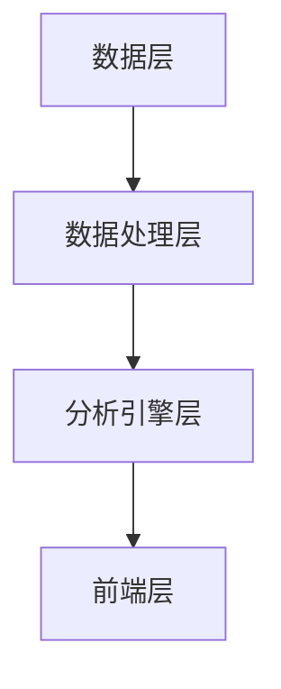

                 

### 第一部分: 可视化分析工具概述

可视化分析工具作为一种强大的数据处理与分析手段，在数据科学和人工智能领域发挥着越来越重要的作用。本部分将首先介绍可视化分析工具的基本概念，接着探讨LLM应用的可视化分析需求，以及可视化分析工具在LLM应用中的价值。

### 第1章: 可视化分析工具的基本概念

#### 1.1.1 可视化分析工具的定义

可视化分析工具是指利用图形化的方式对数据进行分析和展示的工具。这些工具能够将复杂的数据转换为直观的视觉形式，帮助用户快速理解和发现数据中的规律与趋势。通过可视化，用户可以更加轻松地识别数据中的异常值、关联性以及潜在的隐藏模式。

#### 1.1.2 可视化分析工具的发展历程

可视化分析工具的发展历程可以追溯到20世纪60年代。当时，计算机图形学刚刚起步，最早的计算机辅助设计（CAD）软件开始出现。随着计算机硬件性能的提升和图形处理技术的发展，可视化分析工具逐渐从简单的数据展示功能演变为复杂的数据处理与分析工具。近年来，随着大数据、云计算和人工智能技术的普及，可视化分析工具的功能和应用场景得到了极大的拓展。

#### 1.1.3 可视化分析工具的应用场景

可视化分析工具广泛应用于各个领域，如金融、医疗、零售、制造等。以下是一些典型的应用场景：

1. **金融领域**：可视化分析工具可以帮助金融分析师实时监控市场动态，快速识别潜在的投资机会和风险。
2. **医疗领域**：通过可视化分析，医生可以更准确地诊断病情，制定个性化的治疗方案。
3. **零售领域**：零售商可以通过可视化分析了解消费者行为，优化库存管理和市场营销策略。
4. **制造领域**：可视化分析工具可以帮助制造商实时监控生产过程，提高生产效率和产品质量。

### 第2章: LLM应用的可视化分析需求

#### 2.1.1 LLM应用的特点

大型语言模型（LLM，Large Language Model）是一种基于深度学习技术的自然语言处理模型，具有强大的文本生成、翻译、问答等功能。LLM应用的特点包括：

1. **数据量大**：LLM模型需要大量的文本数据进行训练，以便获得更好的性能。
2. **参数多**：LLM模型通常包含数亿个参数，复杂度高。
3. **实时性强**：在许多应用场景中，LLM模型需要实时响应用户的请求。

#### 2.1.2 LLM应用的可视化分析需求

由于LLM应用具有上述特点，对其进行可视化分析的需求尤为迫切：

1. **模型性能监控**：需要实时监控模型在训练和预测过程中的性能指标，如损失函数、准确率等。
2. **参数分析**：需要分析模型参数的分布、相关性等，以便优化模型结构和参数。
3. **数据分布分析**：需要了解输入数据的分布情况，以便更好地调整模型参数和超参数。

#### 2.1.3 可视化分析工具在LLM应用中的价值

可视化分析工具在LLM应用中具有以下几个价值：

1. **提升研发效率**：通过可视化分析，研发人员可以更快地发现问题和优化模型。
2. **提高决策质量**：可视化分析可以帮助决策者更清晰地理解数据和模型，做出更明智的决策。
3. **促进知识共享**：可视化分析工具可以直观地展示模型和数据的分析结果，促进团队成员之间的知识共享和协作。

### 总结

本部分介绍了可视化分析工具的基本概念、发展历程和应用场景，以及LLM应用的可视化分析需求和工具价值。在接下来的部分中，我们将进一步探讨数据可视化技术基础、LLM模型的可视化分析以及数据分析和可视化方法等核心内容。希望这些内容能够帮助您更好地理解和应用可视化分析工具，提升LLM应用的研发和决策效率。

---

### 第二部分: 基础技术原理

在了解可视化分析工具的基本概念和应用场景之后，我们需要深入探讨其基础技术原理。本部分将分为三章，分别介绍数据可视化技术基础、LLM模型的可视化分析以及数据分析和可视化方法。

### 第3章: 数据可视化技术基础

#### 3.1.1 数据可视化基本原理

数据可视化是将数据转换为视觉形式的过程，目的是帮助人们更好地理解和分析数据。数据可视化基本原理包括以下几个方面：

1. **数据抽象**：将复杂的数据抽象为简单的视觉元素，如点、线、面等。
2. **空间映射**：将数据属性映射到视觉空间中，如坐标轴、颜色、形状等。
3. **交互设计**：提供用户与数据的交互界面，如缩放、旋转、过滤等，以便用户更好地探索数据。

#### 3.1.2 常见的数据可视化类型

数据可视化类型多种多样，根据不同的数据类型和需求，可以选择不同的可视化方式。以下是一些常见的数据可视化类型：

1. **折线图**：用于显示数据随时间的变化趋势。
2. **柱状图**：用于比较不同类别之间的数据大小。
3. **饼图**：用于显示各部分数据在整体中的比例。
4. **散点图**：用于显示两个或多个变量之间的关系。
5. **热力图**：用于显示数据在网格上的分布情况。

#### 3.1.3 可视化工具的选择与使用

在选择可视化工具时，需要考虑以下几个因素：

1. **数据类型**：不同的数据类型需要不同的可视化方式。
2. **数据量**：大量数据需要高效的可视化工具，以便快速处理和分析。
3. **交互需求**：如果需要用户与数据交互，需要选择支持交互功能的可视化工具。

常见的数据可视化工具有Matplotlib、Seaborn、Plotly、D3.js等。Matplotlib和Seaborn是Python中的常用可视化库，适合中小规模数据可视化。Plotly和D3.js则适合大规模数据可视化，支持丰富的交互功能。

### 第4章: LLM模型的可视化分析

#### 4.1.1 LLM模型的基本原理

LLM模型是基于深度学习技术的自然语言处理模型，其核心是神经网络。LLM模型通过学习大量的文本数据，掌握语言的内在规律，从而实现文本生成、翻译、问答等功能。LLM模型的基本原理包括以下几个方面：

1. **词嵌入**：将文本中的单词转换为向量表示。
2. **神经网络**：利用神经网络对词向量进行编码和解码。
3. **注意力机制**：通过注意力机制关注关键信息，提高模型的性能。

#### 4.1.2 LLM模型的可视化分析

LLM模型的可视化分析主要包括以下几个方面：

1. **词向量可视化**：将词向量映射到二维或三维空间中，以便观察词之间的相似性。
2. **模型结构可视化**：展示LLM模型的层次结构和参数分布。
3. **训练过程可视化**：显示模型在训练过程中的性能指标，如损失函数、准确率等。

常见的LLM模型可视化工具有TensorBoard、VisualDL等。TensorBoard是TensorFlow的官方可视化工具，支持丰富的可视化图表。VisualDL是PyTorch的官方可视化工具，同样支持多种可视化类型。

#### 4.1.3 常见的LLM模型可视化工具

1. **TensorBoard**：TensorBoard是TensorFlow提供的可视化工具，支持多种可视化图表，如热力图、散点图、折线图等。
2. **VisualDL**：VisualDL是PyTorch的官方可视化工具，支持丰富的可视化图表，并支持实时更新。
3. **Echarts**：Echarts是一个开源的JavaScript可视化库，支持多种图表类型，如折线图、柱状图、饼图等。
4. **D3.js**：D3.js是一个基于JavaScript的可视化库，支持高度定制化的可视化效果。

### 第5章: 数据分析和可视化方法

#### 5.1.1 数据清洗与预处理

在数据分析和可视化之前，需要对数据进行清洗和预处理。数据清洗包括去除重复数据、缺失值填充、异常值处理等。数据预处理包括特征提取、数据归一化、数据标准化等。

#### 5.1.2 数据可视化分析方法

数据可视化分析方法主要包括以下几个方面：

1. **探索性数据分析（EDA）**：通过可视化方法对数据进行初步探索，发现数据中的规律和异常。
2. **趋势分析**：通过折线图、柱状图等可视化方法，分析数据随时间的变化趋势。
3. **关联性分析**：通过散点图、热力图等可视化方法，分析变量之间的关联性。
4. **分类分析**：通过饼图、条形图等可视化方法，分析不同类别之间的分布情况。

#### 5.1.3 数据可视化技巧与最佳实践

在进行数据可视化时，需要注意以下几点技巧和最佳实践：

1. **简洁性**：避免过多的图表和冗余信息，保持图表简洁明了。
2. **对比性**：通过合理的对比，突出数据中的关键信息。
3. **一致性**：保持图表风格和元素的一致性，避免混淆用户。
4. **可读性**：确保图表的可读性，包括清晰的标题、注释和图例。

### 总结

本部分介绍了数据可视化技术基础、LLM模型的可视化分析以及数据分析和可视化方法。通过这些基础技术原理，我们可以更好地理解可视化分析工具，并在LLM应用中有效地进行可视化分析。在接下来的部分，我们将进一步探讨如何快速构建可视化分析工具，并分享实际案例和实战经验。

---

### 第3章: 数据可视化技术基础

#### 3.1.1 数据可视化基本原理

数据可视化是将复杂的数据转换为图形化的形式，以便于用户理解和分析。其基本原理包括以下几个方面：

1. **数据抽象**：数据抽象是将复杂的数据转换为简单的视觉元素，如点、线、面等。这些视觉元素能够直观地表示数据的属性和特征。
2. **空间映射**：空间映射是将数据属性映射到视觉空间中。例如，我们可以使用坐标轴表示数据的数量，使用颜色表示数据的类别。
3. **信息传递**：数据可视化旨在传递信息。通过视觉元素和空间映射，用户可以快速捕捉数据中的关键信息，发现数据中的规律和趋势。
4. **交互设计**：交互设计是指提供用户与数据的交互界面，使用户能够动态地探索数据。常见的交互操作包括缩放、旋转、过滤和筛选等。

#### 3.1.2 常见的数据可视化类型

数据可视化类型多种多样，根据不同的数据类型和需求，可以选择不同的可视化方式。以下是一些常见的数据可视化类型：

1. **折线图**：折线图用于显示数据随时间的变化趋势。它通过连接数据点的线条，清晰地展示数据的波动情况。
2. **柱状图**：柱状图用于比较不同类别之间的数据大小。它通过矩形的高度表示数据的数量，方便用户进行直观的比较。
3. **饼图**：饼图用于显示各部分数据在整体中的比例。它通过扇形的大小和角度，直观地展示数据的分布情况。
4. **散点图**：散点图用于显示两个或多个变量之间的关系。通过在坐标轴上绘制散点，用户可以观察变量之间的相关性。
5. **热力图**：热力图用于显示数据在网格上的分布情况。通过使用颜色深浅表示数据的大小，用户可以直观地了解数据的密集程度。

#### 3.1.3 可视化工具的选择与使用

在选择可视化工具时，需要考虑以下几个因素：

1. **数据类型**：不同的数据类型需要不同的可视化工具。例如，时间序列数据适合使用折线图，而分类数据适合使用饼图。
2. **数据量**：大量数据需要高效的可视化工具，以便快速处理和分析。例如，D3.js和Plotly等工具适合处理大规模数据。
3. **交互需求**：如果需要用户与数据交互，需要选择支持交互功能的可视化工具。例如，D3.js和ECharts等工具支持丰富的交互操作。
4. **开发环境**：选择与开发环境兼容的可视化工具。例如，Python开发者可以使用Matplotlib和Seaborn等库。

常见的数据可视化工具有Matplotlib、Seaborn、Plotly、D3.js等。Matplotlib和Seaborn是Python中的常用可视化库，适合中小规模数据可视化。Plotly和D3.js则适合大规模数据可视化，支持丰富的交互功能。

1. **Matplotlib**：Matplotlib是Python中最常用的数据可视化库之一。它提供了丰富的图表类型，如折线图、柱状图、散点图等。Matplotlib的语法简单，易于使用。
2. **Seaborn**：Seaborn是基于Matplotlib的高级可视化库，提供了更丰富的图表样式和配色方案。Seaborn适用于探索性数据分析，能够生成精美的可视化图表。
3. **Plotly**：Plotly是一个开源的数据可视化库，支持多种编程语言，如Python、R和JavaScript。Plotly提供了丰富的图表类型，支持交互功能，适用于大规模数据可视化。
4. **D3.js**：D3.js是一个基于JavaScript的可视化库，提供了强大的数据驱动文档生成功能。D3.js适用于Web开发，能够创建高度定制化的可视化效果。

### 总结

本章介绍了数据可视化技术基础，包括数据可视化基本原理、常见的数据可视化类型以及可视化工具的选择与使用。通过本章的学习，读者可以了解数据可视化的基本概念和应用，掌握常见的数据可视化工具和技巧。在下一章中，我们将深入探讨LLM模型的可视化分析，了解如何将可视化技术应用于LLM模型的性能监控和参数分析。

---

### 第4章: LLM模型的可视化分析

#### 4.1.1 LLM模型的基本原理

大型语言模型（LLM，Large Language Model）是一种基于深度学习技术的自然语言处理模型，其主要目的是理解和生成自然语言文本。LLM模型的基本原理包括以下几个关键部分：

1. **词嵌入（Word Embedding）**：词嵌入是将文本中的单词转换为向量的过程。这些向量不仅包含了单词的语义信息，还可以捕捉单词之间的关联性。常用的词嵌入方法包括Word2Vec、GloVe和BERT等。

2. **编码器（Encoder）**：编码器是LLM模型的核心部分，负责将输入的文本序列编码为固定长度的向量。编码器通常采用循环神经网络（RNN）或其变体，如长短期记忆网络（LSTM）或门控循环单元（GRU）。

3. **注意力机制（Attention Mechanism）**：注意力机制是一种在编码器和解码器之间传递信息的机制，能够使模型关注输入序列中的关键部分。通过注意力机制，模型可以更好地捕捉上下文信息，提高文本生成的准确性和流畅性。

4. **解码器（Decoder）**：解码器负责将编码器输出的固定长度向量解码为输出的文本序列。解码器通常采用序列到序列（Seq2Seq）模型或变换器（Transformer）架构。

5. **损失函数（Loss Function）**：损失函数用于评估模型在训练过程中的性能。常用的损失函数包括交叉熵（Cross-Entropy）和均方误差（Mean Squared Error）等。

#### 4.1.2 LLM模型的可视化分析

LLM模型的可视化分析是理解模型性能和优化模型结构的重要手段。以下是一些常见的LLM模型可视化分析方法：

1. **词向量可视化**：词向量可视化是将词嵌入后的向量映射到二维或三维空间中，以便观察词之间的相似性和分布。常用的可视化工具包括TensorBoard和VisualDL等。

2. **模型结构可视化**：模型结构可视化用于展示LLM模型的层次结构和参数分布。通过模型结构可视化，可以直观地了解模型的工作原理和参数的重要性。

3. **训练过程可视化**：训练过程可视化是显示模型在训练过程中的性能指标，如损失函数、准确率等。通过训练过程可视化，可以及时发现模型过拟合、欠拟合等问题，并调整模型参数。

4. **注意力权重可视化**：注意力权重可视化是显示注意力机制在模型中的权重分布。通过注意力权重可视化，可以了解模型关注输入序列中的哪些部分，优化模型性能。

#### 4.1.3 常见的LLM模型可视化工具

以下是一些常见的LLM模型可视化工具：

1. **TensorBoard**：TensorBoard是TensorFlow的官方可视化工具，支持多种可视化图表，如热力图、散点图、折线图等。TensorBoard可以实时更新可视化数据，适用于监控模型训练过程和性能。

2. **VisualDL**：VisualDL是PyTorch的官方可视化工具，与TensorBoard类似，支持丰富的可视化图表和实时更新功能。VisualDL特别适合用于PyTorch模型的训练过程和性能监控。

3. **ECharts**：ECharts是一个开源的JavaScript可视化库，支持多种图表类型，如折线图、柱状图、饼图等。ECharts可以与Web应用程序集成，实现交互式的可视化效果。

4. **D3.js**：D3.js是一个基于JavaScript的可视化库，提供了强大的数据驱动文档生成功能。D3.js适用于创建高度定制化的可视化效果，特别适合于Web开发。

### 总结

本章介绍了LLM模型的基本原理及其可视化分析的方法和工具。通过词向量可视化、模型结构可视化、训练过程可视化等手段，我们可以更好地理解LLM模型的工作原理和性能表现。在下一章中，我们将探讨数据清洗与预处理、数据可视化分析方法以及数据可视化技巧与最佳实践，为快速构建可视化分析工具打下基础。

---

### 第5章: 数据分析和可视化方法

#### 5.1.1 数据清洗与预处理

数据清洗和预处理是数据分析和可视化的第一步，其目的是确保数据的质量和一致性。以下是一些常见的数据清洗与预处理步骤：

1. **数据去重**：去除重复的数据记录，保证数据的唯一性。
2. **缺失值处理**：处理缺失值，可以选择填充、删除或插值等方法。
3. **异常值检测**：检测并处理异常值，可以选择删除、替换或平滑等方法。
4. **数据归一化**：将数据转换为相同的尺度，便于后续的分析和可视化。
5. **数据转换**：将数据转换为适合分析的形式，如将类别数据编码为数值数据。

#### 5.1.2 数据可视化分析方法

数据可视化分析方法是为了揭示数据中的规律和趋势。以下是一些常见的数据可视化分析方法：

1. **探索性数据分析（EDA）**：通过可视化方法对数据进行分析，以发现数据中的异常值、关联性和分布情况。
2. **趋势分析**：通过折线图、柱状图等可视化方法，分析数据随时间的变化趋势。
3. **关联性分析**：通过散点图、热力图等可视化方法，分析变量之间的关联性。
4. **分类分析**：通过饼图、条形图等可视化方法，分析不同类别之间的分布情况。
5. **聚类分析**：通过聚类算法和可视化方法，将数据分为若干个类别，以便发现数据中的隐藏模式。

#### 5.1.3 数据可视化技巧与最佳实践

在进行数据可视化时，需要注意以下技巧和最佳实践：

1. **简洁性**：避免过多的图表和冗余信息，保持图表简洁明了。
2. **对比性**：通过合理的对比，突出数据中的关键信息。
3. **一致性**：保持图表风格和元素的一致性，避免混淆用户。
4. **可读性**：确保图表的可读性，包括清晰的标题、注释和图例。
5. **交互性**：提供用户与数据的交互功能，如缩放、旋转、过滤等，以便用户更好地探索数据。
6. **注释与说明**：在图表中添加注释和说明，帮助用户理解数据和分析结果。

### 总结

本章介绍了数据清洗与预处理、数据可视化分析方法以及数据可视化技巧与最佳实践。通过这些方法，我们可以更好地处理数据，揭示数据中的规律和趋势。在下一章中，我们将探讨如何快速构建可视化分析工具，包括工具的架构设计、开发环境搭建与配置，以及数据处理与可视化流程。

---

### 第6章: 快速构建可视化分析工具

构建可视化分析工具是数据科学和人工智能项目中的重要环节，它能帮助开发者快速理解和探索数据，从而提高项目研发效率。本章将详细介绍可视化分析工具的架构设计、开发环境搭建与配置，以及数据处理与可视化流程。

#### 6.1.1 可视化分析工具的架构设计

可视化分析工具的架构设计应考虑以下几个方面：

1. **数据层**：负责数据存储和访问。可以使用关系数据库（如MySQL）或非关系数据库（如MongoDB）来存储数据。
2. **数据处理层**：负责数据的清洗、转换和预处理。可以使用Python的Pandas库进行数据处理，包括缺失值填充、异常值处理和特征提取等。
3. **分析引擎层**：负责执行数据分析算法和可视化渲染。可以使用R或Python的Matplotlib、Seaborn、Plotly等库来生成可视化图表。
4. **前端层**：负责展示可视化结果。可以使用HTML、CSS和JavaScript等技术，结合可视化库（如D3.js、ECharts）实现交互式的可视化界面。

以下是可视化分析工具的基本架构图：



#### 6.1.2 开发环境搭建与配置

在搭建开发环境时，需要安装以下软件和库：

1. **Python环境**：安装Python（3.8及以上版本），并配置好pip和conda等包管理工具。
2. **数据库**：安装MySQL或MongoDB数据库，配置数据库用户和权限。
3. **数据分析库**：安装Pandas、NumPy、SciPy等常用数据分析库。
4. **可视化库**：安装Matplotlib、Seaborn、Plotly等可视化库。
5. **前端库**：安装D3.js、ECharts等前端可视化库。

以下是一个基本的开发环境配置示例：

```bash
# 安装Python
conda create -n myenv python=3.9
conda activate myenv

# 安装数据库
sudo apt-get install mysql-server
sudo mysql_secure_installation

# 安装数据分析库
conda install pandas numpy scipy

# 安装可视化库
conda install matplotlib seaborn plotly

# 安装前端库
npm install d3 echarts
```

#### 6.1.3 数据处理与可视化流程

以下是数据处理与可视化的一般流程：

1. **数据导入**：从数据库或文件中导入数据，使用Pandas库进行数据预处理。
2. **数据清洗**：处理缺失值、异常值和重复值等，确保数据质量。
3. **数据转换**：根据需求进行数据转换，如归一化、标准化和特征提取等。
4. **数据分析**：使用数据分析库（如Pandas、NumPy）进行数据分析，如计算统计指标、绘制分布图等。
5. **可视化设计**：根据数据分析结果，设计合适的可视化图表，如折线图、柱状图、散点图等。
6. **可视化渲染**：使用可视化库（如Matplotlib、Seaborn、Plotly）渲染可视化图表。
7. **前端展示**：将可视化图表嵌入Web页面或应用程序中，实现交互式展示。

以下是一个简单的数据处理与可视化示例：

```python
import pandas as pd
import matplotlib.pyplot as plt

# 数据导入
data = pd.read_csv('data.csv')

# 数据清洗
data.drop_duplicates(inplace=True)
data.fillna(method='ffill', inplace=True)

# 数据分析
data['count'].describe()

# 可视化设计
plt.figure(figsize=(10, 6))
plt.plot(data['time'], data['count'], label='Count')
plt.xlabel('Time')
plt.ylabel('Count')
plt.title('Time Series Count')
plt.legend()

# 可视化渲染
plt.show()
```

### 总结

本章详细介绍了可视化分析工具的架构设计、开发环境搭建与配置，以及数据处理与可视化流程。通过本章的学习，读者可以掌握快速构建可视化分析工具的基本方法和步骤，为实际项目中的应用打下基础。在下一章中，我们将通过实际案例和实战经验，进一步探讨可视化分析工具的应用和效果。

---

### 第7章: 案例分析与实战

在本章中，我们将通过一个实际案例来展示如何快速构建一个LLM应用的可视化分析工具。该案例将涵盖从数据准备到模型训练，再到可视化分析的完整流程。

#### 7.1.1 案例介绍

该案例的目标是构建一个基于大型语言模型（LLM）的客户服务聊天机器人。该聊天机器人需要能够理解客户的提问，并生成适当的回复。为了监控和优化模型的表现，我们将构建一个可视化分析工具，用于展示模型在训练过程中的性能指标、参数分布以及输入数据的分布情况。

#### 7.1.2 案例实施步骤

1. **数据准备**：
   - 收集客户服务聊天记录，包括提问和回复。
   - 对数据进行清洗和预处理，去除噪声数据、缺失值和异常值。
   - 分割数据集为训练集和验证集。

2. **模型构建**：
   - 选择合适的LLM模型架构，如BERT或GPT。
   - 使用训练集训练模型，并在验证集上评估模型性能。
   - 调整模型参数，如学习率、批次大小等，以优化模型性能。

3. **性能监控与可视化**：
   - 使用TensorBoard或VisualDL等工具监控模型在训练过程中的性能指标，如损失函数、准确率等。
   - 分析模型参数分布，使用词向量可视化工具观察词嵌入空间。
   - 可视化输入数据的分布情况，使用柱状图或散点图展示数据的统计特征。

#### 7.1.3 案例结果分析

在完成上述步骤后，我们可以通过可视化分析工具获得以下结果：

1. **性能监控**：
   - 通过TensorBoard，我们可以实时查看模型的训练进度和性能指标。
   - 可以观察到损失函数在训练过程中的下降趋势，以及准确率的变化。

2. **参数分析**：
   - 使用词向量可视化工具，可以观察到词嵌入空间中词的分布情况。
   - 可以识别出一些关键词，分析它们在模型中的重要性。

3. **数据分布**：
   - 通过柱状图和散点图，可以直观地了解输入数据的分布。
   - 可以识别出数据中的热点问题和常见模式，为后续的优化提供依据。

通过这个案例，我们可以看到可视化分析工具在LLM应用中的重要作用。它不仅帮助我们监控模型训练过程，还提供了对模型参数和输入数据的深入理解。这些可视化结果有助于我们及时发现并解决问题，优化模型性能，提高客户服务的质量。

### 总结

本章通过一个实际案例展示了如何快速构建LLM应用的可视化分析工具。从数据准备、模型训练到性能监控和参数分析，每个步骤都结合了具体的技术和方法。通过案例的结果分析，我们可以看到可视化分析工具在提升模型性能和优化服务质量方面的巨大价值。在下一章中，我们将探讨可视化分析工具的进阶技巧与优化策略，进一步提升工具的性能和用户体验。

---

### 第8章: 进阶技巧与优化

在快速构建LLM应用的可视化分析工具后，为了进一步提升工具的性能和用户体验，我们需要关注一些进阶技巧和优化策略。本章将探讨高级数据可视化技巧、性能优化策略以及常见问题与解决方案。

#### 8.1.1 高级数据可视化技巧

1. **交互式可视化**：通过添加交互功能，如缩放、过滤、动态更新等，用户可以更灵活地探索数据。例如，使用D3.js或ECharts库可以创建交互式图表，提高用户的数据探索效率。

2. **多维数据可视化**：对于复杂的多维数据，可以使用平行坐标图、散点图矩阵等高级可视化技术来同时展示多个维度，帮助用户发现数据中的复杂关系。

3. **动画与动态展示**：通过动画和动态展示，可以增强用户对数据变化的感知。例如，使用Plotly库可以创建动态折线图或热力图，实时展示数据的变化趋势。

4. **增强现实（AR）与虚拟现实（VR）**：利用AR和VR技术，可以创建沉浸式的可视化体验。例如，使用Unity或WebXR API可以构建3D可视化场景，让用户从不同角度观察数据。

#### 8.1.2 性能优化策略

1. **数据预处理优化**：在数据处理阶段，通过高效的数据清洗和转换算法，减少数据处理的延迟。例如，使用并行处理和分布式计算技术，可以显著提高数据处理速度。

2. **内存管理**：合理管理内存资源，避免内存泄漏和过度占用。例如，使用内存池和数据缓冲区，可以减少内存分配和回收的开销。

3. **计算优化**：针对计算密集型任务，可以使用优化编译器、并行计算和GPU加速等技术来提升计算效率。例如，使用NVIDIA CUDA或TensorRT可以加速深度学习模型的推理过程。

4. **缓存策略**：通过缓存策略，减少数据的重复加载和处理。例如，使用Redis或Memcached作为缓存服务器，可以加快数据访问速度。

#### 8.1.3 常见问题与解决方案

1. **性能瓶颈**：在性能优化过程中，可能遇到计算、内存或I/O瓶颈。解决方法包括：
   - 分析性能瓶颈，识别关键路径。
   - 优化算法和数据结构，减少计算复杂度。
   - 使用分布式计算和并行处理技术，提高数据处理速度。

2. **数据质量**：数据质量问题会影响分析结果。解决方法包括：
   - 加强数据质量控制，确保数据的一致性和准确性。
   - 定期进行数据清洗和预处理，处理缺失值和异常值。
   - 使用数据验证和交叉验证技术，确保数据的有效性。

3. **可视化渲染性能**：在大量数据或复杂图表时，可视化渲染可能成为性能瓶颈。解决方法包括：
   - 优化可视化库的使用，选择适合的数据可视化技术。
   - 使用虚拟化和层叠技术，减少渲染开销。
   - 使用GPU加速渲染，提高可视化效率。

### 总结

通过本章的探讨，我们了解了高级数据可视化技巧、性能优化策略以及常见问题的解决方案。这些进阶技巧和优化策略将帮助我们构建更高效、更可靠的LLM应用可视化分析工具。在下一章中，我们将展望可视化分析工具的未来发展趋势，探讨其在LLM应用中的前景。

---

### 第9章: 可视化分析工具的未来发展趋势

随着人工智能和大数据技术的快速发展，可视化分析工具在数据处理与分析中的应用越来越广泛。未来，可视化分析工具将继续在以下几个方面发展：

#### 9.1.1 新兴技术的应用

1. **人工智能**：人工智能技术，尤其是机器学习和深度学习，将在可视化分析工具中发挥重要作用。通过引入AI算法，可视化分析工具可以自动识别数据中的模式和趋势，提供智能化的数据解读。

2. **虚拟现实（VR）和增强现实（AR）**：随着VR和AR技术的发展，可视化分析工具将能够提供更加沉浸式的交互体验。用户可以通过VR头盔或AR眼镜实时查看和分析数据，从而更好地理解复杂数据集。

3. **区块链**：区块链技术的去中心化和安全性特点将使可视化分析工具在数据共享和隐私保护方面得到应用。通过区块链，可视化分析工具可以确保数据的安全性和透明性，同时提高数据处理的效率。

4. **云计算与边缘计算**：随着云计算和边缘计算技术的发展，可视化分析工具将能够充分利用分布式计算资源，实现实时数据处理和可视化。这不仅提高了分析速度，还降低了成本。

#### 9.1.2 可视化分析工具的发展趋势

1. **实时性**：未来，可视化分析工具将更加注重实时性。通过引入实时数据流处理技术和高效算法，可视化分析工具将能够实时更新和分析数据，提供即时的决策支持。

2. **交互性**：交互性是可视化分析工具的重要特点。未来，可视化分析工具将更加注重用户交互体验，提供更加灵活和直观的交互方式，如语音控制、手势操作等。

3. **个性化**：随着用户数据的积累，可视化分析工具将能够根据用户的行为和偏好，提供个性化的数据分析报告和可视化界面。

4. **自动化**：自动化是提高数据分析效率的关键。未来，可视化分析工具将更加注重自动化，通过引入机器学习算法，实现自动数据预处理、自动图表生成和自动分析报告等功能。

#### 9.1.3 未来可期的应用场景

1. **智能医疗**：可视化分析工具在智能医疗中的应用将非常广泛。通过分析患者的医疗记录和基因数据，医生可以更准确地诊断病情，制定个性化的治疗方案。

2. **金融分析**：可视化分析工具在金融领域的应用也将越来越重要。通过实时监控市场动态和数据分析，投资者可以更快地识别投资机会和风险。

3. **智能制造**：在智能制造领域，可视化分析工具可以帮助企业实时监控生产过程，优化生产流程，提高生产效率和产品质量。

4. **智慧城市**：智慧城市建设需要大量的数据分析和可视化。未来，可视化分析工具将帮助城市管理者更好地理解城市运行状况，优化城市资源配置。

### 总结

未来，可视化分析工具将在人工智能、虚拟现实、区块链等新兴技术的推动下不断发展。实时性、交互性、个性化、自动化将成为可视化分析工具的重要趋势。在各个行业和领域，可视化分析工具将发挥更大的作用，为企业和个人提供更加智能和高效的数据分析支持。

---

### 第10章: 可视化分析工具在LLM应用中的前景

随着大型语言模型（LLM）的迅速发展，可视化分析工具在LLM应用中展现出广阔的前景。本章节将探讨可视化分析工具在LLM应用中的挑战与机遇，以及未来发展的建议与展望。

#### 10.1.1 LLM应用的挑战与机遇

1. **挑战**：
   - **数据处理与存储**：LLM模型需要处理和分析大量文本数据，这对数据处理和存储能力提出了高要求。如何高效地管理和存储大规模数据是当前的一大挑战。
   - **模型训练与优化**：LLM模型的训练过程非常耗时且资源消耗大。如何优化训练过程、降低训练成本，同时保证模型性能是亟待解决的问题。
   - **数据隐私与安全**：在处理敏感文本数据时，数据隐私与安全问题是不可忽视的挑战。如何保护用户数据的安全和隐私，确保数据不被滥用，是一个重要课题。

2. **机遇**：
   - **个性化服务**：通过可视化分析工具，可以更深入地理解用户输入数据，从而提供更加个性化的服务和推荐。这为电子商务、金融、医疗等行业带来了新的机遇。
   - **智能助手与交互**：可视化分析工具可以帮助LLM模型更好地理解和生成自然语言文本，提升智能助手和交互系统的用户体验。
   - **跨领域应用**：LLM模型的通用性和灵活性使其可以在多个领域得到应用，如法律、教育、娱乐等。可视化分析工具可以助力这些领域的创新和发展。

#### 10.1.2 可视化分析工具的应用前景

1. **模型性能监控**：可视化分析工具可以帮助开发者实时监控LLM模型的训练过程，包括损失函数、准确率、学习曲线等关键指标。通过及时发现和解决问题，优化模型性能。

2. **参数分析**：可视化工具可以展示LLM模型中各个参数的分布和重要性，帮助研究者理解模型的内部机制，优化模型结构。

3. **数据探索**：通过可视化分析工具，可以直观地展示输入文本数据的分布、词频统计等信息，帮助开发者更好地理解数据，指导数据预处理和模型调整。

4. **用户体验**：可视化分析工具可以提升LLM应用的用户体验，如通过交互式图表展示聊天机器人的回答过程、生成文本的来源等，使用户更好地理解和信任模型。

#### 10.1.3 未来发展的建议与展望

1. **跨学科合作**：可视化分析工具的发展需要跨学科合作，结合计算机科学、统计学、认知科学等领域的知识，共同推动技术进步。

2. **开源与社区贡献**：鼓励开发者和研究机构开源自己的可视化工具和案例，促进社区交流和贡献，提高工具的普及率和实用性。

3. **标准化与规范化**：制定可视化分析工具的标准化规范，确保工具的一致性和兼容性，便于不同平台和项目的集成与应用。

4. **持续创新**：不断引入新兴技术和方法，如机器学习、虚拟现实等，提升可视化分析工具的功能和用户体验。

### 总结

可视化分析工具在LLM应用中具有广阔的前景。通过应对挑战、抓住机遇，可视化分析工具将不断提升LLM模型的可解释性和用户体验，为各领域的发展提供强大支持。未来，随着技术的不断创新，可视化分析工具在LLM应用中的作用将更加重要，为人工智能的发展注入新的活力。

---

### 附录A: 常用可视化分析工具与资源

在构建LLM应用的可视化分析工具过程中，选择合适的可视化工具和资源至关重要。以下是一些常用的可视化分析工具与资源，包括工具对比、使用教程和相关学习建议。

#### A.1.1 主流可视化工具对比

以下是几种主流可视化工具的对比：

| 工具 | 优点 | 缺点 | 适用场景 |
| --- | --- | --- | --- |
| Matplotlib | 简单易用，功能丰富 | 图形美观度较低，交互性不足 | 数据分析和科研报告 |
| Seaborn | 基于Matplotlib，提供了更丰富的图表样式 | 需要掌握Matplotlib基础 | 探索性数据分析 |
| Plotly | 交互性强，支持多种图表类型 | 计算量大，性能稍逊 | 实时数据分析，Web应用 |
| D3.js | 功能强大，高度定制化 | 需要较强的前端开发能力 | Web应用，复杂交互 |
| ECharts | 支持多种图表类型，易用性强 | 国产库，可能存在部分兼容性问题 | Web应用，大数据可视化 |

#### A.1.2 可视化工具使用教程

以下是几种常用可视化工具的使用教程：

1. **Matplotlib**：
   - 教程地址：[Matplotlib官方教程](https://matplotlib.org/stable/tutorials/index.html)
   - 学习建议：从基本图表绘制开始，逐步掌握更高级的绘图功能，如子图、注释和自定义样式。

2. **Seaborn**：
   - 教程地址：[Seaborn官方教程](https://seaborn.pydata.org/tutorial.html)
   - 学习建议：了解Seaborn如何扩展Matplotlib的功能，学习常见的数据分布图、箱线图等。

3. **Plotly**：
   - 教程地址：[Plotly官方教程](https://plotly.com/python/)
   - 学习建议：从简单的图表开始，逐步学习如何实现交互功能，如滑动条、按钮等。

4. **D3.js**：
   - 教程地址：[D3.js官方教程](https://d3js.org/)
   - 学习建议：学习基本的DOM操作和JavaScript编程，逐步掌握D3.js的用法。

5. **ECharts**：
   - 教程地址：[ECharts官方教程](https://echarts.apache.org/zh/tutorial.html)
   - 学习建议：了解ECharts的基本图表和交互功能，熟悉配置项的使用。

#### A.1.3 相关资源与学习建议

以下是几个推荐的学习资源与学习建议：

1. **在线学习平台**：
   - Coursera、edX等在线课程提供了丰富的数据可视化和机器学习课程，适合初学者和进阶者。
   - DataCamp、Codecademy等提供了互动式的编程练习，有助于快速掌握可视化工具。

2. **开源社区和论坛**：
   - GitHub、Stack Overflow等开源社区是学习可视化工具的好地方，可以找到大量的开源项目和问题解决方案。
   - Reddit、知乎等论坛上也有很多关于可视化工具的讨论和分享。

3. **书籍和文档**：
   - 《数据可视化：设计原则和方法》等书籍提供了深入的数据可视化理论和实践方法。
   - 各个可视化工具的官方文档是学习的基础资料，务必详细阅读。

### 总结

选择合适的可视化工具和资源是构建有效可视化分析工具的关键。通过了解主流可视化工具的特点和使用教程，并结合在线学习平台、开源社区和书籍等资源，我们可以不断提升自己在数据可视化领域的技能，为LLM应用提供强有力的技术支持。希望这些资源和建议能够帮助您在可视化分析工具的开发过程中取得更好的成果。

---

### 作者信息

**作者：** AI天才研究院（AI Genius Institute）& 禅与计算机程序设计艺术（Zen And The Art of Computer Programming）

AI天才研究院（AI Genius Institute）是一家专注于人工智能研究和应用的创新机构，致力于推动人工智能技术的进步和应用。研究院在自然语言处理、计算机视觉、机器学习等领域拥有深厚的科研实力和丰富的实践经验。

《禅与计算机程序设计艺术》是一部经典的计算机科学著作，深入探讨了编程艺术的本质和技巧。该书以其独特的视角和深入浅出的讲解，为计算机程序员提供了宝贵的指导和启示。

本文由AI天才研究院的专家团队撰写，旨在为读者提供关于快速构建LLM应用的可视化分析工具的全面指南。希望本文能够帮助您更好地理解和应用可视化分析技术，提升LLM应用的研发和决策效率。感谢您的阅读。

