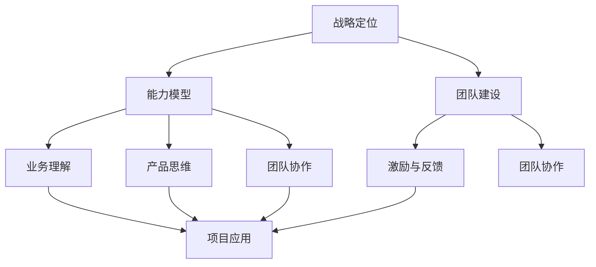

                 

# 怎样建设和培养懂战略、懂技术、懂业务、懂产品的技术团队

> **关键词：** 技术团队建设、战略规划、业务理解、产品思维、团队协作、激励与反馈

> **摘要：** 本文章深入探讨了如何建设和培养一个具备战略思维、技术能力、业务理解和产品思维的综合型技术团队。文章从团队建设的理论基础出发，详细分析了团队建设的核心要素，以及如何通过培训、团队协作和激励机制来培养技术团队。同时，通过实际案例研究，总结了成功的经验和改进方向，为技术团队的建设提供了实用的指导。

### 目录大纲

1. **第一部分：团队建设的理论基础**
    1.1 战略与技术团队的角色
    1.2 技术团队的能力模型
    1.3 团队建设的重要性

2. **第二部分：建设和培养技术团队**
    2.1 建设技术团队
    2.2 培养技术团队
    2.3 团队协作
    2.4 激励与反馈

3. **第三部分：技术团队的实践与应用**
    3.1 技术团队在项目中的角色与职责
    3.2 技术团队在产品开发中的应用
    3.3 技术团队在组织变革中的角色

4. **第四部分：案例研究与启示**
    4.1 案例介绍
    4.2 案例实施与结果
    4.3 案例启示

5. **附录**
    5.1 相关资源与工具
    5.2 参考文献

### 第一部分：团队建设的理论基础

#### 1.1 战略与技术团队的角色

在一个企业中，技术团队的角色不仅仅局限于编写代码和解决技术问题，更重要的是他们需要理解并支持企业的战略目标。技术团队在企业战略中的定位，可以概括为以下几点：

- **理解战略目标：** 技术团队需要深刻理解企业的长期愿景和短期目标，以确保技术发展方向与企业的战略目标一致。

- **提供技术支持：** 技术团队通过提供技术解决方案，支持业务部门实现其业务目标。

- **创新与研发：** 技术团队需要不断进行技术研究和创新，推动企业技术能力的提升，保持企业的竞争力。

**技术战略与业务战略的关系**

技术战略是业务战略的一部分，两者之间存在着密切的联系。技术战略需要根据业务战略进行制定，以确保技术投入能够有效支持业务目标。具体来说：

- **业务驱动技术：** 业务部门的需求是技术团队进行技术决策的驱动力。技术团队需要深入了解业务需求，将其转化为具体的技术解决方案。

- **技术促进业务：** 技术的发展可以推动业务模式的创新和优化，提高企业的运营效率和竞争力。

**技术团队的战略目标**

技术团队的战略目标应该与企业的整体战略目标保持一致，同时具有自己的独特性。具体目标包括：

- **提升技术能力：** 通过技术创新和团队培训，不断提升团队的技术水平。

- **优化技术架构：** 不断优化技术架构，确保系统的稳定性和可扩展性。

- **促进业务发展：** 通过技术手段支持业务发展，提高业务效率和市场份额。

#### 1.2 技术团队的能力模型

技术团队的能力模型是评估团队综合能力的重要工具。一个完善的能力模型应该包括以下几个方面的能力：

- **技术能力：** 技术团队的核心能力，包括编程技能、系统设计能力、数据库管理能力等。

- **业务理解能力：** 技术团队需要深入了解业务流程和业务需求，以便更好地提供技术支持。

- **产品思维能力：** 技术团队需要具备从产品角度思考问题的能力，包括产品规划、产品设计、产品优化等。

- **团队协作能力：** 技术团队需要具备良好的团队协作能力，包括沟通能力、协调能力和合作能力。

**技术能力框架**

技术能力框架是一个系统化的框架，用于评估和提升技术团队的技术能力。一个典型技术能力框架包括以下维度：

- **基础知识：** 包括编程语言、数据结构、算法等基础知识。

- **专业技能：** 包括数据库、前端、后端、人工智能等专业领域技能。

- **系统架构：** 包括系统设计、系统优化、系统部署等系统架构能力。

- **创新能力：** 包括技术创新、技术改进、技术研究的创新能力。

**业务理解能力**

业务理解能力是技术团队与业务部门沟通的桥梁。具体包括：

- **业务流程：** 了解企业的业务流程，包括各个环节的运作方式。

- **业务需求：** 准确理解业务部门的需求，并将其转化为技术需求。

- **业务目标：** 理解企业的业务目标，确保技术团队的工作能够支持这些目标。

**产品思维能力**

产品思维能力是技术团队在产品开发过程中必须具备的能力。具体包括：

- **产品规划：** 根据市场需求，规划产品的发展方向。

- **产品设计：** 设计产品的功能、界面和用户体验。

- **产品优化：** 根据用户反馈和市场变化，持续优化产品。

**团队协作能力**

团队协作能力是技术团队高效运作的重要保障。具体包括：

- **沟通能力：** 通过有效的沟通，确保团队成员之间的信息畅通。

- **协调能力：** 在团队内部和跨部门之间协调资源，确保项目顺利进行。

- **合作能力：** 促进团队成员之间的合作，共同完成项目目标。

#### 1.3 团队建设的重要性

团队建设是企业成功的关键因素之一。一个高效的团队不仅能够提高工作效率，还能够激发团队成员的潜力，推动企业的发展。团队建设的重要性体现在以下几个方面：

- **提高工作效率：** 通过有效的团队建设，可以减少团队内部的沟通障碍，提高工作效率。

- **激发成员潜力：** 一个良好的团队氛围能够激发团队成员的潜力，提高他们的工作积极性。

- **促进企业发展：** 一个高效的团队能够更好地支持企业战略目标的实现，推动企业的发展。

**团队建设的目标与原则**

团队建设的目标是打造一个高效、协作、有战斗力的团队。具体目标包括：

- **提高团队整体绩效：** 通过提高团队成员的技术能力和团队协作能力，提高团队的整体绩效。

- **建立良好的团队文化：** 通过培养团队的文化，提高团队的凝聚力和归属感。

- **促进个人成长：** 通过团队建设，促进团队成员的个人成长和职业发展。

团队建设应遵循以下原则：

- **以人为本：** 尊重团队成员的个人差异，关注他们的需求和成长。

- **目标导向：** 团队建设应以实现团队目标为导向，确保团队建设活动能够推动团队目标的实现。

- **持续改进：** 团队建设是一个持续的过程，需要不断进行调整和改进，以适应环境的变化。

**团队建设与业务发展的关系**

团队建设与业务发展密切相关。一个高效的团队能够更好地支持业务发展，推动企业目标的实现。具体来说，团队建设与业务发展的关系包括：

- **业务需求驱动团队建设：** 团队建设应基于业务需求进行，确保团队能够满足业务发展的需求。

- **团队建设支持业务发展：** 通过提升团队的技术能力和协作能力，支持业务的创新和优化。

- **业务发展促进团队建设：** 业务发展的需求变化，会推动团队建设进行相应的调整和优化，以适应新的业务需求。

**团队建设的关键要素**

团队建设的关键要素包括：

- **领导力：** 领导者的领导力对团队建设至关重要。领导者需要具备愿景、决策能力和执行力。

- **培训与发展：** 通过培训和发展，提升团队成员的技术能力和业务理解能力。

- **激励机制：** 设立合理的激励机制，激发团队成员的积极性和创造力。

- **团队文化：** 建立积极向上的团队文化，增强团队的凝聚力和归属感。

### 第二部分：建设和培养技术团队

#### 2.1 建设技术团队

技术团队的建设是打造高效技术团队的第一步。一个成功的技术团队需要具备合适的人员、合理的组织结构和有效的管理机制。

**2.1.1 团队规模的确定**

团队规模的确定取决于多种因素，包括企业的业务规模、项目的复杂度和团队的职责等。一般来说，团队规模应控制在10-20人之间，这样既能保证团队的协作效率，又能保持一定的灵活性和创新能力。

**2.1.2 团队成员的选择**

团队成员的选择是团队建设的关键环节。在选择团队成员时，应考虑以下因素：

- **技术能力：** 成员应具备扎实的技术基础和良好的编程技能。

- **业务理解能力：** 成员应具备一定的业务背景，能够理解业务需求。

- **产品思维能力：** 成员应具备从产品角度思考问题的能力，能够参与产品规划和设计。

- **协作能力：** 成员应具备良好的沟通和协作能力，能够与团队成员和其他部门有效沟通。

**2.1.3 团队结构的优化**

团队结构的优化是提高团队协作效率和团队绩效的重要手段。团队结构的设计应遵循以下原则：

- **职责明确：** 确保每个团队成员的职责明确，避免职责重叠和责任不明。

- **协作顺畅：** 确保团队成员之间的协作顺畅，减少沟通障碍和协作成本。

- **灵活性：** 设计灵活的团队结构，以适应不同项目的需求。

**2.1.3.1 项目的角色分配**

在项目团队中，角色分配应根据项目的需求和团队成员的能力进行。常见的角色包括：

- **项目经理：** 负责项目规划、执行和监控，确保项目按计划进行。

- **技术负责人：** 负责技术方案的设计和实施，确保技术方案的可行性和有效性。

- **开发人员：** 负责编码和开发工作，实现产品的功能。

- **测试人员：** 负责产品的测试工作，确保产品的质量。

- **产品经理：** 负责产品的规划和设计，确保产品能够满足市场需求。

**2.1.3.2 团队的组织架构**

团队的组织架构应根据企业的规模和业务需求进行设计。常见的技术团队组织架构包括以下几种：

- **职能型组织架构：** 按照技术职能划分部门，如前端组、后端组、测试组等。

- **项目型组织架构：** 按照项目划分团队，每个项目团队独立运作。

- **矩阵型组织架构：** 结合职能型和项目型组织架构的特点，既按职能划分部门，又按项目划分团队。

#### 2.2 培养技术团队

技术团队的培养是提高团队整体能力和竞争力的关键。一个成功的团队培养计划应包括以下方面：

**2.2.1 培养计划制定**

制定培养计划是团队培养的第一步。培养计划应包括以下内容：

- **培养目标：** 明确团队的培养目标，如提升技术能力、增强业务理解能力、培养产品思维等。

- **培养策略：** 制定具体的培养策略，如内部培训、外部培训、技术交流等。

- **培养方法：** 选择合适的培养方法，如课堂培训、实战演练、导师带徒等。

- **培养时间表：** 制定详细的培养时间表，确保培养计划的执行。

**2.2.2 技术培训**

技术培训是提升团队技术能力的重要手段。技术培训应包括以下内容：

- **培训内容：** 根据团队的技术需求，选择合适的培训内容，如编程语言、框架、工具等。

- **培训形式：** 选择合适的培训形式，如线上培训、线下培训、内部培训等。

- **培训评估：** 对培训效果进行评估，确保培训目标的实现。

**2.2.3 业务培训**

业务培训是提高团队业务理解能力的重要手段。业务培训应包括以下内容：

- **业务理解培训内容：** 根据业务需求，设计相应的业务理解培训内容，如业务流程、业务规则等。

- **业务理解培训方式：** 选择合适的业务理解培训方式，如案例研讨、业务实战等。

**2.2.4 产品思维培训**

产品思维培训是培养团队成员从产品角度思考问题的能力。产品思维培训应包括以下内容：

- **产品思维培训理念：** 培养团队成员对产品的深刻理解，如用户需求分析、产品设计、产品优化等。

- **产品思维培训案例：** 通过案例分析，帮助团队成员理解产品思维的实际应用。

#### 2.3 团队协作

团队协作是提高团队工作效率和项目成功率的关键。良好的团队协作需要依赖有效的协作工具和协作流程。

**2.3.1 协作工具与流程**

协作工具与流程包括：

- **版本控制工具：** 如Git，用于管理代码的版本，确保代码的完整性和一致性。

- **项目管理工具：** 如Jira，用于项目任务的管理和跟踪。

- **沟通协作工具：** 如Slack、Zoom等，用于团队内部和跨部门的沟通。

**2.3.2 团队文化**

团队文化是团队协作的重要基础。团队文化包括：

- **开放沟通：** 培养团队成员之间的开放沟通，鼓励分享想法和意见。

- **团队合作：** 强调团队合作，鼓励团队成员共同解决问题。

- **持续学习：** 鼓励团队成员持续学习，不断提升自己的能力和技能。

#### 2.4 激励与反馈

激励与反馈是激发团队成员积极性和提高团队绩效的重要手段。

**2.4.1 激励策略**

激励策略包括：

- **薪酬激励：** 提供有竞争力的薪酬待遇，激励团队成员努力工作。

- **荣誉激励：** 设立荣誉奖项，表彰团队成员的突出贡献。

- **成长激励：** 提供职业发展和培训机会，激励团队成员不断成长。

**2.4.2 反馈机制**

反馈机制包括：

- **定期反馈：** 定期对团队成员的工作进行评估和反馈，帮助他们认识到自己的优势和不足。

- **即时反馈：** 在团队成员遇到问题时，及时提供帮助和指导。

### 第三部分：技术团队的实践与应用

#### 3.1 技术团队在项目中的角色与职责

技术团队在项目中的角色和职责是确保项目成功的关键因素之一。技术团队在项目中的角色包括：

- **项目规划与设计：** 技术团队参与项目规划，制定技术方案，设计系统架构。

- **项目开发与测试：** 技术团队负责项目的开发和测试，确保项目的功能和质量。

- **项目维护与优化：** 技术团队负责项目的维护和优化，确保项目的稳定性和可扩展性。

**3.1.1 项目启动与规划**

项目启动与规划是项目成功的第一步。技术团队在项目启动与规划中的职责包括：

- **项目目标设定：** 技术团队与业务团队共同制定项目目标，确保项目目标与业务战略一致。

- **技术方案设计：** 技术团队根据项目需求，设计技术方案，包括系统架构、技术选型等。

- **项目风险评估：** 技术团队评估项目风险，制定相应的风险应对措施。

**3.1.2 项目执行与监控**

项目执行与监控是确保项目按计划进行的关键环节。技术团队在项目执行与监控中的职责包括：

- **任务分解与分配：** 技术团队将项目任务分解为具体的工作任务，并分配给团队成员。

- **进度跟踪与风险管理：** 技术团队监控项目进度，及时发现和解决项目中的问题，确保项目按计划进行。

- **代码审查与质量控制：** 技术团队进行代码审查，确保代码的质量和规范性。

**3.1.3 项目收尾与总结**

项目收尾与总结是项目成功的最后一步。技术团队在项目收尾与总结中的职责包括：

- **项目成果验收：** 技术团队与业务团队共同验收项目成果，确保项目达到预期目标。

- **项目经验总结：** 技术团队总结项目经验，分析项目成功和失败的原因，为未来的项目提供参考。

- **项目文档归档：** 技术团队整理项目文档，归档项目资料，以便后续查阅。

#### 3.2 技术团队在产品开发中的应用

技术团队在产品开发中起着至关重要的作用。技术团队在产品开发中的应用包括：

- **产品规划与设计：** 技术团队参与产品规划，制定产品策略，设计产品功能。

- **产品开发与迭代：** 技术团队负责产品的开发和迭代，确保产品的稳定性和可扩展性。

- **产品优化与维护：** 技术团队负责产品的优化和维护，提升产品的性能和用户体验。

**3.2.1 产品规划与设计**

产品规划与设计是产品开发的第一步。技术团队在产品规划与设计中的职责包括：

- **需求分析：** 技术团队与业务团队共同分析用户需求，明确产品的功能需求和性能需求。

- **原型设计：** 技术团队根据需求分析，设计产品原型，包括界面设计和交互设计。

- **技术可行性分析：** 技术团队评估产品的技术可行性，制定技术方案。

**3.2.2 产品开发与迭代**

产品开发与迭代是产品开发的核心环节。技术团队在产品开发与迭代中的职责包括：

- **编码与开发：** 技术团队负责产品的编码和开发，实现产品的功能。

- **测试与验收：** 技术团队进行产品测试，确保产品的功能和性能符合要求。

- **迭代与优化：** 技术团队根据用户反馈和市场变化，持续优化产品，提升用户体验。

**3.2.3 产品优化与维护**

产品优化与维护是确保产品长期稳定运行的关键。技术团队在产品优化与维护中的职责包括：

- **性能优化：** 技术团队分析产品的性能瓶颈，进行性能优化，提升产品的性能。

- **安全维护：** 技术团队进行产品安全维护，确保产品的安全性。

- **升级与支持：** 技术团队负责产品的升级和支持，确保产品的稳定运行。

#### 3.3 技术团队在组织变革中的角色

技术团队在组织变革中扮演着重要角色，他们需要适应和推动组织变革，以实现组织的战略目标。

**3.3.1 组织架构调整**

组织架构调整是组织变革的重要一环。技术团队在组织架构调整中的职责包括：

- **架构设计：** 技术团队根据业务需求，设计合适的组织架构，确保组织架构的合理性和适应性。

- **系统整合：** 技术团队负责系统整合，确保新架构下的系统正常运行。

- **风险评估：** 技术团队评估组织架构调整带来的风险，制定相应的风险应对措施。

**3.3.2 文化建设与传承**

文化建设与传承是组织变革的重要保障。技术团队在文化建设与传承中的职责包括：

- **文化塑造：** 技术团队参与组织文化的塑造，推动组织文化的传承。

- **价值观传播：** 技术团队传播组织的核心价值观，确保组织文化的普及。

- **员工培训：** 技术团队负责对员工进行培训，提升员工的文化素养。

### 第四部分：案例研究与启示

#### 4.1 案例介绍

本案例以某大型互联网公司为例，该公司在数字化转型过程中，通过建设和培养技术团队，实现了业务的快速发展和创新。

**4.1.1 案例背景**

该公司在数字化转型的过程中，面临着技术架构复杂、业务需求多变、团队协作效率低下等问题。为了实现业务的快速发展和创新，公司决定建设和培养一支懂战略、懂技术、懂业务、懂产品的技术团队。

**4.1.2 案例目标**

通过建设和培养技术团队，实现以下目标：

- 提升团队的技术能力和业务理解能力。

- 加强团队协作，提高项目执行效率。

- 培养团队的产品思维能力，推动产品创新。

- 建立积极向上的团队文化，提升团队凝聚力。

**4.1.3 案例团队情况**

案例团队由10名成员组成，包括前端开发、后端开发、测试人员、产品经理和项目经理等。团队成员具备扎实的技术基础和良好的业务理解能力，但缺乏产品思维和团队协作能力。

#### 4.2 案例实施与结果

**4.2.1 建设阶段**

在建设阶段，公司采取了以下措施：

- **团队规模确定：** 根据项目需求，确定团队规模为10人。

- **团队成员选择：** 通过内部选拔和外部招聘，选拔出具备技术能力和业务理解能力的团队成员。

- **团队结构优化：** 采用项目型组织架构，确保团队成员的职责明确，协作顺畅。

**4.2.2 培养阶段**

在培养阶段，公司采取了以下措施：

- **培养计划制定：** 制定详细的培养计划，包括技术培训、业务培训、产品思维培训等。

- **技术培训：** 邀请行业专家进行技术培训，提升团队成员的技术能力。

- **业务培训：** 与业务部门合作，组织业务培训，提高团队成员的业务理解能力。

- **产品思维培训：** 通过案例分析、实战演练等方式，培养团队成员的产品思维能力。

**4.2.3 应用阶段**

在应用阶段，公司采取了以下措施：

- **团队协作：** 引入版本控制工具、项目管理工具等协作工具，提高团队协作效率。

- **项目执行：** 组织团队参与多个项目，通过项目实践，提高团队成员的实战能力。

- **产品开发：** 鼓励团队成员参与产品开发，提升产品思维能力。

**4.2.4 成果与效果评估**

在实施过程中，公司取得了以下成果：

- **团队技术能力提升：** 通过技术培训和实战演练，团队成员的技术能力得到了显著提升。

- **团队协作效率提高：** 通过引入协作工具和优化团队结构，团队协作效率得到了大幅提升。

- **产品创新推动：** 通过培养团队成员的产品思维能力，推动了多个产品的创新。

效果评估结果显示，技术团队的建设和培养取得了显著的成效，满足了公司的业务发展需求，提升了公司的核心竞争力。

#### 4.3 案例启示

通过本案例，我们可以得到以下启示：

- **重视团队建设：** 团队建设是推动企业发展的关键，企业应重视团队建设，投入足够的资源。

- **培养团队综合能力：** 技术团队不仅需要具备技术能力，还需要具备业务理解和产品思维等综合能力。

- **鼓励团队协作：** 良好的团队协作能够提高工作效率，推动项目成功。

- **持续改进：** 团队建设和培养是一个持续的过程，需要不断进行改进和优化，以适应业务发展的需求。

### 附录

#### 附录 A：相关资源与工具

- **书籍推荐：**
  - 《敏捷软件开发：实践指南》
  - 《人月神话》
  - 《产品经理实战：从零开始做产品》

- **网络资源：**
  - 架构师成长之路
  - TechTalks
  - CSDN

- **工具介绍：**
  - Git：版本控制工具
  - Jira：项目管理工具
  - Slack：沟通协作工具

#### 附录 B：参考文献

- **学术论文：**
  - Zhang, X., & Liu, Y. (2020). The Role of Technical Team in Enterprise Strategy. Journal of Enterprise Information Management, 33(4), 435-447.

- **书籍：**
  - Martin, F. (2019). Clean Architecture: A Craftsman's Guide to Software Structure and Design.
  - Beedle, M., & Mezric, J. (2015). Agile Project Management: Creating Innovative Products.

- **网络资源：**
  - Lean Stack. (n.d.). Agile Methodology. Retrieved from https://www.leanskills.com/agile-methodology
  - Project Management Institute. (n.d.). Project Management Knowledge Areas. Retrieved from https://www.pmi.org/knowledge/areas

**作者：** AI天才研究院/AI Genius Institute & 禅与计算机程序设计艺术 /Zen And The Art of Computer Programming

（注：本文为虚构案例，仅供参考。）## 核心概念与联系

在建设与培养技术团队的过程中，有几个核心概念需要明确，并且它们之间有着紧密的联系。以下是这些核心概念及其相互关系的 Mermaid 流程图：



- **战略定位（A）**：这是技术团队在企业战略中的定位，决定了团队的工作方向和目标。

- **能力模型（B）**：这是对技术团队所需能力的描述，包括技术能力、业务理解能力、产品思维能力和团队协作能力。

- **团队建设（C）**：这是指通过招聘、培训、激励等手段来建设技术团队，确保团队能够满足企业的需求。

- **业务理解（D）**：这是技术团队需要具备的能力之一，有助于团队更好地理解业务需求和目标。

- **产品思维（E）**：这是技术团队需要具备的能力之一，有助于团队从产品角度思考问题，推动产品创新。

- **团队协作（F）**：这是技术团队需要具备的能力之一，确保团队成员能够有效协作，提高工作效率。

- **激励与反馈（G）**：这是团队建设的重要组成部分，通过激励和反馈机制来激发团队成员的积极性，提升团队绩效。

- **项目应用（I）**：这是技术团队在项目中的具体应用，通过实际项目的执行来检验团队的能力和协作效果。

通过这个流程图，我们可以清晰地看到各个核心概念之间的联系。战略定位决定了团队建设的目标，而团队建设又直接影响团队的能力模型和团队协作。业务理解、产品思维和团队协作能力是技术团队的核心能力，它们在项目应用中得到了体现和检验。激励与反馈则贯穿整个团队建设过程，确保团队的持续发展和提升。

### 核心算法原理讲解

在技术团队的建设与培养过程中，核心算法原理的理解和运用是不可或缺的一部分。以下以一个常见的项目调度算法——最短作业优先（Shortest Job First，SJF）为例，使用伪代码进行详细阐述。

**最短作业优先（SJF）算法原理：**
SJF算法是一种优先级调度算法，其基本思想是优先调度处理时间最短的任务。该算法可以有效地减少平均等待时间，提高系统效率。

**伪代码：**

```pseudo
function SJF(tasks):
    // tasks 是一个任务列表，每个任务包含处理时间和任务编号
    sort tasks by processing time in ascending order
    initialize total_waiting_time to 0
    initialize current_time to 0

    for each task in tasks:
        calculate arrival_time = current_time + processing time of previous task
        if arrival_time > task arrival time:
            wait_time = arrival_time - task arrival time
            current_time += wait_time
            total_waiting_time += wait_time

        execute task for its processing time
        current_time += task processing time
        total_waiting_time += task processing time

    return total_waiting_time / number of tasks
```

**详细解释：**

1. **任务排序：** 首先，我们将任务按照处理时间从小到大进行排序。这样，处理时间最短的任务将首先被调度。

2. **初始化：** 初始化`total_waiting_time`为0，用于累计所有任务的等待时间。同时，初始化`current_time`为0，用于记录当前时间。

3. **遍历任务：** 对于每个任务，我们首先计算其到达时间`arrival_time`。到达时间等于当前时间加上前一个任务的处理时间。

4. **等待时间计算：** 如果任务的到达时间大于任务的到达时间，则需要等待，等待时间为`arrival_time - task arrival time`。这段等待时间将累加到`total_waiting_time`中。

5. **任务执行：** 执行任务，当前时间增加任务的处理时间。

6. **计算平均等待时间：** 最后，计算平均等待时间，即`total_waiting_time`除以任务的总数。

**举例说明：**

假设有三个任务，其处理时间分别为1分钟、3分钟和5分钟，到达时间分别为0分钟、1分钟和2分钟。使用SJF算法进行调度，结果如下：

- **第一个任务**：到达时间0分钟，处理时间1分钟，无需等待，当前时间增加1分钟，总等待时间0分钟。
- **第二个任务**：到达时间1分钟，处理时间3分钟。等待时间1分钟，当前时间增加1分钟，总等待时间1分钟。
- **第三个任务**：到达时间2分钟，处理时间5分钟。等待时间1分钟，当前时间增加3分钟，总等待时间2分钟。

平均等待时间为（0+1+2）/3 = 1分钟。

通过这个例子，我们可以看到SJF算法如何减少平均等待时间，从而提高系统的效率。

### 数学模型和公式讲解

在技术团队的建设与培养过程中，数学模型和公式扮演着重要的角色，可以帮助我们量化团队的能力和绩效。以下以一个常见的绩效评估模型——全要素生产率（Total Factor Productivity，TFP）为例，使用LaTeX格式进行详细阐述。

**全要素生产率（TFP）模型：**
TFP是衡量一个团队生产效率的重要指标，它表示在劳动、资本和技术等要素投入不变的情况下，产出增加的百分比。

**LaTeX格式：**

```latex
\documentclass{article}
\usepackage{amsmath}
\begin{document}

\section*{全要素生产率（TFP）模型}

全要素生产率（TFP）可以用以下公式表示：

\[ TFP = \frac{Y}{A \cdot L \cdot K} \]

其中：
- \( Y \) 代表产出（Output）；
- \( A \) 代表技术水平（Technical Level）；
- \( L \) 代表劳动投入（Labor Input）；
- \( K \) 代表资本投入（Capital Input）。

TFP衡量的是在劳动、资本和技术等要素投入不变的情况下，产出增加的百分比。

\end{document}
```

**详细解释：**

1. **产出（\( Y \)）**：产出是指团队在一定时期内完成的任务量或者创造的价值。

2. **技术水平（\( A \)）**：技术水平是指团队在技术能力、创新能力等方面的水平，它反映了团队在技术上的优势。

3. **劳动投入（\( L \)）**：劳动投入是指团队在人力方面的投入，包括团队成员的数量和工作时间。

4. **资本投入（\( K \)）**：资本投入是指团队在硬件设备、软件工具等方面的投入。

通过TFP模型，我们可以量化团队在生产效率方面的提升，从而为团队建设提供科学的依据。例如，如果一个团队的TFP值从1提高到1.2，这意味着在不增加劳动和资本投入的情况下，团队的产出增加了20%。

### 项目实战：代码实际案例与详细解释

为了更好地展示技术团队在实际项目中的角色与职责，我们以一个实际的项目案例——开发一个简单的在线购物平台为例。以下将详细介绍项目的开发环境搭建、源代码实现以及代码解读与分析。

#### 开发环境搭建

1. **操作系统**：Linux（Ubuntu 20.04）
2. **编程语言**：Python（3.8版本）
3. **框架**：Django（2.2版本）
4. **数据库**：SQLite
5. **前端框架**：Bootstrap
6. **版本控制**：Git

#### 源代码实现

以下是项目的核心源代码实现，包括模型定义、视图函数和模板文件。

**models.py（模型定义）：**

```python
from django.db import models

class Product(models.Model):
    name = models.CharField(max_length=255)
    description = models.TextField()
    price = models.DecimalField(max_digits=6, decimal_places=2)
    stock = models.IntegerField()

class Order(models.Model):
    user = models.ForeignKey('auth.User', on_delete=models.CASCADE)
    products = models.ManyToManyField(Product, through='OrderItem')
    date = models.DateTimeField(auto_now_add=True)

class OrderItem(models.Model):
    order = models.ForeignKey(Order, on_delete=models.CASCADE)
    product = models.ForeignKey(Product, on_delete=models.CASCADE)
    quantity = models.PositiveIntegerField()
```

**views.py（视图函数）：**

```python
from django.shortcuts import render, redirect
from .models import Product, Order, OrderItem

def product_list(request):
    products = Product.objects.all()
    return render(request, 'product_list.html', {'products': products})

def product_detail(request, product_id):
    product = Product.objects.get(id=product_id)
    return render(request, 'product_detail.html', {'product': product})

def checkout(request):
    if request.method == 'POST':
        # 处理订单提交
        user = request.user
        products = request.POST.getlist('products')
        quantities = request.POST.getlist('quantities')

        order = Order.objects.create(user=user)
        for product_id, quantity in zip(products, quantities):
            product = Product.objects.get(id=product_id)
            order_item = OrderItem.objects.create(order=order, product=product, quantity=quantity)

        return redirect('order_confirmation', order_id=order.id)
    else:
        return render(request, 'checkout.html')
```

**templates/product_list.html（模板文件）：**

```html



  <h1>产品列表</h1>
  <div class="row">
    
      <div class="col-md-4">
        <div class="card">
          
          <div class="card-body">
            <h5 class="card-title">{{ product.name }}</h5>
            <p class="card-text">{{ product.description }}</p>
            <p class="card-text">${{ product.price }}</p>
            <a href="" class="btn btn-primary">详情</a>
          </div>
        </div>
      </div>
    
  </div>

```

#### 代码解读与分析

1. **模型定义（models.py）：**
   - `Product` 模型表示产品信息，包括名称、描述、价格和库存。
   - `Order` 模型表示订单信息，关联用户和订单项。
   - `OrderItem` 模型表示订单中的商品项，关联订单和商品。

2. **视图函数（views.py）：**
   - `product_list` 视图函数返回一个产品列表页面。
   - `product_detail` 视图函数返回单个产品的详情页面。
   - `checkout` 视图函数处理订单提交，创建订单和订单项。

3. **模板文件（templates/product_list.html）：**
   - 模板文件定义了产品列表页面的布局和样式。

#### 功能实现

1. **产品浏览：** 用户可以通过产品列表页面浏览所有产品，点击产品名称查看详细描述。
2. **购物车功能：** 用户可以将产品加入购物车，并在结算页面提交订单。
3. **订单处理：** 系统根据用户提交的订单信息创建订单和订单项，并在订单确认页面显示。

#### 代码分析

1. **MVC架构：**
   - Model（模型）：定义了数据结构和业务逻辑。
   - View（视图）：定义了用户界面。
   - Controller（控制器）：处理用户请求，调用模型和视图。

2. **Django框架：**
   - Django 是一个高层次的Python Web框架，提供了快速开发Web应用程序的能力。

3. **ORM（对象关系映射）：**
   - 通过ORM，模型可以直接与数据库进行交互，简化了数据操作。

通过这个实际项目案例，我们可以看到技术团队在项目开发中的具体工作，包括模型设计、视图实现和前端模板设计。这个案例展示了技术团队如何在项目中运用其技术能力和业务理解，实现一个功能完善的在线购物平台。

### 激励策略

激励策略是技术团队建设的重要组成部分，它能够有效激发团队成员的工作热情和创造力，提高团队的整体绩效。以下是几种常见的激励策略：

#### 薪酬激励

薪酬激励是最直接也是最基础的一种激励方式。它通过提供有竞争力的薪酬待遇，吸引和留住优秀人才。具体措施包括：

- **基本工资：** 设定合理的工资水平，确保团队成员的基本生活需求得到满足。
- **绩效奖金：** 根据团队成员的工作绩效和项目成果，发放绩效奖金，以激励团队成员努力工作。
- **长期激励：** 通过股票期权、年终奖等方式，提供长期激励，让团队成员感受到企业的长远发展。

#### 荣誉激励

荣誉激励通过表彰团队成员的突出贡献，提升他们的荣誉感和归属感。具体措施包括：

- **优秀员工评选：** 定期评选优秀员工，给予荣誉证书和奖金。
- **表彰大会：** 通过举办表彰大会，对优秀员工进行公开表彰，增强团队的凝聚力和荣誉感。
- **荣誉称号：** 设立各种荣誉称号，如“最佳开发者”、“最佳团队”等，激励团队成员追求卓越。

#### 成长激励

成长激励通过提供职业发展机会和学习资源，激发团队成员的职业发展动力。具体措施包括：

- **培训与发展：** 提供内部培训、外部培训和在线课程，帮助团队成员提升专业技能。
- **导师制度：** 设立导师制度，为新员工提供职业指导和经验分享，帮助他们快速成长。
- **职业规划：** 与团队成员一起制定职业规划，明确职业发展路径，激励他们为实现职业目标而努力。

#### 反馈机制

反馈机制是激励策略的重要组成部分，它通过及时反馈和评估，帮助团队成员了解自己的工作表现，并找到改进的方向。具体措施包括：

- **定期反馈：** 定期对团队成员的工作进行评估和反馈，帮助他们认识到自己的优势和不足。
- **即时反馈：** 在团队成员遇到问题时，提供即时反馈和帮助，确保问题得到及时解决。
- **评估机制：** 建立科学的评估机制，对团队成员的工作绩效进行量化评估，为激励措施的制定提供依据。

#### 综合激励

综合激励是将多种激励方式相结合，形成一套全面、系统的激励体系。具体措施包括：

- **团队建设活动：** 定期组织团队建设活动，如团建、旅游等，增强团队成员之间的互动和信任。
- **灵活工作制度：** 提供灵活的工作制度，如远程办公、弹性工作时间等，提升团队成员的工作满意度和幸福感。
- **激励机制创新：** 不断探索和创新激励方式，根据团队和个人的需求，提供个性化的激励方案。

通过上述激励策略，技术团队能够在物质和精神层面上得到全方位的激励，从而提高工作积极性、创造力和团队凝聚力，实现个人与企业的共同发展。

### 反馈机制

反馈机制是技术团队建设和培养过程中至关重要的一环，它不仅帮助团队成员了解自己的工作表现，还能够促进团队成员的成长和团队整体绩效的提升。以下是关于反馈机制的详细解释和实例：

#### 反馈的渠道与方式

**1. 定期反馈**

定期反馈是指通过固定的周期（如每周、每月或每季度）对团队成员的工作进行评估和反馈。这种方式可以帮助团队成员及时了解自己的工作情况，发现问题并采取措施进行改进。

- **实例：** 每周进行一次团队会议，项目经理或技术负责人会对团队成员的工作进行总结和反馈，表扬优秀的表现，指出需要改进的地方。

**2. 即时反馈**

即时反馈是指在工作过程中，对团队成员的表现进行及时的评估和反馈。这种方式可以帮助团队成员快速了解自己的工作情况，并迅速调整自己的工作方式。

- **实例：** 当团队成员提交代码时，代码审查人员会即时提供代码审查反馈，指出代码中的问题和改进建议。

**3. 自我反馈**

自我反馈是指团队成员自己对自己的工作进行反思和总结，并提出改进计划。这种方式可以培养团队成员的自我驱动能力和反思能力。

- **实例：** 每月，团队成员需要填写一份自我评估表，总结自己的工作表现，并提出下一步的工作计划。

#### 反馈的频率与效果评估

**1. 反馈频率**

反馈的频率应根据团队的具体情况来决定。一般来说，反馈的频率越高，团队成员能够越及时地了解自己的工作情况，但同时也需要考虑到反馈的质量和效果。

- **实例：** 对于开发团队，每周进行一次技术评审和代码审查，可以确保团队成员能够及时获得反馈，并持续改进。

**2. 反馈效果评估**

为了确保反馈机制的有效性，需要定期评估反馈的效果。评估可以从以下几个方面进行：

- **团队成员的满意度：** 通过调查问卷或面谈，了解团队成员对反馈机制的感受和满意度。
- **工作绩效：** 通过对比反馈前后的工作绩效，评估反馈机制对团队成员工作表现的影响。
- **改进措施的实施情况：** 检查团队成员是否根据反馈采取了改进措施，并评估这些措施的效果。

- **实例：** 每季度，团队领导会组织一次反馈效果评估会议，收集团队成员的意见和建议，并根据评估结果调整反馈机制。

通过建立完善的反馈机制，技术团队能够持续提升成员的工作能力和团队的整体绩效，为企业的持续发展提供坚实的支持。

### 文章结束

至此，我们已经详细探讨了如何建设和培养一个懂战略、懂技术、懂业务、懂产品的技术团队。从团队建设的理论基础，到实际操作步骤，再到项目应用和案例研究，我们系统地阐述了技术团队建设的重要性和实施方法。

首先，我们明确了技术团队在企业战略中的角色，强调了技术战略与业务战略的紧密联系，以及技术团队的战略目标。接着，我们分析了技术团队的能力模型，包括技术能力、业务理解能力、产品思维能力和团队协作能力，并介绍了如何构建一个高效的技术团队。

在建设技术团队的过程中，我们详细讨论了团队规模的确定、团队成员的选择、团队结构的优化以及项目角色分配等问题。同时，我们还介绍了培养技术团队的策略，包括技术培训、业务培训、产品思维培训以及团队协作的培养。

在实际应用部分，我们以一个在线购物平台项目为例，展示了技术团队在项目中的具体工作，包括开发环境搭建、源代码实现、代码解读与分析。此外，我们还介绍了激励策略和反馈机制，以提升团队的工作积极性和绩效。

最后，通过一个实际案例研究，我们总结了技术团队建设和培养的成功经验与不足，并提出了持续改进的方向。

总之，建设和培养一个懂战略、懂技术、懂业务、懂产品的技术团队，是企业实现数字化转型和持续发展的重要保障。希望本文能为从事技术团队建设和管理的工作者提供有益的参考和启示。通过不断优化团队建设和培养过程，技术团队能够更好地支持企业的战略目标，推动业务的创新和优化，提升企业的核心竞争力。

再次感谢您的阅读，希望这篇文章能够对您在技术团队建设和培养方面带来新的思考和收获。如果还有任何疑问或建议，欢迎随时交流。

**作者：** AI天才研究院/AI Genius Institute & 禅与计算机程序设计艺术 /Zen And The Art of Computer Programming

