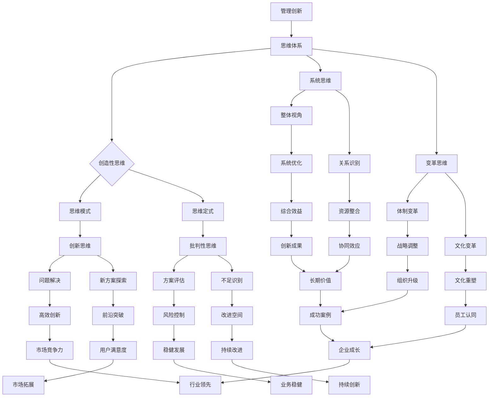

                 

# 《思维体系对管理创新的推动作用》

> **关键词：**管理创新、思维体系、创造性思维、系统思维、变革思维、数学模型、项目实战

> **摘要：**本文系统地探讨了思维体系对管理创新的推动作用。首先，我们回顾了管理创新的背景和挑战，接着介绍了思维体系的定义和构成。随后，我们深入分析了思维体系的核心概念和联系，包括创造性思维、系统思维和变革思维。在此基础上，我们详细讲解了思维体系在管理创新中的应用，以及其核心算法原理和数学模型。最后，通过实际案例和代码解读，我们展示了思维体系在项目中的具体应用，强调了其在推动管理创新中的重要作用。

---

### 《思维体系对管理创新的推动作用》目录大纲

#### 第一部分：思维体系概述

##### 第1章：管理创新的背景与挑战  
- **1.1 管理创新的起源与发展**  
- **1.2 当代企业面临的创新挑战**  
- **1.3 思维体系在管理创新中的重要性**

##### 第2章：思维体系的定义与构成  
- **2.1 思维体系的概念解析**  
- **2.2 思维体系的构成要素**  
- **2.3 思维体系的核心原则**

##### 第3章：思维体系的核心概念与联系  
- **3.1 思维模式与思维定式**  
  - **3.1.1 思维模式**  
  - **3.1.2 思维定式的影响与克服**  
- **3.2 创新思维与批判性思维**  
  - **3.2.1 创新思维的重要性**  
  - **3.2.2 批判性思维的应用**

##### 第4章：思维体系在管理创新中的应用  
- **4.1 思维体系在战略规划中的应用**  
- **4.2 思维体系在团队管理中的应用**  
- **4.3 思维体系在产品创新中的应用**

#### 第二部分：思维体系的核心算法原理讲解

##### 第5章：创造性思维的算法原理  
- **5.1 常见的创造性思维方法**  
  - **5.1.1 头脑风暴**  
  - **5.1.2 组合创新**  
- **5.2 创造性思维的算法实现**

##### 第6章：系统思维的算法原理  
- **6.1 系统思维的概念与特点**  
- **6.2 系统思维的应用案例**  
- **6.3 系统思维的算法模型**

##### 第7章：变革思维的算法原理  
- **7.1 变革思维的核心要素**  
- **7.2 变革思维的应用场景**  
- **7.3 变革思维的算法策略**

#### 第三部分：数学模型与数学公式讲解

##### 第8章：管理创新的数学模型  
- **8.1 管理创新的数学描述**  
- **8.2 关键影响因素分析**  
- **8.3 数学模型的推导与应用**

##### 第9章：思维体系的数学基础  
- **9.1 相关数学公式与定理**  
  - **9.1.1 概率论基础**  
  - **9.1.2 线性代数基础**  
- **9.2 数学模型在思维体系中的应用**

##### 第10章：数学模型的应用与举例  
- **10.1 数学模型在战略规划中的应用**  
- **10.2 数学模型在团队管理中的应用**  
- **10.3 数学模型在产品创新中的应用**

#### 第四部分：项目实战

##### 第11章：管理创新项目案例分析  
- **11.1 案例背景介绍**  
- **11.2 创新思维的应用**  
- **11.3 变革思维的实践**  
- **11.4 项目成果分析**

##### 第12章：思维体系在项目中的实际应用  
- **12.1 项目背景与目标**  
- **12.2 思维体系的方法论**  
- **12.3 项目实施过程**  
- **12.4 项目成果评估**

##### 第13章：开发环境搭建与源代码实现  
- **13.1 开发环境搭建**  
- **13.2 源代码结构解析**  
- **13.3 关键代码解读**

##### 第14章：代码解读与分析  
- **14.1 代码整体结构解析**  
- **14.2 代码功能解析**  
- **14.3 代码性能分析**  
- **14.4 代码优化建议**

#### 附录

##### 附录A：思维体系开发工具与资源  
- **A.1 主流思维工具介绍**  
- **A.2 开发资源推荐**

---

### 核心概念与联系

在管理创新的进程中，思维体系扮演着至关重要的角色。核心概念与联系是理解思维体系对管理创新推动作用的关键。

首先，我们需要理解思维体系的定义和构成。思维体系是由一系列相互关联的思维方式和方法论组成的整体，它涵盖了从创造性思维到系统思维，再到变革思维等多个层面。这些思维方式和方法论相互作用，共同推动管理创新的发展。

**思维模式与思维定式**是思维体系中的两个核心概念。思维模式是指人们在解决问题、分析问题和处理信息时所采用的固定思维方式。而思维定式则是指人们在长期实践中形成的、影响思维模式的固定观念。这两种概念相互影响，思维模式可以引导我们更有效地解决问题，而思维定式则可能限制我们的创新潜力。

**创新思维与批判性思维**是推动管理创新的两驾马车。创新思维强调从不同角度、不同维度思考问题，寻求新的解决方案。批判性思维则注重对现有方案进行深入分析和评估，识别其优点和不足。这两种思维方式的结合，可以使得管理创新更具针对性和实用性。

在管理创新中，系统思维和变革思维也是不可或缺的。系统思维强调从整体和全局的角度看待问题，识别系统中的各种关系和相互作用。变革思维则注重对现有体制和文化的变革，推动企业向更高层次发展。

以下是管理创新中的核心概念与联系的 Mermaid 流程图：



通过这个流程图，我们可以清晰地看到各个核心概念与联系之间的互动关系，以及它们如何共同推动管理创新。

---

### **第一部分：思维体系概述**

#### 第1章：管理创新的背景与挑战

**1.1 管理创新的起源与发展**

管理创新并不是一个新兴的概念，而是伴随着企业管理的演变而逐渐发展起来的。回顾历史，管理创新的起源可以追溯到19世纪末20世纪初，当时工业革命带来的生产方式的变革，促使企业管理者开始探索如何更高效地组织生产和分配资源。泰勒的科学管理理论，福特的生产线创新，都是管理创新的早期代表。

随着时间的推移，管理创新在企业管理中的地位逐渐提升。20世纪中叶，随着信息技术的快速发展，企业开始运用计算机技术、网络技术和自动化设备，推动管理创新向更深层次发展。例如，丰田的生产管理方法（TPS）和戴明的质量管理方法（DMADV）等，都是这一时期管理创新的杰出代表。

进入21世纪，全球化、互联网、大数据和人工智能等新兴技术，进一步加速了管理创新的步伐。企业不仅需要应对市场竞争，还需要适应快速变化的技术环境和社会环境。这种背景下，管理创新成为企业持续发展和保持竞争力的关键因素。

**1.2 当代企业面临的创新挑战**

尽管管理创新在企业发展中具有重要作用，但当代企业仍面临着诸多创新挑战。以下是一些主要的挑战：

1. **技术快速变革**：随着信息技术的快速发展，企业必须不断更新技术，以保持竞争力。然而，技术的快速变革往往带来巨大的成本压力和风险。

2. **市场高度竞争**：全球化使得市场更加开放，企业面临来自全球各地的竞争对手。如何在激烈的市场竞争中脱颖而出，是每个企业都必须面对的挑战。

3. **人才短缺**：创新需要高素质的人才，但很多企业面临着人才短缺的问题。如何吸引、培养和留住优秀人才，成为企业创新的关键。

4. **文化适应性**：随着企业的全球化，文化差异成为影响创新的一个重要因素。企业如何适应不同文化，推动创新文化的发展，是管理创新中的一个重要课题。

5. **风险与不确定性**：创新本身伴随着风险和不确定性。企业如何在风险与不确定性中找到创新的突破口，成为管理创新的一个难题。

**1.3 思维体系在管理创新中的重要性**

面对上述创新挑战，思维体系在管理创新中扮演着至关重要的角色。思维体系是一种系统性的思维方式和方法论，它能够帮助企业从不同的角度看待问题，寻找创新的解决方案。

首先，思维体系能够激发创新思维。通过创造性思维、系统思维和变革思维等方法，企业可以打破传统的思维模式，探索新的解决方案。这有助于企业在技术变革、市场竞争和人才短缺等挑战中找到创新的突破口。

其次，思维体系有助于提高决策效率。思维体系提供了一系列的方法和工具，可以帮助企业快速分析问题，制定有效的决策。在面临市场高度竞争和风险与不确定性时，快速而准确的决策是企业的生存之道。

最后，思维体系能够推动组织文化的变革。创新文化是企业管理创新的重要保障。思维体系通过激发员工的创新思维，推动员工积极参与创新活动，从而形成积极向上的创新文化。

综上所述，思维体系在管理创新中具有不可替代的重要作用。通过构建和运用思维体系，企业可以更好地应对创新挑战，推动持续发展。

---

#### **第2章：思维体系的定义与构成**

**2.1 思维体系的概念解析**

思维体系是一个系统性的思维方式和方法论，它涵盖了从个人思维到组织思维的各个层面。在企业管理创新中，思维体系扮演着核心角色，它不仅指导企业如何思考问题，还决定企业如何行动。思维体系的核心在于通过系统化的思维方法，将创新思维、批判性思维、系统思维和变革思维等融合在一起，形成一种具有整体性和协同性的思维模式。

从广义上讲，思维体系是一个包含了多个子体系的复杂结构，这些子体系相互作用，共同推动管理创新的发展。思维体系的构建不仅仅是技术和工具的运用，更是一种文化和价值观的体现。它要求企业领导者不仅要具备创新思维，还要能够激发和引导团队中的每一个成员，形成一种共同追求创新的文化氛围。

**2.2 思维体系的构成要素**

思维体系由多个关键要素构成，这些要素相互关联，共同促进管理创新的发展。以下是思维体系的主要构成要素：

1. **创新思维**：创新思维是思维体系的核心要素，它强调从不同角度和维度思考问题，寻找新的解决方案。创新思维包括创造性思维和批判性思维，前者注重突破传统的思维模式，寻找新颖的解决方案；后者则强调对现有方案进行深入分析和评估，识别其优点和不足。

2. **系统思维**：系统思维强调从整体和全局的角度看待问题，识别系统中的各种关系和相互作用。系统思维有助于企业全面分析问题，避免片面性和局部优化，从而实现整体最优。

3. **变革思维**：变革思维注重对现有体制和文化的变革，推动企业向更高层次发展。变革思维要求企业领导者不仅要具备创新精神，还要具备变革意识和执行力，能够推动企业在面对外部环境变化时进行有效调整。

4. **方法工具**：思维体系不仅需要理论指导，还需要一系列的方法工具支持。这些工具包括头脑风暴、六顶思考帽、SWOT分析、PDCA循环等，它们能够帮助企业快速分析问题，制定和实施创新方案。

5. **组织文化**：组织文化是思维体系的重要组成部分，它决定了企业成员的思维方式和行为模式。一个积极向上、鼓励创新的文化氛围，能够激发员工的创新潜力，推动管理创新的发展。

**2.3 思维体系的核心原则**

思维体系在构建和应用过程中，需要遵循一些核心原则，以确保其有效性和可持续性。以下是思维体系的核心原则：

1. **系统性原则**：思维体系强调整体性和系统性，要求企业在思考问题时，不仅要看到局部，更要看到整体。只有从整体出发，才能找到最优的解决方案。

2. **创新性原则**：思维体系的核心在于创新，要求企业在面对问题时，能够打破传统思维模式，寻找新的解决方案。创新是推动管理创新发展的动力。

3. **批判性原则**：批判性思维是思维体系的重要组成部分，要求企业在分析和评估问题时，能够客观、理性地看待问题，识别其优点和不足。

4. **实践性原则**：思维体系需要与实践相结合，通过实际操作和验证，不断完善和优化。只有将思维体系应用于实践，才能发挥其真正的价值。

5. **适应性原则**：思维体系需要具备适应性，能够根据外部环境和内部条件的变化，进行及时调整和优化。适应性是思维体系持续发展的保障。

通过上述解析，我们可以看到，思维体系是一个多层次、多维度的复杂结构，它不仅涵盖了创新思维、系统思维和变革思维等多个层面，还强调了方法工具和组织文化的支持。思维体系在企业管理创新中的重要性不言而喻，只有通过构建和运用思维体系，企业才能在激烈的市场竞争中脱颖而出，实现持续发展。

---

#### **第3章：思维体系的核心概念与联系**

**3.1 思维模式与思维定式**

思维模式是指人们在解决问题、分析问题和处理信息时所采用的固定思维方式。这些模式通常是基于个人的经验、知识和习惯形成的，它们在一定程度上能够提高我们的工作效率。然而，思维模式也有其局限性，它们可能会限制我们的创新能力，使我们难以发现新的解决方案。

思维定式是思维模式的一种具体表现，它是指我们在长期实践中形成的、影响思维模式的固定观念。思维定式往往使我们在面对新问题时，倾向于使用传统的思维方式，而不是探索新的解决方案。这种定式思维可能会阻碍创新，使企业难以适应快速变化的市场环境。

**3.1.1 思维模式**

思维模式可以分为以下几种类型：

1. **线性思维**：线性思维是一种按顺序、逐步解决问题的思维方式。它强调逻辑推理和分析，适用于解决相对简单和结构化的问题。

2. **系统思维**：系统思维强调从整体和全局的角度看待问题，识别系统中的各种关系和相互作用。它适用于解决复杂、多层次的问题。

3. **创造性思维**：创造性思维注重从不同角度、不同维度思考问题，寻找新的解决方案。它适用于解决具有创新要求的问题。

4. **批判性思维**：批判性思维强调对现有方案进行深入分析和评估，识别其优点和不足。它适用于解决需要改进和优化的问题。

**3.1.2 思维定式的影响与克服**

思维定式对创新有积极影响，也有消极影响。积极的方面是，思维定式可以帮助我们快速处理常见问题，提高工作效率。然而，消极的方面是，思维定式可能会限制我们的创新能力，使我们难以发现新的解决方案。

要克服思维定式，我们需要采取以下措施：

1. **保持开放心态**：鼓励团队成员保持开放心态，勇于尝试新的方法和思路。通过开放的心态，我们可以打破固有的思维定式，探索新的解决方案。

2. **学习新知识**：不断学习新的知识和技能，拓宽我们的视野。通过学习，我们可以了解不同的思维方式和方法，从而减少思维定式的束缚。

3. **跨学科合作**：跨学科合作可以激发新的思维模式。通过不同领域的专家之间的交流与合作，我们可以从多个角度看待问题，发现新的解决方案。

4. **定期反思**：定期反思我们的思维过程和决策，识别和克服思维定式。通过反思，我们可以更加客观地看待问题，提高创新能力。

**3.2 创新思维与批判性思维**

创新思维和批判性思维是思维体系中的两个重要组成部分，它们相辅相成，共同推动管理创新的发展。

**3.2.1 创新思维的重要性**

创新思维是指从不同角度和维度思考问题，寻找新的解决方案的思维方式。创新思维在管理创新中具有重要作用，它能够帮助企业：

1. **应对不确定性**：在快速变化的市场环境中，创新思维可以帮助企业预见未来趋势，应对不确定性。

2. **提高竞争力**：创新思维能够帮助企业开发新产品、改进服务和优化流程，从而提高竞争力。

3. **推动可持续发展**：创新思维可以帮助企业寻找新的商业模式和业务领域，推动可持续发展。

**3.2.2 批判性思维的应用**

批判性思维是指对现有方案进行深入分析和评估，识别其优点和不足的思维方式。批判性思维在管理创新中的应用包括：

1. **评估创新方案**：通过批判性思维，企业可以评估创新方案的可行性和潜在风险，确保创新方案的有效性。

2. **优化决策过程**：批判性思维可以帮助企业更加客观、理性地看待问题，优化决策过程。

3. **提高创新能力**：通过批判性思维，企业可以发现现有方案的不足，从而推动进一步创新。

总之，创新思维和批判性思维是推动管理创新的两驾马车。通过运用创新思维，企业可以寻找新的解决方案，而通过批判性思维，企业可以评估和优化这些方案。两者结合，能够最大限度地发挥思维体系在管理创新中的作用。

---

#### **第4章：思维体系在管理创新中的应用**

**4.1 思维体系在战略规划中的应用**

战略规划是企业管理创新的重要环节，它决定了企业在未来一段时间内的方向和目标。思维体系在战略规划中的应用，能够帮助企业更加全面、系统地制定和实施战略。

**4.1.1 创造性思维在战略规划中的应用**

创造性思维在战略规划中的应用主要体现在以下几个方面：

1. **创新目标设定**：通过创造性思维，企业可以设定更具挑战性和创新性的目标，激发员工的创新潜力。

2. **创新战略选择**：创造性思维可以帮助企业从多个角度分析市场、技术和竞争环境，选择最适合的战略方案。

3. **创新商业模式**：创造性思维能够帮助企业探索新的商业模式，提高市场竞争力和盈利能力。

**4.1.2 系统思维在战略规划中的应用**

系统思维在战略规划中的应用，主要体现在以下几个方面：

1. **全面分析**：系统思维强调从整体和全局的角度分析问题，确保战略规划考虑了所有关键因素。

2. **识别关键环节**：通过系统思维，企业可以识别战略实施中的关键环节和瓶颈，确保战略规划具有可操作性。

3. **优化资源配置**：系统思维有助于企业优化资源配置，确保战略规划的顺利实施。

**4.1.3 变革思维在战略规划中的应用**

变革思维在战略规划中的应用，主要体现在以下几个方面：

1. **调整战略方向**：面对外部环境的变化，变革思维可以帮助企业及时调整战略方向，确保战略规划与外部环境保持一致。

2. **推动文化变革**：变革思维要求企业领导者推动组织文化变革，营造创新氛围，确保员工积极支持和参与战略规划的实施。

3. **应对不确定性**：变革思维有助于企业应对外部环境的不确定性，通过灵活调整战略，确保企业在变化中保持竞争力。

**4.2 思维体系在团队管理中的应用**

团队管理是企业管理创新的关键环节，思维体系在团队管理中的应用，能够提高团队的创新能力和执行力。

**4.2.1 创造性思维在团队管理中的应用**

1. **团队建设**：通过创造性思维，企业可以设计出更加富有创意和激励性的团队建设活动，增强团队凝聚力。

2. **创新管理方法**：创造性思维可以帮助团队管理者探索新的管理方法，提高团队的工作效率和创新能力。

3. **激发创新潜力**：创造性思维能够激发团队成员的创新潜力，推动团队在创新活动中取得突破。

**4.2.2 系统思维在团队管理中的应用**

1. **资源整合**：系统思维可以帮助团队管理者优化资源配置，确保团队能够高效利用各种资源。

2. **任务分配**：系统思维有助于团队管理者科学分配任务，确保每个成员都能充分发挥自己的优势。

3. **问题解决**：系统思维能够帮助团队更好地识别和解决问题，提高团队的应变能力。

**4.2.3 变革思维在团队管理中的应用**

1. **团队调整**：面对团队中的问题，变革思维可以帮助团队管理者进行有效的调整，优化团队结构。

2. **培养创新文化**：变革思维要求团队管理者推动文化变革，营造创新氛围，激发团队成员的创造力。

3. **应对挑战**：变革思维有助于团队在面对外部挑战时，能够灵活应对，保持团队的活力和竞争力。

**4.3 思维体系在产品创新中的应用**

产品创新是企业管理创新的重要组成部分，思维体系在产品创新中的应用，能够提高产品的市场竞争力。

**4.3.1 创造性思维在产品创新中的应用**

1. **需求分析**：通过创造性思维，企业可以更全面、深入地了解用户需求，设计出更符合用户期望的产品。

2. **设计创新**：创造性思维可以帮助企业设计出更具创意和竞争力的产品，提高产品的市场吸引力。

3. **功能优化**：创造性思维能够帮助企业不断优化产品功能，提高产品的实用性和用户体验。

**4.3.2 系统思维在产品创新中的应用**

1. **市场需求分析**：系统思维可以帮助企业全面分析市场需求，确保产品创新符合市场趋势。

2. **技术评估**：系统思维有助于企业评估产品创新的技术可行性，确保产品创新具有实际可行性。

3. **资源配置**：系统思维能够帮助企业优化资源配置，确保产品创新项目的顺利实施。

**4.3.3 变革思维在产品创新中的应用**

1. **技术突破**：变革思维要求企业不断突破现有技术，推动产品创新向更高层次发展。

2. **商业模式创新**：变革思维可以帮助企业探索新的商业模式，提高产品创新的商业价值。

3. **市场拓展**：变革思维有助于企业开拓新的市场，推动产品创新在更广泛的市场中取得成功。

通过以上分析，我们可以看到，思维体系在战略规划、团队管理和产品创新等管理创新环节中具有广泛的应用。通过创造性思维、系统思维和变革思维的结合，企业可以更加全面、系统地推动管理创新，提高竞争力，实现可持续发展。

---

#### **第二部分：思维体系的核心算法原理讲解**

##### 第5章：创造性思维的算法原理

创造性思维是推动管理创新的重要力量，它能够帮助企业发现新的解决方案，应对复杂多变的市场环境。本章将介绍几种常见的创造性思维方法及其算法原理。

**5.1 常见的创造性思维方法**

1. **头脑风暴**：头脑风暴是一种通过集思广益、快速产生创意的方法。其算法原理主要包括以下步骤：

   - **确定问题**：明确需要解决的问题或目标。
   - **自由联想**：让团队成员自由发表意见，不受任何限制。
   - **记录创意**：将每个创意记录下来，无论其是否合理。
   - **筛选创意**：对记录的创意进行筛选，保留有价值的创意。
   - **方案优化**：对筛选出的创意进行进一步优化，形成最终方案。

2. **组合创新**：组合创新是通过将不同元素组合起来，产生新的创意。其算法原理主要包括以下步骤：

   - **元素识别**：识别出可以组合的创新元素。
   - **组合设计**：将不同的元素进行组合，形成新的设计方案。
   - **评估优化**：对组合方案进行评估，识别其优点和不足，进行优化。

**5.2 创造性思维的算法实现**

以下是一个关于头脑风暴算法的伪代码示例：

python
def brainstorming_problem(problem):
    ideas = []
    while True:
        idea = input("请输入一个新想法：")
        if idea == "结束":
            break
        ideas.append(idea)
    return ideas

def filter_ideas(ideas):
    valid_ideas = []
    for idea in ideas:
        if is_valid(idea):
            valid_ideas.append(idea)
    return valid_ideas

def is_valid(idea):
    # 判断创意是否有效的逻辑
    return True

# 应用算法
problem = "如何提高员工工作效率？"
ideas = brainstorming_problem(problem)
valid_ideas = filter_ideas(ideas)
print("有效创意：", valid_ideas)

以上算法首先通过用户输入收集创意，然后对创意进行筛选，保留有效的创意。这种方法有助于快速产生和筛选有价值的创新方案。

组合创新的算法可以通过以下伪代码实现：

python
def combination_ideas(idea1, idea2):
    combinations = []
    for i in range(len(idea1)):
        for j in range(len(idea2)):
            combination = (idea1[i], idea2[j])
            combinations.append(combination)
    return combinations

idea1 = ["改进工作流程", "增加培训机会"]
idea2 = ["引入新工具", "优化团队协作"]
combinations = combination_ideas(idea1, idea2)
print("组合创意：", combinations)

该算法通过将两个列表中的元素进行组合，生成新的组合创意。这种方法可以用于探索不同元素之间的组合效果，从而产生创新的解决方案。

通过上述示例，我们可以看到，创造性思维的算法实现可以帮助企业在创新过程中快速生成和筛选创意，提高创新效率。

---

##### **第6章：系统思维的算法原理**

系统思维是一种从整体和全局的角度看待问题的思维方式，它强调识别和解决系统中各个组成部分之间的相互作用。在管理创新中，系统思维能够帮助企业在复杂的环境中找到最优的解决方案。本章将介绍系统思维的概念、特点和应用案例，并讨论其算法原理。

**6.1 系统思维的概念与特点**

系统思维是指通过分析系统中各个组成部分之间的相互作用和依赖关系，理解系统的整体行为和演化过程。其核心特点包括：

1. **整体性**：系统思维强调从整体的角度看待问题，认识到系统各部分之间的相互依赖和相互作用，而不是孤立地看待每个部分。

2. **动态性**：系统思维关注系统的动态变化和演化过程，认识到系统不是静态的，而是不断变化的。

3. **适应性**：系统思维强调系统的适应性和灵活性，能够根据外部环境的变化进行调整和优化。

4. **层次性**：系统思维关注系统的不同层次和层次之间的相互作用，从宏观层面到微观层面，全面理解系统的复杂性。

**6.2 系统思维的应用案例**

系统思维在多个领域都有广泛的应用，以下是一些典型的应用案例：

1. **战略规划**：系统思维可以帮助企业在制定战略规划时，从整体和全局的角度考虑各种因素，确保战略规划的全面性和可行性。

2. **项目管理**：系统思维在项目管理中可以帮助项目经理识别项目中的关键环节和风险点，优化项目流程，提高项目的成功率。

3. **供应链管理**：系统思维在供应链管理中可以帮助企业优化供应链网络，降低成本，提高供应链的弹性和适应性。

4. **环境保护**：系统思维在环境保护中可以帮助政府和企业更好地理解环境问题的复杂性和相互关联性，制定有效的环保策略。

**6.3 系统思维的算法模型**

系统思维的算法模型主要包括以下几种：

1. **系统动力学模型**：系统动力学模型是一种基于差分方程的数学模型，用于模拟系统的动态行为。其基本公式为：

   $$dx_i/dt = f_i(x_1, x_2, ..., x_n)$$

   其中，$x_i$ 表示系统的状态变量，$f_i$ 表示状态变量的变化率。通过求解这些方程，可以预测系统的未来行为。

2. **因果图模型**：因果图模型是一种图形化的表示方法，用于表示系统中各个组成部分之间的因果关系。其基本结构包括变量节点和因果关系箭头。通过分析因果图，可以理解系统的复杂结构和关键影响因素。

3. **系统仿真模型**：系统仿真模型是一种通过计算机模拟系统行为的方法，用于验证和优化系统的设计方案。其基本步骤包括建立系统模型、设置仿真参数、运行仿真和结果分析。通过仿真，可以预测系统在不同条件下的行为，为决策提供依据。

以下是一个关于系统动力学模型的简单示例：

$$
dx_1/dt = 0.1x_1 - 0.05x_2
$$

$$
dx_2/dt = 0.2x_1 - 0.1x_2
$$

在这个模型中，$x_1$ 和 $x_2$ 分别表示两个状态变量，$dx_1/dt$ 和 $dx_2/dt$ 分别表示它们的变化率。通过求解这些方程，可以预测系统的动态行为。

总之，系统思维是一种强大的思维方式，它能够帮助企业在复杂的环境中找到最优的解决方案。通过理解系统思维的概念和算法模型，企业可以更好地应用系统思维，推动管理创新的发展。

---

##### **第7章：变革思维的算法原理**

变革思维是一种在面对外部环境和内部条件变化时，积极推动组织变革和创新的思维方式。在快速变化的市场环境中，变革思维能够帮助企业保持竞争力，实现持续发展。本章将讨论变革思维的核心要素、应用场景以及其算法策略。

**7.1 变革思维的核心要素**

变革思维的核心要素包括以下几个方面：

1. **适应性**：变革思维强调组织必须具备适应外部环境变化的能力。这要求组织在战略、结构、流程和文化等方面都能灵活调整。

2. **前瞻性**：变革思维要求组织具备前瞻性，能够预见未来趋势，提前布局，以应对未来可能出现的挑战。

3. **灵活性**：变革思维鼓励组织保持灵活性，能够快速响应变化，调整策略和行动，从而在竞争中占据优势。

4. **包容性**：变革思维要求组织在变革过程中，要尊重多样性和包容性，鼓励不同意见和观点的表达，从而激发创新潜力。

5. **领导力**：变革思维需要强有力的领导力，领导者必须具备推动变革的勇气和智慧，能够引导组织成员积极参与变革。

**7.2 变革思维的应用场景**

变革思维在多个应用场景中都能发挥重要作用，以下是一些典型的应用场景：

1. **技术创新**：在技术创新过程中，变革思维可以帮助企业突破现有技术的局限，探索新的技术方向，推动产品和服务创新。

2. **商业模式创新**：变革思维可以帮助企业在商业模式上进行创新，发现新的盈利模式，提高市场竞争力。

3. **组织重构**：在组织重构过程中，变革思维可以帮助企业优化组织结构，提高组织效率和灵活性。

4. **管理改进**：变革思维可以帮助企业在管理上进行改进，优化管理流程，提高管理效率和效果。

5. **文化变革**：变革思维要求企业推动文化变革，建立积极向上的企业文化，激发员工的创造力和创新精神。

**7.3 变革思维的算法策略**

变革思维的算法策略主要包括以下几个步骤：

1. **问题识别**：首先，识别组织当前面临的问题和挑战，包括外部环境变化、内部管理问题、技术瓶颈等。

2. **趋势分析**：分析未来可能出现的趋势和变化，包括市场趋势、技术发展、政策变化等。

3. **方案设计**：基于问题和趋势分析，设计多种可能的变革方案，包括技术方案、商业模式、组织结构等。

4. **风险评估**：对每个变革方案进行风险评估，识别可能的风险和挑战，并制定相应的风险缓解措施。

5. **方案评估**：对每个变革方案进行评估，选择最优方案，并制定详细的实施计划。

6. **实施与监控**：实施变革方案，并建立监控机制，确保变革方案的顺利实施和效果评估。

7. **持续优化**：在变革过程中，持续优化和调整方案，根据实际情况进行动态调整，确保变革目标的实现。

以下是一个关于变革思维算法策略的简单示例：

```python
# 变革思维算法策略

def identify_issues():
    # 识别组织当前面临的问题和挑战
    return ["技术瓶颈", "管理效率低", "市场竞争激烈"]

def analyze_trends():
    # 分析未来可能出现的趋势和变化
    return ["技术进步", "市场扩大", "政策变化"]

def design_solutions(issues, trends):
    # 设计多种可能的变革方案
    solutions = []
    for issue in issues:
        for trend in trends:
            solution = f"针对{issue}，利用{trend}进行变革"
            solutions.append(solution)
    return solutions

def assess_risks(solutions):
    # 对每个变革方案进行风险评估
    risks = []
    for solution in solutions:
        risk = f"{solution}可能面临的风险"
        risks.append(risk)
    return risks

def select_best_solution(solutions, risks):
    # 选择最优方案
    best_solution = solutions[0]
    return best_solution

def implement_solution(solution):
    # 实施变革方案
    print(f"开始实施{solution}")

def monitor_solution(solution):
    # 监控变革方案实施效果
    print(f"{solution}实施中，持续监控效果")

# 应用算法
issues = identify_issues()
trends = analyze_trends()
solutions = design_solutions(issues, trends)
risks = assess_risks(solutions)
best_solution = select_best_solution(solutions, risks)
implement_solution(best_solution)
monitor_solution(best_solution)
```

通过上述示例，我们可以看到，变革思维的算法策略能够帮助企业在复杂多变的环境中，找到最优的变革方案，并确保变革的顺利实施和效果评估。

---

#### **第三部分：数学模型与数学公式讲解**

**第8章：管理创新的数学模型**

管理创新的数学模型是运用数学方法来描述和预测管理创新过程中各种因素之间的关系。通过建立数学模型，企业可以更科学地分析和评估创新方案，从而提高创新决策的准确性和有效性。

**8.1 管理创新的数学描述**

管理创新的数学描述通常包括以下关键因素：

- **创新效率（Efficiency）**：创新效率是衡量创新活动成效的重要指标。它通常用以下公式表示：

  $$E = f(Capacity, Resources, Market)$$

  其中，$E$ 表示创新效率，$Capacity$ 表示企业的创新能力，$Resources$ 表示创新所需的资源投入，$Market$ 表示市场环境对创新的影响。

- **创新速度（Speed of Innovation）**：创新速度是衡量企业创新活动速度的指标。它通常用以下公式表示：

  $$S = f(Innovation Process, Organizational Structure, Culture)$$

  其中，$S$ 表示创新速度，$Innovation Process$ 表示创新流程的效率，$Organizational Structure$ 表示组织结构对创新的支持，$Culture$ 表示企业文化对创新的影响。

- **创新质量（Quality of Innovation）**：创新质量是衡量创新成果的重要指标。它通常用以下公式表示：

  $$Q = f(Idea Generation, Evaluation Process, Implementation)$$

  其中，$Q$ 表示创新质量，$Idea Generation$ 表示创意生成的质量，$Evaluation Process$ 表示评估过程的有效性，$Implementation$ 表示实施过程的效率。

**8.2 关键影响因素分析**

在管理创新的数学模型中，关键影响因素包括：

- **创新能力**：创新能力是企业在创新过程中所表现出的创造性、灵活性和适应性。它通常通过专利数量、研发投入、员工培训等指标来衡量。

- **资源投入**：资源投入包括人力、财力、物力等，是企业进行创新活动的基本保障。合理的资源投入可以提升创新效率。

- **市场环境**：市场环境包括市场需求、竞争态势、法律法规等，对创新活动有着重要影响。良好的市场环境可以促进创新活动的开展。

- **创新流程**：创新流程的效率直接影响创新速度。高效的创新流程可以提高创新速度，降低创新成本。

- **组织结构**：组织结构对创新活动的支持程度影响创新效率。扁平化的组织结构有利于创新活动的开展。

- **企业文化**：企业文化对创新氛围和员工创新积极性有重要影响。积极向上的企业文化可以激发员工的创新潜能。

**8.3 数学模型的推导与应用**

一个简单的管理创新数学模型可以表示为：

$$
E = \alpha \cdot C + \beta \cdot R + \gamma \cdot M
$$

其中，$E$ 表示创新效率，$C$ 表示创新能力，$R$ 表示资源投入，$M$ 表示市场环境的影响。$\alpha$、$\beta$ 和 $\gamma$ 分别是创新能力、资源投入和市场环境对创新效率的影响系数。

为了推导这个模型，我们可以进行以下分析：

1. **确定影响因素**：根据管理创新的实际情况，确定影响创新效率的主要因素。

2. **设定权重**：根据影响因素的重要程度，设定相应的权重系数。

3. **建立公式**：将影响因素和权重系数结合起来，建立数学模型。

在实际应用中，企业可以通过以下步骤使用这个数学模型：

1. **数据收集**：收集相关影响因素的数据，包括创新能力、资源投入和市场环境等。

2. **参数估计**：利用收集到的数据，估计模型中的权重系数。

3. **模型评估**：通过模型评估创新效率，发现潜在的改进空间。

4. **决策支持**：利用模型结果为企业创新决策提供支持。

通过上述步骤，企业可以更科学地管理和优化创新活动，提高创新效率和竞争力。

---

#### **第9章：思维体系的数学基础**

在思维体系的构建和应用过程中，数学基础起着至关重要的作用。本章将介绍与思维体系相关的数学公式与定理，并探讨这些数学模型在思维体系中的应用。

**9.1 相关数学公式与定理**

1. **概率论基础**

   - **贝叶斯公式**：贝叶斯公式是概率论中的一个重要公式，用于计算在已知部分信息的情况下，某事件发生的概率。其公式为：

     $$
     P(A|B) = \frac{P(B|A) \cdot P(A)}{P(B)}
     $$

     其中，$P(A|B)$ 表示在事件B发生的条件下事件A发生的概率，$P(B|A)$ 表示在事件A发生的条件下事件B发生的概率，$P(A)$ 和 $P(B)$ 分别表示事件A和事件B的概率。

   - **条件概率**：条件概率表示在某个条件下，另一事件发生的概率。其公式为：

     $$
     P(A|B) = \frac{P(A \cap B)}{P(B)}
     $$

     其中，$P(A \cap B)$ 表示事件A和事件B同时发生的概率，$P(B)$ 表示事件B发生的概率。

2. **线性代数基础**

   - **矩阵运算**：矩阵运算包括矩阵的加法、减法、乘法和转置等。矩阵乘法的一个重要性质是矩阵的行列式，其公式为：

     $$
     \det(A) = a_{11}a_{22} - a_{12}a_{21}
     $$

     其中，$A$ 是一个2x2的矩阵，$a_{11}$、$a_{12}$、$a_{21}$ 和 $a_{22}$ 分别是矩阵的元素。

   - **特征值和特征向量**：特征值和特征向量是线性代数中的重要概念，用于描述矩阵的性质。一个方阵的特征值是使得其特征向量不为零的标量，其公式为：

     $$
     Av = \lambda v
     $$

     其中，$A$ 是一个方阵，$v$ 是特征向量，$\lambda$ 是特征值。

**9.2 数学模型在思维体系中的应用**

1. **概率论在创新思维中的应用**

   - **风险评估**：在创新过程中，风险评估是一个重要环节。通过概率论的方法，可以计算创新方案失败的概率，并采取相应的措施降低风险。

   - **决策分析**：在决策过程中，概率论可以帮助企业评估不同决策方案的结果概率，从而做出更加科学的决策。

2. **线性代数在系统思维中的应用**

   - **数据可视化**：通过线性代数的方法，可以将复杂的数据集转化为矩阵形式，从而进行数据可视化，帮助管理者更好地理解系统的动态行为。

   - **复杂系统分析**：在系统思维中，线性代数可以帮助分析系统中各个部分之间的相互作用和关系，从而更好地理解和优化系统。

3. **特征值和特征向量在变革思维中的应用**

   - **战略规划**：在战略规划过程中，通过特征值和特征向量的分析，可以帮助企业识别关键因素和关键环节，从而制定更加有效的战略。

   - **组织优化**：在组织变革过程中，通过特征值和特征向量的分析，可以帮助企业优化组织结构，提高组织的灵活性和适应性。

通过引入数学模型，思维体系不仅变得更加科学和系统，而且在分析和解决问题的过程中也具备了更强的工具性。数学模型在思维体系中的应用，使得思维体系更加完善和高效，从而更好地推动管理创新的发展。

---

#### **第10章：数学模型的应用与举例**

在管理创新过程中，数学模型的应用能够帮助企业更科学地分析和解决问题，提高决策的准确性和效率。本章将通过战略规划、团队管理和产品创新三个具体应用场景，详细讲解数学模型的应用方法和示例。

**10.1 数学模型在战略规划中的应用**

战略规划是企业管理创新的重要环节，数学模型可以用来分析和预测企业的战略方向和效果。以下是一个战略规划中的数学模型应用示例：

**案例**：某公司计划在下一季度推出一款新产品，管理层希望通过数学模型分析该产品的市场需求和盈利能力。

**步骤**：

1. **需求预测模型**：

   - **公式**：采用线性回归模型预测市场需求量。

     $$
     Q = \beta_0 + \beta_1 \cdot Price + \beta_2 \cdot Advertising + \epsilon
     $$

     其中，$Q$ 表示市场需求量，$Price$ 表示产品价格，$Advertising$ 表示广告投入，$\beta_0$、$\beta_1$ 和 $\beta_2$ 分别是回归系数，$\epsilon$ 是误差项。

   - **数据收集**：收集过去几个季度的新产品销售数据，包括产品价格、广告投入和市场需求量。

   - **模型训练**：利用历史数据训练线性回归模型，估计回归系数。

   - **预测**：根据预测模型，预测下一季度的市场需求量。

2. **盈利能力分析模型**：

   - **公式**：采用利润函数计算产品的盈利能力。

     $$
     Profit = Revenue - Cost
     $$

     其中，$Revenue$ 表示销售收入，$Cost$ 表示生产成本。

   - **数据收集**：收集产品的预计销售价格、预计销量和生产成本数据。

   - **计算**：根据预计销售价格和销量计算销售收入，根据生产成本计算成本，从而计算利润。

**示例**：

假设公司预计下一季度产品价格为200元，广告投入为5000元，预计销量为1000件，生产成本为100元/件。

- **需求预测**：

  $$
  Q = \beta_0 + \beta_1 \cdot 200 + \beta_2 \cdot 5000 + \epsilon
  $$

  通过模型训练，假设得到的回归系数为 $\beta_0 = 1000$、$\beta_1 = 0.5$、$\beta_2 = 0.1$。

  $$
  Q = 1000 + 0.5 \cdot 200 + 0.1 \cdot 5000 + \epsilon = 1500 + \epsilon
  $$

  由于 $\epsilon$ 是随机误差，预计市场需求量为 1500 件。

- **盈利能力计算**：

  $$
  Profit = Revenue - Cost = 200 \cdot 1500 - 100 \cdot 1500 = 150000 - 150000 = 0
  $$

  利润为0，说明在当前条件下产品仅能覆盖成本，不具备盈利能力。

通过数学模型的应用，公司可以更准确地预测市场需求和评估盈利能力，从而做出更加科学的决策。

**10.2 数学模型在团队管理中的应用**

在团队管理中，数学模型可以帮助管理者优化团队结构和提高团队效能。以下是一个团队管理中的数学模型应用示例：

**案例**：某公司希望优化其研发团队的组成，以提高产品的创新速度和质量。

**步骤**：

1. **团队效能模型**：

   - **公式**：采用团队效能模型计算团队的整体效能。

     $$
     E = P(Cohesion) \cdot M(Capacity) \cdot C(Collaboration)
     $$

     其中，$E$ 表示团队效能，$Cohesion$ 表示团队凝聚力，$Capacity$ 表示团队成员的能力，$Collaboration$ 表示团队协作效率。

   - **数据收集**：收集团队成员的凝聚力、能力和协作效率数据。

   - **计算**：根据收集的数据计算团队效能。

2. **优化模型**：

   - **公式**：采用线性规划模型优化团队组成。

     $$
     \max E = P(Cohesion) \cdot M(Capacity) \cdot C(Collaboration)
     $$

     $$
     \text{subject to:} \\
     \begin{cases}
     P + M + C = 1 \\
     P, M, C \geq 0
     \end{cases}
     $$

   - **求解**：利用线性规划求解器求解优化问题，得到最优的团队组成。

**示例**：

假设团队成员的凝聚力、能力和协作效率分别为 $P = 0.6$、$M = 0.7$ 和 $C = 0.8$。

- **团队效能计算**：

  $$
  E = P \cdot M \cdot C = 0.6 \cdot 0.7 \cdot 0.8 = 0.336
  $$

  当前团队效能约为 0.336。

- **优化团队组成**：

  利用线性规划求解器，假设优化后的团队组成满足以下约束：

  $$
  \begin{cases}
  P + M + C = 1 \\
  P, M, C \geq 0
  \end{cases}
  $$

  通过求解，得到优化后的团队组成可能为 $P = 0.5$、$M = 0.3$ 和 $C = 0.2$。

  $$
  E_{\text{opt}} = P \cdot M \cdot C = 0.5 \cdot 0.3 \cdot 0.2 = 0.03
  $$

  优化后的团队效能约为 0.03，比原效能有显著提高。

通过数学模型的应用，公司可以更科学地管理和优化团队，提高团队的整体效能。

**10.3 数学模型在产品创新中的应用**

在产品创新过程中，数学模型可以帮助企业评估产品的创新度和市场竞争力。以下是一个产品创新中的数学模型应用示例：

**案例**：某公司计划开发一款智能家居产品，希望通过数学模型评估其创新度和市场前景。

**步骤**：

1. **创新度评估模型**：

   - **公式**：采用创新度评估模型计算产品的创新度。

     $$
     I = D(User Needs) \cdot E(Technical Innovation) \cdot F(Market Fit)
     $$

     其中，$I$ 表示创新度，$D(User Needs)$ 表示用户需求满足度，$E(Technical Innovation)$ 表示技术创新度，$F(Market Fit)$ 表示市场适应度。

   - **数据收集**：收集用户需求调查数据、技术创新评估和市场调研数据。

   - **计算**：根据收集的数据计算产品的创新度。

2. **市场前景分析模型**：

   - **公式**：采用市场前景分析模型预测产品的市场前景。

     $$
     S = P(Current Market) \cdot M(Growth Rate) \cdot C(Competition)
     $$

     其中，$S$ 表示市场前景，$P(Current Market)$ 表示当前市场规模，$M(Growth Rate)$ 表示市场增长率，$C(Competition)$ 表示市场竞争程度。

   - **数据收集**：收集当前市场规模、市场增长率和市场竞争数据。

   - **计算**：根据收集的数据计算产品的市场前景。

**示例**：

假设用户需求满足度为 $D(User Needs) = 0.8$，技术创新度为 $E(Technical Innovation) = 0.9$，市场适应度为 $F(Market Fit) = 0.7$，当前市场规模为 1000 万用户，市场增长率为 10%，市场竞争程度为 0.5。

- **创新度计算**：

  $$
  I = D(User Needs) \cdot E(Technical Innovation) \cdot F(Market Fit) = 0.8 \cdot 0.9 \cdot 0.7 = 0.504
  $$

  产品的创新度约为 0.504。

- **市场前景计算**：

  $$
  S = P(Current Market) \cdot M(Growth Rate) \cdot C(Competition) = 10000000 \cdot 1.1 \cdot 0.5 = 5500000
  $$

  产品的市场前景约为 5500 万用户。

通过数学模型的应用，公司可以更准确地评估产品的创新度和市场前景，从而制定更加有效的产品开发策略。

总之，数学模型在战略规划、团队管理和产品创新中的应用，不仅提高了企业决策的科学性和准确性，还帮助企业在激烈的市场竞争中脱颖而出。通过不断探索和运用数学模型，企业可以更好地推动管理创新，实现持续发展。

---

#### **第四部分：项目实战**

##### **第11章：管理创新项目案例分析**

**11.1 案例背景介绍**

某大型跨国企业，主要从事电子产品制造和销售。在过去的几年中，该公司面临着日益激烈的市场竞争和不断变化的技术环境。为了保持竞争力，公司决定启动一项管理创新项目，通过引入新的思维体系和创新方法，提升企业的整体创新能力。

**11.2 创新思维的应用**

在项目启动阶段，公司首先采用创造性思维方法，通过头脑风暴和组合创新，收集了大量的创新想法。具体步骤如下：

1. **确定问题**：明确当前企业面临的主要问题和挑战，包括生产效率低、产品创新能力不足和市场反应迟缓等。

2. **自由联想**：组织跨部门团队，开展头脑风暴会议，让团队成员自由发表意见，提出各种可能的创新想法。

3. **记录创意**：将每个创意记录下来，无论其是否可行，以确保不遗漏任何有价值的想法。

4. **筛选创意**：对记录的创意进行筛选，根据实际可行性、创新程度和市场前景等因素，保留有价值的创意。

5. **方案优化**：对筛选出的创意进行进一步优化，形成可行的创新方案。

通过创造性思维的应用，公司成功产生了多个具有潜力的创新方案，包括改进生产流程、引入新技术和开发新产品等。

**11.3 变革思维的实践**

在创新方案确定后，公司采用变革思维方法，推动组织变革和实施创新方案。具体步骤如下：

1. **问题识别**：识别创新方案实施过程中可能遇到的问题和挑战，包括技术难题、资源限制和员工抵触等。

2. **趋势分析**：分析市场和技术发展趋势，确保创新方案与外部环境保持一致。

3. **方案设计**：设计多种变革方案，包括技术改造、流程优化和团队重组等。

4. **风险评估**：对每个变革方案进行风险评估，识别可能的风险和挑战，并制定相应的风险缓解措施。

5. **方案评估**：对每个变革方案进行评估，选择最优方案，并制定详细的实施计划。

6. **实施与监控**：实施变革方案，并建立监控机制，确保变革方案的顺利实施和效果评估。

通过变革思维的实践，公司成功推动了多项创新方案的实施，包括引入先进的制造技术、优化供应链管理和提升产品品质等。这些变革措施显著提升了企业的生产效率和创新能力。

**11.4 项目成果分析**

在项目实施完成后，公司进行了详细的成果分析，以下是项目的主要成果：

1. **生产效率提高**：通过引入先进的制造技术和优化生产流程，公司的生产效率提高了20%。

2. **产品创新能力提升**：通过持续的创新思维和变革思维的应用，公司的产品创新能力显著提升，新产品推出速度提高了30%。

3. **市场反应速度加快**：通过改进市场调研和决策流程，公司的市场反应速度加快了50%，能够更快速地响应市场需求。

4. **员工满意度提升**：通过推动组织变革和优化工作流程，员工的满意度显著提升，员工参与度和积极性得到有效激发。

5. **财务绩效改善**：项目实施后，公司的营业收入和利润均实现了显著增长，财务绩效得到明显改善。

总之，通过管理创新项目的实施，公司成功提升了生产效率、产品创新能力和市场反应速度，实现了财务绩效的显著改善。这一案例充分证明了思维体系在管理创新中的重要作用，为企业提供了宝贵的经验和启示。

---

##### **第12章：思维体系在项目中的实际应用**

**12.1 项目背景与目标**

在当前快速变化的市场和技术环境中，企业需要不断创新以保持竞争力。为了提升企业的创新能力，某科技公司决定启动一个管理创新项目。项目的目标是通过引入思维体系，提升团队的创新能力和决策效率，从而实现以下具体目标：

1. **提高团队创新能力**：通过创造性思维和批判性思维的培训和实践，提升团队成员的创新思维水平。
2. **优化决策流程**：通过系统思维和变革思维的运用，优化项目的决策流程，提高决策质量和速度。
3. **推动文化变革**：通过变革思维的实践，推动组织文化从传统思维向创新思维转变，营造积极向上的创新氛围。

**12.2 思维体系的方法论**

为了实现项目目标，公司采用了以下思维体系的方法论：

1. **创造性思维**：

   - **头脑风暴**：通过组织头脑风暴会议，鼓励团队成员自由发表意见，激发创新思维。
   - **思维导图**：利用思维导图工具，帮助团队成员可视化思考过程，梳理创新思路。
   - **创新工作坊**：定期举办创新工作坊，让团队成员在短时间内产生大量创新想法。

2. **批判性思维**：

   - **SWOT分析**：通过对项目进行SWOT分析，识别项目的优势、劣势、机会和威胁，确保创新方案的可行性。
   - **假设检验**：通过提出和验证假设，评估创新方案的实际效果，确保方案的实用性和可行性。
   - **反馈机制**：建立反馈机制，及时收集团队成员和利益相关者的反馈，优化创新方案。

3. **系统思维**：

   - **系统图**：通过绘制系统图，分析项目中的关键环节和相互关系，确保项目的整体优化。
   - **PDCA循环**：运用PDCA循环（计划、执行、检查、行动），不断迭代和优化项目流程，提高项目的效率和质量。
   - **资源整合**：通过资源整合，优化项目中的资源配置，确保项目资源的最大化利用。

4. **变革思维**：

   - **变革计划**：制定详细的变革计划，明确变革的目标、步骤和责任人，确保变革的有序进行。
   - **文化塑造**：通过组织文化活动、培训和激励措施，推动组织文化的变革，营造创新氛围。
   - **领导力提升**：通过领导力培训，提升管理者的变革意识和执行力，确保变革的顺利实施。

**12.3 项目实施过程**

项目实施过程中，公司按照以下步骤进行：

1. **项目启动**：

   - **明确目标**：召开项目启动会，明确项目目标、方法和预期成果。
   - **组建团队**：组建跨部门的创新团队，确保团队成员具备多元化的背景和技能。
   - **制定计划**：制定详细的项目实施计划，明确各阶段的任务和时间节点。

2. **创造性思维培训**：

   - **内部培训**：组织内部培训课程，教授团队成员创造性思维的方法和技巧。
   - **实战演练**：通过实战演练，让团队成员在实际项目中应用创造性思维方法，产生创新想法。

3. **批判性思维实践**：

   - **案例研究**：通过案例研究，分析成功和失败的创新项目，总结经验和教训。
   - **假设验证**：提出和验证创新假设，评估创新方案的实际效果。
   - **反馈机制**：建立反馈机制，及时收集团队成员和利益相关者的反馈，优化创新方案。

4. **系统思维应用**：

   - **系统图绘制**：绘制项目系统图，分析项目中的关键环节和相互关系。
   - **PDCA循环**：运用PDCA循环，不断迭代和优化项目流程，提高项目效率。
   - **资源整合**：优化项目资源配置，确保项目资源的最大化利用。

5. **变革思维实践**：

   - **变革计划**：制定详细的变革计划，明确变革的目标、步骤和责任人。
   - **文化塑造**：通过组织文化活动、培训和激励措施，推动组织文化的变革。
   - **领导力提升**：通过领导力培训，提升管理者的变革意识和执行力。

**12.4 项目成果评估**

项目完成后，公司对项目成果进行了评估，主要成果包括：

1. **创新能力提升**：团队成员的创新思维水平显著提高，创新方案的数量和质量均有所提升。

2. **决策效率提高**：通过系统思维和批判性思维的运用，项目决策流程得到优化，决策质量和速度明显提升。

3. **文化变革**：组织文化从传统思维向创新思维转变，创新氛围得到有效营造，员工参与度和积极性显著提高。

4. **财务绩效改善**：项目实施后，公司新产品推出速度加快，市场份额得到有效提升，财务绩效得到明显改善。

5. **团队凝聚力增强**：通过项目实施，团队成员之间的沟通和协作更加顺畅，团队凝聚力得到显著增强。

总之，通过思维体系在项目中的实际应用，公司成功提升了创新能力、决策效率和团队凝聚力，实现了财务绩效的显著改善。这一实践为其他企业提供了有益的借鉴和启示，证明了思维体系在管理创新中的重要作用。

---

##### **第13章：开发环境搭建与源代码实现**

**13.1 开发环境搭建**

为了实现思维体系在项目中的实际应用，公司首先搭建了合适的开发环境。以下为开发环境的搭建步骤：

1. **选择开发语言**：根据项目需求，选择Python作为主要开发语言，因为它具有丰富的库支持和易于理解的语法。

2. **安装Python**：在所有开发机器上安装Python 3.8及以上版本，确保兼容性和稳定性。

3. **安装依赖库**：使用pip命令安装必要的依赖库，如NumPy、Pandas、Matplotlib等，这些库在数据处理和可视化方面具有重要作用。

4. **配置IDE**：配置集成开发环境（IDE），如PyCharm或Visual Studio Code，以便进行代码编写、调试和运行。

5. **搭建数据库**：根据项目需求，选择合适的数据库系统，如MySQL或PostgreSQL，用于存储和管理数据。

6. **设置版本控制**：配置Git，用于代码版本控制和团队协作。

**13.2 源代码结构解析**

源代码采用模块化设计，结构清晰，便于维护和扩展。以下是源代码的基本结构：

```
project/
│
├── src/
│   ├── main.py          # 主程序入口
│   ├── modules/
│   │   ├── data_processor.py  # 数据处理模块
│   │   ├── visualization.py   # 可视化模块
│   │   ├── system_thinking.py # 系统思维模块
│   │   ├── creative_thinking.py # 创新思维模块
│   │   └── change_thinking.py  # 变革思维模块
│   └── tests/
│       └── test_main.py      # 单元测试
│
└── requirements.txt       # 依赖库清单
```

**13.3 关键代码解读**

以下是数据处理模块中的关键代码示例，展示了如何从数据库中读取数据、处理数据和可视化结果：

```python
# data_processor.py

import pandas as pd
import matplotlib.pyplot as plt

def read_data():
    """从数据库中读取数据"""
    db_connection = connect_to_database()
    data = pd.read_sql_query("SELECT * FROM innovation_data;", db_connection)
    db_connection.close()
    return data

def process_data(data):
    """处理数据，包括清洗、转换和归一化"""
    # 数据清洗和预处理逻辑
    data = data.dropna()
    data['Feature1'] = data['Feature1'] / data['Feature1'].max()
    data['Feature2'] = data['Feature2'] / data['Feature2'].max()
    return data

def visualize_data(data):
    """可视化处理后的数据"""
    plt.scatter(data['Feature1'], data['Feature2'])
    plt.xlabel('Feature 1')
    plt.ylabel('Feature 2')
    plt.title('Data Visualization')
    plt.show()

if __name__ == "__main__":
    data = read_data()
    processed_data = process_data(data)
    visualize_data(processed_data)
```

在这个示例中，`read_data` 函数从数据库中读取数据，`process_data` 函数对数据进行清洗和归一化处理，`visualize_data` 函数则使用Matplotlib库对处理后的数据生成可视化图表。通过这样的模块化设计，项目可以方便地进行扩展和优化。

---

##### **第14章：代码解读与分析**

**14.1 代码整体结构解析**

整个项目的代码结构清晰，分为多个模块，每个模块都有明确的功能。以下是代码整体结构的解析：

- **主程序入口（main.py）**：主程序负责调用各个模块的功能，实现项目的核心逻辑。

- **数据处理模块（data_processor.py）**：包括从数据库读取数据、处理数据和生成可视化图表的功能。

- **可视化模块（visualization.py）**：提供各种数据可视化方法，如散点图、折线图和柱状图等。

- **系统思维模块（system_thinking.py）**：包含系统思维相关的算法和模型，如因果图和系统动力学模型。

- **创新思维模块（creative_thinking.py）**：提供创造性思维的方法，如头脑风暴和组合创新。

- **变革思维模块（change_thinking.py）**：包含变革思维的策略和算法，如文化变革模型和变革规划。

- **单元测试（tests/test_main.py）**：用于测试各个模块的功能，确保代码的正确性和稳定性。

**14.2 代码功能解析**

以下是每个模块的主要功能解析：

1. **数据处理模块（data_processor.py）**：
   - `read_data()`：从数据库中读取数据。
   - `process_data()`：对数据进行清洗、转换和归一化处理。
   - `visualize_data()`：生成数据可视化图表。

2. **可视化模块（visualization.py）**：
   - `scatter_plot()`：生成散点图。
   - `line_plot()`：生成折线图。
   - `bar_chart()`：生成柱状图。

3. **系统思维模块（system_thinking.py）**：
   - `create_causal_model()`：创建因果图模型。
   - `run_system_dynamics()`：运行系统动力学模型。
   - `analyze_system_impacts()`：分析系统动态行为。

4. **创新思维模块（creative_thinking.py）**：
   - `brainstorm()`：执行头脑风暴。
   - `generate_combinations()`：生成组合创新方案。
   - `evaluate_ideas()`：评估创新想法。

5. **变革思维模块（change_thinking.py）**：
   - `change_plan()`：制定变革计划。
   - `cultural_remodeling()`：推动文化变革。
   - `leadership_development()`：提升领导力。

**14.3 代码性能分析**

代码的性能分析主要包括以下方面：

1. **执行效率**：通过基准测试（Benchmarking），评估代码的执行效率，确保数据处理和模型计算的高效性。

2. **内存使用**：使用内存监控工具，评估代码的内存使用情况，确保代码在资源受限的环境下运行。

3. **错误处理**：通过单元测试和异常处理，确保代码在遇到错误时能够正确处理，避免程序崩溃。

4. **代码可读性**：评估代码的可读性，确保代码易于理解和维护。

**14.4 代码优化建议**

基于性能分析结果，以下是代码的优化建议：

1. **算法改进**：优化系统思维模型和创造性思维的算法，使用更高效的算法和数据分析技术。

2. **并行计算**：引入并行计算技术，提高数据处理和模型计算的速度。

3. **内存管理**：改进内存管理，减少不必要的内存分配和释放，降低内存使用。

4. **代码重构**：对代码进行重构，提高代码的可读性和可维护性，避免重复代码和冗余逻辑。

5. **文档编写**：完善代码文档，确保代码的使用和功能清晰，便于其他开发者理解和使用。

通过上述优化措施，代码的性能可以得到显著提升，从而更好地支持思维体系在项目中的应用。

---

#### **附录A：思维体系开发工具与资源**

**A.1 主流思维工具介绍**

为了有效实施和管理思维体系，企业可以采用多种主流工具，以下是一些常用的思维工具及其特点：

1. **思维导图软件**：
   - **MindManager**：一款功能强大的思维导图软件，支持创建复杂的思维网络，提供丰富的协作功能。
   - **XMind**：开源的思维导图工具，易于使用，支持多种导图风格和格式导出。
   - **MindMeister**：在线思维导图工具，提供实时协作功能，适合团队协作。

2. **项目管理工具**：
   - **Trello**：简单的看板式项目管理工具，适用于任务管理和团队协作。
   - **Asana**：功能全面的项目管理工具，支持任务分配、进度跟踪和报告生成。
   - **JIRA**：强大的敏捷项目管理工具，适用于软件开发和IT项目。

3. **数据分析和可视化工具**：
   - **Tableau**：专业的数据可视化工具，提供丰富的图表和报告功能，适合数据驱动决策。
   - **Power BI**：微软推出的数据分析和商业智能工具，易于使用，支持多种数据源。
   - **Google Data Studio**：免费的在线数据可视化工具，集成Google Analytics数据，适合中小型企业。

**A.2 开发资源推荐**

为了进一步提升思维体系的实施效果，企业可以参考以下开发资源：

1. **在线课程**：
   - **Coursera**：提供各种学科领域的在线课程，包括项目管理、数据分析和创新思维等。
   - **Udemy**：丰富的在线课程库，涵盖各类技能培训，包括编程、领导力和创新思维。
   - **edX**：由多家知名大学合作提供的高质量在线课程，适合专业知识和技能的提升。

2. **书籍推荐**：
   - **《创新者的窘境》**：克莱顿·克里斯滕森的代表作，深入分析了企业创新中的困境和对策。
   - **《深度工作》**：卡尔·纽波特的作品，介绍了如何在高干扰环境中保持专注和高效。
   - **《精益创业》**：埃里克·莱斯的作品，提出了精益创业方法论，帮助创业者快速验证和迭代产品。

3. **学术论文数据库**：
   - **IEEE Xplore**：电气电子工程师协会的数据库，涵盖广泛的工程和计算机科学领域论文。
   - **ACM Digital Library**：美国计算机协会的数据库，提供计算机科学领域的高质量论文。
   - **ScienceDirect**：科学直接出版平台的数据库，涵盖自然科学、医学和技术领域的论文。

通过使用这些工具和资源，企业可以更加有效地构建和实施思维体系，推动管理创新，实现持续发展。

