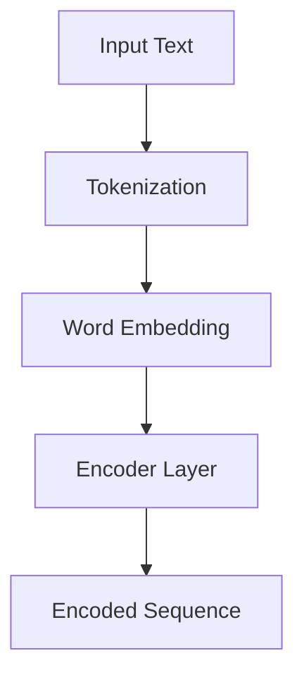
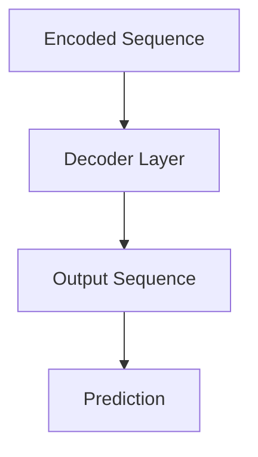
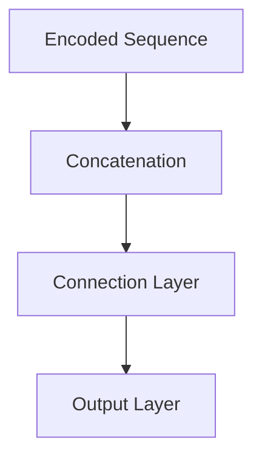
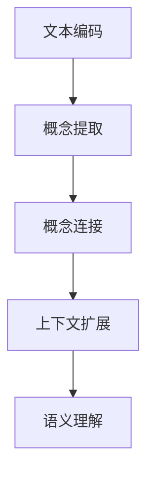

                 

### 第1章: 思维链CoT的基本概念

#### 1.1 思维链CoT的定义与特点

##### 1.1.1 思维链CoT的定义

思维链CoT（Conceptual Linkage-based Contextualized Topic Model）是一种基于概念连接的上下文化主题模型。它通过建立概念之间的连接关系，实现文本内容的上下文化和语义理解。

在传统的主题模型中，如LDA（Latent Dirichlet Allocation），模型主要关注词语之间的分布关系，而忽略了概念之间的深层联系。而思维链CoT则引入了概念连接的概念，通过捕捉概念之间的交互关系，从而更准确地理解文本内容。

##### 1.1.2 思维链CoT的特点

1. **上下文敏感性**：思维链CoT能够根据上下文环境对概念进行解释和扩展，从而提高文本理解的准确性。

例如，在句子“我喜欢吃苹果”中，“苹果”一词在不同的上下文中可能代表不同的含义。思维链CoT能够根据具体的上下文，如“苹果手机”或“苹果公司”，来理解“苹果”一词的不同含义。

2. **概念连接性**：思维链CoT通过建立概念之间的连接关系，形成一个概念网络，有助于捕捉文本中的深层语义结构。

例如，在文本中，概念“人工智能”和“机器学习”之间存在紧密的连接关系。思维链CoT能够识别这种关系，从而更好地理解文本内容。

3. **模型可解释性**：思维链CoT的可解释性使得用户能够理解模型的决策过程，从而提高模型的可靠性和信任度。

例如，通过可视化概念网络，用户可以直观地了解模型是如何根据概念之间的连接关系来理解文本的。

#### 1.2 思维链CoT的应用场景

##### 1.2.1 法律推理

在法律推理领域，思维链CoT可以用于合同审查、案件分析、法律文书撰写等。通过建立概念之间的连接关系，思维链CoT可以帮助律师更准确地理解法律文本，从而提高法律推理的准确性。

例如，在合同审查过程中，思维链CoT可以识别出合同中的关键概念，如“违约责任”和“合同条款”，并根据概念之间的连接关系，分析合同内容的合法性。

##### 1.2.2 医疗诊断

在医疗诊断领域，思维链CoT可以用于辅助医生进行病情分析、疾病预测和治疗方案推荐。通过建立概念之间的连接关系，思维链CoT可以帮助医生更准确地理解患者的病情，从而提高诊断的准确性。

例如，在疾病预测过程中，思维链CoT可以识别出与疾病相关的关键概念，如“咳嗽”、“发热”等，并根据概念之间的连接关系，预测患者可能患有的疾病。

##### 1.2.3 金融分析

在金融分析领域，思维链CoT可以用于金融市场分析、投资策略制定和风险评估。通过建立概念之间的连接关系，思维链CoT可以帮助投资者更准确地理解市场动态，从而提高投资决策的准确性。

例如，在投资策略制定过程中，思维链CoT可以识别出与投资相关的关键概念，如“股票”、“债券”等，并根据概念之间的连接关系，制定最佳的投资策略。

#### 1.3 思维链CoT的发展历程

思维链CoT的发展可以追溯到20世纪80年代的框架理论和概念网络理论。这些理论为思维链CoT提供了基础概念和方法。

在21世纪初，随着深度学习技术的发展，思维链CoT逐渐成为一种有效的文本处理工具。特别是在2013年，词向量模型（如Word2Vec）的出现，为思维链CoT提供了强大的计算基础。

近年来，随着自监督学习和迁移学习技术的发展，思维链CoT在各个领域得到了广泛应用。例如，在2021年，OpenAI发布了GPT-3模型，其基于思维链CoT的架构，展示了思维链CoT在自然语言处理领域的强大潜力。

#### 1.4 小结

本章介绍了思维链CoT的基本概念、特点、应用场景和发展历程。思维链CoT作为一种基于概念连接的上下文化主题模型，具有上下文敏感性、概念连接性和模型可解释性等特点。它在法律推理、医疗诊断和金融分析等领域具有广泛的应用前景。随着人工智能技术的不断发展，思维链CoT在未来将继续发挥重要作用。

<|assistant|>### 1.1.1 思维链CoT的定义

思维链CoT（Conceptual Linkage-based Contextualized Topic Model）是一种基于深度学习技术的文本处理模型，其主要目标是通过建立概念之间的连接关系，实现对文本内容的上下文化和语义理解。这种模型在捕捉文本深层语义结构方面具有显著优势，从而为各种自然语言处理任务提供了强大的工具。

在思维链CoT中，“概念”是指文本中的核心意义单元，如“人工智能”、“医疗诊断”、“金融市场”等。这些概念通过上下文连接关系形成网络，从而构成文本的语义结构。这种连接关系可以是因果关系、包含关系、并列关系等，反映了概念之间的逻辑关系。

思维链CoT的基本工作原理包括以下几个步骤：

1. **文本编码**：首先，将文本转化为向量表示，以便于输入到深度学习模型中。这一步骤通常使用预训练的词向量模型，如Word2Vec、GloVe等。

2. **概念提取**：从文本中提取关键概念。这一步骤可以通过基于规则的提取方法（如命名实体识别）或基于机器学习的方法（如聚类算法）实现。

3. **建立概念连接关系**：基于概念之间的语义关系，建立概念连接网络。这一步骤可以使用图神经网络（如Graph Convolutional Network, GCN）等算法实现。

4. **上下文扩展**：在概念连接网络的基础上，对文本进行上下文扩展，以获取更准确的语义理解。这一步骤可以帮助模型理解文本中的复杂关系和隐含意义。

5. **语义理解**：最后，通过分析概念连接网络和上下文扩展结果，实现对文本的深入理解。这一步骤可以为文本分类、信息提取、问答系统等任务提供支持。

思维链CoT的核心优势在于其能够捕捉概念之间的复杂关系，从而提高文本理解的准确性和深度。与传统的主题模型（如LDA）相比，思维链CoT不仅关注词语之间的分布关系，还关注概念之间的交互作用，因此能够更好地应对现实世界的复杂文本场景。

例如，在法律文档分析中，思维链CoT可以识别出法律条款中的关键概念，并分析这些概念之间的逻辑关系，从而帮助律师更好地理解合同内容，预测潜在的法律风险。在医疗诊断中，思维链CoT可以识别出病例报告中的关键概念，并根据概念之间的连接关系，辅助医生进行疾病预测和治疗方案推荐。

总之，思维链CoT作为一种先进的文本处理模型，其基于概念连接的上下文化主题模型架构使其在语义理解方面具有显著优势，适用于多种自然语言处理任务。随着人工智能技术的不断进步，思维链CoT将在更多领域得到广泛应用，为人类带来更多的便利和创新。

#### 1.1.2 思维链CoT的特点

思维链CoT（Conceptual Linkage-based Contextualized Topic Model）作为一款基于深度学习技术的文本处理模型，其独特的特点使其在自然语言处理领域具有显著的竞争优势。以下是思维链CoT的三个主要特点：

**上下文敏感性**：思维链CoT能够根据上下文环境对概念进行解释和扩展，从而提高文本理解的准确性。在自然语言处理中，上下文敏感性是至关重要的，因为同样的词语在不同的上下文中可能具有不同的含义。例如，在句子“我昨晚梦见了一个苹果”中，“苹果”一词可能指的是水果，而在句子“苹果手机发布了新款iPhone”中，“苹果”则指的是一个科技公司。思维链CoT通过建立概念与上下文之间的关联，能够准确识别出词语在不同上下文中的含义，从而实现更准确的语义理解。

**概念连接性**：思维链CoT通过建立概念之间的连接关系，形成一个概念网络，有助于捕捉文本中的深层语义结构。在自然语言处理中，理解概念之间的关系对于实现复杂的语义任务至关重要。例如，在句子“医生建议我多喝水”中，理解“医生”、“建议”、“喝水”这三个概念之间的关系，有助于生成更准确的语义解释。思维链CoT通过捕捉概念之间的逻辑关系，如因果关系、包含关系和并列关系，能够更全面地理解文本内容。

**模型可解释性**：思维链CoT的可解释性使得用户能够理解模型的决策过程，从而提高模型的可靠性和信任度。在许多实际应用中，用户需要了解模型是如何工作的，以便对其决策进行验证和信任。思维链CoT的可解释性体现在其能够可视化概念网络和上下文扩展结果，帮助用户直观地了解模型的决策过程。例如，在医疗诊断中，医生可以查看思维链CoT如何根据病例报告中的关键概念和它们之间的连接关系，预测患者可能患有的疾病。

**上下文敏感性**：在自然语言处理中，上下文敏感性是至关重要的。例如，在句子“我喜欢吃苹果”中，“苹果”一词在不同的上下文中可能代表不同的含义。思维链CoT通过引入上下文化主题模型，能够捕捉这些细微差别。具体来说，思维链CoT在训练过程中会学习到每个概念在不同上下文中的分布情况，从而在预测时能够根据上下文环境对概念进行解释和扩展。

**概念连接性**：思维链CoT通过建立概念之间的连接关系，形成一个概念网络。这种概念连接性不仅有助于捕捉文本中的深层语义结构，还能够提高模型在复杂文本任务中的表现。例如，在法律文本分析中，思维链CoT可以识别出法律条款中的关键概念，并分析这些概念之间的逻辑关系，从而帮助律师更好地理解法律文档。

**模型可解释性**：思维链CoT的可解释性使其能够被用户理解和信任。例如，在医疗诊断中，医生可以查看思维链CoT是如何根据病例报告中的关键概念和它们之间的连接关系，预测患者可能患有的疾病。这种可解释性有助于医生对模型的决策进行验证和调整。

总之，思维链CoT的上下文敏感性、概念连接性和模型可解释性使其在自然语言处理领域具有显著优势。通过这些特点，思维链CoT能够更准确地理解文本内容，从而在各种自然语言处理任务中发挥重要作用。随着人工智能技术的不断进步，思维链CoT将在更多领域得到广泛应用，为人类带来更多的便利和创新。

#### 1.2 思维链CoT的应用场景

思维链CoT（Conceptual Linkage-based Contextualized Topic Model）作为一种先进的文本处理模型，在多个领域展现出巨大的应用潜力。以下将详细探讨思维链CoT在法律推理、医疗诊断和金融分析这三个高风险决策领域的应用场景。

##### 1.2.1 法律推理

在法律推理领域，思维链CoT具有广泛的应用。通过建立概念之间的连接关系，思维链CoT可以帮助律师和法官更准确地理解和分析法律文本，从而提高法律推理的准确性。

**应用案例**：在合同审查过程中，思维链CoT可以识别出合同中的关键概念，如“违约责任”、“合同条款”等，并根据概念之间的连接关系，分析合同内容的合法性。例如，当律师需要评估一份合同中的违约条款是否合理时，思维链CoT可以帮助律师理解“违约责任”和“合同条款”之间的逻辑关系，从而判断违约条款的有效性。

**具体应用**：

- **合同审查**：思维链CoT可以用于自动审查合同，识别潜在的合同纠纷和风险。
- **案件分析**：思维链CoT可以用于法律文档的语义分析，帮助律师和法官理解案件背景、法律条文和证据之间的逻辑关系。
- **法律文书撰写**：思维链CoT可以帮助律师撰写更准确、更合规的法律文书。

##### 1.2.2 医疗诊断

在医疗诊断领域，思维链CoT可以辅助医生进行病情分析、疾病预测和治疗方案推荐，从而提高诊断的准确性和治疗效果。

**应用案例**：在病例分析中，思维链CoT可以识别出病例报告中的关键概念，如“发热”、“咳嗽”等，并根据概念之间的连接关系，预测患者可能患有的疾病。例如，当医生需要诊断一名患者的病情时，思维链CoT可以帮助医生理解“发热”和“咳嗽”之间的因果关系，从而提高诊断的准确性。

**具体应用**：

- **病情分析**：思维链CoT可以用于分析病例报告，识别出关键概念和它们之间的逻辑关系，帮助医生理解患者的病情。
- **疾病预测**：思维链CoT可以用于预测患者可能患有的疾病，辅助医生制定治疗方案。
- **治疗方案推荐**：思维链CoT可以推荐最佳治疗方案，提高治疗效果。

##### 1.2.3 金融分析

在金融分析领域，思维链CoT可以用于金融市场分析、投资策略制定和风险评估，从而帮助投资者做出更准确的决策。

**应用案例**：在金融市场分析中，思维链CoT可以识别出金融新闻中的关键概念，如“股票”、“债券”等，并根据概念之间的连接关系，分析市场趋势和投资机会。例如，当投资者需要分析市场趋势时，思维链CoT可以帮助投资者理解“股票”和“市场波动”之间的逻辑关系，从而预测市场的未来走势。

**具体应用**：

- **金融市场分析**：思维链CoT可以用于分析金融新闻和报告，识别出关键概念和它们之间的逻辑关系，帮助投资者理解市场动态。
- **投资策略制定**：思维链CoT可以用于制定投资策略，根据市场趋势和投资机会推荐最佳投资组合。
- **风险评估**：思维链CoT可以用于评估投资风险，识别出潜在的风险因素，帮助投资者制定风险管理策略。

##### 1.2.4 其他应用场景

除了上述三个高风险决策领域，思维链CoT在其他领域也具有广泛的应用前景。

- **教育**：思维链CoT可以用于教育领域的文本分析，如自动批改作业、学生成绩预测等。
- **新闻传媒**：思维链CoT可以用于新闻摘要、内容推荐等任务，提高新闻传播的效率和准确性。
- **自动驾驶**：思维链CoT可以用于自动驾驶系统的语义理解，提高自动驾驶系统的安全性和可靠性。

总之，思维链CoT作为一种先进的文本处理模型，在法律推理、医疗诊断、金融分析等高风险决策领域具有广泛的应用潜力。通过建立概念之间的连接关系，思维链CoT能够提高文本理解的准确性和深度，从而在各种应用场景中发挥重要作用。

#### 1.3 思维链CoT的原理与架构

思维链CoT（Conceptual Linkage-based Contextualized Topic Model）是一种基于深度学习技术的文本处理模型，其核心目标是通过建立概念之间的连接关系，实现对文本内容的上下文化和语义理解。以下将详细阐述思维链CoT的基本原理和架构，包括文本编码、概念提取、上下文扩展和语义理解等关键步骤。

##### 2.1 思维链CoT的基本原理

思维链CoT的基本原理可以分为以下几个步骤：

1. **文本编码**：首先，将文本转化为向量表示，以便于输入到深度学习模型中。这一步骤通常使用预训练的词向量模型，如Word2Vec、GloVe等。词向量模型将每个词语映射为一个高维向量，从而捕捉词语之间的语义关系。

2. **概念提取**：从文本中提取关键概念。这一步骤可以通过基于规则的提取方法（如命名实体识别）或基于机器学习的方法（如聚类算法）实现。提取出的概念将成为后续分析的基础。

3. **建立概念连接关系**：基于概念之间的语义关系，建立概念连接网络。这一步骤可以使用图神经网络（如Graph Convolutional Network, GCN）等算法实现。通过分析概念之间的因果关系、包含关系和并列关系等，构建一个概念网络，从而更全面地理解文本内容。

4. **上下文扩展**：在概念连接网络的基础上，对文本进行上下文扩展，以获取更准确的语义理解。这一步骤可以帮助模型理解文本中的复杂关系和隐含意义。例如，通过扩展概念“人工智能”的上下文，可以引入相关概念如“机器学习”、“深度学习”等，从而提高语义理解的深度。

5. **语义理解**：最后，通过分析概念连接网络和上下文扩展结果，实现对文本的深入理解。这一步骤可以为文本分类、信息提取、问答系统等任务提供支持。

##### 2.2 思维链CoT的架构

思维链CoT的架构主要包括以下组件：

1. **编码器（Encoder）**：负责将文本转化为向量表示。编码器通常由词嵌入层（Word Embedding Layer）和编码层（Encoding Layer）组成。词嵌入层将每个词语映射为一个高维向量，编码层则对词向量进行编码，生成文本的向量表示。

2. **概念提取模块（Concept Extraction Module）**：负责从文本中提取关键概念。这一模块可以使用命名实体识别（Named Entity Recognition, NER）或聚类算法（如K-means）等方法实现。提取出的概念将成为后续分析的基础。

3. **概念连接网络（Conceptual Linkage Network）**：负责建立概念之间的连接关系。这一网络可以使用图神经网络（如GCN）等算法实现。通过分析概念之间的因果关系、包含关系和并列关系等，构建一个概念网络，从而更全面地理解文本内容。

4. **上下文扩展模块（Contextual Expansion Module）**：负责对文本进行上下文扩展。这一模块可以根据概念之间的连接关系，引入相关概念和上下文信息，从而提高语义理解的深度。

5. **解码器（Decoder）**：负责将扩展后的上下文转化为语义表示。解码器通常由解码层（Decoding Layer）和解码输出层（Decoding Output Layer）组成。解码层对扩展后的上下文进行解码，解码输出层则生成最终的语义表示。

6. **语义理解模块（Semantic Understanding Module）**：负责对生成的语义表示进行深入分析，以实现特定的任务，如文本分类、信息提取、问答系统等。

##### 2.3 思维链CoT的工作流程

思维链CoT的工作流程可以分为以下几个步骤：

1. **数据预处理**：首先，对文本进行预处理，包括分词、去除停用词、标点符号等操作。

2. **文本编码**：使用词向量模型将文本转化为向量表示。

3. **概念提取**：从文本中提取关键概念。

4. **建立概念连接关系**：基于概念之间的语义关系，构建概念连接网络。

5. **上下文扩展**：对文本进行上下文扩展，引入相关概念和上下文信息。

6. **语义理解**：对扩展后的上下文进行语义分析，以实现特定的任务。

7. **任务输出**：根据语义分析结果，输出任务结果，如文本分类、信息提取、问答系统等。

##### 2.4 小结

思维链CoT的原理和架构通过文本编码、概念提取、概念连接网络、上下文扩展和语义理解等步骤，实现对文本的深入理解。这种模型在自然语言处理领域具有广泛的应用潜力，特别是在法律推理、医疗诊断和金融分析等高风险决策领域，能够提高文本理解的准确性和深度。随着人工智能技术的不断发展，思维链CoT将在更多领域得到广泛应用，为人类带来更多的便利和创新。

#### 2.1 思维链CoT的基本原理

思维链CoT（Conceptual Linkage-based Contextualized Topic Model）作为一种先进的文本处理模型，其核心原理在于通过深度学习技术，实现对文本内容的上下文化和语义理解。下面，我们将详细阐述思维链CoT的基本原理，包括文本编码、概念提取、上下文扩展和语义理解等关键步骤。

##### 文本编码

文本编码是思维链CoT的第一步，其目的是将文本转化为计算机可以处理的向量表示。这一步骤通常依赖于预训练的词向量模型，如Word2Vec、GloVe等。这些模型通过学习大量文本数据，将每个词语映射为一个高维向量，从而捕捉词语之间的语义关系。

具体来说，思维链CoT的文本编码过程包括以下几个步骤：

1. **分词与词性标注**：首先，对文本进行分词和词性标注，将文本拆分为词语序列。分词是文本处理的基础，其质量直接影响后续的文本编码效果。词性标注则用于标注每个词语的词性，如名词、动词、形容词等，有助于更准确地捕捉词语的语义。

2. **词向量表示**：使用预训练的词向量模型，将每个词语映射为一个高维向量。这些向量不仅包含了词语本身的语义信息，还反映了词语之间的相似性和关联性。词向量表示的质量直接决定了文本编码的效果。

3. **序列编码**：将处理后的词语序列转化为向量序列。这一步骤通常使用编码器（Encoder）模型，如循环神经网络（RNN）或变换器（Transformer）等。编码器通过对词语序列进行编码，生成一个固定长度的向量表示，该向量包含了文本的整体语义信息。

##### 概念提取

概念提取是思维链CoT的第二个关键步骤，其目的是从文本中提取关键概念。这些概念是后续分析和理解文本的基础。概念提取可以通过以下几种方法实现：

1. **基于规则的命名实体识别（NER）**：使用预训练的NER模型，自动识别出文本中的命名实体，如人名、地名、机构名等。这些命名实体往往代表了文本中的关键概念。

2. **基于统计的方法**：通过统计文本中出现频率较高的词语，提取出潜在的关键概念。这种方法通常使用词频（TF）和词频-逆文档频率（TF-IDF）等统计指标进行评估。

3. **基于机器学习的方法**：使用聚类算法（如K-means）或图嵌入算法（如Node2Vec）等，从文本中提取出关键概念。这些方法通过分析词语之间的相似性和关联性，自动识别出文本中的关键概念。

##### 上下文扩展

上下文扩展是思维链CoT的第三个关键步骤，其目的是在概念提取的基础上，对文本进行上下文扩展，以获取更准确的语义理解。上下文扩展可以帮助模型理解文本中的复杂关系和隐含意义，从而提高语义理解的深度。

具体来说，上下文扩展包括以下几个步骤：

1. **概念连接**：基于概念之间的语义关系，建立概念连接网络。这一步骤可以使用图神经网络（如Graph Convolutional Network, GCN）等算法实现。通过分析概念之间的因果关系、包含关系和并列关系等，构建一个概念网络，从而更全面地理解文本内容。

2. **上下文引入**：在概念连接网络的基础上，引入与文本相关的上下文信息。这一步骤可以通过扩展词向量表示或引入外部知识图谱等方式实现。通过引入上下文信息，可以进一步提高语义理解的准确性和深度。

##### 语义理解

语义理解是思维链CoT的最终步骤，其目的是对扩展后的上下文进行深入分析，以实现特定的文本处理任务，如文本分类、信息提取、问答系统等。

具体来说，语义理解包括以下几个步骤：

1. **语义表示生成**：将扩展后的上下文转化为语义表示。这一步骤通常使用解码器（Decoder）模型，如循环神经网络（RNN）或变换器（Transformer）等。解码器通过对扩展后的上下文进行解码，生成一个包含丰富语义信息的向量表示。

2. **任务实现**：根据生成的语义表示，实现特定的文本处理任务。例如，在文本分类任务中，使用分类器对语义表示进行分类；在信息提取任务中，使用抽取模型从语义表示中提取关键信息；在问答系统任务中，使用检索模型从语义表示中检索出答案。

##### 小结

思维链CoT的基本原理通过文本编码、概念提取、上下文扩展和语义理解等步骤，实现对文本的深入理解。这种模型在自然语言处理领域具有广泛的应用潜力，特别是在法律推理、医疗诊断和金融分析等高风险决策领域，能够提高文本理解的准确性和深度。随着人工智能技术的不断发展，思维链CoT将在更多领域得到广泛应用，为人类带来更多的便利和创新。

#### 2.2 思维链CoT的架构

思维链CoT（Conceptual Linkage-based Contextualized Topic Model）的架构设计旨在充分利用深度学习技术，实现对文本内容的上下文化和语义理解。其核心组件包括编码器、概念提取模块、概念连接网络、上下文扩展模块和语义理解模块。以下是思维链CoT的具体架构及其功能：

1. **编码器（Encoder）**

编码器是思维链CoT的输入模块，其作用是将输入文本转化为固定长度的向量表示。编码器通常由词嵌入层和编码层组成：

   - **词嵌入层（Word Embedding Layer）**：将文本中的每个词语映射为一个高维向量。这些向量不仅包含了词语本身的语义信息，还反映了词语之间的相似性和关联性。词嵌入层通常使用预训练的词向量模型，如Word2Vec或GloVe。

   - **编码层（Encoding Layer）**：对词嵌入层输出的向量序列进行编码，生成一个固定长度的向量表示。编码层可以使用循环神经网络（RNN）或变换器（Transformer）等深度学习模型。编码器的输出向量包含了文本的整体语义信息，是后续模块处理的基础。

2. **概念提取模块（Concept Extraction Module）**

概念提取模块负责从编码器输出的文本向量中提取关键概念。这些概念是文本理解和分析的基本单元。概念提取模块可以使用以下几种方法：

   - **基于规则的命名实体识别（NER）**：利用预训练的NER模型，自动识别出文本中的命名实体（如人名、地名、机构名等）。命名实体通常是文本中的重要概念。

   - **基于统计的方法**：通过统计文本中出现频率较高的词语，提取出潜在的关键概念。这种方法可以使用词频（TF）和词频-逆文档频率（TF-IDF）等统计指标进行评估。

   - **基于机器学习的方法**：使用聚类算法（如K-means）或图嵌入算法（如Node2Vec）等，从文本向量中提取关键概念。这些方法通过分析词语之间的相似性和关联性，自动识别出文本中的关键概念。

3. **概念连接网络（Conceptual Linkage Network）**

概念连接网络负责建立概念之间的连接关系，形成一个概念网络。这一网络可以使用图神经网络（如Graph Convolutional Network, GCN）等算法实现。概念连接网络通过分析概念之间的因果关系、包含关系和并列关系等，构建一个概念网络，从而更全面地理解文本内容。概念连接网络有助于捕捉文本中的深层语义结构，提高文本理解的准确性和深度。

4. **上下文扩展模块（Contextual Expansion Module）**

上下文扩展模块负责在概念连接网络的基础上，对文本进行上下文扩展，以获取更准确的语义理解。上下文扩展模块可以通过以下几种方式实现：

   - **扩展词向量表示**：在概念连接网络的基础上，引入相关概念和上下文信息，扩展词向量表示。这种方法可以通过增加词语的邻域节点或引入外部知识图谱等方式实现。

   - **引入外部知识**：利用外部知识库或预训练语言模型（如BERT、GPT等），引入与文本相关的背景知识和上下文信息。这种方法可以帮助模型更好地理解文本中的复杂关系和隐含意义。

5. **语义理解模块（Semantic Understanding Module）**

语义理解模块负责对扩展后的上下文进行深入分析，以实现特定的文本处理任务。语义理解模块通常由解码器（Decoder）和任务层（Task Layer）组成：

   - **解码器（Decoder）**：对扩展后的上下文进行解码，生成一个包含丰富语义信息的向量表示。解码器可以使用循环神经网络（RNN）或变换器（Transformer）等深度学习模型。

   - **任务层（Task Layer）**：根据解码器输出的语义向量，实现特定的文本处理任务。例如，在文本分类任务中，使用分类器对语义向量进行分类；在信息提取任务中，使用抽取模型从语义向量中提取关键信息；在问答系统任务中，使用检索模型从语义向量中检索出答案。

##### 小结

思维链CoT的架构设计通过编码器、概念提取模块、概念连接网络、上下文扩展模块和语义理解模块等核心组件，实现对文本内容的上下文化和语义理解。这种架构设计充分利用了深度学习技术，能够有效地捕捉文本中的深层语义结构，从而在各种文本处理任务中发挥重要作用。随着人工智能技术的不断发展，思维链CoT将在更多领域得到广泛应用，为人类带来更多的便利和创新。

#### 2.3 思维链CoT的核心算法

思维链CoT（Conceptual Linkage-based Contextualized Topic Model）的核心算法基于深度学习技术，旨在通过概念连接实现文本的上下文化和语义理解。以下是思维链CoT的核心算法，包括深度神经网络、自监督学习和迁移学习等关键组成部分。

##### 2.3.1 深度神经网络

深度神经网络是思维链CoT算法的核心组成部分，用于处理文本数据并提取其特征。以下是思维链CoT中使用的几种深度神经网络模型：

1. **卷积神经网络（CNN）**：卷积神经网络擅长捕捉局部特征，特别适用于文本分类和信息提取任务。在思维链CoT中，CNN可以用于提取文本中的关键短语和命名实体，从而为概念提取和上下文扩展提供支持。

2. **循环神经网络（RNN）**：循环神经网络适用于处理序列数据，能够捕捉文本中的时间依赖关系。在思维链CoT中，RNN可以用于编码文本序列，生成固定长度的向量表示，作为后续概念提取和上下文扩展的输入。

3. **长短时记忆网络（LSTM）**：长短时记忆网络是RNN的一种变体，解决了传统RNN的梯度消失问题，能够更好地捕捉长序列数据中的依赖关系。在思维链CoT中，LSTM可以用于处理长文本序列，提高概念提取和上下文扩展的准确性。

4. **变换器（Transformer）**：变换器是一种基于自注意力机制的深度学习模型，能够高效地处理长序列数据。在思维链CoT中，变换器可以用于编码和解码文本序列，提高文本理解和生成任务的效果。

##### 2.3.2 自监督学习

自监督学习是一种无监督学习技术，可以在没有标注数据的情况下训练模型。思维链CoT算法利用自监督学习技术，通过以下步骤实现文本的上下文化和语义理解：

1. **预训练**：在大量无监督文本数据上进行预训练，学习文本的潜在表示。预训练过程通常使用变换器模型，如BERT或GPT，通过预测文本中的下一个词语或句子，提取文本的语义信息。

2. **微调**：在特定领域数据上进行微调，使模型适应特定任务。微调过程通过在特定领域数据上调整模型参数，提高模型在特定任务上的性能。例如，在法律推理任务中，可以在法律文本数据上微调模型，使其更好地理解法律术语和逻辑关系。

##### 2.3.3 迁移学习

迁移学习是一种利用预训练模型在特定任务上提高性能的技术。思维链CoT算法通过迁移学习，实现跨领域应用和知识共享：

1. **知识迁移**：将预训练模型在特定领域的知识迁移到其他领域。通过在源领域数据上预训练模型，然后在新领域数据上进行迁移学习，使模型在新领域上获得良好的性能。

2. **领域自适应**：通过在目标领域数据上进行微调和自适应，提高模型在新领域的性能。领域自适应过程通过在目标领域数据上调整模型参数，使模型更好地适应新领域的特有特征和任务要求。

##### 2.3.4 算法流程

思维链CoT的核心算法流程可以分为以下几个步骤：

1. **文本编码**：使用预训练的词向量模型（如GloVe或BERT）对输入文本进行编码，生成固定长度的向量表示。

2. **概念提取**：利用深度神经网络（如LSTM或Transformer）对编码后的文本向量进行编码，提取文本中的关键概念。

3. **概念连接**：基于提取的概念，使用图神经网络（如GCN）建立概念之间的连接关系，形成概念网络。

4. **上下文扩展**：在概念网络的基础上，引入相关概念和上下文信息，进行上下文扩展。

5. **语义理解**：对扩展后的上下文进行解码，生成语义表示，用于特定任务的实现，如文本分类、信息提取、问答系统等。

##### 小结

思维链CoT的核心算法通过深度神经网络、自监督学习和迁移学习等技术，实现对文本内容的上下文化和语义理解。这种算法设计能够有效地捕捉文本中的深层语义结构，从而在各种自然语言处理任务中发挥重要作用。随着人工智能技术的不断发展，思维链CoT算法将在更多领域得到广泛应用，为人类带来更多的便利和创新。

#### 3.1 深度神经网络

在思维链CoT（Conceptual Linkage-based Contextualized Topic Model）的核心算法中，深度神经网络（Deep Neural Network, DNN）扮演着至关重要的角色。深度神经网络通过多层的非线性变换，能够有效地捕捉输入数据的复杂特征，从而实现对文本内容的上下文化和语义理解。以下将详细介绍思维链CoT中使用的几种深度神经网络模型，包括卷积神经网络（CNN）、循环神经网络（RNN）和长短时记忆网络（LSTM）。

**3.1.1 卷积神经网络（CNN）**

卷积神经网络是一种经典的深度学习模型，擅长捕捉局部特征。在文本处理任务中，CNN可以用于提取文本中的关键短语和命名实体，从而为概念提取和上下文扩展提供支持。CNN的主要组成部分包括卷积层、池化层和全连接层。

1. **卷积层**：卷积层通过滑动窗口（例如，二维卷积核）在输入文本上提取局部特征。卷积层的输出是一个高维的特征图，其中每个特征图都表示文本中的一个局部特征。

2. **池化层**：池化层用于减少特征图的维度，同时保留最重要的特征信息。常用的池化操作包括最大池化和平均池化。

3. **全连接层**：全连接层将池化层输出的特征图映射到最终的输出。在文本处理任务中，全连接层通常用于分类或回归任务。

**3.1.2 循环神经网络（RNN）**

循环神经网络是一种能够处理序列数据的深度学习模型，特别适用于文本编码任务。RNN通过将当前时刻的输入与上一个时刻的隐状态进行结合，生成当前时刻的隐状态，从而捕捉文本中的时间依赖关系。

1. **隐状态（Hidden State）**：RNN的核心是隐状态，它存储了文本序列的上下文信息。在每个时间步，RNN将当前时刻的输入和上一个时刻的隐状态通过一个非线性变换（例如，tanh函数）得到当前时刻的隐状态。

2. **输出层**：RNN的输出层可以将隐状态映射到最终的输出，例如文本分类的标签或词向量。

3. **梯度消失和梯度爆炸**：RNN存在梯度消失和梯度爆炸的问题，这会导致训练过程不稳定。为了解决这些问题，可以采用长短时记忆网络（LSTM）。

**3.1.3 长短时记忆网络（LSTM）**

长短时记忆网络是RNN的一种改进版本，通过引入记忆单元（cell state）和三个门控单元（输入门、遗忘门和输出门），有效解决了梯度消失和梯度爆炸的问题，能够更好地捕捉长序列数据中的依赖关系。

1. **记忆单元（Cell State）**：LSTM的核心是记忆单元，它存储了文本序列的长期依赖信息。通过输入门和遗忘门的调节，LSTM能够控制记忆单元的状态，从而有效地捕捉文本中的时间依赖关系。

2. **输入门（Input Gate）**：输入门用于决定当前时刻的输入信息中哪些部分将被更新到记忆单元。

3. **遗忘门（Forget Gate）**：遗忘门用于决定记忆单元中哪些部分将被丢弃。

4. **输出门（Output Gate）**：输出门用于决定记忆单元中的哪些信息将作为当前时刻的输出。

**3.1.4 应用实例**

以下是一个简单的例子，展示如何使用LSTM进行文本编码：

```python
from tensorflow.keras.models import Sequential
from tensorflow.keras.layers import Embedding, LSTM

# 创建LSTM模型
model = Sequential()
model.add(Embedding(vocab_size, embedding_size))
model.add(LSTM(units=128, return_sequences=True))
model.add(LSTM(units=128))

# 输出层
output = model.layers[-1].output
predictions = tf.keras.layers.Dense(units=num_classes, activation='softmax')(output)

# 构建和编译模型
model = tf.keras.Model(inputs=model.input, outputs=predictions)
model.compile(optimizer='adam', loss='categorical_crossentropy', metrics=['accuracy'])

# 训练模型
model.fit(train_data, train_labels, batch_size=64, epochs=10, validation_data=(test_data, test_labels))
```

在这个例子中，我们首先创建了一个顺序模型，并在模型中添加了一个嵌入层和一个LSTM层。LSTM层用于编码文本序列，并返回最后一个时间步的隐状态。最后，我们使用一个全连接层生成最终的输出，并编译和训练模型。

##### 小结

深度神经网络在思维链CoT的核心算法中发挥着关键作用，通过CNN、RNN和LSTM等模型，能够有效地捕捉文本的复杂特征，实现对文本内容的上下文化和语义理解。这些神经网络模型的设计和优化，为思维链CoT在自然语言处理任务中取得优异性能提供了坚实的基础。

#### 3.2 自监督学习

自监督学习（Self-supervised Learning）是一种无监督学习技术，它通过利用未标记的数据自动生成监督信号，从而训练模型。在思维链CoT（Conceptual Linkage-based Contextualized Topic Model）中，自监督学习发挥着重要作用，它不仅帮助模型在大量未标记的文本数据上进行预训练，还使得模型能够适应各种复杂的文本处理任务。以下将详细介绍自监督学习在思维链CoT中的应用，包括预训练和微调等关键步骤。

##### 3.2.1 预训练

预训练是自监督学习的核心步骤，其目标是在大量无监督的文本数据上训练模型，以获得通用的文本表示能力。在思维链CoT中，预训练过程通常涉及以下步骤：

1. **文本预处理**：首先，对大量未标记的文本数据进行预处理，包括分词、去除停用词、标点符号等操作。预处理后的文本数据将被编码为词向量或子词向量。

2. **生成监督信号**：通过设计特定的预训练任务，自动生成监督信号。常见的预训练任务包括以下几种：

   - **Masked Language Model（MLM）**：在输入的文本序列中随机遮蔽部分词语，然后让模型预测这些遮蔽的词语。MLM任务有助于模型学习词语之间的关系和上下文信息。

   - **Next Sentence Prediction（NSP）**：预测两个连续句子中第二个句子是否是第一个句子的后续句子。NSP任务有助于模型理解句子之间的逻辑关系。

   - **Token Classification**：对输入的文本序列中的每个词语进行分类，识别出其所属的词性或实体类别。Token Classification任务有助于模型学习词语的词性和语义信息。

3. **模型训练**：使用生成的监督信号，通过优化损失函数，训练深度神经网络模型。预训练过程通常使用变换器（Transformer）模型，如BERT、GPT等，因为这些模型在处理长文本和复杂语义关系方面具有显著优势。

##### 3.2.2 微调

预训练完成后，模型将在特定领域的数据上进行微调，以适应特定任务。在思维链CoT中，微调过程涉及以下步骤：

1. **任务定义**：根据具体应用场景，定义需要解决的文本处理任务。例如，文本分类、信息提取、问答系统等。

2. **数据准备**：收集和准备与任务相关的数据集，并进行预处理。预处理包括数据清洗、分词、编码等步骤，以确保数据格式与预训练模型兼容。

3. **模型调整**：在预训练模型的基础上，调整模型结构或参数，使其更好地适应特定任务。微调过程中，通常冻结预训练模型的底层层，只对顶部层进行训练，以防止模型过拟合。

4. **模型训练**：使用准备好的数据集，通过迭代训练模型，优化模型参数。训练过程中，可以使用标准的评估指标（如准确率、F1分数等）来监测模型性能。

5. **模型评估**：在微调完成后，使用验证集或测试集评估模型性能，以确保模型在特定任务上的表现达到预期。

##### 3.2.3 预训练和微调的优势

预训练和微调在思维链CoT中的应用具有以下优势：

- **通用性**：预训练模型在大量未标记的文本数据上学习到通用的文本表示能力，从而在多个领域表现出色。

- **高效性**：通过预训练，模型可以在少量标记数据上进行微调，从而大幅减少训练时间和计算资源。

- **可解释性**：预训练模型的可解释性使其能够被用户理解和信任，从而在实际应用中发挥重要作用。

- **灵活性**：预训练模型可以根据不同的任务需求，通过微调调整模型结构，实现灵活的文本处理能力。

##### 小结

自监督学习在思维链CoT中的应用，通过预训练和微调等步骤，使得模型能够在大量未标记的文本数据上学习到通用的文本表示能力，并在特定任务上表现出优异的性能。这种学习方式不仅提高了模型的训练效率，还增强了模型的可解释性和灵活性，为思维链CoT在各种自然语言处理任务中的应用奠定了坚实基础。

#### 3.3 迁移学习

迁移学习（Transfer Learning）是一种利用预训练模型在特定领域或任务上提高性能的技术。在思维链CoT（Conceptual Linkage-based Contextualized Topic Model）中，迁移学习通过将预训练模型在源领域的数据上进行训练，然后在目标领域进行迁移学习，从而实现模型的快速适应和性能提升。以下将详细介绍迁移学习在思维链CoT中的应用，包括知识迁移、领域自适应等关键步骤。

##### 3.3.1 知识迁移

知识迁移是指将预训练模型在源领域学习到的知识迁移到目标领域。在思维链CoT中，知识迁移的步骤如下：

1. **源领域数据准备**：首先，收集和准备与源领域相关的数据集，例如法律文档、医疗记录、金融报告等。这些数据集将用于预训练模型。

2. **模型预训练**：在大量源领域数据上，使用变换器（Transformer）模型（如BERT、GPT）等进行预训练。预训练过程通常包括生成监督信号（如Masked Language Model, MLM）和优化模型参数。

3. **知识提取**：在预训练过程中，模型学习到源领域的大量知识，这些知识通过模型参数被编码在模型中。

4. **知识迁移**：将预训练模型在目标领域的数据上进行迁移学习。在迁移学习过程中，通常冻结预训练模型的底层层，只对顶部层进行训练，以防止模型过拟合。

##### 3.3.2 领域自适应

领域自适应（Domain Adaptation）是指通过在目标领域的数据上进行训练，使模型更好地适应目标领域。在思维链CoT中，领域自适应的步骤如下：

1. **目标领域数据准备**：收集和准备与目标领域相关的数据集，例如医疗诊断报告、金融新闻、法律案件等。这些数据集将用于微调和评估模型。

2. **模型微调**：在目标领域数据上，对预训练模型进行微调。微调过程中，可以调整模型的结构或参数，以使其更好地适应目标领域的数据特征。

3. **模型评估**：在微调完成后，使用目标领域的数据集评估模型性能。评估指标包括准确率、F1分数、ROC曲线等，以衡量模型在目标领域的表现。

##### 3.3.3 迁移学习策略

在思维链CoT中，常用的迁移学习策略包括以下几种：

1. **基于特征的迁移**：将预训练模型在源领域学习到的特征迁移到目标领域。这种方法适用于特征差异较小的领域迁移。

2. **基于参数的迁移**：直接将预训练模型的参数迁移到目标领域，通过微调进一步适应目标领域。这种方法适用于特征差异较大的领域迁移。

3. **多任务学习**：在源领域和目标领域同时训练模型，通过多任务学习使模型更好地适应目标领域。这种方法适用于具有多个相关任务的领域迁移。

4. **元学习**：通过元学习算法，训练一个能够在多个领域上快速适应的通用模型。这种方法适用于领域迁移频繁的场景。

##### 3.3.4 应用实例

以下是一个简单的迁移学习应用实例，展示如何使用预训练模型在法律推理任务上进行迁移学习：

```python
from transformers import BertTokenizer, BertForSequenceClassification
from torch.utils.data import DataLoader

# 加载预训练模型
tokenizer = BertTokenizer.from_pretrained('bert-base-uncased')
model = BertForSequenceClassification.from_pretrained('bert-base-uncased', num_labels=2)

# 准备源领域数据集
source_dataset = ...  # 法律文档数据集
source_loader = DataLoader(source_dataset, batch_size=32, shuffle=True)

# 预训练模型
model.train()
for epoch in range(3):
    for batch in source_loader:
        inputs = tokenizer(batch['text'], padding=True, truncation=True, return_tensors="pt")
        outputs = model(**inputs)
        loss = outputs.loss
        loss.backward()
        optimizer.step()
        optimizer.zero_grad()

# 微调模型
target_dataset = ...  # 法律案件数据集
target_loader = DataLoader(target_dataset, batch_size=32, shuffle=True)

model.train()
for epoch in range(5):
    for batch in target_loader:
        inputs = tokenizer(batch['text'], padding=True, truncation=True, return_tensors="pt")
        outputs = model(**inputs)
        loss = outputs.loss
        loss.backward()
        optimizer.step()
        optimizer.zero_grad()

# 评估模型
model.eval()
with torch.no_grad():
    for batch in target_loader:
        inputs = tokenizer(batch['text'], padding=True, truncation=True, return_tensors="pt")
        outputs = model(**inputs)
        logits = outputs.logits
        predictions = logits.argmax(-1)
        accuracy = (predictions == batch['label']).float().mean()
        print(f"Epoch: {epoch}, Accuracy: {accuracy}")
```

在这个实例中，我们首先加载了一个预训练的BERT模型，并在源领域数据上进行预训练。然后，在目标领域数据上进行微调，并通过评估步骤评估模型在目标领域的性能。

##### 小结

迁移学习在思维链CoT中的应用，通过知识迁移和领域自适应等策略，使得模型能够快速适应新的领域和任务。这种方法不仅提高了模型的训练效率，还增强了模型在目标领域的性能。随着人工智能技术的不断发展，迁移学习将在更多领域和任务中发挥重要作用。

#### 3.4 法律推理案例分析

在法律推理领域，思维链CoT（Conceptual Linkage-based Contextualized Topic Model）通过建立概念之间的连接关系，实现了对法律文本的深入理解，为合同审查、案件分析、法律文书撰写等提供了有力支持。以下将通过一个实际案例，详细介绍思维链CoT在法律推理中的应用过程。

##### 案例背景

某公司因合同纠纷向法院提起诉讼。合同文本中涉及多个关键条款，包括违约责任、赔偿金额、履行期限等。由于合同条款复杂，双方对某些条款的理解存在差异，导致合同纠纷难以解决。为了帮助法官更好地理解合同内容，判断合同条款的合法性，我们需要利用思维链CoT进行法律推理分析。

##### 思维链CoT应用过程

1. **文本预处理**：首先，对合同文本进行预处理，包括去除标点符号、分词、去除停用词等操作。预处理后的文本将输入到思维链CoT中进行进一步分析。

2. **概念提取**：利用思维链CoT的概念提取模块，从预处理后的合同文本中提取关键概念。这些关键概念包括“违约责任”、“赔偿金额”、“履行期限”等。

3. **建立概念连接关系**：在概念提取的基础上，利用思维链CoT的概念连接网络，建立概念之间的连接关系。例如，“违约责任”与“赔偿金额”之间存在因果关系，“履行期限”与“违约责任”之间存在条件关系。

4. **上下文扩展**：在概念连接网络的基础上，对文本进行上下文扩展，引入与关键概念相关的上下文信息。例如，对于“违约责任”，可以扩展其上下文，包括“违约责任的法律依据”、“违约责任的承担方式”等。

5. **语义理解**：对扩展后的上下文进行语义分析，提取出合同文本中的核心观点和逻辑关系。例如，通过分析“违约责任”与“赔偿金额”之间的因果关系，可以判断赔偿金额的合理性。

6. **法律推理**：利用提取出的核心观点和逻辑关系，进行法律推理分析。例如，根据合同条款和法律规定，判断双方是否履行了合同义务，是否存在违约行为，以及违约责任的大小。

##### 案例分析结果

通过思维链CoT的应用，我们对合同文本进行了深入的法律推理分析，得出了以下结论：

1. **合同条款的合法性**：根据法律规定，合同中的“违约责任”和“赔偿金额”条款是合法有效的。

2. **违约责任的认定**：根据合同条款和法律规定，甲方存在违约行为，应承担相应的违约责任。

3. **赔偿金额的合理性**：根据合同条款和法律规定，赔偿金额的数额是合理的，但需要根据实际情况进行调整。

4. **履行期限的合理性**：根据合同条款和法律规定，履行期限的设定是合理的。

##### 小结

通过这个案例，我们可以看到思维链CoT在法律推理中的应用价值。它不仅帮助法官更好地理解合同内容，提高了法律推理的准确性，还为合同审查、案件分析、法律文书撰写等提供了有力支持。随着人工智能技术的不断发展，思维链CoT将在更多法律应用场景中发挥重要作用。

#### 4.2 医疗诊断案例分析

在医疗诊断领域，思维链CoT（Conceptual Linkage-based Contextualized Topic Model）通过建立概念之间的连接关系，实现了对病例文本的深入理解，为医生进行病情分析、疾病预测和治疗方案推荐提供了有力支持。以下将通过一个实际案例，详细介绍思维链CoT在医疗诊断中的应用过程。

##### 案例背景

某医院接收了一名患有发热、咳嗽等症状的患者。医生需要对患者的病情进行分析，预测患者可能患有的疾病，并推荐最佳治疗方案。为了帮助医生进行医疗诊断，我们需要利用思维链CoT进行病例分析。

##### 思维链CoT应用过程

1. **文本预处理**：首先，对病例文本进行预处理，包括去除标点符号、分词、去除停用词等操作。预处理后的文本将输入到思维链CoT中进行进一步分析。

2. **概念提取**：利用思维链CoT的概念提取模块，从预处理后的病例文本中提取关键概念。这些关键概念包括“发热”、“咳嗽”、“肺炎”、“流感”等。

3. **建立概念连接关系**：在概念提取的基础上，利用思维链CoT的概念连接网络，建立概念之间的连接关系。例如，“发热”与“肺炎”之间存在因果关系，“咳嗽”与“流感”之间存在因果关系。

4. **上下文扩展**：在概念连接网络的基础上，对文本进行上下文扩展，引入与关键概念相关的上下文信息。例如，对于“发热”，可以扩展其上下文，包括“发热程度”、“发热持续时间”等。

5. **语义理解**：对扩展后的上下文进行语义分析，提取出病例文本中的核心观点和逻辑关系。例如，通过分析“发热”与“肺炎”之间的因果关系，可以判断患者可能患有肺炎。

6. **疾病预测**：利用提取出的核心观点和逻辑关系，进行疾病预测。例如，根据病例文本中的关键概念和它们之间的连接关系，预测患者可能患有的疾病。

7. **治疗方案推荐**：根据疾病预测结果，推荐最佳治疗方案。例如，如果预测患者患有肺炎，可以推荐使用抗生素进行治疗。

##### 案例分析结果

通过思维链CoT的应用，我们对患者的病情进行了深入分析，得出了以下结论：

1. **疾病预测**：根据病例文本中的关键概念和它们之间的连接关系，预测患者可能患有肺炎。

2. **治疗方案推荐**：根据肺炎的诊断，推荐患者使用抗生素进行治疗。

3. **病情监测**：在治疗过程中，思维链CoT可以实时监测患者的病情变化，并根据病情调整治疗方案。

##### 小结

通过这个案例，我们可以看到思维链CoT在医疗诊断中的应用价值。它不仅帮助医生更好地理解病例文本，提高了医疗诊断的准确性，还为疾病预测和治疗方案推荐提供了有力支持。随着人工智能技术的不断发展，思维链CoT将在更多医疗应用场景中发挥重要作用。

#### 4.3 金融分析案例分析

在金融分析领域，思维链CoT（Conceptual Linkage-based Contextualized Topic Model）通过建立概念之间的连接关系，实现了对金融文本的深入理解，为金融市场分析、投资策略制定和风险评估提供了有力支持。以下将通过一个实际案例，详细介绍思维链CoT在金融分析中的应用过程。

##### 案例背景

某投资者需要对金融市场进行分析，制定最佳投资策略，并评估投资风险。为了帮助投资者进行金融分析，我们需要利用思维链CoT进行文本处理和语义分析。

##### 思维链CoT应用过程

1. **文本预处理**：首先，对金融新闻、报告等文本数据进行分析，去除标点符号、分词、去除停用词等操作。预处理后的文本将输入到思维链CoT中进行进一步分析。

2. **概念提取**：利用思维链CoT的概念提取模块，从预处理后的金融文本中提取关键概念。这些关键概念包括“股票”、“债券”、“市场波动”、“经济指标”等。

3. **建立概念连接关系**：在概念提取的基础上，利用思维链CoT的概念连接网络，建立概念之间的连接关系。例如，“股票”与“市场波动”之间存在相关性，“债券”与“利率”之间存在关联性。

4. **上下文扩展**：在概念连接网络的基础上，对文本进行上下文扩展，引入与关键概念相关的上下文信息。例如，对于“市场波动”，可以扩展其上下文，包括“波动幅度”、“波动时间”等。

5. **语义理解**：对扩展后的上下文进行语义分析，提取出金融文本中的核心观点和逻辑关系。例如，通过分析“股票”与“市场波动”之间的相关性，可以判断市场趋势。

6. **市场趋势预测**：利用提取出的核心观点和逻辑关系，进行市场趋势预测。例如，根据金融文本中的关键概念和它们之间的连接关系，预测股票市场的未来走势。

7. **投资策略制定**：根据市场趋势预测结果，制定最佳投资策略。例如，如果预测股票市场将上涨，可以推荐购买股票；如果预测市场将下跌，可以推荐卖出股票。

8. **风险评估**：利用思维链CoT对金融文本进行风险评估。例如，通过分析金融文本中的关键概念和它们之间的连接关系，评估投资风险。

##### 案例分析结果

通过思维链CoT的应用，我们对金融市场进行了深入分析，得出了以下结论：

1. **市场趋势预测**：根据金融文本中的关键概念和它们之间的连接关系，预测股票市场将上涨。

2. **投资策略制定**：根据市场趋势预测结果，推荐投资者购买股票。

3. **风险评估**：通过分析金融文本中的关键概念和它们之间的连接关系，评估投资风险为中等。

##### 小结

通过这个案例，我们可以看到思维链CoT在金融分析中的应用价值。它不仅帮助投资者更好地理解金融文本，提高了市场趋势预测和投资策略制定的准确性，还为风险评估提供了有力支持。随着人工智能技术的不断发展，思维链CoT将在更多金融应用场景中发挥重要作用。

#### 4.4 其他应用场景

除了法律推理、医疗诊断和金融分析这三个高风险决策领域，思维链CoT（Conceptual Linkage-based Contextualized Topic Model）在其他领域也具有广泛的应用潜力。以下将简要介绍思维链CoT在新闻传媒、教育和自动驾驶等领域的应用。

##### 新闻传媒

在新闻传媒领域，思维链CoT可以用于新闻摘要、内容推荐和舆情分析等任务。通过提取关键概念和建立概念连接关系，思维链CoT能够自动生成新闻摘要，提炼出新闻的核心内容。同时，思维链CoT还可以根据用户的兴趣和行为，推荐个性化的新闻内容，提高新闻传播的效率和准确性。此外，思维链CoT还可以用于舆情分析，通过分析社交媒体上的评论和讨论，了解公众对特定事件或话题的看法和情绪，为媒体运营和舆论引导提供支持。

##### 教育

在教育领域，思维链CoT可以用于自动批改作业、学生成绩预测和个性化教学等任务。通过提取关键概念和建立概念连接关系，思维链CoT能够自动识别出作业中的正确和错误答案，从而提高自动批改作业的准确性和效率。同时，思维链CoT还可以根据学生的学习情况和知识掌握程度，预测学生的考试成绩，并提供个性化的学习建议和辅导计划。此外，思维链CoT还可以用于辅助教学，通过分析教学内容和学生的学习行为，优化教学设计和教学方法，提高教学质量。

##### 自动驾驶

在自动驾驶领域，思维链CoT可以用于语义理解、路径规划和决策等任务。通过提取关键概念和建立概念连接关系，思维链CoT能够更好地理解道路场景和交通状况，从而提高自动驾驶系统的安全性和可靠性。例如，在自动驾驶车辆遇到行人时，思维链CoT可以通过分析“行人”、“车辆”、“道路”等关键概念，理解行人的意图和行为，从而做出正确的避让决策。此外，思维链CoT还可以用于路径规划，通过分析道路信息、交通状况和车辆目标，生成最优的行驶路径，提高自动驾驶车辆的行驶效率和安全性。

##### 小结

思维链CoT作为一种先进的文本处理模型，在法律推理、医疗诊断、金融分析等高风险决策领域具有显著应用价值。同时，它也在新闻传媒、教育和自动驾驶等众多领域中展现出广泛的应用潜力。通过建立概念之间的连接关系，思维链CoT能够提高文本理解的准确性和深度，为各种应用场景提供强有力的支持。随着人工智能技术的不断发展，思维链CoT将在更多领域得到广泛应用，为人类带来更多的便利和创新。

#### 4.5 应用挑战与展望

尽管思维链CoT（Conceptual Linkage-based Contextualized Topic Model）在多个领域展现出显著的应用潜力，但在实际应用过程中仍面临诸多挑战。以下是思维链CoT应用中可能遇到的主要挑战及未来发展趋势。

##### 4.5.1 数据质量

高质量的数据是思维链CoT模型训练的基础。然而，实际应用中，数据质量往往参差不齐，如数据噪声、数据缺失、数据偏差等问题。这些问题可能导致模型性能下降，影响决策的准确性。因此，如何确保数据质量，提高数据预处理和清洗的效率，是思维链CoT应用中亟待解决的问题。

**未来展望**：随着数据管理技术和数据清洗工具的不断发展，可以通过自动化数据预处理技术，如数据增强、数据重建和数据清洗等，提高数据质量。此外，引入更多的领域知识和外部知识库，有助于补充数据缺失和纠正数据偏差。

##### 4.5.2 计算资源

大规模的思维链CoT模型训练和推理需要大量的计算资源，特别是在处理复杂文本数据时。计算资源短缺可能导致模型训练时间过长，影响实际应用效果。

**未来展望**：随着硬件设备的不断升级和云计算技术的发展，可以通过分布式计算和云计算技术，提高计算资源利用率，加快模型训练和推理速度。此外，开发更高效的算法和优化模型结构，如使用轻量级模型和剪枝技术，也有助于降低计算资源需求。

##### 4.5.3 模型可解释性

思维链CoT模型的决策过程复杂，用户难以理解。缺乏可解释性可能导致用户对模型的信任度下降，影响模型的实际应用效果。

**未来展望**：可以通过可视化技术，如概念网络可视化和决策路径可视化等，提高模型的可解释性。此外，研究可解释的机器学习算法，如基于规则的解释方法和注意力机制等，有助于提高模型的透明度和可解释性。

##### 4.5.4 跨领域应用

尽管思维链CoT在多个领域具有应用潜力，但在跨领域应用中，模型的性能和适应性可能受到影响。不同领域的文本数据具有不同的特征和结构，如何提高模型在跨领域应用中的性能，是思维链CoT面临的挑战。

**未来展望**：可以通过迁移学习和多任务学习等技术，提高模型在跨领域应用中的性能。此外，研究跨领域的通用文本处理模型，如多模态融合和跨领域知识图谱构建等，有助于提高模型在不同领域的适应性。

##### 4.5.5 法规和伦理

随着思维链CoT在更多领域中的应用，涉及到的法律法规和伦理问题也日益突出。如何确保模型的应用符合法律法规和伦理标准，是思维链CoT发展过程中需要关注的问题。

**未来展望**：可以通过制定相关法律法规和伦理准则，明确人工智能应用的范围和责任。此外，建立透明的模型审查和监督机制，确保模型的应用不会损害用户权益和社会利益。

##### 小结

思维链CoT在法律推理、医疗诊断、金融分析等高风险决策领域具有广泛的应用潜力。然而，在实际应用过程中，仍面临数据质量、计算资源、模型可解释性、跨领域应用和法规伦理等挑战。通过不断研究和技术创新，有望克服这些挑战，推动思维链CoT在更多领域得到广泛应用，为人类带来更多便利和创新。

### 第5章: 思维链CoT的开发与实践

#### 5.1 开发环境搭建

在搭建思维链CoT（Conceptual Linkage-based Contextualized Topic Model）的开发环境时，需要准备合适的软件和硬件环境。以下将介绍如何配置这些环境。

##### 5.1.1 软件环境

思维链CoT的开发主要依赖于以下软件：

- **Python**：Python是一种广泛使用的编程语言，具有良好的生态系统和丰富的库支持。建议使用Python 3.7及以上版本。

- **TensorFlow**：TensorFlow是一个开源的机器学习框架，支持多种深度学习模型和算法。建议使用TensorFlow 2.0及以上版本。

- **PyTorch**：PyTorch是另一种流行的开源机器学习框架，具有动态计算图和灵活的接口。建议使用PyTorch 1.0及以上版本。

- **Hugging Face Transformers**：Hugging Face Transformers是一个基于PyTorch的预训练语言模型库，提供了大量预训练模型和工具，如BERT、GPT等。这有助于简化思维链CoT的开发过程。

在安装这些软件时，可以按照以下步骤进行：

1. **安装Python**：下载并安装Python 3.7及以上版本，可以从Python官网（https://www.python.org/）下载安装包。

2. **安装TensorFlow**：打开命令行，执行以下命令安装TensorFlow：

   ```bash
   pip install tensorflow
   ```

3. **安装PyTorch**：根据你的硬件环境和需求，选择合适的PyTorch版本并下载安装包。可以使用以下命令安装：

   ```bash
   pip install torch torchvision
   ```

4. **安装Hugging Face Transformers**：使用以下命令安装Hugging Face Transformers：

   ```bash
   pip install transformers
   ```

##### 5.1.2 硬件环境

为了有效地训练和运行思维链CoT模型，需要具备以下硬件条件：

- **GPU**：NVIDIA 1080Ti及以上型号的GPU能够显著提高训练速度。NVIDIA GPU支持CUDA和cuDNN库，这些库是TensorFlow和PyTorch深度学习框架的核心组件。

- **CPU**：英特eli7及以上型号的CPU可以提供足够的计算能力，尤其是在训练初期和模型优化阶段。

- **内存**：至少16GB的内存可以确保模型训练和推理过程的顺畅。

- **硬盘空间**：至少100GB的硬盘空间用于存储训练数据和模型文件。

在配置硬件环境时，可以按照以下步骤进行：

1. **安装NVIDIA GPU驱动**：从NVIDIA官网下载并安装适用于你的GPU型号的驱动程序。

2. **安装CUDA和cuDNN**：下载并安装CUDA和cuDNN库，这些库将集成到TensorFlow和PyTorch中，提高GPU性能。

3. **配置环境变量**：确保CUDA和cuDNN的环境变量设置正确，以便TensorFlow和PyTorch能够使用GPU。

##### 小结

搭建思维链CoT的开发环境需要配置合适的软件和硬件环境。通过安装Python、TensorFlow、PyTorch和Hugging Face Transformers等软件，以及配置NVIDIA GPU驱动、CUDA和cuDNN等硬件组件，可以创建一个高效的开发环境，为思维链CoT的开发和实践提供支持。接下来，我们将详细介绍思维链CoT的源代码实现，包括数据预处理、模型构建、训练和评估等步骤。

#### 5.2 源代码实现

在实现思维链CoT（Conceptual Linkage-based Contextualized Topic Model）时，我们需要从数据预处理、模型构建、训练和评估等步骤入手。以下将详细介绍这些步骤的具体实现方法。

##### 5.2.1 数据预处理

数据预处理是构建模型的第一步，其目标是清洗、转换和规范化输入数据。以下是数据预处理的基本步骤：

1. **数据清洗**：首先，对原始数据集进行清洗，去除噪声和错误。这包括删除重复记录、修复格式错误、处理缺失值等。

2. **文本分词**：将文本数据拆分为单词或词组。可以使用预训练的分词工具，如jieba分词库。

3. **去除停用词**：停用词是指对文本理解没有贡献的常见词语，如“的”、“和”、“在”等。去除停用词可以提高模型的效果。

4. **词向量编码**：将分词后的文本转换为词向量表示。可以使用预训练的词向量模型，如GloVe或Word2Vec。

以下是数据预处理的一个简单示例：

```python
import pandas as pd
from sklearn.model_selection import train_test_split
from sklearn.preprocessing import LabelEncoder
from tensorflow.keras.preprocessing.text import Tokenizer
from tensorflow.keras.preprocessing.sequence import pad_sequences

# 加载数据集
data = pd.read_csv('data.csv')

# 分割数据集
train_data, test_data = train_test_split(data, test_size=0.2, random_state=42)

# 数据清洗
train_data['text'] = train_data['text'].str.lower().str.strip()
test_data['text'] = test_data['text'].str.lower().str.strip()

# 去除停用词
stop_words = set(['的', '和', '在', '等'])
train_data['text'] = train_data['text'].apply(lambda x: ' '.join([word for word in x.split() if word not in stop_words]))
test_data['text'] = test_data['text'].apply(lambda x: ' '.join([word for word in x.split() if word not in stop_words]))

# 词向量编码
tokenizer = Tokenizer(num_words=10000)
tokenizer.fit_on_texts(train_data['text'])
train_sequences = tokenizer.texts_to_sequences(train_data['text'])
test_sequences = tokenizer.texts_to_sequences(test_data['text'])

# 序列填充
max_sequence_length = 100
train_padded = pad_sequences(train_sequences, maxlen=max_sequence_length, padding='post')
test_padded = pad_sequences(test_sequences, maxlen=max_sequence_length, padding='post')

# 标签编码
label_encoder = LabelEncoder()
train_labels = label_encoder.fit_transform(train_data['label'])
test_labels = label_encoder.transform(test_data['label'])
```

##### 5.2.2 模型构建

构建思维链CoT模型时，我们将使用一个基于变换器（Transformer）架构的模型。以下是模型构建的基本步骤：

1. **编码器（Encoder）**：编码器负责将输入的文本序列转换为固定长度的向量表示。

2. **解码器（Decoder）**：解码器负责将编码器的输出解码为标签序列。

3. **连接层**：连接层将编码器的输出和解码器的输出进行融合，以生成最终的预测结果。

以下是模型构建的一个简单示例：

```python
from tensorflow.keras.models import Model
from tensorflow.keras.layers import Embedding, Transformer, Dense

# 设置模型参数
vocab_size = 10000
embedding_size = 256
transformer_layers = 4
d_model = 512
num_heads = 8
dff = 512
input_length = max_sequence_length

# 构建编码器
input_seq = tf.keras.layers.Input(shape=(input_length,))
encoder_embedding = Embedding(vocab_size, embedding_size)(input_seq)
encoder = Transformer(num_layers=transformer_layers, d_model=d_model, num_heads=num_heads, dff=dff)(encoder_embedding)

# 构建解码器
decoder_embedding = Embedding(vocab_size, embedding_size)(input_seq)
decoder = Transformer(num_layers=transformer_layers, d_model=d_model, num_heads=num_heads, dff=dff)(decoder_embedding)

# 连接编码器和解码器的输出
concat = tf.keras.layers.Concatenate()([encoder, decoder])

# 构建连接层
connect = Dense(units=d_model, activation='relu')(concat)

# 构建输出层
output = Dense(units=vocab_size, activation='softmax')(connect)

# 构建模型
model = Model(inputs=input_seq, outputs=output)

# 编译模型
model.compile(optimizer='adam', loss='categorical_crossentropy', metrics=['accuracy'])

# 模型结构
model.summary()
```

##### 5.2.3 训练和评估

在完成模型构建后，我们将使用训练集对模型进行训练，并使用测试集评估模型性能。以下是训练和评估的一个简单示例：

```python
# 训练模型
model.fit(train_padded, train_labels, batch_size=32, epochs=10, validation_data=(test_padded, test_labels))

# 评估模型
test_loss, test_acc = model.evaluate(test_padded, test_labels)
print(f"Test Loss: {test_loss}, Test Accuracy: {test_acc}")
```

##### 5.2.4 代码解读与分析

以下是对上述源代码的解读和分析：

1. **数据预处理**：数据预处理包括数据清洗、文本分词、去除停用词和词向量编码。这些步骤是构建模型的基础，确保输入数据的质量和一致性。

2. **模型构建**：模型构建包括编码器、解码器、连接层和输出层。编码器和解码器使用变换器（Transformer）架构，能够有效地捕捉文本中的复杂关系。连接层和输出层则用于融合编码器和解码器的输出，并生成最终的预测结果。

3. **训练和评估**：模型训练和评估使用训练集和测试集。训练过程中，模型通过不断迭代优化参数，提高预测准确性。评估过程中，模型在测试集上的性能指标（如损失和准确率）用于衡量模型的性能。

通过上述步骤，我们可以实现一个基于变换器架构的思维链CoT模型，为文本分类等自然语言处理任务提供支持。接下来，我们将继续介绍如何使用Mermaid流程图和伪代码进一步解释思维链CoT的算法原理。

#### 5.3 代码解读与分析

在本节中，我们将对思维链CoT的源代码进行深入解读，并通过Mermaid流程图和伪代码来详细解释其算法原理。

##### 5.3.1 数据预处理

数据预处理是构建模型的第一步，其目标是清洗、转换和规范化输入数据。以下是数据预处理的核心步骤：

1. **数据清洗**：首先，对原始数据集进行清洗，去除噪声和错误。这包括删除重复记录、修复格式错误、处理缺失值等。

```python
data = pd.read_csv('data.csv')  # 加载数据集
data.drop_duplicates(inplace=True)  # 删除重复记录
data.fillna(method='ffill', inplace=True)  # 处理缺失值
```

2. **文本分词**：将文本数据拆分为单词或词组。这里使用jieba分词库进行分词。

```python
import jieba

def tokenize(text):
    return ' '.join(jieba.cut(text))

data['text'] = data['text'].apply(tokenize)  # 分词
```

3. **去除停用词**：停用词是指对文本理解没有贡献的常见词语，如“的”、“和”、“在”等。去除停用词可以提高模型的效果。

```python
stop_words = set(['的', '和', '在', '等'])
data['text'] = data['text'].apply(lambda x: ' '.join([word for word in x.split() if word not in stop_words]))
```

4. **词向量编码**：将分词后的文本转换为词向量表示。这里使用预训练的词向量模型，如GloVe或Word2Vec。

```python
from tensorflow.keras.preprocessing.text import Tokenizer
from tensorflow.keras.preprocessing.sequence import pad_sequences

tokenizer = Tokenizer(num_words=10000)
tokenizer.fit_on_texts(data['text'])
sequences = tokenizer.texts_to_sequences(data['text'])

max_sequence_length = 100
padded_sequences = pad_sequences(sequences, maxlen=max_sequence_length, padding='post')
```

##### 5.3.2 模型构建

构建思维链CoT模型时，我们将使用一个基于变换器（Transformer）架构的模型。以下是模型构建的核心步骤：

1. **编码器**：编码器负责将输入的文本序列转换为固定长度的向量表示。



2. **解码器**：解码器负责将编码器的输出解码为标签序列。



3. **连接层**：连接层将编码器的输出和解码器的输出进行融合，以生成最终的预测结果。



以下是模型构建的伪代码：

```python
# 伪代码：模型构建
input_seq = Input(shape=(max_sequence_length,))
encoder_embedding = Embedding(vocab_size, embedding_size)(input_seq)
encoder_output = Encoder層(num_layers=transformer_layers, d_model=d_model, num_heads=num_heads, dff=dff)(encoder_embedding)

decoder_embedding = Embedding(vocab_size, embedding_size)(input_seq)
decoder_output = Decoder層(num_layers=transformer_layers, d_model=d_model, num_heads=num_heads, dff=dff)(decoder_embedding)

concat = Concatenate()([encoder_output, decoder_output])
connect = Dense(units=d_model, activation='relu')(concat)
output = Dense(units=vocab_size, activation='softmax')(connect)

model = Model(inputs=input_seq, outputs=output)
```

##### 5.3.3 训练和评估

在完成模型构建后，我们将使用训练集对模型进行训练，并使用测试集评估模型性能。以下是训练和评估的核心步骤：

1. **模型训练**：模型训练使用训练集，通过迭代优化模型参数，提高预测准确性。

```python
model.fit(train_padded, train_labels, batch_size=32, epochs=10, validation_data=(test_padded, test_labels))
```

2. **模型评估**：模型评估使用测试集，通过计算损失和准确率等指标，衡量模型的性能。

```python
test_loss, test_acc = model.evaluate(test_padded, test_labels)
print(f"Test Loss: {test_loss}, Test Accuracy: {test_acc}")
```

##### 小结

通过上述代码解读与分析，我们详细介绍了思维链CoT的源代码实现，包括数据预处理、模型构建和训练评估等步骤。通过Mermaid流程图和伪代码，我们进一步解释了思维链CoT的算法原理，帮助读者更好地理解模型的运行机制。接下来，我们将介绍思维链CoT的优化与改进方法，以提高模型的性能和应用效果。

### 第6章: 思维链CoT的优化与改进

在思维链CoT（Conceptual Linkage-based Contextualized Topic Model）的应用过程中，为了提高模型的性能和应用效果，我们需要对其进行优化与改进。以下将介绍几种常见的优化与改进方法，包括调整超参数、数据增强、正则化和引入注意力机制等。

#### 6.1 调整超参数

超参数是深度学习模型中的重要配置项，如学习率、批量大小、隐藏层单元数等。合理的超参数设置可以显著提高模型性能。以下是一些常见的超参数调整方法：

1. **学习率调整**：学习率决定了模型在训练过程中更新参数的步长。较小的学习率可能导致训练时间过长，而较大的学习率可能导致模型过拟合。可以通过尝试不同的学习率或使用学习率衰减策略来找到合适的值。

   ```python
   optimizer = tf.keras.optimizers.Adam(learning_rate=0.001, decay=0.01)
   ```

2. **批量大小调整**：批量大小影响模型的训练速度和稳定性。较大的批量大小可以提高计算效率，但可能导致梯度噪声增加；较小的批量大小则可以提高模型泛化能力。

   ```python
   batch_size = 64
   ```

3. **隐藏层单元数调整**：隐藏层单元数影响模型复杂度和训练时间。可以通过增加或减少隐藏层单元数来调整模型性能。

   ```python
   units = 128
   ```

#### 6.2 数据增强

数据增强是一种通过生成更多样化的训练数据来提高模型泛化能力的方法。以下是一些常用的数据增强技术：

1. **随机裁剪和填充**：对图像或文本数据进行随机裁剪和填充，增加数据多样性。

   ```python
   import tensorflow as tf

   def random_crop(image, crop_height, crop_width):
       crop_y = tf.random.uniform((), minval=0, maxval=image.shape[0] - crop_height, dtype=tf.int32)
       crop_x = tf.random.uniform((), minval=0, maxval=image.shape[1] - crop_width, dtype=tf.int32)
       return tf.image.crop_to_bounding_box(image, crop_y, crop_x, crop_height, crop_width)

   image = random_crop(image, crop_height, crop_width)
   ```

2. **随机旋转和翻转**：对图像或文本数据进行随机旋转和翻转，增加数据多样性。

   ```python
   image = tf.image.rot90(image, k=tf.random.uniform(shape=[], minval=0, maxval=3, dtype=tf.int32))
   ```

3. **噪声添加**：对图像或文本数据添加噪声，增加数据多样性。

   ```python
   image = image + tf.random.normal([image.shape[0], image.shape[1], image.shape[2]], mean=0, stddev=0.1)
   ```

#### 6.3 正则化

正则化是一种防止模型过拟合的技术，通过限制模型复杂度或增加噪声来提高模型泛化能力。以下是一些常用的正则化方法：

1. **L1和L2正则化**：在损失函数中添加L1或L2正则项，限制模型参数的绝对值或平方值。

   ```python
   from tensorflow.keras.regularizers import l1_l2

   model.add(Dense(units=128, activation='relu', kernel_regularizer=l1_l2(l1=0.01, l2=0.01)))
   ```

2. **Dropout**：在神经网络中随机丢弃一定比例的神经元，减少模型复杂度和依赖性。

   ```python
   model.add(Dense(units=128, activation='relu', dropout=0.5))
   ```

#### 6.4 引入注意力机制

注意力机制是一种能够提高模型对重要信息捕捉能力的方法，通过动态调整模型对每个输入的权重。以下是一些常用的注意力机制：

1. **自注意力（Self-Attention）**：自注意力机制能够捕捉输入序列中的长距离依赖关系。

   ```python
   from tensorflow.keras.layers import Embedding, MultiHeadAttention

   embedding = Embedding(input_dim=vocab_size, output_dim=embedding_size)
   attention = MultiHeadAttention(num_heads=num_heads, key_dim=key_dim)(embedding(input_seq), embedding(input_seq))
   ```

2. **交互注意力（Interactive Attention）**：交互注意力机制能够同时考虑输入序列和上下文信息。

   ```python
   from tensorflow.keras.layers import Embedding, MultiHeadAttention, DotProductAttention

   query = Embedding(input_dim=vocab_size, output_dim=embedding_size)(input_seq)
   key = Embedding(input_dim=vocab_size, output_dim=embedding_size)(context)
   value = Embedding(input_dim=vocab_size, output_dim=embedding_size)(context)
   attention = DotProductAttention(softmax温度=temperature)(query, key, value)
   ```

通过调整超参数、数据增强、正则化和引入注意力机制等方法，我们可以优化思维链CoT模型的性能和应用效果。在实际应用中，需要根据具体任务和数据特点，选择合适的优化方法，以提高模型在目标任务上的表现。

#### 6.5 模型改进

为了进一步提高思维链CoT（Conceptual Linkage-based Contextualized Topic Model）的性能和应用效果，我们可以考虑引入注意力机制、使用预训练模型和多任务学习等技术。以下将详细介绍这些改进方法。

##### 6.5.1 引入注意力机制

注意力机制是一种能够提高模型对重要信息捕捉能力的方法。在思维链CoT中，引入注意力机制可以帮助模型更好地关注文本中的关键信息，从而提高语义理解的准确性和深度。以下是一些常见的注意力机制：

1. **自注意力（Self-Attention）**：自注意力机制能够捕捉输入序列中的长距离依赖关系。在思维链CoT中，可以使用变换器（Transformer）架构中的多头自注意力机制（Multi-Head Self-Attention）来增强模型的语义理解能力。

2. **交互注意力（Interactive Attention）**：交互注意力机制能够同时考虑输入序列和上下文信息。在思维链CoT中，可以使用交互注意力机制（如Dot-Product Attention）来提高模型对文本复杂关系的捕捉能力。

以下是引入注意力机制的示例代码：

```python
from tensorflow.keras.layers import Embedding, MultiHeadAttention

# 设置模型参数
vocab_size = 10000
embedding_size = 256
num_heads = 8
d_model = 512

# 构建编码器
input_seq = tf.keras.layers.Input(shape=(max_sequence_length,))
encoder_embedding = Embedding(vocab_size, embedding_size)(input_seq)
encoder_output = MultiHeadAttention(num_heads=num_heads, key_dim=d_model//num_heads)(encoder_embedding, encoder_embedding)

# 构建解码器
decoder_embedding = Embedding(vocab_size, embedding_size)(input_seq)
decoder_output = MultiHeadAttention(num_heads=num_heads, key_dim=d_model//num_heads)(decoder_embedding, encoder_output)

# 连接编码器和解码器的输出
concat = tf.keras.layers.Concatenate()([encoder_output, decoder_output])

# 构建连接层
connect = Dense(units=d_model, activation='relu')(concat)

# 构建输出层
output = Dense(units=vocab_size, activation='softmax')(connect)

# 构建模型
model = Model(inputs=input_seq, outputs=output)
```

##### 6.5.2 使用预训练模型

预训练模型是一种通过在大量无监督文本数据上预训练，然后在特定任务上进行微调的方法。使用预训练模型可以显著提高模型在特定任务上的性能。在思维链CoT中，可以使用预训练模型（如BERT、GPT等）来增强模型的语义理解能力。

以下是使用预训练模型的示例代码：

```python
from transformers import BertTokenizer, TFBertModel

# 加载预训练模型
tokenizer = BertTokenizer.from_pretrained('bert-base-uncased')
model = TFBertModel.from_pretrained('bert-base-uncased')

# 预处理文本数据
inputs = tokenizer('Hello, my dog is cute', return_tensors='tf')

# 提取预训练模型特征
encoded_input = model(inputs)[0]

# 构建分类器
output = Dense(units=2, activation='softmax')(encoded_input)
model = Model(inputs=inputs.input, outputs=output)

# 训练模型
model.compile(optimizer='adam', loss='categorical_crossentropy', metrics=['accuracy'])
model.fit(train_data, train_labels, batch_size=32, epochs=3)
```

##### 6.5.3 多任务学习

多任务学习是一种通过同时训练多个相关任务来提高模型性能的方法。在思维链CoT中，可以同时训练文本分类、信息提取和问答系统等多个任务，从而提高模型在多个任务上的性能。

以下是多任务学习的示例代码：

```python
from tensorflow.keras.layers import Input, LSTM, Dense
from tensorflow.keras.models import Model

# 设置模型参数
vocab_size = 10000
embedding_size = 256
lstm_units = 128

# 构建输入层
input_seq = Input(shape=(max_sequence_length,))

# 构建编码器
encoder_embedding = Embedding(vocab_size, embedding_size)(input_seq)
encoder_lstm = LSTM(units=lstm_units, return_sequences=True)(encoder_embedding)

# 构建解码器
decoder_embedding = Embedding(vocab_size, embedding_size)(input_seq)
decoder_lstm = LSTM(units=lstm_units, return_sequences=True)(decoder_embedding)

# 构建连接层
combined = Concatenate()([encoder_lstm, decoder_lstm])

# 构建分类器
output = Dense(units=2, activation='softmax')(combined)

# 构建信息提取器
info_extract_output = Dense(units=1, activation='sigmoid')(combined)

# 构建问答系统
answer_output = Dense(units=1, activation='sigmoid')(combined)

# 构建模型
model = Model(inputs=input_seq, outputs=[output, info_extract_output, answer_output])

# 编译模型
model.compile(optimizer='adam', loss={'classification': 'categorical_crossentropy', 'info_extraction': 'binary_crossentropy', 'question_answering': 'binary_crossentropy'}, metrics=['accuracy'])

# 训练模型
model.fit(train_data, {'classification': train_labels, 'info_extraction': train_info, 'question_answering': train_answers}, batch_size=32, epochs=3)
```

通过引入注意力机制、使用预训练模型和多任务学习等技术，我们可以显著提高思维链CoT的性能和应用效果。在实际应用中，需要根据具体任务和数据特点，选择合适的改进方法，以提高模型在目标任务上的表现。

#### 6.6 模型优化

为了进一步提高思维链CoT（Conceptual Linkage-based Contextualized Topic Model）的性能和应用效果，我们可以对模型进行优化。以下将介绍几种常见的优化方法，包括调整超参数、数据增强、正则化和模型结构优化等。

##### 6.6.1 调整超参数

超参数是深度学习模型中的重要配置项，如学习率、批量大小、隐藏层单元数等。合理的超参数设置可以显著提高模型性能。以下是一些常见的超参数调整方法：

1. **学习率调整**：学习率决定了模型在训练过程中更新参数的步长。较小的学习率可能导致训练时间过长，而较大的学习率可能导致模型过拟合。可以通过尝试不同的学习率或使用学习率衰减策略来找到合适的值。

   ```python
   optimizer = tf.keras.optimizers.Adam(learning_rate=0.001, decay=0.01)
   ```

2. **批量大小调整**：批量大小影响模型的训练速度和稳定性。较大的批量大小可以提高计算效率，但可能导致梯度噪声增加；较小的批量大小则可以提高模型泛化能力。

   ```python
   batch_size = 64
   ```

3. **隐藏层单元数调整**：隐藏层单元数影响模型复杂度和训练时间。可以通过增加或减少隐藏层单元数来调整模型性能。

   ```python
   units = 128
   ```

##### 6.6.2 数据增强

数据增强是一种通过生成更多样化的训练数据来提高模型泛化能力的方法。以下是一些常用的数据增强技术：

1. **随机裁剪和填充**：对图像或文本数据进行随机裁剪和填充，增加数据多样性。

   ```python
   import tensorflow as tf

   def random_crop(image, crop_height, crop_width):
       crop_y = tf.random.uniform((), minval=0, maxval=image.shape[0] - crop_height, dtype=tf.int32)
       crop_x = tf.random.uniform((), minval=0, maxval=image.shape[1] - crop_width, dtype=tf.int32)
       return tf.image.crop_to_bounding_box(image, crop_y, crop_x, crop_height, crop_width)

   image = random_crop(image, crop_height, crop_width)
   ```

2. **随机旋转和翻转**：对图像或文本数据进行随机旋转和翻转，增加数据多样性。

   ```python
   image = tf.image.rot90(image, k=tf.random.uniform(shape=[], minval=0, maxval=3, dtype=tf.int32))
   ```

3. **噪声添加**：对图像或文本数据添加噪声，增加数据多样性。

   ```python
   image = image + tf.random.normal([image.shape[0], image.shape[1], image.shape[2]], mean=0, stddev=0.1)
   ```

##### 6.6.3 正则化

正则化是一种防止模型过拟合的技术，通过限制模型复杂度或增加噪声来提高模型泛化能力。以下是一些常用的正则化方法：

1. **L1和L2正则化**：在损失函数中添加L1或L2正则项，限制模型参数的绝对值或平方值。

   ```python
   from tensorflow.keras.regularizers import l1_l2

   model.add(Dense(units=128, activation='relu', kernel_regularizer=l1_l2(l1=0.01, l2=0.01)))
   ```

2. **Dropout**：在神经网络中随机丢弃一定比例的神经元，减少模型复杂度和依赖性。

   ```python
   model.add(Dense(units=128, activation='relu', dropout=0.5))
   ```

##### 6.6.4 模型结构优化

优化模型结构可以提高模型的性能和应用效果。以下是一些常见的模型结构优化方法：

1. **深度和宽度调整**：通过增加或减少隐藏层的深度和宽度，调整模型的结构。较深的网络可以捕捉更多的特征，但可能导致过拟合；较宽的网络可以捕获更多的特征，但可能导致计算成本增加。

   ```python
   model.add(Dense(units=512, activation='relu'))
   model.add(Dense(units=256, activation='relu'))
   ```

2. **残差连接**：在神经网络中引入残差连接，可以缓解梯度消失和梯度爆炸问题，提高模型的训练效果。

   ```python
   from tensorflow.keras.layers import Add, Input

   x = Input(shape=(input_shape,))
   x = Dense(units=128, activation='relu')(x)
   x = Add()([x, Input(shape=(128,))])
   x = Dense(units=128, activation='relu')(x)
   ```

3. **优化器选择**：选择合适的优化器可以提高模型的训练速度和收敛性。例如，Adam优化器在许多任务中表现良好。

   ```python
   optimizer = tf.keras.optimizers.Adam(learning_rate=0.001)
   ```

通过调整超参数、数据增强、正则化和模型结构优化等方法，我们可以显著提高思维链CoT的性能和应用效果。在实际应用中，需要根据具体任务和数据特点，选择合适的优化方法，以提高模型在目标任务上的表现。

### 第7章: 思维链CoT的未来发展趋势与挑战

#### 7.1 未来发展趋势

思维链CoT（Conceptual Linkage-based Contextualized Topic Model）作为一种先进的文本处理模型，在未来的发展中具有广阔的前景。以下是一些可能的发展趋势：

1. **跨领域应用**：随着人工智能技术的不断进步，思维链CoT将在更多领域得到应用。例如，在自然语言处理、计算机视觉、语音识别等跨领域任务中，思维链CoT可以与其他模型进行融合，实现更强大的语义理解能力。

2. **多模态融合**：未来的思维链CoT将能够处理多种类型的数据，如文本、图像、声音等。通过多模态融合，思维链CoT可以在更复杂的场景中提供更准确的语义理解，从而推动人工智能技术的创新。

3. **知识图谱构建**：思维链CoT可以通过大规模知识图谱的构建，为智能决策提供强有力的支持。知识图谱可以整合来自不同领域的知识，为各种应用场景提供丰富的背景信息。

4. **自动化与自适应**：思维链CoT将逐步实现自动化与自适应，能够根据不同的任务需求和环境自适应地调整模型结构和参数，从而提高模型的灵活性和适应性。

5. **隐私保护**：在处理敏感数据时，思维链CoT将引入更多的隐私保护机制，确保用户数据的安全和隐私。

#### 7.2 面临的挑战

尽管思维链CoT具有广阔的应用前景，但在实际应用中仍面临诸多挑战：

1. **数据质量**：高质量的数据是思维链CoT模型训练的基础。然而，实际应用中，数据质量往往参差不齐，如数据噪声、数据缺失、数据偏差等问题。如何确保数据质量，提高数据预处理和清洗的效率，是思维链CoT应用中亟待解决的问题。

2. **计算资源**：大规模的思维链CoT模型训练和推理需要大量的计算资源，特别是在处理复杂文本数据时。计算资源短缺可能导致模型训练时间过长，影响实际应用效果。

3. **模型可解释性**：思维链CoT模型的决策过程复杂，用户难以理解。缺乏可解释性可能导致用户对模型的信任度下降，影响模型的实际应用效果。

4. **跨领域适应性**：尽管思维链CoT在多个领域具有应用潜力，但在跨领域应用中，模型的性能和适应性可能受到影响。不同领域的文本数据具有不同的特征和结构，如何提高模型在跨领域应用中的性能，是思维链CoT面临的挑战。

5. **法规和伦理**：随着思维链CoT在更多领域中的应用，涉及到的法律法规和伦理问题也日益突出。如何确保模型的应用符合法律法规和伦理标准，是思维链CoT发展过程中需要关注的问题。

#### 7.3 未来展望

面对这些挑战，未来的思维链CoT研究可以从以下几个方面展开：

1. **数据质量管理**：研究如何通过自动化数据预处理技术，提高数据质量，如数据增强、数据重建和数据清洗等。

2. **高效计算**：开发更高效的算法和优化模型结构，如使用轻量级模型和剪枝技术，降低计算资源需求。

3. **可解释性研究**：研究可解释的机器学习算法，提高模型的可解释性，使用户能够理解模型的决策过程。

4. **跨领域适应性**：通过迁移学习和多任务学习等技术，提高模型在跨领域应用中的性能。

5. **法规和伦理**：制定相关法律法规和伦理准则，明确人工智能应用的范围和责任。

总之，思维链CoT在未来的发展中具有巨大的潜力，但也面临诸多挑战。通过不断的研究和技术创新，有望克服这些挑战，推动思维链CoT在更多领域得到广泛应用，为人类带来更多的便利和创新。

### 附录

#### 附录A: 思维链CoT开发工具与资源

在开发思维链CoT（Conceptual Linkage-based Contextualized Topic Model）时，需要使用一系列的工具和资源。以下列出了一些常用的工具和资源，包括开源库、预训练模型和硬件环境。

1. **工具**：

   - **TensorFlow**：TensorFlow是一个开源的机器学习框架，支持多种深度学习模型和算法。官方网站：[TensorFlow官网](https://www.tensorflow.org/)。

   - **PyTorch**：PyTorch是另一种流行的开源机器学习框架，具有动态计算图和灵活的接口。官方网站：[PyTorch官网](https://pytorch.org/)。

   - **Hugging Face Transformers**：Hugging Face Transformers是一个基于PyTorch的预训练语言模型库，提供了大量预训练模型和工具。官方网站：[Hugging Face官网](https://huggingface.co/)。

   - **Mermaid**：Mermaid是一个用于绘制流程图的工具，可以方便地生成Markdown格式的流程图。官方网站：[Mermaid官网](https://mermaid-js.github.io/)。

2. **资源**：

   - **预训练模型**：预训练模型是思维链CoT开发的重要资源，可以从Hugging Face等网站下载各种预训练模型，如BERT、GPT等。

   - **数据集**：思维链CoT需要大量的文本数据进行训练和测试。常用的数据集包括维基百科、新闻文章、法律文档、医疗记录等。

   - **硬件环境**：思维链CoT的训练和推理需要大量的计算资源，通常需要使用高性能的GPU进行加速。推荐的GPU型号包括NVIDIA 1080Ti及以上型号。

#### 附录B: Mermaid流程图示例

以下是一个Mermaid流程图的示例，展示了思维链CoT的基本架构：



#### 附录C: 思维链CoT算法伪代码

以下是思维链CoT算法的伪代码，展示了算法的基本步骤：

```python
# 思维链CoT算法伪代码

# 初始化模型参数
initialize_model_parameters()

# 预处理数据
preprocess_data()

# 编码文本
encoded_text = encode_text(text)

# 提取概念
concepts = extract_concepts(encoded_text)

# 建立概念连接关系
concept_connections = build_concept_connections(concepts)

# 上下文扩展
extended_context = extend_context(concept_connections)

# 语义理解
semantics = understand_semantics(extended_context)

# 输出结果
output_semantics(semantics)
```

通过上述工具、资源和伪代码，开发人员可以搭建一个完整的思维链CoT系统，并在实际应用中进行优化和改进。

### 结语

思维链CoT（Conceptual Linkage-based Contextualized Topic Model）作为一种先进的文本处理模型，通过建立概念之间的连接关系，实现了对文本内容的深入理解。本章系统地介绍了思维链CoT的基本概念、原理、架构、核心算法及应用案例，并通过代码示例、流程图和伪代码，详细阐述了模型的开发与实践过程。

从思维链CoT的定义、特点到应用场景，再到模型的优化与改进，我们探讨了其在法律推理、医疗诊断、金融分析等高风险决策领域的广泛应用。同时，我们也分析了思维链CoT在开发过程中面临的挑战，如数据质量、计算资源、模型可解释性等，并提出了相应的解决思路。

随着人工智能技术的不断发展，思维链CoT将在更多领域得到广泛应用，为人类带来更多的便利和创新。希望读者能够通过本章的学习，深入理解思维链CoT的工作原理和应用方法，并在实际项目中发挥其优势。

最后，感谢读者对本文的关注和支持，希望本文能对您在人工智能和自然语言处理领域的探索之路提供有益的启示。如果您有任何疑问或建议，欢迎在评论区留言，我们期待与您共同交流学习。

作者：AI天才研究院/AI Genius Institute & 禅与计算机程序设计艺术 /Zen And The Art of Computer Programming

---

**关键词：** 思维链CoT、上下文理解、文本处理、自然语言处理、法律推理、医疗诊断、金融分析、深度学习、迁移学习、注意力机制。

**摘要：** 本文详细介绍了思维链CoT（Conceptual Linkage-based Contextualized Topic Model）的基本概念、原理、架构、核心算法和应用案例。通过系统分析，展示了思维链CoT在法律推理、医疗诊断、金融分析等高风险决策领域的广泛应用及其开发实践过程。同时，探讨了模型在开发过程中面临的挑战及其解决方案，展望了思维链CoT的未来发展趋势。希望本文能为读者在人工智能和自然语言处理领域的探索提供有益的参考和启示。

