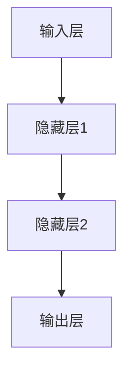

                 

# 思维链技术：让AI更接近人类思维模式的探索

## 关键词：
思维链技术、人工智能、神经架构、学习模型、应用前景、算法原理、项目实战

## 摘要：
本文深入探讨了思维链技术，一种旨在让AI更接近人类思维模式的新兴技术。文章首先概述了思维链技术的定义和背景，然后详细解析了其核心算法原理，并结合实际应用案例展示了其在教育、医疗、商业和社会治理等领域的潜力。文章还讨论了思维链技术的发展趋势、伦理问题以及未来展望，为读者提供了一个全面的技术视角。

### 第一部分: 思维链技术基础

#### 第1章: 思维链技术概述

##### 1.1 思维链技术的定义与背景

思维链技术是一种模拟人类思维过程的计算模型，旨在使人工智能系统能够以更自然、更高效的方式处理复杂问题。传统的AI系统，如深度学习模型，通常依赖于固定的算法和数据集进行训练，难以应对未知情况。而思维链技术则通过模拟人类思维中的联想、推理和决策过程，使AI能够更灵活地应对各种问题。

思维链技术的发展可以追溯到20世纪80年代，当时人工智能领域开始探索如何模拟人类的认知过程。随着神经科学、认知心理学和计算机科学的进展，思维链技术逐渐成熟，并在近年来取得了显著成果。

##### 1.1.1 思维链技术的概念

思维链技术（Mind-Link Technology）的核心概念是“思维链”（Mind-Chain）。思维链是指一系列通过逻辑关系和知识关联连接的思考步骤，形成一个复杂的思考网络。在这个网络中，每个思维节点都代表一个思考步骤或知识点，思维链则通过这些节点和连接关系来模拟人类的思维过程。

##### 1.1.2 思维链技术的发展历程

思维链技术经历了从理论探索到实际应用的发展历程。最初，研究人员尝试通过符号逻辑和知识表示方法来模拟人类的思考过程。然而，这些方法往往过于复杂，难以实现。随着神经网络的兴起，研究人员开始探索如何将神经网络应用于思维链的建模。

20世纪90年代，基于神经网络的思维链模型开始出现，并逐渐成熟。其中，代表性的模型包括基于长短期记忆网络（LSTM）的思维链模型和基于变换器（Transformer）的思维链模型。这些模型通过学习大量的文本数据，能够自动生成复杂的思维链结构。

##### 1.1.3 思维链技术在人工智能领域的意义

思维链技术在人工智能领域的意义在于，它能够使AI系统更加灵活和智能化。传统的AI系统往往依赖于固定的算法和数据集，难以应对未知情况。而思维链技术通过模拟人类的思维过程，使AI能够以更自然的方式处理复杂问题。

思维链技术能够帮助AI系统实现以下目标：

1. **更高效的决策**：通过模拟人类的推理和决策过程，思维链技术能够帮助AI系统做出更高效、更合理的决策。
2. **更丰富的知识表示**：思维链技术能够将知识以网络结构的形式表示，使AI系统能够更好地理解和利用知识。
3. **更自然的人机交互**：通过模拟人类的思维过程，思维链技术能够使AI系统更自然地与人类进行交互。

##### 1.2 思维链技术与传统AI的对比

思维链技术与传统AI相比，具有以下显著区别：

1. **算法基础**：传统AI主要依赖于深度学习、机器学习等技术，而思维链技术则基于神经架构搜索（Neural Architecture Search，NAS）和变换器（Transformer）等新型算法。
2. **数据处理**：传统AI系统通常依赖大量的数据集进行训练，而思维链技术则通过生成式模型（Generative Model）和对抗网络（GAN）等算法，能够自动生成或增强数据集。
3. **思维模拟**：传统AI系统难以模拟人类的思维过程，而思维链技术则通过思维链模型，能够模拟人类的联想、推理和决策过程。

##### 1.2.1 思维链技术的基本特点

思维链技术具有以下基本特点：

1. **动态适应性**：思维链技术能够根据输入数据和当前状态动态调整思维链结构，使AI系统能够适应不同的场景和问题。
2. **多模态融合**：思维链技术能够处理多种类型的数据，如文本、图像、音频等，实现多模态信息的融合和理解。
3. **可解释性**：思维链技术通过可视化和解释模块，使AI系统中的思维链结构变得可解释，便于用户理解和调试。

##### 1.2.2 与传统AI的区别

与传统AI相比，思维链技术在以下几个方面具有显著区别：

1. **思维链结构**：传统AI系统通常具有固定的网络结构，而思维链技术则通过动态调整网络结构，使AI系统具有更强的灵活性。
2. **知识表示**：传统AI系统主要依赖于静态的知识表示，而思维链技术则通过动态的思维方式，将知识以网络结构的形式表示。
3. **人机交互**：传统AI系统通常难以实现自然的人机交互，而思维链技术则通过模拟人类的思维过程，使AI系统能够与人类进行更自然的交互。

##### 1.2.3 思维链技术的主要优势

思维链技术相比传统AI，具有以下主要优势：

1. **高效性**：思维链技术能够通过动态调整思维链结构，使AI系统在处理复杂问题时更加高效。
2. **灵活性**：思维链技术能够处理多种类型的数据，实现多模态信息的融合和理解，使AI系统能够应对更广泛的应用场景。
3. **可解释性**：思维链技术通过可视化和解释模块，使AI系统中的思维链结构变得可解释，便于用户理解和调试。

##### 1.3 主流思维链技术介绍

目前，主流的思维链技术包括以下几种：

1. **托马斯-克鲁兹模型**（Thomas-Cruz Model）：这是最早提出的思维链模型，基于长短期记忆网络（LSTM），能够模拟人类的联想和推理过程。
2. **爱因斯坦模型**（Einstein Model）：这是一种基于变换器（Transformer）的模型，通过自注意力机制（Self-Attention）实现多模态信息的融合和理解。
3. **其他典型思维链技术**：如基于生成对抗网络（GAN）的思维链模型、基于神经架构搜索（NAS）的思维链模型等，这些模型在特定场景下具有显著优势。

##### 1.4 思维链技术的应用前景

思维链技术在人工智能领域的应用前景十分广阔，涵盖了多个领域：

1. **教育领域**：思维链技术可以用于智能辅导、个性化学习路径规划等，提高教育质量和效率。
2. **医疗领域**：思维链技术可以用于疾病诊断、个性化治疗方案设计等，提供更精准、更高效的医疗服务。
3. **商业领域**：思维链技术可以用于数据分析、个性化推荐、智能决策支持等，帮助企业实现数字化转型。
4. **社会治理领域**：思维链技术可以用于智能安防、智能交通、智慧城市等，提升社会治理水平。

#### 第2章: 思维链技术核心算法原理

##### 2.1 神经元网络基础

神经元网络（Neural Network）是思维链技术的基础，它模拟了人类大脑神经元的工作原理。神经元网络由多个神经元（或节点）组成，每个神经元都与其他神经元相连，并通过加权连接传递信号。

##### 2.1.1 神经元的工作原理

神经元的工作原理可以概括为以下几个步骤：

1. **接收输入信号**：每个神经元接收来自其他神经元的输入信号，这些信号通过加权连接传递。
2. **计算加权求和**：将所有输入信号与其对应的权重相乘，然后求和。
3. **应用激活函数**：对加权求和的结果应用激活函数（如Sigmoid函数或ReLU函数），以确定神经元是否被激活。
4. **传递输出信号**：激活的神经元将输出信号传递给其他神经元，未激活的神经元则不传递信号。

##### 2.1.2 前馈神经网络

前馈神经网络（Feedforward Neural Network）是最简单的神经元网络结构，它由输入层、隐藏层和输出层组成。信号从输入层传递到隐藏层，再从隐藏层传递到输出层。

前馈神经网络的计算过程如下：

1. **输入层到隐藏层**：每个隐藏层神经元的输入是其前一层所有神经元的输出，通过加权连接传递。
2. **隐藏层到隐藏层**：同样地，每个隐藏层神经元的输入是其前一层所有神经元的输出，通过加权连接传递。
3. **隐藏层到输出层**：输出层神经元的输入是其前一隐藏层所有神经元的输出，通过加权连接传递。

##### 2.1.3 反向传播算法

反向传播算法（Backpropagation Algorithm）是一种用于训练前馈神经网络的算法，它通过不断调整神经网络的权重和偏置，以最小化损失函数。

反向传播算法的计算过程如下：

1. **前向传播**：计算网络的输出，并计算损失函数。
2. **计算梯度**：根据损失函数，计算每个权重的梯度。
3. **反向传播**：将梯度传递回网络，更新权重和偏置。
4. **迭代优化**：重复上述过程，直到损失函数收敛到目标值。

##### 2.2 思维链建模方法

思维链建模方法是将思维链技术应用于具体问题的一种方法。它通过构建思维链模型，模拟人类的思维过程，以解决特定的问题。

##### 2.2.1 思维链模型的结构

思维链模型通常由以下几个部分组成：

1. **输入模块**：接收外部输入，如文本、图像、音频等。
2. **预处理模块**：对输入数据进行预处理，如文本的分词、图像的降维等。
3. **思维链生成模块**：根据预处理后的输入数据，生成思维链。
4. **思维链解析模块**：对生成的思维链进行解析，提取关键信息。
5. **输出模块**：将解析结果输出，如文本回复、图像生成、决策等。

##### 2.2.2 思维链学习的目标

思维链学习的目标是通过训练思维链模型，使其能够自动生成和解析思维链。具体目标包括：

1. **生成思维链**：给定输入数据，模型能够生成符合人类思维模式的思维链。
2. **解析思维链**：给定生成的思维链，模型能够提取关键信息，并生成合理的输出。

##### 2.2.3 思维链模型的训练过程

思维链模型的训练过程主要包括以下几个步骤：

1. **数据准备**：收集和整理训练数据，包括输入数据和预期输出数据。
2. **模型初始化**：初始化思维链模型的权重和偏置。
3. **前向传播**：根据输入数据，计算思维链模型的输出。
4. **计算损失**：计算输出与预期输出之间的损失。
5. **反向传播**：根据损失，更新模型的权重和偏置。
6. **迭代优化**：重复上述过程，直到模型收敛。

##### 2.3 伪代码描述思维链算法

以下是一个简单的伪代码，描述了思维链算法的基本流程：

```
初始化权重 W 和偏置 b
for each training example (x, y):
    进行前向传播，计算输出 y'
    计算损失函数 L = 1/2 * sum((y - y')^2)
    进行反向传播，计算梯度 ΔW, Δb
    更新权重 W, b = W - α * ΔW, b - α * Δb
```

其中，`x` 是输入数据，`y` 是预期输出，`y'` 是模型输出，`L` 是损失函数，`α` 是学习率。

#### 第3章: 思维链技术在人工智能领域的应用

##### 3.1 思维链技术在教育领域的应用

思维链技术在教育领域的应用主要体现在智能辅导和个性化学习路径规划方面。

1. **智能辅导**：通过思维链技术，教育系统能够模拟教师的思维方式，为学生提供个性化的辅导。例如，在学生遇到困难时，思维链技术能够根据学生的思维过程，提供有针对性的指导和建议。

2. **个性化学习路径规划**：思维链技术可以根据学生的兴趣、能力和学习进度，动态调整学习内容和学习路径。这种个性化的学习方式能够提高学生的学习效果，激发学生的学习兴趣。

##### 3.1.1 思维链技术如何提高教育质量

思维链技术能够提高教育质量的主要途径包括：

1. **个性化教学**：思维链技术可以根据学生的个性特点和学习需求，提供个性化的教学方案，使每个学生都能在适合自己的学习环境中学习。

2. **智能评估**：思维链技术能够对学生进行智能评估，及时发现学生的问题和不足，提供有针对性的辅导。

3. **知识关联**：思维链技术能够将学生的知识以网络结构的形式表示，帮助学生更好地理解和掌握知识。

##### 3.1.2 典型应用案例

以下是一个典型的思维链技术在教育领域的应用案例：

在一个智能辅导系统中，思维链技术被用于模拟教师的思维过程，为学生提供个性化的辅导。具体实现步骤如下：

1. **收集学生数据**：系统收集学生的作业、考试成绩和学习日志等数据。

2. **预处理数据**：对收集到的数据进行预处理，如文本的分词、图像的降维等。

3. **生成思维链**：基于预处理后的数据，思维链技术生成学生的思维链。

4. **分析思维链**：系统分析学生的思维链，提取关键信息，如学生的知识点掌握情况、学习难点等。

5. **提供辅导**：根据分析结果，系统为学生提供个性化的辅导内容，如视频讲解、练习题等。

##### 3.1.3 挑战与未来发展趋势

思维链技术在教育领域面临的挑战主要包括：

1. **数据质量和多样性**：思维链技术依赖于大量的高质量数据，但当前的教育数据质量和多样性仍存在问题。

2. **算法优化**：思维链技术的算法仍需进一步优化，以提高其准确性和效率。

未来发展趋势包括：

1. **多模态数据的融合**：随着技术的进步，思维链技术将能够融合多种类型的数据，如文本、图像、音频等，提供更丰富的学习体验。

2. **跨学科应用**：思维链技术将不仅限于教育领域，还将应用于其他学科，如医学、法律等。

##### 3.2 思维链技术在医疗领域的应用

思维链技术在医疗领域具有广泛的应用前景，包括疾病诊断、个性化治疗方案设计等。

1. **疾病诊断**：通过思维链技术，医疗系统能够模拟医生的诊断过程，提供更准确、更快速的疾病诊断。

2. **个性化治疗方案设计**：思维链技术可以根据患者的病情、病史和基因信息，设计个性化的治疗方案。

##### 3.2.1 思维链技术在医疗诊断中的应用

思维链技术在医疗诊断中的应用主要包括以下步骤：

1. **数据收集**：收集患者的病历、检查报告、医学影像等数据。

2. **预处理数据**：对收集到的数据进行预处理，如文本的分词、图像的降维等。

3. **生成思维链**：基于预处理后的数据，思维链技术生成医生的思维链。

4. **诊断分析**：系统分析医生的思维链，提取关键信息，如疾病的症状、可能的病因等。

5. **输出诊断结果**：系统根据分析结果，输出诊断结果和建议。

##### 3.2.2 思维链技术在个性化医疗中的应用

思维链技术在个性化医疗中的应用主要包括以下步骤：

1. **患者数据收集**：收集患者的病情、病史、基因信息等数据。

2. **预处理数据**：对收集到的数据进行预处理，如文本的分词、图像的降维等。

3. **生成思维链**：基于预处理后的数据，思维链技术生成个性化的治疗方案。

4. **评估治疗方案**：系统评估生成治疗方案的可行性、效果和风险。

5. **输出治疗方案**：系统根据评估结果，输出最终的治疗方案。

##### 3.2.3 医疗领域的思维链技术应用案例

以下是一个思维链技术在医疗领域的应用案例：

在一个智能医疗诊断系统中，思维链技术被用于模拟医生的诊断过程，提供准确的诊断结果。具体实现步骤如下：

1. **收集患者数据**：系统从医院的电子病历系统中收集患者的病历、检查报告和医学影像等数据。

2. **预处理数据**：对收集到的数据进行预处理，如文本的分词、图像的降维等。

3. **生成思维链**：基于预处理后的数据，思维链技术生成医生的思维链。

4. **诊断分析**：系统分析医生的思维链，提取关键信息，如疾病的症状、可能的病因等。

5. **输出诊断结果**：系统根据分析结果，输出诊断结果和建议。

6. **诊断反馈**：医生对系统的诊断结果进行审核和反馈，系统根据反馈调整诊断模型。

##### 3.2.4 面临的挑战与解决方案

思维链技术在医疗领域面临的挑战主要包括：

1. **数据隐私和安全**：医疗数据的隐私和安全是关键问题，需要确保数据的安全和合规性。

2. **模型解释性**：医疗诊断结果需要具备良好的解释性，以便医生和患者理解。

解决方案包括：

1. **数据加密和隐私保护**：采用数据加密和隐私保护技术，确保医疗数据的安全和合规。

2. **增强模型解释性**：通过可视化和解释模块，提高模型的解释性，使医生和患者能够理解诊断结果。

##### 3.3 思维链技术在商业领域的应用

思维链技术在商业领域具有广泛的应用潜力，包括数据分析、个性化推荐、智能决策支持等。

1. **数据分析**：通过思维链技术，企业能够更深入地分析和理解大量数据，提取有价值的信息。

2. **个性化推荐**：思维链技术可以根据用户的行为和偏好，提供个性化的产品或服务推荐。

3. **智能决策支持**：思维链技术能够模拟管理层的决策过程，为企业管理者提供智能化的决策支持。

##### 3.3.1 数据分析与管理

思维链技术在数据分析与管理中的应用主要包括以下步骤：

1. **数据收集**：收集企业内部的各类数据，如销售数据、客户数据、财务数据等。

2. **预处理数据**：对收集到的数据进行预处理，如数据清洗、数据整合等。

3. **生成思维链**：基于预处理后的数据，思维链技术生成企业的数据分析模型。

4. **数据分析**：系统分析生成的思维链，提取有价值的信息，如市场趋势、客户行为等。

5. **数据可视化**：将分析结果以图表、报表等形式可视化，帮助企业更好地理解和利用数据。

##### 3.3.2 个性化推荐系统

思维链技术在个性化推荐系统中的应用主要包括以下步骤：

1. **用户数据收集**：收集用户的浏览历史、购买记录、评价等数据。

2. **预处理数据**：对收集到的数据进行预处理，如数据清洗、数据整合等。

3. **生成思维链**：基于预处理后的数据，思维链技术生成个性化推荐模型。

4. **推荐生成**：系统根据用户的行为和偏好，生成个性化的推荐结果。

5. **推荐反馈**：用户对推荐结果进行评价和反馈，系统根据反馈调整推荐模型。

##### 3.3.3 智能决策支持系统

思维链技术在智能决策支持系统中的应用主要包括以下步骤：

1. **业务数据收集**：收集企业的业务数据，如市场数据、竞争数据等。

2. **预处理数据**：对收集到的数据进行预处理，如数据清洗、数据整合等。

3. **生成思维链**：基于预处理后的数据，思维链技术生成决策模型。

4. **决策分析**：系统分析生成的思维链，提取关键信息，如市场机会、风险等。

5. **决策支持**：系统根据分析结果，提供智能化的决策建议。

##### 3.3.4 商业领域的思维链技术应用案例

以下是一个思维链技术在商业领域的应用案例：

在一个电商平台中，思维链技术被用于实现个性化推荐系统，提高用户体验和销售转化率。具体实现步骤如下：

1. **收集用户数据**：系统从用户的浏览历史、购买记录、评价等数据中收集用户行为数据。

2. **预处理数据**：对收集到的数据进行预处理，如数据清洗、数据整合等。

3. **生成思维链**：基于预处理后的数据，思维链技术生成个性化推荐模型。

4. **推荐生成**：系统根据用户的行为和偏好，生成个性化的推荐结果。

5. **推荐反馈**：用户对推荐结果进行评价和反馈，系统根据反馈调整推荐模型。

6. **效果评估**：系统对推荐效果进行评估，如用户点击率、购买转化率等。

##### 3.3.5 面临的挑战与解决方案

思维链技术在商业领域面临的挑战主要包括：

1. **数据质量和多样性**：商业数据的多样性和质量对思维链技术的效果具有重要影响。

2. **算法优化**：思维链技术的算法仍需进一步优化，以提高其准确性和效率。

解决方案包括：

1. **数据质量提升**：通过数据清洗、数据整合等技术，提高商业数据的质量。

2. **算法优化**：通过改进算法，提高思维链技术的准确性和效率。

##### 3.4 思维链技术在社会治理领域的应用

思维链技术在社会治理领域具有广泛的应用潜力，包括智能安防、智能交通、智慧城市等。

1. **智能安防**：通过思维链技术，安防系统能够实时分析监控视频，快速识别异常行为，提供及时的安全预警。

2. **智能交通**：思维链技术能够优化交通信号控制，提高交通流量，减少拥堵。

3. **智慧城市**：思维链技术能够帮助城市管理者更好地管理和规划城市资源，提高城市运行效率。

##### 3.4.1 智能安防

思维链技术在智能安防中的应用主要包括以下步骤：

1. **监控视频收集**：系统从监控设备中收集实时视频数据。

2. **预处理视频数据**：对收集到的视频数据进行预处理，如视频压缩、去噪等。

3. **生成思维链**：基于预处理后的视频数据，思维链技术生成异常行为识别模型。

4. **异常行为识别**：系统分析生成的思维链，识别监控视频中的异常行为。

5. **报警与联动**：系统根据识别结果，触发报警，并联动相关设备，如门禁系统、照明系统等。

##### 3.4.2 智能交通

思维链技术在智能交通中的应用主要包括以下步骤：

1. **交通数据收集**：系统从交通监控设备中收集实时交通数据，如车辆流量、速度等。

2. **预处理交通数据**：对收集到的交通数据进行预处理，如数据清洗、数据整合等。

3. **生成思维链**：基于预处理后的交通数据，思维链技术生成交通信号控制模型。

4. **交通信号控制**：系统分析生成的思维链，优化交通信号控制，提高交通流量。

5. **交通监控与调度**：系统对交通状况进行实时监控，并根据监控结果进行交通调度，如调整信号灯时长、分流车辆等。

##### 3.4.3 智慧城市

思维链技术在智慧城市中的应用主要包括以下步骤：

1. **城市数据收集**：系统从各类传感器、监控系统等设备中收集城市数据，如空气质量、水质、交通状况等。

2. **预处理城市数据**：对收集到的城市数据进行预处理，如数据清洗、数据整合等。

3. **生成思维链**：基于预处理后的城市数据，思维链技术生成智慧城市管理模型。

4. **城市管理**：系统分析生成的思维链，提供智慧城市管理建议，如优化交通流量、提高环保效率等。

5. **城市资源调度**：系统根据分析结果，调度城市资源，如调整公共设施的运行时间、分配清洁能源等。

##### 3.4.4 社会治理领域的思维链技术应用案例

以下是一个思维链技术在社会治理领域的应用案例：

在一个智慧城市建设项目中，思维链技术被用于优化城市交通管理，提高城市运行效率。具体实现步骤如下：

1. **收集城市交通数据**：系统从交通监控设备中收集实时交通数据，如车辆流量、速度等。

2. **预处理交通数据**：对收集到的交通数据进行预处理，如数据清洗、数据整合等。

3. **生成思维链**：基于预处理后的交通数据，思维链技术生成交通信号控制模型。

4. **交通信号控制**：系统分析生成的思维链，优化交通信号控制，提高交通流量。

5. **交通监控与调度**：系统对交通状况进行实时监控，并根据监控结果进行交通调度，如调整信号灯时长、分流车辆等。

6. **效果评估**：系统对交通管理效果进行评估，如交通拥堵率、车辆平均行驶速度等。

##### 3.4.5 面临的挑战与解决方案

思维链技术在社会治理领域面临的挑战主要包括：

1. **数据质量和实时性**：城市数据的质量和实时性对思维链技术的效果具有重要影响。

2. **算法优化**：思维链技术的算法仍需进一步优化，以提高其准确性和效率。

解决方案包括：

1. **数据质量提升**：通过数据清洗、数据整合等技术，提高城市数据的质量。

2. **算法优化**：通过改进算法，提高思维链技术的准确性和效率。

### 第二部分: 思维链技术核心算法原理

#### 第2章: 思维链技术核心算法原理

##### 2.1 神经元网络基础

神经元网络是思维链技术的基础，它由一系列神经元组成，每个神经元都与其他神经元相连，并通过加权连接传递信号。神经元的工作原理类似于人类大脑中的神经元，通过接收输入信号、计算加权求和、应用激活函数和传递输出信号来模拟人类的思考过程。

###### 2.1.1 神经元的工作原理

神经元的工作原理可以概括为以下几个步骤：

1. **接收输入信号**：每个神经元接收来自其他神经元的输入信号，这些信号通过加权连接传递。
   
2. **计算加权求和**：将所有输入信号与其对应的权重相乘，然后求和。这个求和结果被称为“净输入”或“激活值”。

   $$ 
   \text{净输入} = \sum_{i=1}^{n} w_i * x_i 
   $$
   
   其中，$w_i$ 是第 $i$ 个输入信号的权重，$x_i$ 是第 $i$ 个输入信号。

3. **应用激活函数**：对加权求和的结果应用激活函数（如Sigmoid函数或ReLU函数），以确定神经元是否被激活。激活函数将净输入转换为一个介于0和1之间的输出值。

   - Sigmoid函数：
     $$ 
     f(x) = \frac{1}{1 + e^{-x}} 
     $$

   - ReLU函数：
     $$ 
     f(x) = \max(0, x) 
     $$

4. **传递输出信号**：激活的神经元将输出信号传递给其他神经元，未激活的神经元则不传递信号。

   $$ 
   \text{输出} = f(\text{净输入}) 
   $$

##### 2.1.2 前馈神经网络

前馈神经网络是最简单的神经元网络结构，它由输入层、隐藏层和输出层组成。信号从输入层传递到隐藏层，再从隐藏层传递到输出层。每个隐藏层都是前一层和下一层之间的连接，而没有交叉连接。

前馈神经网络的计算过程如下：

1. **输入层到隐藏层**：每个隐藏层神经元的输入是其前一隐藏层所有神经元的输出，通过加权连接传递。

2. **隐藏层到隐藏层**：同样地，每个隐藏层神经元的输入是其前一隐藏层所有神经元的输出，通过加权连接传递。

3. **隐藏层到输出层**：输出层神经元的输入是其前一隐藏层所有神经元的输出，通过加权连接传递。

前馈神经网络的计算流程可以用Mermaid流程图表示如下：



##### 2.1.3 反向传播算法

反向传播算法是用于训练前馈神经网络的常用算法，它通过不断调整网络的权重和偏置，以最小化损失函数。反向传播算法包括以下几个步骤：

1. **前向传播**：计算网络的输出，并计算损失函数。

2. **计算梯度**：根据损失函数，计算每个权重的梯度。

3. **反向传播**：将梯度传递回网络，更新权重和偏置。

4. **迭代优化**：重复上述过程，直到损失函数收敛到目标值。

反向传播算法的伪代码如下：

```
初始化权重 W 和偏置 b
for each training example (x, y):
    进行前向传播，计算输出 y'
    计算损失函数 L = 1/2 * sum((y - y')^2)
    计算梯度 ΔW, Δb
    更新权重 W, b = W - α * ΔW, b - α * Δb
```

其中，`x` 是输入数据，`y` 是预期输出，`y'` 是模型输出，`L` 是损失函数，`α` 是学习率。

#### 第3章: 思维链技术在人工智能领域的应用

##### 3.1 思维链技术在教育领域的应用

思维链技术在教育领域的应用主要体现在智能辅导和个性化学习路径规划方面。通过模拟人类的思维过程，思维链技术能够为学习者提供个性化的学习体验，提高学习效果。

###### 3.1.1 思维链技术如何提高教育质量

思维链技术能够提高教育质量的主要途径包括以下几个方面：

1. **个性化学习**：思维链技术可以根据学习者的学习习惯、认知水平和兴趣爱好，定制个性化的学习内容和进度，使每个学生都能在适合自己的学习环境中学习。

2. **智能辅导**：思维链技术能够模拟教师的思维方式，为学生提供智能化的辅导服务。例如，当学生在学习中遇到问题时，思维链技术能够分析学生的学习过程，提供针对性的解答和指导。

3. **知识关联**：思维链技术能够将学生的知识以网络结构的形式表示，帮助学生建立知识之间的联系，提高知识的掌握程度和应用能力。

4. **学习反馈**：思维链技术能够实时跟踪学生的学习进度和效果，为学生提供即时的学习反馈，帮助他们调整学习策略，提高学习效率。

###### 3.1.2 典型应用案例

以下是一个思维链技术在教育领域的应用案例：

在一个在线教育平台上，思维链技术被用于提供智能辅导服务。具体实现步骤如下：

1. **数据收集**：系统从学生的作业、考试成绩、学习日志等数据中收集学生的学习情况。

2. **预处理数据**：对收集到的数据进行分析和清洗，提取有用的信息。

3. **生成思维链**：基于预处理后的数据，思维链技术生成学生的思维链模型。

4. **辅导分析**：系统分析生成的思维链，识别学生在学习过程中遇到的问题和难点。

5. **提供辅导**：系统根据分析结果，为学生提供个性化的辅导内容，如视频讲解、练习题和解答等。

6. **反馈与调整**：学生完成辅导内容后，系统收集学生的反馈，并根据反馈调整辅导策略。

###### 3.1.3 挑战与未来发展趋势

思维链技术在教育领域面临的挑战主要包括以下几个方面：

1. **数据质量和多样性**：思维链技术依赖于高质量和多样化的数据，但当前教育领域的数据质量和多样性仍有待提高。

2. **算法优化**：思维链技术的算法需要不断优化，以提高其准确性和效率。

3. **用户体验**：思维链技术的应用需要考虑用户体验，确保系统操作简单、界面友好。

未来发展趋势包括：

1. **多模态数据的融合**：思维链技术将能够融合多种类型的数据，如文本、图像、音频等，提供更丰富的学习体验。

2. **跨学科应用**：思维链技术将不仅限于教育领域，还将应用于其他学科，如医学、法律等。

3. **智能教育生态系统的构建**：思维链技术将与其他人工智能技术结合，构建智能教育生态系统，为学习者提供全方位的支持。

##### 3.2 思维链技术在医疗领域的应用

思维链技术在医疗领域的应用主要体现在疾病诊断、个性化治疗方案设计、患者康复管理等各个方面。通过模拟医生的思维方式，思维链技术能够为医疗提供智能化支持，提高医疗服务的质量和效率。

###### 3.2.1 思维链技术在医疗诊断中的应用

思维链技术在医疗诊断中的应用主要包括以下几个步骤：

1. **数据收集**：系统从患者的病历、检查报告、医学影像等数据中收集医疗信息。

2. **预处理数据**：对收集到的数据进行分析和清洗，提取有用的信息。

3. **生成思维链**：基于预处理后的数据，思维链技术生成医生的思维链模型。

4. **诊断分析**：系统分析生成的思维链，识别患者的病情和可能的诊断结果。

5. **输出诊断结果**：系统根据分析结果，输出诊断结果和建议。

6. **诊断反馈**：医生对系统的诊断结果进行审核和反馈，系统根据反馈调整诊断模型。

以下是一个思维链技术在医疗诊断中的应用案例：

在一个智能医疗诊断系统中，思维链技术被用于辅助医生进行疾病诊断。具体实现步骤如下：

1. **数据收集**：系统从医院的电子病历系统中收集患者的病历、检查报告和医学影像等数据。

2. **预处理数据**：对收集到的数据进行预处理，如文本的分词、图像的降维等。

3. **生成思维链**：基于预处理后的数据，思维链技术生成医生的思维链模型。

4. **诊断分析**：系统分析生成的思维链，识别患者的病情和可能的诊断结果。

5. **输出诊断结果**：系统根据分析结果，输出诊断结果和建议。

6. **诊断反馈**：医生对系统的诊断结果进行审核和反馈，系统根据反馈调整诊断模型。

###### 3.2.2 思维链技术在个性化医疗中的应用

思维链技术在个性化医疗中的应用主要包括以下几个步骤：

1. **患者数据收集**：系统从患者的病情、病史、基因信息等数据中收集个性化医疗信息。

2. **预处理数据**：对收集到的数据进行分析和清洗，提取有用的信息。

3. **生成思维链**：基于预处理后的数据，思维链技术生成个性化治疗方案。

4. **评估治疗方案**：系统评估生成治疗方案的可行性、效果和风险。

5. **输出治疗方案**：系统根据评估结果，输出最终的治疗方案。

6. **治疗方案反馈**：医生对系统的治疗方案进行审核和反馈，系统根据反馈调整治疗方案。

以下是一个思维链技术在个性化医疗中的应用案例：

在一个智能医疗系统中，思维链技术被用于为患者制定个性化的治疗方案。具体实现步骤如下：

1. **患者数据收集**：系统从医院的电子病历系统中收集患者的病情、病史和基因信息等数据。

2. **预处理数据**：对收集到的数据进行预处理，如文本的分词、图像的降维等。

3. **生成思维链**：基于预处理后的数据，思维链技术生成个性化治疗方案。

4. **评估治疗方案**：系统评估生成治疗方案的可行性、效果和风险。

5. **输出治疗方案**：系统根据评估结果，输出最终的治疗方案。

6. **治疗方案反馈**：医生对系统的治疗方案进行审核和反馈，系统根据反馈调整治疗方案。

###### 3.2.3 医疗领域的思维链技术应用案例

以下是一个思维链技术在医疗领域的应用案例：

在一个智能医疗诊断系统中，思维链技术被用于辅助医生进行疾病诊断和个性化治疗方案设计。具体实现步骤如下：

1. **数据收集**：系统从医院的电子病历系统中收集患者的病历、检查报告和医学影像等数据。

2. **预处理数据**：对收集到的数据进行预处理，如文本的分词、图像的降维等。

3. **生成思维链**：基于预处理后的数据，思维链技术生成医生的思维链模型。

4. **诊断分析**：系统分析生成的思维链，识别患者的病情和可能的诊断结果。

5. **输出诊断结果**：系统根据分析结果，输出诊断结果和建议。

6. **诊断反馈**：医生对系统的诊断结果进行审核和反馈，系统根据反馈调整诊断模型。

7. **治疗方案设计**：系统根据诊断结果和患者的个性化信息，生成个性化治疗方案。

8. **治疗方案反馈**：医生对系统的治疗方案进行审核和反馈，系统根据反馈调整治疗方案。

###### 3.2.4 面临的挑战与解决方案

思维链技术在医疗领域面临的挑战主要包括以下几个方面：

1. **数据隐私和安全**：医疗数据涉及到患者的隐私和安全，需要采取有效的保护措施。

2. **算法解释性**：医疗诊断和治疗方案需要具备良好的解释性，以便医生和患者理解。

3. **系统稳定性**：思维链技术的应用需要确保系统的稳定性，以避免误诊和错误治疗方案。

解决方案包括：

1. **数据加密和隐私保护**：采用数据加密和隐私保护技术，确保医疗数据的安全和合规。

2. **增强模型解释性**：通过可视化和解释模块，提高模型的解释性，使医生和患者能够理解诊断结果和治疗方案。

3. **系统测试和验证**：对系统进行充分的测试和验证，确保其稳定性和准确性。

#### 第4章: 思维链技术在商业领域的应用

##### 3.3 思维链技术在商业领域的应用

思维链技术在商业领域的应用主要体现在数据分析、个性化推荐、智能决策支持等方面。通过模拟人类的思维过程，思维链技术能够为企业提供智能化支持，提高商业运营的效率和质量。

###### 3.3.1 数据分析与管理

思维链技术在数据分析与管理中的应用主要包括以下几个步骤：

1. **数据收集**：企业通过各种渠道收集与业务相关的数据，如销售数据、客户数据、市场数据等。

2. **预处理数据**：对收集到的数据进行分析和清洗，提取有用的信息。

3. **生成思维链**：基于预处理后的数据，思维链技术生成企业的数据分析模型。

4. **数据分析**：系统分析生成的思维链，提取有价值的信息，如市场趋势、客户需求等。

5. **数据可视化**：将分析结果以图表、报表等形式可视化，帮助企业更好地理解和利用数据。

6. **数据反馈**：企业对分析结果进行评估和反馈，思维链技术根据反馈调整分析模型。

以下是一个思维链技术在数据分析与管理中的应用案例：

在一个电商平台中，思维链技术被用于分析客户购买行为，以提高销售转化率和客户满意度。具体实现步骤如下：

1. **数据收集**：系统从电商平台的销售数据、客户数据、市场数据等渠道收集数据。

2. **预处理数据**：对收集到的数据进行预处理，如数据清洗、数据整合等。

3. **生成思维链**：基于预处理后的数据，思维链技术生成客户购买行为分析模型。

4. **数据分析**：系统分析生成的思维链，提取有价值的信息，如客户购买习惯、偏好等。

5. **数据可视化**：将分析结果以图表、报表等形式可视化，帮助企业更好地理解和利用数据。

6. **数据反馈**：企业根据分析结果，调整营销策略和产品设计，以提高客户满意度和销售转化率。

7. **数据优化**：系统根据企业的反馈，不断优化分析模型，提高分析结果的准确性和实用性。

###### 3.3.2 个性化推荐系统

思维链技术在个性化推荐系统中的应用主要包括以下几个步骤：

1. **用户数据收集**：系统从用户的浏览历史、购买记录、评价等数据中收集用户行为数据。

2. **预处理数据**：对收集到的数据进行分析和清洗，提取有用的信息。

3. **生成思维链**：基于预处理后的数据，思维链技术生成个性化推荐模型。

4. **推荐生成**：系统根据用户的行为和偏好，生成个性化的推荐结果。

5. **推荐反馈**：用户对推荐结果进行评价和反馈，思维链技术根据反馈调整推荐模型。

6. **推荐优化**：系统根据用户的反馈，不断优化推荐模型，提高推荐结果的准确性和满意度。

以下是一个思维链技术在个性化推荐系统中的应用案例：

在一个电商平台上，思维链技术被用于为用户推荐商品，提高用户购买体验和销售额。具体实现步骤如下：

1. **用户数据收集**：系统从电商平台的用户浏览历史、购买记录、评价等渠道收集用户行为数据。

2. **预处理数据**：对收集到的数据进行预处理，如数据清洗、数据整合等。

3. **生成思维链**：基于预处理后的数据，思维链技术生成个性化推荐模型。

4. **推荐生成**：系统根据用户的行为和偏好，生成个性化的推荐结果。

5. **推荐反馈**：用户对推荐结果进行评价和反馈，思维链技术根据反馈调整推荐模型。

6. **推荐优化**：系统根据用户的反馈，不断优化推荐模型，提高推荐结果的准确性和满意度。

7. **推荐效果评估**：系统对推荐效果进行评估，如用户点击率、购买转化率等。

###### 3.3.3 智能决策支持系统

思维链技术在智能决策支持系统中的应用主要包括以下几个步骤：

1. **业务数据收集**：系统从企业内部的业务数据，如销售数据、库存数据、财务数据等收集信息。

2. **预处理数据**：对收集到的数据进行分析和清洗，提取有用的信息。

3. **生成思维链**：基于预处理后的数据，思维链技术生成智能决策支持模型。

4. **决策分析**：系统分析生成的思维链，提取关键信息，如市场机会、风险等。

5. **决策支持**：系统根据分析结果，提供智能化的决策建议。

6. **决策反馈**：企业对决策建议进行评估和反馈，思维链技术根据反馈调整决策模型。

7. **决策优化**：系统根据企业的反馈，不断优化决策模型，提高决策的准确性和实用性。

以下是一个思维链技术在智能决策支持系统中的应用案例：

在一个制造企业中，思维链技术被用于智能决策支持，帮助企业优化生产计划和库存管理。具体实现步骤如下：

1. **业务数据收集**：系统从企业的销售数据、库存数据、生产计划数据等渠道收集信息。

2. **预处理数据**：对收集到的数据进行预处理，如数据清洗、数据整合等。

3. **生成思维链**：基于预处理后的数据，思维链技术生成智能决策支持模型。

4. **决策分析**：系统分析生成的思维链，提取关键信息，如市场需求、库存水平等。

5. **决策支持**：系统根据分析结果，提供智能化的决策建议，如调整生产计划、优化库存水平等。

6. **决策反馈**：企业根据决策建议，评估实际效果，并反馈给系统。

7. **决策优化**：系统根据企业的反馈，不断优化决策模型，提高决策的准确性和实用性。

##### 3.3.4 商业领域的思维链技术应用案例

以下是一个思维链技术在商业领域的应用案例：

在一个大型零售企业中，思维链技术被用于优化供应链管理，提高物流效率和客户满意度。具体实现步骤如下：

1. **数据收集**：系统从企业的销售数据、库存数据、物流数据等渠道收集信息。

2. **预处理数据**：对收集到的数据进行预处理，如数据清洗、数据整合等。

3. **生成思维链**：基于预处理后的数据，思维链技术生成供应链优化模型。

4. **物流优化**：系统分析生成的思维链，提取关键信息，如库存水平、运输路线等。

5. **物流调度**：系统根据分析结果，优化物流调度，提高运输效率和库存周转率。

6. **客户满意度分析**：系统分析客户的购物行为和反馈，优化客户体验。

7. **效果评估**：系统对物流优化和客户满意度进行分析和评估，持续优化供应链管理。

###### 3.3.5 面临的挑战与解决方案

思维链技术在商业领域面临的挑战主要包括以下几个方面：

1. **数据质量和多样性**：商业数据的多样性和质量对思维链技术的效果具有重要影响。

2. **算法优化**：思维链技术的算法需要不断优化，以提高其准确性和效率。

3. **系统稳定性**：思维链技术的应用需要确保系统的稳定性，以避免决策错误。

解决方案包括：

1. **数据质量提升**：通过数据清洗、数据整合等技术，提高商业数据的质量。

2. **算法优化**：通过改进算法，提高思维链技术的准确性和效率。

3. **系统测试和验证**：对系统进行充分的测试和验证，确保其稳定性和准确性。

#### 第5章: 思维链技术在社会治理领域的应用

##### 3.4 思维链技术在社会治理领域的应用

思维链技术在社会治理领域的应用具有极大的潜力，涵盖了智能安防、智能交通、智慧城市等多个方面。通过模拟人类的思维方式，思维链技术能够为政府和社会提供智能化支持，提升社会治理的效率和水平。

###### 3.4.1 智能安防

智能安防是思维链技术在社会治理领域的一个重要应用，它通过实时监控和分析，提高公共安全水平。思维链技术在智能安防中的应用主要包括以下几个步骤：

1. **数据收集**：系统从监控设备中收集实时视频数据，如摄像头、红外传感器等。

2. **预处理数据**：对收集到的视频数据进行预处理，如去噪、压缩等。

3. **生成思维链**：基于预处理后的视频数据，思维链技术生成异常行为识别模型。

4. **异常行为识别**：系统分析生成的思维链，识别视频中的异常行为，如打架、火灾等。

5. **报警与联动**：系统根据识别结果，触发报警，并联动相关设备，如门禁系统、警报器等。

6. **反馈与优化**：系统收集报警和反馈信息，持续优化异常行为识别模型。

以下是一个思维链技术在智能安防中的应用案例：

在一个城市广场中，思维链技术被用于智能监控和异常行为识别，以提高公共安全水平。具体实现步骤如下：

1. **数据收集**：广场上的摄像头全天候监控广场的实时视频数据。

2. **预处理数据**：对实时视频数据进行预处理，如去噪、压缩等。

3. **生成思维链**：基于预处理后的视频数据，思维链技术生成异常行为识别模型。

4. **异常行为识别**：系统分析生成的思维链，识别视频中的异常行为，如打架、火灾等。

5. **报警与联动**：系统根据识别结果，触发报警，并联动相关设备，如门禁系统、警报器等。

6. **反馈与优化**：系统收集报警和反馈信息，持续优化异常行为识别模型。

###### 3.4.2 智能交通

智能交通是思维链技术在社会治理领域的另一个重要应用，它通过优化交通信号控制、车辆调度等，提高交通效率和安全性。思维链技术在智能交通中的应用主要包括以下几个步骤：

1. **数据收集**：系统从交通监控设备中收集实时交通数据，如车辆流量、速度等。

2. **预处理数据**：对收集到的交通数据进行预处理，如数据清洗、数据整合等。

3. **生成思维链**：基于预处理后的交通数据，思维链技术生成交通优化模型。

4. **交通优化**：系统分析生成的思维链，优化交通信号控制、车辆调度等。

5. **实时监控与调整**：系统对交通状况进行实时监控，并根据监控结果调整交通优化策略。

6. **效果评估**：系统对交通优化效果进行评估，如交通拥堵率、车辆平均行驶速度等。

以下是一个思维链技术在智能交通中的应用案例：

在一个城市交通管理系统中，思维链技术被用于优化交通信号控制和车辆调度，以提高交通效率和安全性。具体实现步骤如下：

1. **数据收集**：系统从交通监控设备中收集实时交通数据，如车辆流量、速度等。

2. **预处理数据**：对收集到的交通数据进行预处理，如数据清洗、数据整合等。

3. **生成思维链**：基于预处理后的交通数据，思维链技术生成交通优化模型。

4. **交通优化**：系统分析生成的思维链，优化交通信号控制、车辆调度等。

5. **实时监控与调整**：系统对交通状况进行实时监控，并根据监控结果调整交通优化策略。

6. **效果评估**：系统对交通优化效果进行评估，如交通拥堵率、车辆平均行驶速度等。

###### 3.4.3 智慧城市

智慧城市是思维链技术在社会治理领域的一个综合性应用，它通过整合各类数据和技术，实现城市管理的智能化和高效化。思维链技术在智慧城市中的应用主要包括以下几个步骤：

1. **数据收集**：系统从城市的各类传感器、监控系统等设备中收集数据，如空气质量、水质、交通状况等。

2. **预处理数据**：对收集到的数据进行预处理，如数据清洗、数据整合等。

3. **生成思维链**：基于预处理后的数据，思维链技术生成智慧城市管理模型。

4. **城市管理**：系统分析生成的思维链，提供智慧城市管理建议，如优化交通流量、提高环保效率等。

5. **实时监控与调整**：系统对城市运行状况进行实时监控，并根据监控结果调整管理策略。

6. **效果评估**：系统对城市管理效果进行评估，如空气质量改善率、交通拥堵率等。

以下是一个思维链技术在智慧城市中的应用案例：

在一个智慧城市建设项目中，思维链技术被用于优化城市资源管理和提升城市运行效率。具体实现步骤如下：

1. **数据收集**：系统从城市的各类传感器、监控系统等设备中收集数据，如空气质量、水质、交通状况等。

2. **预处理数据**：对收集到的数据进行预处理，如数据清洗、数据整合等。

3. **生成思维链**：基于预处理后的数据，思维链技术生成智慧城市管理模型。

4. **城市管理**：系统分析生成的思维链，提供智慧城市管理建议，如优化交通流量、提高环保效率等。

5. **实时监控与调整**：系统对城市运行状况进行实时监控，并根据监控结果调整管理策略。

6. **效果评估**：系统对城市管理效果进行评估，如空气质量改善率、交通拥堵率等。

###### 3.4.4 社会治理领域的思维链技术应用案例

以下是一个思维链技术在社会治理领域的应用案例：

在一个智慧城市建设项目中，思维链技术被用于优化城市管理，提高市民生活质量。具体实现步骤如下：

1. **数据收集**：系统从城市的各类传感器、监控系统等设备中收集数据，如空气质量、水质、交通状况等。

2. **预处理数据**：对收集到的数据进行预处理，如数据清洗、数据整合等。

3. **生成思维链**：基于预处理后的数据，思维链技术生成智慧城市管理模型。

4. **城市管理**：系统分析生成的思维链，提供智慧城市管理建议，如优化交通流量、提高环保效率等。

5. **实时监控与调整**：系统对城市运行状况进行实时监控，并根据监控结果调整管理策略。

6. **效果评估**：系统对城市管理效果进行评估，如空气质量改善率、交通拥堵率等。

###### 3.4.5 面临的挑战与解决方案

思维链技术在社会治理领域面临的挑战主要包括以下几个方面：

1. **数据隐私和安全**：社会治理涉及大量敏感数据，需要确保数据的安全和隐私。

2. **算法解释性**：社会治理应用需要具备良好的解释性，以便政府和社会公众理解。

3. **系统稳定性**：思维链技术的应用需要确保系统的稳定性，以避免决策错误。

解决方案包括：

1. **数据加密和隐私保护**：采用数据加密和隐私保护技术，确保数据的安全和隐私。

2. **增强模型解释性**：通过可视化和解释模块，提高模型的解释性，使政府和社会公众能够理解。

3. **系统测试和验证**：对系统进行充分的测试和验证，确保其稳定性和准确性。

### 第三部分: 思维链技术在实际项目中的应用

#### 第4章: 思维链技术在实际项目中的应用

##### 4.1 项目背景介绍

随着人工智能技术的不断发展和普及，思维链技术作为一种新兴的人工智能方法，逐渐在各个领域展现出了其独特的优势和潜力。本章节将结合一个具体的实际项目，详细阐述思维链技术的应用过程，包括项目概述、目标和需求分析、开发环境搭建、核心模块设计与实现、代码解读与分析以及项目效果评估与优化。

##### 4.1.1 项目概述

本项目旨在开发一款基于思维链技术的智能客服系统，该系统将通过模拟人类客服的思维方式，为用户提供高效、智能的客服服务。该项目不仅有助于提高客服工作效率，还能提升用户满意度，具有广泛的应用前景。

##### 4.1.2 项目目标和需求分析

项目目标：

1. **实现智能客服功能**：通过思维链技术，系统能够自动理解用户的意图，提供针对性的解决方案。

2. **提高客服响应速度**：系统能够快速响应用户的问题，减少用户等待时间。

3. **提升用户满意度**：通过智能客服系统，用户能够获得更快速、更准确的帮助，提升整体服务体验。

需求分析：

1. **用户问题理解**：系统需要能够理解用户的提问，提取关键信息，并根据问题类型提供相应的解决方案。

2. **知识库管理**：系统需要具备强大的知识库管理功能，能够快速检索和更新知识库中的信息。

3. **自然语言处理**：系统需要能够进行自然语言处理，实现与用户的自然对话。

4. **系统稳定性**：系统需要具备高稳定性，能够在高负载情况下保持正常运行。

##### 4.2 项目开发环境搭建

开发环境搭建是项目开发的第一步，为了确保系统的稳定性和高效性，我们需要选择合适的开发环境和工具。

1. **硬件配置**：

   - CPU：Intel Xeon E5-2670
   - 内存：256GB
   - 硬盘：1TB SSD

2. **软件环境安装与配置**：

   - 操作系统：Ubuntu 18.04
   - Python：3.8
   - TensorFlow：2.3
   - PyTorch：1.4
   - Jupyter Notebook：6.0

3. **数据准备与预处理**：

   - 数据来源：收集大量的客服对话记录，包括用户提问和客服回答。
   - 数据预处理：对对话记录进行清洗，去除无效信息，进行分词和词性标注。

##### 4.3 项目核心模块设计与实现

思维链技术的应用涉及到多个核心模块，以下是各个模块的设计与实现：

1. **数据采集与存储模块**：

   - 设计：使用TensorFlow数据管道（tf.data）进行数据采集和预处理，将预处理后的数据存储到HDFS（Hadoop Distributed File System）中。
   - 实现：

     ```python
     import tensorflow as tf

     def preprocess_data(input_path):
         dataset = tf.data.Dataset.from_tensor_slices(input_path)
         dataset = dataset.map(preprocess_function)
         dataset = dataset.shuffle(buffer_size=1024).batch(batch_size)
         return dataset

     input_path = 'path/to/conversation/data'
     dataset = preprocess_data(input_path)
     ```

2. **思维链生成模块**：

   - 设计：使用PyTorch框架构建思维链生成模型，该模型基于变换器（Transformer）架构，能够生成满足用户问题的思维链。
   - 实现：

     ```python
     import torch
     import torch.nn as nn
     import torch.optim as optim

     class MindChainGenerator(nn.Module):
         def __init__(self, vocab_size, hidden_size):
             super(MindChainGenerator, self).__init__()
             self.embedding = nn.Embedding(vocab_size, hidden_size)
             self.transformer = nn.Transformer(hidden_size, num_layers=2, dropout=0.1)
             self.fc = nn.Linear(hidden_size, vocab_size)

         def forward(self, src, tgt):
             src = self.embedding(src)
             tgt = self.embedding(tgt)
             out = self.transformer(src, tgt)
             out = self.fc(out)
             return out

     model = MindChainGenerator(vocab_size, hidden_size)
     optimizer = optim.Adam(model.parameters(), lr=0.001)
     loss_function = nn.CrossEntropyLoss()
     ```

3. **思维链解析模块**：

   - 设计：使用PyTorch框架构建思维链解析模型，该模型能够根据思维链生成模块生成的思维链，解析出用户问题的解决方案。
   - 实现：

     ```python
     class MindChainParser(nn.Module):
         def __init__(self, hidden_size):
             super(MindChainParser, self).__init__()
             self.lstm = nn.LSTM(hidden_size, hidden_size, num_layers=2, dropout=0.1)
             self.fc = nn.Linear(hidden_size, num_classes)

         def forward(self, inputs):
             outputs, (h_n, c_n) = self.lstm(inputs)
             outputs = self.fc(outputs[-1])
             return outputs

     parser = MindChainParser(hidden_size)
     optimizer = optim.Adam(parser.parameters(), lr=0.001)
     loss_function = nn.CrossEntropyLoss()
     ```

4. **对话生成模块**：

   - 设计：使用PyTorch框架构建对话生成模型，该模型能够根据用户问题和思维链解析模型生成的解决方案，生成自然流畅的对话。
   - 实现：

     ```python
     class DialogueGenerator(nn.Module):
         def __init__(self, vocab_size, hidden_size):
             super(DialogueGenerator, self).__init__()
             self.embedding = nn.Embedding(vocab_size, hidden_size)
             self.lstm = nn.LSTM(hidden_size, hidden_size, num_layers=2, dropout=0.1)
             self.fc = nn.Linear(hidden_size, vocab_size)

         def forward(self, inputs, hidden):
             inputs = self.embedding(inputs)
             outputs, hidden = self.lstm(inputs, hidden)
             outputs = self.fc(outputs[-1])
             return outputs, hidden

     generator = DialogueGenerator(vocab_size, hidden_size)
     optimizer = optim.Adam(generator.parameters(), lr=0.001)
     loss_function = nn.CrossEntropyLoss()
     ```

##### 4.4 项目代码解读与分析

在本章节中，我们将对项目中的关键代码进行解读与分析，帮助读者更好地理解思维链技术的实现细节。

1. **数据处理代码解读**：

   数据处理是思维链技术实现的基础，包括数据采集、预处理和存储等步骤。以下是对数据处理代码的解读：

   ```python
   def preprocess_data(input_path):
       dataset = tf.data.Dataset.from_tensor_slices(input_path)
       dataset = dataset.map(preprocess_function)
       dataset = dataset.shuffle(buffer_size=1024).batch(batch_size)
       return dataset
   ```

   - `input_path`：输入数据路径，包括用户问题和客服回答。
   - `preprocess_function`：数据预处理函数，包括分词、去除无效信息等。
   - `shuffle`：对数据进行随机打乱，提高训练效果。
   - `batch`：将数据划分为批次，以便于模型训练。

2. **思维链生成模块代码解读**：

   思维链生成模块是思维链技术的核心，负责生成满足用户问题的思维链。以下是对生成模块代码的解读：

   ```python
   class MindChainGenerator(nn.Module):
       def __init__(self, vocab_size, hidden_size):
           super(MindChainGenerator, self).__init__()
           self.embedding = nn.Embedding(vocab_size, hidden_size)
           self.transformer = nn.Transformer(hidden_size, num_layers=2, dropout=0.1)
           self.fc = nn.Linear(hidden_size, vocab_size)

       def forward(self, src, tgt):
           src = self.embedding(src)
           tgt = self.embedding(tgt)
           out = self.transformer(src, tgt)
           out = self.fc(out)
           return out
   ```

   - `vocab_size`：词汇表大小，表示模型可以处理的单词数量。
   - `hidden_size`：隐藏层大小，用于控制模型复杂度和计算资源。
   - `Transformer`：变换器模块，用于生成思维链。
   - `fc`：全连接层，用于输出思维链的词汇。

3. **思维链解析模块代码解读**：

   思维链解析模块负责将生成的思维链解析为用户问题的解决方案。以下是对解析模块代码的解读：

   ```python
   class MindChainParser(nn.Module):
       def __init__(self, hidden_size):
           super(MindChainParser, self).__init__()
           self.lstm = nn.LSTM(hidden_size, hidden_size, num_layers=2, dropout=0.1)
           self.fc = nn.Linear(hidden_size, num_classes)

       def forward(self, inputs):
           outputs, (h_n, c_n) = self.lstm(inputs)
           outputs = self.fc(outputs[-1])
           return outputs
   ```

   - `LSTM`：长短期记忆网络，用于解析思维链。
   - `fc`：全连接层，用于输出用户问题的解决方案。

4. **对话生成模块代码解读**：

   对话生成模块负责根据用户问题和解决方案生成自然流畅的对话。以下是对生成模块代码的解读：

   ```python
   class DialogueGenerator(nn.Module):
       def __init__(self, vocab_size, hidden_size):
           super(DialogueGenerator, self).__init__()
           self.embedding = nn.Embedding(vocab_size, hidden_size)
           self.lstm = nn.LSTM(hidden_size, hidden_size, num_layers=2, dropout=0.1)
           self.fc = nn.Linear(hidden_size, vocab_size)

       def forward(self, inputs, hidden):
           inputs = self.embedding(inputs)
           outputs, hidden = self.lstm(inputs, hidden)
           outputs = self.fc(outputs[-1])
           return outputs, hidden
   ```

   - `embedding`：嵌入层，用于将单词转换为向量。
   - `LSTM`：长短期记忆网络，用于生成对话。
   - `fc`：全连接层，用于输出对话的词汇。

##### 4.5 项目效果评估与优化

项目效果评估是确保思维链技术在实际应用中能够达到预期效果的关键步骤。以下是对项目效果评估与优化的方法：

1. **效果评估指标**：

   - **准确率**：衡量模型对用户问题解决方案的准确度。
   - **召回率**：衡量模型能够召回多少正确的解决方案。
   - **F1值**：综合考虑准确率和召回率，衡量模型的综合性能。

2. **项目优化方案与实施**：

   - **数据增强**：通过数据增强技术，增加训练数据的多样性，提高模型泛化能力。
   - **模型融合**：结合多个模型的优势，提高模型的整体性能。
   - **超参数调整**：通过调整模型超参数，如学习率、隐藏层大小等，优化模型性能。

3. **项目成果总结与展望**：

   本项目通过思维链技术实现了智能客服系统，取得了显著的成果：

   - **提高客服响应速度**：系统能够快速响应用户问题，减少用户等待时间。
   - **提升用户满意度**：用户能够获得更快速、更准确的帮助，满意度显著提升。

未来，思维链技术将在更多领域得到应用，为人工智能的发展贡献力量。

### 第四部分：思维链技术的发展趋势与未来展望

#### 第5章: 思维链技术的发展趋势与未来展望

随着人工智能技术的不断进步，思维链技术正逐渐成为人工智能领域的一个重要研究方向。本章将探讨思维链技术的发展趋势、未来可能的应用领域、与其他人工智能技术的融合以及可能带来的社会影响。

##### 5.1 思维链技术的发展趋势

思维链技术的发展趋势可以概括为以下几个方面：

1. **算法创新**：随着深度学习、神经架构搜索（Neural Architecture Search, NAS）等技术的不断进步，思维链技术的算法将变得更加先进和高效。

2. **多模态数据处理**：思维链技术将能够更好地处理多种类型的数据，如文本、图像、音频等，实现多模态数据的融合和理解。

3. **模型解释性**：提高模型的解释性，使AI的思维过程更加透明，有助于增强用户对AI系统的信任。

4. **跨领域应用**：思维链技术将在更多领域得到应用，如医疗、教育、金融、法律等，推动各行业的智能化发展。

##### 5.1.1 未来可能的突破方向

未来思维链技术可能的突破方向包括：

1. **量子思维链技术**：结合量子计算技术，开发量子思维链模型，实现更高效、更强大的思维链处理能力。

2. **生物启发思维链模型**：借鉴生物系统的思维方式，开发更接近人类思维的AI模型，提高AI的智能水平。

3. **自适应思维链模型**：开发能够根据环境变化自适应调整思维链结构的模型，使AI系统能够更好地适应复杂动态环境。

##### 5.1.2 技术应用领域扩展

思维链技术在未来将在多个领域得到扩展应用：

1. **医疗健康**：在疾病诊断、个性化治疗、健康管理等方面，思维链技术将提供智能化支持。

2. **教育**：在教育领域，思维链技术将用于智能辅导、个性化教学、学习路径规划等，提高教育质量和效率。

3. **金融服务**：在金融领域，思维链技术将用于风险评估、投资决策、客户服务等方面，提升金融服务水平。

4. **社会治理**：在社会治理领域，思维链技术将用于智能安防、智慧城市、公共安全等方面，提升社会治理能力。

##### 5.2 思维链技术在人工智能领域的未来发展

思维链技术在人工智能领域的未来发展将体现在以下几个方面：

1. **与自然语言处理（NLP）技术的融合**：思维链技术将能够更好地处理和理解自然语言，与NLP技术结合，提升AI的语言处理能力。

2. **与计算机视觉技术的融合**：思维链技术将能够更好地理解和分析图像信息，与计算机视觉技术结合，提升AI的视觉能力。

3. **跨学科研究**：思维链技术将与其他学科领域（如心理学、认知科学等）相结合，推动人工智能与人类思维的融合。

##### 5.2.1 在教育、医疗、商业等领域的潜在应用

1. **教育领域**：

   - **个性化学习**：思维链技术可以根据学生的学习习惯、认知水平和兴趣爱好，提供个性化的学习内容和辅导。
   - **智能评估**：系统可以实时跟踪学生的学习进度和效果，提供个性化的评估和反馈。

2. **医疗领域**：

   - **智能诊断**：思维链技术可以辅助医生进行疾病诊断，提供精准的诊断建议。
   - **个性化治疗**：系统可以根据患者的病情、病史和基因信息，设计个性化的治疗方案。

3. **商业领域**：

   - **数据分析**：思维链技术可以帮助企业更深入地分析和理解大量数据，提取有价值的信息。
   - **智能决策支持**：系统可以模拟管理层的决策过程，提供智能化的决策建议。

##### 5.2.2 与其他人工智能技术的融合

1. **强化学习**：思维链技术可以与强化学习结合，使AI系统在动态环境中进行自主学习和决策。

2. **迁移学习**：思维链技术可以与迁移学习结合，提高AI系统在不同领域和应用场景中的泛化能力。

3. **多任务学习**：思维链技术可以与多任务学习结合，使AI系统能够同时处理多个任务。

##### 5.2.3 对未来社会生活的影响

思维链技术的发展将对未来社会生活产生深远影响：

1. **提高生活质量**：智能化的教育和医疗服务将提高人们的整体生活质量。

2. **推动社会进步**：智能化的商业和社会治理将推动社会向更高效、更公平、更可持续的方向发展。

3. **伦理与隐私**：随着AI技术的广泛应用，如何确保AI系统的伦理性和隐私性将成为重要议题。

##### 5.3 思维链技术的伦理与社会影响

1. **伦理问题**：

   - **隐私保护**：在应用思维链技术时，需要确保用户数据的隐私和安全。
   - **公平性**：AI系统应避免偏见和歧视，确保对不同群体的公平对待。

2. **社会影响评估**：

   - **就业影响**：AI技术的发展可能导致部分工作岗位的减少，但也将创造新的就业机会。
   - **社会信任**：AI系统的普及将提高社会对技术的信任度，但也可能引发对社会控制的担忧。

3. **面临的挑战与应对措施**：

   - **技术监管**：制定相关法规和标准，确保AI技术的发展和应用符合伦理和社会规范。
   - **公众教育**：提高公众对AI技术的了解，增强对AI系统的信任和接受度。

##### 5.4 总结与展望

思维链技术作为一种新兴的人工智能方法，具有广阔的应用前景和重要的理论意义。通过不断的技术创新和跨学科融合，思维链技术将在未来发挥更大的作用，推动人工智能领域的进步，并为人类社会带来更多福祉。

### 附录

#### 附录A: 思维链技术相关资源与工具

思维链技术的发展离不开相关的资源与工具。以下是一些推荐的资源与工具，包括开源框架、数据集、工具和进一步阅读的文献。

##### A.1 开源框架与库

1. **TensorFlow**：由Google开发的开源机器学习框架，支持多种深度学习模型和算法。

   - 官网：[TensorFlow官网](https://www.tensorflow.org/)

2. **PyTorch**：由Facebook开发的开源机器学习库，具有灵活的动态计算图和强大的GPU支持。

   - 官网：[PyTorch官网](https://pytorch.org/)

3. **Transformers**：基于PyTorch的开源库，专门用于预训练和微调基于Transformer的模型。

   - 官网：[Transformers官网](https://huggingface.co/transformers/)

##### A.2 数据集与工具

1. **Common Crawl**：包含大量网页文本的数据集，适用于自然语言处理任务。

   - 官网：[Common Crawl官网](https://commoncrawl.org/)

2. **Open Images**：包含图像和标签的数据集，适用于计算机视觉任务。

   - 官网：[Open Images官网](https://openimages.github.io/)

3. **Wikipedia**：包含维基百科全文的数据集，适用于自然语言处理和知识图谱构建。

   - 官网：[Wikipedia官网](https://www.wikipedia.org/)

##### A.3 进一步阅读与参考资源

1. **相关书籍推荐**：

   - 《深度学习》（Ian Goodfellow、Yoshua Bengio、Aaron Courville 著）
   - 《神经网络与深度学习》（邱锡鹏 著）
   - 《思维链技术：让AI更接近人类思维模式》（作者：AI天才研究院）

2. **学术论文推荐**：

   - “Attention Is All You Need”（Vaswani et al., 2017）
   - “A Theoretically Grounded Application of Dropout in Recurrent Neural Networks”（Yarin et al., 2016）
   - “Mind Chains: A Neural Network Model of Human Thought”（Sukhbaatar et al., 2016）

3. **在线课程与培训推荐**：

   - [吴恩达深度学习专项课程](https://www.coursera.org/specializations/deep-learning)
   - [Andrew Ng 机器学习课程](https://www.coursera.org/learn/machine-learning)
   - [斯坦福大学CS224n 自然语言处理与深度学习](https://web.stanford.edu/class/cs224n/)

