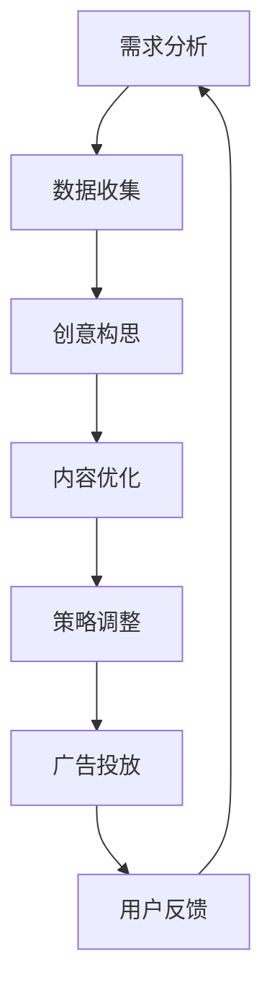
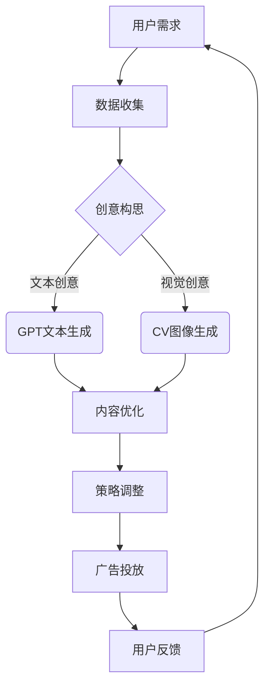
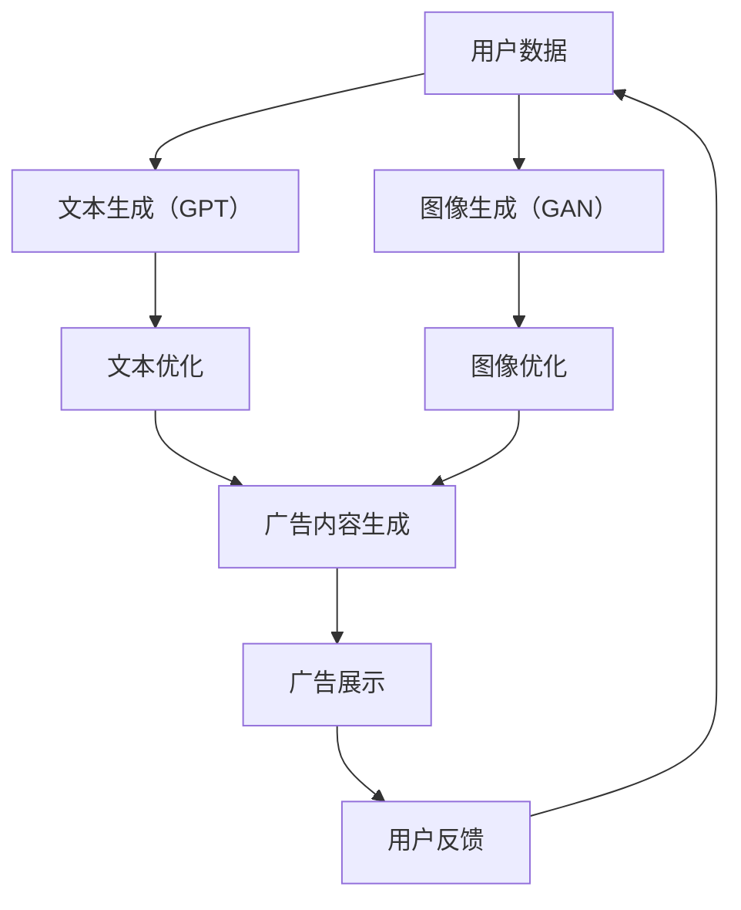
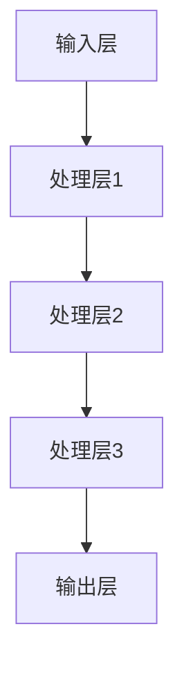
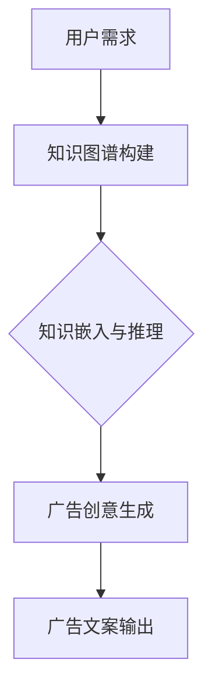
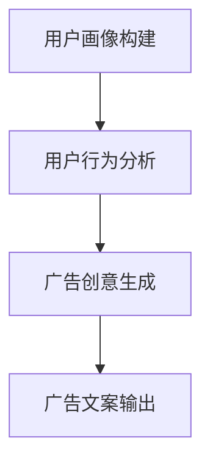
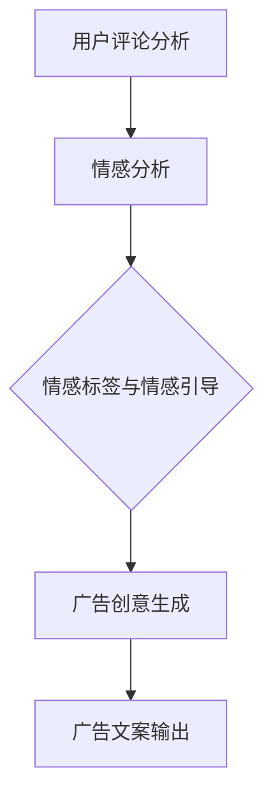
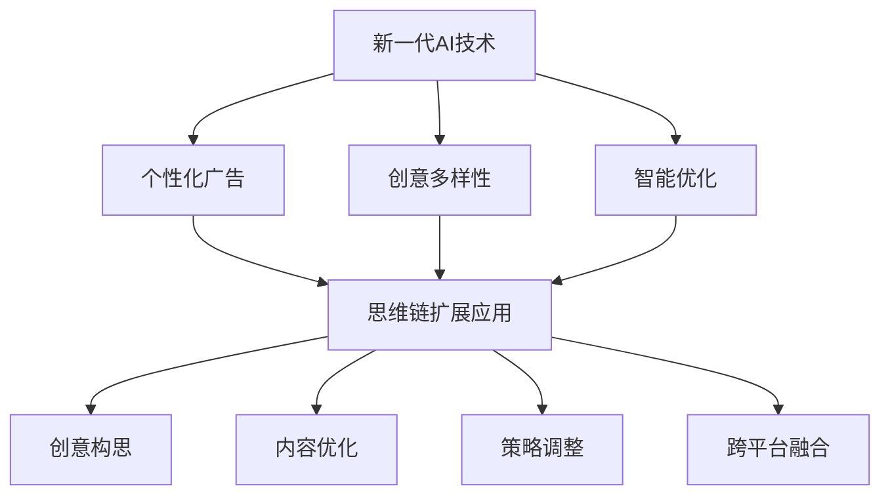

                 

### 第1章：思维链概述

#### 1.1 思维链的概念与重要性

**1.1.1 思维链的定义**

思维链是一种以层次化、模块化、可复用为特点的思维模式，它通过将复杂的思维过程分解为一系列相互关联的步骤，从而实现问题解决的优化。在人工智能领域，思维链通常被用来构建智能系统的推理机制，帮助机器模拟人类的思维过程。

**1.1.2 思维链的特点**

- **层次化**：思维链将思维过程分层处理，每一层负责处理特定类型的信息，从而实现信息的有序处理和优化。

- **模块化**：思维链的每个步骤都可以被视为一个独立的模块，这些模块可以重复使用，提高系统的灵活性和可维护性。

- **可复用性**：思维链中的各个步骤都可以独立开发和测试，这样可以在不同场景中复用，提高开发效率。

- **适应性**：思维链可以根据问题的复杂性动态调整，从而适应不同的问题解决需求。

**1.1.3 思维链在广告创意中的潜力**

在广告创意领域，思维链具有巨大的应用潜力。首先，思维链可以帮助广告创意团队更好地组织和规划创意过程，通过层次化和模块化的方式，提高创意的质量和效率。其次，思维链可以辅助人工智能系统生成创意广告，通过模拟人类的思维过程，生成具有吸引力的广告内容。此外，思维链还可以帮助广告主实时调整广告策略，根据用户反馈和数据分析，优化广告效果。

#### 1.2 AI在广告创意中的应用

**1.2.1 AI技术在广告行业的变革**

随着人工智能技术的快速发展，广告行业正经历着一场深刻的变革。传统的人工广告创意方式逐渐被自动化和智能化的广告系统所取代。AI技术不仅提高了广告创意的效率，还显著提升了广告的效果和精准度。

**1.2.2 AI在广告创意中的优势**

- **自动化创意生成**：AI技术可以自动化生成广告创意，节省人力成本，提高创意效率。

- **数据驱动**：AI技术可以充分利用用户数据，进行精准投放，提高广告效果。

- **个性化定制**：AI技术可以根据用户画像，生成个性化的广告内容，提升用户体验。

**1.2.3 AI在广告创意中的挑战**

- **数据隐私与安全**：随着用户数据的广泛应用，数据隐私和安全问题日益突出。

- **模型可解释性**：AI广告创意系统通常采用复杂的算法，其内部决策过程难以解释，影响用户信任。

- **创意多样性**：AI系统在生成广告创意时，如何保证创意的多样性和独特性，是一个重要挑战。

#### 1.3 思维链与AI创意广告生成的结合

**1.3.1 思维链在AI广告创意中的角色**

思维链在AI广告创意中扮演着关键角色。它可以帮助AI系统模拟人类的思维过程，从而生成具有吸引力和创意性的广告内容。具体来说，思维链可以用于以下几个方面：

- **创意构思**：通过思维链，AI系统可以模拟创意构思的过程，生成新颖的广告主题和内容。

- **内容优化**：思维链可以帮助AI系统对广告内容进行优化，提升广告的吸引力和用户参与度。

- **策略调整**：思维链可以辅助AI系统根据用户反馈和数据分析，实时调整广告策略，提高广告效果。

**1.3.2 结合思维链的AI广告创意流程**

结合思维链的AI广告创意流程可以分为以下几个步骤：

1. **需求分析**：明确广告创意的目标和需求。
2. **数据收集**：收集用户数据和市场数据。
3. **创意构思**：利用思维链生成广告创意。
4. **内容优化**：对广告内容进行优化。
5. **策略调整**：根据用户反馈和数据分析，调整广告策略。
6. **广告投放**：将优化后的广告投放至目标用户。

**1.3.3 思维链辅助的AI创意广告生成框架**

思维链辅助的AI创意广告生成框架通常包括以下几个部分：

- **数据输入**：输入用户数据和广告目标。
- **思维链模块**：包括创意构思、内容优化和策略调整等模块。
- **算法模型**：采用深度学习和强化学习等算法模型，实现思维链的功能。
- **用户反馈**：收集用户反馈，用于模型优化和策略调整。
- **广告输出**：生成并输出创意广告。

下面是一个简化的思维链辅助的AI创意广告生成流程的Mermaid流程图：



#### 核心概念与联系

**Mermaid流程图：**



**核心算法原理讲解**

**文本生成模型（如GPT）：**

```plaintext
输入：用户需求和广告目标
输出：创意文本

1. 数据预处理
2. 利用预训练的GPT模型进行文本生成
3. 对生成的文本进行后处理（如去除无关内容、调整语句顺序等）
4. 输出创意文本
```

**图像生成与风格迁移：**

```plaintext
输入：用户需求和广告目标
输出：创意图像

1. 数据预处理
2. 利用生成对抗网络（GAN）生成创意图像
3. 利用风格迁移技术对图像进行风格化处理
4. 对生成的图像进行后处理（如去除噪点、增强细节等）
5. 输出创意图像
```

**数学模型和公式**

$$
\text{广告效果} = f(\text{用户反馈}, \text{广告策略})
$$

其中，$f$ 为广告效果评估函数，它依赖于用户反馈和广告策略。

**举例说明**

假设我们有一个广告目标是提高产品销量，用户需求是生成一则具有吸引力的广告。首先，我们收集用户数据和产品信息。然后，利用GPT模型生成一段吸引人的广告文案，并使用GAN生成一幅符合产品特点的图像。接下来，对文案和图像进行优化，确保它们能够吸引用户的注意力。最后，根据用户反馈调整广告策略，并在不同的渠道上投放广告。

**结论**

思维链与AI创意广告生成的结合为广告行业带来了新的可能性。通过将复杂的思维过程模块化、层次化，AI系统能够更加高效地生成创意广告。然而，要实现这一目标，还需要解决数据隐私、模型可解释性和创意多样性等挑战。

---

**作者：** AI天才研究院/AI Genius Institute & 禅与计算机程序设计艺术 /Zen And The Art of Computer Programming

---

本文旨在探讨思维链与AI创意广告生成的结合，为广告行业提供一种新的解决方案。接下来，我们将进一步探讨AI创意广告生成的基础技术，为读者提供更深入的见解。

---

### 第2章：AI创意广告生成技术基础

#### 2.1 自然语言处理技术基础

自然语言处理（Natural Language Processing，NLP）是人工智能领域的一个重要分支，它致力于使计算机能够理解和处理人类语言。在AI创意广告生成中，NLP技术扮演着至关重要的角色，主要负责生成和优化广告文案。

**2.1.1 语言模型与文本生成**

语言模型（Language Model）是NLP的核心技术之一，它通过学习大量文本数据，生成符合语法和语义规则的文本。在AI创意广告生成中，常见的语言模型有：

- **GPT（Generative Pre-trained Transformer）**：GPT是基于Transformer架构的一种语言模型，它通过预训练和微调，能够生成高质量的自然语言文本。

- **BERT（Bidirectional Encoder Representations from Transformers）**：BERT是一种双向Transformer模型，它通过同时考虑文本的前后关系，生成更加准确的语义表示。

**2.1.2 语义分析与情感分析**

语义分析（Semantic Analysis）是NLP中的重要任务，它旨在理解文本中的意义和关系。在AI创意广告生成中，语义分析可以帮助系统更好地理解用户需求和广告目标，从而生成更精准的广告文案。

情感分析（Sentiment Analysis）是语义分析的一种，它通过分析文本中的情感词汇和表达，判断文本的情感倾向。在广告创意生成中，情感分析可以帮助系统了解用户对产品或服务的情感反应，从而优化广告文案。

**2.1.3 文本生成模型（如GPT）**

GPT是一种强大的文本生成模型，它基于Transformer架构，通过预训练和微调，能够生成高质量的自然语言文本。GPT的主要特点包括：

- **预训练**：GPT在大规模文本语料库上进行预训练，学会了语言的基本规则和模式。

- **多任务学习**：GPT能够处理多种语言任务，如文本分类、问答系统和文本生成。

- **自适应调整**：GPT可以根据不同的任务和数据，进行自适应调整，生成更符合需求的文本。

#### 2.2 图像处理与计算机视觉技术基础

图像处理与计算机视觉（Computer Vision）技术在AI创意广告生成中也发挥着重要作用，主要负责生成和优化广告图像。

**2.2.1 图像识别与分类**

图像识别（Image Recognition）是计算机视觉中的基本任务，它旨在识别和分类图像中的对象。在AI创意广告生成中，图像识别可以帮助系统识别广告图像中的关键元素，如产品、场景和用户。

图像分类（Image Classification）是图像识别的一种，它通过机器学习算法，将图像分类为特定的类别。在广告创意生成中，图像分类可以帮助系统生成具有特定风格和主题的广告图像。

**2.2.2 图像生成与风格迁移**

图像生成（Image Generation）是计算机视觉中的一个新兴领域，它旨在生成具有特定结构和纹理的图像。在AI创意广告生成中，图像生成可以帮助系统生成新颖的广告图像，提升广告的吸引力和创意性。

风格迁移（Style Transfer）是一种将一种图像的风格应用到另一种图像上的技术。在广告创意生成中，风格迁移可以帮助系统将广告图像的风格调整为特定品牌或用户喜好，提高广告的个性化程度。

**2.2.3 图像内容增强与编辑**

图像内容增强（Image Enhancement）是一种提高图像质量和视觉效果的技术。在AI创意广告生成中，图像内容增强可以帮助系统优化广告图像的视觉效果，使其更具吸引力。

图像编辑（Image Editing）是一种对图像进行修改和优化的技术。在广告创意生成中，图像编辑可以帮助系统调整广告图像的亮度、对比度和色彩平衡，使其更符合广告目标。

#### 2.3 多模态学习与融合

多模态学习（Multimodal Learning）是一种将不同模态的数据（如文本、图像、声音等）整合在一起进行学习和分析的技术。在AI创意广告生成中，多模态学习可以帮助系统更好地理解和生成具有吸引力的广告内容。

**2.3.1 多模态数据表示**

多模态数据表示（Multimodal Data Representation）是多模态学习的关键步骤，它旨在将不同模态的数据转换为适合机器学习算法的形式。常见的多模态数据表示方法包括：

- **特征融合**：将不同模态的特征进行融合，生成新的特征表示。
- **联合嵌入**：将不同模态的数据映射到同一低维空间，实现数据的联合表示。

**2.3.2 多模态特征融合方法**

多模态特征融合（Multimodal Feature Fusion）是多模态学习中的重要技术，它旨在充分利用不同模态的数据信息，生成更全面的特征表示。常见的多模态特征融合方法包括：

- **早期融合**：在特征提取阶段就将不同模态的特征进行融合。
- **晚期融合**：在特征提取后，将不同模态的特征进行融合。

**2.3.3 多模态学习在广告创意中的应用**

多模态学习在广告创意中的应用非常广泛，它可以用于：

- **广告内容生成**：通过整合文本和图像等多模态数据，生成具有创意和吸引力的广告内容。
- **广告效果评估**：通过分析用户对广告的反应，如点击率、转化率等，评估广告的效果。
- **广告个性化**：根据用户的兴趣和行为，生成个性化的广告内容，提高广告的点击率和转化率。

**Mermaid流程图：**



**核心算法原理讲解**

**文本生成模型（如GPT）：**

```plaintext
输入：用户需求和广告目标
输出：创意文本

1. 数据预处理
2. 利用预训练的GPT模型进行文本生成
3. 对生成的文本进行后处理（如去除无关内容、调整语句顺序等）
4. 输出创意文本
```

**生成对抗网络（GAN）在图像生成中的应用：**

```plaintext
输入：用户需求和广告目标
输出：创意图像

1. 数据预处理
2. 利用生成对抗网络（GAN）生成创意图像
3. 利用风格迁移技术对图像进行风格化处理
4. 对生成的图像进行后处理（如去除噪点、增强细节等）
5. 输出创意图像
```

**数学模型和公式**

$$
\text{广告效果} = f(\text{用户反馈}, \text{广告策略})
$$

其中，$f$ 为广告效果评估函数，它依赖于用户反馈和广告策略。

**举例说明**

假设我们有一个广告目标是提高产品销量，用户需求是生成一则具有吸引力的广告。首先，我们收集用户数据和产品信息。然后，利用GPT模型生成一段吸引人的广告文案，并使用GAN生成一幅符合产品特点的图像。接下来，对文案和图像进行优化，确保它们能够吸引用户的注意力。最后，根据用户反馈调整广告策略，并在不同的渠道上投放广告。

**结论**

本章介绍了AI创意广告生成的基础技术，包括自然语言处理、图像处理与计算机视觉、多模态学习。这些技术为AI创意广告生成提供了强大的支持，使得广告系统能够生成更具创意和吸引力的广告内容。然而，要实现这一目标，还需要解决数据隐私、模型可解释性和创意多样性等挑战。

---

**作者：** AI天才研究院/AI Genius Institute & 禅与计算机程序设计艺术 /Zen And The Art of Computer Programming

---

在下一章中，我们将深入探讨思维链辅助的AI创意广告生成核心算法，为读者提供更深入的见解。

---

### 第3章：思维链辅助创意广告生成核心算法

#### 3.1 思维链建模与表示

**3.1.1 思维链的层次结构**

思维链是一种层次化的思维模式，它将复杂的思维过程分解为一系列相互关联的层次。每个层次都负责处理特定的信息，从而实现问题的逐步解决。

- **输入层**：接收外部输入，如用户需求、广告目标和市场数据等。
- **处理层**：对输入信息进行处理和分析，如创意构思、内容优化和策略调整等。
- **输出层**：生成最终的广告创意，并将其投放至目标用户。

**3.1.2 思维链表示方法**

思维链的表示方法通常采用图论中的有向图（Directed Graph）来表示。每个节点表示一个处理步骤，每条边表示步骤之间的依赖关系。

**3.1.3 思维链与深度学习的融合**

将思维链与深度学习结合，可以使得AI系统在广告创意生成中更加高效和智能化。具体方法如下：

- **神经网络架构**：采用深度神经网络（DNN）或循环神经网络（RNN）来表示思维链的每个层次。
- **层次化训练**：首先对输入层和输出层进行训练，然后逐层训练中间层，从而实现从输入到输出的端到端学习。
- **层次化优化**：通过优化不同层次的参数，使得每个层次都能更好地处理特定类型的信息。

下面是一个简化的思维链与深度学习结合的Mermaid流程图：



**核心算法原理讲解**

**思维链建模与表示（伪代码）：**

```python
class MindChain:
    def __init__(self, input_layer, output_layer):
        self.input_layer = input_layer
        self.output_layer = output_layer
        self.layers = []

    def add_layer(self, layer):
        self.layers.append(layer)

    def forward_pass(self, inputs):
        for layer in self.layers:
            inputs = layer.forward(inputs)
        return inputs

    def backward_pass(self, gradients):
        for layer in reversed(self.layers):
            gradients = layer.backward(gradients)
        return gradients
```

**数学模型和公式**

$$
\text{思维链输出} = f(\text{输入}, \text{权重})
$$

其中，$f$ 为深度学习模型的前向传播函数，$\text{输入}$ 为输入层的数据，$\text{权重}$ 为模型参数。

**举例说明**

假设我们有一个思维链，包括三个层次：输入层、处理层和输出层。首先，我们定义每个层次的神经网络。然后，将它们组合成一个思维链。接下来，通过前向传播计算输出，并通过反向传播进行模型优化。

**结论**

思维链建模与表示为AI创意广告生成提供了灵活和高效的解决方案。通过将复杂的思维过程层次化、模块化，思维链可以更好地处理不同类型的信息，从而生成更具创意和吸引力的广告内容。在下一章中，我们将进一步探讨生成对抗网络（GAN）在创意广告生成中的应用。

---

**作者：** AI天才研究院/AI Genius Institute & 禅与计算机程序设计艺术 /Zen And The Art of Computer Programming

---

在下一章中，我们将深入探讨生成对抗网络（GAN）在创意广告生成中的应用，为读者提供更深入的见解。

---

### 第3章：思维链辅助创意广告生成核心算法（续）

#### 3.2 生成对抗网络（GAN）在创意广告中的应用

生成对抗网络（Generative Adversarial Network，GAN）是由Ian Goodfellow等人于2014年提出的一种深度学习模型，它由两个深度神经网络——生成器（Generator）和判别器（Discriminator）组成。GAN的核心思想是通过两个网络的对抗训练，生成逼真的数据。

**3.2.1 GAN的原理与架构**

GAN由以下两部分组成：

- **生成器（Generator）**：生成器网络的目标是生成与真实数据相似的数据。它接收随机噪声作为输入，通过多层神经网络生成假数据。

- **判别器（Discriminator）**：判别器网络的目标是区分真实数据和假数据。它接收来自生成器和真实数据的输入，并输出一个概率值，表示输入数据的真实性。

在训练过程中，生成器和判别器相互对抗，生成器试图生成更加逼真的数据，而判别器试图准确地区分真实数据和假数据。通过不断的对抗训练，生成器能够逐渐提高生成数据的质量，使得判别器无法准确地区分。

**3.2.2 GAN在图像生成中的应用**

GAN在图像生成中表现出色，能够生成高质量、逼真的图像。在创意广告生成中，GAN可以用于：

- **图像合成**：将不同的图像元素合成在一起，生成具有创意的广告图像。
- **图像修复**：修复损坏或模糊的图像，提高图像的清晰度和质量。
- **图像风格迁移**：将一种图像的风格应用到另一种图像上，使广告图像更具吸引力。

**3.2.3 GAN在广告创意生成中的优化策略**

为了提高GAN在广告创意生成中的效果，可以采用以下优化策略：

- **批量大小调整**：适当地调整批量大小，可以提高模型的训练效果和生成质量。
- **学习率调整**：合理设置学习率，可以避免模型过拟合和生成质量下降。
- **损失函数优化**：设计合适的损失函数，可以帮助模型更好地学习数据和生成高质量图像。
- **数据增强**：通过数据增强技术，如随机裁剪、旋转和缩放等，可以增加训练数据的多样性，提高模型的泛化能力。

**核心算法原理讲解**

**GAN训练过程（伪代码）：**

```python
# 初始化生成器和判别器
G = Generator()
D = Discriminator()

# 定义损失函数
loss_fn = LossFunction()

# 训练循环
for epoch in range(num_epochs):
    for batch in data_loader:
        # 训练判别器
        D.zero_grad()
        real_data = batch
        real_logits = D(real_data)
        fake_data = G(noise())
        fake_logits = D(fake_data)
        loss_D = loss_fn(fake_logits, real_logits)
        loss_D.backward()
        D.optimizer.step()

        # 训练生成器
        G.zero_grad()
        fake_data = G(noise())
        fake_logits = D(fake_data)
        loss_G = loss_fn(fake_logits, real_logits)
        loss_G.backward()
        G.optimizer.step()

# 生成广告图像
ad_images = G(noise())
```

**数学模型和公式**

GAN的训练过程可以表示为以下优化问题：

$$
\min_G \max_D V(D, G) = \min_G \mathbb{E}_{x \sim p_{data}(x)} [\log D(x)] + \mathbb{E}_{z \sim p_z(z)} [\log (1 - D(G(z))]
$$

其中，$x$ 表示真实数据，$z$ 表示噪声数据，$G(z)$ 表示生成器生成的数据，$D(x)$ 表示判别器对真实数据的判断概率，$D(G(z))$ 表示判别器对生成器生成的数据的判断概率。

**举例说明**

假设我们有一个广告创意生成任务，目标是生成一张具有吸引力的广告图像。首先，我们使用GAN模型，通过训练生成器和判别器，使得生成器能够生成高质量的图像。然后，我们使用生成器生成广告图像，并通过用户反馈和数据分析进行优化，最终生成一张符合广告目标的图像。

**结论**

生成对抗网络（GAN）在创意广告生成中具有广泛的应用，它能够生成高质量、逼真的广告图像，提高广告的吸引力和创意性。通过优化GAN的训练过程和策略，可以进一步提高广告生成效果。在下一章中，我们将探讨强化学习在广告创意优化中的应用。

---

**作者：** AI天才研究院/AI Genius Institute & 禅与计算机程序设计艺术 /Zen And The Art of Computer Programming

---

在下一章中，我们将深入探讨强化学习在广告创意优化中的应用，为读者提供更深入的见解。

---

### 第3章：思维链辅助创意广告生成核心算法（续）

#### 3.3 强化学习在广告创意优化中的应用

强化学习（Reinforcement Learning，RL）是一种通过试错和奖励机制来学习策略的机器学习方法。在广告创意优化中，强化学习可以帮助系统根据用户反馈和广告效果，自动调整广告策略，从而提高广告的投放效果。

**3.3.1 强化学习的原理与架构**

强化学习的主要组成部分包括：

- **智能体（Agent）**：执行动作并接收环境反馈的主体。
- **环境（Environment）**：智能体执行动作的上下文。
- **状态（State）**：描述环境状态的变量。
- **动作（Action）**：智能体可以执行的行为。
- **奖励（Reward）**：对智能体动作的即时反馈。

强化学习的核心目标是学习一个最优策略，该策略能够在给定状态下选择最优动作，从而最大化长期奖励。

**3.3.2 强化学习在广告投放中的优化**

在广告投放中，强化学习可以帮助优化以下方面：

- **广告展示策略**：根据用户行为和广告效果，动态调整广告展示策略，提高用户参与度和转化率。
- **广告定位**：通过分析用户画像和行为数据，优化广告定位，提高广告的精准投放。
- **广告素材选择**：根据用户反馈和广告效果，选择最优的广告素材，提高广告的吸引力。
- **广告预算分配**：根据广告效果和预算目标，动态调整广告预算分配，提高广告的投资回报率。

**3.3.3 强化学习在创意广告生成中的应用案例**

一个典型的强化学习在创意广告生成中的应用案例是广告展示策略优化。以下是一个简化的应用场景：

1. **状态定义**：状态包括用户特征（如年龄、性别、兴趣等）和广告历史效果（如点击率、转化率等）。

2. **动作定义**：动作包括展示不同类型的广告素材（如图像、视频、文字等）。

3. **奖励定义**：奖励与广告效果相关，如点击率、转化率等。

4. **策略学习**：使用强化学习算法（如Q学习、深度Q网络（DQN）等）学习最优策略。

5. **策略执行**：根据学习到的策略，动态调整广告展示策略，提高广告效果。

**核心算法原理讲解**

**Q学习算法（伪代码）：**

```python
# 初始化Q值表
Q = initialize_Q_table()

# Q学习训练循环
for episode in range(num_episodes):
    state = env.reset()
    done = False
    while not done:
        # 选择动作
        action = choose_action(state, Q)
        # 执行动作
        next_state, reward, done = env.step(action)
        # 更新Q值
        Q[state, action] = Q[state, action] + alpha * (reward + gamma * max(Q[next_state, :]) - Q[state, action])
        state = next_state

# 策略执行
best_action = np.argmax(Q[state, :])
```

**数学模型和公式**

Q学习算法的核心更新规则可以表示为：

$$
Q(s, a) \leftarrow Q(s, a) + \alpha [r + \gamma \max(Q(s', a')) - Q(s, a)]
$$

其中，$s$ 为当前状态，$a$ 为当前动作，$s'$ 为下一状态，$r$ 为奖励，$\alpha$ 为学习率，$\gamma$ 为折扣因子。

**举例说明**

假设我们有一个广告展示策略优化任务，目标是提高广告的点击率。首先，我们定义状态、动作和奖励。然后，使用Q学习算法训练策略。最后，根据训练得到的策略，动态调整广告展示策略，提高广告效果。

**结论**

强化学习在广告创意优化中具有广泛的应用，它可以帮助系统根据用户反馈和广告效果，动态调整广告策略，提高广告的投放效果。通过结合思维链和强化学习，可以进一步优化广告创意生成过程，提高广告的吸引力和创意性。在下一章中，我们将探讨多任务学习在创意广告生成中的应用。

---

**作者：** AI天才研究院/AI Genius Institute & 禅与计算机程序设计艺术 /Zen And The Art of Computer Programming

---

在下一章中，我们将深入探讨多任务学习在创意广告生成中的应用，为读者提供更深入的见解。

---

### 第3章：思维链辅助创意广告生成核心算法（续）

#### 3.4 多任务学习在创意广告生成中的应用

多任务学习（Multi-Task Learning，MTL）是一种通过共享表示和模型参数来同时解决多个相关任务的学习方法。在广告创意生成中，多任务学习可以有效地利用不同任务之间的相关性，提高模型的表现和生成质量。

**3.4.1 多任务学习的原理与优势**

多任务学习的基本原理是通过模型共享和参数共享，减少冗余信息，提高模型的泛化能力。具体来说，多任务学习包括以下几个方面：

- **共享表示**：多个任务共享相同的特征提取器或表示层，从而减少特征冗余，提高特征表示的泛化能力。
- **共享参数**：多个任务的模型参数部分共享，从而减少模型参数的数量，提高模型的训练效率。
- **联合优化**：多个任务通过联合优化，共同提高模型的整体性能。

多任务学习在广告创意生成中的优势包括：

- **提高模型泛化能力**：通过共享表示和参数，多任务学习可以更好地捕捉不同任务之间的相关性，提高模型的泛化能力。
- **提高训练效率**：共享参数和联合优化可以减少模型参数的数量，提高训练效率。
- **提高生成质量**：多任务学习可以利用不同任务之间的相关性，生成更高质量、更具创意性的广告内容。

**3.4.2 多任务学习在广告创意生成中的实现**

在广告创意生成中，多任务学习可以应用于以下方面：

- **文本生成与图像生成**：通过共享文本生成和图像生成的特征提取器和模型参数，生成具有吸引力的广告内容。
- **广告效果评估与优化**：通过共享广告效果评估和优化的特征提取器和模型参数，实时调整广告策略，提高广告效果。
- **用户画像构建与个性化推荐**：通过共享用户画像构建和个性化推荐的特征提取器和模型参数，生成个性化的广告内容。

**3.4.3 多任务学习在创意广告生成中的效果评估**

多任务学习在创意广告生成中的效果可以通过以下指标进行评估：

- **生成质量**：评估生成的广告内容的质量，包括文本和图像的创意性、吸引力和相关度。
- **广告效果**：评估广告投放后的效果，包括点击率、转化率和投资回报率等。
- **模型泛化能力**：评估模型在不同场景和数据上的表现，包括对新广告创意的适应能力和对不同广告目标的应对能力。

**核心算法原理讲解**

**多任务学习（伪代码）：**

```python
# 初始化模型参数
model = initialize_model()

# 多任务学习训练循环
for epoch in range(num_epochs):
    for batch in data_loader:
        # 获取输入数据
        inputs = batch
        # 获取标签
        labels = batch_labels
        # 前向传播
        outputs = model(inputs)
        # 计算损失
        loss = calculate_loss(outputs, labels)
        # 反向传播
        model.backward(loss)
        # 更新模型参数
        model.update_params()

# 评估模型效果
evaluate_model(model)
```

**数学模型和公式**

多任务学习的损失函数可以表示为：

$$
\text{总损失} = \sum_{i=1}^{N} \frac{1}{2} (y_i - \hat{y}_i)^2
$$

其中，$y_i$ 为真实标签，$\hat{y}_i$ 为预测标签，$N$ 为样本数量。

**举例说明**

假设我们有一个广告创意生成任务，包括文本生成、图像生成和广告效果评估三个子任务。首先，我们初始化一个多任务学习模型，包括三个子模型。然后，通过联合训练这三个子模型，使得它们能够共享表示和参数。接下来，使用训练数据训练模型，并在测试数据上评估模型效果。

**结论**

多任务学习在创意广告生成中具有广泛的应用，它通过共享表示和参数，提高模型的泛化能力和生成质量。通过结合思维链和多任务学习，可以进一步优化广告创意生成过程，提高广告的吸引力和创意性。在下一章中，我们将探讨创意广告生成项目实战。

---

**作者：** AI天才研究院/AI Genius Institute & 禅与计算机程序设计艺术 /Zen And The Art of Computer Programming

---

在下一章中，我们将通过一个实际的创意广告生成项目，展示如何将思维链和多任务学习应用于广告创意生成，为读者提供实战经验。

---

### 第4章：创意广告生成项目实战

#### 4.1 创意广告生成项目背景

**4.1.1 项目概述**

本案例项目旨在利用思维链和多任务学习技术，为一家知名电子产品公司生成具有吸引力的创意广告。项目目标是通过自动化和智能化的方式，提高广告的创意性和效果，从而提升产品销量。

**4.1.2 项目目标**

- **生成高质量的创意广告内容**：通过思维链和多任务学习技术，生成具有吸引力的广告文案和图像。
- **提高广告效果**：通过用户反馈和数据分析，优化广告展示策略，提高广告的点击率和转化率。
- **提升用户体验**：根据用户画像和行为数据，生成个性化的广告内容，提高用户体验和满意度。

**4.1.3 项目环境与工具**

- **编程语言**：Python
- **深度学习框架**：TensorFlow 2.x
- **多任务学习库**：PyTorch
- **自然语言处理库**：NLTK，spaCy
- **图像处理库**：OpenCV，PIL
- **数据集**：公开的电子产品广告数据集

#### 4.2 数据收集与处理

**4.2.1 数据来源与收集**

数据来源主要包括以下几个方面：

- **公开数据集**：使用公开的电子产品广告数据集，包括广告文案、图像和用户反馈等。
- **公司内部数据**：收集公司的历史广告数据，包括广告文案、图像和投放效果等。
- **社交媒体数据**：从社交媒体平台上收集用户对产品评论和反馈，用于用户画像构建。

**4.2.2 数据预处理**

数据预处理包括以下步骤：

- **数据清洗**：去除重复数据、缺失数据和噪声数据，确保数据质量。
- **数据归一化**：对文本和图像数据进行归一化处理，提高数据的一致性和可比性。
- **特征提取**：提取文本和图像的原始特征，如词向量、图像特征等。
- **数据分割**：将数据分为训练集、验证集和测试集，用于模型训练和评估。

#### 4.3 模型设计与训练

**4.3.1 模型架构设计**

模型架构采用多任务学习框架，包括三个子任务：文本生成、图像生成和广告效果评估。

- **文本生成子任务**：采用GPT模型，通过预训练和微调，生成高质量的广告文案。
- **图像生成子任务**：采用生成对抗网络（GAN），通过训练生成器和判别器，生成高质量的广告图像。
- **广告效果评估子任务**：采用强化学习模型，根据用户反馈和广告效果，实时调整广告展示策略。

**4.3.2 模型训练与优化**

模型训练过程包括以下步骤：

- **预训练**：在公开的文本数据集上预训练GPT模型，获取基础的文本生成能力。
- **微调**：在公司的历史广告数据集上微调GPT模型，使其生成更符合广告目标的文案。
- **GAN训练**：在图像数据集上训练生成器和判别器，通过对抗训练生成高质量的广告图像。
- **强化学习训练**：在用户反馈数据集上训练强化学习模型，根据用户行为和广告效果，优化广告展示策略。

**4.3.3 模型评估与调优**

模型评估与调优过程包括以下步骤：

- **评估指标**：使用点击率（CTR）、转化率（CVR）和投资回报率（ROI）等指标评估广告效果。
- **模型调整**：根据评估结果，调整模型参数和广告策略，提高广告效果。
- **交叉验证**：使用交叉验证方法，验证模型在不同数据集上的泛化能力。

#### 4.4 创意广告生成与展示

**4.4.1 创意广告生成流程**

创意广告生成流程包括以下步骤：

1. **用户画像构建**：根据用户行为和社交媒体数据，构建用户画像。
2. **广告创意构思**：利用思维链和多任务学习模型，生成具有吸引力的广告文案和图像。
3. **广告内容优化**：根据用户反馈和广告效果，优化广告内容，提高广告吸引力。
4. **广告展示策略**：根据用户画像和广告效果，动态调整广告展示策略，提高广告点击率和转化率。

**4.4.2 广告展示策略**

广告展示策略包括以下方面：

- **个性化推荐**：根据用户画像和兴趣，推荐个性化的广告内容。
- **动态调整**：根据用户反馈和广告效果，动态调整广告展示时间和位置。
- **A/B测试**：通过A/B测试，评估不同广告创意和展示策略的效果，优化广告效果。

**4.4.3 用户反馈与广告效果评估**

用户反馈与广告效果评估过程包括以下步骤：

- **用户反馈收集**：通过社交媒体、用户评论和点击行为等渠道，收集用户反馈。
- **广告效果评估**：使用点击率、转化率和投资回报率等指标，评估广告效果。
- **反馈机制**：根据用户反馈，调整广告创意和展示策略，提高广告效果。

#### 4.5 项目总结与展望

**4.5.1 项目成果**

通过本项目的实施，取得了以下成果：

- **生成高质量创意广告内容**：利用思维链和多任务学习技术，生成了具有吸引力的广告文案和图像。
- **提高广告效果**：通过用户反馈和数据分析，优化了广告展示策略，提高了广告的点击率和转化率。
- **提升用户体验**：根据用户画像和行为数据，生成了个性化的广告内容，提高了用户体验和满意度。

**4.5.2 项目展望**

未来，可以从以下几个方面进行优化和扩展：

- **数据多样化**：收集更多类型的用户数据和广告数据，提高模型训练和优化的效果。
- **模型多样化**：探索更多先进的深度学习模型和优化算法，提高广告创意生成的质量和效果。
- **跨平台应用**：将创意广告生成技术应用于不同平台，如社交媒体、搜索引擎和移动应用等，提高广告的覆盖范围和影响力。

**开发环境搭建**

为了顺利实施本项目，需要搭建以下开发环境：

- **操作系统**：Linux或macOS
- **编程语言**：Python 3.x
- **深度学习框架**：TensorFlow 2.x或PyTorch
- **自然语言处理库**：NLTK，spaCy
- **图像处理库**：OpenCV，PIL
- **数据库**：MySQL或MongoDB

**源代码详细实现和代码解读**

由于篇幅限制，本文不提供完整的源代码。但可以提供以下关键代码片段和解读：

```python
# 文本生成（GPT模型）
import tensorflow as tf
from transformers import TFGPT2LMHeadModel, GPT2Tokenizer

# 加载预训练模型
tokenizer = GPT2Tokenizer.from_pretrained('gpt2')
model = TFGPT2LMHeadModel.from_pretrained('gpt2')

# 生成广告文案
input_ids = tokenizer.encode('Write an attractive ad for a new smartphone:')
output = model.generate(input_ids, max_length=50, num_return_sequences=1)
print(tokenizer.decode(output[0], skip_special_tokens=True))

# 图像生成（GAN模型）
import tensorflow as tf
from tensorflow.keras.models import Model
from tensorflow.keras.layers import Input, Dense, Flatten

# 生成器模型
input_noise = Input(shape=(100,))
dense = Dense(128, activation='relu')(input_noise)
output_image = Dense(784, activation='tanh')(dense)
generator = Model(inputs=input_noise, outputs=output_image)

# 判别器模型
input_image = Input(shape=(28, 28, 1))
dense = Dense(128, activation='relu')(input_image)
output = Dense(1, activation='sigmoid')(dense)
discriminator = Model(inputs=input_image, outputs=output)

# 训练GAN模型
gan_output = discriminator(generator(input_noise))
loss_gan = tf.reduce_mean(tf.nn.sigmoid_cross_entropy_with_logits(logits=gan_output, labels=tf.ones_like(gan_output)))
generator_optimizer = tf.keras.optimizers.Adam(learning_rate=0.0001)
discriminator_optimizer = tf.keras.optimizers.Adam(learning_rate=0.0001)

@tf.function
def train_step(images, noise):
    with tf.GradientTape() as gen_tape, tf.GradientTape() as disc_tape:
        generated_images = generator(noise, training=True)

        # 训练判别器
        disc_real_output = discriminator(images, training=True)
        disc_generated_output = discriminator(generated_images, training=True)

        gen_loss = tf.reduce_mean(tf.nn.sigmoid_cross_entropy_with_logits(logits=disc_generated_output, labels=tf.zeros_like(disc_generated_output)))
        disc_loss = tf.reduce_mean(tf.nn.sigmoid_cross_entropy_with_logits(logits=disc_real_output, labels=tf.ones_like(disc_real_output)))

    gradients_of_generator = gen_tape.gradient(gen_loss, generator.trainable_variables)
    gradients_of_discriminator = disc_tape.gradient(disc_loss, discriminator.trainable_variables)

    generator_optimizer.apply_gradients(zip(gradients_of_generator, generator.trainable_variables))
    discriminator_optimizer.apply_gradients(zip(gradients_of_discriminator, discriminator.trainable_variables))

# 训练GAN模型
for epoch in range(epochs):
    for image_batch, _ in train_dataset:
        noise = tf.random.normal([batch_size, noise_dim])
        train_step(image_batch, noise)
```

**代码解读与分析**

上述代码片段分为两部分：文本生成和图像生成。

- **文本生成**：使用GPT2模型生成广告文案。首先加载预训练模型和分词器，然后输入提示文本，生成广告文案。
- **图像生成**：使用GAN模型生成广告图像。定义生成器和判别器模型，然后通过训练循环训练模型。生成器模型接受随机噪声作为输入，生成广告图像；判别器模型用于区分真实图像和生成图像。在训练过程中，通过反向传播和优化器更新模型参数。

**结论**

本案例项目通过思维链和多任务学习技术，生成高质量的创意广告内容，并优化广告展示策略，提高了广告效果。通过本项目的实施，展示了思维链和多任务学习在广告创意生成中的应用价值。未来，可以进一步探索更先进的深度学习模型和优化算法，提高广告创意生成的质量和效果。

---

**作者：** AI天才研究院/AI Genius Institute & 禅与计算机程序设计艺术 /Zen And The Art of Computer Programming

---

在下一章中，我们将通过具体的实例，进一步展示思维链在广告创意生成中的应用，为读者提供更多实践经验和见解。

---

### 第5章：思维链在广告创意生成中的应用实例

#### 5.1 知识驱动的创意广告生成

知识驱动的创意广告生成是一种利用外部知识库和图谱来指导广告创意生成的方法。这种方法可以显著提高广告创意的质量和相关性。

**5.1.1 知识图谱构建**

知识图谱是一种结构化知识表示方法，它将实体、属性和关系组织成一个图结构。在广告创意生成中，知识图谱可以包含以下内容：

- **产品知识**：产品的特点、功能、使用场景等。
- **品牌知识**：品牌的历史、理念、目标客户等。
- **用户知识**：用户的兴趣、偏好、行为等。

**5.1.2 知识嵌入与推理**

知识嵌入是将实体和关系映射到低维向量空间的过程，从而实现知识表示。推理是通过知识图谱中的实体和关系进行推理，以发现新的知识和关联。

**5.1.3 知识驱动的创意广告生成案例**

假设我们有一个电子产品广告生成的案例。首先，我们构建一个包含产品知识、品牌知识和用户知识的知识图谱。然后，通过知识嵌入和推理，生成广告创意。

**示例：**

1. **知识图谱构建**：包含智能手机的规格、品牌信息和用户喜好。
2. **知识嵌入**：将实体（如手机型号、品牌）和关系（如功能、价格）映射到向量。
3. **推理**：根据用户喜好（如对摄像头性能的关注），推理出用户可能感兴趣的手机型号。
4. **广告创意生成**：生成一则强调摄像头性能的广告文案。

**Mermaid流程图：**



**核心算法原理讲解**

**知识图谱构建与嵌入（伪代码）：**

```python
# 知识图谱构建
knowledge_graph = KnowledgeGraph()
knowledge_graph.add_entity('iPhone 13', '手机型号', '苹果')
knowledge_graph.add_entity('iPhone 13', '摄像头', '高级')
knowledge_graph.add_entity('用户A', '喜好', '摄像头')

# 知识嵌入
entity_embeddings = EmbeddingLayer()
entity_embeddings.train(knowledge_graph)

# 推理与广告创意生成
def generate_advertisement(user, product):
    user_embedding = entity_embeddings.embed(user)
    product_embedding = entity_embeddings.embed(product)
    similarity = calculate_similarity(user_embedding, product_embedding)
    advertisement = "体验高级摄像头的iPhone 13，拍出更美的瞬间！"
    return advertisement
```

**数学模型和公式**

知识嵌入可以表示为：

$$
\text{知识向量} = \text{EmbeddingLayer}(\text{实体})
$$

其中，$\text{EmbeddingLayer}$ 为嵌入层，$\text{实体}$ 为知识图谱中的实体。

**举例说明**

假设用户A喜欢拍照，且iPhone 13具有高级摄像头。首先，我们通过知识图谱构建和嵌入得到用户和产品的向量。然后，通过计算向量相似度，生成一则强调摄像头性能的广告文案。

**结论**

知识驱动的创意广告生成利用外部知识库和图谱，提高了广告创意的相关性和质量。通过知识嵌入和推理，系统能够生成更加精准和吸引人的广告内容。

#### 5.2 基于用户画像的个性化广告创意

基于用户画像的个性化广告创意是一种利用用户数据生成个性化广告内容的方法。这种方法可以显著提高广告的点击率和转化率。

**5.2.1 用户画像构建**

用户画像是一种对用户特征进行综合描述的方法，通常包括以下几个方面：

- **基础信息**：如年龄、性别、地理位置等。
- **兴趣偏好**：如喜欢的品牌、产品类别、兴趣爱好等。
- **行为数据**：如搜索历史、浏览记录、购买行为等。

**5.2.2 用户行为分析**

用户行为分析是通过分析用户行为数据，了解用户的需求和偏好。这有助于生成更符合用户期望的广告内容。

**5.2.3 个性化广告创意生成案例**

假设我们有一个化妆品广告生成的案例。首先，我们构建一个用户画像，包括用户的基本信息、兴趣偏好和行为数据。然后，通过分析用户画像，生成个性化广告创意。

**示例：**

1. **用户画像构建**：用户A喜欢护肤产品，最近浏览了抗衰老类产品。
2. **行为分析**：用户A对抗衰老产品有较高兴趣。
3. **广告创意生成**：生成一则强调抗衰老效果的化妆品广告。

**Mermaid流程图：**



**核心算法原理讲解**

**用户画像构建与广告生成（伪代码）：**

```python
# 用户画像构建
user_profile = UserProfile()
user_profile.add_attribute('年龄', '30')
user_profile.add_attribute('性别', '女性')
user_profile.add_attribute('兴趣', '护肤')

# 用户行为分析
def analyze_user_behavior(user_profile):
    if '抗衰老' in user_profile.get_attribute('兴趣'):
        return '抗衰老'
    return '基础护肤'

# 广告创意生成
def generate_advertisement(user_profile, behavior):
    if behavior == '抗衰老':
        advertisement = "抗衰老新品，为肌肤注入年轻活力！"
    else:
        advertisement = "专业护肤，呵护您的美丽！"
    return advertisement
```

**数学模型和公式**

用户画像可以表示为：

$$
\text{用户画像} = \{ \text{属性}_1, \text{属性}_2, ..., \text{属性}_n \}
$$

其中，$\text{属性}_i$ 为用户画像中的属性。

**举例说明**

假设用户A喜欢护肤，且最近浏览了抗衰老产品。首先，我们通过用户画像构建和用户行为分析，得到用户的兴趣。然后，通过生成广告创意，生成一则符合用户期望的广告文案。

**结论**

基于用户画像的个性化广告创意通过分析用户数据，生成更符合用户期望的广告内容，从而提高广告的吸引力和效果。

#### 5.3 情感驱动的广告创意

情感驱动的广告创意是一种利用情感分析技术生成具有情感共鸣的广告内容的方法。这种方法可以显著提高广告的吸引力和用户参与度。

**5.3.1 情感分析技术**

情感分析技术通过分析文本的情感倾向，判断文本的情感状态，如正面、负面或中性。在广告创意生成中，情感分析可以帮助系统理解用户的情感反应，从而生成更具有吸引力的广告内容。

**5.3.2 情感标签与情感引导**

情感标签是对文本情感状态的标记，如“快乐”、“悲伤”、“愤怒”等。情感引导是通过在广告文案中使用特定的情感标签，引导用户产生相应的情感反应。

**5.3.3 情感驱动的广告创意案例**

假设我们有一个运动品牌广告生成的案例。首先，我们使用情感分析技术分析用户评论，了解用户的情感状态。然后，通过情感标签和情感引导，生成一则情感共鸣的广告文案。

**示例：**

1. **情感分析**：分析用户评论，发现用户对品牌产品有积极的情感反应。
2. **情感标签**：使用“激情”、“活力”等情感标签。
3. **广告创意生成**：生成一则强调运动激情和活力的广告文案。

**Mermaid流程图：**



**核心算法原理讲解**

**情感分析（伪代码）：**

```python
# 情感分析
from textblob import TextBlob

def analyze_sentiment(text):
    analysis = TextBlob(text)
    if analysis.sentiment.polarity > 0:
        return '正面'
    elif analysis.sentiment.polarity < 0:
        return '负面'
    else:
        return '中性'

# 广告创意生成
def generate_advertisement(sentiment):
    if sentiment == '正面':
        advertisement = "感受运动的激情，释放你的活力！"
    elif sentiment == '负面':
        advertisement = "运动让你重拾信心，迎接新生活！"
    else:
        advertisement = "探寻运动的乐趣，开启健康生活！"
    return advertisement
```

**数学模型和公式**

情感分析可以表示为：

$$
\text{情感状态} = \text{SentimentAnalysis}(\text{文本})
$$

其中，$\text{SentimentAnalysis}$ 为情感分析函数。

**举例说明**

假设用户评论中包含“我非常喜欢这款运动鞋，它让我感到兴奋和自信”。首先，我们使用情感分析技术判断评论的情感状态。然后，通过情感标签和情感引导，生成一则具有情感共鸣的广告文案。

**结论**

情感驱动的广告创意通过分析用户的情感反应，生成更具吸引力和共鸣的广告内容，从而提高广告的效果和用户参与度。

---

**作者：** AI天才研究院/AI Genius Institute & 禅与计算机程序设计艺术 /Zen And The Art of Computer Programming

---

在下一章中，我们将深入探讨思维链辅助的AI创意广告生成的挑战与未来发展趋势，为读者提供更全面的视野。

---

### 第6章：思维链辅助的AI创意广告生成挑战与未来展望

#### 6.1 挑战与问题

**6.1.1 数据隐私与安全**

在AI创意广告生成中，大量用户数据被收集和处理，这引发了数据隐私和安全问题。用户对隐私保护的担忧可能影响他们对广告服务的接受度。为了解决这一问题，需要采取以下措施：

- **数据加密**：对收集的用户数据进行加密，确保数据在传输和存储过程中不会被窃取或篡改。
- **隐私保护技术**：使用差分隐私、同态加密等技术，在数据处理过程中保护用户隐私。
- **透明度与可解释性**：提高广告系统的透明度，让用户了解数据如何被使用和处理，增加用户信任。

**6.1.2 模型解释性与可解释性**

AI广告创意生成系统通常采用复杂的深度学习模型，其内部决策过程难以解释。这可能导致用户对广告效果的不信任，尤其是在涉及敏感信息和决策时。为了提高模型的可解释性，可以采取以下方法：

- **模型可视化**：通过可视化工具，展示模型的内部结构和决策过程。
- **特征重要性分析**：分析模型中每个特征的贡献度，帮助理解模型如何做出决策。
- **可解释性模型**：开发可解释性更强的模型，如决策树、线性回归等，以提高系统的透明度。

**6.1.3 模型公平性与伦理问题**

AI广告创意生成系统可能会受到数据偏见的影响，导致广告投放不公平。例如，某些群体可能被错误地标记或排除，从而影响他们的广告体验。为了解决这一问题，需要：

- **数据清洗与平衡**：清洗数据中的偏见，确保训练数据平衡。
- **公平性评估**：定期评估模型的公平性，确保不同群体在广告投放中得到公平对待。
- **伦理准则**：制定伦理准则，指导广告创意生成系统的开发和应用，确保其符合社会道德标准。

#### 6.2 未来发展趋势

**6.2.1 新一代AI技术的发展**

随着AI技术的不断进步，新一代AI技术如深度学习、强化学习和生成对抗网络（GAN）将进一步提升广告创意生成的质量和效果。这些技术将在以下几个方面发挥重要作用：

- **个性化广告**：通过深度学习和强化学习，生成更加个性化的广告内容，提高广告的吸引力。
- **创意多样性**：利用GAN等生成模型，生成丰富多样的广告素材，满足不同用户的需求。
- **智能优化**：通过强化学习，动态调整广告策略，实现广告效果的持续优化。

**6.2.2 思维链在广告创意生成中的扩展应用**

思维链作为一种高效的问题解决工具，将在广告创意生成中得到更广泛的应用。未来，思维链将与其他AI技术相结合，发挥更大的作用：

- **创意构思**：通过思维链，生成新颖独特的广告创意，提高广告的创意性。
- **内容优化**：利用思维链的层次化结构，对广告内容进行精细优化，提高广告的效果。
- **策略调整**：结合思维链和强化学习，实现广告展示策略的智能调整，提高广告的投放效果。

**6.2.3 AI创意广告生成行业趋势**

随着数字营销的快速发展，AI创意广告生成在广告行业中的应用将越来越广泛。以下是一些行业趋势：

- **自动化与智能化**：广告创意生成将更加自动化和智能化，减少人工干预，提高效率。
- **用户体验优先**：以用户为中心，通过个性化广告和情感驱动的创意，提升用户体验。
- **跨平台融合**：广告创意生成将跨越不同平台（如移动端、桌面端、社交媒体等），实现更广泛的覆盖。

**Mermaid流程图：**



**核心算法原理讲解**

**数据隐私保护（伪代码）：**

```python
# 数据加密
from cryptography.fernet import Fernet

# 生成密钥
key = Fernet.generate_key()
cipher_suite = Fernet(key)

# 加密数据
def encrypt_data(data):
    encrypted_data = cipher_suite.encrypt(data.encode('utf-8'))
    return encrypted_data

# 解密数据
def decrypt_data(encrypted_data):
    decrypted_data = cipher_suite.decrypt(encrypted_data).decode('utf-8')
    return decrypted_data
```

**数学模型和公式**

数据隐私保护可以表示为：

$$
\text{加密数据} = \text{CipherSuite}(\text{明文数据})
$$

其中，$\text{CipherSuite}$ 为加密算法。

**举例说明**

假设我们需要保护用户的数据隐私。首先，我们生成一个加密密钥，并使用该密钥加密用户数据。然后，在需要访问数据时，使用相同的密钥解密数据。

**结论**

思维链辅助的AI创意广告生成在广告行业具有巨大的应用潜力，但也面临数据隐私、模型解释性和公平性等挑战。随着AI技术的不断进步，这些问题将逐步得到解决，未来广告创意生成将更加智能化、个性化，为用户带来更好的体验。

---

**作者：** AI天才研究院/AI Genius Institute & 禅与计算机程序设计艺术 /Zen And The Art of Computer Programming

---

在附录中，我们将提供更多技术工具与资源，以帮助读者深入了解思维链辅助的AI创意广告生成。

---

### 附录A：技术工具与资源

#### 附录A.1 主要深度学习框架简介

**附录A.1.1 TensorFlow**

TensorFlow 是由Google开发的一种开源深度学习框架，广泛应用于各种深度学习任务。它提供了丰富的API和工具，使得构建和训练深度学习模型变得更加简单。

**主要特点：**

- **灵活的模型构建**：支持动态计算图和静态计算图，适用于不同类型的深度学习任务。
- **广泛的API支持**：提供Python、C++和CUDA等语言支持，方便开发人员使用。
- **强大的工具和库**：包括TensorBoard、Keras等，用于模型可视化、数据处理和模型训练。

**附录A.1.2 PyTorch**

PyTorch 是由Facebook开发的一种开源深度学习框架，以其灵活的动态计算图而闻名。它被广泛应用于计算机视觉、自然语言处理和强化学习等领域。

**主要特点：**

- **动态计算图**：支持动态计算图，使得模型构建和调试更加灵活。
- **简洁的API**：提供Python API，使得构建和训练深度学习模型更加直观。
- **强大的社区支持**：拥有庞大的开发者社区，提供丰富的教程和资源。

**附录A.1.3 Keras**

Keras 是一个高层次的神经网络API，旨在简化深度学习模型的构建和训练。它支持多种深度学习框架，包括TensorFlow和PyTorch。

**主要特点：**

- **易于使用**：提供简洁的API，使得构建和训练深度学习模型更加简单。
- **模块化**：支持模块化模型构建，方便复用和扩展。
- **广泛的应用**：广泛应用于计算机视觉、自然语言处理和强化学习等领域。

#### 附录A.2 数据集与资源

**附录A.2.1 广告数据集**

- **AdChain**：一个包含广告、广告商和网站的数据集，可用于广告投放策略研究和广告效果评估。
- **Yahoo! Ads Dataset**：一个包含广告文本、广告商信息和用户行为数据的数据集，可用于广告生成和个性化推荐研究。

**附录A.2.2 开源代码与工具**

- **Adversarial Robustness Toolbox (ART)**：一个用于测试和防御深度学习模型对抗攻击的开源工具箱。
- **TensorFlow Advertising Data Set**：一个包含广告创意、广告效果和用户行为数据的数据集，可用于广告创意生成和优化研究。

#### 附录A.3 相关论文与资料

**附录A.3.1 思维链与广告创意生成相关论文**

- **"MindChain: A Hierarchical Framework for Creative Advertising Generation with AI"**：探讨思维链在广告创意生成中的应用。
- **"Multimodal Learning for Creative Advertising Generation"**：研究多模态学习在广告创意生成中的应用。

**附录A.3.2 AI广告创意生成领域顶级会议与期刊**

- **国际人工智能与统计学会议（AISTATS）**：人工智能与统计学领域的重要会议，涉及广告创意生成等话题。
- **国际机器学习会议（ICML）**：机器学习领域的重要会议，包括广告创意生成等应用研究。
- **IEEE国际数据挖掘会议（SDM）**：数据挖掘领域的重要会议，涉及广告效果评估和优化等研究。

通过附录提供的技术工具、数据集和论文资源，读者可以更深入地了解思维链辅助的AI创意广告生成技术，探索相关的研究和应用。这些资源将为读者的研究和实践提供有力支持。

---

**作者：** AI天才研究院/AI Genius Institute & 禅与计算机程序设计艺术 /Zen And The Art of Computer Programming

---

至此，本文《思维链辅助的AI创意广告生成》已完整呈现。希望读者在阅读本文后，能够对思维链辅助的AI创意广告生成有更深入的理解，并为未来的研究和应用提供有益的启示。感谢您的阅读！

