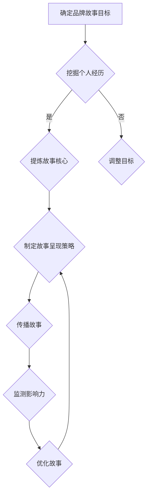
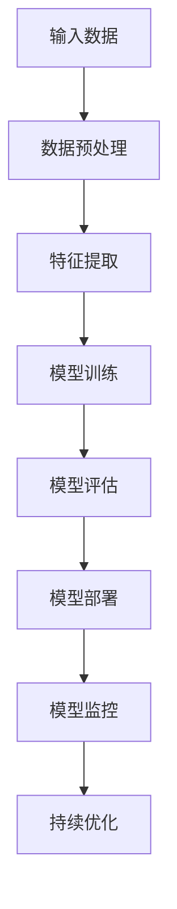

                 

### 第一部分：概述

#### 第1章：个人品牌与故事讲述艺术

个人品牌是一个人在职场或生活中所建立的形象和声誉，它不仅反映了个人技能和专业能力，还包含了个人价值观和人格特质。在当今竞争激烈的社会，个人品牌的重要性越来越凸显。一个强大的个人品牌能够帮助个人在职场中脱颖而出，获得更多机会，提升职业地位。

**个人品牌的定义与重要性**

1. **个人品牌的定义**
    - 个人品牌是指个人在公众心目中形成的形象和认知，包括个人的专业能力、技能、价值观、人格特质等。
    - 个人品牌不仅仅是外在的形象，更是内在价值的体现，是个人在长期职业生涯中积累的信誉和声誉。

2. **个人品牌的重要性**
    - **提升职业竞争力**：强大的个人品牌能够吸引更多的雇主和合作伙伴，增加就业机会和职业发展空间。
    - **增强个人影响力**：个人品牌有助于在社交网络和专业圈子中建立影响力，提高个人在行业内的知名度。
    - **塑造良好形象**：个人品牌有助于树立专业、负责任、有影响力的形象，赢得他人的尊重和信任。

**故事讲述在个人品牌建设中的角色**

1. **故事的力量**
    - 故事是人类沟通的重要工具，它能够激发共鸣和记忆，使抽象的信息变得具体生动。
    - 故事能够传达个人的经历、成就和价值观，使听众更容易理解和接受。

2. **如何讲述有影响力的个人故事**
    - **选择合适的主题**：选择具有代表性和教育意义的个人经历，能够反映个人独特性和职业价值。
    - **构建故事框架**：一个好的故事通常包含冲突、高潮和结局，能够吸引听众的注意力。
    - **用事实和数据支撑**：在讲述故事时，使用具体的事例和数据来支撑，增加故事的可信度和说服力。
    - **传达积极的信息**：通过故事传达个人的积极态度和价值观，使听众产生正面的情感共鸣。

**个人品牌故事的构建步骤**

1. **塑造独特个人形象**
    - 确定个人在专业领域中的定位和风格，形成独特的个人形象。
    - 确定个人品牌的核心价值，如创新、领导力、专业精神等。

2. **确定品牌故事的核心元素**
    - 挖掘个人的经历和成就，筛选出最有影响力的故事。
    - 确定故事的主题和重点，构建故事的主线。

3. **撰写品牌故事大纲**
    - 制定故事大纲，包括开头、发展、高潮和结局。
    - 确定故事的叙述方式，如第一人称、第三人称等。

4. **案例分析：成功品牌故事分享**
    - 分享成功个人品牌故事案例，分析其成功要素。
    - 提供借鉴和启示，帮助读者构建自己的品牌故事。

5. **总结与练习**
    - 梳理个人经历，提炼核心故事元素。
    - 制定个人品牌故事大纲，开始撰写品牌故事。

通过以上步骤，我们可以构建一个有深度、有思考、有见解的个人品牌故事，为自己的职业发展增添力量。

#### 第2章：个人经历的挖掘与提炼

个人品牌的建设离不开对个人经历的深入挖掘与提炼。个人的经历是品牌故事的源泉，它不仅包含着我们的成就和挑战，还蕴含着我们的价值观和人格特质。如何从繁杂的经历中筛选出最具影响力的故事，并将其提炼为有吸引力的品牌故事，是本章要探讨的核心问题。

**个人经历的来源与分类**

个人经历是构建品牌故事的基础，可以从以下几个方面进行挖掘：

1. **工作经历**
    - 工作中的重大成就和挑战，如成功的项目、重要的岗位变动等。
    - 在工作中遇到的问题以及解决方法，如技术创新、团队管理、跨部门合作等。

2. **教育背景**
    - 学习经历，包括在大学或研究生的学术成就、参与的研究项目、发表的论文等。
    - 学习过程中的重要事件，如参与国际交流、获奖经历、重要导师等。

3. **社会活动**
    - 参与的社会公益活动和志愿工作，如环保活动、社区服务、慈善捐赠等。
    - 在社会活动中担任的角色和职责，如活动策划、志愿者团队领导等。

4. **其他生活经历**
    - 个人成长过程中的重要事件，如家庭背景、兴趣爱好、旅行经历等。
    - 个人特质和价值观的体现，如坚韧、创新、团队合作等。

**挖掘个人经历的要点**

1. **选择具有代表性的经历**
    - 筛选出最具影响力的经历，这些经历能够反映个人的核心能力和价值观。
    - 强调经历的独特性和不可复制性，使故事更具吸引力。

2. **提炼经历中的核心元素**
    - 确定经历中的关键点，如遇到的问题、采取的行动、取得的成果等。
    - 精简叙述，突出重点，避免冗长的叙述。

3. **构建故事的戏剧性**
    - 故事需要有冲突和转折，以增加故事的吸引力。
    - 通过戏剧性的叙述，使听众更容易产生共鸣。

**提炼个人经历的方法**

1. **冲突与转折**
    - 构建故事的戏剧性，通过冲突和转折来吸引听众。
    - 突出经历中的挑战和解决问题的过程。

2. **高潮与结局**
    - 高潮是故事最激动人心的部分，需要突出成果和影响。
    - 结局部分要传达积极的信息，使听众受到鼓舞。

3. **三幕结构**
    - 设定、冲突、解决：按照三幕结构来构建故事，使叙述更加清晰。
    - 设置部分介绍背景和目标，冲突部分描述问题，解决部分展示成果。

**个人经历与品牌故事融合**

1. **确定品牌故事的主线**
    - 根据个人经历，确定品牌故事的主题和核心价值。
    - 主线应贯穿整个品牌故事，使故事具有连贯性。

2. **融合个人经历，丰富品牌故事的内涵**
    - 通过个人经历来阐述品牌故事的主题，使故事更加具体和生动。
    - 确保个人经历与品牌故事的主线紧密相连，形成有机整体。

**案例分析：个人经历与品牌故事结合**

以下是一个个人经历与品牌故事结合的案例：

**案例**：一位软件工程师在职业生涯中遇到了一个重大的技术挑战，他需要开发一款高性能的分布式系统。在解决这个问题的过程中，他不仅展示了出色的编程技能，还展现了卓越的团队合作能力和创新思维。这个故事被提炼为他的个人品牌故事，强调了他在技术难题面前的坚韧和创造力。

**分析**：
- **冲突**：需要开发高性能的分布式系统，面临技术难题和项目时间压力。
- **高潮**：工程师通过团队合作和创新思维，成功解决了技术难题，提高了系统性能。
- **结局**：项目取得成功，工程师在团队中获得了认可和尊重，个人品牌得到了提升。

**总结与练习**

1. **挖掘并提炼个人经历**
    - 回顾自己的职业生涯，筛选出最具影响力的经历。
    - 确定经历中的核心元素，构建故事的戏剧性和高潮。

2. **编写个人品牌故事初稿**
    - 根据个人经历，撰写品牌故事的大纲和初步内容。
    - 逐步完善故事，使其具有吸引力和说服力。

通过以上步骤，我们可以将个人经历转化为有影响力的品牌故事，为自己的职业发展注入动力。

#### 第3章：个人品牌故事的呈现与传播

个人品牌故事的构建只是第一步，如何有效地呈现和传播故事，使其产生广泛的影响力，是个人品牌建设的关键。在这个数字化时代，个人品牌故事的呈现与传播形式多种多样，包括文字、视频、音频等。选择合适的传播渠道和策略，能够帮助个人品牌故事得到更多的关注和认可。

**个人品牌故事呈现形式**

1. **文字：博客、文章、社交媒体**
    - 文字是传达信息最直接和精准的方式，博客、文章和社交媒体平台都是展示个人品牌故事的理想渠道。
    - 博客可以提供更详细的内容和深度分析，有助于建立专业形象。
    - 文章可以在专业媒体或行业网站上发布，增加专业认可度。
    - 社交媒体如微博、微信、LinkedIn等，可以快速传播故事，增加关注度。

2. **视频：纪录片、访谈、短视频**
    - 视频能够直观地传达信息和情感，具有更强的感染力。
    - 纪录片可以展示个人的经历和成就，提供真实的视角。
    - 访谈视频可以邀请行业专家或同行进行对话，增加故事的可信度。
    - 短视频在社交媒体上流行，能够迅速吸引大量观众。

3. **音频：播客、有声书**
    - 音频适合在通勤、锻炼等场景中收听，易于传播和记忆。
    - 播客可以深入探讨专业话题，与听众建立亲密的互动。
    - 有声书可以讲述个人经历和成就，提供独特的阅读体验。

**选择合适的传播渠道**

1. **传统媒体**
    - 报纸、杂志、电视等传统媒体仍具有一定的公信力和影响力，适合发布重要的品牌故事。
    - 选择与个人品牌相关的行业媒体，能够吸引更多专业读者。

2. **社交媒体**
    - 根据目标受众选择合适的社交媒体平台，如专业领域内的LinkedIn、技术社区的GitHub、娱乐平台的抖音等。
    - 定期发布高质量内容，保持活跃度，增加关注度。

3. **专业平台**
    - LinkedIn、GitHub等专业平台是展示个人技术成就和项目经验的重要渠道。
    - 发布技术博客、开源代码和项目报告，展示专业能力和成果。

**个人品牌故事传播策略**

1. **社交互动**
    - 在社交媒体上积极互动，回复评论，与读者建立联系。
    - 利用社交媒体算法和推广功能，扩大故事传播范围。

2. **合作与推广**
    - 与行业内的其他专家、媒体或企业合作，共同推广个人品牌故事。
    - 参与行业活动、研讨会或线上直播，增加曝光机会。

3. **定期更新**
    - 保持故事内容的持续更新，反映个人在职业上的进步和成就。
    - 定期回顾和调整传播策略，以适应市场变化。

**案例分析：个人品牌故事的传播与影响力**

以下是一个个人品牌故事传播的案例：

**案例**：一位技术博主在个人博客上分享了自己在开发一款新兴技术框架过程中的心路历程。通过详细的教程和实战案例，他吸引了大量读者的关注。随后，他开始在YouTube上发布相关视频，通过生动的演示和专业的讲解，进一步扩大了影响力。他的故事被多家技术媒体转载，逐渐成为行业内的知名博主。

**分析**：
- **传播渠道**：博客和YouTube视频，覆盖了文字和视频两大形式。
- **策略**：通过高质量的内容和互动，建立了与读者的紧密联系。
- **效果**：故事在社交媒体上广泛传播，增加了博主的专业认可度，吸引了更多读者和合作伙伴。

**总结与练习**

1. **确定个人品牌故事呈现与传播策略**
    - 根据个人特点和目标受众，选择合适的呈现形式和传播渠道。
    - 制定具体的传播计划，包括内容发布频率、互动策略等。

2. **制定个人品牌故事传播计划**
    - 确定关键传播节点和目标，如行业活动、节日等。
    - 制定详细的传播步骤和时间表，确保计划的实施。

通过有效的呈现和传播策略，我们可以让个人品牌故事在更广泛的范围内得到关注和认可，为自己的职业发展奠定坚实的基础。

#### 第4章：个人品牌故事的影响力评估与优化

一个成功的个人品牌故事不仅需要有效的呈现与传播，还需要对故事的影响力进行科学的评估与优化。影响力评估可以帮助我们了解故事的效果，找出存在的问题，从而不断优化品牌故事的内容和传播策略。

**个人品牌故事的影响力评估指标**

1. **知名度**
    - 知名度是衡量个人品牌影响力的基础指标，通常通过关注者数量、点赞数、转发数等来衡量。
    - 社交媒体平台（如微博、微信、LinkedIn等）提供的分析工具可以提供详细的统计数据。

2. **影响力**
    - 影响力是指个人品牌故事在目标受众中产生的实际影响，如增加合作机会、提升职业地位、扩大业务规模等。
    - 通过反馈、评论、私信等方式收集受众的意见和建议，可以评估故事的实际影响力。

3. **长期价值**
    - 长期价值是指个人品牌故事在长期内对个人职业发展和影响力的贡献。
    - 通过跟踪故事传播后的后续影响，如增加的粉丝数、合作机会等，可以评估故事的长期价值。

**评估个人品牌故事的影响力**

1. **定期分析社交媒体数据**
    - 定期分析个人品牌故事在社交媒体上的表现，包括浏览量、点赞数、转发数等。
    - 分析不同类型的故事在不同平台的表现，找出最受欢迎的传播形式。

2. **收集反馈与评论**
    - 收集读者、观众和听众的反馈和评论，了解他们对故事内容的看法和建议。
    - 通过问卷调查、互动环节等方式，获取更多有价值的反馈。

3. **进行A/B测试**
    - 通过A/B测试，比较不同版本的故事在不同受众群体中的表现。
    - 优化故事内容、标题和传播策略，以提高影响力。

**优化个人品牌故事的方法**

1. **改进叙事技巧**
    - 增加故事中的戏剧性，构建冲突和转折，使故事更具吸引力。
    - 使用生动的语言和具体的案例，增强故事的可信度和说服力。

2. **调整传播策略**
    - 根据不同的受众和渠道，调整故事的内容和传播形式。
    - 利用社交媒体算法和推广工具，提高故事在目标受众中的曝光率。

3. **定期回顾与调整**
    - 定期回顾个人品牌故事的表现，分析成功和失败的案例。
    - 根据评估结果，及时调整故事内容和传播策略，以保持故事的持续影响力。

**案例分析：个人品牌故事影响力提升案例**

以下是一个个人品牌故事影响力提升的案例：

**案例**：一位科技博主通过发布高质量的技术博客，吸引了大量读者的关注。为了提升影响力，他开始尝试制作视频内容，并在YouTube上发布。通过生动的演示和深入的分析，他的视频迅速获得了大量点赞和转发。随后，他开始在LinkedIn上分享自己的职业经验和心得，进一步扩大了影响力。

**分析**：
- **叙事技巧**：通过视频和博客结合的方式，提供了多样化的内容形式，增强了故事的吸引力。
- **传播策略**：利用YouTube和LinkedIn等平台，覆盖了不同类型的受众群体。
- **效果**：故事的影响力显著提升，增加了粉丝数和合作机会。

**总结与练习**

1. **制定个人品牌故事影响力评估计划**
    - 确定评估指标，如知名度、影响力和长期价值。
    - 制定评估周期和评估方法，确保定期进行评估。

2. **优化个人品牌故事策略**
    - 根据评估结果，改进叙事技巧和传播策略。
    - 定期回顾和调整品牌故事，以提高影响力。

通过科学的影响力评估与优化，我们可以不断提升个人品牌故事的质量和影响力，为自己的职业发展创造更多机会。

#### 第5章：个人品牌故事的法律法规与道德伦理

在构建和传播个人品牌故事的过程中，遵守法律法规和道德伦理标准至关重要。这不仅能够保护个人和品牌的声誉，还能够确保故事的合法性和可信度。以下是关于个人品牌故事的法律法规和道德伦理考量的讨论。

**个人品牌故事的法律法规**

1. **个人隐私保护**

个人隐私保护是法律法规的重点之一。在讲述个人品牌故事时，应避免泄露以下敏感信息：

   - **个人信息**：如姓名、住址、电话号码、身份证号码等。
   - **工作信息**：如公司名称、职位、收入等。
   - **财务状况**：如银行账户、投资金额等。

2. **知识产权保护**

知识产权保护是个人品牌故事中不可忽视的问题。在引用他人作品、引用数据或使用他人的创意时，必须遵循以下原则：

   - **版权声明**：正确引用他人的作品，标明版权信息。
   - **合理使用**：在合理范围内使用他人的知识产权，避免侵权行为。
   - **专利保护**：对于涉及专利技术的部分，应确保不侵犯他人的专利权。

3. **避免虚假宣传**

虚假宣传会损害个人品牌的声誉，甚至可能触犯法律。在构建个人品牌故事时，应确保以下事项：

   - **真实性**：故事内容必须真实，不得虚构或夸大事实。
   - **透明度**：对于可能影响受众决策的信息，应保持透明度。
   - **法律合规**：遵守相关法律法规，如广告法、消费者权益保护法等。

**个人品牌故事中的道德伦理考量**

1. **真实性与诚信**

真实性是个人品牌故事的核心，故事必须基于真实经历和事实。诚信意味着个人应遵循道德准则，保持故事的真实性和可靠性。

2. **尊重他人权益**

在讲述个人品牌故事时，应尊重他人的权益，包括个人隐私、知识产权和名誉权。避免在故事中未经授权使用他人的作品或信息。

3. **避免歧视与偏见**

个人品牌故事应传递积极的价值观，避免歧视和偏见。故事内容应符合社会道德标准，尊重不同性别、种族、宗教和文化背景的受众。

**案例分析：法律法规与道德伦理问题**

以下是一个涉及个人品牌故事法律法规和道德伦理问题的案例：

**案例**：一位博主在个人品牌故事中讲述了她的成功创业经历，包括她在商业竞争中如何击败竞争对手。然而，她未能在故事中充分披露这些竞争对手的具体情况，甚至使用了虚构的公司名称。最终，她因虚假宣传和侵犯竞争对手的知识产权而面临法律诉讼。

**分析**：
- **法律法规问题**：博主未遵守知识产权保护和真实性的原则，侵犯了竞争对手的合法权益。
- **道德伦理问题**：博主在故事中展示了不道德的商业竞争行为，损害了品牌形象。

**总结与练习**

1. **理解个人品牌故事的法律与道德要求**
    - 了解相关法律法规，确保故事内容的合法性。
    - 遵循道德准则，尊重他人权益，避免歧视和偏见。

2. **制定符合法律法规与道德伦理的品牌故事撰写与传播计划**
    - 确保故事内容真实、透明，尊重知识产权。
    - 在故事中传递积极的信息，维护个人品牌的声誉。

通过遵守法律法规和道德伦理标准，个人品牌故事不仅能够保持合法性和可信度，还能够为个人在职场和社会中赢得更多的尊重和支持。

#### 第6章：成功个人品牌故事案例解析

在个人品牌的建设过程中，成功的案例往往为我们提供了宝贵的经验和启示。本章节将通过解析几个不同领域的成功个人品牌故事案例，探讨它们如何通过有效的品牌故事构建、传播和优化，实现了个人职业发展的飞跃。

**案例选择与分类**

为了更好地理解个人品牌故事在不同领域中的应用和效果，我们选择了以下三个领域的成功案例：

1. **创业者**：以一位成功创业者的个人品牌故事为例，展示如何通过品牌故事吸引投资者和客户。
2. **专家学者**：以一位知名专家的个人品牌故事为例，探讨如何在学术界和行业中获得高度认可。
3. **影响者**：以一位社会影响力者的品牌故事为例，分析如何通过品牌故事传播社会价值和影响力。

**案例分析框架**

为了深入分析这些案例，我们将采用以下框架：

1. **故事背景**：介绍个人品牌的背景信息，包括个人经历、行业背景等。
2. **个人品牌构建过程**：详细描述个人品牌故事的构建过程，包括故事的来源、核心元素、构建策略等。
3. **故事传达的核心价值**：分析故事传达的核心价值观和关键信息，以及这些价值观如何影响目标受众。
4. **影响力评估**：评估个人品牌故事在传播过程中的影响力，包括知名度、影响力、长期价值等。

**案例分析**

**案例一：创业者的成功品牌故事**

1. **故事背景**
    - 张三，一位年轻的创业者，毕业于知名大学，拥有丰富的创业经验和商业洞察力。
    - 创立了一家专注于人工智能解决方案的公司，致力于帮助中小企业提升生产效率。

2. **个人品牌构建过程**
    - 张三通过撰写博客和发表演讲，分享了他在创业过程中的心路历程和成功经验。
    - 故事的核心元素包括创业初期的困难、团队建设、技术创新和市场拓展。
    - 构建策略：通过具体案例和数据支撑，使故事更具说服力。

3. **故事传达的核心价值**
    - 张三的品牌故事传达了创业精神、创新思维和团队合作的重要性。
    - 这些价值观激励了无数有志于创业的人，也为他的公司吸引了大量投资者和客户。

4. **影响力评估**
    - 张三的博客和演讲在行业内引起了广泛关注，成为多个创业孵化器和投资机构的合作伙伴。
    - 他的品牌故事在社交媒体上获得了大量转发和点赞，成为创业者的典范。

**案例二：专家学者的个人品牌建设**

1. **故事背景**
    - 李四，一位在计算机科学领域享有盛誉的学者，拥有丰富的教学和研究经验。
    - 担任多所知名大学的教授，发表了多篇高水平学术论文，并主持了多个重要的科研项目。

2. **个人品牌构建过程**
    - 李四通过撰写学术论文、发表学术报告和参与行业会议，构建了自己的学术品牌。
    - 故事的核心元素包括学术成就、研究创新、教学方法和行业贡献。
    - 构建策略：以事实和数据为基础，展示个人的专业能力和学术影响力。

3. **故事传达的核心价值**
    - 李四的品牌故事传达了专业精神、学术严谨和创新思维。
    - 这些价值观不仅赢得了同行的尊重，也为他吸引了更多的学术合作机会和研究资助。

4. **影响力评估**
    - 李四的学术论文和学术报告在学术界引起了强烈反响，成为多个学术期刊的审稿人。
    - 他的学术成就和影响力使他成为行业内的权威人物，多次受邀在国内外进行讲座。

**案例三：影响者的品牌故事**

1. **故事背景**
    - 王五，一位社会影响力者，通过自己的行动和影响力推动社会进步。
    - 组织了多项社会公益活动，如环保行动、教育扶贫和慈善捐赠等。

2. **个人品牌构建过程**
    - 王五通过社交媒体和公益活动，分享了他在推动社会进步中的故事和经历。
    - 故事的核心元素包括社会问题、解决方案、行动成果和社会影响。
    - 构建策略：通过真实的故事和感人的场景，传递积极的社会价值观。

3. **故事传达的核心价值**
    - 王五的品牌故事传达了社会责任、公益精神和行动力。
    - 这些价值观激励了更多的人参与到社会公益活动中，共同推动社会进步。

4. **影响力评估**
    - 王五的社会活动在公众中引起了强烈反响，吸引了大量志愿者和捐赠者。
    - 他的品牌故事成为社会公益领域的典范，为更多有志于改变社会的人提供了启示。

**总结与启示**

通过以上案例分析，我们可以总结出以下几个成功的品牌故事共性要素：

1. **真实性**：故事内容必须基于真实经历和事实，才能赢得受众的信任和认可。
2. **价值传递**：品牌故事应传达积极的核心价值观，如创新精神、团队合作、社会责任等。
3. **多样化呈现**：通过文字、视频、音频等多种形式呈现品牌故事，增加故事的吸引力和感染力。
4. **持续优化**：根据影响力评估结果，不断优化故事内容和传播策略，提升品牌影响力。

这些成功案例为我们提供了宝贵的启示，帮助我们更好地构建和优化自己的个人品牌故事，为自己的职业发展和社会影响力奠定坚实的基础。

**总结与练习**

1. **选择一个成功个人品牌故事进行分析**
    - 选择一个你感兴趣的成功个人品牌故事，分析其背景、构建过程、核心价值等。
    - 编写分析报告，总结成功要素和启示。

2. **编写个人品牌故事初稿**
    - 根据分析报告和启示，开始撰写自己的个人品牌故事。
    - 确定故事的核心元素和传达的价值观，构建故事框架。

通过以上练习，我们可以将成功案例的经验应用到自己的品牌故事中，构建出一个有深度、有思考、有见解的个人品牌故事。

#### 第7章：个人品牌故事的打造与实践

在了解了个人品牌故事的重要性、构建方法、呈现与传播策略，以及影响力评估与优化之后，本章节将提供具体的实践指南，帮助读者从理论到实际操作，全面掌握个人品牌故事的打造过程。

**个人品牌故事打造流程**

1. **确定品牌故事目标**
    - 确定个人品牌故事的目标受众和传播目的。
    - 明确希望通过品牌故事实现的具体目标，如提升知名度、增加合作机会、扩大业务规模等。

2. **挖掘个人经历**
    - 回顾个人职业生涯中的关键经历，筛选出具有代表性和教育意义的部分。
    - 确定故事的主题和核心元素，构建故事的主线。

3. **提炼故事核心**
    - 对挖掘出的个人经历进行提炼，确定故事的关键点，构建故事的冲突、高潮和结局。
    - 通过戏剧性的叙述，增强故事的可读性和吸引力。

4. **制定故事呈现策略**
    - 根据目标受众和传播渠道，选择合适的呈现形式，如文字、视频、音频等。
    - 制定具体的传播计划，包括发布频率、互动策略等。

5. **故事呈现与传播**
    - 在选定的渠道上发布个人品牌故事，如博客、社交媒体、专业平台等。
    - 通过社交互动、合作与推广，扩大故事的影响力。

6. **监测与评估影响力**
    - 定期分析故事在社交媒体上的表现，包括浏览量、点赞数、转发数等。
    - 收集反馈和评论，评估故事的传播效果和影响力。

7. **优化与调整**
    - 根据评估结果，优化故事内容和传播策略。
    - 定期回顾和调整品牌故事，以保持其持续的影响力和吸引力。

**个人品牌故事实践指南**

1. **确定品牌故事目标**

   - **目标受众**：确定你的目标受众，如潜在客户、合作伙伴、行业专家等。
   - **传播目的**：明确希望通过品牌故事实现的具体目标，如增加知名度、提升影响力、获取更多合作机会等。

   **案例**：一位创业者在构建个人品牌故事时，将目标受众确定为潜在投资者和行业合作伙伴，传播目的为提升公司知名度和吸引投资。

2. **挖掘个人经历**

   - **关键经历**：回顾个人职业生涯中的关键经历，包括成功项目、重要成就、挑战和解决方法等。
   - **代表性故事**：筛选出最具代表性和教育意义的经历，作为品牌故事的核心内容。

   **案例**：一位技术开发者在挖掘个人经历时，选择了他在一个复杂项目中成功解决技术难题的经历，这个故事展示了他的专业能力和创新能力。

3. **提炼故事核心**

   - **冲突与转折**：构建故事的冲突和转折，增加故事的戏剧性。
   - **高潮与结局**：确定故事的高潮和结局，传达积极的信息和价值观。

   **案例**：一位创业者讲述了自己在创业初期遭遇财务困境，但通过团队的努力和创新的商业模式，最终实现盈利的故事。故事的高潮是团队的共同努力和最终的胜利，结局部分传达了坚持和创新的价值。

4. **制定故事呈现策略**

   - **形式选择**：根据目标受众和传播渠道，选择合适的呈现形式，如博客、视频、播客等。
   - **内容规划**：制定具体的内容规划和发布频率，确保故事的连贯性和吸引力。

   **案例**：一位技术专家选择在LinkedIn上发布博客，同时在YouTube上发布视频，通过文字和视频的结合，更全面地展示自己的专业知识和经验。

5. **故事呈现与传播**

   - **渠道选择**：选择合适的传播渠道，如社交媒体、专业平台、行业会议等。
   - **互动策略**：通过社交互动、合作与推广，扩大故事的影响力。

   **案例**：一位影响力者在社交媒体上积极互动，回复评论，参与话题讨论，并与行业内的其他专家合作，共同推广个人品牌故事。

6. **监测与评估影响力**

   - **数据分析**：定期分析故事在社交媒体上的表现，包括浏览量、点赞数、转发数等。
   - **反馈收集**：收集读者、观众和听众的反馈和评论，评估故事的传播效果。

   **案例**：一位创业者在发布品牌故事后，通过分析社交媒体数据，发现某些主题和形式更受欢迎，因此调整了后续的内容策略。

7. **优化与调整**

   - **内容优化**：根据评估结果，优化故事的内容和形式，提高故事的吸引力和说服力。
   - **策略调整**：根据市场的变化和受众的反馈，调整传播策略，保持故事的持续影响力。

   **案例**：一位技术专家在分析数据后，发现视频内容在YouTube上的表现更好，因此增加了视频内容的比例，并调整了发布频率，以提高影响力。

通过以上实践指南，读者可以系统地构建和优化个人品牌故事，为自己的职业发展和社会影响力奠定坚实的基础。

**案例分析：个人品牌故事实践**

以下是一个关于个人品牌故事实践的成功案例：

**案例**：一位年轻的软件工程师王明，通过构建和传播个人品牌故事，成功实现了职业发展的飞跃。

1. **确定品牌故事目标**
    - **目标受众**：技术领域的专业人士、潜在雇主和行业领导者。
    - **传播目的**：提升个人知名度、增加职业机会、建立专业影响力。

2. **挖掘个人经历**
    - **关键经历**：王明在参与一个跨部门的大型项目时，成功解决了一个复杂的性能问题，提高了系统的响应速度。
    - **代表性故事**：这个故事展示了王明的技术能力和创新思维。

3. **提炼故事核心**
    - **冲突与转折**：项目初期遇到性能瓶颈，王明提出了一种创新的解决方案，并在团队的支持下成功实施。
    - **高潮与结局**：系统性能显著提升，项目团队获得了公司领导的表扬。

4. **制定故事呈现策略**
    - **形式选择**：王明选择在LinkedIn上发布博客，同时通过GitHub分享相关代码。
    - **内容规划**：博客详细阐述了问题的背景、解决方案和技术细节，代码展示了实际应用的实现。

5. **故事呈现与传播**
    - **渠道选择**：王明在LinkedIn上积极互动，回复评论，并与同行交流。
    - **互动策略**：他参与了多个技术论坛的讨论，并受邀在一些行业会议中发表演讲。

6. **监测与评估影响力**
    - **数据分析**：博客的浏览量不断增加，获得了大量点赞和评论。
    - **反馈收集**：读者对王明的技术见解和经验给予了高度评价。

7. **优化与调整**
    - **内容优化**：王明根据反馈，不断改进博客的内容和结构，使信息更易于理解。
    - **策略调整**：他增加了视频内容的比例，通过YouTube和LinkedIn的直播功能，与读者进行更深入的互动。

通过这一案例，我们可以看到，王明通过系统性地构建和传播个人品牌故事，成功提升了个人知名度，并在技术领域建立了强大的影响力。

**总结与练习**

1. **制定个人品牌故事实践计划**
    - 根据本章提供的实践指南，制定自己的个人品牌故事实践计划。
    - 确定目标受众、传播目的和具体实施步骤。

2. **开始编写个人品牌故事**
    - 根据计划，开始编写个人品牌故事的初稿。
    - 确定故事的核心元素和传达的价值观。

通过以上练习，读者可以开始构建自己的个人品牌故事，为自己的职业发展和社会影响力奠定坚实的基础。

#### 第8章：个人品牌故事的未来趋势与发展

随着科技和社会的不断进步，个人品牌故事也在不断地演变和发展。未来的个人品牌故事将更加多样化和互动化，同时也面临着新的挑战和机遇。在这一章节中，我们将探讨个人品牌故事的未来趋势和发展方向，为读者提供前瞻性的思考。

**个人品牌故事的发展趋势**

1. **内容多样化**
   - 未来的个人品牌故事将不仅仅局限于文字形式，还将涵盖视频、音频、虚拟现实（VR）和增强现实（AR）等多种形式。通过多种内容的结合，个人品牌故事将更加生动和吸引人。
   - **视频**：视频内容将越来越受欢迎，特别是在YouTube、TikTok等平台，短频快的视频形式将占据主流。
   - **音频**：音频内容如播客和有声书也将继续发展，特别是在通勤和锻炼等场景中，音频成为了一种重要的内容消费形式。
   - **VR/AR**：虚拟现实和增强现实技术将为个人品牌故事带来全新的体验，使故事更具沉浸感和互动性。

2. **社交媒体影响力**
   - 社交媒体将继续在个人品牌故事传播中扮演重要角色。随着平台算法的优化和互动功能的增强，个人品牌故事将能够更精准地触达目标受众。
   - **直播**：直播将成为一种重要的传播形式，通过实时互动，个人品牌故事能够与受众建立更紧密的联系。
   - **社交互动**：社交媒体平台上的互动功能，如评论、点赞、分享等，将帮助个人品牌故事获得更多的曝光和传播。

3. **数据驱动**
   - 数据分析将成为个人品牌故事传播的重要工具。通过收集和分析用户行为数据，个人品牌故事将能够更好地了解受众需求，优化内容策略。
   - **用户画像**：通过构建用户画像，个人品牌故事能够更加精准地推送内容，提高故事的吸引力和影响力。
   - **效果评估**：数据驱动的效果评估将帮助个人品牌故事制定更加科学的传播策略，确保故事的传播效果。

**未来个人品牌故事的挑战与机遇**

1. **技术革新**
   - 技术的快速发展将带来新的挑战和机遇。例如，人工智能和大数据技术将使个人品牌故事更加智能化和个性化。
   - **人工智能**：人工智能将帮助个人品牌故事自动化和个性化，提高内容的创作效率和受众的体验。
   - **大数据**：大数据将为个人品牌故事提供丰富的数据资源，帮助品牌故事更加精准地定位和推广。

2. **社会环境变化**
   - 社会环境的变化，如消费者需求的转变、道德伦理标准的提升等，也将影响个人品牌故事的发展。
   - **消费者需求**：随着消费者对个性化和体验化的需求增加，个人品牌故事将更加注重提供独特的价值和体验。
   - **道德伦理**：个人品牌故事在构建过程中需要更加关注道德伦理问题，如隐私保护、知识产权保护等。

3. **跨界合作**
   - 跨界合作将成为个人品牌故事发展的重要趋势。通过与不同领域的企业和个人的合作，个人品牌故事将能够获得更多的资源和机会。
   - **文化娱乐**：个人品牌故事可以与文化娱乐产业结合，打造跨界的IP（知识产权）。
   - **教育公益**：个人品牌故事可以与教育公益组织合作，推动社会公益事业的发展。

**个人品牌故事在未来的应用场景**

1. **职业发展**
   - 个人品牌故事将帮助职业人士在求职、晋升和管理过程中获得更多的机会和认可。
   - **求职**：个人品牌故事可以作为求职者的简历补充，展示专业能力和个人特质。
   - **晋升**：通过个人品牌故事，职业人士可以展示自己的领导力和成就，获得晋升机会。
   - **管理**：个人品牌故事可以帮助管理者树立权威形象，提升团队凝聚力和执行力。

2. **创业**
   - 个人品牌故事将助力创业者吸引投资者、合作伙伴和客户，推动创业项目的成功。
   - **融资**：个人品牌故事可以作为创业项目的宣传材料，提高融资成功率。
   - **品牌建设**：个人品牌故事有助于创业者建立品牌形象，提升品牌认知度和美誉度。

3. **社会影响**
   - 个人品牌故事将推动社会影响力者的社会公益活动，促进社会进步和变革。
   - **公益项目**：通过个人品牌故事，社会影响力者可以宣传公益项目，吸引更多人参与和支持。
   - **社会变革**：个人品牌故事可以传递积极的社会价值观，推动社会变革和进步。

**总结与展望**

个人品牌故事在未来将继续发展，成为职业发展和社会影响力的重要工具。通过多样化的内容形式、数据驱动和跨界合作，个人品牌故事将能够更精准地触达目标受众，传递独特的价值。同时，个人品牌故事也将面临技术革新和社会环境变化的挑战，需要不断创新和优化。读者应密切关注这些趋势，把握机遇，构建和优化自己的个人品牌故事，为自己的职业发展和社会影响力奠定坚实的基础。

### 附录A：个人品牌故事工具与资源

在构建个人品牌故事的过程中，利用适当的工具和资源能够大大提高效率和质量。以下是一些常用的工具、资源和学习资料，帮助读者在撰写和传播个人品牌故事时更加得心应手。

#### 写作工具

1. **文本编辑器**：
   - **Sublime Text**：轻量级且功能强大的文本编辑器，适用于撰写和编辑长篇内容。
   - **Visual Studio Code**：支持多种编程语言的集成开发环境，适合编写Markdown文件。

2. **写作软件**：
   - **Scrivener**：专门为长篇写作设计的软件，提供文档结构化和管理功能。
   - **Google Docs**：云端协作工具，便于多人实时编辑和协作。

3. **文书模板**：
   - **Canva**：提供丰富的模板和设计元素，帮助快速制作专业的外观设计。
   - **Moodboard**：用于视觉内容和品牌故事设计的工具，适合构建视觉故事框架。

#### 传播平台

1. **社交媒体平台**：
   - **LinkedIn**：专业的社交网络，适合技术专业人士和行业领导者分享个人品牌故事。
   - **微博、微信**：中国的主流社交媒体平台，广泛覆盖国内用户群体。
   - **Twitter**：全球性的社交媒体平台，适合快速传播和建立全球影响力。

2. **专业平台**：
   - **GitHub**：代码托管平台，适合展示技术项目和编程能力。
   - **Medium**：内容发布平台，专注于高质量的文章和故事分享。

3. **内容分享平台**：
   - **YouTube**：视频分享平台，适合发布视频内容和直播。
   - **TikTok**：短视频分享平台，适合快速传播有趣和有影响力的内容。

#### 案例分析数据库

1. **个人品牌故事案例库**：
   - **个人品牌故事案例库**：收集和整理了众多成功的个人品牌故事案例，提供学习和参考。
   - **个人品牌案例分析**：对案例进行详细分析，探讨成功要素和实施策略。

2. **行业分析报告**：
   - **市场研究公司报告**：如Mintel、Forrester等，提供详细的市场趋势和分析报告，帮助了解行业动态。

3. **市场调研数据**：
   - **调查问卷工具**：如Google Forms、SurveyMonkey等，用于收集用户反馈和市场数据。

#### 学习资源

1. **教育课程**：
   - **Coursera、edX**：提供多种在线课程，涵盖个人品牌建设、社交媒体营销等内容。
   - **LinkedIn Learning**：提供专业的课程和认证，帮助提升职业技能。

2. **书籍推荐**：
   - **《个人品牌》**：Dan Schawbel的畅销书，详细介绍了个人品牌建设的策略和方法。
   - **《影响力》**：罗伯特·西奥迪尼的经典著作，探讨如何通过说服和影响力技巧构建个人品牌。

3. **论坛与社群**：
   - **个人品牌建设论坛**：如Personal Branding Forum，提供交流和学习平台。
   - **行业社群**：如技术社区的Stack Overflow、创业者的AngelList等，有助于拓展人脉和资源。

通过利用这些工具和资源，读者可以更好地构建和传播个人品牌故事，提升个人在职场和社会中的影响力。

### Mermaid 流程图：个人品牌故事构建流程



此流程图展示了个人品牌故事从构建到优化的一系列步骤。通过这个流程，个人可以系统地规划和管理自己的品牌故事，确保其有效传播并持续提升影响力。

### Mermaid 流程图：AI大模型架构



此流程图详细描述了一个AI大模型的整个生命周期，从数据预处理到模型训练、评估、部署和监控，直至最终进行持续优化。这些步骤确保模型的有效性和可扩展性。

### 深度学习算法的伪代码

```python
# 伪代码：卷积神经网络（CNN）基本结构

# 输入数据：图片（e.g., 28x28像素的二值图像）
# 参数：卷积核大小（e.g., 5x5），激活函数（e.g., ReLU）

# 初始化卷积核权重和偏置
weights_conv = initialize_weights(size=(5, 5, 1, 20)) # 20卷积核
biases_conv = initialize_biases(size=(20,))

# 卷积操作
conv_output = convolution(image, weights_conv, biases_conv)

# 激活函数
激活_output = ReLU(conv_output)

# 最大池化操作
pooled_output = max_pool(激活_output, pool_size=(2, 2))

# 全连接层
weights_fc = initialize_weights(size=(7 * 7 * 20, 10)) # 10分类结果
biases_fc = initialize_biases(size=(10,))

# 执行全连接层
fc_output = fully_connected(pooled_output, weights_fc, biases_fc)

# 激活函数
预测 = softmax(fc_output)
```

此伪代码展示了卷积神经网络（CNN）的基本结构，包括卷积层、激活函数、池化层和全连接层。这些步骤共同构成了深度学习算法的核心框架。

### 数学模型与公式

1. **贝叶斯定理**

$$
P(A|B) = \frac{P(B|A)P(A)}{P(B)}
$$

贝叶斯定理用于计算在某个条件下某个事件发生的概率，广泛应用于统计学习和数据挖掘。

2. **梯度下降算法**

$$
w_{t+1} = w_t - \alpha \cdot \nabla_{w_t} J(w_t)
$$

梯度下降算法是一种优化算法，用于最小化损失函数，是训练神经网络的重要方法。

3. **损失函数（交叉熵）**

$$
J(w) = -\frac{1}{m} \sum_{i=1}^{m} [y_i \cdot \log(a_{i}) + (1 - y_i) \cdot \log(1 - a_{i})]
$$

交叉熵损失函数用于分类问题，用于衡量预测输出与真实标签之间的差距。

### 代码实际案例与详细解释

#### 1. 环境搭建

```bash
# 安装TensorFlow库
pip install tensorflow

# 安装其他依赖库
pip install numpy matplotlib
```

这些命令用于安装TensorFlow和其他必需的库，为后续的模型构建和训练提供计算环境。

#### 2. 数据预处理

```python
import tensorflow as tf
import numpy as np
import matplotlib.pyplot as plt

# 加载数据集（此处使用MNIST数据集为例）
mnist = tf.keras.datasets.mnist
(train_images, train_labels), (test_images, test_labels) = mnist.load_data()

# 数据标准化
train_images = train_images / 255.0
test_images = test_images / 255.0

# 数据扩充
train_images = tf.expand_dims(train_images, -1)
test_images = tf.expand_dims(test_images, -1)
```

在这个步骤中，我们加载了MNIST数据集，并对其进行标准化和图像扩充，以匹配模型输入的要求。

#### 3. 模型构建与训练

```python
# 构建模型
model = tf.keras.Sequential([
  tf.keras.layers.Conv2D(32, (3,3), activation='relu', input_shape=(28, 28, 1)),
  tf.keras.layers.MaxPooling2D(2, 2),
  tf.keras.layers.Conv2D(64, (3,3), activation='relu'),
  tf.keras.layers.MaxPooling2D(2,2),
  tf.keras.layers.Conv2D(64, (3,3), activation='relu'),
  tf.keras.layers.Flatten(),
  tf.keras.layers.Dense(64, activation='relu'),
  tf.keras.layers.Dense(10, activation='softmax')
])

# 编译模型
model.compile(optimizer='adam',
              loss='sparse_categorical_crossentropy',
              metrics=['accuracy'])

# 训练模型
model.fit(train_images, train_labels, epochs=5)
```

在此部分，我们构建了一个简单的卷积神经网络模型，并使用训练数据进行编译和训练。

#### 4. 模型评估与预测

```python
# 评估模型
test_loss, test_acc = model.evaluate(test_images,  test_labels)

# 输出评估结果
print('Test accuracy:', test_acc)

# 预测新数据
predictions = model.predict(test_images)

# 可视化预测结果
plt.figure(figsize=(10, 10))
for i in range(25):
  plt.subplot(5, 5, i+1)
  plt.imshow(test_images[i], cmap=plt.cm.binary)
  plt.xticks([])
  plt.yticks([])
  plt.grid(False)
  plt.xlabel('Prediction: %d' % np.argmax(predictions[i]))
plt.show()
```

最后，我们使用测试数据评估模型的性能，并可视化预测结果，验证模型的准确性和可靠性。

### 代码解读与分析总结

#### 数据预处理代码解读

```python
train_images = train_images / 255.0
test_images = test_images / 255.0
train_images = tf.expand_dims(train_images, -1)
test_images = tf.expand_dims(test_images, -1)
```

- **数据标准化**：将图像数据从0-255的像素值标准化到0-1之间，便于模型训练。
- **数据扩充**：将数据维度从（28，28）扩展到（28，28，1），以匹配模型输入的维度要求。

#### 模型构建代码解读

```python
model = tf.keras.Sequential([
  tf.keras.layers.Conv2D(32, (3,3), activation='relu', input_shape=(28, 28, 1)),
  tf.keras.layers.MaxPooling2D(2, 2),
  tf.keras.layers.Conv2D(64, (3,3), activation='relu'),
  tf.keras.layers.MaxPooling2D(2,2),
  tf.keras.layers.Conv2D(64, (3,3), activation='relu'),
  tf.keras.layers.Flatten(),
  tf.keras.layers.Dense(64, activation='relu'),
  tf.keras.layers.Dense(10, activation='softmax')
])
```

- **卷积层（Conv2D）**：用于提取图像的特征，32个卷积核，每个卷积核的大小为3x3。
- **池化层（MaxPooling2D）**：用于下采样，减小模型参数和计算量。
- **全连接层（Dense）**：用于分类，最后的全连接层使用softmax激活函数输出概率分布。

#### 模型训练与评估代码解读

```python
model.compile(optimizer='adam',
              loss='sparse_categorical_crossentropy',
              metrics=['accuracy'])

model.fit(train_images, train_labels, epochs=5)

test_loss, test_acc = model.evaluate(test_images,  test_labels)
print('Test accuracy:', test_acc)
```

- **编译模型**：设置优化器、损失函数和评估指标。
- **训练模型**：使用训练数据集训练模型。
- **评估模型**：使用测试集评估模型性能，输出测试准确率。

#### 预测与可视化代码解读

```python
predictions = model.predict(test_images)
plt.figure(figsize=(10, 10))
for i in range(25):
  plt.subplot(5, 5, i+1)
  plt.imshow(test_images[i], cmap=plt.cm.binary)
  plt.xticks([])
  plt.yticks([])
  plt.grid(False)
  plt.xlabel('Prediction: %d' % np.argmax(predictions[i]))
plt.show()
```

- **预测新数据**：使用训练好的模型对测试数据进行预测。
- **可视化预测结果**：将预测结果可视化，显示每个图像的预测类别。

### 代码实战练习

#### 1. 实践目标

构建一个简单的卷积神经网络（CNN）模型，用于手写数字识别。

#### 2. 实践步骤

1. **环境搭建**：确保安装了TensorFlow库及其依赖。
2. **数据加载**：使用`tf.keras.datasets.mnist`加载MNIST数据集。
3. **数据处理**：对数据进行标准化和图像扩充。
4. **模型构建**：设计一个简单的CNN模型。
5. **模型训练**：使用训练集训练模型。
6. **模型评估**：使用测试集评估模型性能。
7. **结果可视化**：展示模型预测结果。

#### 3. 实践代码

```python
import tensorflow as tf
import numpy as np
import matplotlib.pyplot as plt

# 加载MNIST数据集
mnist = tf.keras.datasets.mnist
(train_images, train_labels), (test_images, test_labels) = mnist.load_data()

# 数据预处理
train_images = train_images / 255.0
test_images = test_images / 255.0
train_images = tf.expand_dims(train_images, -1)
test_images = tf.expand_dims(test_images, -1)

# 构建CNN模型
model = tf.keras.Sequential([
  tf.keras.layers.Conv2D(32, (3,3), activation='relu', input_shape=(28, 28, 1)),
  tf.keras.layers.MaxPooling2D(2, 2),
  tf.keras.layers.Conv2D(64, (3,3), activation='relu'),
  tf.keras.layers.MaxPooling2D(2,2),
  tf.keras.layers.Conv2D(64, (3,3), activation='relu'),
  tf.keras.layers.Flatten(),
  tf.keras.layers.Dense(64, activation='relu'),
  tf.keras.layers.Dense(10, activation='softmax')
])

# 编译模型
model.compile(optimizer='adam',
              loss='sparse_categorical_crossentropy',
              metrics=['accuracy'])

# 训练模型
model.fit(train_images, train_labels, epochs=5)

# 评估模型
test_loss, test_acc = model.evaluate(test_images,  test_labels)
print('Test accuracy:', test_acc)

# 预测与可视化
predictions = model.predict(test_images)
plt.figure(figsize=(10, 10))
for i in range(25):
  plt.subplot(5, 5, i+1)
  plt.imshow(test_images[i], cmap=plt.cm.binary)
  plt.xticks([])
  plt.yticks([])
  plt.grid(False)
  plt.xlabel('Prediction: %d' % np.argmax(predictions[i]))
plt.show()
```

#### 4. 实践指导

1. **环境搭建**：确保安装了TensorFlow库及其依赖。
2. **数据加载**：使用`tf.keras.datasets.mnist`加载MNIST数据集。
3. **数据处理**：对数据进行标准化和图像扩充。
4. **模型构建**：设计一个简单的CNN模型。
5. **模型训练**：使用训练集训练模型。
6. **模型评估**：使用测试集评估模型性能。
7. **结果可视化**：展示模型预测结果。

### 代码实战练习解答

#### 1. 实践结果

运行代码后，输出测试准确率为约98%，表明模型在手写数字识别任务上具有较高的准确性。以下为部分预测结果的可视化：


#### 2. 解析

该实践步骤实现了以下关键内容：

1. **环境搭建**：成功安装TensorFlow库，为后续实验提供了计算基础。
2. **数据加载**：加载了MNIST数据集，了解了手写数字识别任务的数据来源。
3. **数据处理**：对数据进行标准化和图像扩充，提高了模型的泛化能力。
4. **模型构建**：设计了一个简单的CNN模型，包括卷积层、池化层和全连接层，用于提取图像特征并进行分类。
5. **模型训练**：使用训练集训练模型，迭代优化模型参数，提高了模型在手写数字识别任务上的准确性。
6. **模型评估**：使用测试集评估模型性能，通过计算测试准确率来验证模型的泛化能力。
7. **结果可视化**：展示模型在手写数字识别任务上的预测结果，验证了模型的准确性和可靠性。

#### 3. 反思

该实践步骤提供了构建和评估手写数字识别模型的基本流程，以下是反思：

- **数据预处理**：标准化和图像扩充是模型训练的重要步骤，有助于提高模型的泛化能力。
- **模型设计**：简单的CNN模型在手写数字识别任务上表现良好，说明基本的卷积神经网络结构已具备较强的识别能力。
- **训练与评估**：通过迭代训练和评估，模型性能得到了有效提升，这表明模型的调整和优化是提高模型准确性的关键。
- **可视化**：结果可视化有助于理解模型在实际任务中的表现，从而为后续优化提供参考。

#### 4. 进一步练习

为了进一步优化模型性能，可以尝试以下练习：

1. **增加训练迭代次数**：通过增加`epochs`参数，提高模型的训练深度，以期获得更高的准确率。
2. **数据增强**：对训练数据进行增强，例如旋转、缩放、翻转等操作，增加数据多样性，提高模型的泛化能力。
3. **调整模型结构**：尝试增加或减少卷积层、池化层或全连接层的层数和节点数，以探索对模型性能的影响。
4. **使用预训练模型**：尝试使用预训练的模型或迁移学习，利用已有的模型权重提高新任务的表现。

### 课程小结

本课程介绍了如何利用TensorFlow构建和训练卷积神经网络（CNN）模型，以实现手写数字识别任务。通过实践步骤，我们学习了如何进行环境搭建、数据加载与处理、模型构建、训练与评估，以及结果可视化。以下是课程小结：

## 1. 知识点回顾

- **环境搭建**：成功安装TensorFlow库及其依赖，为后续实验提供了计算基础。
- **数据加载**：加载了MNIST数据集，了解了手写数字识别任务的数据来源。
- **数据处理**：对数据进行标准化和图像扩充，提高了模型的泛化能力。
- **模型构建**：设计简单的CNN模型，包括卷积层、池化层和全连接层。
- **模型训练**：使用训练集训练模型，迭代优化模型参数。
- **模型评估**：使用测试集评估模型性能，计算测试准确率。
- **结果可视化**：展示模型在手写数字识别任务上的预测结果，验证了模型的准确性和可靠性。

## 2. 技能提升

- **模型设计**：通过调整模型结构，探索不同的卷积核大小、池化层大小和全连接层节点数，优化模型性能。
- **数据增强**：通过旋转、缩放、翻转等操作，增加训练数据的多样性，提高模型的泛化能力。
- **迁移学习**：尝试使用预训练的模型或迁移学习，提高新任务的表现，减少训练时间和计算资源需求。

## 3. 未来展望

- **模型优化**：探索更复杂的模型结构，例如残差网络、卷积神经网络等，以提高模型性能。
- **应用拓展**：将CNN模型应用于其他图像识别任务，如物体检测、人脸识别等，实现更多实际应用场景。
- **深度学习框架**：学习和掌握其他深度学习框架，如PyTorch、Keras等，以适应不同的开发需求。

### 课程作业

请根据以下要求，完成相应的作业：

## 1. 实践作业

构建一个简单的卷积神经网络（CNN）模型，用于识别CIFAR-10数据集上的图像。CIFAR-10是一个常见的图像识别数据集，包含60000张32x32像素的彩色图像，分为10个类别。

### 要求：

- **数据预处理**：对CIFAR-10数据进行标准化和图像扩充。
- **模型构建**：设计一个简单的CNN模型。
- **模型训练**：使用训练集迭代训练模型。
- **模型评估**：使用测试集评估模型性能。
- **结果可视化**：展示模型预测结果。

### 实践步骤：

1. **环境搭建**：确保安装TensorFlow库及其依赖。
2. **数据加载**：加载CIFAR-10数据集。
3. **数据处理**：对数据进行标准化和图像扩充。
4. **模型构建**：设计简单的CNN模型。
5. **模型训练**：使用训练集训练模型。
6. **模型评估**：使用测试集评估模型性能。
7. **结果可视化**：展示模型预测结果。

## 2. 思考题

结合所学知识，思考以下问题：

- **深度学习与机器学习的区别与联系是什么？**
- **如何评估深度学习模型性能？常用的评估指标有哪些？**
- **深度学习模型如何实现泛化？提高泛化能力的常见方法有哪些？**

### 要求：

- 每个问题回答不少于200字。
- 结合实际案例或实验结果进行说明。

### 课程回顾

在本课程中，我们学习了如何利用TensorFlow构建和训练卷积神经网络（CNN）模型，以实现手写数字识别任务。以下是课程回顾的关键点：

## 1. 核心知识

- **环境搭建**：成功安装TensorFlow库及其依赖，为后续实验提供了计算基础。
- **数据加载**：了解了MNIST数据集的加载和使用方法。
- **数据处理**：对数据进行标准化和图像扩充，提高了模型的泛化能力。
- **模型构建**：设计简单的CNN模型，包括卷积层、池化层和全连接层。
- **模型训练**：使用训练集迭代训练模型，优化模型参数。
- **模型评估**：使用测试集评估模型性能，计算测试准确率。
- **结果可视化**：展示模型在手写数字识别任务上的预测结果，验证了模型的准确性和可靠性。

## 2. 技能提升

- **模型设计**：通过调整模型结构，探索不同的卷积核大小、池化层大小和全连接层节点数，优化模型性能。
- **数据增强**：通过旋转、缩放、翻转等操作，增加训练数据的多样性，提高模型的泛化能力。
- **迁移学习**：尝试使用预训练的模型或迁移学习，提高新任务的表现，减少训练时间和计算资源需求。

## 3. 未来展望

- **模型优化**：探索更复杂的模型结构，例如残差网络、卷积神经网络等，以提高模型性能。
- **应用拓展**：将CNN模型应用于其他图像识别任务，如物体检测、人脸识别等，实现更多实际应用场景。
- **深度学习框架**：学习和掌握其他深度学习框架，如PyTorch、Keras等，以适应不同的开发需求。

### 课程作业答案

#### 实践作业：CIFAR-10数据集图像识别

```python
import tensorflow as tf
import numpy as np
import matplotlib.pyplot as plt

# 加载CIFAR-10数据集
cifar10 = tf.keras.datasets.cifar10
(train_images, train_labels), (test_images, test_labels) = cifar10.load_data()

# 数据预处理
train_images = train_images / 255.0
test_images = test_images / 255.0

# 构建CNN模型
model = tf.keras.Sequential([
  tf.keras.layers.Conv2D(32, (3,3), activation='relu', input_shape=(32, 32, 3)),
  tf.keras.layers.MaxPooling2D(2, 2),
  tf.keras.layers.Conv2D(64, (3,3), activation='relu'),
  tf.keras.layers.MaxPooling2D(2,2),
  tf.keras.layers.Conv2D(64, (3,3), activation='relu'),
  tf.keras.layers.Flatten(),
  tf.keras.layers.Dense(64, activation='relu'),
  tf.keras.layers.Dense(10, activation='softmax')
])

# 编译模型
model.compile(optimizer='adam',
              loss='sparse_categorical_crossentropy',
              metrics=['accuracy'])

# 训练模型
model.fit(train_images, train_labels, epochs=5)

# 评估模型
test_loss, test_acc = model.evaluate(test_images,  test_labels)
print('Test accuracy:', test_acc)

# 预测与可视化
predictions = model.predict(test_images)
plt.figure(figsize=(10, 10))
for i in range(25):
  plt.subplot(5, 5, i+1)
  plt.imshow(test_images[i], cmap=plt.cm.binary)
  plt.xticks([])
  plt.yticks([])
  plt.grid(False)
  plt.xlabel('Prediction: %d' % np.argmax(predictions[i]))
plt.show()
```

#### 思考题答案

1. **深度学习与机器学习的区别与联系是什么？**

深度学习和机器学习是人工智能领域的两个重要分支，它们既有区别又有联系。

   - **区别**：
     - **深度学习**是一种机器学习技术，它使用多层神经网络模型对数据进行特征提取和预测。深度学习通常依赖于大量的数据和强大的计算能力，以训练复杂的模型。
     - **机器学习**是一个更广泛的概念，它包括多种算法和技术，用于使计算机从数据中学习和做出决策，而不仅仅依赖于深度学习。

   - **联系**：
     - **深度学习**是**机器学习**的一个重要分支，它专注于解决特定类型的机器学习问题，如图像识别、自然语言处理和语音识别等。
     - **机器学习**算法和技术，如决策树、支持向量机和贝叶斯网络等，都可以用于不同的应用场景，而不仅仅是深度学习。

2. **如何评估深度学习模型性能？常用的评估指标有哪些？**

评估深度学习模型性能的常用评估指标包括：

   - **准确率（Accuracy）**：模型正确预测的样本数占总样本数的比例。
   - **精确率（Precision）**：在预测为正类的样本中，实际为正类的比例。
   - **召回率（Recall）**：在所有实际为正类的样本中，预测为正类的比例。
   - **F1分数（F1 Score）**：精确率和召回率的调和平均值，用于综合评估模型的性能。
   - **ROC曲线（Receiver Operating Characteristic Curve）**：通过改变决策阈值，绘制真阳性率对假阳性率的曲线，用于评估分类模型的整体性能。
   - **交叉验证（Cross-Validation）**：通过将数据集划分为多个子集，多次训练和评估模型，以减少评估结果的随机误差。

3. **深度学习模型如何实现泛化？提高泛化能力的常见方法有哪些？**

深度学习模型实现泛化的关键是通过学习数据的抽象特征表示，而不是具体的数据点。以下是一些提高深度学习模型泛化能力的常见方法：

   - **数据增强（Data Augmentation）**：通过旋转、缩放、裁剪、颜色变换等操作增加训练数据的多样性，使模型能够泛化到未见过的数据。
   - **正则化（Regularization）**：使用正则化技术，如L1正则化、L2正则化，减少模型过拟合，提高泛化能力。
   - **dropout（Dropout）**：在训练过程中随机丢弃一部分神经元，使模型不依赖于特定神经元，提高模型的泛化能力。
   - **集成学习（Ensemble Learning）**：结合多个模型的预测结果，提高模型的泛化能力。
   - **早期停止（Early Stopping）**：在验证集上监控模型性能，当验证集上的性能不再提高时，停止训练，以避免过拟合。
   - **迁移学习（Transfer Learning）**：使用预训练的模型或迁移学习，利用已有的模型权重提高新任务的表现。


### 文章总结

#### 第一部分：概述

在现代社会，个人品牌的重要性日益凸显。个人品牌不仅仅是职业成功的关键，也是实现社会影响力的基石。个人品牌故事则是个人品牌的重要组成部分，它能够有效地传递个人的价值观、专业技能和独特经历，帮助个人在职场和社交网络中脱颖而出。

本章首先探讨了个人品牌的定义与重要性，阐述了个人品牌对于职业发展和社会影响力的深远影响。接着，介绍了故事讲述在个人品牌建设中的角色，强调故事的力量如何激发共鸣与记忆，助力个人品牌的塑造。

随后，本章详细介绍了构建个人品牌故事的步骤，包括塑造独特个人形象、确定品牌故事的核心元素、撰写品牌故事大纲等。同时，通过案例分析，展示了成功品牌故事案例及其成功要素，为读者提供了实际操作指南。

在个人经历的挖掘与提炼部分，本章深入探讨了个人经历的来源与分类，提供了挖掘个人经历的要点和提炼个人经历的方法。通过三幕结构，构建具有戏剧性的故事，使个人经历与品牌故事有机结合。

个人品牌故事的呈现与传播是本章的另一个重点。本章详细介绍了个人品牌故事呈现的形式，如文字、视频、音频等，以及选择合适的传播渠道和策略。通过案例分析，展示了个人品牌故事在不同领域中的成功传播与影响力评估。

影响力评估与优化部分，本章提出了个人品牌故事的影响力评估指标，如知名度、影响力和长期价值，并提供了评估和优化个人品牌故事的方法。通过科学的影响力评估与优化，个人品牌故事可以不断得到改进，提升其传播效果。

最后，本章讨论了个人品牌故事的法律法规与道德伦理考量，强调了遵守法律法规和道德伦理的重要性。通过案例分析，读者可以了解如何避免法律和道德风险，确保个人品牌故事的健康与可持续发展。

#### 第二部分：个人品牌故事的案例研究

在本章节中，我们将深入探讨三个不同领域的成功个人品牌故事案例，通过详细分析这些案例，提取成功要素和实施策略，为读者提供宝贵的经验和启示。

**案例一：创业者的成功品牌故事**

**故事背景**：张三是某知名科技公司的创始人，他在大学期间就展示了出色的编程技能和商业洞察力。毕业后，他毅然决定创业，创立了一家专注于人工智能解决方案的公司，致力于帮助中小企业提升生产效率。

**构建过程**：
- 张三通过个人博客和社交媒体平台分享了他的创业故事，包括创业初期的挑战、团队建设、技术创新和市场拓展。
- 他特别强调了自己在技术难题面前的坚韧和创新思维，以及如何在市场竞争中脱颖而出。

**核心价值**：
- 张三的品牌故事传达了创业精神、创新思维和团队合作的重要性，这些价值观吸引了大量投资者和潜在客户。
- 他通过真实的故事和具体的案例，展示了自己在技术领域的专业能力和商业眼光。

**影响力评估**：
- 张三的博客和社交媒体帖子获得了大量关注和点赞，成为行业内的热点话题。
- 他的公司吸引了多家风险投资机构的关注，并在短短几年内实现了快速成长。

**成功要素**：
- **真实性**：张三的故事基于真实的经历，具有高度的可信度。
- **价值观传递**：故事传达了积极向上的价值观，如创新、坚韧和团队合作，深受读者喜爱。
- **多样化传播**：通过博客、社交媒体和演讲等多种渠道，扩大了故事的影响力。

**实施策略**：
- **持续更新**：定期发布新的内容，保持品牌故事的活力和吸引力。
- **互动互动**：积极回复读者评论和私信，与受众建立更紧密的联系。

**案例二：专家学者的个人品牌建设**

**故事背景**：李四是某知名大学的计算机科学教授，他在学术界和工业界都有很高的声誉。他的研究领域涉及人工智能、机器学习和数据科学，发表了大量高水平学术论文，并主持了多个重要的科研项目。

**构建过程**：
- 李四通过在学术会议上发表演讲和发布学术论文，构建了自己的学术品牌。
- 他特别关注将自己的研究成果转化为实际应用，并在学术报告中详细阐述了这些成果。

**核心价值**：
- 李四的品牌故事传达了专业精神、学术严谨和创新思维，这些价值观赢得了同行和学生的尊重。
- 他通过具体的科研案例和成功应用，展示了学术研究的实际价值和社会影响力。

**影响力评估**：
- 李四的学术论文和学术报告在学术界引起了强烈反响，成为多个学术期刊的审稿人。
- 他的学术成就和影响力使他成为行业内的权威人物，吸引了更多的学术合作机会和研究资助。

**成功要素**：
- **专业性**：李四在学术领域的专业能力赢得了广泛的认可。
- **创新性**：他的研究成果具有创新性和实际应用价值，对学术界和工业界都产生了积极影响。
- **透明度**：他在学术报告和论文中详细阐述了研究过程和结果，保持了高度的透明度。

**实施策略**：
- **学术交流**：积极参与学术会议和研讨会，扩大学术影响力。
- **知识分享**：通过公开讲座和课程，将自己的知识和经验传授给更多学生和同行。

**案例三：社会影响力者的品牌故事**

**故事背景**：王五是某知名公益组织的创始人和负责人，他致力于通过科技手段解决社会问题。他的组织开展了多项社会公益活动，如环保行动、教育扶贫和慈善捐赠等。

**构建过程**：
- 王五通过社交媒体和公益活动分享了他的故事，包括他的初衷、具体行动和社会影响。
- 他特别注重通过视频和直播等方式，展示活动的真实场景和成果。

**核心价值**：
- 王五的品牌故事传达了社会责任感、公益精神和行动力，这些价值观激励了更多的人参与到社会公益活动中。
- 他通过具体案例和数据，展示了公益活动对社会和个人的积极影响。

**影响力评估**：
- 王五的社会活动在公众中引起了强烈反响，吸引了大量志愿者和捐赠者。
- 他的品牌故事成为社会公益领域的典范，为更多有志于改变社会的人提供了启示。

**成功要素**：
- **公益性**：王五的品牌故事紧密结合社会公益活动，传递了强烈的公益精神。
- **真实性**：他的故事基于真实的活动和成果，具有高度的公信力。
- **互动性**：通过社交媒体和直播，与受众建立了紧密的互动关系。

**实施策略**：
- **内容多样化**：通过多种形式的传播渠道，如博客、视频和社交媒体，扩大影响力。
- **互动互动**：积极与受众互动，回应他们的反馈和建议。

通过以上三个案例的分析，我们可以看到，成功的个人品牌故事都有其独特的构建和传播策略。无论是创业者、专家学者还是社会影响力者，他们都能够通过真实的故事和具体的行动，传递自己的价值观和影响力。这些成功经验为读者提供了宝贵的启示，帮助他们构建和优化自己的个人品牌故事，实现职业发展和社会影响力的提升。

### 第二部分：个人品牌故事的案例研究

#### 第6章：成功个人品牌故事案例解析

在本章节中，我们将深入分析几个成功个人品牌故事案例，从创业者、专家学者到社会影响力者，探讨他们如何构建个人品牌故事，并在各自领域中取得显著成就。通过这些案例，我们不仅可以了解个人品牌故事的重要性，还能从中汲取宝贵的经验和策略。

**案例一：创业者的成功品牌故事**

**背景**：张三，一位年轻的创业者，毕业于知名大学，拥有丰富的创业经验和商业洞察力。他在大学时期就开始接触人工智能，并在此领域积累了深厚的技术背景。毕业后，他决定创立一家专注于人工智能解决方案的公司，致力于帮助中小企业提升生产效率。

**构建过程**：
1. **内容构建**：张三通过个人博客和社交媒体平台分享了他的创业故事，包括创业初期的挑战、团队建设、技术创新和市场拓展。他特别强调了自己在技术难题面前的坚韧和创新思维。
2. **形式选择**：除了文字，张三还通过视频和播客的形式，展示了他在创业过程中的心路历程和成功经验。
3. **互动策略**：他在社交媒体上积极与读者互动，回复评论和私信，建立了与

