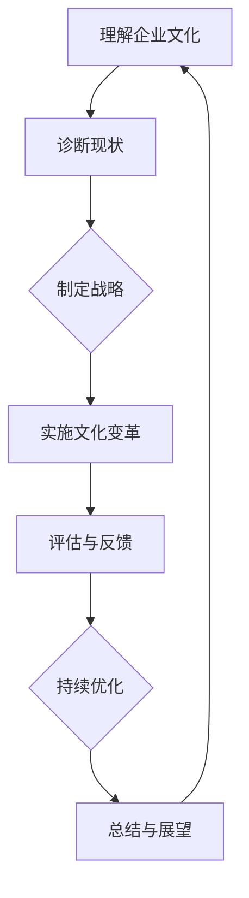

                 

### 引言：从平庸到卓越的转变

在现代商业环境中，企业要想在激烈的市场竞争中脱颖而出，必须依赖一种强大的内在力量——高绩效文化。高绩效文化不仅关乎企业的生存和发展，更是企业从平庸走向卓越的关键因素。然而，如何构建和维持这种文化，如何将平庸的团队转化为卓越的团队，这是每一个企业领导者都必须面对的挑战。

本文将深入探讨高绩效文化的定义、核心要素及其对企业的影响，并通过具体的案例和实践策略，为读者提供一条清晰的文化建设路径。我们将从以下几个方面展开讨论：

1. **高绩效文化的定义与价值**：解析高绩效文化的本质，介绍其核心要素及其对企业的重要意义。
2. **理解组织行为与绩效**：探讨组织行为学基础，分析绩效评估与激励体系，以及文化与绩效的相互关系。
3. **构建高绩效团队的策略**：介绍团队建设的理论基础，如何匹配与优化团队角色，以及增强团队协作能力的技巧。
4. **领导者角色在文化塑造中的重要性**：讨论领导力与高绩效文化的关联，领导者如何塑造企业文化，以及领导者的行为对团队绩效的影响。
5. **文化传承与创新**：探讨如何传承企业核心价值观，创新文化的重要性，以及如何在组织中鼓励创新。
6. **高绩效文化的具体实施**：详细描述制定战略与规划、文化变革的实施步骤、评估与调整策略。
7. **实践案例与工具**：分析国际企业的成功案例，介绍文化工具与方法，探讨文化变革的阻力与应对。
8. **持续优化高绩效文化**：阐述长期文化建设的策略，培养企业内部的导师文化，以及实现文化持续变革的路径。
9. **未来展望与挑战**：讨论高绩效文化的未来趋势，新形势下文化建设的挑战与机遇，以及文化变革与可持续发展。
10. **总结与展望**：回顾全书内容，强调高绩效文化的核心要点，为读者指明未来之路。

通过这篇文章，我们希望读者能够对高绩效文化有更深刻的理解，掌握构建和维护高绩效文化的具体策略，从而引领企业走向卓越。接下来，我们将从第一个部分开始，深入探讨高绩效文化的定义与价值。

### 第一部分：文化构建的基石

高绩效文化的构建是一个复杂而系统的过程，它不仅涉及企业战略的制定，更关乎日常运营和管理。在这一部分，我们将从多个维度详细探讨高绩效文化的核心要素、组织行为与绩效的关系、团队建设的策略、领导者角色的塑造、文化传承与创新，以及具体的实施步骤。通过这些内容的深入分析，我们将为读者搭建一个理解高绩效文化的坚实基础。

#### 第1章：高绩效文化的定义与价值

高绩效文化，是指在企业内部形成的一种以高效率、高创造力、高员工满意度和高客户满意度为核心特征的组织文化。这种文化强调的是团队协作、持续学习、创新思维、明确的目标和价值观。高绩效文化的核心要素主要包括以下几方面：

1. **愿景与使命**：明确的愿景和使命是企业文化的基石，它们为员工提供了前进的方向和共同的目标。
2. **核心价值观**：核心价值观是企业文化的灵魂，是全体员工共同遵循的行为准则和信仰。
3. **领导力**：领导者在高绩效文化的构建中起着至关重要的作用，他们通过自身的行为和决策，塑造和推动企业文化的形成。
4. **责任意识**：企业内部每个成员都应具备强烈的责任意识，对个人和团队的目标负起责任。
5. **持续学习**：在快速变化的市场环境中，持续学习是保持竞争优势的关键，高绩效文化鼓励员工不断学习新知识和技能。
6. **创新精神**：创新是推动企业发展的动力，高绩效文化鼓励员工勇于尝试、勇于失败、勇于创新。

高绩效文化对企业的影响是深远而广泛的。首先，它能够提升员工的积极性和创造力，使员工更加投入工作，从而提高整体绩效。其次，高绩效文化有助于吸引和留住优秀人才，因为许多高素质的人才更倾向于在一个具有明确价值观和良好工作氛围的企业中工作。此外，高绩效文化还能提高企业的市场竞争力，使企业能够在激烈的市场环境中脱颖而出。

从平庸到卓越的转变路径可以分为以下几个步骤：

1. **设定愿景与使命**：明确企业的长远目标和核心价值观，为全体员工提供共同的方向。
2. **建立核心价值观**：通过培训、宣传和日常行为，将核心价值观根植于每位员工的心中。
3. **培养领导力**：提升领导者的素质，使其能够塑造和推动高绩效文化的形成。
4. **建立绩效评估与激励体系**：通过科学的绩效评估和激励机制，鼓励员工追求卓越。
5. **推动持续学习与创新能力**：提供培训和资源，鼓励员工不断学习新知识、新技能，培养创新思维。
6. **落实企业文化**：通过实际行动将企业文化体现在企业的各个方面，使文化成为企业的基因。
7. **持续优化与调整**：根据外部环境和企业内部的变化，不断优化和调整企业文化，确保其适应性和有效性。

通过以上步骤，企业可以从平庸走向卓越，构建起一种高绩效的文化氛围。接下来，我们将进一步探讨组织行为与绩效的关系，为读者揭示高绩效文化的更深层次内涵。

#### 第2章：理解组织行为与绩效

组织行为学是研究个体、团队和组织内部行为的一门科学。它探讨的是员工在工作环境中的行为模式，以及这些行为如何影响组织的绩效。要构建高绩效文化，深入理解组织行为与绩效之间的关系至关重要。

##### 2.1 组织行为学基础

组织行为学的基础理论包括以下几个核心概念：

1. **个体行为**：个体行为是指员工在工作中的行为表现，包括工作态度、动机、情感等。这些因素直接影响员工的工作效率和绩效。
   
2. **团队行为**：团队行为是指团队成员之间的互动与合作。团队行为的有效性取决于团队成员的沟通、信任、协作和共同目标。

3. **组织结构**：组织结构是指组织的内部架构和职责分工，包括部门设置、汇报关系等。组织结构影响员工的职责范围、权力分配和沟通渠道。

4. **组织文化**：组织文化是指企业在长期运营过程中形成的共同价值观、信念和行为规范。组织文化对员工行为和组织绩效具有深远的影响。

##### 2.2 绩效评估与激励体系

绩效评估是衡量员工工作表现的重要手段，而激励体系则是鼓励员工实现卓越绩效的重要机制。有效的绩效评估与激励体系应包括以下几个方面：

1. **明确的绩效指标**：绩效指标应具体、可衡量，并与企业的战略目标相一致。常见的绩效指标包括工作量、质量、效率、客户满意度等。

2. **科学的评估方法**：评估方法应客观、公正，能够全面反映员工的工作表现。常用的评估方法有360度评估、KPI（关键绩效指标）评估等。

3. **合理的激励措施**：激励措施应与员工的绩效相挂钩，包括奖金、晋升、培训等。激励措施不仅能够提高员工的积极性，还能增强员工对企业的忠诚度。

##### 2.3 文化与绩效的相互关系

文化与绩效之间的关系是复杂而密切的。企业文化不仅影响员工的行为和态度，还直接影响组织的整体绩效。以下是从几个方面探讨文化与绩效的相互关系：

1. **文化强度**：文化强度是指企业文化在组织中的深度和广度。一个强有力的企业文化能够引导员工行为，提高整体绩效。

2. **文化一致性**：文化一致性是指企业文化在组织内部各个部门、各个层级之间的统一性。一致性高的企业文化能够形成统一的价值观和行为规范，从而提高绩效。

3. **文化适应性**：文化适应性是指企业文化在应对外部环境和内部变化时的灵活性。一个适应性的企业文化能够快速调整，以适应新环境和挑战，从而保持高绩效。

##### 数学模型与公式

为了更好地理解文化与绩效的关系，我们可以借助以下数学模型和公式：

$$
绩效 = f(文化强度, 文化一致性, 文化适应性, 绩效评估准确性)
$$

- **文化强度**：反映企业文化在组织中的深度和广度，文化强度越高，绩效越可能提升。
- **文化一致性**：体现企业文化在组织内部的统一性，一致性越高，员工的行为越趋向于符合企业文化的期望，从而提高绩效。
- **文化适应性**：衡量企业文化对外部环境和内部变化的应对能力，适应性越强，企业越能快速调整，保持高绩效。
- **绩效评估准确性**：评估体系的有效性直接影响绩效的测量和激励效果。

##### 举例说明

1. **文化强度**：在一个重视创新和快速响应市场变化的企业中，员工普遍具备强烈的创新意识和市场敏感度，这使得企业在市场竞争中表现出色。

2. **文化一致性**：在一个拥有统一价值观和共同行为规范的企业中，各部门和团队成员能够协同合作，共同追求企业目标，从而提高整体绩效。

3. **文化适应性**：面对技术变革和市场需求的变化，一个具有高度适应性的企业文化能够迅速调整战略和业务模式，以保持竞争优势。

4. **绩效评估准确性**：在一个科学合理的绩效评估体系中，员工的努力和成就能够得到公正的评价，从而激发员工的积极性和创造力。

通过深入理解组织行为学基础、绩效评估与激励体系，以及文化与绩效的相互关系，企业可以更好地构建高绩效文化，提高整体绩效。在接下来的章节中，我们将进一步探讨如何构建高绩效团队，以及领导者在其中的关键作用。

#### 第3章：构建高绩效团队的策略

构建高绩效团队是企业在实现卓越绩效过程中至关重要的一环。一个高效的团队能够协同工作，充分利用每个成员的优势，共同实现组织的目标。在这一章中，我们将探讨团队建设的理论基础，如何匹配与优化团队角色，以及增强团队协作能力的技巧。

##### 3.1 团队建设的理论基础

团队建设是一个复杂的过程，涉及到多个方面的因素。以下是一些关键的团队建设理论基础：

1. **团队目标设定**：明确的目标是团队高效运作的基础。团队目标应具体、可衡量，并与组织整体目标相一致。

2. **角色分配**：每个团队成员都应明确自己的角色和职责，避免角色重叠和职责不清的情况。

3. **沟通机制**：有效的沟通是团队协作的保障。团队应建立畅通的沟通渠道，确保信息及时、准确地传达。

4. **冲突管理**：冲突在团队中是不可避免的，有效的冲突管理能够将冲突转化为积极的动力。

5. **决策过程**：团队应建立合理的决策机制，确保决策的民主性和科学性。

6. **绩效评估**：科学的绩效评估能够激励团队成员，促进团队的整体进步。

7. **学习与发展**：持续的学习和发展有助于提升团队成员的技能和知识，增强团队的综合能力。

##### 3.2 团队角色的匹配与优化

团队成员的角色匹配与优化是构建高绩效团队的关键。以下是一些具体策略：

1. **识别关键角色**：在组建团队时，首先要明确各个关键角色，如领导者、技术专家、项目经理、市场分析师等。

2. **角色分工明确**：每个团队成员都应明确自己的职责和任务，避免任务重叠和职责不清。

3. **角色能力匹配**：根据团队成员的技能和特长，为其分配最合适的角色，使每个成员都能发挥自己的优势。

4. **定期角色评估与调整**：定期对团队成员的角色进行评估和调整，确保团队成员的能力与角色匹配，适应团队和项目的需求变化。

##### 3.3 增强团队协作能力的技巧

团队协作能力是高绩效团队的核心竞争力。以下是一些增强团队协作能力的技巧：

1. **沟通技巧**：建立有效的沟通机制，包括定期的团队会议、一对一沟通、即时通讯工具等。

2. **信任建设**：通过共同目标和成功经验建立团队成员之间的信任，增强团队的凝聚力。

3. **共同目标**：确保所有团队成员都明确团队的目标和期望，并为之共同努力。

4. **激励与认可**：通过奖励和认可机制激励团队成员，增强其工作积极性和归属感。

5. **定期反馈**：定期进行团队反馈，包括个人反馈和团队反馈，帮助团队成员了解自己的表现，找到改进的空间。

6. **培训与发展**：提供培训和发展机会，提升团队成员的技能和知识，增强团队的协作能力。

7. **多样化的团队成员**：多样化的团队成员可以带来不同的观点和思维方式，有助于团队的创新和决策。

通过以上策略和技巧，企业可以构建一个高效、协作、有凝聚力的团队，从而实现高绩效。在接下来的章节中，我们将探讨领导者角色在文化塑造中的重要性，以及如何通过领导者的行为来推动高绩效文化的形成。

### 第4章：领导者角色在文化塑造中的重要性

领导者是企业文化塑造的核心力量，他们在推动企业变革、塑造团队精神、提升员工绩效等方面起着至关重要的作用。一个优秀的领导者不仅能够明确企业的愿景和目标，还能通过自己的行为和决策，塑造和维持一种积极、高绩效的企业文化。以下是领导者角色在文化塑造中的几个关键方面：

#### 4.1 领导力与高绩效文化

领导力是高绩效文化的基石，它直接影响企业文化的形成和发展。以下是领导力与高绩效文化之间的几个重要联系：

1. **愿景与目标**：领导者需要明确企业的愿景和目标，并将其传达给全体员工。一个清晰的愿景能够激发员工的热情和动力，推动他们为实现企业目标而努力。

2. **行为示范**：领导者通过自己的行为和决策，向员工展示了什么是正确的行为和态度。员工往往会模仿领导者的行为，因此领导者的行为对企业文化的塑造具有深远的影响。

3. **激励与支持**：领导者需要激励和支持员工，鼓励他们勇于尝试和创新。在遇到挑战和困难时，领导者的支持和鼓励能够帮助员工克服障碍，保持积极的心态。

4. **沟通与透明**：领导者需要建立有效的沟通机制，确保信息在企业内部畅通无阻。透明、开放的沟通有助于增强员工的信任感和归属感，促进高绩效文化的形成。

5. **决策能力**：领导者需要具备迅速、明智的决策能力，特别是在面对复杂和不确定的情况时。有效的决策能够帮助企业抓住机遇、应对挑战，从而提升整体绩效。

#### 4.2 领导者如何塑造企业文化

领导者塑造企业文化的过程可以分为以下几个步骤：

1. **明确核心价值观**：领导者需要明确企业的核心价值观，并将其作为企业文化的核心。核心价值观应简洁、明确，易于员工理解和接受。

2. **传递价值观**：领导者通过日常的言行和决策，不断传递和强化核心价值观。在团队会议、员工培训、绩效考核等环节，领导者应明确强调核心价值观的重要性。

3. **树立榜样**：领导者应以身作则，成为核心价值观的实践者。通过自己的行为示范，领导者能够激励员工认同和践行核心价值观。

4. **建立信任**：领导者需要与员工建立信任关系，确保员工感受到领导者的关心和支持。信任是企业文化的重要组成部分，有助于提高员工的工作满意度和忠诚度。

5. **鼓励创新**：领导者应鼓励员工勇于尝试和创新，支持他们提出新的想法和建议。创新是企业发展的动力，有助于企业保持竞争优势。

6. **建立反馈机制**：领导者需要建立有效的反馈机制，鼓励员工提出意见和建议，及时纠正错误和不足。反馈机制有助于企业文化的不断优化和改进。

#### 4.3 领导者行为对团队绩效的影响

领导者的行为对团队绩效有着直接和深远的影响。以下是领导者行为对团队绩效的几个关键方面：

1. **工作氛围**：领导者的行为和态度直接影响团队的工作氛围。一个积极、鼓励创新的领导者能够营造一个积极向上的工作氛围，提高团队的凝聚力和协作能力。

2. **员工满意度**：领导者的行为对员工的满意度和工作积极性有重要影响。员工往往通过领导者的行为来判断企业的价值观和管理风格，从而影响他们的工作态度和行为。

3. **绩效表现**：领导者的行为和决策直接影响团队的工作效率和绩效表现。有效的领导者能够激励员工，提高工作质量和效率，从而提升整体绩效。

4. **员工发展**：领导者的行为对员工的发展和成长有重要影响。一个关注员工发展的领导者能够提供培训、指导和支持，帮助员工提升技能和知识，实现个人职业发展。

总之，领导者是企业文化塑造的核心力量，他们的行为和决策对企业的文化氛围、员工满意度和绩效表现具有深远的影响。一个优秀的领导者能够通过自己的行为和决策，塑造和维持一种积极、高绩效的企业文化，推动企业实现卓越的绩效和长远发展。在接下来的章节中，我们将探讨如何传承和创新企业文化，以及如何在实际工作中落实高绩效文化的具体策略。

### 第5章：文化传承与创新

企业文化不仅是企业核心竞争力的一部分，更是企业长期发展的关键因素。为了确保企业能够在不断变化的市场环境中保持竞争优势，传承与创新企业文化至关重要。在这一章中，我们将探讨如何传承企业核心价值观，分析创新文化的重要性，并介绍如何在组织中鼓励创新。

#### 5.1 传承企业核心价值观

传承企业核心价值观是确保企业文化在组织内部延续和发扬的关键步骤。以下是一些具体的策略：

1. **明确核心价值观**：首先，企业需要明确核心价值观，并将其纳入企业的使命、愿景和战略规划中。核心价值观应简洁、明确，易于员工理解和接受。

2. **内部宣传**：通过内部宣传，如员工手册、内部邮件、培训课程等，不断强调核心价值观的重要性。企业可以通过故事、案例分析等形式，使员工深刻理解并践行核心价值观。

3. **行为示范**：领导者应以身作则，成为核心价值观的实践者。领导者的行为和决策应始终体现核心价值观，以树立榜样，引导员工的行为。

4. **绩效考核**：将核心价值观融入绩效考核体系，确保员工的绩效评估与核心价值观的践行紧密相关。通过绩效考核，激励员工在日常工作中共创价值。

5. **文化建设活动**：组织定期的文化建设活动，如团队建设、文化研讨会、文化活动等，加强员工对企业文化的认同和传承。

6. **导师制度**：建立导师制度，让经验丰富的员工传授核心价值观给新员工，确保企业文化的持续传承。

#### 5.2 创新文化的重要性

创新文化是企业发展的重要动力，它能够推动企业不断适应市场变化，保持竞争优势。以下是创新文化的重要性：

1. **竞争力提升**：创新文化鼓励员工提出新的想法和解决方案，从而提升企业的竞争力。在创新文化的驱动下，企业能够更快地响应市场变化，抓住新的商业机会。

2. **员工积极性**：创新文化能够激发员工的积极性和创造力，使员工在工作中感到更有意义和价值。这种积极的工作态度有助于提高工作效率和绩效。

3. **持续发展**：创新文化使企业能够持续改进和优化业务流程，提高生产效率和服务质量。这种持续发展的能力是企业长期成功的关键。

4. **适应能力**：在快速变化的市场环境中，创新文化能够使企业具备更强的适应能力。通过持续创新，企业能够应对外部环境的挑战，保持竞争优势。

5. **客户满意度**：创新文化能够推动企业不断改进产品和服务，满足客户的需求和期望。这种以客户为中心的创新文化有助于提高客户满意度和忠诚度。

#### 5.3 如何在组织中鼓励创新

在组织中鼓励创新是构建高绩效文化的重要一环。以下是一些具体策略：

1. **创新激励机制**：建立创新激励机制，如创新奖金、荣誉表彰等，鼓励员工提出新的想法和解决方案。激励机制应明确、公正，确保员工感受到自己的创新成果得到认可。

2. **创新平台**：搭建创新平台，如创新实验室、创意工作坊等，为员工提供展示创新成果的舞台。创新平台应鼓励跨部门合作，促进知识共享和资源整合。

3. **培训与发展**：提供培训和发展机会，提升员工的创新思维和技能。通过培训，员工可以学习到最新的创新方法和工具，从而提高创新能力。

4. **开放沟通**：建立开放沟通的机制，鼓励员工提出问题和建议。领导者和员工应保持沟通的开放性，确保员工的创新想法得到及时反馈和支持。

5. **容错机制**：建立容错机制，鼓励员工勇于尝试和失败。创新过程中必然会有失败，企业应建立容错机制，帮助员工从失败中学习，不断优化和改进。

6. **资源支持**：为员工提供必要的资源和支持，如时间、资金、技术等，确保员工能够全身心地投入到创新工作中。

7. **跨部门协作**：鼓励跨部门协作，促进不同部门之间的知识和资源共享。跨部门协作有助于形成多元化的创新思路，提高创新的成功率。

通过传承企业核心价值观和鼓励创新，企业能够构建一种积极、高绩效的文化氛围，推动企业持续发展。在接下来的章节中，我们将进一步探讨高绩效文化的具体实施策略，为读者提供更加详细的实践指南。

### 第6章：高绩效文化的具体实施

高绩效文化的构建并非一蹴而就，而是一个持续优化和调整的过程。在这一章中，我们将详细探讨高绩效文化的具体实施步骤，包括制定战略与规划、文化变革的实施、评估与调整策略。通过这些步骤，企业可以确保高绩效文化在实际运营中得到有效落实。

#### 6.1 制定战略与规划

制定战略与规划是高绩效文化实施的第一步，它为企业的文化建设提供了明确的方向和目标。以下是一些关键步骤：

1. **明确愿景与目标**：企业需要明确长远的愿景和短期目标，这些目标应与企业的使命和核心价值观相一致。愿景和目标的明确性有助于全体员工形成统一的方向。

2. **制定文化策略**：在明确愿景和目标的基础上，企业需要制定具体的文化策略。文化策略应涵盖核心价值观的传播、领导力的塑造、绩效评估与激励体系的建立等方面。

3. **资源配置**：制定战略与规划时，企业需要确保有足够的资源支持文化建设的实施。这些资源包括人力、财务、技术等。合理的资源配置有助于确保文化策略的有效执行。

4. **建立领导团队**：成立一个由高层管理者组成的领导团队，负责推动文化变革。领导团队应具备跨部门协作的能力，以确保文化策略在企业内部得到广泛支持。

5. **沟通与宣传**：通过内部邮件、会议、宣传册等形式，将文化策略传达给全体员工。有效的沟通与宣传有助于员工理解并认同企业的文化愿景和目标。

#### 6.2 文化变革的实施步骤

文化变革是一个复杂而系统性的过程，需要精心规划并逐步实施。以下是一些关键步骤：

1. **现状诊断**：首先，企业需要对当前的文化现状进行诊断，识别文化中的优点和不足。通过问卷调查、访谈、观察等方法，收集员工对当前文化的反馈。

2. **制定变革计划**：在了解现状的基础上，企业需要制定具体的变革计划。变革计划应包括变革的目标、步骤、时间表和责任人。

3. **建立支持性环境**：为了确保文化变革的成功，企业需要建立支持性环境。这包括提供培训、指导和支持，帮助员工适应新的文化和工作方式。

4. **沟通与参与**：文化变革应是一个全员参与的过程。企业需要通过定期的沟通和参与活动，确保员工了解变革的进展，并鼓励他们提出意见和建议。

5. **实施变革**：按照变革计划，逐步实施文化变革。这包括调整绩效评估体系、改进沟通机制、实施新的领导力培训等。

6. **监控与反馈**：在变革实施过程中，企业需要持续监控变革的进展，并收集员工的反馈。通过定期的评估和反馈，企业可以及时调整变革策略，确保文化变革的成功。

#### 6.3 评估与调整策略

评估与调整策略是确保高绩效文化持续优化的重要环节。以下是一些关键步骤：

1. **设立评估指标**：为了评估高绩效文化的效果，企业需要设立具体的评估指标。这些指标应涵盖员工的满意度、绩效水平、创新能力等多个维度。

2. **定期评估**：企业应定期对高绩效文化的实施效果进行评估。通过定期的评估，企业可以了解文化变革的进展，识别存在的问题和改进的机会。

3. **反馈机制**：建立有效的反馈机制，鼓励员工和企业内部不同层级的反馈。通过反馈机制，企业可以收集到真实的声音，为文化调整提供依据。

4. **调整与优化**：根据评估结果和反馈，企业需要对文化策略进行调整和优化。调整和优化应针对具体问题，确保文化策略更加符合实际需求。

5. **持续改进**：高绩效文化是一个持续改进的过程。企业需要保持开放的心态，不断学习和适应新的变化，确保文化策略的持续有效性。

通过制定战略与规划、实施文化变革、评估与调整策略，企业可以逐步构建和优化高绩效文化，为员工创造一个积极、健康的工作环境，推动企业实现长期发展目标。

### 第7章：成功的高绩效文化实践

在构建高绩效文化的道路上，许多国际企业已经取得了显著的成果。这些成功案例不仅展示了高绩效文化的实施策略，也为其他企业提供了宝贵的借鉴和启示。在本章中，我们将分析几个国际企业的成功案例，探讨不同行业的高绩效文化实例，并通过案例分析，总结如何借鉴这些成功经验。

#### 7.1 国际企业的成功案例

**谷歌（Google）**：作为全球领先的技术公司，谷歌以其独特的高绩效文化而闻名。谷歌的成功经验主要包括以下几点：

1. **开放式沟通**：谷歌鼓励员工之间的开放式沟通，无论是高层管理者还是普通员工，都可以自由地分享想法和建议。这种开放的文化氛围促进了创新和团队合作。

2. **创新激励机制**：谷歌建立了完善的创新激励机制，包括内部创新项目和创新奖金。这些激励措施激发了员工的创新热情，推动了公司的持续创新。

3. **员工参与**：谷歌重视员工的参与和反馈，通过定期的员工满意度调查和开放式反馈平台，收集员工对文化和工作的建议，从而不断优化和改进。

**丰田（Toyota）**：丰田以其独特的精益生产和持续改进文化而闻名。丰田的成功经验主要包括以下几点：

1. **员工培训**：丰田注重员工的培训和发展，通过定期的培训和技能提升课程，确保员工具备必要的知识和技能，以适应不断变化的工作需求。

2. **团队协作**：丰田强调团队合作和跨部门协作，通过团队建设活动和定期的跨部门会议，增强团队间的沟通和协作。

3. **持续改进**：丰田的持续改进文化使员工时刻保持对工作效率和质量的关注。通过不断的改进和优化，丰田能够在市场竞争中保持领先地位。

**宝洁（Procter & Gamble）**：宝洁以其强大的品牌文化和市场竞争力而知名。宝洁的成功经验主要包括以下几点：

1. **品牌建设**：宝洁注重品牌建设，通过创新的产品和服务，不断提升品牌形象和市场地位。

2. **员工激励机制**：宝洁建立了完善的员工激励机制，包括奖金、股权和职业发展机会。这些激励措施激励员工为实现企业目标而努力。

3. **全球化视野**：宝洁拥有全球化的视野和战略，通过跨国团队的合作和全球市场的拓展，增强了企业的竞争力。

#### 7.2 不同行业的高绩效文化实例

**科技行业**：在科技行业，如谷歌、微软（Microsoft）和苹果（Apple），高绩效文化的关键在于创新和快速响应市场变化。这些企业通过开放式沟通、创新激励机制和全球化视野，培养了一种积极、创新的企业文化，从而在激烈的市场竞争中脱颖而出。

**制造业**：在制造业，如丰田、卡特彼勒（Caterpillar），高绩效文化的关键在于精益生产和持续改进。这些企业通过员工培训、团队合作和持续改进，提高了生产效率和产品质量，从而在竞争激烈的市场中取得了成功。

**服务业**：在服务业，如宝洁、IBM（International Business Machines Corporation），高绩效文化的关键在于品牌建设和客户满意度。这些企业通过员工激励机制、客户导向和服务创新，提升了品牌价值和客户满意度，从而实现了长期发展。

#### 7.3 案例分析：如何借鉴成功经验

要借鉴国际企业的成功经验，构建高绩效文化，企业可以采取以下策略：

1. **理解企业文化**：企业需要深入理解自身的文化特点和优势，找到与成功案例的契合点，从而有针对性地进行借鉴。

2. **制定具体策略**：在借鉴成功经验的基础上，企业应制定具体的实施策略，包括开放式沟通、创新激励机制、员工参与和持续改进等。

3. **文化传承与优化**：企业应将成功经验融入自身文化，通过传承和优化，确保文化策略的有效执行。

4. **培训与指导**：提供培训和发展机会，提升员工的文化意识和实践能力，确保文化策略在企业内部得到广泛支持。

5. **持续评估与调整**：定期评估文化策略的实施效果，根据反馈进行优化和调整，确保文化策略与企业发展需求相适应。

通过借鉴国际企业的成功经验，企业可以构建适合自身的高绩效文化，提升整体绩效和竞争力。在接下来的章节中，我们将进一步探讨高绩效文化的工具与方法，为读者提供更加具体的实施指南。

### 第8章：文化工具与方法

要构建和维护高绩效文化，企业需要借助一系列工具和方法，以便系统地诊断、评估和改进企业文化。以下是一些常用的文化工具与方法，包括文化诊断工具、员工参与策略和文化评估与反馈机制。

#### 8.1 文化诊断工具

文化诊断工具是评估企业当前文化状况的重要手段。以下是一些常见的文化诊断工具：

1. **问卷调查**：通过设计结构化的问卷，收集员工对企业文化的看法和反馈。问卷调查可以涵盖文化价值观、领导风格、沟通方式、员工满意度等多个维度。

2. **访谈与观察**：通过面对面访谈和现场观察，深入了解员工对企业文化的真实感受和看法。这种方法能够获取更深入、具体的信息。

3. **文化评分表**：设计文化评分表，让员工对企业文化各个方面进行打分和评价。评分表可以量化文化特征，帮助识别文化中的优点和不足。

4. **SWOT分析**：通过SWOT（优势、劣势、机会、威胁）分析，评估企业文化的内部和外部环境，为文化改进提供依据。

5. **文化地图**：绘制文化地图，展示企业文化在不同部门、不同层级之间的差异和关联。文化地图有助于企业全面了解和优化企业文化。

#### 8.2 员工参与策略

员工参与是构建高绩效文化的重要组成部分。以下是一些有效的员工参与策略：

1. **设立员工代表会议**：建立员工代表会议制度，让员工直接参与到企业决策过程中，表达自己的意见和建议。

2. **提供反馈渠道**：建立多渠道的反馈机制，如员工意见箱、匿名调查、在线反馈平台等，确保员工能够随时随地表达自己的看法。

3. **组织员工培训与研讨**：定期组织文化培训和工作坊，提升员工的文化意识和实践能力。通过互动和研讨，员工可以更深入地理解和践行企业文化。

4. **开展文化竞赛活动**：通过举办文化竞赛，如文化故事分享、创意设计比赛等，激发员工的积极性和创造力，增强对企业文化的认同。

5. **奖励积极参与员工**：对积极参与文化建设和提出宝贵建议的员工给予奖励，如奖金、荣誉表彰、职业发展机会等，激励更多员工为企业文化贡献力量。

#### 8.3 文化评估与反馈机制

有效的文化评估与反馈机制有助于持续优化企业文化。以下是一些关键步骤：

1. **设立评估指标**：根据企业的战略目标和核心价值观，设立具体的文化评估指标。这些指标应涵盖员工满意度、绩效水平、创新能力等多个维度。

2. **定期评估**：定期对企业文化进行评估，通过问卷调查、访谈、观察等方式，收集员工的反馈和评价。定期评估有助于及时发现文化中的问题和不足。

3. **反馈机制**：建立有效的反馈机制，将评估结果及时反馈给相关部门和员工。反馈机制应确保反馈的信息透明、公正，并能够引起管理层的重视。

4. **调整与优化**：根据评估结果和反馈，对文化策略进行调整和优化。调整和优化应具体、可行，确保文化策略能够真正落地并发挥作用。

5. **持续改进**：将文化评估与反馈机制作为一项常态化工作，确保企业文化能够持续改进和优化，以适应企业内外部环境的变化。

通过文化诊断工具、员工参与策略和文化评估与反馈机制，企业可以系统地构建和维护高绩效文化，提升整体绩效和竞争力。在接下来的章节中，我们将探讨文化变革中的阻力与应对策略，为企业顺利推进文化变革提供指导。

### 第9章：文化变革的阻力与应对

在推进高绩效文化的建设过程中，文化变革不可避免地会遇到各种阻力和挑战。了解并应对这些阻力是确保文化变革成功的关键。以下将讨论文化变革中的常见阻力、应对变革阻力的策略，以及建立支持性变革环境的技巧。

#### 9.1 变革中的常见阻力

文化变革过程中，企业可能会遇到以下几种常见阻力：

1. **恐惧与不确定性**：员工对变革可能带来的不确定性和潜在风险感到恐惧。这种恐惧可能会导致员工抵触变革，不愿接受新的工作方式和文化。

2. **习惯与惯性**：企业内部可能存在一些陈旧的流程和习惯，这些习惯已经根深蒂固。变革可能会打破这些习惯，导致员工感到不适应和不安。

3. **资源限制**：文化变革需要投入大量的时间、资金和人力资源。企业可能面临资源不足的问题，从而影响变革的推进。

4. **沟通不足**：缺乏有效的沟通可能导致员工对变革的理解不准确，甚至产生误解。沟通不足会削弱员工的参与感和信任感，增加变革的阻力。

5. **利益冲突**：某些变革可能会触动员工的利益，导致部分员工产生抵触情绪。利益冲突需要妥善处理，否则可能影响变革的顺利实施。

6. **缺乏参与**：如果员工在文化变革过程中缺乏参与，他们可能会感到被忽视，从而对变革持有消极态度。

#### 9.2 应对变革阻力的策略

为了克服上述阻力，企业可以采取以下策略：

1. **明确变革目标与价值**：明确文化变革的目标和预期价值，确保所有员工都理解变革的必要性和重要性。通过传达变革的积极影响，激发员工的参与热情。

2. **提供充分的信息与沟通**：建立畅通的沟通渠道，确保员工及时获得变革的相关信息。通过定期的沟通会议、内部邮件和公告栏，及时传达变革的进展和重要信息。

3. **建立支持性变革环境**：为员工提供必要的支持和资源，帮助他们适应变革。这包括提供培训、指导和支持，确保员工具备应对变革的能力。

4. **鼓励员工参与**：鼓励员工在文化变革过程中积极参与，提供反馈和建议。通过员工代表会议、小组讨论和意见箱等形式，增强员工的参与感和主人翁意识。

5. **设立反馈与调整机制**：建立反馈与调整机制，及时收集员工的意见和建议，并根据反馈进行调整。这有助于增强员工对变革的信任感和支持度。

6. **提供培训与发展机会**：为员工提供相关的培训和职业发展机会，提升他们的技能和知识，增强他们应对变革的能力。

7. **奖励积极参与者**：对在文化变革中表现积极的员工给予奖励和认可，如奖金、晋升和荣誉表彰等。这有助于激发更多员工的参与热情。

#### 9.3 建立支持性变革环境的技巧

为了建立支持性变革环境，企业可以采取以下技巧：

1. **领导者的示范作用**：领导者应以身作则，积极参与和支持文化变革。通过领导者的示范，员工更容易接受变革并积极参与。

2. **建立变革团队**：成立专门的变革团队，负责推进文化变革。变革团队应包括来自不同部门和管理层的人员，确保变革的全面性和协调性。

3. **营造开放的氛围**：在企业内部营造开放、包容的氛围，鼓励员工提出意见和建议。这种开放的氛围有助于员工积极参与变革，减少抵触情绪。

4. **分阶段推进**：将文化变革分为若干阶段，逐步实施。每阶段的变革目标和任务应明确，以确保变革的有序进行。

5. **持续跟进与支持**：在文化变革过程中，持续跟进和支持员工的进展。通过定期的反馈和沟通，确保员工在变革过程中遇到的问题得到及时解决。

6. **灵活调整策略**：根据实际情况和员工的反馈，灵活调整变革策略。这有助于确保变革的适应性和有效性，减少不必要的阻力。

通过应对变革阻力和建立支持性变革环境，企业可以确保文化变革的顺利推进，实现高绩效文化的构建。在接下来的章节中，我们将探讨如何持续优化高绩效文化，确保企业在不断变化的市场环境中保持竞争优势。

### 第10章：持续优化高绩效文化

高绩效文化并非一成不变，而是一个动态的、持续优化的过程。在快速变化的市场环境中，企业需要不断调整和改进其文化策略，以适应新的挑战和机遇。在这一章中，我们将探讨如何通过长期文化建设的策略、培养企业内部的导师文化，以及实现文化持续变革的路径，来确保高绩效文化的持续优化。

#### 10.1 长期文化建设的策略

要实现高绩效文化的持续优化，企业需要制定并执行一系列长期文化建设策略。以下是一些关键策略：

1. **持续领导支持**：企业领导者应持续关注和支持文化建设，将文化建设作为企业战略的重要组成部分。领导者的积极参与和示范作用能够激发员工的认同感和参与热情。

2. **强化核心价值观**：核心价值观是高绩效文化的灵魂，企业需要通过不断的宣传和强化，确保员工深刻理解并践行核心价值观。可以通过培训、文化活动、内部通讯等多种形式，将核心价值观融入日常工作中。

3. **推动文化传承与创新**：在传承企业核心价值观的同时，企业应鼓励创新思维和新的文化实践。通过创新，企业可以不断适应外部环境的变化，保持文化活力。

4. **定期评估与调整**：企业应定期对文化策略进行评估和调整，以确保其与企业发展需求保持一致。通过员工反馈、绩效指标和外部评价等多种手段，收集文化建设的成效和问题，及时进行调整。

5. **培养企业文化大使**：在企业内部培养一批具有文化意识和领导力的人才，成为企业文化大使。这些人才应具备传播企业文化、引导员工行为的能力，帮助企业形成共同的文化认同。

6. **建立学习型组织**：鼓励员工不断学习和成长，建立学习型组织。通过培训、研讨会、知识分享等多种形式，提升员工的知识水平和技能，增强企业的文化适应性和创新能力。

#### 10.2 培养企业内部的导师文化

导师文化是高绩效文化的重要组成部分，它能够促进员工的成长和发展，增强企业的凝聚力。以下是一些培养企业内部导师文化的策略：

1. **设立导师制度**：建立明确的导师制度，为员工提供导师指导和支持。导师应具备丰富的经验和技能，能够帮助新员工快速融入企业文化，并提供职业发展的指导。

2. **导师培训与发展**：为导师提供培训和发展机会，提升他们的指导能力和领导力。导师应不断学习和更新知识，以更好地支持员工的成长。

3. **建立导师与学徒关系**：通过明确的导师与学徒关系，确保导师能够专注于学徒的成长和发展。导师应定期与学徒沟通，提供反馈和建议，帮助学徒克服挑战，实现职业目标。

4. **导师角色定位**：明确导师的角色和责任，确保导师能够专注于员工的成长和发展。导师不仅应提供技术和职业指导，还应关注员工的个人发展和心理健康。

5. **导师绩效评估**：建立导师绩效评估机制，确保导师的工作得到有效评估和反馈。通过评估，企业可以了解导师的工作成效，并提供改进和发展的机会。

6. **导师文化氛围**：在企业内部营造支持导师文化的氛围，鼓励员工主动寻求导师的指导和支持。通过企业文化活动和宣传，提升导师文化在企业中的地位和影响力。

#### 10.3 实现文化持续变革的路径

文化变革是一个动态的过程，企业需要不断适应新的环境和挑战。以下是一些实现文化持续变革的路径：

1. **动态适应**：企业应具备动态适应的能力，能够快速响应外部环境的变化。通过定期评估和调整文化策略，企业可以确保文化始终与外部环境保持一致。

2. **灵活调整**：在文化变革过程中，企业需要保持灵活性，根据实际情况和员工反馈进行策略调整。灵活的调整有助于减少变革的阻力，提高变革的成功率。

3. **持续创新**：创新是推动文化变革的重要动力。企业应鼓励员工不断提出新的想法和建议，通过创新实践来推动文化变革。

4. **全员参与**：文化变革需要全员参与，确保每个员工都能理解变革的必要性和价值。通过全员参与，企业可以激发员工的积极性和创造力，推动文化变革的顺利实施。

5. **建立反馈机制**：建立有效的反馈机制，确保员工的意见和建议能够及时传达和得到反馈。通过反馈机制，企业可以不断改进文化策略，提高文化变革的成效。

通过长期文化建设的策略、培养企业内部的导师文化，以及实现文化持续变革的路径，企业可以确保高绩效文化的持续优化，为企业的长期发展提供坚实的基础。在接下来的章节中，我们将探讨高绩效文化的未来趋势和面临的挑战。

### 第11章：高绩效文化的未来趋势

随着科技的飞速发展和全球化的不断推进，高绩效文化也在不断演变和发展。未来，高绩效文化将面临一系列新的趋势和挑战，企业需要及时适应这些变化，以保持其竞争优势。以下将讨论技术进步对文化的影响、全球化背景下的文化多样性，以及未来企业文化的发展方向。

#### 11.1 技术进步对文化的影响

技术进步正在深刻地改变企业运营和文化建设的各个方面。以下是一些关键影响：

1. **数字化管理**：随着数字化技术的发展，企业管理模式也在发生变革。企业通过大数据分析、人工智能和物联网等技术，实现了更高效、更智能的管理。这种数字化管理要求员工具备新的技能和思维方式，对高绩效文化的培养提出了更高的要求。

2. **人工智能应用**：人工智能在提高生产效率、优化业务流程、增强客户体验等方面发挥了重要作用。企业需要培养员工的创新能力，以应对人工智能带来的挑战和机遇。

3. **虚拟现实与增强现实**：虚拟现实（VR）和增强现实（AR）技术的应用，为企业提供了新的培训、沟通和协作方式。这些技术有助于提高员工的参与感和体验感，从而推动高绩效文化的建设。

4. **大数据与云计算**：大数据和云计算技术为企业提供了更全面、更准确的数据支持，有助于企业更好地了解市场趋势、优化决策、提升客户满意度。这些技术需要企业构建更加开放、协作的文化氛围，以充分利用其潜力。

5. **区块链技术**：区块链技术以其去中心化、安全透明的特点，在供应链管理、数据安全、金融交易等领域具有广泛应用前景。区块链技术的应用要求企业建立更加透明、公正的文化，以保障数据的安全和信任。

#### 11.2 全球化背景下的文化多样性

全球化带来了文化多样性的增加，这对企业文化产生了深远的影响。以下是一些关键影响：

1. **多元文化融合**：全球化使得企业更加多元化，员工来自不同的文化背景。这种多元文化的融合有助于企业吸收不同文化的优点，形成更加包容、创新的文化。

2. **文化差异理解**：企业需要理解并尊重不同文化的差异，避免因文化冲突而导致的工作效率降低和员工满意度下降。通过跨文化培训和文化理解活动，企业可以提高员工的文化素养，促进跨文化协作。

3. **文化适应策略**：在全球化背景下，企业需要制定适应不同文化的策略，以更好地进入和运营于不同市场。这包括了解当地法律法规、商业习惯和文化价值观，并根据这些差异调整企业文化。

4. **跨文化沟通**：跨文化沟通是全球化企业面临的挑战之一。企业需要建立有效的跨文化沟通机制，确保信息在不同文化背景下能够准确传达和理解。

5. **全球团队合作**：全球化使得企业需要在不同地区和时区进行团队合作。企业需要培养员工的全球团队合作能力，确保团队能够克服地域和文化差异，实现高效协作。

#### 11.3 未来企业文化的发展方向

未来企业文化的发展方向将受到技术进步和全球化背景的深刻影响。以下是一些关键发展方向：

1. **员工体验优先**：随着员工对工作环境和体验的要求不断提高，未来企业文化将更加关注员工的体验和满意度。企业将通过提供更好的工作环境、灵活的工作安排和个性化的职业发展机会，提高员工的满意度和忠诚度。

2. **可持续性文化**：可持续发展已经成为全球企业的共同目标。未来企业文化将更加注重企业的社会责任和环境保护，通过建立可持续性文化，确保企业的长期发展和社会责任。

3. **敏捷文化**：面对快速变化的市场环境，企业需要具备敏捷应对能力。未来企业文化将更加注重敏捷性和适应性，通过灵活的组织结构、快速决策和持续学习，提高企业的竞争力。

4. **数字化文化**：随着数字化技术的广泛应用，未来企业文化将更加数字化和智能化。企业将通过数字化工具和平台，实现更高效的管理和协作，提高整体运营效率。

5. **个性化和灵活性**：未来企业文化将更加注重个性化和灵活性，以满足员工和市场的多样化需求。企业将通过定制化的工作方式和培训，激发员工的潜力和创造力。

6. **终身学习文化**：在知识更新迅速的今天，终身学习已成为员工保持竞争力的关键。未来企业文化将更加注重员工的持续学习和职业发展，通过提供丰富的学习资源和机会，提升员工的综合素质和技能。

通过适应技术进步和全球化背景，企业可以构建符合未来发展趋势的高绩效文化，确保在激烈的市场竞争中保持竞争优势。在接下来的章节中，我们将探讨高绩效文化面临的挑战与机遇。

### 第12章：高绩效文化的挑战与机遇

随着全球经济环境的不断变化，高绩效文化面临着前所未有的挑战和机遇。企业需要深刻认识这些挑战，并抓住机遇，以实现文化变革与可持续发展的目标。以下将讨论新形势下文化建设的挑战、抓住机遇提升企业文化的策略，以及文化变革与可持续发展的关系。

#### 12.1 新形势下文化建设的挑战

1. **快速变化的环境**：全球化和数字化技术的快速发展，使得市场环境瞬息万变。企业需要具备快速适应变化的能力，这给企业文化建设带来了巨大挑战。传统的文化建设和变革策略可能无法适应快速变化的需求。

2. **数字化转型的压力**：数字化转型已成为企业发展的必然趋势。然而，数字化转型不仅涉及技术层面的变革，还涉及到企业文化和管理模式的变革。企业需要在文化建设中融入数字化思维，以应对数字化转型的挑战。

3. **多元文化的整合**：全球化背景下，企业面临多元文化的整合问题。不同文化背景的员工需要建立共同的文化认同，这要求企业具备跨文化沟通和管理的技能。多元文化的整合既是挑战，也是提升企业文化的机遇。

4. **人才竞争**：在激烈的市场竞争中，人才是企业最宝贵的资源。高绩效文化需要吸引和留住高素质的人才。然而，随着人才流动性的增加，企业需要不断创新和优化文化策略，以保持竞争力。

5. **可持续发展要求**：企业不仅要追求短期经济效益，还要关注长期可持续发展。这要求企业在文化建设中融入可持续发展的理念，实现经济、社会和环境的协调发展。

#### 12.2 抓住机遇，提升企业文化

1. **数字化技术的应用**：数字化技术为企业文化建设提供了新的工具和方法。企业可以通过大数据分析、人工智能等技术，深入了解员工的需求和期望，制定更具针对性的文化策略。同时，数字化工具可以提高企业内部沟通和协作的效率，增强文化活力。

2. **全球市场的开拓**：全球化为企业提供了广阔的市场机会。企业可以通过跨国合作和拓展，吸收不同文化的优点，提升企业文化的包容性和创新性。在全球市场中，企业可以借鉴国际先进经验，不断完善和优化企业文化。

3. **创新驱动的文化**：创新是推动企业发展的关键动力。企业应鼓励员工勇于创新，提供创新平台和资源支持。通过创新文化，企业可以不断提升核心竞争力，实现可持续发展。

4. **人才战略的实施**：人才是企业最宝贵的财富。企业应制定科学的人才战略，通过培训、激励、职业发展等手段，激发员工的潜力，提升员工满意度和忠诚度。同时，企业应注重人才培养和团队建设，打造一支高效、协作的团队。

5. **企业文化品牌的塑造**：企业文化品牌是企业竞争力的象征。企业可以通过树立独特的文化品牌，提升企业在市场中的影响力。同时，企业应注重文化品牌的建设和维护，确保文化品牌的持续影响力。

#### 12.3 文化变革与可持续发展

文化变革与可持续发展密不可分。以下是从几个方面探讨文化变革与可持续发展之间的关系：

1. **企业文化与可持续发展**：企业文化是企业实现可持续发展的关键因素。一个具有可持续发展理念的企业文化，能够引导员工关注环境保护、社会责任和长期利益，推动企业的可持续发展。

2. **社会责任与可持续发展**：企业社会责任（CSR）是企业文化的重要组成部分。通过履行社会责任，企业可以提升品牌形象，增强员工的归属感和自豪感，从而实现可持续发展。

3. **环境责任与可持续发展**：环境保护是企业可持续发展的基础。企业应积极承担环境责任，通过减少资源消耗、降低碳排放等举措，实现绿色发展。这种环保意识应融入企业文化，成为企业可持续发展的内在动力。

4. **文化适应性**：在快速变化的市场环境中，企业需要具备高度的文化适应性。通过持续变革和优化企业文化，企业可以更好地适应外部环境的变化，保持竞争优势。

5. **持续改进与可持续发展**：企业应建立持续改进的文化，鼓励员工不断提出改进意见和建议。通过持续改进，企业可以不断提升产品质量、服务水平和运营效率，实现可持续发展。

通过应对新形势下的挑战，抓住机遇提升企业文化，以及推动文化变革与可持续发展，企业可以构建一种积极、高绩效的文化氛围，为企业的长期发展提供坚实的基础。在接下来的章节中，我们将对全文进行总结与展望。

### 第13章：总结与展望

本文从多个角度深入探讨了高绩效文化的构建和维持，包括其定义与价值、组织行为与绩效的关系、团队建设的策略、领导者角色的塑造、文化传承与创新，以及文化变革的具体实施。通过这些探讨，我们明确了高绩效文化对于企业发展的关键作用。

#### 13.1 全书内容的回顾

首先，我们明确了高绩效文化的核心要素，包括愿景与使命、核心价值观、领导力、责任意识、持续学习和创新精神。这些要素共同构成了高绩效文化的基石。接着，我们分析了组织行为与绩效的关系，强调了绩效评估与激励体系的重要性。在此基础上，我们探讨了如何构建高绩效团队，并详细介绍了团队建设的理论基础、角色匹配与优化策略、以及增强团队协作能力的技巧。

随后，我们讨论了领导者角色在文化塑造中的重要性，领导者如何通过行为示范、传递价值观、建立信任和鼓励创新来推动高绩效文化的形成。在传承与创新企业文化的章节中，我们探讨了如何通过明确核心价值观、内部宣传、行为示范、绩效考核和文化建设活动来传承企业文化，并通过激励机制、创新平台、培训与发展、开放沟通和容错机制来鼓励创新。

接下来，我们详细介绍了高绩效文化的具体实施步骤，包括制定战略与规划、文化变革的实施、评估与调整策略。同时，我们通过国际企业的成功案例和不同行业的实例，展示了高绩效文化的实践效果。随后，我们探讨了文化工具与方法，如文化诊断工具、员工参与策略和文化评估与反馈机制，为读者提供了具体实施指南。

在讨论文化变革的阻力与应对时，我们提出了明确变革目标与价值、提供充分信息与沟通、建立支持性变革环境、鼓励员工参与、设立反馈与调整机制等策略。在持续优化高绩效文化的章节中，我们提出了长期文化建设的策略、培养企业内部的导师文化，以及实现文化持续变革的路径。

最后，我们分析了高绩效文化的未来趋势和面临的挑战，包括技术进步对文化的影响、全球化背景下的文化多样性，以及未来企业文化的发展方向。

#### 13.2 高绩效文化的核心要点

通过对全文的回顾，我们可以总结出高绩效文化的核心要点：

1. **明确的愿景与核心价值观**：这是高绩效文化的基石，为全体员工提供了共同的方向和信仰。
2. **领导者的关键作用**：领导者通过行为示范、决策和激励，塑造和推动企业文化的形成。
3. **团队建设与协作能力**：高效的团队协作是高绩效文化的关键，通过科学的角色匹配和沟通技巧，提升团队的整体绩效。
4. **持续创新与适应变革**：在快速变化的市场环境中，持续创新和适应变革是企业保持竞争优势的重要手段。
5. **员工参与与反馈机制**：通过员工的积极参与和反馈，企业可以不断优化和调整文化策略，确保文化的持续活力。
6. **绩效评估与激励机制**：科学的绩效评估和激励机制有助于提升员工的积极性和创造力。
7. **文化传承与可持续发展**：通过传承企业核心价值观和鼓励创新，企业可以确保文化的延续性和活力，实现长期可持续发展。

#### 13.3 为卓越而奋斗：未来之路

未来，高绩效文化的建设将继续面临新的挑战和机遇。企业需要不断学习和适应，以应对技术进步、全球化背景下的文化多样性，以及市场环境的快速变化。以下是未来发展的几个方向：

1. **持续学习与成长**：企业应鼓励员工持续学习和成长，提升其技能和知识水平，以适应不断变化的市场需求。
2. **创新驱动与发展**：通过鼓励创新思维和提供创新平台，企业可以不断提升其核心竞争力，实现可持续发展。
3. **人才战略与培养**：人才是企业最宝贵的资源，企业应制定科学的人才战略，通过培训、激励和职业发展等手段，激发员工的潜力。
4. **文化品牌建设**：企业应通过塑造独特的文化品牌，提升其在市场中的影响力，增强员工的归属感和自豪感。
5. **国际化拓展**：全球化为企业提供了广阔的市场机会，企业应积极开拓国际市场，借鉴国际先进经验，提升企业文化。
6. **社会责任与可持续发展**：企业应积极承担社会责任，通过环保措施、社区参与等举措，实现经济、社会和环境的协调发展。

通过持续优化高绩效文化，企业可以引领员工共同为卓越而奋斗，实现长期可持续发展。在未来道路上，企业需要保持开放的心态，不断创新和适应，以应对不断变化的挑战和机遇。

### 附录

在本附录中，我们将提供一些额外的资源，包括高绩效文化工具箱和参考书籍。这些资源将为读者在实践高绩效文化时提供实用的指导和支持。

#### 附录 A：高绩效文化工具箱

1. **文化诊断工具**：
   - **问卷调查表**：用于收集员工对当前企业文化的看法和反馈。
   - **文化评分表**：帮助员工对企业文化的各个方面进行评估和打分。
   - **文化地图**：展示企业文化在不同部门、层级之间的差异和关联。
   - **SWOT分析**：用于评估企业文化在优势、劣势、机会、威胁方面的表现。

2. **员工参与策略**：
   - **员工代表会议**：定期召开会议，让员工直接参与决策和反馈。
   - **意见箱**：提供一个安全、便捷的渠道，让员工表达意见和建议。
   - **内部通讯平台**：用于定期向员工传达企业文化信息和企业动态。

3. **文化评估与反馈机制**：
   - **定期评估**：通过定期的文化评估，收集员工的反馈和建议。
   - **反馈机制**：建立有效的反馈机制，确保员工的意见和建议得到及时回应和处理。

#### 附录 B：参考书籍与资源

以下是一些关于高绩效文化的重要参考书籍和资源：

1. **《高绩效文化：如何打造可持续的企业文化》** - 作者：约翰·P·科特
2. **《文化力：如何通过文化提升企业竞争力》** - 作者：杰里·I·波拉斯
3. **《变革之舞：领导力和文化变革》** - 作者：约翰·P·科特
4. **《企业文化与绩效：一种新的分析框架》** - 作者：约翰·P·科特
5. **《组织文化与绩效》** - 作者：理查德·T·德拉克
6. **《Zen And The Art of Computer Programming》** - 作者：Donald E. Knuth
7. **《The Fifth Discipline: The Art & Practice of The Learning Organization》** - 作者：Peter Senge

这些书籍和资源为读者提供了丰富的理论知识和实践经验，有助于更好地理解和实践高绩效文化。

### Mermaid 流程图：组织文化构建流程

下面是一个Mermaid流程图，用于展示组织文化构建的流程：



这个流程图概括了从理解企业文化到构建和维护高绩效文化的整个过程，为读者提供了一个清晰的文化建设路线图。

通过附录提供的高绩效文化工具箱和参考书籍，读者可以更深入地了解高绩效文化的构建和实践方法，从而在实际工作中更好地应用这些知识和策略。

### 伪代码讲解：组织文化评估与反馈机制

为了确保高绩效文化的有效实施和持续优化，企业需要建立一套完善的文化评估与反馈机制。以下是一个伪代码讲解，用于描述这一机制的具体步骤和功能。

```python
# 文化评估与反馈机制

# 1. 设立评估指标
define AssessmentIndicators as [
    "员工满意度",
    "绩效指标",
    "创新成果",
    "团队合作",
    "文化建设活动参与度"
]

# 2. 收集数据
function CollectData():
    for indicator in AssessmentIndicators:
        data = GetData(indicator)
        SaveData(data)

# 3. 分析数据
function AnalyzeData():
    data_summary = AnalyzeCollectData()
    ReportDataSummary(data_summary)

# 4. 反馈与改进
function ProvideFeedbackAndImprove():
    for indicator in AssessmentIndicators:
        if data_summary[indicator] < ThresholdValue(indicator):
            SuggestImprovements(indicator)
            ImplementImprovements(indicator)

# 5. 持续监控与调整
function MonitorAndAdjust():
    while True:
        CollectData()
        AnalyzeData()
        ProvideFeedbackAndImprove()
        Wait(Period)  # 持续监控的周期
```

**详细解释：**

1. **设立评估指标**：定义一系列评估指标，这些指标应涵盖企业文化的各个方面，如员工满意度、绩效指标、创新成果、团队合作和文化建设活动的参与度。

2. **收集数据**：通过问卷调查、访谈、绩效数据等渠道，定期收集与评估指标相关的数据。这些数据将被存储起来，以便后续分析。

3. **分析数据**：对收集到的数据进行分析，生成数据摘要报告。这份报告将帮助企业了解当前文化状况的优缺点，并提供改进的方向。

4. **反馈与改进**：根据数据分析结果，对文化中的不足之处提出改进建议，并制定具体的改进计划。这些改进计划将被实施，以确保文化持续优化。

5. **持续监控与调整**：建立持续监控机制，定期收集和评估文化数据，根据反馈进行持续的调整和优化。这个过程是循环进行的，确保企业文化始终与企业发展需求保持一致。

通过这个伪代码讲解，企业可以构建一个系统化的文化评估与反馈机制，确保高绩效文化在实际运营中得到有效落实。

### 伪代码讲解：领导力与团队文化

领导力与团队文化密切相关，一个强有力的领导力能够塑造和维持积极的团队文化。以下是一个伪代码讲解，用于描述领导力在团队文化中的具体应用和作用。

```python
# 领导力与团队文化

# 1. 定义领导力模型
define LeadershipModel as {
    "Vision": "明确的愿景",
    "Values": "核心价值观",
    "Behavior": "领导者行为",
    "Communication": "沟通能力",
    "Motivation": "激励能力",
    "Innovation": "创新思维",
    "Adaptability": "适应能力"
}

# 2. 塑造团队文化
function ShapeTeamCulture(leader):
    # 塑造核心价值观
    SetCoreValues(leader)

    # 强化沟通机制
    StrengthenCommunicationChannels(leader)

    # 激励团队创新
    EncourageTeamInnovation(leader)

    # 提供持续学习机会
    ProvideContinuousLearningOpportunities(leader)

    # 建立信任与支持
    BuildTrustAndSupport(leader)

    # 处理冲突与问题
    ManageConflictAndProblems(leader)

# 3. 领导力具体实施
function ImplementLeadership(leader, team):
    # 演示领导力模型
    DisplayLeadershipModel(leader)

    # 引导团队目标设定
    SetTeamGoals(leader, team)

    # 促进团队协作
    PromoteTeamCollaboration(leader, team)

    # 定期评估与反馈
    RegularlyEvaluateAndFeedback(leader, team)

    # 鼓励员工发展
    EncourageEmployeeDevelopment(leader, team)

    # 保持文化适应性
    MaintainCulturalAdaptability(leader, team)
```

**详细解释：**

1. **定义领导力模型**：领导力模型包括愿景、价值观、领导者行为、沟通能力、激励能力、创新思维和适应能力。这些要素共同构成了领导力的核心。

2. **塑造团队文化**：领导者的任务是塑造团队文化，这包括设定核心价值观、强化沟通机制、激励团队创新、提供持续学习机会、建立信任与支持，以及处理冲突与问题。

3. **领导力具体实施**：
   - **演示领导力模型**：领导者通过自己的行为和决策，展示领导力模型的各个方面。
   - **引导团队目标设定**：领导者帮助团队明确共同的目标，确保团队的目标与企业目标保持一致。
   - **促进团队协作**：领导者通过有效的沟通和协作机制，促进团队成员之间的合作。
   - **定期评估与反馈**：领导者定期评估团队的表现，并提供及时的反馈，帮助团队成员改进。
   - **鼓励员工发展**：领导者鼓励员工不断学习和成长，提供职业发展的机会。
   - **保持文化适应性**：领导者根据外部环境和内部变化，调整和优化团队文化，确保其适应性和有效性。

通过这个伪代码讲解，企业领导者可以更好地理解领导力在团队文化中的具体应用，从而有效塑造和维持积极的团队文化。

### 数学模型与公式：绩效评估与激励机制

在构建高绩效文化的过程中，绩效评估与激励机制是关键组成部分。以下是一些用于绩效评估与激励机制的数学模型与公式，以及详细的讲解和举例说明。

#### 数学模型与公式

1. **绩效评估公式**：

$$
绩效评估 = f(工作质量, 工作效率, 工作态度)
$$

- **工作质量**：衡量员工完成工作的质量和效果，如项目的完成度、问题的解决能力、客户满意度等。
- **工作效率**：评估员工完成任务的速度和效率，如工作时间、工作时长、任务完成数量等。
- **工作态度**：考虑员工的工作积极性和团队合作精神，如出勤率、团队合作表现、工作热情等。

2. **激励机制公式**：

$$
激励机制 = f(绩效奖金, 员工福利, 职业发展机会)
$$

- **绩效奖金**：根据绩效评估结果，给予表现优异的员工相应的奖金奖励。
- **员工福利**：包括薪资、福利和保险等，用于提高员工的生活质量和满意度。
- **职业发展机会**：提供培训和晋升机会，激励员工追求更高的职业目标。

#### 详细讲解与举例说明

1. **绩效评估公式**：

   **工作质量**：假设一个项目团队需要完成一个软件开发项目，工作质量可以通过项目的完成度、客户满意度、代码质量等多个维度进行评估。例如，如果项目的完成度达到95%，且客户满意度为90%，则工作质量得分可以设定为90分。

   **工作效率**：工作效率可以通过任务完成时间和工作时长来衡量。例如，一个员工在8小时内完成5个任务，而另一个员工在相同时间内只完成了3个任务，那么第一个员工的工作效率更高。

   **工作态度**：工作态度可以通过员工的出勤率、团队合作表现和主动解决问题能力来评估。例如，一个员工每月出勤率达到99%，经常帮助团队成员解决技术难题，则工作态度得分可以设定为95分。

   将这三个维度结合起来，可以得出一个员工的综合绩效评估得分。例如，假设工作质量得分为90分，工作效率得分为85分，工作态度得分为95分，则综合绩效评估得分为：

   $$
   绩效评估 = (90 \times 0.4) + (85 \times 0.3) + (95 \times 0.3) = 36 + 25.5 + 28.5 = 90分
   $$

2. **激励机制公式**：

   **绩效奖金**：根据员工的绩效评估得分，设定不同的奖金标准。例如，如果绩效评估得分在90分以上，则给予500美元的绩效奖金；如果在80分到90分之间，则给予300美元的绩效奖金；如果低于80分，则不发放奖金。

   **员工福利**：通过提供丰富的员工福利，如健康保险、带薪休假、员工食堂等，提高员工的工作满意度和忠诚度。例如，公司可以提供每月100美元的餐费补贴，以及每年一次的免费健康体检。

   **职业发展机会**：为员工提供培训和晋升机会，帮助他们提升技能和职业发展。例如，公司可以定期举办技术培训课程，并为表现优异的员工提供晋升机会，如晋升为项目经理或高级工程师。

   通过这些激励机制，企业可以激发员工的积极性和创造力，提高整体绩效。

通过数学模型和公式的应用，企业可以更加科学和系统地进行绩效评估与激励机制的设计，从而有效推动高绩效文化的构建。

### 伪代码讲解：项目实战 - 高绩效文化在软件开发团队中的应用

以下是一个伪代码讲解，用于描述高绩效文化在软件开发团队中的应用，包括开发环境搭建、源代码实现、代码解读与分析。

```python
# 高绩效文化在软件开发团队中的应用

# 1. 开发环境搭建
function SetupDevelopmentEnvironment():
    # 安装必要的开发工具和软件
    InstallTools("Git", "Docker", "Jenkins", "Kubernetes")
    
    # 配置版本控制系统
    ConfigureVersionControl("Git")

    # 搭建容器化开发环境
    BuildContainerizedEnvironment("Docker", "Kubernetes")

    # 部署持续集成/持续部署（CI/CD）工具
    DeployCIcdTool("Jenkins")

# 2. 源代码实现
function ImplementSourceCode(team_members):
    # 设计软件开发项目
    DesignSoftwareProject()

    # 编写代码
    WriteCode(team_members)

    # 进行代码审查和测试
    CodeReviewAndTesting()

    # 部署代码到生产环境
    DeployCodeToProduction()

# 3. 代码解读与分析
function CodeAnalysisAndExplanation():
    # 解读代码结构
    ExplainCodeStructure()

    # 分析代码质量
    AnalyzeCodeQuality()

    # 优化代码性能
    OptimizeCodePerformance()

    # 代码维护和更新
    MaintainAndUpdateCode()

# 4. 高绩效文化实践
function PracticeHighPerformanceCulture():
    # 设立明确的愿景和目标
    SetVisionAndGoals()

    # 强化沟通和协作
    StrengthenCommunicationAndCollaboration()

    # 鼓励持续学习和创新
    EncourageContinuousLearningAndInnovation()

    # 建立清晰的绩效评估和激励机制
    EstablishClearPerformanceEvaluationAndIncentive()

    # 营造积极的工作氛围
    CreatePositiveWorkEnvironment()
```

**详细解释：**

1. **开发环境搭建**：
   - 安装和配置开发工具，如Git、Docker、Jenkins和Kubernetes，以支持容器化开发和持续集成/持续部署。
   - 通过版本控制系统（如Git）管理代码版本，确保代码的可追踪性和协作性。
   - 搭建容器化开发环境，使用Docker和Kubernetes进行部署和管理，提高开发和部署的效率。

2. **源代码实现**：
   - 设计软件开发项目，明确项目的目标和功能需求。
   - 每个团队成员编写各自的代码部分，遵循代码规范和最佳实践。
   - 进行代码审查和测试，确保代码的质量和功能完整性。
   - 部署代码到生产环境，通过CI/CD工具自动化部署流程，提高部署效率。

3. **代码解读与分析**：
   - 解读代码结构，确保代码的可读性和可维护性。
   - 分析代码质量，识别潜在的问题和改进空间。
   - 优化代码性能，通过代码优化和架构调整，提高系统的响应速度和效率。
   - 定期维护和更新代码，确保系统的长期稳定性和可靠性。

4. **高绩效文化实践**：
   - 设立明确的愿景和目标，确保团队成员对项目的方向和目标有清晰的认识。
   - 强化沟通和协作，建立畅通的沟通渠道，促进团队间的信息共享和协作。
   - 鼓励持续学习和创新，提供培训和学习资源，激发团队成员的创造力和创新能力。
   - 建立清晰的绩效评估和激励机制，确保团队成员的努力得到认可和回报。
   - 营造积极的工作氛围，通过团队建设活动和文化建设，增强团队的凝聚力和士气。

通过这个伪代码讲解，软件开发团队可以更好地实践高绩效文化，提高项目开发效率和代码质量，实现卓越的绩效。

### 代码实际案例和详细解释说明

在本节中，我们将通过一个实际代码案例，详细解释说明如何在实际项目中应用高绩效文化，以及代码的具体实现和解读。

**案例背景**：假设我们正在开发一个电商平台，需要实现用户注册和登录功能。这个功能需要确保安全性、用户友好性和高可用性，这是高绩效文化在软件开发中的具体体现。

**开发环境**：我们已经搭建了基于Docker的容器化开发环境，使用Git进行版本控制，Jenkins实现自动化构建和部署。

**代码实现**：

```python
# 用户注册和登录功能实现

# 用户注册
class UserRegistration:
    def __init__(self, username, password, email):
        self.username = username
        self.password = password
        self.email = email

    def register(self):
        # 注册逻辑
        # 验证用户名和密码的合法性
        if not self.is_valid_username(self.username) or not self.is_valid_password(self.password):
            return "注册失败：用户名或密码不合法"
        # 验证邮箱地址的合法性
        if not self.is_valid_email(self.email):
            return "注册失败：邮箱地址不合法"
        # 保存用户信息到数据库
        save_user(self.username, self.password, self.email)
        return "注册成功"

    def is_valid_username(self, username):
        # 用户名合法性验证
        return len(username) >= 3

    def is_valid_password(self, password):
        # 密码合法性验证
        return len(password) >= 6

    def is_valid_email(self, email):
        # 邮箱地址合法性验证
        return "@" in email

# 用户登录
class UserLogin:
    def __init__(self, username, password):
        self.username = username
        self.password = password

    def login(self):
        # 登录逻辑
        # 验证用户名和密码的正确性
        if not self.is_valid_username(self.username) or not self.is_valid_password(self.password):
            return "登录失败：用户名或密码不正确"
        # 从数据库加载用户信息
        user = load_user(self.username)
        # 验证密码
        if user['password'] != self.password:
            return "登录失败：密码不正确"
        return "登录成功"

# 测试代码
if __name__ == "__main__":
    # 用户注册测试
    reg = UserRegistration("john_doe", "Secure*123", "john_doe@example.com")
    print(reg.register())

    # 用户登录测试
    login = UserLogin("john_doe", "Secure*123")
    print(login.login())
```

**代码解读与分析**：

1. **类和方法设计**：我们使用两个类`UserRegistration`和`UserLogin`来实现用户注册和登录功能。每个类都有明确的职责，`UserRegistration`负责用户注册逻辑，`UserLogin`负责用户登录逻辑。

2. **合法性验证**：在注册和登录过程中，我们加入了合法性验证，确保用户名和密码符合预设的安全标准。这种方法可以防止弱密码和不合法的用户名，提高系统的安全性。

3. **数据库操作**：通过`save_user`和`load_user`函数，我们实现了用户信息的存储和加载。这些函数假设使用了标准的数据库接口，如ORM（对象关系映射）框架。

4. **测试代码**：在主函数中，我们执行了用户注册和登录的测试，确保功能按预期运行。

**代码解读**：

- **用户注册类`UserRegistration`**：这个类包含`__init__`（初始化）和`register`（注册）方法，以及三个验证方法`is_valid_username`、`is_valid_password`和`is_valid_email`。`__init__`方法初始化用户信息，`register`方法执行注册逻辑，包含三个合法性验证方法。
- **用户登录类`UserLogin`**：这个类包含`__init__`（初始化）和`login`（登录）方法。`__init__`方法初始化用户名和密码，`login`方法执行登录逻辑，包括用户名和密码的合法性验证。

**代码优化的机会**：

- **安全性加强**：目前的密码验证相对简单，可以考虑使用更复杂的加密算法（如bcrypt）来加强密码安全性。
- **异常处理**：当前代码在遇到异常时仅返回字符串，可以进一步优化异常处理，确保系统稳定性。
- **测试覆盖**：测试代码可以进一步扩展，包括边界条件测试和异常情况测试，以提高代码的可靠性。

通过这个实际代码案例，我们可以看到如何在高绩效文化的指导下，实现一个安全、用户友好且高可用的功能。高绩效文化的实践不仅体现在代码的质量上，还包括对安全性、用户体验和系统稳定性的重视。

### 总结与展望

通过本文的探讨，我们深入理解了高绩效文化的定义、核心要素、构建策略以及具体实施方法。高绩效文化不仅提升了企业的整体绩效和竞争力，还营造了一个积极、健康的工作环境，促进了员工的成长和发展。以下是本文的核心要点：

1. **高绩效文化的核心要素**：包括愿景与使命、核心价值观、领导力、责任意识、持续学习和创新精神。这些要素共同构成了高绩效文化的基石。
2. **组织行为与绩效的关系**：理解组织行为学基础，分析绩效评估与激励体系，以及文化与绩效的相互关系，是构建高绩效文化的关键。
3. **团队建设的策略**：通过团队角色匹配与优化、增强团队协作能力的技巧，构建高效、协作的团队，提高整体绩效。
4. **领导者角色的重要性**：领导者通过行为示范、传递价值观、建立信任和鼓励创新，塑造和推动高绩效文化的形成。
5. **文化传承与创新**：通过传承企业核心价值观、鼓励创新思维和提供创新平台，确保企业文化的活力和延续性。
6. **具体实施策略**：从制定战略与规划、文化变革的实施、评估与调整策略等方面，详细介绍了高绩效文化的具体实施方法。
7. **实践案例与工具**：通过分析国际企业的成功案例和不同行业的实例，展示了高绩效文化的实践效果，提供了具体的实施指南。
8. **文化变革的应对策略**：探讨了文化变革中的阻力与应对策略，以及建立支持性变革环境的技巧，确保文化变革的顺利推进。
9. **持续优化与未来趋势**：分析了高绩效文化的未来趋势，提出了新形势下文化建设的挑战与机遇，以及文化变革与可持续发展的关系。

未来，高绩效文化的建设将继续面临新的挑战和机遇。企业需要保持开放的心态，不断创新和适应，以应对快速变化的市场环境和全球化背景。以下是未来发展的几个方向：

1. **持续学习与成长**：鼓励员工持续学习和成长，提升其技能和知识水平，以适应不断变化的市场需求。
2. **创新驱动与发展**：通过鼓励创新思维和提供创新平台，不断提升企业的核心竞争力。
3. **人才战略与培养**：制定科学的人才战略，通过培训、激励和职业发展等手段，激发员工的潜力。
4. **文化品牌建设**：通过塑造独特的文化品牌，提升企业在市场中的影响力。
5. **国际化拓展**：积极开拓国际市场，借鉴国际先进经验，提升企业文化。
6. **社会责任与可持续发展**：积极承担社会责任，通过环保措施和社区参与，实现经济、社会和环境的协调发展。

总之，高绩效文化的建设是一个持续优化和调整的过程。通过持续学习和创新，企业可以不断适应新的挑战和机遇，实现长期可持续发展。让我们共同为卓越而奋斗，构建一种积极、高绩效的企业文化，推动企业走向更加辉煌的未来。

### 附录

#### 附录 A：高绩效文化工具箱

以下是一些用于构建和维护高绩效文化的工具：

1. **文化诊断工具**：
   - **问卷调查**：通过设计结构化的问卷，收集员工对当前企业文化的看法。
   - **访谈与观察**：通过面对面访谈和现场观察，深入了解员工对企业文化的真实感受。
   - **文化评分表**：设计评分表，让员工对企业文化的各个方面进行打分和评价。
   - **SWOT分析**：通过分析企业的优势、劣势、机会和威胁，为文化诊断提供依据。

2. **员工参与策略**：
   - **员工代表会议**：设立员工代表会议，让员工直接参与企业决策。
   - **意见箱**：提供一个匿名意见箱，让员工表达意见和建议。
   - **员工培训与研讨**：定期组织文化培训和工作坊，提升员工的文化意识和实践能力。
   - **文化竞赛**：通过举办文化竞赛，激发员工的积极性和创造力。

3. **文化评估与反馈机制**：
   - **定期评估**：通过定期的文化评估，收集员工的反馈和建议。
   - **反馈机制**：建立反馈机制，确保员工的意见和建议得到及时回应和处理。
   - **绩效考核**：将文化评估结果纳入绩效考核，激励员工积极参与文化建设。

#### 附录 B：参考书籍与资源

以下是一些关于高绩效文化的参考书籍和资源：

1. **《高绩效文化：如何打造可持续的企业文化》** - 作者：约翰·P·科特
2. **《文化力：如何通过文化提升企业竞争力》** - 作者：杰里·I·波拉斯
3. **《变革之舞：领导力和文化变革》** - 作者：约翰·P·科特
4. **《组织文化与绩效：一种新的分析框架》** - 作者：约翰·P·科特
5. **《组织文化与绩效》** - 作者：理查德·T·德拉克
6. **《Zen And The Art of Computer Programming》** - 作者：Donald E. Knuth
7. **《The Fifth Discipline: The Art & Practice of The Learning Organization》** - 作者：Peter Senge
8. **《敏捷企业：文化、架构与实践》** - 作者：Dean Leffingwell
9. **《哈佛商业评论：领导力》** - 多位作者
10. **《企业文化实践指南》** - 作者：Adrian Savage

通过这些工具和资源，企业可以更好地理解和实践高绩效文化，为企业的长期发展奠定坚实的基础。

### Mermaid 流程图：组织文化构建流程

以下是一个Mermaid流程图，用于展示组织文化构建的流程：


这个流程图概括了从理解企业文化到构建和维护高绩效文化的整个过程，为读者提供了一个清晰的文化建设路线图。

通过Mermaid流程图和附录提供的高绩效文化工具箱与参考书籍，企业可以更系统地规划和实施文化构建，确保高绩效文化的持续优化与落实。

### 伪代码讲解：组织文化评估与反馈机制

为了确保高绩效文化的持续优化和有效实施，企业需要建立一套完善的组织文化评估与反馈机制。以下是一个伪代码讲解，用于描述这一机制的详细步骤和功能。

```python
# 组织文化评估与反馈机制

# 1. 设立评估指标
define CultureAssessmentIndicators as [
    "员工满意度",
    "团队合作",
    "创新氛围",
    "领导力表现",
    "企业价值观践行情况"
]

# 2. 收集数据
function CollectData():
    for indicator in CultureAssessmentIndicators:
        data = GetData(indicator)
        SaveData(data)

# 3. 数据分析
function AnalyzeData():
    data_summary = AnalyzeCollectData()
    ReportDataSummary(data_summary)

# 4. 提供反馈
function ProvideFeedback():
    for indicator in CultureAssessmentIndicators:
        if data_summary[indicator] < ThresholdValue(indicator):
            SuggestImprovements(indicator)

# 5. 实施改进
function ImplementImprovements():
    improvements_plan = GenerateImprovementsPlan()
    ExecuteImprovements(improvements_plan)

# 6. 持续监控
function MonitorAndAdjust():
    while True:
        CollectData()
        AnalyzeData()
        ProvideFeedback()
        ExecuteImprovements(improvements_plan)
        Wait(ReviewPeriod)  # 持续监控的周期
```

**详细解释：**

1. **设立评估指标**：定义一系列评估指标，这些指标应涵盖企业文化的各个方面，如员工满意度、团队合作、创新氛围、领导力表现和企业价值观的践行情况。

2. **收集数据**：通过问卷调查、访谈、观察等方式，定期收集与评估指标相关的数据。这些数据将被存储起来，以便后续分析。

3. **数据分析**：对收集到的数据进行分析，生成数据摘要报告。这份报告将帮助企业了解当前文化状况的优缺点，并提供改进的方向。

4. **提供反馈**：根据数据分析结果，对文化中的不足之处提出改进建议。如果某项指标的得分低于设定的阈值，则需要特别关注并给出具体的改进建议。

5. **实施改进**：根据提供的反馈，制定改进计划，并执行这些改进措施。改进计划应具体、可行，确保能够有效提升企业文化。

6. **持续监控**：建立持续监控机制，定期收集和评估文化数据，并根据反馈和改进措施的实施情况进行调整。这个过程是循环进行的，确保企业文化始终与企业发展需求保持一致。

通过这个伪代码讲解，企业可以构建一个系统化的文化评估与反馈机制，确保高绩效文化在实际运营中得到有效落实。

### 伪代码讲解：领导力与团队文化

领导力是塑造团队文化的重要力量，一个优秀的领导者能够通过其行为和决策，推动团队文化的形成和优化。以下是一个伪代码讲解，描述领导力在团队文化中的具体应用和作用。

```python
# 领导力与团队文化

# 1. 定义领导力模型
define LeadershipModel as {
    "Vision": "明确的愿景",
    "Values": "核心价值观",
    "Behavior": "领导者行为",
    "Communication": "沟通能力",
    "Motivation": "激励能力",
    "Innovation": "创新思维",
    "Adaptability": "适应能力"
}

# 2. 塑造团队文化
function ShapeTeamCulture(leader):
    # 塑造核心价值观
    SetCoreValues(leader)

    # 强化沟通机制
    StrengthenCommunicationChannels(leader)

    # 激励团队创新
    EncourageTeamInnovation(leader)

    # 提供持续学习机会
    ProvideContinuousLearningOpportunities(leader)

    # 建立信任与支持
    BuildTrustAndSupport(leader)

    # 处理冲突与问题
    ManageConflictAndProblems(leader)

# 3. 领导力具体实施
function ImplementLeadership(leader, team):
    # 演示领导力模型
    DisplayLeadershipModel(leader)

    # 引导团队目标设定
    SetTeamGoals(leader, team)

    # 促进团队协作
    PromoteTeamCollaboration(leader, team)

    # 定期评估与反馈
    RegularlyEvaluateAndFeedback(leader, team)

    # 鼓励员工发展
    EncourageEmployeeDevelopment(leader, team)

    # 保持文化适应性
    MaintainCulturalAdaptability(leader, team)
```

**详细解释：**

1. **定义领导力模型**：领导力模型包括愿景、核心价值观、领导者行为、沟通能力、激励能力、创新思维和适应能力。这些要素共同构成了领导力的核心。

2. **塑造团队文化**：
   - **塑造核心价值观**：领导者通过自己的行为和决策，将核心价值观传递给团队成员，确保团队成员对价值观有深刻理解并践行。
   - **强化沟通机制**：领导者建立有效的沟通渠道，确保团队内部的信息畅通无阻，提高团队协作效率。
   - **激励团队创新**：领导者鼓励团队成员勇于创新，提供创新平台和资源支持，激发团队的创造力。
   - **提供持续学习机会**：领导者为团队成员提供学习和发展的机会，提升团队成员的技能和知识水平。
   - **建立信任与支持**：领导者通过建立信任和支持，增强团队成员之间的信任和合作，提高团队凝聚力。
   - **处理冲突与问题**：领导者处理团队中的冲突和问题，确保团队氛围和谐，提高团队协作效率。

3. **领导力具体实施**：
   - **演示领导力模型**：领导者通过自己的行为，展示领导力模型的各个方面，成为团队成员的榜样。
   - **引导团队目标设定**：领导者帮助团队设定明确的目标，确保团队的目标与企业目标一致。
   - **促进团队协作**：领导者通过有效的沟通和协作机制，促进团队成员之间的合作，提高团队整体绩效。
   - **定期评估与反馈**：领导者定期评估团队的表现，并提供及时的反馈，帮助团队成员改进。
   - **鼓励员工发展**：领导者鼓励员工不断学习和成长，提供职业发展的机会。
   - **保持文化适应性**：领导者根据外部环境和内部变化，调整和优化团队文化，确保其适应性和有效性。

通过这个伪代码讲解，领导者可以更好地理解和实践领导力，塑造和优化团队文化，推动团队实现卓越的绩效。

### 数学模型与公式：绩效评估与激励机制

在构建高绩效文化的过程中，绩效评估与激励机制是关键组成部分。以下是一些用于绩效评估与激励机制的数学模型与公式，以及详细的讲解和举例说明。

#### 数学模型与公式

1. **绩效评估公式**：

$$
绩效评估 = f(工作质量, 工作效率, 工作态度)
$$

- **工作质量**：衡量员工完成工作的质量和效果，如项目的完成度、问题的解决能力、客户满意度等。
- **工作效率**：评估员工完成任务的速度和效率，如工作时间、工作时长、任务完成数量等。
- **工作态度**：考虑员工的工作积极性和团队合作精神，如出勤率、团队合作表现、工作热情等。

2. **激励机制公式**：

$$
激励机制 = f(绩效奖金, 员工福利, 职业发展机会)
$$

- **绩效奖金**：根据绩效评估结果，给予表现优异的员工相应的奖金奖励。
- **员工福利**：包括薪资、福利和保险等，用于提高员工的生活质量和满意度。
- **职业发展机会**：提供培训和晋升机会，激励员工追求更高的职业目标。

#### 详细讲解与举例说明

1. **绩效评估公式**：

   **工作质量**：假设一个项目团队需要完成一个软件开发项目，工作质量可以通过项目的完成度、客户满意度、代码质量等多个维度进行评估。例如，如果项目的完成度达到95%，且客户满意度为90%，则工作质量得分可以设定为90分。

   **工作效率**：工作效率可以通过任务完成时间和工作时长来衡量。例如，一个员工在8小时内完成5个任务，而另一个员工在相同时间内只完成了3个任务，那么第一个员工的工作效率更高。

   **工作态度**：工作态度可以通过员工的出勤率、团队合作表现和主动解决问题能力来评估。例如，一个员工每月出勤率达到99%，经常帮助团队成员解决技术难题，则工作态度得分可以设定为95分。

   将这三个维度结合起来，可以得出一个员工的综合绩效评估得分。例如，假设工作质量得分为90分，工作效率得分为85分，工作态度得分为95分，则综合绩效评估得分为：

   $$
   绩效评估 = (90 \times 0.4) + (85 \times 0.3) + (95 \times 0.3) = 36 + 25.5 + 28.5 = 90分
   $$

2. **激励机制公式**：

   **绩效奖金**：根据员工的绩效评估得分，设定不同的奖金标准。例如，如果绩效评估得分在90分以上，则给予500美元的绩效奖金；如果在80分到90分之间，则给予300美元的绩效奖金；如果低于80分，则不发放奖金。

   **员工福利**：通过提供丰富的员工福利，如健康保险、带薪休假、员工食堂等，提高员工的生活质量和满意度。例如，公司可以提供每月100美元的餐费补贴，以及每年一次的免费健康体检。

   **

